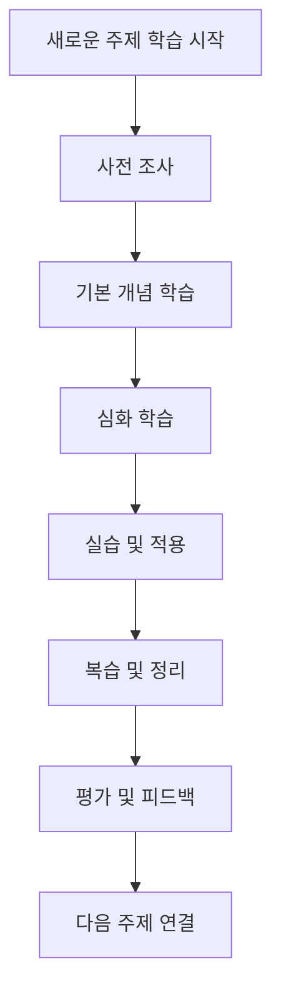

# AI 활용 학습 워크플로우 🔄

## 🎯 전체 학습 프로세스



---

## 📚 1단계: 사전 조사 워크플로우

### 🔍 정보 수집

**사용 도구**: Perplexity, ChatGPT

**프로세스**:

1. **주제 개관 파악**

    ```
    "[주제명]에 대한 전반적인 개요를 알려주세요:
    - 정의와 중요성
    - 주요 하위 개념들
    - 학습 순서 추천
    - 예상 학습 시간"
    ```

2. **학습 자료 조사**

    ```
    "[주제명] 학습을 위한 최고의 자료들을 추천해주세요:
    - 신뢰할 수 있는 온라인 강의
    - 추천 도서 (초급/중급/고급)
    - 실습할 수 있는 플랫폼
    - 관련 커뮤니티"
    ```

3. **학습 계획 수립**
    ```
    "[기간]동안 [주제명]을 마스터하기 위한 상세 계획을 세워주세요:
    - 주차별 학습 목표
    - 일일 학습 분량
    - 중간 점검 포인트
    - 최종 목표 설정"
    ```

---

## 🧠 2단계: 기본 개념 학습 워크플로우

### 📖 개념 이해

**사용 도구**: ChatGPT, Claude

**프로세스**:

1. **개념 설명 요청**

    - 기본 프롬프트 사용
    - 이해가 안 되는 부분 추가 질문
    - 비유와 예시로 재설명 요청

2. **개념 연결 매핑**

    ```
    "[개념A]와 [개념B]의 관계를 설명하고,
    마인드맵 형태로 연결 구조를 보여주세요"
    ```

3. **자가 점검**

    ```
    "[개념명]에 대해 내가 이해한 내용이 맞는지 확인해주세요:
    [내가 이해한 내용 작성]

    - 맞는 부분과 틀린 부분 구분
    - 보완해야 할 내용
    - 추가 학습 포인트"
    ```

### 📝 노트 정리

**사용 도구**: Notion AI, 템플릿

**프로세스**:

1. **강의 노트 템플릿 활용**
2. **AI로 내용 요약 및 구조화**
3. **태그 및 링크 연결**

---

## 🔬 3단계: 심화 학습 워크플로우

### 📊 깊이 있는 분석

**사용 도구**: Claude, Perplexity

**프로세스**:

1. **심화 분석 요청**

    - 심화 개념 분석 프롬프트 사용
    - 최신 동향 파악
    - 실무 적용 사례 조사

2. **비교 분석**

    ```
    "[개념A], [개념B], [개념C]를 비교 분석해주세요:
    - 각각의 특징과 장단점
    - 사용 시나리오별 적합성
    - 성능 비교 (있다면)
    - 학습 난이도 비교"
    ```

3. **문제 해결 시나리오**
    ```
    "[실제 문제 상황]이 주어졌을 때,
    [학습한 개념]을 어떻게 적용할 수 있는지
    단계별로 설명해주세요"
    ```

---

## 💻 4단계: 실습 및 적용 워크플로우

### 🛠️ 코드 실습

**사용 도구**: GitHub Copilot, Cursor

**프로세스**:

1. **기본 구현**

    ```
    "[개념]을 구현하기 위한 코드를 작성해주세요:
    - 언어: [선택한 언어]
    - 주석 포함
    - 단계별 설명
    - 테스트 케이스"
    ```

2. **코드 리뷰 및 개선**

    ```
    "다음 코드를 리뷰하고 개선점을 제안해주세요:
    [내가 작성한 코드]

    - 성능 최적화
    - 가독성 개선
    - 베스트 프랙티스 적용
    - 보안 고려사항"
    ```

3. **프로젝트 적용**
    - 학습한 개념을 실제 프로젝트에 적용
    - AI의 도움으로 구현 과정 최적화

### 🧪 실험 및 테스트

**프로세스**:

1. **가설 설정**: "만약 [조건]이라면 [결과]가 나올 것이다"
2. **실험 설계**: AI와 함께 실험 방법 설계
3. **결과 분석**: AI로 결과 데이터 분석 및 해석
4. **결론 도출**: 학습 내용과 실험 결과 연결

---

## 🔄 5단계: 복습 및 정리 워크플로우

### 📋 체계적 복습

**사용 도구**: Anki + AI, ChatGPT

**프로세스**:

1. **핵심 개념 추출**

    ```
    "[학습 내용]에서 반드시 기억해야 할
    핵심 개념 10개를 뽑아주세요:
    - 각 개념의 한 줄 정의
    - 중요한 이유
    - 관련 키워드"
    ```

2. **플래시카드 생성**

    ```
    "다음 개념들로 효과적인 플래시카드를 만들어주세요:
    [핵심 개념 리스트]

    - 질문과 답변 형식
    - 난이도별 구분
    - 힌트 포함"
    ```

3. **요약 정리**
    ```
    "[학습 주제] 전체를 다음 형식으로 요약해주세요:
    - 5분 요약 (핵심만)
    - 15분 요약 (세부 내용 포함)
    - 30분 요약 (심화 내용 포함)"
    ```

### 🔗 지식 연결

**사용 도구**: Obsidian + AI

**프로세스**:

1. **개념 맵 생성**
2. **다른 주제와 연결점 찾기**
3. **실무 적용 사례 정리**

---

## 📊 6단계: 평가 및 피드백 워크플로우

### ✅ 자가 평가

**프로세스**:

1. **이해도 점검**

    ```
    "[학습 주제]에 대한 내 이해도를 평가해주세요:

    **내가 설명한 내용:**
    [학습한 내용을 내 언어로 설명]

    **평가 요청:**
    - 정확도 (10점 만점)
    - 빠진 중요 개념
    - 잘못 이해한 부분
    - 개선 방향"
    ```

2. **실습 결과 평가**

    ```
    "내가 구현한 코드/프로젝트를 평가해주세요:
    [구현 결과]

    - 요구사항 충족도
    - 코드 품질
    - 학습 목표 달성도
    - 개선이 필요한 부분"
    ```

### 📈 학습 성과 측정

**지표**:

-   개념 이해도 (자가 평가)
-   실습 완성도
-   문제 해결 능력
-   지식 연결 능력

---

## 🔄 7단계: 다음 학습 연결 워크플로우

### 🎯 학습 연계

**프로세스**:

1. **다음 학습 주제 추천**

    ```
    "[현재 학습 주제]를 마친 후
    다음에 학습하면 좋을 주제를 추천해주세요:

    - 자연스러운 연결 주제
    - 난이도 고려한 순서
    - 학습 시너지 효과
    - 실무 적용 관점"
    ```

2. **통합 프로젝트 계획**

    ```
    "지금까지 학습한 내용들을 통합할 수 있는
    프로젝트 아이디어를 제안해주세요:

    **학습한 주제들:** [주제 리스트]
    **프로젝트 요구사항:**
    - 모든 개념이 포함될 것
    - 실무에 적용 가능할 것
    - 포트폴리오 가치가 있을 것"
    ```

---

## 🎛️ 워크플로우 커스터마이징

### 📋 개인별 최적화 요소

-   **학습 스타일**: 시각적/청각적/체험적
-   **시간 투자**: 집중형/분산형
-   **목표 설정**: 시험/프로젝트/취업
-   **기술 수준**: 초급/중급/고급

### ⚙️ 도구 조합 최적화

-   **주력 AI 도구** 선택
-   **보조 도구** 설정
-   **워크플로우** 단순화
-   **자동화 요소** 추가

---

**활용 팁:**

1. 모든 단계를 다 따를 필요는 없습니다
2. 본인의 학습 스타일에 맞게 조정하세요
3. 정기적으로 워크플로우를 평가하고 개선하세요
4. AI 도구의 한계를 인식하고 비판적으로 활용하세요

**태그**: `#workflow` `#AI` `#learning` `#study-system`
