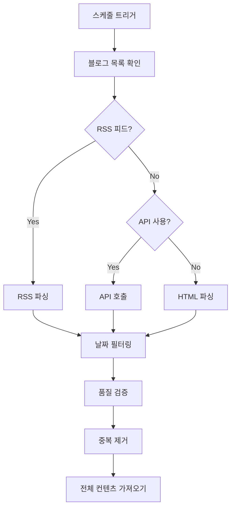

# 기술 블로그 크롤링 시스템 📰

## 📋 개요

이 시스템은 매일 자동으로 주요 기술 블로그들을 크롤링하여 최신 기술 동향을 수집하고 AI로 요약하는 자동화 도구입니다.

### 🎯 주요 기능

1. **24시간 기준 컨텐츠 수집** - 지난 24시간 동안 발행된 글만 선별적으로 크롤링
2. **다중 소스 지원** - RSS, API, HTML 파싱을 통한 다양한 블로그 지원
3. **AI 기반 요약** - OpenAI GPT-4, Anthropic Claude를 활용한 자동 요약
4. **GitHub 저장** - DB 없이 GitHub 저장소에 구조화된 데이터 보관
5. **실시간 알림** - Slack, Telegram을 통한 크롤링 결과 알림

---

## 🔍 크롤링 대상 및 선정 기준

### 📚 크롤링 대상 블로그

#### 🌍 영어 기술 블로그 (3곳)

1. **Hacker News** 🔥
   - **URL**: https://news.ycombinator.com/
   - **방식**: RSS 피드 (`https://hnrss.org/frontpage`)
   - **특징**: 개발자 커뮤니티의 핫한 소식, 높은 신뢰도
   - **수집 기준**: 스코어 100 이상, 댓글 20개 이상

2. **Dev.to** 💻
   - **URL**: https://dev.to/
   - **방식**: REST API (`https://dev.to/api/articles`)
   - **특징**: 개발자 중심 블로그 플랫폼, 다양한 기술 스택
   - **수집 기준**: 좋아요 50개 이상, 태그 3개 이상

3. **Medium Engineering** 🏢
   - **URL**: https://medium.engineering/
   - **방식**: RSS 피드
   - **특징**: 대기업 엔지니어링 팀의 심화 기술 글
   - **수집 기준**: 박수 100개 이상, 읽기 시간 5분 이상

#### 🇰🇷 한국어 기술 블로그 (3곳)

1. **카카오 기술블로그** 🎨
   - **URL**: https://tech.kakao.com/
   - **방식**: RSS 피드 (`https://tech.kakao.com/feed/`)
   - **특징**: 카카오의 대규모 서비스 운영 노하우
   - **수집 기준**: 모든 새 글 (높은 품질 보장)

2. **우아한형제들 기술블로그** 🍕
   - **URL**: https://techblog.woowahan.com/
   - **방식**: RSS 피드
   - **특징**: 배달의민족 서비스 개발 경험, 실무 중심
   - **수집 기준**: 모든 새 글 (엄선된 컨텐츠)

3. **네이버 D2** 🔍
   - **URL**: https://d2.naver.com/
   - **방식**: API (커스텀)
   - **특징**: 네이버의 기술 연구 및 오픈소스 프로젝트
   - **수집 기준**: 조회수 1000 이상, 기술 카테고리

### 📊 컨텐츠 선정 기준

#### 1. 시간 기준 📅
```python
# 24시간 기준 필터링
cutoff_date = datetime.now() - timedelta(days=1)
```

- **기본 원칙**: 지난 24시간 동안 발행된 글만 수집
- **예외 처리**: 주말이나 공휴일 고려하여 최대 48시간까지 확장 가능
- **타임존**: UTC 기준으로 통일하여 처리

#### 2. 품질 기준 ⭐
```python
def validate_article(article):
    # 최소 컨텐츠 길이
    if len(article.get('content', '')) < 100:
        return False
    
    # 기술 관련 키워드 포함 여부
    tech_keywords = ['programming', 'development', 'software', ...]
    if not any(keyword in article['content'].lower() for keyword in tech_keywords):
        return False
    
    return True
```

**필수 조건:**
- 글 제목과 URL 존재
- 컨텐츠 길이 100자 이상
- 기술 관련 키워드 1개 이상 포함

**가산점 기준:**
- 코드 스니펫 포함 (+점수)
- 이미지/다이어그램 포함 (+점수)
- 외부 링크 및 참고자료 (+점수)

#### 3. 인기도 기준 📈

**플랫폼별 기준:**
- **Hacker News**: 스코어 50+ 또는 댓글 10+
- **Dev.to**: 하트 30+ 또는 북마크 10+
- **Medium**: 박수 50+ 또는 하이라이트 5+
- **한국 블로그**: 모든 새 글 (자체 품질 관리)

#### 4. 카테고리 필터 🏷️
```python
ALLOWED_CATEGORIES = [
    'programming', 'software-development', 'web-development',
    'mobile-development', 'devops', 'cloud-computing',
    'machine-learning', 'artificial-intelligence', 'data-science',
    'cybersecurity', 'blockchain', 'open-source'
]
```

---

## 🔧 크롤링 프로세스

### 1. 데이터 수집 단계



#### A. RSS 피드 크롤링
```python
async def crawl_from_rss(blog_name, config, cutoff_date):
    # 1. RSS 피드 요청
    async with session.get(config["rss_feed"]) as response:
        rss_content = await response.text()
    
    # 2. 파싱 및 필터링
    feed = feedparser.parse(rss_content)
    for entry in feed.entries:
        if parse_date(entry.published) > cutoff_date:
            # 처리 로직
```

#### B. API 기반 크롤링
```python
async def crawl_from_api(blog_name, config, cutoff_date):
    # 1. API 호출 (페이지네이션 고려)
    url = f"{config['api_endpoint']}?per_page=50&since={cutoff_date}"
    
    # 2. 응답 데이터 처리
    async with session.get(url) as response:
        data = await response.json()
        # 데이터 변환 및 필터링
```

#### C. HTML 파싱 크롤링
```python
async def crawl_from_html(blog_name, config, cutoff_date):
    # 1. 메인 페이지 로드
    async with session.get(config["url"]) as response:
        html = await response.text()
    
    # 2. BeautifulSoup으로 파싱
    soup = BeautifulSoup(html, 'html.parser')
    
    # 3. 셀렉터 기반 데이터 추출
    articles = soup.select(config["selectors"]["article"])
```

### 2. 데이터 검증 단계

```python
def validate_articles(articles, cutoff_date):
    validated = []
    for article in articles:
        # 필수 필드 검증
        if not article.get('title') or not article.get('url'):
            continue
            
        # 컨텐츠 길이 검증
        if len(article.get('content', '')) < 100:
            continue
            
        # 날짜 검증
        published_date = parse_date(article.get('published_date'))
        if published_date < cutoff_date:
            continue
            
        validated.append(article)
    
    return validated
```

### 3. AI 요약 단계

```python
async def summarize_article(article):
    prompt = f"""
    다음 기술 블로그 글을 200자 이내로 요약해주세요:
    
    제목: {article['title']}
    내용: {article['content'][:2000]}
    
    요약 시 다음 사항을 포함해주세요:
    1. 핵심 기술이나 개념
    2. 주요 내용 또는 결론
    3. 실무 적용 가능성
    """
    
    # OpenAI 또는 Claude API 호출
    summary = await ai_client.generate_summary(prompt)
    return summary
```

---

## 💾 데이터 저장 구조

### GitHub 저장 방식

DB를 사용하지 않고 GitHub 저장소에 구조화된 JSON 파일로 저장합니다.

```
research/trends/
├── index.json                 # 전체 인덱스
├── 2024-01-15/               # 날짜별 폴더
│   ├── crawling_results.json # 종합 결과
│   ├── Hacker_News.json      # 블로그별 개별 파일
│   ├── Dev.to.json
│   ├── Medium_Engineering.json
│   ├── 카카오_기술블로그.json
│   ├── 우아한형제들_기술블로그.json
│   └── 네이버_D2.json
├── 2024-01-16/
└── ...
```

### 📄 파일 구조

#### 1. index.json (전체 인덱스)
```json
{
  "crawling_history": [
    {
      "date": "2024-01-15",
      "total_articles": 23,
      "blogs_crawled": 6,
      "trending_topics": 8,
      "timestamp": "2024-01-15T09:00:00Z"
    }
  ],
  "statistics": {
    "total_crawls": 30,
    "total_articles_collected": 687,
    "last_updated": "2024-01-15T09:00:00Z",
    "average_articles_per_day": 22.9
  }
}
```

#### 2. crawling_results.json (일일 종합)
```json
{
  "date": "2024-01-15",
  "total_articles": 23,
  "blogs": {
    "Hacker News": {
      "source_url": "https://news.ycombinator.com/",
      "articles": [...],
      "count": 8
    }
  },
  "trending_topics": [
    {
      "topic": "AI/Machine Learning",
      "count": 12,
      "description": "AI 모델 최적화 및 실무 적용 사례"
    }
  ],
  "summary": "오늘은 AI/ML 관련 글이 많이 발행되었으며...",
  "metadata": {
    "crawl_start_time": "2024-01-15T09:00:00Z",
    "crawl_duration": "00:05:23",
    "errors": []
  }
}
```

#### 3. 개별 블로그 파일 (예: Hacker_News.json)
```json
{
  "blog_name": "Hacker News",
  "crawl_date": "2024-01-15",
  "articles": [
    {
      "title": "Building Scalable AI Systems",
      "url": "https://example.com/article1",
      "published_date": "2024-01-15T08:30:00Z",
      "author": "John Doe",
      "summary": "RSS에서 가져온 요약",
      "content": "전체 글 내용...",
      "ai_summary": "AI가 생성한 200자 요약",
      "keywords": ["ai", "scalability", "system-design"],
      "metrics": {
        "score": 156,
        "comments": 42,
        "word_count": 1250
      },
      "language": "en",
      "source": "Hacker News"
    }
  ],
  "metadata": {
    "total_articles": 8,
    "crawl_method": "rss",
    "processing_time": "00:01:15"
  }
}
```

---

## 🚀 사용법

### 1. 로컬 테스트 실행

```bash
# 1. 의존성 설치
pip install -r automation/crawler/requirements.txt

# 2. 환경 변수 설정
export OPENAI_API_KEY="your-api-key"
export CLAUDE_API_KEY="your-api-key"

# 3. 테스트 실행
cd automation/crawler
python main.py
```

### 2. 수동 크롤링 실행

```python
import asyncio
from crawler import TechBlogCrawler
from config import BLOG_SOURCES

async def manual_crawl():
    async with TechBlogCrawler() as crawler:
        # 특정 블로그만 크롤링
        blog_config = BLOG_SOURCES["Hacker News"]
        articles = await crawler.crawl_blog("Hacker News", blog_config)
        print(f"수집된 글: {len(articles)}개")

asyncio.run(manual_crawl())
```

### 3. 커스텀 블로그 추가

```python
# config.py에 추가
BLOG_SOURCES["새로운 블로그"] = {
    "url": "https://example-tech-blog.com",
    "type": "rss",  # 또는 "api", "html"
    "rss_feed": "https://example-tech-blog.com/feed",
    "selectors": {
        "title": ".post-title",
        "content": ".post-content",
        "author": ".author-name",
        "date": ".publish-date"
    },
    "language": "ko",
    "description": "새로운 기술 블로그"
}
```

### 4. 크롤링 스케줄 변경

```yaml
# .github/workflows/daily-crawler.yml
on:
  schedule:
    # 매일 오후 2시 (UTC 5시)로 변경
    - cron: '0 5 * * *'
    # 주 3회 (월, 수, 금)로 변경
    - cron: '0 0 * * 1,3,5'
```

---

## 📊 모니터링 및 분석

### 1. 크롤링 성공률 확인

```python
# 최근 7일간 성공률 계산
def calculate_success_rate():
    with open('research/trends/index.json') as f:
        data = json.load(f)
    
    recent_crawls = data['crawling_history'][:7]
    total_attempts = len(recent_crawls) * 6  # 6개 블로그
    successful_crawls = sum(entry['blogs_crawled'] for entry in recent_crawls)
    
    success_rate = (successful_crawls / total_attempts) * 100
    print(f"최근 7일 크롤링 성공률: {success_rate:.1f}%")
```

### 2. 트렌드 분석

```python
# 주간 트렌딩 토픽 분석
def analyze_weekly_trends():
    trend_counts = {}
    
    # 최근 7일 데이터 분석
    for date_folder in os.listdir('research/trends/'):
        if not date_folder.startswith('2024'):
            continue
            
        with open(f'research/trends/{date_folder}/crawling_results.json') as f:
            data = json.load(f)
            
        for topic in data.get('trending_topics', []):
            topic_name = topic['topic']
            trend_counts[topic_name] = trend_counts.get(topic_name, 0) + topic['count']
    
    # 상위 10개 트렌드 출력
    sorted_trends = sorted(trend_counts.items(), key=lambda x: x[1], reverse=True)[:10]
    print("주간 트렌딩 토픽:")
    for topic, count in sorted_trends:
        print(f"  {topic}: {count}회 언급")
```

---

## 🔧 트러블슈팅

### 자주 발생하는 문제들

#### 1. RSS 피드 접근 실패
```python
# 해결 방법: User-Agent 헤더 추가
headers = {
    'User-Agent': 'Mozilla/5.0 (compatible; TechCrawler/1.0)',
    'Accept': 'application/rss+xml, application/xml, text/xml'
}
```

#### 2. API 율제한 (Rate Limiting)
```python
# 해결 방법: 지수 백오프와 재시도
import asyncio
from tenacity import retry, stop_after_attempt, wait_exponential

@retry(stop=stop_after_attempt(3), wait=wait_exponential(multiplier=1, min=4, max=10))
async def api_request_with_retry(url):
    async with session.get(url) as response:
        if response.status == 429:  # Too Many Requests
            raise Exception("Rate limited")
        return await response.json()
```

#### 3. 컨텐츠 파싱 실패
```python
# 해결 방법: 다중 셀렉터 사용
def extract_content_safely(soup, selectors):
    for selector in selectors:
        try:
            element = soup.select_one(selector)
            if element and element.get_text(strip=True):
                return element.get_text(strip=True)
        except Exception:
            continue
    return ""
```

### 로그 확인 방법

```bash
# GitHub Actions 로그
# Repository > Actions > Daily Tech Blog Crawler

# 로컬 로그 파일
tail -f automation/logs/crawler.log

# 크롤링 통계 확인
cat research/trends/index.json | jq '.statistics'
```

---

## 📈 성능 최적화

### 1. 병렬 처리
```python
# 블로그별 동시 크롤링
async def crawl_all_blogs_parallel():
    tasks = []
    for blog_name, config in BLOG_SOURCES.items():
        task = asyncio.create_task(crawler.crawl_blog(blog_name, config))
        tasks.append(task)
    
    results = await asyncio.gather(*tasks, return_exceptions=True)
```

### 2. 캐싱 전략
```python
# 컨텐츠 캐싱으로 중복 요청 방지
def get_cached_content(url, cache_duration=3600):
    cache_key = hashlib.md5(url.encode()).hexdigest()
    cache_file = Path(f"cache/{cache_key}.txt")
    
    if cache_file.exists():
        if time.time() - cache_file.stat().st_mtime < cache_duration:
            return cache_file.read_text()
    
    return None
```

### 3. 메모리 관리
```python
# 대용량 데이터 스트리밍 처리
async def process_large_feed(feed_url):
    async with session.get(feed_url) as response:
        async for chunk in response.content.iter_chunked(8192):
            # 청크 단위로 처리
            process_chunk(chunk)
```

---

**마지막 업데이트**: 2024년 현재  
**버전**: 2.0.0  
**라이선스**: MIT 