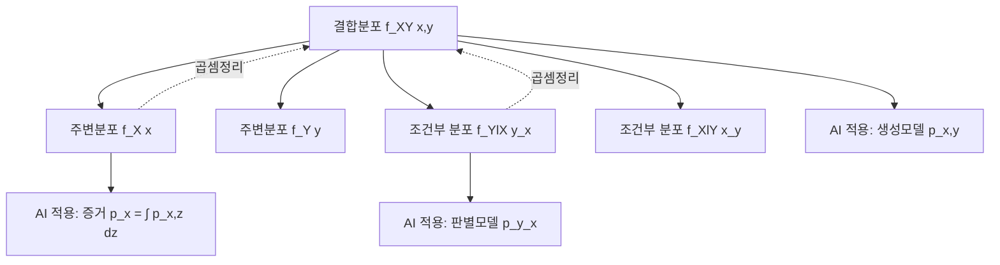

# 10. AI를 위한 수학의 응용: 다변량 확률분포(1) — 결합·주변·조건부 분포

## 🔗 선수 지식 (Prerequisites)
- [ ] **필수**: 단일 확률변수의 확률질량함수(PMF)·확률밀도함수(PDF) 정의 - 이해 완료?
- [ ] **필수**: 이중적분 및 이중합산의 계산
- [ ] **권장**: 조건부 확률 $P(A|B) = P(A\cap B)/P(B)$ 와 확률의 곱셈정리
- **관련 단원**: [9강. 단변량 확률분포](../AI를위한수학의응용/9강.md) → 11강. 다변량 확률분포(2) (독립성·공분산·상관계수)

---

## 학습 목표
1. 다변량 확률분포에서 결합분포의 개념을 이해하고 설명할 수 있다.
2. 다변량 확률분포에서 주변분포, 조건부 분포를 이해하고 결합분포와 어떠한 관계에 있는지 설명할 수 있다.
3. 파이썬을 활용하여 결합분포, 주변분포, 조건부 분포와 관련된 이론적 개념을 구현하고 실증할 수 있다.

---

## 🧠 메타인지 체크 (학습 전/후 자기 평가)

### 학습 전 자기 평가
| 소주제 | 자신감 (1-5) |
| :--- | :--- |
| 결합 PMF/PDF의 정의와 정규화 조건 | |
| 주변분포 도출(합산/적분) | |
| 조건부 분포와 곱셈정리 | |

### 학습 후 교정 (학습 완료 후 작성)
| 소주제 | 학습 전 | 학습 후 | 실제 정답률 | 과신/과소 여부 |
| :--- | :--- | :--- | :--- | :--- |
| 결합 PMF/PDF의 정의와 정규화 조건 | | | | |
| 주변분포 도출(합산/적분) | | | | |
| 조건부 분포와 곱셈정리 | | | | |

> **활용법**: 학습 전 1분 → 자신감 기입, 학습 후 1분 → 나머지 기입. "과신" 영역이 실제 취약점.

---

## 📝 요약 (Summary)
1. **결합분포** 🔴: 결합분포는 두 개 이상의 확률변수가 동시에 특정 값을 가질 가능성을 규정한다.
2. **주변분포** 🔴: 주변분포는 결합분포에서 다른 변수를 합산(이산형) 또는 적분(연속형)하여 소거함으로써 개별 변수의 확률 패턴을 나타낸다.
3. **조건부 분포** 🔴: 조건부 분포는 한 확률변수의 값이 주어졌을 때 다른 확률변수가 가지는 확률분포를 나타내며, 결합분포를 주변분포로 나눔으로써 구할 수 있다.
4. **곱셈정리와의 연관성** 🟡: 결합분포, 주변분포, 조건부 분포는 확률의 곱셈정리 $f(x,y)=f_{X}(x)\,f_{Y|X}(y|x)$ 와 밀접하게 연관되어 있다.

---

## 📐 핵심 수식 (Key Formulas)

| 수식명 | 수식 | 의미 |
| :--- | :--- | :--- |
| **결합 PMF** | $p_{X,Y}(x,y)=P(X=x, Y=y)$ | 이산형에서 두 변수가 동시에 특정 값을 가질 확률 |
| **결합 PDF 정규화** | $\iint_{\mathbb{R}^2} f_{X,Y}(x,y)\,dx\,dy = 1$ | 연속형 결합 밀도의 전 영역 적분은 1 |
| **이산 주변 PMF** | $p_{X}(x)=\sum_{y} p_{X,Y}(x,y)$ | $Y$를 모두 합산하여 $X$만의 분포를 추출 |
| **연속 주변 PDF** | $f_{X}(x)=\int_{-\infty}^{\infty} f_{X,Y}(x,y)\,dy$ | $Y$를 적분으로 소거하여 $X$만의 밀도를 추출 |
| **조건부 PMF/PDF** | $f_{Y\mid X}(y\mid x)=\dfrac{f_{X,Y}(x,y)}{f_{X}(x)}$ | $X=x$ 가 주어졌을 때 $Y$ 의 분포 (단, $f_X(x)>0$) |
| **곱셈정리** | $f_{X,Y}(x,y)=f_{X}(x)\,f_{Y\mid X}(y\mid x)$ | 결합 = 주변 × 조건부 |
| **독립의 정의** | $f_{X,Y}(x,y)=f_{X}(x)\,f_{Y}(y) \iff X\perp Y$ | 결합이 두 주변의 **곱**으로 분해될 때(↔ 조건부 $f_{Y\mid X}=f_Y$). 곱셈정리는 항상 성립하나 이 등식은 독립일 때만 성립 — 11강 공분산·상관과 직결 |

### 주요 정리/정의

**결합 확률밀도함수의 정의**
$$
f_{X,Y}(x,y) \ge 0,\qquad \iint_{\mathbb{R}^2} f_{X,Y}(x,y)\,dx\,dy = 1
$$
$$
P\big((X,Y)\in A\big)=\iint_{A} f_{X,Y}(x,y)\,dx\,dy
$$
> **직관적 해석**: $(x,y)$ 근방의 작은 영역 $dx\,dy$ 에 $(X,Y)$ 가 떨어질 확률 ≈ $f_{X,Y}(x,y)\,dx\,dy$. 즉 2차원 평면 위의 "확률 밀도 지도"이다.
> **AI 적용**: 두 입력 특성(feature)의 공동 분포를 모델링 — 예) 가우시안 혼합 모델(GMM), 변분 오토인코더(VAE)의 잠재공간 분포.

**주변화(Marginalization)**
$$
f_{X}(x)=\int_{-\infty}^{\infty} f_{X,Y}(x,y)\,dy,\qquad p_{X}(x)=\sum_{y} p_{X,Y}(x,y)
$$
> **직관적 해석**: $Y$ 축 방향으로 "납작하게 눌러" $X$ 축 위로 투영한 그림자가 곧 $X$ 의 주변분포.
> **AI 적용**: 베이지안 추론에서 잠재변수를 적분하여 관측 데이터의 증거(evidence) $p(x)=\int p(x,z)\,dz$ 를 계산.

**조건부 분포와 곱셈정리**
$$
f_{Y\mid X}(y\mid x)=\frac{f_{X,Y}(x,y)}{f_{X}(x)} \quad\Longleftrightarrow\quad f_{X,Y}(x,y)=f_{X}(x)\,f_{Y\mid X}(y\mid x)
$$
> **직관적 해석**: $X=x$ 라는 "한 줄" 위에서 결합분포를 다시 정규화한 것이 조건부 분포이다.
> **AI 적용**: 분류기 $p(y|x)$ 자체가 조건부 분포. 생성모델은 결합 $p(x,y)$ 를, 판별모델은 조건부 $p(y|x)$ 를 직접 학습.

---

## 📊 개념 시각화 (Visual Guide)

### 개념 관계도


### 핵심 도식 — 세 분포의 관계

| 입력 | 연산 | 출력 | AI 적용 |
| :--- | :--- | :--- | :--- |
| 결합 $f_{X,Y}(x,y)$ | $Y$ 에 대해 합/적분 | 주변 $f_X(x)$ | VAE의 ELBO 유도 시 잠재 $z$ 주변화 |
| 결합 $f_{X,Y}(x,y)$ | 주변 $f_X(x)$ 로 나눔 | 조건부 $f_{Y|X}(y|x)$ | 회귀·분류기의 예측 분포 |
| 주변 $f_X(x)$ × 조건부 $f_{Y|X}(y|x)$ | 곱 | 결합 $f_{X,Y}(x,y)$ | 베이즈 정리·확률적 그래프 모델 |

---

## ✏️ 심화 학습 (Study Subject)

### 1. 가상 시나리오: "어떤 개념을, 언제 사용해야 할까?"
- **상황**: 사용자의 키 $X$ 와 몸무게 $Y$ 데이터를 사용해 추천 시스템에서 "키가 175cm인 사용자의 평균 몸무게"를 예측해야 한다.
- **문제**: 우리는 전체 데이터에서 $(X,Y)$ 의 결합분포를 추정할 수 있다고 하자. 이때 $X=175$ 라는 특정 값에서 $Y$ 의 기댓값을 구하려면 결합분포만으로는 부족하다. 어떤 분포를 사용해야 하는가?
- **해결**: 결합 PDF $f_{X,Y}(x,y)$ 로부터 주변 $f_X(x)=\int f_{X,Y}(x,y)\,dy$ 를 구하고, 조건부 PDF
$$
f_{Y\mid X}(y\mid 175)=\frac{f_{X,Y}(175,y)}{f_X(175)}
$$
를 얻은 뒤 $E[Y\mid X=175]=\int y\, f_{Y\mid X}(y\mid 175)\,dy$ 로 계산한다.
- **AI 학습 포인트**: "회귀 모델 $\hat{y}=g(x)$ 는 본질적으로 $E[Y|X=x]$ 의 추정인가? 만약 그렇다면, MSE 손실로 학습한 모델이 조건부 기댓값에 수렴하는 이유를 수학적으로 설명해줘."

### 1-1. 손으로 푸는 수치 예제 — 베이즈 정리와 결합·조건부 (Worked Example)

결합·주변·조건부 분포가 한데 모이는 가장 중요한 결과가 **베이즈 정리**다. 질병 검사 예시로 숫자를 끝까지 따라가 보자.

- 사전(유병률): $P(D) = 0.01$ (인구의 1%가 질병 $D$ 보유), 따라서 $P(D^c) = 0.99$.
- 우도(검사 성능): 환자에게 양성이 나올 민감도 $P(+\mid D) = 0.99$, 건강한 사람에게 양성이 나올 위양성률 $P(+\mid D^c) = 0.05$.
- 질문: 양성 판정을 받았을 때 실제로 질병일 확률 $P(D\mid +)$ 는?

**1단계 — 결합확률(곱셈정리):**
$$
P(+, D) = P(D)\,P(+\mid D) = 0.01 \times 0.99 = 0.0099
$$
$$
P(+, D^c) = P(D^c)\,P(+\mid D^c) = 0.99 \times 0.05 = 0.0495
$$

**2단계 — 주변확률(전확률 법칙, 곧 주변화):**
$$
P(+) = P(+, D) + P(+, D^c) = 0.0099 + 0.0495 = 0.0594
$$

**3단계 — 조건부확률(결합 ÷ 주변):**
$$
P(D \mid +) = \frac{P(+, D)}{P(+)} = \frac{0.0099}{0.0594} \approx 0.167
$$

- 해석: 검사 민감도가 99%로 매우 높은데도, 양성일 때 실제 질병일 확률은 **약 16.7%에 불과**하다. 질병 자체가 드물기(사전확률 1%) 때문이다. 양성자의 다수는 99%의 건강한 집단에서 나온 거짓양성이다. 이산 확률에서의 "결합 = 주변 × 조건부"가 그대로 적용된 사례다.

> ⚠️ **흔한 오해 모음**
> - **$P(A\mid B) \neq P(B\mid A)$**: 위 예에서 $P(+\mid D)=0.99$와 $P(D\mid +)\approx 0.167$은 전혀 다르다. 조건의 방향을 뒤집으면 안 되며, 둘을 잇는 것이 베이즈 정리다.
> - **기저율 무시(base-rate fallacy)**: 검사 정확도(민감도)만 보고 "양성이면 거의 확실히 환자"라고 판단하는 오류. 사전확률(유병률)을 반드시 곱해야 한다.
> - **독립 ≠ 배반(상호배타)**: 결합분포가 두 주변분포의 곱 $f_{X,Y}=f_X f_Y$ 로 분해되는 것은 **독립**일 때다. 반면 두 사건이 배반이면 $P(A\cap B)=0$ 으로 오히려 강하게 종속이다. 둘은 정반대 개념이다.
> - **조건부 ≠ 단면 그대로**: $f_{Y\mid X}(y\mid x_0) \neq f_{X,Y}(x_0, y)$. 단면을 $f_X(x_0)$ 로 나눠 적분이 1이 되도록 **재정규화**해야 비로소 분포가 된다.

### 2. 관점별 비교 및 오개념 분석
- **핵심 비교**: 주변분포 vs 조건부 분포 — 둘 다 "한 변수만의 분포"처럼 보이지만 의미가 다르다.

| 구분 | 주변분포 $f_X(x)$ | 조건부 분포 $f_{Y\mid X}(y\mid x_0)$ |
| :--- | :--- | :--- |
| 정의 | $Y$ 를 모두 합/적분하여 소거 | $X=x_0$ 으로 고정한 단면을 재정규화 |
| 정규화 분모 | 1 (이미 1) | $f_X(x_0)$ |
| 의미 | "다른 변수는 무엇이든 상관없이" | "다른 변수가 특정 값일 때만" |

- **오개념 분석**:
    - **오개념 1**: "$f_{Y|X}(y|x) = f_{X,Y}(x,y)$ 이다. 어차피 $x$ 가 정해졌으니 같은 함수다."
    - **분석**: 결합 PDF $f_{X,Y}(x,y)$ 는 $X=x$ 단면 위에서 적분해도 1이 되지 않는다(정확히는 $\int f_{X,Y}(x,y)\,dy = f_X(x) \neq 1$ 이 일반적). 조건부 분포는 이 단면을 $f_X(x)$ 로 나눠 다시 적분이 1이 되도록 정규화한 것이다. **나눠주는 정규화 단계가 본질**.
    - **오개념 2**: "이산형은 $P(Y=y|X=x)=P(X=x,Y=y)$ 가 성립한다, 둘 다 확률이니까."
    - **분석**: $P(Y=y|X=x)=P(X=x,Y=y)/P(X=x)$ 이며, $P(X=x)\le 1$ 이므로 일반적으로 $P(Y=y|X=x)\ge P(X=x,Y=y)$. 두 값이 일치하려면 $P(X=x)=1$ 이어야 한다.
- **AI 학습 포인트**: "내가 이해한 결합/주변/조건부 관계를 베이즈 정리 $p(z|x)=p(x|z)p(z)/p(x)$ 의 각 항으로 매핑하고, VAE의 ELBO 유도에서 어느 단계에 등장하는지 알려줘."

### 3. 워크드 예제: 나이브 베이즈를 숫자로 풀어 결합·주변·조건부 확인하기

분류기 $p(C\mid x_1,\dots,x_d)$ 는 조건부 분포이며, 베이즈 정리로 풀면 이 장의 세 분포가 모두 동원된다(일반 공식과 분포 선택 논의는 아래 AI 연결고리의 「나이브 베이즈로 보는 결합·조건부의 실전 분해」 참조). 여기서는 작은 숫자로 직접 계산해 본다.

두 이진 특징 $x_1,x_2$ 와 클래스 $C\in\{0,1\}$ 에서 클래스 조건부 독립을 가정하자. $p(C{=}1)=0.5$, $p(x_1{=}1\mid C{=}1)=0.8$, $p(x_2{=}1\mid C{=}1)=0.6$, $p(x_1{=}1\mid C{=}0)=0.3$, $p(x_2{=}1\mid C{=}0)=0.4$ 일 때, 관측 $(x_1{=}1, x_2{=}1)$ 의 **비정규화 결합점수**는

$$\text{class }1:\ p(C{=}1)\prod_k p(x_k\mid C{=}1)=0.5\times0.8\times0.6=0.24,\qquad \text{class }0:\ 0.5\times0.3\times0.4=0.06$$

정규화하면 $p(C{=}1\mid x)=0.24/(0.24+0.06)=0.8$ 이다. 여기서 분자는 **결합** $p(C,x)$, 분모 $p(x)=0.24+0.06=0.30$ 은 두 클래스에 대한 **주변화**(전확률 법칙), 결과는 **조건부** $p(C\mid x)$ 다. 분류 한 번에 세 분포가 그대로 등장한다.

- **AI 학습 포인트**: "다중 분류의 출력 소프트맥스가 결합분포가 아니라 **조건부 범주형 분포** $p(y\mid x)$ 를 추정하는 것임을 설명하고, 판별모델(조건부 $p(y\mid x)$ 만 학습)과 생성모델(결합 $p(x,y)$ 학습)이 이 장의 결합·조건부 구분과 어떻게 대응하는지 정리해 줘."

---

## ❓ 연습 문제 및 해설

> **블룸 인지 수준 범례**: [기억] 정의·나열 → [이해] 설명·비교 → [적용] 계산·구현 → [분석] 구별·디버그 → [평가] 판단·비평 → [창조] 설계·제안

### 📝 문제

**1. ⭐ [기억] 📌 결합 확률밀도함수가 만족해야 하는 조건으로 옳은 것은?(#prob-1)**
   > ① $f_{X,Y}(x,y) \le 0$ 이며 전 영역 적분이 1
   > ② $f_{X,Y}(x,y) \ge 0$ 이며 전 영역 적분이 1
   > ③ $f_{X,Y}(x,y) \ge 0$ 이며 전 영역 적분이 $\infty$
   > ④ $f_{X,Y}(x,y)$ 는 항상 1 이하이며 전 영역 적분이 1

<br>

**2. ⭐ [기억] 📌 두 이산 확률변수 $X,Y$ 의 결합 PMF로부터 $X$ 의 주변 PMF를 구하는 식으로 옳은 것은?(#prob-2)**
   > ① $p_X(x)=\sum_y p_{X,Y}(x,y)$
   > ② $p_X(x)=\sum_x p_{X,Y}(x,y)$
   > ③ $p_X(x)=\prod_y p_{X,Y}(x,y)$
   > ④ $p_X(x)=p_{X,Y}(x,y)/p_Y(y)$

<br>

**3. ⭐⭐ [이해] 📌 다음 <보기> 중 옳은 것을 모두 고르시오.(#prob-3)**
   > <보기>
   >
   > 가. 조건부 분포 $f_{Y|X}(y|x)$ 는 $f_{X,Y}(x,y)/f_X(x)$ 이다.
   > 나. 주변분포는 결합분포에서 다른 변수를 적분(또는 합산)하여 얻는다.
   > 다. 결합분포는 항상 두 주변분포의 곱으로 표현된다.

   > ① 가, 나
   > ② 나, 다
   > ③ 가, 다
   > ④ 가, 나, 다

<br>

**4. ⭐⭐ [적용] 📌 두 주사위를 던져 나온 눈의 합을 $X$, 두 눈의 차의 절댓값을 $Y$ 라 하자. $P(X=4, Y=2)$ 의 값은?(#prob-4)**
   > ① $1/36$
   > ② $2/36$
   > ③ $3/36$
   > ④ $4/36$

<br>

**5. ⭐⭐ [적용] 📌 $f_{X,Y}(x,y)=c(x+y),\ 0\le x \le 1,\ 0\le y \le 1$ 가 결합 PDF이기 위한 상수 $c$ 의 값은?(#prob-5)**
   > ① $1/2$
   > ② $1$
   > ③ $3/2$
   > ④ $2$

<br>

**6. ⭐⭐ [적용] 📌 위 문제(문제 5)의 결합 PDF에서 $X$ 의 주변 PDF $f_X(x)$ (단, $0\le x \le 1$) 는?(#prob-6)**
   > ① $x+1/2$
   > ② $x+1$
   > ③ $x$
   > ④ $1/2$

<br>

**7. ⭐⭐⭐ [분석] 📌 동일한 결합 PDF에서 $X=1/2$ 가 주어졌을 때 $Y$ 의 조건부 PDF $f_{Y|X}(y|1/2)$ (단, $0\le y \le 1$) 는?(#prob-7)**
   > ① $y+1/2$
   > ② $(y+1/2)/(1)$
   > ③ $y+1/2$ 를 $1$ 로 나눈 값과 동일하나 분모는 $f_X(1/2)=1$
   > ④ $y+1/2$  (분모 $f_X(1/2)=1$ 이므로 분자와 동일)

<br>

**8. ⭐⭐ [이해] 📌 확률의 곱셈정리를 결합 PDF로 표현한 것으로 옳은 것은?(#prob-8)**
   > ① $f_{X,Y}(x,y)=f_X(x)+f_{Y|X}(y|x)$
   > ② $f_{X,Y}(x,y)=f_X(x)\,f_{Y|X}(y|x)$
   > ③ $f_{X,Y}(x,y)=f_X(x)\,f_Y(y)$ (항상 성립)
   > ④ $f_{X,Y}(x,y)=f_{Y|X}(y|x)/f_X(x)$

<br>

**9. ⭐⭐⭐ [적용/분석] 📌 $f_{X,Y}(x,y)=2,\ 0\le y \le x \le 1$ 인 결합 PDF에서 $X$ 의 주변 PDF는?(#prob-9)**
   > ① $f_X(x)=2x,\ 0\le x\le 1$
   > ② $f_X(x)=x,\ 0\le x\le 1$
   > ③ $f_X(x)=2(1-x),\ 0\le x\le 1$
   > ④ $f_X(x)=1,\ 0\le x\le 1$

<br>

**10. ⭐⭐⭐ [평가/창조] 📌 위 문제 9의 결합 PDF에서 $X=x$ 가 주어졌을 때 $Y$ 의 조건부 분포는 어떤 분포인가? 또한 그 결과가 의미하는 바를 적분 영역 $0\le y \le x$ 와 연결하여 설명하시오.(#prob-10)**

---

### 🔑 정답 및 해설 (먼저 풀어본 후 펼치기)

<details>
<summary>정답 보기 (클릭)</summary>

1. ②
2. ①
3. ①
4. ②
5. ②
6. ①
7. ④
8. ②
9. ①
10. $Y\mid X=x \sim U(0,x)$ (균등분포). 풀이는 해설 참조.

</details>

<details>
<summary>해설 보기 (클릭)</summary>

<a id="prob-1"></a>
**1. ⭐ [기억] 결합 PDF의 조건**
> **정답: ② $f_{X,Y}(x,y) \ge 0$ 이며 전 영역 적분이 1**
> **해설**: 확률밀도는 항상 비음수이며, 전 영역 이중적분 값이 1이 되어야 확률 공리의 정규화 조건을 만족한다. ④는 함정 — PDF는 1을 초과할 수도 있다(예: $U(0, 0.5)$ 의 밀도는 2).

<a id="prob-2"></a>
**2. ⭐ [기억] 주변 PMF**
> **정답: ① $p_X(x)=\sum_y p_{X,Y}(x,y)$**
> **해설**: 합산되는 인덱스는 "소거하고 싶은 변수($Y$)" 이다. ②는 $X$ 에 대해 합산하므로 부적절.

<a id="prob-3"></a>
**3. ⭐⭐ [이해] 결합·주변·조건부 관계**
> **정답: ① 가, 나**
> **해설**: 다. 결합분포가 주변분포들의 곱 $f_{X,Y}(x,y)=f_X(x)f_Y(y)$ 로 표현되는 것은 **$X,Y$ 가 독립일 때만** 성립한다. 일반적인 경우는 곱셈정리 $f_{X,Y}=f_X\cdot f_{Y|X}$ 가 옳다.

<a id="prob-4"></a>
**4. ⭐⭐ [적용] 주사위 결합 PMF**
> **정답: ② $2/36$**
> **해설**: 두 눈을 $(a,b)$ 라 하면 $a+b=4,\ |a-b|=2$ 를 만족하는 경우는 $(1,3),(3,1)$ 의 2가지. 전체 36개 결과 중 2개이므로 $2/36=1/18$.

<a id="prob-5"></a>
**5. ⭐⭐ [적용] 정규화 상수**
> **정답: ② $c=1$**
> **해설**: $\int_0^1\int_0^1 c(x+y)\,dx\,dy = c\int_0^1 (1/2 + y)\,dy = c(1/2+1/2)=c$. 이 값이 1이어야 하므로 $c=1$.

<a id="prob-6"></a>
**6. ⭐⭐ [적용] 주변 PDF**
> **정답: ① $f_X(x)=x+1/2$**
> **해설**: $f_X(x)=\int_0^1 (x+y)\,dy = x\cdot 1 + 1/2 = x+1/2$, $0\le x\le 1$. 검증: $\int_0^1 (x+1/2)\,dx = 1/2+1/2 = 1$ ✓.

<a id="prob-7"></a>
**7. ⭐⭐⭐ [분석] 조건부 PDF**
> **정답: ④ $y+1/2$**
> **해설**: $f_X(1/2)=1/2+1/2=1$. 따라서 $f_{Y|X}(y|1/2)=f_{X,Y}(1/2,y)/f_X(1/2)=(1/2+y)/1=y+1/2$, $0\le y \le 1$. 검증: $\int_0^1 (y+1/2)\,dy = 1/2+1/2=1$ ✓.

<a id="prob-8"></a>
**8. ⭐⭐ [이해] 곱셈정리**
> **정답: ② $f_{X,Y}(x,y)=f_X(x)\,f_{Y|X}(y|x)$**
> **해설**: 조건부 PDF의 정의 $f_{Y|X}=f_{X,Y}/f_X$ 의 양변에 $f_X$ 를 곱한 식. ③ 은 독립일 때만 성립.

<a id="prob-9"></a>
**9. ⭐⭐⭐ [적용/분석] 삼각형 영역의 주변 PDF**
> **정답: ① $f_X(x)=2x,\ 0\le x \le 1$**
> **해설**: 영역은 $0\le y \le x \le 1$ 인 삼각형. $X=x$ 를 고정하면 $y\in[0,x]$ 이므로
> $f_X(x)=\int_0^x 2\,dy = 2x$.
> 검증: $\int_0^1 2x\,dx = 1$ ✓. 결합 PDF 값이 $2$ 인 이유도 영역 넓이가 $1/2$ 이므로 $2\cdot 1/2 = 1$ 로 정규화되기 때문.

<a id="prob-10"></a>
**10. ⭐⭐⭐ [평가/창조] 조건부 분포 식별**
> **정답: $Y\mid X=x \sim U(0,x)$ — 구간 $[0,x]$ 위의 균등분포**
> **해설**:
> $f_{Y|X}(y|x)=\dfrac{f_{X,Y}(x,y)}{f_X(x)} = \dfrac{2}{2x} = \dfrac{1}{x},\quad 0\le y \le x$.
> 이는 길이 $x$ 의 구간 $[0,x]$ 위에서 일정한 밀도 $1/x$ 를 갖는 균등분포 $U(0,x)$ 이다.
> **의미**: $X=x$ 가 고정되었다는 것은 점이 수직선 $X=x$ 위에 놓였다는 뜻이고, 원래 영역의 제약 $0\le y \le x$ 가 그대로 적용되어 $Y$ 는 그 구간 위에서 균등하게 분포한다. 결합 PDF가 영역 내에서 상수이기 때문에 단면도 균등하게 나타나는 것이다.

</details>

---

## ✅ O/X 확인문제 (총 20문항)

**1.** 결합 확률밀도함수는 항상 $f_{X,Y}(x,y)\le 1$ 을 만족한다.(#ox-1) **(O / X)**
**2.** 결합분포가 주어지면 주변분포는 유일하게 결정된다.(#ox-2) **(O / X)**
**3.** 주변분포가 주어지면 결합분포는 유일하게 결정된다.(#ox-3) **(O / X)**
**4.** 이산형의 경우 $p_X(x)=\sum_y p_{X,Y}(x,y)$ 이다.(#ox-4) **(O / X)**
**5.** 연속형의 경우 $f_X(x)=\int_{-\infty}^{\infty} f_{X,Y}(x,y)\,dx$ 이다.(#ox-5) **(O / X)**
**6.** 조건부 PDF $f_{Y|X}(y|x)$ 는 $y$ 에 대해 적분하면 1이 된다.(#ox-6) **(O / X)**
**7.** $f_{X,Y}(x,y)=f_X(x)\,f_{Y|X}(y|x)$ 는 곱셈정리에 해당한다.(#ox-7) **(O / X)**
**8.** $f_{X,Y}(x,y)=f_X(x)\,f_Y(y)$ 는 모든 결합분포에서 성립한다.(#ox-8) **(O / X)**
**9.** 이산형 조건부 확률 $P(Y=y|X=x)=P(X=x,Y=y)/P(X=x)$ 이다 (단, $P(X=x)>0$).(#ox-9) **(O / X)**
**10.** 결합 PDF 값이 일정 영역에서 0이 아니라면 그 영역에서 점 $(X,Y)$ 가 발생할 확률은 양수이다.(#ox-10) **(O / X)**
**11.** 결합 PDF에서 $P(X=x_0, Y=y_0)$ 는 일반적으로 0이다.(#ox-11) **(O / X)**
**12.** 주변 PDF $f_X(x)$ 는 결합 PDF $f_{X,Y}(x,y)$ 의 그래프를 $y$ 축 방향으로 "납작하게 누른" 단면곡선과 비례한다.(#ox-12) **(O / X)**
**13.** 조건부 분포 $f_{Y|X}(y|x_0)$ 의 모양은 결합 PDF $f_{X,Y}(x_0,y)$ 를 $f_X(x_0)$ 로 스케일링한 것이다.(#ox-13) **(O / X)**
**14.** 결합 PMF의 모든 원소 합은 1이다.(#ox-14) **(O / X)**
**15.** 조건부 분포는 결합분포만 알면 항상 계산할 수 있다(단, 분모가 0이 아니어야 함).(#ox-15) **(O / X)**
**16.** 결합분포에서 한 변수를 적분으로 소거하는 과정을 주변화(marginalization)라 한다.(#ox-16) **(O / X)**
**17.** 판별모델은 결합분포 $p(x,y)$ 를 직접 학습하는 모델이다.(#ox-17) **(O / X)**
**18.** 회귀에서 $E[Y|X=x]$ 를 추정하려면 조건부 분포 $f_{Y|X}(y|x)$ 가 필요하다.(#ox-18) **(O / X)**
**19.** 결합 PDF $f_{X,Y}(x,y)=2,\ 0\le y \le x \le 1$ 의 조건부 분포 $Y|X=x$ 는 $U(0,x)$ 이다.(#ox-19) **(O / X)**
**20.** 곱셈정리는 결합분포·주변분포·조건부 분포 세 가지를 모두 연결하는 정리이다.(#ox-20) **(O / X)**

<details>
<summary>O/X 정답 및 해설 보기 (클릭)</summary>

> <a id="ox-1"></a>
> **1. 정답**: X
> **해설**: PDF는 밀도이지 확률이 아니므로 1을 초과할 수 있다. 예: $U(0,0.5)$ 의 밀도 = 2.

> <a id="ox-2"></a>
> **2. 정답**: O
> **해설**: $f_X(x)=\int f_{X,Y}(x,y)dy$ 로 항상 유일하게 결정된다.

> <a id="ox-3"></a>
> **3. 정답**: X
> **해설**: 주변분포만으로는 결합분포의 종속 구조를 알 수 없다. 동일한 주변분포를 갖는 서로 다른 결합분포가 존재한다(copula 이론).

> <a id="ox-4"></a>
> **4. 정답**: O
> **해설**: 소거할 변수에 대해 합산한다.

> <a id="ox-5"></a>
> **5. 정답**: X
> **해설**: 소거할 변수는 $y$ 이므로 $f_X(x)=\int f_{X,Y}(x,y)\,dy$ 가 맞다.

> <a id="ox-6"></a>
> **6. 정답**: O
> **해설**: 조건부 PDF는 $y$ 에 대해 정규화된 분포이다.

> <a id="ox-7"></a>
> **7. 정답**: O
> **해설**: 조건부 정의에서 양변에 $f_X(x)$ 를 곱한 형태.

> <a id="ox-8"></a>
> **8. 정답**: X
> **해설**: 이는 $X,Y$ 가 독립일 때만 성립한다.

> <a id="ox-9"></a>
> **9. 정답**: O
> **해설**: 이산형 조건부 확률의 정의.

> <a id="ox-10"></a>
> **10. 정답**: O
> **해설**: 양의 밀도를 갖는 영역에서 적분값은 양수이다.

> <a id="ox-11"></a>
> **11. 정답**: O
> **해설**: 연속형에서 한 점의 확률은 0이다.

> <a id="ox-12"></a>
> **12. 정답**: O
> **해설**: $y$ 방향 적분(투영)이 주변 PDF의 기하학적 의미.

> <a id="ox-13"></a>
> **13. 정답**: O
> **해설**: $f_{Y|X}(y|x_0) = f_{X,Y}(x_0,y)/f_X(x_0)$ — 단면을 상수배(스케일링).

> <a id="ox-14"></a>
> **14. 정답**: O
> **해설**: $\sum_x\sum_y p_{X,Y}(x,y)=1$.

> <a id="ox-15"></a>
> **15. 정답**: O
> **해설**: 주변분포는 결합분포에서 도출 가능하고, 조건부 = 결합 ÷ 주변.

> <a id="ox-16"></a>
> **16. 정답**: O
> **해설**: 정의에 부합한다(이산형은 합산).

> <a id="ox-17"></a>
> **17. 정답**: X
> **해설**: 판별모델은 조건부 $p(y|x)$ 를, 생성모델은 결합 $p(x,y)$ 를 학습한다.

> <a id="ox-18"></a>
> **18. 정답**: O
> **해설**: $E[Y|X=x]=\int y\,f_{Y|X}(y|x)dy$.

> <a id="ox-19"></a>
> **19. 정답**: O
> **해설**: $f_{Y|X}(y|x)=2/(2x)=1/x$ on $[0,x]$ → 균등분포.

> <a id="ox-20"></a>
> **20. 정답**: O
> **해설**: $f_{X,Y}=f_X \cdot f_{Y|X}$ 가 세 분포를 모두 연결한다.

</details>

---

## 🧪 자유 회상 연습 (Free Recall)

> **방법**: 위의 노트를 모두 덮고, 타이머 3분 설정 후 이번 단원에서 배운 내용을 기억나는 대로 자유롭게 적으세요.
> 정확한 문장이 아니어도 됩니다. 키워드, 수식, 관계 등 떠오르는 것을 모두 적습니다.

**자유 회상 작성란:**

```
[여기에 기억나는 내용을 자유롭게 작성 — 예: 결합 PMF/PDF, 정규화 조건, 주변화 공식, 조건부 정의, 곱셈정리, 주사위 예제 ...]


```

> **회상 후 점검**: 노트를 다시 펼쳐 빠뜨린 내용을 확인하세요. 빠뜨린 부분이 실제 취약점입니다.
> - 회상 못한 핵심 개념: [                ]
> - 회상 못한 수식: [                ]

---

## 💻 코드로 확인하기 (Code Verification)

```python
import numpy as np
import matplotlib.pyplot as plt

# 1) 이산형: 두 주사위의 결합 PMF, 주변 PMF, 조건부 PMF
# X = a+b (합), Y = |a-b| (차의 절댓값)
joint = np.zeros((11+1, 5+1))  # X: 2~12, Y: 0~5  (인덱스는 0부터)
for a in range(1, 7):
    for b in range(1, 7):
        x = a + b
        y = abs(a - b)
        joint[x, y] += 1/36

# 주변 PMF
pX = joint.sum(axis=1)   # Y 합산 → X
pY = joint.sum(axis=0)   # X 합산 → Y
print("P(X=4) =", round(pX[4], 4))            # 3/36 = 0.0833
print("P(Y=2) =", round(pY[2], 4))            # 8/36 = 0.2222
print("P(X=4, Y=2) =", round(joint[4,2], 4))  # 2/36 = 0.0556

# 조건부 PMF P(Y=y | X=4)
cond_Y_given_X4 = joint[4, :] / pX[4]
print("P(Y|X=4) =", np.round(cond_Y_given_X4, 4))
# 검증: 합 = 1
print("합:", cond_Y_given_X4.sum())

# 2) 연속형: f(x,y) = x+y on [0,1]^2 의 표본 생성과 주변 히스토그램
# 기각표집(rejection sampling)
rng = np.random.default_rng(42)
N = 50_000
xs, ys = [], []
while len(xs) < N:
    cand = rng.uniform(0, 1, size=(2*N, 2))
    u = rng.uniform(0, 2, size=2*N)   # f의 최댓값은 2 (at (1,1))
    keep = u < (cand[:,0] + cand[:,1])
    accepted = cand[keep]
    xs.extend(accepted[:,0].tolist())
    ys.extend(accepted[:,1].tolist())
xs, ys = np.array(xs[:N]), np.array(ys[:N])

# 이론값 f_X(x) = x + 1/2
hist, edges = np.histogram(xs, bins=30, density=True)
centers = (edges[:-1] + edges[1:]) / 2
print("\n[연속형] x=0.5 근방 경험 밀도:", round(np.mean(hist[np.abs(centers-0.5)<0.05]), 3))
print("이론값 f_X(0.5) =", 0.5 + 0.5)  # = 1.0

# 조건부 분포 f(y | X=0.5) ∝ 0.5 + y, on [0,1] → 정규화 후 y+0.5
mask = np.abs(xs - 0.5) < 0.02
print("X≈0.5 조건부 평균:", round(ys[mask].mean(), 3))
# 이론: E[Y|X=0.5] = ∫0^1 y(y+0.5)dy = 1/3 + 0.25/1 = 7/12 ≈ 0.583
print("이론 E[Y|X=0.5] = 7/12 ≈", round(7/12, 3))
```

> **실행 결과**:
> ```
> P(X=4) = 0.0833
> P(Y=2) = 0.2222
> P(X=4, Y=2) = 0.0556
> P(Y|X=4) = [0.3333 0.     0.6667 0.     0.     0.    ]
> 합: 1.0
>
> [연속형] x=0.5 근방 경험 밀도: 0.998
> 이론값 f_X(0.5) = 1.0
> X≈0.5 조건부 평균: 0.581
> 이론 E[Y|X=0.5] = 7/12 ≈ 0.583
> ```
> **수학적 해석**: 주사위 예제에서 $X=4$를 만드는 쌍은 $(1,3),(2,2),(3,1)$이고 각각 $Y=|a-b|=2,0,2$이므로 $Y=0$이 $1/3$, $Y=2$가 $2/3$이다. 따라서 $P(Y=2|X=4)=P(X=4,Y=2)/P(X=4)=(2/36)/(3/36)=2/3$ 는 코드 배열 `[0.3333 0. 0.6667 0. 0. 0.]`의 **세 번째(인덱스 2, 즉 $Y=2$) 값과 일치($P(Y=2|X=4)=2/3$)**한다(인덱스 0은 $Y=0$의 $1/3$, 인덱스 1은 $Y=1$의 $0$). 연속형의 경험적 조건부 평균(0.581)이 이론값 $7/12$ (0.583)에 근접하므로 결합·주변·조건부의 관계가 실증적으로 확인된다.

---

## 🤖 AI 연결고리 (Math → AI Application)

| 수학 개념 | AI/ML 적용 분야 | 구체적 사례 |
| :--- | :--- | :--- |
| 결합분포 $p(x,y)$ | 생성 모델 (Generative) | 가우시안 혼합 모델(GMM), VAE, 정규화 흐름(Normalizing Flow) |
| 주변분포(주변화) $p(x)=\int p(x,z)dz$ | 베이지안 추론 | 잠재변수 모델의 증거(evidence), 변분 추론의 ELBO |
| 조건부 분포 $p(y\|x)$ | 판별 모델 (Discriminative) | 로지스틱 회귀, 신경망 분류기, 조건부 VAE(CVAE) |
| 곱셈정리 / 베이즈정리 | 확률적 그래프 모델 | 베이지안 네트워크의 결합분포 분해, EM 알고리즘 |
| 클래스 조건부 분해 $p(x\|y)=\prod_i p(x_i\|y)$ | 나이브 베이즈 분류 | 스팸 필터(베르누이/다항), 가우시안 나이브 베이즈 |
| 조건부 가우시안 $p(y\|x)=\mathcal{N}(\mu(x),\sigma^2)$ | 확률적 회귀 | 평균을 신경망으로, MSE = 가우시안 음의 로그우도 |

### 나이브 베이즈로 보는 결합·조건부의 실전 분해

나이브 베이즈 분류기는 결합분포를 곱셈정리로 분해한 뒤, **특성 간 클래스 조건부 독립**을 가정한다.

$$
p(y \mid x_1, \dots, x_d) = \frac{p(y)\,p(x_1,\dots,x_d \mid y)}{p(x_1,\dots,x_d)} \;\propto\; p(y)\prod_{i=1}^{d} p(x_i \mid y)
$$

- 곱셈정리(결합 = 주변 × 조건부)로 분자를 $p(y)\,p(x\mid y)$ 로 쓰고, 분모 $p(x)$ 는 $y$ 에 무관한 정규화 상수라 클래스 비교 시 생략한다 — 본 강의의 세 분포가 그대로 등장한다.
- $p(x_i\mid y)$ 를 어떤 분포로 두느냐가 모델을 결정한다: 연속 특성이면 **가우시안**(가우시안 나이브 베이즈), 이진 특성이면 **베르누이**, 횟수 특성이면 **다항**. 즉 9강의 분포 선택이 10강의 조건부 분포 모델링과 직결된다.
- "나이브"한 독립 가정이 자주 틀림에도 분류 성능이 좋은 이유는, 정확한 확률값이 아니라 클래스 간 **대소 비교**만 맞으면 되기 때문이다.

---

## 📖 심화 학습 예시 답안

#### 1. 주변화(Marginalization)의 내부 동작 원리
주변화는 "관심 없는 변수를 평균 내어 없애는" 연산이다. 직관적 단계:

1. **결합 PDF 시각화**: $(x,y)$ 평면 위에 높이 $f_{X,Y}(x,y)$ 의 산봉우리 형태. 전체 부피는 1.
2. **한 축 방향 투영**: $Y$ 를 모르거나 관심이 없다면, $X=x$ 인 수직 단면을 잡고 단면 아래 면적을 계산. 그 면적이 곧 $f_X(x)$.
3. **AI 의미**: 잠재변수 $Z$ 가 있는 모델에서 관측 $X$ 의 우도는 $p(x)=\int p(x,z)dz$. 이 적분이 어렵기 때문에 변분 추론(ELBO)이나 MCMC 같은 근사 방법이 발달했다.

#### 2. 주변분포 vs 조건부 분포 비교표

| 구분 | 주변분포 $f_X(x)$ | 조건부 분포 $f_{Y\|X}(y\|x_0)$ | 비고 |
| :--- | :--- | :--- | :--- |
| **정의** | $\int f_{X,Y}(x,y)\,dy$ | $f_{X,Y}(x_0,y) / f_X(x_0)$ | 분모의 유무가 핵심 |
| **적용 조건** | 항상 가능 | $f_X(x_0)>0$ 필요 | 0 확률 사건에 조건 부여 불가 |
| **AI 활용** | 생성모델의 데이터 우도, 증거(evidence) | 분류기·회귀의 예측, 베이즈 사후분포 | 판별 vs 생성의 갈림길 |

#### 3. 결합·주변·조건부 계산 Best Practice

- **Bad Practice (나쁜 예시)**
  ```python
  # 정규화를 빼먹어서 조건부 분포가 1로 적분되지 않음
  joint = np.array([[0.1, 0.2], [0.3, 0.4]])
  cond_wrong = joint[0]  # X=x0의 단면을 그대로 조건부로 사용 (오답)
  print(cond_wrong.sum())  # 0.3 — 1이 아님!
  ```
- **Good Practice (좋은 예시)**
  ```python
  joint = np.array([[0.1, 0.2], [0.3, 0.4]])
  pX = joint.sum(axis=1)             # 주변 PMF
  cond = joint / pX[:, None]         # 행 기준 정규화 = P(Y|X=x)
  assert np.allclose(cond.sum(axis=1), 1.0)
  ```
- **설명**: 조건부 분포의 본질은 **단면 + 재정규화**. 분모로 나누는 단계를 누락하면 확률의 공리(전 영역 적분=1)를 위반한다. 코드에서는 `axis` 와 브로드캐스팅을 명확히 지정해야 PMF/PDF 의 의미가 보장된다.

---

## 📚 핵심 용어집 (Glossary)

| 용어 (한) | 용어 (영) | 수식 표현 | 정의 |
| :--- | :--- | :--- | :--- |
| **결합분포** | Joint distribution | $f_{X,Y}(x,y)$ | 두 개 이상의 확률변수가 동시에 특정 값을 가질 확률을 규정 |
| **결합 확률질량함수** | Joint PMF | $p_{X,Y}(x,y)=P(X=x,Y=y)$ | 이산형 결합분포 |
| **결합 확률밀도함수** | Joint PDF | $f_{X,Y}(x,y)$ | 연속형 결합분포의 밀도 (적분=1) |
| **주변분포** | Marginal distribution | $f_X(x)=\int f_{X,Y}(x,y)dy$ | 결합분포에서 다른 변수를 소거한 개별 변수의 분포 |
| **조건부 분포** | Conditional distribution | $f_{Y\|X}(y\|x)=\dfrac{f_{X,Y}(x,y)}{f_X(x)}$ | 한 변수의 값이 주어졌을 때 다른 변수의 분포 |
| **곱셈정리** | Multiplication rule | $f_{X,Y}=f_X\cdot f_{Y\|X}$ | 결합 = 주변 × 조건부 (→← 9강 조건부확률) |
| **주변화** | Marginalization | $\int (\cdot) dy$ 또는 $\sum_y (\cdot)$ | 결합에서 변수를 소거하는 연산 |

---

## 🤖 AI 학습 파트너를 위한 추가 자료

### 1. 개념 이해를 위한 심층 질문 프롬프트
> **프롬프트 예시**: "결합분포, 주변분포, 조건부 분포의 차이를 '날씨와 우산 판매량'이라는 일상 예시로 설명해 줘. 그리고 이 세 분포가 곱셈정리로 어떻게 연결되는지를 베이즈 정리와 함께 설명해 줘. 마지막으로, 만약 결합분포 대신 두 주변분포만 알고 있다면 어떤 정보가 손실되는지(예: 종속성 정보)도 알려줘."

### 2. 문제 해결 능력 강화를 위한 시나리오 프롬프트
> **프롬프트 예시**: "당신은 머신러닝 엔지니어이다. 사용자 이미지를 생성하는 모델을 만들고자 한다. 이때 '결합분포 $p(x,y)$ 를 학습하는 생성모델 (예: VAE)' 과 '조건부 분포 $p(y|x)$ 만 학습하는 판별모델 (예: 분류기 CNN)' 중 어떤 접근이 적합한지, 각각의 장단점을 결합·주변·조건부 분포 관점에서 비교하고, 최종 선택을 정당화해 줘."

### 3. 수식 풀이 검증 프롬프트
> **프롬프트 예시**: "다음 수식 풀이 과정을 검증해 줘.
> 결합 PDF $f_{X,Y}(x,y) = 2,\ 0\le y \le x \le 1$ 가 주어졌을 때
> $$ f_X(x)=\int_0^x 2\,dy = 2x,\quad f_{Y\mid X}(y\mid x)=\frac{2}{2x}=\frac{1}{x},\ 0\le y\le x $$
> 1. 각 단계가 수학적으로 올바른지 확인하고, 틀린 부분이 있다면 지적해 줘.
> 2. 결과 $Y|X=x \sim U(0,x)$ 의 의미를 기하학적으로 설명해 줘.
> 3. $E[Y|X=x]$ 와 $\mathrm{Var}(Y|X=x)$ 를 추가로 계산해 줘."

---

## 🔄 복습 체크 (Spaced Repetition)
- [ ] 1일 후 복습 (날짜: 2026-05-30)
- [ ] 3일 후 복습 (날짜: 2026-06-01)
- [ ] 7일 후 복습 (날짜: 2026-06-05)
- [ ] 14일 후 복습 (날짜: 2026-06-12)
- [ ] 30일 후 복습 (날짜: 2026-06-28)

### 복습 시 자가 평가
| 회차 | 날짜 | 이해도 (1-5) | 취약 부분 메모 |
| :--- | :--- | :--- | :--- |
| 1차 | | | |
| 2차 | | | |
| 3차 | | | |

---

## 💡 심화 아이디어 / 더 생각해보기

1. **회귀 = 조건부 기댓값의 추정**: 제곱오차 위험 $E[(Y - g(X))^2]$ 를 최소화하는 함수는 정확히 $g^{*}(x) = E[Y\mid X=x]$ 이다(조건부 기댓값이 MSE의 최적해). 따라서 회귀 모델은 본질적으로 조건부 분포 $f_{Y\mid X}$ 의 평균을 학습한다. 평균뿐 아니라 분산까지 출력하면 **불확실성 정량화(분위 회귀·가우시안 회귀)**가 된다.

2. **생성모델 vs 판별모델의 갈림길**: 생성모델은 결합 $p(x,y)$(또는 $p(x\mid y)p(y)$)를 학습해 데이터 자체를 생성할 수 있고, 판별모델은 조건부 $p(y\mid x)$ 만 학습해 예측에 집중한다. 같은 베이즈 정리의 양변 중 어디서 출발하느냐의 차이다 — 데이터가 적으면 생성모델(가정이 강해 표본효율이 좋음), 많으면 판별모델(가정이 약해 유연함)이 유리한 경향이 있다.

3. **주변화가 어려워서 생긴 근사추론**: 증거 $p(x)=\int p(x,z)\,dz$ 의 적분이 고차원에서 계산 불가능하기 때문에 **변분추론(ELBO)**과 **MCMC**가 발전했다. VAE의 ELBO는 바로 이 주변화 적분의 하한이다.

4. **두 주변분포만으로는 결합을 복원할 수 없다(copula)**: $f_X, f_Y$ 가 같아도 종속 구조가 다른 무수히 많은 결합분포가 존재한다. 주변분포(개별 변수의 모양)와 종속성(코퓰라)을 분리해 다루는 것이 copula 이론의 핵심이며, 리스크 모델링에서 중요하다.
   - **직관 예시 (동일 주변, 다른 결합)**: $X, Y$ 를 각각 표준정규 $N(0,1)$ 로 두자(주변분포가 둘 다 동일). 그런데 (ⓐ) $X, Y$ 를 **독립**으로 두면 산점도가 둥근 구름이 되고, (ⓑ) $Y$ 를 $X$ 와 상관 $\rho=0.9$ 로 강하게 연동(가우시안 코퓰라)하면 대각선으로 길쭉해지며, (ⓒ) 꼬리에서만 함께 극단값이 나오도록(t-코퓰라, 꼬리 종속) 만들면 양끝이 뭉친 모양이 된다. **세 경우 모두 $X$ 의 주변과 $Y$ 의 주변은 똑같이 $N(0,1)$ 이지만 결합분포는 완전히 다르다.** 즉 두 주변만으로는 (ⓐ)(ⓑ)(ⓒ)를 구별할 수 없어 **결합 복원이 불가능**하다 — 코퓰라가 빠진 정보(종속 구조)를 채운다. Sklar 정리는 "임의의 결합분포 = 주변들 + 하나의 코퓰라"로 이 분리를 보장한다. 근거: [Copula (statistics) — Wikipedia](https://en.wikipedia.org/wiki/Copula_(statistics)).

> **확장 질문**: "두 변수가 상관계수 0(무상관)이지만 독립이 아닐 수 있는 예를 결합분포 그림과 함께 제시하고, '독립 ⇒ 무상관'은 성립하지만 그 역은 일반적으로 거짓인 이유를 설명해 줘."

---

## 📚 참고 자료 (References)

- 교재 — AI를 위한 수학의 응용 10장: 다변량 확률분포(1)
- Deisenroth, Faisal, Ong, *Mathematics for Machine Learning*, Ch. 6.3–6.4 (Sum/Product Rule, Conditional) — https://mml-book.github.io/
- Bishop, *Pattern Recognition and Machine Learning*, Ch. 1.2 (Probability Theory) / Ch. 8 (Graphical Models)
- Wikipedia, "Marginal distribution" — https://en.wikipedia.org/wiki/Marginal_distribution
- Wikipedia, "Conditional probability distribution" — https://en.wikipedia.org/wiki/Conditional_probability_distribution
- Wikipedia, "Naive Bayes classifier" — https://en.wikipedia.org/wiki/Naive_Bayes_classifier
- 3Blue1Brown — *Bayes theorem, the geometry of changing beliefs*
- StatQuest — *Joint, Marginal, and Conditional Probabilities*
