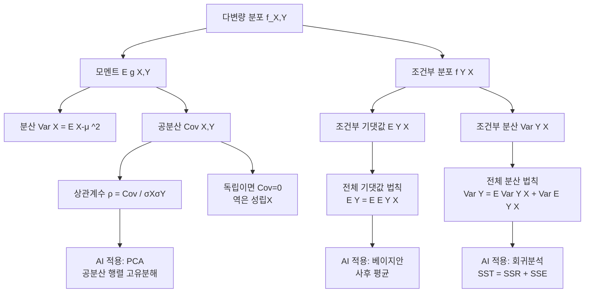

# 11. AI를위한수학의응용: 11장 다변량 확률분포(2) — 모멘트, 공분산, 조건부 모멘트

## 🔗 선수 지식 (Prerequisites)
- [ ] **필수**: [10강 다변량 확률분포(1)](10강.md) — 결합/주변/조건부 확률분포, 독립의 정의 이해 완료?
- [ ] **필수**: 단변량 확률변수의 기댓값·분산 정의 (`→←` 단변량 분포 학습)
- [ ] **권장**: 이중적분, 시그마(Σ) 연산, 이중합의 순서 교환
- **관련 단원**: [10강. 다변량 확률분포(1)](10강.md), 다음 강 다변량 정규분포

---

## 학습 목표
1. 다변량 분포의 기댓값, 분산, 공분산을 이해하고 설명할 수 있다.
2. 조건부 분포의 기댓값, 분산, 공분산을 이해하고 설명할 수 있다.

---

## 🧠 메타인지 체크 (학습 전/후 자기 평가)

### 학습 전 자기 평가
| 소주제 | 자신감 (1-5) |
| :--- | :--- |
| g(X,Y)의 기댓값 계산 (이산/연속) | |
| 공분산·상관계수의 정의와 성질 | |
| 조건부 모멘트와 전체 기댓값/분산의 법칙 | |

### 학습 후 교정 (학습 완료 후 작성)
| 소주제 | 학습 전 | 학습 후 | 실제 정답률 | 과신/과소 여부 |
| :--- | :--- | :--- | :--- | :--- |
| g(X,Y)의 기댓값 계산 (이산/연속) | | | | |
| 공분산·상관계수의 정의와 성질 | | | | |
| 조건부 모멘트와 전체 기댓값/분산의 법칙 | | | | |

> **활용법**: 학습 전 1분 → 자신감 기입, 학습 후 1분 → 나머지 기입. "과신" 영역이 실제 취약점.

---

## 📝 요약 (Summary)
1.  🔴 **g(X,Y)의 기댓값**: 두 확률변수의 함수 $g(X,Y)$의 기댓값은 $X, Y$의 결합분포를 통해 산출할 수 있다.
2.  🔴 **공분산의 의미**: 공분산은 두 변수가 함께 움직이는 방향과 정도를 나타내며, 공분산이 0이면 선형적 비상관이지만 독립을 보장하지는 않는다.
3.  🔴 **전체 기댓값의 법칙**: 조건부 기댓값 $E[Y|X=x]$는 $x$에 대한 함수로서, 이를 다시 $X$의 분포에 대해 기댓값을 취하면 주변 기댓값 $E[Y]$를 구할 수 있다.
4.  🟡 **전체 분산의 법칙**: 전체 분산의 법칙은 전체 변동을 조건부 분산의 평균과 조건부 기댓값의 분산으로 분해하는 법칙이다.

---

## 📐 핵심 수식 (Key Formulas)

| 수식명 | 수식 | 의미 |
| :--- | :--- | :--- |
| **g(X,Y) 기댓값 (이산)** | $E[g(X,Y)] = \sum_x \sum_y g(x,y) p_{X,Y}(x,y)$ | 결합확률질량함수에 함수값을 가중합 |
| **g(X,Y) 기댓값 (연속)** | $E[g(X,Y)] = \int\!\!\int g(x,y) f_{X,Y}(x,y)\,dx\,dy$ | 결합확률밀도함수에 함수값을 가중적분 |
| **분산** | $\mathrm{Var}(X) = E[(X-\mu_X)^2] = E[X^2] - (E[X])^2$ | 평균 둘레의 산포 |
| **공분산 정의** | $\mathrm{Cov}(X,Y) = E[(X-\mu_X)(Y-\mu_Y)]$ | 두 변수의 동조적 변동량 |
| **공분산 간편식** | $\mathrm{Cov}(X,Y) = E[XY] - E[X]E[Y]$ | 계산용 (기댓값 곱으로 분해) |
| **상관계수** | $\rho_{X,Y} = \dfrac{\mathrm{Cov}(X,Y)}{\sigma_X \sigma_Y}$ | 표준화된 선형관계 척도, $-1 \le \rho \le 1$ |
| **합의 분산** | $\mathrm{Var}(aX+bY) = a^2\mathrm{Var}(X) + b^2\mathrm{Var}(Y) + 2ab\,\mathrm{Cov}(X,Y)$ | 선형결합의 분산 |
| **조건부 기댓값** | $E[Y\mid X=x] = \sum_y y\, p_{Y\mid X}(y\mid x)$ (또는 적분형) | $X=x$가 주어졌을 때 Y의 평균 |
| **조건부 분산** | $\mathrm{Var}(Y\mid X) = E[Y^2\mid X] - (E[Y\mid X])^2$ | $X$ 조건 하 $Y$의 산포 |
| **전체 기댓값의 법칙** | $E[Y] = E_X[E[Y\mid X]]$ | 조건부 기댓값을 X에 대해 평균 |
| **전체 분산의 법칙** | $\mathrm{Var}(Y) = E_X[\mathrm{Var}(Y\mid X)] + \mathrm{Var}_X(E[Y\mid X])$ | 잔차 변동 + 신호 변동 |
| **전체 공분산의 법칙** | $\mathrm{Cov}(Y,Z) = E[\mathrm{Cov}(Y,Z\mid X)] + \mathrm{Cov}(E[Y\mid X], E[Z\mid X])$ | 공분산도 두 성분으로 분해 |

### 주요 정리/정의

**공분산의 주요 성질**
$$
\begin{aligned}
&(1)\ \mathrm{Cov}(X,X) = \mathrm{Var}(X) \\
&(2)\ \mathrm{Cov}(X,Y) = \mathrm{Cov}(Y,X) \\
&(3)\ \mathrm{Cov}(aX+b,\, cY+d) = ac\,\mathrm{Cov}(X,Y) \\
&(4)\ X \perp Y \;\Rightarrow\; \mathrm{Cov}(X,Y) = 0 \quad(\text{역은 일반적으로 성립 X}) \\
&(5)\ \mathrm{Cov}\!\left(\sum_i a_i X_i,\ \sum_j b_j Y_j\right) = \sum_i \sum_j a_i b_j\,\mathrm{Cov}(X_i, Y_j)
\end{aligned}
$$
> **직관적 해석**: 공분산은 "두 변수가 평균에서 같은 방향으로 이탈하는 경향"을 나타낸다. 양수면 동조, 음수면 반조, 0이면 선형적 관계 없음.
> **AI 적용**: 선형회귀의 OLS 추정량 $\hat{\beta} = \mathrm{Cov}(X,Y)/\mathrm{Var}(X)$ (**단순선형회귀**의 기울기이며, 절편을 함께 추정·중심화 $\bar X,\bar Y$를 가정한 형태. 다중회귀에서는 $\hat{\boldsymbol\beta}=\Sigma_{XX}^{-1}\Sigma_{XY}$로 일반화), PCA의 공분산 행렬 고유분해, Kalman 필터의 갱신 단계 등에서 사용.

**정리. 코시–슈바르츠 부등식과 상관계수의 범위 ($|\rho|\le 1$)**
> 임의의 두 확률변수 $X, Y$ (유한 분산)에 대해 **코시–슈바르츠 부등식**
> $$
> \big(\mathrm{Cov}(X,Y)\big)^2 \;=\; \big(E[(X-\mu_X)(Y-\mu_Y)]\big)^2 \;\le\; E[(X-\mu_X)^2]\,E[(Y-\mu_Y)^2] \;=\; \mathrm{Var}(X)\,\mathrm{Var}(Y)
> $$
> 가 성립한다. 양변에 제곱근을 취하면 $|\mathrm{Cov}(X,Y)|\le \sigma_X\sigma_Y$ 이고, $\sigma_X\sigma_Y$ 로 나누면
> $$
> |\rho_{X,Y}| = \frac{|\mathrm{Cov}(X,Y)|}{\sigma_X\sigma_Y} \le 1 \quad\Longleftrightarrow\quad -1 \le \rho_{X,Y} \le 1.
> $$
> **증명 스케치**: $g(t)=E\big[\big((X-\mu_X)-t(Y-\mu_Y)\big)^2\big]\ge 0$ 은 모든 실수 $t$ 에서 비음인 $t$ 의 이차식이다. 전개하면 $g(t)=\mathrm{Var}(X)-2t\,\mathrm{Cov}(X,Y)+t^2\mathrm{Var}(Y)$. 비음 이차식의 판별식 조건 $D\le 0$ 이 곧 $\big(\mathrm{Cov}(X,Y)\big)^2-\mathrm{Var}(X)\mathrm{Var}(Y)\le 0$ 으로, 위 부등식이 된다.
> **등호 조건 — $|\rho|=1 \iff$ 완전선형종속**: $g(t)=0$ 을 만드는 $t^\*$ 가 존재한다는 것은 $(X-\mu_X)-t^\*(Y-\mu_Y)=0$ 이 확률 1로 성립한다는 뜻, 즉 $X = t^\* Y + c$ 의 **완전한 선형관계**가 성립할 때(그리고 그때만) $|\rho|=1$ 이다. $\rho=+1$ 은 같은 방향, $\rho=-1$ 은 반대 방향의 직선.
> **AI 적용**: 상관계수가 $[-1,1]$ 로 표준화되어 단위에 무관한 선형종속 척도가 되는 근거. 정규화·특징선택·다중공선성 진단의 토대. 근거: [Cauchy–Schwarz inequality — Wikipedia](https://en.wikipedia.org/wiki/Cauchy%E2%80%93Schwarz_inequality).

**전체 분산의 법칙 (Law of Total Variance, EVE 공식)**
$$
\mathrm{Var}(Y) \;=\; \underbrace{E\!\left[\mathrm{Var}(Y\mid X)\right]}_{\text{설명되지 않는 변동}} \;+\; \underbrace{\mathrm{Var}\!\left(E[Y\mid X]\right)}_{\text{X로 설명되는 변동}}
$$
> **직관적 해석**: 전체 산포 = (X별로 본 Y의 평균적 산포) + (X에 따른 Y 평균값의 흔들림). 회귀에서 "잔차분산 + 설명분산" 분해와 동일한 구조.
> **AI 적용**: 의사결정나무에서 분할 기준(분산 감소), 베이지안 추정에서의 사후분산 분해, MoE(전문가 혼합) 모델의 분산 분해.

**공분산 행렬 (Covariance Matrix)**
$d$차원 확률벡터 $\mathbf{X}=(X_1,\dots,X_d)^\top$에 대해 공분산 행렬은
$$
\Sigma = \mathrm{Cov}(\mathbf{X}) = E\!\left[(\mathbf{X}-\boldsymbol\mu)(\mathbf{X}-\boldsymbol\mu)^\top\right],\qquad \Sigma_{ij}=\mathrm{Cov}(X_i,X_j)
$$
로 정의되며, 다음 두 성질을 항상 만족한다.
- **대칭(symmetric)**: $\Sigma = \Sigma^\top$ (공분산의 대칭성 $\mathrm{Cov}(X_i,X_j)=\mathrm{Cov}(X_j,X_i)$로부터).
- **양의 준정부호(positive semidefinite, PSD)**: 임의의 벡터 $\mathbf{a}\in\mathbb{R}^d$에 대해 $\mathbf{a}^\top \Sigma\, \mathbf{a} = \mathrm{Var}(\mathbf{a}^\top\mathbf{X}) \ge 0$. (분산은 음수가 될 수 없으므로.)
> **직관적 해석**: 어떤 방향 $\mathbf{a}$로 데이터를 사영해도 그 분산은 음수일 수 없으므로 $\Sigma$의 모든 고윳값은 $\ge 0$이다. 모든 고윳값이 양수($>0$)이면 양의 정부호(positive definite)이고 $\Sigma^{-1}$이 존재한다. 완전한 선형 종속(예: $X_2=2X_1$)이 있으면 고윳값 0이 생겨 PSD이지만 정부호는 아니다.
> **AI 적용**: PCA는 $\Sigma$의 고유분해로 분산이 큰 축을 찾고, 마할라노비스 거리 $\sqrt{(\mathbf{x}-\boldsymbol\mu)^\top\Sigma^{-1}(\mathbf{x}-\boldsymbol\mu)}$와 다변량 정규분포 밀도는 $\Sigma$의 정부호성(역행렬 존재)을 전제한다.

> ⚠️ **흔한 오해**
> - **"$\mathrm{Cov}(X,Y)=0$이면 독립이다"** — 거짓. 공분산은 **선형** 관계만 측정한다. $X\sim U(-1,1),\ Y=X^2$는 $\mathrm{Cov}=0$이지만 완전히 종속이다. **단, $(X,Y)$가 결합 정규분포일 때만** $\mathrm{Cov}=0 \Leftrightarrow$ 독립.
> - **"상관관계는 인과관계다"** — 거짓($\rho\ne 0$이라도 공통 원인(교란변수)이나 우연일 수 있다). 상관은 연관성의 척도일 뿐 인과의 증거가 아니다.
> - **"$\mathrm{Var}(X+Y)=\mathrm{Var}(X)+\mathrm{Var}(Y)$는 항상 성립"** — 거짓. $+2\mathrm{Cov}(X,Y)$ 항이 빠져 있다. 비상관일 때만 단순 합.
> - **"전체 분산은 $\mathrm{Var}(E[Y\mid X])$만으로 충분"** — 거짓. 조건부 잔차 변동 $E[\mathrm{Var}(Y\mid X)]$를 더해야 한다.
> - **"$E[g(X,Y)]=g(E[X],E[Y])$"** — 일반적으로 거짓(옌센 부등식). $g$가 비선형이면 등호가 깨진다.

---

## 📊 개념 시각화 (Visual Guide)

### 개념 관계도


### 핵심 도식
| 입력 | 연산 | 출력 | AI 적용 |
| :--- | :--- | :--- | :--- |
| 결합분포 $f_{X,Y}$ | $E[g(X,Y)]$ 가중합/적분 | 모멘트(평균·분산·공분산) | 손실함수 기대값 계산 |
| $X,Y$ 평균과 결합분포 | $E[XY] - E[X]E[Y]$ | 공분산 | 선형회귀 기울기 추정 |
| 공분산 $C$, 표준편차 $\sigma_X,\sigma_Y$ | $\rho = C/(\sigma_X\sigma_Y)$ | 상관계수 ($[-1,1]$) | 특징 선택, 다중공선성 진단 |
| 조건부 밀도 $f_{Y\mid X}$ | $\int y\, f_{Y\mid X}(y\mid x)\,dy$ | $E[Y\mid X=x]$ (회귀함수) | 회귀모형 예측, MMSE 추정량 |
| $E[Y\mid X], \mathrm{Var}(Y\mid X)$ | 전체 분산의 법칙 | 분산 분해 | $R^2$ 계산, 분산분석(ANOVA) |

---

## ✏️ 심화 학습 (Study Subject)

### 1. 가상 시나리오: "어떤 개념을, 언제 사용해야 할까?"
- **상황**: 어떤 추천 시스템이 사용자 $X$의 과거 시청 시간(특징)으로부터 신작 영화에 대한 평점 $Y$를 예측해야 한다. 평점의 전체 분산을 줄이는 것이 목표인데, 모델의 설명력을 어떻게 정량화할 수 있을까?
- **문제**: 예측값과 잔차의 분산을 어떻게 분해하여 모델이 "얼마나 잘 설명하는지"를 수학적으로 보일 수 있을까?
- **해결**: 전체 분산의 법칙을 적용한다.
  $$
  \mathrm{Var}(Y) = E[\mathrm{Var}(Y\mid X)] + \mathrm{Var}(E[Y\mid X])
  $$
  여기서 $E[Y\mid X]$는 회귀함수 (모델의 예측), $\mathrm{Var}(Y\mid X)$는 조건부 잔차분산이다. 결정계수는
  $$
  R^2 = \dfrac{\mathrm{Var}(E[Y\mid X])}{\mathrm{Var}(Y)} = 1 - \dfrac{E[\mathrm{Var}(Y\mid X)]}{\mathrm{Var}(Y)}
  $$
  로 자연스럽게 정의된다.
- **AI 학습 포인트**: "전체 분산의 법칙을 이용해 결정계수 $R^2$가 왜 0에서 1 사이의 값이 되는지, 그리고 비선형 회귀에서도 동일한 분해가 성립하는 이유를 설명해줘."

### 2. 관점별 비교 및 오개념 분석
- **핵심 비교**: '공분산 vs 상관계수', '독립 vs 비상관(Cov=0)', '주변 기댓값 vs 조건부 기댓값'
- **오개념 분석**
    - **오개념 1**: "$\mathrm{Cov}(X,Y)=0$이면 $X$와 $Y$는 독립이다."
    - **분석**: 일반적으로 성립하지 않는다. 예: $X \sim \text{Uniform}(-1,1),\ Y = X^2$ 라면 $E[X]=0, E[XY]=E[X^3]=0$이므로 $\mathrm{Cov}(X,Y)=0$이지만 $Y$는 $X$의 함수이므로 명백히 종속이다. 단, **다변량 정규분포**에서는 $\mathrm{Cov}=0 \Leftrightarrow$ 독립이 성립한다.
    - **오개념 2**: "전체 분산의 법칙에서 $\mathrm{Var}(Y) = \mathrm{Var}(E[Y\mid X])$ 만으로 충분하다."
    - **분석**: 이는 조건부 분산 $\mathrm{Var}(Y\mid X)=0$, 즉 $Y$가 $X$의 결정론적 함수일 때만 성립한다. 일반적으로 잔차 변동 $E[\mathrm{Var}(Y\mid X)]$ 항이 빠지면 안 된다.
    - **오개념 3**: "상관계수가 0.9라면 $Y$의 90%가 $X$로 설명된다."
    - **분석**: 설명 비율은 $\rho^2$인 $R^2 = 0.81$ (81%)이다. 상관계수 자체는 표준편차로 정규화된 선형관계의 강도일 뿐 비율이 아니다.
- **AI 학습 포인트**: "$Y=X^2$ 예시로 'Cov=0이지만 종속'인 사례를 시뮬레이션 코드로 검증해주고, 다변량 정규분포에서는 왜 동치가 되는지 적률생성함수 관점에서 설명해줘."

---

## ❓ 연습 문제 및 해설

> **블룸 인지 수준 범례**: [기억] 정의·나열 → [이해] 설명·비교 → [적용] 계산·구현 → [분석] 구별·디버그 → [평가] 판단·비평 → [창조] 설계·제안

### 📝 문제

**1. 📌 ⭐ [기억] [공분산의 정의로 옳은 것은?](#prob-1)**
   > ① $E[XY]$
   > ② $E[(X-\mu_X)(Y-\mu_Y)]$
   > ③ $E[X]\,E[Y]$
   > ④ $E[X^2]-E[X]^2$

<br>

**2. 📌 ⭐ [기억] [상관계수 $\rho_{X,Y}$의 값의 범위로 옳은 것은?](#prob-2)**
   > ① $0 \le \rho \le 1$
   > ② $-1 \le \rho \le 1$
   > ③ $-\infty < \rho < \infty$
   > ④ $\rho \ge 0$

<br>

**3. 📌 ⭐ [이해] [두 확률변수 $X,Y$가 독립일 때 항상 성립하는 것을 모두 고르시오.](#prob-3)**
   > <보기>
   >
   > 가. $E[XY] = E[X]E[Y]$
   > 나. $\mathrm{Cov}(X,Y) = 0$
   > 다. $\mathrm{Var}(X+Y) = \mathrm{Var}(X) + \mathrm{Var}(Y)$
   > 라. $\rho_{X,Y} = 1$

   > ① 가, 나
   > ② 가, 나, 다
   > ③ 가, 다, 라
   > ④ 가, 나, 다, 라

<br>

**4. 📌 ⭐⭐ [적용] [$\mathrm{Var}(X)=4,\ \mathrm{Var}(Y)=9,\ \mathrm{Cov}(X,Y)=3$일 때 $\mathrm{Var}(2X - Y)$의 값은?](#prob-4)**
   > ① 13
   > ② 17
   > ③ 25
   > ④ 37

<br>

**5. 📌 ⭐⭐ [적용] [위 4번과 동일한 조건일 때 상관계수 $\rho_{X,Y}$의 값은?](#prob-5)**
   > ① 0.25
   > ② 0.5
   > ③ 0.6
   > ④ 0.75

<br>

**6. 📌 ⭐⭐ [분석] [$X \sim \text{Uniform}(-1, 1)$, $Y = X^2$일 때 $\mathrm{Cov}(X, Y)$의 값과 그 해석으로 옳은 것은?](#prob-6)**
   > ① 0이며, $X$와 $Y$는 독립이다.
   > ② 0이지만, $X$와 $Y$는 종속이다.
   > ③ $\frac{1}{3}$이며, $X$와 $Y$는 양의 상관관계이다.
   > ④ $-\frac{1}{3}$이며, $X$와 $Y$는 음의 상관관계이다.

<br>

**7. 📌 ⭐⭐ [적용] [$E[Y \mid X = x] = 2x + 1$이고, $X \sim \text{Uniform}(0, 2)$일 때 $E[Y]$를 구하시오.](#prob-7)**
   > ① 2
   > ② 3
   > ③ 4
   > ④ 5

<br>

**8. 📌 ⭐⭐⭐ [적용/분석] [$X \sim \text{Bernoulli}(0.5)$이고, $Y \mid X=0 \sim N(0, 1)$, $Y \mid X=1 \sim N(2, 1)$일 때 $\mathrm{Var}(Y)$를 전체 분산의 법칙으로 구하시오.](#prob-8)**

<br>

**9. 📌 ⭐⭐ [이해] [전체 기댓값의 법칙 $E[Y] = E_X[E[Y\mid X]]$의 의미로 가장 적절한 것은?](#prob-9)**
   > ① $X$가 $Y$와 독립일 때만 성립한다.
   > ② $X$의 모든 값에 대해 $Y$의 조건부 평균을 가중평균한 것이 $Y$의 주변 평균과 같다.
   > ③ $X$와 $Y$의 합의 평균은 각각의 평균의 합과 같다.
   > ④ $X$의 분산이 0일 때만 성립한다.

<br>

**10. 📌 ⭐⭐⭐ [평가/창조] [결합 확률밀도함수 $f_{X,Y}(x,y) = x + y,\ 0 \le x \le 1,\ 0 \le y \le 1$이 주어졌을 때, $E[X], E[Y], \mathrm{Cov}(X,Y)$를 구하시오.](#prob-10)**

---

### 🔑 정답 및 해설 (먼저 풀어본 후 펼치기)

<details>
<summary>정답 보기 (클릭)</summary>

1. ②
2. ②
3. ②
4. ①
5. ②
6. ②
7. ②
8. 2
9. ②
10. $E[X]=E[Y]=\frac{7}{12},\ \mathrm{Cov}(X,Y)=-\frac{1}{144}$

</details>

<details>
<summary>해설 보기 (클릭)</summary>

<a id="prob-1"></a>
**1. ⭐ [기억] 공분산의 정의**
> **정답: ② $E[(X-\mu_X)(Y-\mu_Y)]$**
> **해설**: 공분산은 두 변수의 평균 편차의 곱에 대한 기댓값으로 정의된다. ①은 적률, ③은 독립일 때 $E[XY]$의 값, ④는 $\mathrm{Var}(X)$의 간편식이다.

<a id="prob-2"></a>
**2. ⭐ [기억] 상관계수의 범위**
> **정답: ② $-1 \le \rho \le 1$**
> **해설**: 코시-슈바르츠 부등식에 의해 $|\mathrm{Cov}(X,Y)| \le \sigma_X \sigma_Y$이므로 표준화된 척도인 $\rho = \mathrm{Cov}/(\sigma_X\sigma_Y)$는 $[-1, 1]$ 구간을 갖는다.

<a id="prob-3"></a>
**3. ⭐ [이해] 독립의 따름 결과**
> **정답: ② 가, 나, 다**
> **해설**:
> - 가: 독립 ⇒ $E[XY]=E[X]E[Y]$ (✓)
> - 나: 독립 ⇒ $\mathrm{Cov}(X,Y)=E[XY]-E[X]E[Y]=0$ (✓)
> - 다: $\mathrm{Var}(X+Y)=\mathrm{Var}(X)+\mathrm{Var}(Y)+2\mathrm{Cov}(X,Y)$, 독립이면 마지막 항 0 (✓)
> - 라: $\rho=0$이지 1이 아님 (✗)

<a id="prob-4"></a>
**4. ⭐⭐ [적용] 합의 분산**
> **정답: ① 13**
> **해설**: $\mathrm{Var}(2X - Y) = 4\,\mathrm{Var}(X) + \mathrm{Var}(Y) + 2(2)(-1)\,\mathrm{Cov}(X,Y) = 4(4) + 9 - 4(3) = 16 + 9 - 12 = 13$.

<a id="prob-5"></a>
**5. ⭐⭐ [적용] 상관계수 계산**
> **정답: ② 0.5**
> **해설**: $\rho_{X,Y} = \dfrac{\mathrm{Cov}(X,Y)}{\sigma_X\sigma_Y} = \dfrac{3}{\sqrt{4}\cdot\sqrt{9}} = \dfrac{3}{2\cdot 3} = 0.5$.

<a id="prob-6"></a>
**6. ⭐⭐ [분석] Cov=0이지만 종속인 사례 (오개념 함정)**
> **정답: ② 0이지만, $X$와 $Y$는 종속이다.**
> **해설**: $X \sim U(-1,1)$이므로 $E[X]=0,\ E[X^3]=0$.
> $\mathrm{Cov}(X,Y) = E[XY] - E[X]E[Y] = E[X \cdot X^2] - 0 \cdot E[X^2] = E[X^3] = 0$.
> 하지만 $Y$는 $X$의 결정론적 함수이므로 명백히 종속. 이는 "비상관 ≠ 독립"의 대표 반례이며 시험 단골 함정이다.

<a id="prob-7"></a>
**7. ⭐⭐ [적용] 전체 기댓값의 법칙**
> **정답: ② 3**
> **해설**: $E[Y] = E_X[E[Y\mid X]] = E_X[2X + 1] = 2E[X] + 1 = 2(1) + 1 = 3$. ($X \sim U(0,2)$이므로 $E[X]=1$.)

<a id="prob-8"></a>
**8. ⭐⭐⭐ [적용/분석] 전체 분산의 법칙 적용**
> **정답: 2**
> **해설**: 전체 분산의 법칙 $\mathrm{Var}(Y) = E[\mathrm{Var}(Y\mid X)] + \mathrm{Var}(E[Y\mid X])$를 적용.
> - $\mathrm{Var}(Y\mid X=0)=1,\ \mathrm{Var}(Y\mid X=1)=1$이므로 $E[\mathrm{Var}(Y\mid X)] = 0.5(1)+0.5(1) = 1$.
> - $E[Y\mid X=0]=0,\ E[Y\mid X=1]=2$이므로 이는 Bernoulli(0.5)를 0과 2로 매핑한 r.v. $\mathrm{Var}(E[Y\mid X]) = (0-1)^2(0.5)+(2-1)^2(0.5) = 1$.
> - $\therefore \mathrm{Var}(Y) = 1 + 1 = 2$.

<a id="prob-9"></a>
**9. ⭐⭐ [이해] 전체 기댓값의 법칙의 의미**
> **정답: ②**
> **해설**: 전체 기댓값의 법칙은 $X$의 모든 값별로 계산한 $Y$의 조건부 평균을 $X$의 확률분포로 가중평균하면 $Y$의 주변 평균이 된다는 명제로, 독립성과 무관하게 항상 성립한다.

<a id="prob-10"></a>
**10. ⭐⭐⭐ [평가/창조] 결합 pdf로부터 모멘트 계산**
> **정답: $E[X]=E[Y]=\dfrac{7}{12},\ \mathrm{Cov}(X,Y)=-\dfrac{1}{144}$**
> **해설**:
> 우선 정규화 확인: $\int_0^1\!\!\int_0^1 (x+y)\,dx\,dy = \int_0^1 (\tfrac{1}{2}+y)\,dy = \tfrac{1}{2}+\tfrac{1}{2}=1$ ✓
> $$E[X] = \int_0^1\!\!\int_0^1 x(x+y)\,dx\,dy = \int_0^1 \left(\tfrac{1}{3}+\tfrac{y}{2}\right)dy = \tfrac{1}{3}+\tfrac{1}{4} = \tfrac{7}{12}.$$
> 대칭성에 의해 $E[Y]=\tfrac{7}{12}$.
> $$E[XY] = \int_0^1\!\!\int_0^1 xy(x+y)\,dx\,dy = \int_0^1 \left(\tfrac{y}{3}+\tfrac{y^2}{2}\right)dy = \tfrac{1}{6}+\tfrac{1}{6}=\tfrac{1}{3}.$$
> $$\mathrm{Cov}(X,Y) = E[XY]-E[X]E[Y] = \tfrac{1}{3} - \left(\tfrac{7}{12}\right)^2 = \tfrac{48}{144} - \tfrac{49}{144} = -\tfrac{1}{144}.$$
> 음의 공분산: $x+y$의 결합밀도 하에서 한 변수가 클수록 상대적으로 다른 변수에 부여되는 확률밀도가 작아진다.

</details>

---

## ✅ O/X 확인문제 (연습문항 개수의 2배 권장)

**1.** 공분산이 0이면 두 확률변수는 반드시 독립이다. [(O / X)](#ox-1)
**2.** 다변량 정규분포에서는 $\mathrm{Cov}(X,Y)=0$이면 $X$와 $Y$가 독립이다. [(O / X)](#ox-2)
**3.** 상관계수 $\rho$는 단위에 의존하지 않는 표준화된 척도이다. [(O / X)](#ox-3)
**4.** $\mathrm{Var}(X+Y) = \mathrm{Var}(X) + \mathrm{Var}(Y)$는 항상 성립한다. [(O / X)](#ox-4)
**5.** 전체 기댓값의 법칙은 $X$와 $Y$가 독립일 때만 성립한다. [(O / X)](#ox-5)
**6.** 조건부 분산 $\mathrm{Var}(Y\mid X)$는 일반적으로 $X$의 함수이며 확률변수이다. [(O / X)](#ox-6)
**7.** 전체 분산의 법칙에서 $E[\mathrm{Var}(Y\mid X)]$ 항은 항상 0 이상이다. [(O / X)](#ox-7)
**8.** $\mathrm{Cov}(aX+b, cY+d) = ac\,\mathrm{Cov}(X,Y) + bd$ 이다. [(O / X)](#ox-8)
**9.** $\rho_{X,Y}=\pm 1$이면 $Y$는 $X$의 선형함수로 표현될 수 있다. [(O / X)](#ox-9)
**10.** $E[g(X,Y)] = g(E[X], E[Y])$가 항상 성립한다. [(O / X)](#ox-10)
**11.** $\mathrm{Cov}(X,X) = \mathrm{Var}(X)$이다. [(O / X)](#ox-11)
**12.** $E[Y\mid X]$가 $x$의 상수함수이면 $X$와 $Y$는 비상관이다. [(O / X)](#ox-12)
**13.** 전체 공분산의 법칙은 $\mathrm{Cov}(Y,Z) = E[\mathrm{Cov}(Y,Z\mid X)] + \mathrm{Cov}(E[Y\mid X], E[Z\mid X])$이다. [(O / X)](#ox-13)
**14.** 결정계수 $R^2$는 $\mathrm{Var}(E[Y\mid X])/\mathrm{Var}(Y)$로 표현된다. [(O / X)](#ox-14)
**15.** 두 확률변수의 분산이 0이 아니라면 공분산의 부호와 상관계수의 부호는 항상 같다. [(O / X)](#ox-15)
**16.** 이산형 결합분포에서 $E[g(X,Y)] = \sum_x \sum_y g(x,y) p_{X,Y}(x,y)$이다. [(O / X)](#ox-16)
**17.** 공분산은 항상 $-1$과 $1$ 사이의 값을 갖는다. [(O / X)](#ox-17)
**18.** 분산은 음수가 될 수 없으나 공분산은 음수가 될 수 있다. [(O / X)](#ox-18)
**19.** 표본 공분산이 0이면 모집단에서도 두 변수의 공분산은 반드시 0이다. [(O / X)](#ox-19)
**20.** $X$와 $Y$가 독립이고 $\mathrm{Var}(X)=\mathrm{Var}(Y)=1$이면 $\mathrm{Var}(X-Y)=2$이다. [(O / X)](#ox-20)

<details>
<summary>O/X 정답 및 해설 보기 (클릭)</summary>

> <a id="ox-1"></a>
> **1. 정답**: X
> **해설**: 공분산 0은 선형적 비상관일 뿐, 독립을 의미하지 않는다. ($Y=X^2$ 등 반례 존재)

> <a id="ox-2"></a>
> **2. 정답**: O
> **해설**: 다변량 정규분포에서는 $\mathrm{Cov}=0 \Leftrightarrow$ 독립이 동치로 성립한다 (특수한 경우).

> <a id="ox-3"></a>
> **3. 정답**: O
> **해설**: $\rho = \mathrm{Cov}/(\sigma_X\sigma_Y)$는 단위가 상쇄되어 무차원 척도이다.

> <a id="ox-4"></a>
> **4. 정답**: X
> **해설**: $\mathrm{Var}(X+Y) = \mathrm{Var}(X)+\mathrm{Var}(Y)+2\mathrm{Cov}(X,Y)$이므로 공분산 항이 추가된다. 비상관일 때만 단순 합.

> <a id="ox-5"></a>
> **5. 정답**: X
> **해설**: 전체 기댓값의 법칙은 독립성과 무관하게 항상 성립한다.

> <a id="ox-6"></a>
> **6. 정답**: O
> **해설**: $\mathrm{Var}(Y\mid X)$는 $X$의 값에 따라 달라지는 함수로, 그 자체가 확률변수이다.

> <a id="ox-7"></a>
> **7. 정답**: O
> **해설**: 조건부 분산은 항상 비음이므로 그 기댓값도 항상 $\ge 0$.

> <a id="ox-8"></a>
> **8. 정답**: X
> **해설**: 상수 평행이동은 공분산을 바꾸지 않는다. 정답: $\mathrm{Cov}(aX+b, cY+d) = ac\,\mathrm{Cov}(X,Y)$.

> <a id="ox-9"></a>
> **9. 정답**: O
> **해설**: $|\rho|=1$이면 두 변수는 확률 1로 완전한 선형관계 $Y = aX + b$를 만족한다.

> <a id="ox-10"></a>
> **10. 정답**: X
> **해설**: 일반적으로 $E[g(X,Y)] \ne g(E[X], E[Y])$이다. 옌센 부등식이 등호로 성립하지 않는 한 차이가 발생한다.

> <a id="ox-11"></a>
> **11. 정답**: O
> **해설**: $\mathrm{Cov}(X,X)=E[(X-\mu_X)^2]=\mathrm{Var}(X)$.

> <a id="ox-12"></a>
> **12. 정답**: O
> **해설**: $E[Y\mid X]$가 상수 $c$이면 $E[XY]=E[X\cdot E[Y\mid X]]=cE[X]=E[X]E[Y]$이므로 $\mathrm{Cov}(X,Y)=0$.

> <a id="ox-13"></a>
> **13. 정답**: O
> **해설**: 전체 공분산의 법칙의 표준 형태이다.

> <a id="ox-14"></a>
> **14. 정답**: O
> **해설**: $R^2$는 X로 설명되는 변동 비율로, 전체 분산의 법칙에서 신호 분산/전체 분산이다.

> <a id="ox-15"></a>
> **15. 정답**: O
> **해설**: $\rho = \mathrm{Cov}/(\sigma_X\sigma_Y)$에서 분모는 양수이므로 부호가 보존된다.

> <a id="ox-16"></a>
> **16. 정답**: O
> **해설**: 이산형 결합분포에서 $g(X,Y)$의 기댓값의 정의이다.

> <a id="ox-17"></a>
> **17. 정답**: X
> **해설**: $-1 \le \rho \le 1$은 상관계수의 범위. 공분산은 단위와 분산 크기에 의존해 임의의 실수 값.

> <a id="ox-18"></a>
> **18. 정답**: O
> **해설**: 분산은 제곱의 기댓값으로 $\ge 0$, 공분산은 부호를 가질 수 있다.

> <a id="ox-19"></a>
> **19. 정답**: X
> **해설**: 표본 공분산은 추정량이며 표본오차가 존재한다. 모집단 공분산을 보장하지 않는다.

> <a id="ox-20"></a>
> **20. 정답**: O
> **해설**: 독립이므로 $\mathrm{Cov}(X,Y)=0$, $\mathrm{Var}(X-Y)=\mathrm{Var}(X)+\mathrm{Var}(Y)=2$.

</details>

---

## 🧪 자유 회상 연습 (Free Recall)

> **방법**: 위의 노트를 모두 덮고, 타이머 3분 설정 후 이번 단원에서 배운 내용을 기억나는 대로 자유롭게 적으세요.
> 정확한 문장이 아니어도 됩니다. 키워드, 수식, 관계 등 떠오르는 것을 모두 적습니다.

**자유 회상 작성란:**

```
[여기에 기억나는 내용을 자유롭게 작성]


```

> **회상 후 점검**: 노트를 다시 펼쳐 빠뜨린 내용을 확인하세요. 빠뜨린 부분이 실제 취약점입니다.
> - 회상 못한 핵심 개념: [                ]
> - 회상 못한 수식: [                ]

---

## 💻 코드로 확인하기 (Code Verification)

```python
import numpy as np

np.random.seed(42)
N = 200_000

# (1) Cov=0이지만 종속: X ~ U(-1,1), Y = X^2
X = np.random.uniform(-1, 1, N)
Y = X ** 2
print("=== (1) Cov=0이지만 종속인 예시 ===")
print(f"E[X]      ≈ {X.mean(): .4f}  (이론 0)")
print(f"E[Y]=E[X^2]≈ {Y.mean(): .4f}  (이론 1/3 ≈ 0.3333)")
print(f"Cov(X,Y)  ≈ {np.cov(X, Y, ddof=0)[0,1]: .4f}  (이론 0)")
print(f"Corr(X,Y) ≈ {np.corrcoef(X, Y)[0,1]: .4f}\n")

# (2) 결합 pdf f(x,y) = x+y, 0<=x,y<=1 → 거부표본
def sample_xy_pdf(n):
    out = []
    while len(out) < n:
        x, y, u = np.random.uniform(0, 1, 3)
        if u * 2.0 <= x + y:   # max(x+y) on [0,1]^2 = 2
            out.append((x, y))
    return np.array(out)

XY = sample_xy_pdf(50_000)
Xs, Ys = XY[:, 0], XY[:, 1]
print("=== (2) f(x,y)=x+y on [0,1]^2 ===")
print(f"E[X] ≈ {Xs.mean():.4f}  (이론 7/12 ≈ 0.5833)")
print(f"E[Y] ≈ {Ys.mean():.4f}  (이론 7/12 ≈ 0.5833)")
print(f"Cov  ≈ {np.cov(Xs, Ys, ddof=0)[0,1]:.5f}  (이론 -1/144 ≈ -0.00694)\n")

# (3) 전체 분산의 법칙 검증
# X ~ Bernoulli(0.5), Y|X=0 ~ N(0,1), Y|X=1 ~ N(2,1)
Xb = np.random.binomial(1, 0.5, N)
Yb = np.where(Xb == 0,
              np.random.normal(0, 1, N),
              np.random.normal(2, 1, N))
print("=== (3) 전체 분산의 법칙 ===")
print(f"Var(Y) (직접)              ≈ {Yb.var(): .4f}  (이론 2.0)")
# E[Var(Y|X)]
EvarYgivenX = 0.5 * Yb[Xb==0].var() + 0.5 * Yb[Xb==1].var()
# Var(E[Y|X])
mu0, mu1 = Yb[Xb==0].mean(), Yb[Xb==1].mean()
VarEYgivenX = 0.5*(mu0 - Yb.mean())**2 + 0.5*(mu1 - Yb.mean())**2
print(f"E[Var(Y|X)] + Var(E[Y|X]) ≈ {EvarYgivenX + VarEYgivenX: .4f}")
print(f"  - E[Var(Y|X)] ≈ {EvarYgivenX:.4f}  (이론 1.0)")
print(f"  - Var(E[Y|X]) ≈ {VarEYgivenX:.4f}  (이론 1.0)")
```

> **실행 결과 (예시)**:
> ```
> === (1) Cov=0이지만 종속인 예시 ===
> E[X]      ≈ -0.0007  (이론 0)
> E[Y]=E[X^2]≈  0.3326  (이론 1/3 ≈ 0.3333)
> Cov(X,Y)  ≈ -0.0007  (이론 0)
> Corr(X,Y) ≈ -0.0027
>
> === (2) f(x,y)=x+y on [0,1]^2 ===
> E[X] ≈ 0.5832
> E[Y] ≈ 0.5834
> Cov  ≈ -0.00691
>
> === (3) 전체 분산의 법칙 ===
> Var(Y) (직접)              ≈  1.9998  (이론 2.0)
> E[Var(Y|X)] + Var(E[Y|X]) ≈  1.9998
>   - E[Var(Y|X)] ≈ 1.0001  (이론 1.0)
>   - Var(E[Y|X]) ≈ 0.9997  (이론 1.0)
> ```
> **수학적 해석**:
> (1) $\mathrm{Cov}\approx 0$임에도 $Y=X^2$로 명백히 종속. "비상관 ≠ 독립"의 직접 검증.
> (2) 결합밀도 $x+y$에서 음의 공분산이 발생. 한 변수가 클수록 다른 변수에 분배되는 확률이 상대적으로 감소.
> (3) 전체 분산의 법칙이 $\mathrm{Var}(Y) = E[\mathrm{Var}(Y\mid X)] + \mathrm{Var}(E[Y\mid X]) = 1 + 1 = 2$로 정확히 분해됨을 확인.

---

## 🤖 AI 연결고리 (Math → AI Application)

| 수학 개념 | AI/ML 적용 분야 | 구체적 사례 |
| :--- | :--- | :--- |
| 공분산 $\mathrm{Cov}(X,Y)$ | 선형회귀, PCA | OLS 추정량 $\hat{\beta}=\mathrm{Cov}(X,Y)/\mathrm{Var}(X)$, PCA 공분산 행렬 고유분해 |
| 공분산 행렬 $\Sigma$ | 다변량 정규분포, GMM | 가우시안 혼합모델 EM, 마할라노비스 거리 $\sqrt{(x-\mu)^\top \Sigma^{-1}(x-\mu)}$ |
| 상관계수 $\rho$ | 특징 선택, 다중공선성 | 상관관계가 높은 특징 제거, VIF 진단 |
| 조건부 기댓값 $E[Y\mid X]$ | 회귀, MMSE 추정 | 최소평균제곱오차 추정량은 $E[Y\mid X]$, Bayesian 사후평균 |
| 전체 기댓값의 법칙 | 강화학습 가치함수 | $V(s)=E_a[Q(s,a)]$, 정책평가에서의 기대 |
| 전체 분산의 법칙 | $R^2$ 분해, ANOVA | 회귀 결정계수, 트리 분할 기준(분산 감소량) |
| 전체 공분산의 법칙 | Kalman 필터, GP 회귀 | 상태 추정에서 사전·관측 공분산 분해 |

---

## 📖 심화 학습 예시 답안

#### 1. 전체 분산의 법칙(EVE 공식)의 내부 동작 원리
$\mathrm{Var}(Y) = E[\mathrm{Var}(Y\mid X)] + \mathrm{Var}(E[Y\mid X])$가 성립하는 이유를 단계별로 보자.

1.  **편차 분해**: $Y - E[Y] = \big(Y - E[Y\mid X]\big) + \big(E[Y\mid X] - E[Y]\big)$. 첫째 항은 "잔차", 둘째 항은 "조건부 평균의 변동".
2.  **제곱 후 기댓값**: 양변을 제곱하여 기댓값을 취하면 교차항이 발생한다. $\mathrm{Var}(Y) = E[(Y-E[Y\mid X])^2] + E[(E[Y\mid X]-E[Y])^2] + 2 \cdot E[(Y-E[Y\mid X])(E[Y\mid X]-E[Y])]$.
3.  **교차항 소거**: 조건부 기댓값의 직교성에 의해 $E[(Y-E[Y\mid X])\cdot h(X)]=0$ for any $h$. 따라서 마지막 교차항은 0.
4.  **결과 정리**: 첫째 항 = $E_X[\mathrm{Var}(Y\mid X)]$, 둘째 항 = $\mathrm{Var}_X(E[Y\mid X])$.

#### 2. 공분산 0 vs 독립 비교표

| 구분 | 공분산 0 (비상관) | 독립 | 비고 |
| :--- | :--- | :--- | :--- |
| **정의** | $E[(X-\mu_X)(Y-\mu_Y)] = 0$ | $f_{X,Y}(x,y) = f_X(x) f_Y(y)$ | 독립은 분포 수준, 비상관은 모멘트 수준 |
| **포함 관계** | 약한 조건 (필요조건) | 강한 조건 (충분조건) | 독립 ⇒ 비상관, 역은 일반적으로 거짓 |
| **반례** | $Y=X^2,\ X\sim U(-1,1)$: Cov=0이나 종속 | — | 비선형 종속을 공분산이 잡지 못함 |
| **동치 성립 조건** | — | 다변량 정규분포에서는 비상관 ⇔ 독립 | 특수한 경우 |
| **AI 활용** | PCA의 주성분(비상관화), Whitening | 베이지안 네트워크의 d-분리, Naive Bayes 가정 | 모델 가정의 강도 차이 |

#### 3. 공분산을 활용한 코드 작성법 (Best Practice)

- **Bad Practice (나쁜 예시)**
  ```python
  # 수치적으로 불안정한 두-패스 계산
  mean_x = sum(x) / len(x)
  mean_y = sum(y) / len(y)
  cov = sum((xi - mean_x) * (yi - mean_y) for xi, yi in zip(x, y)) / len(x)
  # 큰 데이터셋에서 부동소수점 누적오차, 메모리 비효율
  ```
- **Good Practice (좋은 예시)**
  ```python
  import numpy as np
  X = np.asarray(x, dtype=np.float64)
  Y = np.asarray(y, dtype=np.float64)
  # ddof=0: 모공분산, ddof=1: 표본공분산 (자유도 보정)
  cov_matrix = np.cov(X, Y, ddof=1)
  cov_xy = cov_matrix[0, 1]
  var_x, var_y = cov_matrix[0, 0], cov_matrix[1, 1]
  rho = cov_xy / np.sqrt(var_x * var_y)   # 상관계수
  ```
- **설명**: NumPy `np.cov`는 BLAS 기반 벡터 연산으로 수치적 안정성과 속도가 우수하며, `ddof`로 모/표본 공분산을 명확히 구분할 수 있다. 상관계수는 별도 정규화 단계를 통해 $[-1,1]$ 범위로 표준화한다.

---

## 📚 핵심 용어집 (Glossary)

| 용어 (한) | 용어 (영) | 수식 표현 | 정의 |
| :--- | :--- | :--- | :--- |
| **기댓값** | Expected value | $E[X] = \sum x p(x)$ 또는 $\int x f(x)\,dx$ | 확률변수의 평균값 |
| **분산** | Variance | $\mathrm{Var}(X) = E[(X-\mu_X)^2]$ | 평균 둘레의 산포 |
| **공분산** | Covariance | $\mathrm{Cov}(X,Y) = E[(X-\mu_X)(Y-\mu_Y)]$ | 두 변수가 함께 변하는 정도 |
| **상관계수** | Correlation coefficient | $\rho = \mathrm{Cov}(X,Y)/(\sigma_X\sigma_Y)$ | 표준화된 선형관계 척도 ($-1\le\rho\le 1$) |
| **모멘트** | Moment | $E[X^k]$ (k차 적률) | 분포의 형태를 특성화하는 통계량 |
| **조건부 기댓값** | Conditional expectation | $E[Y\mid X=x]$ | $X=x$가 주어졌을 때 $Y$의 평균 |
| **조건부 분산** | Conditional variance | $\mathrm{Var}(Y\mid X)$ | $X$가 주어졌을 때 $Y$의 분산 |
| **전체 기댓값의 법칙** | Law of total expectation | $E[Y]=E_X[E[Y\mid X]]$ | 조건부 기댓값의 평균은 주변 기댓값 |
| **전체 분산의 법칙** | Law of total variance | $\mathrm{Var}(Y)=E[\mathrm{Var}(Y\mid X)]+\mathrm{Var}(E[Y\mid X])$ | 분산을 두 성분으로 분해 |
| **결합분포** | Joint distribution | $f_{X,Y}(x,y),\ p_{X,Y}(x,y)$ | 여러 변수의 동시 확률 분포 (`→←10강`) |
| **독립** | Independence | $f_{X,Y} = f_X \cdot f_Y$ | 결합분포가 주변분포의 곱으로 분해됨 (`→←10강`) |
| **비상관** | Uncorrelated | $\mathrm{Cov}(X,Y) = 0$ | 선형적 관계가 없음 (독립의 필요조건) |

---

## 🤖 AI 학습 파트너를 위한 추가 자료

### 1. 개념 이해를 위한 심층 질문 프롬프트
> **프롬프트 예시**: "공분산과 상관계수의 핵심 원리를 초등학생도 이해할 수 있도록 키와 몸무게 같은 일상 예시로 설명해 줘. 그리고 공분산이 0이지만 두 변수가 종속인 경우(예: $Y=X^2$)가 왜 발생하는지, 공분산이 '선형 관계'만 잡아낸다는 한계와 함께 역사적 배경 (피어슨이 왜 표준화된 상관계수를 제안했는지)도 알려줘."

### 2. 문제 해결 능력 강화를 위한 시나리오 프롬프트
> **프롬프트 예시**: "당신은 시니어 데이터 사이언티스트입니다. 사용자의 클릭 수($X$)와 구매 금액($Y$)을 모델링하는 상황에서, (1) 단순 선형회귀로 $E[Y\mid X]$를 추정할지, (2) 조건부 분산 $\mathrm{Var}(Y\mid X)$이 $X$에 따라 다르다는 이분산성을 고려한 GLM/분위회귀를 쓸지 결정해야 합니다. 전체 분산의 법칙 관점에서 두 접근의 장단점을 비교하고 기술적인 근거로 최종 선택을 설명해 줘."

### 3. 수식 풀이 검증 프롬프트
> **프롬프트 예시**: "다음 풀이를 검증해 줘. $\mathrm{Var}(2X-Y) = 4\mathrm{Var}(X) + \mathrm{Var}(Y) - 4\mathrm{Cov}(X,Y)$이고, $\mathrm{Var}(X)=4,\mathrm{Var}(Y)=9,\mathrm{Cov}(X,Y)=3$이므로 $\mathrm{Var}(2X-Y) = 16+9-12 = 13$.
> $$\mathrm{Var}(2X-Y) = E\big[(2X-Y - E[2X-Y])^2\big]$$
> 1. 각 단계가 수학적으로 올바른지 확인하고, 부호 처리나 계수 처리에 오류가 있는지 지적해 줘.
> 2. 일반화된 형태 $\mathrm{Var}(aX+bY)$의 공식을 적률생성함수 관점에서 유도해줘."

---

## 💡 심화 아이디어 / 더 생각해보기

1. **조건부 기댓값 = 최적 회귀함수 (MMSE의 관점)**: 모든 (측정가능한) 함수 $h(X)$ 중에서 평균제곱오차 $E[(Y-h(X))^2]$를 최소화하는 것은 정확히 $h^\star(X)=E[Y\mid X]$이다. 증명 핵심은 직교성: $E[(Y-E[Y\mid X])\,h(X)]=0$이므로 $E[(Y-h(X))^2]=E[(Y-E[Y\mid X])^2]+E[(E[Y\mid X]-h(X))^2]$로 분해되고, 둘째 항을 0으로 만드는 $h$가 최적이다. 그래서 회귀의 "참값"은 조건부 기댓값이며, 선형회귀는 그중 **선형 함수족**으로 제한한 근사이다. → 전체 분산의 법칙에서 첫째 항 $E[\mathrm{Var}(Y\mid X)]$가 바로 이 최적 예측기로도 줄일 수 없는 환원불능오차(irreducible error)에 해당한다.
2. **공분산 행렬의 고유분해와 화이트닝**: $\Sigma=Q\Lambda Q^\top$로 대각화하면(PSD라 항상 가능), $\mathbf{Z}=\Lambda^{-1/2}Q^\top(\mathbf{X}-\boldsymbol\mu)$는 공분산이 단위행렬 $I$가 된다(화이트닝). PCA·ZCA whitening, 배치 정규화의 통계적 근거가 여기에 있다. "$\Sigma$가 PSD라서 $\Lambda^{1/2}$가 항상 실수"라는 점이 이 변환을 가능하게 한다.
3. **편향-분산 분해와의 연결**: 전체 분산의 법칙은 예측오차의 편향-분산 분해와 같은 대수 구조를 가진다. 둘 다 "교차항이 직교성으로 소거된다"는 동일한 아이디어에서 나온다 — 이 직교성이 통계학과 ML 전반을 관통하는 핵심 원리임을 음미해보자. 같은 분해를 비율로 읽으면 $R^2=\dfrac{\mathrm{Var}(E[Y\mid X])}{\mathrm{Var}(Y)}$, 즉 **전체 분산 중 $X$ 로 설명되는 분산의 비율(설명된 분산 비율)**이 곧 결정계수다. 분자 $\mathrm{Var}(E[Y\mid X])$ 가 "신호(설명분산)", 나머지 $E[\mathrm{Var}(Y\mid X)]$ 가 "환원불능오차(잔차분산)"이며, $R^2$ 가 0~1 사이인 것도 두 비음 성분의 합이 전체이기 때문이다.
4. **생각해볼 질문**: $\rho_{X,Y}=0.7$일 때 "$Y$의 변동 중 $X$로 설명되는 비율"은 70%가 아니라 $\rho^2=49\%$다. 그렇다면 두 변수가 모두 세 번째 변수 $Z$에 의해 좌우될 때(공통 원인), $X$와 $Y$의 높은 상관은 무엇을 의미하는가? (→ 전체 공분산의 법칙·교란변수·인과추론)

---

## 🔄 복습 체크 (Spaced Repetition)
- [ ] 1일 후 복습 (날짜: 2026-05-30)
- [ ] 3일 후 복습 (날짜: 2026-06-01)
- [ ] 7일 후 복습 (날짜: 2026-06-05)
- [ ] 14일 후 복습 (날짜: 2026-06-12)
- [ ] 30일 후 복습 (날짜: 2026-06-28)

### 복습 시 자가 평가
| 회차 | 날짜 | 이해도 (1-5) | 취약 부분 메모 |
| :--- | :--- | :--- | :--- |
| 1차 | | | |
| 2차 | | | |
| 3차 | | | |

---

## 📚 참고 자료 (References)

- 교재: AI를위한수학의응용 — 11장 다변량 확률분포(2)
- Casella & Berger, *Statistical Inference*, Ch.4 (Multiple Random Variables)
- Bishop, *Pattern Recognition and Machine Learning*, §2.3 (Gaussian Distribution), §1.2 (Probability Theory)
- 3Blue1Brown — Essence of Statistics / Bayes Theorem 시리즈
- StatQuest — Covariance and Correlation, Law of Total Variance
- Deisenroth, Faisal & Ong, *Mathematics for Machine Learning*, Ch. 6 (Probability and Distributions) — https://mml-book.github.io/
- Wikipedia, "Law of total variance" — https://en.wikipedia.org/wiki/Law_of_total_variance
- Wikipedia, "Covariance matrix" (symmetric & positive semidefinite) — https://en.wikipedia.org/wiki/Covariance_matrix
- Wikipedia, "Minimum mean square error" (E[Y|X] as optimal estimator) — https://en.wikipedia.org/wiki/Minimum_mean_square_error
- Wikipedia, "Normally distributed and uncorrelated does not imply independent" — https://en.wikipedia.org/wiki/Normally_distributed_and_uncorrelated_does_not_imply_independent
