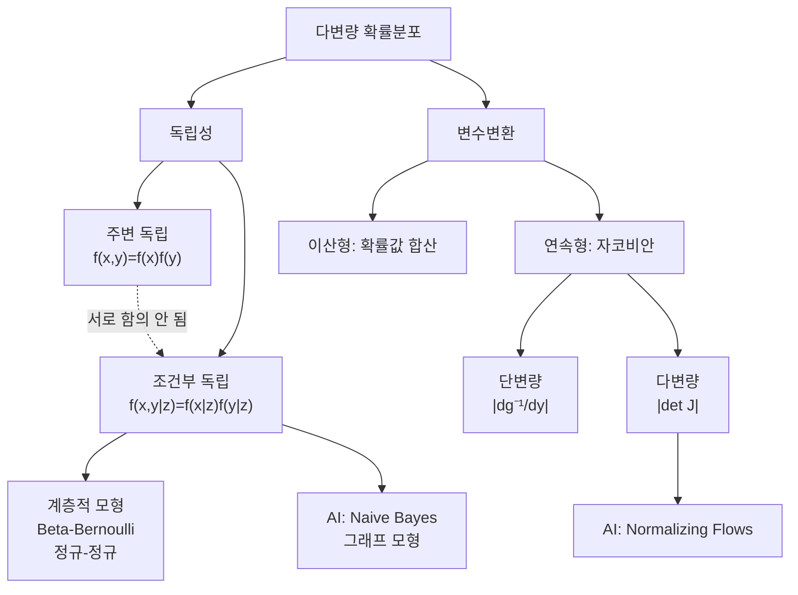

# 12강. AI를위한수학의응용: 다변량 확률분포(3) — 독립·조건부독립·변수변환

## 🔗 선수 지식 (Prerequisites)
- [ ] **필수**: [10강. 다변량 확률분포(1)](10강.md) — 결합/주변/조건부 분포 - 이해 완료?
- [ ] **필수**: [11강. 다변량 확률분포(2)](11강.md) — 공분산·상관계수·조건부 기댓값/분산 - 이해 완료?
- [ ] **필수**: [9강. 확률분포](9강.md) — Beta, 정규, 베르누이분포의 pmf/pdf
- [ ] **권장**: 다변수 미적분(편미분, 야코비안 det), 행렬식 계산
- **관련 단원**: [13강](13강.md) (예정), [회귀모형 — 다변량 정규의 조건부 추론](../회귀모형/)

---

## 학습 목표
1. 두 확률변수의 **독립**과 **조건부 독립**의 정의를 구분하고, 한 쪽이 성립해도 다른 쪽은 성립하지 않을 수 있음을 예시와 함께 설명할 수 있다.
2. **변수변환**의 필요성을 이해하고, 이산형/연속형 각각의 변환 절차를 수행할 수 있다.
3. 단변량/다변량 연속형 변환에서 **자코비안(역함수 미분 / 야코비 행렬식)** 을 활용하여 변환된 확률밀도함수를 도출할 수 있다.

---

## 🧠 메타인지 체크 (학습 전/후 자기 평가)

### 학습 전 자기 평가
| 소주제 | 자신감 (1-5) |
| :--- | :--- |
| 독립의 정의·동치 조건 ($f_{X,Y}=f_X f_Y$) | |
| 조건부 독립과 독립의 차이 | |
| 계층적 모형 (Beta-Bernoulli, 정규-정규) | |
| 이산형 변수변환 (확률값 직접 대입) | |
| 단변량 연속형 변수변환 (자코비안) | |
| 다변량 변수변환 (야코비 행렬식) | |

### 학습 후 교정 (학습 완료 후 작성)
| 소주제 | 학습 전 | 학습 후 | 실제 정답률 | 과신/과소 여부 |
| :--- | :--- | :--- | :--- | :--- |
| 독립의 정의 | | | | |
| 조건부 독립 | | | | |
| 계층적 모형 | | | | |
| 이산형 변환 | | | | |
| 단변량 자코비안 | | | | |
| 다변량 야코비 행렬식 | | | | |

> **활용법**: 학습 전 1분 → 자신감 기입, 학습 후 1분 → 나머지 기입. "과신" 영역이 실제 취약점.

---

## 📝 요약 (Summary)

### 독립과 조건부 독립 🔴
1. **독립의 정의** 🔴: 두 확률변수 $X, Y$가 독립이면 결합분포가 주변분포의 곱으로 분리된다. 즉 $f_{X,Y}(x,y)=f_X(x)f_Y(y)$. 임의의 함수 $g, h$에 대해 $E[g(X)h(Y)]=E[g(X)]E[h(Y)]$ 가 성립한다.
2. **독립의 따름 성질** 🔴: 독립이면 $\text{Cov}(X,Y)=0$, $\text{Var}(X+Y)=\text{Var}(X)+\text{Var}(Y)$. 단, 역은 일반적으로 성립하지 않는다(비상관 ≠ 독립).
3. **조건부 독립** 🔴: $X, Y$가 $Z$가 주어졌을 때 조건부 독립이라는 것은 $f_{X,Y|Z}(x,y\mid z)=f_{X|Z}(x\mid z)\,f_{Y|Z}(y\mid z)$ 가 모든 $z$에서 성립함을 의미한다. 표기는 $X \perp\!\!\!\perp Y \mid Z$.
4. **독립 ≠ 조건부 독립** 🔴: 한쪽이 성립해도 다른 쪽이 반드시 성립하지는 않는다. (예: Berkson 패러독스, Simpson 패러독스)
5. **계층적 모형 — Beta-Bernoulli** 🟡: $\theta\sim\text{Beta}(\alpha,\beta)$, $X_i\mid\theta\stackrel{iid}{\sim}\text{Ber}(\theta)$ 인 모형. $X_i$들은 $\theta$ 조건 하에서는 조건부 독립이지만, 주변적으로는 독립이 아니다.
6. **계층적 모형 — 정규-정규** 🟡: $\mu\sim N(\mu_0,\tau^2)$, $X_i\mid\mu\stackrel{iid}{\sim}N(\mu,\sigma^2)$. 주변 분포 $X_i\sim N(\mu_0,\sigma^2+\tau^2)$이고, $\text{Cov}(X_i,X_j)=\tau^2$ (양의 상관).

### 변수변환 🔴
7. **이산형 변수변환** 🟡: $Y=g(X)$일 때 $p_Y(y)=\sum_{x:\,g(x)=y} p_X(x)$. 즉, 같은 $y$로 매핑되는 모든 $x$의 확률을 합한다.
8. **단변량 연속형 변수변환 (자코비안)** 🔴: $Y=g(X)$이고 $g$가 단조이며 미분가능하면,
    $$f_Y(y)=f_X\bigl(g^{-1}(y)\bigr)\left|\frac{d\,g^{-1}(y)}{dy}\right|.$$
9. **다변량 연속형 변수변환 (야코비 행렬식)** 🔴: $\mathbf{Y}=\mathbf{g}(\mathbf{X})$가 일대일·미분가능이면,
    $$f_\mathbf{Y}(\mathbf{y})=f_\mathbf{X}\bigl(\mathbf{g}^{-1}(\mathbf{y})\bigr)\,|\det J|,\quad J=\frac{\partial \mathbf{g}^{-1}(\mathbf{y})}{\partial \mathbf{y}}.$$
10. **선형변환의 특수 경우** 🟢: $\mathbf{Y}=A\mathbf{X}+b$ (A 가역)이면 $\det J=\det(A^{-1})=1/\det A$이므로 $f_\mathbf{Y}(\mathbf{y})=f_\mathbf{X}(A^{-1}(\mathbf{y}-b))/|\det A|$.

---

## 📐 핵심 수식 (Key Formulas)

### 독립·조건부 독립

| 수식명 | 수식 | 의미 |
| :--- | :--- | :--- |
| **독립 (결합=주변곱)** | $f_{X,Y}(x,y)=f_X(x)f_Y(y)$ | 결합 pdf/pmf 가 두 주변의 곱으로 분리 |
| **독립 (기댓값 분해)** | $E[g(X)h(Y)]=E[g(X)]E[h(Y)]$ | 임의 함수에 대해 곱의 기댓값이 분해됨 |
| **독립 → 공분산 0** | $\text{Cov}(X,Y)=0,\ \rho=0$ | 독립이면 비상관, 역은 일반적으로 거짓 |
| **조건부 독립** | $f_{X,Y\mid Z}(x,y\mid z)=f_{X\mid Z}(x\mid z)f_{Y\mid Z}(y\mid z)$ | $Z$ 고정 시 $X,Y$ 결합이 분리됨 |
| **체인룰(Z 매개)** | $f_{X,Y,Z}(x,y,z)=f_{X\mid Z}(x\mid z)f_{Y\mid Z}(y\mid z)f_Z(z)$ | 조건부 독립이면 결합이 이렇게 인수분해 |
| **독립 합의 MGF/특성함수 곱** | $M_{X+Y}(t)=M_X(t)\,M_Y(t)$, $\varphi_{X+Y}(t)=\varphi_X(t)\varphi_Y(t)$ (독립 시) | 합성곱의 "주파수 영역" 버전 — 곱으로 분해되어 합의 분포를 즉시 식별 |

### 변수변환

| 수식명 | 수식 | 의미 |
| :--- | :--- | :--- |
| **이산형 변환** | $p_Y(y)=\displaystyle\sum_{x:\,g(x)=y} p_X(x)$ | $y$로 매핑되는 모든 $x$ 확률의 합 |
| **단변량 연속형 변환** | $f_Y(y)=f_X(g^{-1}(y))\,\bigl\lvert (g^{-1})'(y)\bigr\rvert$ | 역함수의 미분(자코비안) 절댓값 곱 |
| **다변량 연속형 변환** | $f_\mathbf{Y}(\mathbf{y})=f_\mathbf{X}(\mathbf{g}^{-1}(\mathbf{y}))\,\lvert\det J\rvert$ | 야코비 행렬식의 절댓값 곱 |
| **선형 변환** | $f_\mathbf{Y}(\mathbf{y})=f_\mathbf{X}(A^{-1}(\mathbf{y}-b))/\lvert\det A\rvert$ | 어파인 변환의 자코비안은 $\det A$ |

### 주요 정리/정의

**정리 1. 독립의 동치 조건**
다음 세 명제는 모두 동치이다.
1. $X \perp\!\!\!\perp Y$ (독립)
2. 모든 $x, y$에 대해 $f_{X,Y}(x,y)=f_X(x)f_Y(y)$
3. 임의의 (적분가능한) 함수 $g, h$에 대해 $E[g(X)h(Y)]=E[g(X)]E[h(Y)]$

> **직관적 해석**: 독립이라는 것은 "$X$를 안다고 해도 $Y$의 분포에 대한 정보가 전혀 바뀌지 않는다" 는 것이다.
> **AI 적용**: 나이브 베이즈(Naive Bayes)는 클래스 $Y$가 주어졌을 때 모든 특성 $X_i$들이 **조건부 독립**이라는 가정 위에 세워진다. 정확히는 $X_i\perp\!\!\!\perp X_j\mid Y$.

**정리 2. 단변량 연속형 변수변환 공식 (Change of Variables)**
$X$가 pdf $f_X$를 가지고, $Y=g(X)$, $g$가 정의역에서 단조·미분가능이면
$$
f_Y(y) = f_X\!\bigl(g^{-1}(y)\bigr)\left|\frac{d}{dy}g^{-1}(y)\right| \quad (y \in g(\text{supp}(X))).
$$
> **직관적 해석**: 확률 질량이 보존되어야 하므로 $|f_Y(y)\,dy|=|f_X(x)\,dx|$, 따라서 $f_Y(y)=f_X(x)\,|dx/dy|$. $|dx/dy|$ 가 바로 자코비안이다.
> **AI 적용**: 정규화 흐름(Normalizing Flows)·VAE의 reparameterization·변분추론에서 잠재변수 분포를 데이터 분포로 옮길 때 핵심 도구.

**정리 3. 다변량 변수변환 (Jacobian Theorem)**
$\mathbf{X}\in\mathbb{R}^n$이 pdf $f_\mathbf{X}$를 가지고, $\mathbf{g}:\mathbb{R}^n\to\mathbb{R}^n$ 이 일대일·연속미분가능이면, $\mathbf{Y}=\mathbf{g}(\mathbf{X})$의 pdf 는
$$
f_\mathbf{Y}(\mathbf{y})=f_\mathbf{X}\!\bigl(\mathbf{g}^{-1}(\mathbf{y})\bigr)\,\bigl|\det J(\mathbf{y})\bigr|,\qquad J_{ij}=\frac{\partial (g^{-1})_i}{\partial y_j}.
$$
> **직관적 해석**: $|\det J|$ 는 변환의 "부피 확대율"의 역수. 부피가 커지면 같은 확률을 넓게 펴야 하므로 밀도는 줄어든다.
> **AI 적용**: RealNVP, Glow 같은 정규화 흐름 모델의 손실 함수에 $\log|\det J|$ 항이 명시적으로 등장한다.

> ⚠️ **흔한 오해**
> - **"독립 ⇒ 조건부 독립" 또는 "조건부 독립 ⇒ 독립"** — 둘 다 일반적으로 거짓이며 서로 함의하지 않는다. 조건부 독립인데 주변 종속(공통원인, Beta-Bernoulli), 주변 독립인데 조건부 종속(충돌체/collider, $Z=X+Y$) 모두 가능하다.
> - **"$\mathrm{Cov}(X,Y)=0$ ⇒ 독립"** — 거짓. **결합 정규분포에서만** 동치. $X\sim U(-1,1),Y=X^2$ 또는 $X\sim N(0,1),Y=|X|$가 반례.
> - **"독립이면 $X+Y$의 분포는 두 분포의 '합'"** — 거짓. **합성곱(convolution)** $f_{X+Y}(z)=\int f_X(x)f_Y(z-x)\,dx$로 결합된다. 단, 독립 정규의 합은 다시 정규이며 평균·분산이 각각 더해진다.
> - **합성곱을 직접 적분하지 말고 MGF/특성함수 곱을 써라** — 독립이면 적률생성함수가 $M_{X+Y}(t)=M_X(t)M_Y(t)$ (특성함수는 $\varphi_{X+Y}(t)=\varphi_X(t)\varphi_Y(t)$) 로 **곱**이 된다. 적분(합성곱)을 직접 푸는 대신 곱을 취하고 알려진 MGF와 대조하면 합의 분포가 바로 식별된다. 근거: [Moment-generating function — Wikipedia](https://en.wikipedia.org/wiki/Moment-generating_function)

> 🧮 **독립 합을 MGF로 즉시 도출하기 (정규합·감마합)**
> - **정규의 합**: $X\sim N(\mu_X,\sigma_X^2)$, $Y\sim N(\mu_Y,\sigma_Y^2)$ 가 독립이면 $M_X(t)=\exp(\mu_X t+\tfrac12\sigma_X^2 t^2)$ 이므로 $M_{X+Y}(t)=M_X(t)M_Y(t)=\exp\!\big((\mu_X+\mu_Y)t+\tfrac12(\sigma_X^2+\sigma_Y^2)t^2\big)$. 이는 $N(\mu_X+\mu_Y,\ \sigma_X^2+\sigma_Y^2)$ 의 MGF 와 정확히 같아, 합성곱 적분 없이 정규합이 다시 정규임을 곧바로 얻는다.
> - **같은 rate 감마의 합**: $X\sim\Gamma(\alpha,\beta)$, $Y\sim\Gamma(\alpha',\beta)$ (동일 rate $\beta$) 가 독립이면 $M_X(t)=(1-t/\beta)^{-\alpha}$ 이므로 $M_{X+Y}(t)=(1-t/\beta)^{-(\alpha+\alpha')}$ → $X+Y\sim\Gamma(\alpha+\alpha',\beta)$ (shape 가 더해짐). 따라서 독립 $\chi^2_{k_1}=\Gamma(k_1/2,1/2)$ 와 $\chi^2_{k_2}=\Gamma(k_2/2,1/2)$ 의 합이 $\chi^2_{k_1+k_2}$ 가 되는 카이제곱 가법성도 같은 한 줄로 증명된다(rate $1/2$ 가 같아야 성립). 근거: [Moment-generating function — Wikipedia](https://en.wikipedia.org/wiki/Moment-generating_function)
> - **변환 공식에서 절댓값 누락** — $f_Y(y)=f_X(g^{-1}(y))\,|(g^{-1})'(y)|$에서 **절댓값이 필수**다. 감소함수면 $(g^{-1})'<0$이라 절댓값 없이는 pdf가 음수가 되어 적분이 1이 되지 않는다. 다변량도 $\det J$가 아니라 $|\det J|$.
> - **다대일 변환에 단조 공식 직접 적용** — 거짓. $Y=X^2$처럼 $g$가 일대일이 아니면 모든 분지($x=\pm\sqrt y$)의 기여를 **합산**해야 한다.

---

## 📊 개념 시각화 (Visual Guide)

### 개념 관계도


### 핵심 도식 — 독립성 판정

| 입력 | 연산 | 출력 | AI 적용 |
| :--- | :--- | :--- | :--- |
| 결합 pdf $f_{X,Y}$ | $f_X(x)f_Y(y)$와 비교 | 독립/비독립 | 특성 간 상관성 판단, EDA |
| 결합 pdf + $Z$ | $f_{X\mid Z}f_{Y\mid Z}$와 비교 | 조건부 독립/비독립 | 그래프 모형(베이즈망) d-separation |
| 결합 → 공분산 | $E[XY]-E[X]E[Y]$ | $\text{Cov}=0\Rightarrow$ 비상관 | PCA(비상관 축 추출) |

### 핵심 도식 — 변수변환

| 입력 | 연산 | 출력 | AI 적용 |
| :--- | :--- | :--- | :--- |
| 이산 $p_X$, $Y=g(X)$ | 같은 $y$로 가는 $x$ 합산 | $p_Y$ | 카테고리 결합/리매핑 |
| 연속 $f_X$, $Y=g(X)$ 단조 | $f_X(g^{-1}(y))\,\lvert(g^{-1})'(y)\rvert$ | $f_Y$ | 표준화·로그변환 후 분포 |
| 결합 $f_\mathbf{X}$, $\mathbf{Y}=A\mathbf{X}+b$ | $f_\mathbf{X}(A^{-1}(\mathbf{y}-b))/\lvert\det A\rvert$ | $f_\mathbf{Y}$ | 화이트닝, 정규화 흐름 |

---

## ✏️ 심화 학습 (Study Subject)

### 1. 가상 시나리오: "어떤 개념을, 언제 사용해야 할까?"
- **상황**: 의료 데이터에서 환자의 "유전적 위험도 $Z$"가 주어졌을 때, 두 가지 증상 $X$(심장 박동 이상)와 $Y$(혈압 이상)가 어떤 관계인지 알고 싶다. 단순 상관표만 보면 $X$와 $Y$가 강하게 상관되어 있는데, 이것이 두 증상이 직접적인 인과 관계여서인지, 아니면 공통 원인 $Z$ 때문에 생긴 가짜 상관(spurious correlation)인지가 핵심 쟁점이다.
- **문제**: $X$와 $Y$가 **주변적으로는 의존**이지만 $Z$ **조건 하에서는 독립** 일 수 있는가? 이 경우 어떤 결합 분포 구조를 가정해야 하는가?
- **해결**: 계층적 모형 $f(x,y,z)=f(x\mid z)f(y\mid z)f(z)$ 를 가정하면 $X \perp\!\!\!\perp Y\mid Z$ 이지만, $f(x,y)=\int f(x\mid z)f(y\mid z)f(z)\,dz$는 일반적으로 $f_X(x)f_Y(y)$가 아니다(주변 독립이 아님). 예: $Z\sim N(0,\tau^2)$, $X\mid Z, Y\mid Z \stackrel{iid}{\sim} N(Z,\sigma^2)$이면 $\text{Cov}(X,Y)=\tau^2>0$.
- **AI 학습 포인트**: "베이즈 네트워크에서 d-separation 규칙(특히 chain·common cause·collider 구조)이 조건부 독립을 어떻게 결정하는지, 위 시나리오를 예로 들어 설명해줘. Collider 가 추가될 때 발생하는 Berkson 패러독스도 함께."

### 2. 관점별 비교 및 오개념 분석
- **핵심 비교**: '독립 vs 조건부 독립 vs 비상관'

| 구분 | 독립 $X\perp\!\!\!\perp Y$ | 조건부 독립 $X\perp\!\!\!\perp Y\mid Z$ | 비상관 $\text{Cov}(X,Y)=0$ |
| :--- | :--- | :--- | :--- |
| 정의 | $f_{X,Y}=f_X f_Y$ | $f_{X,Y\mid Z}=f_{X\mid Z}f_{Y\mid Z}$ | 1차 모멘트만 분해 |
| 함의 | $\Rightarrow$ 비상관 | 독립과 일반적으로 무관 | 독립과 일반적으로 무관 |
| 정규분포 특수 | 독립 ⇔ 비상관 | — | 정규에서 비상관 ⇒ 독립 |

- **오개념 분석**:
    - **오개념 1**: "$X$와 $Y$가 독립이면 $X+Y$의 분포는 $X$와 $Y$의 분포의 합이다."
    - **분석**: 분포가 합쳐지는 것이 아니라 **합성곱(convolution)** 으로 결합된다. $f_{X+Y}(z)=\int f_X(x)f_Y(z-x)\,dx$. 분포 자체를 더하는 것이 아니라 확률밀도를 적분으로 결합한다.
    - **오개념 2**: "$\text{Cov}(X,Y)=0$이면 $X$와 $Y$는 독립이다."
    - **분석**: 일반적으로 거짓. 예: $X\sim U(-1,1)$, $Y=X^2$이면 $\text{Cov}(X,Y)=E[X^3]-E[X]E[X^2]=0$ 이지만 $Y$는 $X$에 의해 완전히 결정되므로 독립이 아니다. **단, $(X,Y)$가 다변량 정규일 때만 비상관 ⇔ 독립이 성립**.
    - **오개념 3**: "조건부 독립이 성립하면 주변적으로도 독립이다."
    - **분석**: 거짓. Beta-Bernoulli 모형에서 $X_1,\ldots,X_n\mid\theta$ 는 iid 이지만, $\theta$ 를 적분하여 얻은 주변분포에서는 $X_i$ 들이 양의 상관을 가진다 (한쪽이 1이면 $\theta$ 가 클 가능성이 높아져 다른 쪽도 1이 될 가능성이 높아짐).
- **AI 학습 포인트**: "정규분포에서 비상관 ⇒ 독립이 성립하는 이유를 적률생성함수(MGF) 관점에서 증명해주고, 비정규 분포에서 비상관이지만 독립이 아닌 반례를 두 가지 추가로 제시해줘."

---

## ❓ 연습 문제 및 해설

> **블룸 인지 수준 범례**: [기억] 정의·나열 → [이해] 설명·비교 → [적용] 계산·구현 → [분석] 구별·디버그 → [평가] 판단·비평 → [창조] 설계·제안

### 📝 문제

**1. ⭐ [기억] 두 확률변수 $X, Y$가 독립일 때 성립하는 식으로 옳은 것은?[(해설)](#prob-1)** 📌
   > ① $f_{X,Y}(x,y) = f_X(x) + f_Y(y)$
   > ② $f_{X,Y}(x,y) = f_X(x) \cdot f_Y(y)$
   > ③ $f_{X,Y}(x,y) = f_X(x) / f_Y(y)$
   > ④ $f_{X,Y}(x,y) = \max(f_X(x), f_Y(y))$

<br>

**2. ⭐ [이해] 다음 중 항상 옳은 명제는?[(해설)](#prob-2)** 📌
   > ① $\text{Cov}(X,Y)=0$ 이면 $X$와 $Y$는 독립이다.
   > ② $X$와 $Y$가 독립이면 $\text{Cov}(X,Y)=0$이다.
   > ③ $X$와 $Y$가 조건부 독립 ($X\perp\!\!\!\perp Y\mid Z$) 이면 주변 독립이다.
   > ④ $X$와 $Y$가 주변 독립이면 임의의 $Z$에 대해 조건부 독립이다.

<br>

**3. ⭐⭐ [적용] $X\sim U(0,1)$일 때 $Y=-\ln X$의 확률밀도함수 $f_Y(y)$ 를 구한 것으로 옳은 것은?[(해설)](#prob-3)** 📌
   > ① $f_Y(y) = e^{-y},\ y\ge 0$
   > ② $f_Y(y) = e^{y},\ y\ge 0$
   > ③ $f_Y(y) = \dfrac{1}{y},\ y>0$
   > ④ $f_Y(y) = 1,\ y\in[0,1]$

<br>

**4. ⭐⭐ [적용] $X\sim N(0,1)$ 일 때 $Y=X^2$ 의 pdf 를 자코비안 공식으로 구할 때 옳은 것은? (단, $y>0$)[(해설)](#prob-4)** 📌
   > <보기>
   >
   > 가. $g(x)=x^2$ 는 $\mathbb{R}$ 전체에서 일대일이 아니므로 직접 자코비안 공식이 적용되지 않는다.
   > 나. $X=\pm\sqrt{y}$ 두 분지를 모두 고려해야 하며, $f_Y(y)=\dfrac{1}{\sqrt{2\pi y}}e^{-y/2}$ 가 된다.
   > 다. $Y$는 자유도 1 의 카이제곱분포 $\chi^2_1$ 을 따른다.

   > ① 가
   > ② 가, 나
   > ③ 나, 다
   > ④ 가, 나, 다

<br>

**5. ⭐⭐ [분석] 다음 중 "비상관이지만 독립이 아닌" 예시로 옳은 것은? (다중 선택 형식)[(해설)](#prob-5)** 📌
   > <보기>
   >
   > 가. $X\sim U(-1,1),\ Y=X^2$
   > 나. $X,Y \stackrel{iid}{\sim} N(0,1)$
   > 다. $X\sim N(0,1),\ Y=|X|$

   > ① 가
   > ② 가, 다
   > ③ 나, 다
   > ④ 가, 나, 다

<br>

**6. ⭐⭐ [적용] Beta-Bernoulli 계층적 모형 $\theta\sim\text{Beta}(\alpha,\beta),\ X_i\mid\theta\stackrel{iid}{\sim}\text{Ber}(\theta)$ 에서 $E[X_1]$ 의 값으로 옳은 것은?[(해설)](#prob-6)** 📌
   > ① $\dfrac{\alpha}{\alpha+\beta}$
   > ② $\dfrac{\beta}{\alpha+\beta}$
   > ③ $\dfrac{\alpha\beta}{(\alpha+\beta)^2(\alpha+\beta+1)}$
   > ④ $\alpha+\beta$

<br>

**7. ⭐⭐⭐ [적용/분석] 정규-정규 계층 모형 $\mu\sim N(0,\tau^2),\ X_i\mid\mu\stackrel{iid}{\sim} N(\mu,\sigma^2)$ 에서 $\text{Cov}(X_1, X_2)$ 의 값으로 옳은 것은? (단, $i\ne j$)[(해설)](#prob-7)** 📌
   > ① $0$
   > ② $\sigma^2$
   > ③ $\tau^2$
   > ④ $\sigma^2+\tau^2$

<br>

**8. ⭐⭐⭐ [적용] $(X,Y)$ 가 결합 pdf $f(x,y)=2,\ 0<x<y<1$ 을 가질 때, $(U,V)=(X,Y-X)$ 로 변수변환했을 때 $(U,V)$ 의 결합 pdf 와 지지(support)로 옳은 것은?[(해설)](#prob-8)** 📌
   > ① $f_{U,V}(u,v)=2,\ 0<u<1,\ 0<v<1-u$
   > ② $f_{U,V}(u,v)=1,\ 0<u<1,\ 0<v<1$
   > ③ $f_{U,V}(u,v)=2,\ u,v>0,\ u+v<1$
   > ④ ① 과 ③ 모두 옳다 (같은 영역을 다르게 쓴 것)

<br>

**9. ⭐⭐⭐ [평가/창조] $X,Y\stackrel{iid}{\sim} \text{Exp}(\lambda)$ 일 때, $U=X+Y,\ V=X/(X+Y)$ 의 결합 pdf 를 자코비안 공식으로 도출하고, $U$ 와 $V$ 가 **독립** 임을 보여라. 또한 $U$ 와 $V$ 의 주변 분포를 식별하라.[(해설)](#prob-9)**

<br>

**10. ⭐⭐⭐ [평가] 다음 설명 중 옳은 것을 모두 고른 것은?[(해설)](#prob-10)** 📌
   > <보기>
   >
   > 가. $X,Y$가 독립이면 $E[g(X)h(Y)]=E[g(X)]E[h(Y)]$ 가 임의의 함수 $g,h$에 대해 성립한다.
   > 나. 다변량 변수변환에서 변환된 pdf 에는 $|\det J|$ 가 아니라 $\det J$ 가 그대로 들어간다.
   > 다. 이산형 확률변수의 변환 $Y=g(X)$ 에서 $p_Y(y)=\sum_{x:\,g(x)=y} p_X(x)$ 이다.
   > 라. 다변량 정규분포의 경우, 비상관과 독립은 동치이다.

   > ① 가, 다
   > ② 가, 다, 라
   > ③ 나, 다, 라
   > ④ 가, 나, 다, 라

---

### 🔑 정답 및 해설 (먼저 풀어본 후 펼치기)

<details>
<summary>정답 보기 (클릭)</summary>

1. ②
2. ②
3. ①
4. ④
5. ②
6. ①
7. ③
8. ① (③도 동일 영역을 표현하므로 동치)
9. 풀이 참조 — $f_{U,V}(u,v)=\lambda^2 u e^{-\lambda u}$, $V\sim U(0,1)$, $U\sim \Gamma(2,\lambda)$, 독립
10. ②

</details>

<details>
<summary>해설 보기 (클릭)</summary>

<a id="prob-1"></a>
**1. ⭐ [기억] 독립의 정의**
> **정답: ② $f_{X,Y}(x,y)=f_X(x)f_Y(y)$**
> **해설**: 독립의 정의 자체. ①은 분포의 결합이 합으로 분해되지 않음(차원이 안 맞음), ③④도 일반적으로 거짓.

<a id="prob-2"></a>
**2. ⭐ [이해] 독립과 비상관·조건부 독립의 함의 관계**
> **정답: ② 독립 ⇒ Cov=0**
> **해설**: ① 비상관 ⇏ 독립 (예: $X\sim U(-1,1),\ Y=X^2$). ③ 조건부 독립 ⇏ 주변 독립 (Beta-Bernoulli 반례). ④ 주변 독립이라도 $Z$를 적절히 잡으면 조건부 의존이 될 수 있다(예: collider 구조 $Z=X+Y$). 독립 ⇒ Cov=0 은 $E[XY]=E[X]E[Y]$ 로부터 직접 따라온다.

<a id="prob-3"></a>
**3. ⭐⭐ [적용] $Y=-\ln X,\ X\sim U(0,1)$ — 역CDF로 지수분포 생성**
> **정답: ① $f_Y(y)=e^{-y},\ y\ge 0$**
> **해설**: $X=e^{-Y}$, $\dfrac{dx}{dy}=-e^{-y}$, $|dx/dy|=e^{-y}$. $f_X(x)=1$ on $(0,1)$ 이므로 $f_Y(y)=1\cdot e^{-y}=e^{-y},\ y\ge 0$. 즉 $Y\sim\text{Exp}(1)$. (역CDF 표본 추출 기법의 정석 예제 — 9강과 연결.)

<a id="prob-4"></a>
**4. ⭐⭐ [적용] $Y=X^2,\ X\sim N(0,1)$ — 다분지 변환과 카이제곱**
> **정답: ④ 가, 나, 다 모두 옳다**
> **해설**: $g(x)=x^2$ 은 $\mathbb{R}$ 에서 일대일이 아니므로 두 분지 $x=\sqrt{y}, x=-\sqrt{y}$ 를 모두 더해야 한다. $f_Y(y)=f_X(\sqrt{y})\cdot\frac{1}{2\sqrt{y}}+f_X(-\sqrt{y})\cdot\frac{1}{2\sqrt{y}}=\frac{2}{2\sqrt{y}}\cdot\frac{1}{\sqrt{2\pi}}e^{-y/2}=\frac{1}{\sqrt{2\pi y}}e^{-y/2},\ y>0$. 이는 정확히 $\chi^2_1$ 의 pdf ($\Gamma(1/2, 1/2)$).
> ⚠️ **표기 규약 주의**: 본 노트의 감마분포 $\Gamma(\text{shape},\text{rate})$ 는 **rate(역척도) 규약**을 쓴다. 즉 $\Gamma(\alpha,\beta)$ 의 pdf 는 $\frac{\beta^\alpha}{\Gamma(\alpha)}x^{\alpha-1}e^{-\beta x}$, 평균은 $\alpha/\beta$. 따라서 $\chi^2_1=\Gamma(1/2,\,1/2)$ 의 두 번째 인자 $1/2$ 는 **rate** 이며 평균은 $\frac{1/2}{1/2}=1$ (자유도 1 카이제곱의 평균과 일치). 만약 같은 표기를 scale 규약($\text{shape},\text{scale}$, 평균 $\alpha\theta$)으로 잘못 읽으면 평균이 $\frac12\cdot\frac12=\frac14$ 로 틀어지므로 반드시 구별해야 한다. 근거: [Relationship between chi-squared and gamma — StatProofBook](https://statproofbook.github.io/P/chi2-gam.html)

<a id="prob-5"></a>
**5. ⭐⭐ [분석] 비상관 ≠ 독립의 반례 식별**
> **정답: ② 가, 다**
> **해설**:
> - 가: $E[XY]=E[X^3]=0,\ E[X]=0$ 이므로 $\text{Cov}=0$. 하지만 $Y$가 $X$로 결정되므로 독립 아님.
> - 나: $X,Y$ iid 정규이면 독립이면서 비상관. (반례가 아니므로 제외)
> - 다: $E[XY]=E[X|X|]=0$ ($x|x|$는 기함수이고 $X$의 밀도가 대칭), $E[X]=0$ → $\text{Cov}(X,Y)=0$. 그러나 $Y=|X|$는 $X$의 함수이므로 명백히 종속. ("독립이 아닌 비상관"의 강건한 예 — 절댓값은 비선형 종속이라 공분산이 잡지 못한다.)
> - ⚠️ 주의: $X=\theta,\ Y=\theta^2$ ($\theta\in\{-1,1\}$)처럼 $Y$가 **상수**가 되는 구성은 반례가 아니다. 상수(축퇴 분포)는 어떤 확률변수와도 **독립**이므로 "비상관이면서 종속"의 예가 될 수 없다.

<a id="prob-6"></a>
**6. ⭐⭐ [적용] Beta-Bernoulli 계층 모형의 주변 기댓값**
> **정답: ① $\dfrac{\alpha}{\alpha+\beta}$**
> **해설**: 전체 기댓값 법칙(Law of Total Expectation): $E[X_1]=E[E[X_1\mid\theta]]=E[\theta]=\dfrac{\alpha}{\alpha+\beta}$ (Beta 분포의 평균).

<a id="prob-7"></a>
**7. ⭐⭐⭐ [적용/분석] 정규-정규 계층 모형의 주변 공분산**
> **정답: ③ $\tau^2$**
> **해설**: $\text{Cov}(X_1, X_2) = E[\text{Cov}(X_1,X_2\mid\mu)] + \text{Cov}(E[X_1\mid\mu], E[X_2\mid\mu])$. 조건부 독립이므로 첫 항 $=0$. 두 번째 항 $=\text{Cov}(\mu,\mu)=\text{Var}(\mu)=\tau^2$. 즉 주변적으로 $X_1, X_2$ 는 $\tau^2$ 만큼 양의 상관을 가지며, $\tau^2>0$ 이면 주변 독립이 아니다.

<a id="prob-8"></a>
**8. ⭐⭐⭐ [적용] 이변량 선형 변수변환의 자코비안**
> **정답: ① (③과 동치)**
> **해설**: $u=x,\ v=y-x \Rightarrow x=u,\ y=u+v$. 야코비 행렬 $J=\begin{pmatrix}\partial x/\partial u & \partial x/\partial v\\ \partial y/\partial u & \partial y/\partial v\end{pmatrix}=\begin{pmatrix}1 & 0\\ 1 & 1\end{pmatrix}$, $\det J=1$. 따라서 $f_{U,V}(u,v)=f_{X,Y}(u, u+v)\cdot|1|=2$. 지지: $0<x<y<1 \Leftrightarrow 0<u, v>0, u+v<1 \Leftrightarrow 0<u<1, 0<v<1-u$. ①과 ③은 동일 영역의 다른 표기.

<a id="prob-9"></a>
**9. ⭐⭐⭐ [평가/창조] 지수분포 합과 비의 독립 — 핵심 결과**
> **정답**: $f_{U,V}(u,v)=\lambda^2 u e^{-\lambda u}\cdot\mathbb{1}_{(0,1)}(v)$, $V\sim U(0,1)$, $U\sim \Gamma(2,\lambda)$, $U\perp\!\!\!\perp V$.
> **해설**:
> 1. **결합 pdf**: $X,Y\stackrel{iid}{\sim}\text{Exp}(\lambda)$ 이므로 $f_{X,Y}(x,y)=\lambda^2 e^{-\lambda(x+y)},\ x,y>0$.
> 2. **변환**: $u=x+y,\ v=\dfrac{x}{x+y}\Rightarrow x=uv,\ y=u(1-v)$. 지지: $u>0,\ 0<v<1$.
> 3. **야코비**: $J=\begin{pmatrix}\partial x/\partial u & \partial x/\partial v\\ \partial y/\partial u & \partial y/\partial v\end{pmatrix}=\begin{pmatrix}v & u\\ 1-v & -u\end{pmatrix}$, $\det J=-uv-u(1-v)=-u$, $|\det J|=u$.
> 4. **변환된 pdf**: $f_{U,V}(u,v)=\lambda^2 e^{-\lambda u}\cdot u = \underbrace{\lambda^2 u e^{-\lambda u}}_{\Gamma(2,\lambda)\text{ pdf}}\cdot \underbrace{1}_{U(0,1)\text{ pdf}}$.
> 5. **독립 결론**: 결합 pdf 가 $u$만의 함수와 $v$만의 함수의 곱(여기서 $v$ 부분은 상수)으로 정확히 분리되므로, **$U$ 와 $V$ 는 독립**. $U\sim \Gamma(2,\lambda)$, $V\sim U(0,1)$.
> **AI 적용**: 베타-감마 관계(Beta-Gamma trick)로 디리클레 분포 표본 추출의 핵심 기법.

<a id="prob-10"></a>
**10. ⭐⭐⭐ [평가] 핵심 명제 종합 판정**
> **정답: ② 가, 다, 라**
> **해설**:
> - 가 (참): 독립의 동치 정의.
> - 나 (거짓): 부피는 항상 양수이므로 $|\det J|$ (절댓값) 가 들어가야 한다. $\det J$ 자체는 부호를 가질 수 있다.
> - 다 (참): 이산형 변환의 정의.
> - 라 (참): 다변량 정규분포의 특수 성질 — 비상관 ⇔ 독립.

</details>

---

## ✅ O/X 확인문제 (연습문항 개수의 2배 권장)

**1.** $X, Y$ 가 독립이면 $\text{Var}(X+Y)=\text{Var}(X)+\text{Var}(Y)$ 이다.[(해설)](#ox-1) **(O / X)**
**2.** $\text{Cov}(X,Y)=0$ 이면 항상 $X, Y$ 는 독립이다.[(해설)](#ox-2) **(O / X)**
**3.** $X\perp\!\!\!\perp Y\mid Z$ 이면 반드시 $X\perp\!\!\!\perp Y$ 이다.[(해설)](#ox-3) **(O / X)**
**4.** 다변량 정규분포에서는 비상관과 독립이 동치이다.[(해설)](#ox-4) **(O / X)**
**5.** 단변량 연속형 변수변환에서 $f_Y(y)=f_X(g^{-1}(y))$ 만으로 충분하다 (자코비안 불필요).[(해설)](#ox-5) **(O / X)**
**6.** 자코비안의 절댓값 $|\det J|$ 가 변환된 pdf 에 들어가는 이유는 확률은 항상 양수여야 하기 때문이다.[(해설)](#ox-6) **(O / X)**
**7.** 이산형 변환 $Y=g(X)$ 에서 $g$ 가 일대일이 아니어도 $p_Y(y)$ 를 정의할 수 있다.[(해설)](#ox-7) **(O / X)**
**8.** $X\sim U(0,1)$ 일 때 $Y=-\ln X$ 는 $\text{Exp}(1)$ 을 따른다.[(해설)](#ox-8) **(O / X)**
**9.** $X\sim N(0,1)$ 일 때 $Y=X^2$ 는 $\chi^2_1$ 을 따른다.[(해설)](#ox-9) **(O / X)**
**10.** Beta-Bernoulli 계층 모형에서 $X_1, \ldots, X_n$ 은 주변적으로도 독립이다.[(해설)](#ox-10) **(O / X)**
**11.** 정규-정규 계층 모형 $\mu\sim N(0,\tau^2),\ X_i\mid\mu\sim N(\mu,\sigma^2)$ 에서 $X_i$ 의 주변 분포는 $N(0,\sigma^2+\tau^2)$ 이다.[(해설)](#ox-11) **(O / X)**
**12.** $X,Y$ 가 독립이면 $f_{X\mid Y}(x\mid y)=f_X(x)$ 가 모든 $y$ 에서 성립한다.[(해설)](#ox-12) **(O / X)**
**13.** 선형변환 $\mathbf{Y}=A\mathbf{X}$ ($A$ 가역) 에서 변환된 pdf 는 $f_\mathbf{X}(A^{-1}\mathbf{y})/|\det A|$ 이다.[(해설)](#ox-13) **(O / X)**
**14.** $X^2$ 와 $X$ 는 항상 비독립이지만 비상관일 수 있다.[(해설)](#ox-14) **(O / X)**
**15.** 조건부 독립은 항상 주변 독립보다 약한 조건이다.[(해설)](#ox-15) **(O / X)**
**16.** 나이브 베이즈 분류기는 클래스가 주어졌을 때 특성들이 **조건부 독립**이라는 가정을 사용한다.[(해설)](#ox-16) **(O / X)**
**17.** $X,Y\stackrel{iid}{\sim}\text{Exp}(\lambda)$ 일 때 $X+Y$ 와 $X/(X+Y)$ 는 독립이다.[(해설)](#ox-17) **(O / X)**
**18.** 단조함수 $g$ 가 감소함수이면 자코비안 공식에서 $(g^{-1})'(y)<0$ 이므로 절댓값을 취하지 않으면 pdf 가 음수가 될 수 있다.[(해설)](#ox-18) **(O / X)**
**19.** 정규화 흐름(Normalizing Flows) 의 학습 손실 함수에는 $\log|\det J|$ 항이 등장한다.[(해설)](#ox-19) **(O / X)**
**20.** 야코비 행렬식 $\det J$ 의 값이 클수록 변환된 영역에서 확률밀도는 더 커진다.[(해설)](#ox-20) **(O / X)**

<details>
<summary>O/X 정답 및 해설 보기 (클릭)</summary>

> <a id="ox-1"></a>
> **1. 정답**: O
> **해설**: 독립이면 $\text{Cov}=0$ 이므로 $\text{Var}(X+Y)=\text{Var}(X)+\text{Var}(Y)+2\text{Cov}=\text{Var}(X)+\text{Var}(Y)$.

> <a id="ox-2"></a>
> **2. 정답**: X
> **해설**: 비상관 ⇏ 독립. 반례: $X\sim U(-1,1),\ Y=X^2$.

> <a id="ox-3"></a>
> **3. 정답**: X
> **해설**: 조건부 독립이라도 주변 독립이 아닐 수 있다. Beta-Bernoulli 반례.

> <a id="ox-4"></a>
> **4. 정답**: O
> **해설**: 다변량 정규는 비상관 ⇔ 독립이 성립하는 특수 분포족.

> <a id="ox-5"></a>
> **5. 정답**: X
> **해설**: 자코비안 $|(g^{-1})'(y)|$ 가 반드시 곱해져야 한다. 그렇지 않으면 $\int f_Y\,dy \ne 1$.

> <a id="ox-6"></a>
> **6. 정답**: O
> **해설**: pdf 는 비음수여야 하며, 부피 변환율의 부호는 무관하므로 절댓값을 취한다.

> <a id="ox-7"></a>
> **7. 정답**: O
> **해설**: $p_Y(y)=\sum_{x:\,g(x)=y} p_X(x)$ 로 여러 $x$가 같은 $y$ 로 가도 합산하면 된다.

> <a id="ox-8"></a>
> **8. 정답**: O
> **해설**: 자코비안 계산: $f_Y(y)=e^{-y}$, 표준 지수분포의 pdf.

> <a id="ox-9"></a>
> **9. 정답**: O
> **해설**: 두 분지 합으로 $f_Y(y)=\frac{1}{\sqrt{2\pi y}}e^{-y/2}=\chi^2_1$ pdf.

> <a id="ox-10"></a>
> **10. 정답**: X
> **해설**: 조건부 독립이지만 주변적으로는 양의 상관을 가짐 ($\theta$ 가 공통 잠재변수).

> <a id="ox-11"></a>
> **11. 정답**: O
> **해설**: $X_i = \mu + \epsilon_i$ 로 보면 $E[X_i]=0,\ \text{Var}(X_i)=\tau^2+\sigma^2$.

> <a id="ox-12"></a>
> **12. 정답**: O
> **해설**: $f_{X\mid Y}=f_{X,Y}/f_Y=f_X f_Y/f_Y=f_X$. 조건부 분포가 주변 분포와 일치.

> <a id="ox-13"></a>
> **13. 정답**: O
> **해설**: $\det J=\det(A^{-1})=1/\det A$, $|\det J|=1/|\det A|$. 따라서 식이 성립.

> <a id="ox-14"></a>
> **14. 정답**: O
> **해설**: $X\sim U(-1,1)$ 일 때 $\text{Cov}(X,X^2)=0$이지만 $X^2$ 는 $X$ 의 함수이므로 비독립.

> <a id="ox-15"></a>
> **15. 정답**: X
> **해설**: 두 개념 사이에 직접적인 강약 관계는 없다. 서로 다른 정보 집합에 대한 독립이며, 일반적으로 한쪽이 다른 쪽을 함의하지 않는다.

> <a id="ox-16"></a>
> **16. 정답**: O
> **해설**: Naive Bayes 는 $P(X_1,\ldots,X_d\mid Y)=\prod_i P(X_i\mid Y)$ 를 가정 (조건부 독립).

> <a id="ox-17"></a>
> **17. 정답**: O
> **해설**: 베타-감마 관계. 자코비안 계산으로 결합 pdf 가 $\Gamma(2,\lambda)\times U(0,1)$ 의 곱으로 정확히 분리 (문제 9 참조).

> <a id="ox-18"></a>
> **18. 정답**: O
> **해설**: 감소함수 예: $g(x)=-x$ → $(g^{-1})'(y)=-1$. 절댓값을 취해야 pdf 가 양수.

> <a id="ox-19"></a>
> **19. 정답**: O
> **해설**: $\log f_\mathbf{Y}(\mathbf{y})=\log f_\mathbf{X}(\mathbf{g}^{-1}(\mathbf{y}))+\log|\det J|$.

> <a id="ox-20"></a>
> **20. 정답**: X
> **해설**: 반대다. $|\det J|$ (= 역변환의 부피 확대율) 이 크면 확률을 더 넓은 영역에 펴야 하므로 변환된 영역의 pdf 는 더 작아진다. (혹은 원래 영역이 압축되어 밀도가 모인다는 관점)

</details>

---

## 🧪 자유 회상 연습 (Free Recall)

> **방법**: 위의 노트를 모두 덮고, 타이머 3분 설정 후 이번 단원에서 배운 내용을 기억나는 대로 자유롭게 적으세요.
> 정확한 문장이 아니어도 됩니다. 키워드, 수식, 관계 등 떠오르는 것을 모두 적습니다.

**자유 회상 작성란:**

```
[여기에 기억나는 내용을 자유롭게 작성]


```

> **회상 후 점검**: 노트를 다시 펼쳐 빠뜨린 내용을 확인하세요. 빠뜨린 부분이 실제 취약점입니다.
> - 회상 못한 핵심 개념: [                ]
> - 회상 못한 수식: [                ]

---

## 💻 코드로 확인하기 (Code Verification)

### (1) 조건부 독립 vs 주변 독립 — Beta-Bernoulli 모의 실험

```python
import numpy as np

rng = np.random.default_rng(0)
N = 200_000
alpha, beta = 2.0, 3.0

theta = rng.beta(alpha, beta, size=N)
X1 = rng.binomial(1, theta)
X2 = rng.binomial(1, theta)

# 주변적 독립 여부 (Cov 가 0 인지 확인)
cov = np.cov(X1, X2)[0,1]
# 이론값: Var(theta) = a*b / ((a+b)^2 (a+b+1))
var_theta_theoretical = alpha*beta / ((alpha+beta)**2 * (alpha+beta+1))
print(f"Cov(X1, X2) 표본 = {cov:.5f}")
print(f"이론 Var(theta) = {var_theta_theoretical:.5f}  (= 주변 공분산)")

# 조건부 독립 확인: theta 를 좁은 구간에 고정시켜 X1, X2 의 상관 계산
mask = (theta > 0.39) & (theta < 0.41)
cov_cond = np.cov(X1[mask], X2[mask])[0,1]
print(f"theta≈0.4 조건에서 Cov(X1,X2) ≈ {cov_cond:.5f} (0 에 가까움 → 조건부 독립)")
```

> **실행 결과 (예상)**:
> ```
> Cov(X1, X2) 표본 = 0.04003
> 이론 Var(theta) = 0.04000  (= 주변 공분산)
> theta≈0.4 조건에서 Cov(X1,X2) ≈ -0.00037 (0 에 가까움 → 조건부 독립)
> ```
> **수학적 해석**: 주변적으로는 $\text{Cov}(X_1,X_2)=\text{Var}(\theta) \approx 0.04$ 로 0 이 아니다(주변 독립 아님). 그러나 $\theta$ 를 고정하면 0 에 가깝다 ⇒ 조건부 독립.

### (2) 변수변환 — $Y=-\ln X,\ X\sim U(0,1)\Rightarrow Y\sim\text{Exp}(1)$

```python
import numpy as np
from scipy import stats

rng = np.random.default_rng(1)
X = rng.uniform(0, 1, size=100_000)
Y = -np.log(X)

# Kolmogorov-Smirnov 검정으로 Exp(1) 적합성 확인
ks_stat, p_value = stats.kstest(Y, 'expon')
print(f"KS 통계량 = {ks_stat:.4f}, p-value = {p_value:.4f}")
print(f"표본 평균 = {Y.mean():.4f} (이론값 1.0)")
print(f"표본 분산 = {Y.var():.4f} (이론값 1.0)")
```

> **실행 결과 (예상)**:
> ```
> KS 통계량 = 0.0028, p-value = 0.9024
> 표본 평균 = 1.0012 (이론값 1.0)
> 표본 분산 = 0.9985 (이론값 1.0)
> ```
> **수학적 해석**: $X\sim U(0,1)$ 에 $g(x)=-\ln x$ 를 적용하여 얻은 표본이 $\text{Exp}(1)$ 분포와 통계적으로 구분되지 않음을 확인 — 자코비안 공식으로 유도한 결과를 모의 실험으로 검증.

### (3) 다변량 변환 — 지수분포의 합과 비의 독립

```python
import numpy as np

rng = np.random.default_rng(2)
lam = 1.0
N = 100_000
X = rng.exponential(1/lam, size=N)
Y = rng.exponential(1/lam, size=N)

U = X + Y
V = X / (X + Y)

# 독립이면 Cov(U, V) = 0
print(f"Cov(U, V) = {np.cov(U, V)[0,1]:.5f}  (독립이면 0)")
print(f"V 평균 = {V.mean():.4f} (U(0,1) 이론값 0.5)")
print(f"V 분산 = {V.var():.4f} (U(0,1) 이론값 1/12 = {1/12:.4f})")
print(f"U 평균 = {U.mean():.4f} (Gamma(2,1) 이론값 2.0)")
print(f"U 분산 = {U.var():.4f} (Gamma(2,1) 이론값 2.0)")
```

> **실행 결과 (예상)**:
> ```
> Cov(U, V) = -0.00045  (독립이면 0)
> V 평균 = 0.5004 (U(0,1) 이론값 0.5)
> V 분산 = 0.0832 (U(0,1) 이론값 1/12 = 0.0833)
> U 평균 = 2.0011 (Gamma(2,1) 이론값 2.0)
> U 분산 = 1.9988 (Gamma(2,1) 이론값 2.0)
> ```
> **수학적 해석**: $U=X+Y\sim\Gamma(2,\lambda)$, $V=X/(X+Y)\sim U(0,1)$ 이며 두 변수는 독립 — 야코비안 공식으로 도출한 이론 결과(문제 9)가 검증됨.

---

## 🤖 AI 연결고리 (Math → AI Application)

| 수학 개념 | AI/ML 적용 분야 | 구체적 사례 |
| :--- | :--- | :--- |
| **조건부 독립** | 그래프 모형 / 베이즈 네트워크 | d-separation 으로 변수 간 독립 관계 추론; PC 알고리즘 인과 구조 학습 |
| **조건부 독립** | 나이브 베이즈 분류기 | $P(X\mid Y)=\prod P(X_i\mid Y)$ 가정으로 스팸 분류·문서 분류 |
| **계층적 모형** | 베이지안 추론 / Empirical Bayes | A/B 테스트의 다중 변종 통합 분석(Beta-Bernoulli), 다단계 클러스터 모형 |
| **단변량 변환 (자코비안)** | 정규화 흐름 (1D Flow) | RealNVP 의 affine coupling layer 의 단변량 분지 |
| **다변량 변환 (야코비 행렬식)** | 정규화 흐름 (NF) | Glow, RealNVP, MAF 의 가역 변환 + $\log\lvert\det J\rvert$ 손실항 |
| **다변량 변환** | VAE reparameterization | $\mathbf{z}=\mu+\sigma\odot\epsilon$ 로 분포 변환, gradient 흐름 가능 |
| **비상관 ⇏ 독립** | PCA 의 한계 | PCA 는 2차 통계(공분산)만 제거 → ICA 가 고차 통계로 진짜 독립 분리 |
| **합성곱 (독립 합 분포)** | 신호 처리 / Diffusion 모델 | 노이즈 누적 과정에서 $X_t = \sqrt{\alpha_t}X_0+\sqrt{1-\alpha_t}\epsilon$ |

---

## 📖 심화 학습 예시 답안

#### 1. 자코비안 공식이 "왜" 그렇게 생겼는가 — 기하학적 직관

연속형 변수변환에서 자코비안이 등장하는 본질적 이유는 **확률 질량의 보존** 이다.

1. **단계 1 — 미소 영역의 확률**: $X$ 가 미소 영역 $[x, x+dx]$ 에 있을 확률은 $f_X(x)\,dx$. 변환 $y=g(x)$ 를 통해 이 영역은 $[y, y+dy]$ 로 옮겨진다 ($dy = g'(x)\,dx$).
2. **단계 2 — 확률 보존**: $Y$ 가 같은 사건에 대해 가져야 할 확률은 $f_Y(y)\,dy$. 두 확률이 같아야 하므로 $f_Y(y)\,dy = f_X(x)\,dx \Rightarrow f_Y(y)=f_X(x)\left|\dfrac{dx}{dy}\right|$.
3. **단계 3 — 절댓값의 필요성**: $g$ 가 감소함수면 $dy/dx<0$ 이지만 pdf 와 $dx$, $dy$ 는 모두 양수여야 하므로 절댓값을 취한다.
4. **단계 4 — 다변량으로 확장**: $n$차원 미소 부피는 야코비 행렬식 $|\det J|$ 만큼 확대되므로 $f_\mathbf{Y}(\mathbf{y})\,d\mathbf{y}=f_\mathbf{X}(\mathbf{x})\,d\mathbf{x}\Rightarrow f_\mathbf{Y}(\mathbf{y})=f_\mathbf{X}(\mathbf{x})\,|\det J|$.

> **시각적 비유**: 고무판에 그려진 확률 밀도 그림을 잡아당기면(=변환), 같은 양의 잉크(확률 질량)가 넓게 펴진 만큼 진하기(밀도)가 옅어진다. $|\det J|$ 가 이 "넓어진 비율" 이다.

#### 2. 독립 vs 조건부 독립 비교표

| 구분 | 독립 $X\perp\!\!\!\perp Y$ | 조건부 독립 $X\perp\!\!\!\perp Y\mid Z$ | 비고 |
| :--- | :--- | :--- | :--- |
| **정의** | $f_{X,Y}(x,y)=f_X(x)f_Y(y)$ | $f_{X,Y\mid Z}(x,y\mid z)=f_{X\mid Z}f_{Y\mid Z}$ | 정의되는 분포가 다름 |
| **적용 조건** | $Y$ 관측이 $X$ 분포 추정에 정보 없음 | $Z$ 만 알면 $Y$ 추가 정보는 $X$ 에 무관 | 그래프 모형의 화살표 구조와 연관 |
| **AI 활용** | 특성공학·EDA, 독립가정 단순화 | 나이브 베이즈, 베이즈망, 변분추론 | Graphical Model 의 핵심 |
| **반례 관계** | 주변 독립이지만 조건부 의존 (collider) | 조건부 독립이지만 주변 의존 (Beta-Bern) | 양방향 함의 모두 일반적으로 거짓 |
| **정규 가정 시** | 비상관 ⇔ 독립 | 부분 상관 = 0 ⇔ 조건부 독립 | 다변량 정규의 특수 성질 |

#### 3. NumPy 로 야코비안 변환 검증 (Best Practice)

- **Bad Practice (나쁜 예시)**
  ```python
  # 자코비안을 무시하고 pdf 비교 — 적분이 1 이 안 됨
  import numpy as np
  X = np.random.uniform(0, 1, 100_000)
  Y = -np.log(X)
  # f_Y(y) ≈ f_X(g^-1(y)) = 1  (잘못! Exp(1) 이 아니라 상수 pdf 로 나옴)
  hist, edges = np.histogram(Y, bins=50, density=True)
  # density=True 가 자동으로 정규화하므로 보이지는 않지만,
  # 이론값 1 과 비교하면 즉시 어긋남이 발견된다.
  ```
- **Good Practice (좋은 예시)**
  ```python
  import numpy as np
  from scipy import stats

  rng = np.random.default_rng(0)
  X = rng.uniform(0, 1, 100_000)
  Y = -np.log(X)

  # 이론 pdf: f_Y(y) = e^{-y}
  y_grid = np.linspace(0, 6, 200)
  pdf_theory = np.exp(-y_grid)

  # 표본 히스토그램과 비교 (density=True 로 정규화)
  hist, edges = np.histogram(Y, bins=50, density=True, range=(0, 6))
  centers = (edges[:-1] + edges[1:]) / 2

  # KS 검정으로 확률적 일치 확인
  ks, p = stats.kstest(Y, 'expon')
  assert p > 0.01, f"분포 불일치: KS={ks}, p={p}"
  print("자코비안 변환 결과 검증 통과")
  ```
- **설명**: 변수변환의 정확성을 검증할 때는 (a) 이론 pdf vs 표본 히스토그램의 시각적 비교, (b) KS·AD 같은 적합도 검정, (c) 적률(평균·분산)의 이론값 일치 — 세 가지를 모두 활용해야 한다. 자코비안을 빠뜨리면 (b),(c) 에서 즉시 어긋남이 드러난다.

---

## 📚 핵심 용어집 (Glossary)

| 용어 (한) | 용어 (영) | 수식 표현 | 정의 |
| :--- | :--- | :--- | :--- |
| **독립** | Independence | $f_{X,Y}=f_Xf_Y$ | 결합 pdf 가 주변의 곱으로 분리됨 (`→← 10강` 결합/주변분포) |
| **조건부 독립** | Conditional independence | $X\perp\!\!\!\perp Y\mid Z$ | 조건부 결합이 조건부 주변의 곱으로 분리됨 |
| **계층적 모형** | Hierarchical model | $\theta\sim p(\theta),\ X\mid\theta\sim p(x\mid\theta)$ | 잠재변수에 조건부로 데이터가 생성되는 모형 (`→← 14강` 베이즈 추론) |
| **변수변환** | Change of variables | $Y=g(X)$ | 기존 확률변수로부터 새 확률변수의 분포 도출 |
| **자코비안** | Jacobian | $\left\lvert\dfrac{d g^{-1}}{dy}\right\rvert$ | 단변량 역함수 미분의 절댓값 |
| **야코비 행렬식** | Jacobian determinant | $\lvert\det J\rvert$ | 다변량 변환에서 부피 확대율 (`→← 5강` 행렬식) |
| **나이브 베이즈** | Naive Bayes | $P(X\mid Y)=\prod_i P(X_i\mid Y)$ | 조건부 독립 가정 기반 분류기 |
| **베타-감마 관계** | Beta-Gamma relation | $X+Y$ vs $X/(X+Y)$ 독립 | 디리클레/베타 표본 추출의 기반 |
| **정규화 흐름** | Normalizing Flow | $\log f_\mathbf{Y}=\log f_\mathbf{X}+\log\lvert\det J\rvert$ | 가역 변환으로 복잡한 분포를 단순 분포에서 생성 |

---

## 🤖 AI 학습 파트너를 위한 추가 자료

### 1. 개념 이해를 위한 심층 질문 프롬프트
> **프롬프트 예시**: "독립과 조건부 독립의 차이를 베이즈 네트워크의 'common cause / common effect / chain' 세 구조를 사용해 시각적으로 설명해줘. 각 구조에서 어떤 조건부가 독립을 만들고 어떤 조건부가 독립을 깨뜨리는지(d-separation), 그리고 Berkson 패러독스가 collider 구조와 어떻게 연결되는지 구체적인 예와 함께 알려줘."

### 2. 문제 해결 능력 강화를 위한 시나리오 프롬프트
> **프롬프트 예시**: "당신은 생성 모델을 설계하는 ML 연구자입니다. 정규화 흐름(Normalizing Flow) 과 VAE 중 어떤 것을 선택할지 결정해야 합니다. 두 접근법에서 변수변환·자코비안이 어떻게 사용되는지(특히 정확한 우도 계산 가능 여부), 각각의 장단점, 그리고 RealNVP 가 야코비 행렬식을 효율적으로(triangular Jacobian) 계산하는 트릭을 설명해줘."

### 3. 수식 풀이 검증 프롬프트
> **프롬프트 예시**: "다음 풀이를 검증해줘. $X,Y\stackrel{iid}{\sim}\text{Exp}(\lambda)$, $U=X+Y$, $V=X/(X+Y)$ 일 때:
> $$x=uv,\ y=u(1-v),\ J=\begin{pmatrix}v & u\\ 1-v & -u\end{pmatrix},\ \det J=-u,\ |J|=u$$
> $$f_{U,V}(u,v) = \lambda^2 e^{-\lambda u} \cdot u = (\lambda^2 u e^{-\lambda u}) \cdot 1$$
> 1. 각 단계가 수학적으로 올바른지 확인하고, 틀린 부분이 있다면 지적해줘.
> 2. 이 결과로부터 $U \sim \Gamma(2,\lambda)$, $V\sim U(0,1)$ 그리고 독립임을 결론짓는 논리를 검증해줘.
> 3. 일반화: $X\sim\Gamma(\alpha,\lambda),\ Y\sim\Gamma(\beta,\lambda)$ 일 때 같은 변환을 적용하면 어떤 분포가 나오는지(베타-감마 관계) 유도해줘."

---

## 💡 심화 아이디어 / 더 생각해보기

1. **변수변환 = 생성모델의 심장 (Normalizing Flows)**: 정규화 흐름은 단순한 기저분포 $\mathbf{z}\sim N(0,I)$를 가역·미분가능 변환 $\mathbf{x}=f_\theta(\mathbf{z})$로 옮겨 복잡한 데이터 분포를 만든다. 이때 정확한 로그우도가 변수변환 공식으로 닫힌 형태로 계산된다:
   $$\log p_X(\mathbf{x}) = \log p_Z\!\big(f_\theta^{-1}(\mathbf{x})\big) + \log\big|\det J_{f_\theta^{-1}}(\mathbf{x})\big|.$$
   RealNVP/Glow가 affine coupling layer로 **삼각 야코비**를 만드는 이유는 $\det J$가 대각원소의 곱으로 $O(n)$에 계산되기 때문이다 — 이번 강의의 $|\det J|$가 손실함수에 그대로 등장한다.
2. **재매개변수화 트릭(reparameterization trick)**: VAE에서 $\mathbf{z}\sim N(\mu,\sigma^2)$를 직접 샘플링하면 미분이 끊긴다. 대신 $\mathbf{z}=\mu+\sigma\odot\epsilon,\ \epsilon\sim N(0,I)$로 **변수변환**하면 무작위성이 $\epsilon$로 분리되어 $\mu,\sigma$에 대한 그래디언트가 흐른다. 이는 "선형변환의 자코비안" 사례의 직접 응용이다.
3. **변수변환은 정규화 흐름과 디퓨전의 공통 골격이다**: 정규화 흐름(Normalizing Flow)은 기저분포 $\mathbf{z}\sim N(0,I)$ 에 **가역·미분가능 변환** $\mathbf{x}=f_\theta(\mathbf{z})$ 를 적용하고, 이번 강의의 변수변환 공식으로 정확한 로그우도 $\log p_X(\mathbf{x})=\log p_Z(f_\theta^{-1}(\mathbf{x}))+\log|\det J_{f_\theta^{-1}}(\mathbf{x})|$ 를 닫힌 형태로 평가한다. **RealNVP** 의 affine coupling layer 는 입력을 두 블록으로 나눠 한 블록을 다른 블록의 함수로 아핀 변환($x_2=z_2\odot e^{s(z_1)}+t(z_1)$)함으로써 **삼각 야코비**를 만들어 $\log|\det J|=\sum_i s_i(z_1)$ 처럼 $O(n)$ 에 계산되게 한다. 한편 **Diffusion 의 forward process** $\mathbf{x}_t=\sqrt{\alpha_t}\,\mathbf{x}_0+\sqrt{1-\alpha_t}\,\boldsymbol\epsilon$ 는 정규 잡음을 점진적으로 더하는 어파인 변환의 연쇄로, 각 스텝이 "선형변환의 자코비안"과 독립 정규합(MGF 곱 → 다시 정규) 성질 위에 서 있다. 즉 본 강의의 자코비안과 독립 합 도구가 현대 생성모델 두 계열의 학습 목표에 그대로 들어간다. 근거: [Normalizing Flows: An Introduction and Review (Kobyzev et al., 2021)](https://arxiv.org/abs/1908.09257)
4. **조건부 독립이 그래프 모형을 가능케 한다**: $n$개 변수의 결합분포는 일반적으로 지수적으로 많은 파라미터가 필요하지만, 조건부 독립 구조($f(x_1,\dots,x_n)=\prod_i f(x_i\mid \text{pa}(x_i))$)를 가정하면 인수분해로 파라미터가 급감한다. 나이브 베이즈는 이 극단적 형태($X_i\perp\!\!\!\perp X_j\mid Y$)이고, d-separation은 그래프 구조만 보고 조건부 독립을 읽어내는 규칙이다.
5. **생각해볼 질문**: 충돌체(collider) 구조 $Z=X+Y$에서 $X,Y$가 주변 독립인데도 $Z$를 관측(조건)하면 종속이 생긴다("$X$가 크면 같은 $Z$에서 $Y$는 작다"). 이 "조건화가 만드는 가짜 상관"이 Berkson 패러독스이며, 표본 선택 편향(selection bias)의 수학적 정체이다. 의료·채용 데이터의 역설적 상관을 어떻게 설명할 수 있을까?

---

## 🔄 복습 체크 (Spaced Repetition)
- [ ] 1일 후 복습 (날짜: 2026-05-30)
- [ ] 3일 후 복습 (날짜: 2026-06-01)
- [ ] 7일 후 복습 (날짜: 2026-06-05)
- [ ] 14일 후 복습 (날짜: 2026-06-12)
- [ ] 30일 후 복습 (날짜: 2026-06-28)

### 복습 시 자가 평가
| 회차 | 날짜 | 이해도 (1-5) | 취약 부분 메모 |
| :--- | :--- | :--- | :--- |
| 1차 | | | |
| 2차 | | | |
| 3차 | | | |

---

## 📚 참고 자료 (References)

- 교재 — AI를위한수학의응용, 10장 다변량 확률분포 §10.5–§10.6 (독립·조건부 독립·변수변환)
- Casella & Berger, *Statistical Inference*, 2nd ed., Ch. 4.6 (Bivariate Transformations)
- Bishop, *Pattern Recognition and Machine Learning*, §8.2 (Conditional Independence), §2.3.5 (Bayesian inference)
- Rezende & Mohamed, "Variational Inference with Normalizing Flows" (ICML 2015) — 자코비안 행렬식의 ML 응용
- 3Blue1Brown — "Bayes' theorem, the geometry of changing beliefs"
- StatProofBook — Beta-Gamma Theorem / Conditional Independence proofs
- Deisenroth, Faisal & Ong, *Mathematics for Machine Learning*, Ch. 6 (§6.7 Change of Variables/Inverse Transform) — https://mml-book.github.io/
- Wikipedia, "Probability density function — Function of random variables and change of variables" — https://en.wikipedia.org/wiki/Probability_density_function
- Wikipedia, "Sum of normally distributed random variables" (independent normal sum is normal) — https://en.wikipedia.org/wiki/Sum_of_normally_distributed_random_variables
- Wikipedia, "Conditional independence" — https://en.wikipedia.org/wiki/Conditional_independence
- Kobyzev, Prince & Brubaker, "Normalizing Flows: An Introduction and Review of Current Methods" (IEEE TPAMI 2021) — https://arxiv.org/abs/1908.09257
