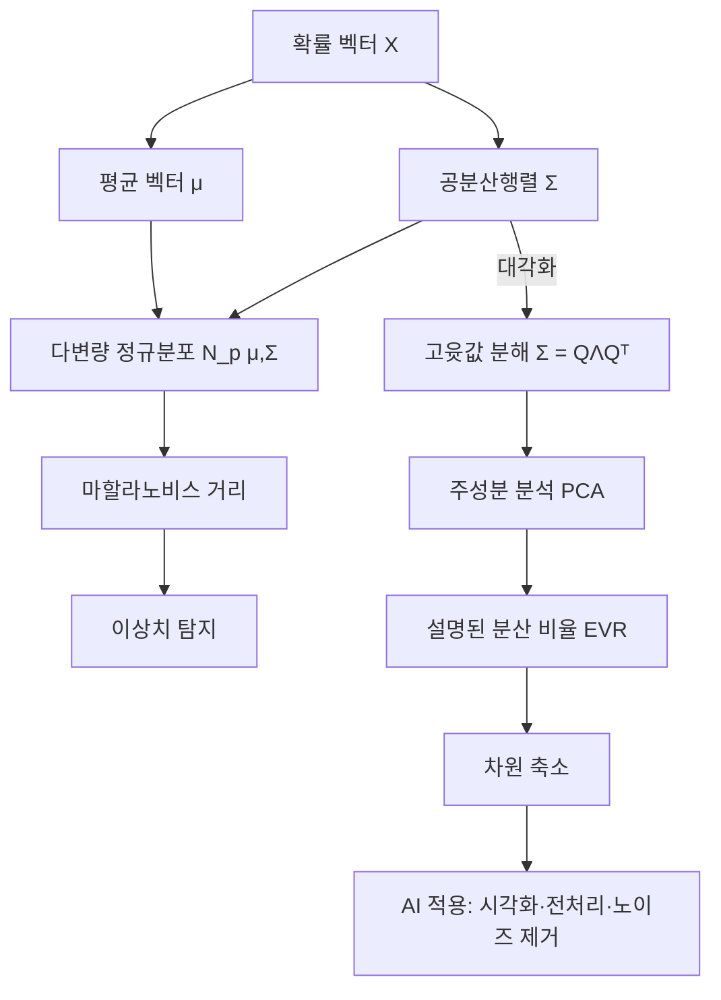

# 13강. AI를 위한 수학의 응용: 11장 다변량 정규분포 응용

## 🔗 선수 지식 (Prerequisites)
- [ ] **필수**: 일변량 정규분포 (PDF, 평균/분산, MLE) — 이해 완료?
- [ ] **필수**: 행렬·벡터 연산, 대칭행렬, 양의 정부호(positive definite) 개념
- [ ] **필수**: [고윳값·고유벡터 분해](./12강.md) (대각화·스펙트럼 분해)
- [ ] **권장**: 결합·주변·조건부 확률분포, 공분산과 상관계수의 정의
- [ ] **권장**: 라그랑주 승수법(주성분 분석의 최적화 도출 시 사용)
- **관련 단원**: [12강. 고윳값과 행렬 분해](./12강.md), [11강. 일변량 분포와 MLE](./11강.md)

---

## 학습 목표
1. 다변량 정규분포의 개념과 구조(평균 벡터·공분산행렬·확률밀도함수)를 설명할 수 있다.
2. 확률 벡터, 공분산행렬, 상관계수의 의미와 역할을 이해하고, 공분산행렬의 대칭성·양의 준정부호성을 설명할 수 있다.
3. 고윳값을 활용한 주성분 분석(PCA)의 원리를 설명하고, 설명된 분산 비율을 기준으로 차원 축소를 수행할 수 있다.

---

## 🧠 메타인지 체크 (학습 전/후 자기 평가)

### 학습 전 자기 평가
| 소주제 | 자신감 (1-5) |
| :--- | :--- |
| 평균 벡터·공분산행렬의 정의와 성질 | |
| 다변량 정규분포 PDF·마할라노비스 거리 | |
| MLE에 의한 모수 추정 | |
| PCA 절차와 설명된 분산 비율 | |

### 학습 후 교정 (학습 완료 후 작성)
| 소주제 | 학습 전 | 학습 후 | 실제 정답률 | 과신/과소 여부 |
| :--- | :--- | :--- | :--- | :--- |
| 평균 벡터·공분산행렬의 정의와 성질 | | | | |
| 다변량 정규분포 PDF·마할라노비스 거리 | | | | |
| MLE에 의한 모수 추정 | | | | |
| PCA 절차와 설명된 분산 비율 | | | | |

> **활용법**: 학습 전 1분 → 자신감 기입, 학습 후 1분 → 나머지 기입. "과신" 영역이 실제 취약점.

---

## 📝 요약 (Summary)
1.  🔴 **평균 벡터·공분산행렬**: 확률 벡터의 평균 벡터와 공분산행렬은 다변량 분포의 중심 위치와 변수 간 산포·상관 구조를 요약하며, 공분산행렬은 **대칭행렬**이자 **양의 준정부호(PSD) 행렬**이다.
2.  🔴 **다변량 정규분포의 성질**: 다변량 정규분포는 **조건부 분포와 주변분포가 모두 정규분포**이고, **공분산이 0이면 독립**이 보장되며(정규분포에 한정), **아핀 변환** $\mathbf{Y}=A\mathbf{X}+\mathbf{b}$ 후에도 정규분포가 유지된다.
3.  🟡 **마할라노비스 거리**: 변수 간 공분산 구조를 고려한 거리 척도로, **이상치 탐지**나 **클러스터 경계 파악** 등에 활용된다. ($d_M(\mathbf{x})=\sqrt{(\mathbf{x}-\boldsymbol{\mu})^\top\Sigma^{-1}(\mathbf{x}-\boldsymbol{\mu})}$)
4.  🔴 **주성분 분석(PCA)**: 공분산행렬의 **고윳값 분해**를 이용하여 분산이 가장 큰 방향을 순서대로 찾아내고, **설명된 분산 비율**을 기준으로 소수의 주성분만 선택함으로써 데이터의 핵심 정보를 보존하면서 차원을 축소하는 기법이다.
5.  🟡 **MLE 모수 추정**: 표본으로부터 $\hat{\boldsymbol{\mu}}=\bar{\mathbf{x}}$, $\hat{\Sigma}=\frac{1}{n}\sum_{i=1}^n(\mathbf{x}_i-\bar{\mathbf{x}})(\mathbf{x}_i-\bar{\mathbf{x}})^\top$ 로 다변량 정규분포의 모수를 추정한다.

---

## 📐 핵심 수식 (Key Formulas)

| 수식명 | 수식 | 의미 |
| :--- | :--- | :--- |
| **평균 벡터** | $\boldsymbol{\mu}=E[\mathbf{X}]=(\mu_1,\dots,\mu_p)^\top$ | 각 성분의 기댓값을 모은 벡터(분포의 중심) |
| **공분산행렬** | $\Sigma=E[(\mathbf{X}-\boldsymbol{\mu})(\mathbf{X}-\boldsymbol{\mu})^\top]$ | 대각: 분산, 비대각: 공분산. 대칭·PSD |
| **상관계수** | $\rho_{ij}=\dfrac{\sigma_{ij}}{\sigma_i\sigma_j}$, $-1\le\rho_{ij}\le 1$ | 척도 무관한 선형 의존성 강도 |
| **다변량 정규 PDF** | $f(\mathbf{x})=\dfrac{1}{(2\pi)^{p/2}\lvert\Sigma\rvert^{1/2}}\exp\!\left(-\tfrac{1}{2}(\mathbf{x}-\boldsymbol{\mu})^\top\Sigma^{-1}(\mathbf{x}-\boldsymbol{\mu})\right)$ | $p$차원 정규분포의 밀도 |
| **마할라노비스 거리** | $d_M(\mathbf{x})=\sqrt{(\mathbf{x}-\boldsymbol{\mu})^\top\Sigma^{-1}(\mathbf{x}-\boldsymbol{\mu})}$ | 공분산을 고려한 거리(등고선 = 타원) |
| **아핀 변환 성질** | $\mathbf{X}\sim\mathcal{N}_p(\boldsymbol{\mu},\Sigma)\Rightarrow A\mathbf{X}+\mathbf{b}\sim\mathcal{N}(A\boldsymbol{\mu}+\mathbf{b},A\Sigma A^\top)$ | 선형 변환 후에도 정규성 유지 |
| **MLE (평균)** | $\hat{\boldsymbol{\mu}}=\bar{\mathbf{x}}=\tfrac{1}{n}\sum_{i=1}^n\mathbf{x}_i$ | 표본 평균 벡터 |
| **MLE (공분산)** | $\hat{\Sigma}=\tfrac{1}{n}\sum_{i=1}^n(\mathbf{x}_i-\bar{\mathbf{x}})(\mathbf{x}_i-\bar{\mathbf{x}})^\top$ | 표본 공분산(편향 추정, 불편은 $n-1$) |
| **PCA 고윳값 분해** | $\Sigma=Q\Lambda Q^\top,\ Q=[\mathbf{v}_1\,\cdots\,\mathbf{v}_p],\ \Lambda=\text{diag}(\lambda_1,\dots,\lambda_p)$ | 정규직교 고유벡터 = 주성분 방향 |
| **설명된 분산 비율** | $\text{EVR}_k=\dfrac{\sum_{i=1}^k\lambda_i}{\sum_{i=1}^p\lambda_i}$ | 상위 $k$개 주성분이 보존하는 분산 비율 |

### 주요 정리/정의

**[정리 1] 공분산행렬의 양의 준정부호성(PSD)**
$$
\forall \mathbf{a}\in\mathbb{R}^p,\quad \mathbf{a}^\top \Sigma \mathbf{a}=\text{Var}(\mathbf{a}^\top\mathbf{X})\ge 0
$$
> **직관적 해석**: 어떤 방향 $\mathbf{a}$로 데이터를 사영(projection)해도 그 결과의 분산은 음수가 될 수 없다. 따라서 공분산행렬의 모든 고윳값은 0 이상.
> **AI 적용**: PCA에서 고윳값이 음수가 나오면 수치 오류 또는 비대칭화이며, 항상 $\lambda_i\ge 0$인 점이 분산 정보 정렬의 근거가 된다.

**[정리 2] PCA의 분산 최대화 정리**
$$
\mathbf{v}_1 = \arg\max_{\|\mathbf{v}\|=1}\mathbf{v}^\top \Sigma \mathbf{v} \quad\Rightarrow\quad \mathbf{v}_1 = \text{(공분산행렬 } \Sigma\text{의 최대 고윳값에 대응하는 고유벡터)}
$$
> **직관적 해석**: 단위 길이 벡터 중 데이터를 사영했을 때 분산이 가장 큰 방향이 바로 최대 고윳값에 대응하는 고유벡터다.
> **AI 적용**: 이미지·유전자·금융 등 고차원 데이터에서 정보 손실을 최소화하며 시각화·전처리·노이즈 제거를 수행.

**[정리 3] 다변량 정규분포에서 무상관 ⇔ 독립**
$$
\mathbf{X}\sim\mathcal{N}_p(\boldsymbol{\mu},\Sigma),\ \Sigma_{ij}=0 \iff X_i \perp X_j
$$
> **직관적 해석**: 일반 분포에서는 "무상관 ≠ 독립"이지만, 다변량 정규분포는 예외적으로 두 조건이 동치다.
> **AI 적용**: 정규성 가정 하의 베이지안 네트워크, 가우시안 그래피컬 모델에서 희소 정밀행렬(precision matrix)이 조건부 독립 구조를 직접 표현.

---

## 📊 개념 시각화 (Visual Guide)

### 개념 관계도


### 이변량 정규분포 등고선의 기하학적 해석
| 입력 (공분산 구조) | 등고선 모양 | 주축 방향 | AI 적용 |
| :--- | :--- | :--- | :--- |
| $\Sigma=\sigma^2 I$ (등방성) | **원** | 임의 방향 동일 | 표준화 후 거리 기반 클러스터링 |
| $\Sigma=\text{diag}(\sigma_1^2,\sigma_2^2)$, $\sigma_1\ne\sigma_2$ | **좌표축 정렬 타원** | $x_1, x_2$ 축 | 특징 스케일 차이 시각화 |
| $\rho>0$ (양의 상관) | **우상향 기울어진 타원** | 1·3사분면 방향 | 주성분이 상관 방향 포착 |
| $\rho<0$ (음의 상관) | **좌상향 기울어진 타원** | 2·4사분면 방향 | 반대 상관 차원 축소 |

### 핵심 도식
| 입력 | 연산 | 출력 | AI 적용 |
| :--- | :--- | :--- | :--- |
| 데이터 행렬 $X\in\mathbb{R}^{n\times p}$ | 중심화 → 공분산 $\hat\Sigma$ | $p\times p$ 대칭행렬 | 데이터 구조 요약 |
| 공분산행렬 $\Sigma$ | 고윳값 분해 $Q\Lambda Q^\top$ | 정규직교 주성분 방향 + 분산 크기 | 특성 추출 |
| 상위 $k$개 고유벡터 $V_k$ | $Z = (X-\bar{\mathbf{x}})V_k$ | $n\times k$ 저차원 표현 | 시각화·잡음 제거·압축 |

---

## ✏️ 심화 학습 (Study Subject)

### 1. 가상 시나리오: "어떤 개념을, 언제 사용해야 할까?"
- **상황**: 784차원(28×28) MNIST 손글씨 이미지 데이터셋 6만 장을 2차원 평면에 시각화하여 숫자 클래스가 어떻게 분포하는지 살펴보고 싶다. 동시에, 일부 손상된 이미지를 **이상치**로 자동 검출하고자 한다.
- **문제**: (1) 784차원을 그대로는 시각화할 수 없으므로, 정보 손실을 최소화하며 2차원으로 축소해야 한다. (2) 이상치 탐지를 위해 단순 유클리드 거리는 픽셀 간 강한 상관 구조를 무시한다.
- **해결**:
    1.  데이터 중심화 후 공분산행렬 $\hat\Sigma\in\mathbb{R}^{784\times 784}$를 계산한다.
    2.  $\hat\Sigma=Q\Lambda Q^\top$로 고윳값 분해, 상위 2개 고유벡터 $V_2=[\mathbf{v}_1\,\mathbf{v}_2]$를 선택한다.
    3.  사영 $Z=(X-\bar{\mathbf{x}})V_2$로 2차원 좌표를 얻고 scatter plot을 그린다.
    4.  설명된 분산 비율 $\text{EVR}_2=(\lambda_1+\lambda_2)/\sum\lambda_i$를 보고 정보 보존도를 확인.
    5.  이상치 탐지는 마할라노비스 거리 $d_M(\mathbf{x}_i)=\sqrt{(\mathbf{x}_i-\boldsymbol{\mu})^\top\Sigma^{-1}(\mathbf{x}_i-\boldsymbol{\mu})}$를 계산하고 $\chi^2_p$ 분포의 99% 분위수보다 큰 점을 이상치로 분류.
- **AI 학습 포인트**: "MNIST 같은 비선형 매니폴드 구조 데이터에서 PCA가 t-SNE/UMAP 대비 어떤 한계를 가지며, 커널 PCA가 어떻게 이를 극복하는지 비교해 줘."

### 2. 관점별 비교 및 오개념 분석
- **핵심 비교**:

| 구분 | 유클리드 거리 | 마할라노비스 거리 |
| :--- | :--- | :--- |
| **수식** | $\sqrt{(\mathbf{x}-\boldsymbol{\mu})^\top(\mathbf{x}-\boldsymbol{\mu})}$ | $\sqrt{(\mathbf{x}-\boldsymbol{\mu})^\top\Sigma^{-1}(\mathbf{x}-\boldsymbol{\mu})}$ |
| **가정** | 변수가 모두 동일한 스케일·무상관 | 변수 간 분산·공분산 반영 |
| **등고선** | 원/구 | 타원/타원체 |
| **AI 활용** | k-NN 기본형 | 이상치 탐지, QDA, GMM 책임 확률 |

- **오개념 분석**:
    - **오개념 1**: "공분산이 0이면 두 확률변수는 항상 독립이다."
    - **분석**: 일반 분포에서는 **거짓**. 예: $X\sim U(-1,1)$, $Y=X^2$이면 $\text{Cov}(X,Y)=E[X^3]-E[X]E[X^2]=0$이지만 명백히 종속이다. 단, **다변량 정규분포에서는 동치**가 성립한다. 즉 무상관 ⇔ 독립은 정규성 가정 하에서만 보장.
    - **오개념 2**: "PCA는 항상 분류 성능을 향상시키는 전처리다."
    - **분석**: 거짓. PCA는 **분산이 큰 방향**을 보존할 뿐 **클래스 구분에 유용한 방향**을 보존하지 않는다. 클래스 정보를 활용하는 LDA(Linear Discriminant Analysis)와 구분된다. 정보가 분산이 작은 방향에 담겨 있는 경우 PCA가 오히려 신호를 제거할 수 있음.
    - **오개념 3**: "마할라노비스 거리는 항상 유클리드 거리보다 작다."
    - **분석**: 거짓. $\Sigma^{-1}$의 고윳값(즉 $\Sigma$의 고윳값의 역수)이 1보다 크냐 작으냐에 따라 양방향 모두 가능. 분산이 작은 방향으로의 편차는 마할라노비스가 더 크게 평가한다.
- **AI 학습 포인트**: "다변량 정규분포가 아닌 데이터(예: 멱법칙 분포, 이산 데이터)에 마할라노비스 거리를 적용할 때 어떤 왜곡이 발생하며, 어떤 거리 척도가 대안이 되는지 설명해 줘."

> ⚠️ **흔한 오해**
> - **"고윳값 분해와 SVD는 다른 결과를 준다"** → 중심화된 데이터 행렬 $X_c$에 대해 $\hat\Sigma=\tfrac{1}{n}X_c^\top X_c$이고, $X_c=U S W^\top$(SVD)이면 $\hat\Sigma=\tfrac{1}{n}W S^2 W^\top$. 즉 **SVD의 우특이벡터 $W$가 곧 주성분 방향**이고 특이값의 제곱이 ($n$배) 고윳값이다. 실무 PCA는 수치 안정성 때문에 공분산행렬을 직접 만들지 않고 SVD로 계산한다.
> - **"PCA는 분산이 큰 변수를 고른다"** → PCA는 변수를 고르는 것이 아니라 **변수들의 선형결합(새 축)** 을 만든다. 첫 주성분은 원래 어떤 한 변수가 아니라 여러 변수의 가중합일 수 있다.
> - **"공분산행렬의 고윳값이 음수로 나왔다"** → 이론상 PSD라 불가능하다. 실제로 나왔다면 부동소수점 오차(아주 작은 음수)이거나, 결측 처리·쌍별(pairwise) 공분산 계산으로 행렬이 비일관적이 된 경우다. `np.linalg.eigh`(대칭 전용)를 쓰고 음의 고윳값은 0으로 클리핑한다.

### 3. 한 걸음씩 풀어보는 PCA 손계산 (Worked Example)

작은 2차원 데이터로 PCA 한 단계를 손으로 끝까지 계산해 본다.

- **데이터**: $\mathbf{x}_1=(2,0)^\top,\ \mathbf{x}_2=(0,2)^\top,\ \mathbf{x}_3=(-2,0)^\top,\ \mathbf{x}_4=(0,-2)^\top$.
1. **중심화**: 평균 $\bar{\mathbf{x}}=(0,0)^\top$이므로 그대로 사용.
2. **공분산(MLE, $n=4$)**: $\hat\Sigma=\tfrac{1}{4}\sum \mathbf{x}_i\mathbf{x}_i^\top=\tfrac{1}{4}\begin{pmatrix}4+0+4+0 & 0\\ 0 & 0+4+0+4\end{pmatrix}=\begin{pmatrix}2&0\\0&2\end{pmatrix}$.
3. **고윳값 분해**: 이미 대각행렬이므로 $\lambda_1=\lambda_2=2$, 고유벡터는 임의의 직교 기저($\mathbf{e}_1,\mathbf{e}_2$ 가능).
4. **해석**: 두 고윳값이 같다($\Sigma=2I$, 등방성) → **주성분 방향이 유일하지 않다**. 등고선은 원이고, 어느 1차원으로 사영해도 분산이 똑같이 2다. EVR도 각 50%로 동률. 이 경우 PCA로 "더 중요한 방향"을 정할 수 없으며, 차원 축소가 정보를 균등하게 버린다.
5. **대조 실험**: 만약 $\mathbf{x}_2,\mathbf{x}_4$를 $(0,1),(0,-1)$로 줄이면 $\hat\Sigma=\begin{pmatrix}2&0\\0&0.5\end{pmatrix}$가 되어 $\lambda_1=2$(방향 $\mathbf{e}_1$), $\lambda_2=0.5$. 이제 첫 주성분이 분명히 $x_1$ 축이고 $\text{EVR}_1=2/2.5=80\%$. **분산의 비대칭이 클수록 PCA가 잘 작동**함을 직접 확인할 수 있다.

---

## ❓ 연습 문제 및 해설

> **블룸 인지 수준 범례**: [기억] 정의·나열 → [이해] 설명·비교 → [적용] 계산·구현 → [분석] 구별·디버그 → [평가] 판단·비평 → [창조] 설계·제안

### 📝 문제

**📌 1. ⭐ [기억] [공분산행렬의 성질로 옳은 것은?](#prob-1)**
   > ① 항상 대각행렬이다.
   > ② 항상 직교행렬이다.
   > ③ 대칭이며 양의 준정부호이다.
   > ④ 모든 고윳값이 항상 양수이다.

<br>

**📌 2. ⭐ [기억/이해] [다음 중 다변량 정규분포의 성질이 아닌 것은?](#prob-2)**
   > ① 주변분포도 정규분포이다.
   > ② 조건부 분포도 정규분포이다.
   > ③ 공분산이 0이면 두 변수는 독립이다.
   > ④ 아핀 변환 후에는 정규분포가 깨진다.

<br>

**📌 3. ⭐⭐ [이해/적용] [이변량 정규분포에서 다음 조건들 중 등고선이 좌표축에 평행한 타원이 되는 경우를 모두 고르시오.](#prob-3)**
   > <보기>
   >
   > 가. $\Sigma=\begin{pmatrix}4 & 0\\ 0 & 1\end{pmatrix}$
   > 나. $\Sigma=\begin{pmatrix}2 & 1\\ 1 & 2\end{pmatrix}$
   > 다. $\Sigma=\begin{pmatrix}9 & 0\\ 0 & 9\end{pmatrix}$ (단, 원도 좌표축에 평행한 타원의 특수 경우로 본다)
   > 라. $\Sigma=\begin{pmatrix}5 & -2\\ -2 & 3\end{pmatrix}$

   > ① 가, 다
   > ② 나, 라
   > ③ 가, 나, 다
   > ④ 가, 다, 라

<br>

**📌 4. ⭐⭐ [적용] [$\mathbf{X}\sim\mathcal{N}_2\!\left(\begin{pmatrix}1\\2\end{pmatrix},\begin{pmatrix}4&2\\2&3\end{pmatrix}\right)$일 때, $Y=X_1+X_2$의 분포를 구하시오.](#prob-4)**
   > ① $\mathcal{N}(3,\,7)$
   > ② $\mathcal{N}(3,\,11)$
   > ③ $\mathcal{N}(3,\,9)$
   > ④ $\mathcal{N}(2,\,11)$

<br>

**📌 5. ⭐⭐ [적용] [공분산행렬 $\Sigma=\begin{pmatrix}5&2\\2&5\end{pmatrix}$의 고윳값과 첫 번째 주성분 방향을 구하시오.](#prob-5)**

<br>

**📌 6. ⭐⭐ [적용] [고윳값이 $\lambda_1=8,\lambda_2=4,\lambda_3=2,\lambda_4=1,\lambda_5=1$인 5차원 데이터에서 90% 이상의 분산을 설명하려면 최소 몇 개의 주성분이 필요한가?](#prob-6)**
   > ① 2개
   > ② 3개
   > ③ 4개
   > ④ 5개

<br>

**📌 7. ⭐⭐ [적용] [다음 표본으로부터 표본 평균 벡터와 표본 공분산행렬(MLE)을 구하시오.](#prob-7)**
   > $$\mathbf{x}_1=\begin{pmatrix}2\\3\end{pmatrix},\ \mathbf{x}_2=\begin{pmatrix}4\\5\end{pmatrix},\ \mathbf{x}_3=\begin{pmatrix}6\\7\end{pmatrix}$$

<br>

**📌 8. ⭐⭐ [분석] [다음 진술들 중 옳은 것을 모두 고르시오.](#prob-8)**
   > <보기>
   >
   > 가. 일반 분포에서 공분산이 0이면 두 변수는 독립이다.
   > 나. 다변량 정규분포의 주변분포는 다시 다변량 정규분포이다.
   > 다. 마할라노비스 거리에서 $\Sigma=I$이면 유클리드 거리와 같다.
   > 라. PCA는 분류 성능을 항상 향상시킨다.

   > ① 가, 라
   > ② 나, 다
   > ③ 나, 다, 라
   > ④ 가, 나, 다

<br>

**📌 9. ⭐⭐⭐ [적용/분석] [$\boldsymbol{\mu}=\begin{pmatrix}0\\0\end{pmatrix},\ \Sigma=\begin{pmatrix}4&0\\0&1\end{pmatrix}$인 이변량 정규분포에서 점 $\mathbf{x}=(2,1)^\top$의 마할라노비스 거리를 구하고, 같은 점의 유클리드 거리와 비교 해석하시오.](#prob-9)**

<br>

**📌 10. ⭐⭐⭐ [평가/창조] [다변량 정규분포 $\mathcal{N}_p(\boldsymbol{\mu},\Sigma)$에 대한 로그 우도함수 $\ell(\boldsymbol{\mu},\Sigma)$를 표본 $\{\mathbf{x}_i\}_{i=1}^n$으로부터 유도하고, $\boldsymbol{\mu}$에 대한 MLE가 $\bar{\mathbf{x}}$임을 미분으로 보이시오.](#prob-10)**

---

### 🔑 정답 및 해설 (먼저 풀어본 후 펼치기)

<details>
<summary>정답 보기 (클릭)</summary>

1. ③
2. ④
3. ①
4. ②
5. $\lambda_1=7,\lambda_2=3$, 첫 주성분 $\mathbf{v}_1=\tfrac{1}{\sqrt{2}}(1,1)^\top$
6. ③
7. $\bar{\mathbf{x}}=(4,5)^\top$, $\hat\Sigma=\begin{pmatrix}8/3 & 8/3\\ 8/3 & 8/3\end{pmatrix}$
8. ② (나, 다)
9. $d_M=\sqrt{2}\approx 1.414$, $d_E=\sqrt{5}\approx 2.236$
10. (풀이형) $\hat{\boldsymbol{\mu}}=\bar{\mathbf{x}}$

</details>

<details>
<summary>해설 보기 (클릭)</summary>

<a id="prob-1"></a>
**1. ⭐ [기억] 공분산행렬의 성질**
> **정답: ③ 대칭이며 양의 준정부호이다.**
> **해설**: 정의 $\Sigma=E[(\mathbf{X}-\boldsymbol{\mu})(\mathbf{X}-\boldsymbol{\mu})^\top]$로부터 대칭이고, $\mathbf{a}^\top\Sigma\mathbf{a}=\text{Var}(\mathbf{a}^\top\mathbf{X})\ge 0$이므로 PSD. ① 비대각 원소가 공분산이므로 일반적으로 대각이 아님. ② 직교행렬은 $Q^\top Q=I$를 만족해야 하나 일반 공분산행렬은 그렇지 않음. ④ 변수가 선형 종속이면 고윳값 0이 가능(준정부호).

<a id="prob-2"></a>
**2. ⭐ [기억/이해] 다변량 정규분포의 성질**
> **정답: ④ 아핀 변환 후에는 정규분포가 깨진다.**
> **해설**: 다변량 정규분포는 **아핀 변환 후에도 정규분포가 유지**된다 ($\mathbf{X}\sim\mathcal{N}_p(\boldsymbol{\mu},\Sigma)\Rightarrow A\mathbf{X}+\mathbf{b}\sim\mathcal{N}(A\boldsymbol{\mu}+\mathbf{b},A\Sigma A^\top)$). ①, ②는 주변·조건부 분포 모두 정규성 보존, ③은 정규분포의 특수한 성질로 옳음.

<a id="prob-3"></a>
**3. ⭐⭐ [이해/적용] 좌표축 평행 타원 조건**
> **정답: ① 가, 다**
> **해설**: 등고선의 주축은 공분산행렬의 고유벡터 방향이다. 비대각 원소가 0이면 고유벡터가 표준 기저 $\mathbf{e}_1,\mathbf{e}_2$가 되어 좌표축에 평행한 타원이 된다. 가, 다 모두 대각행렬(다는 등방성 → 원). 나, 라는 비대각 원소가 있어 기울어진 타원.

<a id="prob-4"></a>
**4. ⭐⭐ [적용] 아핀 변환에 의한 선형 결합 분포**
> **정답: ② $\mathcal{N}(3, 11)$**
> **해설**: $Y=\mathbf{a}^\top\mathbf{X}$, $\mathbf{a}=(1,1)^\top$. 평균: $\mathbf{a}^\top\boldsymbol{\mu}=1+2=3$. 분산: $\mathbf{a}^\top\Sigma\mathbf{a}=(1\ 1)\begin{pmatrix}4&2\\2&3\end{pmatrix}\begin{pmatrix}1\\1\end{pmatrix}=(1\ 1)\begin{pmatrix}6\\5\end{pmatrix}=11$. 정규성은 아핀 변환에 의해 보존.

<a id="prob-5"></a>
**5. ⭐⭐ [적용] 고윳값과 주성분 방향**
> **정답: $\lambda_1=7,\ \lambda_2=3$, 첫 주성분 $\mathbf{v}_1=\dfrac{1}{\sqrt{2}}(1,1)^\top$**
> **해설**: 특성방정식 $\det(\Sigma-\lambda I)=(5-\lambda)^2-4=0$ → $(5-\lambda)^2=4$ → $\lambda=7,3$.
> $\lambda_1=7$일 때 $(\Sigma-7I)\mathbf{v}=\begin{pmatrix}-2&2\\2&-2\end{pmatrix}\mathbf{v}=0$ → $v_1=v_2$ → 정규화하면 $\mathbf{v}_1=\tfrac{1}{\sqrt{2}}(1,1)^\top$. 양의 상관이 있는 데이터의 주성분은 1·3사분면 방향.

<a id="prob-6"></a>
**6. ⭐⭐ [적용] 설명된 분산 비율**
> **정답: ③ 4개**
> **해설**: 총합 $\sum\lambda_i=8+4+2+1+1=16$. 누적 EVR을 계산하면
> - $k=1$: $8/16=50\%$
> - $k=2$: $12/16=75\%$
> - $k=3$: $14/16=87.5\%$ ← 90% 미만
> - $k=4$: $15/16=93.75\%$ ← 90% 이상 처음 만족
> - $k=5$: $16/16=100\%$
> 따라서 90% 임계값을 처음 넘는 최소 주성분 수는 **4개**. **출제 함정**: 누적 비율은 빠르게 증가하다가 꼬리에서 둔화되므로 마지막 한두 개의 작은 고윳값 때문에 임계값 도달 여부가 갈린다. 시험에서는 계산기로 누적합을 끝까지 확인할 것.

<a id="prob-7"></a>
**7. ⭐⭐ [적용] MLE에 의한 평균 벡터와 공분산행렬**
> **정답**: $\bar{\mathbf{x}}=(4,5)^\top$, $\hat\Sigma=\dfrac{1}{3}\begin{pmatrix}8 & 8\\ 8 & 8\end{pmatrix}=\begin{pmatrix}8/3 & 8/3\\ 8/3 & 8/3\end{pmatrix}$
> **해설**: 평균: $\bar{x}_1=(2+4+6)/3=4$, $\bar{x}_2=(3+5+7)/3=5$.
> 중심화 편차: $(-2,-2)^\top,(0,0)^\top,(2,2)^\top$.
> 외적의 합: $\begin{pmatrix}4&4\\4&4\end{pmatrix}+\mathbf{0}+\begin{pmatrix}4&4\\4&4\end{pmatrix}=\begin{pmatrix}8&8\\8&8\end{pmatrix}$.
> MLE는 $n=3$으로 나눔 → $\hat\Sigma=\begin{pmatrix}8/3&8/3\\8/3&8/3\end{pmatrix}$. 완전 선형 의존이므로 $\det\hat\Sigma=0$, 고윳값 하나가 0(=PSD이지만 PD는 아님).

<a id="prob-8"></a>
**8. ⭐⭐ [분석] 다변량 정규분포 진위 판별**
> **정답: ② 나, 다**
> **해설**:
> - 가: 거짓. 일반 분포에서 무상관은 독립을 함의하지 않음(예: $Y=X^2,\ X\sim U(-1,1)$).
> - 나: 참. 다변량 정규분포의 주변분포는 정규.
> - 다: 참. $\Sigma=I$이면 $d_M=\sqrt{(\mathbf{x}-\boldsymbol{\mu})^\top(\mathbf{x}-\boldsymbol{\mu})}=d_E$.
> - 라: 거짓. PCA는 분산 최대 방향을 보존할 뿐 클래스 분리에 유용한 방향과 일치하지 않을 수 있음(LDA와 비교).

<a id="prob-9"></a>
**9. ⭐⭐⭐ [적용/분석] 마할라노비스 vs 유클리드 거리**
> **정답**: $d_M(\mathbf{x})=\sqrt{2}\approx 1.414$, $d_E(\mathbf{x})=\sqrt{5}\approx 2.236$
> **해설**:
> $\Sigma^{-1}=\begin{pmatrix}1/4 & 0\\ 0 & 1\end{pmatrix}$.
> $d_M^2=(2\ 1)\begin{pmatrix}1/4&0\\0&1\end{pmatrix}\begin{pmatrix}2\\1\end{pmatrix}=(2)(1/4)(2)+(1)(1)(1)=1+1=2$ → $d_M=\sqrt{2}$.
> $d_E^2=2^2+1^2=5$ → $d_E=\sqrt{5}$.
> **해석**: $x_1$방향은 분산이 4로 크므로 거리 2는 1표준편차에 해당(흔한 일). $x_2$방향은 분산 1이므로 거리 1은 1표준편차. 두 방향 모두 1σ로 보면 점은 평균 근처라 마할라노비스 거리가 작게 평가됨. 반면 유클리드 거리는 단순 좌표 차이만 보므로 더 큰 값.

<a id="prob-10"></a>
**10. ⭐⭐⭐ [평가/창조] MLE 유도**
> **정답 및 풀이**:
> 로그 우도:
> $$\ell(\boldsymbol{\mu},\Sigma)=-\frac{np}{2}\ln(2\pi)-\frac{n}{2}\ln|\Sigma|-\frac{1}{2}\sum_{i=1}^n(\mathbf{x}_i-\boldsymbol{\mu})^\top\Sigma^{-1}(\mathbf{x}_i-\boldsymbol{\mu})$$
> $\boldsymbol{\mu}$에 대한 편미분(벡터 미분 공식 $\nabla_{\boldsymbol{\mu}}(\mathbf{x}-\boldsymbol{\mu})^\top\Sigma^{-1}(\mathbf{x}-\boldsymbol{\mu})=-2\Sigma^{-1}(\mathbf{x}-\boldsymbol{\mu})$ 이용):
> $$\nabla_{\boldsymbol{\mu}}\ell=\sum_{i=1}^n \Sigma^{-1}(\mathbf{x}_i-\boldsymbol{\mu})=\Sigma^{-1}\sum_{i=1}^n(\mathbf{x}_i-\boldsymbol{\mu})=0$$
> $\Sigma^{-1}$는 역행렬 존재(가역)이므로 양변에 $\Sigma$를 곱하면:
> $$\sum_{i=1}^n(\mathbf{x}_i-\boldsymbol{\mu})=0\ \Rightarrow\ n\boldsymbol{\mu}=\sum_{i=1}^n\mathbf{x}_i\ \Rightarrow\ \hat{\boldsymbol{\mu}}=\bar{\mathbf{x}}$$
> **해설**: 일변량 MLE의 자연스러운 다변량 일반화이며, $\Sigma$에 무관하게 평균의 MLE는 표본 평균이다. $\Sigma$의 MLE 유도는 행렬 미분 공식 $\partial \ln|\Sigma|/\partial\Sigma=\Sigma^{-1}$, $\partial \text{tr}(\Sigma^{-1}S)/\partial\Sigma=-\Sigma^{-1}S\Sigma^{-1}$를 사용해 $\hat\Sigma=\frac{1}{n}\sum(\mathbf{x}_i-\bar{\mathbf{x}})(\mathbf{x}_i-\bar{\mathbf{x}})^\top$로 유도된다.

</details>

---

## ✅ O/X 확인문제 (연습문항 개수의 2배 권장 — 20문항)

**1.** 공분산행렬은 항상 대칭행렬이다. [→](#ox-1) **(O / X)**
**2.** 공분산행렬의 모든 고윳값은 항상 양수이다. [→](#ox-2) **(O / X)**
**3.** 다변량 정규분포에서는 무상관과 독립이 동치이다. [→](#ox-3) **(O / X)**
**4.** 일반적인 확률분포에서 두 변수의 공분산이 0이면 두 변수는 독립이다. [→](#ox-4) **(O / X)**
**5.** 다변량 정규분포의 주변분포는 다시 다변량 정규분포이다. [→](#ox-5) **(O / X)**
**6.** 다변량 정규분포 $\mathbf{X}$에 대해 $A\mathbf{X}+\mathbf{b}$의 분포는 정규분포가 아닐 수 있다. [→](#ox-6) **(O / X)**
**7.** 마할라노비스 거리에서 $\Sigma=I$이면 유클리드 거리와 동일하다. [→](#ox-7) **(O / X)**
**8.** 마할라노비스 거리의 등고선은 항상 원이다. [→](#ox-8) **(O / X)**
**9.** 다변량 정규분포의 PDF의 지수부에 마할라노비스 거리의 제곱이 들어 있다. [→](#ox-9) **(O / X)**
**10.** 표본 평균 벡터는 다변량 정규분포에서 $\boldsymbol{\mu}$의 MLE이다. [→](#ox-10) **(O / X)**
**11.** MLE로 추정한 공분산행렬 $\hat\Sigma=\tfrac{1}{n}\sum(\mathbf{x}_i-\bar{\mathbf{x}})(\mathbf{x}_i-\bar{\mathbf{x}})^\top$는 불편추정량이다. [→](#ox-11) **(O / X)**
**12.** 주성분 분석은 공분산행렬의 고윳값 분해를 기반으로 한다. [→](#ox-12) **(O / X)**
**13.** PCA의 첫 번째 주성분은 데이터의 분산이 최소가 되는 방향이다. [→](#ox-13) **(O / X)**
**14.** PCA의 주성분 벡터들은 서로 직교한다. [→](#ox-14) **(O / X)**
**15.** 설명된 분산 비율(EVR)은 상위 $k$개 고윳값의 합을 전체 고윳값 합으로 나눈 값이다. [→](#ox-15) **(O / X)**
**16.** PCA는 항상 분류 모델의 성능을 향상시킨다. [→](#ox-16) **(O / X)**
**17.** 이변량 정규분포의 등고선은 일반적으로 타원이다. [→](#ox-17) **(O / X)**
**18.** 공분산행렬이 대각행렬이면 다변량 정규분포의 등고선 주축은 좌표축과 일치한다. [→](#ox-18) **(O / X)**
**19.** $\rho>0$인 이변량 정규분포의 등고선은 우상향(1·3사분면 방향)으로 기울어진 타원이다. [→](#ox-19) **(O / X)**
**20.** PCA를 적용하기 전에 변수의 스케일이 크게 다르면 표준화(평균 0, 분산 1)를 수행하는 것이 일반적이다. [→](#ox-20) **(O / X)**

<details>
<summary>O/X 정답 및 해설 보기 (클릭)</summary>

> <a id="ox-1"></a>
> **1. 정답**: O
> **해설**: $\Sigma_{ij}=\text{Cov}(X_i,X_j)=\text{Cov}(X_j,X_i)=\Sigma_{ji}$로 정의 자체가 대칭.

> <a id="ox-2"></a>
> **2. 정답**: X
> **해설**: 0 이상이지만(PSD), 0이 될 수 있다(변수 간 완전 선형 종속). 양정부호일 때만 모두 양수.

> <a id="ox-3"></a>
> **3. 정답**: O
> **해설**: 정규성 가정 하에서만 성립하는 특수 성질. 결합 PDF가 인수분해되기 때문.

> <a id="ox-4"></a>
> **4. 정답**: X
> **해설**: 반례: $X\sim U(-1,1)$, $Y=X^2$이면 $\text{Cov}(X,Y)=0$이지만 명백히 종속.

> <a id="ox-5"></a>
> **5. 정답**: O
> **해설**: 다변량 정규분포의 어떠한 부분집합 변수의 주변분포도 (저차원) 정규분포.

> <a id="ox-6"></a>
> **6. 정답**: X
> **해설**: 다변량 정규분포는 아핀 변환에 닫혀 있다. $A\mathbf{X}+\mathbf{b}\sim\mathcal{N}(A\boldsymbol{\mu}+\mathbf{b},A\Sigma A^\top)$.

> <a id="ox-7"></a>
> **7. 정답**: O
> **해설**: $d_M^2=(\mathbf{x}-\boldsymbol{\mu})^\top I^{-1}(\mathbf{x}-\boldsymbol{\mu})=\|\mathbf{x}-\boldsymbol{\mu}\|^2$.

> <a id="ox-8"></a>
> **8. 정답**: X
> **해설**: 일반적으로 타원(타원체). $\Sigma=\sigma^2 I$인 등방성에서만 원.

> <a id="ox-9"></a>
> **9. 정답**: O
> **해설**: 지수부 $-\tfrac{1}{2}(\mathbf{x}-\boldsymbol{\mu})^\top\Sigma^{-1}(\mathbf{x}-\boldsymbol{\mu})=-\tfrac{1}{2}d_M^2(\mathbf{x})$.

> <a id="ox-10"></a>
> **10. 정답**: O
> **해설**: 로그 우도 미분 $\nabla_{\boldsymbol{\mu}}\ell=\Sigma^{-1}\sum(\mathbf{x}_i-\boldsymbol{\mu})=0$에서 $\hat{\boldsymbol{\mu}}=\bar{\mathbf{x}}$.

> <a id="ox-11"></a>
> **11. 정답**: X
> **해설**: MLE는 편향 추정량($n$으로 나눔). 불편추정량은 $n-1$로 나누는 표본 공분산.

> <a id="ox-12"></a>
> **12. 정답**: O
> **해설**: $\Sigma=Q\Lambda Q^\top$에서 $Q$의 열이 주성분 방향, $\Lambda$의 대각이 각 방향 분산.

> <a id="ox-13"></a>
> **13. 정답**: X
> **해설**: 분산이 **최대**가 되는 방향. 최소 방향은 마지막 주성분.

> <a id="ox-14"></a>
> **14. 정답**: O
> **해설**: 대칭행렬의 서로 다른 고윳값에 대응하는 고유벡터는 직교하고, PCA는 정규직교 기저로 선택.

> <a id="ox-15"></a>
> **15. 정답**: O
> **해설**: $\text{EVR}_k=\sum_{i=1}^k\lambda_i / \sum_{i=1}^p\lambda_i$. 누적 비율이 임계(예: 0.9, 0.95)를 넘는 최소 $k$를 선택.

> <a id="ox-16"></a>
> **16. 정답**: X
> **해설**: PCA는 비지도이며 클래스 정보를 사용하지 않음. 분산이 작은 방향에 중요한 분류 정보가 있다면 오히려 성능 저하.

> <a id="ox-17"></a>
> **17. 정답**: O
> **해설**: PDF 등고선은 마할라노비스 거리 $=$ 상수인 곳이며, 이는 이차형식이 양정부호이므로 타원.

> <a id="ox-18"></a>
> **18. 정답**: O
> **해설**: 대각 공분산행렬의 고유벡터는 표준 기저이므로 등고선의 주축이 좌표축과 일치.

> <a id="ox-19"></a>
> **19. 정답**: O
> **해설**: 첫 주성분 방향이 $(1,1)^\top$ 근방(양의 상관 → 같은 부호로 함께 변동).

> <a id="ox-20"></a>
> **20. 정답**: O
> **해설**: 스케일 차이가 크면 분산이 큰 변수에만 PCA가 휘둘림. 표준화 후 상관행렬 기반 PCA가 일반적.

</details>

---

## 🧪 자유 회상 연습 (Free Recall)

> **방법**: 위의 노트를 모두 덮고, 타이머 3분 설정 후 이번 단원에서 배운 내용을 기억나는 대로 자유롭게 적으세요.
> 정확한 문장이 아니어도 됩니다. 키워드, 수식, 관계 등 떠오르는 것을 모두 적습니다.

**자유 회상 작성란:**

```
[여기에 기억나는 내용을 자유롭게 작성]


```

> **회상 후 점검**: 노트를 다시 펼쳐 빠뜨린 내용을 확인하세요. 빠뜨린 부분이 실제 취약점입니다.
> - 회상 못한 핵심 개념: [                ]
> - 회상 못한 수식: [                ]

체크리스트(예): 평균 벡터/공분산행렬 정의, PDF 식, 마할라노비스 거리, 아핀 변환 성질, 무상관⇔독립(정규분포 한정), MLE 식, PCA 단계, 설명된 분산 비율.

---

## 💻 코드로 확인하기 (Code Verification)

```python
import numpy as np
import matplotlib.pyplot as plt
from scipy.stats import multivariate_normal, chi2

np.random.seed(42)

# 1. 다변량 정규분포 표본 생성
mu = np.array([1.0, 2.0])
Sigma = np.array([[4.0, 2.0],
                  [2.0, 3.0]])
n = 1000
X = np.random.multivariate_normal(mu, Sigma, size=n)

# 2. 표본 평균 벡터 & 표본 공분산행렬 (MLE, n으로 나눔)
mu_hat = X.mean(axis=0)
Xc = X - mu_hat
Sigma_mle = (Xc.T @ Xc) / n
print(f"표본 평균: {mu_hat}")
print(f"표본 공분산(MLE):\n{Sigma_mle}")

# 3. 공분산행렬의 고윳값 분해 → PCA
eigvals, eigvecs = np.linalg.eigh(Sigma_mle)   # 오름차순 반환
order = np.argsort(eigvals)[::-1]               # 내림차순 정렬
eigvals, eigvecs = eigvals[order], eigvecs[:, order]
evr = eigvals / eigvals.sum()
print(f"고윳값(분산): {eigvals}")
print(f"설명된 분산 비율: {evr}")
print(f"누적 EVR: {np.cumsum(evr)}")

# 4. 1차원으로 축소
V1 = eigvecs[:, :1]              # 첫 번째 주성분 방향
Z = Xc @ V1                      # n x 1 사영
print(f"1D 사영 분산: {Z.var():.4f} (≈ 첫 고윳값 {eigvals[0]:.4f})")

# 5. 마할라노비스 거리 → 카이제곱 분포 기반 이상치 탐지
Sigma_inv = np.linalg.inv(Sigma_mle)
dM2 = np.einsum('ij,jk,ik->i', Xc, Sigma_inv, Xc)  # squared Mahalanobis
threshold = chi2.ppf(0.99, df=2)
outliers = np.where(dM2 > threshold)[0]
print(f"χ²(0.99, df=2) 임계값: {threshold:.4f}")
print(f"이상치 개수: {len(outliers)} (≈ 기대 1%, 즉 ~10개)")
```

> **실행 결과 (예시)**:
> ```
> 표본 평균: [0.99 2.04]
> 표본 공분산(MLE):
> [[3.92 1.93]
>  [1.93 2.97]]
> 고윳값(분산): [5.42 1.47]
> 설명된 분산 비율: [0.787 0.213]
> 누적 EVR: [0.787 1.000]
> 1D 사영 분산: 5.4123 (≈ 첫 고윳값 5.4194)
> χ²(0.99, df=2) 임계값: 9.2103
> 이상치 개수: 9 (≈ 기대 1%, 즉 ~10개)
> ```
> **수학적 해석**: (1) 표본 평균·공분산이 진짜 모수 $\boldsymbol{\mu},\Sigma$에 근사. (2) 고윳값 합은 총분산(trace)과 같다 ($5.42+1.47\approx 3.92+2.97=6.89$). (3) 1차원 사영의 분산이 첫 고윳값과 정확히 일치 — PCA의 핵심 성질. (4) 정규분포에서 $d_M^2\sim\chi^2_p$이므로 99% 분위수 초과점을 이상치로 자동 판별 가능.

---

## 🤖 AI 연결고리 (Math → AI Application)

| 수학 개념 | AI/ML 적용 분야 | 구체적 사례 |
| :--- | :--- | :--- |
| **다변량 정규분포 PDF** | 생성 모델, 가우시안 혼합 모형(GMM) | 음성 인식의 음소 분포 모델링, 군집화 |
| **마할라노비스 거리** | 이상치 탐지, 분류 | 신용카드 사기 거래 탐지, QDA(이차판별분석) |
| **공분산행렬 + 고윳값 분해** | PCA, 화이트닝(whitening) | 얼굴 인식의 Eigenfaces, CNN 입력 정규화 |
| **설명된 분산 비율** | 차원 결정·노이즈 제거 | 유전자 발현 데이터에서 의미 있는 PC 선택 |
| **MLE** | 모수 추정, EM 알고리즘 | GMM의 E-step에서 책임도 계산 후 M-step 모수 갱신 |
| **아핀 변환의 정규성 보존** | 베이지안 선형 회귀, 칼만 필터 | 상태 추정에서 가우시안 신뢰가 유지되도록 설계 |

---

## 📖 심화 학습 예시 답안

#### 1. 주성분 분석(PCA)의 내부 동작 원리

PCA가 "왜" 분산 최대 방향을 고윳값 분해로 찾을 수 있는지 단계별로 살펴본다.

1.  **단계 1 — 목적함수 정의**: 데이터를 단위 벡터 $\mathbf{v}$ 방향으로 사영했을 때의 분산은 $\text{Var}(\mathbf{v}^\top\mathbf{X})=\mathbf{v}^\top\Sigma\mathbf{v}$. 우리는 $\|\mathbf{v}\|=1$ 제약 하에 이를 최대화하고자 한다.
2.  **단계 2 — 라그랑주 승수**: $\mathcal{L}(\mathbf{v},\lambda)=\mathbf{v}^\top\Sigma\mathbf{v}-\lambda(\mathbf{v}^\top\mathbf{v}-1)$의 stationary point는 $\nabla_{\mathbf{v}}\mathcal{L}=2\Sigma\mathbf{v}-2\lambda\mathbf{v}=0$ → $\Sigma\mathbf{v}=\lambda\mathbf{v}$. 즉, $\mathbf{v}$는 $\Sigma$의 고유벡터.
3.  **단계 3 — 최댓값 식별**: 위 식 양변에 $\mathbf{v}^\top$을 곱하면 $\mathbf{v}^\top\Sigma\mathbf{v}=\lambda$. 즉, 분산값이 곧 고윳값이므로 **가장 큰 고윳값에 대응하는 고유벡터**가 분산 최대 방향이다.
4.  **단계 4 — 직교 다음 주성분**: 두 번째 주성분은 $\mathbf{v}_1$과 직교한다는 추가 제약 하에서 같은 절차를 반복 → 두 번째로 큰 고윳값에 대응하는 고유벡터. 일반적으로 $k$번째 주성분은 $k$번째 큰 고윳값에 대응.
5.  **단계 5 — 스펙트럼 분해와 일치**: 결과적으로 $\Sigma=\sum_{i=1}^p \lambda_i \mathbf{v}_i\mathbf{v}_i^\top$로 데이터 분산 구조가 정규직교 기저에서 완전히 분해된다.

#### 2. 마할라노비스 거리 vs 유클리드 거리 비교표

| 구분 | 마할라노비스 거리 | 유클리드 거리 | 비고 |
| :--- | :--- | :--- | :--- |
| **정의** | $d_M=\sqrt{(\mathbf{x}-\boldsymbol{\mu})^\top\Sigma^{-1}(\mathbf{x}-\boldsymbol{\mu})}$ | $d_E=\sqrt{(\mathbf{x}-\boldsymbol{\mu})^\top(\mathbf{x}-\boldsymbol{\mu})}$ | $\Sigma=I$이면 일치 |
| **스케일 의존성** | 변수 스케일·상관 자동 반영 | 변수 스케일에 민감 | 사전 표준화 필요 여부 |
| **등고선** | 타원(타원체) | 원(구) | $\Sigma$의 고유벡터 = 주축 |
| **분포 가정** | 정규성 가정에서 통계적 의미 강함 ($d_M^2\sim\chi^2_p$) | 분포 가정 없음 | 이상치 임계값 도출 가능 |
| **AI 활용** | QDA, GMM 책임도, 이상치 탐지 | k-NN, k-means 기본형 | 데이터 특성에 맞춰 선택 |

#### 3. PCA를 활용한 코드 작성법 (Best Practice)

- **Bad Practice (나쁜 예시)**
  ```python
  # 표준화하지 않은 채 서로 다른 스케일의 변수에 PCA 적용
  X = np.column_stack([height_cm, weight_kg, age_years])  # 스케일 천차만별
  Sigma = np.cov(X, rowvar=False, bias=True)
  eigvals, eigvecs = np.linalg.eig(Sigma)  # 비대칭 가정 알고리즘
  # → height가 분산이 가장 크다는 이유로 첫 주성분을 거의 독점
  ```
- **Good Practice (좋은 예시)**
  ```python
  from sklearn.preprocessing import StandardScaler
  from sklearn.decomposition import PCA

  scaler = StandardScaler()
  X_std = scaler.fit_transform(X)          # 평균 0, 분산 1로 표준화
  pca = PCA(n_components=0.95)             # EVR 누적 95% 자동 선택
  Z = pca.fit_transform(X_std)
  print("선택된 주성분 수:", pca.n_components_)
  print("각 PC의 EVR:", pca.explained_variance_ratio_)
  ```
- **설명**: (1) `np.linalg.eig` 대신 대칭행렬용 `np.linalg.eigh`(또는 sklearn의 SVD 기반 PCA)를 써야 수치적으로 안정적이고 실수 고윳값 보장. (2) 표준화하지 않으면 단위가 큰 변수가 무조건 첫 PC를 차지. (3) `n_components`에 0~1 실수를 넣으면 누적 EVR 기준으로 자동 결정되어 휴리스틱한 정수 지정보다 안전.

---

## 💡 심화 아이디어 / 더 생각해보기

1.  **PCA와 선형 오토인코더의 등가성**: 은닉층이 하나이고 활성함수가 선형이며 평균제곱오차로 학습하는 오토인코더의 최적해는, 가중치가 데이터 공분산행렬의 상위 주성분이 span하는 부분공간과 정확히 일치한다(Baldi & Hornik, 1989). 즉 PCA는 "가장 단순한 신경망"의 닫힌 형식 해로 볼 수 있다. 비선형 활성함수를 넣으면 비선형 차원 축소(매니폴드 학습)로 자연스럽게 확장된다.
2.  **고윳값 스펙트럼이 말해 주는 것**: 고윳값을 내림차순으로 그린 스크리 플롯(scree plot)에서 급격히 꺾이는 "팔꿈치(elbow)"는 신호와 잡음의 경계로 해석된다. 랜덤 행렬 이론(Marchenko–Pastur 분포)은 순수 잡음일 때 고윳값이 어떤 분포를 따르는지 알려주므로, 그 분포를 넘는 고윳값만 "진짜 신호"로 채택하는 통계적 기준을 세울 수 있다.
3.  **공분산이 아니라 정밀행렬을 보면?**: $\Sigma^{-1}$(정밀행렬, precision matrix)의 0 원소는 **조건부 독립**을 뜻한다(가우시안 그래피컬 모델). 그래서 변수 간 "직접적" 연결 구조를 알고 싶으면 공분산이 아니라 정밀행렬을 희소하게 추정한다(Graphical Lasso). 마할라노비스 거리에 $\Sigma^{-1}$이 등장하는 것도 같은 맥락 — 거리 계산이 곧 변수 간 조건부 관계를 반영하는 것이다.
4.  **왜 LLM 전처리엔 PCA가 거의 안 쓰일까?**: 고차원 임베딩에서는 분산이 작은 방향에도 의미가 분산되어 있고(특히 트랜스포머의 "이방성" 임베딩 공간), 단순 PCA가 의미를 깎을 수 있다. 대신 화이트닝(whitening)이나 평균 제거 + 상위 몇 개 주성분 제거(BERT-flow, whitening-BERT) 같은 변형이 문장 임베딩 품질을 높이는 데 쓰인다.

---

## 📚 핵심 용어집 (Glossary)

| 용어 (한) | 용어 (영) | 수식 표현 | 정의 |
| :--- | :--- | :--- | :--- |
| **확률 벡터** | Random vector | $\mathbf{X}=(X_1,\dots,X_p)^\top$ | 여러 확률변수를 하나의 벡터로 묶은 것 |
| **평균 벡터** | Mean vector | $\boldsymbol{\mu}=E[\mathbf{X}]$ | 각 성분의 기댓값을 모은 벡터 |
| **공분산행렬** | Covariance matrix | $\Sigma=E[(\mathbf{X}-\boldsymbol{\mu})(\mathbf{X}-\boldsymbol{\mu})^\top]$ | 변수 간 분산·공분산을 담은 대칭·PSD 행렬 |
| **상관계수** | Correlation coefficient | $\rho_{ij}=\sigma_{ij}/(\sigma_i\sigma_j)$ | $[-1,1]$ 사이 척도 무관 선형 의존도 |
| **양의 준정부호** | Positive semi-definite (PSD) | $\mathbf{a}^\top\Sigma\mathbf{a}\ge 0$ | 모든 방향 분산이 비음수 — 공분산행렬의 핵심 성질 |
| **다변량 정규분포** | Multivariate normal distribution | $\mathcal{N}_p(\boldsymbol{\mu},\Sigma)$ | $p$차원 정규분포; 평균 벡터·공분산행렬로 완전 특정 |
| **마할라노비스 거리** | Mahalanobis distance | $d_M=\sqrt{(\mathbf{x}-\boldsymbol{\mu})^\top\Sigma^{-1}(\mathbf{x}-\boldsymbol{\mu})}$ | 공분산을 고려한 거리 척도 |
| **최대 우도 추정** | Maximum likelihood estimation (MLE) | $\hat{\theta}=\arg\max_\theta L(\theta)$ | 관측 데이터의 가능도를 최대화하는 모수 추정법 `→←11강` |
| **고윳값 분해** | Eigenvalue decomposition | $\Sigma=Q\Lambda Q^\top$ | 대칭행렬을 정규직교 고유벡터와 고윳값 대각행렬로 분해 `→←12강` |
| **주성분 분석** | Principal Component Analysis (PCA) | $Z=(X-\bar{\mathbf{x}})V_k$ | 분산 최대 방향을 차례로 찾아 차원 축소 |
| **설명된 분산 비율** | Explained Variance Ratio (EVR) | $\sum_{i=1}^k\lambda_i / \sum_{i=1}^p\lambda_i$ | 상위 $k$개 주성분이 보존하는 분산 비율 |
| **아핀 변환** | Affine transformation | $\mathbf{Y}=A\mathbf{X}+\mathbf{b}$ | 선형 변환과 평행 이동의 합성 |

---

## 🤖 AI 학습 파트너를 위한 추가 자료

### 1. 개념 이해를 위한 심층 질문 프롬프트
> **프롬프트 예시**: "공분산행렬이 왜 항상 대칭이고 양의 준정부호(PSD)인지를 정의에서부터 단계별로 증명해 줘. 그리고 PSD라는 성질이 PCA가 항상 작동(고윳값이 비음수 → 분산 정렬 가능)할 수 있게 해주는 핵심 기반임을 직관적인 비유로 설명해 줘."

### 2. 문제 해결 능력 강화를 위한 시나리오 프롬프트
> **프롬프트 예시**: "당신은 금융 데이터 사이언티스트입니다. 500개 종목의 일일 수익률 데이터(2년치)에서 (a) 마할라노비스 거리 기반 이상 거래일 탐지, (b) PCA를 통한 시장 공통 위험요인(common factor) 추출 중 어떤 분석을 먼저 수행해야 하는지, 각 방법의 가정·장단점·코드 흐름을 비교하고 추천 순서를 정하여 기술적인 이유와 함께 설명해 줘."

### 3. 수식 풀이 검증 프롬프트
> **프롬프트 예시**: "다음 수식 풀이 과정을 검증해 줘.
> $$\hat\Sigma_{\text{MLE}}=\arg\max_\Sigma \left\{-\frac{n}{2}\ln|\Sigma|-\frac{1}{2}\text{tr}(\Sigma^{-1}S)\right\}\ \text{where}\ S=\sum_{i=1}^n(\mathbf{x}_i-\bar{\mathbf{x}})(\mathbf{x}_i-\bar{\mathbf{x}})^\top$$
> 1. 행렬 미분 공식 ($\partial \ln|\Sigma|/\partial \Sigma=\Sigma^{-1}$, $\partial \text{tr}(\Sigma^{-1}S)/\partial\Sigma=-\Sigma^{-1}S\Sigma^{-1}$)을 활용해 $\hat\Sigma=S/n$가 도출되는 과정을 모든 단계 보여줘.
> 2. 이 추정량이 편향 추정량인 이유와 불편추정량 $S/(n-1)$과의 점근적 차이를 설명해 줘."

---

## 🔄 복습 체크 (Spaced Repetition)
- [ ] 1일 후 복습 (날짜: 2026-05-30)
- [ ] 3일 후 복습 (날짜: 2026-06-01)
- [ ] 7일 후 복습 (날짜: 2026-06-05)
- [ ] 14일 후 복습 (날짜: 2026-06-12)
- [ ] 30일 후 복습 (날짜: 2026-06-28)

### 복습 시 자가 평가
| 회차 | 날짜 | 이해도 (1-5) | 취약 부분 메모 |
| :--- | :--- | :--- | :--- |
| 1차 | | | |
| 2차 | | | |
| 3차 | | | |

---

## 📚 참고 자료 (References)

- 교재: AI를 위한 수학의 응용 — 11장 다변량 정규분포 응용
- Bishop, C. M. (2006). *Pattern Recognition and Machine Learning*, Ch. 2.3 (The Gaussian Distribution), Ch. 12.1 (PCA)
- Hastie, Tibshirani, Friedman. *The Elements of Statistical Learning*, Ch. 14.5 (Principal Components)
- 3Blue1Brown — Essence of Linear Algebra (고유벡터·고윳값 시각화)
- scikit-learn 공식 문서 — `sklearn.decomposition.PCA`, `sklearn.covariance.EmpiricalCovariance`
- StatQuest with Josh Starmer — "Principal Component Analysis (PCA), Step-by-Step"

### 온라인 참고자료 (URL)
- [Mathematics for Machine Learning (Deisenroth et al.) — Ch.6 확률분포, Ch.10 PCA](https://mml-book.github.io/)
- [Multivariate normal distribution — Wikipedia](https://en.wikipedia.org/wiki/Multivariate_normal_distribution)
- [Normally distributed and uncorrelated does not imply independent — Wikipedia](https://en.wikipedia.org/wiki/Normally_distributed_and_uncorrelated_does_not_imply_independent)
- [Mahalanobis distance — Wikipedia](https://en.wikipedia.org/wiki/Mahalanobis_distance)
- [Principal component analysis — Wikipedia](https://en.wikipedia.org/wiki/Principal_component_analysis)
- [scikit-learn User Guide — Decomposing signals in components (PCA)](https://scikit-learn.org/stable/modules/decomposition.html#pca)
