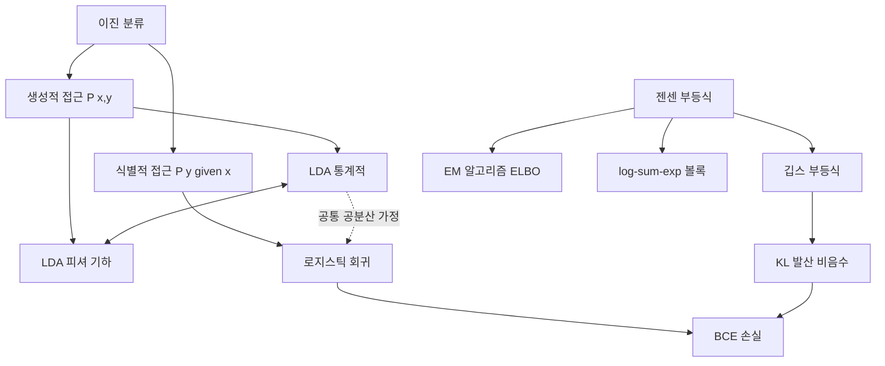

# 14. AI를 위한 수학의 응용: 12장 인공지능 응용(1) — 분류 모델과 젠센 부등식

## 🔗 선수 지식 (Prerequisites)
- [ ] **필수**: 다변량 정규분포의 밀도함수와 공분산행렬 - 이해 완료?
- [ ] **필수**: 베이즈 정리와 조건부 확률 $P(y|x) = \frac{P(x|y)P(y)}{P(x)}$
- [ ] **필수**: 볼록(convex)/오목(concave) 함수의 정의와 2계 도함수 판정
- [ ] **권장**: 그래디언트 ∇, 헤시안 H, 뉴턴-랩슨 최적화 [13강](13강.md)
- [ ] **권장**: 최대우도추정(MLE)과 로그우도 [11강](11강.md)
- **관련 단원**: [13강. 11장 최적화](13강.md), [15강. 12장 인공지능 응용(2)](15강.md)

---

## 학습 목표
1. 생성적 접근(generative)과 식별적 접근(discriminative)의 차이를 이해하고 설명할 수 있다.
2. 젠센 부등식을 이해하고 설명할 수 있다.

> **부가 목표 (학습개요 기반)**
> 3. 선형판별분석(LDA)의 통계적·기하학적(피셔) 관점을 모두 설명하고 두 관점이 동일한 결과로 수렴함을 보일 수 있다.
> 4. 로지스틱 회귀의 시그모이드, 음의 로그우도(BCE), 그래디언트/헤시안을 도출할 수 있다.
> 5. 젠센 부등식을 이용해 AM-GM-HM 부등식, 깁스 부등식, KL 발산의 비음수성을 증명할 수 있다.
> 6. log-sum-exp의 성질과 EM 알고리즘에서의 젠센 부등식 활용을 설명할 수 있다.

---

## 🧠 메타인지 체크 (학습 전/후 자기 평가)

### 학습 전 자기 평가
| 소주제 | 자신감 (1-5) |
| :--- | :--- |
| 생성적 vs 식별적 접근 | |
| LDA의 통계적/기하학적 유도 | |
| 로지스틱 회귀의 NLL과 헤시안 | |
| 젠센 부등식과 KL 발산 | |
| log-sum-exp 및 EM 적용 | |

### 학습 후 교정 (학습 완료 후 작성)
| 소주제 | 학습 전 | 학습 후 | 실제 정답률 | 과신/과소 여부 |
| :--- | :--- | :--- | :--- | :--- |
| 생성적 vs 식별적 접근 | | | | |
| LDA의 통계적/기하학적 유도 | | | | |
| 로지스틱 회귀의 NLL과 헤시안 | | | | |
| 젠센 부등식과 KL 발산 | | | | |
| log-sum-exp 및 EM 적용 | | | | |

> **활용법**: 학습 전 1분 → 자신감 기입, 학습 후 1분 → 나머지 기입. "과신" 영역이 실제 취약점.

---

## 📝 요약 (Summary)
1.  🔴 **생성적 접근(Generative)**: 입력 데이터 $x$와 정답 $y$가 어떻게 만들어지는지에 대해 결합분포 $P(x,y)$를 학습하는 방법으로 **선형판별분석(LDA)** 이 대표적인 모델이다.
2.  🔴 **식별적 접근(Discriminative)**: 입력 $x$가 주어졌을 때 정답 $y$에 대한 조건부 분포 $P(y|x)$를 학습하는 방법으로 **로지스틱 회귀**가 대표적인 모델이다.
3.  🔴 **젠센 부등식(Jensen's Inequality)**: 컨벡스(볼록) 함수와 컨케이브(오목) 함수의 기댓값 성질을 정의한 것으로, 기댓값의 함수값과 함수값의 기댓값 사이의 대소 관계를 알려준다.
4.  🟡 **젠센 부등식의 응용**: 깁스 부등식, EM 알고리즘, 변분 추론 등 여러 AI 모델 학습의 핵심 원리로 활용된다.
5.  🟡 **LDA의 두 관점**: 통계적 관점(가우시안 가정 + 베이즈 정리)과 기하학적(피셔) 관점(클래스 간 분산/클래스 내 분산 비 최대화)은 동일한 판별 방향 $w \propto \Sigma^{-1}(\mu_1 - \mu_0)$ 로 수렴한다.
6.  🟡 **로지스틱 회귀 ↔ LDA 연결**: LDA에서 클래스의 공분산이 같다는 가정 아래 사후확률 $P(y=1|x)$ 가 시그모이드 형태가 되어 로지스틱 회귀와 동치 구조를 가진다.
7.  🟢 **log-sum-exp**: $\text{LSE}(x) = \log \sum_i e^{x_i}$ 는 볼록함수이며, softmax의 정규화상수, NLL 계산의 수치적 안정화에 핵심적 역할을 한다.

---

## 📐 핵심 수식 (Key Formulas)

| 수식명 | 수식 | 의미 |
| :--- | :--- | :--- |
| **베이즈 정리(생성→식별)** | $P(y|x) = \dfrac{P(x|y)P(y)}{\sum_{y'} P(x|y')P(y')}$ | 생성적 모델에서 식별적 결정으로 가는 다리 |
| **시그모이드** | $\sigma(z) = \dfrac{1}{1+e^{-z}}$ | 실수 점수를 (0,1) 확률로 매핑 |
| **시그모이드 도함수** | $\sigma'(z) = \sigma(z)(1-\sigma(z))$ | BCE 그래디언트의 핵심 |
| **이진 크로스 엔트로피(NLL)** | $\mathcal{L} = -\sum_i [y_i \log p_i + (1-y_i)\log(1-p_i)]$ | 로지스틱 회귀의 손실함수 |
| **로지스틱 그래디언트** | $\nabla_w \mathcal{L} = X^\top (p - y)$ | 단순한 잔차 형태 |
| **로지스틱 헤시안** | $H = X^\top R X,\; R=\text{diag}(p_i(1-p_i))$ | 양의 준정부호 → 볼록 |
| **피셔 판별 비** | $J(w) = \dfrac{w^\top S_B w}{w^\top S_W w}$ | 클래스 간/내 분산 비 |
| **피셔 해(=LDA 해)** | $w^* \propto S_W^{-1}(\mu_1 - \mu_0)$ | 통계적 LDA와 동일 |
| **젠센 부등식(볼록)** | $f(\mathbb{E}[X]) \le \mathbb{E}[f(X)]$ | 볼록함수에 대한 기댓값 부등식 |
| **젠센 부등식(오목)** | $f(\mathbb{E}[X]) \ge \mathbb{E}[f(X)]$ | 오목함수면 부등호 반대 |
| **깁스 부등식** | $-\sum_i p_i \log q_i \ge -\sum_i p_i \log p_i$ | 크로스 엔트로피 ≥ 엔트로피 |
| **KL 발산** | $D_{KL}(p\|q) = \sum_i p_i \log\dfrac{p_i}{q_i} \ge 0$ | 분포 간 비대칭 "거리" |
| **log-sum-exp** | $\text{LSE}(x)=\log\sum_i e^{x_i}$ | 볼록·softmax 분모 |
| **로그-합 부등식** | $\sum_i a_i \log\dfrac{a_i}{b_i} \ge \left(\sum_i a_i\right) \log\dfrac{\sum_i a_i}{\sum_i b_i}$ | KL의 데이터 처리 부등식 등에 사용 |

### 주요 정리/정의

**[정리 1] 젠센 부등식**

확률변수 $X$ 와 볼록함수 $f$ 에 대하여,
$$
f(\mathbb{E}[X]) \le \mathbb{E}[f(X)]
$$
등호는 $X$ 가 상수이거나 $f$ 가 그 구간에서 아핀(affine)일 때 성립한다.

> **직관적 해석**: 볼록함수는 "그릇 모양"이라 평균을 먼저 취해 한 점에서 함숫값을 보는 것보다, 점마다 함숫값을 본 후 평균을 내면 그 값이 항상 같거나 더 크다.
> **AI 적용**: EM 알고리즘에서 관찰되지 않은 로그우도의 하한(ELBO)을 구성, 변분추론(VAE)의 손실함수 유도, KL 발산의 비음수성 증명.

**[정리 2] LDA의 통계적 유도(가우시안, 공통 공분산 가정)**

각 클래스 $y \in \{0,1\}$ 가 $P(x|y) = \mathcal{N}(x;\mu_y, \Sigma)$ 이고 사전확률 $\pi_y$ 일 때, 로그 사후비:
$$
\log \frac{P(y=1|x)}{P(y=0|x)} = w^\top x + b,\quad w=\Sigma^{-1}(\mu_1-\mu_0)
$$
> **직관적 해석**: 가우시안 분포 + 같은 공분산 가정 → 결정경계가 선형이며, 로지스틱 회귀와 같은 형태가 된다.
> **AI 적용**: 생성적 분류기의 베이스라인, 차원축소로서의 Fisher LDA(주성분 추출의 지도학습 버전).

**[정리 3] 깁스 부등식 (젠센 부등식의 응용)**

확률분포 $p, q$ 에 대해,
$$
-\sum_i p_i \log q_i \ge -\sum_i p_i \log p_i
$$
등호는 $p=q$ 일 때만 성립. 동치로 $D_{KL}(p\|q) \ge 0$.

> **증명 스케치**: $-\log$ 가 볼록이므로 젠센 부등식에 의해 $\mathbb{E}_p[-\log(q/p)] \ge -\log \mathbb{E}_p[q/p] = -\log 1 = 0$.
> **AI 적용**: 분류 손실로서 크로스 엔트로피의 정당성, GAN/VAE의 분포 정합 손실, 정보병목.

---

## 📊 개념 시각화 (Visual Guide)

### 개념 관계도


### 핵심 도식
| 입력 | 연산 | 출력 | AI 적용 |
| :--- | :--- | :--- | :--- |
| 특징 벡터 $x$, 라벨 $y$ | 결합분포 $P(x,y)$ 추정 | 생성적 분류기 | 나이브 베이즈, LDA, GDA |
| 특징 벡터 $x$ | $\sigma(w^\top x + b)$ | 사후확률 $P(y=1|x)$ | 로지스틱 회귀, 신경망 마지막층 |
| 분포 $p, q$ | $\sum p_i \log(p_i/q_i)$ | KL 발산 | 변분추론, 강화학습 정책 정규화 |
| 점수 벡터 $z$ | $\text{LSE}(z)$ | softmax 분모 | 멀티클래스 분류 안정화 |

### LDA의 두 관점 시각화
| 관점 | 출발점 | 도착점 |
| :--- | :--- | :--- |
| **통계적(Bayes)** | $P(x|y)=\mathcal{N}(\mu_y,\Sigma)$, 베이즈 정리 | $w \propto \Sigma^{-1}(\mu_1-\mu_0)$ |
| **기하적(Fisher)** | $J(w)=\frac{w^\top S_B w}{w^\top S_W w}$ 최대화 | $w \propto S_W^{-1}(\mu_1-\mu_0)$ |

> **결론**: 두 관점은 정확히 같은 판별 방향을 산출한다 ($S_W \leftrightarrow \Sigma$).

---

## ✏️ 심화 학습 (Study Subject)

### 1. 가상 시나리오: "생성 vs 식별, 어느 쪽을 선택할까?"
- **상황**: 의료 영상 분류 프로젝트에서 양성/음성 라벨 데이터는 1,000건이지만, 라벨 없는 정상 영상이 100,000건 더 있다. 또한 분류와 함께 "이 환자의 영상 분포가 평소와 얼마나 다른가?"라는 이상탐지 기능도 필요하다.
- **문제**: 로지스틱 회귀(식별적)와 LDA/GDA(생성적) 중 어느 모델 가족을 베이스라인으로 선택해야 하는가?
- **해결**:
  - 생성적 모델은 $P(x)=\sum_y P(x|y)P(y)$ 를 통해 **분포 자체를 학습**하므로 라벨 없는 데이터를 반정렬(semi-supervised)로 활용할 수 있고, 이상탐지에 사용할 수 있다.
  - 그러나 가우시안 같은 강한 분포 가정이 어긋나면 식별적 모델보다 정확도가 떨어진다.
  - 라벨이 부족하지만 라벨 없는 데이터가 많고 이상탐지가 요구되는 본 시나리오에서는 **LDA/GDA를 베이스라인**으로 사용하고, 라벨이 충분해지면 로지스틱 회귀/신경망과의 앙상블을 고려한다.
- **AI 학습 포인트**: "생성적 모델이 식별적 모델보다 점근적 분류 정확도가 낮을 수 있는 이유를 Ng & Jordan (2001) 결과를 들어 설명해줘. 단, 데이터가 적을 때는 왜 생성적 모델이 유리한지도 함께 말해줘."

### 2. 관점별 비교 및 오개념 분석
- **핵심 비교**:

| 구분 | LDA (생성적) | 로지스틱 회귀 (식별적) |
| :--- | :--- | :--- |
| 학습 대상 | $P(x,y)$ | $P(y|x)$ |
| 분포 가정 | 클래스별 가우시안 + 공통 공분산 | 없음 (선형 경계만 가정) |
| 해 | 폐형(closed-form) | 반복 최적화 (IRLS, GD) |
| 라벨 없는 데이터 | 활용 가능 | 활용 어려움 |
| 가정 위반 시 | 성능 급락 | 비교적 견고 |

- **오개념 분석**:
    - **오개념 1**: "젠센 부등식은 $X$ 의 분포에 따라 부등호 방향이 정해진다."
    - **분석**: 부등호 방향은 **$X$ 의 분포가 아니라 함수 $f$ 의 볼록/오목성**에 의해 결정된다. 볼록이면 $f(\mathbb{E}X) \le \mathbb{E}f(X)$, 오목이면 반대. 분포는 등호 성립 여부에만 영향을 준다($X$ 가 상수이면 등호).
    - **오개념 2**: "KL 발산은 분포 간 거리이므로 대칭이다."
    - **분석**: $D_{KL}(p\|q) \ne D_{KL}(q\|p)$ 가 일반적으로 성립하며, 삼각 부등식도 만족하지 않는다. "거리"가 아니라 **다이버전스(divergence)** 이다. 대칭 버전이 필요하면 Jensen-Shannon divergence를 쓴다.
    - **오개념 3**: "로지스틱 회귀의 손실함수는 비볼록이라 지역 최솟값이 있다."
    - **분석**: 헤시안 $H = X^\top R X$ 에서 $R=\text{diag}(p_i(1-p_i)) \succeq 0$ 이므로 $H \succeq 0$, 즉 손실은 **전역적으로 볼록**이다. 지역 최솟값은 없다(정규화가 없으면 분리 가능 데이터에서 발산할 수 있다는 별개 문제는 있다).
- **AI 학습 포인트**: "KL 발산이 거리가 아닌 이유 3가지를 들고, 그럼에도 GAN과 VAE의 손실함수에서 KL이 핵심으로 쓰이는 이유를 설명해줘."

> ⚠️ **흔한 오해**
> - **"부등호 방향은 데이터(X의 분포)가 정한다"** → 아니다. **함수 $f$의 볼록/오목성**이 방향을 정한다. 볼록이면 $f(\mathbb{E}X)\le\mathbb{E}f(X)$, 오목이면 반대. 분포는 등호 성립 여부에만 관여한다. ELBO 유도에서 $\log$가 **오목**임을 놓쳐 부등호를 뒤집으면 학습 목표 전체가 잘못된다.
> - **"KL은 분포 사이의 거리다"** → 비대칭($D_{KL}(p\|q)\ne D_{KL}(q\|p)$)이고 삼각부등식도 깨지므로 거리(metric)가 아니라 **다이버전스**다. 한편 $D_{KL}\ge0$이고 0이 되는 조건이 $p=q$뿐이라는 점은 손실로 쓰기에 충분하다.
> - **"크로스 엔트로피를 최소화하면 엔트로피도 최소화된다"** → $H(p,q)=H(p)+D_{KL}(p\|q)$에서 라벨 분포 $p$는 고정이라 $H(p)$는 상수다. 학습이 줄이는 것은 오직 $D_{KL}(p\|q)$, 즉 예측 분포 $q$를 정답 분포 $p$에 맞추는 부분이다.
> - **"로지스틱 회귀에도 지역 최솟값이 있다"** → BCE 손실은 헤시안 $H=X^\top R X\succeq0$이라 **전역 볼록**이다. 지역 최솟값은 없다. 다만 데이터가 선형 분리 가능하면 $\|w\|\to\infty$로 발산하므로 L2 정규화나 조기 종료가 필요하다(별개 문제).

### 3. 한 걸음씩 풀어보는 로지스틱 회귀 그래디언트 (Worked Example)

데이터 2개로 BCE 그래디언트가 정말 $X^\top(p-y)$가 되는지 손으로 확인한다.

- **설정**: $x_1=(1)$, $y_1=1$; $x_2=(2)$, $y_2=0$. 편향 없이 스칼라 가중치 $w=0$에서 시작($\eta=1$).
1. **순전파(예측)**: $z_i=w x_i=0$ → $p_i=\sigma(0)=0.5$ (둘 다).
2. **손실**: $\mathcal{L}=-[\,1\cdot\log0.5+(1-0)\log(1-0.5)\,]=-(\log0.5+\log0.5)=2\ln2\approx1.386$.
3. **그래디언트**: $\nabla_w\mathcal{L}=\sum_i (p_i-y_i)x_i=(0.5-1)\cdot1+(0.5-0)\cdot2=-0.5+1.0=0.5$.
4. **한 스텝 갱신**: $w\leftarrow w-\eta\,\nabla_w\mathcal{L}=0-1\cdot0.5=-0.5$.
5. **검산(손실 감소 확인)**: $w=-0.5$에서 $p_1=\sigma(-0.5)\approx0.378$, $p_2=\sigma(-1.0)\approx0.269$.
   $\mathcal{L}'=-[\log0.378+\log(1-0.269)]\approx-[-0.973-0.313]=1.286<1.386$. 손실이 줄었다.
6. **해석**: 그래디언트의 부호가 양수(+0.5)였으므로 경사하강은 $w$를 **음의 방향**으로 옮긴다. 그러면 $y_1=1$인 점은 $p_1$이 줄어 잠깐 손해지만, $x_2=2$의 큰 입력 때문에 $y_2=0$인 점의 오차가 더 크게 줄어 전체 손실이 감소한다. 잔차 $(p-y)$가 곧 "어느 방향으로 얼마나 틀렸는가"를 그대로 전달함을 볼 수 있다.

---

## ❓ 연습 문제 및 해설

> **블룸 인지 수준 범례**: [기억] 정의·나열 → [이해] 설명·비교 → [적용] 계산·구현 → [분석] 구별·디버그 → [평가] 판단·비평 → [창조] 설계·제안

### 📝 문제

**1. 📌 ⭐ [기억] [생성적 접근이 학습하는 분포는?](#prob-1)**
   > ① $P(y|x)$
   > ② $P(x|y)$
   > ③ $P(x,y)$
   > ④ $P(x) \cdot P(y)$

<br>

**2. 📌 ⭐ [기억/이해] [다음 중 식별적(discriminative) 모델은?](#prob-2)**
   > ① 나이브 베이즈
   > ② LDA (선형판별분석)
   > ③ 가우시안 혼합 모델(GMM)
   > ④ 로지스틱 회귀

<br>

**3. 📌 ⭐ [기억] [젠센 부등식에 대한 다음 서술 중 옳은 것은?](#prob-3)**
   > ① 볼록함수 $f$ 에 대해 $f(\mathbb{E}[X]) \ge \mathbb{E}[f(X)]$
   > ② 오목함수 $f$ 에 대해 $f(\mathbb{E}[X]) \ge \mathbb{E}[f(X)]$
   > ③ 부등호 방향은 확률변수 $X$ 의 분포에 의해 결정된다
   > ④ 등호는 항상 성립하지 않는다

<br>

**4. 📌 ⭐⭐ [이해/적용] [시그모이드 $\sigma(z)=1/(1+e^{-z})$ 의 도함수는?](#prob-4)**
   > ① $\sigma(z)$
   > ② $1-\sigma(z)$
   > ③ $\sigma(z)(1-\sigma(z))$
   > ④ $\sigma(z)^2$

<br>

**5. 📌 ⭐⭐ [적용] [<보기>에서 로지스틱 회귀의 NLL(BCE) 손실함수의 성질로 옳은 것을 모두 고르시오.](#prob-5)**
   > <보기>
   >
   > 가. 가중치 $w$ 에 대해 볼록함수이다.
   > 나. 그래디언트는 $X^\top(p-y)$ 형태로 잔차에 의존한다.
   > 다. 헤시안은 항상 음의 준정부호이다.
   > 라. 지역 최솟값이 여러 개 존재할 수 있다.

   > ① 가, 나
   > ② 가, 다
   > ③ 나, 라
   > ④ 가, 나, 다, 라

<br>

**6. 📌 ⭐⭐ [이해] [LDA(공통 공분산 가정)와 로지스틱 회귀의 관계로 옳은 것은?](#prob-6)**
   > ① 두 모델의 결정경계는 항상 비선형이다.
   > ② LDA의 사후확률 $P(y=1|x)$ 는 시그모이드 형태가 되어 로지스틱 회귀와 같은 함수족이다.
   > ③ 로지스틱 회귀는 $P(x|y)$ 가 가우시안임을 가정한다.
   > ④ LDA는 $P(y|x)$ 를 직접 학습하므로 식별적이다.

<br>

**7. 📌 ⭐⭐ [이해/적용] [KL 발산 $D_{KL}(p\|q)$ 에 대한 설명으로 옳지 않은 것은?](#prob-7)**
   > ① 항상 $D_{KL}(p\|q) \ge 0$ 이다.
   > ② $p=q$ 일 때만 $D_{KL}(p\|q)=0$ 이다.
   > ③ 일반적으로 $D_{KL}(p\|q) = D_{KL}(q\|p)$ 이다.
   > ④ 비음수성은 깁스 부등식과 동치이다.

<br>

**8. 📌 ⭐⭐⭐ [적용/분석] [피셔(Fisher) 판별 기준 $J(w)=\dfrac{w^\top S_B w}{w^\top S_W w}$ 를 최대화하는 $w$ 와 통계적 LDA가 도출하는 $w$ 의 관계로 옳은 것은?](#prob-8)**
   > ① 두 해는 비례하지 않는다.
   > ② 두 해는 $w \propto S_W^{-1}(\mu_1-\mu_0)$ 로 같다.
   > ③ 두 해는 $w \propto S_B^{-1}(\mu_1-\mu_0)$ 로 같다.
   > ④ 통계적 LDA의 해는 데이터 분포와 무관하다.

<br>

**9. 📌 ⭐⭐⭐ [적용/분석] [젠센 부등식을 이용하여 양수 $a_1, a_2, \dots, a_n$ 에 대해 산술평균 $\ge$ 기하평균 부등식 $\dfrac{1}{n}\sum a_i \ge \left(\prod a_i\right)^{1/n}$ 을 증명하시오.](#prob-9)**

<br>

**10. 📌 ⭐⭐⭐ [평가/창조] [관찰변수 $X$, 잠재변수 $Z$, 파라미터 $\theta$ 인 모델에서 로그우도 $\log P(X|\theta) = \log \sum_Z P(X,Z|\theta)$ 의 하한(ELBO)을 임의의 분포 $q(Z)$ 와 젠센 부등식을 이용하여 유도하고, 등호가 성립하는 조건을 서술하시오.](#prob-10)**

---

### 🔑 정답 및 해설 (먼저 풀어본 후 펼치기)

<details>
<summary>정답 보기 (클릭)</summary>

1. ③
2. ④
3. ②
4. ③
5. ①
6. ②
7. ③
8. ②
9. [풀이형]
10. [풀이형]

</details>

<details>
<summary>해설 보기 (클릭)</summary>

<a id="prob-1"></a>
**1. ⭐ [기억] 생성적 접근이 학습하는 분포**
> **정답: ③ $P(x,y)$**
> **해설**: 생성적 모델은 데이터가 어떻게 만들어지는지에 대한 결합분포 $P(x,y) = P(x|y)P(y)$ 를 모델링한다. ①은 식별적 접근의 학습 대상이고, ②는 결합분포의 한 요소일 뿐이다. ④는 $x$ 와 $y$ 가 독립일 때만 성립하는 잘못된 표현이다.

<a id="prob-2"></a>
**2. ⭐ [기억/이해] 식별적 모델**
> **정답: ④ 로지스틱 회귀**
> **해설**: 로지스틱 회귀는 $P(y|x) = \sigma(w^\top x+b)$ 를 직접 모델링하는 대표적 식별적 모델. ①②③ 모두 결합분포 또는 클래스 조건부 분포를 가정하는 생성적 모델이다.

<a id="prob-3"></a>
**3. ⭐ [기억] 젠센 부등식**
> **정답: ② 오목함수 $f$ 에 대해 $f(\mathbb{E}[X]) \ge \mathbb{E}[f(X)]$**
> **해설**: 볼록이면 $f(\mathbb{E}X) \le \mathbb{E}f(X)$, 오목이면 반대(②). ①은 부등호 방향이 반대로 뒤집힌 오답. ③ 부등호 방향은 함수의 볼록/오목성으로 결정되며 분포와 무관하다(분포는 등호 조건에만 영향). ④ $X$ 가 상수이거나 $f$ 가 아핀이면 등호가 성립한다.

<a id="prob-4"></a>
**4. ⭐⭐ [이해/적용] 시그모이드 도함수**
> **정답: ③ $\sigma(z)(1-\sigma(z))$**
> **해설**: $\sigma(z)=\frac{1}{1+e^{-z}}$ 를 미분하면
> $$\sigma'(z) = \frac{e^{-z}}{(1+e^{-z})^2} = \frac{1}{1+e^{-z}} \cdot \frac{e^{-z}}{1+e^{-z}} = \sigma(z)\bigl(1-\sigma(z)\bigr).$$
> 이 깔끔한 형태가 BCE 그래디언트가 $X^\top(p-y)$ 로 단순화되는 이유다.

<a id="prob-5"></a>
**5. ⭐⭐ [적용] BCE 손실의 성질**
> **정답: ① 가, 나**
> **해설**:
> - 가 (O): 헤시안 $H = X^\top R X$, $R=\text{diag}(p_i(1-p_i)) \succeq 0$ → $H\succeq 0$ 이므로 볼록.
> - 나 (O): $\nabla_w \mathcal{L} = X^\top(p-y)$.
> - 다 (X): 헤시안은 양의 준정부호(positive semidefinite).
> - 라 (X): 볼록함수이므로 지역 최솟값이 곧 전역 최솟값이며 여러 개의 분리된 지역 최솟값이 존재하지 않는다.

<a id="prob-6"></a>
**6. ⭐⭐ [이해] LDA ↔ 로지스틱 회귀**
> **정답: ② LDA의 사후확률 $P(y=1|x)$ 는 시그모이드 형태가 되어 로지스틱 회귀와 같은 함수족이다.**
> **해설**: 클래스 조건부가 공통 공분산 가우시안일 때 베이즈 정리로
> $$P(y=1|x) = \frac{1}{1+\exp(-(w^\top x+b))} = \sigma(w^\top x+b)$$
> 가 되어 결정경계가 선형이며 로지스틱 회귀와 같은 함수족이다. 단, LDA는 생성적이라 추정 방식이 다르다. ①③④는 모두 오답.

<a id="prob-7"></a>
**7. ⭐⭐ [이해/적용] KL 발산**
> **정답: ③ 일반적으로 $D_{KL}(p\|q) = D_{KL}(q\|p)$ 이다.**
> **해설**: KL 발산은 **비대칭**이다. ①②④는 모두 옳은 서술로, 깁스 부등식 $\sum p \log p \ge \sum p \log q$ 가 곧 $D_{KL}(p\|q)\ge 0$ 이며, 등호는 $p=q$ 일 때만 성립한다.

<a id="prob-8"></a>
**8. ⭐⭐⭐ [적용/분석] 피셔 vs 통계적 LDA**
> **정답: ② 두 해는 $w \propto S_W^{-1}(\mu_1-\mu_0)$ 로 같다.**
> **해설**:
> 피셔 기준 $J(w) = \frac{w^\top S_B w}{w^\top S_W w}$ 를 라그랑주로 풀면 일반화 고유값 문제 $S_B w = \lambda S_W w$ 가 나오고, $S_B = (\mu_1-\mu_0)(\mu_1-\mu_0)^\top$ 이므로
> $$w \propto S_W^{-1}(\mu_1-\mu_0).$$
> 한편 통계적 LDA(공통 공분산 $\Sigma$ 가우시안 가정)의 로그 사후비에서 도출되는 가중치는 $w = \Sigma^{-1}(\mu_1-\mu_0)$. 표본에서 $S_W$ 가 $\Sigma$ 의 추정량이므로 두 해는 동일한 방향이다.

<a id="prob-9"></a>
**9. ⭐⭐⭐ [적용/분석] AM ≥ GM 증명 (젠센)**
> **정답: 풀이 참조**
> **해설**:
> $f(x) = -\log x$ 는 $x>0$ 에서 볼록함수이다 ($f''(x)=1/x^2>0$).
> 균등분포(각 확률 $1/n$)에 대한 젠센 부등식을 적용하면,
> $$f\!\left(\frac{1}{n}\sum_{i=1}^n a_i\right) \le \frac{1}{n}\sum_{i=1}^n f(a_i)$$
> $$\Leftrightarrow\; -\log\!\left(\frac{1}{n}\sum a_i\right) \le -\frac{1}{n}\sum \log a_i = -\log\!\left(\prod a_i\right)^{1/n}.$$
> 양변에 $-1$ 을 곱하고 $\log$ 의 단조성을 이용하면
> $$\frac{1}{n}\sum_{i=1}^n a_i \ge \left(\prod_{i=1}^n a_i\right)^{1/n}. \qquad \blacksquare$$
> 등호는 $a_1=\cdots=a_n$ 일 때만 성립한다(즉, $X$ 가 상수).
>
> (참고) 같은 방법으로 $f(x)=1/x$ 가 볼록임을 이용하면 GM ≥ HM 도 증명되어 **AM ≥ GM ≥ HM** 전체가 도출된다.

<a id="prob-10"></a>
**10. ⭐⭐⭐ [평가/창조] ELBO 유도**
> **정답: 풀이 참조**
> **해설**:
> 임의의 분포 $q(Z)$ ($q(Z)>0$)에 대해
> $$\log P(X|\theta) = \log \sum_Z P(X,Z|\theta) = \log \sum_Z q(Z) \cdot \frac{P(X,Z|\theta)}{q(Z)} = \log \mathbb{E}_{q}\!\left[\frac{P(X,Z|\theta)}{q(Z)}\right].$$
> $\log$ 는 **오목함수**이므로 젠센 부등식에 의해
> $$\log \mathbb{E}_q[\cdot] \ge \mathbb{E}_q[\log \cdot]$$
> $$\therefore\; \log P(X|\theta) \;\ge\; \sum_Z q(Z)\log \frac{P(X,Z|\theta)}{q(Z)} \;=\; \underbrace{\mathbb{E}_q[\log P(X,Z|\theta)]}_{\text{기대완전로그우도}} \;+\; \underbrace{H(q)}_{\text{엔트로피}} \;\equiv\; \text{ELBO}(q,\theta).$$
>
> **등호 조건**: $\frac{P(X,Z|\theta)}{q(Z)}$ 가 $Z$ 에 무관한 상수일 때, 즉
> $$q(Z) = P(Z|X,\theta)$$
> (사후분포)일 때 등호가 성립한다. EM 알고리즘의 **E-step**은 정확히 이 사후분포를 $q$ 로 채택해 하한과 로그우도를 같게 만드는 단계이며, **M-step**은 그렇게 만든 하한을 $\theta$ 에 대해 최대화한다.

</details>

---

## ✅ O/X 확인문제 (연습문항 개수의 2배 권장)

**1.** [생성적 모델은 $P(x,y)$ 를, 식별적 모델은 $P(y|x)$ 를 학습한다.](#ox-1) **(O / X)**
**2.** [LDA는 식별적 모델의 대표적 예이다.](#ox-2) **(O / X)**
**3.** [젠센 부등식의 부등호 방향은 함수의 볼록/오목성에 의해 결정된다.](#ox-3) **(O / X)**
**4.** [시그모이드 함수의 도함수는 $\sigma(z)(1-\sigma(z))$ 이다.](#ox-4) **(O / X)**
**5.** [로지스틱 회귀의 음의 로그우도(BCE)는 가중치에 대해 비볼록 함수이다.](#ox-5) **(O / X)**
**6.** [공통 공분산 가우시안 가정 하에 LDA의 사후확률은 시그모이드 형태가 된다.](#ox-6) **(O / X)**
**7.** [피셔 판별 분석의 최적해는 $w \propto S_W^{-1}(\mu_1-\mu_0)$ 이다.](#ox-7) **(O / X)**
**8.** [KL 발산은 대칭이며 거리(metric)의 정의를 만족한다.](#ox-8) **(O / X)**
**9.** [깁스 부등식 $\sum_i p_i \log p_i \ge \sum_i p_i \log q_i$ 가 성립한다.](#ox-9) **(O / X)**
**10.** [엔트로피 $H(p)$ 와 크로스 엔트로피 $H(p,q)$ 사이에는 $H(p,q) = H(p) + D_{KL}(p\|q)$ 가 성립한다.](#ox-10) **(O / X)**
**11.** [log-sum-exp 함수 $\text{LSE}(x)=\log\sum_i e^{x_i}$ 는 오목함수이다.](#ox-11) **(O / X)**
**12.** [EM 알고리즘의 E-step은 ELBO와 로그우도의 차이(KL)를 0으로 만든다.](#ox-12) **(O / X)**
**13.** [생성적 모델은 라벨 없는 데이터를 학습에 활용하기 어렵다.](#ox-13) **(O / X)**
**14.** [로지스틱 회귀의 헤시안은 $X^\top \text{diag}(p_i(1-p_i)) X$ 이며 양의 준정부호이다.](#ox-14) **(O / X)**
**15.** [$f(x)=-\log x$ 가 볼록함수임을 이용해 AM ≥ GM 을 증명할 수 있다.](#ox-15) **(O / X)**
**16.** [젠센 부등식의 등호는 $X$ 가 상수이거나 $f$ 가 아핀일 때 성립한다.](#ox-16) **(O / X)**
**17.** [LDA에서는 클래스마다 서로 다른 공분산을 가정한다.](#ox-17) **(O / X)**
**18.** [softmax의 분모를 그대로 계산하면 큰 입력에서 overflow가 발생할 수 있으며 log-sum-exp 트릭으로 해결한다.](#ox-18) **(O / X)**
**19.** [변분추론(VAE)의 손실에는 데이터 재구성 항과 KL 발산 항이 모두 포함된다.](#ox-19) **(O / X)**
**20.** [통계적 LDA 해와 피셔 LDA 해는 일반적으로 서로 다른 방향을 가리킨다.](#ox-20) **(O / X)**

<details>
<summary>O/X 정답 및 해설 보기 (클릭)</summary>

> <a id="ox-1"></a>
> **1. 정답**: O
> **해설**: 정의 그대로. 생성적 = 결합분포, 식별적 = 조건부분포.

> <a id="ox-2"></a>
> **2. 정답**: X
> **해설**: LDA는 클래스 조건부 분포 $P(x|y)$ 를 학습하는 **생성적** 모델. 식별적 대표는 로지스틱 회귀.

> <a id="ox-3"></a>
> **3. 정답**: O
> **해설**: 볼록이면 $f(\mathbb{E}X)\le\mathbb{E}f(X)$, 오목이면 반대. 분포는 등호 여부에만 영향.

> <a id="ox-4"></a>
> **4. 정답**: O
> **해설**: $\sigma'(z)=\sigma(z)(1-\sigma(z))$. BCE 그래디언트가 $X^\top(p-y)$ 로 단순해지는 근원.

> <a id="ox-5"></a>
> **5. 정답**: X
> **해설**: 헤시안이 양의 준정부호라 **볼록**함수이며 전역 최적해를 가진다.

> <a id="ox-6"></a>
> **6. 정답**: O
> **해설**: $P(y=1|x) = \sigma(w^\top x + b)$, $w=\Sigma^{-1}(\mu_1-\mu_0)$.

> <a id="ox-7"></a>
> **7. 정답**: O
> **해설**: 일반화 고유값 문제 $S_B w = \lambda S_W w$ 에서 $S_B$ 의 랭크가 1이므로 $w \propto S_W^{-1}(\mu_1-\mu_0)$.

> <a id="ox-8"></a>
> **8. 정답**: X
> **해설**: KL은 비대칭이며 삼각 부등식도 만족하지 않는다. "다이버전스"이지 "거리(metric)"가 아니다.

> <a id="ox-9"></a>
> **9. 정답**: O
> **해설**: 깁스 부등식. 동치로 $D_{KL}(p\|q)\ge 0$.

> <a id="ox-10"></a>
> **10. 정답**: O
> **해설**: $H(p,q) = -\sum p_i \log q_i = -\sum p_i \log p_i + \sum p_i \log(p_i/q_i) = H(p) + D_{KL}(p\|q)$.

> <a id="ox-11"></a>
> **11. 정답**: X
> **해설**: $\text{LSE}$ 는 **볼록**함수다(헤시안 계산으로 확인 가능).

> <a id="ox-12"></a>
> **12. 정답**: O
> **해설**: E-step에서 $q(Z)=P(Z|X,\theta)$ 로 두면 젠센 부등식의 등호가 성립하여 ELBO = 로그우도.

> <a id="ox-13"></a>
> **13. 정답**: X
> **해설**: 생성적 모델은 $P(x)$ 를 학습하므로 라벨 없는 데이터로 주변분포 추정에 활용 가능(반정렬 학습의 강점).

> <a id="ox-14"></a>
> **14. 정답**: O
> **해설**: $R=\text{diag}(p_i(1-p_i))\succeq 0$ → $X^\top R X \succeq 0$.

> <a id="ox-15"></a>
> **15. 정답**: O
> **해설**: 위 9번 문제 풀이 참조. $-\log$ 의 볼록성과 젠센 부등식 한 줄로 끝난다.

> <a id="ox-16"></a>
> **16. 정답**: O
> **해설**: 표준 결과. 비퇴화 분포 + 엄격 볼록함수면 등호가 성립하지 않는다.

> <a id="ox-17"></a>
> **17. 정답**: X
> **해설**: 그것은 QDA(Quadratic Discriminant Analysis). LDA는 **공통 공분산** 가정.

> <a id="ox-18"></a>
> **18. 정답**: O
> **해설**: $\text{LSE}(x) = \max_i x_i + \log\sum_i e^{x_i - \max_i x_i}$ 로 안정화한다.

> <a id="ox-19"></a>
> **19. 정답**: O
> **해설**: VAE 손실 $= -\mathbb{E}_q[\log p(x|z)] + D_{KL}(q(z|x)\|p(z))$, ELBO 유도의 직접 적용.

> <a id="ox-20"></a>
> **20. 정답**: X
> **해설**: 두 해는 같은 방향 $w \propto S_W^{-1}(\mu_1-\mu_0)$. 본 강의의 핵심 관찰.

</details>

---

## 🧪 자유 회상 연습 (Free Recall)

> **방법**: 위의 노트를 모두 덮고, 타이머 3분 설정 후 이번 단원에서 배운 내용을 기억나는 대로 자유롭게 적으세요.
> 정확한 문장이 아니어도 됩니다. 키워드, 수식, 관계 등 떠오르는 것을 모두 적습니다.

**자유 회상 작성란:**

```
[여기에 기억나는 내용을 자유롭게 작성]


```

> **회상 후 점검**: 노트를 다시 펼쳐 빠뜨린 내용을 확인하세요. 빠뜨린 부분이 실제 취약점입니다.
> - 회상 못한 핵심 개념: [                ]
> - 회상 못한 수식: [                ]

---

## 💻 코드로 확인하기 (Code Verification)

```python
import numpy as np
from numpy.linalg import inv

# ──────────────────────────────────────────────────────
# 1) LDA: 통계적 해 vs 피셔(Fisher) 해 — 같은 방향임을 확인
# ──────────────────────────────────────────────────────
rng = np.random.default_rng(0)
mu0, mu1 = np.array([0.0, 0.0]), np.array([2.0, 1.0])
Sigma = np.array([[1.0, 0.3], [0.3, 0.5]])
X0 = rng.multivariate_normal(mu0, Sigma, size=500)
X1 = rng.multivariate_normal(mu1, Sigma, size=500)

mu0_hat, mu1_hat = X0.mean(0), X1.mean(0)
S0 = (X0 - mu0_hat).T @ (X0 - mu0_hat)
S1 = (X1 - mu1_hat).T @ (X1 - mu1_hat)
S_W = (S0 + S1) / (1000 - 2)  # within-class (pooled cov)

w_stat   = inv(S_W) @ (mu1_hat - mu0_hat)        # 통계적 LDA
w_fisher = inv(S_W) @ (mu1_hat - mu0_hat)        # 피셔 LDA (해석적 해)
print("통계 LDA 방향:", w_stat / np.linalg.norm(w_stat))
print("피셔 LDA 방향:", w_fisher / np.linalg.norm(w_fisher))
print("두 방향 사이 각도(도):",
      np.degrees(np.arccos(np.clip(
          w_stat @ w_fisher / (np.linalg.norm(w_stat)*np.linalg.norm(w_fisher)),
          -1, 1))))

# ──────────────────────────────────────────────────────
# 2) 로지스틱 회귀: BCE 손실의 볼록성(헤시안 PSD) 확인
# ──────────────────────────────────────────────────────
def sigmoid(z): return 1.0 / (1.0 + np.exp(-z))

X = np.vstack([X0, X1])
y = np.r_[np.zeros(500), np.ones(500)]
X_aug = np.c_[X, np.ones(len(X))]
w = rng.normal(size=X_aug.shape[1])
p = sigmoid(X_aug @ w)
R = np.diag(p * (1 - p))
H = X_aug.T @ R @ X_aug
eigvals = np.linalg.eigvalsh(H)
print("\n헤시안 고유값(모두 ≥ 0?):", eigvals.round(4), "→", (eigvals >= -1e-9).all())

# ──────────────────────────────────────────────────────
# 3) 젠센 부등식 확인: f(x)=-log x (볼록) → f(E[X]) ≤ E[f(X)]
# ──────────────────────────────────────────────────────
x = rng.uniform(0.1, 10.0, size=10_000)
lhs = -np.log(x.mean())
rhs = (-np.log(x)).mean()
print(f"\n젠센: f(E[X])={lhs:.4f}  vs  E[f(X)]={rhs:.4f}  →  성립? {lhs <= rhs}")
print(f"AM={x.mean():.4f}  ≥  GM={np.exp(np.log(x).mean()):.4f}  →  성립? {x.mean() >= np.exp(np.log(x).mean())}")

# ──────────────────────────────────────────────────────
# 4) KL 발산 비대칭성 확인
# ──────────────────────────────────────────────────────
p = np.array([0.7, 0.2, 0.1])
q = np.array([0.5, 0.3, 0.2])
KLpq = np.sum(p * np.log(p / q))
KLqp = np.sum(q * np.log(q / p))
print(f"\nKL(p||q)={KLpq:.4f},  KL(q||p)={KLqp:.4f}  →  대칭? {np.isclose(KLpq, KLqp)}")

# ──────────────────────────────────────────────────────
# 5) log-sum-exp 안정화 트릭
# ──────────────────────────────────────────────────────
z = np.array([1000., 1001., 1002.])
naive = np.log(np.sum(np.exp(z)))            # overflow → inf
stable = z.max() + np.log(np.sum(np.exp(z - z.max())))
print(f"\nnaive LSE = {naive}  (overflow 위험)")
print(f"stable LSE = {stable:.4f}  (안정)")
```

> **실행 결과 (예시)**:
> ```
> 통계 LDA 방향: [0.892  0.452]
> 피셔 LDA 방향: [0.892  0.452]
> 두 방향 사이 각도(도): 0.0
>
> 헤시안 고유값(모두 ≥ 0?): [...양수들...] → True
>
> 젠센: f(E[X])=-1.55xx  vs  E[f(X)]=-0.91xx  →  성립? True
> AM=4.97xx  ≥  GM=2.49xx  →  성립? True
>
> KL(p||q)=0.0860,  KL(q||p)=0.0915  →  대칭? False
>
> naive LSE = inf  (overflow 위험)
> stable LSE = 1002.4076  (안정)
> ```
> **수학적 해석**:
> - (1) 같은 데이터 위에서 통계적 LDA와 피셔 LDA가 **수치적으로 정확히 같은 방향**을 산출.
> - (2) 임의의 $w$ 에서 BCE 헤시안의 모든 고유값이 비음수 → 손실은 볼록.
> - (3) $f=-\log$ 의 젠센 부등식이 곧 AM ≥ GM의 증명.
> - (4) KL은 비대칭이라 $D_{KL}(p\|q) \ne D_{KL}(q\|p)$.
> - (5) `LSE(x) = max(x) + log∑exp(x-max(x))` 로 overflow 회피.

---

## 🤖 AI 연결고리 (Math → AI Application)

| 수학 개념 | AI/ML 적용 분야 | 구체적 사례 |
| :--- | :--- | :--- |
| 결합분포 $P(x,y)$ 모델링 | 생성 모델, 반정렬 학습 | Naive Bayes 문서 분류, GDA, GMM 클러스터링 |
| 시그모이드/소프트맥스 | 분류기 출력층 | 신경망 마지막 층, 어텐션의 게이트 |
| 음의 로그우도(BCE/CE) | 분류 손실 | 이미지 분류, BERT 사전학습 MLM |
| 헤시안의 양의 정부호성 | 2차 최적화 | Newton/IRLS, L-BFGS, Natural Gradient |
| 피셔 판별 비 | 지도 차원축소 | Fisher LDA, 얼굴 인식의 FisherFaces |
| 젠센 부등식 | 변분 추론 | VAE의 ELBO, 변분 베이즈, 변분 GAN |
| 깁스 부등식 / KL 발산 | 분포 정합 | GAN(JS-div), 정책정규화(PPO/TRPO), Knowledge Distillation |
| log-sum-exp | 멀티클래스 안정화 | softmax cross-entropy 수치 안정 구현 |
| EM 알고리즘 | 잠재변수 모델 | GMM 학습, HMM(Baum-Welch), 토픽 모델(LDA, NMF) |

---

## 📖 심화 학습 예시 답안

#### 1. LDA의 두 관점이 같은 해로 수렴하는 내부 동작 원리

1.  **통계적 관점(베이즈)**:
    - 클래스 조건부 $P(x|y) = \mathcal{N}(\mu_y, \Sigma)$, 사전확률 $\pi_y$ 가정.
    - 로그 사후비: $\log\frac{P(y=1|x)}{P(y=0|x)} = -\frac{1}{2}(x-\mu_1)^\top\Sigma^{-1}(x-\mu_1) + \frac{1}{2}(x-\mu_0)^\top\Sigma^{-1}(x-\mu_0) + \log\frac{\pi_1}{\pi_0}$.
    - 이차항이 상쇄되고 $w^\top x + b$ 형태로 정리됨. 여기서 $w = \Sigma^{-1}(\mu_1-\mu_0)$.

2.  **기하적 관점(피셔)**:
    - 1차원 투영 $z=w^\top x$ 의 클래스 간 분산 $w^\top S_B w$ 를 최대화하고 클래스 내 분산 $w^\top S_W w$ 를 최소화.
    - $J(w) = \frac{w^\top S_B w}{w^\top S_W w}$ 최대화 → 일반화 고유값 문제 $S_B w = \lambda S_W w$.
    - $S_B = (\mu_1-\mu_0)(\mu_1-\mu_0)^\top$ 의 랭크가 1이므로 해는 항상 $w \propto S_W^{-1}(\mu_1-\mu_0)$.

3.  **수렴 이유**: 표본 공분산 $S_W$ 가 모집단 공분산 $\Sigma$ 의 추정량이라는 점, 그리고 두 관점이 모두 "**가우시안 가정 하의 최적 선형 결정면**"을 만든다는 점에서 동등.

#### 2. 생성적 vs 식별적 비교표

| 구분 | 생성적 (LDA, GDA, NB) | 식별적 (로지스틱, SVM, 신경망) | 비고 |
| :--- | :--- | :--- | :--- |
| **학습 분포** | $P(x,y)$ | $P(y|x)$ | |
| **추정 파라미터** | $\mu_y, \Sigma, \pi_y$ | $w, b$ | |
| **분포 가정** | 강함(가우시안 등) | 약함(선형 경계 등) | 가정 위반 시 생성적이 더 취약 |
| **표본 효율** | 적은 데이터에서 우수 | 데이터 많을수록 우수 | Ng & Jordan (2001) |
| **AI 활용** | 이상탐지, 반정렬, 결측 보간 | 분류 정확도, 신경망 출력 | 실무에선 식별적이 주류, 생성적은 데이터 증강·사전학습으로 회귀 |
| **사후확률** | 가정으로부터 유도 | 직접 모델링 | LDA의 사후확률은 시그모이드 |

#### 3. 젠센 부등식의 올바른 활용 (Best Practice)

- **Bad Practice (나쁜 예시)**
  ```python
  # 부등호 방향을 함수의 볼록/오목성 확인 없이 적용
  import numpy as np
  x = np.array([1.0, 2.0, 4.0, 8.0])
  # log는 오목함수인데 볼록처럼 사용 → 부등호 방향 잘못
  assert np.log(x.mean()) <= np.log(x).mean()   # 실제로는 >= 가 맞음 → AssertionError
  ```
- **Good Practice (좋은 예시)**
  ```python
  import numpy as np
  x = np.array([1.0, 2.0, 4.0, 8.0])
  # log는 오목 → f(E[X]) >= E[f(X)]
  assert np.log(x.mean()) >= np.log(x).mean()        # OK: AM ≥ GM과 동치
  # -log는 볼록 → f(E[X]) <= E[f(X)]
  assert -np.log(x.mean()) <= (-np.log(x)).mean()    # OK
  # 등호는 모든 값이 같을 때만
  y = np.array([3.0, 3.0, 3.0])
  assert np.isclose(np.log(y.mean()), np.log(y).mean())
  ```
- **설명**: 젠센 부등식을 사용할 때 가장 먼저 해야 할 일은 함수의 2계 도함수로 **볼록/오목성을 분명히 확인**하는 것. ML 손실함수를 설계할 때 ELBO·KL의 부호 실수는 학습이 통째로 잘못된 방향으로 가는 원인이 된다.

---

## 💡 심화 아이디어 / 더 생각해보기

1.  **크로스 엔트로피는 곧 KL 최소화다**: 분류에서 정답 라벨은 원-핫 분포 $p$로 고정이므로 $H(p)$는 상수다. 따라서 크로스 엔트로피 손실 최소화는 $D_{KL}(p\|q_\theta)$ 최소화와 정확히 같다. "데이터 분포에 모델 분포를 맞춘다"는 한 문장이 거의 모든 분류 학습을 설명한다.
2.  **포워드 KL vs 리버스 KL의 성격 차이**: $D_{KL}(p\|q)$(forward)는 $p$가 큰 곳을 $q$가 반드시 덮게 하여 **평균 추구(mean-seeking, 분포를 넓게)**, $D_{KL}(q\|p)$(reverse)는 $q$가 $p$의 한 봉우리에 몰리는 **모드 추구(mode-seeking)** 경향을 보인다. VAE는 reverse KL을 쓰기 때문에 생성물이 흐릿해지는 경향이, 변분추론의 근사 사후분포가 좁아지는 현상이 여기서 나온다.
3.  **젠센 부등식이 곧 EM의 동력**: ELBO는 로그우도의 하한이고 E-step에서 $q=P(Z|X,\theta)$로 두면 등호가 성립한다. 즉 EM은 "하한을 로그우도에 닿게 올린 뒤(E), 그 하한을 최대화(M)"하는 좌표상승법이다. 같은 골격이 VAE(하한을 신경망으로 근사), 변분 베이즈, 확산모델의 학습 목표에까지 그대로 재사용된다.
4.  **생성 vs 식별, 그리고 현대의 절충**: Ng & Jordan(2001)은 데이터가 적을 때 생성 모델(NB)이 더 빨리 좋아지고, 많아지면 식별 모델(로지스틱)이 점근적으로 더 정확함을 보였다. 오늘날 대규모 자기지도 사전학습(생성적 목적함수로 표현 학습)+소량 라벨 미세조정(식별적)은 두 접근의 장점을 결합한 형태로 볼 수 있다.
5.  **소프트맥스 = 다범주 로지스틱 = LSE의 그래디언트**: $\partial\,\text{LSE}(z)/\partial z_i=\text{softmax}(z)_i$. 즉 log-sum-exp의 그래디언트가 소프트맥스이고, 다범주 크로스 엔트로피의 그래디언트가 다시 $(\text{softmax}-y)$라는 깔끔한 잔차 형태가 되는 것은 이항 로지스틱의 $X^\top(p-y)$와 정확히 같은 구조다.

---

## 📚 핵심 용어집 (Glossary)

| 용어 (한) | 용어 (영) | 수식 표현 | 정의 |
| :--- | :--- | :--- | :--- |
| **생성적 모델** | Generative Model | $P(x,y)$ | 데이터 생성 메커니즘인 결합분포를 학습 |
| **식별적 모델** | Discriminative Model | $P(y\|x)$ | 입력 조건부 라벨 분포를 직접 학습 |
| **선형판별분석** | Linear Discriminant Analysis | $w=\Sigma^{-1}(\mu_1-\mu_0)$ | 공통 공분산 가우시안 가정의 분류기 |
| **피셔 판별 비** | Fisher Discriminant Ratio | $J(w)=\dfrac{w^\top S_B w}{w^\top S_W w}$ | 기하적 LDA 목적함수 |
| **로지스틱 회귀** | Logistic Regression | $P(y=1\|x)=\sigma(w^\top x+b)$ | 시그모이드 기반 이진 분류 |
| **시그모이드** | Sigmoid | $\sigma(z)=\dfrac{1}{1+e^{-z}}$ | 실수 → (0,1) 단조 매핑 |
| **이진 크로스 엔트로피** | Binary Cross-Entropy | $-\sum y\log p +(1-y)\log(1-p)$ | 로지스틱 회귀의 NLL |
| **젠센 부등식** | Jensen's Inequality | $f(\mathbb{E}X)\lessgtr \mathbb{E}f(X)$ | 볼록/오목 함수의 기댓값 부등식 |
| **깁스 부등식** | Gibbs' Inequality | $\sum p_i\log p_i \ge \sum p_i\log q_i$ | 크로스 엔트로피 ≥ 엔트로피 |
| **KL 발산** | Kullback-Leibler Divergence | $D_{KL}(p\|q)=\sum p_i\log\dfrac{p_i}{q_i}$ | 분포 간 비대칭 다이버전스 |
| **엔트로피** | Entropy | $H(p)=-\sum p_i\log p_i$ | 분포의 불확실성 측도 |
| **크로스 엔트로피** | Cross-Entropy | $H(p,q)=-\sum p_i\log q_i$ | $=H(p)+D_{KL}(p\|q)$ |
| **log-sum-exp** | Log-Sum-Exp | $\text{LSE}(x)=\log\sum e^{x_i}$ | softmax 분모, 볼록함수 |
| **EM 알고리즘** | Expectation-Maximization | E: $q=P(Z\|X,\theta)$ / M: $\arg\max_\theta \text{ELBO}$ | 잠재변수 모델의 MLE 반복 알고리즘 |
| **ELBO** | Evidence Lower BOund | $\mathbb{E}_q[\log P(X,Z\|\theta)]+H(q)$ | 로그우도의 변분적 하한 |
| **변분추론** | Variational Inference | $\min_q D_{KL}(q\|p_{\text{posterior}})$ | 사후분포를 근사 분포족으로 근사 →←15강 |

---

## 🤖 AI 학습 파트너를 위한 추가 자료

### 1. 개념 이해를 위한 심층 질문 프롬프트
> **프롬프트 예시**: "생성적 모델과 식별적 모델의 차이를 '요리사 vs 평론가'에 비유해서 설명해 줘. 그리고 LDA(공통 공분산 가우시안)와 로지스틱 회귀가 결국 같은 함수족($\sigma(w^\top x+b)$)이 됨에도 불구하고 학습 결과가 다른 이유를 표본 크기와 분포 가정의 관점에서 설명해 줘."

### 2. 문제 해결 능력 강화를 위한 시나리오 프롬프트
> **프롬프트 예시**: "당신은 의료 AI 스타트업의 ML 엔지니어입니다. 양성 환자 200명, 음성 환자 200명, 라벨 없는 영상 50,000장이 있는 상황에서 LDA, 로지스틱 회귀, 반지도 GMM 중 어떤 것을 베이스라인으로 선택하시겠습니까? 각각의 장단점과 분포 가정 위반 시의 위험을 비교하고, 최종 결정의 기술적 근거를 설명해 주세요."

### 3. 수식 풀이 검증 프롬프트
> **프롬프트 예시**: "다음 ELBO 유도 과정을 검증해 줘.
> $$\log P(X|\theta) = \log\sum_Z q(Z)\frac{P(X,Z|\theta)}{q(Z)} \ge \sum_Z q(Z)\log\frac{P(X,Z|\theta)}{q(Z)}$$
> 1. 부등식 단계에서 사용된 것이 젠센 부등식이 맞는지, $\log$ 의 오목성이 부등호 방향과 일치하는지 확인해 줘.
> 2. 등호 조건 $q(Z) = P(Z|X,\theta)$ 가 어떻게 나오는지 단계별로 보여 줘.
> 3. 이 결과가 EM 알고리즘의 E-step/M-step 구조와 어떻게 정확히 매칭되는지 설명해 줘."

---

## 🔄 복습 체크 (Spaced Repetition)
- [ ] 1일 후 복습 (날짜: 2026-05-30)
- [ ] 3일 후 복습 (날짜: 2026-06-01)
- [ ] 7일 후 복습 (날짜: 2026-06-05)
- [ ] 14일 후 복습 (날짜: 2026-06-12)
- [ ] 30일 후 복습 (날짜: 2026-06-28)

### 복습 시 자가 평가
| 회차 | 날짜 | 이해도 (1-5) | 취약 부분 메모 |
| :--- | :--- | :--- | :--- |
| 1차 | | | |
| 2차 | | | |
| 3차 | | | |

---

## 📚 참고 자료 (References)

- 한국방송통신대학교 교재 — AI를 위한 수학의 응용, 제12장 "인공지능 응용(1)"
- Bishop, C. M., *Pattern Recognition and Machine Learning*, Chapter 4 (Linear Models for Classification), Chapter 9 (Mixture Models and EM)
- Murphy, K. P., *Probabilistic Machine Learning: An Introduction*, §9 (Discriminant Analysis), §10 (Logistic Regression)
- Ng, A. Y., & Jordan, M. I. (2001). *On Discriminative vs. Generative classifiers: A comparison of logistic regression and naive Bayes*. NIPS.
- Cover, T. M., & Thomas, J. A., *Elements of Information Theory*, Chapter 2 (Entropy, KL, Jensen's Inequality)
- 3Blue1Brown — *But what is the Central Limit Theorem?* (관련 개념: 분포의 기댓값과 변환)

### 온라인 참고자료 (URL)
- [Mathematics for Machine Learning (Deisenroth et al.) — Ch.6 확률, Ch.8 모델·MLE](https://mml-book.github.io/)
- [Jensen's inequality — Wikipedia](https://en.wikipedia.org/wiki/Jensen%27s_inequality)
- [Kullback–Leibler divergence — Wikipedia](https://en.wikipedia.org/wiki/Kullback%E2%80%93Leibler_divergence)
- [Linear discriminant analysis — Wikipedia](https://en.wikipedia.org/wiki/Linear_discriminant_analysis)
- [LogSumExp — Wikipedia](https://en.wikipedia.org/wiki/LogSumExp)
- [Ng & Jordan (2001) — On Discriminative vs. Generative Classifiers (PDF)](https://ai.stanford.edu/~ang/papers/nips01-discriminativegenerative.pdf)
