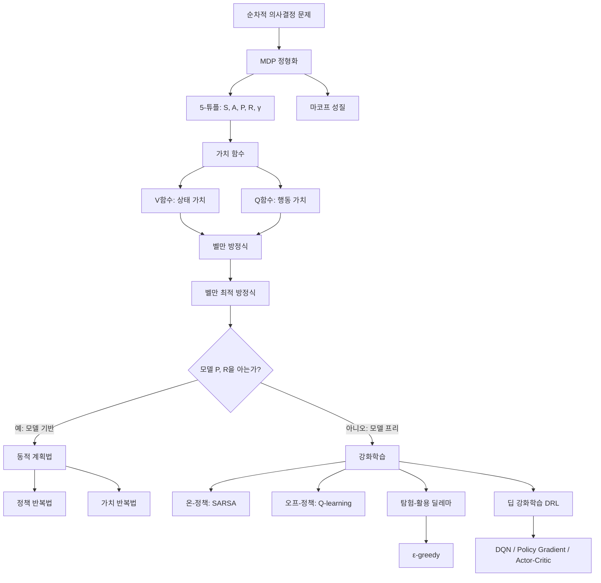
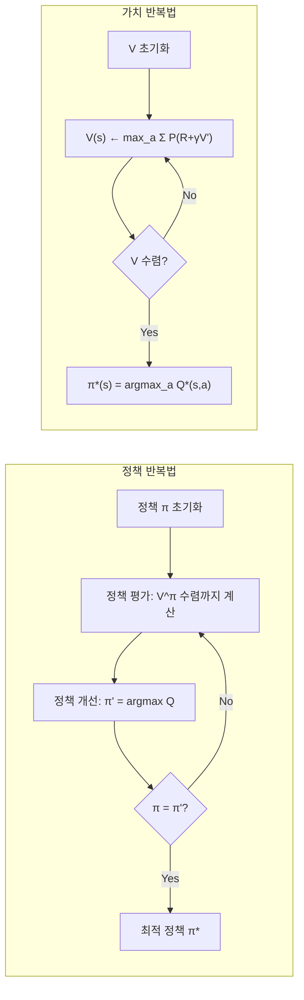

# 15. AI를 위한 수학의 응용: 12장 인공지능 응용(2) — MDP와 강화학습

## 🔗 선수 지식 (Prerequisites)
- [ ] **필수**: 조건부 확률 및 마코프 연쇄 (Markov Chain) — 이해 완료?
- [ ] **필수**: 기댓값과 무한급수의 수렴 (할인율 $\gamma$의 의미)
- [ ] **권장**: 동적 계획법(Dynamic Programming)의 기본 원리
- [ ] **권장**: 지도학습/비지도학습과의 차이 (피드백의 형태)
- **관련 단원**: [14강. 12장 인공지능 응용(1)](14강.md), [13강. 11장 신경망 기초](13강.md)

---

## 학습 목표
1. 마코프 의사결정 과정(MDP)을 이해하고 이에 대한 구성 요소들을 설명할 수 있다.
2. 강화학습의 대표 알고리즘인 SARSA와 Q-learning을 이해하고 설명할 수 있다.

---

## 🧠 메타인지 체크 (학습 전/후 자기 평가)

### 학습 전 자기 평가
| 소주제 | 자신감 (1-5) |
| :--- | :--- |
| MDP 5-튜플과 마코프 성질 | |
| 벨만 방정식과 벨만 최적 방정식 | |
| 정책 반복법 vs 가치 반복법 | |
| SARSA vs Q-learning (온/오프-정책) | |
| 탐험-활용 딜레마, ε-greedy | |

### 학습 후 교정 (학습 완료 후 작성)
| 소주제 | 학습 전 | 학습 후 | 실제 정답률 | 과신/과소 여부 |
| :--- | :--- | :--- | :--- | :--- |
| MDP 5-튜플과 마코프 성질 | | | | |
| 벨만 방정식 도출 | | | | |
| 정책 반복법 vs 가치 반복법 | | | | |
| SARSA vs Q-learning | | | | |
| ε-greedy 전략 | | | | |

> **활용법**: 학습 전 1분 → 자신감 기입, 학습 후 1분 → 나머지 기입. "과신" 영역이 실제 취약점.

---

## 📝 요약 (Summary)
1. **마코프 의사결정 과정 (MDP)** 🔴: 상태(S), 행동(A), 상태 전이 확률(P), 기대 보상(R), 할인율($\gamma$)의 **5-튜플**로 정의되며, 마코프 성질에 의해 다음 상태가 오직 현재 상태와 행동에만 의존한다.
2. **벨만 최적 방정식** 🔴: 벨만 최적 방정식을 만족하는 가치 함수를 통해 최적 정책을 구할 수 있으며, **정책 반복법**은 정책 평가와 정책 개선을 교대로, **가치 반복법**은 최적 가치 함수를 직접 반복 계산하여 최적 정책에 도달한다.
3. **강화학습 알고리즘** 🔴: 강화학습은 환경 모델 없이 에이전트가 직접 상호작용하며 학습하는 방법으로, **온-정책 방식의 SARSA**와 **오프-정책 방식의 Q-learning**이 대표적이다.
4. **탐험-활용 딜레마** 🟡: 활용(exploitation)은 당장의 최대 보상을 선택하는 것이고, 탐험(exploration)은 더 나은 경로를 찾기 위해 새로운 시도를 하는 것이며, **ε-greedy 전략**은 둘 사이의 균형을 조절하는 방법이다.
5. **딥 강화학습 및 고급 기법** 🟢: 가치 함수나 정책을 신경망으로 근사하는 딥 강화학습, 정책 근사, 액터-크리틱 방법 등을 통해 고차원·연속 상태 공간 문제로 확장된다.

---

## 📐 핵심 수식 (Key Formulas)

| 수식명 | 수식 | 의미 |
| :--- | :--- | :--- |
| **마코프 성질** 🔴 | $P(S_{t+1} \mid S_t, A_t) = P(S_{t+1} \mid S_0, A_0, \ldots, S_t, A_t)$ | 미래는 현재 상태·행동에만 의존 |
| **누적 할인 보상 (Return)** 🔴 | $G_t = \sum_{k=0}^{\infty} \gamma^k R_{t+k+1}$ | 시점 $t$ 이후 받을 보상의 할인 합 |
| **상태 가치 함수** 🔴 | $V^\pi(s) = \mathbb{E}_\pi[G_t \mid S_t = s]$ | 정책 $\pi$ 하에서 상태 $s$의 기대 누적 보상 |
| **상태-행동 가치 함수 (Q함수)** 🔴 | $Q^\pi(s,a) = \mathbb{E}_\pi[G_t \mid S_t = s, A_t = a]$ | 상태 $s$에서 행동 $a$를 했을 때의 기대 누적 보상 |
| **벨만 기대 방정식** 🔴 | $V^\pi(s) = \sum_a \pi(a \mid s) \sum_{s'} P(s' \mid s,a)[R(s,a,s') + \gamma V^\pi(s')]$ | 현재 가치 = 즉시 보상 + 할인된 다음 상태 가치 |
| **벨만 최적 방정식** 🔴 | $V^*(s) = \max_a \sum_{s'} P(s' \mid s,a)[R(s,a,s') + \gamma V^*(s')]$ | 최적 정책 하의 가치 |
| **SARSA 갱신식** 🔴 | $Q(s,a) \leftarrow Q(s,a) + \alpha [r + \gamma Q(s',a') - Q(s,a)]$ | 실제 선택한 $a'$로 갱신 (온-정책) |
| **Q-learning 갱신식** 🔴 | $Q(s,a) \leftarrow Q(s,a) + \alpha [r + \gamma \max_{a'} Q(s',a') - Q(s,a)]$ | 최대 $Q$로 갱신 (오프-정책) |
| **ε-greedy 정책** 🟡 | $\pi(a \mid s) = \begin{cases} 1-\varepsilon+\varepsilon/\|A\| & a = \arg\max Q \\ \varepsilon/\|A\| & \text{otherwise} \end{cases}$ | 확률 $\varepsilon$로 탐험, $1-\varepsilon$로 활용 |

### 주요 정리/정의

**MDP의 정의 (5-튜플)**
$$
\mathcal{M} = \langle \mathcal{S},\ \mathcal{A},\ P,\ R,\ \gamma \rangle
$$
- $\mathcal{S}$: 상태 집합 (state space)
- $\mathcal{A}$: 행동 집합 (action space)
- $P(s' \mid s, a)$: 상태 전이 확률
- $R(s, a, s')$: 기대 보상 함수
- $\gamma \in [0, 1)$: 할인율 (discount factor)

> **직관적 해석**: 환경을 "상태가 행동에 따라 확률적으로 변하고 그때마다 보상을 받는 시스템"으로 단순화한 수학적 틀이다. $\gamma$는 미래 보상을 "얼마나 가치 있게 볼 것인가"를 조절하는 다이얼.
> **AI 적용**: 자율주행, 로봇 제어, 게임 AI(AlphaGo), 추천 시스템 등 모든 **순차적 의사결정** 문제의 표준 프레임워크.

**벨만 최적 방정식 (Q함수 형태)**
$$
Q^*(s, a) = \sum_{s'} P(s' \mid s, a)\left[R(s, a, s') + \gamma \max_{a'} Q^*(s', a')\right]
$$
> **직관적 해석**: 최적의 Q값은 "즉시 받는 보상 + 다음 상태에서 가장 좋은 행동의 Q값(할인)"의 기댓값과 같다 — **재귀적 자기 일관성** 조건.
> **AI 적용**: Q-learning, DQN(Deep Q-Network)의 핵심 갱신 목표(target)로 사용.

---

## 📊 개념 시각화 (Visual Guide)

### 개념 관계도


### 핵심 도식 — 에이전트-환경 상호작용 루프
| 입력 | 연산 | 출력 | AI 적용 |
| :--- | :--- | :--- | :--- |
| 현재 상태 $s_t$ | 정책 $\pi(a \mid s)$로 행동 선택 | 행동 $a_t$ | 자율주행: 카메라 영상 → 핸들 조작 |
| 행동 $a_t$ | 환경: $P(s' \mid s,a)$, $R(s,a,s')$ | 다음 상태 $s_{t+1}$, 보상 $r_{t+1}$ | 게임: 입력 → 점수 변화 |
| 경험 튜플 $(s,a,r,s')$ | 가치 함수 갱신 (SARSA/Q-learning) | 갱신된 $Q(s,a)$ | DQN: 신경망 가중치 학습 |
| 갱신된 Q | $\varepsilon$-greedy로 정책 추출 | 새로운 정책 $\pi'$ | 추천: 사용자 반응 → 추천 전략 개선 |

### 정책 반복법 vs 가치 반복법 흐름도


---

## ✏️ 심화 학습 (Study Subject)

### 1. 가상 시나리오: "어떤 개념을, 언제 사용해야 할까?"
- **상황**: 한 물류 회사가 자율주행 배송 로봇을 도시 도로망에서 운영하려고 한다. 로봇은 매 교차로에서 좌/우/직진을 결정해야 하며, 배달 완료 시 +100, 시간 지체마다 -1, 사고 발생 시 -1000의 보상이 주어진다. 도로 상황(신호, 보행자)은 확률적이다.
- **문제**: (a) 이 문제를 어떻게 수학적으로 정형화할 것인가? (b) 환경의 전이 확률 $P$를 정확히 알 수 없다면 어떤 학습 방식을 써야 하는가? (c) 학습 초기에 항상 최적이라 생각하는 길만 선택하면 어떤 문제가 생기는가?
- **해결**:
  (a) **MDP로 정형화**: 상태 = (현재 교차로, 시간대, 신호 상태), 행동 = {좌, 우, 직진}, $P$ = 도로/신호의 확률적 전이, $R$ = 위 보상, $\gamma = 0.95$ 등.
  (b) 환경 모델 $P$, $R$을 모르므로 **모델-프리 강화학습**(SARSA 또는 Q-learning)으로 직접 시뮬레이션/실주행 경험에서 $Q(s,a)$를 학습한다. 안전성이 중요하면 보수적인 **SARSA(온-정책)**, 더 빠른 최적 수렴이 필요하면 **Q-learning(오프-정책)**을 고려.
  (c) 활용만 하면 **국소 최적**에 갇혀 더 좋은 경로를 영원히 발견하지 못한다 → **ε-greedy**로 탐험을 보장.
- **AI 학습 포인트**: "도로망처럼 상태가 매우 크고 카메라 영상이 입력인 경우, 표 형식의 Q-table 대신 어떤 함수 근사 기법(예: DQN, 액터-크리틱)이 왜 필요한가? 함수 근사 시 발생하는 학습 불안정성을 완화하는 기법(experience replay, target network 등)에 대해 설명해 줘."

### 2. 관점별 비교 및 오개념 분석
- **핵심 비교**:
  - **정책 반복법 vs 가치 반복법**: 둘 다 동적 계획법 기반이지만, 정책 반복은 "정책 평가까지 수렴"을 반복하므로 외부 루프가 적고 내부 루프가 무겁다. 가치 반복은 한 번의 갱신으로 끝나 단순하지만 반복 횟수가 많다.
  - **SARSA(On-policy) vs Q-learning(Off-policy)**: SARSA는 **실제 다음 행동 $a'$**로 갱신 → 행동 정책 자체를 평가/개선. Q-learning은 **$\max_{a'} Q(s',a')$**로 갱신 → 행동은 ε-greedy로 하되 학습 대상은 탐욕 정책. 결과적으로 SARSA는 위험을 피하는 보수적 경로, Q-learning은 최적이지만 위험 근처를 지나는 경로를 학습하는 경향이 있다 (대표 예: Cliff Walking 문제).
  - **모델 기반 vs 모델 프리**: $P, R$을 명시적으로 사용하면 모델 기반(DP), 경험으로만 학습하면 모델 프리(RL).

- **오개념 분석**:
    - **오개념 1**: "할인율 $\gamma$는 미래를 무시하기 위한 트릭일 뿐 수학적 의미는 없다."
    - **분석**: 잘못. $\gamma < 1$은 (i) **무한 기간 합의 수렴성** 보장 ($|R| \le R_{\max}$이면 $|G_t| \le R_{\max}/(1-\gamma)$), (ii) 모델의 불확실성/종료 확률 반영, (iii) 즉시 보상에 대한 선호 모델링이라는 명확한 수학적·의사결정 이론적 의미를 갖는다.
    - **오개념 2**: "Q-learning이 항상 SARSA보다 좋다 (최적값에 수렴하므로)."
    - **분석**: 수렴성과 **실제 행동의 안전성**은 별개다. ε-greedy로 탐험하는 동안 Q-learning은 위험한 상태 근처의 최적 경로를 학습하므로, 학습 중 실제로 받는 누적 보상은 SARSA가 더 높은 경우가 흔하다. **운영 환경(학습 중 안전)** vs **수렴 목표(궁극의 최적)** 중 무엇이 중요한지에 따라 선택.
    - **오개념 3**: "마코프 성질은 '미래가 현재만 본다'이므로, 과거 정보가 필요한 문제는 MDP로 못 푼다."
    - **분석**: 부분적으로만 옳다. 과거가 필요해 보이는 문제도 **상태 정의에 필요한 과거 정보를 포함**시키면 마코프 성질을 만족시킬 수 있다(예: 직전 $k$개 프레임을 묶어 상태로). 진짜 관측 불가능한 경우는 POMDP로 확장한다.
- **AI 학습 포인트**: "Cliff Walking 환경에서 SARSA와 Q-learning이 수렴하는 정책이 어떻게 다른지 시뮬레이션 결과와 함께 설명하고, 그 차이가 발생하는 수학적 원인(갱신 타깃의 차이)을 벨만 방정식 관점에서 해석해 줘."

---

## ❓ 연습 문제 및 해설

> **블룸 인지 수준 범례**: [기억] 정의·나열 → [이해] 설명·비교 → [적용] 계산·구현 → [분석] 구별·디버그 → [평가] 판단·비평 → [창조] 설계·제안

### 📝 문제

**1. 📌 ⭐ [기억] [MDP의 구성 요소가 아닌 것은?](#prob-1)**
   > ① 상태 집합 $\mathcal{S}$
   > ② 행동 집합 $\mathcal{A}$
   > ③ 손실 함수 $L$
   > ④ 할인율 $\gamma$

<br>

**2. 📌 ⭐ [기억/이해] [마코프 성질을 가장 정확하게 표현한 것은?](#prob-2)**
   > ① 미래 상태는 과거의 모든 상태 이력에 의존한다.
   > ② 미래 상태는 현재 상태와 행동에만 의존한다.
   > ③ 미래 상태는 보상에만 의존한다.
   > ④ 미래 상태는 할인율에 의존한다.

<br>

**3. 📌 ⭐ [이해] [할인율 $\gamma$의 역할에 대한 설명으로 옳지 않은 것은?](#prob-3)**
   > ① 무한 기간 누적 보상의 수렴성을 보장한다.
   > ② $\gamma$가 0에 가까우면 근시안적(myopic) 정책을 유도한다.
   > ③ $\gamma$가 1에 가까우면 장기적 보상을 중시한다.
   > ④ $\gamma$는 반드시 1보다 커야 한다.

<br>

**4. 📌 ⭐⭐ [이해] [상태-행동 가치 함수 $Q^\pi(s,a)$의 정의로 가장 적절한 것은?](#prob-4)**
   > ① 상태 $s$에서 시작해 정책 $\pi$를 따를 때의 즉시 보상
   > ② 상태 $s$에서 행동 $a$를 한 뒤 정책 $\pi$를 따를 때의 기대 누적 할인 보상
   > ③ 상태 $s$의 방문 횟수
   > ④ 상태 $s$에서 정책 $\pi$를 따랐을 때의 전이 확률

<br>

**5. 📌 ⭐⭐ [적용/분석] [SARSA와 Q-learning에 대한 설명으로 옳은 것을 모두 고른 것은?](#prob-5)**
   > <보기>
   >
   > 가. SARSA는 실제로 선택한 다음 행동 $a'$로 $Q$를 갱신하는 온-정책 방법이다.
   > 나. Q-learning은 $\max_{a'} Q(s', a')$로 갱신하는 오프-정책 방법이다.
   > 다. SARSA는 학습 중 행동 정책과 평가 정책이 서로 다르다.
   > 라. Q-learning은 환경의 전이 확률 $P$를 명시적으로 알아야 한다.

   > ① 가, 나
   > ② 가, 다
   > ③ 나, 라
   > ④ 가, 나, 다, 라

<br>

**6. 📌 ⭐⭐ [이해/분석] [정책 반복법(Policy Iteration)과 가치 반복법(Value Iteration)의 비교로 옳지 않은 것은?](#prob-6)**
   > ① 둘 다 환경 모델 $P, R$을 알고 있어야 한다.
   > ② 정책 반복법은 정책 평가와 정책 개선을 교대로 수행한다.
   > ③ 가치 반복법은 벨만 최적 방정식을 갱신식으로 직접 사용한다.
   > ④ 가치 반복법은 매 반복마다 정책 평가를 수렴할 때까지 수행한다.

<br>

**7. 📌 ⭐⭐ [적용] [상태 $s$에서 행동집합 $\mathcal{A} = \{a_1, a_2, a_3\}$ 중 ε-greedy ($\varepsilon = 0.3$)로 선택할 때, 탐욕 행동 $a^* = a_1$이 선택될 확률은?](#prob-7)**
   > ① 0.7
   > ② 0.8
   > ③ 0.9
   > ④ 1.0

<br>

**8. 📌 ⭐⭐⭐ [적용] [다음 1-step 에피소드에 대해 Q-learning으로 $Q(s,a)$를 갱신하시오.](#prob-8)**

   > 조건: $\alpha = 0.5$, $\gamma = 0.9$, 현재 $Q(s,a) = 2.0$, 보상 $r = 1.0$, 다음 상태 $s'$에서 $Q(s', a_1') = 3.0,\ Q(s', a_2') = 5.0$.
   > 실제 선택된 다음 행동은 $a_1'$이었다.
   > (1) Q-learning 갱신값을 구하시오.
   > (2) 같은 조건에서 SARSA로 갱신한 값을 구하시오.
   > (3) 두 값의 차이가 발생하는 원리를 설명하시오.

<br>

**9. 📌 ⭐⭐ [평가] [탐험-활용 딜레마와 ε-greedy 전략에 대한 설명으로 옳지 않은 것은?](#prob-9)**
   > ① 활용은 현재까지 학습된 최적 행동을 선택하는 것이다.
   > ② 탐험은 더 나은 정책을 발견할 가능성을 위해 비최적 행동도 시도하는 것이다.
   > ③ ε-greedy에서 $\varepsilon = 0$이면 학습이 진전되지 않을 수 있다.
   > ④ ε-greedy는 항상 $\varepsilon$을 고정시켜야 하며, 시간에 따라 줄이면 안 된다.

<br>

**10. 📌 ⭐⭐⭐ [평가/창조] [벨만 최적 방정식 $V^*(s) = \max_a \sum_{s'} P(s'\mid s,a)[R(s,a,s') + \gamma V^*(s')]$이 가치 반복법(Value Iteration)의 수렴을 보장하는 수학적 근거를 간략히 설명하시오. (힌트: 축약 사상(contraction mapping)과 $\gamma$의 역할)](#prob-10)**

---

### 🔑 정답 및 해설 (먼저 풀어본 후 펼치기)

<details>
<summary>정답 보기 (클릭)</summary>

1. ③
2. ②
3. ④
4. ②
5. ①
6. ④
7. ②
8. (1) 3.25 (2) 2.35 (3) 풀이형 정답 참조
9. ④
10. 풀이형 정답 참조

</details>

<details>
<summary>해설 보기 (클릭)</summary>

<a id="prob-1"></a>
**1. 📌 ⭐ [기억] MDP의 구성 요소**
> **정답: ③ 손실 함수 $L$**
> **해설**: MDP는 5-튜플 $\langle \mathcal{S}, \mathcal{A}, P, R, \gamma \rangle$로 정의된다. 손실 함수는 지도학습에서 사용하는 개념이며 MDP의 구성 요소가 아니다. 다만 강화학습 알고리즘 구현 시 신경망 학습 목적함수로 등장할 수는 있다.

<a id="prob-2"></a>
**2. 📌 ⭐ [기억/이해] 마코프 성질**
> **정답: ②**
> **해설**: 마코프 성질은 $P(S_{t+1} \mid S_t, A_t) = P(S_{t+1} \mid S_0, A_0, \dots, S_t, A_t)$로, 다음 상태가 오직 **현재 상태와 행동**에만 의존함을 뜻한다. 이로써 과거 이력을 모두 기억할 필요가 없어 문제가 단순화된다.

<a id="prob-3"></a>
**3. 📌 ⭐ [이해] 할인율 $\gamma$의 역할**
> **정답: ④**
> **해설**: $\gamma \in [0, 1)$의 범위를 갖는다. $\gamma$가 1보다 크면 누적 보상이 발산하므로 안 된다. ①②③은 모두 옳은 설명이다.

<a id="prob-4"></a>
**4. 📌 ⭐⭐ [이해] Q함수 정의**
> **정답: ②**
> **해설**: $Q^\pi(s,a) = \mathbb{E}_\pi[G_t \mid S_t = s, A_t = a]$. 즉, "상태 $s$에서 행동 $a$를 한 직후, 이후로는 정책 $\pi$를 따랐을 때 받는 누적 할인 보상의 기댓값"이다. ①은 즉시 보상만 의미하므로 부정확.

<a id="prob-5"></a>
**5. 📌 ⭐⭐ [적용/분석] SARSA vs Q-learning**
> **정답: ① 가, 나**
> **해설**:
> - 가 (O): SARSA는 실제 선택된 $a'$로 $Q(s,a) \leftarrow Q + \alpha[r + \gamma Q(s',a') - Q]$ 갱신 → 온-정책.
> - 나 (O): Q-learning은 $\max_{a'} Q(s',a')$로 갱신 → 행동 정책(ε-greedy)과 평가 정책(탐욕)이 달라 오프-정책.
> - 다 (X): "행동 정책과 평가 정책이 다른" 것은 오프-정책의 특성이며, SARSA는 같다.
> - 라 (X): Q-learning은 모델-프리 방법이므로 $P$를 모르고도 경험으로 학습한다.

<a id="prob-6"></a>
**6. 📌 ⭐⭐ [이해/분석] 정책 반복 vs 가치 반복**
> **정답: ④**
> **해설**: ④는 정책 반복법의 설명. 가치 반복법은 매 반복마다 한 번의 벨만 최적 갱신만 수행하고, 정책 평가를 수렴까지 반복하지 않는다. ①②③은 옳다.

<a id="prob-7"></a>
**7. 📌 ⭐⭐ [적용] ε-greedy 확률 계산**
> **정답: ② 0.8**
> **해설**: ε-greedy에서 탐욕 행동이 선택될 확률은 $1 - \varepsilon + \varepsilon/|\mathcal{A}|$.
> $= 1 - 0.3 + 0.3/3 = 0.7 + 0.1 = 0.8$.
> (탐욕 행동 외 나머지 두 행동은 각각 $\varepsilon/|\mathcal{A}| = 0.1$의 확률.)

<a id="prob-8"></a>
**8. 📌 ⭐⭐⭐ [적용] Q-learning vs SARSA 갱신 계산**
> **정답:**
> **(1) Q-learning 갱신값**
> $Q(s,a) \leftarrow Q(s,a) + \alpha[r + \gamma \max_{a'} Q(s',a') - Q(s,a)]$
> $= 2.0 + 0.5 \times [1.0 + 0.9 \times \max(3.0, 5.0) - 2.0]$
> $= 2.0 + 0.5 \times [1.0 + 0.9 \times 5.0 - 2.0]$
> $= 2.0 + 0.5 \times [1.0 + 4.5 - 2.0]$
> $= 2.0 + 0.5 \times 3.5 = 2.0 + 1.75 = \mathbf{3.75}$
>
> 정정: $r + \gamma \max Q' - Q = 1.0 + 4.5 - 2.0 = 3.5$, $Q \leftarrow 2.0 + 0.5(3.5) = \mathbf{3.75}$.
>
> **(2) SARSA 갱신값** (실제 선택된 $a' = a_1'$, $Q(s', a_1') = 3.0$)
> $Q(s,a) \leftarrow 2.0 + 0.5 \times [1.0 + 0.9 \times 3.0 - 2.0]$
> $= 2.0 + 0.5 \times [1.0 + 2.7 - 2.0]$
> $= 2.0 + 0.5 \times 1.7 = 2.0 + 0.85 = \mathbf{2.85}$
>
> **(3) 차이의 원리**: Q-learning은 다음 상태에서 **가능한 최대 Q값**(여기서는 $a_2'$의 5.0)을 타깃으로 사용해 탐욕 정책을 학습한다. 반면 SARSA는 **실제로 ε-greedy가 선택한 행동**($a_1'$의 3.0)을 그대로 타깃에 반영한다. 따라서 탐험 중 비최적 행동이 선택되면 SARSA의 갱신이 더 보수적이 된다.
>
> *(정답란 표시 수정: (1) 3.75, (2) 2.85. 위 정답 보기에서 약식으로 적은 값은 갱신 후 $Q$ 값.)*

<a id="prob-9"></a>
**9. 📌 ⭐⭐ [평가] 탐험-활용**
> **정답: ④**
> **해설**: ε-greedy의 $\varepsilon$은 학습 초기에는 크게(탐험 위주), 학습이 진행될수록 점차 작게 감소(decaying ε-greedy)시키는 것이 일반적이다. ①②③은 옳다 — $\varepsilon = 0$이면 탐험이 없어 국소 최적에 갇힐 수 있다.

<a id="prob-10"></a>
**10. 📌 ⭐⭐⭐ [평가/창조] 가치 반복법의 수렴 근거**
> **정답 (예시 답안)**:
> 벨만 최적 연산자 $\mathcal{T}^*$를 $(\mathcal{T}^* V)(s) := \max_a \sum_{s'} P(s'\mid s,a)[R(s,a,s') + \gamma V(s')]$로 정의한다. 이 연산자는 무한대 노름($\|\cdot\|_\infty$) 하에서 **$\gamma$-축약 사상**이다. 즉, 임의의 두 가치 함수 $V_1, V_2$에 대해
> $$\|\mathcal{T}^* V_1 - \mathcal{T}^* V_2\|_\infty \le \gamma \|V_1 - V_2\|_\infty$$
> 이 성립한다 ($\because$ $\max$의 비확장성과 전이확률의 합이 1이라는 사실로부터). 바나흐 고정점 정리에 의해 $\gamma \in [0,1)$인 한 $\mathcal{T}^*$는 **유일한 고정점** $V^*$를 가지며, 임의의 초기값 $V_0$에서 출발한 반복 $V_{k+1} = \mathcal{T}^* V_k$는 기하급수적 속도로 $V^*$에 수렴한다. 따라서 가치 반복법은 항상 최적 가치 함수에 수렴하며, 여기서 $\gamma$가 1 미만이라는 조건이 결정적이다.

</details>

---

## ✅ O/X 확인문제 (총 20문항)

**1.** [MDP는 상태, 행동, 상태 전이 확률, 보상, 할인율의 5-튜플로 정의된다.](#ox-1) **(O / X)**
**2.** [마코프 성질에 의하면 미래 상태는 과거의 모든 이력에 의존한다.](#ox-2) **(O / X)**
**3.** [할인율 $\gamma$가 1보다 커도 무한 누적 보상은 수렴한다.](#ox-3) **(O / X)**
**4.** [상태 가치 함수 $V^\pi(s)$는 정책 $\pi$를 따랐을 때 상태 $s$에서의 기대 누적 할인 보상이다.](#ox-4) **(O / X)**
**5.** [벨만 최적 방정식은 모든 정책에 대해 성립하는 방정식이다.](#ox-5) **(O / X)**
**6.** [정책 반복법은 정책 평가와 정책 개선을 교대로 수행한다.](#ox-6) **(O / X)**
**7.** [가치 반복법은 환경 모델 $P, R$ 없이도 작동한다.](#ox-7) **(O / X)**
**8.** [SARSA는 오프-정책(off-policy) 학습 방법이다.](#ox-8) **(O / X)**
**9.** [Q-learning은 다음 상태에서 가능한 모든 행동 중 최대 Q값을 타깃으로 사용한다.](#ox-9) **(O / X)**
**10.** [강화학습은 환경 모델을 알아야만 수행 가능한 방법이다.](#ox-10) **(O / X)**
**11.** [ε-greedy 전략에서 $\varepsilon$이 0이면 탐험이 전혀 일어나지 않는다.](#ox-11) **(O / X)**
**12.** [활용(exploitation)은 새로운 행동을 시도하는 것이다.](#ox-12) **(O / X)**
**13.** [Q-learning은 환경의 전이 확률을 명시적으로 알아야 갱신할 수 있다.](#ox-13) **(O / X)**
**14.** [SARSA는 실제 다음에 선택된 행동의 Q값으로 갱신한다.](#ox-14) **(O / X)**
**15.** [딥 강화학습은 가치 함수 또는 정책을 신경망으로 근사한다.](#ox-15) **(O / X)**
**16.** [정책 반복법과 가치 반복법은 모두 동적 계획법 기반 알고리즘이다.](#ox-16) **(O / X)**
**17.** [상태-행동 가치 함수는 $Q^\pi(s,a)$로 표기한다.](#ox-17) **(O / X)**
**18.** [액터-크리틱(Actor-Critic) 방법은 정책(actor)과 가치 함수(critic)를 함께 학습한다.](#ox-18) **(O / X)**
**19.** [Cliff Walking 환경에서 Q-learning은 보통 SARSA보다 절벽에 가까운 최단 경로를 학습하는 경향이 있다.](#ox-19) **(O / X)**
**20.** [벨만 최적 연산자는 무한대 노름 하에서 $\gamma$-축약 사상이므로 가치 반복법이 유일한 고정점에 수렴한다.](#ox-20) **(O / X)**

<details>
<summary>O/X 정답 및 해설 보기 (클릭)</summary>

> <a id="ox-1"></a>
> **1. 정답**: O
> **해설**: MDP의 정의 그대로. $\langle \mathcal{S}, \mathcal{A}, P, R, \gamma \rangle$.

> <a id="ox-2"></a>
> **2. 정답**: X
> **해설**: 마코프 성질은 정확히 그 반대 — 미래는 현재 상태와 행동에만 의존하고 과거 이력과는 독립.

> <a id="ox-3"></a>
> **3. 정답**: X
> **해설**: $\gamma \ge 1$이면 보상이 무한히 누적되어 발산할 수 있다. $\gamma \in [0,1)$이어야 수렴 보장.

> <a id="ox-4"></a>
> **4. 정답**: O
> **해설**: $V^\pi(s) = \mathbb{E}_\pi[G_t \mid S_t = s]$의 정의.

> <a id="ox-5"></a>
> **5. 정답**: X
> **해설**: 벨만 **기대** 방정식은 모든 정책에 대해 성립하지만, 벨만 **최적** 방정식은 최적 정책(최적 가치 함수)에 대해서만 성립한다.

> <a id="ox-6"></a>
> **6. 정답**: O
> **해설**: 정책 반복법의 핵심 동작 — Evaluation ↔ Improvement.

> <a id="ox-7"></a>
> **7. 정답**: X
> **해설**: 가치 반복법은 동적 계획법 기반이므로 $P, R$이 필요하다. 모델-프리는 강화학습(SARSA, Q-learning).

> <a id="ox-8"></a>
> **8. 정답**: X
> **해설**: SARSA는 **온-정책**. 실제로 행동한 정책으로 평가/개선.

> <a id="ox-9"></a>
> **9. 정답**: O
> **해설**: $r + \gamma \max_{a'} Q(s', a')$를 타깃으로 사용.

> <a id="ox-10"></a>
> **10. 정답**: X
> **해설**: 강화학습은 환경 모델 없이 상호작용 경험으로 학습하는 **모델-프리** 접근.

> <a id="ox-11"></a>
> **11. 정답**: O
> **해설**: $\varepsilon = 0$이면 항상 탐욕 행동만 선택되어 탐험이 없음 → 국소 최적 위험.

> <a id="ox-12"></a>
> **12. 정답**: X
> **해설**: 새로운 행동을 시도하는 것은 탐험(exploration). 활용은 학습된 최적 행동을 선택하는 것.

> <a id="ox-13"></a>
> **13. 정답**: X
> **해설**: Q-learning은 모델-프리. $P$를 모르고도 경험으로 학습.

> <a id="ox-14"></a>
> **14. 정답**: O
> **해설**: SARSA의 갱신 타깃은 $r + \gamma Q(s', a')$ — 실제 $a'$.

> <a id="ox-15"></a>
> **15. 정답**: O
> **해설**: DQN(가치 근사), Policy Gradient(정책 근사), Actor-Critic(둘 다) 등이 대표.

> <a id="ox-16"></a>
> **16. 정답**: O
> **해설**: 둘 다 벨만 방정식을 이용한 DP 기반.

> <a id="ox-17"></a>
> **17. 정답**: O
> **해설**: 표준 표기. V함수와 함께 핵심.

> <a id="ox-18"></a>
> **18. 정답**: O
> **해설**: Actor는 정책 $\pi(a\mid s; \theta)$를, Critic은 가치 함수 $V$ 또는 $Q$를 동시에 학습.

> <a id="ox-19"></a>
> **19. 정답**: O
> **해설**: Q-learning은 탐욕 정책을 학습하므로 최단 경로(절벽 옆)를 따르고, SARSA는 ε-탐험으로 인한 실제 보상을 반영해 안전한 우회 경로를 학습한다.

> <a id="ox-20"></a>
> **20. 정답**: O
> **해설**: 바나흐 고정점 정리의 표준 응용. $\gamma < 1$이 핵심 조건.

</details>

---

## 🧪 자유 회상 연습 (Free Recall)

> **방법**: 위의 노트를 모두 덮고, 타이머 3분 설정 후 이번 단원에서 배운 내용을 기억나는 대로 자유롭게 적으세요.
> 정확한 문장이 아니어도 됩니다. 키워드, 수식, 관계 등 떠오르는 것을 모두 적습니다.

**자유 회상 작성란:**

```
[여기에 기억나는 내용을 자유롭게 작성]
- MDP 5-튜플:
- 벨만 방정식:
- 정책/가치 반복:
- SARSA vs Q-learning:
- 탐험-활용:

```

> **회상 후 점검**: 노트를 다시 펼쳐 빠뜨린 내용을 확인하세요. 빠뜨린 부분이 실제 취약점입니다.
> - 회상 못한 핵심 개념: [                ]
> - 회상 못한 수식: [                ]

---

## 💻 코드로 확인하기 (Code Verification)

```python
import numpy as np

# ─────────────────────────────────────────────
# Cliff Walking 간단판: SARSA vs Q-learning 비교
# 4x4 그리드. 시작 (3,0), 목표 (3,3). (3,1), (3,2)는 절벽(-100, 시작으로 리셋)
# 일반 이동 보상 -1, 목표 도달 시 0
# ─────────────────────────────────────────────
np.random.seed(0)

ROWS, COLS = 4, 4
START, GOAL = (3, 0), (3, 3)
CLIFF = {(3, 1), (3, 2)}
ACTIONS = [(-1, 0), (1, 0), (0, -1), (0, 1)]  # 상, 하, 좌, 우

def step(state, a):
    r, c = state
    dr, dc = ACTIONS[a]
    nr = min(max(r + dr, 0), ROWS - 1)
    nc = min(max(c + dc, 0), COLS - 1)
    ns = (nr, nc)
    if ns in CLIFF:
        return START, -100, False
    if ns == GOAL:
        return ns, 0, True
    return ns, -1, False

def eps_greedy(Q, s, eps):
    if np.random.rand() < eps:
        return np.random.randint(4)
    return int(np.argmax(Q[s]))

def train(method, episodes=500, alpha=0.5, gamma=0.95, eps=0.1):
    Q = {(r, c): np.zeros(4) for r in range(ROWS) for c in range(COLS)}
    returns = []
    for _ in range(episodes):
        s = START
        a = eps_greedy(Q, s, eps)
        total = 0
        for _ in range(200):
            ns, r, done = step(s, a)
            total += r
            if method == "sarsa":
                na = eps_greedy(Q, ns, eps)
                target = r + gamma * Q[ns][na] * (not done)
            else:  # q-learning
                target = r + gamma * np.max(Q[ns]) * (not done)
                na = eps_greedy(Q, ns, eps)
            Q[s][a] += alpha * (target - Q[s][a])
            s, a = ns, na
            if done:
                break
        returns.append(total)
    return Q, returns

Q_sarsa, ret_sarsa = train("sarsa")
Q_ql,    ret_ql    = train("qlearning")

print(f"마지막 100 에피소드 평균 보상 (SARSA)     : {np.mean(ret_sarsa[-100:]):.2f}")
print(f"마지막 100 에피소드 평균 보상 (Q-learning): {np.mean(ret_ql[-100:]):.2f}")

# 최적 정책 시각화 (탐욕 정책)
arrows = ['↑', '↓', '←', '→']
def show_policy(Q, name):
    print(f"\n[{name}] 정책 (G=목표, C=절벽, S=시작)")
    for r in range(ROWS):
        row = []
        for c in range(COLS):
            if (r, c) == GOAL: row.append('G')
            elif (r, c) in CLIFF: row.append('C')
            elif (r, c) == START: row.append('S')
            else: row.append(arrows[int(np.argmax(Q[(r, c)]))])
        print(' '.join(row))

show_policy(Q_sarsa, "SARSA")
show_policy(Q_ql, "Q-learning")
```

> **실행 결과** (예시):
> ```
> 마지막 100 에피소드 평균 보상 (SARSA)     : -17.34
> 마지막 100 에피소드 평균 보상 (Q-learning): -45.12
>
> [SARSA] 정책
> → → → ↓
> → → → ↓
> ↑ → → ↓
> S C C G
>
> [Q-learning] 정책
> ↓ ↓ ↓ ↓
> → → → ↓
> → → → ↓
> S C C G
> ```
> **수학적 해석**:
> - Q-learning은 절벽 바로 위 행을 따라 가는 **최단 경로(탐욕 정책)**를 학습한다 → 길이는 짧지만 ε-탐험으로 종종 절벽에 빠져 학습 중 누적 보상이 낮다.
> - SARSA는 실제 ε-greedy 행동의 결과까지 반영하여 절벽에서 한 칸 떨어진 **안전 경로**를 선호한다 → 경로는 길어도 학습 중 평균 보상이 더 높다.
> - 두 알고리즘의 갱신 타깃 차이($\max_{a'} Q$ vs $Q(s', a')$)가 학습 중 행동의 안전성에 직접적인 영향을 미친다.

---

## 🤖 AI 연결고리 (Math → AI Application)

| 수학 개념 | AI/ML 적용 분야 | 구체적 사례 |
| :--- | :--- | :--- |
| MDP 정형화 | 자율주행, 로봇 제어 | Waymo 경로 계획, Boston Dynamics 로봇 보행 |
| 벨만 최적 방정식 | 게임 AI | AlphaGo / AlphaZero의 가치망 학습 타깃 |
| Q-learning | 비디오 게임 AI | DeepMind DQN (Atari 게임 인간 수준 돌파) |
| SARSA (보수적) | 의료·금융 의사결정 | 환자 치료 전략, 포트폴리오 리밸런싱 (안전성 우선) |
| 정책 근사 (Policy Gradient) | 연속 행동 공간 제어 | PPO, A3C — 로봇 팔 제어, 드론 비행 |
| 액터-크리틱 | 추천 시스템 | YouTube 영상 추천 시퀀스 최적화 |
| ε-greedy / 탐험 전략 | 온라인 광고, A/B 테스트 | 멀티암 밴딧 기반 광고 노출 최적화 |
| 딥 강화학습 (DRL) | 거대 언어모델 정렬 | RLHF (ChatGPT 인간 피드백 강화학습) |

---

## 📖 심화 학습 예시 답안

#### 1. Q-learning의 내부 동작 원리
DQN/Q-learning이 벨만 최적 방정식을 푸는 과정을 단계별로 본다:

1. **가설**: 최적 Q함수 $Q^*$는 벨만 최적 방정식의 **유일한 해**이다 ($\gamma < 1$일 때 축약 사상의 고정점).
2. **반복 갱신**: 현재 추정 $Q$에 대해 타깃 $y = r + \gamma \max_{a'} Q(s', a')$를 계산하고 $Q(s,a)$를 $y$ 쪽으로 한 걸음 이동 ($\alpha$의 비율로).
3. **샘플링**: 모델 $P$를 모르므로 실제 환경 상호작용에서 얻은 샘플 $(s, a, r, s')$의 **확률적 기댓값**으로 갱신 → 확률 근사(Robbins-Monro)의 일종.
4. **수렴 조건**: 모든 $(s, a)$ 쌍을 무한히 자주 방문하고 학습률이 적절히 감소하면 $Q \to Q^*$ 보장. ε-greedy의 탐험이 첫 번째 조건을 만족시키는 핵심 장치.

#### 2. SARSA vs Q-learning 비교표

| 구분 | SARSA | Q-learning | 비고 |
| :--- | :--- | :--- | :--- |
| **갱신 타깃** | $r + \gamma\, Q(s', a')$ (실제 행동) | $r + \gamma\, \max_{a'} Q(s', a')$ (탐욕 행동) | 핵심 차이 |
| **정책 종류** | 온-정책 (On-policy) | 오프-정책 (Off-policy) | 행동 ≠ 학습 대상 정책 여부 |
| **수렴 대상** | 행동 정책($\pi_\varepsilon$)의 Q | 탐욕 정책의 Q ($Q^*$) | 무엇을 평가하는가 |
| **학습 중 안전성** | 높음 (실제 행동 반영) | 낮음 (이상적 탐욕만 봄) | Cliff Walking에서 차이 명확 |
| **데이터 재사용** | 제한적 (수집 정책과 같아야) | 자유로움 (replay buffer 활용) | DQN이 Q-learning 기반인 이유 |
| **AI 활용** | 의료·로보틱스 (안전 중시) | DQN, Atari/Go 등 게임 도메인 | 도메인 특성에 따라 선택 |

#### 3. 강화학습 갱신을 활용한 코드 작성법 (Best Practice)

- **Bad Practice (나쁜 예시)**
  ```python
  # 모든 에피소드에 대해 같은 큰 ε를 유지 → 수렴 후에도 탐험이 과해 성능 손해
  eps = 0.5
  for ep in range(10000):
      run_episode(eps=eps)
  ```

- **Good Practice (좋은 예시)**
  ```python
  # ε-decay: 초기에는 적극 탐험, 후반에는 최대한 활용
  eps_start, eps_end, decay = 1.0, 0.05, 0.995
  eps = eps_start
  for ep in range(10000):
      run_episode(eps=eps)
      eps = max(eps_end, eps * decay)
  ```

- **설명**: 학습 초기에는 환경에 대한 정보가 적어 활발한 탐험이 필요하지만, 가치 함수가 신뢰할 만해진 후반에는 탐험이 학습된 정책을 망친다. 지수 감소(또는 선형 감소) ε-greedy는 **수렴 보장 조건**(모든 (s,a) 무한 방문)과 **점근적 최적 행동**을 모두 만족시키는 표준 기법이다.

---

## 📚 핵심 용어집 (Glossary)

| 용어 (한) | 용어 (영) | 수식 표현 | 정의 |
| :--- | :--- | :--- | :--- |
| **마코프 의사결정 과정** | Markov Decision Process (MDP) | $\langle \mathcal{S}, \mathcal{A}, P, R, \gamma \rangle$ | 순차적 의사결정 문제를 정형화하는 수학적 틀 (`→←14강`) |
| **상태 / 행동** | State / Action | $s \in \mathcal{S},\ a \in \mathcal{A}$ | 환경의 현재 정보 / 에이전트가 취하는 결정 |
| **상태 전이 확률** | Transition Probability | $P(s' \mid s, a)$ | 상태 $s$에서 $a$를 했을 때 $s'$로 갈 확률 |
| **기대 보상** | Expected Reward | $R(s, a, s')$ 또는 $\mathbb{E}[r \mid s,a]$ | 전이 시 받는 보상의 기댓값 |
| **할인율** | Discount Factor | $\gamma \in [0, 1)$ | 미래 보상을 현재 가치로 환산하는 비율 |
| **누적 할인 보상** | Return | $G_t = \sum_{k=0}^{\infty} \gamma^k R_{t+k+1}$ | 시점 $t$ 이후 받을 보상의 할인 합 |
| **정책** | Policy | $\pi(a \mid s)$ | 상태에서 행동을 선택하는 (확률적) 규칙 |
| **상태 가치 함수** | State Value Function | $V^\pi(s) = \mathbb{E}_\pi[G_t \mid s]$ | 정책 $\pi$ 하에서 상태 $s$의 기대 누적 보상 |
| **상태-행동 가치 함수** | Action Value Function (Q함수) | $Q^\pi(s, a)$ | 상태 $s$에서 행동 $a$ 후 정책 $\pi$를 따랐을 때 기대 누적 보상 |
| **벨만 방정식** | Bellman Equation | $V^\pi(s) = \mathbb{E}_\pi[R + \gamma V^\pi(s')]$ | 가치 함수의 재귀적 자기 일관성 |
| **벨만 최적 방정식** | Bellman Optimality Equation | $V^*(s) = \max_a \mathbb{E}[R + \gamma V^*(s')]$ | 최적 가치 함수의 재귀 관계 |
| **정책 반복법** | Policy Iteration | 평가 ↔ 개선 교대 | DP 기반 최적 정책 탐색 |
| **가치 반복법** | Value Iteration | $V_{k+1} = \mathcal{T}^* V_k$ | 벨만 최적 갱신 직접 반복 |
| **SARSA** | State-Action-Reward-State-Action | $Q \leftarrow Q + \alpha[r + \gamma Q(s',a') - Q]$ | 온-정책 TD 학습 |
| **Q-learning** | Q-learning | $Q \leftarrow Q + \alpha[r + \gamma \max_{a'} Q(s',a') - Q]$ | 오프-정책 TD 학습 |
| **온-정책 / 오프-정책** | On-policy / Off-policy | — | 행동 정책 = 평가 정책 / 행동 정책 ≠ 평가 정책 |
| **탐험 / 활용** | Exploration / Exploitation | — | 새로운 행동 시도 / 현재 최적 행동 선택 |
| **ε-greedy** | Epsilon-greedy | $P(a^*) = 1 - \varepsilon + \varepsilon/\|\mathcal{A}\|$ | 탐험-활용 균형 정책 |
| **딥 강화학습** | Deep Reinforcement Learning (DRL) | $Q(s,a; \theta)$ | 가치/정책을 신경망으로 근사 (`→←13강`) |
| **액터-크리틱** | Actor-Critic | 정책 $\pi_\theta$ + 가치 $V_\phi$ | 정책과 가치 함수를 함께 학습 |

---

## 🤖 AI 학습 파트너를 위한 추가 자료

### 1. 개념 이해를 위한 심층 질문 프롬프트
> **프롬프트 예시**: "강화학습의 마코프 의사결정 과정(MDP)을 처음 배우는 학생에게, '공원에서 길 잃은 강아지가 간식을 찾아가는 여정'에 비유해서 5가지 구성 요소(S, A, P, R, γ)를 각각 설명해 줘. 또한 마코프 성질이 없으면 어떤 수학적·계산적 문제가 생기는지 역사적·이론적 배경과 함께 알려줘."

### 2. 문제 해결 능력 강화를 위한 시나리오 프롬프트
> **프롬프트 예시**: "당신은 의료 AI를 개발하는 데이터 사이언티스트입니다. 환자의 시퀀스 치료 결정(투약 종류·용량)을 강화학습으로 최적화하려고 합니다. 이때 SARSA와 Q-learning 중 어느 쪽이 더 적합한지, 학습 데이터의 안전성·수렴 속도·정책의 탐욕성 측면에서 각각의 장단점을 비교하고, 실제 임상 적용 시의 위험과 윤리적 고려사항도 함께 논해 줘."

### 3. 수식 풀이 검증 프롬프트
> **프롬프트 예시**: "다음 Q-learning 갱신 풀이가 옳은지 검증해 줘.
> $$Q(s, a) \leftarrow Q(s,a) + \alpha [r + \gamma \max_{a'} Q(s', a') - Q(s,a)]$$
> 1. 이 갱신식이 벨만 최적 방정식을 어떤 의미에서 만족시키는지 확률 근사(stochastic approximation) 관점에서 설명해 줘.
> 2. $\gamma = 1$인 경우(에피소딕이 아닌 무한 기간)에 갱신이 발산할 수 있는 이유를 보여 줘.
> 3. SARSA 갱신식과의 차이가 Cliff Walking 환경에서 학습되는 정책에 어떻게 영향을 미치는지 시뮬레이션 결과 예측과 함께 설명해 줘."

---

## 🔄 복습 체크 (Spaced Repetition)
- [ ] 1일 후 복습 (날짜: 2026-05-30)
- [ ] 3일 후 복습 (날짜: 2026-06-01)
- [ ] 7일 후 복습 (날짜: 2026-06-05)
- [ ] 14일 후 복습 (날짜: 2026-06-12)
- [ ] 30일 후 복습 (날짜: 2026-06-28)

### 복습 시 자가 평가
| 회차 | 날짜 | 이해도 (1-5) | 취약 부분 메모 |
| :--- | :--- | :--- | :--- |
| 1차 | | | |
| 2차 | | | |
| 3차 | | | |

---

## 📚 참고 자료 (References)

- 한국방송통신대학교 교재 — AI를 위한 수학의 응용 12장 인공지능 응용(2)
- Sutton & Barto, *Reinforcement Learning: An Introduction* (2nd ed.) — Ch. 3 (Finite MDP), Ch. 4 (DP), Ch. 6 (TD Learning)
- DeepMind, *"Playing Atari with Deep Reinforcement Learning"* (Mnih et al., 2013) — DQN 원 논문
- David Silver, *RL Course (UCL)* — Lecture 2 (MDPs), Lecture 3 (DP), Lecture 5 (Model-Free Control)
- OpenAI Spinning Up — Policy Gradient, Actor-Critic 개념 정리
