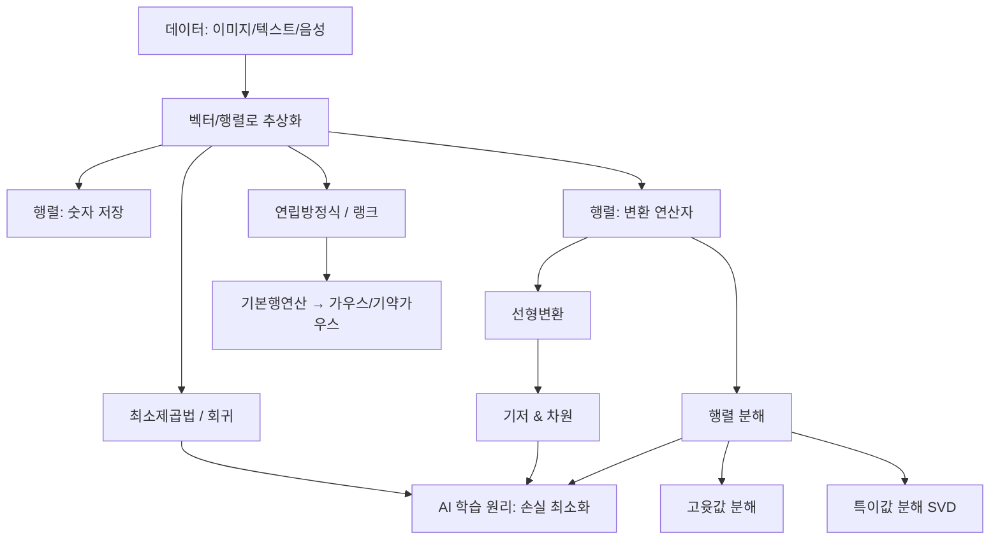

# 01. AI를 위한 수학의 응용: 1장 선형대수학 개요

## 🔗 선수 지식 (Prerequisites)
- [ ] **필수**: 고등학교 수준의 벡터·행렬 표기와 연립방정식 - 이해 완료?
- [ ] **권장**: 기본 집합/함수 개념, 좌표평면에서의 점·직선 표현
- **관련 단원**: 2강 이후 — 벡터공간, 선형변환, 고윳값·특이값 분해, 최소제곱법 `→←2~N강`

---

## 학습 목표
1. 인공지능과 머신러닝에서 선형대수학이 중요한 이유를 설명할 수 있다.
2. 벡터, 행렬, 선형변환, 기저, 차원 등의 주요 개념이 AI에서 어떤 역할을 하는지 개략적으로 이해할 수 있다.
3. 교재에서 다루는 선형대수학의 전체 구조와 학습 흐름을 파악할 수 있다.

---

## 🧠 메타인지 체크 (학습 전/후 자기 평가)

### 학습 전 자기 평가
| 소주제 | 자신감 (1-5) |
| :--- | :--- |
| 데이터의 벡터·행렬 표현 | |
| 행렬의 두 가지 역할(저장 vs 변환) | |
| 기저·차원·랭크의 의미 | |
| 기본행연산과 (기약)가우스 행렬 | |

### 학습 후 교정 (학습 완료 후 작성)
| 소주제 | 학습 전 | 학습 후 | 실제 정답률 | 과신/과소 여부 |
| :--- | :--- | :--- | :--- | :--- |
| 데이터의 벡터·행렬 표현 | | | | |
| 행렬의 두 가지 역할(저장 vs 변환) | | | | |
| 기저·차원·랭크의 의미 | | | | |
| 기본행연산과 (기약)가우스 행렬 | | | | |

> **활용법**: 학습 전 1분 → 자신감 기입, 학습 후 1분 → 나머지 기입. "과신" 영역이 실제 취약점.

---

## 📝 요약 (Summary)
1.  **🔴 선형대수학의 위상**: 현대 인공지능과 머신러닝 모델에서의 수치적 계산은 선형대수학을 기반으로 하며, 벡터와 행렬은 여러 숫자들의 계산을 효율적으로 수행 가능하도록 해준다.
2.  **🔴 행렬의 이중성과 분해**: 행렬은 여러 숫자를 저장하는 역할을 할 뿐만 아니라 변환 연산자로서의 기능도 가진다. 또한, 행렬 분해의 대표적인 예로는 고윳값 분해와 특이값 분해(SVD)가 있다.
3.  **🟡 기저와 차원**: 기저는 데이터가 존재하는 공간을 구성하는 기준 축이고, 해당 기저의 개수는 차원이다.
4.  **🟡 최소제곱법의 의의**: 회귀분석에서의 최소제곱법은 인공지능과 머신러닝 모델의 학습 원리를 이해하고 모델의 내부 동작을 파악하는 데 핵심적인 기반이 된다.
5.  **🟢 손 계산 실습**: 기본행연산을 통해 가우스 행렬·기약가우스 행렬을 만들고 행렬의 랭크를 직접 구해봄으로써 연립방정식의 해 구조를 이해한다.

---

## 📐 핵심 수식 (Key Formulas)

| 수식명 | 수식 | 의미 |
| :--- | :--- | :--- |
| **벡터** | $\mathbf{x} = (x_1, x_2, \dots, x_n)^\top \in \mathbb{R}^n$ | $n$개의 숫자(특징)를 묶은 데이터 표현 단위 |
| **행렬-벡터 곱** | $\mathbf{y} = A\mathbf{x}$ | 행렬 $A$가 입력 벡터 $\mathbf{x}$를 출력 $\mathbf{y}$로 **변환** |
| **신경망 한 층** | $\mathbf{h} = \sigma(W\mathbf{x} + \mathbf{b})$ | 가중치 행렬 $W$ 곱 + 편향 $\mathbf{b}$ + 비선형 $\sigma$ |
| **고윳값 분해** | $A = Q\Lambda Q^{-1}$ | 정방행렬을 고유벡터·고윳값으로 분해 |
| **특이값 분해(SVD)** | $A = U\Sigma V^\top$ | 임의의 $m\times n$ 행렬을 회전·신축·회전으로 분해 |
| **최소제곱해** | $\hat{\boldsymbol{\beta}} = (X^\top X)^{-1}X^\top \mathbf{y}$ | 잔차 제곱합을 최소화하는 회귀계수 |

### 주요 정리/정의

**행렬의 랭크 (Rank)**
$$
\operatorname{rank}(A) = (\text{기약가우스 행렬에서 0이 아닌 행의 개수}) = (\text{선형독립인 행/열의 최대 개수})
$$
> **직관적 해석**: 행렬이 실제로 "펼치는" 공간의 차원. 겹치거나 종속된 행/열은 차원에 기여하지 못한다.
> **AI 적용**: 데이터 행렬의 랭크가 작다는 것은 특징들 사이에 중복(다중공선성)이 크다는 뜻 → 차원 축소(PCA)나 정칙화의 근거가 된다.

**최소제곱법 (Least Squares)**
$$
\hat{\boldsymbol{\beta}} = \arg\min_{\boldsymbol{\beta}} \; \lVert \mathbf{y} - X\boldsymbol{\beta} \rVert_2^2
$$
> **직관적 해석**: 예측값과 실제값의 거리(오차) 제곱합을 가장 작게 만드는 직선/평면을 찾는다.
> **AI 적용**: 선형회귀의 닫힌 해이자, 모든 지도학습 "손실 최소화" 학습 원리의 가장 단순한 원형.

---

## 📊 개념 시각화 (Visual Guide)

### 개념 관계도


### 핵심 도식
| 입력 | 연산 | 출력 | AI 적용 |
| :--- | :--- | :--- | :--- |
| 28×28 손글씨 이미지 | 784차원 벡터로 평탄화 | $\mathbf{x}\in\mathbb{R}^{784}$ | MNIST 분류 입력 |
| 입력 벡터 $\mathbf{x}$ | 가중치 곱 $W\mathbf{x}+\mathbf{b}$ | 은닉 벡터 $\mathbf{h}$ | 신경망 한 층의 순전파 |
| 데이터 행렬 $X$ | 특이값 분해 $U\Sigma V^\top$ | 주성분 축 | PCA 차원 축소 |
| 특징 $X$, 정답 $\mathbf{y}$ | 최소제곱 $(X^\top X)^{-1}X^\top\mathbf{y}$ | 회귀계수 $\hat{\boldsymbol{\beta}}$ | 선형회귀 학습 |

---

## ✏️ 심화 학습 (Study Subject)

### 1. 가상 시나리오: "어떤 개념을, 언제 사용해야 할까?"
- **상황**: 1,000개의 픽셀 특징을 가진 고차원 이미지 데이터셋을 분류 모델에 넣으려는데, 특징 간 중복이 심하고 계산이 너무 느리다.
- **문제**: 정보 손실을 최소화하면서 차원을 효율적으로 줄이려면 어떤 행렬 분해를 써야 할까?
- **해결**: 데이터 행렬 $X$를 특이값 분해 $X = U\Sigma V^\top$ 하면, 큰 특이값 $\sigma_i$에 해당하는 축이 데이터 분산을 가장 많이 설명한다. 상위 $k$개의 축만 남기면 $X \approx U_k\Sigma_k V_k^\top$ 로 차원을 $k$로 축소(PCA)할 수 있다. 남길 축의 개수는 **기저의 개수(차원)** 선택 문제와 같다.
- **AI 학습 포인트**: "만약 데이터에 비선형 구조가 있다면, 선형 차원 축소(PCA/SVD) 대신 어떤 접근법(예: 커널 PCA, t-SNE, 오토인코더)을 고려해야 할까?"

> **🟢 심화: Eckart–Young 정리 (저랭크 최적 근사)**
> SVD $A=U\Sigma V^\top$ 에서 상위 $k$개의 특이값만 남긴 $A_k=\sum_{i=1}^{k}\sigma_i\mathbf{u}_i\mathbf{v}_i^\top$ 는, "랭크가 $k$ 이하인 모든 행렬 중 원본 $A$ 에 **가장 가까운** 행렬"이다(Eckart–Young–Mirsky 정리). 즉 $\operatorname{rank}(B)\le k$ 인 임의의 $B$ 에 대해 $\|A-A_k\|\le\|A-B\|$ 가 성립하며, 이는 **Frobenius 노름과 스펙트럴 노름(2-노름) 모두에서 동시에 최적**이라는 강한 성질을 갖는다. 그 오차는 잘려나간 특이값으로 정확히 결정되어 $\|A-A_k\|_2=\sigma_{k+1}$, $\|A-A_k\|_F=\sqrt{\sum_{i>k}\sigma_i^2}$ 이다. 이것이 위 시나리오에서 "상위 $k$개의 축만 남겨도 정보 손실이 최소"라는 PCA·이미지 압축·추천 시스템(저랭크 행렬 완성)의 이론적 근거이며, 남길 $k$를 정하는 것은 곧 잔여 특이값의 크기를 보고 허용 오차를 정하는 문제가 된다. (근거: https://en.wikipedia.org/wiki/Low-rank_approximation )

### 2. 관점별 비교 및 오개념 분석
- **핵심 비교**: '행렬 = 숫자 저장소' vs '행렬 = 변환 연산자', 그리고 '고윳값 분해 vs 특이값 분해'.

  | 구분 | 고윳값 분해 | 특이값 분해(SVD) |
  | :--- | :--- | :--- |
  | 적용 행렬 | 정방행렬 $(n\times n)$ | 임의의 $m\times n$ 행렬 |
  | 형태 | $A=Q\Lambda Q^{-1}$ | $A=U\Sigma V^\top$ |
  | 항상 존재? | 아니오(대각화 불가 가능) | 예(항상 존재) |

- **오개념 분석**
    - **오개념 1**: "행렬은 단지 숫자를 표 형태로 모아둔 저장 구조일 뿐이다."
    - **분석**: 저장은 행렬의 한 측면일 뿐이다. $A\mathbf{x}$ 처럼 행렬은 벡터를 다른 벡터로 보내는 **선형변환(연산자)**으로 작동한다. 신경망의 가중치 행렬이 바로 이 변환 역할을 수행한다.
    - **오개념 2**: "랭크는 행렬의 행의 개수(크기)와 같다."
    - **분석**: 랭크는 **선형독립인 행/열의 최대 개수**다. $3\times 3$ 행렬이라도 행이 서로 종속이면 랭크는 2나 1이 될 수 있다. 크기(차원)와 랭크는 다른 개념이다.
- **AI 학습 포인트**: "고윳값 분해가 불가능한 행렬도 SVD는 항상 가능한 이유를, 직교행렬과 대칭행렬 $A^\top A$ 의 성질을 들어 설명해 줘."

---

## ❓ 연습 문제 및 해설

> **블룸 인지 수준 범례**: [기억] 정의·나열 → [이해] 설명·비교 → [적용] 계산·구현 → [분석] 구별·디버그 → [평가] 판단·비평 → [창조] 설계·제안
>
> 📌 본 강의에 원본 연습문제가 없어 AI가 학습 내용 전체를 커버하도록 10문항을 출제함.

### 📝 문제

**1. 📌 ⭐ [기억] [현대 AI 수치 계산의 기반에 대한 설명으로 옳은 것은?](#prob-1)**
   > ① 미적분만으로 모든 계산이 이루어진다
   > ② 벡터와 행렬을 통한 선형대수 연산이 핵심 기반이다
   > ③ 행렬은 계산을 비효율적으로 만들어 거의 쓰지 않는다
   > ④ 데이터는 수치화 없이 그대로 모델에 입력된다

<br>

**2. 📌 ⭐ [기억/이해] [행렬에 대한 설명으로 옳지 않은 것은?](#prob-2)**
   > ① 여러 숫자를 저장하는 역할을 한다
   > ② 벡터를 다른 벡터로 보내는 변환 연산자 역할을 한다
   > ③ 모든 행렬은 항상 고윳값 분해가 가능하다
   > ④ 대표적 분해로 고윳값 분해와 특이값 분해가 있다

<br>

**3. 📌 ⭐ [이해] [기저(basis)와 차원(dimension)에 대한 설명으로 옳은 것은?](#prob-3)**
   > ① 기저는 공간을 구성하는 기준 축이고, 차원은 기저의 개수이다
   > ② 기저는 항상 단 하나뿐이다
   > ③ 차원은 행렬의 원소 개수와 같다
   > ④ 기저는 서로 종속이어야 한다

<br>

**4. 📌 ⭐⭐ [이해] [다음 중 임의의 $m\times n$ 직사각 행렬에도 항상 적용 가능한 행렬 분해는?](#prob-4)**
   > ① 고윳값 분해
   > ② 특이값 분해(SVD)
   > ③ LU 분해(피벗 없는)
   > ④ 대각화 $Q\Lambda Q^{-1}$

<br>

**5. 📌 ⭐⭐ [적용/분석] [선형대수 개념과 AI 적용의 연결로 옳은 것을 <보기>에서 모두 고르면?](#prob-5)**
   > <보기>
   >
   > 가. 행렬-벡터 곱 — 신경망 한 층의 순전파 연산
   > 나. 특이값 분해 — PCA 기반 차원 축소
   > 다. 최소제곱법 — 선형회귀 계수 추정

   > ① 가, 나
   > ② 나, 다
   > ③ 가, 다
   > ④ 가, 나, 다

<br>

**6. 📌 ⭐⭐ [적용] [신경망 한 층의 연산 $\mathbf{h}=\sigma(W\mathbf{x}+\mathbf{b})$ 에서 가중치 $W$의 수학적 역할로 가장 적절한 것은?](#prob-6)**
   > ① 입력을 그대로 복사하는 항등 연산
   > ② 입력 벡터를 다른 공간으로 보내는 선형변환
   > ③ 출력의 비선형성을 만드는 활성화 함수
   > ④ 데이터의 개수를 세는 역할

<br>

**7. 📌 ⭐⭐ [적용] [다음 행렬의 랭크를 구하면?](#prob-7)**
$$
A = \begin{pmatrix} 1 & 2 & 3 \\ 2 & 4 & 6 \\ 1 & 1 & 1 \end{pmatrix}
$$
   > ① 0
   > ② 1
   > ③ 2
   > ④ 3

<br>

**8. 📌 ⭐⭐ [분석] [기본행연산(elementary row operation)에 해당하지 않는 것은?](#prob-8)**
   > ① 한 행에 0이 아닌 상수를 곱한다
   > ② 두 행의 위치를 서로 바꾼다
   > ③ 한 행에 다른 행의 상수배를 더한다
   > ④ 한 행의 모든 원소를 0으로 만든다

<br>

**9. 📌 ⭐⭐⭐ [적용] [다음 연립방정식을 첨가행렬의 기본행연산으로 풀고, 계수행렬의 랭크를 구하여라.](#prob-9)**
$$
\begin{cases} x + 2y = 5 \\ 3x + 4y = 11 \end{cases}
$$

<br>

**10. 📌 ⭐⭐⭐ [평가/창조] [최소제곱법이 "AI/머신러닝 모델의 학습 원리"를 이해하는 데 핵심 기반이 되는 이유를 손실 함수 최소화 관점에서 서술하여라.](#prob-10)**

---

### 🔑 정답 및 해설 (먼저 풀어본 후 펼치기)

<details>
<summary>정답 보기 (클릭)</summary>

1. ②
2. ③
3. ①
4. ②
5. ④
6. ②
7. ③
8. ④
9. $x=1,\ y=2$, 랭크 = 2
10. (풀이형) 최소제곱법은 "오차 제곱합이라는 손실을 최소화"하는 구조로, 모든 지도학습 학습 원리의 원형이기 때문.

</details>

<details>
<summary>해설 보기 (클릭)</summary>

<a id="prob-1"></a>
**1. 📌 ⭐ [기억] AI 수치 계산의 기반**
> **정답: ② 벡터와 행렬을 통한 선형대수 연산이 핵심 기반이다**
> **해설**: 현대 인공지능·머신러닝의 수치 계산은 선형대수학을 기반으로 하며, 벡터·행렬은 다수의 숫자 계산을 효율적으로 수행하게 해준다. ①④는 데이터의 수치화·선형대수 의존성을 부정하므로 틀리고, ③은 행렬이 효율을 높인다는 사실과 반대다.

<a id="prob-2"></a>
**2. 📌 ⭐ [기억/이해] 행렬에 대한 설명**
> **정답: ③ 모든 행렬은 항상 고윳값 분해가 가능하다 (옳지 않음)**
> **해설**: 고윳값 분해는 정방행렬에 한정되며 대각화 불가능한 경우도 있다. 반면 SVD는 임의 행렬에 항상 가능하다. ①②④는 모두 옳은 설명이다.

<a id="prob-3"></a>
**3. 📌 ⭐ [이해] 기저와 차원**
> **정답: ① 기저는 공간을 구성하는 기준 축이고, 차원은 기저의 개수이다**
> **해설**: 기저는 공간을 펼치는 선형독립한 기준 축들의 집합이며, 그 개수가 차원이다. 기저는 여러 개 존재할 수 있고(②X), 차원은 원소 개수와 무관하며(③X), 기저 벡터는 선형독립이어야 한다(④X).

<a id="prob-4"></a>
**4. 📌 ⭐⭐ [이해] 항상 가능한 분해**
> **정답: ② 특이값 분해(SVD)**
> **해설**: SVD $A=U\Sigma V^\top$ 는 임의의 $m\times n$ 행렬에 대해 항상 존재한다. 고윳값 분해·대각화는 정방행렬에만 적용되고 항상 가능하지도 않다.

<a id="prob-5"></a>
**5. 📌 ⭐⭐ [적용/분석] 개념-AI 연결**
> **정답: ④ 가, 나, 다**
> **해설**: 가(행렬-벡터 곱=순전파), 나(SVD=PCA 차원 축소), 다(최소제곱=선형회귀) 모두 강의에서 제시된 핵심 연결이다.

<a id="prob-6"></a>
**6. 📌 ⭐⭐ [적용] 가중치 W의 역할**
> **정답: ② 입력 벡터를 다른 공간으로 보내는 선형변환**
> **해설**: $W\mathbf{x}$ 는 행렬에 의한 선형변환이다. 비선형성은 $\sigma$(활성화 함수)가 담당하므로 ③은 $W$가 아닌 $\sigma$의 역할이다.

<a id="prob-7"></a>
**7. 📌 ⭐⭐ [적용] 랭크 계산**
> **정답: ③ 2**
> **해설**: 2행은 1행의 2배($R_2=2R_1$)로 종속이다. 1행과 3행은 선형독립이므로 선형독립 행의 최대 개수는 2 → 랭크 = 2. 기본행연산으로 $R_2 \to R_2-2R_1=(0\,0\,0)$ 이 되어 0이 아닌 행이 2개임을 확인할 수 있다.

<a id="prob-8"></a>
**8. 📌 ⭐⭐ [분석] 기본행연산**
> **정답: ④ 한 행의 모든 원소를 0으로 만든다**
> **해설**: 기본행연산은 (1) 행에 0이 아닌 상수 곱, (2) 두 행 교환, (3) 한 행에 다른 행의 상수배 더하기 세 종류뿐이다. 행을 통째로 0으로 만드는 연산은 정보를 잃게 하므로(가역적이지 않음) 기본행연산이 아니다.

<a id="prob-9"></a>
**9. 📌 ⭐⭐⭐ [적용] 연립방정식 풀이**
> **정답: $x=1,\ y=2$, 랭크 = 2**
> **해설**: 첨가행렬
> $$\left(\begin{array}{cc|c} 1 & 2 & 5 \\ 3 & 4 & 11 \end{array}\right) \xrightarrow{R_2 - 3R_1} \left(\begin{array}{cc|c} 1 & 2 & 5 \\ 0 & -2 & -4 \end{array}\right) \xrightarrow{-\frac12 R_2} \left(\begin{array}{cc|c} 1 & 2 & 5 \\ 0 & 1 & 2 \end{array}\right) \xrightarrow{R_1 - 2R_2} \left(\begin{array}{cc|c} 1 & 0 & 1 \\ 0 & 1 & 2 \end{array}\right)$$
> 따라서 $x=1,\ y=2$. 피벗이 2개 → 계수행렬의 랭크는 2(미지수 개수와 같아 유일해).

<a id="prob-10"></a>
**10. 📌 ⭐⭐⭐ [평가/창조] 최소제곱법과 학습 원리**
> **정답(서술 예시)**:
> 최소제곱법은 예측값 $X\boldsymbol{\beta}$ 와 실제값 $\mathbf{y}$ 의 차이를 제곱합 $\lVert \mathbf{y}-X\boldsymbol{\beta}\rVert^2$ 으로 정의하고, 이를 **최소화**하는 $\hat{\boldsymbol{\beta}}=(X^\top X)^{-1}X^\top\mathbf{y}$ 를 구한다. 이는 "오차를 손실 함수로 정의하고 그것을 최소화하여 파라미터를 정한다"는 머신러닝 학습의 골격과 정확히 일치한다. 신경망 학습도 손실(예: MSE, 교차엔트로피)을 경사하강으로 최소화하는 과정으로, 최소제곱법은 그 닫힌 해(closed-form)를 갖는 가장 단순한 원형이다. 따라서 최소제곱법을 이해하면 모델의 내부 동작과 학습 원리를 파악하는 토대를 갖추게 된다.

</details>

---

## ✅ O/X 확인문제 (연습문항 개수의 2배 권장)

**1.** 벡터와 행렬은 다수의 숫자 계산을 효율적으로 수행하게 해준다. (#ox-1) **(O / X)**
**2.** 행렬은 숫자를 저장하는 역할만 하며 변환 연산자 역할은 하지 않는다. (#ox-2) **(O / X)**
**3.** 고윳값 분해와 특이값 분해는 행렬 분해의 대표적 예이다. (#ox-3) **(O / X)**
**4.** 특이값 분해는 정방행렬에만 적용할 수 있다. (#ox-4) **(O / X)**
**5.** 기저는 데이터가 존재하는 공간을 구성하는 기준 축이다. (#ox-5) **(O / X)**
**6.** 차원은 기저 벡터의 개수와 같다. (#ox-6) **(O / X)**
**7.** 한 벡터공간의 기저는 항상 유일하다. (#ox-7) **(O / X)**
**8.** 행렬의 랭크는 선형독립인 행(또는 열)의 최대 개수이다. (#ox-8) **(O / X)**
**9.** 기약가우스 행렬에서 0이 아닌 행의 개수는 그 행렬의 랭크와 같다. (#ox-9) **(O / X)**
**10.** "두 행을 서로 교환하기"는 기본행연산에 포함된다. (#ox-10) **(O / X)**
**11.** "한 행을 통째로 0으로 만들기"는 기본행연산이다. (#ox-11) **(O / X)**
**12.** 신경망 한 층의 $W\mathbf{x}+\mathbf{b}$ 에서 비선형성은 $W$가 만든다. (#ox-12) **(O / X)**
**13.** 최소제곱법은 잔차 제곱합을 최소화하는 방법이다. (#ox-13) **(O / X)**
**14.** 최소제곱법은 AI·머신러닝 모델의 학습 원리를 이해하는 핵심 기반이 된다. (#ox-14) **(O / X)**
**15.** 데이터 행렬의 랭크가 작으면 특징 간 중복(다중공선성)이 클 수 있다. (#ox-15) **(O / X)**
**16.** $3\times3$ 행렬의 랭크는 항상 3이다. (#ox-16) **(O / X)**

<details>
<summary>O/X 정답 및 해설 보기 (클릭)</summary>

> <a id="ox-1"></a>
> **1. 정답: O**
> **해설**: 벡터·행렬은 여러 숫자의 계산을 효율적으로 수행하게 하는 기본 도구다.

> <a id="ox-2"></a>
> **2. 정답: X**
> **해설**: 행렬은 저장 역할뿐 아니라 $A\mathbf{x}$ 처럼 변환 연산자 역할도 한다.

> <a id="ox-3"></a>
> **3. 정답: O**
> **해설**: 강의에서 제시한 대표적 행렬 분해가 고윳값 분해와 특이값 분해다.

> <a id="ox-4"></a>
> **4. 정답: X**
> **해설**: SVD는 임의의 $m\times n$ 행렬에 항상 적용 가능하다. 정방행렬 제한은 고윳값 분해다.

> <a id="ox-5"></a>
> **5. 정답: O**
> **해설**: 기저는 공간을 구성하는 기준 축이다.

> <a id="ox-6"></a>
> **6. 정답: O**
> **해설**: 차원의 정의가 곧 기저의 개수다.

> <a id="ox-7"></a>
> **7. 정답: X**
> **해설**: 한 공간의 기저는 무수히 많을 수 있다(개수=차원은 일정). 예: $\mathbb{R}^2$ 의 표준기저 외에도 무한히 많은 기저가 존재.

> <a id="ox-8"></a>
> **8. 정답: O**
> **해설**: 랭크의 정의 그대로다.

> <a id="ox-9"></a>
> **9. 정답: O**
> **해설**: 기약가우스 행렬에서 0이 아닌 행(피벗 행)의 수가 랭크다.

> <a id="ox-10"></a>
> **10. 정답: O**
> **해설**: 행 교환은 세 가지 기본행연산 중 하나다.

> <a id="ox-11"></a>
> **11. 정답: X**
> **해설**: 정보를 잃는(비가역) 연산이므로 기본행연산이 아니다.

> <a id="ox-12"></a>
> **12. 정답: X**
> **해설**: $W\mathbf{x}+\mathbf{b}$ 는 선형(아핀) 변환이며, 비선형성은 활성화 함수 $\sigma$가 만든다.

> <a id="ox-13"></a>
> **13. 정답: O**
> **해설**: 최소제곱법은 잔차(오차) 제곱합 $\lVert\mathbf{y}-X\boldsymbol{\beta}\rVert^2$ 을 최소화한다.

> <a id="ox-14"></a>
> **14. 정답: O**
> **해설**: 손실 최소화라는 학습 원리의 원형으로서 모델 내부 동작 이해의 기반이 된다.

> <a id="ox-15"></a>
> **15. 정답: O**
> **해설**: 랭크가 작다 = 선형독립 특징 수가 적다 = 특징 간 중복(다중공선성)이 크다.

> <a id="ox-16"></a>
> **16. 정답: X**
> **해설**: 행/열이 종속이면 랭크는 2 이하로 떨어질 수 있다. 크기와 랭크는 별개다.

</details>

---

## 🧪 자유 회상 연습 (Free Recall)

> **방법**: 위의 노트를 모두 덮고, 타이머 3분 설정 후 이번 단원에서 배운 내용을 기억나는 대로 자유롭게 적으세요.
> 정확한 문장이 아니어도 됩니다. 키워드, 수식, 관계 등 떠오르는 것을 모두 적습니다.

**자유 회상 작성란:**

```
[여기에 기억나는 내용을 자유롭게 작성]


```

> **회상 후 점검**: 노트를 다시 펼쳐 빠뜨린 내용을 확인하세요. 빠뜨린 부분이 실제 취약점입니다.
> - 회상 못한 핵심 개념: [                ]
> - 회상 못한 수식: [                ]

---

## 💻 코드로 확인하기 (Code Verification)

```python
import numpy as np

# --- 1) 행렬의 두 역할: 저장 + 변환 ---
A = np.array([[2, 0],
              [0, 3]])          # 변환 연산자(스케일링)
x = np.array([1, 1])
print("변환 결과 A x =", A @ x)   # [2, 3] : x를 가로 2배, 세로 3배로 변환

# --- 2) 랭크 계산 (연습문제 7번) ---
M = np.array([[1, 2, 3],
              [2, 4, 6],        # = 2 * 1행 (종속)
              [1, 1, 1]])
print("rank(M) =", np.linalg.matrix_rank(M))   # 2

# --- 3) 특이값 분해(SVD) ---
U, S, Vt = np.linalg.svd(M)
print("특이값 =", np.round(S, 3))   # 작은 특이값 ~ 0 → 랭크 2 확인

# --- 4) 최소제곱법으로 선형회귀 ---
X = np.array([[1, 1], [1, 2], [1, 3]])   # 1열은 절편, 2열은 x값
y = np.array([2, 2.9, 4.2])
beta, *_ = np.linalg.lstsq(X, y, rcond=None)
print("회귀계수 [절편, 기울기] =", np.round(beta, 3))
```

> **실행 결과**:
> ```
> 변환 결과 A x = [2 3]
> rank(M) = 2
> 특이값 = [8.52  0.643 0.   ]
> 회귀계수 [절편, 기울기] = [0.833 1.1  ]
> ```
> **수학적 해석**: ① 행렬 $A$는 입력 $\mathbf{x}$를 신축하는 변환으로 작동한다. ② $M$의 랭크는 2 — 셋째 특이값이 0이라는 사실과 일치한다(SVD로 랭크를 진단 가능). ③ `lstsq`는 $\hat{\boldsymbol{\beta}}=(X^\top X)^{-1}X^\top\mathbf{y}$ 를 수치적으로 구한 것으로, 데이터에 가장 잘 맞는 직선의 절편·기울기다.

---

## 🤖 AI 연결고리 (Math → AI Application)

| 수학 개념 | AI/ML 적용 분야 | 구체적 사례 |
| :--- | :--- | :--- |
| 벡터 표현 | 데이터 표현/임베딩 | 단어를 벡터로(word2vec), 이미지를 픽셀 벡터로 |
| 행렬-벡터 곱(선형변환) | 신경망 순전파 | $\mathbf{h}=\sigma(W\mathbf{x}+\mathbf{b})$ 의 가중치 연산 |
| 특이값 분해(SVD) | 차원 축소·추천 | PCA, 잠재요인 추천(행렬 완성) |
| 고윳값 분해 | 스펙트럼 분석 | PCA의 공분산 행렬 분해, PageRank |
| 랭크 | 정칙화·진단 | 다중공선성 탐지, 저랭크 근사 |
| 최소제곱법 | 회귀·손실 최소화 | 선형회귀, 모든 지도학습의 원형 |

---

## 📖 심화 학습 예시 답안

#### 1. "행렬은 변환 연산자"라는 관점의 내부 동작 원리
행렬을 단순한 숫자표가 아니라 **함수(선형변환)**로 보는 것이 선형대수의 핵심 통찰이다.

1.  **열의 의미**: $A\mathbf{x}$ 는 $A$의 열벡터들을 $\mathbf{x}$의 성분으로 가중합한 것이다. 즉 $A$의 열들이 "출력 공간에서 기저가 어디로 옮겨지는가"를 알려준다.
2.  **기저의 이동**: 표준기저 $\mathbf{e}_1,\mathbf{e}_2$ 가 각각 $A$의 1열, 2열로 보내진다. 따라서 행렬을 안다는 것은 "기저가 어디로 변환되는가"를 아는 것과 같다.
3.  **신경망 연결**: 신경망 각 층의 $W$는 입력 특징 공간을 새로운 표현 공간으로 보내는 변환이며, 학습은 이 변환($W$)을 데이터에 맞게 조정하는 과정이다.

#### 2. 고윳값 분해 vs 특이값 분해(SVD) 비교표

| 구분 | 고윳값 분해 | 특이값 분해(SVD) |
| :--- | :--- | :--- |
| **정의** | $A=Q\Lambda Q^{-1}$ (정방행렬) | $A=U\Sigma V^\top$ (임의 $m\times n$) |
| **적용 조건** | 정방행렬, 대각화 가능할 때 | 모든 행렬에서 항상 존재 |
| **AI 활용** | PCA(공분산 행렬), 스펙트럼 분석 | 차원 축소, 추천 시스템, 노이즈 제거 |

#### 3. 랭크를 활용한 코드 작성법 (Best Practice)

- **Bad Practice (나쁜 예시)**
  ```python
  # 부동소수 오차로 행렬식이 정확히 0이 안 나와 랭크를 잘못 판단
  import numpy as np
  M = np.array([[1,2,3],[2,4,6],[1,1,1]], dtype=float)
  rank = 3 if np.linalg.det(M[:3,:3]) != 0 else 2   # 위험: det≈0 비교
  print(rank)
  ```
- **Good Practice (좋은 예시)**
  ```python
  import numpy as np
  M = np.array([[1,2,3],[2,4,6],[1,1,1]], dtype=float)
  rank = np.linalg.matrix_rank(M)   # SVD 기반, 허용오차(tol) 자동 처리
  print(rank)   # 2
  ```
- **설명**: `np.linalg.matrix_rank` 는 내부적으로 SVD를 사용해 특이값의 크기로 랭크를 판단하며 수치 오차에 견고하다. 행렬식 직접 비교(`det != 0`)는 부동소수 오차로 오판하기 쉽다.

---

## 📚 핵심 용어집 (Glossary)

| 용어 (한) | 용어 (영) | 수식 표현 | 정의 |
| :--- | :--- | :--- | :--- |
| **벡터** | Vector | $\mathbf{x}\in\mathbb{R}^n$ | 여러 숫자(특징)를 묶은 데이터 표현 단위 |
| **행렬** | Matrix | $A\in\mathbb{R}^{m\times n}$ | 숫자의 2차원 배열이자 선형변환 연산자 |
| **선형변환** | Linear transformation | $\mathbf{y}=A\mathbf{x}$ | 행렬이 벡터를 다른 벡터로 보내는 변환 `→←2~N강` |
| **기저** | Basis | $\{\mathbf{v}_1,\dots,\mathbf{v}_d\}$ | 공간을 펼치는 선형독립한 기준 축 집합 |
| **차원** | Dimension | $\dim(V)=d$ | 기저 벡터의 개수 |
| **랭크** | Rank | $\operatorname{rank}(A)$ | 선형독립인 행/열의 최대 개수 |
| **기본행연산** | Elementary row operation | — | 행 교환, 상수배, 행에 다른 행 배수 더하기 |
| **(기약)가우스 행렬** | (Reduced) row echelon form | — | 기본행연산으로 만든 사다리꼴/기약 사다리꼴 |
| **고윳값 분해** | Eigendecomposition | $A=Q\Lambda Q^{-1}$ | 정방행렬을 고유벡터·고윳값으로 분해 |
| **특이값 분해** | Singular value decomposition | $A=U\Sigma V^\top$ | 임의 행렬을 회전·신축·회전으로 분해 `→←N강` |
| **최소제곱법** | Least squares | $\hat{\boldsymbol\beta}=(X^\top X)^{-1}X^\top\mathbf{y}$ | 잔차 제곱합을 최소화하는 추정법 |

---

## 🤖 AI 학습 파트너를 위한 추가 자료

### 1. 개념 이해를 위한 심층 질문 프롬프트
> **프롬프트 예시**: "'행렬은 변환이다'라는 개념을 초등학생도 이해할 수 있도록 쉬운 비유(예: 사진 확대/회전)를 들어 설명해 줘. 그리고 행렬을 단순한 숫자표로만 봤을 때 놓치게 되는 직관이 무엇인지 알려줘."

### 2. 문제 해결 능력 강화를 위한 시나리오 프롬프트
> **프롬프트 예시**: "당신은 데이터 사이언티스트입니다. 특징이 1,000개인 고차원 데이터에서 차원을 줄여야 할 때, SVD 기반 PCA와 비선형 방법(오토인코더) 중 어떤 것을 선택할지 각각의 장단점을 비교하고 최종 선택의 기술적 이유를 설명해 줘."

### 3. 수식 풀이 검증 프롬프트
> **프롬프트 예시**: "다음 연립방정식의 기본행연산 풀이를 검증해 줘.
> $$\left(\begin{array}{cc|c} 1 & 2 & 5 \\ 3 & 4 & 11 \end{array}\right) \to \left(\begin{array}{cc|c} 1 & 0 & 1 \\ 0 & 1 & 2 \end{array}\right)$$
> 1. 각 단계가 수학적으로 올바른지 확인하고, 틀린 부분이 있다면 지적해 줘.
> 2. 계수행렬의 랭크와 해의 유일성/존재성을 설명해 줘."

---

## 🔄 복습 체크 (Spaced Repetition)
- [ ] 1일 후 복습 (날짜: 2026-05-30)
- [ ] 3일 후 복습 (날짜: 2026-06-01)
- [ ] 7일 후 복습 (날짜: 2026-06-05)
- [ ] 14일 후 복습 (날짜: 2026-06-12)
- [ ] 30일 후 복습 (날짜: 2026-06-28)

### 복습 시 자가 평가
| 회차 | 날짜 | 이해도 (1-5) | 취약 부분 메모 |
| :--- | :--- | :--- | :--- |
| 1차 | | | |
| 2차 | | | |
| 3차 | | | |

---

## 📚 참고 자료 (References)

- 교재 — 『AI를 위한 수학의 응용』 1장 선형대수학 개요
- 3Blue1Brown — Essence of Linear Algebra (행렬=선형변환 직관)
- Gilbert Strang — Introduction to Linear Algebra (랭크·기본행연산·SVD)
- scikit-learn 문서 — PCA / 선형회귀(LinearRegression)
