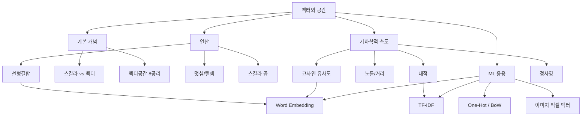

# 02. AI를 위한 수학의 응용: 벡터와 공간

## 🔗 선수 지식 (Prerequisites)
- [ ] **필수**: 기본 집합론 및 실수 체계 - 이해 완료?
- [ ] **필수**: 좌표평면과 좌표공간의 점 표현 - 이해 완료?
- [ ] **권장**: 삼각함수($\cos\theta$, $\sin\theta$)의 정의와 성질
- [ ] **권장**: 피타고라스 정리
- **관련 단원**: [1강. 수학의 응용 개요](1강.md) `→` [3강. 행렬과 선형변환](3강.md)

---

## 학습 목표
1. 벡터의 연산을 수학적으로 이해하고 해석할 수 있다.
2. 벡터 간의 거리, 유사도, 정사영 개념을 기하학적으로 해석할 수 있다.
3. 벡터 개념이 머신러닝 데이터 표현에 어떻게 활용되는지 개괄할 수 있다.

---

## 🧠 메타인지 체크 (학습 전/후 자기 평가)

### 학습 전 자기 평가
| 소주제 | 자신감 (1-5) |
| :--- | :--- |
| 스칼라 vs 벡터, 벡터의 기하학적 의미 | |
| 벡터 연산(덧셈, 스칼라 곱, 선형결합)과 벡터공간 8가지 공리 | |
| 벡터의 노름, 거리, 내적, 코사인 유사도, 정사영 | |
| 머신러닝 벡터화 기법(One-Hot, BoW, TF-IDF, Word Embedding) | |

### 학습 후 교정 (학습 완료 후 작성)
| 소주제 | 학습 전 | 학습 후 | 실제 정답률 | 과신/과소 여부 |
| :--- | :--- | :--- | :--- | :--- |
| 스칼라 vs 벡터 | | | | |
| 벡터 연산 / 벡터공간 | | | | |
| 노름·내적·정사영 | | | | |
| ML 벡터화 기법 | | | | |

> **활용법**: 학습 전 1분 → 자신감 기입, 학습 후 1분 → 나머지 기입. "과신" 영역이 실제 취약점.

---

## 📝 요약 (Summary)
1. 🔴 **스칼라 vs 벡터**: 스칼라는 하나의 값으로 표현되지만, 벡터는 여러 성분으로 이루어져 크기와 방향을 함께 담을 수 있어 데이터 표현에 유리하다.
2. 🔴 **벡터 연산**: 벡터 연산은 같은 차원에서 정의되고, 덧셈과 뺄셈 그리고 스칼라 곱은 벡터를 이동·확대·축소하는 기본 도구이며, **선형결합**은 새로운 벡터를 생성하는 핵심 연산이다.
3. 🟡 **벡터공간**: 벡터 공간은 덧셈과 스칼라 곱이 정의되고, 선형 연산의 **8가지 성질**들을 만족하는 벡터들의 집합이다.
4. 🔴 **노름·내적·유사도·정사영**: 벡터의 크기(노름)와 거리, 내적과 코사인 유사도, 정사영은 두 벡터의 기하학적 관계를 정량화한다.
5. 🟡 **머신러닝 벡터화**: 머신러닝에서의 벡터화 기법은 텍스트, 이미지, 범주형 데이터 등의 다양한 데이터 형식에서 광범위하게 활용된다.

---

## 📐 핵심 수식 (Key Formulas)

| 수식명 | 수식 | 의미 |
| :--- | :--- | :--- |
| **벡터 덧셈** | $\mathbf{u}+\mathbf{v}=(u_1+v_1,\ldots,u_n+v_n)$ | 같은 차원의 성분별 합 (평행사변형 법칙) |
| **스칼라 곱** | $c\mathbf{v}=(cv_1,\ldots,cv_n)$ | 방향 유지(또는 반대), 크기를 $|c|$배로 |
| **선형결합** | $\mathbf{w}=c_1\mathbf{v}_1+\cdots+c_k\mathbf{v}_k$ | 여러 벡터의 가중합으로 새 벡터 생성 |
| **L2 노름(크기)** | $\|\mathbf{v}\|_2=\sqrt{v_1^2+\cdots+v_n^2}$ | 원점에서 벡터 끝점까지의 유클리드 거리 |
| **L1 노름** | $\|\mathbf{v}\|_1=\sum_i |v_i|$ | 맨해튼 거리, 희소성 유도(Lasso) |
| **두 점 사이 거리** | $d(\mathbf{u},\mathbf{v})=\|\mathbf{u}-\mathbf{v}\|_2$ | 두 벡터 끝점 간 유클리드 거리 |
| **정규화(단위벡터)** | $\hat{\mathbf{v}}=\dfrac{\mathbf{v}}{\|\mathbf{v}\|}$ | 방향만 유지, 크기는 1 |
| **내적(Dot product)** | $\mathbf{u}\cdot\mathbf{v}=\sum_{i=1}^{n}u_i v_i=\|\mathbf{u}\|\|\mathbf{v}\|\cos\theta$ | 두 벡터의 방향 유사도 + 크기 |
| **코사인 유사도** | $\cos\theta=\dfrac{\mathbf{u}\cdot\mathbf{v}}{\|\mathbf{u}\|\|\mathbf{v}\|}$ | 방향만 비교 (크기 불변), $[-1,1]$ |
| **정사영(스칼라)** | $\text{comp}_{\mathbf{u}}\mathbf{v}=\dfrac{\mathbf{u}\cdot\mathbf{v}}{\|\mathbf{u}\|}$ | $\mathbf{v}$를 $\mathbf{u}$ 방향으로 내린 그림자 길이 |
| **정사영(벡터)** | $\text{proj}_{\mathbf{u}}\mathbf{v}=\dfrac{\mathbf{u}\cdot\mathbf{v}}{\mathbf{u}\cdot\mathbf{u}}\mathbf{u}$ | 그림자 벡터(방향=$\mathbf{u}$) |

### 주요 정리/정의

**벡터공간(Vector Space)의 8가지 공리**
집합 $V$ 위에 덧셈 $+$ 과 스칼라 곱 $\cdot$ 이 정의되어 있을 때, 임의의 $\mathbf{u},\mathbf{v},\mathbf{w}\in V$ 와 스칼라 $a,b\in\mathbb{R}$에 대해 다음을 만족하면 $V$는 (실수체 위의) 벡터공간이다.

$$
\begin{aligned}
&\text{(1) 덧셈 교환법칙: } \mathbf{u}+\mathbf{v}=\mathbf{v}+\mathbf{u}\\
&\text{(2) 덧셈 결합법칙: } (\mathbf{u}+\mathbf{v})+\mathbf{w}=\mathbf{u}+(\mathbf{v}+\mathbf{w})\\
&\text{(3) 영벡터 존재: } \exists\,\mathbf{0},\ \mathbf{v}+\mathbf{0}=\mathbf{v}\\
&\text{(4) 역원 존재: } \exists\,(-\mathbf{v}),\ \mathbf{v}+(-\mathbf{v})=\mathbf{0}\\
&\text{(5) 스칼라 곱 분배: } a(\mathbf{u}+\mathbf{v})=a\mathbf{u}+a\mathbf{v}\\
&\text{(6) 스칼라 분배: } (a+b)\mathbf{v}=a\mathbf{v}+b\mathbf{v}\\
&\text{(7) 스칼라 결합법칙: } (ab)\mathbf{v}=a(b\mathbf{v})\\
&\text{(8) 항등원: } 1\cdot\mathbf{v}=\mathbf{v}
\end{aligned}
$$

> **직관적 해석**: "벡터의 덧셈과 스칼라배가 닫혀 있고, 일반적인 연산 법칙이 그대로 작동하는 집합". $\mathbb{R}^n$, 다항식 집합, 연속함수 집합 등이 대표 예이다.
> **AI 적용**: 신경망의 가중치, 활성값, 그래디언트는 모두 $\mathbb{R}^n$의 원소로서 벡터공간 공리에 따라 합성·갱신된다.

**코시-슈바르츠 부등식 (Cauchy–Schwarz Inequality)**
$$
|\mathbf{u}\cdot\mathbf{v}|\le\|\mathbf{u}\|\,\|\mathbf{v}\|
$$
> **표기 주의**: 좌변의 $\mathbf{u}\cdot\mathbf{v}$ 는 **스칼라**이므로 절댓값 $|\cdot|$ 을 쓰고, 우변의 $\|\mathbf{u}\|,\|\mathbf{v}\|$ 는 **벡터**의 노름이므로 이중막대 $\|\cdot\|$ 를 쓴다. 둘을 혼동하지 않도록 유의한다.
> **직관적 해석**: $|\cos\theta|\le 1$ 의 일반화. 두 벡터의 내적(의 절댓값)은 그 크기의 곱을 넘을 수 없다.
> **AI 적용**: 코사인 유사도가 $[-1,1]$ 범위에 있다는 보장의 근거. 어텐션 스코어 정규화의 이론적 토대.

---

## 📊 개념 시각화 (Visual Guide)

### 개념 관계도


### 핵심 도식 (연산 ↔ AI 적용)
| 입력 | 연산 | 출력 | AI 적용 |
| :--- | :--- | :--- | :--- |
| 두 특징 벡터 $\mathbf{u},\mathbf{v}$ | 내적 $\mathbf{u}\cdot\mathbf{v}$ | 스칼라 (유사도) | Self-Attention 스코어, 추천 시스템 |
| 단위 벡터 두 개 | 코사인 유사도 | $[-1,1]$ 스칼라 | 문서/단어 임베딩 유사도 측정 |
| 데이터 벡터 $\mathbf{v}$, 기저 $\mathbf{u}$ | 정사영 $\text{proj}_{\mathbf{u}}\mathbf{v}$ | 벡터 | PCA 주성분 투영, 회귀의 최소제곱 |
| 벡터 $\mathbf{v}$ | 정규화 $\mathbf{v}/\|\mathbf{v}\|$ | 단위벡터 | Batch/Layer Norm, 임베딩 정규화 |
| 벡터 집합 $\{\mathbf{v}_i\}$ | 선형결합 $\sum c_i\mathbf{v}_i$ | 새 벡터 | 신경망 한 층의 출력, 이미지 합성 |

---

## ✏️ 심화 학습 (Study Subject)

### 1. 가상 시나리오: "어떤 개념을, 언제 사용해야 할까?"
- **상황**: 뉴스 기사 추천 시스템을 개발 중인데, "정치"와 "경제" 카테고리 기사 수천 건을 TF-IDF로 벡터화했더니 각 벡터의 차원은 1만 차원, 그러나 단어 빈도 차이 때문에 어떤 기사는 노름이 100, 어떤 기사는 노름이 5로 들쭉날쭉이다. 사용자가 본 기사와 "비슷한" 기사를 추천하고 싶다.
- **문제**: 유클리드 거리 $d(\mathbf{u},\mathbf{v})=\|\mathbf{u}-\mathbf{v}\|$ 를 쓰면 문서 길이가 긴 기사가 무조건 "멀리 있는 기사"가 되어버린다. 어떻게 길이의 영향을 제거하고 "내용의 방향"만 비교할 수 있을까?
- **해결**: 코사인 유사도를 사용한다.
$$
\cos\theta=\frac{\mathbf{u}\cdot\mathbf{v}}{\|\mathbf{u}\|\|\mathbf{v}\|}
$$
분모의 노름 곱이 크기 차이를 정확히 상쇄하므로, 결과는 오직 두 벡터 사이의 **각도**(=주제·문체의 방향)만 반영한다. 추가로 임베딩을 미리 정규화해두면($\hat{\mathbf{v}}=\mathbf{v}/\|\mathbf{v}\|$) 코사인 유사도가 단순한 내적 $\hat{\mathbf{u}}\cdot\hat{\mathbf{v}}$로 계산되어 GPU 행렬곱 한 번에 수백만 쌍을 처리할 수 있다.
- **AI 학습 포인트**: "코사인 유사도가 음수일 때는 어떤 의미이며, TF-IDF 벡터에서 음수가 나올 수 있을까? 만약 BERT 임베딩처럼 음의 성분이 가능한 경우와 무엇이 달라지는지 비교해줘."

### 2. 관점별 비교 및 오개념 분석
- **핵심 비교**:
  - **유클리드 거리 vs 코사인 유사도**: 거리는 위치/크기 차이, 유사도는 방향 차이를 측정한다.
  - **내적 vs 코사인 유사도**: 내적은 크기에 영향받음, 코사인은 크기를 정규화함.
  - **벡터(화살표) vs 점(좌표)**: 벡터는 평행이동 불변(시작점 무관), 점은 위치 그 자체.
- **오개념 분석**:
    - **오개념 1**: "두 벡터의 내적이 0이면 두 벡터의 크기 중 하나는 반드시 0이다."
    - **분석**: 틀렸다. $\mathbf{u}\cdot\mathbf{v}=\|\mathbf{u}\|\|\mathbf{v}\|\cos\theta$ 에서 $\cos\theta=0$ 즉 $\theta=90°$ 인 경우(직교) 내적은 0이지만 두 벡터 모두 0이 아닐 수 있다. 예: $(1,0)\cdot(0,1)=0$.
    - **오개념 2**: "코사인 유사도와 상관계수는 같은 것이다."
    - **분석**: 상관계수는 각 벡터에서 **평균을 뺀 뒤** 코사인 유사도를 취한 값이다($\rho = \cos(\mathbf{u}-\bar u, \mathbf{v}-\bar v)$). 평균이 0인 벡터에서만 두 값이 일치한다.
    - **오개념 3**: "정사영 벡터 $\text{proj}_{\mathbf{u}}\mathbf{v}$ 의 크기는 항상 $\|\mathbf{v}\|$ 보다 작다."
    - **분석**: 일반적으로는 그렇지만, $\mathbf{v}$가 $\mathbf{u}$ 와 평행이면 $\|\text{proj}_{\mathbf{u}}\mathbf{v}\| = \|\mathbf{v}\|$ 로 같아진다. "작거나 같다"가 정확한 표현 ($\|\text{proj}_{\mathbf{u}}\mathbf{v}\|=\|\mathbf{v}\|\,|\cos\theta|\le\|\mathbf{v}\|$).
- **AI 학습 포인트**: "임베딩을 사전에 L2-정규화하면 내적 = 코사인 유사도가 되는 이유를 식으로 보여주고, 이로 인해 트랜스포머의 Q·K 어텐션 계산에 어떤 효율성이 생기는지 설명해줘."

---

## ❓ 연습 문제 및 해설

> **블룸 인지 수준 범례**: [기억] 정의·나열 → [이해] 설명·비교 → [적용] 계산·구현 → [분석] 구별·디버그 → [평가] 판단·비평 → [창조] 설계·제안

### 📝 문제

**1. ⭐ [기억] 📌 스칼라와 벡터를 가장 정확하게 구분한 것은?(#prob-1)**
   > ① 스칼라는 양수, 벡터는 음수를 가진다.
   > ② 스칼라는 크기만, 벡터는 크기와 방향을 갖는다.
   > ③ 스칼라는 1차원, 벡터는 항상 3차원이다.
   > ④ 스칼라는 정수, 벡터는 실수로만 표현된다.

<br>

**2. ⭐ [기억] 📌 벡터공간의 8가지 공리에 포함되지 않는 것은?(#prob-2)**
   > ① 덧셈 교환법칙 $\mathbf{u}+\mathbf{v}=\mathbf{v}+\mathbf{u}$
   > ② 영벡터의 존재
   > ③ 스칼라 곱의 교환법칙 $\mathbf{u}\cdot\mathbf{v}=\mathbf{v}\cdot\mathbf{u}$
   > ④ 스칼라에 대한 분배법칙 $(a+b)\mathbf{v}=a\mathbf{v}+b\mathbf{v}$

<br>

**3. ⭐⭐ [적용] 📌 $\mathbf{u}=(3,4)$, $\mathbf{v}=(-1,2)$ 일 때 $2\mathbf{u}-3\mathbf{v}$ 를 계산하시오.(#prob-3)**
   > ① $(9, 2)$
   > ② $(9, 14)$
   > ③ $(3, 6)$
   > ④ $(-3, 6)$

<br>

**4. ⭐⭐ [적용] 📌 $\mathbf{v}=(2,-1,2)$ 의 L2 노름과 단위벡터를 차례로 구하시오.(#prob-4)**
   > ① $\|\mathbf{v}\|=3$, $\hat{\mathbf{v}}=(\tfrac{2}{3},-\tfrac{1}{3},\tfrac{2}{3})$
   > ② $\|\mathbf{v}\|=5$, $\hat{\mathbf{v}}=(\tfrac{2}{5},-\tfrac{1}{5},\tfrac{2}{5})$
   > ③ $\|\mathbf{v}\|=\sqrt{7}$, $\hat{\mathbf{v}}=(\tfrac{2}{\sqrt{7}},-\tfrac{1}{\sqrt{7}},\tfrac{2}{\sqrt{7}})$
   > ④ $\|\mathbf{v}\|=9$, $\hat{\mathbf{v}}=(\tfrac{2}{9},-\tfrac{1}{9},\tfrac{2}{9})$

<br>

**5. ⭐⭐ [적용] 📌 $\mathbf{u}=(1,2,2)$, $\mathbf{v}=(2,0,1)$ 의 내적과 코사인 유사도를 구하시오.(#prob-5)**
   > <보기>
   >
   > 가. $\mathbf{u}\cdot\mathbf{v}=4$
   > 나. $\cos\theta = \dfrac{4}{3\sqrt{5}}$

   > ① 가
   > ② 나
   > ③ 가, 나 모두 옳다
   > ④ 모두 틀리다

<br>

**6. ⭐⭐ [분석] 📌 $\mathbf{u}=(1,0)$, $\mathbf{v}=(0,5)$ 일 때 두 벡터의 관계로 옳은 것은?(#prob-6)**
   > ① 평행하다
   > ② 동일한 방향이다
   > ③ 직교한다(orthogonal)
   > ④ 한쪽이 다른 쪽의 스칼라배이다

<br>

**7. ⭐⭐⭐ [적용] 📌 벡터 $\mathbf{v}=(3,4)$ 를 $\mathbf{u}=(1,0)$ 방향으로 정사영한 벡터 $\text{proj}_{\mathbf{u}}\mathbf{v}$ 와 그 크기는?(#prob-7)**
   > ① $(3,0)$, 크기 $3$
   > ② $(0,4)$, 크기 $4$
   > ③ $(4,0)$, 크기 $4$
   > ④ $(3,4)$, 크기 $5$

<br>

**8. ⭐⭐ [이해] 📌 다음 중 **벡터공간을 이루지 않는** 집합은? ($\mathbb{R}$ 위에서)(#prob-8)**
   > ① $\mathbb{R}^n$ (실수 $n$-튜플)
   > ② 차수가 $n$ 이하인 다항식 전체 집합
   > ③ $\mathbb{R}^2$ 의 1사분면 $\{(x,y)\,|\,x\ge 0, y\ge 0\}$
   > ④ $2\times 2$ 실수 행렬 전체 집합

<br>

**9. ⭐⭐⭐ [평가] 📌 두 사용자의 영화 평점 벡터가 $\mathbf{a}=(5,3,0,1)$, $\mathbf{b}=(4,0,0,1)$ 일 때, **유클리드 거리**와 **코사인 유사도**를 모두 구하고, 추천 시스템에서 어떤 척도가 더 적절한지 한 줄로 논하시오.(#prob-9)**

<br>

**10. ⭐⭐⭐ [창조] 📌 코시-슈바르츠 부등식 $|\mathbf{u}\cdot\mathbf{v}|\le\|\mathbf{u}\|\,\|\mathbf{v}\|$ 를 내적의 정의 $\mathbf{u}\cdot\mathbf{v}=\|\mathbf{u}\|\|\mathbf{v}\|\cos\theta$ 로부터 유도하고, 등호가 성립하는 조건을 기하학적으로 해석하시오.(#prob-10)**

---

### 🔑 정답 및 해설 (먼저 풀어본 후 펼치기)

<details>
<summary>정답 보기 (클릭)</summary>

1. ②
2. ③
3. ①
4. ①
5. ③
6. ③
7. ①
8. ③
9. $d \approx 3.32$, $\cos\theta \approx 0.789$ — 척도 비교는 해설 참조
10. 풀이형 정답 (해설 참조)

</details>

<details>
<summary>해설 보기 (클릭)</summary>

<a id="prob-1"></a>
**1. ⭐ [기억] 스칼라 vs 벡터**
> **정답: ② 스칼라는 크기만, 벡터는 크기와 방향을 갖는다.**
> **해설**: 스칼라는 단일 값(예: 온도, 질량), 벡터는 여러 성분으로 크기와 방향을 모두 표현(예: 속도, 힘). ①③④는 모두 잘못된 일반화.

<a id="prob-2"></a>
**2. ⭐ [기억] 벡터공간 공리**
> **정답: ③ 스칼라 곱의 교환법칙 $\mathbf{u}\cdot\mathbf{v}=\mathbf{v}\cdot\mathbf{u}$**
> **해설**: 8가지 공리는 모두 "벡터 덧셈"과 "스칼라(수)와 벡터 사이의 곱"에 관한 것이다. ③에 적힌 식은 **내적**의 교환법칙으로, 내적은 벡터공간 정의에는 포함되지 않고 추가 구조(내적공간)에서 정의된다. 함정 주의: 항등원(8) $1\cdot\mathbf{v}=\mathbf{v}$ 와는 다르다.

<a id="prob-3"></a>
**3. ⭐⭐ [적용] 선형결합 계산**
> **정답: ① $(9, 2)$**
> **해설**: $2\mathbf{u}=(6,8)$, $3\mathbf{v}=(-3,6)$, $2\mathbf{u}-3\mathbf{v}=(6-(-3),\,8-6)=(9,2)$.

<a id="prob-4"></a>
**4. ⭐⭐ [적용] 노름과 단위벡터**
> **정답: ① $\|\mathbf{v}\|=3$, $\hat{\mathbf{v}}=(\tfrac{2}{3},-\tfrac{1}{3},\tfrac{2}{3})$**
> **해설**: $\|\mathbf{v}\|=\sqrt{4+1+4}=\sqrt{9}=3$. 단위벡터는 $\mathbf{v}/\|\mathbf{v}\|$.

<a id="prob-5"></a>
**5. ⭐⭐ [적용] 내적과 코사인 유사도**
> **정답: ③ 가, 나 모두 옳다**
> **해설**: 내적 $=1\cdot 2+2\cdot 0+2\cdot 1=4$. $\|\mathbf{u}\|=\sqrt{9}=3$, $\|\mathbf{v}\|=\sqrt{5}$. 따라서 $\cos\theta=\frac{4}{3\sqrt{5}}\approx 0.596$.

<a id="prob-6"></a>
**6. ⭐⭐ [분석] 직교 판정**
> **정답: ③ 직교한다**
> **해설**: $\mathbf{u}\cdot\mathbf{v}=1\cdot 0+0\cdot 5=0$ 이므로 $\cos\theta=0$, 즉 $\theta=90°$ 로 직교. ①②④는 비영의 스칼라배 관계가 필요하므로 성립하지 않는다.

<a id="prob-7"></a>
**7. ⭐⭐⭐ [적용] 정사영**
> **정답: ① $(3,0)$, 크기 $3$**
> **해설**: $\mathbf{u}\cdot\mathbf{v}=3$, $\mathbf{u}\cdot\mathbf{u}=1$. $\text{proj}_{\mathbf{u}}\mathbf{v}=\frac{3}{1}(1,0)=(3,0)$. 크기는 $|\cos\theta|\cdot\|\mathbf{v}\|=\frac{3}{5}\cdot 5=3$.

<a id="prob-8"></a>
**8. ⭐⭐ [이해] 벡터공간 판별**
> **정답: ③ $\mathbb{R}^2$ 의 1사분면**
> **해설**: 1사분면은 **닫혀있지 않다**. 예를 들어 $(1,1)\in S$ 이지만 $-1\cdot(1,1)=(-1,-1)\notin S$, 또는 영벡터 외의 음의 역원이 존재하지 않으므로 (4) 역원 공리를 위배한다. 나머지는 모두 표준적인 벡터공간 예.

<a id="prob-9"></a>
**9. ⭐⭐⭐ [평가] 유클리드 vs 코사인**
> **정답**:
> - 유클리드: $\mathbf{a}-\mathbf{b}=(1,3,0,0)$, $d=\sqrt{1+9}=\sqrt{10}\approx 3.16$.
> - 내적 $=5\cdot4+3\cdot0+0+1\cdot1=21$, $\|\mathbf{a}\|=\sqrt{35}\approx 5.92$, $\|\mathbf{b}\|=\sqrt{17}\approx 4.12$, $\cos\theta=\frac{21}{\sqrt{35\cdot 17}}=\frac{21}{\sqrt{595}}\approx 0.861$.
> **해설**: 추천 시스템에서는 사용자마다 **평가 개수와 평점 스케일이 다르므로** 크기에 둔감한 코사인 유사도가 일반적으로 더 적절하다. 단, 평점 수가 적은 사용자(희소성)는 코사인이 과대평가될 수 있어 **mean-centered 코사인(=피어슨 상관)** 이 자주 쓰인다.

<a id="prob-10"></a>
**10. ⭐⭐⭐ [창조] 코시-슈바르츠 부등식 유도**
> **정답·해설**:
> 1) 내적의 정의: $\mathbf{u}\cdot\mathbf{v}=\|\mathbf{u}\|\|\mathbf{v}\|\cos\theta$.
> 2) 임의의 실수에 대해 $|\cos\theta|\le 1$.
> 3) 양변에 $\|\mathbf{u}\|\|\mathbf{v}\|\ge 0$ 을 곱하면
> $$|\mathbf{u}\cdot\mathbf{v}|=\|\mathbf{u}\|\|\mathbf{v}\|\,|\cos\theta|\le\|\mathbf{u}\|\|\mathbf{v}\|.$$
> 4) 등호 조건: $|\cos\theta|=1 \Leftrightarrow \theta=0\text{ 또는 }\pi$, 즉 **두 벡터가 평행(또는 반평행)** 일 때만 등호. 기하학적으로는 $\mathbf{v}=\lambda\mathbf{u}$ ($\lambda\in\mathbb{R}$) 인 일직선상의 관계.
> (보충: 정의식 사용 없이 $f(t)=\|\mathbf{u}+t\mathbf{v}\|^2\ge 0$ 의 판별식 $\le 0$ 으로부터도 유도 가능.)

</details>

---

## ✅ O/X 확인문제 (총 20문)

**1.** 벡터의 덧셈은 같은 차원의 벡터 사이에서만 정의된다. (#ox-1) **(O / X)**
**2.** 스칼라 곱 $c\mathbf{v}$ 에서 $c<0$ 이면 방향이 반대로 뒤집힌다. (#ox-2) **(O / X)**
**3.** 영벡터 $\mathbf{0}$ 의 노름은 정의되지 않는다. (#ox-3) **(O / X)**
**4.** 모든 단위벡터의 노름은 1이다. (#ox-4) **(O / X)**
**5.** 두 벡터의 내적이 0이면 항상 적어도 한 벡터가 영벡터이다. (#ox-5) **(O / X)**
**6.** $\mathbf{u}\cdot\mathbf{v} = \mathbf{v}\cdot\mathbf{u}$ 가 성립한다. (#ox-6) **(O / X)**
**7.** 코사인 유사도는 $[0,1]$ 범위의 값만 갖는다. (#ox-7) **(O / X)**
**8.** $\mathbb{R}^n$ 은 표준적인 덧셈과 스칼라 곱 아래에서 벡터공간을 이룬다. (#ox-8) **(O / X)**
**9.** "차수가 정확히 3인 다항식들의 집합"은 벡터공간이다. (#ox-9) **(O / X)**
**10.** $\text{proj}_{\mathbf{u}}\mathbf{v}$ 와 $\mathbf{v}-\text{proj}_{\mathbf{u}}\mathbf{v}$ 는 서로 직교한다. (#ox-10) **(O / X)**
**11.** L1 노름은 항상 L2 노름보다 크거나 같다. (#ox-11) **(O / X)**
**12.** 선형결합 $c_1\mathbf{v}_1+c_2\mathbf{v}_2$ 의 결과는 새로운 벡터가 될 수 있다. (#ox-12) **(O / X)**
**13.** 두 단위벡터 사이의 코사인 유사도는 그 두 벡터의 내적과 같다. (#ox-13) **(O / X)**
**14.** 거리 함수 $d(\mathbf{u},\mathbf{v})=\|\mathbf{u}-\mathbf{v}\|$ 는 $d(\mathbf{u},\mathbf{v})=d(\mathbf{v},\mathbf{u})$ 를 만족한다. (#ox-14) **(O / X)**
**15.** One-Hot 인코딩으로 만든 두 서로 다른 범주 벡터의 코사인 유사도는 항상 0이다. (#ox-15) **(O / X)**
**16.** 코시-슈바르츠 부등식의 등호는 두 벡터가 직교할 때 성립한다. (#ox-16) **(O / X)**
**17.** TF-IDF 벡터는 문서 길이에 따라 노름이 달라지므로, 유사도 비교 시 정규화가 유용하다. (#ox-17) **(O / X)**
**18.** 벡터공간의 정의에 따르면 영벡터는 유일하게 존재한다. (#ox-18) **(O / X)**
**19.** 임의의 벡터 $\mathbf{v}\neq \mathbf{0}$ 에 대해 $\hat{\mathbf{v}}=\mathbf{v}/\|\mathbf{v}\|$ 는 항상 $\mathbf{v}$ 와 같은 방향이다. (#ox-19) **(O / X)**
**20.** 정사영의 크기 $\|\text{proj}_{\mathbf{u}}\mathbf{v}\|$ 는 $\|\mathbf{v}\|$ 보다 클 수 있다. (#ox-20) **(O / X)**

<details>
<summary>O/X 정답 및 해설 보기 (클릭)</summary>

> <a id="ox-1"></a> **1. O** — 차원이 다르면 성분별 합이 정의되지 않는다.
> <a id="ox-2"></a> **2. O** — 음의 스칼라는 방향을 반전시키고 크기를 $|c|$배로 만든다.
> <a id="ox-3"></a> **3. X** — $\|\mathbf{0}\|=0$ 으로 잘 정의된다.
> <a id="ox-4"></a> **4. O** — 단위벡터의 정의가 노름 1.
> <a id="ox-5"></a> **5. X** — 직교 관계이면 둘 다 비영벡터여도 내적은 0.
> <a id="ox-6"></a> **6. O** — 실수 벡터의 내적은 교환법칙이 성립한다.
> <a id="ox-7"></a> **7. X** — 일반적으로 $[-1,1]$ 범위. 음수가 가능.
> <a id="ox-8"></a> **8. O** — 표준 예시.
> <a id="ox-9"></a> **9. X** — 두 3차 다항식의 합이 3차 미만이 될 수 있어 닫혀있지 않다. 또한 영다항식이 포함되지 않는다.
> <a id="ox-10"></a> **10. O** — 정사영의 정의상 잔차 벡터는 기준 벡터와 직교(직교분해).
> <a id="ox-11"></a> **11. O** — $\|\mathbf{v}\|_1\ge\|\mathbf{v}\|_2$ 가 성립.
> <a id="ox-12"></a> **12. O** — 선형결합으로 새 벡터 생성 가능.
> <a id="ox-13"></a> **13. O** — $\|\mathbf{u}\|=\|\mathbf{v}\|=1$ 이면 $\cos\theta = \mathbf{u}\cdot\mathbf{v}$.
> <a id="ox-14"></a> **14. O** — 거리의 대칭성.
> <a id="ox-15"></a> **15. O** — 서로 다른 범주는 1이 켜진 위치가 달라 내적이 0.
> <a id="ox-16"></a> **16. X** — 등호는 두 벡터가 평행(스칼라배)일 때 성립. 직교일 때는 내적 자체가 0.
> <a id="ox-17"></a> **17. O** — 코사인 유사도 또는 L2 정규화로 길이 효과 제거.
> <a id="ox-18"></a> **18. O** — 항등원의 유일성은 공리에서 유도된다.
> <a id="ox-19"></a> **19. O** — 양의 스칼라 $1/\|\mathbf{v}\|$ 를 곱하므로 같은 방향.
> <a id="ox-20"></a> **20. X** — $\|\text{proj}_{\mathbf{u}}\mathbf{v}\|=\|\mathbf{v}\|\,|\cos\theta|\le\|\mathbf{v}\|$.

</details>

---

## 🧪 자유 회상 연습 (Free Recall)

> **방법**: 위의 노트를 모두 덮고, 타이머 3분 설정 후 이번 단원에서 배운 내용을 기억나는 대로 자유롭게 적으세요.
> 정확한 문장이 아니어도 됩니다. 키워드, 수식, 관계 등 떠오르는 것을 모두 적습니다.

**자유 회상 작성란:**

```
[여기에 기억나는 내용을 자유롭게 작성]


```

> **회상 후 점검**: 노트를 다시 펼쳐 빠뜨린 내용을 확인하세요. 빠뜨린 부분이 실제 취약점입니다.
> - 회상 못한 핵심 개념: [                ]
> - 회상 못한 수식: [                ]

---

## 💻 코드로 확인하기 (Code Verification)

```python
import numpy as np

# 1) 벡터 기본 연산
u = np.array([3, 4])
v = np.array([-1, 2])
print("2u - 3v =", 2*u - 3*v)                # 선형결합

# 2) 노름과 단위벡터
w = np.array([2, -1, 2])
norm_w = np.linalg.norm(w)
print(f"||w|| = {norm_w:.4f}")
print(f"unit w = {w / norm_w}")

# 3) 내적, 코사인 유사도
a = np.array([1, 2, 2])
b = np.array([2, 0, 1])
dot = a @ b
cos_sim = dot / (np.linalg.norm(a) * np.linalg.norm(b))
print(f"a·b = {dot}, cos(theta) = {cos_sim:.4f}")

# 4) 정사영: proj_u v
def projection(v, u):
    return (v @ u) / (u @ u) * u

v2 = np.array([3, 4])
u2 = np.array([1, 0])
p = projection(v2, u2)
print(f"proj_u(v) = {p},  ||proj|| = {np.linalg.norm(p):.4f}")

# 5) 두 점 사이 거리 vs 코사인 유사도 (추천 시스템 예시)
rater_a = np.array([5, 3, 0, 1])
rater_b = np.array([4, 0, 0, 1])
euclid  = np.linalg.norm(rater_a - rater_b)
cos_ab  = (rater_a @ rater_b) / (np.linalg.norm(rater_a)*np.linalg.norm(rater_b))
print(f"Euclidean = {euclid:.4f}, Cosine = {cos_ab:.4f}")
```

> **실행 결과 (예상)**
> ```
> 2u - 3v = [9 2]
> ||w|| = 3.0000
> unit w = [ 0.6667 -0.3333  0.6667]
> a·b = 4, cos(theta) = 0.5963
> proj_u(v) = [3 0],  ||proj|| = 3.0000
> Euclidean = 3.1623, Cosine = 0.8607
> ```
> **수학적 해석**: 위 결과는 손으로 푼 연습문제 3, 4, 5, 7, 9의 답과 일치한다. 특히 마지막 예에서 유클리드 거리는 약 3.16으로 두 사용자가 "멀어 보이지만", 코사인 유사도는 0.86으로 매우 비슷한 취향임을 보여준다 — **척도 선택이 결과 해석을 좌우**한다는 사실을 수치로 확인할 수 있다.

---

## 🤖 AI 연결고리 (Math → AI Application)

| 수학 개념 | AI/ML 적용 분야 | 구체적 사례 |
| :--- | :--- | :--- |
| 벡터·벡터공간 | 모든 ML 데이터 표현 | 특징벡터(feature vector), 임베딩(embedding) |
| 선형결합 | 신경망의 한 층 | $\mathbf{h}=W\mathbf{x}+\mathbf{b}=\sum_i x_i\mathbf{w}_i+\mathbf{b}$ |
| 내적 | Transformer Attention | $\text{score}=\dfrac{QK^\top}{\sqrt{d_k}}$ (Q·K 내적) |
| 코사인 유사도 | 임베딩 검색, 추천 | Word2Vec 단어 유사도, FAISS 벡터 검색 |
| 정사영 | 차원축소, 회귀 | PCA(주성분 방향으로 투영), 최소제곱 직교투영 |
| L1/L2 노름 | 정규화(Regularization) | Lasso (L1), Ridge (L2) |
| 정규화(Unit vector) | 표현 안정화 | L2-Normalize 임베딩, LayerNorm |

---

## 📖 심화 학습 예시 답안

#### 1. 정사영(Projection)의 내부 동작 원리
정사영은 "벡터 $\mathbf{v}$의 그림자를 $\mathbf{u}$ 방향에 떨어뜨리는" 연산이다. 핵심 통찰은 $\mathbf{v}$를 **두 직교 성분의 합**으로 분해할 수 있다는 점이다.

1. **분해 가정**: $\mathbf{v} = \alpha\mathbf{u} + \mathbf{r}$ 로 두고, $\mathbf{r}\perp\mathbf{u}$ 이 되도록 $\alpha$를 정한다.
2. **양변과 $\mathbf{u}$의 내적**: $\mathbf{u}\cdot\mathbf{v} = \alpha(\mathbf{u}\cdot\mathbf{u}) + 0$.
3. **계수 결정**: $\alpha = \dfrac{\mathbf{u}\cdot\mathbf{v}}{\mathbf{u}\cdot\mathbf{u}}$, 따라서 $\text{proj}_{\mathbf{u}}\mathbf{v} = \alpha\mathbf{u}$.
4. **기하학적 의미**: $\mathbf{r} = \mathbf{v}-\alpha\mathbf{u}$ 는 $\mathbf{v}$ 에서 "$\mathbf{u}$ 방향 성분을 뺀 나머지"이며 $\mathbf{u}$ 와 직교 — PCA, 그람-슈미트 직교화, 최소제곱법의 공통 토대.

#### 2. 유클리드 거리 vs 코사인 유사도 비교표

| 구분 | 유클리드 거리 | 코사인 유사도 | 비고 |
| :--- | :--- | :--- | :--- |
| **정의** | $d=\sqrt{\sum(u_i-v_i)^2}$ | $\cos\theta=\dfrac{\mathbf{u}\cdot\mathbf{v}}{\|\mathbf{u}\|\|\mathbf{v}\|}$ | 거리 vs 각도 |
| **값 범위** | $[0,\infty)$ | $[-1,1]$ | 부호 의미 다름 |
| **크기 민감도** | 매우 민감 | 무관(정규화) | 길이 차이 제거 여부 |
| **적용 조건** | 동일 단위·스케일 데이터 | 방향성·구조가 중요한 데이터 | 데이터 성격 |
| **AI 활용** | k-NN(좌표 데이터), K-means | 텍스트/이미지 임베딩 검색, 추천 | 가장 흔한 두 척도 |

#### 3. 코사인 유사도를 활용한 코드 작성법 (Best Practice)

- **Bad Practice (나쁜 예시)**
  ```python
  # 매 쿼리마다 노름을 다시 계산 → 대규모 검색에서 비효율
  def cos_sim_slow(q, db):
      sims = []
      for v in db:
          sims.append((q @ v) / (np.linalg.norm(q) * np.linalg.norm(v)))
      return np.array(sims)
  ```
- **Good Practice (좋은 예시)**
  ```python
  # 임베딩을 사전에 L2 정규화 → 코사인 유사도가 단순 행렬곱
  def l2_normalize(X, eps=1e-12):
      return X / (np.linalg.norm(X, axis=1, keepdims=True) + eps)

  def cos_sim_fast(q, db_normalized):
      q_hat = q / (np.linalg.norm(q) + 1e-12)
      return db_normalized @ q_hat        # 한 번의 행렬-벡터 곱

  db = np.random.randn(100_000, 768)      # 10만 개 임베딩
  db_n = l2_normalize(db)                  # 한 번만!
  q = np.random.randn(768)
  sims = cos_sim_fast(q, db_n)             # GPU/BLAS에서 매우 빠름
  ```
- **설명**: 정규화 후에는 코사인 유사도 = 내적이므로 BLAS 최적화된 단일 행렬곱으로 처리된다. FAISS, ScaNN 등 대규모 벡터 검색 라이브러리가 모두 이 원리에 기반한다.

---

## 📚 핵심 용어집 (Glossary)

| 용어 (한) | 용어 (영) | 수식 표현 | 정의 |
| :--- | :--- | :--- | :--- |
| **스칼라** | Scalar | $a\in\mathbb{R}$ | 크기만 갖는 양 (예: 온도, 질량) |
| **벡터** | Vector | $\mathbf{v}=(v_1,\ldots,v_n)$ | 크기와 방향을 갖는 양; $\mathbb{R}^n$의 원소 |
| **벡터공간** | Vector Space | $(V,+,\cdot)$ | 8가지 공리를 만족하는 집합 |
| **선형결합** | Linear Combination | $\sum c_i\mathbf{v}_i$ | 벡터들의 가중합 |
| **노름** | Norm | $\|\mathbf{v}\|$ | 벡터의 크기 (L1, L2 등) |
| **단위벡터** | Unit Vector | $\hat{\mathbf{v}}=\mathbf{v}/\|\mathbf{v}\|$ | 노름이 1인 벡터 |
| **내적** | Dot / Inner Product | $\mathbf{u}\cdot\mathbf{v}$ | 두 벡터의 곱연산, 스칼라 결과 |
| **직교** | Orthogonal | $\mathbf{u}\cdot\mathbf{v}=0$ | 두 벡터가 90°를 이룸 |
| **코사인 유사도** | Cosine Similarity | $\cos\theta=\frac{\mathbf{u}\cdot\mathbf{v}}{\|\mathbf{u}\|\|\mathbf{v}\|}$ | 방향만의 유사도, $[-1,1]$ |
| **정사영** | Projection | $\text{proj}_{\mathbf{u}}\mathbf{v}=\frac{\mathbf{u}\cdot\mathbf{v}}{\mathbf{u}\cdot\mathbf{u}}\mathbf{u}$ | $\mathbf{v}$의 $\mathbf{u}$ 방향 성분 |
| **벡터화** | Vectorization | — | 비수치 데이터를 벡터로 변환하는 기법 |
| **One-Hot 인코딩** | One-Hot Encoding | $\mathbf{e}_k\in\{0,1\}^n$ | $k$번째만 1, 나머지 0인 벡터 |
| **TF-IDF** | Term Frequency–Inverse Document Frequency | $\text{tf}\cdot\log\frac{N}{\text{df}}$ | 문서 내 단어 중요도 가중치 |
| **임베딩** | Embedding | $f:\text{token}\to\mathbb{R}^d$ | 이산 객체를 저차원 연속벡터로 사상 `→← 추후 강의` |

---

## 🤖 AI 학습 파트너를 위한 추가 자료

### 1. 개념 이해를 위한 심층 질문 프롬프트
> **프롬프트 예시**: "벡터공간의 8가지 공리를 초등학생도 이해할 수 있도록 '레고 블록 쌓기' 비유로 설명해줘. 그리고 이 8가지 공리가 만약 하나라도 빠지면 어떤 수학적 문제가 발생하는지(예: 영벡터 공리가 없으면) 구체적인 반례를 들어줘."

### 2. 문제 해결 능력 강화를 위한 시나리오 프롬프트
> **프롬프트 예시**: "당신은 추천 시스템을 개발하는 데이터 사이언티스트입니다. 사용자-아이템 평점 행렬(매우 희소함)이 있을 때, 사용자 간 유사도 측정으로 **유클리드 거리, 코사인 유사도, 피어슨 상관계수** 중 어느 것을 선택할지 각각의 장단점을 비교하고 최종 선택에 대한 기술적인 이유를 설명해줘. 추가로 cold-start 사용자가 있을 때의 대응책도 포함해줘."

### 3. 수식 풀이 검증 프롬프트
> **프롬프트 예시**: "다음 정사영 유도 과정을 검증해줘.
> $$\mathbf{v}=\alpha\mathbf{u}+\mathbf{r},\ \mathbf{r}\perp\mathbf{u} \;\Rightarrow\; \mathbf{u}\cdot\mathbf{v}=\alpha\|\mathbf{u}\|^2 \;\Rightarrow\; \alpha=\frac{\mathbf{u}\cdot\mathbf{v}}{\|\mathbf{u}\|^2}$$
> 1. 각 단계가 수학적으로 올바른지 확인하고, 틀린 부분이 있다면 지적해줘.
> 2. 더 간결하거나 효율적인 풀이 방법(예: 최소화 문제 $\min_\alpha\|\mathbf{v}-\alpha\mathbf{u}\|^2$ 로부터의 유도)이 있다면 제시해줘."

---

## 🔄 복습 체크 (Spaced Repetition)
- [ ] 1일 후 복습 (날짜: 2026-05-30)
- [ ] 3일 후 복습 (날짜: 2026-06-01)
- [ ] 7일 후 복습 (날짜: 2026-06-05)
- [ ] 14일 후 복습 (날짜: 2026-06-12)
- [ ] 30일 후 복습 (날짜: 2026-06-28)

### 복습 시 자가 평가
| 회차 | 날짜 | 이해도 (1-5) | 취약 부분 메모 |
| :--- | :--- | :--- | :--- |
| 1차 | | | |
| 2차 | | | |
| 3차 | | | |

---

## 💡 심화 아이디어 / 더 생각해보기

- **차원의 저주(Curse of Dimensionality)와 코사인**: 임베딩 차원이 수백~수천으로 커질수록 표현력은 늘지만, 고차원에서는 무작위로 뽑은 두 벡터가 거의 직교(코사인 ≈ 0)에 가까워지고 모든 점쌍의 유클리드 거리가 서로 비슷해진다. 그래서 고차원 검색에서는 절대 거리보다 **방향(코사인)** 이 더 안정적인 신호가 되고, PCA 같은 차원 축소가 함께 쓰인다.
- **내적의 정규화 = 코사인**: 임베딩을 미리 L2-정규화($\hat{\mathbf{v}}=\mathbf{v}/\|\mathbf{v}\|$)해 두면 코사인 유사도가 단순 내적 $\hat{\mathbf{u}}\cdot\hat{\mathbf{v}}$ 로 환원된다. 이 덕분에 RAG·추천의 수백만 쌍 유사도 계산이 **단 한 번의 행렬곱**(3강의 $QK^\top$ 구조와 동일)으로 처리된다 — 벡터(2강)와 행렬(3강)이 만나는 지점이다.
- **벡터 산술과 의미 공간**: 잘 학습된 단어 임베딩에서는 `king − man + woman ≈ queen` 같은 선형 결합이 의미 관계를 근사한다. 이는 "의미의 축"이 벡터 공간의 방향으로 표현될 수 있음을 시사한다(엄밀한 항등식은 아니며 데이터·모델에 따라 근사 정도가 다르다는 점도 함께 생각해보자).
- **희소성과 L1의 선택 효과**: 특징이 수만 개인 문제에서 L1 정규화(Lasso)는 다수의 가중치를 정확히 0으로 만들어 **자동 특징 선택**을 수행한다. "어떤 노름을 손실에 더하느냐"가 모델의 해석 가능성과 일반화를 좌우한다 — 노름은 단순한 거리 측정이 아니라 *모델 설계의 도구*다.

---

## 📚 참고 자료 (References)

- 교재: 한국방송통신대학교 『AI를 위한 수학의 응용』 2장 — 벡터와 공간
- 3Blue1Brown, *Essence of Linear Algebra* (YouTube) — 벡터의 기하학적 직관
- Gilbert Strang, *Introduction to Linear Algebra* — 내적·정사영·노름의 표준 텍스트
- Mikolov et al. (2013), *Efficient Estimation of Word Representations in Vector Space* (Word2Vec) — 코사인 유사도 임베딩 응용

---

## 참고자료 (Fact-check 출처)

- Deisenroth, Faisal, Ong, *Mathematics for Machine Learning*, Ch. 3 Analytic Geometry (내적·노름·정사영·코시-슈바르츠) — https://mml-book.github.io
- Gilbert Strang, *MIT 18.06 Linear Algebra* (OpenCourseWare) — https://ocw.mit.edu/courses/18-06-linear-algebra-spring-2010/
- 3Blue1Brown, *Essence of Linear Algebra* — Dot products, Linear combinations·span·basis — https://www.3blue1brown.com/topics/linear-algebra
- Wikipedia, "Cosine similarity" — https://en.wikipedia.org/wiki/Cosine_similarity
- Wikipedia, "Cauchy–Schwarz inequality" (절댓값 표기 및 등호 조건 확인) — https://en.wikipedia.org/wiki/Cauchy%E2%80%93Schwarz_inequality
- Wikipedia, "Norm (mathematics)" (L1·L2 정의 및 $\|\mathbf{v}\|_2\le\|\mathbf{v}\|_1$ 확인) — https://en.wikipedia.org/wiki/Norm_(mathematics)
- Wikipedia, "Pearson correlation coefficient" (mean-centered 코사인과의 관계 확인) — https://en.wikipedia.org/wiki/Pearson_correlation_coefficient
