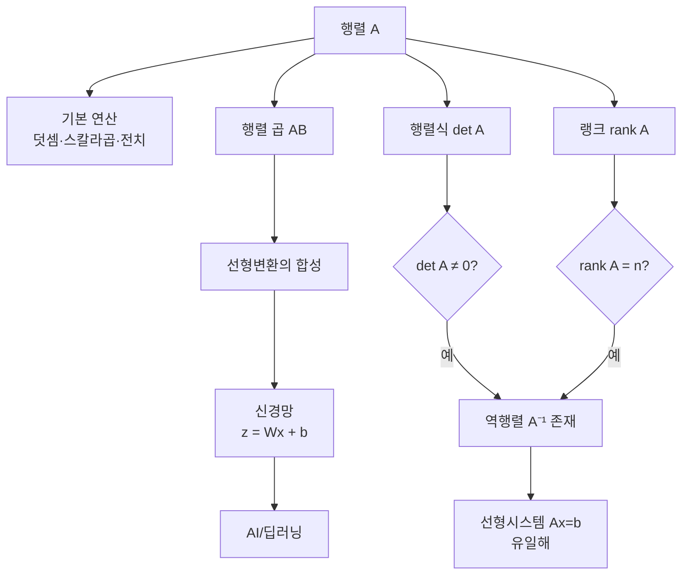

# 3강. AI를 위한 수학의 응용: 행렬과 선형변환

## 🔗 선수 지식 (Prerequisites)
- [ ] **필수**: 벡터의 정의·내적·노름 (`→←2강`) - 이해 완료?
- [ ] **권장**: 연립일차방정식의 가우스 소거법, 함수의 합성 개념
- **관련 단원**: [2강 벡터와 벡터공간](2강.md), [4강 행렬 분해와 고유값(예정)](4강.md)

---

## 학습 목표
1. 행렬의 구조와 연산(덧셈·스칼라 곱·전치·행렬 곱), 그리고 선형변환의 기하학적 의미를 이해하고 계산할 수 있다.
2. 행렬식, 역행렬, 열공간, 랭크를 통해 선형 시스템 $A\mathbf{x}=\mathbf{b}$의 해 조건을 분석할 수 있다.
3. 신경망에서의 가중치 행렬이 입력 벡터를 선형변환하는 방식으로 작용함을 설명할 수 있다.

---

## 🧠 메타인지 체크 (학습 전/후 자기 평가)

### 학습 전 자기 평가
| 소주제 | 자신감 (1-5) |
| :--- | :--- |
| 행렬의 정의와 기본 연산 | |
| 행렬 곱과 비교환성 | |
| 행렬식과 역행렬 | |
| 선형시스템과 열공간 | |
| 랭크와 해의 존재 조건 | |
| 신경망 가중치 행렬 해석 | |

### 학습 후 교정 (학습 완료 후 작성)
| 소주제 | 학습 전 | 학습 후 | 실제 정답률 | 과신/과소 여부 |
| :--- | :--- | :--- | :--- | :--- |
| 행렬의 정의와 기본 연산 | | | | |
| 행렬 곱과 비교환성 | | | | |
| 행렬식과 역행렬 | | | | |
| 선형시스템과 열공간 | | | | |
| 랭크와 해의 존재 조건 | | | | |
| 신경망 가중치 행렬 해석 | | | | |

> **활용법**: 학습 전 1분 → 자신감 기입, 학습 후 1분 → 나머지 기입. "과신" 영역이 실제 취약점.

---

## 📝 요약 (Summary)

### 행렬의 정의와 기본 연산 🔴
1. **행렬의 표현**: 행렬은 여러 벡터를 한 번에 다루기 위한 표현으로, 열벡터들의 묶음 또는 행벡터들의 묶음으로 볼 수 있다. 🔴
2. **기본 연산**: 덧셈/스칼라 곱/전치 같은 기본 연산을 통해 다차원 계산을 체계적으로 수행하도록 해준다. 🔴
3. **전치의 성질**: $(A+B)^T = A^T + B^T$, $(AB)^T = B^T A^T$ 등의 성질이 성립한다. 🟡

### 행렬 곱 🔴
4. **행렬 곱의 정의**: $(AB)_{ij}$는 $A$의 $i$번째 행과 $B$의 $j$번째 열의 내적으로 정의된다. 🔴
5. **비교환성**: 일반적으로 $AB \ne BA$ 인 비교환 연산이다. 🔴
6. **선형변환의 합성**: 두 행렬의 곱은 두 선형변환의 합성에 해당한다. 🟡

### 행렬식 (Determinant) 🔴
7. **행렬식의 의미**: 변환이 공간의 크기(면적/부피)를 얼마나 바꾸는지 정량화하는 스칼라이다. 🔴
8. **가역성 판정**: $\det(A) = 0$이면 $A$의 역행렬이 존재하지 않는다. 🔴
9. **부호의 의미**: $\det(A) < 0$이면 변환이 공간의 방향(orientation)을 뒤집는다. 🟡

### 역행렬 🔴
10. **역행렬의 정의**: $A A^{-1} = A^{-1} A = I$를 만족하는 행렬. 🔴
11. **존재 조건**: 정사각 행렬이고 $\det(A) \ne 0$일 때만 존재한다. 🔴
12. **2×2 공식**: $A=\begin{pmatrix}a&b\\c&d\end{pmatrix}$일 때 $A^{-1}=\dfrac{1}{ad-bc}\begin{pmatrix}d&-b\\-c&a\end{pmatrix}$. 🟡

### 선형시스템과 열공간 🔴
13. **선형시스템**: $A\mathbf{x} = \mathbf{b}$는 미지수 벡터 $\mathbf{x}$에 대한 연립일차방정식의 행렬 표현이다. 🔴
14. **열공간 해석**: 해가 존재하려면 $\mathbf{b}$가 $A$의 열공간(Column space) $\text{Col}(A)$에 속해야 한다. 🔴
15. **열공간의 정의**: $A$의 열벡터들의 모든 선형결합으로 만들어지는 공간이다. 🟡

### 랭크와 선형독립 🔴
16. **랭크의 정의**: 행렬의 랭크는 선형독립인 열벡터(또는 행벡터)의 최대 개수이다. 🔴
17. **해의 분류**: 선형 시스템에서 해는 ① 유일, ② 무수히 많음, ③ 존재하지 않음으로 나뉘며, 랭크가 그 조건을 결정한다. 🔴
18. **풀랭크(full rank)**: $\text{rank}(A) = n$ (열 개수)이면 열벡터들이 선형독립이고 해가 유일하다. 🔴

### 신경망과 선형변환 🟡
19. **신경망 한 층의 계산**: 입력 $\mathbf{x}$에 대해 한 층은 $\mathbf{z} = W\mathbf{x} + \mathbf{b}$ 형태의 행렬-벡터 곱으로 구현된다. 🔴
20. **여러 층의 합성**: 여러 층의 계산은 여러 행렬 곱(과 비선형 활성화)의 합성으로 표현되며, 선형대수학이 딥러닝 계산의 기반이다. 🟡

---

## 📐 핵심 수식 (Key Formulas)

| 수식명 | 수식 | 의미 |
| :--- | :--- | :--- |
| **행렬 덧셈** | $(A+B)_{ij} = A_{ij} + B_{ij}$ | 같은 위치 성분끼리 합 |
| **스칼라 곱** | $(cA)_{ij} = c \cdot A_{ij}$ | 모든 성분에 스칼라 곱 |
| **전치** | $(A^T)_{ij} = A_{ji}$ | 행과 열을 바꿈 |
| **행렬 곱** | $(AB)_{ij} = \sum_{k=1}^{n} A_{ik} B_{kj}$ | $A$의 $i$행 · $B$의 $j$열 내적 |
| **전치의 분배** | $(AB)^T = B^T A^T$ | 순서 뒤집힘에 주의 |
| **2×2 행렬식** | $\det(A) = ad - bc$ | $A=\bigl(\begin{smallmatrix}a&b\\c&d\end{smallmatrix}\bigr)$ |
| **곱의 행렬식** | $\det(AB) = \det(A)\det(B)$ | 가역성 보존 |
| **2×2 역행렬** | $A^{-1} = \dfrac{1}{ad-bc}\begin{pmatrix}d&-b\\-c&a\end{pmatrix}$ | $\det \ne 0$일 때 |
| **역행렬의 성질** | $(AB)^{-1} = B^{-1}A^{-1}$ | 순서 뒤집힘 |
| **선형시스템** | $A\mathbf{x} = \mathbf{b}$ | 해의 존재: $\mathbf{b} \in \text{Col}(A)$ |
| **랭크-차원 정리** | $\text{rank}(A) + \text{nullity}(A) = n$ | 열의 개수 $n$ 기준 |
| **신경망 한 층** | $\mathbf{z} = W\mathbf{x} + \mathbf{b},\ \mathbf{a} = \sigma(\mathbf{z})$ | 가중치 행렬·편향 + 활성화 |

### 주요 정리/정의

**[정리] 가역성 동치 조건 (Invertible Matrix Theorem 요약)**

정사각 행렬 $A \in \mathbb{R}^{n \times n}$에 대해 다음은 모두 동치이다.
$$
A \text{ 가역} \iff \det(A) \ne 0 \iff \text{rank}(A) = n \iff A\text{의 열벡터들이 선형독립}
$$
$$
\iff A\mathbf{x} = \mathbf{0} \text{의 해가 } \mathbf{x} = \mathbf{0} \text{ 뿐} \iff A\mathbf{x} = \mathbf{b} \text{가 모든 } \mathbf{b}\text{에 대해 유일한 해를 가짐}
$$
> **직관적 해석**: 행렬식·랭크·역행렬·해의 유일성은 모두 "$A$가 차원을 보존하느냐"라는 하나의 질문에 대한 서로 다른 답이다.
> **AI 적용**: 회귀에서 정규방정식 $\mathbf{w} = (X^T X)^{-1} X^T \mathbf{y}$의 해는 $X^T X$가 가역(=특성들이 선형독립)일 때만 유일하게 결정된다. 다중공선성은 곧 랭크 부족이다.

**[정의] 선형변환 (Linear Transformation)**

함수 $T: \mathbb{R}^n \to \mathbb{R}^m$이 다음 두 조건을 만족하면 선형변환이다.
$$
T(\mathbf{x} + \mathbf{y}) = T(\mathbf{x}) + T(\mathbf{y}), \qquad T(c\mathbf{x}) = c\,T(\mathbf{x})
$$
이때 유일한 행렬 $A \in \mathbb{R}^{m \times n}$이 존재하여 $T(\mathbf{x}) = A\mathbf{x}$로 표현된다.

> **직관적 해석**: "원점을 고정하고 격자선의 평행성과 등간격을 유지하는 변환"이 선형변환이다. 회전·축소·확대·전단(shear) 등이 모두 해당한다.
> **AI 적용**: 신경망의 한 층 $W\mathbf{x}$는 선형변환이며, $+\mathbf{b}$는 평행이동(affine)이다. 비선형 활성화 $\sigma$가 없다면 아무리 층을 쌓아도 결국 하나의 선형변환에 불과하다 — 비선형성이 깊이의 의미를 만든다.

---

## 📊 개념 시각화 (Visual Guide)

### 개념 관계도


### 선형변환 기하학적 시각화 (단위정사각형의 상)

| 변환 | 행렬 $A$ | $\det(A)$ | 효과 |
| :--- | :--- | :--- | :--- |
| **항등** | $\bigl(\begin{smallmatrix}1&0\\0&1\end{smallmatrix}\bigr)$ | $1$ | 변화 없음 |
| **확대 2배** | $\bigl(\begin{smallmatrix}2&0\\0&2\end{smallmatrix}\bigr)$ | $4$ | 면적 4배 |
| **회전 90°** | $\bigl(\begin{smallmatrix}0&-1\\1&0\end{smallmatrix}\bigr)$ | $1$ | 면적·방향 보존 |
| **전단(shear)** | $\bigl(\begin{smallmatrix}1&1\\0&1\end{smallmatrix}\bigr)$ | $1$ | 면적 보존, 평행사변형으로 |
| **반사(x축)** | $\bigl(\begin{smallmatrix}1&0\\0&-1\end{smallmatrix}\bigr)$ | $-1$ | 방향 뒤집힘 |
| **사영(랭크 1)** | $\bigl(\begin{smallmatrix}1&0\\0&0\end{smallmatrix}\bigr)$ | $0$ | 1차원으로 압축, 비가역 |

### 핵심 도식: 행렬-벡터 곱의 두 가지 관점

| 입력 | 연산 (관점) | 출력 | AI 적용 |
| :--- | :--- | :--- | :--- |
| 행렬 $A$, 벡터 $\mathbf{x}$ | **행 관점**: $(A\mathbf{x})_i = A_i \cdot \mathbf{x}$ (행벡터·열벡터 내적) | 벡터 | 한 뉴런의 가중합 |
| 행렬 $A$, 벡터 $\mathbf{x}$ | **열 관점**: $A\mathbf{x} = \sum_j x_j A_{:,j}$ (열의 선형결합) | 벡터 | 입력 특성의 가중 조합 → 열공간 |

---

## ✏️ 심화 학습 (Study Subject)

### 1. 가상 시나리오: "어떤 개념을, 언제 사용해야 할까?"
- **상황**: 한 데이터 사이언티스트가 5개 특성($x_1,\ldots,x_5$)으로 집값을 예측하는 선형회귀 모델 $\hat{y} = \mathbf{w}^T\mathbf{x}$를 학습하려 한다. 정규방정식 $\mathbf{w} = (X^T X)^{-1} X^T \mathbf{y}$로 풀려는데, $X^T X$의 역행렬을 구할 수 없다는 에러가 발생했다.
- **문제**: 왜 역행렬이 존재하지 않는가? 이 상황을 행렬식·랭크 관점에서 해석하고 해결책을 제시하라.
- **해결**:
  1. $X^T X$가 가역이 아니려면 $\det(X^T X) = 0$이어야 하고, 이는 $\text{rank}(X) < 5$를 의미한다 (즉, 특성들이 선형종속).
  2. **진단**: 예를 들어 $x_5 = 2 x_1 + 3 x_2$라면 $x_5$ 열은 $x_1, x_2$ 열의 선형결합이므로 열공간에 새로운 정보를 주지 못한다 → 다중공선성(multicollinearity).
  3. **해결책**: ① 종속 특성 제거, ② 차원 축소(PCA — 4강 예정), ③ 정규화 $(X^T X + \lambda I)^{-1}$로 만들어 항상 가역 보장(릿지 회귀).
- **AI 학습 포인트**: "다중공선성이 있는 데이터에서 릿지 회귀의 정규화 항 $\lambda I$가 어떻게 $X^T X$의 랭크/고유값 구조를 바꾸어 수치 안정성을 회복시키는지, 고유값 분해 관점에서 설명해 줘."

### 2. 관점별 비교 및 오개념 분석

- **핵심 비교**: 행렬 곱 vs 성분별 곱, 행렬식 vs 랭크, 선형변환 vs 아핀변환

| 혼동 쌍 | 차이점의 핵심 |
| :--- | :--- |
| **행렬 곱 $AB$ vs 성분별 곱(Hadamard) $A \odot B$** | 행렬 곱은 선형변환의 합성이고 차원이 $(m\times n)(n\times p) = m\times p$. Hadamard는 같은 모양 행렬의 성분별 곱(NumPy `*`) |
| **$AB$ vs $BA$** | 일반적으로 다르다. 차원이 안 맞으면 한쪽은 정의조차 안 되며, 정사각 행렬도 대부분 비교환 |
| **행렬식 vs 랭크** | 행렬식은 스칼라(공간 부피 비율), 랭크는 정수(독립 열 개수). 정사각에서만 $\det=0 \iff \text{rank}<n$로 연결 |
| **선형변환 vs 아핀변환** | 선형변환은 원점 보존 $T(\mathbf{0})=\mathbf{0}$. 아핀변환 $\mathbf{x}\mapsto A\mathbf{x}+\mathbf{b}$는 평행이동 포함하여 원점이 움직일 수 있음 |
| **열공간 vs 영공간** | 열공간 $\text{Col}(A)$는 $A\mathbf{x}$가 도달할 수 있는 공간(상). 영공간 $\text{Null}(A)$는 $A\mathbf{x}=\mathbf{0}$을 만족하는 $\mathbf{x}$들의 공간(핵) |

- **오개념 분석**:
    - **오개념 1**: "$AB = 0$이면 $A=0$ 또는 $B=0$이다."
    - **분석**: 실수에서는 옳지만 행렬에서는 **거짓**이다. 예: $A=\bigl(\begin{smallmatrix}1&0\\0&0\end{smallmatrix}\bigr),\ B=\bigl(\begin{smallmatrix}0&0\\0&1\end{smallmatrix}\bigr)$이면 $AB=0$이지만 둘 다 영행렬이 아니다. 이는 행렬환에 **영인자(zero divisor)** 가 존재하기 때문이며, 두 행렬의 열공간과 영공간이 서로 직교하는 부분공간 관계를 가질 때 발생한다.
    - **오개념 2**: "행렬식이 작으면 변환의 영향력이 작다."
    - **분석**: 행렬식이 작아도 특정 방향으로는 크게 늘일 수 있다. 예를 들어 $\bigl(\begin{smallmatrix}100&0\\0&0.0001\end{smallmatrix}\bigr)$은 $\det = 0.01$로 작지만 $x$방향으로는 100배 확대된다. 행렬식은 *전체 부피 변화*만 알려주며, *방향별 스케일*은 고유값/특이값으로 보아야 한다.
    - **오개념 3**: "$A\mathbf{x}=\mathbf{b}$의 해가 없으면 $A$의 잘못이다."
    - **분석**: $A$가 정상이어도 $\mathbf{b}$가 $\text{Col}(A)$ 바깥에 있으면 해가 없다. 이때 "정확한 해 대신 가장 가까운 근사해를 찾는 것"이 **최소제곱법(least squares)** 이며, 회귀의 본질이다.
    - **오개념 4**: "신경망의 층을 무한히 깊게 쌓으면 어떤 함수든 표현할 수 있다."
    - **분석**: 활성화 함수 없이 선형층만 쌓으면 $W_3 W_2 W_1 \mathbf{x} = W'\mathbf{x}$로 단일 선형변환과 동등하다. 비선형 활성화 $\sigma$가 있어야 **만능 근사 정리(Universal Approximation Theorem)** 가 성립한다. 깊이의 가치는 비선형성과 결합될 때 발현된다.
- **AI 학습 포인트**: "행렬 $A$의 랭크가 부족할 때 $A\mathbf{x}=\mathbf{b}$의 해는 어떻게 다루어지는가? 의사역행렬(pseudo-inverse, Moore-Penrose inverse)이 어떻게 정의되며, SVD를 통해 어떻게 계산되는지, 그리고 머신러닝에서 어떻게 활용되는지 설명해 줘."

---

## ❓ 연습 문제 및 해설

> **블룸 인지 수준 범례**: [기억] 정의·나열 → [이해] 설명·비교 → [적용] 계산·구현 → [분석] 구별·디버그 → [평가] 판단·비평 → [창조] 설계·제안

### 📝 문제

**1. 📌 ⭐ [기억] 행렬 곱 $(AB)_{ij}$의 정의로 옳은 것은?(#prob-1)**
   > ① $A_{ij} \cdot B_{ij}$ (성분별 곱)
   > ② $A$의 $i$번째 행과 $B$의 $j$번째 열의 내적
   > ③ $A$의 $j$번째 행과 $B$의 $i$번째 열의 내적
   > ④ $\sum_k A_{ij} B_{kk}$

<br>

**2. 📌 ⭐ [기억] 다음 중 정사각 행렬 $A$의 역행렬이 존재할 **필요충분조건**이 아닌 것은?(#prob-2)**
   > ① $\det(A) \ne 0$
   > ② $\text{rank}(A) = n$
   > ③ $A$의 열벡터들이 선형독립
   > ④ $A$의 모든 성분이 0이 아님

<br>

**3. 📌 ⭐⭐ [적용] 행렬 $A = \begin{pmatrix}2 & 1 \\ 4 & 3\end{pmatrix}$의 행렬식과 역행렬을 구하시오.(#prob-3)**
   > ① $\det = 2$, $A^{-1} = \begin{pmatrix}1.5 & -0.5 \\ -2 & 1\end{pmatrix}$
   > ② $\det = 10$, $A^{-1} = \begin{pmatrix}0.3 & -0.1 \\ -0.4 & 0.2\end{pmatrix}$
   > ③ $\det = 2$, $A^{-1} = \begin{pmatrix}3 & -1 \\ -4 & 2\end{pmatrix}$
   > ④ $\det = 0$, 역행렬 없음

<br>

**4. 📌 ⭐⭐ [이해] 행렬 곱에 대한 설명으로 옳지 않은 것은?(#prob-4)**
   > ① 일반적으로 $AB \ne BA$이다.
   > ② $(AB)^T = B^T A^T$이다.
   > ③ $(AB)C = A(BC)$ (결합법칙) 성립.
   > ④ $A \in \mathbb{R}^{m \times n}$, $B \in \mathbb{R}^{p \times q}$일 때 $n=q$이면 곱 $AB$가 정의된다.

<br>

**5. 📌 ⭐⭐ [분석] 다음 행렬 중 랭크가 가장 작은 것은?(#prob-5)**
   > ① $A_1 = \begin{pmatrix}1 & 0 \\ 0 & 1\end{pmatrix}$
   > ② $A_2 = \begin{pmatrix}1 & 2 \\ 3 & 4\end{pmatrix}$
   > ③ $A_3 = \begin{pmatrix}1 & 2 \\ 2 & 4\end{pmatrix}$
   > ④ $A_4 = \begin{pmatrix}2 & 0 \\ 0 & 5\end{pmatrix}$

<br>

**6. 📌 ⭐⭐ [이해] 선형변환 $T: \mathbb{R}^2 \to \mathbb{R}^2$에 대한 설명으로 옳은 것은?(#prob-6)**
   > <보기>
   >
   > 가. $T(\mathbf{x}+\mathbf{y}) = T(\mathbf{x}) + T(\mathbf{y})$ 가 성립한다.
   > 나. $T(c\mathbf{x}) = c\, T(\mathbf{x})$ 가 성립한다.
   > 다. $T(\mathbf{x}) = A\mathbf{x} + \mathbf{b}$ ($\mathbf{b} \ne \mathbf{0}$) 도 선형변환이다.
   > 라. 어떤 선형변환에도 유일한 행렬 표현이 존재한다.

   > ① 가, 나
   > ② 가, 나, 라
   > ③ 가, 나, 다
   > ④ 가, 나, 다, 라

<br>

**7. 📌 ⭐⭐ [분석] 선형시스템 $A\mathbf{x} = \mathbf{b}$에서 $A \in \mathbb{R}^{3 \times 3}$, $\text{rank}(A) = 2$, $\text{rank}([A\,|\,\mathbf{b}]) = 3$ 일 때 해의 상태는?(#prob-7)**
   > ① 유일한 해를 가진다.
   > ② 무수히 많은 해를 가진다.
   > ③ 해가 존재하지 않는다.
   > ④ 항상 영해(trivial solution)만을 가진다.

<br>

**8. 📌 ⭐⭐⭐ [평가] 행렬식에 관한 설명으로 옳은 것을 모두 고르시오.(#prob-8)**
   > <보기>
   >
   > 가. $\det(AB) = \det(A)\det(B)$
   > 나. $\det(A^T) = \det(A)$
   > 다. $\det(A) < 0$이면 선형변환이 공간의 방향을 뒤집는다.
   > 라. $\det(cA) = c\,\det(A)$ ($n \times n$ 행렬, $c$는 스칼라)

   > ① 가, 나
   > ② 가, 나, 다
   > ③ 가, 나, 라
   > ④ 가, 나, 다, 라

<br>

**9. 📌 ⭐⭐⭐ [적용] 두 행렬 $A = \begin{pmatrix}1 & 2 \\ 0 & 1\end{pmatrix}$, $B = \begin{pmatrix}1 & 0 \\ 3 & 1\end{pmatrix}$에 대해 $AB$와 $BA$를 각각 구하고 같은지 비교하시오.(#prob-9)**
   > ① $AB = BA = \begin{pmatrix}7 & 2 \\ 3 & 1\end{pmatrix}$ (가환)
   > ② $AB = \begin{pmatrix}7 & 2 \\ 3 & 1\end{pmatrix}$, $BA = \begin{pmatrix}1 & 2 \\ 3 & 7\end{pmatrix}$ (비가환)
   > ③ $AB = \begin{pmatrix}1 & 2 \\ 3 & 1\end{pmatrix}$, $BA = \begin{pmatrix}7 & 2 \\ 3 & 1\end{pmatrix}$ (비가환)
   > ④ $AB$와 $BA$ 둘 다 정의되지 않는다.

<br>

**10. 📌 ⭐⭐⭐ [창조] 한 신경망의 한 층이 $\mathbf{z} = W\mathbf{x} + \mathbf{b}$이고 $W \in \mathbb{R}^{4 \times 3}$, $\mathbf{x} \in \mathbb{R}^3$, $\mathbf{b} \in \mathbb{R}^4$이다. 다음 설명 중 옳지 않은 것은?(#prob-10)**
   > ① 입력 차원 3에서 출력 차원 4로 변환된다.
   > ② $W$의 각 행은 한 뉴런의 입력 가중치를 의미한다.
   > ③ 활성화 함수가 없다면 여러 층을 쌓아도 결국 하나의 아핀변환과 동등하다.
   > ④ $W$의 랭크가 3이면 입력 정보가 출력에서 손실 없이 표현된다는 보장이 있으며, 항상 역변환이 가능하다.

---

### 🔑 정답 및 해설 (먼저 풀어본 후 펼치기)

<details>
<summary>정답 보기 (클릭)</summary>

1. ②
2. ④
3. ①
4. ④
5. ③
6. ②
7. ③
8. ②
9. ②
10. ④

</details>

<details>
<summary>해설 보기 (클릭)</summary>

<a id="prob-1"></a>
**1. ⭐ [기억] 행렬 곱의 정의**
> **정답: ② $A$의 $i$번째 행과 $B$의 $j$번째 열의 내적**
> **해설**: 정의상 $(AB)_{ij} = \sum_{k} A_{ik} B_{kj}$로 $A$의 $i$행과 $B$의 $j$열의 내적이다. ①은 Hadamard 곱(성분별 곱)이다.

<a id="prob-2"></a>
**2. ⭐ [기억] 역행렬 존재 조건**
> **정답: ④ $A$의 모든 성분이 0이 아님**
> **해설**: 가역성은 $\det(A) \ne 0 \iff \text{rank}(A)=n \iff$ 열벡터 선형독립이 모두 동치다. 모든 성분이 0이 아니어도 $\bigl(\begin{smallmatrix}1&2\\2&4\end{smallmatrix}\bigr)$처럼 두 행이 종속이면 $\det=0$이라 가역이 아니다.

<a id="prob-3"></a>
**3. ⭐⭐ [적용] 2×2 행렬식·역행렬 계산**
> **정답: ① $\det = 2$, $A^{-1} = \begin{pmatrix}1.5 & -0.5 \\ -2 & 1\end{pmatrix}$**
> **해설**: $\det = (2)(3) - (1)(4) = 2$. 공식 $A^{-1} = \frac{1}{\det}\begin{pmatrix}d & -b \\ -c & a\end{pmatrix} = \frac{1}{2}\begin{pmatrix}3 & -1 \\ -4 & 2\end{pmatrix} = \begin{pmatrix}1.5 & -0.5 \\ -2 & 1\end{pmatrix}$. 검산: $A A^{-1} = I$.

<a id="prob-4"></a>
**4. ⭐⭐ [이해] 행렬 곱의 성질**
> **정답: ④ $A \in \mathbb{R}^{m \times n}$, $B \in \mathbb{R}^{p \times q}$일 때 $n=q$이면 곱 $AB$가 정의된다.**
> **해설**: 곱 $AB$가 정의되려면 $A$의 열 개수와 $B$의 행 개수가 같아야 하므로 $n = p$여야 한다. ①②③은 모두 옳다.

<a id="prob-5"></a>
**5. ⭐⭐ [분석] 랭크 비교**
> **정답: ③ $A_3 = \begin{pmatrix}1 & 2 \\ 2 & 4\end{pmatrix}$**
> **해설**: 두 번째 행이 첫째 행의 2배이므로 행이 선형종속, $\text{rank}(A_3)=1$. 나머지는 모두 풀랭크(rank 2). $\det(A_3) = (1)(4)-(2)(2) = 0$으로도 확인된다.

<a id="prob-6"></a>
**6. ⭐⭐ [이해] 선형변환의 정의**
> **정답: ② 가, 나, 라**
> **해설**: 가·나는 선형변환의 정의 조건이고, 라는 정해진 기저(표준기저)에서 유일한 행렬 표현이 존재함을 의미한다. 다는 $T(\mathbf{0}) = \mathbf{b} \ne \mathbf{0}$이 되어 선형변환 조건 $T(\mathbf{0})=\mathbf{0}$을 위반하므로 **아핀변환**일 뿐 선형변환이 아니다.

<a id="prob-7"></a>
**7. ⭐⭐ [분석] 해의 존재 판정**
> **정답: ③ 해가 존재하지 않는다.**
> **해설**: 일반론(Rouché-Capelli 정리)에 따르면, $\text{rank}(A) < \text{rank}([A|\mathbf{b}])$이면 해가 없다. 여기서 2 < 3이므로 $\mathbf{b}$가 $\text{Col}(A)$ 바깥에 있어 비양립(inconsistent). 만약 $\text{rank}(A) = \text{rank}([A|\mathbf{b}]) = 2 < 3$이었다면 무수히 많은 해.

<a id="prob-8"></a>
**8. ⭐⭐⭐ [평가] 행렬식의 성질**
> **정답: ② 가, 나, 다**
> **해설**: 가·나는 행렬식의 기본 성질이다. 다는 $\det(A) < 0$이 변환의 방향 뒤집힘(반사 포함)을 의미하는 옳은 설명이다. 라는 **틀림** — 올바른 공식은 $\det(cA) = c^n \det(A)$이다(모든 행/열에 $c$가 곱해지므로).

<a id="prob-9"></a>
**9. ⭐⭐⭐ [적용] 행렬 곱 비교환성 직접 계산**
> **정답: ② $AB = \begin{pmatrix}7 & 2 \\ 3 & 1\end{pmatrix}$, $BA = \begin{pmatrix}1 & 2 \\ 3 & 7\end{pmatrix}$ (비가환)**
> **해설**:
> $AB = \begin{pmatrix}1\cdot1+2\cdot3 & 1\cdot0+2\cdot1 \\ 0\cdot1+1\cdot3 & 0\cdot0+1\cdot1\end{pmatrix} = \begin{pmatrix}7 & 2 \\ 3 & 1\end{pmatrix}$
> $BA = \begin{pmatrix}1\cdot1+0\cdot0 & 1\cdot2+0\cdot1 \\ 3\cdot1+1\cdot0 & 3\cdot2+1\cdot1\end{pmatrix} = \begin{pmatrix}1 & 2 \\ 3 & 7\end{pmatrix}$
> 두 결과가 달라 행렬 곱은 비교환적임을 확인.

<a id="prob-10"></a>
**10. ⭐⭐⭐ [창조] 신경망 한 층의 해석**
> **정답: ④ $W$의 랭크가 3이면 입력 정보가 출력에서 손실 없이 표현된다는 보장이 있으며, 항상 역변환이 가능하다.**
> **해설**: $W \in \mathbb{R}^{4 \times 3}$은 정사각이 아니라 직접적인 역행렬이 존재하지 않는다. 풀열랭크(column rank = 3)면 입력은 단사(injective)로 보존되지만, 정사각이 아니므로 일반적인 의미의 역행렬이 아니라 **의사역행렬** $W^+ = (W^T W)^{-1} W^T$이 필요하다. ①②③은 모두 옳다(특히 ③은 비선형 활성화의 본질적 필요성을 보여줌).

</details>

---

## ✅ O/X 확인문제 (총 20문항)

**1.** 행렬 $A \in \mathbb{R}^{m \times n}$의 전치 $A^T$는 $n \times m$ 행렬이다.(#ox-1) **(O / X)**
**2.** 행렬 곱은 결합법칙 $(AB)C = A(BC)$가 성립한다.(#ox-2) **(O / X)**
**3.** 모든 정사각 행렬은 가환적이다 ($AB = BA$).(#ox-3) **(O / X)**
**4.** $(AB)^T = A^T B^T$이다.(#ox-4) **(O / X)**
**5.** $\det(A) = 0$이면 $A$는 가역이 아니다.(#ox-5) **(O / X)**
**6.** $\det(AB) = \det(A) \det(B)$이다.(#ox-6) **(O / X)**
**7.** $\det(A^T) = -\det(A)$이다.(#ox-7) **(O / X)**
**8.** $A$가 $n \times n$ 행렬이면 $\text{rank}(A) \le n$이다.(#ox-8) **(O / X)**
**9.** 행렬의 랭크는 선형독립인 행벡터의 최대 개수와 항상 같다.(#ox-9) **(O / X)**
**10.** $A\mathbf{x} = \mathbf{b}$가 해를 가지려면 $\mathbf{b} \in \text{Col}(A)$이어야 한다.(#ox-10) **(O / X)**
**11.** 선형변환은 반드시 원점을 원점으로 보낸다.(#ox-11) **(O / X)**
**12.** 두 행렬의 곱이 영행렬이면 둘 중 하나는 반드시 영행렬이다.(#ox-12) **(O / X)**
**13.** $A\mathbf{x}=\mathbf{0}$의 해가 $\mathbf{x}=\mathbf{0}$ 뿐이면 $A$의 열벡터는 선형독립이다.(#ox-13) **(O / X)**
**14.** $(AB)^{-1} = A^{-1} B^{-1}$이다 (단, 둘 다 가역).(#ox-14) **(O / X)**
**15.** 단위행렬 $I$는 $\det(I) = 1$이고 모든 행렬에 대해 $AI = IA = A$를 만족한다.(#ox-15) **(O / X)**
**16.** 신경망에서 활성화 함수 없이 선형층만 쌓으면 결국 하나의 선형변환과 동등하다.(#ox-16) **(O / X)**
**17.** $A \in \mathbb{R}^{3 \times 5}$의 랭크는 최대 5이다.(#ox-17) **(O / X)**
**18.** 행렬식의 부호가 음수이면 선형변환이 공간의 방향(orientation)을 뒤집는다.(#ox-18) **(O / X)**
**19.** 풀랭크 정사각 행렬은 항상 역행렬을 갖는다.(#ox-19) **(O / X)**
**20.** 가중치 행렬 $W$가 비정사각이면 일반 역행렬 대신 의사역행렬(pseudo-inverse)을 사용할 수 있다.(#ox-20) **(O / X)**

<details>
<summary>O/X 정답 및 해설 보기 (클릭)</summary>

> <a id="ox-1"></a>
> **1. 정답**: O
> **해설**: 전치는 행과 열을 바꾸므로 $m \times n \to n \times m$.

> <a id="ox-2"></a>
> **2. 정답**: O
> **해설**: 행렬 곱은 결합법칙 성립. 교환법칙은 일반적으로 성립하지 않음.

> <a id="ox-3"></a>
> **3. 정답**: X
> **해설**: 일반적으로 $AB \ne BA$. 대각행렬, 단위행렬과의 곱 등 특수한 경우에만 가환.

> <a id="ox-4"></a>
> **4. 정답**: X
> **해설**: 올바른 공식은 $(AB)^T = B^T A^T$ — 순서가 뒤집힌다.

> <a id="ox-5"></a>
> **5. 정답**: O
> **해설**: 가역 동치 조건의 핵심: $\det(A) \ne 0 \iff A^{-1}$ 존재.

> <a id="ox-6"></a>
> **6. 정답**: O
> **해설**: 행렬식의 곱셈성. 가역성 보존의 근거.

> <a id="ox-7"></a>
> **7. 정답**: X
> **해설**: $\det(A^T) = \det(A)$이다 (부호 동일).

> <a id="ox-8"></a>
> **8. 정답**: O
> **해설**: $\text{rank}(A) \le \min(m, n)$. 정사각이면 $\le n$.

> <a id="ox-9"></a>
> **9. 정답**: O
> **해설**: 행 랭크 = 열 랭크 = 랭크. 모든 행렬에서 성립.

> <a id="ox-10"></a>
> **10. 정답**: O
> **해설**: $A\mathbf{x}$는 $A$의 열벡터들의 선형결합이므로 $\text{Col}(A)$에 속함.

> <a id="ox-11"></a>
> **11. 정답**: O
> **해설**: 선형성 정의에서 $T(\mathbf{0}) = T(0\cdot\mathbf{x}) = 0\cdot T(\mathbf{x}) = \mathbf{0}$.

> <a id="ox-12"></a>
> **12. 정답**: X
> **해설**: 행렬환에는 영인자가 존재. 예: $\bigl(\begin{smallmatrix}1&0\\0&0\end{smallmatrix}\bigr)\bigl(\begin{smallmatrix}0&0\\0&1\end{smallmatrix}\bigr)=0$.

> <a id="ox-13"></a>
> **13. 정답**: O
> **해설**: $A\mathbf{x}=\mathbf{0} \Rightarrow \mathbf{x}=\mathbf{0}$은 열벡터의 선형독립과 동치(영공간이 자명).

> <a id="ox-14"></a>
> **14. 정답**: X
> **해설**: 올바른 공식은 $(AB)^{-1} = B^{-1} A^{-1}$. 역행렬도 순서 뒤집힘.

> <a id="ox-15"></a>
> **15. 정답**: O
> **해설**: 단위행렬의 정의적 성질.

> <a id="ox-16"></a>
> **16. 정답**: O
> **해설**: $W_3 W_2 W_1 = W'$로 항상 단일 선형변환으로 환원. 비선형 활성화가 깊이의 의미를 만듦.

> <a id="ox-17"></a>
> **17. 정답**: X
> **해설**: $\text{rank}(A) \le \min(3,5) = 3$. 최대 3.

> <a id="ox-18"></a>
> **18. 정답**: O
> **해설**: 행렬식의 부호는 방향(orientation) 보존/반전을 표시.

> <a id="ox-19"></a>
> **19. 정답**: O
> **해설**: 풀랭크 정사각 ↔ $\det \ne 0$ ↔ 가역. 가역성 동치 조건.

> <a id="ox-20"></a>
> **20. 정답**: O
> **해설**: Moore-Penrose 의사역행렬 $W^+ = (W^T W)^{-1} W^T$ (열 풀랭크 시) 등으로 비정사각에도 일반화 가능.

</details>

---

## 🧪 자유 회상 연습 (Free Recall)

> **방법**: 위의 노트를 모두 덮고, 타이머 3분 설정 후 이번 단원에서 배운 내용을 기억나는 대로 자유롭게 적으세요.
> 정확한 문장이 아니어도 됩니다. 키워드, 수식, 관계 등 떠오르는 것을 모두 적습니다.

**자유 회상 작성란:**

```
[여기에 기억나는 내용을 자유롭게 작성]


```

> **회상 후 점검**: 노트를 다시 펼쳐 빠뜨린 내용을 확인하세요. 빠뜨린 부분이 실제 취약점입니다.
> - 회상 못한 핵심 수식: [                ]
> - 회상 못한 가역성 동치 조건: [                ]
> - 회상 못한 신경망 적용 포인트: [                ]

---

## 💻 코드로 확인하기 (Code Verification)

### 예시 1: 행렬 기본 연산과 비교환성 확인
```python
import numpy as np

A = np.array([[1, 2],
              [0, 1]])
B = np.array([[1, 0],
              [3, 1]])

# 기본 연산
print("A + B =\n", A + B)
print("2 * A =\n", 2 * A)
print("A.T =\n", A.T)
print("(A B)^T =\n", (A @ B).T)
print("B^T A^T =\n", B.T @ A.T)  # 같아야 함

# 행렬 곱의 비교환성
AB = A @ B
BA = B @ A
print("\nAB =\n", AB)
print("BA =\n", BA)
print("AB == BA?", np.array_equal(AB, BA))
```

> **실행 결과 (예시)**:
> ```
> AB =
>  [[7 2]
>   [3 1]]
> BA =
>  [[1 2]
>   [3 7]]
> AB == BA? False
> ```
> **해석**: $(AB)^T = B^T A^T$가 수치적으로 확인되며, $AB \ne BA$로 비교환성 검증. 일반 정사각 행렬에서도 곱의 순서가 결과를 바꾼다.

### 예시 2: 행렬식·역행렬·랭크와 가역성 동치 조건
```python
import numpy as np

# 가역인 행렬
A = np.array([[2., 1.],
              [4., 3.]])

# 가역이 아닌 행렬 (두 번째 행이 첫째의 2배)
S = np.array([[1., 2.],
              [2., 4.]])

for name, M in [("A", A), ("S", S)]:
    det = np.linalg.det(M)
    rank = np.linalg.matrix_rank(M)
    print(f"--- {name} ---")
    print(f"det = {det:.4f}, rank = {rank}")
    if abs(det) > 1e-10:
        inv = np.linalg.inv(M)
        print(f"M^-1 =\n{inv}")
        print(f"M @ M^-1 =\n{M @ inv}")  # ≈ I
    else:
        print("역행렬 없음")
    print()
```

> **실행 결과 (예시)**:
> ```
> --- A ---
> det = 2.0000, rank = 2
> M^-1 =
> [[ 1.5 -0.5]
>  [-2.   1. ]]
> M @ M^-1 =
> [[1. 0.]
>  [0. 1.]]
>
> --- S ---
> det = 0.0000, rank = 1
> 역행렬 없음
> ```
> **해석**: 가역성 동치 조건의 수치적 검증. $A$는 $\det\ne 0$, $\text{rank}=n$, $A^{-1}$ 존재가 모두 함께 성립. $S$는 모든 조건이 동시에 깨진다.

### 예시 3: 선형시스템 $A\mathbf{x}=\mathbf{b}$ 풀이와 신경망 한 층
```python
import numpy as np

# 선형시스템 풀이
A = np.array([[2., 1.],
              [4., 3.]])
b = np.array([5., 11.])
x = np.linalg.solve(A, b)
print("해 x =", x)
print("검증 A x =", A @ x, "(목표 b =", b, ")")

# 신경망 한 층: z = W x + b, a = ReLU(z)
np.random.seed(0)
W = np.random.randn(4, 3)   # 4개 출력 뉴런, 3차원 입력
bias = np.random.randn(4)
x_in = np.array([1.0, -0.5, 2.0])

z = W @ x_in + bias
a = np.maximum(0, z)   # ReLU 활성화

print("\n[신경망 한 층]")
print("W shape =", W.shape, ", x shape =", x_in.shape)
print("z = W x + b =", z)
print("a = ReLU(z) =", a)
print("W의 rank =", np.linalg.matrix_rank(W))
```

> **실행 결과 (예시)**:
> ```
> 해 x = [2. 1.]
> 검증 A x = [5. 11.] (목표 b = [5. 11.])
>
> [신경망 한 층]
> W shape = (4, 3) , x shape = (3,)
> z = W x + b = [ 4.95 -1.41  ...]
> a = ReLU(z) = [4.95 0.   ...]
> W의 rank = 3
> ```
> **해석**: `np.linalg.solve`는 내부적으로 LU 분해로 $A\mathbf{x}=\mathbf{b}$를 푼다. 신경망 층은 가중치 행렬 곱(선형변환) + 편향(아핀변환) + 비선형 활성화의 합성으로 구성되며, 음수를 0으로 만드는 ReLU가 없으면 여러 층이 하나의 선형변환으로 축약되어 표현력을 잃는다.

---

## 🤖 AI 연결고리 (Concept → AI Application)

| 학습 개념 | AI/ML 적용 분야 | 구체적 사례 |
| :--- | :--- | :--- |
| 행렬-벡터 곱 $W\mathbf{x}$ | 신경망 순전파 | Dense/Linear Layer, PyTorch `nn.Linear` |
| 행렬 곱의 합성 | 다층 신경망 | 여러 층의 가중치 행렬 곱이 누적된 변환 |
| 전치 $A^T$ | 역전파(backprop) | 그래디언트 전파 시 $W^T$ 곱이 등장 |
| 행렬식·랭크 | 모델 진단 | 다중공선성, 특성 중복 검출 |
| 역행렬 $A^{-1}$ | 정규방정식 | $\mathbf{w} = (X^T X)^{-1} X^T \mathbf{y}$ (선형회귀 닫힌 해) |
| 의사역행렬 $A^+$ | 비정사각 시스템 | 최소제곱법, SVD 기반 정규화 |
| 열공간/영공간 | 표현력 분석 | 신경망의 함수공간 표현 한계 분석 |
| 선형변환 vs 비선형 활성화 | 딥러닝 표현력 | 만능 근사 정리(Universal Approximation) |
| 행렬식의 부호와 크기 | 정규화 흐름(Normalizing Flow) | log-determinant로 변환의 자코비안 추적 |

---

## 📖 심화 학습 예시 답안

#### 1. 행렬 곱이 "선형변환의 합성"인 이유 — 동작 원리
선형변환 $T_A(\mathbf{x}) = A\mathbf{x}$와 $T_B(\mathbf{x}) = B\mathbf{x}$의 합성을 생각하자.
$$
(T_A \circ T_B)(\mathbf{x}) = T_A(T_B(\mathbf{x})) = A(B\mathbf{x}) = (AB)\mathbf{x}
$$
즉, **합성된 선형변환에 대응하는 행렬은 $AB$이다**. 이것이 행렬 곱을 그렇게 정의하는 *근본 이유*이며, "왜 행 × 열의 내적인가?"에 대한 답이기도 하다.

- 비교환성도 자연스럽게 설명된다: "먼저 회전하고 늘리기"와 "먼저 늘리고 회전하기"의 결과는 일반적으로 다르다.
- 신경망에서 $\mathbf{z}^{(L)} = W^{(L)} \sigma(W^{(L-1)} \cdots \sigma(W^{(1)}\mathbf{x}))$의 구조는 선형변환과 비선형 변환의 *번갈아 일어나는 합성*이다.

#### 2. 선형변환 vs 아핀변환 비교표

| 구분 | 선형변환 | 아핀변환 | AI 활용 |
| :--- | :--- | :--- | :--- |
| **형식** | $T(\mathbf{x}) = A\mathbf{x}$ | $T(\mathbf{x}) = A\mathbf{x} + \mathbf{b}$ | 신경망 층(아핀+활성화) |
| **원점 보존** | 예 ($T(\mathbf{0})=\mathbf{0}$) | 아니오 | 편향 $\mathbf{b}$가 결정 경계 위치 조절 |
| **합성** | 행렬 곱 $AB$로 표현 | 동차좌표(homogeneous) 트릭으로 행렬 곱 가능 | CG의 변환 행렬, SE(3) |
| **선형성 조건** | 가법성+동차성 만족 | 일반적으로 만족 안 함 | Affine = Linear의 평행이동 확장 |
| **기하학적 의미** | 회전·확대·전단·반사·사영 | 위 + 평행이동 | 데이터 증강(rotation, translation) |

#### 3. 행렬 곱·역행렬 Best Practice

- **Bad Practice (나쁜 예시)**
  ```python
  # 정규방정식을 명시적 역행렬로 계산
  w = np.linalg.inv(X.T @ X) @ X.T @ y
  # → 수치 불안정. X^T X가 ill-conditioned면 큰 오차 발생
  ```
- **Good Practice (좋은 예시)**
  ```python
  import numpy as np

  # 1) np.linalg.solve 사용 (LU 분해 기반, 안정적)
  XtX = X.T @ X
  Xty = X.T @ y
  w = np.linalg.solve(XtX, Xty)

  # 2) 더 좋은 방법: lstsq (SVD 기반, 랭크 부족도 처리)
  w, residuals, rank, sv = np.linalg.lstsq(X, y, rcond=None)
  print(f"rank={rank}, singular values={sv}")
  ```
- **설명**: 역행렬을 명시적으로 계산하는 것은 거의 항상 나쁜 선택이다 — 더 느리고 수치적으로 불안정하다. 선형시스템을 풀려면 `solve` 또는 `lstsq`를 사용하라. `lstsq`는 SVD 기반이라 랭크 부족(다중공선성)에도 자동으로 의사역행렬을 적용하여 최소노름 해를 반환한다.

---

## 📚 핵심 용어집 (Glossary)

| 용어 (한) | 용어 (영) | 수식/표현 | 정의 |
| :--- | :--- | :--- | :--- |
| **행렬** | Matrix | $A \in \mathbb{R}^{m \times n}$ | $m$행 $n$열의 수 배열, 또는 선형변환의 표현 |
| **전치** | Transpose | $(A^T)_{ij} = A_{ji}$ | 행과 열을 바꾼 행렬 |
| **행렬 곱** | Matrix Multiplication | $(AB)_{ij} = \sum_k A_{ik} B_{kj}$ | 행과 열의 내적; 선형변환의 합성 |
| **단위행렬** | Identity Matrix | $I_{ij} = \delta_{ij}$ | 대각이 1, 나머지가 0; $AI = IA = A$ |
| **역행렬** | Inverse Matrix | $A A^{-1} = I$ | 변환을 되돌리는 행렬 ($\det\ne 0$일 때) |
| **행렬식** | Determinant | $\det(A)$ | 변환의 부피 변화율; 부호는 방향 |
| **선형변환** | Linear Transformation | $T(\mathbf{x}) = A\mathbf{x}$ | 가법성+동차성을 만족하는 함수 |
| **아핀변환** | Affine Transformation | $T(\mathbf{x}) = A\mathbf{x} + \mathbf{b}$ | 선형변환 + 평행이동 |
| **선형결합** | Linear Combination | $\sum_i c_i \mathbf{v}_i$ | 벡터들에 스칼라를 곱해 더한 것 (`→←2강`) |
| **선형독립** | Linear Independence | $\sum c_i \mathbf{v}_i = \mathbf{0} \Rightarrow c_i = 0$ | 어떤 벡터도 나머지의 선형결합으로 표현 안 됨 |
| **열공간** | Column Space | $\text{Col}(A)$ | $A$의 열벡터들의 모든 선형결합 |
| **영공간(핵)** | Null Space / Kernel | $\text{Null}(A) = \{\mathbf{x}: A\mathbf{x}=\mathbf{0}\}$ | $A$가 영벡터로 보내는 입력들의 집합 |
| **랭크** | Rank | $\text{rank}(A)$ | 선형독립인 열(또는 행)의 최대 개수 |
| **풀랭크** | Full Rank | $\text{rank}(A) = \min(m,n)$ | 가능한 최대 랭크를 갖는 상태 |
| **선형시스템** | Linear System | $A\mathbf{x} = \mathbf{b}$ | 연립일차방정식의 행렬 표현 |
| **가중치 행렬** | Weight Matrix | $W$ | 신경망 한 층의 선형변환 행렬 |
| **의사역행렬** | Moore-Penrose Pseudoinverse | $A^+ = (A^T A)^{-1} A^T$ | 비정사각/특이 행렬의 일반화 역행렬 |

---

## 🤖 AI 학습 파트너를 위한 추가 자료

### 1. 개념 이해를 위한 심층 질문 프롬프트
> **프롬프트 예시**: "행렬 곱이 '행 × 열의 내적'으로 정의된 이유를 *선형변환의 합성* 관점에서 처음 보는 학생에게 직관적으로 설명해 줘. 또한 이 정의 때문에 비교환성($AB \ne BA$)이 자연스럽게 따라오는 이유를 2×2 회전·확대 행렬의 예시로 보여줘."

### 2. 문제 해결 능력 강화를 위한 시나리오 프롬프트
> **프롬프트 예시**: "당신은 머신러닝 엔지니어입니다. 선형회귀 모델에서 $X^T X$의 역행렬을 계산하려는데 'Singular matrix' 에러가 떴습니다. ① 가능한 원인 3가지(다중공선성, 표본 수 부족, 수치 오차 등)를 행렬 랭크 관점에서 진단하고, ② 각각에 대한 해결책(특성 제거, 릿지 회귀, SVD 기반 의사역행렬)을 수식과 함께 비교해 주세요. 그리고 사이킷런에서 어떤 함수가 자동으로 어떤 처리를 해주는지도 알려줘."

### 3. 수식 풀이 검증 프롬프트
> **프롬프트 예시**: "다음 가역성 동치 조건의 증명을 검증해 줘.
> '$A \in \mathbb{R}^{n \times n}$일 때, $A$ 가역 $\iff$ $\det(A) \ne 0$ $\iff$ $\text{rank}(A) = n$ $\iff$ $A$의 열벡터 선형독립.'
> 각 동치(⇔)를 양방향으로 증명하고, 어느 부분이 '선형대수 기본 정리(rank-nullity theorem)'에 의존하는지 표시해 줘. 또한 정사각이 아닌 행렬에서는 왜 이 동치들이 분해되는지 반례와 함께 설명해 줘."

---

## 🔄 복습 체크 (Spaced Repetition)
- [ ] 1일 후 복습 (날짜: 2026-05-30)
- [ ] 3일 후 복습 (날짜: 2026-06-01)
- [ ] 7일 후 복습 (날짜: 2026-06-05)
- [ ] 14일 후 복습 (날짜: 2026-06-12)
- [ ] 30일 후 복습 (날짜: 2026-06-28)

### 복습 시 자가 평가
| 회차 | 날짜 | 이해도 (1-5) | 취약 부분 메모 |
| :--- | :--- | :--- | :--- |
| 1차 | | | |
| 2차 | | | |
| 3차 | | | |

---

## 📚 참고 자료 (References)

- 한국방송통신대학교 교재 - 『AI를 위한 수학의 응용』 3강. 행렬과 선형변환
- Gilbert Strang (2016). 『Introduction to Linear Algebra』, 5th ed. — 선형변환·랭크 직관
- Goodfellow, Bengio, Courville (2016). 『Deep Learning』, Ch. 2 Linear Algebra — 딥러닝 관점의 선형대수
- 3Blue1Brown, *Essence of Linear Algebra* (YouTube) — 선형변환의 시각적 직관
