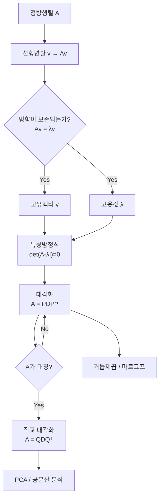

# 4강. AI를 위한 수학의 응용: 고윳값과 고유벡터 — 행렬의 본질을 파헤치다

## 🔗 선수 지식 (Prerequisites)
- [ ] **필수**: [3강. 행렬과 선형변환](3강.md) - 행렬의 곱셈, 역행렬, 선형변환 이해 완료?
- [ ] **권장**: [2강. 벡터와 벡터공간](2강.md) - 벡터의 노름, 내적, 직교
- [ ] **권장**: 행렬식(determinant) 계산법
- **관련 단원**: [5강. 고윳값 분해의 응용(예정)](5강.md), [6강. 특이값 분해 SVD(예정)](6강.md)

---

## 학습 목표
1. 고윳값과 고유벡터의 개념을 이해하고, 이를 계산하여 행렬이 공간에 미치는 영향을 해석할 수 있다.
2. 고윳값 분해를 통해 행렬의 구조를 분석하고, 대칭행렬의 경우 직교하는 고유벡터를 이용한 좌표 변환과 선형변환의 단순화를 설명할 수 있다.

---

## 🧠 메타인지 체크 (학습 전/후 자기 평가)

### 학습 전 자기 평가
| 소주제 | 자신감 (1-5) |
| :--- | :--- |
| 고윳값·고유벡터의 정의와 기하적 의미 | |
| 특성방정식을 이용한 고윳값 계산 | |
| $(A-\lambda I)\mathbf{v}=\mathbf{0}$로 고유벡터 구하기 | |
| 고윳값 분해 $A=PDP^{-1}$ | |
| 대칭행렬의 직교 분해 $A=QDQ^{T}$ | |

### 학습 후 교정 (학습 완료 후 작성)
| 소주제 | 학습 전 | 학습 후 | 실제 정답률 | 과신/과소 여부 |
| :--- | :--- | :--- | :--- | :--- |
| 고윳값·고유벡터의 정의와 기하적 의미 | | | | |
| 특성방정식을 이용한 고윳값 계산 | | | | |
| 고유벡터 계산과 정규화 | | | | |
| 고윳값 분해 $A=PDP^{-1}$ | | | | |
| 대칭행렬의 직교 분해 $A=QDQ^{T}$ | | | | |

> **활용법**: 학습 전 1분 → 자신감 기입, 학습 후 1분 → 나머지 기입. "과신" 영역이 실제 취약점.

---

## 📝 요약 (Summary)

### 고윳값과 고유벡터의 개념 🔴
1. **기하적 의미**: 행렬을 선형변환으로 볼 때, 고유벡터는 선형변환 후에도 **방향이 유지되는 벡터**, 고윳값은 그 방향에서의 **스케일 변화율**을 나타낸다. 🔴
2. **정의식**: 정방행렬 $A$, 영이 아닌 벡터 $\mathbf{v}$, 스칼라 $\lambda$에 대해 $A\mathbf{v}=\lambda\mathbf{v}$가 성립할 때 $\lambda$를 고윳값, $\mathbf{v}$를 고유벡터라 한다. 🔴
3. **0벡터 제외**: 고유벡터는 정의상 $\mathbf{v}\neq\mathbf{0}$이어야 한다(0벡터는 항상 $A\mathbf{0}=\mathbf{0}$이므로 의미 없음). 🟡

### 고윳값·고유벡터의 계산 🔴
4. **특성방정식**: 고윳값은 $\det(A-\lambda I)=0$의 해이다. 🔴
5. **고유벡터 계산**: 각 고윳값 $\lambda$에 대해 $(A-\lambda I)\mathbf{v}=\mathbf{0}$의 비자명해(non-trivial solution)를 구한다. 🔴
6. **정규화**: 해석을 위해 $\hat{\mathbf{v}}=\dfrac{\mathbf{v}}{\|\mathbf{v}\|}$로 단위벡터화하여 방향 성분만 남긴다. 🟡

### 고윳값 분해(Eigendecomposition) 🔴
7. **분해식**: $n$개의 선형독립 고유벡터를 가지면 $A=PDP^{-1}$로 분해된다($P$는 고유벡터 열행렬, $D$는 고윳값 대각행렬). 🔴
8. **대각화 가능 조건**: 행렬 $A$가 $n$개의 선형독립인 고유벡터를 가져야 대각화 가능하다. 🟡
9. **거듭제곱 계산**: 분해를 이용하면 $A^k=PD^kP^{-1}$로 거듭제곱을 빠르게 계산할 수 있다. 🟢

### 대칭행렬의 성질 🔴
10. **직교성**: 대칭행렬에서 서로 다른 고윳값에 대응하는 고유벡터들은 서로 **직교**한다. 🔴
11. **스펙트럼 정리(Spectral Theorem)**: 실대칭행렬은 항상 직교행렬로 대각화 가능하다: $A=QDQ^{T}$. 🔴
12. **계산상의 이점**: $Q^{-1}=Q^{T}$이므로 역행렬 계산이 불필요하다. 🟡

---

## 📐 핵심 수식 (Key Formulas)

| 수식명 | 수식 | 의미 |
| :--- | :--- | :--- |
| **고윳값/고유벡터 정의** | $A\mathbf{v}=\lambda\mathbf{v}$ | 변환 후에도 방향이 유지되는 벡터와 그 스케일 |
| **특성방정식** | $\det(A-\lambda I)=0$ | 고윳값을 구하는 다항방정식 |
| **고유벡터 방정식** | $(A-\lambda I)\mathbf{v}=\mathbf{0}$ | 각 $\lambda$에 대응하는 고유벡터의 영공간 |
| **정규화** | $\hat{\mathbf{v}}=\mathbf{v}/\|\mathbf{v}\|$ | 단위벡터로 변환(방향 정보만 보존) |
| **고윳값 분해** | $A=PDP^{-1}$ | 일반 대각화 가능한 행렬의 분해 |
| **대칭행렬 분해** | $A=QDQ^{T}$ | 실대칭행렬의 직교 분해(스펙트럼 정리) |
| **고윳값의 합(trace)** | $\sum_{i}\lambda_i=\operatorname{tr}(A)$ | 고윳값의 합 = 대각성분의 합 |
| **고윳값의 곱(det)** | $\prod_{i}\lambda_i=\det(A)$ | 고윳값의 곱 = 행렬식 |

### 주요 정리/정의

**[정리 1] 특성방정식의 도출**

$A\mathbf{v}=\lambda\mathbf{v}$에서 $\mathbf{v}\neq\mathbf{0}$인 해가 존재하려면

$$
(A-\lambda I)\mathbf{v}=\mathbf{0} \;\;\Longleftrightarrow\;\; \det(A-\lambda I)=0
$$

> **직관적 해석**: $(A-\lambda I)$가 가역이면 유일해 $\mathbf{v}=\mathbf{0}$만 존재. 비자명해가 있으려면 비가역, 즉 $\det=0$이어야 한다.
> **AI 적용**: PCA에서 공분산행렬의 고윳값을 구할 때 정확히 이 방정식을 푼다.

**[정리 2] 대칭행렬의 직교 대각화 (Spectral Theorem)**

$A=A^{T}$인 실대칭행렬은 다음을 만족하는 직교행렬 $Q$와 실수 대각행렬 $D$가 존재한다.

$$
A=QDQ^{T},\quad Q^{T}Q=QQ^{T}=I,\quad D=\operatorname{diag}(\lambda_1,\dots,\lambda_n)
$$

> **직관적 해석**: 대칭행렬은 "회전 → 축별 스케일링 → 역회전" 구조의 변환이다. 좌표축을 적절히 돌리면 순수한 스케일링만 남는다.
> **AI 적용**: PCA의 공분산행렬, 가우시안 분포의 공분산, 그래프 라플라시안 등이 모두 이 분해를 활용한다.

**[정리 3] 고윳값 분해를 이용한 거듭제곱**

$A=PDP^{-1}$이면

$$
A^{k}=PD^{k}P^{-1},\quad D^{k}=\operatorname{diag}(\lambda_1^{k},\dots,\lambda_n^{k})
$$

> **직관적 해석**: 행렬 거듭제곱은 비싸지만, 대각행렬 거듭제곱은 각 성분을 $k$제곱하면 끝이다.
> **AI 적용**: 마르코프 체인의 정상상태 계산, RNN의 장기 의존성 분석(고윳값 절댓값이 1보다 크면 폭주, 작으면 소실).

> ⚠️ **흔한 오해**
> - **"$\det(A+B)=\det A+\det B$이다."** — 거짓. 행렬식은 합에 대해 선형이 아니다. 예: $A=B=I_2$이면 $\det(A+B)=\det(2I)=4$이지만 $\det A+\det B=1+1=2$. 곱셈에 대해서만 $\det(AB)=\det A\,\det B$가 성립한다.
> - **"고윳값의 합·곱 공식은 대각화 가능할 때만 성립한다."** — 거짓. $\operatorname{tr}(A)=\sum\lambda_i$, $\det(A)=\prod\lambda_i$는 **모든** 정방행렬에서 성립한다(중근·복소근을 중복도까지 세면 됨). 대각화 가능 여부와 무관하다.
> - **"고윳값이 0이면 고유벡터도 0이다."** — 거짓. $\lambda=0$인 고유벡터는 $A\mathbf{v}=\mathbf{0}$을 만족하는 **영공간의 0이 아닌 벡터**다. 고윳값만 0일 뿐 고유벡터는 여전히 $\mathbf{v}\neq\mathbf{0}$이다.

**[예제] 고윳값 분해 $A=PDP^{-1}$ 손 계산**

$A=\begin{pmatrix}2&1\\1&2\end{pmatrix}$를 직접 분해해 보자.

1. **특성방정식**: $\det(A-\lambda I)=(2-\lambda)^2-1=\lambda^2-4\lambda+3=(\lambda-1)(\lambda-3)=0 \Rightarrow \lambda=1,3$.
2. **고유벡터**:
   - $\lambda=3$: $(A-3I)\mathbf{v}=\begin{pmatrix}-1&1\\1&-1\end{pmatrix}\mathbf{v}=\mathbf{0}\Rightarrow \mathbf{v}_1=(1,1)^T$.
   - $\lambda=1$: $(A-I)\mathbf{v}=\begin{pmatrix}1&1\\1&1\end{pmatrix}\mathbf{v}=\mathbf{0}\Rightarrow \mathbf{v}_2=(1,-1)^T$.
3. **분해 구성**: $P=\begin{pmatrix}1&1\\1&-1\end{pmatrix},\ D=\begin{pmatrix}3&0\\0&1\end{pmatrix}$.
4. **거듭제곱 응용**: $A^{10}=PD^{10}P^{-1}$. $P^{-1}=\frac12\begin{pmatrix}1&1\\1&-1\end{pmatrix}$이므로

$$
A^{10}=\frac12\begin{pmatrix}1&1\\1&-1\end{pmatrix}\begin{pmatrix}3^{10}&0\\0&1\end{pmatrix}\begin{pmatrix}1&1\\1&-1\end{pmatrix}=\frac12\begin{pmatrix}3^{10}+1&3^{10}-1\\3^{10}-1&3^{10}+1\end{pmatrix}.
$$

> 대칭행렬이므로 두 고유벡터 $(1,1)^T,(1,-1)^T$는 자동으로 직교한다(내적 $=0$). 정규화하면 $Q=\tfrac{1}{\sqrt2}\begin{pmatrix}1&1\\1&-1\end{pmatrix}$로 $A=QDQ^T$ 형태가 된다.

---

## 📊 개념 시각화 (Visual Guide)

### 개념 관계도


### 핵심 도식: 선형변환 후의 벡터 거동

| 벡터 종류 | 변환 후 모습 | 수식 | AI 적용 |
| :--- | :--- | :--- | :--- |
| **일반 벡터** | 방향과 크기 모두 변화 | $A\mathbf{x}=\mathbf{y}$ | 임의의 입력 변환 |
| **고유벡터** | 방향 유지, 크기만 $\lambda$배 | $A\mathbf{v}=\lambda\mathbf{v}$ | PCA의 주성분 축 |
| **$\lambda=1$ 고유벡터** | 변화 없음(불변) | $A\mathbf{v}=\mathbf{v}$ | 마르코프 정상분포 |
| **$\lambda=0$ 고유벡터** | 0벡터로 붕괴(영공간) | $A\mathbf{v}=\mathbf{0}$ | 특이행렬 검출 |
| **$|\lambda|>1$** | 방향 유지, 길이 증폭 | — | RNN 그래디언트 폭주 |
| **$|\lambda|<1$** | 방향 유지, 길이 수축 | — | RNN 그래디언트 소실 |

### 직교 대각화의 기하적 의미


---

## ✏️ 심화 학습 (Study Subject)

### 1. 가상 시나리오: "어떤 개념을, 언제 사용해야 할까?"
- **상황**: 한 머신러닝 엔지니어가 1000차원의 이미지 특징 벡터들에 PCA를 적용하여 차원을 축소하려 한다. 공분산행렬 $\Sigma\in\mathbb{R}^{1000\times1000}$을 계산한 후, 어느 방향이 가장 큰 분산을 가지는지 찾아야 한다.
- **문제**: 공분산행렬은 대칭행렬이다. 어떤 수학적 도구로 분산이 가장 큰 축을 찾을 수 있을까? 또한, 왜 그 축들이 서로 직교한다고 보장할 수 있는가?
- **해결**:
  1. **고윳값 분해 적용**: $\Sigma$가 실대칭이므로 스펙트럼 정리에 의해 $\Sigma=QDQ^{T}$로 직교 분해된다.
  2. **물리적 해석**: $D=\operatorname{diag}(\lambda_1,\dots,\lambda_{1000})$의 각 $\lambda_i$는 $i$번째 주성분 방향의 **분산값**이고, $Q$의 열벡터는 **주성분 축**이다.
  3. **차원 축소**: 가장 큰 $k$개의 $\lambda$에 대응하는 고유벡터로 $Q_k$를 구성하면 $\mathbf{z}=Q_k^{T}\mathbf{x}$로 $k$차원으로 압축한다.
  4. **직교성 보장**: 대칭행렬의 서로 다른 고윳값에 대응하는 고유벡터는 정리에 의해 자동으로 직교하므로 주성분 축들은 항상 수직이다.
- **AI 학습 포인트**: "PCA에서 만약 데이터의 공분산행렬이 대칭이 아니라면(예: 비정방행렬에서 출발) 어떤 분해를 사용해야 하는가? 그 분해(SVD)와 고윳값 분해의 관계를 설명해 줘."

### 2. 관점별 비교 및 오개념 분석

- **핵심 비교**: 일반 고윳값 분해 vs 직교 대각화, 고윳값 vs 특이값, 대각화 가능 vs 불가능

| 혼동 쌍 | 차이점의 핵심 |
| :--- | :--- |
| **$A=PDP^{-1}$ vs $A=QDQ^{T}$** | 전자는 임의 대각화 가능 행렬에 적용. 후자는 **실대칭행렬**에서만 성립하며 $P$가 직교행렬($P^{-1}=P^{T}$)로 강화됨 |
| **고윳값 vs 특이값** | 고윳값: 정방행렬, 부호·복소수 가능. 특이값: 임의 $m\times n$ 행렬, 항상 비음실수. 대칭양정치 행렬에서는 두 값이 일치 |
| **대각화 가능 vs 불가능** | 대각화 가능: $n$개의 선형독립 고유벡터 존재. 불가능 예: $\begin{pmatrix}1&1\\0&1\end{pmatrix}$ (고윳값 1 중근, 고유벡터 1개뿐) |
| **특성방정식 vs 최소다항식** | 특성방정식은 $\det(A-\lambda I)=0$. 최소다항식은 그 인수 중 $A$를 소거하는 최소 차수 다항식 |

- **오개념 분석**:
    - **오개념 1**: "모든 행렬은 대각화할 수 있다."
    - **분석**: 거짓. $A=\begin{pmatrix}1&1\\0&1\end{pmatrix}$의 특성방정식은 $(1-\lambda)^2=0$이라 $\lambda=1$ 중근. 그러나 $(A-I)\mathbf{v}=\mathbf{0}$의 해공간은 1차원($\mathbf{v}=(1,0)^T$)뿐이므로 선형독립 고유벡터가 2개 필요하지만 1개만 있어 대각화 불가. 이런 행렬은 Jordan 표준형으로 분해한다.
    - **오개념 2**: "고유벡터는 유일하게 결정된다."
    - **분석**: 거짓. $A\mathbf{v}=\lambda\mathbf{v}$에서 $A(c\mathbf{v})=\lambda(c\mathbf{v})$도 성립하므로 임의의 $c\neq 0$ 스칼라배도 고유벡터. 따라서 **방향만 유일**하고, 관례적으로 $\|\mathbf{v}\|=1$로 정규화하여 표준화한다. 또한 같은 고윳값에 대해 고유공간(eigenspace) 자체가 2차원 이상이면 기저 선택도 자유롭다.
    - **오개념 3**: "대칭행렬이 아니어도 고윳값이 다르면 고유벡터가 직교한다."
    - **분석**: 거짓. 직교성 보장은 **실대칭행렬**의 특별한 성질이다. 일반 행렬의 예: $A=\begin{pmatrix}1&1\\0&2\end{pmatrix}$의 고윳값은 1, 2이고 고유벡터는 $(1,0)^T, (1,1)^T$ — 내적이 1이라 직교하지 않는다.
    - **오개념 4**: "특성방정식의 해가 곧 고유벡터다."
    - **분석**: 거짓. 특성방정식의 해는 **고윳값**(스칼라)이다. 고유벡터는 각 고윳값을 대입하여 $(A-\lambda I)\mathbf{v}=\mathbf{0}$을 따로 풀어 얻는 벡터다.
- **AI 학습 포인트**: "만약 행렬의 고윳값이 복소수로 나오면, 그 행렬은 어떤 기하학적 변환을 의미하는가? 회전행렬과 연결지어 설명해 줘."

---

## ❓ 연습 문제 및 해설

> **블룸 인지 수준 범례**: [기억] 정의·나열 → [이해] 설명·비교 → [적용] 계산·구현 → [분석] 구별·디버그 → [평가] 판단·비평 → [창조] 설계·제안

### 📝 문제

**1. 📌 ⭐ [기억] 고윳값과 고유벡터의 정의식으로 옳은 것은? (단, $\mathbf{v}\neq\mathbf{0}$)(#prob-1)**
   > ① $A\mathbf{v}=\lambda$
   > ② $A\mathbf{v}=\lambda\mathbf{v}$
   > ③ $A\lambda=\mathbf{v}$
   > ④ $\lambda A=\mathbf{v}$

<br>

**2. 📌 ⭐ [기억] 고윳값을 구하는 방정식으로 옳은 것은?(#prob-2)**
   > ① $\det(A+\lambda I)=0$
   > ② $\det(A-\lambda I)=0$
   > ③ $\det(A)-\lambda=0$
   > ④ $A-\lambda I=0$

<br>

**3. 📌 ⭐⭐ [적용] 행렬 $A=\begin{pmatrix}2&0\\0&3\end{pmatrix}$의 고윳값을 모두 구하시오.(#prob-3)**
   > ① 0, 1
   > ② 2, 3
   > ③ 1, 5
   > ④ -2, -3

<br>

**4. 📌 ⭐⭐ [적용] 행렬 $A=\begin{pmatrix}4&1\\2&3\end{pmatrix}$의 고윳값을 모두 구하시오.(#prob-4)**
   > ① 1, 6
   > ② 2, 5
   > ③ 3, 4
   > ④ -1, -6

<br>

**5. 📌 ⭐⭐ [이해] 다음 중 옳은 설명을 모두 고르시오.(#prob-5)**
   > <보기>
   >
   > 가. 고유벡터는 영벡터가 될 수 없다.
   > 나. 고유벡터에 스칼라를 곱한 벡터도 같은 고윳값의 고유벡터이다.
   > 다. 모든 정방행렬은 대각화 가능하다.
   > 라. 고윳값의 합은 행렬의 대각합(trace)과 같다.

   > ① 가, 나
   > ② 가, 나, 다
   > ③ 가, 나, 라
   > ④ 가, 나, 다, 라

<br>

**6. 📌 ⭐⭐ [적용] 행렬 $A=\begin{pmatrix}3&1\\1&3\end{pmatrix}$의 고윳값 $\lambda=4$에 대응하는 정규화된 고유벡터로 옳은 것은?(#prob-6)**
   > ① $\begin{pmatrix}1\\0\end{pmatrix}$
   > ② $\dfrac{1}{\sqrt{2}}\begin{pmatrix}1\\1\end{pmatrix}$
   > ③ $\dfrac{1}{\sqrt{2}}\begin{pmatrix}1\\-1\end{pmatrix}$
   > ④ $\begin{pmatrix}0\\1\end{pmatrix}$

<br>

**7. 📌 ⭐⭐ [이해] 실대칭행렬에 대한 설명으로 옳지 않은 것은?(#prob-7)**
   > ① 모든 고윳값이 실수이다.
   > ② 서로 다른 고윳값에 대응하는 고유벡터는 직교한다.
   > ③ 항상 직교행렬로 대각화 가능하다($A=QDQ^{T}$).
   > ④ 고윳값이 항상 양수이다.

<br>

**8. 📌 ⭐⭐⭐ [분석] 행렬 $A=\begin{pmatrix}1&1\\0&1\end{pmatrix}$에 대한 설명으로 옳은 것은?(#prob-8)**
   > ① 서로 다른 두 고윳값을 가진다.
   > ② 고윳값 1이 중근이며, 선형독립 고유벡터 2개를 가지므로 대각화 가능하다.
   > ③ 고윳값 1이 중근이며, 선형독립 고유벡터가 1개뿐이라 대각화 불가능하다.
   > ④ 대칭행렬이므로 직교 대각화 가능하다.

<br>

**9. 📌 ⭐⭐⭐ [평가] 행렬 $A=\begin{pmatrix}2&1\\1&2\end{pmatrix}$의 고윳값 분해 $A=QDQ^{T}$에서 $D$로 옳은 것은?(#prob-9)**
   > ① $\begin{pmatrix}1&0\\0&3\end{pmatrix}$
   > ② $\begin{pmatrix}2&0\\0&2\end{pmatrix}$
   > ③ $\begin{pmatrix}3&0\\0&1\end{pmatrix}$
   > ④ $\begin{pmatrix}0&1\\3&0\end{pmatrix}$

<br>

**10. 📌 ⭐⭐⭐ [창조] 어떤 머신러닝 엔지니어가 RNN을 학습시키는데, 가중치 행렬 $W$의 가장 큰 고윳값의 절댓값(spectral radius)이 1.5로 측정되었다. 이 모델의 동작에 대한 예측으로 가장 적절한 것은?(#prob-10)**
   > ① 시간 스텝이 증가해도 신호가 안정적으로 유지된다.
   > ② 시간 스텝이 증가하면서 신호가 점점 0으로 수렴한다(그래디언트 소실).
   > ③ 시간 스텝이 증가하면서 신호가 폭발적으로 증가한다(그래디언트 폭주).
   > ④ 고윳값과 RNN의 안정성은 무관하다.

---

### 🔑 정답 및 해설 (먼저 풀어본 후 펼치기)

<details>
<summary>정답 보기 (클릭)</summary>

1. ②
2. ②
3. ②
4. ②
5. ③
6. ②
7. ④
8. ③
9. ③
10. ③

</details>

<details>
<summary>해설 보기 (클릭)</summary>

<a id="prob-1"></a>
**1. ⭐ [기억] 고윳값/고유벡터의 정의**
> **정답: ② $A\mathbf{v}=\lambda\mathbf{v}$**
> **해설**: 정의에 의해 정방행렬 $A$가 영이 아닌 벡터 $\mathbf{v}$에 작용했을 때 스칼라배($\lambda\mathbf{v}$)가 되는 관계가 고윳값/고유벡터 관계다.

<a id="prob-2"></a>
**2. ⭐ [기억] 특성방정식**
> **정답: ② $\det(A-\lambda I)=0$**
> **해설**: $A\mathbf{v}=\lambda\mathbf{v} \Rightarrow (A-\lambda I)\mathbf{v}=\mathbf{0}$. $\mathbf{v}\neq\mathbf{0}$인 해가 존재하려면 $(A-\lambda I)$가 비가역, 즉 $\det(A-\lambda I)=0$이어야 한다.

<a id="prob-3"></a>
**3. ⭐⭐ [적용] 대각행렬의 고윳값**
> **정답: ② 2, 3**
> **해설**: 대각행렬은 대각성분이 그대로 고윳값이다. $\det\begin{pmatrix}2-\lambda&0\\0&3-\lambda\end{pmatrix}=(2-\lambda)(3-\lambda)=0 \Rightarrow \lambda=2,3$.

<a id="prob-4"></a>
**4. ⭐⭐ [적용] 2×2 행렬의 고윳값**
> **정답: ② 2, 5**
> **해설**: $\det(A-\lambda I)=\det\begin{pmatrix}4-\lambda&1\\2&3-\lambda\end{pmatrix}=(4-\lambda)(3-\lambda)-2=\lambda^2-7\lambda+10=(\lambda-2)(\lambda-5)=0$. 따라서 $\lambda=2,5$. 검산: 대각합 $4+3=7=2+5$, 행렬식 $4\cdot3-1\cdot2=10=2\cdot5$ ✓.

<a id="prob-5"></a>
**5. ⭐⭐ [이해] 고윳값 관련 옳은 설명**
> **정답: ③ 가, 나, 라**
> **해설**:
> - 가 ○: 정의상 $\mathbf{v}\neq\mathbf{0}$.
> - 나 ○: $A(c\mathbf{v})=cA\mathbf{v}=c\lambda\mathbf{v}=\lambda(c\mathbf{v})$.
> - 다 ✗: 선형독립 고유벡터가 부족한 행렬(예: 문제 8의 $A$)은 대각화 불가.
> - 라 ○: $\sum\lambda_i=\operatorname{tr}(A)$는 일반적으로 성립.

<a id="prob-6"></a>
**6. ⭐⭐ [적용] 고유벡터 계산과 정규화**
> **정답: ② $\dfrac{1}{\sqrt{2}}\begin{pmatrix}1\\1\end{pmatrix}$**
> **해설**: $(A-4I)\mathbf{v}=\begin{pmatrix}-1&1\\1&-1\end{pmatrix}\mathbf{v}=\mathbf{0} \Rightarrow -v_1+v_2=0 \Rightarrow v_1=v_2$. 따라서 $\mathbf{v}=(1,1)^T$, 노름 $\sqrt{2}$로 나누면 ②.

<a id="prob-7"></a>
**7. ⭐⭐ [이해] 실대칭행렬의 성질**
> **정답: ④ 고윳값이 항상 양수이다.**
> **해설**: 실대칭행렬은 ①②③의 성질을 갖지만, 고윳값의 부호는 일반적으로 결정되지 않는다. 예: $A=\begin{pmatrix}-1&0\\0&-1\end{pmatrix}$은 대칭이지만 고윳값이 -1. 모든 고윳값이 양수인 것은 **양정치(positive definite)** 대칭행렬의 추가 조건이다.

<a id="prob-8"></a>
**8. ⭐⭐⭐ [분석] 대각화 불가능 행렬**
> **정답: ③ 고윳값 1이 중근이며, 선형독립 고유벡터가 1개뿐이라 대각화 불가능하다.**
> **해설**: 특성다항식 $(1-\lambda)^2=0 \Rightarrow \lambda=1$ 중근. $(A-I)\mathbf{v}=\begin{pmatrix}0&1\\0&0\end{pmatrix}\mathbf{v}=\mathbf{0} \Rightarrow v_2=0$. 해공간은 $\mathbf{v}=(1,0)^T$ 1차원뿐. 2×2 행렬을 대각화하려면 선형독립 고유벡터 2개가 필요하므로 불가능. ④는 $A\neq A^T$이므로 대칭도 아니다.

<a id="prob-9"></a>
**9. ⭐⭐⭐ [평가] 대칭행렬 분해의 $D$**
> **정답: ③ $\begin{pmatrix}3&0\\0&1\end{pmatrix}$**
> **해설**: $\det(A-\lambda I)=(2-\lambda)^2-1=\lambda^2-4\lambda+3=(\lambda-1)(\lambda-3)=0 \Rightarrow \lambda=1,3$. $D$는 고윳값을 대각에 놓은 행렬이므로 ③(순서는 관례). 검산: $\operatorname{tr}(A)=4=1+3$, $\det(A)=3=1\cdot3$ ✓.

<a id="prob-10"></a>
**10. ⭐⭐⭐ [창조] RNN의 spectral radius와 그래디언트**
> **정답: ③ 시간 스텝이 증가하면서 신호가 폭발적으로 증가한다(그래디언트 폭주).**
> **해설**: RNN은 시간 스텝마다 $\mathbf{h}_{t+1}=W\mathbf{h}_t+\cdots$로 진행되어 $W^t\mathbf{h}_0$ 항이 등장. 고윳값 분해 $W=PDP^{-1}$이면 $W^t=PD^tP^{-1}$, $D^t$의 성분은 $\lambda_i^t$. 가장 큰 $|\lambda|=1.5>1$이면 $1.5^t\to\infty$로 폭주. $|\lambda|<1$이면 소실, $|\lambda|=1$이면 안정. 이것이 LSTM, gradient clipping이 필요한 이유다.

</details>

---

## ✅ O/X 확인문제 (총 20문항)

**1.** 고유벡터는 정의상 영벡터를 포함한다.(#ox-1) **(O / X)**
**2.** $A\mathbf{v}=\lambda\mathbf{v}$에서 $\lambda$는 스칼라이고 $\mathbf{v}$는 벡터이다.(#ox-2) **(O / X)**
**3.** 특성방정식은 $\det(A-\lambda I)=0$이다.(#ox-3) **(O / X)**
**4.** 고윳값은 $(A-\lambda I)\mathbf{v}=\mathbf{0}$을 풀어서 얻는다.(#ox-4) **(O / X)**
**5.** 대각행렬의 고윳값은 대각성분과 같다.(#ox-5) **(O / X)**
**6.** $n\times n$ 행렬은 항상 $n$개의 서로 다른 고윳값을 가진다.(#ox-6) **(O / X)**
**7.** 고유벡터에 0이 아닌 스칼라를 곱한 벡터도 같은 고윳값에 대한 고유벡터이다.(#ox-7) **(O / X)**
**8.** 정규화된 고유벡터의 노름은 1이다.(#ox-8) **(O / X)**
**9.** 모든 정방행렬은 대각화 가능하다.(#ox-9) **(O / X)**
**10.** 고윳값 분해 $A=PDP^{-1}$에서 $D$는 대각행렬, $P$는 고유벡터들을 열로 모은 행렬이다.(#ox-10) **(O / X)**
**11.** 고윳값의 합은 행렬의 대각합(trace)과 같다.(#ox-11) **(O / X)**
**12.** 고윳값의 곱은 행렬식과 같다.(#ox-12) **(O / X)**
**13.** 실대칭행렬의 고윳값은 모두 실수이다.(#ox-13) **(O / X)**
**14.** 실대칭행렬의 서로 다른 고윳값에 대응하는 고유벡터는 항상 직교한다.(#ox-14) **(O / X)**
**15.** 실대칭행렬은 항상 직교행렬 $Q$로 $A=QDQ^{T}$ 분해가 가능하다.(#ox-15) **(O / X)**
**16.** 직교행렬 $Q$는 $Q^{-1}=Q^{T}$를 만족한다.(#ox-16) **(O / X)**
**17.** 대각화 가능한 행렬 $A$에 대해 $A^{k}=PD^{k}P^{-1}$이다.(#ox-17) **(O / X)**
**18.** 고윳값이 0이면 그 행렬은 비가역(singular)이다.(#ox-18) **(O / X)**
**19.** 비대칭 행렬에서도 서로 다른 고윳값을 가지면 고유벡터는 직교한다.(#ox-19) **(O / X)**
**20.** 행렬의 고윳값이 모두 양수이면 그 행렬은 양정치(positive definite)이다(대칭 가정).(#ox-20) **(O / X)**

<details>
<summary>O/X 정답 및 해설 보기 (클릭)</summary>

> <a id="ox-1"></a>
> **1. 정답**: X
> **해설**: 영벡터는 항상 $A\mathbf{0}=\mathbf{0}=\lambda\mathbf{0}$이라 무의미하므로 정의상 $\mathbf{v}\neq\mathbf{0}$.

> <a id="ox-2"></a>
> **2. 정답**: O
> **해설**: $\lambda$는 스칼라, $\mathbf{v}$는 벡터다.

> <a id="ox-3"></a>
> **3. 정답**: O
> **해설**: 비자명해 존재 조건에서 도출되는 특성방정식.

> <a id="ox-4"></a>
> **4. 정답**: X
> **해설**: 그 식은 **고유벡터**를 구하는 식. 고윳값은 $\det(A-\lambda I)=0$으로 구한다.

> <a id="ox-5"></a>
> **5. 정답**: O
> **해설**: 대각행렬은 $\det(D-\lambda I)=\prod(d_{ii}-\lambda)=0$이므로 대각성분이 고윳값.

> <a id="ox-6"></a>
> **6. 정답**: X
> **해설**: 중근이 존재할 수 있다. 예: $I_n$의 고윳값은 1 하나뿐(n중근).

> <a id="ox-7"></a>
> **7. 정답**: O
> **해설**: $A(c\mathbf{v})=cA\mathbf{v}=c\lambda\mathbf{v}=\lambda(c\mathbf{v})$.

> <a id="ox-8"></a>
> **8. 정답**: O
> **해설**: 정규화의 정의 $\hat{\mathbf{v}}=\mathbf{v}/\|\mathbf{v}\|$.

> <a id="ox-9"></a>
> **9. 정답**: X
> **해설**: 선형독립 고유벡터가 $n$개 미만이면 대각화 불가(Jordan 표준형 필요).

> <a id="ox-10"></a>
> **10. 정답**: O
> **해설**: $AP=PD$에서 $P$의 각 열이 고유벡터, $D$의 대각이 고윳값.

> <a id="ox-11"></a>
> **11. 정답**: O
> **해설**: $\operatorname{tr}(A)=\sum\lambda_i$는 일반적 성질.

> <a id="ox-12"></a>
> **12. 정답**: O
> **해설**: $\det(A)=\prod\lambda_i$.

> <a id="ox-13"></a>
> **13. 정답**: O
> **해설**: 스펙트럼 정리의 부분 결론.

> <a id="ox-14"></a>
> **14. 정답**: O
> **해설**: 대칭행렬의 핵심 성질이며 PCA의 주성분 직교성을 보장.

> <a id="ox-15"></a>
> **15. 정답**: O
> **해설**: 스펙트럼 정리.

> <a id="ox-16"></a>
> **16. 정답**: O
> **해설**: 직교행렬의 정의: $Q^{T}Q=I$.

> <a id="ox-17"></a>
> **17. 정답**: O
> **해설**: $A^k=(PDP^{-1})^k=PD^kP^{-1}$.

> <a id="ox-18"></a>
> **18. 정답**: O
> **해설**: $\det(A)=\prod\lambda_i$이므로 어떤 $\lambda=0$이면 $\det(A)=0$, 즉 비가역.

> <a id="ox-19"></a>
> **19. 정답**: X
> **해설**: 직교성 보장은 대칭행렬 한정. 비대칭은 일반적으로 비직교.

> <a id="ox-20"></a>
> **20. 정답**: O
> **해설**: 양정치 대칭행렬의 동치 조건 중 하나가 모든 고윳값 > 0이다.

</details>

---

## 🧪 자유 회상 연습 (Free Recall)

> **방법**: 위의 노트를 모두 덮고, 타이머 3분 설정 후 이번 단원에서 배운 내용을 기억나는 대로 자유롭게 적으세요.
> 정확한 문장이 아니어도 됩니다. 키워드, 수식, 관계 등 떠오르는 것을 모두 적습니다.

**자유 회상 작성란:**

```
[여기에 기억나는 내용을 자유롭게 작성]


```

> **회상 후 점검**: 노트를 다시 펼쳐 빠뜨린 내용을 확인하세요. 빠뜨린 부분이 실제 취약점입니다.
> - 회상 못한 핵심 개념: [                ]
> - 회상 못한 수식: [                ]

---

## 💻 코드로 확인하기 (Code Verification)

### 예시 1: 일반 행렬의 고윳값/고유벡터 계산과 분해 검증
```python
import numpy as np

# 일반 행렬 (비대칭)
A = np.array([[4, 1],
              [2, 3]], dtype=float)

eigvals, eigvecs = np.linalg.eig(A)
print("고윳값:", eigvals)                # 예: [5. 2.]
print("고유벡터(열 단위):\n", eigvecs)    # 각 열이 정규화된 고유벡터

# 정의식 검증: A v = λ v
for i, lam in enumerate(eigvals):
    v = eigvecs[:, i]
    lhs, rhs = A @ v, lam * v
    print(f"λ={lam:.4f}: ||Av - λv|| = {np.linalg.norm(lhs - rhs):.2e}")

# 고윳값 분해 검증: A = P D P^{-1}
P = eigvecs
D = np.diag(eigvals)
A_reconstructed = P @ D @ np.linalg.inv(P)
print("재구성 오차:", np.linalg.norm(A - A_reconstructed))
```

> **실행 결과 (예시)**:
> ```
> 고윳값: [5. 2.]
> 고유벡터(열 단위):
>  [[ 0.7071 -0.4472]
>   [ 0.7071  0.8944]]
> λ=5.0000: ||Av - λv|| = 1.11e-16
> λ=2.0000: ||Av - λv|| = 0.00e+00
> 재구성 오차: 8.88e-16
> ```
> **수학적 해석**: numpy가 반환하는 고유벡터는 자동으로 단위벡터화되어 있다. 두 고윳값이 5, 2이고 trace(=7)·det(=10)와 일치(4+3=7, 4×3-1×2=10 ✓). 분해식 $A=PDP^{-1}$이 수치오차 범위에서 정확히 재구성됨을 확인.

### 예시 2: 대칭행렬의 직교 분해 ($A=QDQ^{T}$)
```python
import numpy as np

# 대칭행렬
A = np.array([[3, 1],
              [1, 3]], dtype=float)
print("대칭 확인:", np.allclose(A, A.T))

# 대칭행렬 전용 함수 eigh: 실수 고윳값을 오름차순 반환, Q는 직교행렬
eigvals, Q = np.linalg.eigh(A)
print("고윳값:", eigvals)        # [2. 4.]
print("Q (직교):\n", Q)

# Q가 직교행렬인지 확인: Q^T Q = I
print("Q^T Q =\n", Q.T @ Q)

# 분해 검증: A = Q D Q^T
D = np.diag(eigvals)
A_reconstructed = Q @ D @ Q.T
print("재구성 오차:", np.linalg.norm(A - A_reconstructed))

# 서로 다른 고윳값의 고유벡터 직교성: v1 · v2 = 0
print("고유벡터 내적:", Q[:, 0] @ Q[:, 1])
```

> **실행 결과 (예시)**:
> ```
> 대칭 확인: True
> 고윳값: [2. 4.]
> Q (직교):
>  [[-0.7071  0.7071]
>   [ 0.7071  0.7071]]
> Q^T Q =
>  [[1. 0.]
>   [0. 1.]]
> 재구성 오차: 0.0
> 고유벡터 내적: 0.0
> ```
> **수학적 해석**: 대칭행렬의 분해에서는 일반 `eig` 대신 `eigh`를 써야 한다 — 실수 보장, $Q$가 정확히 직교, 수치적으로 더 안정. 서로 다른 고윳값(2, 4)의 고유벡터 내적이 정확히 0으로 직교성 확인.

### 예시 3: 고윳값 분해를 이용한 거듭제곱 (마르코프 응용)
```python
import numpy as np

# 마르코프 전이행렬 (각 열 합 = 1)
P = np.array([[0.7, 0.3],
              [0.3, 0.7]])

eigvals, V = np.linalg.eig(P)
print("고윳값:", eigvals)   # [1.  0.4]  ← λ=1이 정상상태에 대응

# 분해를 이용한 P^100 계산 (빠름)
D = np.diag(eigvals)
P100_fast = V @ np.diag(eigvals**100) @ np.linalg.inv(V)
print("P^100 (분해):\n", P100_fast)

# 직접 거듭제곱과 비교 (느림)
P100_direct = np.linalg.matrix_power(P, 100)
print("일치 여부:", np.allclose(P100_fast, P100_direct))
```

> **실행 결과 (예시)**:
> ```
> 고윳값: [1.  0.4]
> P^100 (분해):
>  [[0.5 0.5]
>   [0.5 0.5]]
> 일치 여부: True
> ```
> **수학적 해석**: $\lambda=1$ 고윳값에 대응하는 고유벡터가 마르코프 체인의 **정상분포**다. $|\lambda|<1$인 다른 성분은 $0.4^{100}\approx 10^{-40}$로 사라져 정상상태 $[0.5, 0.5]^T$로 수렴.

---

## 🤖 AI 연결고리 (Math → AI Application)

| 수학 개념 | AI/ML 적용 분야 | 구체적 사례 |
| :--- | :--- | :--- |
| 대칭행렬의 직교 분해 | **PCA(주성분 분석)** | 공분산행렬 $\Sigma=Q\Lambda Q^T$, 큰 고윳값 = 큰 분산 방향 |
| 고윳값의 스펙트럼 반지름 | RNN의 안정성 분석 | $|\lambda_{\max}|>1$ → 그래디언트 폭주, $<1$ → 소실 |
| 고윳값 분해 / 거듭제곱 | **PageRank**, 마르코프 정상상태 | $\lambda=1$ 고유벡터 = 정상분포 |
| 양정치 대칭행렬 ($\lambda_i>0$) | 최적화: Hessian 분석 | 모든 $\lambda>0$ → 극소점(convex), 부호 혼합 → 안장점 |
| 라플라시안 행렬의 고윳값 | **스펙트럴 클러스터링**, GNN | 작은 고윳값에 대응하는 고유벡터로 그래프 분할 |
| 고유벡터를 통한 좌표 변환 | **데이터 화이트닝(whitening)** | $\Sigma^{-1/2}$로 곱해 단위 공분산으로 정규화 |
| 고윳값 분해 = SVD(대칭양정치) | **추천 시스템(MF)**, **이미지 압축** | Netflix Prize의 행렬 분해, JPEG의 DCT |
| 커널행렬의 고윳값 | **Kernel PCA**, SVM의 듀얼 | 비선형 특징공간에서의 주성분 |

---

## 📖 심화 학습 예시 답안

#### 1. 고윳값 분해의 기하학적 동작 원리
고윳값 분해 $A=PDP^{-1}$은 **"좌표 변환 → 축별 스케일링 → 좌표 역변환"**의 3단계 분해다.

1. **$P^{-1}$ 적용**: 입력 벡터 $\mathbf{x}$를 표준 좌표계에서 **고유벡터 좌표계**로 변환. $\mathbf{x}'=P^{-1}\mathbf{x}$의 성분은 "$\mathbf{x}$가 각 고유벡터 방향으로 얼마나 있는가"이다.
2. **$D$ 적용**: 고유벡터 좌표계에서 각 축은 서로 독립이므로, $D$가 단순히 $i$번째 성분을 $\lambda_i$배 한다.
3. **$P$ 적용**: 스케일링된 결과를 다시 원래 표준 좌표계로 복원.

> **핵심 통찰**: 일반 행렬 곱셈은 "혼합된 변환"이라 직관이 어렵지만, 고유좌표계로 옮기면 **축별 독립 스케일링**만 남아 분석이 단순해진다. 대칭행렬일 경우 $P^{-1}=P^{T}$로 더욱 단순화된다.

#### 2. 일반 고윳값 분해 vs 직교 분해 비교표

| 구분 | 일반: $A=PDP^{-1}$ | 직교: $A=QDQ^{T}$ | 비고 |
| :--- | :--- | :--- | :--- |
| **적용 대상** | 대각화 가능한 정방행렬 | **실대칭** 행렬 | 직교 분해가 더 강한 조건 |
| **$P/Q$의 성질** | $P$는 일반 가역행렬 | $Q$는 직교행렬 ($Q^TQ=I$) | 직교는 회전+반사만 |
| **역행렬 계산** | $P^{-1}$ 별도 계산 필요 ($O(n^3)$) | $Q^{-1}=Q^{T}$ (계산 불필요) | 수치 안정성 ↑ |
| **고윳값의 종류** | 실수 또는 복소수 | 항상 실수 | |
| **고유벡터의 직교성** | 일반적으로 비직교 | 모두 서로 직교 | PCA의 축 직교성 기반 |
| **AI 활용** | 마르코프 체인, RNN 분석 | **PCA, SVD, 라플라시안** | 직교 분해가 압도적으로 빈번 |

#### 3. NumPy 고윳값 계산 Best Practice

- **Bad Practice (나쁜 예시)**
  ```python
  # 대칭행렬에 일반 eig 사용 — 복소수 결과, 비직교 고유벡터, 느림
  import numpy as np
  A = np.array([[3, 1], [1, 3]], dtype=float)
  eigvals, eigvecs = np.linalg.eig(A)
  # 결과 dtype가 complex128일 수 있음
  # 고유벡터끼리 직교성 보장 안 됨
  ```
- **Good Practice (좋은 예시)**
  ```python
  import numpy as np
  A = np.array([[3, 1], [1, 3]], dtype=float)
  assert np.allclose(A, A.T), "대칭행렬이어야 함"
  eigvals, Q = np.linalg.eigh(A)   # 대칭/에르미트 전용
  # eigvals: 실수, 오름차순
  # Q: 정확한 직교행렬 (Q.T @ Q == I)
  print("정상상태 방향(최대 고윳값):", Q[:, np.argmax(eigvals)])
  ```
- **설명**: `np.linalg.eigh`는 대칭/에르미트 행렬 전용으로 (1) **실수** 결과 보장, (2) 고유벡터가 정확히 **직교**, (3) **수치 안정성** 우수(symmetric QR 알고리즘), (4) 일반 `eig`보다 약 2~3배 빠르다. PCA·공분산 분석에서는 반드시 `eigh`를 사용해야 한다.

---

## 📚 핵심 용어집 (Glossary)

| 용어 (한) | 용어 (영) | 수식 표현 | 정의 |
| :--- | :--- | :--- | :--- |
| **고윳값** | Eigenvalue | $\lambda$ s.t. $A\mathbf{v}=\lambda\mathbf{v}$ | 고유벡터 방향에서의 스케일 변화율(스칼라) |
| **고유벡터** | Eigenvector | $\mathbf{v}\neq\mathbf{0},\ A\mathbf{v}=\lambda\mathbf{v}$ | 선형변환 후 방향이 보존되는 벡터 |
| **특성방정식** | Characteristic equation | $\det(A-\lambda I)=0$ | 고윳값을 해로 갖는 다항방정식 |
| **특성다항식** | Characteristic polynomial | $p(\lambda)=\det(A-\lambda I)$ | $\lambda$에 대한 $n$차 다항식 |
| **고유공간** | Eigenspace | $E_\lambda=\ker(A-\lambda I)$ | 고윳값 $\lambda$에 대응하는 모든 고유벡터의 집합(+0) |
| **고윳값 분해** | Eigendecomposition | $A=PDP^{-1}$ | 행렬을 고유벡터·고윳값으로 분해 |
| **대각화** | Diagonalization | $P^{-1}AP=D$ | 행렬을 대각행렬로 변환하는 과정 |
| **대칭행렬** | Symmetric matrix | $A=A^{T}$ | 전치와 자기 자신이 같은 정방행렬 |
| **직교행렬** | Orthogonal matrix | $Q^{T}Q=I$, $Q^{-1}=Q^{T}$ | 열벡터들이 서로 직교 단위벡터인 행렬 |
| **스펙트럼 정리** | Spectral theorem | $A=QDQ^{T}$ (실대칭) | 실대칭행렬의 직교 대각화 보장 정리 |
| **정규화** | Normalization | $\hat{\mathbf{v}}=\mathbf{v}/\|\mathbf{v}\|$ | 벡터의 크기를 1로 만드는 연산 |
| **대각합** | Trace | $\operatorname{tr}(A)=\sum a_{ii}=\sum\lambda_i$ | 대각성분의 합 = 고윳값의 합 |
| **행렬식** | Determinant | $\det(A)=\prod\lambda_i$ | 행렬의 부피 변환 인수 = 고윳값의 곱 |
| **스펙트럼 반지름** | Spectral radius | $\rho(A)=\max_i|\lambda_i|$ | 고윳값 절댓값의 최댓값 (RNN 안정성 지표) |
| **양정치 행렬** | Positive definite | $A=A^T,\ \lambda_i>0$ | 모든 고윳값이 양수인 대칭행렬 |

---

## 🤖 AI 학습 파트너를 위한 추가 자료

### 1. 개념 이해를 위한 심층 질문 프롬프트
> **프롬프트 예시**: "고유벡터를 '회전판 위에서 회전축에 놓인 점'에 비유하여, 왜 그 점들이 회전 변환 후에도 같은 자리에 있는지(혹은 반대 방향으로 가는지) 설명해 줘. 또한 회전행렬 $R(\theta)=\begin{pmatrix}\cos\theta&-\sin\theta\\\sin\theta&\cos\theta\end{pmatrix}$의 고윳값이 왜 복소수가 되는지, 그 기하학적 의미가 무엇인지도 함께 설명해 줘."

### 2. 문제 해결 능력 강화를 위한 시나리오 프롬프트
> **프롬프트 예시**: "당신은 머신러닝 엔지니어입니다. 1만 개의 얼굴 이미지(각 100×100 픽셀)에서 PCA로 100차원으로 압축하려 합니다. 공분산행렬은 10000×10000이라 직접 고윳값 분해가 너무 비쌉니다. SVD를 이용해 더 효율적으로 같은 결과를 얻는 방법을 설명하고, 고윳값 분해와 SVD의 수학적 관계를 식으로 보여 주세요."

### 3. 수식 풀이 검증 프롬프트
> **프롬프트 예시**: "다음 풀이가 옳은지 검증해 줘. 행렬 $A=\begin{pmatrix}5&4\\1&2\end{pmatrix}$의 고윳값을 구한다.
> $$\det(A-\lambda I)=\det\begin{pmatrix}5-\lambda&4\\1&2-\lambda\end{pmatrix}=(5-\lambda)(2-\lambda)-4=\lambda^2-7\lambda+6=(\lambda-1)(\lambda-6)$$
> 따라서 $\lambda=1,6$.
> 1. 각 단계가 수학적으로 올바른지 확인해 줘.
> 2. 검산법(trace, det 일치)으로 추가 확인해 줘.
> 3. 각 고윳값에 대응하는 정규화된 고유벡터를 직접 계산해 줘."

---

## 💡 심화 아이디어 / 더 생각해보기

1. **고윳값의 합·곱은 왜 trace·det인가**: 특성다항식 $p(\lambda)=\det(A-\lambda I)$를 전개하면 상수항이 $\det(A)=\prod\lambda_i$, $\lambda^{n-1}$의 계수가 $-\operatorname{tr}(A)=-\sum\lambda_i$로 나온다. 즉 "고윳값의 곱=행렬식, 합=대각합"은 우연이 아니라 특성다항식의 근과 계수의 관계(비에타 정리)에서 곧장 나오며, 대각화 불가능한 행렬에서도 성립한다.

2. **복소 고윳값 = 회전**: 회전행렬 $R(\theta)=\begin{pmatrix}\cos\theta&-\sin\theta\\\sin\theta&\cos\theta\end{pmatrix}$의 고윳값은 $e^{\pm i\theta}$로 켤레 복소수쌍이다. "방향이 보존되는 실벡터가 없다"는 것이 곧 순수 회전의 대수적 표현이다. 절댓값 $|e^{i\theta}|=1$은 회전이 길이를 보존함을, 편각은 회전각을 뜻한다.

3. **det의 AI 응용 — 정규화 흐름(Normalizing Flow)**: 가역 변환 $\mathbf{z}=f(\mathbf{x})$로 확률밀도를 옮길 때 변수변환 공식 $p_X(\mathbf{x})=p_Z(f(\mathbf{x}))\,|\det J_f(\mathbf{x})|$에서 **야코비 행렬식**이 부피 변화(=밀도 보정) 인수다. "행렬식 = 부피 스케일링 배율"이라는 직관이 생성모델의 로그우도 계산으로 직결된다. RealNVP·Glow는 삼각·대각 야코비를 설계해 $\det$를 대각곱으로 떨어뜨린다.

4. **대칭화의 위력 — PCA와 다음 강의(SVD)의 다리**: 데이터 행렬 $X$ 자체는 비대칭·비정방이라 EVD가 어렵지만, 공분산 $\Sigma=\frac{1}{n-1}X^\top X$는 **실대칭·양반정부호**가 되어 스펙트럼 정리가 보장된다. 그래서 주성분 축이 항상 실수이고 직교한다. 비정방 데이터를 직접 다루려면 5강의 **SVD**가 필요하다($X$의 특이벡터 = $\Sigma$의 고유벡터, $\lambda_i=\sigma_i^2/(n-1)$).
   - **⚠️ 전제 — 평균중심화(centering)**: 위 식 $\Sigma=\frac{1}{n-1}X^\top X$ 가 진짜 **공분산행렬**이 되려면 $X$ 의 각 특징(열)에서 평균을 빼서 **열평균이 0이 되도록 중심화한 데이터**여야 한다. 중심화하지 않은 원데이터에 $\frac{1}{n-1}X^\top X$ 를 적용하면 이는 공분산이 아니라 **2차 모멘트 행렬(uncentered second-moment matrix)** 로, 평균 성분이 섞여 들어가 주성분 방향이 왜곡된다. 그래서 PCA는 항상 "평균 빼기 → 공분산(또는 $X$의 SVD)" 순서로 수행한다.

5. **거듭제곱법(Power Iteration) — 최대 고윳값·고유벡터의 반복 추정**: 공분산행렬처럼 큰 대칭행렬에서 **가장 큰 고윳값과 그 고유벡터**만 필요할 때, 전체 EVD 없이 행렬-벡터 곱만 반복해 구하는 알고리즘이다. 임의의 초기벡터 $\mathbf{v}_0$ 에서 시작해
   $$\mathbf{v}_{k+1}=\frac{A\mathbf{v}_k}{\|A\mathbf{v}_k\|}$$
   를 반복하면, $\mathbf{v}_k$ 는 절댓값이 가장 큰 고윳값(지배 고윳값)에 대응하는 고유벡터로 수렴한다. 직관: $\mathbf{v}_0$ 를 고유벡터들의 선형결합으로 쓰면 매 곱마다 각 성분이 $\lambda_i^k$ 로 커지는데, 가장 큰 $|\lambda_1|$ 성분이 다른 성분을 압도해 살아남기 때문이다(수렴 속도는 비율 $|\lambda_2/\lambda_1|$ 이 작을수록 빠르다). 정규화 단계는 벡터가 발산·소멸하지 않게 크기를 1로 유지한다. **응용**: 구글 **PageRank**는 웹 전이행렬의 $\lambda=1$ 고유벡터(정상분포)를 바로 이 거듭제곱법으로 근사하며, **PCA**에서 제1주성분만 빠르게 뽑거나 5강 **SVD**의 최대 특이값/특이벡터를 구하는 데도 같은 원리가 쓰인다(이후 디플레이션으로 다음 주성분을 차례로 추출). (근거: https://en.wikipedia.org/wiki/Power_iteration )

5. **스펙트럴 클러스터링·PageRank**: 그래프 라플라시안 $L=D-W$의 두 번째로 작은 고윳값(피들러 값)에 대응하는 고유벡터는 그래프를 두 덩어리로 자르는 최적 절단에 가깝다. PageRank는 웹 전이행렬의 $\lambda=1$ 고유벡터(정상분포)를 거듭제곱법으로 근사한 것이다(페론–프로베니우스 정리가 유일성·양수성 보장).

6. **생각해볼 질문**: 같은 고윳값을 갖는 두 행렬은 항상 닮음(similar)일까? (힌트: $\begin{pmatrix}1&1\\0&1\end{pmatrix}$과 $I_2$는 고윳값이 둘 다 1, 1이지만 닮음이 아니다 — 고윳값만으로는 행렬을 결정하지 못하며 Jordan 표준형까지 봐야 한다.)

---

## 🔄 복습 체크 (Spaced Repetition)
- [ ] 1일 후 복습 (날짜: 2026-05-30)
- [ ] 3일 후 복습 (날짜: 2026-06-01)
- [ ] 7일 후 복습 (날짜: 2026-06-05)
- [ ] 14일 후 복습 (날짜: 2026-06-12)
- [ ] 30일 후 복습 (날짜: 2026-06-28)

### 복습 시 자가 평가
| 회차 | 날짜 | 이해도 (1-5) | 취약 부분 메모 |
| :--- | :--- | :--- | :--- |
| 1차 | | | |
| 2차 | | | |
| 3차 | | | |

---

## 📚 참고 자료 (References)

- 한국방송통신대학교 교재 - 『AI를 위한 수학의 응용』 4강. 고윳값과 고유벡터
- Gilbert Strang (2016). 『Introduction to Linear Algebra (5th ed.)』 - Chapter 6: Eigenvalues and Eigenvectors
- 3Blue1Brown - "Essence of Linear Algebra: Eigenvectors and eigenvalues" (YouTube)
- Trefethen & Bau (1997). 『Numerical Linear Algebra』 - Spectral Theorem, Symmetric Eigenvalue Problem
- Bishop (2006). 『Pattern Recognition and Machine Learning』 - §12.1 Principal Component Analysis

### 온라인 참고자료 (URL)
- Mathematics for Machine Learning (mml-book), Ch. 4 Matrix Decompositions — https://mml-book.github.io/book/mml-book.pdf
- MIT 18.06 Linear Algebra (Gilbert Strang), Eigenvalues & Eigenvectors — https://ocw.mit.edu/courses/18-06-linear-algebra-spring-2010/
- Wikipedia, "Eigendecomposition of a matrix" — https://en.wikipedia.org/wiki/Eigendecomposition_of_a_matrix
- Wikipedia, "Spectral theorem" — https://en.wikipedia.org/wiki/Spectral_theorem
- 3Blue1Brown, "Eigenvectors and eigenvalues | Essence of linear algebra" — https://www.youtube.com/watch?v=PFDu9oVAE-g
- Wikipedia, "Determinant" (multiplicativity, geometric meaning) — https://en.wikipedia.org/wiki/Determinant
