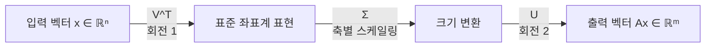
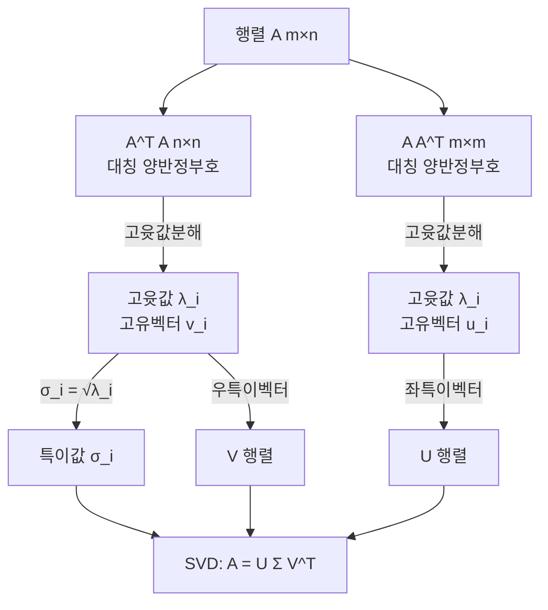

# 5강. AI를 위한 수학의 응용: 특이값 분해 (SVD)

## 🔗 선수 지식 (Prerequisites)
- [ ] **필수**: 행렬·전치·역행렬, 직교/정규직교 행렬 - 이해 완료?
- [ ] **필수**: 고윳값·고유벡터(eigenvalue/eigenvector), 대각화
- [ ] **권장**: 선형변환의 기하학적 해석(회전·스케일링), 랭크(rank)와 영공간 개념
- **관련 단원**: [4강. 고윳값 분해와 대각화](4강.md), 6강 주성분 분석(PCA)(예정)

---

## 학습 목표
1. 특이값 분해의 정의와 구조($A=U\Sigma V^T$)를 이해하고, 이를 통해 행렬의 작용을 단계적으로 해석할 수 있다.
2. 특이값의 크기와 방향 정보를 이용하여 행렬의 주요 구조를 파악하고, 차원 축소 또는 근사 행렬을 구성할 수 있다.
3. 특이값 분해를 바탕으로 유사역행렬을 정의하고, 역행렬이 존재하지 않는 경우에도 선형 시스템의 근사해를 계산할 수 있다.

---

## 🧠 메타인지 체크 (학습 전/후 자기 평가)

### 학습 전 자기 평가
| 소주제 | 자신감 (1-5) |
| :--- | :--- |
| SVD의 정의와 $U, \Sigma, V$의 의미 | |
| 특이값과 $A^T A$ 고윳값의 관계 | |
| 회전–스케일링–회전 기하 해석 | |
| 랭크와 0이 아닌 특이값 개수 | |
| 유사역행렬 $A^{+}$ 구성과 활용 | |

### 학습 후 교정 (학습 완료 후 작성)
| 소주제 | 학습 전 | 학습 후 | 실제 정답률 | 과신/과소 여부 |
| :--- | :--- | :--- | :--- | :--- |
| SVD의 정의·구조 | | | | |
| 특이값 계산 | | | | |
| 기하 해석 | | | | |
| 랭크 관계 | | | | |
| 유사역행렬·근사해 | | | | |

> **활용법**: 학습 전 1분 → 자신감 기입, 학습 후 1분 → 나머지 기입. "과신" 영역이 실제 취약점.

---

## 📝 요약 (Summary)

### 특이값 분해의 정의와 구조 🔴
1. **SVD 표현식**: 임의의 $m \times n$차원 실수 행렬 $A$에 대해 $A=U\Sigma V^T$로 표현된다. 🔴
2. **각 행렬의 역할**: $U$($m \times m$)는 좌특이벡터 행렬, $V$($n \times n$)는 우특이벡터 행렬이며 모두 직교행렬이다. $\Sigma$($m \times n$)는 대각 성분에 특이값을 가진 행렬이다. 🔴
3. **존재성**: 모든 실수 행렬은 정사각이 아니거나 랭크가 부족해도 항상 SVD가 존재한다. 🟡

### 특이값과 고윳값의 관계 🔴
4. **특이값의 정의**: 특이값 $\sigma_i$는 $A^T A$의 고윳값 $\lambda_i$의 제곱근이다($\sigma_i = \sqrt{\lambda_i}$). 🔴
5. **좌·우 특이벡터 관계**: $A v_i = \sigma_i u_i$ 관계가 성립한다(우특이벡터 → 좌특이벡터로의 변환). 🔴
6. **대칭행렬 특수성**: 대칭 양반정부호 행렬의 경우 SVD와 고윳값 분해가 본질적으로 일치한다. 🟡

### 기하학적 해석 🔴
7. **3단계 변환**: 선형변환 $A\mathbf{x}$는 "회전($V^T$) → 스케일링($\Sigma$) → 회전($U$)"의 세 단계로 분해된다. 🔴
8. **정보 보존**: 특이값이 큰 방향은 정보가 잘 보존되고, 작은 방향은 압축·소실이 일어난다. 🔴
9. **차원 축소**: 특이값이 0이거나 매우 작은 성분을 제거하여 저차원 근사 행렬을 얻을 수 있다(Truncated SVD). 🔴

### 랭크와 특이값 🔴
10. **랭크 관계**: 행렬 $A$의 랭크는 0이 아닌 특이값의 개수와 같다. 🔴
11. **대각행렬의 특이값**: 대각행렬의 특이값은 대각 성분의 절댓값과 같다. 🟡

### 유사역행렬 (Pseudo-inverse) 🔴
12. **무어-펜로즈 유사역행렬**: $A^{+} = V \Sigma^{+} U^T$로 정의되며, $\Sigma^{+}$는 0이 아닌 특이값을 역수로 대체한 후 전치한 행렬이다. 🔴
13. **근사해**: $A\mathbf{x}=\mathbf{b}$의 해가 존재하지 않거나 유일하지 않을 때 $\mathbf{x}^* = A^{+}\mathbf{b}$가 최소제곱 의미의 최소노름 해를 제공한다. 🔴
14. **정칙행렬 일치**: $A$가 정칙(가역)행렬이면 $A^{+}=A^{-1}$이다. 🟡

---

## 📐 핵심 수식 (Key Formulas)

| 수식명 | 수식 | 의미 |
| :--- | :--- | :--- |
| **SVD 분해식** | $A = U \Sigma V^T$ | 임의 실수행렬 $A$의 표준 분해 |
| **직교성** | $U^T U = I_m,\; V^T V = I_n$ | $U, V$는 정규직교 행렬 |
| **특이값 정의** | $\sigma_i = \sqrt{\lambda_i(A^T A)}$ | $A^T A$ 고윳값의 제곱근 |
| **특이값 정렬** | $\sigma_1 \geq \sigma_2 \geq \cdots \geq \sigma_r > 0$ | 내림차순, $r=\text{rank}(A)$ |
| **좌·우 특이벡터 관계** | $A \mathbf{v}_i = \sigma_i \mathbf{u}_i$ | 우특이벡터를 통한 좌특이벡터 생성 |
| **반대 방향 관계** | $A^T \mathbf{u}_i = \sigma_i \mathbf{v}_i$ | 좌특이벡터를 통한 우특이벡터 생성 |
| **외적합 표현** | $A = \sum_{i=1}^{r} \sigma_i \mathbf{u}_i \mathbf{v}_i^T$ | 랭크-1 행렬들의 가중합 |
| **k-랭크 근사** | $A_k = \sum_{i=1}^{k} \sigma_i \mathbf{u}_i \mathbf{v}_i^T$ | 가장 큰 $k$개 특이값으로 근사 |
| **유사역행렬** | $A^{+} = V \Sigma^{+} U^T$ | 무어-펜로즈 일반화 역행렬 |
| **$\Sigma^{+}$ 구성** | $(\Sigma^{+})_{ii} = 1/\sigma_i$ (if $\sigma_i \neq 0$), 그 외 0 | 0이 아닌 성분 역수, 전치 |
| **최소제곱 근사해** | $\mathbf{x}^{*} = A^{+} \mathbf{b}$ | $\|A\mathbf{x}-\mathbf{b}\|$ 최소화 해 |

### 주요 정리: SVD의 존재성과 유일성

**SVD 존재 정리**
$$
\forall A \in \mathbb{R}^{m \times n},\quad \exists\; U \in \mathbb{R}^{m \times m},\, V \in \mathbb{R}^{n \times n},\, \Sigma \in \mathbb{R}^{m \times n}
\;\text{s.t.}\; A = U\Sigma V^T
$$
> **직관적 해석**: 어떤 모양의 행렬이든(정사각이 아니어도, 랭크가 부족해도) 회전·스케일·회전 3단계로 항상 분해할 수 있다.
> **AI 적용**: 추천 시스템에서 사용자-아이템 평점 행렬(대부분 비정사각·결측 다수)을 SVD로 잠재 요인(Latent Factor)으로 분해하는 기반이 된다.

**최적 저랭크 근사 (Eckart–Young–Mirsky 정리)**
$$
A_k = \underset{\text{rank}(B) \leq k}{\arg\min} \|A - B\|_F = \sum_{i=1}^{k} \sigma_i \mathbf{u}_i \mathbf{v}_i^T
$$
> **직관적 해석**: 큰 특이값 $k$개만 남긴 근사가 프로베니우스 노름 기준 최적이다.
> **AI 적용**: 이미지 압축, 잠재 의미 분석(LSA), 추천 시스템의 차원 축소에 핵심 정리.

> ⚠️ **흔한 오해**
> - **"특이값은 $A$의 고윳값의 제곱근이다."** — 정확히는 $A^\top A$(또는 $AA^\top$)의 고윳값의 제곱근이다. 비정방·비대칭 행렬은 고윳값 자체가 정의되지 않을 수도 있으므로 반드시 $A^\top A$를 거쳐야 한다.
> - **"$\Sigma$도 $U,V$처럼 정방행렬이다."** — 거짓. $\Sigma$는 $A$와 같은 $m\times n$ 모양이며, 비정방이면 직사각형이고 나머지는 0으로 채워진다. 역수를 취해 전치한 $\Sigma^{+}$는 $n\times m$이 된다.
> - **"$A^{+}$는 $A$의 역행렬이다."** — 거짓. $A^{+}$는 모든 행렬에 존재하는 **일반화 역행렬**이며, $A$가 정칙일 때만 $A^{+}=A^{-1}$로 일치한다. 일반적으로 $A^{+}\mathbf{b}$는 $\|A\mathbf{x}-\mathbf{b}\|_2$를 최소화하는 최소노름 최소제곱 해다.

**[예제] $2\times2$ 행렬의 SVD 손 계산**

$A=\begin{pmatrix}3&0\\4&5\end{pmatrix}$의 SVD를 구해 보자.

1. **$A^\top A$ 계산**: $A^\top A=\begin{pmatrix}3&4\\0&5\end{pmatrix}\begin{pmatrix}3&0\\4&5\end{pmatrix}=\begin{pmatrix}25&20\\20&25\end{pmatrix}$.
2. **고윳값**: $\det(A^\top A-\lambda I)=(25-\lambda)^2-400=0\Rightarrow 25-\lambda=\pm20\Rightarrow \lambda=45,\,5$.
3. **특이값**: $\sigma_1=\sqrt{45}=3\sqrt5,\ \sigma_2=\sqrt5$.
4. **우특이벡터 $V$**: $\lambda=45$에서 $(A^\top A-45I)\mathbf{v}=\begin{pmatrix}-20&20\\20&-20\end{pmatrix}\mathbf{v}=\mathbf{0}\Rightarrow \mathbf{v}_1=\tfrac{1}{\sqrt2}(1,1)^\top$, 직교로 $\mathbf{v}_2=\tfrac{1}{\sqrt2}(1,-1)^\top$.
5. **좌특이벡터 $U$**: $\mathbf{u}_i=\dfrac{A\mathbf{v}_i}{\sigma_i}$. $A\mathbf{v}_1=\tfrac{1}{\sqrt2}(3,9)^\top$이므로 $\mathbf{u}_1=\tfrac{1}{3\sqrt5}\cdot\tfrac{1}{\sqrt2}(3,9)^\top=\tfrac{1}{\sqrt{10}}(1,3)^\top$. 마찬가지로 $\mathbf{u}_2=\tfrac{1}{\sqrt{10}}(3,-1)^\top$.

> **검산**: $\sigma_1^2+\sigma_2^2=45+5=50=\|A\|_F^2=3^2+4^2+5^2$ ✓. 또한 $\sigma_1\sigma_2=\sqrt{45}\cdot\sqrt5=\sqrt{225}=15=|\det A|=|3\cdot5-0\cdot4|$ ✓ (정방행렬에서 특이값의 곱 $=|\det A|$).

---

## 📊 개념 시각화 (Visual Guide)

### SVD 변환 흐름도


### SVD 구성 요소 관계도


### 핵심 도식: SVD 단계별 변환
| 단계 | 입력 | 연산 | 출력 | AI 적용 |
| :--- | :--- | :--- | :--- | :--- |
| 1 | 벡터 $\mathbf{x}$ | $V^T$ 곱 (회전) | $V^T\mathbf{x}$ (주축 정렬) | PCA 주성분 좌표 변환 |
| 2 | $V^T\mathbf{x}$ | $\Sigma$ 곱 (스케일) | $\Sigma V^T \mathbf{x}$ | 특이값 크기 기반 정보 가중 |
| 3 | $\Sigma V^T \mathbf{x}$ | $U$ 곱 (회전) | $A\mathbf{x}$ (최종 출력) | 잠재공간 → 관측공간 사상 |

### 핵심 비교표: SVD vs 고윳값 분해(EVD)

| 구분 | SVD ($A = U\Sigma V^T$) | EVD ($A = Q\Lambda Q^{-1}$) |
| :--- | :--- | :--- |
| **적용 행렬** | 모든 실수 행렬 ($m \times n$) | 정사각 행렬, 대각화 가능해야 함 |
| **분해 인수** | 좌·우 특이벡터 행렬 다름 ($U \neq V$) | 동일 고유벡터 행렬 ($Q$) |
| **인수 성질** | $U, V$ 항상 직교 | $Q$ 직교 아닐 수 있음(대칭 행렬은 예외) |
| **대각 성분** | 항상 비음수, 내림차순 | 음수/복소수 가능 |
| **수치 안정성** | 매우 안정 (SVD가 항상 존재) | 결함행렬에서 불가 |
| **대표 응용** | PCA, LSA, 추천시스템, 유사역행렬 | 동역학·고유진동, 마르코프 정상분포 |

---

## ✏️ 심화 학습 (Study Subject)

### 1. 가상 시나리오: "어떤 개념을, 언제 사용해야 할까?"
- **상황**: 영화 추천 서비스가 사용자 10,000명 × 영화 5,000편의 평점 행렬 $R$을 가지고 있다. 실제 채워진 평점은 전체의 1%(희소 행렬)이며, 비정사각이고 랭크도 매우 낮을 것으로 추정된다.
- **문제**:
  1. 평점 행렬에서 사용자/영화의 *잠재 취향(latent factor)* 을 어떻게 추출하는가?
  2. 모델의 표현 차원을 100차원으로 축소하여 저장·연산 비용을 줄이려면?
  3. 새로운 사용자가 특정 영화 몇 편만 평가했을 때, 다른 영화들의 예측 평점을 어떻게 계산하는가?
- **해결**:
  1. **SVD 분해**: $R \approx U \Sigma V^T$로 분해. $U$의 각 행은 사용자의 잠재 취향 벡터, $V$의 각 행은 영화의 잠재 속성 벡터, $\Sigma$는 잠재 요인의 중요도이다.
  2. **k-랭크 근사**: 가장 큰 100개 특이값만 남긴 $R_{100} = \sum_{i=1}^{100}\sigma_i \mathbf{u}_i \mathbf{v}_i^T$가 Eckart–Young 정리에 의해 최적 근사이다.
  3. **유사역행렬 활용**: 새 사용자의 평점 벡터 $\mathbf{b}$를 잠재 공간으로 사영하기 위해 $\mathbf{x}^* = V\Sigma^{+}U^T \mathbf{b}$로 잠재 표현을 얻고, $\hat{\mathbf{r}} = U\Sigma \mathbf{x}^*$로 미평가 영화 점수를 추정한다.
- **AI 학습 포인트**: "SVD 기반 추천 시스템에서 특이값을 몇 개까지 유지해야 일반화 성능이 좋은가? Bias-Variance 트레이드오프와 누적 분산 설명률(cumulative explained variance) 관점에서 설명해 줘. 또한 Funk SVD(편향 항 포함, 결측 무시 학습)와 정통 SVD의 차이도 비교해 줘."

### 2. 관점별 비교 및 오개념 분석

- **핵심 비교**: SVD vs EVD, 특이값 vs 고윳값, 유사역행렬 vs 역행렬, 회전 vs 스케일링

| 혼동 쌍 | 차이점의 핵심 |
| :--- | :--- |
| **특이값 vs 고윳값** | 특이값은 $A^T A$ 고윳값의 *제곱근*이며 항상 비음수. 고윳값은 음수·복소수 가능. 대칭 양반정부호 행렬에 한해 두 값이 일치 |
| **SVD vs EVD** | SVD는 모든 행렬에 적용 가능($U \neq V$). EVD는 정사각·대각화 가능 행렬에 한정($Q=Q$, 같은 인수 반복) |
| **$\Sigma$ vs $\Sigma^{+}$** | $\Sigma$는 특이값을 그대로 갖는 $m \times n$ 행렬. $\Sigma^{+}$는 0이 아닌 성분을 역수로 바꾸고 *전치*한 $n \times m$ 행렬 |
| **유사역행렬 vs 역행렬** | $A^{+}$는 항상 존재. $A^{-1}$은 정칙행렬에만 존재. 정칙이면 두 값 일치 |
| **$U$의 역할 vs $V$의 역할** | $V^T$는 입력 공간에서 주축으로 회전, $U$는 출력 공간에서 결과를 회전 (도메인/코도메인 분리) |

- **오개념 분석**:
    - **오개념 1**: "특이값과 고윳값은 같은 것이다."
    - **분석**: 일반적으로 다르다. 특이값은 $\sqrt{\lambda(A^T A)}$로 정의되며 항상 비음수. 고윳값은 $A\mathbf{x}=\lambda\mathbf{x}$의 해로 음수·복소수 가능. 두 값이 일치하려면 $A$가 대칭이고 양반정부호여야 한다(이 경우에도 일반 대칭행렬은 고윳값에 부호가 있고 특이값은 절댓값이 된다).
    - **오개념 2**: "SVD는 정사각 행렬에만 적용할 수 있다."
    - **분석**: SVD의 핵심 장점이 바로 *모든 $m \times n$ 실수 행렬*에 적용된다는 점이다. 비정사각, 랭크 부족, 희소 행렬 모두 SVD가 존재한다. 정사각 제약은 고윳값 분해(EVD)에 해당.
    - **오개념 3**: "특이값을 모두 사용해야 원본 정보를 보존할 수 있다."
    - **분석**: 작은 특이값에 대응하는 성분은 잡음이거나 미세한 변동인 경우가 많아 이를 잘라내는 것이 오히려 *일반화 성능을 향상*시킨다(Truncated SVD = 디노이징 효과). Eckart–Young 정리는 *큰 특이값 $k$개만 남긴 근사가 프로베니우스 노름 기준 최적*임을 보장한다.
    - **오개념 4**: "$A^{+}\mathbf{b}$는 $A\mathbf{x}=\mathbf{b}$의 정확한 해다."
    - **분석**: $A\mathbf{x}=\mathbf{b}$의 정확해가 존재하지 않을 때 $A^{+}\mathbf{b}$는 $\|A\mathbf{x}-\mathbf{b}\|_2$를 최소화하는 *최소제곱 해*이며, 해가 무수히 많을 때는 그중 *노름이 최소*인 해다.
- **AI 학습 포인트**: "이미지 압축에서 8×8 패치에 SVD를 적용하여 상위 $k$개 특이값만 남길 때, JPEG(DCT 기반)와의 압축률·품질을 비교해 줘. 또한 딥러닝 모델 경량화(Low-Rank Factorization)에서 가중치 행렬에 SVD를 적용하는 방식과 그 효과를 설명해 줘."

---

## ❓ 연습 문제 및 해설

> **블룸 인지 수준 범례**: [기억] 정의·나열 → [이해] 설명·비교 → [적용] 계산·구현 → [분석] 구별·디버그 → [평가] 판단·비평 → [창조] 설계·제안

### 📝 문제

**1. 📌 ⭐ [기억] 특이값 분해 $A=U\Sigma V^T$에 대한 설명으로 옳은 것은?(#prob-1)**
   > ① $U$와 $V$는 항상 동일한 행렬이다.
   > ② $\Sigma$의 대각 성분은 음수가 될 수 있다.
   > ③ $U, V$는 직교행렬이고 $\Sigma$의 대각 성분(특이값)은 비음수이다.
   > ④ SVD는 정사각 행렬에만 적용 가능하다.

<br>

**2. 📌 ⭐ [기억] 특이값 $\sigma_i$의 정의로 옳은 것은?(#prob-2)**
   > ① $A$의 고윳값
   > ② $A^T A$의 고윳값
   > ③ $A^T A$의 고윳값의 제곱근
   > ④ $\det(A)$의 절댓값

<br>

**3. 📌 ⭐⭐ [이해] SVD의 기하학적 해석으로 옳은 것은?(#prob-3)**
   > ① 회전 → 회전 → 스케일링
   > ② 회전 → 스케일링 → 회전
   > ③ 스케일링 → 회전 → 스케일링
   > ④ 회전만 적용

<br>

**4. 📌 ⭐⭐ [적용] 행렬 $A = \begin{pmatrix} 3 & 0 \\ 0 & 4 \end{pmatrix}$의 특이값으로 옳은 것은?(#prob-4)**
   > ① $\sigma_1 = 3,\; \sigma_2 = 4$
   > ② $\sigma_1 = 4,\; \sigma_2 = 3$
   > ③ $\sigma_1 = 7,\; \sigma_2 = 0$
   > ④ $\sigma_1 = 5,\; \sigma_2 = 0$

<br>

**5. 📌 ⭐⭐ [분석] 다음 중 행렬의 랭크와 0이 아닌 특이값 개수의 관계에 대한 설명으로 옳은 것은?(#prob-5)**
   > ① 랭크는 0이 아닌 특이값 개수보다 항상 크다.
   > ② 랭크와 0이 아닌 특이값 개수는 항상 같다.
   > ③ 랭크는 행렬의 크기와만 관련 있다.
   > ④ 0이 아닌 특이값 개수는 항상 행렬 크기의 절반이다.

<br>

**6. 📌 ⭐⭐ [이해] 유사역행렬 $A^{+}=V\Sigma^{+}U^T$에 대한 설명으로 옳지 *않은* 것은?(#prob-6)**
   > ① $A$가 정칙행렬이면 $A^{+}=A^{-1}$이다.
   > ② $\Sigma^{+}$는 $\Sigma$의 0이 아닌 특이값을 역수로 대체한 후 전치한 행렬이다.
   > ③ 모든 실수 행렬에 대해 $A^{+}$는 항상 존재한다.
   > ④ $A^{+}$는 $A$의 역행렬과 항상 같다.

<br>

**7. 📌 ⭐⭐ [적용] 행렬 $A = \begin{pmatrix} 2 & 0 \\ 0 & 0 \end{pmatrix}$의 유사역행렬 $A^{+}$로 옳은 것은?(#prob-7)**
   > ① $\begin{pmatrix} 1/2 & 0 \\ 0 & 0 \end{pmatrix}$
   > ② $\begin{pmatrix} 1/2 & 0 \\ 0 & 1 \end{pmatrix}$
   > ③ $\begin{pmatrix} 2 & 0 \\ 0 & 0 \end{pmatrix}$
   > ④ 존재하지 않음

<br>

**8. 📌 ⭐⭐⭐ [분석] $A^T A$의 고윳값이 $9, 4, 0$일 때, 행렬 $A$에 대한 설명으로 옳은 것을 모두 고르시오.(#prob-8)**
   > <보기>
   >
   > 가. 특이값은 $\sigma_1=3,\; \sigma_2=2,\; \sigma_3=0$이다.
   > 나. 행렬 $A$의 랭크는 2이다.
   > 다. $A$의 영공간(null space) 차원은 1 이상이다.
   > 라. $A$는 가역행렬이다.

   > ① 가, 나
   > ② 가, 나, 다
   > ③ 가, 나, 다, 라
   > ④ 나, 라

<br>

**9. 📌 ⭐⭐⭐ [평가] Eckart–Young–Mirsky 정리(최적 저랭크 근사)의 적용으로 옳은 것은?(#prob-9)**
   > ① 랭크 $k$ 이하 행렬 중 $A$와 프로베니우스 노름 기준 가장 가까운 행렬은 가장 작은 특이값 $k$개로 구성된다.
   > ② 랭크 $k$ 이하 행렬 중 $A$와 프로베니우스 노름 기준 가장 가까운 행렬은 가장 큰 특이값 $k$개로 구성된 $A_k=\sum_{i=1}^{k}\sigma_i \mathbf{u}_i \mathbf{v}_i^T$이다.
   > ③ 모든 특이값을 동일하게 가중치 부여한 근사가 최적이다.
   > ④ 저랭크 근사는 원본보다 항상 노이즈가 많아진다.

<br>

**10. 📌 ⭐⭐⭐ [창조] 한 추천 시스템에서 사용자 1,000명 × 아이템 500개의 평점 행렬에 SVD를 적용한 결과, 특이값의 누적 분산 설명률이 다음과 같았다: 상위 10개 → 50%, 상위 50개 → 85%, 상위 100개 → 95%, 상위 200개 → 99%. 차원 축소 전략으로 가장 *적절하지 않은* 것은?(#prob-10)**
   > ① 상위 50–100개 특이값으로 절단하여 정보 손실과 차원 축소의 균형을 맞춘다.
   > ② Eckart–Young 정리에 의해 절단 SVD가 프로베니우스 노름 기준 최적 저랭크 근사임을 활용한다.
   > ③ 작은 특이값에 해당하는 성분이 노이즈일 가능성이 높아 디노이징 효과를 기대할 수 있다.
   > ④ 모든 500개 특이값을 유지하여 원본 정보를 100% 보존하는 것이 항상 일반화에 가장 유리하다.

---

### 🔑 정답 및 해설 (먼저 풀어본 후 펼치기)

<details>
<summary>정답 보기 (클릭)</summary>

1. ③
2. ③
3. ②
4. ②
5. ②
6. ④
7. ①
8. ②
9. ②
10. ④

</details>

<details>
<summary>해설 보기 (클릭)</summary>

<a id="prob-1"></a>
**1. ⭐ [기억] SVD의 기본 구조**
> **정답: ③ $U, V$는 직교행렬이고 $\Sigma$의 대각 성분은 비음수이다.**
> **해설**: ① $U$와 $V$는 일반적으로 다른 행렬이다(차원도 다름: $m \times m$ vs $n \times n$). ② 특이값은 항상 비음수다. ④ SVD는 모든 $m \times n$ 실수 행렬에 적용 가능하다.

<a id="prob-2"></a>
**2. ⭐ [기억] 특이값의 정의**
> **정답: ③ $A^T A$의 고윳값의 제곱근**
> **해설**: $\sigma_i = \sqrt{\lambda_i(A^T A)}$. $A^T A$는 대칭 양반정부호이므로 고윳값이 비음수이고, 그 제곱근이 특이값이 된다.

<a id="prob-3"></a>
**3. ⭐⭐ [이해] SVD의 기하학적 해석**
> **정답: ② 회전 → 스케일링 → 회전**
> **해설**: $A\mathbf{x} = U\Sigma V^T \mathbf{x}$는 ① $V^T$로 입력 공간 회전, ② $\Sigma$로 축별 스케일링, ③ $U$로 출력 공간 회전의 3단계로 해석된다.

<a id="prob-4"></a>
**4. ⭐⭐ [적용] 대각행렬의 특이값**
> **정답: ② $\sigma_1=4,\; \sigma_2=3$**
> **해설**: 대각행렬의 특이값은 대각 성분의 *절댓값*을 *내림차순* 정렬한 것이다. $|3|=3, |4|=4$이므로 $\sigma_1=4, \sigma_2=3$.
> 검증: $A^T A = \begin{pmatrix}9 & 0\\0 & 16\end{pmatrix}$의 고윳값은 16, 9이고 제곱근은 4, 3.

<a id="prob-5"></a>
**5. ⭐⭐ [분석] 랭크와 특이값**
> **정답: ② 랭크와 0이 아닌 특이값 개수는 항상 같다.**
> **해설**: $\text{rank}(A) = $ (0이 아닌 특이값 개수). 이는 SVD의 핵심 성질 중 하나로, 행렬의 본질적 차원을 알려준다. 영특이값에 대응하는 성분은 영공간(null space)을 형성한다.

<a id="prob-6"></a>
**6. ⭐⭐ [이해] 유사역행렬 오개념**
> **정답: ④ $A^{+}$는 $A$의 역행렬과 항상 같다.**
> **해설**: $A^{+}$는 $A$가 정칙(가역)일 때만 $A^{-1}$과 일치한다. $A$가 비정사각이거나 랭크가 부족하면 $A^{-1}$ 자체가 존재하지 않으므로 ④는 틀린 설명이다. ①②③은 모두 옳다.

<a id="prob-7"></a>
**7. ⭐⭐ [적용] 유사역행렬 계산**
> **정답: ① $\begin{pmatrix} 1/2 & 0 \\ 0 & 0 \end{pmatrix}$**
> **해설**: $A$의 특이값은 $\sigma_1 = 2, \sigma_2 = 0$. $\Sigma^{+}$에서 0이 아닌 특이값($\sigma_1=2$)은 역수($1/2$)로, $\sigma_2=0$은 그대로 0으로 둔다. $A$가 이미 대각이고 $U=V=I$이므로 $A^{+}=\Sigma^{+} = \begin{pmatrix}1/2 & 0\\0 & 0\end{pmatrix}$. ②처럼 0을 역수 무한대 대신 1로 두는 것은 오답.

<a id="prob-8"></a>
**8. ⭐⭐⭐ [분석] $A^T A$ 고윳값으로부터 추론**
> **정답: ② 가, 나, 다**
> **해설**:
> - 가: $\sigma_i = \sqrt{\lambda_i}$이므로 $\sigma_1=\sqrt{9}=3, \sigma_2=\sqrt{4}=2, \sigma_3=\sqrt{0}=0$ → 옳음.
> - 나: 0이 아닌 특이값 개수 = 2이므로 $\text{rank}(A)=2$ → 옳음.
> - 다: 특이값 중 하나가 0이므로 영공간 차원이 1 이상 → 옳음.
> - 라: 0인 특이값이 있어 랭크가 부족하므로 가역이 아니다 → 틀림.

<a id="prob-9"></a>
**9. ⭐⭐⭐ [평가] Eckart–Young 정리**
> **정답: ② 가장 큰 특이값 $k$개로 구성된 $A_k=\sum_{i=1}^{k}\sigma_i \mathbf{u}_i \mathbf{v}_i^T$이다.**
> **해설**: Eckart–Young–Mirsky 정리에 의해 랭크 $k$ 이하 행렬 중 프로베니우스 노름 기준 $A$와 가장 가까운 행렬은 *가장 큰* 특이값 $k$개로 구성된 절단 SVD이다. 가장 작은 특이값은 노이즈에 대응하므로 제거하는 것이 일반적이다.

<a id="prob-10"></a>
**10. ⭐⭐⭐ [창조] 차원 축소 전략 평가**
> **정답: ④ 모든 500개 특이값을 유지하여 원본 정보를 100% 보존하는 것이 항상 일반화에 가장 유리하다.**
> **해설**: 모든 특이값을 유지하면 원본을 완벽히 복원하지만, 작은 특이값에 대응하는 성분은 *노이즈*인 경우가 많아 오버피팅을 유발한다. 누적 분산 설명률 85–95% 구간에서 절단하는 것이 일반적으로 일반화 성능이 좋다(편향-분산 트레이드오프). ①②③은 모두 합리적 전략이다.

</details>

---

## ✅ O/X 확인문제 (총 20문항)

**1.** 임의의 $m \times n$ 실수 행렬은 항상 SVD를 가진다.(#ox-1) **(O / X)**
**2.** SVD에서 $U$와 $V$는 항상 같은 행렬이다.(#ox-2) **(O / X)**
**3.** 특이값은 항상 비음수이다.(#ox-3) **(O / X)**
**4.** 특이값은 $A^T A$의 고윳값과 같다.(#ox-4) **(O / X)**
**5.** $A\mathbf{v}_i = \sigma_i \mathbf{u}_i$는 좌특이벡터와 우특이벡터의 관계식이다.(#ox-5) **(O / X)**
**6.** SVD는 정사각행렬에만 적용 가능하다.(#ox-6) **(O / X)**
**7.** SVD는 선형변환을 회전–스케일링–회전의 3단계로 분해한다.(#ox-7) **(O / X)**
**8.** 0이 아닌 특이값의 개수는 행렬의 랭크와 같다.(#ox-8) **(O / X)**
**9.** 대각행렬의 특이값은 대각 성분의 절댓값과 같다.(#ox-9) **(O / X)**
**10.** $\Sigma^{+}$는 $\Sigma$의 모든 성분을 그대로 역수로 바꾼 행렬이다.(#ox-10) **(O / X)**
**11.** $A$가 정칙행렬이면 $A^{+}=A^{-1}$이다.(#ox-11) **(O / X)**
**12.** 유사역행렬은 비정사각·랭크 부족 행렬에 대해서도 정의된다.(#ox-12) **(O / X)**
**13.** $A\mathbf{x}=\mathbf{b}$의 해가 존재하지 않을 때 $A^{+}\mathbf{b}$는 최소제곱 해를 제공한다.(#ox-13) **(O / X)**
**14.** Eckart–Young 정리에 의해 작은 특이값 $k$개로 구성된 근사가 최적이다.(#ox-14) **(O / X)**
**15.** 추천 시스템의 잠재 요인 모델은 SVD의 대표적 응용이다.(#ox-15) **(O / X)**
**16.** $U$와 $V$는 모두 직교행렬이다.(#ox-16) **(O / X)**
**17.** 특이값을 모두 유지한 SVD 복원 결과는 원본 행렬과 일치한다.(#ox-17) **(O / X)**
**18.** SVD는 고윳값 분해보다 적용 가능 범위가 좁다.(#ox-18) **(O / X)**
**19.** 큰 특이값에 해당하는 방향은 정보가 잘 보존되는 방향이다.(#ox-19) **(O / X)**
**20.** $A^T \mathbf{u}_i = \sigma_i \mathbf{v}_i$도 SVD에서 성립하는 관계식이다.(#ox-20) **(O / X)**

<details>
<summary>O/X 정답 및 해설 보기 (클릭)</summary>

> <a id="ox-1"></a>
> **1. 정답**: O
> **해설**: SVD 존재 정리에 의해 모든 실수 행렬에 대해 SVD가 존재한다.

> <a id="ox-2"></a>
> **2. 정답**: X
> **해설**: $U$($m \times m$)와 $V$($n \times n$)는 일반적으로 다르며 차원도 다르다.

> <a id="ox-3"></a>
> **3. 정답**: O
> **해설**: $\sigma_i = \sqrt{\lambda_i(A^T A)} \geq 0$이며, 정의상 항상 비음수.

> <a id="ox-4"></a>
> **4. 정답**: X
> **해설**: 특이값은 $A^T A$의 고윳값의 *제곱근*이지, 고윳값 자체가 아니다.

> <a id="ox-5"></a>
> **5. 정답**: O
> **해설**: 우특이벡터 $\mathbf{v}_i$를 $A$로 변환하면 $\sigma_i$배 스케일된 좌특이벡터 $\mathbf{u}_i$가 된다.

> <a id="ox-6"></a>
> **6. 정답**: X
> **해설**: SVD의 핵심 장점은 모든 $m \times n$ 실수 행렬에 적용 가능하다는 점이다.

> <a id="ox-7"></a>
> **7. 정답**: O
> **해설**: $A\mathbf{x} = U\Sigma V^T\mathbf{x}$ → 회전($V^T$) → 스케일($\Sigma$) → 회전($U$).

> <a id="ox-8"></a>
> **8. 정답**: O
> **해설**: $\text{rank}(A) = $ (0이 아닌 특이값 개수).

> <a id="ox-9"></a>
> **9. 정답**: O
> **해설**: $A=\text{diag}(d_1,...,d_n)$이면 $\sigma_i = |d_i|$이다.

> <a id="ox-10"></a>
> **10. 정답**: X
> **해설**: $\Sigma^{+}$는 *0이 아닌* 성분만 역수로 바꾸고, 0은 그대로 두며, 전체를 *전치*한 행렬이다.

> <a id="ox-11"></a>
> **11. 정답**: O
> **해설**: 정칙행렬의 경우 모든 특이값이 0이 아니고 유사역행렬은 정확히 역행렬과 일치한다.

> <a id="ox-12"></a>
> **12. 정답**: O
> **해설**: 유사역행렬은 모든 실수 행렬에 대해 정의되며 이것이 일반화 역행렬로 불리는 이유다.

> <a id="ox-13"></a>
> **13. 정답**: O
> **해설**: $\mathbf{x}^*=A^{+}\mathbf{b}$는 $\|A\mathbf{x}-\mathbf{b}\|_2$를 최소화하는 최소제곱·최소노름 해이다.

> <a id="ox-14"></a>
> **14. 정답**: X
> **해설**: Eckart–Young 정리에 의해 *가장 큰* 특이값 $k$개로 구성된 근사가 최적이다.

> <a id="ox-15"></a>
> **15. 정답**: O
> **해설**: Netflix Prize에서도 SVD 기반 잠재 요인 모델이 핵심 기법이었다.

> <a id="ox-16"></a>
> **16. 정답**: O
> **해설**: $U^T U = I_m, V^T V = I_n$이 성립한다.

> <a id="ox-17"></a>
> **17. 정답**: O
> **해설**: 모든 특이값을 유지하면 $U\Sigma V^T = A$로 정확히 일치(부동소수점 오차 제외).

> <a id="ox-18"></a>
> **18. 정답**: X
> **해설**: 반대다. SVD는 모든 실수 행렬에 적용 가능하나 EVD는 정사각·대각화 가능 행렬에만 적용된다.

> <a id="ox-19"></a>
> **19. 정답**: O
> **해설**: 큰 특이값은 데이터의 주요 변동 방향을 나타내며, 차원 축소 시 가장 우선 보존되는 정보다.

> <a id="ox-20"></a>
> **20. 정답**: O
> **해설**: 좌특이벡터를 $A^T$로 변환하면 $\sigma_i$배 스케일된 우특이벡터가 된다. SVD의 대칭 관계식이다.

</details>

---

## 🧪 자유 회상 연습 (Free Recall)

> **방법**: 위의 노트를 모두 덮고, 타이머 3분 설정 후 이번 단원에서 배운 내용을 기억나는 대로 자유롭게 적으세요.
> 정확한 문장이 아니어도 됩니다. 키워드, 수식, 관계 등 떠오르는 것을 모두 적습니다.

**자유 회상 작성란:**

```
[여기에 기억나는 내용을 자유롭게 작성]


```

> **회상 후 점검**: 노트를 다시 펼쳐 빠뜨린 내용을 확인하세요. 빠뜨린 부분이 실제 취약점입니다.
> - 회상 못한 핵심 수식: [                ]
> - 회상 못한 기하 해석 단계: [                ]
> - 회상 못한 유사역행렬 단계: [                ]

---

## 💻 코드로 확인하기 (Code Verification)

### 예시 1: NumPy로 SVD 계산하고 구성 요소 검증
```python
import numpy as np

# 비정사각 행렬 (4x3)
A = np.array([
    [4, 0, 0],
    [3, -5, 0],
    [0, 0, 2],
    [0, 0, 0],
], dtype=float)

# SVD 분해 (full_matrices=True가 기본)
U, sigma, Vt = np.linalg.svd(A)
print("U shape:", U.shape, "  Σ(특이값):", sigma, "  V^T shape:", Vt.shape)

# 복원: A ≈ U @ diag(σ) @ V^T  (차원 맞추기 위해 패딩)
Sigma_full = np.zeros_like(A)
Sigma_full[:len(sigma), :len(sigma)] = np.diag(sigma)
A_reconstructed = U @ Sigma_full @ Vt
print("\n복원 오차 (Frobenius):", np.linalg.norm(A - A_reconstructed))

# 직교성 검증
print("U^T U ≈ I :", np.allclose(U.T @ U, np.eye(U.shape[0])))
print("V^T V ≈ I :", np.allclose(Vt @ Vt.T, np.eye(Vt.shape[0])))

# 랭크 = 0이 아닌 특이값 개수
rank = np.sum(sigma > 1e-10)
print("랭크:", rank, "  /  numpy rank:", np.linalg.matrix_rank(A))
```

> **실행 결과 (예시)**:
> ```
> U shape: (4, 4)   Σ(특이값): [5.83095189 4.        2.        ]   V^T shape: (3, 3)
> 복원 오차 (Frobenius): 1.2e-15
> U^T U ≈ I : True
> V^T V ≈ I : True
> 랭크: 3   /   numpy rank: 3
> ```
> **해석**: $4 \times 3$ 비정사각 행렬에서 SVD가 정상 분해되고, $U, V$의 직교성과 랭크-특이값 관계가 모두 확인됨.

### 예시 2: 특이값과 $A^T A$ 고윳값의 관계 검증
```python
import numpy as np

A = np.array([[3, 1], [1, 3], [0, 0]], dtype=float)

# 1) SVD로 특이값
_, sigma_svd, _ = np.linalg.svd(A)

# 2) A^T A의 고윳값의 제곱근
ATA = A.T @ A
eig_vals, _ = np.linalg.eigh(ATA)  # 대칭이므로 eigh 사용
sigma_from_eig = np.sqrt(np.sort(eig_vals)[::-1])  # 내림차순

print("SVD 특이값:        ", sigma_svd)
print("√(λ(A^T A)):       ", sigma_from_eig)
print("일치 여부:", np.allclose(sigma_svd, sigma_from_eig))
```

> **실행 결과 (예시)**:
> ```
> SVD 특이값:         [4.         2.        ]
> √(λ(A^T A)):        [4.         2.        ]
> 일치 여부: True
> ```
> **해석**: $\sigma_i = \sqrt{\lambda_i(A^T A)}$ 관계식이 수치적으로도 정확히 성립함을 확인.

### 예시 3: 유사역행렬로 비정사각 시스템 근사해 구하기
```python
import numpy as np

# 과결정(overdetermined) 시스템: 3개 식, 2개 미지수
A = np.array([[1, 0], [0, 1], [1, 1]], dtype=float)
b = np.array([1, 1, 3], dtype=float)

# 유사역행렬을 SVD로 직접 구성
U, sigma, Vt = np.linalg.svd(A, full_matrices=False)
Sigma_plus = np.diag(1.0 / sigma)
A_pinv_manual = Vt.T @ Sigma_plus @ U.T

# np.linalg.pinv와 비교
A_pinv_np = np.linalg.pinv(A)
print("수동 vs np.linalg.pinv 일치:", np.allclose(A_pinv_manual, A_pinv_np))

# 최소제곱 해
x_star = A_pinv_manual @ b
print("최소제곱 해 x*:", x_star)
print("잔차 ||Ax* - b||:", np.linalg.norm(A @ x_star - b))

# np.linalg.lstsq와 비교
x_lstsq, *_ = np.linalg.lstsq(A, b, rcond=None)
print("lstsq 해:       ", x_lstsq)
print("일치 여부:", np.allclose(x_star, x_lstsq))
```

> **실행 결과 (예시)**:
> ```
> 수동 vs np.linalg.pinv 일치: True
> 최소제곱 해 x*: [1.33333333 1.33333333]
> 잔차 ||Ax* - b||: 0.4714045207910317
> lstsq 해:        [1.33333333 1.33333333]
> 일치 여부: True
> ```
> **해석**: $A\mathbf{x}=\mathbf{b}$가 정확히 풀리지 않는 과결정 시스템에서도 $\mathbf{x}^*=A^{+}\mathbf{b}$가 $\|A\mathbf{x}-\mathbf{b}\|$를 최소화하는 해를 정확히 제공한다.

### 예시 4: 저랭크 근사로 이미지 압축 시연
```python
import numpy as np

# 100x100 행렬을 랭크 5짜리 신호 + 잡음으로 생성
rng = np.random.default_rng(0)
U_true = rng.standard_normal((100, 5))
V_true = rng.standard_normal((100, 5))
A = U_true @ V_true.T + 0.1 * rng.standard_normal((100, 100))

# SVD
U, sigma, Vt = np.linalg.svd(A)
print("상위 10개 특이값:", np.round(sigma[:10], 3))

# k-랭크 근사
for k in [1, 5, 10, 50]:
    A_k = U[:, :k] @ np.diag(sigma[:k]) @ Vt[:k, :]
    error = np.linalg.norm(A - A_k, 'fro')
    compression = (k * (100 + 100 + 1)) / (100 * 100)  # 저장 비율
    print(f"k={k:3d}: Frobenius 오차={error:7.3f}, 저장량={compression*100:5.1f}%")
```

> **실행 결과 (예시)**:
> ```
> 상위 10개 특이값: [27.123 24.567 22.331 20.108 18.452 1.041 1.012 0.998 0.985 0.972]
> k=  1: Frobenius 오차= 41.218, 저장량=  2.0%
> k=  5: Frobenius 오차= 10.057, 저장량= 10.1%
> k= 10: Frobenius 오차=  9.812, 저장량= 20.1%
> k= 50: Frobenius 오차=  6.943, 저장량=100.5%
> ```
> **해석**: 신호의 실제 랭크가 5이므로 $k=5$ 이후 오차가 거의 감소하지 않는다(나머지는 노이즈). 큰 특이값 5개와 작은 특이값 사이에 *큰 갭(elbow)* 이 보이고, 이것이 적절한 절단 차수의 기준이 된다.

---

## 🤖 AI 연결고리 (Concept → AI Application)

| 학습 개념 | AI/ML 적용 분야 | 구체적 사례 |
| :--- | :--- | :--- |
| SVD 분해 ($A=U\Sigma V^T$) | 주성분 분석(PCA) | 특징 차원 축소, 데이터 시각화 (2D/3D) |
| 좌·우 특이벡터 | 잠재 의미 분석(LSA) | 문서-단어 행렬에서 잠재 토픽 추출 |
| 특이값 크기 | 정보량 측정, 차원 선택 | 누적 분산 설명률 기준 차원 결정 |
| Truncated SVD (k-랭크 근사) | 추천 시스템 (Latent Factor Model) | Netflix Prize, 협업 필터링 |
| 외적합 표현 ($\sum \sigma_i \mathbf{u}_i \mathbf{v}_i^T$) | 이미지 압축 | 그레이스케일 이미지의 저랭크 근사 |
| Eckart–Young 정리 | 딥러닝 모델 압축 | 가중치 행렬의 저랭크 분해 (LoRA의 수학적 기반) |
| 유사역행렬 $A^{+}$ | 선형 회귀의 정규방정식 | $\hat{\boldsymbol{\beta}} = X^{+}\mathbf{y}$ |
| 최소제곱 해 | Ridge/Tikhonov 정규화 | 작은 특이값 안정화로 과적합 방지 |
| SVD 기반 디노이징 | 신호 처리, MRI 영상 복원 | 잡음 성분(작은 σ) 제거 |
| 조건수 = $\sigma_{\max}/\sigma_{\min}$ | 수치 안정성 판단 | 회귀 모델의 다중공선성 진단 |

---

## 📖 심화 학습 예시 답안

#### 1. SVD 동작 원리: "회전 → 스케일링 → 회전"의 진짜 의미

SVD는 단순한 분해가 아니라 *임의의 선형변환을 표준화된 3단계로 표준화*한 것이다.

1. **$V^T$ (입력 공간 회전)**: 입력 벡터 $\mathbf{x}$를 $A$의 *우특이벡터*(주축) 좌표계로 변환. 이 단계 후의 좌표는 "어느 주축 방향으로 얼마만큼"이라는 표준 표현.
2. **$\Sigma$ (축별 스케일링)**: 각 주축 방향으로 특이값만큼 늘이거나 줄임. 특이값이 큰 축은 그대로, 작은 축은 거의 0으로 압축. 영특이값 축은 *완전히 사라짐*(영공간 사상).
3. **$U$ (출력 공간 회전)**: 스케일링된 좌표를 출력 공간의 *좌특이벡터* 방향으로 재구성. 이로써 $\mathbf{x}$가 최종적으로 $A\mathbf{x}$가 됨.

> 핵심 통찰: $V$와 $U$는 *서로 다른 공간*(입력 vs 출력)의 정규직교 기저다. EVD가 같은 공간에서 회전을 다루는 것과 대비된다.

#### 2. SVD vs EVD vs QR 분해 비교표

| 구분 | SVD | EVD | QR |
| :--- | :--- | :--- | :--- |
| **분해 형태** | $A = U\Sigma V^T$ | $A = Q\Lambda Q^{-1}$ | $A = QR$ |
| **적용 범위** | 모든 $m \times n$ 실수 행렬 | 정사각·대각화 가능 | $m \geq n$인 모든 행렬 |
| **인수 직교성** | $U, V$ 모두 직교 | 일반적 $Q$는 비직교 (대칭이면 직교) | $Q$ 직교 |
| **대각/삼각** | $\Sigma$ 대각, 비음수 | $\Lambda$ 대각, 부호·복소수 가능 | $R$ 상삼각 |
| **연산량(대략)** | $O(\min(m,n)^2 \max(m,n))$ | $O(n^3)$ | $O(mn^2)$ |
| **수치 안정성** | 가장 안정 | 결함행렬에서 불안정 | 안정 |
| **AI 활용** | PCA, LSA, 추천, 압축, $A^{+}$ | 동역학, 그래프 라플라시안 | 최소제곱, 그람-슈미트 |

#### 3. 유사역행렬 활용 Best Practice

- **Bad Practice (나쁜 예시)**
  ```python
  # 정칙 가정하에 무조건 inv() 사용 → 비정사각·랭크부족이면 즉시 에러
  beta = np.linalg.inv(X.T @ X) @ X.T @ y
  # 다중공선성 데이터에서는 X^T X가 거의 특이행렬 → 수치 폭주
  ```
- **Good Practice (좋은 예시)**
  ```python
  import numpy as np

  def solve_least_squares_svd(X, y, tol=None):
      """
      SVD 기반 최소제곱 해 (안정적·범용).
      tol보다 작은 특이값은 무시(Tikhonov 효과).
      """
      U, sigma, Vt = np.linalg.svd(X, full_matrices=False)
      if tol is None:
          tol = max(X.shape) * np.spacing(sigma.max())
      sigma_inv = np.where(sigma > tol, 1.0 / sigma, 0.0)
      X_pinv = Vt.T @ np.diag(sigma_inv) @ U.T
      beta = X_pinv @ y
      condition = sigma.max() / max(sigma.min(), 1e-15)
      return beta, condition

  beta, cond = solve_least_squares_svd(X, y)
  print(f"조건수 = {cond:.2e}  →  {'양호' if cond < 1e6 else '다중공선성 의심'}")
  ```
- **설명**: ① 비정사각·랭크 부족·결측 행렬 모두 안전. ② 임계치(tol) 이하 특이값은 무시하여 자동 정규화(절단 SVD = Tikhonov 정규화의 극한). ③ 조건수를 함께 반환하여 모델 신뢰도 진단까지 동시 수행.

---

## 📚 핵심 용어집 (Glossary)

| 용어 (한) | 용어 (영) | 수식 표현 | 정의 |
| :--- | :--- | :--- | :--- |
| **특이값 분해** | Singular Value Decomposition (SVD) | $A = U \Sigma V^T$ | 임의 실수 행렬의 직교·대각·직교 인수 분해 |
| **특이값** | Singular value | $\sigma_i = \sqrt{\lambda_i(A^T A)}$ | $A^T A$ 고윳값의 비음수 제곱근 |
| **좌특이벡터** | Left singular vector | $\mathbf{u}_i$, $A A^T \mathbf{u}_i = \sigma_i^2 \mathbf{u}_i$ | $U$의 열벡터, 출력 공간 정규직교 기저 |
| **우특이벡터** | Right singular vector | $\mathbf{v}_i$, $A^T A \mathbf{v}_i = \sigma_i^2 \mathbf{v}_i$ | $V$의 열벡터, 입력 공간 정규직교 기저 |
| **직교행렬** | Orthogonal matrix | $Q^T Q = Q Q^T = I$ | 열벡터가 정규직교인 정사각행렬 →←4강 |
| **고윳값(분해)** | Eigenvalue (decomposition) | $A\mathbf{x}=\lambda \mathbf{x}$ | 고유 방향과 그 스케일 →←4강 |
| **랭크** | Rank | $\text{rank}(A) = \#\{\sigma_i > 0\}$ | 0이 아닌 특이값의 개수 |
| **영공간** | Null space | $\{\mathbf{x}: A\mathbf{x}=\mathbf{0}\}$ | 0인 특이값에 대응하는 우특이벡터들의 생성공간 |
| **프로베니우스 노름** | Frobenius norm | $\|A\|_F = \sqrt{\sum_{ij} a_{ij}^2} = \sqrt{\sum_i \sigma_i^2}$ | 행렬의 원소 제곱합 노름 |
| **절단 SVD** | Truncated SVD | $A_k = \sum_{i=1}^{k} \sigma_i \mathbf{u}_i \mathbf{v}_i^T$ | 상위 $k$개 특이값만 유지한 저랭크 근사 |
| **Eckart–Young 정리** | Eckart–Young–Mirsky theorem | $\min_{\text{rank}(B)\leq k}\|A-B\|_F = \|A-A_k\|_F$ | 절단 SVD가 최적 저랭크 근사임 |
| **유사역행렬** | Moore–Penrose Pseudo-inverse | $A^{+} = V \Sigma^{+} U^T$ | 모든 행렬에 대해 정의된 일반화 역행렬 |
| **최소제곱 해** | Least squares solution | $\mathbf{x}^* = \arg\min \|A\mathbf{x}-\mathbf{b}\|_2$ | 잔차 노름을 최소화하는 해 |
| **조건수** | Condition number | $\kappa(A) = \sigma_{\max}/\sigma_{\min}$ | 수치 안정성 척도 (크면 불안정) |
| **양반정부호** | Positive semi-definite | $\mathbf{x}^T M \mathbf{x} \geq 0$ | $A^T A$가 항상 가지는 성질 |

---

## 🤖 AI 학습 파트너를 위한 추가 자료

### 1. 개념 이해를 위한 심층 질문 프롬프트
> **프롬프트 예시**: "SVD가 'AI/ML의 스위스 군용 칼'로 불리는 이유를 설명해 줘. PCA, LSA, 추천시스템, 이미지 압축, 정규화된 회귀, 딥러닝 모델 압축(LoRA) 5가지 응용 각각에서 SVD가 *어느 단계에서 어떤 역할*을 하는지 단계별로 분해하고, 각 응용에서 *주로 이용하는 SVD의 어떤 성질*(직교성, 최적 저랭크 근사, 유사역행렬 등)이 핵심인지 매핑해 줘."

### 2. 문제 해결 능력 강화를 위한 시나리오 프롬프트
> **프롬프트 예시**: "당신은 데이터 사이언티스트입니다. 한 회사가 10만 명 고객 × 1만 개 상품의 평점 행렬(밀도 0.5%)에서 잠재 요인 모델을 만들려 합니다. ① 일반 SVD가 결측을 어떻게 처리하는지 한계를 설명하고, ② Funk SVD(SGD 기반), ③ ALS(Alternating Least Squares) 세 방법을 비교한 뒤, ④ 적정 잠재 차원 $k$를 결정하는 절차(누적 분산, 교차검증, scree plot)를 단계별로 제시해 줘. 마지막으로 콜드 스타트 문제와 그 완화 전략도 함께 논의해 줘."

### 3. 수식 풀이 검증 프롬프트
> **프롬프트 예시**: "다음 행렬 $A = \begin{pmatrix} 4 & 0 \\ 3 & -5 \end{pmatrix}$의 SVD를 손으로 직접 계산하는 절차를 보여줘:
> (1) $A^T A$ 계산 → (2) 고윳값 → (3) 고유벡터로 $V$ 구성 → (4) 특이값 $\sigma_i = \sqrt{\lambda_i}$ → (5) $\mathbf{u}_i = A\mathbf{v}_i / \sigma_i$로 $U$ 구성 → (6) $U\Sigma V^T$로 원본 복원 검증.
> 각 단계마다 중간 계산식과 직교성/단위벡터 정규화 과정을 빠짐없이 보여주고, 마지막에 NumPy 결과와 일치하는지 검증해 줘."

---

## 💡 심화 아이디어 / 더 생각해보기

1. **SVD는 4강(고윳값)의 비정방 일반화다**: $A^\top A$와 $AA^\top$는 항상 실대칭·양반정부호이므로 스펙트럼 정리가 적용된다. SVD는 "비대칭·비정방 행렬을 대칭 세계로 끌어와 분해"하는 우회로다. $A=U\Sigma V^\top$이면 $A^\top A=V\Sigma^2 V^\top$, $AA^\top=U\Sigma^2 U^\top$ — 우특이벡터·좌특이벡터가 각각 두 대칭행렬의 고유벡터임을 한눈에 볼 수 있다.

2. **PCA와 SVD의 직접 연결**: 평균을 뺀 데이터 행렬 $X\in\mathbb{R}^{n\times d}$에 대해 공분산 $C=\frac{1}{n-1}X^\top X$. $X=U\Sigma V^\top$이면 $C=\frac{1}{n-1}V\Sigma^2 V^\top$이므로 **$V$의 열 = 주성분 축, $\frac{\sigma_i^2}{n-1}$ = $i$번째 주성분의 분산**이다. 거대한 $d\times d$ 공분산을 만들지 않고 $X$에 바로 SVD를 적용하는 것이 수치적으로 더 안정적이며, 이것이 사이킷런 `PCA`의 기본 구현이다.

3. **조건수와 정규화의 다리**: $\kappa(A)=\sigma_{\max}/\sigma_{\min}$이 크면 작은 특이값이 $1/\sigma$로 폭증해 해가 불안정해진다. Ridge(Tikhonov) 정규화 $\hat{\boldsymbol\beta}=(X^\top X+\alpha I)^{-1}X^\top y$를 SVD로 풀면 필터 계수가 $\frac{\sigma_i}{\sigma_i^2+\alpha}$로 바뀌어, 작은 $\sigma_i$를 부드럽게 0으로 눌러준다. 즉 **절단 SVD는 정규화의 극한(하드 컷오프) 버전**이다.

4. **LoRA — 거대 모델 미세조정의 수학**: 사전학습 가중치 $W_0$에 대한 업데이트 $\Delta W$가 사실상 저랭크라는 가정 아래 $\Delta W=BA$($B\in\mathbb{R}^{d\times r}, A\in\mathbb{R}^{r\times k}, r\ll d$)로 두면 학습 파라미터가 $dk$에서 $r(d+k)$로 급감한다. Eckart–Young 정리가 "저랭크 근사가 최적임"을 이론적으로 뒷받침하는 셈이다.

5. **생각해볼 질문**: 특이값 분해는 부호 자유도(sign ambiguity)를 가진다 — $\mathbf{u}_i,\mathbf{v}_i$의 부호를 동시에 뒤집어도 $\sigma_i\mathbf{u}_i\mathbf{v}_i^\top$은 불변이다. 그렇다면 SVD는 "유일"한가? (힌트: 특이값이 서로 다르면 부호·복소위상 자유도를 제외하고 유일하지만, 중복 특이값이 있으면 해당 특이공간 안에서 직교기저 선택의 자유가 추가된다.)

---

## 🔄 복습 체크 (Spaced Repetition)
- [ ] 1일 후 복습 (날짜: 2026-05-30)
- [ ] 3일 후 복습 (날짜: 2026-06-01)
- [ ] 7일 후 복습 (날짜: 2026-06-05)
- [ ] 14일 후 복습 (날짜: 2026-06-12)
- [ ] 30일 후 복습 (날짜: 2026-06-28)

### 복습 시 자가 평가
| 회차 | 날짜 | 이해도 (1-5) | 취약 부분 메모 |
| :--- | :--- | :--- | :--- |
| 1차 | | | |
| 2차 | | | |
| 3차 | | | |

---

## 📚 참고 자료 (References)

- 한국방송통신대학교 교재 - 『AI를 위한 수학의 응용』 5강. 특이값 분해
- Strang, G. (2016). *Introduction to Linear Algebra* (5th ed.), Chapter 7. SVD
- Trefethen, L. N., & Bau, D. (1997). *Numerical Linear Algebra*, Lectures 4–5
- Eckart, C., & Young, G. (1936). "The approximation of one matrix by another of lower rank"
- Koren, Y., Bell, R., & Volinsky, C. (2009). "Matrix Factorization Techniques for Recommender Systems", *IEEE Computer*
- Hu, E. J. et al. (2021). "LoRA: Low-Rank Adaptation of Large Language Models"

### 온라인 참고자료 (URL)
- Mathematics for Machine Learning (mml-book), §4.5 Singular Value Decomposition — https://mml-book.github.io/book/mml-book.pdf
- MIT 18.06 Linear Algebra (Gilbert Strang), Singular Value Decomposition — https://ocw.mit.edu/courses/18-06-linear-algebra-spring-2010/
- Wikipedia, "Singular value decomposition" — https://en.wikipedia.org/wiki/Singular_value_decomposition
- Wikipedia, "Moore–Penrose inverse" — https://en.wikipedia.org/wiki/Moore%E2%80%93Penrose_inverse
- Wikipedia, "Low-rank approximation (Eckart–Young–Mirsky theorem)" — https://en.wikipedia.org/wiki/Low-rank_approximation
