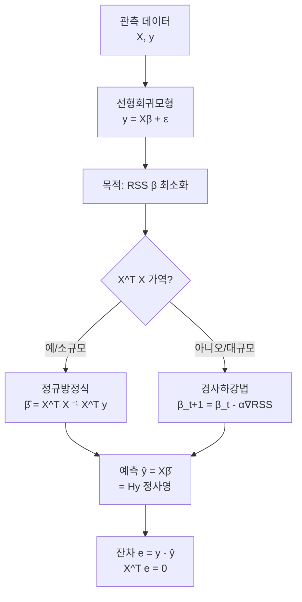
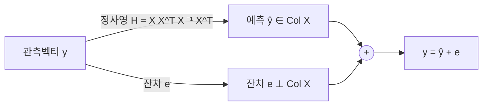

# 6강. AI를 위한 수학의 응용: 선형회귀와 최소제곱법

## 🔗 선수 지식 (Prerequisites)
- [ ] **필수**: 벡터·행렬 연산 (전치, 곱, 역행렬) - 이해 완료?
- [ ] **필수**: 벡터/행렬 미분 ($\nabla_\beta f$) - 이해 완료?
- [ ] **필수**: 내적·노름·정사영(projection) 개념
- [ ] **권장**: 다변수 함수의 극값과 1계 조건
- **관련 단원**: [2강 벡터와 행렬](2강.md), [5강 특이값 분해(SVD)](5강.md)

---

## 학습 목표
1. 선형회귀모형을 행렬과 벡터로 간결하게 표현할 수 있다.
2. 최소제곱법과 정규방정식을 통해 회귀계수를 추정할 수 있다.
3. 경사하강법 알고리즘의 원리를 이해하고 적용할 수 있다.

---

## 🧠 메타인지 체크 (학습 전/후 자기 평가)

### 학습 전 자기 평가
| 소주제 | 자신감 (1-5) |
| :--- | :--- |
| 선형회귀의 행렬 표현 $y = X\beta + \epsilon$ | |
| 오차(error)와 잔차(residual)의 구분 | |
| 정규방정식 유도와 최소제곱해 | |
| 예측값의 정사영 해석(Hat matrix) | |
| 경사하강법의 업데이트 규칙 | |

### 학습 후 교정 (학습 완료 후 작성)
| 소주제 | 학습 전 | 학습 후 | 실제 정답률 | 과신/과소 여부 |
| :--- | :--- | :--- | :--- | :--- |
| 행렬 표현 | | | | |
| 오차 vs 잔차 | | | | |
| 정규방정식 | | | | |
| 정사영 해석 | | | | |
| 경사하강법 | | | | |

> **활용법**: 학습 전 1분 → 자신감 기입, 학습 후 1분 → 나머지 기입. "과신" 영역이 실제 취약점.

---

## 📝 요약 (Summary)

### 선형회귀모형의 행렬 표현 🔴
1. **모형의 행렬식**: 선형회귀모형은 결과벡터 $y$, 입력 행렬 $X$, 회귀계수 벡터 $\beta$, 오차 벡터 $\epsilon$을 이용하여 $y = X\beta + \epsilon$로 간결하게 표현할 수 있다. 🔴
2. **차원 구조**: $y \in \mathbb{R}^n$, $X \in \mathbb{R}^{n \times (p+1)}$ (절편 포함 시 첫 열이 1), $\beta \in \mathbb{R}^{p+1}$, $\epsilon \in \mathbb{R}^n$. 🟡

### 오차와 잔차의 구분 🔴
3. **잔차(residual)의 정의**: 잔차는 $e = y - \hat{y}$로 정의되며, 추정 결과로부터 계산 가능한 관측값이다. 🔴
4. **오차(error)의 정의**: 오차는 모수에 의해 정의되는 이론적인 항 $\epsilon = y - X\beta$이며 직접 관측되지 않는다. 🔴
5. **개념적 차이**: 오차는 "참값과의 이론적 거리", 잔차는 "추정값과의 실제 거리"이다. 🟡

### 최소제곱법과 정규방정식 🔴
6. **최소제곱법의 목적**: 잔차제곱합 $RSS(\beta) = \|y - X\beta\|^2$을 최소화하는 회귀계수를 찾는 최적화 문제이다. 🔴
7. **정규방정식**: 벡터 미분 $\nabla_\beta RSS = -2X^T(y - X\beta) = 0$에서 $X^T X \hat{\beta} = X^T y$를 얻는다. 🔴
8. **최소제곱해**: $X^T X$가 가역이면 $\hat{\beta} = (X^T X)^{-1} X^T y$로 닫힌 해가 존재한다. 🔴

### 정사영 해석 (기하학적 직관) 🔴
9. **예측값의 정사영**: 추정된 예측값 $\hat{y} = X\hat{\beta}$은 결과벡터 $y$를 입력 행렬 $X$의 열공간 $\text{Col}(X)$으로 정사영한 결과이다. 🔴
10. **Hat matrix**: $\hat{y} = Hy$, 여기서 $H = X(X^T X)^{-1} X^T$는 대칭·멱등($H^2 = H$) 사영행렬이다. 🟡
11. **잔차의 직교성**: 잔차 $e = y - \hat{y}$는 $X$의 열공간과 직교한다 ($X^T e = 0$). 🟡

### 경사하강법 🔴
12. **정규방정식의 한계**: $X^T X$의 역행렬 계산은 $p$가 매우 크거나 $X^T X$가 특이행렬에 가까울 때 비효율적이거나 불안정하다. 🟡
13. **경사하강법 업데이트 규칙**: $\beta_{t+1} = \beta_t - \alpha \nabla_\beta RSS(\beta_t) = \beta_t + 2\alpha X^T(y - X\beta_t)$. 🔴
14. **수렴 관계**: 적절한 학습률 $\alpha$ 하에서 경사하강법은 정규방정식의 해 $\hat{\beta}$로 수렴한다. 🟡
15. **실무적 의의**: 대규모 데이터·고차원 특징에서 경사하강법(SGD, Adam 등)이 사실상 표준이다. 🟢

---

## 📐 핵심 수식/정의 (Core Formulas)

| 수식/정의 | 표현 | 직관적 해석 |
| :--- | :--- | :--- |
| **선형회귀모형 (행렬식)** | $y = X\beta + \epsilon$ | 관측값 = 설계행렬 × 회귀계수 + 오차 |
| **잔차 (residual)** | $e_i = y_i - \hat{y}_i,\ e = y - X\hat{\beta}$ | 추정 후 계산되는 **관측 가능한** 편차 |
| **오차 (error)** | $\epsilon_i = y_i - x_i^T \beta$ | 참 모수 $\beta$ 기준의 **이론적** 편차 (관측 불가) |
| **잔차제곱합 (RSS)** | $RSS(\beta) = \|y - X\beta\|^2 = (y - X\beta)^T(y - X\beta)$ | 모든 잔차 크기의 총합 — 작을수록 적합도 ↑ |
| **RSS의 그래디언트** | $\nabla_\beta RSS = -2X^T(y - X\beta)$ | $\beta$ 한 단위 변화에 대한 RSS 변화 방향 |
| **정규방정식** | $X^T X \hat{\beta} = X^T y$ | 그래디언트=0 조건의 행렬식 |
| **최소제곱해** | $\hat{\beta} = (X^T X)^{-1} X^T y$ | $X^T X$가 가역일 때의 닫힌 해 |
| **예측값** | $\hat{y} = X\hat{\beta} = X(X^T X)^{-1} X^T y$ | $y$를 $\text{Col}(X)$로 정사영 |
| **Hat matrix (사영행렬)** | $H = X(X^T X)^{-1} X^T$ | $H^T = H,\ H^2 = H$ (대칭·멱등) |
| **잔차 직교성** | $X^T (y - X\hat{\beta}) = 0$ | 잔차는 $X$의 모든 열에 수직 |
| **경사하강법 업데이트** | $\beta_{t+1} = \beta_t - \alpha \nabla_\beta RSS(\beta_t)$ | 그래디언트의 **반대** 방향으로 학습률만큼 이동 |
| **선형회귀에서의 GD** | $\beta_{t+1} = \beta_t + 2\alpha X^T(y - X\beta_t)$ | 현재 잔차를 가중하여 $\beta$ 보정 |

### 정리 (Theorem): 최소제곱해의 존재와 유일성

> **명제**: $X \in \mathbb{R}^{n \times (p+1)}$의 열이 일차독립(즉, $\text{rank}(X) = p+1$)이면, $X^T X$는 양정치(positive definite) 가역행렬이며, $RSS(\beta)$를 최소화하는 유일한 해
> $$\hat{\beta} = (X^T X)^{-1} X^T y$$
> 가 존재한다.

> **유도(스케치)**:
> $$RSS(\beta) = (y - X\beta)^T (y - X\beta) = y^T y - 2\beta^T X^T y + \beta^T X^T X \beta$$
> 벡터 미분:
> $$\nabla_\beta RSS = -2 X^T y + 2 X^T X \beta \stackrel{!}{=} 0 \;\Longrightarrow\; X^T X \beta = X^T y$$
> 2계조건: $\nabla^2_\beta RSS = 2 X^T X \succ 0$ (열독립 가정) → 볼록함수의 유일한 최소.

> **AI 적용**: 신경망의 최종 선형층(linear head)도 같은 구조다. 마지막 표현(feature) $X$ 위에서 분류·회귀 가중치 $\beta$가 최소제곱·교차엔트로피로 학습된다. 정규방정식은 닫힌 해, 경사하강법은 깊은 망의 표준 도구.

> ⚠️ **흔한 오해**
> - **"$\nabla_\beta RSS$의 부호 $-2X^T(y-X\beta)$를 외우면 끝"** → 부호의 출처를 이해해야 한다. $RSS=(y-X\beta)^T(y-X\beta)$에서 $\beta$가 들어간 항은 $-2\beta^TX^Ty+\beta^TX^TX\beta$이고, 미분하면 $-2X^Ty+2X^TX\beta = -2X^T(y-X\beta)$. **경사하강법은 이 그래디언트의 *반대* 방향**으로 가므로 $\beta_{t+1}=\beta_t-\alpha\nabla = \beta_t + 2\alpha X^T(y-X\beta_t)$ — `-`(업데이트의 부호)와 `-2`(그래디언트의 부호)가 합쳐져 결과적으로 `+`가 된다. 부호 두 개를 분리해서 추적하라.
> - **"$\hat\beta=(X^TX)^{-1}X^Ty$이므로 $\hat\beta=X^{-1}y$로 줄일 수 있다"** → 거짓. $X$는 보통 $n\times(p+1)$의 **직사각 행렬**이라 $X^{-1}$ 자체가 정의되지 않는다. $(X^TX)^{-1}X^T$ 전체가 $X$의 **좌측 의사역행렬** $X^+$이며, 정방·가역인 특수한 경우에만 $X^+=X^{-1}$로 붕괴한다.
> - **"정규방정식과 우도 최대화(MLE)는 별개의 방법"** → 사실은 **같은 식**이다. 오차가 $\epsilon_i \sim \mathcal{N}(0,\sigma^2)$ i.i.d.를 따른다고 가정하면 로그우도가 $-\frac{1}{2\sigma^2}\|y-X\beta\|^2 + \text{const}$가 되어, 로그우도 최대화 = RSS 최소화 = 정규방정식이 정확히 일치한다(아래 💡 심화 아이디어 참고).

---

## 📊 개념 시각화 (Visual Guide)

### 최소제곱법의 전체 흐름


### 기하학적 직관: 정사영 (Projection)


### 핵심 비교표: 오차 vs 잔차 / 정규방정식 vs 경사하강법

| 구분 | 오차 (Error) | 잔차 (Residual) |
| :--- | :--- | :--- |
| **정의** | $\epsilon = y - X\beta$ (참 모수) | $e = y - X\hat{\beta}$ (추정) |
| **관측 가능성** | 이론적, 관측 불가 | 계산 가능, 데이터로부터 산출 |
| **역할** | 모형 가정의 대상 (정규성 등) | 진단·평가의 대상 (잔차 분석) |
| **합** | $E[\epsilon] = 0$ (가정) | 절편 포함 시 $\sum e_i = 0$ (식별식) |

| 방법 | 정규방정식 | 경사하강법 |
| :--- | :--- | :--- |
| **해의 형태** | 닫힌 해 (1회 계산) | 반복 근사 |
| **연산** | $X^T X$ 역행렬, $O(p^3)$ | 행렬-벡터 곱, 반복당 $O(np)$ |
| **메모리** | $X^T X$ 저장 필요 | 미니배치 가능, 메모리 효율 |
| **불안정성** | 특이/근특이 행렬에 취약 | 학습률·스케일링에 민감 |
| **적합 환경** | $p$가 작고 $X^T X$ 양호 | 대규모·고차원, 딥러닝 |

---

## ✏️ 심화 학습 (Study Subject)

### 1. 가상 시나리오: "어떤 방법을, 언제 사용해야 할까?"
- **상황**: 부동산 가격 예측 모델을 만든다. 특징은 면적·방수·층수 등 5개($p=5$), 데이터 $n = 1{,}000$.
- **문제**: 닫힌 해를 쓸 것인가, 경사하강법을 쓸 것인가? 또한 다중공선성(특징 간 강한 상관)이 의심된다면 어떻게 진단·대응해야 할까?
- **해결**:
  1. **규모 판단**: $p = 5$로 매우 작으므로 정규방정식 $\hat{\beta} = (X^T X)^{-1} X^T y$가 가장 빠르고 정확하다.
  2. **다중공선성 진단**: $X^T X$의 조건수(condition number)·VIF 점검. 큰 값이면 $X^T X$가 거의 특이행렬 → 해가 불안정.
  3. **대응**: 변수 제거 / 표준화 / 능형회귀($\hat{\beta} = (X^T X + \lambda I)^{-1} X^T y$).
  4. **대규모로 확장 시**: $p$가 수천을 넘으면 정규방정식의 $O(p^3)$이 부담 → 경사하강법(미니배치, 모멘텀)로 전환.
- **AI 학습 포인트**: "정규방정식 vs 경사하강법의 wall-clock·메모리·수치안정성 트레이드오프를 $n, p$ 함수로 정량 비교하고, 능형회귀가 어떻게 다중공선성을 완화하는지 $X^T X + \lambda I$의 고유값 관점에서 설명해 줘."

### 2. 관점별 비교 및 오개념 분석

- **핵심 비교**: 오차 vs 잔차, 정규방정식 vs 경사하강법, 정사영 vs 회귀

| 혼동 쌍 | 차이점의 핵심 |
| :--- | :--- |
| **오차 vs 잔차** | 오차는 *참 모수* 기준의 이론적 항이라 관측 불가. 잔차는 *추정* 후 계산 가능한 실제 편차 |
| **$\nabla RSS = 0$ vs $X^T X \beta = X^T y$** | 동일한 1계 조건의 두 표현. 전자는 미분 표현, 후자는 정규방정식 표현 |
| **$X^T X$ vs $X X^T$** | $X^T X \in \mathbb{R}^{(p+1)\times(p+1)}$ (계수 공간), $X X^T \in \mathbb{R}^{n \times n}$ (관측 공간). 정규방정식엔 전자 사용 |
| **Hat matrix $H$ vs $I - H$** | $H$는 $\text{Col}(X)$ 사영, $I - H$는 직교여공간 $\text{Col}(X)^\perp$ 사영 → 잔차 추출 행렬 |
| **학습률 너무 큼 vs 너무 작음** | 큼: 발산/진동. 작음: 수렴은 하나 너무 느림 → 적절한 $\alpha$ 탐색 필요 |

- **오개념 분석**:
    - **오개념 1**: "$X^T X$의 역행렬이 없으면 최소제곱해는 존재하지 않는다."
    - **분석**: 닫힌 해 형태가 없을 뿐, **최소화 자체는 가능**하다. 일반 해는 의사역행렬(Moore-Penrose pseudoinverse) $X^+$를 이용해 $\hat{\beta} = X^+ y$로 표현되며, 그 중 노름 최소해가 유일하게 선택된다.
    - **오개념 2**: "경사하강법은 정규방정식보다 항상 부정확하다."
    - **분석**: 적절한 학습률·반복 수 하에서 경사하강법은 **임의의 정밀도로** 정규방정식 해에 수렴한다. 오히려 $X^T X$가 근특이일 때는 경사하강법(또는 능형 정규화)이 더 안정적일 수 있다.
    - **오개념 3**: "잔차 $e$는 항상 평균이 0이다."
    - **분석**: 모형이 **절편을 포함**할 때만 식별식으로 $\sum e_i = 0$이 성립한다. 절편이 없는(원점 통과) 회귀에서는 잔차합이 0이 아닐 수 있다.
    - **오개념 4**: "Hat matrix는 $y$에 가까운 점을 골라주는 마법 행렬이다."
    - **분석**: $H$는 단순한 **사영연산자**다. $y$를 $\text{Col}(X)$로 직교 사영한다는 **기하학적 사실**일 뿐이며, $\text{Col}(X)$에 속한 벡터 중 $y$와 가장 가까운 점(=거리 최소화)이 자동으로 선택된다.
- **AI 학습 포인트**: "선형회귀의 정규방정식이 신경망 마지막 선형층 학습에서 어떻게 닫힌 해 대신 경사하강법으로 대체되는지, 그리고 ReLU 같은 비선형 활성 함수가 들어오면 왜 닫힌 해가 사라지는지 수학적으로 설명해 줘."

---

## ❓ 연습 문제 및 해설

> **블룸 인지 수준 범례**: [기억] 정의·나열 → [이해] 설명·비교 → [적용] 계산·구현 → [분석] 구별·디버그 → [평가] 판단·비평 → [창조] 설계·제안

### 📝 문제

**1. 📌 ⭐ [기억] 선형회귀모형의 행렬 표현으로 옳은 것은?(#prob-1)**
   > ① $y = \beta X + \epsilon$
   > ② $y = X\beta + \epsilon$
   > ③ $y = X^T \beta + \epsilon$
   > ④ $y = X\beta\epsilon$

<br>

**2. 📌 ⭐ [기억] 다음 중 잔차(residual)에 대한 설명으로 옳은 것은?(#prob-2)**
   > ① 모수 $\beta$에 의해 정의되는 이론적인 항이다.
   > ② $\epsilon = y - X\beta$로 정의된다.
   > ③ 관측값 $y$와 추정값 $\hat{y}$의 차로, 데이터로부터 계산 가능하다.
   > ④ 항상 평균이 0이고 분산이 1인 표준정규분포를 따른다.

<br>

**3. 📌 ⭐⭐ [이해] 잔차제곱합 $RSS(\beta) = \|y - X\beta\|^2$을 $\beta$에 대해 미분하여 0으로 놓았을 때 얻는 식은?(#prob-3)**
   > ① $X \beta = y$
   > ② $X^T X \beta = X^T y$
   > ③ $X X^T \beta = X y^T$
   > ④ $\beta = X^{-1} y$

<br>

**4. 📌 ⭐⭐ [이해] $X^T X$가 가역일 때 최소제곱해 $\hat{\beta}$로 옳은 것은?(#prob-4)**
   > ① $\hat{\beta} = X^{-1} y$
   > ② $\hat{\beta} = (X X^T)^{-1} X y$
   > ③ $\hat{\beta} = (X^T X)^{-1} X^T y$
   > ④ $\hat{\beta} = X^T (X X^T)^{-1} y$

<br>

**5. 📌 ⭐⭐ [적용] 다음과 같이 주어진 단순회귀 데이터에서 $\hat{\beta} = (X^T X)^{-1} X^T y$를 직접 계산하시오.(#prob-5)**
   > $X = \begin{pmatrix} 1 & 1 \\ 1 & 2 \\ 1 & 3 \end{pmatrix},\quad y = \begin{pmatrix} 2 \\ 2 \\ 4 \end{pmatrix}$

   > ① $\hat{\beta} = (0,\ 1)^T$
   > ② $\hat{\beta} = (2/3,\ 1)^T$
   > ③ $\hat{\beta} = (1,\ 2/3)^T$
   > ④ $\hat{\beta} = (1,\ 1)^T$

<br>

**6. 📌 ⭐⭐ [분석] Hat matrix $H = X(X^T X)^{-1} X^T$의 성질로 옳지 않은 것은?(#prob-6)**
   > ① $H^T = H$ (대칭)
   > ② $H^2 = H$ (멱등)
   > ③ $\hat{y} = Hy$
   > ④ $H$는 항상 가역행렬이다.

<br>

**7. 📌 ⭐⭐ [이해] 최소제곱법의 기하학적 해석으로 옳은 것은?(#prob-7)**
   > ① $\hat{y}$는 $y$를 $X$의 행공간으로 사영한 결과이다.
   > ② $\hat{y}$는 $y$를 $X$의 열공간 $\text{Col}(X)$으로 직교 사영한 결과이며, 잔차는 $\text{Col}(X)$에 수직이다.
   > ③ 잔차 $e$는 $X$의 열공간 안에 위치한다.
   > ④ $\hat{y}$와 $y$는 항상 평행하다.

<br>

**8. 📌 ⭐⭐⭐ [평가] 정규방정식과 경사하강법을 비교한 설명 중 옳은 것을 모두 고르시오.(#prob-8)**
   > <보기>
   >
   > 가. 정규방정식은 $X^T X$의 역행렬을 한 번 계산하면 닫힌 해를 얻는다.
   > 나. 경사하강법은 학습률 $\alpha$가 너무 크면 발산하거나 진동할 수 있다.
   > 다. $p$(특징 수)가 매우 큰 경우 정규방정식은 $O(p^3)$의 비용이 부담된다.
   > 라. 경사하강법은 어떠한 경우에도 정규방정식보다 항상 정밀하다.

   > ① 가, 나, 다
   > ② 가, 다, 라
   > ③ 가, 나, 라
   > ④ 가, 나, 다, 라

<br>

**9. 📌 ⭐⭐⭐ [적용] 선형회귀에 대한 경사하강법 업데이트 규칙 $\beta_{t+1} = \beta_t - \alpha \nabla_\beta RSS(\beta_t)$에서, RSS의 그래디언트를 옳게 전개한 것은?(#prob-9)**
   > ① $\nabla_\beta RSS = X^T X \beta - X^T y$
   > ② $\nabla_\beta RSS = -2 X^T (y - X\beta)$
   > ③ $\nabla_\beta RSS = -2 X (y - X^T \beta)$
   > ④ $\nabla_\beta RSS = 2 (y - X\beta)^T X$

<br>

**10. 📌 ⭐⭐⭐ [창조] $X^T X$가 가역이 아닌(특이행렬) 상황에 대한 대응으로 적절하지 않은 것은?(#prob-10)**
   > ① 다중공선성을 일으키는 변수를 제거하거나 결합한다.
   > ② 능형회귀(Ridge): $\hat{\beta} = (X^T X + \lambda I)^{-1} X^T y$로 정규화 항을 추가한다.
   > ③ 의사역행렬(pseudoinverse) $X^+$를 사용해 $\hat{\beta} = X^+ y$로 푼다.
   > ④ $X^T X$가 가역이 아니므로 최소제곱해는 절대로 존재하지 않는다고 결론짓는다.

---

### 🔑 정답 및 해설 (먼저 풀어본 후 펼치기)

<details>
<summary>정답 보기 (클릭)</summary>

1. ②
2. ③
3. ②
4. ③
5. ②
6. ④
7. ②
8. ①
9. ②
10. ④

</details>

<details>
<summary>해설 보기 (클릭)</summary>

<a id="prob-1"></a>
**1. ⭐ [기억] 선형회귀의 행렬 표현**
> **정답: ② $y = X\beta + \epsilon$**
> **해설**: $y \in \mathbb{R}^n$, $X \in \mathbb{R}^{n\times(p+1)}$, $\beta \in \mathbb{R}^{p+1}$, $\epsilon \in \mathbb{R}^n$로 차원이 맞는 유일한 표현이다. ①③은 차원이 맞지 않거나 표기가 다르다.

<a id="prob-2"></a>
**2. ⭐ [기억] 잔차의 정의**
> **정답: ③ 관측값 $y$와 추정값 $\hat{y}$의 차로, 데이터로부터 계산 가능하다.**
> **해설**: 잔차 $e = y - \hat{y}$는 추정 결과로부터 계산되는 관측 가능한 값. ①②는 오차(error)의 설명, ④는 잔차의 분포에 대한 잘못된 일반화.

<a id="prob-3"></a>
**3. ⭐⭐ [이해] 정규방정식의 유도**
> **정답: ② $X^T X \beta = X^T y$**
> **해설**: $RSS(\beta) = y^T y - 2\beta^T X^T y + \beta^T X^T X \beta$, $\nabla_\beta RSS = -2 X^T y + 2 X^T X \beta = 0$ → $X^T X \beta = X^T y$.

<a id="prob-4"></a>
**4. ⭐⭐ [이해] 최소제곱해**
> **정답: ③ $\hat{\beta} = (X^T X)^{-1} X^T y$**
> **해설**: 정규방정식에서 양변에 $(X^T X)^{-1}$을 곱해 얻는다. $X$가 정방행렬이 아닐 때 $X^{-1}$은 정의되지 않으므로 ①은 틀림.

<a id="prob-5"></a>
**5. ⭐⭐ [적용] 정규방정식 직접 계산**
> **정답: ② $\hat{\beta} = (2/3,\ 1)^T$**
> **해설**:
> $X^T X = \begin{pmatrix} 3 & 6 \\ 6 & 14 \end{pmatrix},\quad X^T y = \begin{pmatrix} 8 \\ 18 \end{pmatrix}$
> $\det(X^T X) = 3 \cdot 14 - 6 \cdot 6 = 6$
> $(X^T X)^{-1} = \dfrac{1}{6} \begin{pmatrix} 14 & -6 \\ -6 & 3 \end{pmatrix}$
> $\hat{\beta} = \dfrac{1}{6}\begin{pmatrix} 14 & -6 \\ -6 & 3 \end{pmatrix} \begin{pmatrix} 8 \\ 18 \end{pmatrix} = \dfrac{1}{6}\begin{pmatrix} 112 - 108 \\ -48 + 54 \end{pmatrix} = \dfrac{1}{6}\begin{pmatrix} 4 \\ 6 \end{pmatrix} = \begin{pmatrix} 2/3 \\ 1 \end{pmatrix}$
> 따라서 회귀식은 $\hat{y} = 2/3 + x$.

<a id="prob-6"></a>
**6. ⭐⭐ [분석] Hat matrix의 성질**
> **정답: ④ $H$는 항상 가역행렬이다.**
> **해설**: $H$는 사영행렬이므로 $H^2 = H$이고, 고유값은 0 또는 1뿐이다. 일반적으로 $\text{rank}(H) = \text{rank}(X) = p+1 < n$이므로 **가역이 아니다**. ①②③은 모두 사영행렬의 성질로 옳다.

<a id="prob-7"></a>
**7. ⭐⭐ [이해] 기하학적 해석**
> **정답: ② $\hat{y}$는 $y$를 $\text{Col}(X)$으로 직교 사영한 결과이며, 잔차는 $\text{Col}(X)$에 수직이다.**
> **해설**: $X^T(y - X\hat{\beta}) = 0$이 잔차의 직교성. ①은 행공간이 아니라 열공간, ③은 잔차가 $\text{Col}(X)^\perp$에 있음, ④는 일반적으로 성립하지 않음.

<a id="prob-8"></a>
**8. ⭐⭐⭐ [평가] 두 방법 비교**
> **정답: ① 가, 나, 다**
> **해설**: 가·나·다 모두 옳다. 라는 거짓 - 경사하강법은 적절한 학습률 하에서 정규방정식 해로 **수렴**할 뿐, 모든 경우에 더 정밀하지는 않다.

<a id="prob-9"></a>
**9. ⭐⭐⭐ [적용] RSS의 그래디언트**
> **정답: ② $\nabla_\beta RSS = -2 X^T (y - X\beta)$**
> **해설**: $RSS = (y - X\beta)^T (y - X\beta)$를 $\beta$에 대해 미분하면 $-2X^T(y - X\beta) = 2X^T X\beta - 2X^T y$. ①은 절반 스케일(부호도 다름), ③은 차원이 맞지 않고, ④는 그래디언트가 행벡터/열벡터 표기가 일관되지 않다.

<a id="prob-10"></a>
**10. ⭐⭐⭐ [창조] $X^T X$ 특이 상황 대응**
> **정답: ④ 최소제곱해가 절대로 존재하지 않는다고 결론짓는다.**
> **해설**: 닫힌 해 $(X^T X)^{-1}X^T y$는 없을 수 있어도 **최소화 자체는 가능**하다. 의사역행렬, 능형회귀, 변수 선택 등으로 해결 가능. ①②③은 모두 표준적 대응책.

</details>

---

## ✅ O/X 확인문제 (총 20문항)

**1.** 선형회귀모형의 행렬 표현은 $y = X\beta + \epsilon$이다.(#ox-1) **(O / X)**
**2.** 잔차 $e$는 모수 $\beta$로부터 정의되는 이론적 항이므로 직접 관측되지 않는다.(#ox-2) **(O / X)**
**3.** 오차 $\epsilon = y - X\beta$는 참 모수 $\beta$를 기준으로 정의된다.(#ox-3) **(O / X)**
**4.** 최소제곱법은 잔차제곱합 $\|y - X\beta\|^2$을 최소화하는 $\beta$를 찾는 것이다.(#ox-4) **(O / X)**
**5.** 정규방정식은 $X^T X \hat{\beta} = X^T y$이다.(#ox-5) **(O / X)**
**6.** $X^T X$가 가역이면 최소제곱해는 $\hat{\beta} = (X^T X)^{-1} X^T y$로 유일하게 결정된다.(#ox-6) **(O / X)**
**7.** Hat matrix $H = X(X^T X)^{-1} X^T$는 대칭이고 멱등($H^2 = H$)이다.(#ox-7) **(O / X)**
**8.** 예측값 $\hat{y}$는 $y$를 $X$의 행공간으로 정사영한 결과이다.(#ox-8) **(O / X)**
**9.** 잔차 $e = y - \hat{y}$는 $X$의 열공간과 직교한다 ($X^T e = 0$).(#ox-9) **(O / X)**
**10.** $RSS(\beta)$의 그래디언트는 $\nabla_\beta RSS = -2 X^T(y - X\beta)$이다.(#ox-10) **(O / X)**
**11.** 경사하강법의 업데이트 규칙은 $\beta_{t+1} = \beta_t + \alpha \nabla_\beta RSS$이다(부호 주의).(#ox-11) **(O / X)**
**12.** 학습률 $\alpha$가 너무 크면 경사하강법이 발산하거나 진동할 수 있다.(#ox-12) **(O / X)**
**13.** 정규방정식은 $p$가 매우 크면 $X^T X$의 역행렬 계산 비용이 부담된다.(#ox-13) **(O / X)**
**14.** 절편이 포함된 선형회귀에서 잔차의 합 $\sum_i e_i$는 0이다.(#ox-14) **(O / X)**
**15.** $X^T X$가 양정치이려면 $X$의 열이 일차독립이어야 한다.(#ox-15) **(O / X)**
**16.** $X^T X$가 특이행렬이면 최소제곱 최소화 문제 자체가 존재하지 않는다.(#ox-16) **(O / X)**
**17.** 정사영 관점에서 $\hat{y}$는 $\text{Col}(X)$에 속한 점 중 $y$와의 유클리드 거리가 최소인 점이다.(#ox-17) **(O / X)**
**18.** Hat matrix $H$의 고유값은 0 또는 1이며, 따라서 $H$는 일반적으로 가역이 아니다.(#ox-18) **(O / X)**
**19.** 능형회귀(Ridge)는 $\hat{\beta} = (X^T X + \lambda I)^{-1} X^T y$로, $X^T X$가 근특이일 때 안정성을 높인다.(#ox-19) **(O / X)**
**20.** 적절한 학습률 하에서 선형회귀에 대한 경사하강법은 정규방정식의 해로 수렴한다.(#ox-20) **(O / X)**

<details>
<summary>O/X 정답 및 해설 보기 (클릭)</summary>

> <a id="ox-1"></a>
> **1. 정답**: O
> **해설**: 표준적 행렬 표현이다.

> <a id="ox-2"></a>
> **2. 정답**: X
> **해설**: 이론적 항은 오차(error). 잔차는 $\hat{\beta}$로부터 계산되는 관측 가능한 값이다.

> <a id="ox-3"></a>
> **3. 정답**: O
> **해설**: 오차는 참 모수 기준의 이론적 편차다.

> <a id="ox-4"></a>
> **4. 정답**: O
> **해설**: 최소제곱법의 정의 그 자체.

> <a id="ox-5"></a>
> **5. 정답**: O
> **해설**: $\nabla_\beta RSS = 0$에서 직접 유도된다.

> <a id="ox-6"></a>
> **6. 정답**: O
> **해설**: 열독립 조건 → $X^T X \succ 0$, 유일 해 존재.

> <a id="ox-7"></a>
> **7. 정답**: O
> **해설**: 사영행렬의 정의적 성질이다.

> <a id="ox-8"></a>
> **8. 정답**: X
> **해설**: 행공간이 아니라 **열공간 $\text{Col}(X)$**으로 정사영된다.

> <a id="ox-9"></a>
> **9. 정답**: O
> **해설**: 1계 조건 $X^T(y - X\hat{\beta}) = 0$이 잔차의 직교성을 의미한다.

> <a id="ox-10"></a>
> **10. 정답**: O
> **해설**: 행렬 미분의 표준 결과.

> <a id="ox-11"></a>
> **11. 정답**: X
> **해설**: 부호가 반대다. 그래디언트의 **반대 방향**으로 이동: $\beta_{t+1} = \beta_t - \alpha \nabla_\beta RSS$.

> <a id="ox-12"></a>
> **12. 정답**: O
> **해설**: 적절한 학습률 선택이 핵심 하이퍼파라미터.

> <a id="ox-13"></a>
> **13. 정답**: O
> **해설**: 역행렬 계산 비용이 $O(p^3)$.

> <a id="ox-14"></a>
> **14. 정답**: O
> **해설**: 절편 열(1벡터)의 직교 조건에서 $\sum_i e_i = 0$이 유도된다. (절편이 없으면 일반적으로 성립하지 않음)

> <a id="ox-15"></a>
> **15. 정답**: O
> **해설**: 열독립이면 $X^T X$는 양정치 가역.

> <a id="ox-16"></a>
> **16. 정답**: X
> **해설**: 닫힌 해가 유일하지 않을 뿐, 최소화 문제 자체는 존재하며 의사역행렬·정규화로 해결 가능.

> <a id="ox-17"></a>
> **17. 정답**: O
> **해설**: 정사영의 정의 — 부분공간 위 가장 가까운 점.

> <a id="ox-18"></a>
> **18. 정답**: O
> **해설**: $H^2 = H$이므로 고유값은 $\{0, 1\}$. 일반적으로 $\text{rank}(H) < n$.

> <a id="ox-19"></a>
> **19. 정답**: O
> **해설**: $X^T X + \lambda I$의 고유값이 $\lambda$만큼 증가해 가역성·수치안정성 보장.

> <a id="ox-20"></a>
> **20. 정답**: O
> **해설**: RSS는 볼록함수, 적절한 $\alpha$ 하에서 전역최소(정규방정식 해)로 수렴.

</details>

---

## 🧪 자유 회상 연습 (Free Recall)

> **방법**: 위의 노트를 모두 덮고, 타이머 3분 설정 후 이번 단원에서 배운 내용을 기억나는 대로 자유롭게 적으세요.
> 정확한 문장이 아니어도 됩니다. 키워드, 수식, 관계 등 떠오르는 것을 모두 적습니다.

**자유 회상 작성란:**

```
[여기에 기억나는 내용을 자유롭게 작성]


```

> **회상 후 점검**: 노트를 다시 펼쳐 빠뜨린 내용을 확인하세요. 빠뜨린 부분이 실제 취약점입니다.
> - 회상 못한 핵심 수식: [                ]
> - 회상 못한 기하학적 직관: [                ]

---

## 💻 코드로 확인하기 (Code Verification)

### 예시 1: 정규방정식으로 최소제곱해 직접 계산
```python
import numpy as np

# 데이터: 문제 5와 동일
X = np.array([[1, 1],
              [1, 2],
              [1, 3]], dtype=float)
y = np.array([2, 2, 4], dtype=float)

# 정규방정식: β̂ = (X^T X)^{-1} X^T y
XtX = X.T @ X
Xty = X.T @ y
beta_hat = np.linalg.inv(XtX) @ Xty
print("β̂ (정규방정식):", beta_hat)

# 예측값과 잔차
y_hat = X @ beta_hat
residual = y - y_hat
print("ŷ:", y_hat)
print("잔차 e:", residual)
print("잔차 직교성 X^T e:", X.T @ residual)  # ≈ 0
print("잔차합:", residual.sum())              # 절편 포함 → ≈ 0

# Hat matrix
H = X @ np.linalg.inv(XtX) @ X.T
print("H 대칭:", np.allclose(H, H.T))
print("H 멱등:", np.allclose(H @ H, H))
print("trace(H) =", np.trace(H), "(= rank(X) = 2)")
```

> **실행 결과 (예시)**:
> ```
> β̂ (정규방정식): [0.66666667 1.        ]
> ŷ: [1.66666667 2.66666667 3.66666667]
> 잔차 e: [ 0.33333333 -0.66666667  0.33333333]
> 잔차 직교성 X^T e: [-1.11e-16  0.00e+00]
> 잔차합: -1.11e-16
> H 대칭: True
> H 멱등: True
> trace(H) = 2.0 (= rank(X) = 2)
> ```
> **해석**: $\hat{\beta} = (2/3, 1)^T$로 손계산과 일치. 잔차의 직교성·잔차합 0·Hat matrix의 사영행렬 성질을 수치적으로 확인.

### 예시 2: 경사하강법으로 같은 문제 풀고 정규방정식 해와 비교
```python
import numpy as np

X = np.array([[1, 1],
              [1, 2],
              [1, 3]], dtype=float)
y = np.array([2, 2, 4], dtype=float)

# 정규방정식 해 (정답)
beta_ne = np.linalg.inv(X.T @ X) @ X.T @ y

# 경사하강법
def gradient_descent(X, y, alpha=0.05, n_iter=5000):
    n, p = X.shape
    beta = np.zeros(p)
    history = []
    for t in range(n_iter):
        grad = -2 * X.T @ (y - X @ beta)
        beta = beta - alpha * grad
        rss = np.sum((y - X @ beta) ** 2)
        history.append(rss)
    return beta, history

beta_gd, hist = gradient_descent(X, y, alpha=0.05, n_iter=5000)
print("β̂ (정규방정식):", beta_ne)
print("β̂ (경사하강법):", beta_gd)
print("절대 오차:", np.abs(beta_ne - beta_gd))
print("최종 RSS:", hist[-1])

# 학습률 비교
for alpha in [0.01, 0.05, 0.1, 0.2]:
    b, h = gradient_descent(X, y, alpha=alpha, n_iter=1000)
    print(f"α={alpha:.2f} → 최종 RSS={h[-1]:.6f},  β={b}")
```

> **실행 결과 (예시)**:
> ```
> β̂ (정규방정식): [0.66666667 1.        ]
> β̂ (경사하강법): [0.66666666 1.00000000]
> 절대 오차: [4.7e-09 1.7e-09]
> 최종 RSS: 0.6666666666667
> α=0.01 → 최종 RSS=0.666667, β=[0.66666666 1.00000000]
> α=0.05 → 최종 RSS=0.666667, β=[0.66666667 1.        ]
> α=0.10 → 최종 RSS=0.666667, β=[0.66666667 1.        ]
> α=0.20 → 최종 RSS=nan,      β=[nan nan]   ← 발산
> ```
> **해석**: 적절한 학습률(0.01~0.10)에서 경사하강법이 정규방정식 해와 본질적으로 동일한 값으로 수렴한다. 학습률이 너무 크면(0.20) 발산하는 것을 확인 — 학습률 선택의 중요성.

---

## 🤖 AI 연결고리 (Concept → AI Application)

| 학습 개념 | AI/ML 적용 분야 | 구체적 사례 |
| :--- | :--- | :--- |
| 선형회귀 행렬식 $y = X\beta + \epsilon$ | 표 형식 데이터(tabular) ML의 기본 | 보험료·주택가격 예측, 베이스라인 모델 |
| 정규방정식 | 닫힌 해 회귀 | scikit-learn `LinearRegression` (내부적으로 SVD 기반) |
| 경사하강법 | 모든 딥러닝 학습의 핵심 | SGD, Adam, AdamW — Transformer/ResNet/LLM 학습 |
| RSS / MSE 손실 | 회귀 손실 함수 | 신경망의 회귀 헤드, 오토인코더 재구성 손실 |
| 최소제곱 = 가우스 MLE | 손실함수의 확률적 근거 | MSE↔가우스 노이즈, 교차엔트로피↔범주분포 |
| 능형회귀 $\lambda\|\beta\|^2$ | 가중치 감쇠(weight decay) | Adam의 $L_2$ ≠ weight decay → **AdamW** |
| Hat matrix·정사영 | 차원 축소·정규화 해석 | PCA(공분산 사영), 능형회귀(정규화 사영) |
| 다중공선성 / $X^T X$ 조건수 | 특징공학·정규화 | Ridge/Lasso, ElasticNet, 표준화·디코릴레이션 |
| 의사역행렬 $X^+$ | 과결정·미결정 시스템 | 신경망의 닫힌 해 분석, 선형 시스템 식별 |
| 학습률 선택 | 옵티마이저 설계 | LR 스케줄러, warmup, cosine decay |

---

## 📖 심화 학습 예시 답안

#### 1. 정규방정식의 유도: 단계별 동작 원리

> 1. **목적함수 전개**:
> $$RSS(\beta) = (y - X\beta)^T (y - X\beta) = y^T y - 2 \beta^T X^T y + \beta^T X^T X \beta$$
> 2. **벡터 미분 공식**:
> $\nabla_\beta(a^T \beta) = a$, $\nabla_\beta(\beta^T A \beta) = (A + A^T)\beta = 2A\beta$ (A 대칭)
> 3. **1계 조건**:
> $\nabla_\beta RSS = -2 X^T y + 2 X^T X \beta \stackrel{!}{=} 0 \Rightarrow X^T X \beta = X^T y$
> 4. **2계 조건(볼록성)**:
> $\nabla^2_\beta RSS = 2 X^T X$. 열독립이면 양정치 → 전역 최소.
> 5. **해**:
> $\hat{\beta} = (X^T X)^{-1} X^T y$

> **머신러닝 관점**: 같은 논리가 신경망 마지막 선형층에 그대로 적용되지만, 일반 신경망은 비선형 활성으로 인해 닫힌 해가 사라져 **경사하강법**이 사실상 유일한 학습 방법이 된다.

#### 2. 정규방정식 vs 경사하강법 비교표 (AI 활용 행 포함)

| 항목 | 정규방정식 | 경사하강법 | AI 활용 시 함의 |
| :--- | :--- | :--- | :--- |
| **해의 형태** | 닫힌 해 | 반복 근사 | 단순 회귀에선 정규방정식, 신경망은 GD |
| **계산 복잡도** | $O(np^2 + p^3)$ | 반복당 $O(np)$ | $p$가 클수록 GD 유리 |
| **메모리** | $X^T X$ 전체 저장 | 미니배치 가능 | 대규모 데이터 → SGD/Adam 필수 |
| **수치 안정성** | $X^T X$ 조건수에 민감 | 적절한 $\alpha$·정규화 | 표준화·learning-rate 스케줄 |
| **확장성** | 선형 모형에 한정 | 임의의 미분 가능 모형 | 딥러닝의 표준 학습 패러다임 |
| **정규화 결합** | Ridge: $(X^TX + \lambda I)^{-1}X^Ty$ | Loss에 $\lambda\|\beta\|^2$ 추가 | weight decay와 동일 효과 |

#### 3. Best Practice: 안정적 선형회귀 구현

- **Bad Practice (나쁜 예시)**
  ```python
  # 무조건 inv() 사용 → 수치 불안정
  beta = np.linalg.inv(X.T @ X) @ X.T @ y
  ```
- **Good Practice (좋은 예시)**
  ```python
  import numpy as np

  def fit_least_squares(X, y, method="lstsq", ridge_lambda=0.0):
      """수치적으로 안정한 최소제곱 해."""
      n, p = X.shape
      if ridge_lambda > 0:
          # Ridge: (X^T X + λI) β = X^T y
          A = X.T @ X + ridge_lambda * np.eye(p)
          b = X.T @ y
          return np.linalg.solve(A, b)
      if method == "lstsq":
          # SVD 기반: rank-deficient에도 안전
          beta, *_ = np.linalg.lstsq(X, y, rcond=None)
          return beta
      if method == "qr":
          # QR 분해: solve보다 안정적
          Q, R = np.linalg.qr(X)
          return np.linalg.solve(R, Q.T @ y)
      raise ValueError(method)

  # 사용 예
  beta = fit_least_squares(X, y, method="lstsq")
  ```
- **설명**: `inv()`는 조건수가 나쁠 때 큰 오차를 야기한다. SVD(`lstsq`)·QR 분해는 수치적으로 안정하며, rank가 부족해도 최소 노름 해를 반환한다. Ridge는 항상 가역인 시스템으로 변환해 안정성을 보장한다.

---

## 📚 핵심 용어집 (Glossary)

| 용어 (한) | 용어 (영) | 수식/표현 | 정의 |
| :--- | :--- | :--- | :--- |
| **선형회귀모형** | Linear Regression Model | $y = X\beta + \epsilon$ | 결과를 입력의 선형결합과 오차로 표현하는 모형 |
| **설계행렬** | Design Matrix | $X \in \mathbb{R}^{n \times (p+1)}$ | 관측치 행, 특징 열로 구성된 입력 행렬 |
| **회귀계수** | Regression Coefficients | $\beta \in \mathbb{R}^{p+1}$ | 각 특징이 결과에 미치는 영향의 추정 모수 |
| **오차** | Error | $\epsilon = y - X\beta$ | 참 모수 기준 이론적 편차 (관측 불가) |
| **잔차** | Residual | $e = y - X\hat{\beta}$ | 추정 후 계산되는 관측 가능 편차 |
| **잔차제곱합** | RSS / SSE | $\|y - X\beta\|^2$ | 잔차 크기의 합, 회귀 손실함수 |
| **최소제곱법** | Least Squares (OLS) | $\min_\beta \|y - X\beta\|^2$ | RSS 최소화로 $\beta$ 추정 |
| **정규방정식** | Normal Equation | $X^T X \hat{\beta} = X^T y$ | 1계 조건의 행렬식 |
| **최소제곱해** | OLS Solution | $\hat{\beta} = (X^T X)^{-1} X^T y$ | 열독립 시 유일한 닫힌 해 |
| **Hat matrix** | Hat / Projection Matrix | $H = X(X^TX)^{-1}X^T$ | 열공간 사영행렬, $\hat{y} = Hy$ |
| **정사영** | Orthogonal Projection | $\hat{y} = \text{proj}_{\text{Col}(X)} y$ | 부분공간 위 최단거리 점 |
| **경사하강법** | Gradient Descent | $\beta_{t+1} = \beta_t - \alpha \nabla_\beta RSS$ | 그래디언트 반대 방향으로 반복 갱신 |
| **학습률** | Learning Rate | $\alpha > 0$ | 경사하강법의 보폭 |
| **의사역행렬** | Pseudoinverse | $X^+$ | rank-deficient에도 정의되는 일반 역 |
| **능형회귀** | Ridge Regression | $(X^TX + \lambda I)^{-1}X^Ty$ | $L_2$ 정규화 회귀 |
| **다중공선성** | Multicollinearity | $X^T X$ 근특이 | 특징 간 강한 선형의존 |

---

## 🤖 AI 학습 파트너를 위한 추가 자료

### 1. 개념 이해를 위한 심층 질문 프롬프트
> **프롬프트 예시**: "최소제곱법의 정규방정식 $X^T X \hat{\beta} = X^T y$를 (1) 벡터 미분 관점, (2) 정사영 기하 관점, (3) 우도 최대화 관점(오차가 등분산 정규분포 가정) 세 가지로 각각 유도해 설명해 줘. 세 관점이 모두 동일한 식에 도달하는 이유를 정리해 줘."

### 2. 문제 해결 능력 강화를 위한 시나리오 프롬프트
> **프롬프트 예시**: "당신은 ML 엔지니어입니다. $n = 10^6$, $p = 10^4$인 회귀 문제에서 정규방정식이 메모리·시간 모두 한계라 경사하강법을 선택했습니다. (1) 미니배치 SGD, (2) 모멘텀, (3) Adam의 업데이트 규칙을 RSS 손실에 대해 명시적으로 적어주고, 각 방법이 안장점·고도조건수 상황에서 어떻게 다르게 행동하는지 설명해 줘. 또한 학습률 스케줄(warmup + cosine decay)이 왜 도움되는지 정량적으로 설명해 줘."

### 3. 수식 풀이 검증 프롬프트
> **프롬프트 예시**: "다음 데이터에 대해 정규방정식으로 손계산한 결과를 검증해 줘.
> $X = \begin{pmatrix} 1 & 1 \\ 1 & 2 \\ 1 & 3 \end{pmatrix},\ y = (2, 2, 4)^T$
> 내가 구한 답: $\hat{\beta} = (2/3,\ 1)^T$, 잔차 $e = (1/3, -2/3, 1/3)^T$, $X^T e = 0$.
> (1) 각 단계 계산을 재현해 확인하고, (2) Hat matrix $H$를 명시적으로 구성한 뒤 $H^2 = H$를 검증해 주고, (3) $\text{trace}(H) = \text{rank}(X)$ 관계를 확인해 줘."

---

## 💡 심화 아이디어 / 더 생각해보기

### 1. 최소제곱 = 가우스 오차 가정 하의 최대우도(MLE)
최소제곱법은 "왜 하필 *제곱* 합인가?"라는 물음에 확률론적 답을 준다. 오차가 독립 등분산 정규분포 $\epsilon_i \sim \mathcal{N}(0,\sigma^2)$를 따른다고 가정하면 우도는
$$L(\beta) = \prod_{i=1}^{n} \frac{1}{\sqrt{2\pi}\,\sigma}\exp\!\Big(-\frac{(y_i - x_i^T\beta)^2}{2\sigma^2}\Big)$$
이고, 로그를 취하면
$$\log L(\beta) = -\frac{1}{2\sigma^2}\underbrace{\sum_{i=1}^{n}(y_i - x_i^T\beta)^2}_{= \,RSS(\beta)} - \frac{n}{2}\log(2\pi\sigma^2).$$
$\beta$에 대해 로그우도를 **최대화**하는 것은 곧 $RSS(\beta)$를 **최소화**하는 것과 동치다 → $\hat\beta_{\text{MLE}} = \hat\beta_{\text{OLS}}$. 즉 **제곱 손실(MSE)을 쓴다는 것은 "노이즈가 가우스다"라고 가정하는 것**과 같다. (오차가 라플라스 분포면 절댓값 손실 $L_1$ → 중앙값 회귀가 MLE가 된다.) 딥러닝에서 회귀 헤드에 MSE를 쓰는 것도 같은 가정의 연장선이다.

### 2. Gauss-Markov 정리: OLS는 왜 "최선"인가 (BLUE)
가우스 정규성까지 가지 않아도, (i) $E[\epsilon]=0$, (ii) $\text{Cov}(\epsilon)=\sigma^2 I$ (등분산·무상관)만 가정하면 **Gauss-Markov 정리**에 의해 OLS 추정량 $\hat\beta=(X^TX)^{-1}X^Ty$은 모든 **선형·불편(linear unbiased)** 추정량 중 분산이 최소다 — 이를 **BLUE**(Best Linear Unbiased Estimator)라 한다. 단, "선형·불편"이라는 울타리 안에서의 최선임에 유의하라. 약간의 편향을 허용하면(능형회귀) 분산을 더 줄여 **평균제곱오차(MSE)**가 더 작아질 수 있다 — 이것이 정규화의 통계적 정당화(편향-분산 트레이드오프)다.

### 3. 능형회귀 ⇔ 가중치 감쇠(weight decay), 그리고 고유값 관점
능형회귀 $\hat\beta_\lambda = (X^TX + \lambda I)^{-1}X^Ty$는 손실에 $L_2$ 벌점을 더한 것이다:
$$\hat\beta_\lambda = \arg\min_\beta \;\|y - X\beta\|^2 + \lambda\|\beta\|^2.$$
- **고유값 관점**: $X^TX$의 고유값을 $\{d_i^2\}$라 하면 $X^TX+\lambda I$의 고유값은 $\{d_i^2+\lambda\}$. $\lambda>0$이면 0에 가까운 고유값(다중공선성·근특이)도 $\lambda$만큼 들어올려져 **항상 가역**이 되고 조건수가 개선된다. 동시에 각 방향의 계수는 $\frac{d_i^2}{d_i^2+\lambda}$ 배로 **수축(shrinkage)**되며, 작은 $d_i$(약한 신호) 방향이 더 강하게 줄어든다.
- **딥러닝 연결**: 손실에 $\lambda\|\theta\|^2$를 더한 경사하강 갱신은 $\theta_{t+1}=\theta_t-\alpha(\nabla \mathcal{L}+2\lambda\theta_t)=(1-2\alpha\lambda)\theta_t-\alpha\nabla\mathcal{L}$ — 매 스텝 가중치를 $(1-2\alpha\lambda)$배로 줄이는 **weight decay**가 바로 이것이다. (단 Adam에서는 $L_2$ 벌점과 weight decay가 일치하지 않아 둘을 분리한 **AdamW**가 표준이 되었다.) 즉 **능형회귀의 $\lambda$ = 딥러닝의 weight decay 계수**.

### 4. 왜 비선형 활성함수가 들어오면 닫힌 해가 사라지는가
선형층 한 개 $\hat y = X\beta$는 $\beta$에 대해 **선형**이라 $RSS$가 $\beta$의 **이차식(볼록)**이고, 그래서 $\nabla=0$이 *선형* 방정식($X^TX\beta=X^Ty$)으로 떨어져 닫힌 해가 나온다. 그러나 $\hat y = W_2\,\sigma(W_1 x)$처럼 비선형 활성 $\sigma$(ReLU, tanh 등)가 끼면 손실이 더 이상 파라미터의 이차식이 아니고 일반적으로 **비볼록**이 된다. $\nabla=0$이 비선형 연립방정식이 되어 일반적 닫힌 해가 없고, 국소 최소·안장점이 다수 존재한다 → **경사하강법(역전파)**이 사실상 유일한 실용적 학습 도구가 되는 근본 이유다.

> ### 💡 더 생각해보기
> - $X^TX$ 대신 $XX^T$(그람 행렬, $n\times n$)로 푸는 **이중(dual) 형태**는 언제 유리할까? ($n \ll p$인 고차원·커널 회귀에서 핵심 — 커널 트릭의 출발점.)
> - 정규방정식을 직접 푸는 대신 $X=QR$ 분해로 $R\hat\beta=Q^Ty$를 푸는 것이 왜 수치적으로 더 안정적인가? ($X^TX$를 형성하면 조건수가 **제곱**되어 정보가 손실된다.)
> - 라쏘($L_1$)는 능형($L_2$)과 달리 왜 계수를 정확히 0으로 만들어 변수 선택 효과를 내는가? (제약 영역이 마름모라 모서리에서 해가 잡히는 기하.)

---

## 🔄 복습 체크 (Spaced Repetition)
- [ ] 1일 후 복습 (날짜: 2026-05-30)
- [ ] 3일 후 복습 (날짜: 2026-06-01)
- [ ] 7일 후 복습 (날짜: 2026-06-05)
- [ ] 14일 후 복습 (날짜: 2026-06-12)
- [ ] 30일 후 복습 (날짜: 2026-06-28)

### 복습 시 자가 평가
| 회차 | 날짜 | 이해도 (1-5) | 취약 부분 메모 |
| :--- | :--- | :--- | :--- |
| 1차 | | | |
| 2차 | | | |
| 3차 | | | |

---

## 📚 참고 자료 (References)

- 한국방송통신대학교 교재 - 『AI를 위한 수학의 응용』 6강. 선형회귀와 최소제곱법
- Hastie, T., Tibshirani, R., & Friedman, J. (2009). *The Elements of Statistical Learning*, Ch. 3 Linear Methods for Regression — https://hastie.su.domains/ElemStatLearn/
- Strang, G. (2016). *Introduction to Linear Algebra*, Ch. 4 Orthogonality (Projection & Least Squares) — https://math.mit.edu/~gs/linearalgebra/
- Boyd, S. & Vandenberghe, L. (2018). *Introduction to Applied Linear Algebra (VMLS)*, Ch. 12-13 Least Squares — https://web.stanford.edu/~boyd/vmls/
- Deisenroth, M. P., Faisal, A. A., & Ong, C. S. (2020). *Mathematics for Machine Learning*, Ch. 9 Linear Regression — https://mml-book.github.io/
- Goodfellow, I., Bengio, Y., & Courville, A. (2016). *Deep Learning*, Ch. 4 Numerical Computation (Gradient-Based Optimization)

### 온라인 검증 출처 (Fact-check URLs)
- Ordinary least squares (normal equation, OLS solution, MLE 동치, Gauss-Markov) — https://en.wikipedia.org/wiki/Ordinary_least_squares
- Projection matrix / Hat matrix (대칭·멱등, $\text{trace}(H)=\text{rank}(X)$, $M=I-H$) — https://en.wikipedia.org/wiki/Projection_matrix
- Gauss–Markov theorem (BLUE) — https://en.wikipedia.org/wiki/Gauss%E2%80%93Markov_theorem
- Ridge regression / Tikhonov regularization (고유값 이동·수축) — https://en.wikipedia.org/wiki/Ridge_regression
- Decoupled Weight Decay Regularization, Loshchilov & Hutter, 2019 (AdamW, $L_2$≠weight decay) — https://arxiv.org/abs/1711.05101
- Moore–Penrose pseudoinverse ($X^+$, 최소노름 최소제곱해) — https://en.wikipedia.org/wiki/Moore%E2%80%93Penrose_inverse
