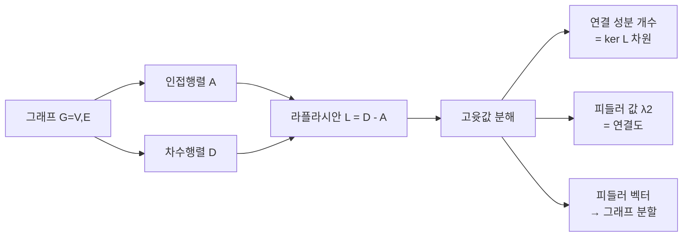
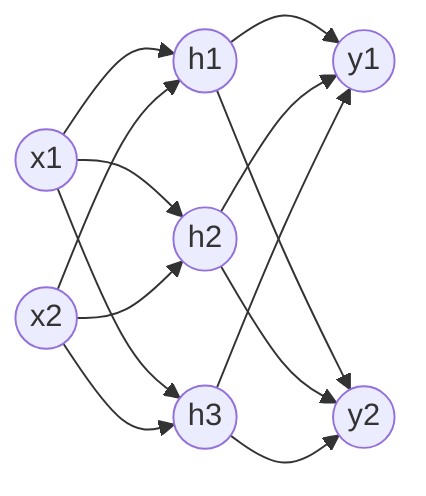
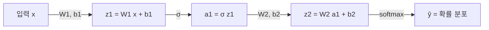

# 7강. AI를 위한 수학의 응용: 그래프와 신경망

## 🔗 선수 지식 (Prerequisites)
- [ ] **필수**: 행렬·벡터 연산 (행렬곱, 전치) — 이해 완료?
- [ ] **필수**: 고윳값·고유벡터의 정의 ($Av = \lambda v$) — 이해 완료?
- [ ] **권장**: 대칭행렬·반정부호(positive semi-definite) 행렬의 성질
- [ ] **권장**: 함수의 합성, 도함수의 개념 (역전파 직관용)
- **관련 단원**: [5강. 고윳값 분해](5강.md) `→5강` / [6강. 선형 변환과 행렬](6강.md) `→6강` / [8강. 신경망 학습과 최적화](8강.md) (예정)

---

## 학습 목표
1. 그래프와 신경망을 행렬과 벡터의 언어로 표현하고, 각 행렬이 가지는 의미를 이해할 수 있다.
2. 신경망의 계산 과정을 선형 연산과 비선형 변환의 반복으로 설명하고, 작은 예제를 통해 직접 계산할 수 있다.

---

## 🧠 메타인지 체크 (학습 전/후 자기 평가)

### 학습 전 자기 평가
| 소주제 | 자신감 (1-5) |
| :--- | :--- |
| 인접행렬·차수행렬·라플라시안 행렬 표현 | |
| 라플라시안의 고윳값과 연결 성분 / 피들러 값 | |
| 신경망의 순전파 (가중치 행렬 · 편향 · 활성화) | |
| 활성화 함수 4종 (ReLU, Sigmoid, Tanh, Softmax) | |

### 학습 후 교정 (학습 완료 후 작성)
| 소주제 | 학습 전 | 학습 후 | 실제 정답률 | 과신/과소 여부 |
| :--- | :--- | :--- | :--- | :--- |
| 그래프 행렬 표현 | | | | |
| 라플라시안 고윳값 | | | | |
| 순전파 계산 | | | | |
| 활성화 함수 | | | | |

> **활용법**: 학습 전 1분 → 자신감 기입, 학습 후 1분 → 나머지 기입. "과신" 영역이 실제 취약점.

---

## 📝 요약 (Summary)

### 그래프의 행렬 표현 🔴
1. **그래프의 정의**: 그래프 $G = (V, E)$는 노드 집합 $V$와 엣지 집합 $E$로 구성된다. 🔴
2. **인접행렬 ($A$)**: 노드 간 연결 여부를 0/1(또는 가중치)로 표현한 $n \times n$ 행렬이다. 무방향 그래프에서는 대칭이다. 🔴
3. **차수행렬 ($D$)**: 각 노드의 차수(연결된 엣지 수)를 대각 원소로 가지는 대각행렬이다. 🔴
4. **라플라시안 행렬 ($L$)**: $L = D - A$로 정의되며, 그래프의 구조와 연결 특성을 동시에 반영한다. 🔴

### 라플라시안 행렬의 성질 🔴
5. **대칭·반정부호성**: 무방향 그래프의 $L$은 대칭이며 모든 고윳값은 0 이상이다. 🔴
6. **0 고윳값과 연결 성분**: 고윳값 0의 중복도(multiplicity)는 그래프의 **연결 성분 개수**와 같다. 🔴
7. **피들러 값(Fiedler value)**: 두 번째로 작은 고윳값 $\lambda_2$로, 그래프의 **대수적 연결도(algebraic connectivity)** 를 나타낸다. 🔴
8. **피들러 벡터**: $\lambda_2$에 대응하는 고유벡터로, 그래프 분할(clustering)에 활용된다. 🟡

### 신경망의 행렬 표현 🔴
9. **신경망 = 그래프**: 신경망은 노드(뉴런)와 가중치 엣지로 이루어진 *층상 그래프*로 해석할 수 있다. 🔴
10. **선형 결합**: 각 층은 $z = Wx + b$ 형태의 선형 연산으로 표현된다. 🔴
11. **비선형 변환**: 활성화 함수 $\sigma$를 적용하여 $a = \sigma(z)$를 얻는다. 비선형성이 없으면 깊이의 의미가 사라진다. 🔴
12. **순전파 (Forward propagation)**: 입력 → (선형 + 활성화) 반복 → 출력. $a^{(l)} = \sigma(W^{(l)} a^{(l-1)} + b^{(l)})$. 🔴

### 활성화 함수 🔴
13. **ReLU**: $\sigma(z) = \max(0, z)$. 계산이 빠르고 기울기 소실을 완화하여 심층 신경망의 표준이 되었다. 🔴
14. **Sigmoid**: $\sigma(z) = 1/(1+e^{-z})$, 출력 $\in (0,1)$. 이진 분류 출력층에 적합. 🔴
15. **Tanh**: $\sigma(z) = \tanh(z)$, 출력 $\in (-1,1)$. 0 중심이라 시그모이드보다 학습 안정성 우수. 🟡
16. **Softmax**: $\sigma(z)_i = e^{z_i} / \sum_j e^{z_j}$. 다중 클래스 분류 출력층에 사용, 확률 분포로 해석. 🔴

---

## 📐 핵심 수식 / 정의 (수학 중심)

### 1) 그래프 행렬 정의

| 행렬 | 정의 | 식 | 직관 |
| :--- | :--- | :--- | :--- |
| **인접행렬** $A$ | 노드 간 연결을 표현 | $A_{ij} = \begin{cases} 1 & (i,j) \in E \\ 0 & \text{otherwise} \end{cases}$ | "누가 누구와 연결되어 있는가" |
| **가중 인접행렬** | 엣지 가중치를 표현 | $A_{ij} = w_{ij}$ | "연결의 강도" |
| **차수행렬** $D$ | 각 노드의 차수 | $D_{ii} = \sum_{j} A_{ij}$, off-diag = 0 | "각 노드가 몇 명과 연결되어 있는가" |
| **라플라시안** $L$ | 차수 − 인접 | $L = D - A$ | "이웃 간 차이를 측정하는 연산자" |
| **정규화 라플라시안** | 스케일 통일 | $\mathcal{L} = I - D^{-1/2} A D^{-1/2}$ | "노드 크기에 무관한 연결성" |

### 2) 라플라시안의 이차형식과 성질

> **정리 (이차형식)**: 임의 벡터 $x \in \mathbb{R}^n$에 대해
> $$x^\top L x = \frac{1}{2}\sum_{(i,j) \in E} (x_i - x_j)^2 \ge 0$$
> 따라서 $L$은 **대칭 반정부호(symmetric PSD)** 행렬이며 모든 고윳값 $\lambda_i \ge 0$이다.

> **정리 (연결 성분과 0 고윳값)**: 그래프 $G$의 연결 성분 개수 $c$는
> $$c = \dim(\ker L) = (\lambda = 0 \text{의 중복도})$$

> **정의 (피들러 값)**: 라플라시안의 고윳값을 오름차순으로 정렬할 때
> $$0 = \lambda_1 \le \lambda_2 \le \cdots \le \lambda_n$$
> 두 번째 고윳값 $\lambda_2$를 **피들러 값(algebraic connectivity)** 이라 한다.
> - $\lambda_2 > 0 \iff G$는 연결 그래프
> - $\lambda_2$가 클수록 그래프는 더 "강하게" 연결되어 있다.

### 3) 신경망 순전파 수식

| 구성 요소 | 수식 | 차원 |
| :--- | :--- | :--- |
| 입력 벡터 | $a^{(0)} = x$ | $n_0 \times 1$ |
| 가중치 행렬 (층 $l$) | $W^{(l)}$ | $n_l \times n_{l-1}$ |
| 편향 벡터 | $b^{(l)}$ | $n_l \times 1$ |
| 선형 결합 (pre-activation) | $z^{(l)} = W^{(l)} a^{(l-1)} + b^{(l)}$ | $n_l \times 1$ |
| 활성화 (post-activation) | $a^{(l)} = \sigma(z^{(l)})$ | $n_l \times 1$ |
| 출력 (분류) | $\hat{y} = \text{softmax}(z^{(L)})$ | $K \times 1$ |

> **순전파 한 줄 요약**: $\boxed{\, a^{(l)} = \sigma\!\left(W^{(l)} a^{(l-1)} + b^{(l)}\right) \,}$

### 4) 활성화 함수 비교

| 함수 | 수식 | 치역 | 도함수 | 특징 |
| :--- | :--- | :--- | :--- | :--- |
| **ReLU** | $\max(0, z)$ | $[0, \infty)$ | $\mathbb{1}[z>0]$ | 계산 단순, 기울기 소실 ↓, dead neuron 주의 |
| **Sigmoid** | $\dfrac{1}{1+e^{-z}}$ | $(0, 1)$ | $\sigma(z)(1-\sigma(z))$ | 확률 해석, 큰 $|z|$에서 기울기 소실 |
| **Tanh** | $\dfrac{e^z - e^{-z}}{e^z + e^{-z}}$ | $(-1, 1)$ | $1 - \tanh^2(z)$ | 0 중심, 시그모이드보다 안정 |
| **Softmax** | $\dfrac{e^{z_i}}{\sum_j e^{z_j}}$ | $(0,1)$, 합=1 | $\sigma_i(\delta_{ij} - \sigma_j)$ | 다중 분류 확률 분포 |

> **AI 적용**:
> - 라플라시안 → **그래프 신경망(GNN)**, 스펙트럴 클러스터링의 수학적 기반
> - 순전파 행렬식 → **GPU의 행렬곱 가속**(BLAS, cuBLAS)이 신경망 학습의 핵심 병목·핵심 최적화 대상

> ⚠️ **흔한 오해 (활성화 함수의 도함수)**
> - **"Sigmoid의 도함수는 매번 $e^{-z}$를 다시 미분해야 한다"** → 아니다. $\sigma'(z) = \sigma(z)(1-\sigma(z))$로, **순전파에서 이미 계산한 출력값 $\sigma(z)$만으로** 도함수를 얻는다. 이 성질 덕분에 역전파가 매우 효율적이다.
> - **"Tanh의 도함수도 따로 외워야 한다"** → $\tanh'(z) = 1-\tanh^2(z)$ 역시 출력값만으로 계산된다.
> - **주의**: Sigmoid 도함수의 최댓값은 $z=0$에서 $\sigma'(0)=0.5\times0.5=0.25$에 불과하다. 층을 거칠수록 $0.25$ 이하의 값이 곱해져 **기울기 소실(vanishing gradient)** 이 누적된다. 반면 Tanh의 최대 도함수는 $1$, ReLU는 $z>0$에서 항상 $1$이라 이 문제가 완화된다.

#### 🔢 워크드 예제 — 역전파의 출발점: 활성화 도함수 직접 계산
$z=2$일 때 각 활성화 함수의 출력과 국소 기울기(local gradient)를 구하면:
- **Sigmoid**: $\sigma(2)=\dfrac{1}{1+e^{-2}}\approx 0.8808$, $\sigma'(2)=0.8808\times(1-0.8808)\approx 0.1050$.
- **Tanh**: $\tanh(2)\approx 0.9640$, $\tanh'(2)=1-0.9640^2\approx 0.0707$.
- **ReLU**: $\mathrm{ReLU}(2)=2$, 도함수 $=1$ ($z>0$).

> **해석**: 역전파에서 이 층을 통과하는 기울기는 위 국소 기울기가 **곱해진다**. ReLU(곱 $1$)에 비해 Sigmoid/Tanh는 $|z|$가 커질수록 국소 기울기가 $0$에 가까워져 신호가 약해진다. → 깊은 망에서 ReLU가 선호되는 수학적 이유.

---

## 📊 개념 시각화 (Visual Guide)

### 그래프 → 행렬 표현 흐름


### 신경망 = 층상 그래프


### 순전파 파이프라인


### 핵심 비교표: 활성화 함수 선택 가이드

| 위치 | 추천 함수 | 이유 |
| :--- | :--- | :--- |
| 은닉층 (CNN, MLP) | **ReLU** | 기울기 소실 완화, 계산 빠름 |
| 은닉층 (RNN) | **Tanh** | 0 중심, 시퀀스 학습 안정성 |
| 이진 분류 출력층 | **Sigmoid** | 출력 $\in (0,1) \to$ 확률 해석 |
| 다중 분류 출력층 | **Softmax** | 합 1 → 클래스 확률 분포 |
| 회귀 출력층 | **항등함수** | 실수 범위 그대로 출력 |

---

## ✏️ 심화 학습 (Study Subject)

### 1. 가상 시나리오: "어떤 개념을, 언제 사용해야 할까?"
- **상황**: 4개 노드로 이루어진 작은 소셜 네트워크가 있다. 노드 1-2-3은 서로 연결되어 삼각형을 이루고, 노드 4는 노드 1에만 연결된다. 이 그래프의 연결 구조를 행렬로 분석하고, 동일한 노드 구조 위에 2층 신경망을 얹어 노드 분류를 시도하려 한다.
- **문제**:
  1. 인접행렬·차수행렬·라플라시안을 직접 작성하라.
  2. 라플라시안의 고윳값을 구하고 연결 성분 개수를 판정하라.
  3. 노드 특성 $x \in \mathbb{R}^{4 \times 2}$를 입력으로 하는 2층 신경망(은닉 3, 출력 2, ReLU + Softmax)의 순전파를 행렬식으로 표현하라.
- **해결**:
  1. 엣지 집합 $E = \{(1,2),(2,3),(1,3),(1,4)\}$이므로
     $$A = \begin{pmatrix} 0&1&1&1\\1&0&1&0\\1&1&0&0\\1&0&0&0 \end{pmatrix},\quad D = \mathrm{diag}(3,2,2,1),\quad L = D-A$$
  2. $L$의 고윳값은 $\{0, \lambda_2, \lambda_3, \lambda_4\}$로 0이 1개만 등장 → **연결 성분 1개**(연결 그래프). $\lambda_2 > 0$이므로 연결도 확인.
  3. $H = \mathrm{ReLU}(X W_1^\top + \mathbf{1} b_1^\top)$, $\hat{Y} = \mathrm{softmax}(H W_2^\top + \mathbf{1} b_2^\top)$. 여기서 $X \in \mathbb{R}^{4\times 2}$, $W_1 \in \mathbb{R}^{3\times 2}$, $W_2 \in \mathbb{R}^{2\times 3}$.
- **AI 학습 포인트**: "위 4-노드 그래프에 GCN(Graph Convolutional Network)의 한 층 $H = \sigma(\tilde{D}^{-1/2} \tilde{A} \tilde{D}^{-1/2} X W)$를 적용했을 때, 일반 MLP와 어떻게 다른지 행렬 관점에서 설명해 줘. ($\tilde{A} = A+I$, $\tilde{D}$는 그 차수)"

### 2. 관점별 비교 및 오개념 분석

- **핵심 비교**: 인접행렬 vs 라플라시안, 선형 vs 비선형 층, ReLU vs Sigmoid

| 혼동 쌍 | 차이점의 핵심 |
| :--- | :--- |
| **인접행렬 $A$ vs 라플라시안 $L$** | $A$는 "연결의 존재"를 직접 표현. $L = D - A$는 "이웃 간 차이 연산자"로, 이차형식 $x^\top L x$가 엣지 양 끝의 값 차이의 제곱합이 된다 |
| **연결 성분 수 vs 피들러 값** | 연결 성분 수는 0 고윳값의 *개수*(이산). 피들러 값 $\lambda_2$는 *연결 강도*(연속)로 그래프가 얼마나 잘 끊기지 않는지를 측정 |
| **선형 vs 비선형 층** | 선형층만 쌓으면 어떤 깊이든 $W_{\text{총}} = W_L \cdots W_1$ 하나의 선형변환으로 환원됨. 비선형 활성화가 있어야 표현력이 진정으로 깊어진다 |
| **ReLU vs Sigmoid** | ReLU는 $z>0$에서 기울기 1로 일정 → 기울기 소실 거의 없음. Sigmoid는 $|z|$가 커지면 기울기 $\to 0$ → 깊은 망에서 학습 정체 |
| **Softmax vs Sigmoid (출력층)** | Sigmoid는 각 출력이 독립 확률(다중 라벨). Softmax는 출력이 서로 경쟁하여 합 1 (다중 클래스, 상호 배타) |

- **오개념 분석**:
    - **오개념 1**: "라플라시안의 가장 작은 고윳값 $\lambda_1 > 0$이면 그래프가 잘 연결된 것이다."
    - **분석**: $L$은 항상 $\lambda_1 = 0$이다 (상수 벡터 $\mathbf{1}$이 항상 고유벡터). 연결도를 보려면 *두 번째* 고윳값 $\lambda_2$(피들러 값)를 봐야 한다. $\lambda_2 = 0$이면 그래프가 둘 이상으로 끊어진 상태다.
    - **오개념 2**: "활성화 함수 없이 가중치 행렬만 여러 층 쌓아도 깊은 신경망이 된다."
    - **분석**: $z = W_3 W_2 W_1 x$는 $W' = W_3 W_2 W_1$인 단일 선형변환과 동치다. **비선형 활성화가 없으면 깊이는 의미가 없고**, 표현력은 단층 선형 모델과 같다. 비선형성은 신경망의 핵심이다.
    - **오개념 3**: "ReLU는 미분 불가능한 점($z=0$)이 있어서 학습에 사용할 수 없다."
    - **분석**: $z=0$은 측도 0의 점이며 실무에서는 *서브그래디언트*(보통 0 또는 1)를 사용한다. 자동 미분 프레임워크가 이를 처리하며, 학습은 안정적으로 진행된다.
    - **오개념 4**: "신경망의 가중치 행렬 $W$는 항상 정사각행렬이다."
    - **분석**: $W^{(l)} \in \mathbb{R}^{n_l \times n_{l-1}}$로, 일반적으로 **입력 차원 ≠ 출력 차원**이다. 차원이 줄어들면 압축, 늘어나면 확장 표현으로 볼 수 있다.
- **AI 학습 포인트**: "라플라시안 행렬의 고윳값과 스펙트럴 클러스터링의 관계를 설명하고, 피들러 벡터로 그래프를 두 그룹으로 분할하는 알고리즘을 단계별로 정리해 줘."

---

## ❓ 연습 문제 및 해설

> **블룸 인지 수준 범례**: [기억] 정의·나열 → [이해] 설명·비교 → [적용] 계산·구현 → [분석] 구별·디버그 → [평가] 판단·비평 → [창조] 설계·제안

### 📝 문제

**1. 📌 ⭐ [기억] 라플라시안 행렬의 정의로 옳은 것은?(#prob-1)**
   > ① $L = A - D$
   > ② $L = D - A$
   > ③ $L = D + A$
   > ④ $L = A \cdot D$

<br>

**2. 📌 ⭐ [기억] 다음 활성화 함수와 출력 범위가 잘못 짝지어진 것은?(#prob-2)**
   > ① ReLU : $[0, \infty)$
   > ② Sigmoid : $(0, 1)$
   > ③ Tanh : $(-1, 1)$
   > ④ Softmax : $(-\infty, \infty)$

<br>

**3. 📌 ⭐⭐ [적용] 다음 무방향 그래프의 인접행렬과 차수행렬, 라플라시안을 구한 결과로 옳은 것은?(#prob-3)**
   > 노드 집합 $V = \{1,2,3\}$, 엣지 집합 $E = \{(1,2), (2,3)\}$

   > ① $A = \begin{pmatrix}0&1&0\\1&0&1\\0&1&0\end{pmatrix},\ D = \mathrm{diag}(1,2,1),\ L = \begin{pmatrix}1&-1&0\\-1&2&-1\\0&-1&1\end{pmatrix}$
   > ② $A = \begin{pmatrix}0&1&1\\1&0&0\\1&0&0\end{pmatrix},\ D = \mathrm{diag}(2,1,1),\ L = D - A$
   > ③ $A = \begin{pmatrix}1&1&0\\1&1&1\\0&1&1\end{pmatrix},\ D = \mathrm{diag}(2,3,2),\ L = D - A$
   > ④ $A = \begin{pmatrix}0&1&0\\1&0&1\\0&1&0\end{pmatrix},\ D = \mathrm{diag}(2,2,2),\ L = D - A$

<br>

**4. 📌 ⭐⭐ [이해] 라플라시안 행렬 $L$의 고윳값에 대한 설명으로 옳지 않은 것은?(#prob-4)**
   > ① 무방향 그래프의 $L$은 대칭이며 모든 고윳값은 0 이상이다.
   > ② 고윳값 0의 중복도는 그래프의 연결 성분 개수와 같다.
   > ③ 가장 작은 고윳값 $\lambda_1$은 항상 0이다.
   > ④ 피들러 값은 가장 큰 고윳값으로 그래프의 분리도를 의미한다.

<br>

**5. 📌 ⭐⭐ [적용] 다음 신경망의 순전파 결과로 옳은 것은?(#prob-5)**
   > 입력 $x = \begin{pmatrix}1\\2\end{pmatrix}$, 가중치 $W = \begin{pmatrix}1&-1\\0&2\end{pmatrix}$, 편향 $b = \begin{pmatrix}0\\1\end{pmatrix}$, 활성화 함수 ReLU 적용
   >
   > $a = \mathrm{ReLU}(Wx + b)$ 의 값은?

   > ① $\begin{pmatrix}-1\\5\end{pmatrix}$
   > ② $\begin{pmatrix}0\\5\end{pmatrix}$
   > ③ $\begin{pmatrix}1\\4\end{pmatrix}$
   > ④ $\begin{pmatrix}0\\4\end{pmatrix}$

<br>

**6. 📌 ⭐⭐ [이해] 비선형 활성화 함수가 신경망에 반드시 필요한 이유로 가장 적절한 것은?(#prob-6)**
   > ① 가중치의 절댓값을 1 미만으로 유지하기 위해
   > ② 선형 변환만 반복하면 한 개의 선형 변환과 동치가 되어 깊이의 효과가 사라지기 때문
   > ③ 출력값을 항상 0과 1 사이로 만들기 위해
   > ④ 가중치 행렬을 정사각행렬로 만들기 위해

<br>

**7. 📌 ⭐⭐⭐ [분석] 다음 라플라시안 행렬의 고윳값이 $\{0, 0, 3, 3\}$일 때, 옳은 해석은?(#prob-7)**
   > ① 그래프는 연결되어 있으며 피들러 값은 0이다.
   > ② 그래프는 2개의 연결 성분으로 이루어져 있으며 피들러 값은 0이다.
   > ③ 그래프는 4개의 연결 성분으로 이루어져 있다.
   > ④ 피들러 값은 3이며 그래프는 매우 강하게 연결되어 있다.

<br>

**8. 📌 ⭐⭐⭐ [적용] 출력층의 pre-activation이 $z = (1, 2, 3)^\top$일 때, Softmax 결과의 *대소 순서와 합*으로 옳은 것은?(#prob-8)**
   > <보기>
   >
   > 가. $\sigma_1 < \sigma_2 < \sigma_3$
   > 나. $\sigma_1 + \sigma_2 + \sigma_3 = 1$
   > 다. $\sigma_3 = e^3 / (e^1 + e^2 + e^3)$
   > 라. 모든 $\sigma_i > 1/3$

   > ① 가, 나
   > ② 가, 나, 다
   > ③ 가, 나, 다, 라
   > ④ 나, 라

<br>

**9. 📌 ⭐⭐⭐ [평가] 다음 중 활성화 함수 선택으로 가장 부적절한 것은?(#prob-9)**
   > ① 10개 클래스 분류의 출력층 → Softmax
   > ② 이진 분류(스팸/정상)의 출력층 → Sigmoid
   > ③ 깊은 CNN의 은닉층 → Sigmoid (기울기 소실을 활용하기 위해)
   > ④ 회귀 문제(주택 가격 예측)의 출력층 → 항등함수(linear)

<br>

**10. 📌 ⭐⭐⭐ [창조] 4개 노드로 이루어진 그래프를 노드 $\{1, 2\}$와 $\{3, 4\}$ 두 그룹으로 분할하고 싶다. 라플라시안의 어떤 정보를 활용해야 하는가?(#prob-10)**
   > ① 가장 큰 고윳값 $\lambda_n$ 에 대응하는 고유벡터 부호로 그룹 결정
   > ② 가장 작은 고윳값 $\lambda_1 = 0$ 에 대응하는 고유벡터 부호로 그룹 결정
   > ③ 두 번째로 작은 고윳값(피들러 값) $\lambda_2$ 에 대응하는 고유벡터(피들러 벡터)의 부호로 그룹 결정
   > ④ 인접행렬 $A$의 대각 원소의 크기로 그룹 결정

---

### 🔑 정답 및 해설 (먼저 풀어본 후 펼치기)

<details>
<summary>정답 보기 (클릭)</summary>

1. ②
2. ④
3. ①
4. ④
5. ②
6. ②
7. ②
8. ②
9. ③
10. ③

</details>

<details>
<summary>해설 보기 (클릭)</summary>

<a id="prob-1"></a>
**1. ⭐ [기억] 라플라시안의 정의**
> **정답: ② $L = D - A$**
> **해설**: 라플라시안 행렬은 차수행렬에서 인접행렬을 뺀 것으로 정의된다. 이때 $L$은 대칭·반정부호 행렬이 된다.

<a id="prob-2"></a>
**2. ⭐ [기억] 활성화 함수의 출력 범위**
> **정답: ④ Softmax : $(-\infty, \infty)$**
> **해설**: Softmax의 출력은 $(0, 1)$ 사이의 확률값이며 모든 성분의 합이 1이다. $(-\infty, \infty)$는 잘못된 설명이다.

<a id="prob-3"></a>
**3. ⭐⭐ [적용] 그래프의 행렬 표현**
> **정답: ①**
> **해설**: 엣지 $(1,2), (2,3)$만 있는 경로 그래프이므로
> - $A_{12} = A_{21} = 1$, $A_{23} = A_{32} = 1$, 나머지 0
> - 차수: 노드 1 → 1, 노드 2 → 2, 노드 3 → 1
> - $L = D - A$로 직접 계산하면 ①의 형태가 된다.

<a id="prob-4"></a>
**4. ⭐⭐ [이해] 라플라시안 고윳값**
> **정답: ④ 피들러 값은 가장 큰 고윳값으로 그래프의 분리도를 의미한다.**
> **해설**: 피들러 값은 **두 번째로 작은** 고윳값 $\lambda_2$이며, 값이 클수록 연결도가 강함을 의미한다. ①②③은 모두 옳다.

<a id="prob-5"></a>
**5. ⭐⭐ [적용] 순전파 계산**
> **정답: ② $\begin{pmatrix}0\\5\end{pmatrix}$**
> **해설**:
> $Wx = \begin{pmatrix}1\cdot 1 + (-1)\cdot 2 \\ 0\cdot 1 + 2 \cdot 2\end{pmatrix} = \begin{pmatrix}-1\\4\end{pmatrix}$
> $z = Wx + b = \begin{pmatrix}-1\\5\end{pmatrix}$
> $\mathrm{ReLU}(z) = \begin{pmatrix}\max(0,-1)\\\max(0,5)\end{pmatrix} = \begin{pmatrix}0\\5\end{pmatrix}$

<a id="prob-6"></a>
**6. ⭐⭐ [이해] 비선형성의 필요성**
> **정답: ② 선형 변환만 반복하면 한 개의 선형 변환과 동치가 되어 깊이의 효과가 사라지기 때문**
> **해설**: 활성화 없이 $W_3 W_2 W_1 x$는 결국 단일 선형 변환 $W' x$와 같다. 비선형 활성화가 있어야 합성으로 인한 표현력 향상이 일어난다.

<a id="prob-7"></a>
**7. ⭐⭐⭐ [분석] 고윳값과 연결 성분**
> **정답: ② 그래프는 2개의 연결 성분으로 이루어져 있으며 피들러 값은 0이다.**
> **해설**: 0 고윳값의 중복도(2)가 연결 성분 개수다. 따라서 그래프는 2개의 분리된 부분으로 구성된다. 피들러 값($\lambda_2$)도 0이 되어 "끊어진 그래프"임을 수치적으로 확인할 수 있다.

<a id="prob-8"></a>
**8. ⭐⭐⭐ [적용] Softmax 성질**
> **정답: ② 가, 나, 다**
> **해설**: Softmax는 단조 증가 변환이므로 $z$의 대소 순서를 그대로 보존(가). 정의상 합은 1(나). 식 그대로 ($e^3$/분모) 표현 가능(다). 라는 틀림 — 모든 $\sigma_i = 1/3$이 되려면 $z$의 성분이 모두 같아야 한다. $z = (1,2,3)$에서는 $\sigma_1 \approx 0.09$로 $1/3$보다 작다.

<a id="prob-9"></a>
**9. ⭐⭐⭐ [평가] 활성화 함수 선택**
> **정답: ③ 깊은 CNN의 은닉층 → Sigmoid (기울기 소실을 활용하기 위해)**
> **해설**: 깊은 망에서 Sigmoid는 **기울기 소실 문제를 일으키므로 회피 대상**이다. "활용한다"는 설명 자체가 잘못이다. 통상 ReLU 계열을 사용한다. ①②④는 정석 선택이다.

<a id="prob-10"></a>
**10. ⭐⭐⭐ [창조] 그래프 분할(스펙트럴 클러스터링)**
> **정답: ③ 피들러 벡터의 부호로 그룹 결정**
> **해설**: 스펙트럴 클러스터링은 라플라시안의 두 번째 고윳값(피들러 값)에 대응하는 **피들러 벡터의 성분 부호**(양/음)에 따라 노드를 두 그룹으로 분할한다. $\lambda_1$의 고유벡터는 상수 벡터라 분할 정보가 없다.

</details>

---

## ✅ O/X 확인문제 (총 20문항)

**1.** 무방향 그래프의 인접행렬은 대칭행렬이다.(#ox-1) **(O / X)**
**2.** 차수행렬은 항상 대각행렬이다.(#ox-2) **(O / X)**
**3.** 라플라시안 행렬은 $L = A + D$로 정의된다.(#ox-3) **(O / X)**
**4.** 라플라시안 행렬은 대칭이며 반정부호(PSD)이다.(#ox-4) **(O / X)**
**5.** 라플라시안의 가장 작은 고윳값 $\lambda_1$은 항상 0이다.(#ox-5) **(O / X)**
**6.** 라플라시안의 0 고윳값 중복도는 그래프의 연결 성분 개수와 같다.(#ox-6) **(O / X)**
**7.** 피들러 값이 0이면 그래프는 연결되어 있다.(#ox-7) **(O / X)**
**8.** 피들러 벡터는 그래프를 두 부분으로 분할하는 데 사용된다.(#ox-8) **(O / X)**
**9.** 신경망의 한 층은 $z = Wx + b$로 표현되는 선형 결합이다.(#ox-9) **(O / X)**
**10.** 활성화 함수 없이 가중치 행렬만 여러 층 쌓으면 표현력이 단층보다 강해진다.(#ox-10) **(O / X)**
**11.** ReLU 함수의 치역은 $[0, \infty)$이다.(#ox-11) **(O / X)**
**12.** Sigmoid 함수는 출력이 $(0, 1)$ 범위이며 확률로 해석할 수 있다.(#ox-12) **(O / X)**
**13.** Tanh의 출력은 0 중심이라 Sigmoid보다 학습이 안정적인 경향이 있다.(#ox-13) **(O / X)**
**14.** Softmax 함수의 출력 성분의 합은 항상 1이다.(#ox-14) **(O / X)**
**15.** 깊은 신경망의 은닉층에는 보통 Sigmoid보다 ReLU가 선호된다.(#ox-15) **(O / X)**
**16.** 다중 클래스 분류 출력층에는 Softmax가 적합하다.(#ox-16) **(O / X)**
**17.** 신경망의 가중치 행렬 $W^{(l)}$은 항상 정사각행렬이어야 한다.(#ox-17) **(O / X)**
**18.** $x^\top L x = \frac{1}{2}\sum_{(i,j)\in E}(x_i - x_j)^2$ 이 성립한다.(#ox-18) **(O / X)**
**19.** 라플라시안의 모든 고윳값은 0보다 크다.(#ox-19) **(O / X)**
**20.** ReLU는 $z = 0$에서 미분이 정의되지 않으므로 실무 학습에 사용할 수 없다.(#ox-20) **(O / X)**

<details>
<summary>O/X 정답 및 해설 보기 (클릭)</summary>

> <a id="ox-1"></a>
> **1. 정답**: O
> **해설**: 무방향 그래프에서 $(i,j) \in E \iff (j,i) \in E$이므로 $A^\top = A$.

> <a id="ox-2"></a>
> **2. 정답**: O
> **해설**: 차수행렬은 대각에만 차수 값을 가지고 나머지는 0이다.

> <a id="ox-3"></a>
> **3. 정답**: X
> **해설**: 정의는 $L = D - A$이다.

> <a id="ox-4"></a>
> **4. 정답**: O
> **해설**: $x^\top L x \ge 0$이 모든 $x$에서 성립하므로 PSD이다.

> <a id="ox-5"></a>
> **5. 정답**: O
> **해설**: 상수 벡터 $\mathbf{1}$이 $L \mathbf{1} = 0$이므로 0이 항상 고윳값이며, $L \succeq 0$이라 0이 최소다.

> <a id="ox-6"></a>
> **6. 정답**: O
> **해설**: 핵심 정리. 각 연결 성분의 지표 벡터가 0 고윳값의 독립적 고유벡터를 만든다.

> <a id="ox-7"></a>
> **7. 정답**: X
> **해설**: $\lambda_2 = 0$이면 0 고윳값이 둘 이상 → 연결 성분이 2개 이상 → **그래프가 연결되어 있지 않다**.

> <a id="ox-8"></a>
> **8. 정답**: O
> **해설**: 피들러 벡터의 부호 분할이 스펙트럴 클러스터링의 기본이다.

> <a id="ox-9"></a>
> **9. 정답**: O
> **해설**: 가중치 행렬과 편향 벡터의 아핀 변환이다.

> <a id="ox-10"></a>
> **10. 정답**: X
> **해설**: $W_L \cdots W_1 = W'$인 단일 선형 변환과 동치라 표현력이 깊이만큼 늘지 않는다.

> <a id="ox-11"></a>
> **11. 정답**: O
> **해설**: $\max(0, z)$이므로 음수 입력에서 0, 양수 입력에서 $z$.

> <a id="ox-12"></a>
> **12. 정답**: O
> **해설**: $1/(1+e^{-z}) \in (0,1)$이며 이진 분류 확률 해석에 사용된다.

> <a id="ox-13"></a>
> **13. 정답**: O
> **해설**: 출력 평균이 0 근처라 다음 층 입력 분포가 0 중심이 되어 학습 안정성이 향상된다.

> <a id="ox-14"></a>
> **14. 정답**: O
> **해설**: $\sum_i e^{z_i} / \sum_j e^{z_j} = 1$.

> <a id="ox-15"></a>
> **15. 정답**: O
> **해설**: Sigmoid는 기울기 소실로 깊은 망 학습이 어려워 ReLU가 사실상 표준이다.

> <a id="ox-16"></a>
> **16. 정답**: O
> **해설**: 클래스가 상호 배타적일 때 확률 분포 출력으로 Softmax가 적합.

> <a id="ox-17"></a>
> **17. 정답**: X
> **해설**: $W^{(l)} \in \mathbb{R}^{n_l \times n_{l-1}}$로 입력·출력 차원이 다를 수 있어 일반적으로 직사각형이다.

> <a id="ox-18"></a>
> **18. 정답**: O
> **해설**: 라플라시안의 핵심 이차형식 공식. 엣지 양 끝 값 차이의 제곱합.

> <a id="ox-19"></a>
> **19. 정답**: X
> **해설**: 라플라시안은 항상 $\lambda = 0$을 고윳값으로 가지므로 "모두 양수"는 틀림.

> <a id="ox-20"></a>
> **20. 정답**: X
> **해설**: $z=0$은 측도 0의 점이고, 자동 미분 프레임워크에서 서브그래디언트(보통 0 또는 1)로 처리하여 학습은 정상 진행된다.

</details>

---

## 🧪 자유 회상 연습 (Free Recall)

> **방법**: 위의 노트를 모두 덮고, 타이머 3분 설정 후 이번 단원에서 배운 내용을 기억나는 대로 자유롭게 적으세요.
> 정확한 문장이 아니어도 됩니다. 키워드, 수식, 관계 등 떠오르는 것을 모두 적습니다.

**자유 회상 작성란:**

```
[여기에 기억나는 내용을 자유롭게 작성]


```

> **회상 후 점검**: 노트를 다시 펼쳐 빠뜨린 내용을 확인하세요. 빠뜨린 부분이 실제 취약점입니다.
> - 회상 못한 그래프 행렬: [                ]
> - 회상 못한 활성화 함수: [                ]
> - 회상 못한 라플라시안 성질: [                ]

---

## 💻 코드로 확인하기 (Code Verification)

### 예시 1: 그래프 행렬 표현과 라플라시안 고윳값 분석
```python
import numpy as np

# 4개 노드 그래프: 노드 1-2-3은 삼각형, 노드 4는 노드 1에만 연결
# (인덱스는 0부터: 0-1-2 삼각형, 3은 0에만 연결)
A = np.array([
    [0, 1, 1, 1],
    [1, 0, 1, 0],
    [1, 1, 0, 0],
    [1, 0, 0, 0],
], dtype=float)

# 차수행렬 D
D = np.diag(A.sum(axis=1))
print("인접행렬 A:\n", A)
print("\n차수행렬 D:\n", D)

# 라플라시안 L = D - A
L = D - A
print("\n라플라시안 L = D - A:\n", L)

# 대칭·PSD 확인
print("\n대칭 여부:", np.allclose(L, L.T))

# 고윳값 분해
eigvals, eigvecs = np.linalg.eigh(L)   # eigh: 대칭행렬 전용 (오름차순)
print("\n고윳값(오름차순):", np.round(eigvals, 4))
print("연결 성분 개수 = 0 고윳값 개수 =", int(np.sum(np.isclose(eigvals, 0))))
print("피들러 값 λ2 =", round(eigvals[1], 4))

# 이차형식 검증: x^T L x = Σ_{(i,j)∈E} (x_i - x_j)^2  (각 무방향 엣지를 한 번씩 합산)
x = np.array([1, 2, 3, 4], dtype=float)
quad = x @ L @ x
edges = [(0,1),(0,2),(0,3),(1,2)]   # 각 무방향 엣지를 한 번씩
sum_sq = sum((x[i]-x[j])**2 for i,j in edges)
print(f"\nx^T L x = {quad:.4f}, Σ_(i,j)∈E (x_i - x_j)² = {sum_sq:.4f}")
```

> **실행 결과 (예시)**:
> ```
> 고윳값(오름차순): [0.     1.     3.     4.    ]
> 연결 성분 개수 = 0 고윳값 개수 = 1
> 피들러 값 λ2 = 1.0
> x^T L x = 15.0000, Σ_(i,j)∈E (x_i - x_j)² = 15.0000
> ```
> **해석**:
> - 0 고윳값이 1개 → 그래프는 **연결됨** (연결 성분 1개)
> - $\lambda_2 = 1 > 0$ 으로 연결도 양수 확인
> - 이차형식 $x^\top L x$가 "각 엣지 양 끝 값 차이의 제곱합"과 정확히 일치($=15$)하여 라플라시안의 의미("이웃 간 차이 측정")가 검증됨
> - 표기 주의: 무방향 엣지를 *한 번씩만* 더하면 $x^\top L x = \sum_{\{i,j\}\in E}(x_i-x_j)^2$, *순서쌍 $(i,j),(j,i)$로 두 번* 세면 앞 정리처럼 $\tfrac12\sum$이 된다 — 둘은 같은 값이다 (여기서는 $x=(1,2,3,4)$로 $15$).

### 예시 2: 작은 신경망의 순전파 (NumPy + PyTorch 비교)
```python
import numpy as np

# 2-3-2 신경망: 입력 2 → 은닉 3 (ReLU) → 출력 2 (Softmax)
np.random.seed(0)
x  = np.array([1.0, 2.0])
W1 = np.array([[ 0.5, -0.3],
               [ 0.2,  0.8],
               [-0.1,  0.4]])    # (3, 2)
b1 = np.array([0.1, -0.2, 0.0])
W2 = np.array([[ 1.0, -1.0,  0.5],
               [-0.5,  0.5,  1.0]])  # (2, 3)
b2 = np.array([0.0, 0.1])

def relu(z): return np.maximum(0, z)
def softmax(z):
    z = z - z.max()                # 수치 안정성
    e = np.exp(z); return e / e.sum()

z1 = W1 @ x + b1
a1 = relu(z1)
z2 = W2 @ a1 + b2
y  = softmax(z2)

print("z1:", np.round(z1, 4))
print("a1 = ReLU(z1):", np.round(a1, 4))
print("z2:", np.round(z2, 4))
print("ŷ = softmax(z2):", np.round(y, 4))
print("ŷ의 합:", round(y.sum(), 6))

# --- PyTorch로 동일 계산 검증 ---
import torch
import torch.nn.functional as F
xt = torch.tensor(x, dtype=torch.float32)
W1t = torch.tensor(W1, dtype=torch.float32); b1t = torch.tensor(b1, dtype=torch.float32)
W2t = torch.tensor(W2, dtype=torch.float32); b2t = torch.tensor(b2, dtype=torch.float32)

a1t = F.relu(W1t @ xt + b1t)
yt  = F.softmax(W2t @ a1t + b2t, dim=0)
print("\nPyTorch ŷ:", torch.round(yt, decimals=4).tolist())
```

> **실행 결과 (예시)**:
> ```
> z1: [0.     1.6    0.7   ]
> a1 = ReLU(z1): [0.    1.6   0.7  ]
> z2: [-1.25   1.6  ]
> ŷ = softmax(z2): [0.0547 0.9453]
> ŷ의 합: 1.0
> PyTorch ŷ: [0.0547, 0.9453]
> ```
> **해석**:
> - NumPy 수동 구현과 PyTorch가 동일 결과 → **순전파 = 행렬곱 + 편향 + 활성화의 합성**임을 검증
> - 음수 pre-activation이 ReLU로 0이 되어 "활성/비활성" 이진 패턴이 만들어진다 (희소성)
> - Softmax 출력이 정확히 1이 되어 확률 분포로 해석 가능

---

## 🤖 AI 연결고리 (Concept → AI Application)

| 학습 개념 | AI/ML 적용 분야 | 구체적 사례 |
| :--- | :--- | :--- |
| 인접행렬 $A$ | 그래프 신경망(GNN) | GCN의 메시지 패싱 $H^{(l+1)} = \sigma(\tilde{A} H^{(l)} W^{(l)})$ |
| 라플라시안 $L$ | 스펙트럴 그래프 이론 | 스펙트럴 클러스터링, 라플라시안 정규화 |
| 피들러 값/벡터 | 그래프 분할 | 커뮤니티 탐지, 회로 분할, 이미지 세그멘테이션 |
| 가중치 행렬 $W$ | 모든 신경망의 핵심 파라미터 | MLP, CNN(컨볼루션도 행렬곱으로 표현), Transformer의 Q/K/V |
| 순전파 행렬식 | GPU 가속 추론·학습 | cuBLAS·cuDNN의 GEMM 최적화 |
| ReLU | CNN, Transformer FFN | ResNet, BERT의 GELU/ReLU |
| Sigmoid | 이진 분류, 게이트 | 로지스틱 회귀, LSTM 게이트 |
| Tanh | RNN, GAN 출력 | LSTM 셀 상태, 정규화된 출력 |
| Softmax | 다중 분류·어텐션 | 이미지 분류, Transformer 어텐션 가중치 |

---

## 📖 심화 학습 예시 답안

#### 1. 라플라시안의 이차형식 동작 원리
$L = D - A$의 핵심은 *이웃 간 차이의 측정*이다.

1. **유도**: $x^\top L x = x^\top D x - x^\top A x = \sum_i d_i x_i^2 - \sum_{i,j} A_{ij} x_i x_j$.
2. **무방향 그래프에서**: $\sum_i d_i x_i^2 = \sum_{(i,j) \in E}(x_i^2 + x_j^2)$ (각 노드가 자기 차수만큼 등장).
3. **따라서**: $x^\top L x = \sum_{(i,j) \in E}(x_i^2 - 2 x_i x_j + x_j^2) \cdot \tfrac{1}{1}$이 아니라, 무방향성을 고려해 $\dfrac{1}{2}\sum_{(i,j) \in E}(x_i - x_j)^2 \ge 0$.

> **의미**: 라플라시안은 "엣지로 연결된 노드 사이의 함숫값 차이"의 총합을 측정하는 *그래프 위의 미분 연산자*다. 함숫값이 비슷한 노드 사이의 엣지가 많을수록 $x^\top L x$가 작아진다. → 스펙트럴 클러스터링·라플라시안 정규화의 직관.

#### 2. 그래프 vs 신경망 비교표 (AI 활용 행 포함)

| 구분 | 그래프 | 신경망 | AI 활용 |
| :--- | :--- | :--- | :--- |
| **노드** | 추상적 객체 (사람, 도시, …) | 뉴런(스칼라 값) | GNN: 노드 ≒ 데이터 단위 |
| **엣지** | 관계 / 연결 (0,1 또는 가중치) | 가중치 (실수, 학습 대상) | 학습 = 엣지 가중치 갱신 |
| **핵심 행렬** | 인접/라플라시안 (고정 구조) | 가중치 $W^{(l)}$ (학습 가능) | GCN: 둘을 결합한 형태 |
| **연산** | $x^\top L x$ (구조 측정) | $\sigma(Wx + b)$ (변환) | 메시지 패싱 = 둘의 합성 |
| **분석 도구** | 고윳값 분해 (스펙트럴) | 자동 미분 / 역전파 | 스펙트럴 GNN |

#### 3. 신경망 순전파 Best Practice

- **Bad Practice (나쁜 예시)**
  ```python
  # 활성화 없이 선형층만 쌓기 → 효과적으로 단일 선형 모델
  z = W3 @ (W2 @ (W1 @ x + b1) + b2) + b3
  ```
- **Good Practice (좋은 예시)**
  ```python
  import torch.nn as nn

  class MLP(nn.Module):
      def __init__(self, d_in, d_hid, d_out):
          super().__init__()
          self.net = nn.Sequential(
              nn.Linear(d_in, d_hid),
              nn.ReLU(),                 # 은닉층: ReLU
              nn.Linear(d_hid, d_hid),
              nn.ReLU(),
              nn.Linear(d_hid, d_out),   # 출력층: softmax는 손실에 통합
          )
      def forward(self, x):
          return self.net(x)             # logits 반환; CrossEntropyLoss가 log-softmax 처리

  # 학습 시: criterion = nn.CrossEntropyLoss()
  # → 내부에서 log_softmax + NLL을 결합해 수치 안정적
  ```
- **설명**:
  1. 은닉층마다 비선형 활성화 필수
  2. 분류 출력층에서 직접 `softmax`를 적용하기보다 **CrossEntropyLoss**가 logits를 받아 log-softmax를 내부 계산하여 수치 안정성을 확보한다 (overflow 방지).
  3. 차원 확인: `nn.Linear(d_in, d_hid)`의 가중치는 $(d_{hid}, d_{in})$ 형태로 저장됨.

---

## 💡 심화 아이디어 / 더 생각해보기

1. **라플라시안은 "그래프 위의 미분 연산자"다.**
   연속 공간의 라플라스 연산자 $\Delta f = \nabla^2 f$가 함수의 "주변 평균과의 차이"를 측정하듯, 그래프 라플라시안 $L=D-A$는 $(Lx)_i = \sum_{j\sim i}(x_i - x_j)$로 **노드 값과 이웃 값의 차이의 합**을 측정한다. 이 관점이 GNN의 "메시지 패싱"과 열 확산(heat diffusion) $\dot{x} = -Lx$로 자연스럽게 이어진다.

2. **피들러 값과 GNN의 over-smoothing.**
   GCN 층을 깊게 쌓으면 모든 노드 표현이 비슷해지는 over-smoothing이 일어난다. 이는 반복적인 $\tilde{A}$ 곱이 라플라시안의 저주파(작은 고윳값) 성분만 남기는 일종의 저역통과 필터로 작동하기 때문이다. **피들러 값 $\lambda_2$가 작을수록(연결이 약할수록)** 정보가 천천히 섞인다.

3. **활성화 도함수와 가중치 초기화의 연결.**
   기울기 소실/폭발은 활성화 도함수만의 문제가 아니라 **가중치 행렬의 스펙트럼**과도 얽혀 있다. Xavier(Glorot)·He 초기화는 각 층에서 분산이 보존되도록 가중치 스케일을 조정해, 활성화 도함수와 곱해진 기울기가 적정 크기를 유지하게 한다. → "왜 ReLU에는 He 초기화인가?"를 스스로 유도해 보자.

4. **선형층만으로는 왜 부족한가 — 표현력의 위상.**
   비선형 활성화가 없으면 신경망은 $W' = W_L\cdots W_1$ 하나의 선형변환이며, 결정 경계는 항상 초평면(직선)이다. ReLU 한 겹만 추가해도 결정 경계가 **조각별 선형(piecewise linear)** 으로 꺾이며, 층을 쌓으면 영역(linear region)의 수가 지수적으로 늘어난다(보편 근사 정리의 직관).

---

## 📚 핵심 용어집 (Glossary)

| 용어 (한) | 용어 (영) | 수식/표현 | 정의 |
| :--- | :--- | :--- | :--- |
| **그래프** | Graph | $G = (V, E)$ | 노드 집합과 엣지 집합의 쌍 |
| **인접행렬** | Adjacency Matrix | $A \in \{0,1\}^{n \times n}$ | 노드 간 연결을 표현한 행렬 |
| **차수행렬** | Degree Matrix | $D = \mathrm{diag}(d_1, \dots, d_n)$ | 각 노드의 차수를 대각에 가진 행렬 |
| **라플라시안 행렬** | Laplacian Matrix | $L = D - A$ | 그래프 구조를 표현하는 대칭 PSD 행렬 |
| **정규화 라플라시안** | Normalized Laplacian | $\mathcal{L} = I - D^{-1/2} A D^{-1/2}$ | 스케일 통일된 라플라시안 |
| **고윳값** | Eigenvalue | $L v = \lambda v$ `→5강` | 행렬의 스펙트럼을 구성하는 스칼라 |
| **피들러 값** | Fiedler Value / Algebraic Connectivity | $\lambda_2$ | 라플라시안의 두 번째 작은 고윳값, 연결도 측정 |
| **피들러 벡터** | Fiedler Vector | $v_2$ s.t. $L v_2 = \lambda_2 v_2$ | 그래프 분할에 사용되는 고유벡터 |
| **연결 성분** | Connected Component | $\dim(\ker L) = c$ | 그래프가 분리된 부분의 개수 |
| **신경망** | Neural Network | $f(x) = \sigma_L(W_L \cdots \sigma_1(W_1 x + b_1) \cdots + b_L)$ | 선형 변환과 비선형 활성화의 합성 |
| **가중치 행렬** | Weight Matrix | $W^{(l)} \in \mathbb{R}^{n_l \times n_{l-1}}$ | 층 간 연결 강도를 학습하는 행렬 |
| **편향 벡터** | Bias Vector | $b^{(l)} \in \mathbb{R}^{n_l}$ | 각 뉴런의 절편 |
| **순전파** | Forward Propagation | $a^{(l)} = \sigma(W^{(l)} a^{(l-1)} + b^{(l)})$ | 입력에서 출력으로의 계산 흐름 |
| **활성화 함수** | Activation Function | $\sigma : \mathbb{R} \to \mathbb{R}$ | 비선형 변환 함수 |
| **ReLU** | Rectified Linear Unit | $\max(0, z)$ | 양수만 통과, 깊은 망 표준 |
| **시그모이드** | Sigmoid | $1/(1+e^{-z})$ | $(0,1)$ 출력, 이진 분류용 |
| **하이퍼볼릭 탄젠트** | Tanh | $(e^z - e^{-z})/(e^z + e^{-z})$ | $(-1,1)$ 출력, 0 중심 |
| **소프트맥스** | Softmax | $e^{z_i}/\sum_j e^{z_j}$ | 다중 분류용 확률 분포 |

---

## 🤖 AI 학습 파트너를 위한 추가 자료

### 1. 개념 이해를 위한 심층 질문 프롬프트
> **프롬프트 예시**: "라플라시안 행렬의 이차형식 $x^\top L x = \frac{1}{2}\sum_{(i,j)\in E}(x_i-x_j)^2$ 을 단계별로 유도하고, 이 식이 스펙트럴 클러스터링(Ratio Cut / Normalized Cut)의 목적함수와 어떻게 연결되는지 설명해 줘. 특히 피들러 벡터가 그래프를 두 그룹으로 나눌 때 *왜 최적 근사 해*가 되는지 완화(relaxation) 관점에서 정리해 줘."

### 2. 수식 풀이 검증 프롬프트 (시나리오 기반)
> **프롬프트 예시**: "당신은 신경망 강사입니다. 학생이 다음 2층 신경망의 순전파를 계산했습니다.
> - $x = (1, -1)^\top$, $W_1 = \begin{pmatrix}1&2\\-1&1\end{pmatrix}$, $b_1 = (0, 0)^\top$, 활성화 ReLU
> - $W_2 = (1, 1)$, $b_2 = -1$, 출력은 Sigmoid
> 학생의 답이 $\hat{y} = 0.5$입니다. 단계별로 검증하고, 오류가 있다면 어느 단계에서 무엇이 틀렸는지 지적해 주세요."

### 3. 개념 검증 프롬프트
> **프롬프트 예시**: "다음 주장이 옳은지 검증하고, 각각에 대해 반례 또는 증명 스케치를 제시해 줘.
> (1) 모든 라플라시안 행렬은 가역(invertible)이다.
> (2) 활성화 함수를 모두 항등함수로 바꿔도 신경망의 표현력은 변하지 않는다.
> (3) Softmax의 출력 중 하나만 1에 가깝고 나머지가 0에 가깝다면 입력 logit 차이가 매우 크다.
> (4) 피들러 값이 양수이면 그래프는 연결되어 있다."

---

## 🔄 복습 체크 (Spaced Repetition)
- [ ] 1일 후 복습 (날짜: 2026-05-30)
- [ ] 3일 후 복습 (날짜: 2026-06-01)
- [ ] 7일 후 복습 (날짜: 2026-06-05)
- [ ] 14일 후 복습 (날짜: 2026-06-12)
- [ ] 30일 후 복습 (날짜: 2026-06-28)

### 복습 시 자가 평가
| 회차 | 날짜 | 이해도 (1-5) | 취약 부분 메모 |
| :--- | :--- | :--- | :--- |
| 1차 | | | |
| 2차 | | | |
| 3차 | | | |

---

## 📚 참고 자료 (References)

- 한국방송통신대학교 교재 — 『AI를 위한 수학의 응용』 7장. 그래프와 신경망
- Chung, F. R. K. (1997). *Spectral Graph Theory*. AMS — 라플라시안 행렬과 스펙트럴 이론
- Goodfellow, I., Bengio, Y., & Courville, A. (2016). *Deep Learning*. MIT Press — 6장 Feedforward Networks, 활성화 함수
- Kipf, T. N., & Welling, M. (2017). "Semi-Supervised Classification with Graph Convolutional Networks", ICLR — GCN 원논문
- Fiedler, M. (1973). "Algebraic connectivity of graphs", *Czechoslovak Math. Journal* — 피들러 값 원논문
- PyTorch 공식 문서: `torch.nn.functional` (relu, sigmoid, tanh, softmax)

### 🔗 온라인 참고자료 (검증 출처)
- Laplacian matrix — Wikipedia: https://en.wikipedia.org/wiki/Laplacian_matrix (이차형식 $x^\top L x$, PSD, 0 고윳값과 연결 성분)
- Algebraic connectivity (Fiedler value) — Wikipedia: https://en.wikipedia.org/wiki/Algebraic_connectivity
- Spectral Graph Theory, Laplacian Quadratic Form (Stanford CME305): https://web.stanford.edu/class/cme305/Files/l10.pdf
- Activation function — Wikipedia: https://en.wikipedia.org/wiki/Activation_function (Sigmoid·Tanh·ReLU·Softmax 도함수)
- The Softmax function and its derivative (Eli Bendersky): https://eli.thegreenplace.net/2016/the-softmax-function-and-its-derivative/
- Mathematics for Machine Learning (Deisenroth, Faisal, Ong): https://mml-book.github.io/ (5장 Vector Calculus — 도함수·기울기·연쇄법칙)
- Deep Learning (Goodfellow, Bengio, Courville): https://www.deeplearningbook.org/ (6장 Deep Feedforward Networks)
- 3Blue1Brown, Neural networks 시리즈: https://www.3blue1brown.com/topics/neural-networks (역전파·기울기 직관)
