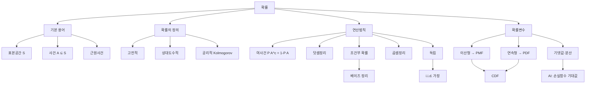
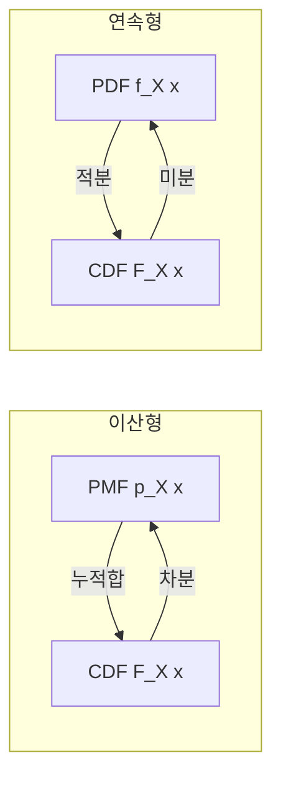

# 08. AI를 위한 수학의 응용: 확률 기초

## 🔗 선수 지식 (Prerequisites)
- [ ] **필수**: 집합론의 기본 (합집합, 교집합, 여집합, 부분집합) - 이해 완료?
- [ ] **필수**: 함수의 정의 — 정의역·공역·치역
- [ ] **권장**: 적분과 미분의 기초 (연속형 확률밀도함수 이해에 필요)
- [ ] **권장**: 순열·조합 (고전적 확률 계산 시 활용)
- **관련 단원**: [7강. 미적분 응용](7강.md) `→` [9강. 확률분포](9강.md)

---

## 학습 목표
1. 확률의 정의를 이해하고 설명할 수 있다.
2. 덧셈정리, 조건부 확률, 곱셈정리 등 확률의 기본 연산법칙을 이해하고, 응용할 수 있다.
3. 확률변수와 기댓값, 분산 등의 핵심 개념을 이해하고 설명할 수 있다.

---

## 🧠 메타인지 체크 (학습 전/후 자기 평가)

### 학습 전 자기 평가
| 소주제 | 자신감 (1-5) |
| :--- | :--- |
| 표본공간·사건·확률의 3가지 정의(고전·상대도수·공리적) | |
| 확률 연산법칙(여사건·덧셈정리·조건부·곱셈정리·독립) | |
| 확률변수와 PMF/CDF/PDF의 관계 | |
| 기댓값·분산의 정의 및 계산 | |

### 학습 후 교정 (학습 완료 후 작성)
| 소주제 | 학습 전 | 학습 후 | 실제 정답률 | 과신/과소 여부 |
| :--- | :--- | :--- | :--- | :--- |
| 확률의 정의 | | | | |
| 확률 연산법칙 | | | | |
| 확률변수·PMF/CDF/PDF | | | | |
| 기댓값·분산 | | | | |

> **활용법**: 학습 전 1분 → 자신감 기입, 학습 후 1분 → 나머지 기입. "과신" 영역이 실제 취약점.

---

## 📝 요약 (Summary)
1. 🔴 **확률의 정의**: 확률이란 어떤 일이 일어날 가능성을 수로 나타낸 것으로, **고전적 정의**(동등 가능한 결과의 비율), **상대도수적 정의**(반복 실험에서 사건 발생 비율의 극한), **공리적 정의**(Kolmogorov의 3공리) 등이 있다.
2. 🔴 **확률의 기본 연산법칙**: 여사건, 덧셈정리, 조건부 확률, 곱셈정리, 독립의 개념을 통해 복합적인 사건의 확률을 체계적으로 계산할 수 있다.
3. 🔴 **확률변수**: 확률변수는 표본공간의 각 원소를 하나의 실숫값에 대응시키는 함수로, 이산형 확률변수는 **확률질량함수(PMF)**, 연속형 확률변수는 **확률밀도함수(PDF)**로 확률분포를 표현한다.
4. 🟡 **누적분포함수(CDF)**: CDF는 이산·연속에 공통적으로 적용되며, $F(x)=P(X\le x)$ 로 정의된다. PMF는 합으로, PDF는 미분으로 CDF와 연결된다.
5. 🔴 **기댓값·분산**: 기댓값은 모든 가능한 값에 대해 각 확률을 반영한 **가중평균**, 분산은 값들이 기댓값으로부터 흩어져 있는 정도를 나타낸다.

---

## 📐 핵심 수식 (Key Formulas)

| 수식명 | 수식 | 의미 |
| :--- | :--- | :--- |
| **고전적 확률** | $P(A)=\dfrac{\|A\|}{\|S\|}=\dfrac{\text{사건 } A \text{의 원소 수}}{\text{표본공간 } S \text{의 원소 수}}$ | 모든 근원사건이 동등 가능할 때 |
| **상대도수적 확률** | $P(A)=\lim_{n\to\infty}\dfrac{n_A}{n}$ | $n$회 반복 중 $A$가 발생한 비율의 극한 |
| **공리적 확률 (Kolmogorov)** | $P(A)\ge 0,\;P(S)=1,\;P\!\left(\bigcup_i A_i\right)=\sum_i P(A_i)\;(\text{서로소})$ | 확률의 수학적 정의 (3공리) |
| **여사건** | $P(A^c)=1-P(A)$ | "$A$가 일어나지 않을 확률" |
| **덧셈정리** | $P(A\cup B)=P(A)+P(B)-P(A\cap B)$ | 합집합의 확률 (중복 1회 제거) |
| **조건부 확률** | $P(A\,\|\,B)=\dfrac{P(A\cap B)}{P(B)}$ ($P(B)>0$) | $B$가 일어났다는 조건 하에 $A$의 확률 |
| **곱셈정리** | $P(A\cap B)=P(B)\,P(A\,\|\,B)=P(A)\,P(B\,\|\,A)$ | 두 사건이 동시에 일어날 확률 |
| **독립의 정의** | $P(A\cap B)=P(A)\,P(B)\;\Leftrightarrow\;P(A\,\|\,B)=P(A)$ | 두 사건이 서로 영향 없음 |
| **이산 확률변수의 PMF** | $p_X(x)=P(X=x),\;\sum_x p_X(x)=1$ | 각 값에 확률을 부여 |
| **연속 확률변수의 PDF** | $f_X(x)\ge 0,\;\int_{-\infty}^{\infty}f_X(x)\,dx=1$ | 면적이 확률, $P(X=x)=0$ |
| **누적분포함수(CDF)** | $F_X(x)=P(X\le x)$ | 이산: $\sum_{t\le x}p_X(t)$ / 연속: $\int_{-\infty}^{x}f_X(t)\,dt$ |
| **PDF–CDF 관계** | $f_X(x)=\dfrac{d}{dx}F_X(x)$ | 연속형: PDF는 CDF의 도함수 |
| **이산형 기댓값** | $E[X]=\sum_x x\,p_X(x)$ | 모든 값의 확률 가중평균 |
| **연속형 기댓값** | $E[X]=\int_{-\infty}^{\infty}x\,f_X(x)\,dx$ | 적분으로 정의되는 가중평균 |
| **분산** | $\text{Var}(X)=E[(X-\mu)^2]=E[X^2]-(E[X])^2$ | 기댓값 주변의 흩어짐 정도 |
| **표준편차** | $\sigma_X=\sqrt{\text{Var}(X)}$ | 분산의 제곱근, 원래 단위 |

> ⚠️ **흔한 오해 (확률밀도 vs 확률)**
> - **"$f_X(x)$ 값이 곧 그 점의 확률이다"** → 틀렸다. $f_X(x)$는 **밀도(density)** 이며, 확률은 항상 구간에 대한 *면적* $P(a\le X\le b)=\int_a^b f_X(x)\,dx$로 정의된다.
> - **"PDF 값은 1을 넘을 수 없다"** → 넘을 수 있다. 예: $X\sim U(0,0.5)$이면 $f_X(x)=2$이지만 $\int_0^{0.5}2\,dx=1$로 정규화는 성립한다. 밀도는 **단위 길이당 확률**이라 구간이 좁으면 1을 초과할 수 있다.
> - **"연속형에서 $P(X=x)>0$인 점이 있다"** → 없다. 연속형은 모든 점에서 $P(X=x)=\int_x^x f=0$. 그래서 $P(X<a)=P(X\le a)$로 부등호 경계가 확률에 영향을 주지 않는다.
> - **"적분으로 누적했으니 CDF도 1을 넘을 수 있다"** → 아니다. PDF는 1을 넘을 수 있어도, CDF $F_X(x)=\int_{-\infty}^x f$는 **확률**이므로 항상 $0\le F_X(x)\le 1$이며 단조 비감소한다.

#### 🔢 워크드 예제 — 미적분의 기본정리로 본 PDF↔CDF (면적 = 확률)
$X\sim U(0,0.5)$, 즉 $f_X(x)=2$ ($0\le x\le 0.5$)를 보자.
- **CDF (적분, 넓이 누적)**: $F_X(x)=\int_0^x 2\,dt = 2x$ (구간 $[0,0.5]$에서). $F_X(0.5)=1$로 끝점에서 정확히 1.
- **PDF (미분, 미적분의 기본정리)**: $f_X(x)=\dfrac{d}{dx}F_X(x)=\dfrac{d}{dx}(2x)=2$. CDF를 미분하면 밀도가 복원된다.
- **구간 확률**: $P(0.1\le X\le 0.3)=\int_{0.1}^{0.3}2\,dx = F_X(0.3)-F_X(0.1)=0.6-0.2=0.4$.

> **해석**: "확률 = 곡선 아래 넓이"라는 적분의 핵심이 그대로 드러난다. 밀도 $2(>1)$여도 폭이 좁아($0.2$) 넓이는 $0.4(\le1)$. 미적분의 기본정리(FTC)가 PDF($f$)와 CDF($F$)를 미분·적분으로 잇는 다리다.

### 주요 정리/정의

**Kolmogorov의 확률 공리 (Axiomatic Definition)**
표본공간 $S$와 사건들의 모임 $\mathcal{F}$ 위에 정의된 함수 $P:\mathcal{F}\to\mathbb{R}$가 다음 세 가지 공리를 만족할 때, $P$를 확률(measure)이라 한다.

$$
\begin{aligned}
&\text{(A1) 비음수성: } P(A)\ge 0,\;\forall A\in\mathcal{F}\\
&\text{(A2) 정규성: } P(S)=1\\
&\text{(A3) 가산가법성: } A_1,A_2,\ldots \text{가 서로소이면 } P\!\left(\bigcup_{i=1}^{\infty}A_i\right)=\sum_{i=1}^{\infty}P(A_i)
\end{aligned}
$$

> **직관적 해석**: 확률은 "전체 1을 부분 사건에 비음수로 나누어 주는 함수". 서로 겹치지 않는 사건끼리는 단순 합산이 가능.
> **AI 적용**: 베이지안 신경망, 변분 추론(VI), 정규화 흐름(Normalizing Flow) 등 모든 확률 모델의 출발점이 이 3공리이다.

**베이즈 정리 (Bayes' Theorem)** — 조건부 확률·곱셈정리의 직접적 귀결
$$
P(A\,|\,B)=\frac{P(B\,|\,A)\,P(A)}{P(B)}
$$
> **직관적 해석**: 새로운 관측 $B$를 보고 사전 믿음 $P(A)$를 사후 믿음 $P(A\,|\,B)$로 갱신.
> **AI 적용**: 베이즈 분류기(Naive Bayes), 스팸 필터, MAP 추정의 토대.

**기댓값의 선형성 (Linearity of Expectation)**
$$
E[aX+bY+c]=aE[X]+bE[Y]+c \quad (\text{독립성 불요})
$$
> **직관적 해석**: 독립이 아니어도 항상 성립하는 매우 강력한 도구.
> **AI 적용**: 신경망 출력의 기대 손실(expected loss) 계산, 미니배치 평균의 기댓값이 전체 손실의 기댓값과 같음을 보장.

---

## 📊 개념 시각화 (Visual Guide)

### 확률 개념 관계도


### PMF / PDF / CDF 비교


### 핵심 비교표: 이산형 vs 연속형 확률변수

| 구분 | 이산형 확률변수 | 연속형 확률변수 |
| :--- | :--- | :--- |
| **값의 집합** | 가산집합 ($\{x_1,x_2,\ldots\}$) | 실수구간 ($[a,b]$ 또는 $\mathbb{R}$) |
| **분포 함수** | PMF $p_X(x)=P(X=x)$ | PDF $f_X(x)$, $P(X=x)=0$ |
| **확률 합** | $\sum_x p_X(x)=1$ | $\int f_X(x)\,dx=1$ |
| **CDF** | 계단함수 (jump) | 연속함수 (smooth) |
| **기댓값** | $\sum_x x\,p_X(x)$ | $\int x\,f_X(x)\,dx$ |
| **예시** | 베르누이, 이항, 포아송 | 균등, 정규, 지수 |
| **AI 적용** | 분류(클래스 라벨), 토큰 확률 | 회귀 출력, 잠재변수, 노이즈 모델 |

### 사건 관계와 확률 연산
| 사건 관계 | 수식 | 직관 |
| :--- | :--- | :--- |
| **여사건** | $P(A^c)=1-P(A)$ | "아닌 것"의 확률 |
| **배반(서로소)** | $A\cap B=\emptyset \Rightarrow P(A\cup B)=P(A)+P(B)$ | 동시에 일어날 수 없음 |
| **독립** | $P(A\cap B)=P(A)P(B)$ | 발생 영향 없음 |
| **조건부** | $P(A\,\|\,B)=\dfrac{P(A\cap B)}{P(B)}$ | "B를 알면" A의 확률 갱신 |

---

## ✏️ 심화 학습 (Study Subject)

### 1. 가상 시나리오: "어떤 개념을, 언제 사용해야 할까?"
- **상황**: 한 의료 AI 스타트업이 신종 질환 진단 모델을 개발한다. 검사 키트의 민감도(질환자에게 양성을 낼 확률) $P(+\,|\,D)=0.99$, 특이도(비질환자에게 음성을 낼 확률) $P(-\,|\,D^c)=0.98$, 전체 인구 중 유병률 $P(D)=0.001$이다. 검사 결과가 양성인 사람이 실제 질환자일 확률은?
- **문제**: 직관적으로는 "99% 정확한 검사니까 양성이면 거의 환자겠지"라고 생각하지만, 실제는 유병률(사전 확률)이 매우 낮다. 어떻게 사후 확률을 계산해야 하는가?
- **해결**: 베이즈 정리를 사용한다.
$$
P(D\,|\,+)=\frac{P(+\,|\,D)\,P(D)}{P(+)}=\frac{0.99\times 0.001}{0.99\times 0.001 + 0.02\times 0.999}\approx \frac{0.00099}{0.02097}\approx 0.0472
$$
즉 양성이어도 실제 환자일 확률은 **약 4.7%**에 불과하다(베이스레이트 오류, base-rate fallacy). 사전 확률이 작을 때는 위양성(false positive)이 압도적으로 많아진다.
- **AI 학습 포인트**: "유병률이 1%, 10%로 올라가면 사후 확률이 어떻게 변하는지 표로 보여줘. 또한 의료 AI 모델 평가 시 정확도(accuracy) 대신 정밀도(precision)·재현율(recall)을 쓰는 이유를 베이즈 정리 관점에서 설명해줘."

### 2. 관점별 비교 및 오개념 분석
- **핵심 비교**:
  - **배반(서로소) vs 독립**: 배반은 "같이 일어날 수 없음" ($A\cap B=\emptyset$), 독립은 "서로 영향 없음" ($P(A\cap B)=P(A)P(B)$). 두 비영확률 사건은 배반이면 독립일 수 없다.
  - **조건부 확률 vs 곱셈정리**: 조건부는 $P(A\,|\,B)$의 정의, 곱셈정리는 $P(A\cap B)$의 분해. 동전의 양면.
  - **PMF vs PDF**: PMF의 값은 확률 자체, PDF의 값은 확률 **밀도**(면적이 확률). 따라서 PDF는 1보다 클 수도 있다.
- **오개념 분석**:
    - **오개념 1**: "서로소(배반)이면 독립이다."
    - **분석**: 정반대다. 서로소 사건은 한쪽이 일어나면 다른 쪽이 절대 일어날 수 없으므로 **강한 종속**이다. $P(A\,|\,B)=0\ne P(A)$.
    - **오개념 2**: "연속형 확률변수에서 $f_X(x)$가 그 점의 확률이다."
    - **분석**: 틀렸다. 연속형에서는 $P(X=x)=0$이며, $f_X(x)$는 **확률 밀도**다. 확률은 항상 구간에 대한 적분 $P(a\le X\le b)=\int_a^b f_X(x)dx$로 정의된다. 따라서 $f_X(x)>1$인 점도 가능(예: $X\sim U(0,0.5)$이면 $f_X=2$).
    - **오개념 3**: "$P(A\,|\,B)=P(B\,|\,A)$이다."
    - **분석**: 일반적으로 거짓. 두 값은 베이즈 정리로 연결될 뿐, 같지 않다(검사 정확도 ≠ 양성일 때 환자일 확률). "역확률 오류(prosecutor's fallacy)"의 전형.
    - **오개념 4**: "기댓값은 가장 가능성이 높은 값이다."
    - **분석**: 기댓값은 **가중평균**이지 **최빈값(mode)**이 아니다. 예: 주사위 1회의 기댓값은 3.5인데, 3.5는 절대 나오지 않는다.
- **AI 학습 포인트**: "iid(독립 동일분포) 가정이 머신러닝에서 어떤 역할을 하는지, 그리고 이 가정이 깨지는 실제 사례 5가지(시계열, 위치 기반 데이터 등)와 그에 대한 대응책을 설명해줘."

---

## ❓ 연습 문제 및 해설

> **블룸 인지 수준 범례**: [기억] 정의·나열 → [이해] 설명·비교 → [적용] 계산·구현 → [분석] 구별·디버그 → [평가] 판단·비평 → [창조] 설계·제안

### 📝 문제

**1. ⭐ [기억] 📌 Kolmogorov의 확률 공리에 해당하지 않는 것은?(#prob-1)**
   > ① $P(A) \ge 0$ (비음수성)
   > ② $P(S) = 1$ (정규성)
   > ③ 서로소인 사건열에 대해 $P(\bigcup_i A_i) = \sum_i P(A_i)$ (가산가법성)
   > ④ $P(A) \le 1$ (상한성)

<br>

**2. ⭐ [기억] 📌 다음 중 확률의 정의가 잘못 짝지어진 것은?(#prob-2)**
   > ① 고전적 정의 — $P(A) = \dfrac{\|A\|}{\|S\|}$, 동등 가능성 가정
   > ② 상대도수적 정의 — 무한히 반복했을 때 발생 비율의 극한
   > ③ 공리적 정의 — Kolmogorov의 3공리를 만족하는 함수
   > ④ 주관적 정의 — 표본공간의 원소 수에만 의존

<br>

**3. ⭐⭐ [적용] 📌 표본공간 $S=\{1,2,3,4,5,6\}$ (공정한 주사위)에서 $A=\{2,4,6\}$, $B=\{1,2,3\}$일 때 $P(A\cup B)$는?(#prob-3)**
   > ① $\dfrac{1}{2}$
   > ② $\dfrac{2}{3}$
   > ③ $\dfrac{5}{6}$
   > ④ $1$

<br>

**4. ⭐⭐ [적용] 📌 한 상자에 빨간 공 3개, 파란 공 2개가 들어 있다. 두 번 비복원으로 뽑을 때 **둘 다 빨간 공**일 확률은?(#prob-4)**
   > ① $\dfrac{9}{25}$
   > ② $\dfrac{3}{10}$
   > ③ $\dfrac{6}{20}=\dfrac{3}{10}$
   > ④ $\dfrac{2}{5}$

<br>

**5. ⭐⭐ [분석] 📌 다음 중 두 사건 $A$와 $B$가 **독립**이라고 할 수 있는 경우를 모두 고르시오. ($P(A),P(B)>0$ 가정)(#prob-5)**
   > <보기>
   >
   > 가. $A\cap B=\emptyset$ (서로소)
   > 나. $P(A\,\|\,B) = P(A)$
   > 다. $P(A\cap B) = P(A)P(B)$
   > 라. $P(B\,\|\,A) = P(B)$

   > ① 가, 나
   > ② 나, 다
   > ③ 나, 다, 라
   > ④ 가, 다, 라

<br>

**6. ⭐⭐⭐ [적용] 📌 어떤 질병의 유병률은 $P(D)=0.01$, 검사의 민감도는 $P(+\,|\,D)=0.99$, 특이도는 $P(-\,|\,D^c)=0.95$이다. 양성 판정을 받은 사람이 실제 질환자일 확률 $P(D\,|\,+)$ 은?(#prob-6)**
   > ① 약 0.99
   > ② 약 0.50
   > ③ 약 0.17
   > ④ 약 0.01

<br>

**7. ⭐⭐ [이해] 📌 다음 중 확률밀도함수(PDF)에 관한 설명으로 옳지 않은 것은?(#prob-7)**
   > ① 연속형 확률변수 $X$에 대해 $f_X(x)\ge 0$이다.
   > ② $\int_{-\infty}^{\infty}f_X(x)\,dx=1$이다.
   > ③ $f_X(x)$ 값 자체가 그 점에서의 확률이다.
   > ④ $P(a\le X\le b)=\int_a^b f_X(x)\,dx$ 로 계산한다.

<br>

**8. ⭐⭐ [적용] 📌 이산 확률변수 $X$의 PMF가 아래와 같다. $E[X]$를 구하시오.(#prob-8)**
   > | $x$ | $0$ | $1$ | $2$ | $3$ |
   > | :-- | :-- | :-- | :-- | :-- |
   > | $p_X(x)$ | $0.1$ | $0.3$ | $0.4$ | $0.2$ |

   > ① $1.5$
   > ② $1.7$
   > ③ $2.0$
   > ④ $2.5$

<br>

**9. ⭐⭐⭐ [적용] 📌 위 문제 8의 PMF에 대해 분산 $\text{Var}(X)$를 구하시오.(#prob-9)**
   > ① $0.61$
   > ② $0.81$
   > ③ $0.91$
   > ④ $1.21$

<br>

**10. ⭐⭐⭐ [창조] 📌 연속 확률변수 $X$의 PDF가 $f_X(x) = \begin{cases} cx & 0\le x\le 2\\ 0 & \text{otherwise}\end{cases}$ 일 때, (a) 정규화 상수 $c$, (b) $E[X]$, (c) $P(X\le 1)$ 을 각각 구하시오.(#prob-10)**

---

### 🔑 정답 및 해설 (먼저 풀어본 후 펼치기)

<details>
<summary>정답 보기 (클릭)</summary>

1. ④
2. ④
3. ③
4. ②
5. ③
6. ③
7. ③
8. ②
9. ②
10. (a) $c=\dfrac{1}{2}$, (b) $E[X]=\dfrac{4}{3}$, (c) $P(X\le 1)=\dfrac{1}{4}$

</details>

<details>
<summary>해설 보기 (클릭)</summary>

<a id="prob-1"></a>
**1. ⭐ [기억] Kolmogorov 공리**
> **정답: ④ $P(A) \le 1$ (상한성)**
> **해설**: 3공리는 (A1) 비음수성, (A2) 정규성 $P(S)=1$, (A3) 가산가법성이다. $P(A)\le 1$은 공리가 아니라 (A1)(A2)(A3)로부터 **유도되는 따름정리**다($A\subseteq S \Rightarrow P(A)\le P(S)=1$).

<a id="prob-2"></a>
**2. ⭐ [기억] 확률의 정의**
> **정답: ④ 주관적 정의 — 표본공간의 원소 수에만 의존**
> **해설**: 주관적 정의는 개인의 믿음의 정도(degree of belief)로 확률을 본다(베이지안 관점). "원소 수에만 의존"은 고전적 정의의 설명이며, 주관적 정의와 무관하다. ①②③은 모두 정확.

<a id="prob-3"></a>
**3. ⭐⭐ [적용] 덧셈정리**
> **정답: ③ $\dfrac{5}{6}$**
> **해설**: $P(A)=\dfrac{3}{6}$, $P(B)=\dfrac{3}{6}$, $A\cap B=\{2\}$이므로 $P(A\cap B)=\dfrac{1}{6}$.
> $P(A\cup B)=\dfrac{3}{6}+\dfrac{3}{6}-\dfrac{1}{6}=\dfrac{5}{6}$.

<a id="prob-4"></a>
**4. ⭐⭐ [적용] 곱셈정리(비복원)**
> **정답: ② $\dfrac{3}{10}$**
> **해설**: 첫 번째 빨강 확률 $\dfrac{3}{5}$, 조건부로 두 번째 빨강 확률 $\dfrac{2}{4}=\dfrac{1}{2}$.
> $P(\text{둘 다 빨강})=\dfrac{3}{5}\cdot\dfrac{2}{4}=\dfrac{6}{20}=\dfrac{3}{10}$.
> ①은 **복원**(즉 독립)일 때의 답 $\left(\dfrac{3}{5}\right)^2=\dfrac{9}{25}$. 함정 주의.

<a id="prob-5"></a>
**5. ⭐⭐ [분석] 독립의 정의**
> **정답: ③ 나, 다, 라**
> **해설**: 독립의 정의는 다 $P(A\cap B)=P(A)P(B)$이며, 이는 나 $P(A\,|\,B)=P(A)$, 라 $P(B\,|\,A)=P(B)$와 동치이다. 가는 **서로소**이며, 둘 다 비영확률이면 독립일 수 **없다**($P(A\cap B)=0\ne P(A)P(B)>0$).

<a id="prob-6"></a>
**6. ⭐⭐⭐ [적용] 베이즈 정리**
> **정답: ③ 약 0.17**
> **해설**: 베이즈 정리:
> $P(D\,|\,+)=\dfrac{P(+\,|\,D)P(D)}{P(+\,|\,D)P(D)+P(+\,|\,D^c)P(D^c)}=\dfrac{0.99\times 0.01}{0.99\times 0.01 + 0.05\times 0.99}$
> $=\dfrac{0.0099}{0.0099+0.0495}=\dfrac{0.0099}{0.0594}\approx 0.1667$.
> 검사가 99% 민감해도 유병률이 낮으면 양성의 대다수가 위양성(베이스레이트 오류).

<a id="prob-7"></a>
**7. ⭐⭐ [이해] PDF 성질**
> **정답: ③ $f_X(x)$ 값 자체가 그 점에서의 확률이다.**
> **해설**: 연속형에서 $P(X=x)=0$. $f_X(x)$는 **확률 밀도**이며, 값이 1보다 클 수도 있다(예: $U(0, 0.5)$에서 $f=2$). 확률은 구간 적분으로만 정의된다. ①②④는 PDF의 정의·성질.

<a id="prob-8"></a>
**8. ⭐⭐ [적용] 이산 기댓값**
> **정답: ② $1.7$**
> **해설**: $E[X]=0(0.1)+1(0.3)+2(0.4)+3(0.2)=0+0.3+0.8+0.6=1.7$.

<a id="prob-9"></a>
**9. ⭐⭐⭐ [적용] 이산 분산**
> **정답: ② $0.81$**
> **해설**: $E[X^2]=0^2(0.1)+1^2(0.3)+2^2(0.4)+3^2(0.2)=0+0.3+1.6+1.8=3.7$.
> $\text{Var}(X)=E[X^2]-(E[X])^2=3.7-(1.7)^2=3.7-2.89=0.81$.

<a id="prob-10"></a>
**10. ⭐⭐⭐ [창조] 연속형 종합**
> **풀이**:
> (a) 정규화: $\int_0^2 cx\,dx = c\cdot \dfrac{x^2}{2}\Big|_0^2 = 2c = 1 \Rightarrow c=\dfrac{1}{2}$.
> (b) 기댓값: $E[X]=\int_0^2 x\cdot \dfrac{x}{2}\,dx = \dfrac{1}{2}\cdot \dfrac{x^3}{3}\Big|_0^2 = \dfrac{1}{2}\cdot\dfrac{8}{3}=\dfrac{4}{3}\approx 1.33$.
> (c) 누적확률: $P(X\le 1)=\int_0^1 \dfrac{x}{2}\,dx = \dfrac{1}{2}\cdot \dfrac{x^2}{2}\Big|_0^1=\dfrac{1}{4}$.
> **해설**: PDF는 면적이 1이 되도록 정규화. 기댓값은 $x\cdot f(x)$의 적분. 본 분포는 삼각형 모양(triangular)으로, 큰 값에 더 큰 밀도를 부여 → 기댓값이 중점 1보다 큰 1.33.

</details>

---

## ✅ O/X 확인문제 (총 20문)

**1.** 표본공간 $S$의 모든 원소는 동등 가능해야만 확률을 정의할 수 있다.(#ox-1) **(O / X)**
**2.** Kolmogorov 공리에서 $P(S)=1$은 정규성을 의미한다.(#ox-2) **(O / X)**
**3.** $P(A^c)=1-P(A)$ 는 항상 성립한다.(#ox-3) **(O / X)**
**4.** $A$와 $B$가 서로소(배반)이면 $P(A\cup B)=P(A)+P(B)$이다.(#ox-4) **(O / X)**
**5.** 두 사건이 서로소이면 항상 독립이다.(#ox-5) **(O / X)**
**6.** $P(A\,|\,B)=P(B\,|\,A)$ 는 일반적으로 성립한다.(#ox-6) **(O / X)**
**7.** 곱셈정리 $P(A\cap B)=P(A)P(B\,|\,A)$ 는 독립 여부와 관계없이 성립한다.(#ox-7) **(O / X)**
**8.** 두 사건 $A,B$가 독립이면 $A^c$와 $B$도 독립이다.(#ox-8) **(O / X)**
**9.** 이산 확률변수의 PMF 값은 $0$ 이상 $1$ 이하이어야 한다.(#ox-9) **(O / X)**
**10.** 연속 확률변수의 PDF 값은 $0$ 이상 $1$ 이하이어야 한다.(#ox-10) **(O / X)**
**11.** 연속 확률변수에 대해 $P(X=a)=0$이다.(#ox-11) **(O / X)**
**12.** CDF $F_X(x)$ 는 항상 단조 비감소(non-decreasing) 함수이다.(#ox-12) **(O / X)**
**13.** 연속형 확률변수의 PDF는 CDF의 도함수와 같다.(#ox-13) **(O / X)**
**14.** 기댓값은 항상 표본공간의 가능한 값들 중 하나이다.(#ox-14) **(O / X)**
**15.** 기댓값의 선형성 $E[aX+bY]=aE[X]+bE[Y]$ 는 $X,Y$의 독립 여부와 무관하게 성립한다.(#ox-15) **(O / X)**
**16.** 분산은 음수가 될 수 있다.(#ox-16) **(O / X)**
**17.** $\text{Var}(X)=E[X^2]-(E[X])^2$ 가 성립한다.(#ox-17) **(O / X)**
**18.** 두 확률변수 $X,Y$가 독립이면 $\text{Var}(X+Y)=\text{Var}(X)+\text{Var}(Y)$ 이다.(#ox-18) **(O / X)**
**19.** 베이즈 정리는 조건부 확률의 정의와 곱셈정리로부터 유도된다.(#ox-19) **(O / X)**
**20.** 상대도수적 정의에서 $n$이 커질수록 상대도수는 이론적 확률에 수렴한다(큰 수의 법칙).(#ox-20) **(O / X)**

<details>
<summary>O/X 정답 및 해설 보기 (클릭)</summary>

> <a id="ox-1"></a> **1. X** — 동등 가능성은 **고전적 정의**의 가정일 뿐, 공리적 정의는 그 가정 없이도 확률을 정의한다.
> <a id="ox-2"></a> **2. O** — 정규성: 전체 표본공간의 확률은 1.
> <a id="ox-3"></a> **3. O** — 공리로부터 $1=P(S)=P(A)+P(A^c)$ 가 유도됨.
> <a id="ox-4"></a> **4. O** — 가산가법성의 유한 버전.
> <a id="ox-5"></a> **5. X** — 두 비영확률 사건이 서로소이면 **종속**이다($P(A\cap B)=0\ne P(A)P(B)$).
> <a id="ox-6"></a> **6. X** — 일반적으로 다르다. 베이즈 정리로 연결될 뿐. ("역확률 오류"의 핵심)
> <a id="ox-7"></a> **7. O** — 곱셈정리는 조건부 확률의 정의식이므로 일반적으로 성립.
> <a id="ox-8"></a> **8. O** — 독립이면 여사건도 독립이다($P(A^c\cap B)=P(B)-P(A\cap B)=P(B)(1-P(A))=P(A^c)P(B)$).
> <a id="ox-9"></a> **9. O** — PMF는 확률값이므로 $[0,1]$.
> <a id="ox-10"></a> **10. X** — PDF는 밀도이므로 $1$을 초과할 수 있다(예: $U(0,0.5)$의 $f=2$).
> <a id="ox-11"></a> **11. O** — 연속형에서 한 점의 확률은 0(면적이 0인 막대).
> <a id="ox-12"></a> **12. O** — $x_1<x_2 \Rightarrow F_X(x_1)\le F_X(x_2)$.
> <a id="ox-13"></a> **13. O** — $f_X(x)=\dfrac{d}{dx}F_X(x)$ (CDF가 미분가능한 곳에서).
> <a id="ox-14"></a> **14. X** — 기댓값은 가중평균이므로 표본값이 아닐 수 있다(주사위 기댓값 3.5).
> <a id="ox-15"></a> **15. O** — 기댓값의 선형성은 독립을 요구하지 않는다.
> <a id="ox-16"></a> **16. X** — $\text{Var}(X)=E[(X-\mu)^2]\ge 0$, 항상 비음수.
> <a id="ox-17"></a> **17. O** — 분산의 계산용 공식.
> <a id="ox-18"></a> **18. O** — **독립일 때만** 분산이 합산된다(공분산이 0이어야 함).
> <a id="ox-19"></a> **19. O** — $P(A\,\|\,B)P(B)=P(A\cap B)=P(B\,\|\,A)P(A)$ 로부터 직접 유도.
> <a id="ox-20"></a> **20. O** — 큰 수의 법칙(Law of Large Numbers)의 직관적 표현.

</details>

---

## 🧪 자유 회상 연습 (Free Recall)

> **방법**: 위의 노트를 모두 덮고, 타이머 3분 설정 후 이번 단원에서 배운 내용을 기억나는 대로 자유롭게 적으세요.
> 정확한 문장이 아니어도 됩니다. 키워드, 수식, 관계 등 떠오르는 것을 모두 적습니다.

**자유 회상 작성란:**

```
[여기에 기억나는 내용을 자유롭게 작성]


```

> **회상 후 점검**: 노트를 다시 펼쳐 빠뜨린 내용을 확인하세요. 빠뜨린 부분이 실제 취약점입니다.
> - 회상 못한 핵심 개념: [                ]
> - 회상 못한 수식: [                ]

---

## 💻 코드로 확인하기 (Code Verification)

```python
import numpy as np
from scipy import stats

# ============================================================
# 1) 상대도수적 정의 시뮬레이션 (큰 수의 법칙)
# ============================================================
np.random.seed(42)
n_trials = 100_000
rolls = np.random.randint(1, 7, size=n_trials)   # 주사위 굴리기
rel_freq_six = np.cumsum(rolls == 6) / np.arange(1, n_trials + 1)
print(f"시행 100회 후 6의 상대도수: {rel_freq_six[99]:.4f}")
print(f"시행 1만회 후 6의 상대도수: {rel_freq_six[9999]:.4f}")
print(f"시행 10만회 후 6의 상대도수: {rel_freq_six[-1]:.4f}  (이론값: {1/6:.4f})")

# ============================================================
# 2) 베이즈 정리: 의료 검사 사례
# ============================================================
P_D     = 0.01            # 유병률
P_pos_D = 0.99            # 민감도 P(+|D)
P_pos_Dc= 0.05            # 1 - 특이도 P(+|D^c)
P_pos   = P_pos_D * P_D + P_pos_Dc * (1 - P_D)
P_D_pos = P_pos_D * P_D / P_pos
print(f"\nP(+) = {P_pos:.4f}")
print(f"P(D|+) = {P_D_pos:.4f}  (양성이어도 환자일 확률은 약 {P_D_pos*100:.1f}%)")

# ============================================================
# 3) 이산 확률변수: PMF, 기댓값, 분산
# ============================================================
x_vals = np.array([0, 1, 2, 3])
p_vals = np.array([0.1, 0.3, 0.4, 0.2])
assert np.isclose(p_vals.sum(), 1.0)         # 확률 합 = 1

E_X    = np.sum(x_vals * p_vals)
E_X2   = np.sum(x_vals**2 * p_vals)
Var_X  = E_X2 - E_X**2
print(f"\n[이산형] E[X] = {E_X}, E[X^2] = {E_X2}, Var(X) = {Var_X}")

# ============================================================
# 4) 연속 확률변수: PDF f(x)=x/2 (0<=x<=2)의 기댓값과 P(X<=1)
# ============================================================
from scipy import integrate
f = lambda x: x/2
E_cont, _   = integrate.quad(lambda x: x*f(x), 0, 2)
P_le_1, _   = integrate.quad(f, 0, 1)
print(f"\n[연속형] E[X] = {E_cont:.4f}  (이론값 4/3 ≈ {4/3:.4f})")
print(f"        P(X<=1) = {P_le_1:.4f}  (이론값 1/4 = 0.25)")

# ============================================================
# 5) 정규분포의 CDF와 PDF (scipy 활용)
# ============================================================
mu, sigma = 0, 1
xs = np.linspace(-3, 3, 7)
print("\n[표준정규분포] x, PDF, CDF")
for x in xs:
    print(f"  x={x:+.1f}  f(x)={stats.norm.pdf(x, mu, sigma):.4f}  F(x)={stats.norm.cdf(x, mu, sigma):.4f}")
```

> **실행 결과 (예상)**
> ```
> 시행 100회 후 6의 상대도수: 0.1900
> 시행 1만회 후 6의 상대도수: 0.1666
> 시행 10만회 후 6의 상대도수: 0.1666  (이론값: 0.1667)
>
> P(+) = 0.0594
> P(D|+) = 0.1667  (양성이어도 환자일 확률은 약 16.7%)
>
> [이산형] E[X] = 1.7, E[X^2] = 3.7, Var(X) = 0.81
>
> [연속형] E[X] = 1.3333  (이론값 4/3 ≈ 1.3333)
>         P(X<=1) = 0.2500  (이론값 1/4 = 0.25)
>
> [표준정규분포] x, PDF, CDF
>   x=-3.0  f(x)=0.0044  F(x)=0.0013
>   x=-2.0  f(x)=0.0540  F(x)=0.0228
>   x=-1.0  f(x)=0.2420  F(x)=0.1587
>   x=+0.0  f(x)=0.3989  F(x)=0.5000
>   ...
> ```
> **수학적 해석**: (1) 상대도수가 시행이 늘수록 이론적 확률 $1/6$로 수렴 → **큰 수의 법칙** 검증. (2) 베이즈 계산이 손풀이와 일치(약 16.7%). (3)(4) 이산·연속 기댓값·분산의 손계산이 코드와 정확히 일치. (5) 표준정규의 $F(0)=0.5$, 대칭성 확인. 본 셀들은 연습문제 6·8·9·10번의 정답을 코드로 직접 재현한다.

---

## 🤖 AI 연결고리 (Math → AI Application)

| 수학 개념 | AI/ML 적용 분야 | 구체적 사례 |
| :--- | :--- | :--- |
| 표본공간·사건 | 분류 문제의 라벨 공간 | 다중 클래스 $S=\{c_1,\ldots,c_K\}$, 각 클래스가 사건 |
| 공리적 정의 | 확률 모델링 일반 | 베이지안 신경망, 변분추론(VI), Normalizing Flow |
| 조건부 확률 | 판별 모델 | $P(y\,\|\,x)$를 학습 — 로지스틱 회귀, 신경망 분류기 |
| 베이즈 정리 | 생성 모델·MAP 추정 | Naive Bayes, 스팸 필터, 진단 AI, 가우시안 혼합 모델 |
| 독립성 / iid 가정 | 학습 데이터 가정 | 손실의 미니배치 평균, 표준 ML 이론의 일반화 보장 |
| PMF | 이산 분포 출력 | 분류기 softmax 출력 $P(y=k\,\|\,x)$ |
| PDF | 연속 분포 모델링 | VAE의 잠재변수, 정규분포 가정 회귀, 가우시안 노이즈 |
| CDF | 분위수·검정 | 분위수 회귀(quantile regression), 정규성 검정 |
| 기댓값 | 손실함수 정의 | $\mathcal{L}=E_{(x,y)\sim D}[\ell(f(x),y)]$ |
| 분산 | 불확실성 정량화 | 베이지안 신경망의 예측 분산, 앙상블 분산 |
| 독립 시 분산 합 | 미니배치 분산 감소 | 표본평균 분산 $\sigma^2/n$ → 대용량 데이터의 효과 |

---

## 📖 심화 학습 예시 답안

#### 1. 베이즈 정리의 내부 동작 원리
베이즈 정리는 "사전 믿음(prior) × 우도(likelihood) ∝ 사후 믿음(posterior)" 라는 학습의 본질을 식 한 줄로 압축한다.

1. **출발점**: 조건부 확률의 정의 $P(A\,|\,B)=\dfrac{P(A\cap B)}{P(B)}$ 과 $P(B\,|\,A)=\dfrac{P(A\cap B)}{P(A)}$.
2. **곱셈정리**: 두 식에서 $P(A\cap B)$를 소거 → $P(A\,|\,B)P(B)=P(B\,|\,A)P(A)$.
3. **양변을 $P(B)$로 나눔**: $P(A\,|\,B)=\dfrac{P(B\,|\,A)P(A)}{P(B)}$.
4. **분모(증거)의 분해(전확률의 법칙)**: $P(B)=\sum_i P(B\,|\,A_i)P(A_i)$, $\{A_i\}$는 표본공간의 분할.

> 머신러닝 관점: $A$=모델 파라미터 $\theta$, $B$=관측 데이터 $D$로 두면 $P(\theta\,|\,D) \propto P(D\,|\,\theta)P(\theta)$. **사전 분포**에 **우도**를 곱하여 **사후 분포**를 얻는 베이지안 학습의 정식 정의가 된다.

#### 2. 이산형 vs 연속형 확률변수 비교표

| 구분 | 이산형 | 연속형 | AI 활용 |
| :--- | :--- | :--- | :--- |
| **정의** | 가산집합 위 함수 | 실수구간 위 함수 | 분류 vs 회귀 |
| **분포함수** | PMF $p_X(x)$ | PDF $f_X(x)$ | softmax vs MDN/VAE |
| **값의 의미** | 확률 자체 ($\le 1$) | 밀도 ($>1$ 가능) | 출력 해석 시 주의 |
| **점확률** | $P(X=x)>0$ 가능 | $P(X=x)=0$ | 정확한 값 ≠ 구간 매칭 |
| **CDF** | 계단함수 | 연속함수 | 분위수 회귀 등 |
| **기댓값** | $\sum_x x\,p_X(x)$ | $\int x\,f_X(x)\,dx$ | 손실 기대값 계산 |
| **대표 분포** | 이항, 포아송 | 정규, 지수, 균등 | 데이터·노이즈 모델링 |

#### 3. 확률 모델링 Best Practice (코드)

- **Bad Practice (나쁜 예시)**
  ```python
  # 베이즈 정리를 분자만 계산하고 정규화 없음 → 확률이 아닌 비례값
  def naive_bayes_bad(prior, likelihood):
      return prior * likelihood          # 합이 1이 안 됨
  ```
- **Good Practice (좋은 예시)**
  ```python
  import numpy as np

  def posterior(prior, likelihood):
      """
      prior:      shape (K,)  사전 확률 P(A_k)
      likelihood: shape (K,)  우도 P(B|A_k)
      반환:        shape (K,) 사후 확률 P(A_k|B)
      """
      unnormalized = prior * likelihood
      evidence = unnormalized.sum()       # 전확률의 법칙: P(B)
      return unnormalized / evidence      # 정규화 → 합이 1

  # 의료 진단 예시
  prior      = np.array([0.01, 0.99])          # [P(D), P(D^c)]
  likelihood = np.array([0.99, 0.05])          # [P(+|D), P(+|D^c)]
  post       = posterior(prior, likelihood)
  print(f"P(D|+) = {post[0]:.4f},  P(D^c|+) = {post[1]:.4f}")
  ```
- **수치 안정성 팁(로그 공간)**: 큰 K나 연속 우도에서는 underflow를 막기 위해 로그 공간에서 계산 후 `scipy.special.logsumexp`로 정규화한다.
  ```python
  from scipy.special import logsumexp
  log_post_unnorm = np.log(prior) + np.log(likelihood)
  log_evidence    = logsumexp(log_post_unnorm)
  log_post        = log_post_unnorm - log_evidence    # 합이 1 (로그)
  ```
- **설명**: 정규화를 생략하면 분류기 출력이 확률처럼 보여도 합이 1이 아니어서 결정 임계값이 불안정해진다. 또 수치 underflow 문제는 NLP·생성모델(LM 우도) 등 차원이 커질수록 결정적 — 로그공간 계산은 사실상 표준이다.

---

## 💡 심화 아이디어 / 더 생각해보기

1. **PDF는 "우도(likelihood)"의 얼굴을 하고 있다.**
   데이터 $x$를 고정하고 PDF를 **파라미터 $\theta$의 함수**로 보면 $L(\theta)=f(x;\theta)$가 우도다. 가우시안 $\mathcal{N}(\mu,\sigma^2)$에서
   $$\log f(x;\mu,\sigma^2) = -\frac{(x-\mu)^2}{2\sigma^2} - \log\sigma - \tfrac12\log(2\pi)$$
   를 데이터에 대해 합하면, $\mu$에 대한 최대우도추정(MLE)은 표본평균이 되고 **제곱오차(MSE) 손실의 최소화와 정확히 일치**한다. 즉 "MSE 회귀 = 가우시안 노이즈 가정의 MLE"다.

2. **기댓값은 곧 손실함수다.**
   머신러닝의 목표는 보통 위험(risk) $\mathcal{R}(f)=E_{(x,y)\sim D}[\ell(f(x),y)]$의 최소화다. 데이터 분포 $D$를 모르므로 표본평균(경험적 위험)으로 근사하는데, **큰 수의 법칙**이 이 근사를 정당화하고 **기댓값의 선형성**이 미니배치 평균을 전체 손실의 불편추정량으로 만든다.

3. **$P(X=x)=0$인데 어떻게 연속 데이터를 "학습"하는가?**
   생성모델(VAE, normalizing flow, diffusion)은 점확률이 아니라 **로그 밀도 $\log f(x)$를 최대화**한다. 밀도가 1을 넘을 수 있으므로 로그 밀도는 양수가 될 수도 있다 — "음의 손실"이 나와도 버그가 아니다. 이산형의 음의 로그우도(cross-entropy, 항상 $\ge0$)와 구별해야 한다.

4. **연속분포의 (미분)엔트로피는 음수가 될 수 있다.**
   이산 엔트로피 $H=-\sum p\log p\ge0$과 달리, 미분 엔트로피 $h=-\int f\log f\,dx$는 밀도가 1을 넘는 좁은 분포에서 **음수**가 될 수 있다(예: 분산이 매우 작은 가우시안). 이것 역시 "밀도 ≠ 확률"의 한 귀결이다.

---

## 📚 핵심 용어집 (Glossary)

| 용어 (한) | 용어 (영) | 수식 표현 | 정의 |
| :--- | :--- | :--- | :--- |
| **표본공간** | Sample Space | $S$ | 가능한 모든 결과의 집합 |
| **사건** | Event | $A\subseteq S$ | 표본공간의 부분집합 |
| **근원사건** | Elementary Event | $\{\omega\}, \omega\in S$ | 단일 결과로 이루어진 사건 |
| **여사건** | Complement | $A^c=S\setminus A$ | "$A$가 일어나지 않는" 사건 |
| **고전적 확률** | Classical Probability | $P(A)=\|A\|/\|S\|$ | 동등 가능 결과의 비율 |
| **상대도수적 확률** | Frequentist Probability | $P(A)=\lim n_A/n$ | 반복실험 비율의 극한 |
| **공리적 정의** | Axiomatic Definition | (A1)(A2)(A3) | Kolmogorov 3공리 만족 함수 |
| **덧셈정리** | Addition Rule | $P(A\cup B)=P(A)+P(B)-P(A\cap B)$ | 합집합 확률 |
| **조건부 확률** | Conditional Probability | $P(A\,\|\,B)=P(A\cap B)/P(B)$ | $B$ 발생 가정 시 $A$의 확률 |
| **곱셈정리** | Multiplication Rule | $P(A\cap B)=P(B)P(A\,\|\,B)$ | 교집합의 분해 |
| **독립** | Independence | $P(A\cap B)=P(A)P(B)$ | 두 사건의 무영향 관계 |
| **베이즈 정리** | Bayes' Theorem | $P(A\,\|\,B)=\dfrac{P(B\,\|\,A)P(A)}{P(B)}$ | 사전 → 사후 갱신 |
| **확률변수** | Random Variable | $X:S\to\mathbb{R}$ | 결과를 실수로 사상하는 함수 |
| **이산 확률변수** | Discrete RV | $X(S)$ 가산 | 셀 수 있는 값만 가짐 |
| **연속 확률변수** | Continuous RV | $X(S)$ 비가산 (구간) | 연속 구간값 가짐 |
| **확률질량함수** | Probability Mass Function (PMF) | $p_X(x)=P(X=x)$ | 이산형 분포 표현 |
| **확률밀도함수** | Probability Density Function (PDF) | $f_X(x)\ge 0,\int f\,dx=1$ | 연속형 분포 표현(밀도) |
| **누적분포함수** | Cumulative Distribution Function (CDF) | $F_X(x)=P(X\le x)$ | 이산·연속 공통, 비감소 |
| **기댓값** | Expectation | $E[X]=\sum x\,p$ 또는 $\int x\,f\,dx$ | 가중평균, 분포의 중심 |
| **분산** | Variance | $\text{Var}(X)=E[(X-\mu)^2]$ | 흩어짐의 척도 |
| **표준편차** | Standard Deviation | $\sigma_X=\sqrt{\text{Var}(X)}$ | 원래 단위로 환산한 흩어짐 |
| **벡터** | Vector | — | `→← 2강` |
| **미분·적분** | Calculus | — | `→← 7강` (CDF↔PDF 변환) |

---

## 🤖 AI 학습 파트너를 위한 추가 자료

### 1. 개념 이해를 위한 심층 질문 프롬프트
> **프롬프트 예시**: "확률의 세 가지 정의(고전적·상대도수적·공리적)를 *동일한 사례*(예: 동전 던지기, 주식 상승, 환자 진단)에 동시에 적용해 비교 설명해줘. 각 정의가 적용 가능한 경우와 한계가 무엇인지, 그리고 왜 현대 확률론은 공리적 정의를 표준으로 채택했는지를 베이지안/빈도주의 관점 차이까지 포함해 설명해줘."

### 2. 문제 해결 능력 강화를 위한 시나리오 프롬프트
> **프롬프트 예시**: "당신은 신용카드 사기 탐지 시스템을 설계하는 ML 엔지니어입니다. 사기 거래의 비율은 전체의 0.2%로 매우 적습니다. 모델의 민감도가 99%, 특이도가 99%라 할 때, (1) 베이즈 정리로 양성(사기로 판정)일 때 실제 사기일 확률을 계산하고, (2) 이러한 **불균형 데이터**에서 정확도 대신 사용해야 할 평가 지표 3가지(precision, recall, F1, PR-AUC 등)와 그 근거를 확률 관점에서 설명해줘. (3) 임계값(threshold)을 조정하면 어떻게 trade-off가 일어나는지 PR 곡선의 기하학으로 설명해줘."

### 3. 수식 풀이 검증 프롬프트
> **프롬프트 예시**: "다음 분산 공식 유도가 옳은지 검증해줘.
> $$\text{Var}(X) = E[(X-\mu)^2] = E[X^2 - 2\mu X + \mu^2] = E[X^2] - 2\mu E[X] + \mu^2 = E[X^2] - \mu^2$$
> 1. 각 등호의 근거(기댓값의 선형성, $\mu=E[X]$ 가 상수임)를 명시해줘.
> 2. 이 공식이 분산 계산에 유리한 이유 두 가지를 설명해줘.
> 3. 또한 독립인 두 확률변수 $X,Y$ 에 대해 $\text{Var}(X+Y)=\text{Var}(X)+\text{Var}(Y)$ 가 성립함을 위 공식으로 직접 유도해줘."

---

## 🔄 복습 체크 (Spaced Repetition)
- [ ] 1일 후 복습 (날짜: 2026-05-30)
- [ ] 3일 후 복습 (날짜: 2026-06-01)
- [ ] 7일 후 복습 (날짜: 2026-06-05)
- [ ] 14일 후 복습 (날짜: 2026-06-12)
- [ ] 30일 후 복습 (날짜: 2026-06-28)

### 복습 시 자가 평가
| 회차 | 날짜 | 이해도 (1-5) | 취약 부분 메모 |
| :--- | :--- | :--- | :--- |
| 1차 | | | |
| 2차 | | | |
| 3차 | | | |

---

## 📚 참고 자료 (References)

- 교재: 한국방송통신대학교 『AI를 위한 수학의 응용』 8장 — 확률 기초
- Kolmogorov, A. N. (1933). *Foundations of the Theory of Probability* — 공리적 확률의 원전
- Sheldon Ross, *A First Course in Probability* — 표본공간·조건부·확률변수의 표준 텍스트
- Bishop, C. M. (2006). *Pattern Recognition and Machine Learning*, Ch.1 — 베이즈 정리와 머신러닝의 연결
- Murphy, K. P. (2022). *Probabilistic Machine Learning: An Introduction* — 확률 기반 ML 종합

### 🔗 온라인 참고자료 (검증 출처)
- Probability density function — Wikipedia: https://en.wikipedia.org/wiki/Probability_density_function (밀도>1 가능, $P(X=x)=0$, 정규화)
- Cumulative distribution function — Wikipedia: https://en.wikipedia.org/wiki/Cumulative_distribution_function (단조 비감소, PDF=CDF의 도함수)
- Expected value — Wikipedia: https://en.wikipedia.org/wiki/Expected_value ($E[X]=\int x f(x)\,dx$)
- Fundamental theorem of calculus — Wikipedia: https://en.wikipedia.org/wiki/Fundamental_theorem_of_calculus (적분↔미분, 넓이=누적)
- Probability Course 4.1.1 PDF: https://www.probabilitycourse.com/chapter4/4_1_1_pdf.php
- Mathematics for Machine Learning (Deisenroth, Faisal, Ong): https://mml-book.github.io/ (6장 Probability and Distributions)
- Khan Academy, Continuous random variables: https://www.khanacademy.org/math/statistics-probability/random-variables-stats-library
- 3Blue1Brown, Essence of Calculus: https://www.3blue1brown.com/topics/calculus (적분과 넓이, 미적분의 기본정리 직관)
