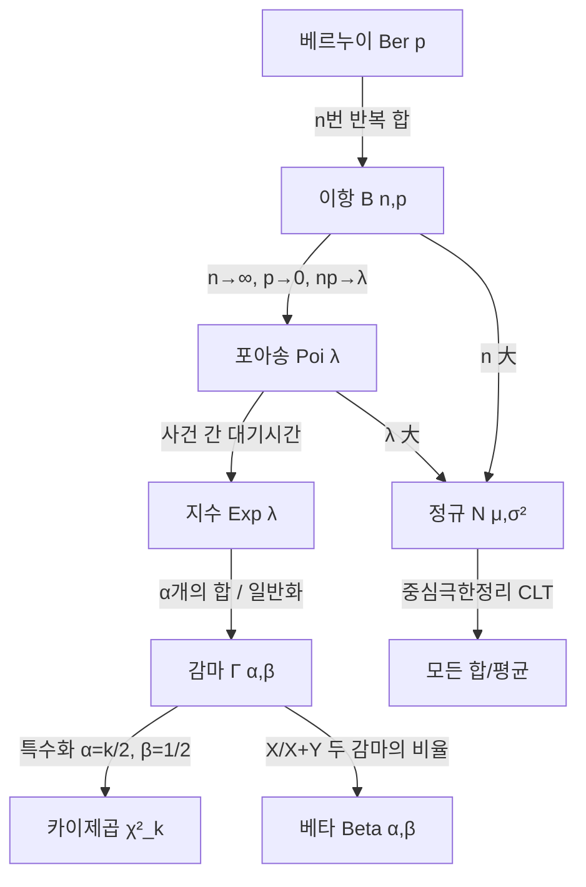

# 9강. AI를위한수학의응용: 확률분포

## 🔗 선수 지식 (Prerequisites)
- [ ] **필수**: [8강. 확률변수와 기댓값](8강.md) - 이해 완료?
- [ ] **필수**: 적분·시그마 합·조합 $\binom{n}{k}$ 계산
- [ ] **권장**: NumPy/SciPy 기초, `scipy.stats` 사용 경험
- **관련 단원**: [10강](10강.md) (예정), [회귀모형 과목과 연결](../회귀모형/)

---

## 학습 목표
1. 주요 이산형 확률분포(베르누이·이항·포아송·이산균등)의 정의와 성질을 이해하고 설명할 수 있다.
2. 주요 연속형 확률분포(연속균등·정규·지수·감마·베타)의 정의와 성질을 이해하고 설명할 수 있다.
3. 파이썬(`scipy.stats`, `numpy`)을 사용하여 주요 확률분포의 pmf/pdf/cdf/표본추출을 다루고, 결과를 해석할 수 있다.

---

## 🧠 메타인지 체크 (학습 전/후 자기 평가)

### 학습 전 자기 평가
| 소주제 | 자신감 (1-5) |
| :--- | :--- |
| 베르누이·이항분포 (pmf, 기댓값/분산) | |
| 포아송분포 (희소 사건의 빈도) | |
| 균등분포 (이산/연속) | |
| 정규분포 (표준화, 68-95-99.7) | |
| 지수·감마·베타분포 | |
| 역CDF/박스-뮬러 시뮬레이션 | |

### 학습 후 교정 (학습 완료 후 작성)
| 소주제 | 학습 전 | 학습 후 | 실제 정답률 | 과신/과소 여부 |
| :--- | :--- | :--- | :--- | :--- |
| 베르누이·이항 | | | | |
| 포아송 | | | | |
| 균등 | | | | |
| 정규 | | | | |
| 지수·감마·베타 | | | | |
| 시뮬레이션 기법 | | | | |

> **활용법**: 학습 전 1분 → 자신감 기입, 학습 후 1분 → 나머지 기입. "과신" 영역이 실제 취약점.

---

## 📝 요약 (Summary)

### 이산형 확률분포 🔴
1. **베르누이분포** 🔴: 성공/실패 이분법적 결과를 모델링하는 가장 기본적인 이산형 분포. 모수 $p$ (성공 확률).
2. **이항분포** 🔴: 베르누이 시행을 $n$번 독립적으로 반복했을 때 성공 횟수의 분포. $X \sim B(n, p)$.
3. **포아송분포** 🔴: 단위 시간/공간에서 발생하는 사건 횟수의 모델링에 활용. 모수 $\lambda$ (평균 발생률).
4. **이산형 균등분포** 🟡: 가능한 정수 값이 모두 동일한 확률로 발생.

### 연속형 확률분포 🔴
5. **연속형 균등분포** 🟡: 구간 $[a, b]$에서 모든 실수가 동일한 확률밀도를 갖는다.
6. **정규분포** 🔴: 연속형 데이터를 모델링하는 데 사용되는 가장 유명한 종 모양의 분포. 중심극한정리의 핵심.
7. **지수분포** 🔴: 사건 사이의 대기시간(무기억성)을 모델링.
8. **감마분포** 🟡: 지수분포를 일반화한 분포로 다른 여러 분포(카이제곱·얼랑)와 연결.
9. **베타분포** 🟡: 구간 $(0, 1)$에서 정의되며 확률이나 비율을 모델링하는 데 사용. 베이지안 사전분포로 핵심적.

### 시뮬레이션 기법 🟢
10. **역CDF 기법** 🟢: $U \sim U(0,1)$일 때 $X = F^{-1}(U)$로 임의 분포 표본을 생성.
11. **박스-뮬러 변환** 🟢: 두 개의 균등분포 난수로부터 표준정규 난수쌍을 생성.

---

## 📐 핵심 수식 (Key Formulas)

### 이산형 분포

| 분포 | pmf $P(X=k)$ | 모수 | 기댓값 $E[X]$ | 분산 $V[X]$ |
| :--- | :--- | :--- | :--- | :--- |
| **베르누이** $\text{Ber}(p)$ | $p^k(1-p)^{1-k},\ k\in\{0,1\}$ | $p\in[0,1]$ | $p$ | $p(1-p)$ |
| **이항** $B(n,p)$ | $\binom{n}{k}p^k(1-p)^{n-k}$ | $n,p$ | $np$ | $np(1-p)$ |
| **포아송** $\text{Poi}(\lambda)$ | $\dfrac{e^{-\lambda}\lambda^k}{k!}$ | $\lambda>0$ | $\lambda$ | $\lambda$ |
| **이산균등** $U\{a,\dots,b\}$ | $\dfrac{1}{b-a+1}$ | $a,b\in\mathbb{Z}$ | $\dfrac{a+b}{2}$ | $\dfrac{(b-a+1)^2-1}{12}$ |

### 연속형 분포

| 분포 | pdf $f(x)$ | 모수 | 기댓값 $E[X]$ | 분산 $V[X]$ |
| :--- | :--- | :--- | :--- | :--- |
| **연속균등** $U(a,b)$ | $\dfrac{1}{b-a},\ x\in[a,b]$ | $a<b$ | $\dfrac{a+b}{2}$ | $\dfrac{(b-a)^2}{12}$ |
| **정규** $N(\mu,\sigma^2)$ | $\dfrac{1}{\sigma\sqrt{2\pi}}\exp\!\left(-\dfrac{(x-\mu)^2}{2\sigma^2}\right)$ | $\mu\in\mathbb{R},\ \sigma>0$ | $\mu$ | $\sigma^2$ |
| **지수** $\text{Exp}(\lambda)$ | $\lambda e^{-\lambda x},\ x\ge 0$ | $\lambda>0$ | $\dfrac{1}{\lambda}$ | $\dfrac{1}{\lambda^2}$ |
| **감마** $\Gamma(\alpha,\beta)$ | $\dfrac{\beta^\alpha}{\Gamma(\alpha)}x^{\alpha-1}e^{-\beta x}$ | $\alpha,\beta>0$ | $\dfrac{\alpha}{\beta}$ | $\dfrac{\alpha}{\beta^2}$ |
| **베타** $\text{Beta}(\alpha,\beta)$ | $\dfrac{x^{\alpha-1}(1-x)^{\beta-1}}{B(\alpha,\beta)}$ | $\alpha,\beta>0$ | $\dfrac{\alpha}{\alpha+\beta}$ | $\dfrac{\alpha\beta}{(\alpha+\beta)^2(\alpha+\beta+1)}$ |

### 주요 정리/정의

**정리 1. 이항분포의 포아송 근사 (희소사건 법칙)**
$n \to \infty$, $p \to 0$, $np \to \lambda$ (유한)일 때,
$$
\binom{n}{k} p^k (1-p)^{n-k} \;\longrightarrow\; \frac{e^{-\lambda}\lambda^k}{k!}
$$
> **직관적 해석**: 시행 횟수가 매우 많고 각 시행의 성공 확률은 매우 작은데 평균 성공 횟수($np$)는 일정하면, 이항분포는 포아송분포로 수렴.
> **AI 적용**: 클릭률(CTR)·로그인 시도·이상 트래픽처럼 "기회는 많고 확률은 작은" 사건 카운트를 포아송으로 모델링.

**정리 2. 정규분포의 표준화**
$X \sim N(\mu, \sigma^2)$이면
$$
Z = \frac{X - \mu}{\sigma} \sim N(0, 1)
$$
> **직관적 해석**: 어떤 정규분포든 평균 0, 표준편차 1의 "표준정규"로 변환 → 단일 표준표만으로 확률 계산 가능.
> **AI 적용**: 딥러닝 입력 정규화(`StandardScaler`), BatchNorm, 가중치 초기화(He/Xavier).

**정리 3. 지수분포의 무기억성**
$X \sim \text{Exp}(\lambda)$이면
$$
P(X > s + t \mid X > s) = P(X > t)
$$
> **직관적 해석**: 이미 $s$만큼 기다렸다는 사실이 앞으로 $t$를 더 기다릴 확률에 영향을 주지 않는다. 과거를 "기억하지 않는" 분포.
> **AI 적용**: 강화학습의 할인율, 서비스 대기시간 모델링, 생존분석(Survival).

**정리 4. 박스-뮬러 변환**
$U_1, U_2 \overset{i.i.d.}{\sim} U(0,1)$이면
$$
Z_1 = \sqrt{-2\ln U_1}\cos(2\pi U_2),\quad Z_2 = \sqrt{-2\ln U_1}\sin(2\pi U_2)
$$
은 독립인 표준정규 $N(0,1)$ 난수쌍.
> **직관적 해석**: 균등난수 2개 → 극좌표 변환 → 정규난수 2개. CDF 역함수가 닫힌 형태가 없는 정규분포 표본추출의 고전적 방법.
> **AI 적용**: GPU 난수 생성, VAE/Diffusion의 잠재변수 샘플링.

---

## 📊 개념 시각화 (Visual Guide)

### 분포 간 관계도


### 핵심 도식

| 분포 | 입력 (모수) | 핵심 함수 | 출력 | AI 적용 |
| :--- | :--- | :--- | :--- | :--- |
| 베르누이 | $p$ | $p^k(1-p)^{1-k}$ | $\{0,1\}$ 확률 | 이진 분류 라벨, 로지스틱 회귀 우도 |
| 이항 | $n, p$ | $\binom{n}{k}p^k q^{n-k}$ | 성공 횟수 분포 | A/B 테스트 클릭수 |
| 포아송 | $\lambda$ | $e^{-\lambda}\lambda^k/k!$ | 카운트 분포 | 트래픽·결함·콜센터 |
| 정규 | $\mu, \sigma$ | $\dfrac{1}{\sigma\sqrt{2\pi}}e^{-(x-\mu)^2/2\sigma^2}$ | 종형 밀도 | 입력 정규화, 가중치 초기화 |
| 지수 | $\lambda$ | $\lambda e^{-\lambda x}$ | 대기시간 | 생존분석, 큐 이론 |
| 감마 | $\alpha, \beta$ | $\dfrac{\beta^\alpha}{\Gamma(\alpha)}x^{\alpha-1}e^{-\beta x}$ | 양의 연속값 | 강수량, 보험 청구액 |
| 베타 | $\alpha, \beta$ | $\dfrac{x^{\alpha-1}(1-x)^{\beta-1}}{B(\alpha,\beta)}$ | $(0,1)$ 비율 | 베이지안 사전, Thompson Sampling |

---

## ✏️ 심화 학습 (Study Subject)

### 1. 가상 시나리오: "어떤 분포를, 언제 사용해야 할까?"
- **상황**: 추천 시스템 팀이 신규 배너의 클릭률(CTR)을 측정 중이다. 한 시간 동안 노출 수 $n = 10{,}000$, 클릭 수 관측치 $k = 23$. 또한 시간당 클릭 수의 변동성을 시뮬레이션하고 싶다.
- **문제**:
  1. 한 노출 = 한 베르누이 시행($p \approx 0.0023$). 총 클릭 수 분포는?
  2. $n$이 크고 $p$가 작으니 이항분포를 어떻게 단순화할 수 있는가?
  3. 사후 CTR을 베이지안으로 추정하려면 어떤 분포를 사전으로 쓰는가?
- **해결**:
  1. $X \sim B(10000, p)$ → $E[X] = np$, $V[X] = np(1-p)$.
  2. 정리 1에 따라 $X \approx \text{Poi}(\lambda)$, $\lambda = np = 23$. 계산이 훨씬 간단해진다.
  3. 베르누이 우도와 켤레인 **베타분포** $\text{Beta}(\alpha, \beta)$를 사전으로 두면, 사후도 $\text{Beta}(\alpha + k, \beta + n - k)$로 닫힌 형태.
- **AI 학습 포인트**: "Thompson Sampling에서 베타-베르누이 켤레 관계가 왜 탐색-활용(Exploration-Exploitation) 균형에 유리한지 정보이론 관점으로 설명해 줘."

### 1-1. 손으로 푸는 수치 예제 (Worked Examples)

#### 예제 A. 이항 확률 직접 계산
어떤 광고 배너를 한 사용자에게 노출하면 클릭할 확률이 $p = 0.3$이라 하자. 서로 독립인 사용자 $n = 10$명에게 노출했을 때 **정확히 3명이 클릭할 확률**을 구해 보자.

$$
P(X = 3) = \binom{10}{3} (0.3)^3 (0.7)^7 = 120 \times 0.027 \times 0.0823543 \approx 0.2668
$$

- 직관: 평균 클릭 수는 $E[X] = np = 3$명이므로 "정확히 3명"이 가장 그럴듯하지만, 그 확률조차 약 27%에 불과하다. 분산 $V[X] = np(1-p) = 2.1$만큼 결과가 흩어지기 때문이다.

#### 예제 B. 베이지안 갱신 — 베타-베르누이 켤레 (숫자로 끝까지)
신규 배너의 진짜 클릭률 $p$를 모른다. 사전 지식이 없으므로 **균등 사전** $\text{Beta}(1, 1) = U(0,1)$에서 출발한다. 이후 $n = 20$명에게 노출하여 $k = 4$명이 클릭(성공)했다고 하자.

베타-베르누이 켤레 관계에 의해 사후분포는 닫힌 형태로 갱신된다.

$$
p \mid \text{data} \sim \text{Beta}(\alpha + k,\ \beta + n - k) = \text{Beta}(1 + 4,\ 1 + 16) = \text{Beta}(5, 17)
$$

사후 평균(베이지안 점추정)은

$$
E[p \mid \text{data}] = \frac{\alpha'}{\alpha' + \beta'} = \frac{5}{5 + 17} = \frac{5}{22} \approx 0.227
$$

- 비교: 빈도주의 최대우도 추정은 $\hat{p}_{\text{MLE}} = k/n = 4/20 = 0.20$이다. 사후 평균 0.227이 0.20보다 약간 높은 이유는, 균등 사전이 "가상의 성공 1회·실패 1회"를 미리 더해 준 **평활(smoothing)** 효과 때문이다. 표본이 적을수록 사전의 영향이 크고, 표본이 늘수록 두 추정값은 수렴한다.
- AI 응용: 이 갱신이 곧 **Thompson Sampling**의 한 스텝이다. 각 배너의 사후 $\text{Beta}$에서 표본을 뽑아 가장 큰 값을 가진 배너를 노출하면, 불확실성이 큰(데이터가 적은) 배너일수록 사후가 넓어 가끔 선택되므로 자연스럽게 **탐색-활용 균형**이 이루어진다.

> ⚠️ **흔한 오해 모음**
> - **독립 ≠ 배반(상호배타)**: 두 사건이 서로 배반($A\cap B=\varnothing$, $P(A\cap B)=0$)이면 한쪽이 일어났을 때 다른 쪽은 절대 일어날 수 없으므로 오히려 **강하게 종속**이다. $P(A),P(B)>0$인 두 사건이 동시에 독립($P(A\cap B)=P(A)P(B)$)이면서 배반일 수는 없다.
> - **$P(A\mid B) \neq P(B\mid A)$**: 조건의 방향을 바꾸면 값이 달라진다. "스팸일 때 특정 단어가 나올 확률"과 "특정 단어가 있을 때 스팸일 확률"은 다르며, 둘을 잇는 다리가 베이즈 정리다.
> - **기저율 무시(base-rate fallacy)**: 검사 정확도만 보고 사후확률을 판단하면 안 된다. 희귀한 사건(낮은 사전확률)은 정확도 높은 검사로도 양성 판정의 상당수가 거짓양성일 수 있다(10강의 질병검사 예제 참조).
> - **$f(x)>1$이 가능**: 정규분포의 밀도 $f(x)$는 확률이 아니라 밀도이므로 $\sigma$가 작으면 1을 넘을 수 있다($\sigma=0.1$이면 $f(\mu)\approx 3.99$). 확률은 면적 $\int f\,dx \le 1$만 만족하면 된다.

### 2. 관점별 비교 및 오개념 분석

- **핵심 비교**: 이항 vs 포아송, 정규 vs 지수, 감마 vs 베타, 확률 vs 확률밀도

| 혼동 쌍 | 차이점의 핵심 |
| :--- | :--- |
| **이항 vs 포아송** | 이항은 *고정된 $n$번* 시행의 성공 수. 포아송은 *시행 횟수 무한대*로 보내 사건의 단위시간당 평균만 남긴 분포 |
| **정규 vs 지수** | 정규는 $(-\infty, \infty)$ 대칭 종형, 지수는 $[0, \infty)$ 비대칭 단조감소. 평균=분산 관계가 다름 (정규: 무관 / 지수: $V=E^2$) |
| **감마 vs 베타** | 둘 다 양의 실수에서 정의되지만 감마는 $[0, \infty)$, 베타는 $[0, 1]$. 감마는 "대기시간/금액", 베타는 "비율/확률" |
| **확률 vs 확률밀도** | 이산은 $P(X=k)$ 자체가 확률(≤1). 연속은 $f(x)$가 밀도이며 단독 점의 확률은 0, $\int f\,dx$가 확률 |
| **pmf/pdf vs CDF** | pmf/pdf는 한 지점의 (질량/밀도). CDF $F(x)=P(X\le x)$는 누적 확률(단조 증가, 0→1) |

- **오개념 분석**:
    - **오개념 1**: "정규분포의 $f(x)$ 값이 1을 넘으면 잘못이다."
    - **분석**: $f(x)$는 *확률*이 아니라 *밀도*다. $\sigma$가 매우 작으면 (예: $\sigma = 0.1$) 최댓값 $f(\mu) = \dfrac{1}{0.1\sqrt{2\pi}} \approx 3.99 > 1$이 정상이다. 확률은 $\int f\,dx \le 1$만 만족하면 된다.
    - **오개념 2**: "포아송분포는 $\lambda$가 평균이지만 분산은 다르다."
    - **분석**: 포아송은 $E[X] = V[X] = \lambda$로 **평균과 분산이 같다**. 이를 위반하는 카운트 데이터(과대산포)는 음이항분포 같은 대안으로 모델링한다.
    - **오개념 3**: "지수분포의 무기억성은 '평균 대기시간이 항상 일정'이라는 뜻이다."
    - **분석**: 무기억성은 조건부 분포가 *원래 분포와 같다*는 의미다. "10분 기다렸다" → 남은 대기시간 분포가 처음과 동일. 평균이 일정한 게 아니라 *조건부 분포가 동일*하다는 강한 성질이다.
    - **오개념 4**: "베타분포는 항상 $(0, 1)$의 단봉 종형이다."
    - **분석**: $\alpha, \beta$의 값에 따라 U자형($\alpha,\beta < 1$), 균등($\alpha=\beta=1$), 좌우 치우침, 단봉 종형 등 다양한 모양을 가진다. 균등분포 $U(0,1)$이 곧 $\text{Beta}(1,1)$의 특수 경우.
- **AI 학습 포인트**: "확률밀도와 확률의 차이를 이용해, '연속분포에서 $P(X = c) = 0$인데 어떻게 $X = c$가 관측될 수 있는가?'라는 역설을 측도론적으로 설명해 줘."

### 3. 분포가 분류기로 바뀌는 곳: 가우시안 나이브 베이즈 (워크드 예제)

분포 가정은 **베이즈 정리**를 통해 곧바로 분류기가 된다. 모수를 데이터로 갱신하는 장면은 위 **예제 B(베타-베르누이 켤레)**에서 보았으니, 여기서는 정규분포 우도가 결정 경계를 만드는 장면을 숫자로 확인하자.

연속 특징 $x$ 하나로 두 클래스 $C_1, C_2$를 분류한다. 각 클래스의 우도가 정규분포라 가정하자(이것이 **가우시안 나이브 베이즈**의 핵심 가정이다).

- $C_1$: $x \sim N(\mu_1 = 5,\ \sigma^2 = 1)$, 사전 $P(C_1) = 0.5$
- $C_2$: $x \sim N(\mu_2 = 7,\ \sigma^2 = 1)$, 사전 $P(C_2) = 0.5$

관측 $x = 6$에서 각 클래스의 사후확률은 베이즈 정리로

$$P(C_i \mid x) = \frac{f(x \mid C_i)\,P(C_i)}{\sum_j f(x \mid C_j)\,P(C_j)}$$

우도를 계산하면 $f(6 \mid C_1) \propto e^{-(6-5)^2/2} = e^{-0.5}$, $f(6 \mid C_2) \propto e^{-(6-7)^2/2} = e^{-0.5}$로 정확히 같다. 사전도 같으므로 $P(C_1 \mid 6) = P(C_2 \mid 6) = 0.5$ — $x = 6$은 두 평균의 정확한 중간이라 **결정 경계** 위에 놓인다. 만약 $x = 6.5$였다면 $C_2$ 쪽 우도가 더 커져 $C_2$로 분류된다.

> ⚠️ **추가 오해 — 기저율 무시(base-rate fallacy)**
> 위 예제에서 사전확률 $P(C_i)$를 무시하고 우도 $f(x|C_i)$만으로 판정하면 안 된다. 예컨대 $C_2$가 매우 희귀하여 $P(C_2)=0.01$이라면, 우도가 같더라도 사후는 $C_1$ 쪽으로 크게 기운다. 검사 정확도가 99%라도 유병률이 0.1%면 양성의 사후확률이 낮은 것과 같은 원리다(10강 질병검사 예제 참조). **$P(\text{원인}\mid\text{데이터})$는 우도뿐 아니라 사전(기저율)에 함께 좌우된다.**

- **AI 학습 포인트**: "나이브 베이즈가 특징들의 **조건부 독립** $f(x_1,\dots,x_d|C)=\prod_k f(x_k|C)$을 가정함에도 분류 성능이 좋은 이유를, 결정 경계는 확률값의 정확도가 아니라 클래스 간 점수 대소만으로 결정된다는 점과 연결해 설명해 줘. 또한 소프트맥스 출력이 본질적으로 범주형(categorical) 분포의 모수 추정이라는 점도 함께 정리해 줘."

---

## ❓ 연습 문제 및 해설

> **블룸 인지 수준 범례**: [기억] 정의·나열 → [이해] 설명·비교 → [적용] 계산·구현 → [분석] 구별·디버그 → [평가] 판단·비평 → [창조] 설계·제안

### 📝 문제

**1. 📌 ⭐ [기억] 베르누이분포 $\text{Ber}(p)$의 기댓값과 분산으로 옳은 것은?(#prob-1)**
   > ① $E=p,\ V=p$
   > ② $E=p,\ V=p(1-p)$
   > ③ $E=np,\ V=np(1-p)$
   > ④ $E=1/p,\ V=(1-p)/p^2$

<br>

**2. 📌 ⭐ [기억] 다음 중 분포-모수의 짝이 잘못된 것은?(#prob-2)**
   > ① 이항분포 $B(n, p)$ - 시행수 $n$, 성공확률 $p$
   > ② 포아송분포 $\text{Poi}(\lambda)$ - 단위시간당 평균 발생률 $\lambda$
   > ③ 지수분포 $\text{Exp}(\lambda)$ - 사건당 평균 대기시간 $\lambda$
   > ④ 베타분포 $\text{Beta}(\alpha, \beta)$ - 모양모수 두 개 $\alpha, \beta$

<br>

**3. 📌 ⭐⭐ [적용] $X \sim B(10, 0.3)$일 때 $E[X]$와 $V[X]$를 구하시오.(#prob-3)**
   > ① $E=3,\ V=2.1$
   > ② $E=3,\ V=3$
   > ③ $E=2.1,\ V=3$
   > ④ $E=0.3,\ V=0.21$

<br>

**4. 📌 ⭐⭐ [적용] 한 콜센터에 시간당 평균 6건의 전화가 걸려온다고 한다. 1시간 동안 전화가 정확히 4건 걸려올 확률은? (포아송 가정, 소수 셋째자리 반올림)(#prob-4)**
   > ① 0.084
   > ② 0.134
   > ③ 0.161
   > ④ 0.180

<br>

**5. 📌 ⭐⭐ [이해] 다음 설명 중 옳은 것을 모두 고르시오.(#prob-5)**
   > <보기>
   >
   > 가. 정규분포는 평균에 대해 좌우 대칭이며 평균=중앙값=최빈값이다.
   > 나. 지수분포는 무기억성을 가진다.
   > 다. 포아송분포는 $E[X] = V[X] = \lambda$이다.
   > 라. 베타분포는 $\alpha = \beta = 1$일 때 $U(0, 1)$과 같다.

   > ① 가, 나
   > ② 가, 나, 다
   > ③ 가, 다, 라
   > ④ 가, 나, 다, 라

<br>

**6. 📌 ⭐⭐ [분석] $Z \sim N(0, 1)$일 때, $P(-1 \le Z \le 1)$의 값으로 가장 가까운 것은? (68-95-99.7 규칙)(#prob-6)**
   > ① 0.50
   > ② 0.68
   > ③ 0.95
   > ④ 0.997

<br>

**7. 📌 ⭐⭐ [적용] $X \sim \text{Exp}(\lambda=2)$일 때 $P(X > 1)$의 값은?(#prob-7)**
   > ① $1 - e^{-1}$
   > ② $e^{-1}$
   > ③ $e^{-2}$
   > ④ $1 - e^{-2}$

<br>

**8. 📌 ⭐⭐⭐ [분석] $X \sim N(50, 100)$일 때 $P(X \le 60)$을 표준화 후 계산하는 식으로 옳은 것은?($\Phi$는 표준정규 CDF)(#prob-8)**
   > ① $\Phi(0.1)$
   > ② $\Phi(1)$
   > ③ $\Phi(10)$
   > ④ $\Phi(60)$

<br>

**9. 📌 ⭐⭐⭐ [평가] 이항분포 $B(n, p)$를 포아송분포 $\text{Poi}(\lambda)$로 근사할 때 적절한 조건은?(#prob-9)**
   > <보기>
   >
   > 가. $n$이 충분히 크다.
   > 나. $p$가 충분히 작다.
   > 다. $np$가 적당한 유한 값 $\lambda$로 수렴한다.
   > 라. $n$, $p$가 모두 크면 근사가 더 정확해진다.

   > ① 가, 나
   > ② 가, 나, 다
   > ③ 나, 다, 라
   > ④ 가, 다, 라

<br>

**10. 📌 ⭐⭐⭐ [창조] 박스-뮬러 변환에 대한 설명으로 옳지 않은 것은?(#prob-10)**
   > ① $U_1, U_2 \sim U(0,1)$ 두 개로부터 표준정규 난수 두 개를 생성한다.
   > ② $Z_1 = \sqrt{-2\ln U_1}\cos(2\pi U_2)$ 형태로 생성된다.
   > ③ 정규분포의 CDF $\Phi$ 역함수가 닫힌 형태로 존재해야만 사용할 수 있다.
   > ④ 생성된 $Z_1, Z_2$는 서로 독립이다.

---

### 🔑 정답 및 해설 (먼저 풀어본 후 펼치기)

<details>
<summary>정답 보기 (클릭)</summary>

1. ②
2. ③
3. ①
4. ②
5. ④
6. ②
7. ③
8. ②
9. ②
10. ③

</details>

<details>
<summary>해설 보기 (클릭)</summary>

<a id="prob-1"></a>
**1. ⭐ [기억] 베르누이 모멘트**
> **정답: ② $E=p,\ V=p(1-p)$**
> **해설**: $X \in \{0,1\}$, $P(X=1)=p$. $E[X] = 1\cdot p + 0\cdot(1-p) = p$, $E[X^2] = p$, 따라서 $V[X] = p - p^2 = p(1-p)$. ③은 이항분포, ④는 기하분포.

<a id="prob-2"></a>
**2. ⭐ [기억] 분포-모수 매칭**
> **정답: ③ 지수분포 $\text{Exp}(\lambda)$ - 사건당 평균 대기시간 $\lambda$**
> **해설**: $\text{Exp}(\lambda)$에서 $\lambda$는 **단위시간당 발생률(rate)**이고, 평균 대기시간은 $1/\lambda$다. 둘을 혼동하면 부호·역수 오류가 발생한다.

<a id="prob-3"></a>
**3. ⭐⭐ [적용] 이항 모멘트 계산**
> **정답: ① $E=3,\ V=2.1$**
> **해설**: $E[X] = np = 10 \times 0.3 = 3$, $V[X] = np(1-p) = 10 \times 0.3 \times 0.7 = 2.1$.

<a id="prob-4"></a>
**4. ⭐⭐ [적용] 포아송 확률**
> **정답: ② 0.134**
> **해설**: $\lambda = 6$, $k = 4$일 때
> $$P(X=4) = \frac{e^{-6} 6^4}{4!} = \frac{e^{-6} \cdot 1296}{24} = 54 e^{-6} \approx 54 \times 0.00248 \approx 0.1339$$

<a id="prob-5"></a>
**5. ⭐⭐ [이해] 분포 성질 종합**
> **정답: ④ 가, 나, 다, 라**
> **해설**: 모두 옳다. 가) 정규는 대칭 종형. 나) 지수는 무기억성. 다) 포아송은 $E=V=\lambda$. 라) $\text{Beta}(1,1) = U(0,1)$은 베타분포의 특수 경우.

<a id="prob-6"></a>
**6. ⭐⭐ [분석] 68-95-99.7 규칙**
> **정답: ② 0.68**
> **해설**: 표준정규에서 평균 $\pm 1\sigma$ 구간 확률은 약 0.6827. $\pm 2\sigma \approx 0.9545$, $\pm 3\sigma \approx 0.9973$.

<a id="prob-7"></a>
**7. ⭐⭐ [적용] 지수 생존확률**
> **정답: ③ $e^{-2}$**
> **해설**: $X \sim \text{Exp}(\lambda)$의 생존함수는 $P(X > x) = e^{-\lambda x}$. 따라서 $P(X > 1) = e^{-2 \cdot 1} = e^{-2} \approx 0.135$.

<a id="prob-8"></a>
**8. ⭐⭐⭐ [분석] 표준화**
> **정답: ② $\Phi(1)$**
> **해설**: $X \sim N(50, 100)$에서 $\sigma^2 = 100$, $\sigma = 10$. $Z = (X - 50)/10$. $P(X \le 60) = P\left(Z \le \dfrac{60-50}{10}\right) = \Phi(1) \approx 0.8413$. 분산($\sigma^2$)과 표준편차($\sigma$) 혼동에 주의.

<a id="prob-9"></a>
**9. ⭐⭐⭐ [평가] 포아송 근사 조건**
> **정답: ② 가, 나, 다**
> **해설**: 정리 1(희소사건 법칙): $n \to \infty$, $p \to 0$, $np \to \lambda$. 라는 틀림 — $p$가 크면 $np \to \infty$가 되어 더 이상 포아송이 아니라 정규근사(드무아브르-라플라스)로 가야 한다.

<a id="prob-10"></a>
**10. ⭐⭐⭐ [창조] 박스-뮬러**
> **정답: ③ 정규분포의 CDF $\Phi$ 역함수가 닫힌 형태로 존재해야만 사용할 수 있다.**
> **해설**: 박스-뮬러는 **$\Phi^{-1}$이 닫힌 형태로 없기 때문에** 고안된 우회 기법이다. 극좌표 변환과 삼각함수만으로 정규 표본을 생성한다. ①②④는 모두 옳다.

</details>

---

## ✅ O/X 확인문제 (총 20문항)

**1.** 베르누이분포의 분산은 $p(1-p)$이며 $p = 0.5$일 때 최대다.(#ox-1) **(O / X)**
**2.** 이항분포 $B(n, p)$의 시행을 1번($n=1$)만 한 경우는 베르누이분포와 같다.(#ox-2) **(O / X)**
**3.** 포아송분포에서 평균과 분산은 항상 같다.(#ox-3) **(O / X)**
**4.** 이산형 균등분포 $U\{1, 2, \dots, 6\}$ (주사위)의 평균은 3.5이다.(#ox-4) **(O / X)**
**5.** 연속균등분포 $U(0, 1)$의 분산은 $1/12$이다.(#ox-5) **(O / X)**
**6.** 정규분포의 확률밀도함수 값 $f(x)$는 항상 1보다 작거나 같다.(#ox-6) **(O / X)**
**7.** 표준정규분포는 평균 0, 분산 1인 정규분포이다.(#ox-7) **(O / X)**
**8.** $X \sim N(\mu, \sigma^2)$이면 $aX + b \sim N(a\mu + b, a^2\sigma^2)$이다.(#ox-8) **(O / X)**
**9.** 지수분포는 무기억성을 가지는 유일한 연속분포이다.(#ox-9) **(O / X)**
**10.** 지수분포 $\text{Exp}(\lambda)$의 평균과 분산은 동일하다.(#ox-10) **(O / X)**
**11.** 감마분포는 $\alpha = 1$일 때 지수분포와 같아진다.(#ox-11) **(O / X)**
**12.** 베타분포는 구간 $(-\infty, \infty)$ 전체에서 정의된다.(#ox-12) **(O / X)**
**13.** $\text{Beta}(1, 1)$은 $U(0, 1)$과 같다.(#ox-13) **(O / X)**
**14.** 베타분포는 베이지안 추론에서 베르누이/이항 우도의 켤레사전분포다.(#ox-14) **(O / X)**
**15.** 이항분포 $B(n, p)$는 $n$이 크고 $p$가 매우 작으면 포아송분포로 근사된다.(#ox-15) **(O / X)**
**16.** 박스-뮬러 변환은 두 개의 균등난수에서 두 개의 표준정규난수를 생성한다.(#ox-16) **(O / X)**
**17.** 역CDF 기법은 CDF가 명시적으로 계산 가능한 분포에 적용 가능하다.(#ox-17) **(O / X)**
**18.** 연속분포에서 $P(X = c) > 0$이 가능하다.(#ox-18) **(O / X)**
**19.** 중심극한정리에 따르면 어떤 분포든 표본평균은 표본수가 크면 근사적으로 정규분포를 따른다.(#ox-19) **(O / X)**
**20.** `scipy.stats.norm(loc=0, scale=1).pdf(0)`의 값은 약 0.3989이다.(#ox-20) **(O / X)**

<details>
<summary>O/X 정답 및 해설 보기 (클릭)</summary>

> <a id="ox-1"></a>
> **1. 정답**: O
> **해설**: $f(p) = p(1-p)$는 $p = 0.5$에서 최댓값 $0.25$.

> <a id="ox-2"></a>
> **2. 정답**: O
> **해설**: $B(1, p) = \text{Ber}(p)$. 이항은 베르누이의 일반화.

> <a id="ox-3"></a>
> **3. 정답**: O
> **해설**: $E[X] = V[X] = \lambda$가 포아송의 특징적 성질.

> <a id="ox-4"></a>
> **4. 정답**: O
> **해설**: $(1+6)/2 = 3.5$.

> <a id="ox-5"></a>
> **5. 정답**: O
> **해설**: $V = (b-a)^2/12 = 1/12$.

> <a id="ox-6"></a>
> **6. 정답**: X
> **해설**: $f(x)$는 밀도이며 $\sigma$가 작으면 1을 넘을 수 있다. 예: $\sigma = 0.1$이면 $f(\mu) \approx 3.99$.

> <a id="ox-7"></a>
> **7. 정답**: O
> **해설**: $N(0, 1)$이 표준정규.

> <a id="ox-8"></a>
> **8. 정답**: O
> **해설**: 정규분포의 선형변환은 정규분포. 분산은 $a^2$배.

> <a id="ox-9"></a>
> **9. 정답**: O
> **해설**: 연속분포 중 무기억성을 갖는 분포는 지수분포뿐 (이산은 기하분포).

> <a id="ox-10"></a>
> **10. 정답**: X
> **해설**: $E = 1/\lambda$, $V = 1/\lambda^2$. $\lambda = 1$일 때만 우연히 같다.

> <a id="ox-11"></a>
> **11. 정답**: O
> **해설**: $\Gamma(1, \beta) = \text{Exp}(\beta)$. 감마는 지수의 일반화.

> <a id="ox-12"></a>
> **12. 정답**: X
> **해설**: 베타는 구간 $(0, 1)$에서만 정의된다.

> <a id="ox-13"></a>
> **13. 정답**: O
> **해설**: $f(x) = \dfrac{x^0(1-x)^0}{B(1,1)} = 1$ (균등분포).

> <a id="ox-14"></a>
> **14. 정답**: O
> **해설**: 사전 $\text{Beta}(\alpha, \beta)$ + 관측 $k$ 성공/$n-k$ 실패 → 사후 $\text{Beta}(\alpha+k, \beta+n-k)$.

> <a id="ox-15"></a>
> **15. 정답**: O
> **해설**: 희소사건 법칙(정리 1). $\lambda = np$로 근사.

> <a id="ox-16"></a>
> **16. 정답**: O
> **해설**: 정리 4. $\sqrt{-2\ln U_1}$의 진폭, $2\pi U_2$의 위상으로 2차원 정규벡터 생성.

> <a id="ox-17"></a>
> **17. 정답**: O
> **해설**: $X = F^{-1}(U)$를 계산하려면 $F$의 역함수가 (수치적이든 해석적이든) 평가 가능해야 한다.

> <a id="ox-18"></a>
> **18. 정답**: X
> **해설**: 연속분포에서는 임의의 점 $c$에 대해 $P(X = c) = 0$. 단, $P(X \in [c, c+\epsilon]) > 0$일 수 있다.

> <a id="ox-19"></a>
> **19. 정답**: O (단, 유한 분산 조건 필요)
> **해설**: CLT는 평균과 분산이 유한한 i.i.d. 표본에 대해 성립.

> <a id="ox-20"></a>
> **20. 정답**: O
> **해설**: $\dfrac{1}{\sqrt{2\pi}} \approx 0.3989$.

</details>

---

## 🧪 자유 회상 연습 (Free Recall)

> **방법**: 위의 노트를 모두 덮고, 타이머 3분 설정 후 이번 단원에서 배운 내용을 기억나는 대로 자유롭게 적으세요.
> 정확한 문장이 아니어도 됩니다. 키워드, 수식, 관계 등 떠오르는 것을 모두 적습니다.

**자유 회상 작성란:**

```
[여기에 기억나는 내용을 자유롭게 작성]


```

> **회상 후 점검**: 노트를 다시 펼쳐 빠뜨린 내용을 확인하세요. 빠뜨린 부분이 실제 취약점입니다.
> - 회상 못한 핵심 분포(이산/연속): [                ]
> - 회상 못한 모멘트(기댓값/분산) 공식: [                ]
> - 회상 못한 분포 간 관계(베르누이→이항→포아송 등): [                ]

---

## 💻 코드로 확인하기 (Code Verification)

### 예시 1: 주요 이산분포의 pmf와 모멘트
```python
import numpy as np
from scipy import stats

# 1) 베르누이 Ber(0.3)
ber = stats.bernoulli(p=0.3)
print(f"[베르누이] E={ber.mean():.3f}, V={ber.var():.3f}")
print(f"  pmf(0)={ber.pmf(0):.3f}, pmf(1)={ber.pmf(1):.3f}\n")

# 2) 이항 B(10, 0.3)
binom = stats.binom(n=10, p=0.3)
print(f"[이항] E={binom.mean():.3f}, V={binom.var():.3f}")
print(f"  P(X=3)={binom.pmf(3):.4f}\n")

# 3) 포아송 Poi(6) - 시간당 4건 확률
poi = stats.poisson(mu=6)
print(f"[포아송] E={poi.mean():.3f}, V={poi.var():.3f}")
print(f"  P(X=4)={poi.pmf(4):.4f}\n")

# 4) 이항→포아송 근사
n, p = 10000, 0.0006
print(f"[근사] B({n},{p}).P(X=6) = {stats.binom(n, p).pmf(6):.6f}")
print(f"       Poi({n*p}).P(X=6) = {stats.poisson(n*p).pmf(6):.6f}")
```

> **실행 결과 (예시)**:
> ```
> [베르누이] E=0.300, V=0.210
>   pmf(0)=0.700, pmf(1)=0.300
>
> [이항] E=3.000, V=2.100
>   P(X=3)=0.2668
>
> [포아송] E=6.000, V=6.000
>   P(X=4)=0.1339
>
> [근사] B(10000,0.0006).P(X=6) = 0.160547
>        Poi(6.0).P(X=6) = 0.160623
> ```
> **수학적 해석**: 모멘트가 공식과 정확히 일치하며, 포아송 근사 오차는 소수 셋째자리 이하로 매우 작다(정리 1 확인).

### 예시 2: 정규분포 표준화 + 박스-뮬러 시뮬레이션
```python
import numpy as np
from scipy import stats

# 1) 표준화: X ~ N(50, 100) → P(X<=60)
mu, sigma2 = 50, 100
sigma = np.sqrt(sigma2)
prob = stats.norm.cdf(60, loc=mu, scale=sigma)
prob_std = stats.norm.cdf((60 - mu) / sigma)
print(f"P(X<=60) 직접계산: {prob:.4f}")
print(f"P(Z<=1)  표준화 : {prob_std:.4f}\n")

# 2) 박스-뮬러 변환으로 정규난수 10,000개 생성
rng = np.random.default_rng(42)
N = 10_000
U1 = rng.uniform(size=N)
U2 = rng.uniform(size=N)
Z1 = np.sqrt(-2 * np.log(U1)) * np.cos(2 * np.pi * U2)
Z2 = np.sqrt(-2 * np.log(U1)) * np.sin(2 * np.pi * U2)
print(f"[Box-Muller] Z1 평균={Z1.mean():.3f}, 표준편차={Z1.std():.3f}")
print(f"             Z2 평균={Z2.mean():.3f}, 표준편차={Z2.std():.3f}")
print(f"  Z1, Z2 상관계수={np.corrcoef(Z1, Z2)[0,1]:.4f}  (이론값 0)")

# 3) 역CDF 기법으로 지수분포 표본
U = rng.uniform(size=N)
lam = 2.0
X_exp = -np.log(1 - U) / lam  # F^{-1}(u) = -ln(1-u)/λ
print(f"\n[역CDF] Exp({lam}) 표본 평균={X_exp.mean():.4f}, 이론값={1/lam:.4f}")
```

> **실행 결과 (예시)**:
> ```
> P(X<=60) 직접계산: 0.8413
> P(Z<=1)  표준화 : 0.8413
>
> [Box-Muller] Z1 평균=0.001, 표준편차=1.003
>              Z2 평균=-0.008, 표준편차=0.995
>   Z1, Z2 상관계수=0.0042  (이론값 0)
>
> [역CDF] Exp(2.0) 표본 평균=0.4978, 이론값=0.5000
> ```
> **수학적 해석**: 표준화로 일반 정규 → 표준정규 변환이 동일한 확률을 주며, 박스-뮬러는 두 균등난수만으로 평균 0·표준편차 1·무상관 정규난수를 정확히 생성한다. 역CDF 기법은 $\text{Exp}(2)$의 평균 $1/\lambda = 0.5$를 정확히 재현한다.

---

## 🤖 AI 연결고리 (Math → AI Application)

| 수학 개념 | AI/ML 적용 분야 | 구체적 사례 |
| :--- | :--- | :--- |
| 베르누이/이항 우도 | 이진 분류 | 로지스틱 회귀의 우도 $\prod p^{y}(1-p)^{1-y}$, 교차엔트로피 |
| 베르누이/가우시안 우도 + 베이즈 정리 | 나이브 베이즈 분류 | 스팸 필터(베르누이/다항 NB), 가우시안 NB, 조건부 독립 가정 |
| 범주형(categorical) 분포 | 다중 분류 | 소프트맥스 출력 = 범주형 분포 모수, 교차엔트로피 손실 |
| 포아송 | 카운트 데이터 회귀 | 포아송 회귀, 클릭/요청 수 예측, 이상 트래픽 탐지 |
| 정규분포 | 정규화·생성모델·초기화 | StandardScaler, BatchNorm, He/Xavier 초기화, VAE 잠재공간 |
| 지수분포 | 생존분석·강화학습 | Cox 비례위험, RL 할인율, 큐 이론 응답시간 |
| 감마분포 | 베이지안 사전 | 정밀도(precision) 사전, LDA의 토픽-단어 사전 |
| 베타분포 | 베이지안 사전·밴딧 | Thompson Sampling, 베타-베르누이 켤레 추론, A/B 사후 |
| 역CDF/박스-뮬러 | 난수 생성 | GPU rng, Diffusion 노이즈 샘플링, MC 시뮬레이션 |
| 분포 간 변환 | 재매개화 트릭 | VAE의 $z = \mu + \sigma \cdot \epsilon$ ($\epsilon \sim N(0,1)$) |

---

## 📖 심화 학습 예시 답안

#### 1. 정규분포의 내부 동작 원리 (왜 종 모양인가)

1.  **이차 지수의 기하학적 의미**: $f(x) \propto e^{-(x-\mu)^2/(2\sigma^2)}$에서 $-(x-\mu)^2$는 평균에서 멀어질수록 *2차로* 작아진다. 지수함수에 이를 넣으면 평균 근처에서는 거의 변화 없고, 멀어지면 급격히 0으로 떨어지는 **종형(bell shape)**이 된다.
2.  **표준화의 의미**: $Z = (X-\mu)/\sigma$는 평균을 0으로 이동, 표준편차를 1로 스케일링. 모든 정규분포가 하나의 표준정규로 환원되어 한 장의 표만으로 확률을 계산할 수 있다.
3.  **CLT(중심극한정리)와의 관계**: 임의 분포에서 표본평균 $\bar{X}_n$은 $n$이 크면 $N(\mu, \sigma^2/n)$로 수렴. 정규분포가 통계학의 "기본 화폐"인 이유.
4.  **머신러닝 관점**: 입력 정규화는 손실함수의 등고선을 원형에 가깝게 만들어 경사하강 수렴을 가속한다. BatchNorm은 각 층의 출력을 정규화하여 internal covariate shift를 완화한다.

#### 2. 포아송 vs 정규 vs 지수 비교표

| 구분 | 포아송 $\text{Poi}(\lambda)$ | 정규 $N(\mu, \sigma^2)$ | 지수 $\text{Exp}(\lambda)$ |
| :--- | :--- | :--- | :--- |
| **타입** | 이산 (카운트) | 연속 (실수 전체) | 연속 (양의 실수) |
| **지지대** | $\{0, 1, 2, \dots\}$ | $(-\infty, \infty)$ | $[0, \infty)$ |
| **모수** | $\lambda > 0$ | $\mu, \sigma^2$ | $\lambda > 0$ |
| **평균** | $\lambda$ | $\mu$ | $1/\lambda$ |
| **분산** | $\lambda$ | $\sigma^2$ | $1/\lambda^2$ |
| **주요 성질** | $E = V$, 가산성 | 대칭, 선형변환 폐쇄 | 무기억성 |
| **AI 활용** | 클릭/요청 카운트 회귀 | 입력 정규화, BatchNorm, VAE | 생존분석, 강화학습 할인 |

#### 3. 분포 시각화 및 표본추출 (Best Practice)

- **Bad Practice (나쁜 예시)**
  ```python
  # 분포 비교 없이 hist만 그리고 모수 추정도 안 함
  import numpy as np
  import matplotlib.pyplot as plt
  data = np.random.randn(1000)
  plt.hist(data)
  plt.show()
  ```
- **Good Practice (좋은 예시)**
  ```python
  import numpy as np
  import matplotlib.pyplot as plt
  from scipy import stats

  rng = np.random.default_rng(0)
  data = rng.normal(loc=2, scale=1.5, size=2000)

  # 1) 표본 → MLE 모수 추정
  mu_hat, sigma_hat = stats.norm.fit(data)

  # 2) 적합도 시각화: 정규화 히스토그램 + 이론 pdf
  xs = np.linspace(data.min(), data.max(), 200)
  plt.hist(data, bins=40, density=True, alpha=0.5, label="표본")
  plt.plot(xs, stats.norm.pdf(xs, mu_hat, sigma_hat),
           lw=2, label=f"N({mu_hat:.2f}, {sigma_hat:.2f}²)")
  plt.legend(); plt.xlabel("x"); plt.ylabel("density")
  plt.title("적합도 진단: 표본 vs 이론 pdf")
  plt.show()

  # 3) Kolmogorov-Smirnov 검정으로 적합 검증
  ks_stat, p_value = stats.kstest(data, "norm", args=(mu_hat, sigma_hat))
  print(f"KS={ks_stat:.4f}, p-value={p_value:.4f}")
  ```
- **설명**: 표본을 그릴 때는 (1) `density=True`로 pdf와 같은 스케일로 정규화, (2) MLE로 추정한 이론 pdf를 겹쳐 *모양 적합도* 시각 확인, (3) KS 검정으로 *수치 적합도* 정량 검증의 3단계가 표준이다. 분포 가정의 검증 없이 모델링하면 잘못된 추론으로 이어진다.

---

## 📚 핵심 용어집 (Glossary)

| 용어 (한) | 용어 (영) | 수식 표현 | 정의 |
| :--- | :--- | :--- | :--- |
| **확률질량함수** | Probability Mass Function (pmf) | $p(k) = P(X = k)$ | 이산확률변수가 특정 값을 가질 확률 |
| **확률밀도함수** | Probability Density Function (pdf) | $f(x),\ P(a \le X \le b) = \int_a^b f$ | 연속확률변수의 단위구간당 확률 밀도 |
| **누적분포함수** | Cumulative Distribution Function (CDF) | $F(x) = P(X \le x)$ | 누적 확률, 단조 증가, $\lim_{-\infty}=0, \lim_{\infty}=1$ |
| **베르누이분포** | Bernoulli Distribution | $\text{Ber}(p)$ | 성공/실패 이분법 시행의 분포 (→ [8강](8강.md) 확률변수) |
| **이항분포** | Binomial Distribution | $B(n, p)$ | $n$번 독립 베르누이 시행의 성공 횟수 |
| **포아송분포** | Poisson Distribution | $\text{Poi}(\lambda)$ | 단위시간당 평균 $\lambda$인 희소사건 카운트 |
| **이산균등분포** | Discrete Uniform | $U\{a, \dots, b\}$ | 정수 구간에서 균일한 확률 |
| **연속균등분포** | Continuous Uniform | $U(a, b)$ | 실수 구간에서 균일한 밀도 |
| **정규분포** | Normal (Gaussian) Distribution | $N(\mu, \sigma^2)$ | 평균 대칭 종형, CLT의 극한 (→←8강) |
| **표준정규분포** | Standard Normal | $N(0, 1),\ \Phi(z)$ | 평균 0, 분산 1의 정규분포 |
| **지수분포** | Exponential Distribution | $\text{Exp}(\lambda)$ | 사건 간 대기시간, 무기억성 |
| **감마분포** | Gamma Distribution | $\Gamma(\alpha, \beta)$ | 지수분포의 일반화, 양의 연속값 모델 |
| **베타분포** | Beta Distribution | $\text{Beta}(\alpha, \beta)$ | $(0,1)$ 구간 비율/확률 모델, 베이지안 켤레사전 |
| **무기억성** | Memoryless Property | $P(X>s+t \mid X>s)=P(X>t)$ | 과거 대기시간이 미래에 영향을 주지 않는 성질 |
| **역CDF 기법** | Inverse Transform Sampling | $X = F^{-1}(U),\ U \sim U(0,1)$ | 균등난수에서 임의분포 난수를 생성 |
| **박스-뮬러 변환** | Box-Muller Transform | $Z = \sqrt{-2\ln U_1}\cos(2\pi U_2)$ | 두 균등난수에서 표준정규 난수쌍 생성 |
| **켤레사전분포** | Conjugate Prior | 사전 → 사후 동일 분포족 | 베타-베르누이, 감마-포아송 등 |

---

## 🤖 AI 학습 파트너를 위한 추가 자료

### 1. 개념 이해를 위한 심층 질문 프롬프트
> **프롬프트 예시**: "베르누이 → 이항 → 포아송 → 지수 → 감마 → 정규로 이어지는 확률분포의 '족보(family tree)'를 그려 주고, 각 분포 사이의 변환 조건(예: 이항을 포아송으로 보내는 극한)을 수식 유도와 함께 설명해 줘. 또한 머신러닝의 어느 단계에서 각 분포가 자연스럽게 등장하는지 매핑해 줘."

### 2. 문제 해결 능력 강화를 위한 시나리오 프롬프트
> **프롬프트 예시**: "당신은 추천 시스템 엔지니어다. 신규 상품의 클릭률을 50명의 노출 데이터(2명 클릭)만 가지고 추정해야 한다. 빈도주의 최대우도 추정과 베이지안 베타-베르누이 추정을 각각 수행하고, 두 결과의 차이가 표본 수가 작을 때 왜 발생하는지 분포의 모양 변화로 시각화해서 설명해 줘. 또한 Thompson Sampling을 베타 사후로 구현하는 코드도 함께 제시해 줘."

### 3. 수식 풀이 검증 프롬프트
> **프롬프트 예시**: "다음 박스-뮬러 변환 유도 과정을 검증해 줘.
> $$(Z_1, Z_2) \sim N(0,I_2)\ \Leftrightarrow\ (R, \Theta),\ R^2 \sim \text{Exp}(1/2),\ \Theta \sim U(0, 2\pi)$$
> 1. 극좌표 $Z_1 = R\cos\Theta, Z_2 = R\sin\Theta$의 자코비안 계산이 올바른지 확인해 줘.
> 2. $R^2$가 자유도 2의 카이제곱이고 이것이 $\text{Exp}(1/2)$와 같다는 사실의 증명을 단계별로 보여줘.
> 3. 균등난수 $U_1$로부터 $R = \sqrt{-2\ln U_1}$이 도출되는 과정을 역CDF 관점에서 설명해 줘."

---

## 🔄 복습 체크 (Spaced Repetition)
- [ ] 1일 후 복습 (날짜: 2026-05-30)
- [ ] 3일 후 복습 (날짜: 2026-06-01)
- [ ] 7일 후 복습 (날짜: 2026-06-05)
- [ ] 14일 후 복습 (날짜: 2026-06-12)
- [ ] 30일 후 복습 (날짜: 2026-06-28)

### 복습 시 자가 평가
| 회차 | 날짜 | 이해도 (1-5) | 취약 부분 메모 |
| :--- | :--- | :--- | :--- |
| 1차 | | | |
| 2차 | | | |
| 3차 | | | |

---

## 💡 심화 아이디어 / 더 생각해보기

1. **소프트맥스 = 범주형 분포(categorical)의 모수화**: 베르누이가 두 결과의 확률을 $p, 1-p$로 주듯, 다중 클래스 분류의 출력 소프트맥스 $\text{softmax}(z)_i = e^{z_i}/\sum_j e^{z_j}$는 $K$개 결과에 대한 **범주형 분포의 확률벡터**다. 베르누이의 자연스러운 일반화가 범주형이며, 신경망 분류기는 입력 $x$에 대한 조건부 범주형 분포 $p(y\mid x)$를 출력한다고 볼 수 있다.

2. **나이브 베이즈의 분포 가정**: 나이브 베이즈는 특성들이 클래스 조건부로 독립이라 가정하여 $p(x\mid y)=\prod_i p(x_i\mid y)$로 분해한다. 이때 각 $p(x_i\mid y)$를 무엇으로 두느냐에 따라 변종이 갈린다 — 이진 특성이면 **베르누이 나이브 베이즈**, 횟수 특성이면 **다항(multinomial)**, 연속 특성이면 **가우시안 나이브 베이즈**. 즉 9강의 분포 선택이 곧 모델 설계가 된다.

3. **손실함수에 숨은 가우시안·베르누이**: 평균제곱오차(MSE)는 관측 잡음이 가우시안이라는 가정 아래의 음의 로그우도와 같고, 이진 교차엔트로피는 라벨이 베르누이라는 가정의 음의 로그우도와 같다. 손실함수를 고른다는 것은 곧 데이터 생성 분포를 가정하는 일이다.

4. **포아송 가정이 깨질 때(과대산포)**: 실데이터의 카운트는 종종 $V[X] > E[X]$(과대산포)라서 $E=V$인 포아송이 부적합하다. 이럴 때는 음이항분포(감마-포아송 혼합)로 확장한다 — 분포 간 관계도가 실무 모델 선택의 지도가 된다.

> **확장 질문**: "정규분포 가정은 언제 위험한가? 두꺼운 꼬리(heavy tail)를 갖는 금융 수익률이나 이상치가 많은 데이터에서 정규 가정이 초래하는 실패 사례와, Student-t 분포 같은 대안을 설명해 줘."

---

## 📚 참고 자료 (References)

- 한국방송통신대학교 교재 - 『AI를위한수학의응용』 9강. 확률분포
- Wasserman, L. (2004). 『All of Statistics』 — Chapter 2, 5 (분포족 개관)
- Bishop, C. M. (2006). 『Pattern Recognition and Machine Learning』 — Chapter 2 (Probability Distributions)
- Deisenroth, Faisal, Ong, *Mathematics for Machine Learning*, Ch. 6 (Probability and Distributions) — https://mml-book.github.io/
- Wikipedia, "Beta distribution" (평균·분산·켤레사전) — https://en.wikipedia.org/wiki/Beta_distribution
- Wikipedia, "Gamma distribution" (shape–rate 모수화: 평균 $\alpha/\beta$, 분산 $\alpha/\beta^2$) — https://en.wikipedia.org/wiki/Gamma_distribution
- Wikipedia, "Box–Muller transform" — https://en.wikipedia.org/wiki/Box%E2%80%93Muller_transform
- SciPy Documentation - `scipy.stats` (https://docs.scipy.org/doc/scipy/reference/stats.html)
- 3Blue1Brown - "But what is the Central Limit Theorem?" (정규분포의 직관)
- Wikipedia, "Normal distribution" — https://en.wikipedia.org/wiki/Normal_distribution
- Wikipedia, "Poisson distribution" — https://en.wikipedia.org/wiki/Poisson_distribution
- Wikipedia, "Exponential distribution" / "Memorylessness" — https://en.wikipedia.org/wiki/Exponential_distribution
- Wikipedia, "Bayes' theorem" — https://en.wikipedia.org/wiki/Bayes%27_theorem
