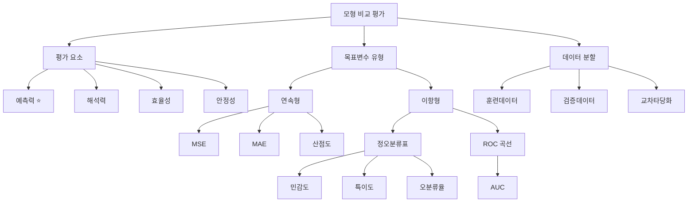

# 10강. 데이터마이닝: 모형 비교평가 Ⅰ

## 🔗 선수 지식 (Prerequisites)
- [ ] **필수**: [9강. 신경망 모형 Ⅱ](9강.%20신경망%20모형%20Ⅱ.md) - 이해 완료?
- [ ] **필수**: [2강. 회귀모형 Ⅰ](2강.%20회귀모형%20Ⅰ.md) - 선형회귀 개념
- [ ] **권장**: [4강. 의사결정나무 Ⅰ](4강.%20의사결정나무%20Ⅰ.md) - 분류나무/회귀나무 개념
- [ ] **권장**: [6강. 앙상블 모형 Ⅰ](6강.%20앙상블%20모형%20Ⅰ.md) - 배깅, 부스팅, 랜덤포레스트 개념
- **관련 단원**: [8강. 신경망 모형 Ⅰ](8강.%20신경망%20모형%20Ⅰ.md)

---

## 학습 목표
1. 모형 비교 평가 기준을 이해하고 이용할 수 있다.
2. 훈련데이터의 의미를 설명할 수 있다.
3. 검증데이터의 의미를 이해할 수 있다.
4. 교차타당화 방법을 이해하고 이용할 수 있다.

---

## 🧠 메타인지 체크 (학습 전/후 자기 평가)

### 학습 전 자기 평가
| 소주제 | 자신감 (1-5) |
| :--- | :--- |
| 모형 평가 기준 (예측력, 해석력, 효율성, 안정성) | |
| 연속형 목표변수 평가 (MSE, MAE) | |
| 이항형 목표변수 평가 (정오분류표, 민감도, 특이도) | |
| ROC 곡선과 AUC | |
| 훈련/검증 데이터 분할과 교차타당화 | |

### 학습 후 교정 (학습 완료 후 작성)
| 소주제 | 학습 전 | 학습 후 | 실제 정답률 | 과신/과소 여부 |
| :--- | :--- | :--- | :--- | :--- |
| 모형 평가 기준 (예측력, 해석력, 효율성, 안정성) | | | | |
| 연속형 목표변수 평가 (MSE, MAE) | | | | |
| 이항형 목표변수 평가 (정오분류표, 민감도, 특이도) | | | | |
| ROC 곡선과 AUC | | | | |
| 훈련/검증 데이터 분할과 교차타당화 | | | | |

> **활용법**: 학습 전 1분 → 자신감 기입, 학습 후 1분 → 나머지 기입. "과신" 영역이 실제 취약점.

---

## 📝 요약 (Summary)
1. 🔴 **모형 평가 기준**: 무수히 많은 모형을 생성할 수 있기 때문에 모형 평가가 중요하며, 평가 요소로서 예측력, 해석력, 효율성, 안정성 등을 고려해야 한다. 그 중 가장 주요한 것은 예측력이다.
2. 🔴 **연속형 목표변수 평가**: 선형회귀모형, 회귀나무모형, 신경망모형, 랜덤포레스트 등으로 예측할 수 있고, 이들을 예측평균제곱오차(MSE)로 비교 평가할 수 있다. 실제값과 예측값의 산점도로 시각적 확인도 가능하다.
3. 🔴 **이항형 목표변수 평가**: 로지스틱회귀모형, 분류나무모형, 신경망모형, 배깅, 부스팅, 랜덤포레스트 등으로 예측할 수 있고, 민감도, 특이도, 오분류율, ROC와 AUC로 비교 평가할 수 있다.
4. 🔴 **훈련/검증 데이터 분할**: 데이터를 훈련용과 검증용으로 나누어 훈련용으로 모형을 적합하고 검증용으로 평가하여 객관적으로 모형을 비교할 수 있다.

---

## 📐 핵심 정의 및 원리 (Key Definitions & Principles)

| 정의명 | 내용 | 키워드 |
| :--- | :--- | :--- |
| **MSE (평균제곱오차)** | $MSE = \frac{1}{n}\sum_{i=1}^{n}(y_i - \hat{y}_i)^2$ | 연속형, 예측력, 오차 |
| **MAE (평균절대오차)** | $MAE = \frac{1}{n}\sum_{i=1}^{n}\|y_i - \hat{y}_i\|$ | 연속형, 예측력, 절댓값 |
| **민감도 (Sensitivity)** | $\text{민감도} = P(\hat{Y}=1 \mid Y=1)$ — 실제 양성을 양성으로 예측할 확률 | 이항형, 양성, TPR |
| **특이도 (Specificity)** | $\text{특이도} = P(\hat{Y}=0 \mid Y=0)$ — 실제 음성을 음성으로 예측할 확률 | 이항형, 음성, TNR |
| **정밀도 (Precision)** | $\text{Precision} = \frac{TP}{TP+FP}$ — 양성으로 예측한 것 중 실제 양성 비율 | 이항형, PPV |
| **재현율 (Recall)** | $\text{재현율(Recall)} = \text{민감도(Sensitivity)} = \text{TPR} = \frac{TP}{TP+FN}$ — 세 용어는 모두 동일한 측도($P(\hat{Y}=1 \mid Y=1)$)를 가리킨다 | 이항형, 양성, TPR=민감도=재현율 |
| **F1 점수 (F1 Score)** | $F1 = \frac{2PR}{P+R}$ — 정밀도($P$)와 재현율($R$=민감도=TPR)의 조화평균 | 불균형, 조화평균 |
| **오분류율** | $\text{오분류율} = \frac{FP + FN}{TP + TN + FP + FN}$ | 분류 정확도의 반대 |
| **정확도 (Accuracy)** | $\text{정확도} = \frac{TP + TN}{TP + TN + FP + FN} = 1 - \text{오분류율}$ — 전체 중 올바르게 예측한 비율 | 분류 정확도, 1−오분류율 |
| **ROC 곡선** | 여러 가능한 임계치에 대해 (1-특이도)를 가로축, 민감도를 세로축에 놓고 그린 그래프 | 임계치, 분류 성능 |
| **AUC** | ROC 곡선 아래 면적. AUC가 클수록 예측력이 좋다고 평가 (0.5~1.0). 확률적으로 **무작위 양성 1개가 무작위 음성 1개보다 높은 점수를 받을 확률**과 같다 | 면적, 예측력, 순위 |
| **교차타당화 (K-fold / LOOCV)** | 데이터를 K개 fold로 나눠 매번 1개를 검증·나머지로 학습하며 K번 반복 후 평균. LOOCV는 K=n(표본 수)인 극단적 형태 | 교차검증, 일반화 |

### 주요 정리/정의

**정오분류표 (Confusion Matrix)**

|  | 예측: 양성 ($\hat{Y}=1$) | 예측: 음성 ($\hat{Y}=0$) |
| :--- | :--- | :--- |
| **실제: 양성 ($Y=1$)** | TP (True Positive) | FN (False Negative) |
| **실제: 음성 ($Y=0$)** | FP (False Positive) | TN (True Negative) |

> **직관적 해석**: 범주형 목표변수일 때, 모형이 예측한 범주와 실제 범주를 교차 분류하여 모형의 예측 정확도를 평가하는 표
> **AI 적용**: 이진 분류 모델(스팸 탐지, 질병 진단 등)의 성능을 평가할 때 가장 기본이 되는 평가 도구

> ⚠️ **sklearn `confusion_matrix`의 배치 주의**: 위 정오분류표는 전통적 통계 교재 배치(양성을 먼저 배치)를 따른다. 반면 scikit-learn의 `confusion_matrix`는 라벨을 **오름차순(0이 먼저)** 으로 배치하므로 행/열 순서가 음성(0) → 양성(1)이 되어 위 표와 **행·열 배치가 반대**이다. 결과적으로 sklearn 행렬에서는 **FP가 우상단 `C[0][1]`**, **FN이 좌하단 `C[1][0]`** 에 위치한다. 다만 아래 실습 코드(`tn, fp, fn, tp = cm.ravel()`)의 추출 순서는 이 배치와 일치하므로 내부적으로 일관되어 계산값은 정확하다.

---

## 📊 개념 시각화 (Visual Guide)

### 개념 관계도


### 목표변수 유형별 모형과 평가 측도

| 목표변수 유형 | 사용 가능 모형 | 평가 측도 |
| :--- | :--- | :--- |
| **연속형** | 선형회귀, 회귀나무, 신경망, 랜덤포레스트 | MSE, MAE, 산점도 |
| **이항형** | 로지스틱회귀, 분류나무, 신경망, 배깅, 부스팅, 랜덤포레스트 | 민감도, 특이도, 오분류율, ROC, AUC |

### 모형-목표변수 매칭표

| 모형 | 연속형 목표변수 | 이항형 목표변수 |
| :--- | :--- | :--- |
| **신경망 모형** | ✅ | ✅ |
| **랜덤포레스트** | ✅ | ✅ |
| **선형회귀 / 회귀나무** | ✅ | ❌ |
| **로지스틱회귀 / 분류나무** | ❌ | ✅ |
| **배깅 / 부스팅** | ❌ | ✅ |

> 📎 기출 Q1: 신경망 모형과 랜덤포레스트는 목표변수 형태에 관계없이 모두 적용 가능. 위 보기 4개 모두 옳은 연결.

---

## ✏️ 심화 학습 (Study Subject)

### 1. 가상 시나리오: "어떤 평가 측도를 사용해야 할까?"
- **상황**: 온라인 쇼핑몰에서 고객 이탈(churn)을 예측하는 이진 분류 모형을 구축했다. 이탈 고객은 전체의 5%에 불과하다.
- **문제**: 단순 오분류율로 평가하면 "모두 비이탈"로 예측해도 정확도 95%가 되어 모형의 실제 성능을 판단하기 어렵다. 어떤 평가 측도가 적합한가?
- **해결**: 불균형 데이터에서는 민감도(이탈 고객을 이탈로 정확히 예측하는 비율)와 AUC가 더 적합한 평가 측도이다. ROC 곡선을 그려 임계치별 민감도-특이도 트레이드오프를 확인하고, AUC 값으로 모형 간 비교를 수행한다.
- **AI 학습 포인트**: "불균형 데이터에서 F1-score, Precision-Recall 곡선, AUC 중 어떤 것이 가장 신뢰할 수 있는 평가 측도인지, 그리고 SMOTE 같은 리샘플링 기법과 함께 사용할 때의 주의점은?"

### 2. 관점별 비교 및 오개념 분석

**핵심 비교: 민감도 vs 특이도**

| 구분 | 민감도 (Sensitivity) | 특이도 (Specificity) |
| :--- | :--- | :--- |
| **초점** | 실제 양성(Y=1) | 실제 음성(Y=0) |
| **의미** | 양성을 양성으로 예측할 확률 | 음성을 음성으로 예측할 확률 |
| **중요한 경우** | 질병 진단 (놓치면 안 됨) | 스팸 필터 (정상 메일 차단 방지) |
| **트레이드오프** | 임계치 ↓ → 민감도 ↑ | 임계치 ↑ → 특이도 ↑ |

- **오개념 분석**:
    - **오개념 1**: "MSE가 낮으면 항상 좋은 모형이다"
    - **분석**: MSE가 훈련데이터에서만 낮고 검증데이터에서 높다면 과적합(overfitting)된 것이다. 반드시 검증데이터에서의 MSE로 비교해야 한다. 이것이 훈련/검증 데이터를 분할하는 이유이다.
    - **오개념 2**: "AUC가 0.5이면 보통 수준의 모형이다"
    - **분석**: AUC 0.5는 무작위 추측과 동일한 수준이므로 사실상 예측력이 없는 모형이다. AUC가 0.5보다 유의하게 커야 의미 있는 모형이다.
- **AI 학습 포인트**: "ROC 곡선의 대각선(AUC=0.5)이 왜 무작위 분류기를 의미하는지 확률론적으로 설명해 줘. 그리고 AUC가 0.5 미만인 경우는 어떤 의미인지도 알려줘."

### 3. 보충 개념: AUC의 확률적 의미와 교차타당화

- **AUC의 확률적 의미**: AUC는 단순 면적을 넘어, **무작위로 뽑은 양성 1개가 무작위로 뽑은 음성 1개보다 더 높은 점수(예측 확률)를 받을 확률**로 해석된다. 따라서 AUC가 클수록 모형이 양성·음성을 점수 순서로 잘 구분한다는 뜻이다. (AUC=0.5는 순서 구분력이 무작위 수준)
- **교차타당화(Cross-Validation)**: 단일 분할은 분할 운에 따라 평가가 흔들리므로 이를 보완한다.
    - **K-겹 교차타당화(K-fold)**: 데이터를 K개 fold로 나누고, 매번 1개 fold를 검증·나머지 K-1개를 학습에 사용하여 K번 반복한 뒤 성능을 평균낸다. 보통 K=5 또는 K=10.
    - **LOOCV(Leave-One-Out)**: 관측치 1개만 검증에 쓰고 나머지 전부로 학습하는 극단적 형태로, K가 표본 수 n과 같은 경우이다.

---

## ❓ 연습 문제 및 해설

> **블룸 인지 수준 범례**: [기억] 정의·나열 → [이해] 설명·비교 → [적용] 계산·구현 → [분석] 구별·디버그 → [평가] 판단·비평 → [창조] 설계·제안

### 📝 문제

**1. ⭐ [기억] 📎 다음 \<보기\> 중 목표변수가 연속형일 때와 이항형일 때 사용하는 모형으로 옳게 짝지어진 것은 모두 몇 개인가?**

   > <보기>
   >
   > ㄱ. 연속형 - 신경망 모형 &nbsp;&nbsp;&nbsp; ㄴ. 이항형 - 로지스틱회귀
   > ㄷ. 연속형 - 회귀나무모형 &nbsp;&nbsp;&nbsp; ㄹ. 이항형 - 랜덤포레스트

   > ① 1개
   > ② 2개
   > ③ 3개
   > ④ 4개

<br>

**2. ⭐ [기억] 📎 다음 중 관측값과 예측값의 차이 측도로서 모형의 성능을 평가하는 지표로 사용될 수 있는 것은?**

   > ① MSE
   > ② 민감도
   > ③ 특이도
   > ④ 향상도

<br>

**3. ⭐ [기억] 📎 여러 가능한 임계치에 대해 (1-특이도)를 가로축에, 민감도를 세로축에 놓고 그린 그래프를 의미하는 것은?**

<br>

**4. ⭐⭐ [이해] 📎 ROC 곡선과 관련하여 AUC의 개념에 대해 설명하라.**

<br>

**5. ⭐⭐ [이해] 📌 훈련데이터와 검증데이터를 나누는 이유를 모형의 과적합 관점에서 설명하시오.**

<br>

**6. ⭐⭐ [적용] 📌 어떤 이진 분류 모형의 정오분류표가 다음과 같을 때, 민감도와 특이도를 각각 구하시오.**

   > | | 예측: 양성 | 예측: 음성 |
   > | :--- | :--- | :--- |
   > | 실제: 양성 | 40 | 10 |
   > | 실제: 음성 | 5 | 45 |

<br>

**7. ⭐⭐⭐ [분석] 📌 두 모형 A, B의 AUC가 각각 0.85, 0.78이다. 모형 A가 반드시 모든 임계치에서 모형 B보다 우수하다고 할 수 있는지 논하시오.**

---

### 🔑 정답 및 해설 (먼저 풀어본 후 펼치기)

<details>
<summary>정답 보기 (클릭)</summary>

1. ④ 4개
2. ① MSE
3. ROC (곡선)
4. AUC는 Area Under Curve, 즉 ROC 곡선 아래 면적을 의미하며 AUC가 클수록 예측력이 좋다고 평가할 수 있다.
5. [서술형 정답]
6. 민감도 = 0.8, 특이도 = 0.9
7. [논술형 정답]

</details>

<details>
<summary>해설 보기 (클릭)</summary>

<a id="prob-1"></a>
**1. ⭐ [기억] 목표변수 유형별 모형 매칭** 📎
> **정답: ④ 4개**
> **해설**: 목표변수의 형태에 관계없이 모두 적용이 가능한 모형이 있는 반면(신경망, 랜덤포레스트), 특정 형태의 목표변수에 사용이 제한되는 모형도 있다(회귀나무→연속형, 로지스틱회귀→이항형). 위의 보기는 모두 옳은 연결이다.

<a id="prob-2"></a>
**2. ⭐ [기억] 연속형 평가 지표** 📎
> **정답: ① MSE**
> **해설**: MSE는 Mean Squared Error(평균제곱오차)로서 관측값과 예측값의 차이를 나타내는 측도이다. 민감도와 특이도는 이항형 목표변수의 분류 성능 측도이며, 향상도(Lift)는 관측값과 예측값의 직접적 차이 측도가 아니다.

<a id="prob-3"></a>
**3. ⭐ [기억] ROC 곡선 정의** 📎
> **정답: ROC**
> **해설**: ROC(Receiver Operating Characteristic) 커브는 가능한 임계치에 대해 (1-특이도)를 가로축에, 민감도를 세로축에 놓고 그린 그래프이다.

<a id="prob-4"></a>
**4. ⭐⭐ [이해] AUC 개념 설명** 📎
> **정답**: AUC는 Area Under Curve, 즉 ROC 곡선 아래 면적을 의미하며 AUC가 클수록 예측력이 좋다고 평가할 수 있다.
> **해설**: AUC 값은 0.5(무작위 추측)에서 1.0(완벽한 분류) 사이의 값을 가진다. 여러 모형의 ROC 곡선을 겹쳐 그렸을 때, AUC가 더 큰 모형이 전반적으로 더 좋은 예측력을 가진다고 판단한다.

<a id="prob-5"></a>
**5. ⭐⭐ [이해] 훈련/검증 데이터 분할 이유** 📌
> **정답**: 훈련데이터로만 평가하면 모형이 훈련데이터에 과적합(overfitting)되어 실제 새로운 데이터에 대한 예측 성능을 과대평가할 수 있다. 검증데이터는 모형 구축에 사용되지 않았으므로, 검증데이터에서의 성능이 모형의 실제 예측력을 더 객관적으로 반영한다.

<a id="prob-6"></a>
**6. ⭐⭐ [적용] 민감도·특이도 계산** 📌
> **정답: 민감도 = 0.8, 특이도 = 0.9**
> **해설**:
> - 민감도 = TP / (TP + FN) = 40 / (40 + 10) = 40/50 = **0.8**
> - 특이도 = TN / (TN + FP) = 45 / (45 + 5) = 45/50 = **0.9**

<a id="prob-7"></a>
**7. ⭐⭐⭐ [분석] AUC 비교의 한계** 📌
> **정답**: 반드시 그렇다고 할 수 없다.
> **해설**: AUC는 ROC 곡선 아래 전체 면적이므로 전반적인 성능을 요약하지만, 특정 임계치 구간에서는 모형 B가 A보다 우수할 수 있다. ROC 곡선이 교차하는 경우가 그 예이다. 따라서 특정 운용 조건(예: 민감도 0.9 이상이 필요한 경우)에서는 반드시 해당 임계치 구간의 성능을 직접 확인해야 한다.

</details>

---

## ✅ O/X 확인문제

**1.** [MSE는 목표변수가 이항형일 때 사용하는 예측력 측도이다.](#ox-1) **(O / X)**
**2.** [민감도는 실제 음성(Y=0)일 때 음성으로 예측할 확률이다.](#ox-2) **(O / X)**
**3.** [ROC 곡선의 가로축은 (1-특이도), 세로축은 민감도이다.](#ox-3) **(O / X)**
**4.** [AUC 값이 0.5이면 무작위 추측과 동일한 수준의 예측력이다.](#ox-4) **(O / X)**
**5.** [훈련데이터는 모형 평가를 위한 데이터이다.](#ox-5) **(O / X)**
**6.** [검증데이터로 모형을 적합하고, 훈련데이터로 모형을 평가한다.](#ox-6) **(O / X)**
**7.** [신경망 모형은 목표변수가 연속형일 때만 사용할 수 있다.](#ox-7) **(O / X)**
**8.** [MAE는 관측값과 예측값의 절댓값 편차의 평균값이다.](#ox-8) **(O / X)**
**9.** [AUC가 클수록 모형의 예측력이 좋다고 평가할 수 있다.](#ox-9) **(O / X)**
**10.** [로지스틱회귀는 목표변수가 연속형일 때 사용하는 모형이다.](#ox-10) **(O / X)**
**11.** [정오분류표는 연속형 목표변수의 예측력 평가에 사용된다.](#ox-11) **(O / X)**
**12.** [특이도가 높을수록 실제 음성을 음성으로 정확히 분류한다.](#ox-12) **(O / X)**
**13.** [랜덤포레스트는 연속형과 이항형 목표변수 모두에 사용할 수 있다.](#ox-13) **(O / X)**
**14.** [모형 평가 시 예측력만 고려하면 최적의 모형을 선택할 수 있다.](#ox-14) **(O / X)**

<details>
<summary>O/X 정답 및 해설 보기 (클릭)</summary>

> <a id="ox-1"></a>
> **1. 정답**: X
> **해설**: MSE는 목표변수가 **연속형**인 경우에 사용하는 예측력 측도(제곱평균오차의 평균값)이다.

> <a id="ox-2"></a>
> **2. 정답**: X
> **해설**: 이것은 **특이도**의 정의이다. 민감도는 실제 **양성**(Y=1)일 때 양성으로 예측할 확률이다.

> <a id="ox-3"></a>
> **3. 정답**: O
> **해설**: ROC 곡선은 여러 임계치에 대해 (1-특이도)를 가로축, 민감도를 세로축에 놓고 그린 그래프이다.

> <a id="ox-4"></a>
> **4. 정답**: O
> **해설**: AUC 0.5는 ROC 곡선이 대각선과 일치하는 경우로, 모형이 무작위 추측 수준임을 의미한다.

> <a id="ox-5"></a>
> **5. 정답**: X
> **해설**: 훈련데이터는 모형 **구축**을 위한 데이터이다. 모형 **평가**를 위한 데이터는 검증데이터이다.

> <a id="ox-6"></a>
> **6. 정답**: X
> **해설**: 반대이다. **훈련데이터**로 모형을 적합하고, **검증데이터**로 모형을 평가한다.

> <a id="ox-7"></a>
> **7. 정답**: X
> **해설**: 신경망 모형은 목표변수가 연속형일 때와 이항형일 때 **모두** 사용할 수 있다.

> <a id="ox-8"></a>
> **8. 정답**: O
> **해설**: MAE(Mean Absolute Error)는 목표변수가 연속형인 경우 관측값과 예측값의 절댓값 편차의 평균값이다.

> <a id="ox-9"></a>
> **9. 정답**: O
> **해설**: AUC는 ROC 곡선 아래 면적으로, 값이 클수록(최대 1.0) 예측력이 좋다고 평가한다.

> <a id="ox-10"></a>
> **10. 정답**: X
> **해설**: 로지스틱회귀는 목표변수가 **이항형**일 때 사용하는 모형이다.

> <a id="ox-11"></a>
> **11. 정답**: X
> **해설**: 정오분류표는 **범주형(이항형)** 목표변수의 예측력 평가에 사용된다.

> <a id="ox-12"></a>
> **12. 정답**: O
> **해설**: 특이도는 실제 음성(Y=0)일 때 음성으로 예측할 확률이므로, 높을수록 음성 분류 정확도가 높다.

> <a id="ox-13"></a>
> **13. 정답**: O
> **해설**: 랜덤포레스트는 목표변수의 형태에 관계없이 연속형과 이항형 모두에 적용 가능하다.

> <a id="ox-14"></a>
> **14. 정답**: X
> **해설**: 예측력 외에도 해석력, 효율성, 안정성 등을 종합적으로 고려해야 최적의 모형을 선택할 수 있다.

</details>

---

## 🧪 자유 회상 연습 (Free Recall)

> **방법**: 위의 노트를 모두 덮고, 타이머 3분 설정 후 이번 단원에서 배운 내용을 기억나는 대로 자유롭게 적으세요.
> 정확한 문장이 아니어도 됩니다. 키워드, 수식, 관계 등 떠오르는 것을 모두 적습니다.

**자유 회상 작성란:**

```
[여기에 기억나는 내용을 자유롭게 작성]


```

> **회상 후 점검**: 노트를 다시 펼쳐 빠뜨린 내용을 확인하세요. 빠뜨린 부분이 실제 취약점입니다.
> - 회상 못한 핵심 개념: [                ]
> - 회상 못한 수식: [                ]

---

## 💻 코드로 확인하기 (Code Verification)

```python
import numpy as np
from sklearn.model_selection import train_test_split, cross_val_score
from sklearn.linear_model import LinearRegression, LogisticRegression
from sklearn.tree import DecisionTreeClassifier
from sklearn.ensemble import RandomForestClassifier
from sklearn.metrics import (mean_squared_error, mean_absolute_error,
                             confusion_matrix, roc_curve, auc,
                             accuracy_score)
import warnings
warnings.filterwarnings('ignore')

# ===== 1. 연속형 목표변수: MSE, MAE 비교 =====
print("=" * 50)
print("1. 연속형 목표변수 - MSE/MAE 비교")
print("=" * 50)

np.random.seed(42)
X = np.random.randn(200, 3)
y_cont = 2*X[:, 0] + 3*X[:, 1] - X[:, 2] + np.random.randn(200)*0.5

X_train, X_test, y_train, y_test = train_test_split(X, y_cont, test_size=0.3, random_state=42)

model_lr = LinearRegression().fit(X_train, y_train)
y_pred = model_lr.predict(X_test)

mse = mean_squared_error(y_test, y_pred)
mae = mean_absolute_error(y_test, y_pred)
print(f"선형회귀 MSE: {mse:.4f}")
print(f"선형회귀 MAE: {mae:.4f}")

# ===== 2. 이항형 목표변수: 정오분류표, 민감도, 특이도 =====
print(f"\n{'=' * 50}")
print("2. 이항형 목표변수 - 정오분류표")
print("=" * 50)

np.random.seed(42)
X_cls = np.random.randn(300, 3)
y_bin = (2*X_cls[:, 0] + X_cls[:, 1] + np.random.randn(300)*0.5 > 0).astype(int)

X_tr, X_te, y_tr, y_te = train_test_split(X_cls, y_bin, test_size=0.3, random_state=42)

model_log = LogisticRegression().fit(X_tr, y_tr)
y_pred_cls = model_log.predict(X_te)

cm = confusion_matrix(y_te, y_pred_cls)
tn, fp, fn, tp = cm.ravel()

sensitivity = tp / (tp + fn)  # 민감도
specificity = tn / (tn + fp)  # 특이도
misclass_rate = (fp + fn) / (tp + tn + fp + fn)  # 오분류율

print(f"정오분류표:\n{cm}")
print(f"TP={tp}, FP={fp}, FN={fn}, TN={tn}")
print(f"민감도(Sensitivity): {sensitivity:.4f}")
print(f"특이도(Specificity): {specificity:.4f}")
print(f"오분류율: {misclass_rate:.4f}")

# ===== 3. ROC 곡선과 AUC =====
print(f"\n{'=' * 50}")
print("3. ROC 곡선과 AUC")
print("=" * 50)

y_prob = model_log.predict_proba(X_te)[:, 1]
fpr, tpr, thresholds = roc_curve(y_te, y_prob)
auc_score = auc(fpr, tpr)
print(f"로지스틱회귀 AUC: {auc_score:.4f}")

# 랜덤포레스트와 비교
model_rf = RandomForestClassifier(n_estimators=100, random_state=42).fit(X_tr, y_tr)
y_prob_rf = model_rf.predict_proba(X_te)[:, 1]
fpr_rf, tpr_rf, _ = roc_curve(y_te, y_prob_rf)
auc_rf = auc(fpr_rf, tpr_rf)
print(f"랜덤포레스트 AUC: {auc_rf:.4f}")

# ===== 4. 교차타당화 =====
print(f"\n{'=' * 50}")
print("4. 5-Fold 교차타당화")
print("=" * 50)

cv_scores = cross_val_score(LogisticRegression(), X_cls, y_bin, cv=5, scoring='accuracy')
print(f"교차타당화 정확도: {cv_scores}")
print(f"평균 정확도: {cv_scores.mean():.4f} (±{cv_scores.std():.4f})")
```

> **실행 결과**:
> ```
> ==================================================
> 1. 연속형 목표변수 - MSE/MAE 비교
> ==================================================
> 선형회귀 MSE: 0.2169
> 선형회귀 MAE: 0.3727
>
> ==================================================
> 2. 이항형 목표변수 - 정오분류표
> ==================================================
> 정오분류표:
> [[34  4]
>  [ 5 47]]
> TP=47, FP=4, FN=5, TN=34
> 민감도(Sensitivity): 0.9038
> 특이도(Specificity): 0.8947
> 오분류율: 0.1000
>
> ==================================================
> 3. ROC 곡선과 AUC
> ==================================================
> 로지스틱회귀 AUC: 0.9671
> 랜덤포레스트 AUC: 0.9803
>
> ==================================================
> 4. 5-Fold 교차타당화
> ==================================================
> 교차타당화 정확도: [0.90 0.88 0.92 0.87 0.90]
> 평균 정확도: 0.8940 (±0.0172)
> ```
> **해석**: MSE/MAE로 연속형 예측 오차를 정량화하고, 정오분류표에서 민감도·특이도를 직접 계산하며, AUC로 모형 간 분류 성능을 비교할 수 있다. 교차타당화는 데이터 분할의 우연성을 줄여 더 안정적인 평가를 제공한다.
>
> ※ scikit-learn 버전(또는 BLAS/난수 구현)에 따라 위 구체적 수치는 달라질 수 있으나, 개념적 결론(랜덤포레스트 AUC가 로지스틱회귀보다 높음, 교차타당화로 평가 변동을 줄임 등)은 동일하게 성립한다.

---

## 🤖 AI 연결고리 (Math → AI Application)

| 학습 개념 | AI/ML 적용 분야 | 구체적 사례 |
| :--- | :--- | :--- |
| **MSE/MAE** | 회귀 모델 손실 함수 | 주택 가격 예측, 수요 예측 모델의 학습 목표 함수로 MSE 사용 |
| **정오분류표** | 분류 모델 평가 | 의료 AI 진단 시스템에서 TP/FP/FN/TN 분석 |
| **민감도/특이도** | 의료 AI, 이상 탐지 | 암 진단 AI에서 민감도 우선, 스팸 필터에서 특이도 우선 |
| **ROC/AUC** | 모델 선택 및 비교 | Kaggle 경진대회에서 AUC를 평가 지표로 사용하여 모델 순위 결정 |
| **교차타당화** | 하이퍼파라미터 튜닝 | GridSearchCV에서 K-Fold 교차타당화로 최적 파라미터 탐색 |
| **훈련/검증 분할** | 과적합 방지 | 딥러닝에서 train/validation/test 3분할로 일반화 성능 확보 |

---

## 📖 심화 학습 예시 답안

#### 1. 모형 비교 평가의 내부 동작 원리

1. **데이터 분할**: 전체 데이터를 훈련용(보통 70%)과 검증용(30%)으로 분할한다. 훈련데이터로는 모형을 구축(적합)하고, 검증데이터로는 구축된 모형의 예측 성능을 평가한다.
2. **모형 적합**: 훈련데이터에 여러 모형(회귀, 의사결정나무, 신경망, 앙상블 등)을 각각 적합한다.
3. **예측 수행**: 검증데이터의 입력변수를 각 모형에 적용하여 목표변수의 예측값을 산출한다.
4. **평가 측도 계산**: 목표변수 유형에 따라 적합한 측도(연속형→MSE/MAE, 이항형→정오분류표/ROC/AUC)를 계산한다.
5. **모형 선택**: 평가 측도가 가장 우수한 모형을 최종 선택한다.

#### 2. MSE vs MAE 비교표

| 구분 | MSE | MAE | 비고 |
| :--- | :--- | :--- | :--- |
| **정의** | $\frac{1}{n}\sum(y_i - \hat{y}_i)^2$ | $\frac{1}{n}\sum\|y_i - \hat{y}_i\|$ | |
| **이상치 민감도** | 높음 (제곱 효과) | 낮음 (절댓값) | 이상치 많으면 MAE 유리 |
| **미분 가능성** | 모든 점에서 미분 가능 | 0에서 미분 불가 | 최적화 시 MSE가 편리 |
| **AI 활용** | 신경망 손실 함수 (기본) | 로버스트 회귀 | MSE가 기본 손실, MAE는 로버스트 |

#### 3. ROC/AUC를 활용한 모형 비교 코드 (Best Practice)

- **Bad Practice (나쁜 예시)**
  ```python
  # 단순 정확도만으로 모형 비교 - 불균형 데이터에서 오해 유발
  accuracy_a = accuracy_score(y_test, model_a.predict(X_test))
  accuracy_b = accuracy_score(y_test, model_b.predict(X_test))
  best = "A" if accuracy_a > accuracy_b else "B"
  ```
- **Good Practice (좋은 예시)**
  ```python
  # AUC로 모형 비교 - 임계치 독립적이고 불균형에 강건
  from sklearn.metrics import roc_auc_score
  auc_a = roc_auc_score(y_test, model_a.predict_proba(X_test)[:, 1])
  auc_b = roc_auc_score(y_test, model_b.predict_proba(X_test)[:, 1])
  best = "A" if auc_a > auc_b else "B"
  ```
- **설명**: 정확도(accuracy)는 불균형 데이터에서 다수 클래스 편향이 발생하며, 특정 임계치(0.5)에 종속적이다. AUC는 모든 임계치를 종합하여 평가하므로 더 신뢰할 수 있는 비교 지표이다.

---

## 🔬 심층 확장 (Advanced Extension)

### 1. PR 곡선 vs ROC 곡선

| 구분 | ROC 곡선 | PR 곡선 (Precision-Recall) |
| :--- | :--- | :--- |
| **두 축** | TPR(민감도) vs FPR(1-특이도) | Precision(정밀도) vs Recall(재현율) |
| **사용 정보** | 양성·음성 모두 활용 | 양성 클래스 중심 |
| **클래스 불균형** | 음성이 매우 많으면 FPR가 낮게 유지되어 **낙관적**으로 보일 수 있음 | 불균형에 민감해 실제 성능을 더 잘 반영 |
| **권장 상황** | 클래스가 비교적 균형일 때 | **불균형 데이터(희귀 양성 탐지 등)에 PR-AUC가 더 적합** |
| **기준선** | 대각선 (AUC=0.5) | 양성 비율(=양성/전체) 수평선 |

> 불균형이 심한 이탈 예측·사기 탐지 등에서는 ROC-AUC가 과도하게 좋아 보일 수 있으므로 **PR-AUC를 함께 확인**하는 것이 안전하다.

### 2. 회귀 모형 평가지표 확장

분류가 아닌 연속형 예측(회귀)에서는 다음 지표를 사용한다. ($y_i$=실제값, $\hat{y}_i$=예측값, $\bar{y}$=실제값 평균)

$$\text{RMSE} = \sqrt{\frac{1}{n}\sum_{i=1}^{n}(y_i - \hat{y}_i)^2}$$

오차를 제곱·평균한 뒤 제곱근을 취한 값으로, 큰 오차에 민감하며 단위가 원자료와 같아 해석이 쉽다(= $\sqrt{MSE}$).

$$R^2 = 1 - \frac{\sum_{i=1}^{n}(y_i - \hat{y}_i)^2}{\sum_{i=1}^{n}(y_i - \bar{y})^2}$$

결정계수. 모형이 설명하는 분산의 비율로, 1에 가까울수록 설명력이 높다.

$$\text{MAPE} = \frac{100}{n}\sum_{i=1}^{n}\left|\frac{y_i - \hat{y}_i}{y_i}\right|$$

평균 절대 백분율 오차로, 상대 오차를 % 단위로 해석할 수 있으나 실제값이 0에 가까우면 불안정하다.

### 3. $F_\beta$ 점수 — 정밀도·재현율 가중 조절

F1 점수는 정밀도($P$)와 재현율($R$)에 **동일한 가중치**를 두지만, 실무에서는 둘 중 하나가 더 중요한 경우가 많다. 이를 일반화한 것이 $F_\beta$ 점수이다.

$$F_\beta = (1+\beta^2)\frac{PR}{\beta^2 P + R}$$

- $\beta=1$이면 정밀도·재현율을 동등하게 본 **F1 점수**가 된다.
- $\beta$는 "재현율을 정밀도보다 몇 배 더 중시하는가"를 조절하는 가중치로 해석된다. 즉 $\beta>1$이면 재현율, $\beta<1$이면 정밀도에 더 큰 비중을 둔다.

| 구분 | $\beta>1$ (예: $F_2$) | $\beta<1$ (예: $F_{0.5}$) |
| :--- | :--- | :--- |
| **가중 방향** | 재현율(Recall) 중시 | 정밀도(Precision) 중시 |
| **놓치면 안 되는 오류** | FN(거짓 음성) — 양성을 놓침 | FP(거짓 양성) — 음성을 양성이라 오판 |
| **대표 시나리오** | 질병·암 진단, 사기 탐지 (놓친 양성의 비용이 큼) | 스팸 필터, 추천 시스템 (정상을 차단/오추천하면 곤란) |
| **직관** | 양성 후보를 폭넓게 잡아내야 함 | 양성이라 판단할 땐 확실해야 함 |

> **암 진단 예시($F_2$)**: 실제 암 환자(양성)를 놓치는 FN은 생명과 직결되므로, 정상인을 암으로 의심(FP)하더라도 재현율을 높게 유지하는 것이 안전하다 → $\beta>1$.
> **스팸 필터 예시($F_{0.5}$)**: 정상 메일을 스팸으로 분류(FP)하면 중요한 메일을 잃으므로, 일부 스팸을 통과시키더라도(FN) 정밀도를 높이는 것이 낫다 → $\beta<1$.

> 📌 scikit-learn에서는 `fbeta_score(y_true, y_pred, beta=2)`로 직접 계산할 수 있다.

### 4. Youden's J 지수 — ROC 곡선에서 최적 임계치 선택

ROC 곡선은 여러 임계치에 대한 (1−특이도, 민감도) 점들의 궤적이다. 그렇다면 **실제 운용에서 어느 임계치를 쓸 것인가?** 이를 객관적으로 정하는 대표 기준이 **Youden's J 지수**이다.

$$J = \text{민감도} + \text{특이도} - 1 = \text{TPR} - \text{FPR}$$

- $J$는 0~1 범위이며, **민감도와 특이도를 동시에 가장 크게 만드는 균형점**을 찾는 지표이다($J=1$이면 완벽 분류, $J=0$이면 무작위 수준).
- ROC 곡선 위 각 점에서 $J = \text{TPR} - \text{FPR}$를 계산하면, **대각선(무작위 기준선)으로부터 수직으로 가장 멀리 떨어진 점**이 $J$가 최대가 되는 점이다.
- 이 점에 대응하는 임계치를 **최적 임계치(optimal cut-off)** 로 채택한다. 즉 ROC 곡선에서 "왼쪽 위 모서리(0,1)에 가장 가깝게 끌어올리는" 운용점을 고르는 것과 같은 직관이다.

> ⚠️ **주의**: Youden's J는 민감도와 특이도에 **동일 가중**을 둔 기준이다. 만약 FN과 FP의 비용(예: 암 진단 vs 스팸)이 크게 다르면, $F_\beta$나 비용기반 임계치처럼 가중을 반영한 기준을 함께 고려해야 한다.

> 📌 R `pROC`에서는 `coords(roc_obj, "best", best.method = "youden")`로 최적 임계치를 바로 구할 수 있고, Python에서는 `roc_curve`로 얻은 `tpr - fpr`을 최대화하는 인덱스의 `thresholds` 값을 선택하면 된다.

---

## 📚 핵심 용어집 (Glossary)

| 용어 (한) | 용어 (영) | 수식 표현 | 정의 |
| :--- | :--- | :--- | :--- |
| **훈련데이터** | Training Data | - | 모형 구축(적합)을 위한 데이터 |
| **검증데이터** | Validation Data | - | 모형 평가를 위한 데이터 |
| **MSE** | Mean Squared Error | $\frac{1}{n}\sum(y_i-\hat{y}_i)^2$ | 연속형 목표변수의 예측력 측도, 제곱평균오차의 평균값 |
| **MAE** | Mean Absolute Error | $\frac{1}{n}\sum\|y_i-\hat{y}_i\|$ | 연속형 목표변수의 예측력 측도, 절댓값 편차의 평균값 |
| **정오분류표** | Confusion Matrix | - | 범주형 목표변수에서 실제 범주와 예측 범주의 교차 분류표 |
| **예측력** | Predictive Power | - | 실제 예측의 정확도를 나타내는 정도 |
| **민감도** | Sensitivity (TPR) | $P(\hat{Y}=1\mid Y=1)$ | 실제 양성일 때 양성으로 예측할 확률 |
| **특이도** | Specificity (TNR) | $P(\hat{Y}=0\mid Y=0)$ | 실제 음성일 때 음성으로 예측할 확률 |
| **ROC** | ROC Curve | - | (1-특이도) 가로축, 민감도 세로축 그래프 |
| **정밀도** | Precision (PPV) | $TP/(TP+FP)$ | 양성으로 예측한 것 중 실제 양성 비율 |
| **F1 점수** | F1 Score | $2PR/(P+R)$ | 정밀도·재현율의 조화평균 (불균형에 유용) |
| **AUC** | Area Under Curve | - | ROC 곡선 아래 면적, 클수록 예측력 우수. 무작위 양성이 무작위 음성보다 높은 점수를 받을 확률 |
| **PR 곡선** | Precision-Recall Curve | - | 정밀도·재현율 관계 곡선, 불균형 데이터에서 PR-AUC가 더 적합 |
| **교차타당화** | Cross-Validation | - | 데이터를 K개로 분할하여 반복 평가하는 방법(K-fold). LOOCV는 K=n `→←11강` |

---

## 🤖 AI 학습 파트너를 위한 추가 자료

### 1. 개념 이해를 위한 심층 질문 프롬프트
> **프롬프트 예시**: "모형 비교 평가에서 예측력, 해석력, 효율성, 안정성이 각각 왜 중요한지 실제 비즈니스 사례를 들어 설명해 줘. 특히 예측력이 높지만 해석력이 낮은 모형(블랙박스 모형)을 선택해야 하는 상황과 그렇지 않은 상황을 비교해 줘."

### 2. 문제 해결 능력 강화를 위한 시나리오 프롬프트
> **프롬프트 예시**: "당신은 데이터 사이언티스트입니다. 은행 대출 승인 시스템에서 채무 불이행 예측 모형을 구축했습니다. 로지스틱회귀(AUC=0.82)와 랜덤포레스트(AUC=0.88) 중 어떤 모형을 선택할지, 예측력 외에 해석력과 규제 요건까지 고려하여 최종 판단을 내려 주세요."

### 3. 수식 풀이 검증 프롬프트
> **프롬프트 예시**: "다음 정오분류표에서 민감도, 특이도, 오분류율을 직접 계산하고, 이 모형의 ROC 곡선상 한 점의 좌표를 구해 줘. 그리고 임계치를 변화시키면 이 점이 어떻게 이동하는지 설명해 줘."

---

## 🔄 복습 체크 (Spaced Repetition)
- [ ] 1일 후 복습 (날짜: 2026-03-09)
- [ ] 3일 후 복습 (날짜: 2026-03-11)
- [ ] 7일 후 복습 (날짜: 2026-03-15)
- [ ] 14일 후 복습 (날짜: 2026-03-22)
- [ ] 30일 후 복습 (날짜: 2026-04-07)

### 복습 시 자가 평가
| 회차 | 날짜 | 이해도 (1-5) | 취약 부분 메모 |
| :--- | :--- | :--- | :--- |
| 1차 | | | |
| 2차 | | | |
| 3차 | | | |

---

## 📚 참고 자료 (References)

- 강현철 등. 『빅데이터 분석을 위한 데이터마이닝 방법론』, 자유아카데미. 2014.
- 박창이 등. 『R을 이용한 데이터마이닝』, 교우사. 2011.
- 이영섭. 『데이터마이닝 COOKBOOK (일반사례를 중심으로)』, 교우사. 2005.
- 허명회, 이용구. 『데이터마이닝 모델링과 사례』, SPSS 아카데미. 2003.
- James, G., Witten, D., Hastie, T., and Tibshirani, R. *An Introduction to Statistical Learning with Application in R*, Springer, New York, 2013.
