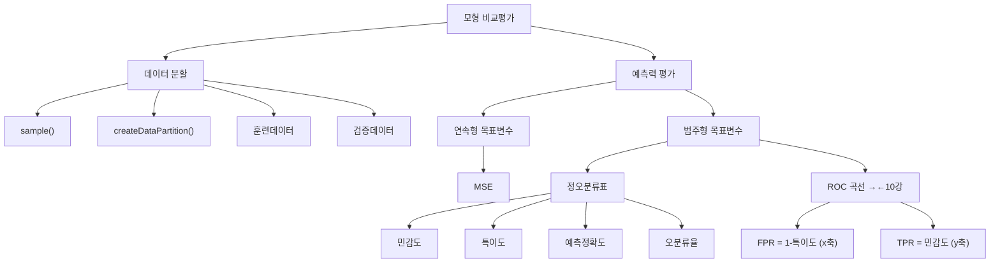

# 11강. 데이터마이닝: 모형 비교평가 Ⅱ

## 🔗 선수 지식 (Prerequisites)
- [ ] **필수**: [10강. 모형 비교평가 Ⅰ](10강.%20모형%20비교평가%20Ⅰ.md) - 이해 완료?
- [ ] **필수**: [2강. 회귀모형 Ⅰ](2강.%20회귀모형%20Ⅰ.md) - 선형회귀 개념
- [ ] **권장**: [4강. 의사결정나무 Ⅰ](4강.%20의사결정나무%20Ⅰ.md) - 분류나무/회귀나무 개념
- [ ] **권장**: [6강. 앙상블 모형 Ⅰ](6강.%20앙상블%20모형%20Ⅰ.md) - 배깅, 부스팅, 랜덤포레스트 개념
- **관련 단원**: [8강. 신경망 모형 Ⅰ](8강.%20신경망%20모형%20Ⅰ.md)

---

## 학습 목표
1. 모형 비교 평가 기준을 이해하고 이용할 수 있다.
2. 훈련데이터의 의미를 이해하고 생성할 수 있다.
3. 검증데이터의 의미를 이해하고 생성할 수 있다.
4. 목표변수의 특성에 따른 예측력 평가지표를 산출할 수 있다.

---

## 🧠 메타인지 체크 (학습 전/후 자기 평가)

### 학습 전 자기 평가
| 소주제 | 자신감 (1-5) |
| :--- | :--- |
| 표본추출 함수 (sample, createDataPartition) | |
| ROCR 패키지 (prediction, performance) | |
| 연속형 목표변수 예측력 평가 (MSE) | |
| 범주형 목표변수 예측력 평가 (정오분류표) | |
| 민감도, 특이도, 예측정확도, 오분류율 | |

### 학습 후 교정 (학습 완료 후 작성)
| 소주제 | 학습 전 | 학습 후 | 실제 정답률 | 과신/과소 여부 |
| :--- | :--- | :--- | :--- | :--- |
| 표본추출 함수 (sample, createDataPartition) | | | | |
| ROCR 패키지 (prediction, performance) | | | | |
| 연속형 목표변수 예측력 평가 (MSE) | | | | |
| 범주형 목표변수 예측력 평가 (정오분류표) | | | | |
| 민감도, 특이도, 예측정확도, 오분류율 | | | | |

> **활용법**: 학습 전 1분 → 자신감 기입, 학습 후 1분 → 나머지 기입. "과신" 영역이 실제 취약점.

---

## 📝 요약 (Summary)
1. 🔴 **표본추출 함수**: `sample()`과 `createDataPartition()` 함수는 표본추출과 관련된 함수이다. 훈련데이터와 검증데이터를 나누어 객관적인 성능평가를 수행할 수 있다.
2. 🔴 **prediction 함수**: 패키지 ROCR에서 제공하는 함수로서 예측값을 계산할 때 사용하며 `prediction(예측값, 실제값)`의 형태로 구문을 작성하여 작업을 수행한다.
3. 🔴 **performance 함수**: 패키지 ROCR에서 제공하는 함수로서 예측력을 계산할 때 사용하며 `performance(예측객체명, 평가측도)`의 형태로 구문을 작성하여 작업을 수행한다.
4. 🔴 **MSE (Mean Squared Error)**: 관측값과 예측값의 차이 척도로 목표변수가 연속형일 때 예측력 지표로 사용할 수 있다.
5. 🔴 **정오분류표**: 범주형 목표변수일 경우 모형의 예측력을 평가하기 위해 만드는 실제 범주와 예측 범주 분류표이다. 이 표를 이용하여 민감도, 특이도, 예측정확도, 오분류율 등을 쉽게 계산할 수 있다.

---

## 📐 핵심 정의 및 원리 (Key Definitions)

| 정의명 | 내용 | 키워드 |
| :--- | :--- | :--- |
| **sample()** | 표본을 추출하는 함수 | 표본추출, R |
| **createDataPartition()** | 훈련용과 검증용으로 나누는 caret 함수. 단순 무작위가 아닌 **목표변수 분포를 보존하는 층화(stratified) 추출** | 데이터 분할, caret, 층화 |
| **prediction()** | ROCR 패키지 함수. `prediction(predictions, labels)` = `prediction(예측값, 실제값)`. predictions=예측확률, labels=실제값 | ROCR, 예측 |
| **performance()** | ROCR 패키지 함수. `performance(예측객체명, 평가측도)` 형태로 예측력 계산 | ROCR, 평가 |
| **MSE** | $\text{MSE} = \frac{1}{n}\sum_{i=1}^{n}(y_i - \hat{y}_i)^2$ — 연속형 목표변수의 예측력 측도 | 연속형, 오차 |
| **정오분류표** | 실제 범주와 예측 범주를 교차 분류한 표 (범주형 목표변수 평가용) | 혼동행렬, 분류 |
| **민감도** | $\Pr(\hat{Y}=1 \mid Y=1) = n_{11}/n_{1+}$ — 실제 양성 중 양성으로 예측한 비율 | Sensitivity, TPR |
| **특이도** | $\Pr(\hat{Y}=0 \mid Y=0) = n_{00}/n_{0+}$ — 실제 음성 중 음성으로 예측한 비율 | Specificity, TNR |
| **예측정확도** | $(n_{11} + n_{00})/n$ — 전체 중 올바르게 예측한 비율 | Accuracy |
| **오분류율** | $(n_{10} + n_{01})/n$ — 전체 중 잘못 예측한 비율 | Misclassification Rate |
| **FPR** | $1 - \text{특이도}$ — false positive rate, ROC 곡선의 x축 | →←10강 |

### 주요 정리/정의

**정오분류표 (Confusion Matrix)**

|  | 예측 범주 1 | 예측 범주 0 | 합계 |
| :--- | :--- | :--- | :--- |
| **실제 범주 1** | $n_{11}$ | $n_{10}$ | $n_{1+}$ |
| **실제 범주 0** | $n_{01}$ | $n_{00}$ | $n_{0+}$ |
| **합계** | $n_{+1}$ | $n_{+0}$ | $n$ |

> **직관적 해석**: 행(실제 범주) × 열(예측 범주)로 구성. 대각선($n_{11}$, $n_{00}$)이 클수록 예측 성능이 좋다.
> **AI 적용**: 분류 모델(로지스틱회귀, 의사결정나무, 신경망, 앙상블)의 성능을 비교할 때 정오분류표 기반 지표를 핵심적으로 활용한다.

**MSE (Mean Squared Error)**
$$
\text{MSE} = \frac{1}{n}\sum_{i=1}^{n}(y_i - \hat{y}_i)^2
$$
> **직관적 해석**: 실제값과 예측값 차이의 제곱 평균. 값이 작을수록 예측 성능이 좋다.
> **AI 적용**: 회귀모형, 회귀나무, 신경망, 랜덤포레스트 등 연속형 예측 모형의 성능 비교에 사용한다.

---

## 📊 개념 시각화 (Visual Guide)

### 개념 관계도


### 핵심 비교표: 목표변수 유형별 평가 지표
| 목표변수 유형 | 평가 지표 | R 함수 | AI 활용 |
| :--- | :--- | :--- | :--- |
| **연속형** | MSE (예측평균제곱오차) | `performance(pred, "mse")` | 회귀 모델 선택 |
| **범주형 (이항)** | 민감도, 특이도, 예측정확도, 오분류율 | 정오분류표 + `performance()` | 분류 모델 선택 |
| **범주형 (이항)** | ROC, AUC | `performance(pred, "tpr", "fpr")` | 임계값 최적화 |

---

## ✏️ 심화 학습 (Study Subject)

### 1. 가상 시나리오: "어떤 평가 지표를 사용해야 할까?"
- **상황**: 은행에서 대출 부실 예측 모형을 구축하여 로지스틱회귀, 의사결정나무, 랜덤포레스트 세 모형의 성능을 비교해야 한다. 목표변수는 부실 여부(1: 부실, 0: 정상)이다.
- **문제**: 어떤 평가 지표를 중심으로 모형을 선택해야 할까? 예측정확도만으로 충분한가?
- **해결**: 부실 예측에서는 실제 부실(Y=1)을 놓치는 것이 치명적이므로 **민감도**를 우선 고려해야 한다. 예측정확도는 클래스 불균형 시 오해의 소지가 있으므로, ROC 곡선과 AUC를 함께 비교하여 종합적으로 판단한다.
- **AI 학습 포인트**: "클래스 불균형이 심한 데이터에서 예측정확도가 높더라도 모형이 좋다고 할 수 없는 이유를 정오분류표를 이용해 설명해 줘."

### 2. 관점별 비교 및 오개념 분석
- **핵심 비교**: "민감도 vs 특이도", "예측정확도 vs 오분류율", "MSE vs 정오분류표"
- **오개념 분석**:
    - **오개념 1**: "MSE는 모든 유형의 목표변수에 사용할 수 있다"
    - **분석**: MSE는 **연속형** 목표변수에만 적합한 예측력 측도이다. 범주형 목표변수에는 정오분류표 기반 지표(민감도, 특이도, 오분류율 등)를 사용해야 한다.
    - **오개념 2**: "FPR(false positive rate)은 오분류율과 같다"
    - **분석**: FPR = $1 - \text{특이도}$ = $\Pr(\hat{Y}=1 \mid Y=0)$로, 실제 음성 중 양성으로 잘못 예측한 비율이다. 오분류율은 전체 데이터에서 잘못 분류된 비율 $(n_{10}+n_{01})/n$이므로 서로 다른 지표이다.
- **AI 학습 포인트**: "FPR과 오분류율의 차이를 정오분류표의 구체적 숫자 예시로 설명해 줘."

---

## ❓ 연습 문제 및 해설

> **블룸 인지 수준 범례**: [기억] 정의·나열 → [이해] 설명·비교 → [적용] 계산·구현 → [분석] 구별·디버그 → [평가] 판단·비평 → [창조] 설계·제안

### 📝 문제

**1. ⭐ [기억] 📎 기출 — 다음 중 목표변수가 연속형인 경우에 사용하는 모형의 예측력 측도로서 가장 적절한 것은?](#prob-1)**
   > ① MSE
   > ② 오분류율
   > ③ ROC
   > ④ 예측정확도

<br>

**2. ⭐⭐ [분석] 📎 기출 — 다음 지문에서 제시된 정오분류표와 관련된 예측력 평가 측도로서 잘못 설명된 것은 모두 몇 개인가?](#prob-2)**

   > <지문: 정오분류표>
   >
   > |  | 예측 1 | 예측 0 | 합계 |
   > | :--- | :--- | :--- | :--- |
   > | 실제 1 | $n_{11}$ | $n_{10}$ | $n_{1+}$ |
   > | 실제 0 | $n_{01}$ | $n_{00}$ | $n_{0+}$ |
   > | 합계 | $n_{+1}$ | $n_{+0}$ | $n$ |
   >
   > ㄱ. 민감도 = $\Pr(\hat{Y}=1 \mid Y=1) = n_{11}/n_{1+}$
   > ㄴ. 특이도 = $\Pr(\hat{Y}=0 \mid Y=0) = n_{00}/n_{0+}$
   > ㄷ. 예측정확도 = $\Pr(\hat{Y}=Y) = (n_{11}+n_{00})/n$
   > ㄹ. 오분류율 = $\Pr(\hat{Y}\neq Y) = (n_{10}+n_{01})/n$

   > ① 0개
   > ② 1개
   > ③ 2개
   > ④ 4개

<br>

**3. ⭐⭐ [이해] 📎 기출 — 패키지 ROCR에서 제공하는 함수 `performance`를 사용하여 `performance(german.pred, "tpr", "fpr")` 작업을 수행하고자 한다. "fpr"이 의미하는 것은 무엇인가?](#prob-3)**
   > ① 오분류율
   > ② 1-민감도
   > ③ 1-특이도
   > ④ 정분류율

<br>

**4. ⭐ [기억] 📌 — 다음 중 `sample()` 함수에 대한 설명으로 올바른 것은?](#prob-4)**
   > ① 패키지 ROCR에서 제공하는 예측력 계산 함수이다
   > ② 표본을 추출하는 함수이다
   > ③ 훈련용과 검증용으로 자동 분할하는 함수이다
   > ④ 정오분류표를 생성하는 함수이다

<br>

**5. ⭐⭐ [적용] 📌 — 다음 중 `prediction()` 함수의 올바른 사용법은?](#prob-5)**
   > ① `prediction(실제값, 예측값)`
   > ② `prediction(예측값, 실제값)`
   > ③ `prediction(모형객체, 데이터)`
   > ④ `prediction(평가측도, 예측객체명)`

<br>

**6. ⭐⭐ [분석] 📌 — 정오분류표에서 $n_{11}=80$, $n_{10}=20$, $n_{01}=10$, $n_{00}=90$일 때, 민감도와 오분류율은?](#prob-6)**

---

### 🔑 정답 및 해설 (먼저 풀어본 후 펼치기)

<details>
<summary>정답 보기 (클릭)</summary>

1. ①
2. ①
3. ③
4. ②
5. ②
6. 민감도 = 0.8, 오분류율 = 0.15

</details>

<details>
<summary>해설 보기 (클릭)</summary>

<a id="prob-1"></a>
**1. ⭐ [기억] 목표변수가 연속형인 경우의 예측력 측도**
> **정답: ① MSE**
> **해설**: MSE(Mean Squared Error)는 관측값과 예측값의 차이 척도로 목표변수가 연속형일 때 예측력 지표로 사용한다. 오분류율, ROC, 예측정확도는 모두 범주형(이항형) 목표변수 평가에 사용하는 지표이다.

<a id="prob-2"></a>
**2. ⭐⭐ [분석] 정오분류표 예측력 평가 측도 검증**
> **정답: ① 0개**
> **해설**: 이항형의 목표변수 예측과 관련하여 예측력을 평가하는 지표로서 민감도, 특이도, 예측정확도, 오분류율 등을 꼽을 수 있으며 지문에서 제시된 정의는 모두 바르게 표현되었다.
> **표기 보충**: 오분류율은 표준형으로 $\Pr(\hat{Y}\neq Y) = (n_{10}+n_{01})/n$ 와 같이 쓴다(예측이 실제와 다른 비율). 예측정확도는 $\Pr(\hat{Y}=Y) = (n_{11}+n_{00})/n$ 이다. 특정 클래스 조건을 결합사건처럼 적는 $\Pr(\hat{Y}\neq 0,\,Y=0)$ 형태는 비표준 표기이므로 위 표준형을 사용한다.

<a id="prob-3"></a>
**3. ⭐⭐ [이해] fpr의 의미**
> **정답: ③ 1-특이도**
> **해설**: fpr은 false positive rate의 약자로서 1-특이도를 의미한다. ROC 커브를 그릴 때 x축에 위치하게 된다. tpr(true positive rate)은 민감도에 해당하며 y축에 위치한다.

<a id="prob-4"></a>
**4. ⭐ [기억] sample() 함수**
> **정답: ② 표본을 추출하는 함수이다**
> **해설**: `sample()`은 R의 기본 함수로 표본을 추출하는 데 사용한다. 훈련/검증 자동 분할은 `createDataPartition()`의 역할이며, ROCR 패키지 함수는 `prediction()`과 `performance()`이다.

<a id="prob-5"></a>
**5. ⭐⭐ [적용] prediction() 함수 사용법**
> **정답: ② prediction(예측값, 실제값)**
> **해설**: ROCR 패키지의 `prediction()` 함수는 `prediction(예측값, 실제값)` 형태로 사용한다. 순서에 주의해야 하며, `performance()`와 혼동하지 말아야 한다.

<a id="prob-6"></a>
**6. ⭐⭐ [분석] 민감도와 오분류율 계산**
> **정답: 민감도 = 0.8, 오분류율 = 0.15**
> **해설**:
> - $n = 80 + 20 + 10 + 90 = 200$
> - $n_{1+} = n_{11} + n_{10} = 80 + 20 = 100$
> - 민감도 = $n_{11}/n_{1+} = 80/100 = 0.8$
> - 오분류율 = $(n_{10} + n_{01})/n = (20 + 10)/200 = 0.15$

</details>

---

## ✅ O/X 확인문제

**1.** [MSE는 목표변수가 범주형일 때 사용하는 예측력 측도이다.](#ox-1) **(O / X)**
**2.** [민감도는 실제 양성(Y=1)인 관측치 중 양성으로 올바르게 예측한 비율이다.](#ox-2) **(O / X)**
**3.** [특이도는 실제 음성(Y=0)인 관측치 중 음성으로 올바르게 예측한 비율이다.](#ox-3) **(O / X)**
**4.** [예측정확도와 오분류율의 합은 항상 1이다.](#ox-4) **(O / X)**
**5.** [sample() 함수와 createDataPartition() 함수는 모두 표본추출과 관련된 함수이다.](#ox-5) **(O / X)**
**6.** [prediction() 함수는 prediction(실제값, 예측값) 형태로 사용한다.](#ox-6) **(O / X)**
**7.** [FPR(false positive rate)은 1-민감도와 같다.](#ox-7) **(O / X)**
**8.** [performance() 함수의 사용 형태는 performance(예측객체명, 평가측도)이다.](#ox-8) **(O / X)**
**9.** [정오분류표에서 대각선 원소(n₁₁, n₀₀)가 클수록 모형의 예측력이 좋다.](#ox-9) **(O / X)**
**10.** [ROC 곡선에서 x축은 FPR(1-특이도), y축은 TPR(민감도)이다.](#ox-10) **(O / X)**
**11.** [오분류율은 실제 음성 중 양성으로 잘못 예측한 비율이다.](#ox-11) **(O / X)**
**12.** [훈련데이터로 모형을 적합하고 검증데이터로 평가하는 것은 객관적인 모형 비교를 위함이다.](#ox-12) **(O / X)**

<details>
<summary>O/X 정답 및 해설 보기 (클릭)</summary>

> <a id="ox-1"></a>
> **1. 정답**: X
> **해설**: MSE는 목표변수가 **연속형**일 때 사용하는 예측력 측도이다. 범주형에는 정오분류표 기반 지표를 사용한다.

> <a id="ox-2"></a>
> **2. 정답**: O
> **해설**: 민감도 = $\Pr(\hat{Y}=1 \mid Y=1) = n_{11}/n_{1+}$로, 실제 양성 중 양성 예측 비율이다.

> <a id="ox-3"></a>
> **3. 정답**: O
> **해설**: 특이도 = $\Pr(\hat{Y}=0 \mid Y=0) = n_{00}/n_{0+}$로, 실제 음성 중 음성 예측 비율이다.

> <a id="ox-4"></a>
> **4. 정답**: O
> **해설**: 예측정확도 = $(n_{11}+n_{00})/n$, 오분류율 = $(n_{10}+n_{01})/n$이며, $n_{11}+n_{00}+n_{10}+n_{01}=n$이므로 합은 항상 1이다. 이는 이항분류뿐 아니라 **다중분류에서도** (대각합 + 비대각합 = 전체)이므로 동일하게 성립한다.

> <a id="ox-5"></a>
> **5. 정답**: O
> **해설**: `sample()`은 표본추출, `createDataPartition()`은 훈련/검증용 분할 표본추출 함수이다.

> <a id="ox-6"></a>
> **6. 정답**: X
> **해설**: `prediction(예측값, 실제값)` 순서로 사용한다. 순서가 반대이다.

> <a id="ox-7"></a>
> **7. 정답**: X
> **해설**: FPR = **1-특이도**이다. 1-민감도는 FNR(false negative rate)에 해당한다.

> <a id="ox-8"></a>
> **8. 정답**: O
> **해설**: `performance(예측객체명, 평가측도)` 형태로 사용하여 예측력을 계산한다.

> <a id="ox-9"></a>
> **9. 정답**: O
> **해설**: 대각선 원소는 올바르게 분류된 관측치 수이므로 클수록 예측력이 좋다.

> <a id="ox-10"></a>
> **10. 정답**: O
> **해설**: ROC 곡선은 x축에 FPR(1-특이도), y축에 TPR(민감도)을 배치한다.

> <a id="ox-11"></a>
> **11. 정답**: X
> **해설**: 오분류율은 **전체 데이터** 중 잘못 분류된 비율 $(n_{10}+n_{01})/n$이다. 실제 음성 중 양성으로 잘못 예측한 비율은 FPR이다.

> <a id="ox-12"></a>
> **12. 정답**: O
> **해설**: 훈련데이터로 모형을 적합하고 별도의 검증데이터로 평가해야 과적합을 방지하고 객관적으로 모형을 비교할 수 있다.

</details>

---

## 🧪 자유 회상 연습 (Free Recall)

> **방법**: 위의 노트를 모두 덮고, 타이머 3분 설정 후 이번 단원에서 배운 내용을 기억나는 대로 자유롭게 적으세요.
> 정확한 문장이 아니어도 됩니다. 키워드, 수식, 관계 등 떠오르는 것을 모두 적습니다.

**자유 회상 작성란:**

```
[여기에 기억나는 내용을 자유롭게 작성]


```

> **회상 후 점검**: 노트를 다시 펼쳐 빠뜨린 내용을 확인하세요. 빠뜨린 부분이 실제 취약점입니다.
> - 회상 못한 핵심 개념: [                ]
> - 회상 못한 수식: [                ]

---

## 💻 코드로 확인하기 (Code Verification)

```python
import numpy as np
from sklearn.metrics import confusion_matrix, accuracy_score, mean_squared_error

# === 1. MSE (연속형 목표변수 예측력) ===
y_true_cont = np.array([3.0, 5.0, 2.5, 7.0, 4.5])
y_pred_cont = np.array([2.8, 5.2, 2.3, 6.8, 4.7])

mse = mean_squared_error(y_true_cont, y_pred_cont)
print(f"MSE: {mse:.4f}")

# === 2. 정오분류표 (범주형 목표변수 예측력) ===
y_true = np.array([1, 1, 1, 1, 1, 0, 0, 0, 0, 0])
y_pred = np.array([1, 1, 1, 0, 0, 0, 0, 0, 1, 0])

cm = confusion_matrix(y_true, y_pred)
print(f"\n정오분류표:\n{cm}")

n11, n10 = cm[1][1], cm[1][0]  # 실제1-예측1, 실제1-예측0
n01, n00 = cm[0][1], cm[0][0]  # 실제0-예측1, 실제0-예측0
n = len(y_true)

sensitivity = n11 / (n11 + n10)  # 민감도
specificity = n00 / (n00 + n01)  # 특이도
accuracy = (n11 + n00) / n       # 예측정확도
misclass = (n10 + n01) / n       # 오분류율
fpr = 1 - specificity             # FPR = 1-특이도

print(f"\n민감도(Sensitivity): {sensitivity:.4f}")
print(f"특이도(Specificity): {specificity:.4f}")
print(f"예측정확도(Accuracy): {accuracy:.4f}")
print(f"오분류율(Misclassification Rate): {misclass:.4f}")
print(f"FPR(1-특이도): {fpr:.4f}")
print(f"예측정확도 + 오분류율 = {accuracy + misclass:.4f}")
```

> **실행 결과**:
> ```
> MSE: 0.0440
>
> 정오분류표:
> [[4 1]
>  [2 3]]
>
> 민감도(Sensitivity): 0.6000
> 특이도(Specificity): 0.8000
> 예측정확도(Accuracy): 0.7000
> 오분류율(Misclassification Rate): 0.3000
> FPR(1-특이도): 0.2000
> 예측정확도 + 오분류율 = 1.0000
> ```
> **해석**: MSE는 연속형 예측의 오차를 나타내고, 정오분류표로부터 민감도/특이도/예측정확도/오분류율을 직접 계산할 수 있다. 예측정확도 + 오분류율 = 1임을 확인할 수 있다.
>
> 📌 **다중분류에서도 성립**: "예측정확도 + 오분류율 = 1"은 이항분류뿐 아니라 **다중분류(3개 이상 범주)에서도 항상 성립**한다. 정확도는 정오분류표의 대각합/전체, 오분류율은 비대각합/전체이고 (대각합 + 비대각합 = 전체)이기 때문이다. (이항 한정 성질이라는 오개념에 주의)

---

## 🤖 AI 연결고리 (Math → AI Application)

| 학습 개념 | AI/ML 적용 분야 | 구체적 사례 |
| :--- | :--- | :--- |
| MSE | 회귀 모델 성능 비교 | 주택 가격 예측에서 선형회귀 vs 랜덤포레스트 MSE 비교 |
| 정오분류표 | 분류 모델 성능 비교 | 스팸 메일 필터에서 로지스틱회귀 vs 의사결정나무 비교 |
| 민감도/특이도 | 의료 진단 AI | 질병 진단 모델에서 민감도(재현율) 우선 vs 특이도 우선 전략 |
| ROC/AUC | 모델 선택 | 신용 평가 모델에서 여러 알고리즘의 AUC 비교로 최적 모형 선택 |
| 훈련/검증 분할 | 과적합 방지 | 딥러닝 학습 시 train/validation/test 분할 전략 |

---

## 📖 심화 학습 예시 답안

#### 1. 정오분류표 기반 평가 지표의 내부 동작 원리
정오분류표는 분류 모형의 예측 결과를 실제 범주와 교차하여 정리한 표이다. 이 표로부터 다양한 성능 지표를 도출한다.

1. **정오분류표 구성**: 실제 범주(행) × 예측 범주(열)로 구성하여 $n_{11}$(TP), $n_{00}$(TN), $n_{10}$(FN), $n_{01}$(FP) 네 셀을 만든다.
2. **조건부 확률 기반 지표**: 민감도는 실제 양성에 대한 조건부 확률, 특이도는 실제 음성에 대한 조건부 확률이다.
3. **전체 확률 기반 지표**: 예측정확도와 오분류율은 전체 $n$에 대한 비율로, 합이 항상 1이다.
4. **ROC 곡선 연결**: 분류 임계값을 변화시키면서 FPR(x축)과 TPR(y축)을 그려 곡선 아래 면적(AUC)으로 종합 성능을 평가한다.

#### 2. 연속형 평가(MSE) vs 범주형 평가(정오분류표) 비교표

| 구분 | MSE | 정오분류표 기반 지표 | 비고 |
| :--- | :--- | :--- | :--- |
| **대상** | 연속형 목표변수 | 범주형(이항) 목표변수 | 목표변수 유형에 따라 선택 |
| **수식** | $\frac{1}{n}\sum(y_i-\hat{y}_i)^2$ | 민감도, 특이도, 오분류율 등 | |
| **해석** | 값이 작을수록 좋음 | 민감도/특이도 높을수록, 오분류율 낮을수록 좋음 | |
| **AI 활용** | 회귀 문제 (가격 예측 등) | 분류 문제 (스팸 탐지, 질병 진단 등) | |

#### 3. R에서 모형 비교평가 코드 작성법 (Best Practice)

- **Bad Practice (나쁜 예시)**
  ```r
  # 전체 데이터로 모형 적합 후 같은 데이터로 평가 (과적합 위험)
  model <- glm(y ~ ., data = full_data, family = "binomial")
  pred <- predict(model, full_data, type = "response")
  ```
- **Good Practice (좋은 예시)**
  ```r
  # 훈련/검증 분할 후 검증데이터로 평가
  library(caret)
  # 주의: createDataPartition은 단순 무작위 분할이 아니라 목표변수(y)의
  #       분포(클래스 비율)를 보존하는 층화(stratified) 추출이다.
  #       → 클래스 불균형 시 train/test의 양성 비율이 유지되어 평가가 안정적이다.
  idx <- createDataPartition(full_data$y, p = 0.7, list = FALSE)
  train_data <- full_data[idx, ]
  test_data  <- full_data[-idx, ]

  model <- glm(y ~ ., data = train_data, family = "binomial")
  pred <- predict(model, test_data, type = "response")

  library(ROCR)
  # prediction(predictions, labels)
  #   - predictions: 모형이 출력한 예측 확률(점수) 벡터
  #   - labels     : 실제값(정답 라벨) 벡터
  pred_obj <- prediction(predictions = pred, labels = test_data$y)
  perf <- performance(pred_obj, "tpr", "fpr")
  plot(perf)  # ROC 곡선
  auc <- performance(pred_obj, "auc")@y.values[[1]]
  ```
- **Python 병기 (roc_auc_score)**
  ```python
  from sklearn.metrics import roc_auc_score
  # roc_auc_score(y_true, y_score)  ← R ROCR과 인자 순서가 반대임에 주의
  #   - y_true : 실제값(정답 라벨)
  #   - y_score: 예측 확률(점수)
  auc = roc_auc_score(y_true, y_score)
  ```
- **설명**: 훈련데이터와 검증데이터를 분리하여 모형을 적합(train)하고 평가(test)해야 과적합을 방지하고 객관적인 비교가 가능하다. `createDataPartition`이 층화 추출이므로 불균형 시나리오에서도 분할 후 클래스 비율이 보존된다.

---

## 📚 핵심 용어집 (Glossary)

| 용어 (한) | 용어 (영) | 수식 표현 | 정의 |
| :--- | :--- | :--- | :--- |
| **표본추출** | sample | `sample()` | 데이터에서 표본을 추출하는 R 기본 함수 |
| **데이터 분할** | createDataPartition | `createDataPartition()` | 훈련용과 검증용으로 나누는 caret 함수, 목표변수 분포를 보존하는 층화(stratified) 추출 |
| **예측 객체 생성** | prediction | `prediction(predictions, labels)` | ROCR 패키지 함수. predictions=예측확률, labels=실제값 →←10강 |
| **예측력 계산** | performance | `performance(예측객체명, 평가측도)` | ROCR 패키지 함수. 예측력 계산용 →←10강 |
| **예측평균제곱오차** | MSE (Mean Squared Error) | $\frac{1}{n}\sum(y_i-\hat{y}_i)^2$ | 연속형 목표변수의 예측력 측도 |
| **정오분류표** | Confusion Matrix | — | 실제 범주와 예측 범주의 교차 분류표 |
| **민감도** | Sensitivity (TPR) | $n_{11}/n_{1+}$ | 실제 양성 중 양성 예측 비율 →←10강 |
| **특이도** | Specificity (TNR) | $n_{00}/n_{0+}$ | 실제 음성 중 음성 예측 비율 →←10강 |
| **예측정확도** | Accuracy | $(n_{11}+n_{00})/n$ | 전체 중 올바르게 예측한 비율 |
| **오분류율** | Misclassification Rate | $(n_{10}+n_{01})/n$ | 전체 중 잘못 예측한 비율 |
| **FPR** | False Positive Rate | $1-\text{특이도}$ | ROC 곡선 x축, 실제 음성 중 양성으로 잘못 예측한 비율 →←10강 |

---

## 🤖 AI 학습 파트너를 위한 추가 자료

### 1. 개념 이해를 위한 심층 질문 프롬프트
> **프롬프트 예시**: "정오분류표(Confusion Matrix)의 핵심 원리를 초등학생도 이해할 수 있도록 쉬운 비유를 들어 설명해 줘. 그리고 민감도와 특이도의 차이를 실생활 예시(예: 코로나 검사)로 알려줘."

### 2. 문제 해결 능력 강화를 위한 시나리오 프롬프트
> **프롬프트 예시**: "당신은 데이터 사이언티스트입니다. 은행 대출 부실 예측 모형을 구축했는데, 로지스틱회귀 모형은 민감도가 높고 특이도가 낮으며, 랜덤포레스트 모형은 그 반대입니다. 어떤 모형을 선택해야 할지, 비즈니스 관점에서 각각의 장단점을 비교하고 최종 추천을 해 줘."

### 3. 수식 풀이 검증 프롬프트
> **프롬프트 예시**: "다음 정오분류표에서 민감도, 특이도, 예측정확도, 오분류율을 계산하는 과정을 검증해 줘.
> $n_{11}=45, n_{10}=5, n_{01}=15, n_{00}=35$ (총 $n=100$)
> 1. 각 단계가 수학적으로 올바른지 확인하고, 틀린 부분이 있다면 지적해 줘.
> 2. 이 모형의 성능에 대해 종합적으로 평가해 줘."

---

## 🔄 복습 체크 (Spaced Repetition)
- [ ] 1일 후 복습 (날짜: 2026-03-10)
- [ ] 3일 후 복습 (날짜: 2026-03-12)
- [ ] 7일 후 복습 (날짜: 2026-03-16)
- [ ] 14일 후 복습 (날짜: 2026-03-23)
- [ ] 30일 후 복습 (날짜: 2026-04-08)

### 복습 시 자가 평가
| 회차 | 날짜 | 이해도 (1-5) | 취약 부분 메모 |
| :--- | :--- | :--- | :--- |
| 1차 | | | |
| 2차 | | | |
| 3차 | | | |

---

## 📚 참고 자료 (References)

- 강현철 등.『빅데이터 분석을 위한 데이터마이닝 방법론』, 자유아카데미. 2014.
- 박창이 등.『R을 이용한 데이터마이닝』, 교우사. 2011.
- 이영섭.『데이터마이닝 COOKBOOK (일반사례를 중심으로)』, 교우사. 2005.
- 이정진.『R, SAS, MS-SQL을 활용한 데이터마이닝』, 자유아카데미. 2011.
- James, G., Witten, D., Hastie, T., and Tibshirani, R. *An Introduction to Statistical Learning with Application in R*, Springer, New York, 2013.
