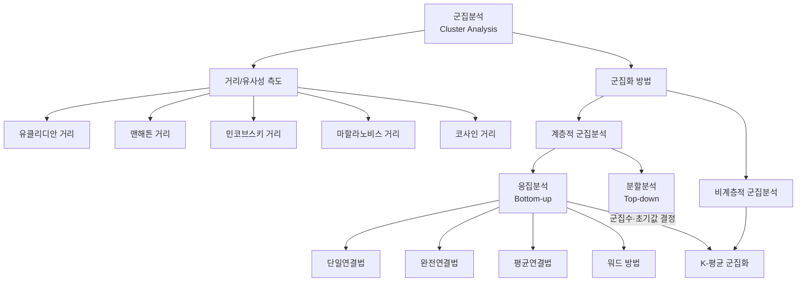
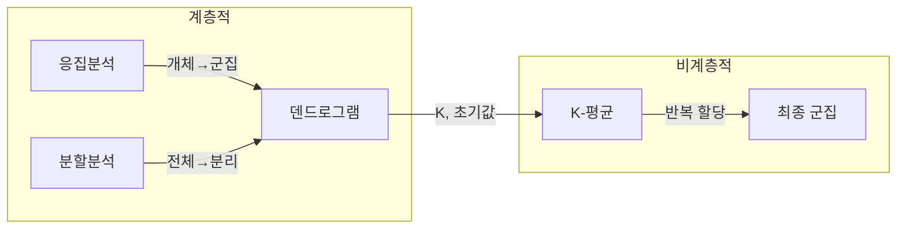

# 12. 데이터마이닝: 군집분석 Ⅰ

## 🔗 선수 지식 (Prerequisites)
- [ ] **필수**: [11강. 모형 비교평가 Ⅱ](11강.%20모형%20비교평가%20Ⅱ.md) - 이해 완료?
- [ ] **권장**: 유클리디안 거리, 행렬 개념
- **관련 단원**: [1강. 데이터마이닝이란](1강.%20데이터마이닝이란.md) (지도학습 vs 자율학습 구분)

---

## 학습 목표
1. 군집의 개념을 설명할 수 있다.
2. 거리 및 유사성의 개념을 이해할 수 있다.
3. 군집분석의 종류를 이해할 수 있다.
4. 군집분석 결과를 해석할 수 있다.

---

## 🧠 메타인지 체크 (학습 전/후 자기 평가)

### 학습 전 자기 평가
| 소주제 | 자신감 (1-5) |
| :--- | :--- |
| 군집의 개념 및 목적 | |
| 거리/유사성 측도 | |
| 계층적 군집분석 | |
| 비계층적 군집분석 (K-평균) | |

### 학습 후 교정 (학습 완료 후 작성)
| 소주제 | 학습 전 | 학습 후 | 실제 정답률 | 과신/과소 여부 |
| :--- | :--- | :--- | :--- | :--- |
| 군집의 개념 및 목적 | | | | |
| 거리/유사성 측도 | | | | |
| 계층적 군집분석 | | | | |
| 비계층적 군집분석 (K-평균) | | | | |

> **활용법**: 학습 전 1분 → 자신감 기입, 학습 후 1분 → 나머지 기입. "과신" 영역이 실제 취약점.

---

## 📝 요약 (Summary)
1. 🔴 **군집분석(cluster analysis)**: 자율학습(unsupervised learning) 방법 중 하나로, 관측값 또는 개체를 의미 있는 몇 개의 부분집단(군집)으로 나누는 과정. 유사성이 높은 대상을 같은 군집으로 분류하고, 서로 다른 군집 간 상이성을 규명한다.
2. 🔴 **거리(비유사성) 측도**: 개체 간의 비유사성을 정의하는 방법. 유클리디안 거리, 맨해튼 거리, 민코브스키 거리, 마할라노비스 거리, 코사인 거리 등이 있으며, 일반적으로 유클리디안 거리가 많이 사용된다.
3. 🔴 **군집화 방법의 분류**: 크게 계층적 군집분석(응집분석, 분할분석)과 비계층적 군집분석(K-평균 군집화)으로 나뉜다.
4. 🟡 **응집분석과 K-평균의 결합**: 일반적으로 계층적 방법(응집분석)으로 나무형 그림(덴드로그램)을 그려 군집수와 초기값을 구한 뒤, 비계층적 방법(K-평균)으로 최종 군집화를 수행한다.
5. 🟢 **군집분석의 활용**: 유용한 탐색적 기법으로서 사전정보 없이 의미 있는 자료구조를 발견할 수 있으며, 타겟 마케팅 등 다양한 분야에 활용된다.

---

## 📐 핵심 정의 및 원리 (Key Definitions & Principles)

| 정의명 | 내용 | 키워드 |
| :--- | :--- | :--- |
| **군집화 (Clustering)** | 관측값 또는 개체를 의미 있는 몇 개의 부분집단으로 나누는 과정 | 자율학습, 부분집단, 유사성 |
| **비유사성행렬** | 두 개체 특성(변수값)의 차이를 종합한 거리 개념을 기준으로 작성된 행렬 | 거리행렬, 대칭행렬 |
| **유클리디안 거리** | $d(\mathbf{x}, \mathbf{y}) = \sqrt{\sum_{i=1}^{p}(x_i - y_i)^2}$ | 가장 일반적, L2 norm |
| **맨해튼 거리** | $d(\mathbf{x}, \mathbf{y}) = \sum_{i=1}^{p} \|x_i - y_i\|$ | L1 norm, 격자형 이동 |
| **민코브스키 거리** | $d(\mathbf{x}, \mathbf{y}) = \left(\sum_{i=1}^{p} \|x_i - y_i\|^m\right)^{1/m}$ | 유클리디안·맨해튼의 일반화 |
| **마할라노비스 거리** | 변수 간 상관관계를 고려한 거리, 공분산 행렬 이용 | 상관관계 보정 |
| **코사인 거리** | 두 벡터 간 각도(방향 유사성)를 기반으로 한 거리 | 텍스트 마이닝 |
| **계층적 군집화** | 일정한 체계를 가지고 군집을 단계적으로 형성해 가는 방법 | 덴드로그램, 응집/분할 |
| **응집분석 (Agglomerative)** | 각 개체를 하나의 군집으로 보고 가까운 군집끼리 합쳐 나가는 방법 | Bottom-up |
| **분할분석 (Divisive)** | 전체를 하나의 군집으로 하고 둘로 나뉘는 과정을 반복하는 방법 | Top-down |
| **K-평균 군집화** | 비계층적 방법으로, K개의 군집 중심(centroid)을 기준으로 개체를 할당·재계산 반복 | 초기값 민감, 이상치 영향 |

### 군집 간 거리 측정법 (연결법)

| 연결법 | 정의 | 특징 |
| :--- | :--- | :--- |
| **단일연결법 (Single linkage)** | 두 군집 간 **가장 가까운** 개체 쌍의 거리 | 연쇄효과(chaining) 발생 가능 |
| **완전연결법 (Complete linkage)** | 두 군집 간 **가장 먼** 개체 쌍의 거리 | 구형 군집 형성 경향 |
| **평균연결법 (Average linkage)** | 두 군집의 모든 개체 쌍 거리의 **평균** | 단일·완전의 절충 |
| **워드 방법 (Ward's method)** | 군집 합병 시 **군집 내 분산 증가량** 최소화 | 균등한 크기 군집 형성 |

> **직관적 해석**: 군집분석은 "비슷한 것끼리 묶는다"는 단순한 원리이지만, "비슷함"을 어떤 거리로 정의하고, "묶는 방식"을 어떻게 설정하느냐에 따라 결과가 크게 달라진다.
> **AI 적용**: 고객 세분화(Customer Segmentation), 이미지 분할(Image Segmentation), 문서 군집화(Document Clustering), 이상 탐지(Anomaly Detection) 등에 핵심적으로 활용된다.

---

## 📊 개념 시각화 (Visual Guide)

### 개념 관계도


### 군집분석 분류 체계


### 핵심 비교표
| 구분 | 계층적 군집분석 | 비계층적 군집분석 (K-평균) | 밀도 기반 (DBSCAN) |
| :--- | :--- | :--- | :--- |
| **방향** | 단계적 병합/분할 | 반복적 재할당 | 밀도 연결 확장 |
| **군집 수** | 사후 결정 (덴드로그램) | 사전에 K 지정 필요 | **K 불필요** (eps·minPts 설정) |
| **수정 가능성** | 한번 병합/분할되면 수정 불가 | 반복마다 재할당 가능 | 밀도 기준 자동 형성 |
| **초기값 의존** | 없음 | 초기값에 민감, 국소최적 위험 | 없음 |
| **군집 형상** | 연결법에 의존 | 구형(볼록) 위주 | **임의 형상 가능** |
| **이상치 영향** | 상대적으로 적음 | 가장 많이 받음 | **이상치를 잡음(noise)으로 분리** |
| **대규모 데이터** | 비효율적 | 상대적으로 효율적 | 비교적 효율적 |

---

## ✏️ 심화 학습 (Study Subject)

### 1. 가상 시나리오: "어떤 군집 방법을, 언제 사용해야 할까?"
- **상황**: 온라인 쇼핑몰에서 100만 명의 고객을 구매 패턴에 따라 세분화하여 타겟 마케팅을 실시하려 한다.
- **문제**: 고객 수가 많아 계층적 군집분석은 계산 비용이 크고, K-평균은 K값과 초기값을 어떻게 설정해야 하는지 모른다.
- **해결**: 먼저 전체 데이터에서 표본을 추출하여 계층적 군집분석(응집분석)을 수행 → 덴드로그램에서 적절한 군집 수(K)를 결정 → 이 K와 각 군집의 중심을 초기값으로 사용하여 전체 데이터에 K-평균 군집화 실시.
- **AI 학습 포인트**: "K-평균의 초기값 의존성 문제를 해결하기 위한 K-means++ 알고리즘은 어떤 원리로 작동하는가? 또한 군집 수 K를 자동으로 결정하는 엘보우 방법(Elbow Method)과 실루엣 분석(Silhouette Analysis)은 어떻게 다른가?"

### 2. 관점별 비교 및 오개념 분석
- **핵심 비교**: 계층적 군집분석 vs K-평균 군집화 (위 비교표 참조)
- **혼동 쌍**: 단일연결법 vs 완전연결법 — "가장 가까운" vs "가장 먼" 거리를 사용하는 차이
- **오개념 분석**:
    - **오개념 1**: "군집분석의 결과를 실제에 이용하기 위해서는 각 군집의 특성을 파악하여 군집이 의미있도록 할 필요는 없다."
    - **분석**: 군집분석은 단순히 그룹을 나누는 것에서 끝나는 것이 아니라, 각 군집의 특성을 파악하여 **군집이 의미있도록 해야** 실제 활용이 가능하다. 예를 들어, 고객 군집화 후 각 군집의 구매 패턴, 인구통계학적 특성 등을 해석해야 마케팅 전략을 수립할 수 있다.
    - **오개념 2**: "K-평균 군집화는 초기값에 영향을 받지 않는다."
    - **분석**: K-평균은 초기 군집 중심에 따라 결과가 달라지며, 국소최적(local optimum)에 빠질 수 있다. 이를 보완하기 위해 여러 초기값으로 반복 실행하거나 K-means++ 초기화를 사용한다.
- **AI 학습 포인트**: "단일연결법에서 발생하는 '연쇄효과(chaining effect)'를 구체적인 예시 데이터로 시각화하고, 완전연결법은 왜 이 문제가 발생하지 않는지 설명해 줘."

---

## ❓ 연습 문제 및 해설

> **블룸 인지 수준 범례**: [기억] 정의·나열 → [이해] 설명·비교 → [적용] 계산·구현 → [분석] 구별·디버그 → [평가] 판단·비평 → [창조] 설계·제안

### 📝 문제

**1. ⭐ [기억] 📎 기출 다음 중 군집분석에 대해 옳지 않은 것은?[](#prob-1)**
   > ① 계층적 군집분석은 구현이 간단하여 이해하기 쉽다.
   > ② 계층적 군집분석에서는 개체가 잘못된 군집에 속하게 되면 그것을 수정할 기회가 없다.
   > ③ K-평균 군집화는 초기값의 영향을 받아 결과가 국소최적이 될 수 있다.
   > ④ 군집분석의 결과를 실제에 이용하기 위해서는 각 군집의 특성을 파악하여 군집이 의미있도록 할 필요는 없다.

<br>

**2. ⭐ [기억] 📎 기출 계층적 군집분석 방법 중 두 군집 P와 Q간의 거리를 P에 속한 개체와 Q에 속한 개체 간의 거리 중 가장 먼 거리를 두 군집간의 거리로 하는 방법은?[](#prob-2)**
   > ① 단일연결법
   > ② 완전연결법
   > ③ 평균연결법
   > ④ 분산연결법

<br>

**3. ⭐ [기억] 📎 기출 군집분석 방법에서 다음 중 이상점의 영향을 가장 많이 받는 방법은?[](#prob-3)**
   > ① 단일 연결법
   > ② 완전 연결법
   > ③ 워드 방법
   > ④ K-평균 군집 방법

<br>

**4. ⭐⭐ [이해] 📌 군집분석에 대한 설명으로 옳은 것을 모두 고르시오.[](#prob-4)**
   > <보기>
   >
   > 가. 군집분석은 자율학습(unsupervised learning) 방법이다.
   > 나. K-평균 군집화에서는 군집 수를 사전에 지정해야 한다.
   > 다. 계층적 군집분석에서 한번 합쳐진 군집은 이후 단계에서 다시 분리될 수 있다.

   > ① 가
   > ② 가, 나
   > ③ 나, 다
   > ④ 가, 나, 다

<br>

**5. ⭐⭐ [이해] 📌 다음 중 거리 측도에 대한 설명으로 옳지 않은 것은?[](#prob-5)**
   > ① 유클리디안 거리는 가장 일반적으로 사용되는 거리 측도이다.
   > ② 맨해튼 거리는 각 변수 차이의 절대값을 합산한 거리이다.
   > ③ 마할라노비스 거리는 변수 간 상관관계를 고려하지 않는다.
   > ④ 코사인 거리는 두 벡터 간 방향의 유사성을 측정한다.

<br>

**6. ⭐⭐ [적용] 📌 다음 설명에 해당하는 연결법을 각각 쓰시오.[](#prob-6)**
   > (가) 두 군집의 개체 쌍 거리 중 가장 짧은 거리를 군집 간 거리로 사용
   > (나) 군집을 합칠 때 군집 내 분산의 증가량이 최소가 되도록 합침

<br>

**7. ⭐⭐⭐ [분석] 📌 계층적 군집분석으로 덴드로그램을 그린 후 K-평균 군집화를 실시하는 절차가 일반적으로 사용되는 이유를 설명하시오.[](#prob-7)**

---

### 🔑 정답 및 해설 (먼저 풀어본 후 펼치기)

<details>
<summary>정답 보기 (클릭)</summary>

1. ④
2. ②
3. ④
4. ②
5. ③
6. (가) 단일연결법, (나) 워드 방법
7. [풀이형 - 아래 해설 참조]

</details>

<details>
<summary>해설 보기 (클릭)</summary>

<a id="prob-1"></a>
**1. ⭐ [기억] 군집분석에 대해 옳지 않은 것**
> **정답: ④**
> **해설**: 군집분석의 결과를 실제에 이용하기 위해서는 각 군집의 특성을 파악하여 군집이 의미있도록 **해야 한다**. ①②③은 모두 올바른 설명이다. 계층적 군집분석은 구현이 간단하고(①), 한번 합쳐지면 수정 불가하며(②), K-평균은 초기값에 민감하다(③).

<a id="prob-2"></a>
**2. ⭐ [기억] 가장 먼 거리를 사용하는 연결법**
> **정답: ②**
> **해설**: 완전연결법(Complete linkage)은 두 군집 P와 Q에 속한 개체 간의 거리 중 **가장 먼** 거리를 두 군집간의 거리로 한다. 단일연결법은 가장 가까운 거리, 평균연결법은 평균 거리를 사용한다. "분산연결법"이라는 용어는 존재하지 않으며, 분산 기반은 워드 방법이다.

<a id="prob-3"></a>
**3. ⭐ [기억] 이상점 영향을 가장 많이 받는 방법**
> **정답: ④**
> **해설**: K-평균 군집화는 군집의 중심(centroid)을 평균으로 계산하므로, 이상치(outlier)의 영향을 가장 많이 받는다. 평균은 극단값에 민감하기 때문이다. 계층적 방법들은 개체 간 거리를 기반으로 하므로 상대적으로 이상치 영향이 작다.

<a id="prob-4"></a>
**4. ⭐⭐ [이해] 군집분석 설명으로 옳은 것**
> **정답: ② 가, 나**
> **해설**: 가(O) 군집분석은 레이블 없이 패턴을 찾는 자율학습이다. 나(O) K-평균은 군집 수 K를 사전에 지정해야 한다. 다(X) 계층적 군집분석에서 한번 합쳐진(응집) 또는 분리된(분할) 군집은 이후 단계에서 되돌릴 수 없다.

<a id="prob-5"></a>
**5. ⭐⭐ [이해] 거리 측도 설명으로 옳지 않은 것**
> **정답: ③**
> **해설**: 마할라노비스 거리는 변수 간 **상관관계를 고려하는** 거리 측도이다. 공분산 행렬의 역행렬을 이용하여 변수 간 상관을 보정하므로, "고려하지 않는다"는 설명은 틀렸다.

<a id="prob-6"></a>
**6. ⭐⭐ [적용] 연결법 명칭**
> **정답: (가) 단일연결법 (Single linkage), (나) 워드 방법 (Ward's method)**
> **해설**: (가) 가장 짧은 거리를 사용하는 것은 단일연결법이다. (나) 군집 내 분산의 증가량(SSE 증가)을 최소화하며 병합하는 것은 워드 방법이다.

<a id="prob-7"></a>
**7. ⭐⭐⭐ [분석] 계층적 → K-평균 결합 사용 이유**
> **정답**:
> 1. 계층적 군집분석(응집분석)은 덴드로그램을 통해 데이터의 군집 구조를 시각적으로 파악할 수 있어 **적절한 군집 수(K)를 결정**하는 데 유용하다.
> 2. 그러나 계층적 방법은 한번 병합되면 수정이 불가능하고, 대규모 데이터에 비효율적이다.
> 3. K-평균은 반복적 재할당이 가능하여 더 정교한 군집화가 가능하지만, K와 초기값을 미리 알아야 한다.
> 4. 따라서 계층적 방법으로 K와 초기 중심을 결정한 후, K-평균으로 최종 군집화를 수행하면 **두 방법의 장점을 결합**할 수 있다.

</details>

---

## ✅ O/X 확인문제

**1.** [군집분석은 지도학습(supervised learning) 방법이다.](#ox-1) **(O / X)**
**2.** [계층적 군집분석에서 한번 합쳐진 군집은 다시 분리할 수 없다.](#ox-2) **(O / X)**
**3.** [K-평균 군집화는 초기값에 영향을 받아 국소최적이 될 수 있다.](#ox-3) **(O / X)**
**4.** [유클리디안 거리는 군집분석에서 가장 일반적으로 사용되는 거리이다.](#ox-4) **(O / X)**
**5.** [완전연결법은 두 군집 간 가장 가까운 개체 쌍의 거리를 사용한다.](#ox-5) **(O / X)**
**6.** [K-평균 군집화는 이상치의 영향을 가장 많이 받는 방법이다.](#ox-6) **(O / X)**
**7.** [분할분석은 각 개체를 하나의 군집으로 보고 합쳐나가는 방법이다.](#ox-7) **(O / X)**
**8.** [비유사성행렬은 두 개체 간 거리를 종합하여 작성된 행렬이다.](#ox-8) **(O / X)**
**9.** [군집분석은 사전정보가 반드시 필요한 분석 기법이다.](#ox-9) **(O / X)**
**10.** [마할라노비스 거리는 변수 간 상관관계를 고려한 거리 측도이다.](#ox-10) **(O / X)**
**11.** [워드 방법은 군집 합병 시 군집 내 분산의 증가량을 최소화한다.](#ox-11) **(O / X)**
**12.** [K-평균 군집화에서는 군집 수를 사전에 지정할 필요가 없다.](#ox-12) **(O / X)**
**13.** [단일연결법은 연쇄효과(chaining effect)가 발생할 수 있다.](#ox-13) **(O / X)**
**14.** [군집분석 결과를 활용하려면 각 군집의 특성을 파악하여 의미를 부여해야 한다.](#ox-14) **(O / X)**

<details>
<summary>O/X 정답 및 해설 보기 (클릭)</summary>

> <a id="ox-1"></a>
> **1. 정답**: X
> **해설**: 군집분석은 **자율학습**(unsupervised learning) 방법이다. 레이블(정답) 없이 데이터의 구조를 탐색한다.

> <a id="ox-2"></a>
> **2. 정답**: O
> **해설**: 계층적 군집분석(응집분석)에서 한번 병합된 군집은 이후 단계에서 되돌릴 수 없다.

> <a id="ox-3"></a>
> **3. 정답**: O
> **해설**: K-평균은 초기 중심(centroid) 선택에 따라 결과가 달라지며, 국소최적(local optimum)에 수렴할 수 있다.

> <a id="ox-4"></a>
> **4. 정답**: O
> **해설**: 유클리디안 거리는 가장 널리 사용되는 거리 측도이다.

> <a id="ox-5"></a>
> **5. 정답**: X
> **해설**: 완전연결법은 가장 **먼** 거리를 사용한다. 가장 가까운 거리를 사용하는 것은 단일연결법이다.

> <a id="ox-6"></a>
> **6. 정답**: O
> **해설**: K-평균은 평균(centroid)을 사용하므로 이상치에 가장 민감하다.

> <a id="ox-7"></a>
> **7. 정답**: X
> **해설**: 이것은 **응집분석**에 대한 설명이다. 분할분석은 전체를 하나의 군집으로 하고 둘로 나뉘는 과정을 반복한다.

> <a id="ox-8"></a>
> **8. 정답**: O
> **해설**: 비유사성행렬은 두 개체 특성(변수값)의 차이를 종합한 거리 개념을 기준으로 작성된 행렬이다.

> <a id="ox-9"></a>
> **9. 정답**: X
> **해설**: 군집분석은 사전정보 없이도 의미 있는 자료구조를 찾아낼 수 있는 탐색적 기법이다.

> <a id="ox-10"></a>
> **10. 정답**: O
> **해설**: 마할라노비스 거리는 공분산 행렬의 역행렬을 이용하여 변수 간 상관관계를 보정한다.

> <a id="ox-11"></a>
> **11. 정답**: O
> **해설**: 워드 방법은 SSE(군집 내 제곱합) 증가량을 최소화하는 방향으로 군집을 병합한다.

> <a id="ox-12"></a>
> **12. 정답**: X
> **해설**: K-평균 군집화에서는 군집 수 K를 **사전에 지정**해야 한다.

> <a id="ox-13"></a>
> **13. 정답**: O
> **해설**: 단일연결법은 가장 가까운 거리를 사용하므로, 개체들이 줄줄이 이어지는 연쇄효과가 발생할 수 있다.

> <a id="ox-14"></a>
> **14. 정답**: O
> **해설**: 군집분석 결과를 실제에 활용하려면 각 군집의 특성을 파악하여 군집이 의미있도록 해야 한다.

</details>

---

## 🧪 자유 회상 연습 (Free Recall)

> **방법**: 위의 노트를 모두 덮고, 타이머 3분 설정 후 이번 단원에서 배운 내용을 기억나는 대로 자유롭게 적으세요.
> 정확한 문장이 아니어도 됩니다. 키워드, 수식, 관계 등 떠오르는 것을 모두 적습니다.

**자유 회상 작성란:**

```
[여기에 기억나는 내용을 자유롭게 작성]


```

> **회상 후 점검**: 노트를 다시 펼쳐 빠뜨린 내용을 확인하세요. 빠뜨린 부분이 실제 취약점입니다.
> - 회상 못한 핵심 개념: [                ]
> - 회상 못한 수식: [                ]

---

## 💻 코드로 확인하기 (Code Verification)

```python
import numpy as np
from sklearn.cluster import KMeans, AgglomerativeClustering
from scipy.cluster.hierarchy import dendrogram, linkage
from scipy.spatial.distance import euclidean, cityblock
import matplotlib.pyplot as plt

# === 1. 거리 측도 비교 ===
x = np.array([1, 2])
y = np.array([4, 6])

print("=== 거리 측도 비교 ===")
print(f"유클리디안 거리: {euclidean(x, y):.4f}")        # sqrt((4-1)^2 + (6-2)^2) = 5.0
print(f"맨해튼 거리:     {cityblock(x, y):.4f}")        # |4-1| + |6-2| = 7.0
print(f"민코브스키(m=3): {np.sum(np.abs(x-y)**3)**(1/3):.4f}")  # 일반화

# === 2. 계층적 군집분석 (응집분석) ===
np.random.seed(42)
data = np.vstack([
    np.random.randn(10, 2) + [0, 0],   # 군집 1
    np.random.randn(10, 2) + [5, 5],   # 군집 2
    np.random.randn(10, 2) + [10, 0],  # 군집 3
])

Z = linkage(data, method='ward')  # 워드 방법
print("\n=== 계층적 군집분석 (워드 방법) ===")
print(f"병합 기록 shape: {Z.shape}")  # (n-1, 4): 병합쌍, 거리, 원소수

# === 3. K-평균 군집화 ===
kmeans = KMeans(n_clusters=3, random_state=42, n_init=10)
labels = kmeans.fit_predict(data)

print("\n=== K-평균 군집화 (K=3) ===")
print(f"군집 레이블: {labels}")
print(f"군집 중심:\n{kmeans.cluster_centers_}")
print(f"군집 내 SSE (inertia): {kmeans.inertia_:.4f}")

# === 4. 초기값 민감성 확인 ===
print("\n=== 초기값 민감성 ===")
for seed in [0, 1, 2, 42, 100]:
    km = KMeans(n_clusters=3, random_state=seed, n_init=1)
    km.fit(data)
    print(f"  seed={seed:3d} → inertia={km.inertia_:.4f}")
```

> **실행 결과**:
> ```
> === 거리 측도 비교 ===
> 유클리디안 거리: 5.0000
> 맨해튼 거리:     7.0000
> 민코브스키(m=3): 4.4979
>
> === 계층적 군집분석 (워드 방법) ===
> 병합 기록 shape: (29, 4)
>
> === K-평균 군집화 (K=3) ===
> 군집 레이블: [2 2 2 2 2 2 2 2 2 2 0 0 0 0 0 0 0 0 0 0 1 1 1 1 1 1 1 1 1 1]
> 군집 중심: (3개 군집의 2차원 좌표)
> 군집 내 SSE (inertia): (값)
>
> === 초기값 민감성 ===
>   seed별로 inertia 값이 다르게 나옴 → 초기값에 따라 결과가 달라짐
> ```
> **해석**: 유클리디안 거리가 맨해튼 거리보다 작은 것은 우연이 아니라, **동일한 두 벡터에 대해 항상 $L_2 \le L_1$ (유클리디안 ≤ 맨해튼)** 이 성립하기 때문이다. 일반적으로 민코브스키 거리 $L_p$는 **p가 증가할수록 단조감소**하여 $L_1 \ge L_2 \ge L_\infty$ 순서가 항상 유지된다. K-평균의 초기값 민감성은 seed에 따라 inertia(군집 내 SSE)가 달라지는 것으로 확인할 수 있다.

> ⚠️ **표준화(scaling)의 필요성**: 거리 기반 군집은 변수 척도에 민감하다. 변수마다 단위·범위가 다르면 큰 척도의 변수가 거리를 지배하므로, 군집분석 **전에 표준화(z-점수 등)** 가 거의 필수이다. 또한 표준 K-평균은 중심을 산술평균으로 갱신하므로 **(제곱)유클리디안 거리에 묶여** 있어, 맨해튼·코사인 거리를 쓰려면 **K-medoids(PAM)** 등 변형이 필요하다. 워드 방법도 (제곱)유클리디안에서만 "군집 내 분산 증가 최소화" 해석이 성립한다.

---

## 🤖 AI 연결고리 (Math → AI Application)

| 학습 개념 | AI/ML 적용 분야 | 구체적 사례 |
| :--- | :--- | :--- |
| 군집분석 | 고객 세분화 (Customer Segmentation) | 이커머스 고객을 구매 패턴으로 군집화하여 타겟 마케팅 |
| K-평균 군집화 | 이미지 분할 (Image Segmentation) | 픽셀 색상값을 K개 군집으로 나누어 영역 분리 |
| 유클리디안 거리 | KNN 분류기 | K-최근접 이웃 알고리즘에서 개체 간 거리 계산 |
| 계층적 군집분석 | 유전자 발현 분석 | 유사한 발현 패턴의 유전자를 덴드로그램으로 시각화 |
| 코사인 거리 | 문서 군집화 / 추천 시스템 | TF-IDF 벡터 간 유사성 측정으로 유사 문서 그룹핑 |

---

## 📖 심화 학습 예시 답안

#### 1. K-평균 군집화의 내부 동작 원리

1. **초기화**: K개의 초기 군집 중심(centroid)을 선택한다 (무작위 또는 K-means++).
2. **할당 단계**: 각 개체를 가장 가까운 군집 중심에 할당한다 (유클리디안 거리 기준).
3. **업데이트 단계**: 각 군집에 속한 개체들의 평균을 구하여 새로운 군집 중심을 계산한다.
4. **수렴 확인**: 군집 중심이 변하지 않거나 변화량이 임계값 이하이면 종료, 아니면 2로 돌아가 반복한다.

> 🧮 **국소최적 문제**: K-평균의 전역최적해를 찾는 것은 **NP-hard**이므로, 실제로는 위 절차인 **Lloyd 알고리즘(휴리스틱)** 으로 풀며 초기 중심점에 따라 **국소최적(local optimum)** 에 수렴할 수 있다. (그래서 `n_init`으로 여러 초기값을 시도한다.)

#### 2. 계층적 군집분석 vs K-평균 군집화 비교표

| 구분 | 계층적 군집분석 | K-평균 군집화 | 비고 |
| :--- | :--- | :--- | :--- |
| **정의** | 단계적으로 군집을 병합/분할하는 방법 | K개의 중심에 반복 할당하는 방법 | |
| **군집 수 결정** | 덴드로그램으로 사후 결정 | 사전에 K 지정 필요 | |
| **수정 가능성** | 병합/분할 후 되돌릴 수 없음 | 매 반복마다 재할당 가능 | |
| **초기값 의존성** | 없음 | 높음 (국소최적 위험) | |
| **이상치 민감도** | 상대적으로 낮음 | 매우 높음 (평균 기반) | |
| **계산 복잡도** | $O(n^2 \log n)$ 이상 | $O(nKt)$ (t: 반복 횟수) | |
| **AI 활용** | 유전자 분석, 소규모 탐색 | 대규모 고객 세분화, 이미지 분할 | |

#### 3. 군집 수 결정과 타당성 지표

군집 수(K)나 군집 품질을 정량 평가하는 대표 지표는 다음과 같다.

- **엘보우 방법(Elbow Method)**: 군집 수에 따른 군집 내 제곱합(WSS/inertia) 변화를 그려 감소율이 급격히 꺾이는 "팔꿈치" 지점을 K로 선택한다. (위 Best Practice 코드 참조)
- **실루엣 계수(Silhouette Coefficient)**: 각 개체에 대해 (자기 군집 내 평균거리 $a$)와 (가장 가까운 다른 군집까지 평균거리 $b$)를 비교하여 $s = (b - a)/\max(a, b)$ 로 계산한다. **−1~1 범위이며 1에 가까울수록 잘 분리된 군집**이다.
- **데이비스-볼딘 지수(Davies-Bouldin Index)**: 군집 내 산포 대비 군집 간 거리의 비율을 평균낸 값으로, **작을수록(0에 가까울수록) 우수**하다.

#### 4. 군집분석을 활용한 코드 작성법 (Best Practice)

- **Bad Practice (나쁜 예시)**
  ```python
  # 초기값 1번만 실행, 군집 수 임의 지정
  km = KMeans(n_clusters=5, n_init=1, random_state=0)
  km.fit(data)
  ```
- **Good Practice (좋은 예시)**
  ```python
  # 엘보우 방법으로 최적 K 탐색 후, n_init으로 안정성 확보
  inertias = []
  K_range = range(2, 11)
  for k in K_range:
      km = KMeans(n_clusters=k, n_init=10, random_state=42)
      km.fit(data)
      inertias.append(km.inertia_)
  # 엘보우 그래프로 적절한 K 선택 후 최종 모델 학습
  best_k = 3  # 엘보우 지점
  final_km = KMeans(n_clusters=best_k, n_init=10, random_state=42)
  final_km.fit(data)
  ```
- **설명**: n_init=1은 단일 초기값으로 국소최적에 빠질 위험이 높다. n_init=10으로 여러 초기값을 시도하고, 엘보우 방법으로 적절한 K를 결정하면 더 안정적이고 의미 있는 군집화 결과를 얻을 수 있다.

---

## 📚 핵심 용어집 (Glossary)

| 용어 (한) | 용어 (영) | 수식 표현 | 정의 |
| :--- | :--- | :--- | :--- |
| **군집분석** | Cluster Analysis | - | 관측값/개체를 유사성 기준으로 부분집단으로 나누는 과정 |
| **군집화** | Clustering | - | 군집분석의 실행 과정 자체를 지칭 (→←1강 자율학습) |
| **비유사성행렬** | Dissimilarity Matrix | $D = [d_{ij}]$ | 모든 개체 쌍의 거리를 정리한 대칭행렬 |
| **유클리디안 거리** | Euclidean Distance | $\sqrt{\sum(x_i - y_i)^2}$ | 두 점 간 직선거리, 가장 일반적 |
| **맨해튼 거리** | Manhattan Distance | $\sum\|x_i - y_i\|$ | 축 방향 이동 거리의 합 |
| **민코브스키 거리** | Minkowski Distance | $(\sum\|x_i - y_i\|^m)^{1/m}$ | 유클리디안·맨해튼의 일반화 |
| **마할라노비스 거리** | Mahalanobis Distance | $\sqrt{(\mathbf{x}-\mathbf{y})^T S^{-1} (\mathbf{x}-\mathbf{y})}$ | 상관관계 보정 거리 |
| **코사인 거리** | Cosine Distance | $1 - \cos\theta$ | 벡터 방향 유사성 기반 거리 |
| **응집분석** | Agglomerative Analysis | - | 각 개체에서 출발, 가까운 군집끼리 합쳐나감 (Bottom-up) |
| **분할분석** | Divisive Analysis | - | 전체에서 출발, 순차적으로 분리해 나감 (Top-down) |
| **단일연결법** | Single Linkage | $\min d(p,q)$ | 군집 간 최소 거리 사용 |
| **완전연결법** | Complete Linkage | $\max d(p,q)$ | 군집 간 최대 거리 사용 |
| **평균연결법** | Average Linkage | $\text{avg } d(p,q)$ | 군집 간 평균 거리 사용 |
| **워드 방법** | Ward's Method | $\min \Delta SSE$ | 군집 내 분산 증가 최소화 |
| **K-평균 군집화** | K-Means Clustering | - | K개 중심에 반복 할당하는 비계층적 방법. (제곱)유클리디안 거리에 묶임, Lloyd 휴리스틱은 국소최적 수렴(전역최적은 NP-hard) |
| **K-medoids (PAM)** | K-medoids | - | 중심을 실제 개체(medoid)로 두어 임의 거리(맨해튼·코사인 등)를 쓸 수 있는 K-평균 변형 |
| **DBSCAN** | DBSCAN | - | 밀도 기반 군집. K 불필요·임의 형상·이상치를 잡음(noise)으로 처리 |
| **표준화** | Scaling | - | 변수 척도 차이를 제거하는 전처리, 거리 기반 군집의 (사실상) 필수 과정 |
| **실루엣 계수** | Silhouette | $s=(b-a)/\max(a,b)$ | 군집 분리도 지표, −1~1이며 1에 가까울수록 우수 |
| **데이비스-볼딘 지수** | Davies-Bouldin Index | - | 군집 타당성 지표, 작을수록 우수 |
| **덴드로그램** | Dendrogram | - | 계층적 군집 결과를 나무형 그림으로 시각화 |

---

## 🤖 AI 학습 파트너를 위한 추가 자료

### 1. 개념 이해를 위한 심층 질문 프롬프트
> **프롬프트 예시**: "군집분석(Cluster Analysis)의 핵심 원리를 초등학생도 이해할 수 있도록 '반 친구들을 그룹으로 나누기'에 비유하여 설명해 줘. 그리고 군집분석이 발전하게 된 역사적 배경과 주요 알고리즘의 등장 시기를 알려줘."

### 2. 문제 해결 능력 강화를 위한 시나리오 프롬프트
> **프롬프트 예시**: "당신은 데이터 사이언티스트입니다. 온라인 쇼핑몰에서 100만 명의 고객을 구매 행동 기반으로 세분화하려고 합니다. 계층적 군집분석과 K-평균 군집화 중 어떤 것을 먼저 사용할지, 두 방법을 어떻게 결합할지 전략을 설명해 줘. 특히 이상치 처리와 군집 수 결정 방법도 포함해 줘."

### 3. 수식 풀이 검증 프롬프트
> **프롬프트 예시**: "3차원 공간의 두 점 A=(1,2,3)과 B=(4,6,3)에 대해 유클리디안 거리, 맨해튼 거리, 민코브스키 거리(m=3)를 각각 계산하고, 세 거리의 크기 관계가 항상 성립하는지 수학적으로 증명해 줘."

---

## 🔄 복습 체크 (Spaced Repetition)
- [ ] 1일 후 복습 (날짜: 2026-03-10)
- [ ] 3일 후 복습 (날짜: 2026-03-12)
- [ ] 7일 후 복습 (날짜: 2026-03-16)
- [ ] 14일 후 복습 (날짜: 2026-03-23)
- [ ] 30일 후 복습 (날짜: 2026-04-08)

### 복습 시 자가 평가
| 회차 | 날짜 | 이해도 (1-5) | 취약 부분 메모 |
| :--- | :--- | :--- | :--- |
| 1차 | | | |
| 2차 | | | |
| 3차 | | | |

---

## 📚 참고 자료 (References)

- Fisher, R. A.(1936), "The use of multiple measurements in taxonomic problems," *Annals of Eugenics*, 7, 179-188.
- Hartigan, J. A.(1975), *Clustering Algorithms*, New York: John Wiley & Sons, Inc.
- Hartigan, J. A. and Wong, M. A.(1979), "A k-means clustering algorithm," *Applied Statistics* 28, 100-108.
- Johnson, R. A. and Wichern, D. W.(2002), *Applied Multivariate Statistical Analysis*, 5th ed., New Jersey: Prentice Hall.
- Kaufman, L. and Rousseeuw, P. J.(1990), *Finding Groups in Data: An Introduction to Cluster Analysis*, New York: Wiley.
- MacQueen, J. B.(1967), "Some methods for classification and analysis of multivariate observations," *Proceedings of the Fifth Berkeley Symposium on Mathematical Statistics and Probability*, 1, 281-297.
