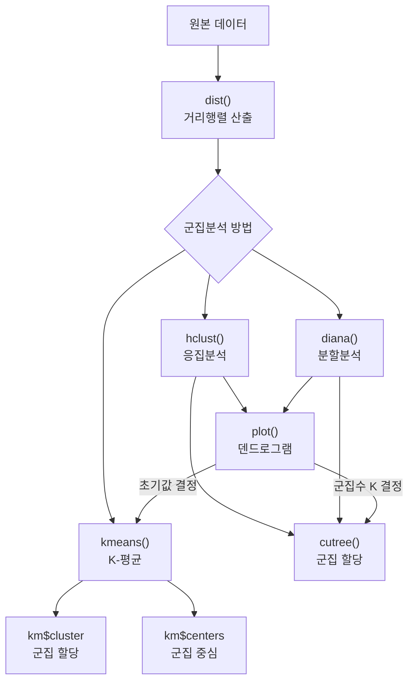
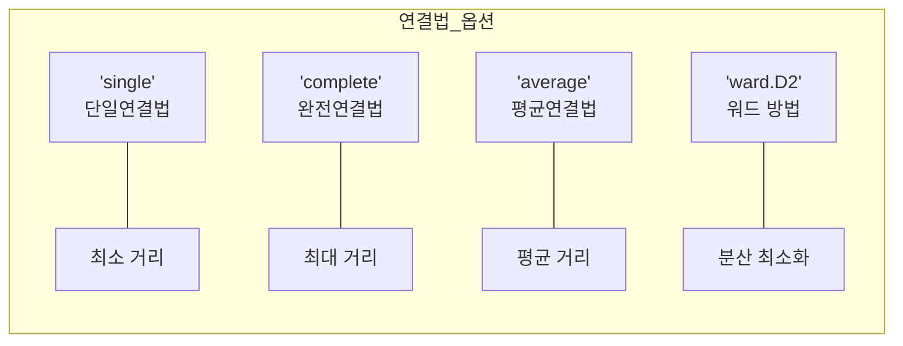

# 13. 데이터마이닝: 군집분석 Ⅱ

## 🔗 선수 지식 (Prerequisites)
- [ ] **필수**: [12강. 군집분석 Ⅰ](12강.%20군집분석%20Ⅰ.md) - 거리 측도, 계층적/비계층적 군집분석 개념 이해 완료?
- [ ] **권장**: R 기초 문법, 행렬 연산
- **관련 단원**: [1강. 데이터마이닝이란](1강.%20데이터마이닝이란.md)

---

## 학습 목표
1. 군집분석의 데이터 구조를 이해할 수 있다.
2. R을 이용하여 거리행렬을 산출할 수 있다.
3. 군집분석의 종류별로 필요한 R 함수를 이해할 수 있다.
4. R을 이용하여 실시한 군집분석 결과를 해석할 수 있다.

---

## 🧠 메타인지 체크 (학습 전/후 자기 평가)

### 학습 전 자기 평가
| 소주제 | 자신감 (1-5) |
| :--- | :--- |
| 비유사성행렬(거리행렬) 구조 | |
| dist, hclust 함수 | |
| diana, kmeans 함수 | |
| cutree와 군집 할당 해석 | |

### 학습 후 교정 (학습 완료 후 작성)
| 소주제 | 학습 전 | 학습 후 | 실제 정답률 | 과신/과소 여부 |
| :--- | :--- | :--- | :--- | :--- |
| 비유사성행렬(거리행렬) 구조 | | | | |
| dist, hclust 함수 | | | | |
| diana, kmeans 함수 | | | | |
| cutree와 군집 할당 해석 | | | | |

> **활용법**: 학습 전 1분 → 자신감 기입, 학습 후 1분 → 나머지 기입. "과신" 영역이 실제 취약점.

---

## 📝 요약 (Summary)
1. 🔴 **dist 함수**: 관측값 또는 개체(행으로 표시) 사이의 거리를 측정하는 함수. 실행 결과 하삼각의 거리행렬(비유사성행렬)이 산출된다.
2. 🔴 **hclust 함수**: 응집분석에 따른 계층적 군집화를 수행하는 함수. 옵션에서 단일연결법(`single`), 완전연결법(`complete`), 평균연결법(`average`) 등을 지정할 수 있다.
3. 🟡 **diana 함수**: 분할분석에 따른 계층적 군집화를 수행하는 함수. `cluster` 패키지가 설치되어 있어야 실행 가능하다.
4. 🔴 **kmeans 함수**: 비계층적 군집분석 방법인 K-평균 군집화를 수행하는 함수. `centers`에 정수(K)만 주면 데이터에서 무작위로 초기 중심을 선택하므로 초기값을 직접 줄 필요는 없으나, **초기값 의존성**이 있어 `nstart`(여러 번 무작위 시작 후 최적 결과 선택) 옵션으로 안정성을 높이는 것이 핵심이다.
5. 🔴 **cutree 함수**: `hclust`나 `diana`에 의해 생성된 결과 object를 가지고 주어진 군집수에 대하여 각 개체에 대한 id를 갖는 벡터를 생성하는 함수. 군집분석의 결과에 따라 각 개체를 군집에 할당하고 이의 결과를 요약하여 보여준다.

---

## 📐 핵심 문법 및 패턴 (Key Syntax & Patterns)

| 패턴명 | 코드 | 용도 |
| :--- | :--- | :--- |
| **거리행렬 계산** | `dist(x, method="euclidean")` | 개체 간 거리 산출, method: `"euclidean"`, `"manhattan"`, `"minkowski"` 등 |
| **응집분석** | `hclust(d, method="single")` | 계층적 군집화, method: `"single"`, `"complete"`, `"average"`, `"ward.D2"` 등 |
| **분할분석** | `diana(x)` | Top-down 계층적 군집화, `cluster` 패키지 필요 |
| **K-평균** | `kmeans(x, centers=K)` | 비계층적 K-평균 군집화, centers: 군집수 또는 초기 중심 |
| **군집 할당** | `cutree(tree, k=K)` | hclust/diana 결과에서 K개 군집으로 자르기 |
| **덴드로그램** | `plot(hclust_result)` | 계층적 군집 결과 시각화 |
| **비유사성행렬 구조** | 하삼각 대칭행렬 | $d_{ij} = d_{ji}$, 대각선 = 0 |

### 주요 R 함수 사용 패턴

**군집분석 전체 워크플로우**
```r
# 1. 거리행렬 산출
d <- dist(data, method = "euclidean")

# 2. 계층적 군집분석 (응집분석)
hc <- hclust(d, method = "complete")
plot(hc)  # 덴드로그램

# 3. 군집 할당
groups <- cutree(hc, k = 3)

# 4. K-평균 군집화
km <- kmeans(data, centers = 3)
km$cluster    # 군집 할당 결과
km$centers    # 군집 중심
```

> **직관적 해석**: R에서 군집분석의 흐름은 `dist → hclust → plot → cutree` (계층적) 또는 `kmeans` (비계층적)의 파이프라인으로 구성된다. 비유사성행렬은 대칭행렬이므로 하삼각만 저장하면 충분하다.
> **AI 적용**: Python의 sklearn에서는 `AgglomerativeClustering`, `KMeans`가 대응되며, `scipy.cluster.hierarchy`의 `linkage`, `dendrogram`, `fcluster`가 R의 `hclust`, `plot`, `cutree`에 각각 대응된다.

---

## 📊 개념 시각화 (Visual Guide)

### R 군집분석 함수 체계도


### hclust method 옵션 비교


### 핵심 비교표: R 함수별 특성
| 함수 | 분석 유형 | 입력 | 주요 출력 | 패키지 |
| :--- | :--- | :--- | :--- | :--- |
| `dist()` | 거리 계산 | 데이터 행렬 | 하삼각 거리행렬 | stats |
| `hclust()` | 응집분석 (계층적) | 거리행렬 | 덴드로그램 object | stats |
| `diana()` | 분할분석 (계층적) | 데이터/거리행렬 | 덴드로그램 object | cluster |
| `kmeans()` | K-평균 (비계층적) | 데이터 행렬 | cluster, centers, withinss | stats |
| `cutree()` | 군집 할당 | hclust/diana 결과 | 개체별 군집 id 벡터 | stats |

---

## ✏️ 심화 학습 (Study Subject)

### 1. 가상 시나리오: "비유사성행렬을 어떻게 읽고 활용할까?"
- **상황**: 5개 제품의 특성 데이터가 주어졌고, 유사한 제품끼리 묶어 카테고리를 구성하려 한다. `dist()` 함수로 비유사성행렬을 구했다.
- **문제**: 비유사성행렬의 하삼각만 출력되었는데, 빈 칸(상삼각)의 값은 어떻게 알 수 있는가? 그리고 어떤 연결법으로 `hclust()`를 실행해야 하는가?
- **해결**: 비유사성행렬은 **대칭행렬**이므로 $d_{ij} = d_{ji}$. 상삼각의 값은 하삼각에서 행·열을 뒤집으면 된다. 연결법 선택은 덴드로그램을 여러 방법으로 그려보고, 데이터 특성(이상치 유무, 군집 크기 균등성)에 따라 결정한다.
- **AI 학습 포인트**: "R의 `dist()` 함수에서 `method` 옵션별로 어떤 거리가 계산되는지, 그리고 각 거리가 적합한 데이터 유형은 무엇인지 비교 정리해 줘."

### 2. 관점별 비교 및 오개념 분석
- **핵심 비교**: `hclust()` vs `diana()` — 둘 다 계층적이지만 응집(Bottom-up) vs 분할(Top-down) 방향이 다름
- **혼동 쌍**: 단일연결법(`"single"`) vs 완전연결법(`"complete"`) — 기출에서 거리행렬 문제로 빈출 (→←12강)
- **오개념 분석**:
    - **오개념 1**: "비유사성행렬에서 빈 칸은 거리가 0이다."
    - **분석**: 하삼각행렬만 표시된 것이며, 빈 칸(상삼각)은 대칭성에 의해 대응되는 하삼각 값과 같다. 대각선만 0이다. 예: 1행 4열의 값 = 4행 1열의 값.
    - **오개념 2**: "`kmeans()`에 거리행렬을 입력한다."
    - **분석**: `kmeans()`는 **원본 데이터 행렬**을 입력으로 받는다. 거리행렬(`dist` 결과)을 입력하는 것은 `hclust()`이다.
- **AI 학습 포인트**: "단일연결법과 완전연결법으로 같은 비유사성행렬에 군집분석을 실시했을 때, 군집 형성 순서가 어떻게 달라지는지 단계별로 비교해 줘."

---

## ❓ 연습 문제 및 해설

> **블룸 인지 수준 범례**: [기억] 정의·나열 → [이해] 설명·비교 → [적용] 계산·구현 → [분석] 구별·디버그 → [평가] 판단·비평 → [창조] 설계·제안

### 📝 문제

**※ 다음과 같이 다섯 개의 개체 간 비유사성 행렬의 하삼각 행렬이 주어졌다고 하자. 다음 물음에 답하라. (문제 1~3)**

$$
\begin{pmatrix}
 & 1 & 2 & 3 & 4 & 5 \\
1 & 0 & & & A & \\
2 & 1.0 & 0 & & & \\
3 & 5.0 & 4.0 & 0 & & \\
4 & 8.0 & 7.0 & 3.0 & 0 & \\
5 & 10.5 & 9.5 & 5.5 & 2.5 & 0
\end{pmatrix}
$$

<br>

**1. ⭐ [적용] 📎 기출 비유사성 행렬의 빈 곳을 채워 완성할 경우 A의 값으로 적당한 것은?[](#prob-1)**
   > ① 1.0
   > ② 8.0
   > ③ 7.0
   > ④ 10.5

<br>

**2. ⭐⭐ [적용] 📎 기출 단일연결법에 의한 군집분석을 수행할 경우 첫 번째 생성되는 군집으로 가장 적당한 것은?[](#prob-2)**
   > ① {1, 2}
   > ② {4, 5}
   > ③ {3, 4}
   > ④ {1, 5}

<br>

**3. ⭐⭐ [적용] 📎 기출 완전연결법에 의한 군집분석을 수행할 경우 군집 {1,2}와 각 개체와의 거리행렬은 다음과 같이 생성된다. A의 값으로 가장 적당한 것은?[](#prob-3)**

$$
\begin{pmatrix}
 & \{1,2\} & 3 & 4 & 5 \\
\{1,2\} & 0 & A & B & C \\
3 & A & 0 & 3.0 & 5.5 \\
4 & B & 3.0 & 0 & 2.5 \\
5 & C & 5.5 & 2.5 & 0
\end{pmatrix}
$$

   > ① 1.0
   > ② 5.0
   > ③ 8.0
   > ④ 10.5

<br>

**4. ⭐ [기억] 📌 R에서 응집분석에 따른 계층적 군집화를 수행하는 함수는?[](#prob-4)**
   > ① dist
   > ② hclust
   > ③ diana
   > ④ kmeans

<br>

**5. ⭐ [기억] 📌 다음 중 `cluster` 패키지를 설치해야 사용할 수 있는 함수는?[](#prob-5)**
   > ① hclust
   > ② cutree
   > ③ diana
   > ④ kmeans

<br>

**6. ⭐⭐ [이해] 📌 다음 R 함수에 대한 설명으로 옳은 것을 모두 고르시오.[](#prob-6)**
   > <보기>
   >
   > 가. `dist()` 함수의 결과는 하삼각 거리행렬이다.
   > 나. `kmeans()` 함수는 거리행렬을 입력으로 받는다.
   > 다. `cutree()` 함수는 `hclust` 결과에서 군집 수를 지정하여 개체를 할당한다.

   > ① 가
   > ② 가, 다
   > ③ 나, 다
   > ④ 가, 나, 다

<br>

**7. ⭐⭐⭐ [분석] 📌 위 비유사성행렬에서 완전연결법으로 응집분석을 수행할 때, 군집 {1,2}와 군집 {4,5}의 거리를 구하시오.[](#prob-7)**

---

### 🔑 정답 및 해설 (먼저 풀어본 후 펼치기)

<details>
<summary>정답 보기 (클릭)</summary>

1. ②
2. ①
3. ②
4. ②
5. ③
6. ②
7. 10.5

</details>

<details>
<summary>해설 보기 (클릭)</summary>

<a id="prob-1"></a>
**1. ⭐ [적용] 비유사성 행렬의 A 값**
> **정답: ② 8.0**
> **해설**: 비유사성 행렬은 **대칭행렬**이므로 1행 4열의 값(A)은 4행 1열의 값과 같다. 4행 1열 = 8.0이므로 A = 8.0.

<a id="prob-2"></a>
**2. ⭐⭐ [적용] 단일연결법 첫 번째 군집**
> **정답: ① {1, 2}**
> **해설**: 단일연결법은 **가장 가까운** 개체 쌍을 먼저 합친다. 행렬에서 가장 작은 거리는 d(1,2) = 1.0이므로 첫 번째 생성되는 군집은 {1, 2}이다. 다음으로 작은 거리는 d(4,5) = 2.5, d(3,4) = 3.0 순이다.

<a id="prob-3"></a>
**3. ⭐⭐ [적용] 완전연결법에서 {1,2}와 {3}의 거리 A**
> **정답: ② 5.0**
> **해설**: 완전연결법은 두 군집 간 **가장 먼** 거리를 사용한다. {1,2}와 {3}의 거리 = max(d(1,3), d(2,3)) = max(5.0, 4.0) = **5.0**. 참고로 B = max(d(1,4), d(2,4)) = max(8.0, 7.0) = 8.0, C = max(d(1,5), d(2,5)) = max(10.5, 9.5) = 10.5.

<a id="prob-4"></a>
**4. ⭐ [기억] 응집분석 R 함수**
> **정답: ② hclust**
> **해설**: `hclust()`는 응집분석(agglomerative)에 따른 계층적 군집화 함수이다. `dist()`는 거리 계산, `diana()`는 분할분석, `kmeans()`는 비계층적 K-평균이다.

<a id="prob-5"></a>
**5. ⭐ [기억] cluster 패키지 필요 함수**
> **정답: ③ diana**
> **해설**: `diana()`는 `cluster` 패키지에 포함된 함수이다. `hclust`, `cutree`, `kmeans`, `dist`는 R 기본 패키지인 `stats`(기본 내장)에 포함되어 별도 설치가 불필요하다.

<a id="prob-6"></a>
**6. ⭐⭐ [이해] R 함수 설명으로 옳은 것**
> **정답: ② 가, 다**
> **해설**: 가(O) `dist()`의 결과는 하삼각 거리행렬이다. 나(X) `kmeans()`는 **원본 데이터 행렬**을 입력으로 받는다 (거리행렬이 아님). 다(O) `cutree()`는 `hclust` 또는 `diana` 결과에서 군집 수(k)를 지정하여 각 개체에 군집 id를 할당한다.

<a id="prob-7"></a>
**7. ⭐⭐⭐ [분석] 완전연결법에서 {1,2}와 {4,5}의 거리**
> **정답: 10.5**
> **해설**: 완전연결법은 두 군집의 모든 개체 쌍 중 **최대 거리**를 사용한다.
> - d(1,4) = 8.0, d(1,5) = 10.5, d(2,4) = 7.0, d(2,5) = 9.5
> - max(8.0, 10.5, 7.0, 9.5) = **10.5**

</details>

---

## ✅ O/X 확인문제

**1.** [`dist()` 함수는 상삼각 거리행렬을 출력한다.](#ox-1) **(O / X)**
**2.** [비유사성행렬은 대칭행렬이므로 $d_{ij} = d_{ji}$이다.](#ox-2) **(O / X)**
**3.** [`hclust()` 함수의 method 옵션에서 `"single"`은 완전연결법을 의미한다.](#ox-3) **(O / X)**
**4.** [`diana()` 함수는 R base에 포함되어 별도 패키지 없이 사용할 수 있다.](#ox-4) **(O / X)**
**5.** [`kmeans()` 함수는 원본 데이터 행렬을 입력으로 받는다.](#ox-5) **(O / X)**
**6.** [`cutree()` 함수로 군집 수를 지정하면 각 개체에 군집 id가 할당된다.](#ox-6) **(O / X)**
**7.** [단일연결법에서 첫 번째 합쳐지는 군집은 거리가 가장 큰 개체 쌍이다.](#ox-7) **(O / X)**
**8.** [완전연결법에서 군집 간 거리는 두 군집의 개체 쌍 중 최대 거리이다.](#ox-8) **(O / X)**
**9.** [`kmeans()` 함수에서 초기값을 지정하지 않아도 된다.](#ox-9) **(O / X)**
**10.** [비유사성행렬의 대각선 값은 항상 0이다.](#ox-10) **(O / X)**
**11.** [`hclust()` 함수의 결과에 `plot()`을 적용하면 덴드로그램이 그려진다.](#ox-11) **(O / X)**
**12.** [`cutree()` 함수는 `kmeans` 결과에도 적용할 수 있다.](#ox-12) **(O / X)**
**13.** [응집분석은 모든 개체를 하나의 군집으로 시작하여 분리해 나간다.](#ox-13) **(O / X)**
**14.** [`dist()` 함수의 method 옵션으로 `"euclidean"`, `"manhattan"` 등을 지정할 수 있다.](#ox-14) **(O / X)**

<details>
<summary>O/X 정답 및 해설 보기 (클릭)</summary>

> <a id="ox-1"></a>
> **1. 정답**: X
> **해설**: `dist()`는 **하삼각** 거리행렬을 출력한다.

> <a id="ox-2"></a>
> **2. 정답**: O
> **해설**: 비유사성행렬은 대칭행렬이므로 i행 j열 = j행 i열이다.

> <a id="ox-3"></a>
> **3. 정답**: X
> **해설**: `"single"`은 **단일연결법**이다. 완전연결법은 `"complete"`이다.

> <a id="ox-4"></a>
> **4. 정답**: X
> **해설**: `diana()`는 `cluster` 패키지가 설치되어 있어야 실행 가능하다.

> <a id="ox-5"></a>
> **5. 정답**: O
> **해설**: `kmeans()`는 거리행렬이 아닌 원본 데이터 행렬을 입력으로 받는다.

> <a id="ox-6"></a>
> **6. 정답**: O
> **해설**: `cutree(tree, k=K)`로 군집 수를 지정하면 각 개체에 해당 군집 id가 할당된다.

> <a id="ox-7"></a>
> **7. 정답**: X
> **해설**: 단일연결법에서는 거리가 **가장 작은(가까운)** 개체 쌍이 먼저 합쳐진다.

> <a id="ox-8"></a>
> **8. 정답**: O
> **해설**: 완전연결법(complete linkage)은 두 군집의 개체 쌍 중 최대 거리를 군집 간 거리로 사용한다. (→←12강)

> <a id="ox-9"></a>
> **9. 정답**: X
> **해설**: `kmeans()`는 `centers` 인자로 군집 수 또는 초기 중심을 지정해야 한다.

> <a id="ox-10"></a>
> **10. 정답**: O
> **해설**: 비유사성행렬의 대각선은 자기 자신과의 거리이므로 항상 0이다.

> <a id="ox-11"></a>
> **11. 정답**: O
> **해설**: `hclust` 결과 object에 `plot()`을 적용하면 덴드로그램이 시각화된다.

> <a id="ox-12"></a>
> **12. 정답**: X
> **해설**: `cutree()`는 `hclust` 또는 `diana` 결과에만 적용 가능하다. `kmeans` 결과에는 `km$cluster`로 직접 군집 할당을 확인한다.

> <a id="ox-13"></a>
> **13. 정답**: X
> **해설**: 이것은 **분할분석**(diana)의 설명이다. 응집분석(hclust)은 각 개체를 하나의 군집으로 시작하여 **합쳐 나간다**. (→←12강)

> <a id="ox-14"></a>
> **14. 정답**: O
> **해설**: `dist()`의 method 옵션으로 유클리디안, 맨해튼, 민코브스키 등 다양한 거리 측도를 지정할 수 있다.

</details>

---

## 🧪 자유 회상 연습 (Free Recall)

> **방법**: 위의 노트를 모두 덮고, 타이머 3분 설정 후 이번 단원에서 배운 내용을 기억나는 대로 자유롭게 적으세요.
> 정확한 문장이 아니어도 됩니다. 키워드, 수식, 관계 등 떠오르는 것을 모두 적습니다.

**자유 회상 작성란:**

```
[여기에 기억나는 내용을 자유롭게 작성]


```

> **회상 후 점검**: 노트를 다시 펼쳐 빠뜨린 내용을 확인하세요. 빠뜨린 부분이 실제 취약점입니다.
> - 회상 못한 핵심 개념: [                ]
> - 회상 못한 수식: [                ]

---

## 💻 코드로 확인하기 (Code Verification)

```python
import numpy as np
from scipy.spatial.distance import pdist, squareform
from scipy.cluster.hierarchy import linkage, dendrogram, fcluster
from sklearn.cluster import KMeans
import matplotlib.pyplot as plt

# === 1. 비유사성행렬 (기출 데이터) ===
# ※ scipy condensed 형식은 상삼각 행 우선(upper-triangular, row-major) 순서를 요구한다.
#    즉 d12, d13, d14, d15, d23, d24, d25, d34, d35, d45 순서로 입력해야 한다.
#    (행 우선 하삼각 d21,d31,... 순으로 넣으면 squareform 결과가 어긋나므로 주의)
D_condensed = np.array([1.0, 5.0, 8.0, 10.5, 4.0, 7.0, 9.5, 3.0, 5.5, 2.5])
# 상삼각 행 우선: d12,d13,d14,d15, d23,d24,d25, d34,d35, d45
D_full = squareform(D_condensed)
print("=== 비유사성행렬 (완전) ===")
print(D_full)
print(f"\nA = D[0,3] = D[3,0] = {D_full[0,3]}  (대칭행렬)")

# === 2. 단일연결법 - 첫 번째 군집 확인 ===
Z_single = linkage(D_condensed, method='single')
print("\n=== 단일연결법 병합 기록 ===")
print("  [군집1, 군집2, 거리, 원소수]")
for i, row in enumerate(Z_single):
    print(f"  단계{i+1}: [{int(row[0])}, {int(row[1])}] 거리={row[2]:.1f} 원소수={int(row[3])}")

# === 3. 완전연결법 - {1,2}와 {3}의 거리 ===
# {1,2}와 {3}의 완전연결법 거리 = max(d(1,3), d(2,3))
d_13 = D_full[0, 2]  # 5.0
d_23 = D_full[1, 2]  # 4.0
A_complete = max(d_13, d_23)
print(f"\n=== 완전연결법: {{1,2}}와 {{3}}의 거리 ===")
print(f"max(d(1,3)={d_13}, d(2,3)={d_23}) = {A_complete}")

# === 4. 완전연결법 - {1,2}와 {4,5}의 거리 ===
distances = [D_full[0,3], D_full[0,4], D_full[1,3], D_full[1,4]]
print(f"\n=== 완전연결법: {{1,2}}와 {{4,5}}의 거리 ===")
print(f"d(1,4)={distances[0]}, d(1,5)={distances[1]}, d(2,4)={distances[2]}, d(2,5)={distances[3]}")
print(f"max = {max(distances)}")

# === 5. R의 dist() → Python scipy squareform 대응 ===
print("\n=== Python에서 dist() 대응 ===")
data = np.array([[0, 0], [1, 0], [5, 4], [8, 7], [10, 9]])
from scipy.spatial.distance import pdist
d_py = pdist(data, metric='euclidean')
print(f"하삼각 거리: {np.round(d_py, 2)}")

# === 6. K-평균 (R의 kmeans 대응) ===
np.random.seed(42)
sample_data = np.vstack([
    np.random.randn(10, 2) + [0, 0],
    np.random.randn(10, 2) + [5, 5],
    np.random.randn(10, 2) + [10, 0],
])
km = KMeans(n_clusters=3, random_state=42, n_init=10)
km.fit(sample_data)
print(f"\n=== K-평균 (K=3) ===")
print(f"군집 할당 (R의 km$cluster): {km.labels_}")
print(f"군집 중심 (R의 km$centers):\n{np.round(km.cluster_centers_, 2)}")

# === 7. cutree 대응: fcluster ===
Z_complete = linkage(D_condensed, method='complete')
clusters_k2 = fcluster(Z_complete, t=2, criterion='maxclust')
clusters_k3 = fcluster(Z_complete, t=3, criterion='maxclust')
print(f"\n=== cutree 대응 (완전연결법) ===")
print(f"k=2 군집 할당: {clusters_k2}")
print(f"k=3 군집 할당: {clusters_k3}")
```

> **실행 결과**:
> ```
> === 비유사성행렬 (완전) ===
> [[ 0.   1.   5.   8.  10.5]
>  [ 1.   0.   4.   7.   9.5]
>  [ 5.   4.   0.   3.   5.5]
>  [ 8.   7.   3.   0.   2.5]
>  [10.5  9.5  5.5  2.5  0. ]]
>
> A = D[0,3] = D[3,0] = 8.0  (대칭행렬)
>
> === 단일연결법 병합 기록 ===
>   단계1: [0, 1] 거리=1.0 원소수=2    → {1,2} 생성
>   단계2: [3, 4] 거리=2.5 원소수=2    → {4,5} 생성
>   단계3: [2, 6] 거리=3.0 원소수=3    → {3,4,5} 생성
>   단계4: [5, 7] 거리=4.0 원소수=5    → 전체 하나로
>
> === 완전연결법: {1,2}와 {3}의 거리 ===
> max(d(1,3)=5.0, d(2,3)=4.0) = 5.0
>
> === 완전연결법: {1,2}와 {4,5}의 거리 ===
> d(1,4)=8.0, d(1,5)=10.5, d(2,4)=7.0, d(2,5)=9.5
> max = 10.5
> ```
> **해석**: 비유사성행렬이 대칭임을 코드로 확인했다. 단일연결법에서는 최소 거리(1.0)인 개체 1,2가 먼저 합쳐지고, 완전연결법에서 {1,2}와 {3}의 거리는 max(5.0, 4.0) = 5.0이다. Python의 `squareform`, `linkage`, `fcluster`가 R의 `dist`, `hclust`, `cutree`에 대응됨을 확인할 수 있다.

---

## 🤖 AI 연결고리 (Math → AI Application)

| 학습 개념 | AI/ML 적용 분야 | 구체적 사례 |
| :--- | :--- | :--- |
| dist (거리행렬) | 유사도 기반 추천 시스템 | 사용자-아이템 거리행렬로 유사 사용자 탐색 |
| hclust (응집분석) | 유전체 분석 | 유전자 발현 패턴 기반 계층적 군집화 + 히트맵 |
| kmeans (K-평균) | 이미지 색상 양자화 | 수백만 픽셀을 K개 대표 색상으로 압축 |
| cutree (군집 할당) | 고객 세분화 파이프라인 | 덴드로그램 분석 후 최적 K로 고객 그룹 할당 |
| 비유사성행렬 | 네트워크 분석 | 소셜 네트워크의 노드 간 거리를 행렬로 표현 |

---

## 📖 심화 학습 예시 답안

#### 1. 비유사성행렬 기반 군집 형성 과정

1. **거리행렬 구성**: `dist()` 또는 `pdist()`로 모든 개체 쌍의 거리를 계산하여 하삼각 행렬 생성.
2. **최소 거리 탐색**: 행렬에서 가장 작은 거리를 찾아 해당 개체 쌍을 합침 (응집분석).
3. **군집 간 거리 갱신**: 연결법(단일/완전/평균/워드)에 따라 새로운 군집과 나머지 개체 간 거리를 재계산.
4. **반복**: 모든 개체가 하나의 군집이 될 때까지 2~3 반복.
5. **군집 수 결정**: 덴드로그램에서 적절한 높이로 `cutree()`를 적용하여 최종 군집 할당.

#### 2. R 함수 vs Python 함수 대응표

| 구분 | R | Python (scipy/sklearn) | 비고 |
| :--- | :--- | :--- | :--- |
| **거리행렬** | `dist()` | `scipy.spatial.distance.pdist()` | |
| **응집분석** | `hclust()` | `scipy.cluster.hierarchy.linkage()` | |
| **분할분석** | `diana()` (cluster pkg) | `sklearn.cluster.AgglomerativeClustering` | 직접 대응 없음, 커스텀 구현 |
| **K-평균** | `kmeans()` | `sklearn.cluster.KMeans()` | |
| **군집 할당** | `cutree()` | `scipy.cluster.hierarchy.fcluster()` | |
| **덴드로그램** | `plot()` | `scipy.cluster.hierarchy.dendrogram()` | |
| **AI 활용** | R Shiny 대시보드 | Streamlit/Flask 배포 | |

#### 3. 군집분석 파이프라인 코드 작성법 (Best Practice)

- **Bad Practice (나쁜 예시)**
  ```python
  # 거리행렬 없이 바로 K-평균, K 임의 지정
  km = KMeans(n_clusters=5, n_init=1)
  km.fit(data)
  ```
- **Good Practice (좋은 예시)**
  ```python
  # 1단계: 계층적 분석으로 구조 파악
  from scipy.cluster.hierarchy import linkage, dendrogram, fcluster
  from scipy.spatial.distance import pdist

  D = pdist(data, metric='euclidean')
  Z = linkage(D, method='ward')
  dendrogram(Z)  # 시각적 군집 수 결정

  # 2단계: 엘보우 + 실루엣으로 K 결정
  from sklearn.metrics import silhouette_score
  best_k = 3  # 덴드로그램 + 엘보우에서 결정

  # 3단계: K-평균 최종 군집화
  km = KMeans(n_clusters=best_k, n_init=10, random_state=42)
  labels = km.fit_predict(data)
  ```
- **설명**: 계층적 분석으로 데이터 구조를 먼저 파악하고 K를 결정한 후 K-평균을 실행하면, 초기값 의존성 문제를 줄이고 더 의미 있는 군집 결과를 얻을 수 있다. (→←12강)

---

## 📚 핵심 용어집 (Glossary)

| 용어 (한) | 용어 (영) | 수식 표현 | 정의 |
| :--- | :--- | :--- | :--- |
| **dist** | dist function | - | 개체 간 거리를 측정하여 하삼각 거리행렬을 출력하는 R 함수 |
| **hclust** | hierarchical clustering | - | 응집분석에 따른 계층적 군집화 수행 R 함수 (→←12강 응집분석) |
| **diana** | DIvisive ANAlysis | - | 분할분석에 따른 계층적 군집화 수행, cluster 패키지 필요 (→←12강 분할분석) |
| **kmeans** | K-means | - | K-평균 군집화 수행 R 함수, 초기값 지정 필요 (→←12강 K-평균) |
| **cutree** | cut tree | - | hclust/diana 결과에서 주어진 군집수로 개체별 군집 id 벡터 생성 |
| **비유사성행렬** | Dissimilarity Matrix | $D = [d_{ij}]$ | 모든 개체 쌍의 거리를 정리한 대칭행렬 (→←12강) |
| **하삼각행렬** | Lower Triangular Matrix | - | 대각선 아래쪽만 값이 있는 행렬, 대칭행렬에서 절반만 저장 |
| **덴드로그램** | Dendrogram | - | 계층적 군집 결과를 나무형 그림으로 시각화 (→←12강) |
| **단일연결법** | Single Linkage | `method="single"` | hclust 옵션, 최소 거리 기반 (→←12강) |
| **완전연결법** | Complete Linkage | `method="complete"` | hclust 옵션, 최대 거리 기반 (→←12강) |
| **평균연결법** | Average Linkage | `method="average"` | hclust 옵션, 평균 거리 기반 (→←12강) |

---

## 🤖 AI 학습 파트너를 위한 추가 자료

### 1. 개념 이해를 위한 심층 질문 프롬프트
> **프롬프트 예시**: "R의 `hclust()` 함수에서 사용할 수 있는 연결법(method) 옵션들을 모두 나열하고, 각각이 어떤 상황에서 적합한지 실제 데이터 예시와 함께 설명해 줘. Python scipy의 `linkage()` 함수와 옵션을 1:1로 매핑해 줘."

### 2. 문제 해결 능력 강화를 위한 시나리오 프롬프트
> **프롬프트 예시**: "5개 개체의 비유사성행렬이 주어졌을 때, 단일연결법과 완전연결법으로 각각 군집을 형성하는 전체 과정을 단계별로 보여 줘. 각 단계에서 갱신되는 거리행렬도 함께 보여 주고, 두 방법의 최종 덴드로그램이 어떻게 다른지 비교해 줘."

### 3. 수식 풀이 검증 프롬프트
> **프롬프트 예시**: "다음 비유사성행렬에서 완전연결법을 적용하여 군집 {1,2}가 형성된 후의 갱신된 거리행렬을 계산해 줘. 각 값이 어떻게 구해지는지 단계별로 검증하고, 단일연결법으로 같은 과정을 반복할 때 달라지는 값을 명시해 줘."

---

## 🔄 복습 체크 (Spaced Repetition)
- [ ] 1일 후 복습 (날짜: 2026-03-10)
- [ ] 3일 후 복습 (날짜: 2026-03-12)
- [ ] 7일 후 복습 (날짜: 2026-03-16)
- [ ] 14일 후 복습 (날짜: 2026-03-23)
- [ ] 30일 후 복습 (날짜: 2026-04-08)

### 복습 시 자가 평가
| 회차 | 날짜 | 이해도 (1-5) | 취약 부분 메모 |
| :--- | :--- | :--- | :--- |
| 1차 | | | |
| 2차 | | | |
| 3차 | | | |

---

## 🔬 심층 확장 (Advanced Topics)

### 1. 연결법(linkage)별 특성과 cophenetic 상관
같은 거리행렬이라도 연결법에 따라 덴드로그램 모양이 달라진다.

| 연결법 | 군집 간 거리 정의 | 특징 |
| :--- | :--- | :--- |
| **단일(single)** | 두 군집 개체 쌍의 **최소** 거리 | 사슬효과(chaining)로 길게 늘어진 군집 형성 |
| **완전(complete)** | 두 군집 개체 쌍의 **최대** 거리 | 조밀하고 지름이 작은 군집, 이상치에 민감 |
| **평균(average, UPGMA)** | 모든 개체 쌍 거리의 **평균** | 단일·완전의 절충 |
| **워드(ward.D2)** | 병합 시 **군집 내 분산 증가량** 최소화 | 크기가 비슷한 구형 군집, 가장 널리 사용 |

> **동표상 상관계수(cophenetic correlation)**: 원거리행렬과 덴드로그램에서 읽은 동표상(cophenetic) 거리 간 상관. 1에 가까울수록 덴드로그램이 원거리 구조를 잘 보존한다. R: `cor(d, cophenetic(hc))`.

### 2. ward.D vs ward.D2 (자주 혼동)
R `hclust`의 `method="ward.D"`는 입력 거리를 그대로 사용하고, `"ward.D2"`는 거리를 제곱하여 사용한다. **Ward(1963)의 분산 최소화 기준을 올바르게 구현한 것은 `ward.D2`** 이므로 일반적으로 `ward.D2`를 권장한다. (근거: Ward's method, https://en.wikipedia.org/wiki/Ward%27s_method)

### 3. diana의 분할계수(Divisive Coefficient, DC)
`diana()`(분할분석)는 가장 분산이 큰 군집을 골라 splinter group으로 분리해 나간다. **분할계수(DC)** 는 군집 구조가 얼마나 뚜렷한지를 0~1로 요약하며, 1에 가까울수록 강한 군집 구조를 의미한다.

### 4. 최적 군집수 K 결정과 cutree 활용
- **엘보우(Elbow) 기법**: K를 늘리며 군집 내 총제곱합(`kmeans`의 `tot.withinss`)을 그려 꺾이는 지점(기울기 완화점)을 선택.
- **실루엣 계수(Silhouette)**: 개체가 자기 군집에 얼마나 잘 속하는지를 −1~1로 측정(`cluster::silhouette`). 평균 실루엣이 최대인 K가 유력 후보.
- **cutree + 분할분석**: `cutree`는 `hclust` 결과뿐 아니라 `as.hclust(diana(x))`로 변환한 분할분석 결과에도 적용할 수 있다.

### 5. K-평균의 한계와 대안
| 방법 | 핵심 아이디어 | K-평균 대비 장점 |
| :--- | :--- | :--- |
| **K-medoids (PAM)** | 중심을 실제 개체(medoid)로 사용 | 이상치에 강건, 임의 거리 측도 사용 가능 |
| **가우시안혼합(GMM/EM)** | 확률분포 혼합으로 소프트 할당 | 타원형 군집·소속 확률 제공 |
| **DBSCAN** | 밀도 기반 군집 | K 불필요, 임의 형상, 이상치=잡음 분리 |

> **k-means++ 초기화**: sklearn `KMeans`의 기본 초기화는 중심을 서로 멀리 퍼뜨리는 **k-means++** 로, R `kmeans`의 단순 무작위 초기화보다 국소최적에 빠질 위험이 작다. R에서는 `nstart`를 크게(예: 25) 주어 비슷한 효과를 낸다. (근거: https://scikit-learn.org/stable/modules/generated/sklearn.cluster.KMeans.html)

---

## 📚 참고 자료 (References)

- Fisher, R. A.(1936), "The use of multiple measurements in taxonomic problems," *Annals of Eugenics*, 7, 179-188.
- Hartigan, J. A.(1975), *Clustering Algorithms*, New York: John Wiley & Sons, Inc.
- Hartigan, J. A. and Wong, M. A.(1979), "A k-means clustering algorithm," *Applied Statistics* 28, 100-108.
- Johnson, R. A. and Wichern, D. W.(2002), *Applied Multivariate Statistical Analysis*, 5th ed., New Jersey: Prentice Hall.
- Kaufman, L. and Rousseeuw, P. J.(1990), *Finding Groups in Data: An Introduction to Cluster Analysis*, New York: Wiley.
- MacQueen, J. B.(1967), "Some methods for classification and analysis of multivariate observations," *Proceedings of the Fifth Berkeley Symposium on Mathematical Statistics and Probability*, 1, 281-297.
