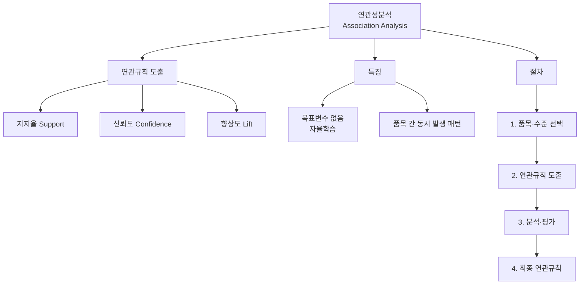

# 14. 데이터마이닝: 연관성분석 Ⅰ

## 🔗 선수 지식 (Prerequisites)
- [ ] **필수**: [13강. 군집분석 Ⅱ](13강.%20군집분석%20Ⅱ.md) - 군집분석 R 실습 이해 완료?
- [ ] **권장**: 확률 기초(조건부확률), 의사결정나무 개념 (→←4강)
- **관련 단원**: [1강. 데이터마이닝이란](1강.%20데이터마이닝이란.md), [4강. 의사결정나무 Ⅰ](4강.%20의사결정나무%20Ⅰ.md)

---

## 학습 목표
1. 연관규칙의 개념을 이해할 수 있다.
2. 지지율, 신뢰도, 향상도의 개념을 설명할 수 있다.
3. 시차연관규칙의 개념을 이해할 수 있다.
4. 활용 사례를 참고하여 연관성분석을 실시할 수 있다.

---

## 🧠 메타인지 체크 (학습 전/후 자기 평가)

### 학습 전 자기 평가
| 소주제 | 자신감 (1-5) |
| :--- | :--- |
| 연관규칙의 개념 및 특징 | |
| 지지율·신뢰도·향상도 계산 | |
| 시차연관규칙 | |
| 연관성분석 절차 및 장단점 | |

### 학습 후 교정 (학습 완료 후 작성)
| 소주제 | 학습 전 | 학습 후 | 실제 정답률 | 과신/과소 여부 |
| :--- | :--- | :--- | :--- | :--- |
| 연관규칙의 개념 및 특징 | | | | |
| 지지율·신뢰도·향상도 계산 | | | | |
| 시차연관규칙 | | | | |
| 연관성분석 절차 및 장단점 | | | | |

> **활용법**: 학습 전 1분 → 자신감 기입, 학습 후 1분 → 나머지 기입. "과신" 영역이 실제 취약점.

---

## 📝 요약 (Summary)
1. 🔴 **연관성분석**: 연관성 규칙을 통해 하나의 거래나 사건에 포함되어 있는 둘 이상의 품목 간 상호 연관성을 발견해 내는 것이다.
2. 🔴 **연관규칙**: 어떤 사건이 얼마나 자주 동시에 발생하는 가를 표현하는 규칙 또는 조건이다.
3. 🔴 **지지율·신뢰도**: 지지율은 전체 거래 중 A, B를 동시에 포함한 거래비율이고, 신뢰도는 A를 포함한 거래 중 A, B를 동시에 포함한 거래비율이다.
4. 🟡 **연관성분석 절차**: 품목과 수준을 선택하고 이를 바탕으로 연관규칙을 도출한 후 각종 분석을 통하여 최종연관규칙을 찾는다.
5. 🟡 **장단점**: 다른 데이터마이닝 도구에 비해 사용하기 쉽고 결과를 이해하기 쉽다는 장점이 있으나, 품목 수에 따라 계산량이 크게 증가한다는 단점이 있다.

---

## 📐 핵심 정의 및 원리 (Key Definitions & Principles)

| 정의명 | 수식 | 의미 |
| :--- | :--- | :--- |
| **지지율 (Support)** | $P(A \cap B) = \frac{\text{A와 B가 동시에 포함된 거래 수}}{\text{전체 거래 수}}$ | 전체 거래 중 특정 품목 A와 B가 동시에 포함된 거래의 비율 |
| **신뢰도 (Confidence)** | $P(B \mid A) = \frac{P(A \cap B)}{P(A)}$ | 특정 품목 A가 구매되었을 때, 다른 품목 B가 추가로 구매될 확률 |
| **향상도 (Lift)** | $\frac{P(B \mid A)}{P(B)} = \frac{P(A \cap B)}{P(A) \cdot P(B)}$ | 품목 A가 주어지지 않았을 때의 품목 B의 확률 대비 품목 A가 주어졌을 때의 품목 B의 증가비율 |

### 주요 정리/정의

**향상도(Lift) 해석 기준**
$$
\text{Lift}(A \to B) = \frac{P(B \mid A)}{P(B)}
$$
> **직관적 해석**: 향상도 > 1이면 A와 B가 양의 연관, = 1이면 독립, < 1이면 음의 연관(A가 있으면 B가 오히려 덜 발생)
> **AI 적용**: 추천 시스템에서 아이템 간 연관도를 계산하여 "함께 구매한 상품"을 추천하는 데 사용

---

## 📊 개념 시각화 (Visual Guide)

### 개념 관계도


### 핵심 비교표: 연관성분석 vs 의사결정나무

| 구분 | 연관성분석 | 의사결정나무 |
| :--- | :--- | :--- |
| **학습 유형** | 자율학습 (비지도) | 지도학습 |
| **목표변수** | 없음 | 있음 |
| **분석 목적** | 품목 간 동시 발생 패턴 | 분류/예측 |
| **결과 형태** | A → B 규칙 | 트리 구조 |
| **AI 적용** | 추천 시스템, 장바구니 분석 | 분류기, 의사결정 지원 |

---

## ✏️ 심화 학습 (Study Subject)

### 1. 가상 시나리오: "장바구니 분석으로 매출을 높여라"
- **상황**: 온라인 쇼핑몰에서 고객의 구매 데이터를 분석하여 교차 판매(cross-selling) 전략을 수립하려 한다.
- **문제**: 수천 개의 품목 중 어떤 품목 조합이 동시에 구매되는지, 그리고 이러한 패턴이 우연이 아닌 의미 있는 연관인지 어떻게 판단할 수 있을까?
- **해결**: 지지율로 빈도 필터링 → 신뢰도로 조건부 구매 확률 확인 → 향상도로 우연 대비 연관 강도 평가. 향상도 > 1인 규칙만 선별하여 추천에 활용한다.
- **AI 학습 포인트**: "연관규칙 기반 추천과 협업 필터링(Collaborative Filtering) 기반 추천의 차이점은 무엇이며, 각각 어떤 상황에서 더 효과적인가?"

### 2. 관점별 비교 및 오개념 분석
- **핵심 비교**: 지지율 vs 신뢰도 — 지지율은 전체 거래 기준, 신뢰도는 A 포함 거래 기준
- **오개념 분석**:
    - **오개념 1**: "신뢰도가 높으면 항상 의미 있는 연관규칙이다"
    - **분석**: 신뢰도가 높더라도 B 자체의 구매 빈도가 높으면 A와 무관하게 신뢰도가 높을 수 있다. 이를 확인하기 위해 향상도를 함께 검토해야 한다. 향상도가 1 이하이면 해당 규칙은 의미가 없다.
    - **오개념 2**: "연관규칙은 인과관계를 나타낸다"
    - **분석**: 연관규칙은 동시 발생(co-occurrence) 패턴을 나타낼 뿐, A를 사면 B를 사게 된다는 인과관계를 의미하지 않는다.
- **AI 학습 포인트**: "신뢰도는 높지만 향상도는 1 이하인 규칙의 구체적 예시를 만들어 주고, 왜 이런 규칙이 실무에서 함정이 되는지 설명해 줘."

---

## ❓ 연습 문제 및 해설

> **블룸 인지 수준 범례**: [기억] 정의·나열 → [이해] 설명·비교 → [적용] 계산·구현 → [분석] 구별·디버그 → [평가] 판단·비평 → [창조] 설계·제안

### 📝 문제

**1. ⭐ [기억] 📎 기출 — 다음 중 연관성분석의 장점이 아닌 것은?** {#prob-1}
   > ① 목표변수가 없는 직관적인 분석으로 이해하기 쉽다.
   > ② 거대자료 분석에 앞서 탐색적 방법으로 활용할 수 있다.
   > ③ 알고리즘이 단순하여 계산이 빠르다.
   > ④ 거래가 드문 품목에 대한 분석에 유용하다.

<br>

**2. ⭐ [기억] 📎 기출 — 다음 중 연관성분석의 측도로서 사용되는 개념이 아닌 것은?** {#prob-2}
   > ① 지지율
   > ② 신뢰도
   > ③ 정확도
   > ④ 향상도

<br>

**3. ⭐ [이해] 📎 기출 — 연관규칙은 의사결정나무와는 달리 ( ) 없이 분석을 한다는 점에서 자율학습에 속한다고 할 수 있다. ( ) 안에 가장 알맞은 것은?** {#prob-3}
   > ① 공변수
   > ② 목표변수
   > ③ 설명변수
   > ④ 이변량변수

<br>

**4. ⭐⭐ [적용] 📌 — 100건의 거래 데이터에서 빵을 구매한 거래가 40건, 우유를 구매한 거래가 50건, 빵과 우유를 동시에 구매한 거래가 20건이다. '빵 → 우유' 연관규칙의 지지율, 신뢰도, 향상도를 구하시오.** {#prob-4}

<br>

**5. ⭐⭐ [분석] 📌 — 연관성분석이 자율학습(비지도학습)에 속하는 이유를 의사결정나무와 비교하여 설명하시오.** {#prob-5}

<br>

**6. ⭐⭐⭐ [평가] 📌 — 향상도가 1보다 작은 연관규칙이 발견되었을 때, 이 규칙의 의미와 실무적 활용 가능성에 대해 논하시오.** {#prob-6}

---

### 🔑 정답 및 해설 (먼저 풀어본 후 펼치기)

<details>
<summary>정답 보기 (클릭)</summary>

1. ④
2. ③
3. ②
4. 지지율 = 0.2, 신뢰도 = 0.5, 향상도 = 1.0
5. 서술형 (아래 해설 참조)
6. 서술형 (아래 해설 참조)

</details>

<details>
<summary>해설 보기 (클릭)</summary>

<a id="prob-1"></a>
**1. ⭐ [기억] 연관성분석의 장점이 아닌 것**
> **정답: ④ 거래가 드문 품목에 대한 분석에 유용하다.**
> **해설**: 연관규칙은 연속형 변수등에서 구하기 힘들며 항목수를 정하기 어렵고, 거래가 드문 품목에 대한 규칙을 찾기 힘들다는 등의 단점이 있다. ①②③은 모두 연관성분석의 장점에 해당한다.

<a id="prob-2"></a>
**2. ⭐ [기억] 연관성분석의 측도**
> **정답: ③ 정확도**
> **해설**: 연관규칙의 평가측도로는 지지율, 신뢰도, 향상도가 사용된다. 정확도(Accuracy)는 분류 모형의 평가지표이지 연관성분석의 측도가 아니다. (→←10강 모형 비교평가)

<a id="prob-3"></a>
**3. ⭐ [이해] 연관규칙과 자율학습**
> **정답: ② 목표변수**
> **해설**: 연관규칙이란 어떤 사건이 얼마나 자주 동시에 발생하는가를 표현하는 규칙을 의미하는 것으로 목표변수 없이 분석한다. 의사결정나무는 목표변수를 두고 분류/예측하는 지도학습이지만, 연관성분석은 목표변수 없이 항목 간 동시 발생 패턴을 탐색하므로 자율학습에 해당한다.

<a id="prob-4"></a>
**4. ⭐⭐ [적용] 지지율·신뢰도·향상도 계산**
> **정답:**
> - 지지율 = $P(\text{빵} \cap \text{우유}) = 20/100 = 0.2$ (20%)
> - 신뢰도 = $P(\text{우유} \mid \text{빵}) = 20/40 = 0.5$ (50%)
> - 향상도 = $\frac{P(\text{우유} \mid \text{빵})}{P(\text{우유})} = \frac{0.5}{0.5} = 1.0$
>
> **해설**: 향상도가 1.0이므로 빵과 우유의 구매는 서로 독립적이다. 즉, 빵을 산다고 해서 우유를 더 많이 사는 것은 아니다.

<a id="prob-5"></a>
**5. ⭐⭐ [분석] 연관성분석이 자율학습인 이유**
> **정답**: 의사결정나무는 목표변수(종속변수)를 설정하고 이를 예측/분류하기 위해 설명변수를 사용하는 지도학습이다. 반면, 연관성분석은 목표변수 없이 거래 데이터에서 품목 간 동시 발생 패턴을 탐색하므로 자율학습(비지도학습)에 속한다. 군집분석(→←12강)과 마찬가지로 사전에 정해진 정답 없이 데이터 내 패턴을 발견하는 것이 목적이다.

<a id="prob-6"></a>
**6. ⭐⭐⭐ [평가] 향상도 < 1인 규칙의 의미**
> **정답**: 향상도가 1보다 작다는 것은 A를 구매한 고객이 오히려 B를 구매할 확률이 B의 전체 구매 확률보다 낮다는 의미이다(음의 연관). 즉, A와 B는 서로 대체재이거나 함께 구매되지 않는 경향이 있다. 실무적으로는 이러한 규칙을 활용하여 함께 추천하지 말아야 할 상품 조합을 파악하거나, 번들 할인 등으로 교차 구매를 유도하는 마케팅 전략을 수립할 수 있다.

</details>

---

## ✅ O/X 확인문제

**1.** [연관규칙은 목표변수가 있는 지도학습에 속한다.](#ox-1) **(O / X)**
**2.** [지지율은 A를 포함한 거래 중 A와 B를 동시에 포함한 거래의 비율이다.](#ox-2) **(O / X)**
**3.** [향상도가 1보다 크면 A와 B 사이에 양의 연관성이 있다고 해석한다.](#ox-3) **(O / X)**
**4.** [연관성분석은 거래가 드문 품목에 대한 규칙을 찾기 쉽다.](#ox-4) **(O / X)**
**5.** [신뢰도는 $P(B \mid A)$, 즉 A가 구매되었을 때 B가 추가로 구매될 확률이다.](#ox-5) **(O / X)**
**6.** [연관규칙은 인과관계를 나타내는 것이 아니라 동시 발생 패턴을 나타낸다.](#ox-6) **(O / X)**
**7.** [연관성분석의 평가측도에는 지지율, 신뢰도, 정확도가 있다.](#ox-7) **(O / X)**
**8.** [향상도가 1이면 두 품목의 구매가 서로 독립적이라고 해석한다.](#ox-8) **(O / X)**
**9.** [연관성분석은 연속형 변수에서 쉽게 적용할 수 있다.](#ox-9) **(O / X)**
**10.** [연관규칙 'A → B'의 지지율은 전체 거래 중 A와 B가 동시에 포함된 거래의 비율이다.](#ox-10) **(O / X)**
**11.** [연관성분석은 다른 데이터마이닝 도구에 비하여 사용하기 쉽고 결과를 이해하기 쉽다.](#ox-11) **(O / X)**
**12.** [품목 수가 증가하면 연관규칙의 계산량도 크게 증가한다.](#ox-12) **(O / X)**

<details>
<summary>O/X 정답 및 해설 보기 (클릭)</summary>

> <a id="ox-1"></a>
> **1. 정답**: X
> **해설**: 연관규칙은 목표변수 없이 분석하므로 자율학습(비지도학습)에 속한다.

> <a id="ox-2"></a>
> **2. 정답**: X
> **해설**: 이것은 신뢰도의 정의이다. 지지율은 **전체 거래** 중 A와 B를 동시에 포함한 거래의 비율이다.

> <a id="ox-3"></a>
> **3. 정답**: O
> **해설**: 향상도 > 1이면 A가 구매될 때 B가 구매될 확률이 B의 전체 구매 확률보다 높으므로 양의 연관성이 있다.

> <a id="ox-4"></a>
> **4. 정답**: X
> **해설**: 거래가 드문 품목에 대한 규칙을 찾기 힘든 것은 연관성분석의 단점 중 하나이다.

> <a id="ox-5"></a>
> **5. 정답**: O
> **해설**: 신뢰도는 조건부확률 $P(B \mid A) = P(A \cap B) / P(A)$로 정의된다.

> <a id="ox-6"></a>
> **6. 정답**: O
> **해설**: 연관규칙은 동시 발생(co-occurrence) 패턴을 나타내며, A가 B를 유발한다는 인과관계를 의미하지 않는다.

> <a id="ox-7"></a>
> **7. 정답**: X
> **해설**: 연관성분석의 평가측도는 지지율, 신뢰도, **향상도**이다. 정확도는 분류 모형의 평가지표이다.

> <a id="ox-8"></a>
> **8. 정답**: O
> **해설**: 향상도 = 1이면 $P(B \mid A) = P(B)$이므로 A와 B의 구매가 서로 독립적이다.

> <a id="ox-9"></a>
> **9. 정답**: X
> **해설**: 연관규칙은 연속형 변수에서 구하기 힘들며, 범주형(이산형) 거래 데이터에 주로 적용된다.

> <a id="ox-10"></a>
> **10. 정답**: O
> **해설**: 지지율의 정의 그대로이다. $P(A \cap B)$ = (A와 B 동시 포함 거래 수) / (전체 거래 수).

> <a id="ox-11"></a>
> **11. 정답**: O
> **해설**: 연관규칙은 직관적이고 결과 해석이 용이하다는 것이 대표적인 장점이다.

> <a id="ox-12"></a>
> **12. 정답**: O
> **해설**: 품목 수에 따라 가능한 규칙 조합이 기하급수적으로 증가하므로 계산량이 크게 증가한다.

</details>

---

## 🧪 자유 회상 연습 (Free Recall)

> **방법**: 위의 노트를 모두 덮고, 타이머 3분 설정 후 이번 단원에서 배운 내용을 기억나는 대로 자유롭게 적으세요.
> 정확한 문장이 아니어도 됩니다. 키워드, 수식, 관계 등 떠오르는 것을 모두 적습니다.

**자유 회상 작성란:**

```
[여기에 기억나는 내용을 자유롭게 작성]


```

> **회상 후 점검**: 노트를 다시 펼쳐 빠뜨린 내용을 확인하세요. 빠뜨린 부분이 실제 취약점입니다.
> - 회상 못한 핵심 개념: [                ]
> - 회상 못한 수식: [                ]

---

## 💻 코드로 확인하기 (Code Verification)

```python
from itertools import combinations

# 거래 데이터 예시 (각 거래에 포함된 품목 리스트)
transactions = [
    {"빵", "우유", "기저귀"},
    {"빵", "기저귀", "맥주"},
    {"우유", "기저귀", "맥주"},
    {"빵", "우유", "기저귀", "맥주"},
    {"빵", "우유"},
    {"기저귀", "맥주"},
    {"빵", "우유", "맥주"},
    {"빵", "기저귀"},
    {"우유", "기저귀", "맥주"},
    {"빵", "우유", "기저귀"},
]

N = len(transactions)  # 전체 거래 수

def support(itemset, transactions):
    """지지율: 전체 거래 중 itemset이 포함된 거래 비율"""
    count = sum(1 for t in transactions if itemset.issubset(t))
    return count / len(transactions)

def confidence(A, B, transactions):
    """신뢰도: A가 포함된 거래 중 A∪B가 포함된 거래 비율"""
    sup_AB = support(A | B, transactions)
    sup_A = support(A, transactions)
    return sup_AB / sup_A if sup_A > 0 else 0

def lift(A, B, transactions):
    """향상도: 신뢰도 / P(B)"""
    conf = confidence(A, B, transactions)
    sup_B = support(B, transactions)
    return conf / sup_B if sup_B > 0 else 0

# 연관규칙 분석: 빵 → 우유
A, B = {"빵"}, {"우유"}
print(f"=== 연관규칙: 빵 → 우유 ===")
print(f"지지율(Support):  {support(A | B, transactions):.2f}")
print(f"신뢰도(Confidence): {confidence(A, B, transactions):.2f}")
print(f"향상도(Lift):       {lift(A, B, transactions):.2f}")

print()

# 연관규칙 분석: 기저귀 → 맥주
A2, B2 = {"기저귀"}, {"맥주"}
print(f"=== 연관규칙: 기저귀 → 맥주 ===")
print(f"지지율(Support):  {support(A2 | B2, transactions):.2f}")
print(f"신뢰도(Confidence): {confidence(A2, B2, transactions):.2f}")
print(f"향상도(Lift):       {lift(A2, B2, transactions):.2f}")
```

> **실행 결과**:
> ```
> === 연관규칙: 빵 → 우유 ===
> 지지율(Support):  0.50
> 신뢰도(Confidence): 0.71
> 향상도(Lift):       1.02
>
> === 연관규칙: 기저귀 → 맥주 ===
> 지지율(Support):  0.50
> 신뢰도(Confidence): 0.62
> 향상도(Lift):       1.04
> ```
> **검산(본문 거래데이터 기준)**: 기저귀 8건, 맥주 6건, (기저귀∩맥주) 5건, 전체 10건.
> support = 5/10 = **0.50**, confidence = 5/8 = **0.625**(소수 둘째 자리 0.62), lift = 0.625 / (6/10) = 0.625/0.6 ≈ **1.04**.
> **해석**: 빵 → 우유 규칙은 향상도 ≈ 1.0(1.02)으로 거의 독립적이다. 기저귀 → 맥주 규칙은 향상도 ≈ **1.04 > 1**로 **약한 양의 연관**이 있어 기저귀를 산 고객이 맥주를 살 확률이 평균보다 조금 높다. 다만 1에 매우 가까워 연관 강도는 약하므로, 지지율·신뢰도만으로 단정하지 말고 향상도를 반드시 함께 확인해야 한다.

---

## 🤖 AI 연결고리 (Math → AI Application)

| 학습 개념 | AI/ML 적용 분야 | 구체적 사례 |
| :--- | :--- | :--- |
| 연관규칙 | 추천 시스템 | Amazon "이 상품을 구매한 고객이 함께 구매한 상품" |
| 지지율·신뢰도 | 장바구니 분석 (Market Basket Analysis) | 매장 상품 배치 최적화, 번들 상품 기획 |
| 향상도 | 의미 있는 규칙 필터링 | 우연한 동시 구매와 실제 연관 구매 구분 |
| 시차연관규칙 | 시계열 추천 | "이 상품을 산 고객이 N일 후 구매한 상품" — 후속 마케팅 타이밍 |

---

## 📖 심화 학습 예시 답안

#### 1. 연관성분석의 동작 원리

1.  **품목·수준 선택**: 분석 대상 품목(아이템)을 결정하고 분석 수준(개별 상품, 카테고리 등)을 설정한다.
2.  **연관규칙 도출**: 거래 데이터에서 가능한 품목 조합에 대해 지지율을 계산하고, 최소 지지율(minimum support) 이상인 빈발 항목집합(frequent itemset)을 추출한다.
3.  **측도 평가**: 빈발 항목집합으로부터 연관규칙을 생성하고, 신뢰도와 향상도를 계산하여 의미 있는 규칙을 선별한다.
4.  **최종 규칙 선정**: 비즈니스 맥락에서 실행 가능하고 유용한 규칙을 최종 채택한다.

#### 2. 지지율 vs 신뢰도 vs 향상도 비교표

| 구분 | 지지율 (Support) | 신뢰도 (Confidence) | 향상도 (Lift) |
| :--- | :--- | :--- | :--- |
| **수식** | $P(A \cap B)$ | $P(B \mid A)$ | $P(B \mid A) / P(B)$ |
| **기준** | 전체 거래 | A 포함 거래 | B의 전체 확률 대비 |
| **범위** | 0 ~ 1 | 0 ~ 1 | 0 이상 (상한은 데이터 의존, ≤ 1/max(support)) |
| **해석** | 규칙의 빈도 | 규칙의 정확성 | 규칙의 유용성 |
| **한계** | 빈도만 반영, 연관 강도 모름 | B의 기저 확률 미반영 | 지지율이 낮으면 불안정 |
| **AI 활용** | 빈발 항목 필터링 | 조건부 추천 확률 | 추천 품질 평가 |

#### 3. 연관규칙을 활용한 코드 작성법 (Best Practice)

- **Bad Practice (나쁜 예시)**
  ```python
  # 모든 품목 조합을 전수 탐색 — 품목 수 증가 시 기하급수적 계산량
  from itertools import combinations
  for r in range(2, len(all_items)+1):
      for combo in combinations(all_items, r):
          calculate_support(combo)
  ```
- **Good Practice (좋은 예시)**
  ```python
  # mlxtend의 Apriori 알고리즘 활용 — 최소 지지율로 가지치기
  from mlxtend.frequent_patterns import apriori, association_rules
  from mlxtend.preprocessing import TransactionEncoder

  te = TransactionEncoder()
  te_ary = te.fit(transactions).transform(transactions)
  df = pd.DataFrame(te_ary, columns=te.columns_)
  frequent = apriori(df, min_support=0.1, use_colnames=True)
  rules = association_rules(frequent, metric="lift", min_threshold=1.0)
  ```
- **설명**: Apriori 알고리즘은 최소 지지율 기준으로 후보 항목집합을 가지치기하여 불필요한 조합의 계산을 방지한다. 품목 수가 많을 때 전수 탐색 대비 계산량을 크게 줄일 수 있다.

#### 4. 측도·규칙 개념 정밀화 (보완)

- **향상도(Lift) 범위 정밀화**: 향상도는 **0 이상**의 값이다. 흔히 "0~∞"로 표기하지만 실제 상한은 데이터에 따라 유한하다. $\text{Lift}(A\to B)=\dfrac{P(A\cap B)}{P(A)P(B)}$이고 $P(A\cap B)\le \min(P(A),P(B))$이므로 상한은 대략 $\dfrac{1}{\max(\text{support}(A),\text{support}(B))}$로 제한된다. 즉 두 항목이 모두 매우 빈번하면(지지율이 큼) 향상도가 1을 크게 넘기 어렵다.
- **규칙 지지율 $P(A\cap B)$ vs 항목집합 지지율**: 규칙 $A\to B$의 지지율은 $P(A\cap B)$(= 항목집합 $A\cup B$의 지지율)로, **선행·후행을 합친 항목집합의 등장 비율**이다. 이는 단일 항목집합 $\{A\}$의 지지율 $P(A)$와 구분해야 한다 — 규칙 지지율은 언제나 $A\cup B$ 전체에 대한 빈도이다.
- **연관규칙 vs 시차(순차)규칙의 비대칭성**: 일반 연관규칙은 동시 발생이므로 $A\to B$와 $B\to A$가 **동시에 성립할 수 있다**(지지율은 같고 신뢰도만 다름). 반면 **시차(순차) 규칙**은 "시점 t에 A 구매 → 시점 t+k에 B 구매"처럼 **시간 순서**가 개입하므로 본질적으로 **비대칭**이다(A→B와 B→A가 서로 다른 사건).

#### 5. Apriori 원리와 추가 관심측도 (심층확장)

- **Apriori 원리 (anti-monotone / downward closure)**: "어떤 항목집합이 빈발하면 그 **모든 부분집합도 빈발**하다. 역으로, 어떤 항목집합이 **비빈발이면 그것을 포함하는 모든 상위집합도 비빈발**이다." 이 성질 덕분에 비빈발 항목집합이 나오면 그 상위집합은 더 볼 필요 없이 잘라낼(가지치기) 수 있다 — 이것이 15강 `apriori`가 후보를 효율적으로 줄이는 **수학적 근거**이다.
- **향상도의 보완 측도**: 향상도는 희소 항목(지지율이 매우 낮은 항목)에서 값이 크게 흔들려 불안정할 수 있다. 이를 보완하는 측도로 다음이 쓰인다.
    - **확신도(Conviction)**: $\dfrac{1-\text{supp}(B)}{1-\text{conf}(A\to B)}$ — 규칙이 틀릴 빈도를 기준으로 한 측도(1이면 독립, 클수록 강함). 방향성이 있어 비대칭.
    - **레버리지(Leverage)**: $P(A\cap B)-P(A)P(B)$ — 독립 대비 동시 발생의 절대적 초과량.
    - **코사인(Cosine)**: $\dfrac{P(A\cap B)}{\sqrt{P(A)P(B)}}$ — 항목 빈도 차이에 덜 민감(0~1).
    - **Kulczynski**: $\tfrac{1}{2}\big(\text{conf}(A\to B)+\text{conf}(B\to A)\big)$ — 불균형 데이터에서 null-invariant(빈 거래 수에 둔감)하여 향상도의 약점을 보완.

---

## 📚 핵심 용어집 (Glossary)

| 용어 (한) | 용어 (영) | 수식 표현 | 정의 |
| :--- | :--- | :--- | :--- |
| **연관성분석** | Association Analysis | — | 둘 이상의 품목 간 상호 연관성을 발견하는 분석 기법 |
| **연관규칙** | Association Rule | $A \to B$ | 어떤 사건이 얼마나 자주 동시에 발생하는가를 표현하는 규칙 |
| **지지율** | Support | $P(A \cap B)$ | 전체 거래 중 A와 B가 동시에 포함된 거래의 비율 |
| **신뢰도** | Confidence | $P(B \mid A)$ | A가 포함된 거래 중 A와 B가 동시에 포함된 거래의 비율 |
| **향상도** | Lift | $\frac{P(B \mid A)}{P(B)}$ | A가 주어지지 않았을 때 대비 A가 주어졌을 때 B의 구매 증가비율 |
| **시차연관규칙** | Sequential Association Rule | — | 시간 차이를 고려한 연관규칙 (시점 t에 A 구매 → 시점 t+k에 B 구매) |
| **빈발 항목집합** | Frequent Itemset | — | 최소 지지율 이상의 지지율을 가지는 항목 조합 |

---

## 🤖 AI 학습 파트너를 위한 추가 자료

### 1. 개념 이해를 위한 심층 질문 프롬프트
> **프롬프트 예시**: "연관성분석의 지지율, 신뢰도, 향상도 세 가지 측도를 마트 장바구니 비유를 들어 초보자도 이해할 수 있게 설명해 줘. 각 측도가 왜 필요한지, 하나만으로는 부족한 이유를 예시와 함께 알려줘."

### 2. 문제 해결 능력 강화를 위한 시나리오 프롬프트
> **프롬프트 예시**: "당신은 이커머스 데이터 분석가입니다. 1만 건의 거래 데이터에서 연관규칙을 추출했는데, 지지율이 높고 신뢰도도 높지만 향상도가 0.8인 규칙이 발견되었습니다. 이 규칙을 추천에 활용해야 할지 판단하고, 그 이유를 설명해 주세요."

### 3. 수식 풀이 검증 프롬프트
> **프롬프트 예시**: "다음 연관규칙 측도 계산을 검증해 줘. 전체 1000건, A 포함 300건, B 포함 400건, A∩B 포함 150건일 때:
> - 지지율 = 150/1000 = 0.15
> - 신뢰도 = 150/300 = 0.5
> - 향상도 = 0.5/0.4 = 1.25
> 각 단계가 맞는지 확인하고, 이 규칙의 실무적 해석을 덧붙여 줘."

---

## 🔄 복습 체크 (Spaced Repetition)
- [ ] 1일 후 복습 (날짜: 2026-03-10)
- [ ] 3일 후 복습 (날짜: 2026-03-12)
- [ ] 7일 후 복습 (날짜: 2026-03-16)
- [ ] 14일 후 복습 (날짜: 2026-03-23)
- [ ] 30일 후 복습 (날짜: 2026-04-08)

### 복습 시 자가 평가
| 회차 | 날짜 | 이해도 (1-5) | 취약 부분 메모 |
| :--- | :--- | :--- | :--- |
| 1차 | | | |
| 2차 | | | |
| 3차 | | | |

---

## 📚 참고 자료 (References)

- Aggarwal, C. C., Procopiuc, C. M., and Yu, P. S.(2002), "Finding Localized Associations in Market Basket Data," *Knowledge and Data Engineering*, 14(1), 51-62.
- Aggrawal, R. and Srikant, R.(1994), "Fast Algorithms for Mining Association Rules," In J. B. Bocca, M. Jarke, C. Zaniolo(Eds.), Proc. 20th Int. Conf. *Very Large Data Bases, VLDB*, 487-499, San Francisco: Morgan Kaufmann.
- Borgelt, Christian and Kruse, Rudolf(2002), "Induction of Association Rules: Apriori Implementation," 15th Conference on Computational Statistics, COMPSTAT 2002, Berlin, Germany, Heidelberg, Germany: Physica Verlag.
- Borgelt, Christian(2003), "Efficient Implementations of Apriori and Eclat," Workshop of Frequent Item Set Mining Implementations, FIMI 2003, Melbourne, FL, USA.
