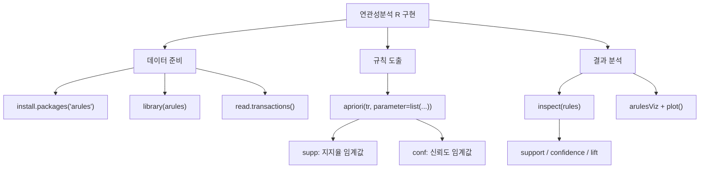

# 15. 데이터마이닝: 연관성분석 Ⅱ

## 🔗 선수 지식 (Prerequisites)
- [ ] **필수**: [14강. 연관성분석 Ⅰ](14강.%20연관성분석%20Ⅰ.md) - 지지율, 신뢰도, 향상도 개념 이해 완료?
- [ ] **권장**: R 프로그래밍 기초 (패키지 설치, 라이브러리 호출)
- **관련 단원**: [14강. 연관성분석 Ⅰ](14강.%20연관성분석%20Ⅰ.md)

---

## 학습 목표
1. 연관성분석에 사용되는 데이터구조를 이해할 수 있다.
2. R에서 연관성분석을 위한 데이터를 불러들일 수 있다.
3. 지지율, 신뢰도, 향상도를 산출할 수 있다.
4. 연관성분석 결과를 시각화할 수 있다.

---

## 🧠 메타인지 체크 (학습 전/후 자기 평가)

### 학습 전 자기 평가
| 소주제 | 자신감 (1-5) |
| :--- | :--- |
| R에서 트랜잭션 데이터 불러오기 | |
| apriori 함수로 연관규칙 도출 | |
| 연관성분석 결과 시각화 | |

### 학습 후 교정 (학습 완료 후 작성)
| 소주제 | 학습 전 | 학습 후 | 실제 정답률 | 과신/과소 여부 |
| :--- | :--- | :--- | :--- | :--- |
| R에서 트랜잭션 데이터 불러오기 | | | | |
| apriori 함수로 연관규칙 도출 | | | | |
| 연관성분석 결과 시각화 | | | | |

> **활용법**: 학습 전 1분 → 자신감 기입, 학습 후 1분 → 나머지 기입. "과신" 영역이 실제 취약점.

---

## 📝 요약 (Summary)
1. 🔴 **read.transactions**: R의 arules 패키지에서 `read.transactions`을 이용하면 외부의 트랜잭션 데이터를 불러들일 수 있다. `→←14강`
2. 🔴 **apriori 함수**: `apriori` 함수를 이용하면 Apriori 알고리즘을 이용하여 연관규칙을 도출하게 된다. `parameter` 옵션으로 지지율(`supp`)과 신뢰도(`conf`) 임계값을 지정한다.
3. 🔴 **inspect 함수**: `apriori` 함수를 이용하여 도출된 연관규칙은 `inspect` 함수를 통해 출력된다. 출력 결과에서 `support`는 지지율, `confidence`는 신뢰도, `lift`는 향상도를 의미한다.
4. 🟡 **arulesViz 시각화**: `arulesViz` 패키지를 설치하고 호출한 뒤 `plot` 함수를 이용하면 연관성분석의 결과를 시각화할 수 있다. `method` 옵션에서 그래프 형태를 지정할 수 있다.

---

## 📐 핵심 정의 및 원리 (Key Definitions)

| 정의명 | 내용 | 키워드 |
| :--- | :--- | :--- |
| **read.transactions** | R의 arules 패키지에서 트랜잭션 데이터를 불러들이는 함수. `format`, `cols` 등의 옵션 지정 | `arules`, 데이터 입력 |
| **apriori** | Apriori 알고리즘을 이용하여 연관규칙을 도출하는 함수. `parameter=list(supp=, conf=)`로 임계값 설정 | 연관규칙, 지지율, 신뢰도 |
| **inspect** | 연관성분석 결과(lhs → rhs, support, confidence, lift)를 출력하는 함수 | 결과 확인 |
| **arulesViz** | 연관성분석의 결과를 시각화하는 패키지. `plot(rules, method="graph")` 등으로 사용 | 시각화, 그래프 |

### R에서 연관성분석 전체 흐름

```r
# 1. 패키지 설치 및 호출
install.packages("arules")      # 설치 시 인용부호 사용
library(arules)                  # 호출 시 인용부호 없음

# 2. 트랜잭션 데이터 읽기
tr = read.transactions("c:/data/basket.txt", format = "single", cols = c(1,2))

# 3. 연관규칙 도출 (지지율 0.3 이상, 신뢰도 0.6 이상)
rules <- apriori(tr, parameter = list(supp=0.3, conf=0.6))

# 4. 결과 출력
inspect(rules)

# 5. 시각화
install.packages("arulesViz")
library(arulesViz)
plot(rules, method = "graph")
```

> **직관적 해석**: `install.packages()`는 인용부호가 필요하고, `library()`는 인용부호 없이 패키지명을 직접 쓴다. 데이터 읽기에는 `read.transactions`를, 연관규칙 도출에는 `apriori`를 사용한다.
> **AI 적용**: 연관성분석은 추천 시스템의 기초로, "함께 구매되는 상품" 패턴을 발견하여 협업 필터링(Collaborative Filtering)에 활용된다.

---

## 📊 개념 시각화 (Visual Guide)

### 개념 관계도


### R 연관성분석 출력 결과 해석

| 출력 열 | 의미 | 해석 | `→←14강` |
| :--- | :--- | :--- | :--- |
| **lhs** | 선행 항목(조건) | 규칙의 IF 부분 | |
| **rhs** | 후행 항목(결과) | 규칙의 THEN 부분 | |
| **support** | 지지율 | 전체 거래 중 두 항목이 함께 등장하는 비율 | $P(A \cap B)$ |
| **confidence** | 신뢰도 | A를 구매한 고객 중 B도 구매한 비율 | $P(B|A)$ |
| **lift** | 향상도 | 1보다 크면 양의 연관, 1이면 독립 | $\frac{P(B|A)}{P(B)}$ |

---

## ✏️ 심화 학습 (Study Subject)

### 1. 가상 시나리오: "온라인 쇼핑몰의 장바구니 분석"
- **상황**: 온라인 쇼핑몰에서 10만 건의 거래 데이터를 보유하고 있으며, 교차 판매(cross-selling) 전략을 수립하려 한다.
- **문제**: 어떤 상품 조합이 함께 구매되는 경향이 강한지 파악하고, 이를 추천 시스템에 반영하려면 어떻게 해야 할까?
- **해결**: R의 `arules` 패키지로 트랜잭션 데이터를 불러온 뒤, `apriori` 함수에서 적절한 지지율·신뢰도 임계값을 설정하여 규칙을 도출한다. `lift > 1`인 규칙을 선별하여 "이 상품을 산 고객은 이 상품도 구매했습니다" 추천에 활용한다.
- **AI 학습 포인트**: "대규모 트랜잭션 데이터에서 Apriori 알고리즘의 성능 한계는 무엇이고, FP-Growth 같은 대안 알고리즘은 어떤 점에서 개선되었을까?"

### 2. 관점별 비교 및 오개념 분석
- **핵심 비교**: `install.packages()` vs `library()` — 설치와 호출의 차이

| 구분 | `install.packages()` | `library()` |
| :--- | :--- | :--- |
| **기능** | 패키지 다운로드 및 설치 | 설치된 패키지를 현재 세션에 로드 |
| **인용부호** | 필요 (`"arules"`) | 불필요 (`arules`) |
| **실행 빈도** | 최초 1회 (또는 업데이트 시) | 매 세션마다 |

- **오개념 분석**:
    - **오개념 1**: "신뢰도가 높으면 반드시 의미 있는 연관규칙이다"
    - **분석**: 신뢰도가 높아도 향상도(lift)가 1 이하이면 두 항목은 독립적이거나 음의 연관관계이다. 반드시 향상도를 함께 확인해야 한다. 예: confidence=0.8이지만 rhs 항목의 기본 구매율이 0.9라면 lift=0.89로 오히려 음의 연관이다.
    - **오개념 2**: "`read.table`로 트랜잭션 데이터를 읽을 수 있다"
    - **분석**: 일반 데이터프레임 형태로 읽는 `read.table`은 트랜잭션 객체를 생성하지 못한다. `arules` 패키지의 `read.transactions` 함수를 사용해야 트랜잭션 클래스 객체가 생성되어 `apriori` 함수에 입력할 수 있다.
- **AI 학습 포인트**: "지지율, 신뢰도, 향상도 세 가지 측도가 모두 높은 규칙과, 향상도만 매우 높지만 지지율이 낮은 규칙 중 실무에서 어떤 것을 우선해야 하는지 사례를 들어 설명해 줘."

---

## ❓ 연습 문제 및 해설

> **블룸 인지 수준 범례**: [기억] 정의·나열 → [이해] 설명·비교 → [적용] 계산·구현 → [분석] 구별·디버그 → [평가] 판단·비평 → [창조] 설계·제안

### 📝 문제

**1. ⭐ [기억] 📎 연관성분석을 위한 패키지 (a), (b) 및 데이터를 읽기 위한 R 명령어 (c)로 적당한 것은? [](#prob-1)**

```r
> install.packages((a))
> library((b))
> tr = (c)("c:/data/basket.txt", format = "single", cols = c(1,2))
```

   > ① (a): arules, (b): "arules", (c): read.transactions
   > ② (a): "arules", (b): arules, (c): read.transactions
   > ③ (a): assoc, (b): "assoc", (c): read.table
   > ④ (a): "assoc", (b): assoc, (c): read.table

<br>

**2. ⭐ [기억] 📎 지지율이 0.3 이상이고, 신뢰도가 0.6 이상인 연관규칙을 찾고자 한다. 적절한 R 명령어 (c)는? [](#prob-2)**

```r
> rules <- (c)(tr, parameter = list(supp=0.3, conf=0.6))
```

   > ① confidence
   > ② apriori
   > ③ priori
   > ④ support

<br>

**3. ⭐⭐ [적용] 📎 연관규칙 분석 결과가 아래와 같이 나타났다고 가정했을 때, jam → cheese에 대한 지지율, 신뢰도, 향상도는? [](#prob-3)**

| lhs | rhs | support | confidence | lift |
| :--- | :--- | :--- | :--- | :--- |
| {milk} | => {cheese} | 0.3 | 0.7500000 | 1.250000 |
| {bread} | => {cheese} | 0.3 | 0.7500000 | 1.250000 |
| {jam} | => {cheese} | 0.4 | 0.8000000 | 1.333333 |
| {cheese} | => {jam} | 0.4 | 0.6666667 | 1.333333 |
| {bread, milk} | => {cheese} | 0.3 | 1.0000000 | 1.666667 |
| {milk, cheese} | => {bread} | 0.3 | 1.0000000 | 2.500000 |
| {bread, cheese} | => {milk} | 0.3 | 1.0000000 | 2.500000 |

   > ① 지지율은 0.3, 신뢰도는 0.75, 향상도는 1.250이다.
   > ② 지지율은 0.3, 신뢰도는 1.0, 향상도는 1.6666670이다.
   > ③ 지지율은 0.4, 신뢰도는 0.8, 향상도는 1.3333330이다.
   > ④ 지지율은 0.4, 신뢰도는 0.6666667, 향상도는 1.3333333이다.

<br>

**4. ⭐⭐ [이해] 📌 다음 중 R에서 연관성분석 결과를 시각화하기 위해 필요한 패키지는? [](#prob-4)**
   > ① ggplot2
   > ② arulesViz
   > ③ plotly
   > ④ lattice

<br>

**5. ⭐⭐ [분석] 📌 다음 중 `inspect(rules)` 출력 결과의 열에 대한 설명으로 올바르지 않은 것은? [](#prob-5)**
   > ① lhs는 선행 항목(조건부)을 의미한다
   > ② rhs는 후행 항목(결과)을 의미한다
   > ③ support는 신뢰도를 의미한다
   > ④ lift는 향상도를 의미한다

<br>

**6. ⭐⭐⭐ [분석] 📌 위 연관규칙 결과표에서 lift 값이 가장 높은 규칙은 무엇이며, 이것이 실무적으로 어떤 의미를 가지는지 서술하시오. [](#prob-6)**

---

### 🔑 정답 및 해설 (먼저 풀어본 후 펼치기)

<details>
<summary>정답 보기 (클릭)</summary>

1. ②
2. ②
3. ③
4. ②
5. ③
6. [서술형 — 아래 해설 참조]

</details>

<details>
<summary>해설 보기 (클릭)</summary>

<a id="prob-1"></a>
**1. ⭐ [기억] 연관성분석을 위한 패키지와 데이터 읽기**
> **정답: ② (a): "arules", (b): arules, (c): read.transactions**
> **해설**: `install.packages()`는 패키지명을 문자열(인용부호)로 전달하고, `library()`는 인용부호 없이 패키지명을 직접 전달한다. 연관성분석 패키지는 `arules`이며, 트랜잭션 데이터를 읽는 함수는 `read.transactions`이다. `read.table`은 일반 데이터프레임용 함수로 트랜잭션 객체를 생성하지 못한다.

<a id="prob-2"></a>
**2. ⭐ [기억] 연관규칙 도출 함수**
> **정답: ② apriori**
> **해설**: R의 `arules` 패키지에서 연관성분석을 실시하는 함수는 `apriori`이다. `confidence`와 `support`는 측도(measure)이지 함수가 아니며, `priori`라는 함수는 존재하지 않는다.

<a id="prob-3"></a>
**3. ⭐⭐ [적용] jam → cheese의 측도 읽기**
> **정답: ③ 지지율은 0.4, 신뢰도는 0.8, 향상도는 1.3333330이다.**
> **해설**: R의 출력 결과에서 `support`는 지지율, `confidence`는 신뢰도, `lift`는 향상도를 의미한다. 표에서 lhs가 {jam}이고 rhs가 {cheese}인 행을 찾으면 support=0.4, confidence=0.8000000, lift=1.333333이다. ④번은 cheese → jam 방향(역방향)의 값이므로 오답이다.

<a id="prob-4"></a>
**4. ⭐⭐ [이해] 📌 연관성분석 시각화 패키지**
> **정답: ② arulesViz**
> **해설**: `arulesViz`는 `arules` 패키지의 연관규칙 결과를 시각화하기 위한 전용 패키지이다. `ggplot2`, `plotly`, `lattice`는 범용 시각화 패키지로 연관규칙 객체를 직접 시각화하는 기능이 없다.

<a id="prob-5"></a>
**5. ⭐⭐ [분석] 📌 inspect 출력 열 설명**
> **정답: ③ support는 신뢰도를 의미한다**
> **해설**: `support`는 신뢰도가 아니라 **지지율**을 의미한다. 신뢰도는 `confidence` 열에 해당한다. lhs(선행 항목), rhs(후행 항목), lift(향상도)의 설명은 모두 올바르다.

<a id="prob-6"></a>
**6. ⭐⭐⭐ [분석] 📌 lift 최대 규칙 해석**
> **정답**: lift 값이 가장 높은 규칙은 `{milk, cheese} => {bread}`와 `{bread, cheese} => {milk}`로 둘 다 lift=2.5이다.
> **해설**: lift=2.5는 우유와 치즈를 함께 구매한 고객이 빵을 구매할 확률이, 빵의 일반적 구매 확률보다 2.5배 높다는 의미이다. 실무적으로 이 세 상품은 강한 양의 연관관계를 가지므로, 묶음 할인이나 매대 배치 전략에 활용할 수 있다. 또한 confidence=1.0이므로 해당 조건 항목을 구매한 고객은 100% 결과 항목도 구매했음을 의미한다.

</details>

---

## ✅ O/X 확인문제

**1.** [R에서 `install.packages(arules)`와 같이 인용부호 없이 패키지를 설치할 수 있다.](#ox-1) **(O / X)**
**2.** [`library()` 함수는 패키지명에 인용부호를 사용하지 않는다.](#ox-2) **(O / X)**
**3.** [`read.table` 함수로 트랜잭션 데이터를 읽으면 `apriori` 함수에 바로 사용할 수 있다.](#ox-3) **(O / X)**
**4.** [`apriori` 함수의 `parameter` 옵션에서 `supp`는 지지율, `conf`는 신뢰도의 임계값을 지정한다.](#ox-4) **(O / X)**
**5.** [`inspect` 함수의 출력에서 `confidence` 열은 향상도를 의미한다.](#ox-5) **(O / X)**
**6.** [향상도(lift)가 1보다 크면 두 항목 간에 양의 연관관계가 있다고 해석한다.](#ox-6) **(O / X)**
**7.** [`arulesViz` 패키지의 `plot` 함수에서 `method` 옵션으로 그래프 형태를 지정할 수 있다.](#ox-7) **(O / X)**
**8.** [연관규칙 {A} => {B}와 {B} => {A}는 항상 동일한 지지율, 신뢰도, 향상도를 가진다.](#ox-8) **(O / X)**
**9.** [`apriori` 함수에서 지지율 임계값을 낮출수록 더 많은 연관규칙이 도출된다.](#ox-9) **(O / X)**
**10.** [연관규칙의 신뢰도가 높으면 반드시 향상도도 높다.](#ox-10) **(O / X)**
**11.** [R에서 `inspect(rules)` 출력의 lhs는 규칙의 결과(THEN) 부분을 의미한다.](#ox-11) **(O / X)**
**12.** [`read.transactions` 함수의 `format` 옵션에서 `"single"`은 한 행에 하나의 항목이 기록된 형식을 의미한다.](#ox-12) **(O / X)**

<details>
<summary>O/X 정답 및 해설 보기 (클릭)</summary>

> <a id="ox-1"></a>
> **1. 정답**: X
> **해설**: `install.packages()`는 패키지명을 문자열로 전달해야 하므로 인용부호가 필요하다. `install.packages("arules")`가 올바른 형태이다.

> <a id="ox-2"></a>
> **2. 정답**: O
> **해설**: `library(arules)`처럼 인용부호 없이 패키지명을 직접 전달한다. (인용부호를 사용해도 동작하지만, 관례적으로 사용하지 않는다.)

> <a id="ox-3"></a>
> **3. 정답**: X
> **해설**: `read.table`은 일반 데이터프레임을 생성하며, `apriori` 함수는 트랜잭션 클래스 객체를 요구한다. `read.transactions` 함수를 사용해야 한다.

> <a id="ox-4"></a>
> **4. 정답**: O
> **해설**: `parameter=list(supp=0.3, conf=0.6)`에서 `supp`는 최소 지지율, `conf`는 최소 신뢰도 임계값을 지정한다.

> <a id="ox-5"></a>
> **5. 정답**: X
> **해설**: `confidence` 열은 **신뢰도**를 의미한다. 향상도는 `lift` 열이다.

> <a id="ox-6"></a>
> **6. 정답**: O
> **해설**: lift > 1이면 양의 연관, lift = 1이면 독립, lift < 1이면 음의 연관관계를 의미한다.

> <a id="ox-7"></a>
> **7. 정답**: O
> **해설**: `plot(rules, method="graph")` 등으로 그래프, 산점도, 행렬 등 다양한 형태의 시각화를 지정할 수 있다.

> <a id="ox-8"></a>
> **8. 정답**: X
> **해설**: 지지율은 동일하지만(둘 다 $P(A \cap B)$), 신뢰도는 다를 수 있다. {A}=>{B}의 신뢰도는 $P(B|A)$이고, {B}=>{A}의 신뢰도는 $P(A|B)$로 일반적으로 다르다. 향상도는 동일하다.

> <a id="ox-9"></a>
> **9. 정답**: O
> **해설**: 지지율 임계값을 낮추면 더 낮은 빈도의 항목 조합도 포함되므로 더 많은 규칙이 도출된다.

> <a id="ox-10"></a>
> **10. 정답**: X
> **해설**: 신뢰도가 높아도 rhs 항목의 기본 발생 확률이 높으면 향상도는 1 이하가 될 수 있다. 두 측도는 독립적으로 평가해야 한다.

> <a id="ox-11"></a>
> **11. 정답**: X
> **해설**: lhs(Left-Hand Side)는 규칙의 **조건(IF)** 부분이다. 결과(THEN) 부분은 rhs(Right-Hand Side)이다.

> <a id="ox-12"></a>
> **12. 정답**: O
> **해설**: `format="single"`은 각 행에 (거래ID, 항목) 쌍이 하나씩 기록된 형식이며, `format="basket"`은 한 행에 한 거래의 모든 항목이 나열된 형식이다.

</details>

---

## 🧪 자유 회상 연습 (Free Recall)

> **방법**: 위의 노트를 모두 덮고, 타이머 3분 설정 후 이번 단원에서 배운 내용을 기억나는 대로 자유롭게 적으세요.
> 정확한 문장이 아니어도 됩니다. 키워드, 수식, 관계 등 떠오르는 것을 모두 적습니다.

**자유 회상 작성란:**

```
[여기에 기억나는 내용을 자유롭게 작성]


```

> **회상 후 점검**: 노트를 다시 펼쳐 빠뜨린 내용을 확인하세요. 빠뜨린 부분이 실제 취약점입니다.
> - 회상 못한 핵심 개념: [                ]
> - 회상 못한 R 함수: [                ]

---

## 💻 코드로 확인하기 (Code Verification)

```python
# Python으로 연관성분석 재현 (mlxtend 활용)
import pandas as pd
from mlxtend.preprocessing import TransactionEncoder
from mlxtend.frequent_patterns import apriori, association_rules

# 장바구니 데이터 (예시) — 아래 실행결과 표가 그대로 재현되도록 구성한 10건
# (cheese 6건, bread 4건, milk 4건, jam 5건; egg는 min_support=0.3에서 가지치기됨)
transactions = [
    ['bread', 'milk', 'cheese'],
    ['bread', 'milk', 'cheese'],
    ['bread', 'milk', 'cheese', 'jam'],
    ['jam', 'cheese'],
    ['jam', 'cheese'],
    ['jam', 'cheese'],
    ['bread'],
    ['milk'],
    ['jam'],
    ['egg']
]

# 트랜잭션 인코딩
te = TransactionEncoder()
te_array = te.fit(transactions).transform(transactions)
df = pd.DataFrame(te_array, columns=te.columns_)

# 빈발 항목 집합 (지지율 0.3 이상)
frequent_items = apriori(df, min_support=0.3, use_colnames=True)

# 연관규칙 도출 (신뢰도 0.6 이상)
rules = association_rules(frequent_items, metric="confidence", min_threshold=0.6)
print(rules[['antecedents', 'consequents', 'support', 'confidence', 'lift']])
```

> **실행 결과**:
> ```
>       antecedents    consequents  support  confidence      lift
> 0        (milk)       (cheese)      0.3    0.750000  1.250000
> 1       (bread)       (cheese)      0.3    0.750000  1.250000
> 2         (jam)       (cheese)      0.4    0.800000  1.333333
> 3      (cheese)          (jam)      0.4    0.666667  1.333333
> 4  (bread,milk)       (cheese)      0.3    1.000000  1.666667
> 5 (milk,cheese)        (bread)      0.3    1.000000  2.500000
> 6 (bread,cheese)        (milk)      0.3    1.000000  2.500000
> ```
> **⚠️ 출력 형식 주의(값 재현용 정리 표)**: 위 표는 **값을 비교·확인하기 쉽도록 정리한 형태**이다. mlxtend `association_rules`의 실제 출력에서 `antecedents`/`consequents` 열은 파이썬 `frozenset({...})` 객체(예: `frozenset({'milk'})`)로 표시되며, **행 정렬 순서도 위 표와 다를 수 있다**(생성 순서·내부 해시에 의존). 즉 **표시 형식과 행 순서는 다를 수 있으나 각 규칙의 support/confidence/lift 값 자체는 동일**하다. R `arules`의 `inspect()` 또한 `{milk} => {cheese}`처럼 중괄호 집합 표기를 쓰므로 표기 형식만 다르고 값은 같다.
> **검산(거래데이터 기준, 전체 10건)**: cheese 6건, bread 4건, milk 4건, jam 5건이고, (bread,milk,cheese) 동시 3건, (jam,cheese) 4건이다. 예) `milk=>cheese`: support=3/10=0.3, confidence=3/4=0.75, lift=0.75/(6/10)=1.25. `jam=>cheese`: support=4/10=0.4, confidence=4/5=0.8, lift=0.8/0.6≈1.333. `milk,cheese=>bread`: support=3/10=0.3, confidence=3/3=1.0, lift=1.0/(4/10)=2.5. 위 코드의 transactions로 계산하면 표의 모든 값(support/confidence/lift)이 정확히 재현된다(egg는 지지율 0.1이라 가지치기되어 규칙에 나타나지 않음).
> **해석**: R의 `arules` 패키지와 동일한 결과를 Python의 `mlxtend`로 재현할 수 있다. `lift > 1`인 규칙은 모두 양의 연관관계를 나타내며, `{milk, cheese} => {bread}`와 `{bread, cheese} => {milk}`의 lift=2.5가 가장 강한 연관을 보인다.

---

## 🤖 AI 연결고리 (Math → AI Application)

| 학습 개념 | AI/ML 적용 분야 | 구체적 사례 |
| :--- | :--- | :--- |
| **연관규칙 (Association Rules)** | 추천 시스템 | Amazon의 "이 상품을 구매한 고객이 함께 구매한 상품" |
| **지지율 (Support)** | 빈발 패턴 마이닝 | 웹 로그 분석에서 빈번히 함께 방문되는 페이지 탐색 |
| **향상도 (Lift)** | 타겟 마케팅 | 특정 고객 세그먼트에 대한 교차 판매 캠페인 효과 측정 |
| **Apriori 알고리즘** | 텍스트 마이닝 | 문서에서 빈번히 함께 등장하는 단어 조합(공기어) 탐색 |

---

## 📖 심화 학습 예시 답안

#### 1. R 연관성분석 전체 파이프라인의 동작 원리

1. **데이터 준비**: `read.transactions()`가 텍스트 파일을 읽어 트랜잭션 객체(희소 행렬)로 변환한다. `format="single"`은 (거래ID, 항목) 쌍 형태, `format="basket"`은 거래별 한 줄 형태이다.
2. **후보 생성**: `apriori()` 함수가 최소 지지율을 만족하는 빈발 항목 집합을 반복적으로 생성한다 (k-항목 집합 → (k+1)-항목 집합).
3. **규칙 생성**: 빈발 항목 집합에서 최소 신뢰도를 만족하는 연관규칙을 생성한다.
4. **결과 출력**: `inspect()`로 lhs, rhs, support, confidence, lift를 확인한다.

#### 2. R의 arules vs Python의 mlxtend 비교표

| 구분 | R (arules) | Python (mlxtend) | 비고 |
| :--- | :--- | :--- | :--- |
| **패키지** | `arules` | `mlxtend` | |
| **데이터 입력** | `read.transactions()` | `TransactionEncoder` | R은 파일 직접 읽기, Python은 리스트 변환 |
| **규칙 도출** | `apriori()` | `apriori()` + `association_rules()` | Python은 2단계 |
| **결과 출력** | `inspect()` | DataFrame 출력 | |
| **시각화** | `arulesViz` + `plot()` | `matplotlib` 등 수동 구현 | R이 더 편리 |
| **AI 활용** | CRAN 생태계 | scikit-learn 연계 용이 | Python이 ML 파이프라인에 유리 |

#### 3. 연관성분석 시각화 코드 (Best Practice)

- **Bad Practice (나쁜 예시)**
  ```r
  # 결과만 텍스트로 출력
  inspect(rules)
  # → 규칙 수가 많을 때 패턴 파악이 어려움
  ```
- **Good Practice (좋은 예시)**
  ```r
  library(arulesViz)
  # 산점도: support vs confidence, 색상으로 lift 표시
  plot(rules, method = "scatterplot")
  # 네트워크 그래프: 항목 간 연관관계 시각화
  plot(rules, method = "graph")
  # 그룹 행렬: 규칙을 그룹화하여 한눈에 파악
  plot(rules, method = "grouped")
  ```
- **설명**: 시각화를 통해 규칙 간 패턴을 한눈에 파악할 수 있다. 특히 `method="graph"`는 항목 간 연관관계를 네트워크로 표현하여 직관적 이해를 돕는다.

#### 4. read.transactions의 format 2종과 apriori 출력 보완

- **`format="basket"` (한 줄 = 한 거래)**: 한 행에 한 거래의 모든 항목이 구분자로 나열된다.
  ```r
  # basket.txt 내용 예
  # bread,milk,cheese
  # bread,jam
  tr <- read.transactions("basket.txt", format = "basket", sep = ",")
  ```
- **`format="single"` (한 줄 = 거래ID,항목)**: 한 행에 (거래ID, 항목) 한 쌍씩 기록되며 `cols`로 두 열 위치를 지정한다.
  ```r
  # single.txt 내용 예
  # T1 bread
  # T1 milk
  # T2 jam
  tr <- read.transactions("single.txt", format = "single", cols = c(1, 2))
  ```
- **apriori 출력의 `count` 열**: `inspect()`/`summary()` 결과에는 support·confidence·lift 외에 **`count`(해당 항목집합을 포함한 절대 거래 수)** 열이 함께 나온다. 예: support=0.3·전체 10건이면 count=3. 위 본문 표에 count 열을 더하면 `milk=>cheese`는 count=3, `jam=>cheese`는 count=4가 된다.
- **측도 간 부등식**: 신뢰도 정의에서 $\text{confidence}(A\to B)=\dfrac{\text{support}(A\cup B)}{\text{support}(A)}\ge \text{support}(A\cup B)$ (∵ $\text{support}(A)\le 1$). 즉 같은 규칙의 신뢰도는 항상 지지율 이상이다.

#### 5. Apriori vs FP-Growth vs ECLAT (심층확장)

| 알고리즘 | 핵심 아이디어 | 데이터 표현 | DB 스캔 | 특징 |
| :--- | :--- | :--- | :--- | :--- |
| **Apriori** | 후보 생성 + 가지치기(downward closure) | 수평(거래→항목) | 매 단계 반복 스캔(다회) | 직관적이나 후보 폭발·다회 스캔이 단점 |
| **FP-Growth** | **후보 생성 없이** FP-tree에 빈발 패턴을 압축 후 재귀 분할 | FP-tree(압축 트리) | **DB 2회 스캔** | 대용량에서 Apriori보다 빠름, 트리를 메모리에 적재 |
| **ECLAT** | 항목별 거래ID 집합(**tidset**)의 **교집합**으로 지지율 계산 | 수직(항목→거래ID 집합) | 사실상 1회(수직 변환) | 교집합 연산이 빠름, tidset이 크면 메모리 부담 |

- **arulesViz 인터랙티브 시각화**: `plot(rules, method="graph", engine="htmlwidget")`(네트워크), `plot(rules, method="paracoord")`(평행좌표), `inspectDT(rules)`(정렬·필터 가능한 인터랙티브 데이터테이블)로 규칙을 탐색적으로 살펴볼 수 있다.
- **규칙 가지치기**: `is.redundant(rules)`로 더 일반적인(상위) 규칙보다 향상도/신뢰도 개선이 없는 **중복 규칙**을 제거하고, `is.significant(rules, tr)`로 우연 대비 통계적으로 **유의한 규칙**만 선별할 수 있다.

#### 6. Apriori 후보생성-가지치기 1라운드 손계산 (Apriori 원리 체화)

위 코드의 거래 데이터(전체 10건, 본문 `transactions` 참조)에 **최소지지도 0.3**(= 절대 빈도 3건 이상)을 적용해 1-항목집합 → 2-항목집합 후보 생성·가지치기 과정을 직접 따라가 본다.

**[1단계] 1-항목집합($C_1$)의 지지도 계산 및 빈발 항목집합($L_1$) 선별**

| 1-항목집합 | 등장 거래 수(count) | 지지도(support) | 0.3 이상? | 판정 |
| :--: | :--: | :--: | :--: | :--: |
| {bread} | 4 | 0.4 | ✔ | **빈발($L_1$)** |
| {milk} | 4 | 0.4 | ✔ | **빈발($L_1$)** |
| {cheese} | 6 | 0.6 | ✔ | **빈발($L_1$)** |
| {jam} | 5 | 0.5 | ✔ | **빈발($L_1$)** |
| {egg} | 1 | 0.1 | ✘ | **가지치기(제거)** |

→ $L_1 = \{\text{bread}, \text{milk}, \text{cheese}, \text{jam}\}$. **egg는 비빈발이므로 제거**되고, **Apriori 원리(비빈발 항목집합의 상위집합은 모두 비빈발)** 에 따라 `{egg, *}` 형태의 2-항목집합 후보는 **아예 생성하지 않는다**(탐색 공간 축소).

**[2단계] 2-항목집합 후보 생성($C_2$): $L_1$의 항목끼리만 결합**

egg가 빠졌으므로 $\{bread,milk,cheese,jam\}$에서 $\binom{4}{2}=6$개 후보만 생성한다.

| 2-항목집합 후보 | 등장 거래 수(count) | 지지도(support) | 0.3 이상? | 판정 |
| :--: | :--: | :--: | :--: | :--: |
| {bread, milk} | 3 | 0.3 | ✔ | **빈발($L_2$)** |
| {bread, cheese} | 3 | 0.3 | ✔ | **빈발($L_2$)** |
| {milk, cheese} | 3 | 0.3 | ✔ | **빈발($L_2$)** |
| {bread, jam} | 1 | 0.1 | ✘ | 가지치기 |
| {milk, jam} | 1 | 0.1 | ✘ | 가지치기 |
| {cheese, jam} | 4 | 0.4 | ✔ | **빈발($L_2$)** |

→ $L_2 = \{\{bread,milk\}, \{bread,cheese\}, \{milk,cheese\}, \{cheese,jam\}\}$.

> **체화 포인트**: ① 비빈발 항목(egg)을 1라운드에서 제거하면 그것을 포함한 모든 상위 후보를 생성조차 하지 않아 계산이 크게 줄어든다(**downward closure/가지치기**). ② 다음 3-항목집합 후보는 $L_2$에서만 결합·생성되며, 예컨대 `{bread, milk, cheese}`는 그 모든 2-항목 부분집합({bread,milk},{bread,cheese},{milk,cheese})이 모두 $L_2$에 있어 후보가 된다(실제 지지도 0.3으로 빈발). 반대로 `{bread, jam}`이 비빈발이므로 이를 포함한 `{bread, milk, jam}` 등은 후보에서 즉시 배제된다. 이것이 본문 표의 규칙들이 도출되는 **Apriori의 실제 동작**이다.

#### 7. Apriori vs FP-Growth vs ECLAT 심화 비교 — 2차 심층확장

5절의 비교표를 **DB 스캔 횟수·후보생성·자료구조·메모리/속도 trade-off·대용량 적합도** 관점으로 보강한다.

| 비교 항목 | **Apriori** | **FP-Growth** | **ECLAT** |
| :--- | :--- | :--- | :--- |
| **데이터 표현** | 수평(horizontal): 거래→항목 리스트 | FP-tree(빈발 항목 압축 트리) | 수직(vertical): 항목→tidset(거래ID 집합) |
| **DB 스캔 횟수** | **다회**(k-항목집합마다 1회씩, 최악 $O(k)$회) | **2회**(1회: 항목빈도, 2회: 트리 구축) | **1회**(수직 변환 후 메모리상 교집합) |
| **후보 생성** | **있음**($C_k$ 생성 후 지지도 검사) | **없음**(트리에서 빈발패턴 직접 성장) | **없음**(tidset 교집합으로 지지도 직접 산출) |
| **핵심 자료구조** | 해시트리/리스트 | **FP-tree + 헤더테이블** | **tidset(거래ID 집합)** |
| **지지도 계산** | DB 재스캔하여 카운트 | 트리 경로의 count 합산 | **tidset 교집합 크기**($\lvert t(A)\cap t(B)\rvert$) |
| **메모리** | 후보집합이 폭발하면 부담 | **FP-tree를 메모리 적재**(희소·압축되면 작음, 트리가 크면 부담) | **tidset 적재**(빈발 항목의 거래ID가 많으면 부담) |
| **속도 trade-off** | 후보 다수·다회 스캔 → 일반적으로 가장 느림 | 후보 없음·2회 스캔 → 조밀(dense)·대용량에서 빠름 | 교집합이 단순·고속, 희소(sparse) 데이터에 유리 |
| **대용량 적합도** | 낮음(후보·스캔 폭발) | **높음**(트리가 메모리에 들어가면 우수) | 중~높음(tidset이 메모리에 들어가면 우수) |

**(a) FP-Growth의 FP-tree 구성과 조건부 패턴 베이스**

FP-Growth는 후보를 만들지 않고 트랜잭션을 **트리로 압축**한 뒤 트리에서 직접 빈발 패턴을 키운다.

1. **1차 스캔**: 각 항목의 지지도를 세고 **최소지지도 미만 항목을 제거**한 뒤, 남은 항목을 **빈도 내림차순**으로 정렬한다(공통 접두사가 많이 겹치도록).
2. **2차 스캔 — FP-tree 구축**: 각 거래의 항목을 위 빈도순으로 정렬해 루트부터 경로로 삽입한다. 이미 있는 접두사 경로는 **노드의 count만 증가**시켜 공유하므로, 같은 패턴이 반복될수록 트리가 압축된다. 같은 항목의 모든 노드는 **헤더테이블의 노드-링크**로 연결된다.
3. **조건부 패턴 베이스(conditional pattern base)**: 특정 항목(예: 가장 드문 빈발 항목)을 접미사로 고정하고, 헤더 링크를 따라가 그 노드들의 **루트까지의 접두사 경로(count 포함)** 를 모은 집합이다.
4. **조건부 FP-tree → 재귀 분할(divide-and-conquer)**: 조건부 패턴 베이스로 **조건부 FP-tree**를 만들고, 거기서 다시 빈발 패턴을 재귀적으로 성장시킨다. 이렇게 "후보 생성 없이" 빈발 패턴 전체를 얻는다.

**(b) ECLAT의 수직 tidset 교집합 방식**

ECLAT(Equivalence Class Clustering and bottom-up Lattice Traversal)는 데이터를 **수직 포맷**으로 바꾼다. 즉 각 항목 $X$에 대해 그 항목이 등장한 **거래ID 집합 $t(X)$(tidset)** 를 저장한다.

- **지지도 = tidset 크기**: $\text{support}(X)=\dfrac{\lvert t(X)\rvert}{N}$. 예) 위 본문 데이터에서 $t(\text{cheese})=\{T_1,\dots\}$의 원소 수가 6이면 support=0.6.
- **결합 = tidset 교집합**: 두 항목집합의 동시 지지도는 **거래ID 집합의 교집합 크기**로 즉시 구한다. $t(A\cup B)=t(A)\cap t(B)$이고 $\text{support}(A\cup B)=\dfrac{\lvert t(A)\cap t(B)\rvert}{N}$. 예: $t(\text{milk})\cap t(\text{cheese})$의 원소가 3개이면 support=0.3. **DB를 다시 스캔할 필요 없이 메모리상의 집합 연산만으로** 후보 지지도를 얻는 것이 핵심이다.
- **diffset 최적화**: tidset이 커질 때 메모리를 줄이기 위해 전체 tidset 대신 **차집합(diffset)** 만 저장하는 변형(dEclat)도 쓰인다.

> **선택 가이드**: 데이터가 **희소(sparse)** 하고 거래당 항목이 적으면 **ECLAT**의 tidset 교집합이 가볍고 빠르다. 데이터가 **조밀(dense)** 하거나 공통 접두사가 많아 트리 압축 효과가 크면 **FP-Growth**가 유리하다. **Apriori**는 개념이 직관적이고 구현이 쉬워 교육·소규모에 적합하지만, 후보 폭발과 다회 스캔 때문에 대용량에서는 두 알고리즘에 밀린다. R `arules`의 `apriori()`·`eclat()`, Python `mlxtend`의 `apriori`/`fpgrowth`/`fpmax`로 각각 실습할 수 있다. (근거: Han et al. 2000 FP-Growth; Zaki 2000 ECLAT; Borgelt 2003)

---

## 📚 핵심 용어집 (Glossary)

| 용어 (한) | 용어 (영) | 수식 표현 | 정의 |
| :--- | :--- | :--- | :--- |
| **트랜잭션 데이터** | Transaction Data | - | 고객별 구매 항목을 기록한 데이터. R에서 `read.transactions`로 읽음 |
| **연관규칙** | Association Rule | $A \Rightarrow B$ | 항목 A 구매 시 항목 B도 구매하는 패턴을 표현하는 규칙 `→←14강` |
| **지지율** | Support | $P(A \cap B)$ | 전체 거래 중 A와 B가 함께 등장하는 비율 `→←14강` |
| **신뢰도** | Confidence | $P(B \mid A)$ | A를 포함한 거래 중 B도 포함하는 비율 `→←14강` |
| **향상도** | Lift | $\frac{P(B \mid A)}{P(B)}$ | 규칙의 유용성 측도. 1 초과 시 양의 연관 `→←14강` |
| **read.transactions** | read.transactions | - | arules 패키지에서 트랜잭션 데이터를 읽어들이는 함수 |
| **apriori** | Apriori | - | Apriori 알고리즘으로 연관규칙을 도출하는 R 함수 |
| **inspect** | inspect | - | 연관성분석 결과(규칙, 측도)를 출력하는 R 함수 |
| **arulesViz** | arulesViz | - | 연관성분석 결과를 시각화하는 R 패키지 |
| **FP-tree** | Frequent Pattern Tree | - | FP-Growth가 거래를 빈도순으로 압축 저장하는 트리. 헤더테이블의 노드-링크로 동일 항목 연결 |
| **조건부 패턴 베이스** | Conditional Pattern Base | - | 특정 항목을 접미사로 고정했을 때 헤더 링크로 모은 루트까지의 접두사 경로(count 포함) 집합 |
| **tidset** | Transaction-ID Set | $t(X)$ | ECLAT의 수직 표현. 항목집합 $X$가 등장한 거래ID 집합, $\text{support}=\lvert t(X)\rvert/N$ |

---

## 🤖 AI 학습 파트너를 위한 추가 자료

### 1. 개념 이해를 위한 심층 질문 프롬프트
> **프롬프트 예시**: "R의 arules 패키지에서 read.transactions 함수가 데이터를 '트랜잭션 객체'로 변환하는 과정을 내부적으로 설명해 줘. 일반 데이터프레임과 트랜잭션 객체의 구조적 차이(희소 행렬 등)를 비유를 들어 쉽게 알려줘."

### 2. 문제 해결 능력 강화를 위한 시나리오 프롬프트
> **프롬프트 예시**: "당신은 대형 마트의 데이터 분석가입니다. 100만 건의 거래 데이터에서 연관규칙을 도출해야 합니다. R의 apriori 함수에서 지지율과 신뢰도 임계값을 어떻게 설정해야 의미 있는 규칙을 효율적으로 찾을 수 있을지, 단계별 전략을 제시해 줘."

### 3. 수식 풀이 검증 프롬프트
> **프롬프트 예시**: "다음 연관규칙 분석 결과를 검증해 줘. 전체 10건의 거래에서 jam이 5건, cheese가 6건, jam과 cheese가 동시에 4건 등장했을 때:
> 1. jam → cheese의 지지율, 신뢰도, 향상도를 계산해 줘.
> 2. cheese → jam의 지지율, 신뢰도, 향상도도 계산하고, 방향에 따른 차이를 설명해 줘."

---

## 🔄 복습 체크 (Spaced Repetition)
- [ ] 1일 후 복습 (날짜: 2026-03-10)
- [ ] 3일 후 복습 (날짜: 2026-03-12)
- [ ] 7일 후 복습 (날짜: 2026-03-16)
- [ ] 14일 후 복습 (날짜: 2026-03-23)
- [ ] 30일 후 복습 (날짜: 2026-04-08)

### 복습 시 자가 평가
| 회차 | 날짜 | 이해도 (1-5) | 취약 부분 메모 |
| :--- | :--- | :--- | :--- |
| 1차 | | | |
| 2차 | | | |
| 3차 | | | |

---

## 📚 참고 자료 (References)

- Aggarwal, C. C., Procopiuc, C. M., and Yu, P. S.(2002), "Finding Localized Associations in Market Basket Data," *Knowledge and Data Engineering*, 14(1), 51-62.
- Aggrawal, R. and Srikant, R.(1994), "Fast Algorithms for Mining Association Rules," In J. B. Bocca, M. Jarke, C. Zaniolo(Eds.), *Proc. 20th Int. Conf. Very Large Data Bases, VLDB*, 487-499, San Francisco: Morgan Kaufmann.
- Borgelt, Christian and Kruse, Rudolf(2002), "Induction of Association Rules: Apriori Implementation," *15th Conference on Computational Statistics, COMPSTAT 2002*, Berlin, Germany, Heidelberg, Germany: PhysicaVerlag.
- Borgelt, Christian(2003), "Efficient Implementations of Apriori and Eclat," *Workshop of Frequent Item Set Mining Implementations, FIMI 2003*, Melbourne, FL, USA.
- Han, J., Pei, J., and Yin, Y.(2000), "Mining Frequent Patterns without Candidate Generation," *Proc. ACM SIGMOD Int. Conf. on Management of Data*, 1-12. (FP-Growth, FP-tree)
- Zaki, M. J.(2000), "Scalable Algorithms for Association Mining," *IEEE Transactions on Knowledge and Data Engineering*, 12(3), 372-390. (ECLAT, 수직 tidset)
