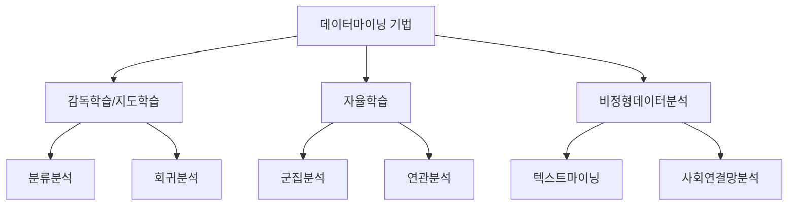
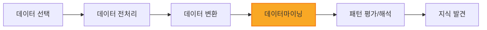

# 데이터마이닝: 1강. 데이터마이닝이란

## 🔗 선수 지식 (Prerequisites)
- [ ] **필수**: 통계학 기초 - 기술통계, 확률분포 이해 완료?
- [ ] **권장**: 데이터베이스 기초 (SQL, 데이터 웨어하우스 개념)
- **관련 단원**: 통계학 기초, 데이터베이스 개론

---

## 학습 목표
1. 데이터마이닝의 개념을 이해할 수 있다.
2. 데이터마이닝의 종류 및 수행단계를 설명할 수 있다.
3. 데이터마이닝에 사용되는 데이터의 특징을 설명할 수 있다.

---

## 🧠 메타인지 체크 (학습 전/후 자기 평가)

### 학습 전 자기 평가
| 소주제 | 자신감 (1-5) |
| :--- | :--- |
| 데이터마이닝의 개념과 정의 | |
| 데이터마이닝의 종류 (지도학습/자율학습) | |
| KDD 프로세스와 데이터마이닝의 관계 | |
| 데이터마이닝의 활용 분야 | |

### 학습 후 교정 (학습 완료 후 작성)
| 소주제 | 학습 전 | 학습 후 | 실제 정답률 | 과신/과소 여부 |
| :--- | :--- | :--- | :--- | :--- |
| 데이터마이닝의 개념과 정의 | | | | |
| 데이터마이닝의 종류 (지도학습/자율학습) | | | | |
| KDD 프로세스와 데이터마이닝의 관계 | | | | |
| 데이터마이닝의 활용 분야 | | | | |

> **활용법**: 학습 전 1분 → 자신감 기입, 학습 후 1분 → 나머지 기입. "과신" 영역이 실제 취약점.

---

## 📝 요약 (Summary)

### 학습개요
빅데이터 시대에 이르러 데이터의 가치와 활용에 대한 관심이 고조되고 있다. 데이터마이닝은 데이터의 가치를 발견하는 과정으로서 데이터베이스, 데이터 웨어하우스 또는 다른 정보 저장소에 저장된 방대한 양의 데이터로부터 흥미로운 패턴을 발견하는 작업이다. 본 강에서는 데이터마이닝의 기본 개념에 대하여 정리하고, 데이터마이닝 종류 및 수행단계에 대해 살펴본다. 또한 본 교재의 실습에제로 사용되는 데이터의 특징에 대해 설명한다.

### 핵심 정리
1. 🔴 **데이터마이닝의 정의**: 데이터베이스 또는 데이터웨어하우스에 분산 저장된 방대한 양의 데이터로부터 흥미로운 패턴을 발견하고 미래에 대한 예측 모형을 구축하는 작업
2. 🔴 **KDD와의 관계**: 데이터마이닝은 KDD(Knowledge Discovery in Database), 기계학습, 패턴인식뿐만 아니라 통계학 등 여러 학문 분야와 높은 연관성이 있음
3. 🔴 **학습 유형 분류**: 감독학습(지도학습)과 자율학습으로 크게 나뉨
   - **감독학습(지도학습)**: 분류분석, 회귀분석
   - **자율학습**: 군집분석, 연관분석
4. 🟡 **비정형데이터분석**: 데이터의 복잡도 및 분석의 특이성에 따라 별도로 구분 (텍스트마이닝, 사회연결망분석 등)
5. 🟡 **활용 분야**: 비즈니스, 경제학, 생명정보학, 공학 등 여러 분야에서 폭넓게 활용

---

## 📊 개념 시각화 (Visual Guide)

### 데이터마이닝 기법 분류 체계


### KDD 프로세스와 데이터마이닝의 관계


### 핵심 비교: 지도학습 vs 자율학습
| 구분 | 지도학습 (Supervised) | 자율학습 (Unsupervised) |
| :--- | :--- | :--- |
| **출력값(정답)** | 있음 | 없음 |
| **목적** | 입출력 간 관계를 학습하여 예측 | 데이터의 숨겨진 패턴/구조 발견 |
| **대표 기법** | 분류분석, 회귀분석, 회귀나무분석, 신경망분석 | 군집분석, 연관분석 |
| **예시** | 고객 이탈 예측, 신용등급 분류 | 고객 세분화, 장바구니 분석 |

> **각주**: 본 강은 학습 유형을 지도학습/자율학습 2분류로 다루지만, 이 외에도 일부 레이블만 사용하는 **반지도학습(semi-supervised learning)** 과 보상 신호로 학습하는 **강화학습(reinforcement learning)** 도 존재한다(본 강 범위 외).

### KDD vs CRISP-DM 단계 비교
> KDD가 학술적 관점의 지식 발견 프로세스라면, **CRISP-DM(Cross-Industry Standard Process for Data Mining)** 은 산업 현장에서 널리 쓰이는 표준 6단계 방법론이다.

| 단계 | KDD 프로세스 | CRISP-DM 6단계 |
| :--- | :--- | :--- |
| 1 | (목표 설정) | **Business Understanding** (비즈니스 이해) |
| 2 | 데이터 선택 | **Data Understanding** (데이터 이해) |
| 3 | 데이터 전처리 + 변환 | **Data Preparation** (데이터 준비) |
| 4 | 데이터마이닝 | **Modeling** (모델링) |
| 5 | 패턴 평가/해석 | **Evaluation** (평가) |
| 6 | 지식 활용 | **Deployment** (배포) |

> **핵심 차이**: CRISP-DM은 비즈니스 목표 정의(Business Understanding)에서 출발해 모형 배포(Deployment)까지 포함하는 반복적·순환적 방법론이며, 단계 간 되돌아가기(iteration)가 명시되어 있다. 근거: Cross-industry standard process for data mining (Wikipedia).

---

## ✏️ 심화 학습 (Study Subject)

### 1. 가상 시나리오: "데이터마이닝을 언제 사용해야 할까?"
- **상황**: 대형 온라인 쇼핑몰에서 수백만 건의 구매 데이터를 보유하고 있으며, 매출을 높이기 위한 전략이 필요한 상황
- **문제**: 어떤 상품을 함께 추천해야 교차판매(cross-selling)를 극대화할 수 있을까?
- **해결**: 연관분석(Association Analysis)을 활용하여 "A 상품을 구매한 고객은 B 상품도 함께 구매하는 경향이 있다"는 규칙을 도출. 이를 통해 상품 추천 시스템을 구축
- **AI 학습 포인트**: "연관분석과 협업 필터링(Collaborative Filtering)의 차이점은 무엇이며, 각각 어떤 상황에서 더 적합한가?"
  - **핵심 차이**: 연관분석은 거래(transaction) 단위로 "A→B" 같은 item-to-item 규칙(지지도·신뢰도·향상도)을 도출하는 반면, 협업필터링은 사용자-아이템 행렬(rating matrix)을 기반으로 유사 사용자/유사 아이템을 찾아 개인화된 추천을 생성한다.

### 2. 관점별 비교 및 오개념 분석
- **핵심 비교**: 모수적 모형 접근법 vs 알고리즘 접근법
  | 구분 | 모수적 모형 접근법 | 알고리즘 접근법 |
  | :--- | :--- | :--- |
  | **핵심** | 데이터를 바탕으로 모수를 추정하여 모형 적합 | 알고리즘에 의해 정해진 방식으로 계산 |
  | **장점** | 해석 용이, 통계적 검정 가능 | 복잡한 패턴 포착 가능, 유연성 높음 |
  | **단점** | 가정 위반 시 성능 저하 | 블랙박스 성격, 해석 어려움 |

- **오개념 분석**:
    - **오개념 1**: "데이터마이닝과 통계분석은 완전히 다른 분야이다"
    - **분석**: 데이터마이닝은 통계학, 기계학습, 패턴인식, KDD 등 여러 학문이 융합된 분야. 통계분석의 많은 기법(회귀분석, 분류분석 등)이 데이터마이닝의 핵심 도구로 사용됨
    - **오개념 2**: "군집분석은 지도학습에 해당한다"
    - **분석**: 군집분석은 정답 레이블(출력값) 없이 데이터의 유사성을 기반으로 그룹을 형성하므로 자율학습에 해당. 회귀분석, 회귀나무분석, 신경망분석이 지도학습의 예임

---

## ❓ 연습 문제 및 해설

> **블룸 인지 수준 범례**: [기억] 정의·나열 → [이해] 설명·비교 → [적용] 계산·구현 → [분석] 구별·디버그 → [평가] 판단·비평 → [창조] 설계·제안

### 📝 문제

**1. ⭐ [기억] [다음 중 데이터베이스에서 지식을 추출하는 전 과정을 의미하는 것으로 가장 적절한 것은?](#prob-1)**
   > ① CRM
   > ② 데이터준설
   > ③ KDD
   > ④ 데이터 웨어하우스

<br>

**2. ⭐ [기억] [다음 중 자율학습에 해당되는 것은?](#prob-2)**
   > ① 회귀분석
   > ② 군집분석
   > ③ 회귀나무분석
   > ④ 신경망분석

<br>

**3. ⭐⭐ [이해] [데이터마이닝 활용분야에서 목표마케팅, 고객세분화, 교차판매, 시장바구니분석 등을 적용하는 분야를 무엇이라 하는가?](#prob-3)**
   > ① 신용평가
   > ② 품질개선
   > ③ 고객관계관리
   > ④ 생명정보학

<br>

📌 **4. ⭐⭐ [분석] [데이터마이닝의 기법들 중 감독학습(지도학습)에 해당하는 것을 모두 고른 것은?](#prob-4)**
   > <보기>
   >
   > ㄱ. 분류분석  ㄴ. 군집분석  ㄷ. 회귀분석  ㄹ. 연관분석

   > ① ㄱ, ㄴ
   > ② ㄱ, ㄷ
   > ③ ㄴ, ㄹ
   > ④ ㄷ, ㄹ

<br>

📌 **5. ⭐ [기억] [데이터를 바탕으로 모수를 추정하여 모형을 적합하는 방법을 무엇이라 하는가?](#prob-5)**
   > ① 알고리즘 접근법
   > ② 모수적 모형 접근법
   > ③ 자율학습
   > ④ 비정형데이터분석

<br>

📌 **6. ⭐⭐ [이해] [다음 중 비정형데이터분석에 해당하는 것은?](#prob-6)**
   > ① 회귀분석
   > ② 분류분석
   > ③ 텍스트마이닝
   > ④ 군집분석

---

### 🔑 정답 및 해설 (먼저 풀어본 후 펼치기)

<details>
<summary>정답 보기 (클릭)</summary>

1. ③
2. ②
3. ③
4. ②
5. ②
6. ③

</details>

<details>
<summary>해설 보기 (클릭)</summary>

<a id="prob-1"></a>
**1. ⭐ [기억] 데이터베이스에서 지식을 추출하는 전 과정**
> **정답: ③ KDD**
> **해설**: KDD(Knowledge Discovery in Database)란 데이터베이스에 축적된 데이터로부터 지식을 추출하는 전 과정을 의미한다. CRM은 고객관계관리, 데이터준설(data dredging)은 통계적 근거 없이 유의미해 보이는 패턴을 무분별하게 찾는 행위(p-해킹·다중비교 남용)로 데이터 정제와는 무관하며, 데이터 웨어하우스는 데이터 저장소를 의미하므로 모두 "전 과정"에 해당하지 않는다.

<a id="prob-2"></a>
**2. ⭐ [기억] 자율학습에 해당되는 것**
> **정답: ② 군집분석**
> **해설**: 회귀분석, 회귀나무분석 및 신경망분석은 지도학습의 예이고, 군집분석은 자율학습의 예이다. 자율학습은 '교사'의 역할에 해당하는 실제 출력값이 존재하지 않고 데이터에 존재하는 여러 가지 형태의 특징을 찾는 데 그 목표를 두는 학습방법이다.

<a id="prob-3"></a>
**3. ⭐⭐ [이해] 데이터마이닝 활용분야 - 목표마케팅, 고객세분화, 교차판매 등**
> **정답: ③ 고객관계관리**
> **해설**: 고객관계관리(CRM)의 세부분야로서 목표마케팅, 고객세분화, 고객성향변동분석, 교차판매, 장바구니 분석 등을 꼽을 수 있다. 신용평가, 품질개선, 생명정보학은 데이터마이닝의 다른 활용 분야이다.

<a id="prob-4"></a>
📌 **4. ⭐⭐ [분석] 감독학습(지도학습)에 해당하는 것**
> **정답: ② ㄱ, ㄷ**
> **해설**: 감독학습(지도학습)에는 분류분석과 회귀분석이 포함된다. 군집분석과 연관분석은 자율학습에 해당한다. **함정**: 군집분석을 지도학습으로 혼동하기 쉬우나, 출력값(정답) 없이 데이터 구조만으로 그룹을 형성하므로 자율학습이다.

<a id="prob-5"></a>
📌 **5. ⭐ [기억] 모수를 추정하여 모형을 적합하는 방법**
> **정답: ② 모수적 모형 접근법**
> **해설**: 모수적 모형 접근법은 데이터를 바탕으로 모수를 추정하여 모형을 적합하는 방법이다. 알고리즘 접근법은 알고리즘에 의해 정해진 방식으로 계산 결과에 따라 분석하는 방법이다.

<a id="prob-6"></a>
📌 **6. ⭐⭐ [이해] 비정형데이터분석에 해당하는 것**
> **정답: ③ 텍스트마이닝**
> **해설**: 텍스트마이닝, 사회연결망분석 등은 데이터의 복잡도 및 분석의 특이성에 따라 비정형데이터분석으로 별도 구분된다. 회귀분석·분류분석은 지도학습, 군집분석은 자율학습에 해당한다.

</details>

---

## ✅ O/X 확인문제 (12문항)

**1.** [데이터마이닝은 KDD(Knowledge Discovery in Database)와 높은 연관성이 있다.](#ox-1) **(O / X)**
**2.** [회귀분석은 자율학습에 해당한다.](#ox-2) **(O / X)**
**3.** [데이터마이닝은 비즈니스 분야에서만 활용된다.](#ox-3) **(O / X)**
**4.** [텍스트마이닝은 비정형데이터분석에 속한다.](#ox-4) **(O / X)**
**5.** [자율학습에서는 교사의 역할에 해당하는 출력값이 존재한다.](#ox-5) **(O / X)**
**6.** [CRM(고객관계관리)에서 고객세분화와 교차판매는 데이터마이닝의 대표적 적용 사례이다.](#ox-6) **(O / X)**
📌 **7.** [KDD는 데이터마이닝의 한 단계에 불과하다.](#ox-7) **(O / X)**
📌 **8.** [모수적 모형 접근법은 알고리즘에 의해 정해진 방식으로 계산하는 방법이다.](#ox-8) **(O / X)**
📌 **9.** [분류분석은 감독학습(지도학습)에 해당한다.](#ox-9) **(O / X)**
📌 **10.** [연관분석은 지도학습의 대표적 기법이다.](#ox-10) **(O / X)**
📌 **11.** [사회연결망분석은 비정형데이터분석에 속한다.](#ox-11) **(O / X)**
📌 **12.** [신경망분석은 자율학습에 해당한다.](#ox-12) **(O / X)**

<details>
<summary>O/X 정답 및 해설 보기 (클릭)</summary>

> <a id="ox-1"></a>
> **1. 정답**: O
> **해설**: 데이터마이닝은 KDD, 기계학습, 패턴인식, 통계학 등 여러 학문 분야와 높은 연관성이 있다.

> <a id="ox-2"></a>
> **2. 정답**: X
> **해설**: 회귀분석은 입출력 간의 관계를 결정하는 지도학습(감독학습)에 해당한다. 자율학습의 예는 군집분석, 연관분석이다.

> <a id="ox-3"></a>
> **3. 정답**: X
> **해설**: 데이터마이닝은 비즈니스뿐만 아니라 경제학, 생명정보학, 공학 등 여러 분야에서 많이 활용되고 있다.

> <a id="ox-4"></a>
> **4. 정답**: O
> **해설**: 텍스트마이닝과 사회연결망분석 등은 데이터의 복잡도 및 분석의 특이성에 따라 비정형데이터분석으로 별도 구분된다.

> <a id="ox-5"></a>
> **5. 정답**: X
> **해설**: 자율학습은 교사의 역할에 해당하는 실제 출력값이 존재하지 않고, 데이터에 존재하는 여러 가지 형태의 특징을 찾는 데 목표를 두는 학습방법이다.

> <a id="ox-6"></a>
> **6. 정답**: O
> **해설**: 고객관계관리의 세부분야로서 목표마케팅, 고객세분화, 고객성향변동분석, 교차판매, 장바구니 분석 등이 있다.

> <a id="ox-7"></a>
> 📌 **7. 정답**: X
> **해설**: 반대이다. 데이터마이닝이 KDD의 한 단계이다. KDD는 데이터 선택→전처리→변환→마이닝→평가의 전체 과정을 포괄한다.

> <a id="ox-8"></a>
> 📌 **8. 정답**: X
> **해설**: 이는 알고리즘 접근법의 설명이다. 모수적 모형 접근법은 데이터를 바탕으로 모수를 추정하여 모형을 적합하는 방법이다.

> <a id="ox-9"></a>
> 📌 **9. 정답**: O
> **해설**: 분류분석은 입출력 관계를 학습하는 감독학습(지도학습)의 대표적 기법이다. 회귀분석도 지도학습에 해당한다.

> <a id="ox-10"></a>
> 📌 **10. 정답**: X
> **해설**: 연관분석은 자율학습에 해당한다. 출력값 없이 데이터 내 항목 간의 연관 규칙을 탐색하는 기법이다.

> <a id="ox-11"></a>
> 📌 **11. 정답**: O
> **해설**: 사회연결망분석은 텍스트마이닝과 함께 비정형데이터분석으로 별도 구분된다.

> <a id="ox-12"></a>
> 📌 **12. 정답**: X
> **해설**: 신경망분석은 지도학습의 예이다. 입출력 간의 관계를 학습하는 방식으로 분류·회귀 문제에 활용된다.

</details>

---

## 🧪 자유 회상 연습 (Free Recall)

> **방법**: 위의 노트를 모두 덮고, 타이머 3분 설정 후 이번 단원에서 배운 내용을 기억나는 대로 자유롭게 적으세요.
> 정확한 문장이 아니어도 됩니다. 키워드, 관계, 분류 체계 등 떠오르는 것을 모두 적습니다.

**자유 회상 작성란:**

```
[여기에 기억나는 내용을 자유롭게 작성]


```

> **회상 후 점검**: 노트를 다시 펼쳐 빠뜨린 내용을 확인하세요. 빠뜨린 부분이 실제 취약점입니다.
> - 회상 못한 핵심 개념: [                ]
> - 회상 못한 용어/분류: [                ]

---

## 📐 핵심 정의 및 원리 (Key Definitions)

| 정의명 | 정의 내용 | 핵심 키워드 |
| :--- | :--- | :--- |
| **데이터마이닝** | 대용량 데이터에서 관계, 패턴, 규칙을 탐색·모형화하여 유용한 지식을 추출하는 과정 | 패턴 발견, 예측 모형 |
| **KDD** | 데이터베이스에 축적된 데이터로부터 지식을 추출하는 전 과정 (선택→전처리→변환→마이닝→평가) | 지식 추출, 전 과정 |
| **지도학습** | 입출력 간의 관계를 학습하여 유용한 근사 시스템을 구하는 학습방법 | 출력값 있음, 예측 |
| **자율학습** | 출력값 없이 데이터에 존재하는 형태의 특징을 찾는 학습방법 | 출력값 없음, 패턴 탐색 |
| **모수적 모형 접근법** | 데이터를 바탕으로 모수를 추정하여 모형을 적합하는 방법 | 모수 추정, 모형 적합 |
| **알고리즘 접근법** | 알고리즘에 의해 정해진 방식으로 계산 결과에 따라 분석하는 방법 | 계산 기반, 유연성 |

### 핵심 원리: KDD 프로세스

> **KDD(Knowledge Discovery in Database)** 는 단순히 데이터마이닝만을 의미하는 것이 아니라, 데이터 선택부터 최종 지식 발견까지의 **전체 과정**을 포괄한다. 데이터마이닝은 KDD의 핵심 단계 중 하나이다.
>
> **AI 적용**: KDD 프로세스는 현대 ML 파이프라인(데이터 수집 → 전처리 → 피처 엔지니어링 → 모델 학습 → 평가)의 원형이 된다.

---

## 💻 코드로 확인하기 (Code Verification)

```python
import pandas as pd
from sklearn.datasets import load_iris

# 데이터마이닝 실습에서 자주 사용되는 Iris 데이터셋 탐색
iris = load_iris()
df = pd.DataFrame(iris.data, columns=iris.feature_names)
df['target'] = iris.target

# 기본 데이터 탐색 (데이터마이닝의 첫 단계)
print("데이터 크기:", df.shape)
print("\n기술통계량:")
print(df.describe())

# 지도학습 예시: 분류분석
from sklearn.tree import DecisionTreeClassifier
from sklearn.model_selection import train_test_split

X_train, X_test, y_train, y_test = train_test_split(
    iris.data, iris.target, test_size=0.3, random_state=42
)
clf = DecisionTreeClassifier(random_state=42)
clf.fit(X_train, y_train)
print(f"\n분류 정확도: {clf.score(X_test, y_test):.2f}")

# 자율학습 예시: 군집분석
from sklearn.cluster import KMeans

kmeans = KMeans(n_clusters=3, random_state=42, n_init=10)
kmeans.fit(iris.data)
print(f"군집 중심점:\n{kmeans.cluster_centers_}")
```

> **실행 결과**: Iris 데이터셋(150건, 4개 특성)에 대해 지도학습(분류)과 자율학습(군집)을 각각 수행
> **학습적 해석**: 지도학습은 정답(target)을 알고 학습하여 예측하는 반면, 자율학습은 정답 없이 데이터 구조만으로 그룹을 형성

---

## 🤖 AI 연결고리 (Math → AI Application)

| 데이터마이닝 기법 | AI/ML 적용 분야 | 구체적 사례 |
| :--- | :--- | :--- |
| 분류분석 | 지도학습 - 분류 | 스팸 메일 필터링, 질병 진단 |
| 회귀분석 | 지도학습 - 예측 | 주가 예측, 매출 예측 |
| 군집분석 | 비지도학습 - 클러스터링 | 고객 세분화, 이미지 분할 |
| 연관분석 | 추천 시스템 | 장바구니 분석, 상품 추천 |
| 텍스트마이닝 | NLP/자연어처리 | 감성분석, 문서 분류 |
| 사회연결망분석 | 그래프 신경망 (GNN) | SNS 영향력 분석, 사기 탐지 |

---

## 📖 심화 학습 예시 답안

#### 1. KDD 프로세스의 내부 동작 원리

데이터마이닝은 KDD의 한 단계이며, 전체 프로세스는 다음과 같이 진행된다.

1. **데이터 선택**: 분석 목적에 맞는 데이터를 데이터베이스/웨어하우스에서 추출
2. **데이터 전처리**: 결측치 처리, 이상치 제거 등 데이터 품질 확보
3. **데이터 변환**: 분석에 적합한 형태로 변환 (정규화, 차원 축소 등)
4. **데이터마이닝**: 패턴 발견, 모형 구축 (분류, 군집, 연관분석 등)
5. **패턴 평가/해석**: 발견된 패턴의 유용성과 신뢰성 검증

#### 2. 지도학습 vs 자율학습 비교표

| 구분 | 지도학습 | 자율학습 | 비고 |
| :--- | :--- | :--- | :--- |
| **정의** | 입출력 관계를 학습 | 출력값 없이 패턴 탐색 | |
| **출력값** | 있음 (정답 레이블) | 없음 | 핵심 구분 기준 |
| **대표 기법** | 분류, 회귀, 회귀나무, 신경망 | 군집, 연관 | → 2강 이후 상세 |
| **AI 활용** | 분류(스팸 필터), 예측(매출) | 클러스터링(고객 세분화), 추천 | |

#### 3. 데이터마이닝 기법 선택 Best Practice

- **Bad Practice (나쁜 예시)**
  ```python
  # 목적 없이 모든 기법을 무작위로 적용
  from sklearn.cluster import KMeans
  from sklearn.tree import DecisionTreeClassifier
  # 어떤 문제인지 정의하지 않고 바로 모델 학습...
  ```
- **Good Practice (좋은 예시)**
  ```python
  # 1. 문제 정의: 고객 이탈 예측 → 지도학습(분류) 선택
  # 2. 정답 레이블(이탈 여부)이 있는가? → Yes → 지도학습
  # 3. 출력이 범주형인가? → Yes → 분류분석
  from sklearn.tree import DecisionTreeClassifier
  clf = DecisionTreeClassifier()
  clf.fit(X_train, y_train)  # 정답 레이블과 함께 학습
  ```
- **설명**: 문제 유형(정답 유무, 출력 형태)을 먼저 판단한 후 적절한 기법을 선택해야 한다

---

## 📚 핵심 용어집 (Glossary)

| 용어 (한) | 용어 (영) | 수식 표현 | 정의 |
| :--- | :--- | :--- | :--- |
| **데이터마이닝** | Data Mining | - | 대용량 데이터에서 관계, 패턴, 규칙을 탐색·모형화하여 유용한 지식을 추출하는 과정 |
| **KDD** | Knowledge Discovery in Database | - | 데이터베이스에 축적된 데이터로부터 지식을 추출하는 전 과정 |
| **지도학습** | Supervised Learning | - | 입출력 간의 관계를 결정하는 시스템의 유용한 근사 시스템을 구하는 학습방법 |
| **자율학습** | Unsupervised Learning | - | 출력값 없이 데이터의 형태적 특징을 찾는 학습방법 |
| **모수적 모형 접근법** | Parametric Model Approach | - | 데이터를 바탕으로 모수를 추정하여 모형을 적합하는 방법 |
| **알고리즘 접근법** | Algorithmic Approach | - | 알고리즘에 의해 정해진 방식으로 계산 결과에 따라 분석하는 방법 |
| **분류분석** | Classification | - | 지도학습 기법. 입력 데이터를 사전 정의된 범주로 분류 → 2강 이후 상세 |
| **회귀분석** | Regression | - | 지도학습 기법. 연속형 출력값을 예측 → 2강 이후 상세 |
| **군집분석** | Clustering | - | 자율학습 기법. 유사한 데이터를 그룹으로 묶음 → 이후 상세 |
| **연관분석** | Association Analysis | - | 자율학습 기법. 항목 간 연관 규칙 탐색 (장바구니 분석) → 이후 상세 |
| **CRM** | Customer Relationship Management | - | 고객관계관리. 데이터마이닝 활용 분야 중 하나 |

---

## 🤖 AI 학습 파트너를 위한 추가 자료

### 1. 개념 이해를 위한 심층 질문 프롬프트
> **프롬프트 예시**: "데이터마이닝의 개념을 금광에서 금을 캐는 과정에 비유하여 설명해 줘. 그리고 데이터마이닝이 단순 통계분석과 어떻게 다른지 역사적 발전 과정과 함께 알려줘."

### 2. 문제 해결 능력 강화를 위한 시나리오 프롬프트
> **프롬프트 예시**: "당신은 이커머스 기업의 데이터 사이언티스트입니다. 고객 이탈을 예방하기 위해 분류분석(지도학습)과 군집분석(자율학습)을 각각 어떻게 활용할 수 있는지, 장단점을 비교하고 실무적인 접근 순서를 제안해 줘."

### 3. 개념 확장 프롬프트
> **프롬프트 예시**: "KDD 프로세스의 각 단계(데이터 선택 → 전처리 → 변환 → 마이닝 → 평가)에서 실무적으로 가장 많은 시간이 소요되는 단계는 어디이며, 각 단계에서 흔히 발생하는 실수와 해결 방법을 알려줘."

---

## 🔄 복습 체크 (Spaced Repetition)
- [ ] 1일 후 복습 (날짜: 2026-03-09)
- [ ] 3일 후 복습 (날짜: 2026-03-11)
- [ ] 7일 후 복습 (날짜: 2026-03-15)
- [ ] 14일 후 복습 (날짜: 2026-03-22)
- [ ] 30일 후 복습 (날짜: 2026-04-07)

### 복습 시 자가 평가
| 회차 | 날짜 | 이해도 (1-5) | 취약 부분 메모 |
| :--- | :--- | :--- | :--- |
| 1차 | | | |
| 2차 | | | |
| 3차 | | | |

---

## 📚 참고 자료 (References)

- 방송통신대학교 데이터마이닝 교재 1강
- Han, Kamber & Pei - "Data Mining: Concepts and Techniques"
- KDD 프로세스 원문: Fayyad et al. (1996) - "From Data Mining to Knowledge Discovery in Databases"
