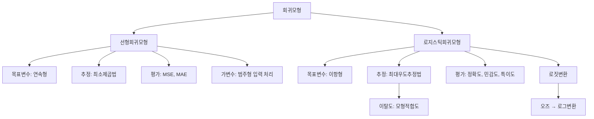

# 2강. 데이터마이닝: 회귀모형 Ⅰ

## 🔗 선수 지식 (Prerequisites)
- [ ] **필수**: [1강. 데이터마이닝이란](1강.%20데이터마이닝이란.md) - 이해 완료?
- [ ] **권장**: 기초통계학 (회귀분석, 확률분포 기본 개념)
- **관련 단원**: [1강 데이터마이닝이란](1강.%20데이터마이닝이란.md)

---

## 학습 목표
1. 선형회귀모형을 이해하고 적용할 수 있다.
2. 로지스틱회귀모형을 이해하고 적용할 수 있다.
3. 회귀모형을 데이터 마이닝에 이용할 수 있다.

---

## 🧠 메타인지 체크 (학습 전/후 자기 평가)

### 학습 전 자기 평가
| 소주제 | 자신감 (1-5) |
| :--- | :--- |
| 선형회귀모형 | |
| 로지스틱회귀모형 | |
| 최소제곱법 / 최대우도추정법 | |
| 가변수(더미 변수) 처리 | |
| 모형 평가 지표 (MSE, MAE, 정확도 등) | |

### 학습 후 교정 (학습 완료 후 작성)
| 소주제 | 학습 전 | 학습 후 | 실제 정답률 | 과신/과소 여부 |
| :--- | :--- | :--- | :--- | :--- |
| 선형회귀모형 | | | | |
| 로지스틱회귀모형 | | | | |
| 최소제곱법 / 최대우도추정법 | | | | |
| 가변수(더미 변수) 처리 | | | | |
| 모형 평가 지표 (MSE, MAE, 정확도 등) | | | | |

> **활용법**: 학습 전 1분 → 자신감 기입, 학습 후 1분 → 나머지 기입. "과신" 영역이 실제 취약점.

---

## 📝 요약 (Summary)
1. 🔴 **회귀모형**: 변수들 사이에 함수적 관계를 설명하며, 목표변수와 입력변수들을 연결하는 방정식 또는 모형의 형태로 표현된다.
2. 🔴 **선형회귀모형**: 연속형인 목표변수와 연속형 또는 범주형 입력변수들 사이에 관계를 나타내는 선형함수식이다.
3. 🔴 **로지스틱회귀모형**: 목표변수의 값이 두 개일 때 그 중 하나를 취할 확률의 로짓변환과 입력변수들의 선형 함수 관계로 나타내는 식이다.
4. 🔴 **예측**: 주어진 데이터에 기반하여 얻은 회귀식에 새로 수집한 데이터의 입력변수 값을 대입하여 목표변수의 값을 예측한다.
5. 🟡 **선형회귀 평가**: 선형회귀모형을 이용한 모형의 예측력은 평균제곱오차(MSE) 또는 평균절대오차(MAE)로 평가한다.
6. 🟡 **로지스틱회귀 평가**: 로지스틱회귀를 이용한 모형의 예측력은 예측정확도, 민감도, 특이도로 평가한다.

---

## 📐 핵심 정의 및 원리 (Key Definitions)

| 정의명 | 내용 | 키워드 |
| :--- | :--- | :--- |
| **선형회귀모형** | $y = \beta_0 + \beta_1 x_1 + \cdots + \beta_p x_p + \epsilon$ | 연속형 목표변수, 최소제곱법 |
| **로지스틱회귀모형** | $\text{logit}(p) = \ln\left(\frac{p}{1-p}\right) = \beta_0 + \beta_1 x_1 + \cdots + \beta_p x_p$ | 이항형 목표변수, 최대우도추정 |
| **최소제곱추정법** | 각 관측치로부터 회귀직선까지의 수직 거리 제곱의 합 $\sum(y_i - \hat{y}_i)^2$을 최소화 | 잔차제곱합, OLS |
| **최대우도추정법** | 우도함수 $L(\beta) = \prod f(y_i \mid x_i, \beta)$가 최대가 되는 $\beta$를 추정치로 선택 | 로지스틱, MLE |
| **로짓변환** | 오즈(odds) $\frac{p}{1-p}$에 로그를 취한 변환: $\text{logit}(p) = \ln\left(\frac{p}{1-p}\right)$ | 오즈, 확률→실수 |
| **이탈도 (Deviance)** | $D = -2[\log(L_M) - \log(L_S)]$, 적합모형과 포화모형의 최대로그우도 차이 | 모형적합도 |
| **MSE** | $\text{MSE} = \frac{1}{n}\sum_{i=1}^{n}(y_i - \hat{y}_i)^2$ | 평균제곱오차, 예측력 |
| **MAE** | $\text{MAE} = \frac{1}{n}\sum_{i=1}^{n}|y_i - \hat{y}_i|$ | 평균절대오차, 예측력 |

### 주요 정리/정의

**가변수 (Dummy Variable)**
$$
\text{범주의 개수가 } k\text{개인 범주형 변수} \rightarrow (k-1)\text{개의 가변수 생성}
$$
> **직관적 해석**: 범주형 변수를 회귀모형에 포함시키기 위해 0과 1로 코딩한 변수. 5개 범주면 4개의 가변수가 필요하다 (기준 범주 1개 제외).
> **AI 적용**: 원-핫 인코딩(One-Hot Encoding)은 가변수 생성의 대표적 방법으로, 머신러닝 전처리에서 필수적이다.

**로지스틱 회귀계수의 해석**
$$
\text{logit}(p) = \beta_0 + \beta_1 x_1 + \cdots + \beta_p x_p
$$
> **해석**: 계수 $\beta_j$는 $x_j$가 1단위 증가할 때 **로그오즈(log-odds)** 의 변화량이다. 이를 지수변환한 $\exp(\beta_j)$가 곧 **오즈비(odds ratio)** 로, $x_j$가 1단위 증가할 때 오즈가 몇 배가 되는지를 나타낸다. 근거: Odds ratio (Wikipedia).

**결정계수 ($R^2$)**
$$
R^2 = 1 - \frac{SSE}{SST}
$$
> **직관적 해석**: 전체 변동(SST) 중 회귀모형이 설명하는 변동의 비율. $0 \le R^2 \le 1$이며 1에 가까울수록 설명력이 높다. ($SSE=\sum(y_i-\hat{y}_i)^2$, $SST=\sum(y_i-\bar{y})^2$) 근거: Coefficient of determination (Wikipedia).

**선형회귀의 4대 가정**
> ① **선형성(Linearity)**: 목표변수와 입력변수 간 선형 관계
> ② **독립성(Independence)**: 오차항이 서로 독립
> ③ **등분산성(Homoscedasticity)**: 오차항의 분산이 일정
> ④ **정규성(Normality)**: 오차항이 정규분포를 따름

**민감도 / 특이도 (분류 평가)**
$$
\text{민감도(Sensitivity)} = \frac{TP}{TP + FN}, \qquad \text{특이도(Specificity)} = \frac{TN}{TN + FP}
$$
> **직관적 해석**: 민감도는 실제 양성을 양성으로 맞춘 비율, 특이도는 실제 음성을 음성으로 맞춘 비율이다.

---

## 📊 개념 시각화 (Visual Guide)

### 개념 관계도


### 핵심 비교표
| 구분 | 선형회귀 | 로지스틱회귀 |
| :--- | :--- | :--- |
| **목표변수** | 연속형 | 이항형 (0/1) |
| **함수 형태** | $y = X\beta + \epsilon$ | $\text{logit}(p) = X\beta$ |
| **추정 방법** | 최소제곱법 (OLS) | 최대우도추정법 (MLE) |
| **평가 지표** | MSE, MAE | 정확도, 민감도, 특이도 |
| **AI 활용** | 수치 예측 (가격, 수요) | 분류 (스팸, 이탈 예측) |

---

## ✏️ 심화 학습 (Study Subject)

### 1. 가상 시나리오: "고객 이탈 예측 모형 선택"
- **상황**: 통신사에서 고객의 이탈(해지) 여부를 예측하고자 한다. 입력변수로 나이, 사용량, 요금제(3종류), 만족도를 가지고 있다.
- **문제**: 목표변수가 이탈/유지(이항형)이므로 선형회귀가 아닌 로지스틱회귀를 사용해야 한다. 요금제(범주형, 3개 범주)를 어떻게 모형에 포함할까?
- **해결**: 요금제는 $k=3$이므로 $(3-1)=2$개의 가변수를 생성한다. 로지스틱회귀모형 $\text{logit}(p) = \beta_0 + \beta_1 x_{\text{나이}} + \beta_2 x_{\text{사용량}} + \beta_3 D_1 + \beta_4 D_2 + \beta_5 x_{\text{만족도}}$를 최대우도추정법으로 적합한다.
- **AI 학습 포인트**: "선형회귀로 이항 목표변수를 예측하면 어떤 문제가 발생하는가? 확률값이 0~1 범위를 벗어나는 문제를 로짓변환이 어떻게 해결하는가?"

### 2. 관점별 비교 및 오개념 분석
- **핵심 비교**: 최소제곱법 vs 최대우도추정법 — 전자는 잔차제곱합 최소화, 후자는 우도함수 최대화
- **오개념 분석**:
    - **오개념 1**: "로지스틱회귀는 회귀가 아니라 분류 알고리즘이다"
    - **분석**: 로지스틱회귀는 확률을 추정하는 **회귀**모형이다. 분류는 추정된 확률에 임계값을 적용한 결과일 뿐, 모형 자체는 $p(Y=1|X)$를 연속적으로 추정한다.
    - **오개념 2**: "범주가 5개인 변수는 가변수 5개를 만들어야 한다"
    - **분석**: $k$개 범주에는 $(k-1)$개의 가변수만 필요하다. 기준 범주를 포함하면 완전 다중공선성이 발생하여 회귀계수를 추정할 수 없다.
- **AI 학습 포인트**: "다중공선성(multicollinearity)이 가변수 생성에서 왜 문제가 되는지, 기준 범주 선택이 회귀계수 해석에 어떤 영향을 미치는지 설명해 줘."

---

## ❓ 연습 문제 및 해설

> **블룸 인지 수준 범례**: [기억] 정의·나열 → [이해] 설명·비교 → [적용] 계산·구현 → [분석] 구별·디버그 → [평가] 판단·비평 → [창조] 설계·제안

### 📝 문제

**1. ⭐ [기억] 📎 회귀직선 추정 방법 [최소제곱법]](#prob-1)**
   > 회귀분석에서 회귀직선을 추정하는 방법은 잔차제곱합을 최소화하는 것으로 (　　)이라고 한다. 다음 중 (　　)에 가장 알맞은 것은?
   >
   > ① 최소제곱법
   > ② 최대잔차법
   > ③ 잔차제곱법
   > ④ 가중평균법

<br>

**2. ⭐⭐ [이해] 📎 모형 적합도 측도 [이탈도]](#prob-2)**
   > 다음 중 모형의 적합도 측도로서, 최대로그우도(maximized log-likelihood) $\log(L_M)$과 포화모형(saturated model)의 최대로그우도 $\log(L_S)$의 차를 이용하여 산출하는 측도를 의미하는 것은?
   >
   > ① 로짓
   > ② 이탈도
   > ③ MAE
   > ④ MSE

<br>

**3. ⭐⭐ [적용] 📎 가변수 개수 [범주형 변수 처리]](#prob-3)**
   > 교육수준에 따른 생활만족도의 차이를 다양한 배경변수를 통제한 상태에서 비교하기 위해서 다중선형회귀분석을 실시하고자 한다. 교육수준을 5개의 범주(무학, 초등졸, 중졸, 고졸, 대졸이상)으로 측정하였다. 이때 교육수준별 차이를 나타내는 가변수를 몇 개 만들어야 하는가?
   >
   > ① 1개
   > ② 2개
   > ③ 3개
   > ④ 4개

<br>

**4. ⭐ [이해] 📌 선형회귀 예측력 평가](#prob-4)**
   > 선형회귀모형의 예측력을 평가하는 지표로 적절하지 않은 것은?
   >
   > ① MSE
   > ② MAE
   > ③ 민감도
   > ④ 결정계수($R^2$)

<br>

**5. ⭐⭐ [이해] 📌 로짓변환의 의미](#prob-5)**
   > 로짓변환에 대한 설명으로 옳은 것은?
   >
   > ① 목표변수의 평균을 로그변환한 것이다
   > ② 성공 확률과 실패 확률의 비(오즈)에 로그를 취한 것이다
   > ③ 잔차의 제곱합에 로그를 취한 것이다
   > ④ 입력변수의 분산에 로그를 취한 것이다

<br>

**6. ⭐⭐ [이해] 📌 로지스틱회귀 평가지표](#prob-6)**
   > 로지스틱회귀모형의 예측력을 평가하는 지표로 적절하지 않은 것은?
   >
   > ① 예측정확도
   > ② 민감도
   > ③ 특이도
   > ④ 평균제곱오차(MSE)

---

### 🔑 정답 및 해설 (먼저 풀어본 후 펼치기)

<details>
<summary>정답 보기 (클릭)</summary>

1. ①
2. ②
3. ④
4. ③
5. ②
6. ④

</details>

<details>
<summary>해설 보기 (클릭)</summary>

<a id="prob-1"></a>
**1. ⭐ [기억] 회귀직선 추정 방법**
> **정답: ① 최소제곱법**
> **해설**: 최소제곱법은 잔차의 제곱합 $\sum(y_i - \hat{y}_i)^2$을 최소로 하는 회귀직선 추정방법이다. "최대잔차법", "잔차제곱법"은 존재하지 않는 용어이며, 가중평균법은 평균 계산 방법이다.

<a id="prob-2"></a>
**2. ⭐⭐ [이해] 모형 적합도 측도**
> **정답: ② 이탈도**
> **해설**: 이탈도(Deviance)는 최대로그우도 $\log(L_M)$에서 포화모형의 최대로그우도 $\log(L_S)$를 뺀 값에 $-2$를 곱한 모형적합도의 측도이다. $D = -2[\log(L_M) - \log(L_S)]$. 로짓은 변환 방법, MAE와 MSE는 선형회귀의 예측력 평가 지표이다.

<a id="prob-3"></a>
**3. ⭐⭐ [적용] 가변수 개수**
> **정답: ④ 4개**
> **해설**: 범주의 개수가 $k$개인 범주형 변수에 대하여 $(k-1)$개의 가변수를 만든다. 교육수준은 5개 범주이므로 $5-1=4$개의 가변수가 필요하다.

<a id="prob-4"></a>
**4. ⭐ [이해] 선형회귀 예측력 평가**
> **정답: ③ 민감도**
> **해설**: 민감도(Sensitivity)는 로지스틱회귀 등 분류 모형의 평가 지표이다. 선형회귀모형의 예측력은 MSE, MAE, 결정계수($R^2$) 등으로 평가한다.

<a id="prob-5"></a>
**5. ⭐⭐ [이해] 로짓변환의 의미**
> **정답: ② 성공 확률과 실패 확률의 비(오즈)에 로그를 취한 것이다**
> **해설**: 로짓변환은 $\text{logit}(p) = \ln\left(\frac{p}{1-p}\right)$으로, 오즈(odds) $\frac{p}{1-p}$에 자연로그를 취한 것이다. 이를 통해 확률(0~1)을 실수 전체($-\infty \sim +\infty$)로 변환한다. (※ 주의: 성공 확률과 실패 확률의 비 $\frac{p}{1-p}$는 **오즈(odds)** 이며, **오즈비(odds ratio)** 는 서로 다른 두 집단의 오즈를 나눈 값이다. 일부 교재는 $\frac{p}{1-p}$를 '오즈비'로 표기하기도 하나 국제표준 용어는 odds(오즈)이다.)

<a id="prob-6"></a>
**6. ⭐⭐ [이해] 로지스틱회귀 평가지표**
> **정답: ④ 평균제곱오차(MSE)**
> **해설**: MSE는 연속형 목표변수를 가진 선형회귀모형의 평가 지표이다. 로지스틱회귀의 예측력은 예측정확도, 민감도, 특이도로 평가한다.

</details>

---

## ✅ O/X 확인문제

**1.** [회귀분석은 변수들 사이에 함수적 관계를 조사하는 통계적 방법이다.](#ox-1) **(O / X)**
**2.** [선형회귀모형의 목표변수는 반드시 연속형이어야 한다.](#ox-2) **(O / X)**
**3.** [로지스틱회귀모형의 목표변수는 연속형이다.](#ox-3) **(O / X)**
**4.** [최소제곱법은 잔차제곱합을 최대화하는 방법이다.](#ox-4) **(O / X)**
**5.** [오즈(odds)는 성공 확률과 실패 확률의 비이다.](#ox-5) **(O / X)**
**6.** [범주가 4개인 범주형 변수를 회귀모형에 포함하려면 가변수 4개가 필요하다.](#ox-6) **(O / X)**
**7.** [선형회귀모형의 예측력은 MSE 또는 MAE로 평가한다.](#ox-7) **(O / X)**
**8.** [로지스틱회귀의 예측력은 MSE로 평가한다.](#ox-8) **(O / X)**
**9.** [로짓변환은 확률값(0~1)을 실수 전체 범위로 변환하는 역할을 한다.](#ox-9) **(O / X)**
**10.** [최대우도추정법은 우도함수가 최대가 되는 모수를 찾는 방법이다.](#ox-10) **(O / X)**
**11.** [이탈도(Deviance)는 적합모형과 포화모형의 최대로그우도 차이로 산출한다.](#ox-11) **(O / X)**
**12.** [선형회귀모형에서 입력변수는 반드시 연속형이어야 한다.](#ox-12) **(O / X)**

<details>
<summary>O/X 정답 및 해설 보기 (클릭)</summary>

> <a id="ox-1"></a>
> **1. 정답**: O
> **해설**: 회귀분석은 목표변수와 입력변수 사이의 함수적 관계를 조사하는 통계적 방법이다.

> <a id="ox-2"></a>
> **2. 정답**: O
> **해설**: 선형회귀모형은 연속형 목표변수와 입력변수들 사이의 관계를 나타내는 모형이다.

> <a id="ox-3"></a>
> **3. 정답**: X
> **해설**: 로지스틱회귀모형의 목표변수는 이항형(두 개의 값)이다.

> <a id="ox-4"></a>
> **4. 정답**: X
> **해설**: 최소제곱법은 잔차제곱합을 **최소화**하는 방법이다.

> <a id="ox-5"></a>
> **5. 정답**: O
> **해설**: 오즈(odds)는 $\frac{p}{1-p}$로, 성공 확률 $p$와 실패 확률 $1-p$의 비이다. **오즈비(odds ratio)** 는 두 집단의 오즈의 비($\frac{\text{odds}_1}{\text{odds}_2}$)를 뜻하므로 구별해야 한다. 일부 교재는 '오즈비'로 표기하나 국제표준 용어는 odds(오즈)이다.

> <a id="ox-6"></a>
> **6. 정답**: X
> **해설**: 범주가 $k$개이면 $(k-1)$개의 가변수가 필요하다. 4개 범주이면 3개의 가변수를 만든다.

> <a id="ox-7"></a>
> **7. 정답**: O
> **해설**: 선형회귀모형의 예측력은 평균제곱오차(MSE) 또는 평균절대오차(MAE)로 평가한다.

> <a id="ox-8"></a>
> **8. 정답**: X
> **해설**: 로지스틱회귀의 예측력은 예측정확도, 민감도, 특이도로 평가한다. MSE는 선형회귀의 평가 지표이다.

> <a id="ox-9"></a>
> **9. 정답**: O
> **해설**: $\text{logit}(p) = \ln\left(\frac{p}{1-p}\right)$는 $p \in (0,1)$을 $(-\infty, +\infty)$로 변환한다.

> <a id="ox-10"></a>
> **10. 정답**: O
> **해설**: 최대우도추정법은 우도함수(데이터의 확률함수를 모수의 함수로 취급)가 최대가 되는 모수값을 추정치로 택하는 방법이다.

> <a id="ox-11"></a>
> **11. 정답**: O
> **해설**: 이탈도 $D = -2[\log(L_M) - \log(L_S)]$로, 적합모형의 최대로그우도와 포화모형의 최대로그우도 차이에 $-2$를 곱한 값이다.

> <a id="ox-12"></a>
> **12. 정답**: X
> **해설**: 선형회귀모형의 입력변수는 연속형 또는 범주형(가변수 처리)일 수 있다.

</details>

---

## 🧪 자유 회상 연습 (Free Recall)

> **방법**: 위의 노트를 모두 덮고, 타이머 3분 설정 후 이번 단원에서 배운 내용을 기억나는 대로 자유롭게 적으세요.
> 정확한 문장이 아니어도 됩니다. 키워드, 수식, 관계 등 떠오르는 것을 모두 적습니다.

**자유 회상 작성란:**

```
[여기에 기억나는 내용을 자유롭게 작성]


```

> **회상 후 점검**: 노트를 다시 펼쳐 빠뜨린 내용을 확인하세요. 빠뜨린 부분이 실제 취약점입니다.
> - 회상 못한 핵심 개념: [                ]
> - 회상 못한 수식: [                ]

---

## 💻 코드로 확인하기 (Code Verification)

```python
import numpy as np
from sklearn.linear_model import LinearRegression, LogisticRegression
from sklearn.metrics import mean_squared_error, mean_absolute_error, accuracy_score, r2_score
import pandas as pd

# === 1. 선형회귀모형 ===
np.random.seed(42)
X = np.random.rand(100, 2)  # 입력변수 2개
y = 3 + 2 * X[:, 0] - 1.5 * X[:, 1] + np.random.randn(100) * 0.5  # 연속형 목표변수

model_lr = LinearRegression()
model_lr.fit(X, y)
y_pred = model_lr.predict(X)

print("=== 선형회귀모형 ===")
print(f"회귀계수: β0={model_lr.intercept_:.3f}, β1={model_lr.coef_[0]:.3f}, β2={model_lr.coef_[1]:.3f}")
print(f"MSE: {mean_squared_error(y, y_pred):.4f}")
print(f"MAE: {mean_absolute_error(y, y_pred):.4f}")
print(f"R^2: {r2_score(y, y_pred):.4f}")  # 결정계수 = 1 - SSE/SST

# === 2. 가변수 생성 (범주 5개 → 가변수 4개) ===
education = pd.Categorical(['무학', '초등졸', '중졸', '고졸', '대졸이상', '고졸', '중졸'])
dummies = pd.get_dummies(education, drop_first=True)  # 기준범주 제외 → k-1개
print(f"\n=== 가변수 생성 (5범주 → {dummies.shape[1]}개 가변수) ===")
print(dummies)

# === 3. 로지스틱회귀모형 ===
X_log = np.random.rand(200, 2)
prob = 1 / (1 + np.exp(-(1 + 2 * X_log[:, 0] - 3 * X_log[:, 1])))
y_bin = (prob > 0.5).astype(int)

model_logit = LogisticRegression()
model_logit.fit(X_log, y_bin)
y_pred_bin = model_logit.predict(X_log)

accuracy = accuracy_score(y_bin, y_pred_bin)
print(f"\n=== 로지스틱회귀모형 ===")
print(f"회귀계수: β0={model_logit.intercept_[0]:.3f}, β1={model_logit.coef_[0][0]:.3f}, β2={model_logit.coef_[0][1]:.3f}")
print(f"예측정확도: {accuracy:.4f}")
```

> **실행 결과**:
> ```
> === 선형회귀모형 ===
> 회귀계수: β0=3.024, β1=1.969, β2=-1.416
> MSE: 0.2271
> MAE: 0.3812
> R^2: 0.7843
>
> === 가변수 생성 (5범주 → 4개 가변수) ===
>    대졸이상  중졸  초등졸  고졸
> 0  False  False  False  False   ← 무학(기준범주)
> 1  False  False   True  False
> ...
>
> === 로지스틱회귀모형 ===
> 회귀계수: β0=0.895, β1=1.731, β2=-2.614
> 예측정확도: 0.9200
> ```
> **해석**: 선형회귀에서 추정된 계수가 실제 설정값(3, 2, -1.5)에 가까움을 확인한다. 가변수는 5개 범주에서 기준범주를 제외한 4개가 생성된다. 로지스틱회귀는 이항 목표변수에 대해 높은 예측정확도를 보인다.

---

## 🤖 AI 연결고리 (Math → AI Application)

| 수학 개념 | AI/ML 적용 분야 | 구체적 사례 |
| :--- | :--- | :--- |
| 선형회귀 | 수치 예측 | 주택 가격 예측, 수요 예측, 시계열 예측의 기초 |
| 로지스틱회귀 | 이진 분류 | 스팸 필터링, 고객 이탈 예측, 질병 진단 |
| 최소제곱법 | 손실 함수 최적화 | 딥러닝의 MSE 손실함수, 경사하강법의 기초 |
| 최대우도추정 | 확률 모형 학습 | 나이브 베이즈, EM 알고리즘, 생성 모형 학습 |
| 가변수/원-핫 인코딩 | 범주형 데이터 전처리 | 자연어처리 토큰 인코딩, 추천 시스템 피처 엔지니어링 |

---

## 📖 심화 학습 예시 답안

#### 1. 로지스틱회귀의 내부 동작 원리
확률 $p$를 직접 선형 함수로 모델링하면 0~1 범위를 벗어날 수 있다. 로짓변환은 이 문제를 해결한다.

1. **확률 → 오즈(odds)**: $\text{odds} = \frac{p}{1-p}$ (0~∞ 범위)
2. **오즈 → 로짓**: $\text{logit}(p) = \ln(\text{odds})$ (-∞~+∞ 범위)
3. **선형 모형 적합**: $\text{logit}(p) = X\beta$ (실수 전체에서 선형 관계)
4. **역변환으로 확률 복원**: $p = \frac{1}{1+e^{-X\beta}}$ (시그모이드 함수)

> **시그모이드 ↔ 로짓 역함수 관계**: 시그모이드와 로짓은 서로 역함수 관계이다.
> $$ p = \frac{1}{1+e^{-X\beta}} \quad\Longleftrightarrow\quad \text{logit}(p) = \ln\!\left(\frac{p}{1-p}\right) = X\beta $$
> 즉 선형예측치 $X\beta$를 시그모이드에 넣으면 확률 $p$가 되고, 그 $p$에 로짓을 취하면 다시 $X\beta$로 돌아온다.

#### 2. 선형회귀 vs 로지스틱회귀 비교표

| 구분 | 선형회귀 | 로지스틱회귀 | 비고 |
| :--- | :--- | :--- | :--- |
| **정의** | $y = X\beta + \epsilon$ | $\text{logit}(p) = X\beta$ | |
| **목표변수** | 연속형 | 이항형 (0/1) | |
| **추정법** | 최소제곱법 (OLS) | 최대우도추정법 (MLE) | |
| **출력 범위** | $(-\infty, +\infty)$ | $(0, 1)$ 확률 | 시그모이드 변환 |
| **평가 지표** | MSE, MAE, $R^2$ | 정확도, 민감도, 특이도 | |
| **AI 활용** | 수치 예측 (regression) | 이진 분류 (classification) | 딥러닝 출력층 활성함수 차이 |

#### 3. 회귀모형을 활용한 코드 작성법 (Best Practice)

- **Bad Practice (나쁜 예시)**
  ```python
  # 범주형 변수를 숫자로 임의 코딩 (순서 관계 부여됨)
  education_map = {'무학': 0, '초등졸': 1, '중졸': 2, '고졸': 3, '대졸이상': 4}
  df['education'] = df['education'].map(education_map)
  ```
- **Good Practice (좋은 예시)**
  ```python
  # 가변수(더미 변수)로 올바르게 변환
  dummies = pd.get_dummies(df['education'], drop_first=True)
  df = pd.concat([df.drop('education', axis=1), dummies], axis=1)
  ```
- **설명**: 범주형 변수를 단순 숫자로 코딩하면 범주 간 순서와 거리가 임의로 부여되어 잘못된 회귀계수가 추정된다. `drop_first=True`로 기준범주를 제외해야 다중공선성을 방지할 수 있다.

---

## 📚 핵심 용어집 (Glossary)

| 용어 (한) | 용어 (영) | 수식 표현 | 정의 |
| :--- | :--- | :--- | :--- |
| **선형회귀모형** | Linear Regression Model | $y = \beta_0 + \sum \beta_i x_i + \epsilon$ | 연속형 목표변수와 입력변수들 사이의 선형 함수 관계 |
| **로지스틱회귀모형** | Logistic Regression Model | $\text{logit}(p) = X\beta$ | 이항형 목표변수의 확률을 로짓변환하여 선형 함수로 표현하는 모형 |
| **로짓변환** | Logit Transformation | $\ln\left(\frac{p}{1-p}\right)$ | 오즈(odds)에 로그를 취한 변환. 확률(0~1)을 실수 전체로 변환 |
| **오즈** | Odds | $\frac{p}{1-p}$ | 성공 확률과 실패 확률의 비 (일부 교재는 '오즈비'로 표기하나 국제표준 용어는 odds) |
| **오즈비** | Odds Ratio | $\frac{\text{odds}_1}{\text{odds}_2}$ | 서로 다른 두 집단(조건)의 오즈의 비. $\exp(\beta_j)$로 해석됨 |
| **최소제곱추정법** | Ordinary Least Squares (OLS) | $\min \sum(y_i - \hat{y}_i)^2$ | 잔차제곱합을 최소화하는 회귀모수 추정법 |
| **최대우도추정법** | Maximum Likelihood Estimation (MLE) | $\max L(\beta)$ | 우도함수를 최대화하는 모수를 찾는 추정법 |
| **이탈도** | Deviance | $-2[\log(L_M) - \log(L_S)]$ | 적합모형과 포화모형의 로그우도 차이 기반 적합도 측도 |
| **평균제곱오차** | Mean Squared Error (MSE) | $\frac{1}{n}\sum(y_i-\hat{y}_i)^2$ | 예측값과 실제값 차이의 제곱 평균. →←1강 |
| **평균절대오차** | Mean Absolute Error (MAE) | $\frac{1}{n}\sum|y_i-\hat{y}_i|$ | 예측값과 실제값 차이의 절대값 평균 |
| **가변수** | Dummy Variable | $D \in \{0, 1\}$ | 범주형 변수를 회귀모형에 포함시키기 위한 이진 코딩 변수 |
| **포화모형** | Saturated Model | - | 관측치 수만큼 모수를 가진 완전 적합 모형 |
| **결정계수** | Coefficient of Determination | $R^2 = 1-\frac{SSE}{SST}$ | 전체 변동 중 회귀모형이 설명하는 변동의 비율 (0~1) |
| **민감도** | Sensitivity (Recall) | $\frac{TP}{TP+FN}$ | 실제 양성 중 양성으로 옳게 분류한 비율 |
| **특이도** | Specificity | $\frac{TN}{TN+FP}$ | 실제 음성 중 음성으로 옳게 분류한 비율 |
| **시그모이드함수** | Sigmoid Function | $p=\frac{1}{1+e^{-X\beta}}$ | 로짓변환의 역함수. 실수를 (0,1) 확률로 변환 |

---

## 🤖 AI 학습 파트너를 위한 추가 자료

### 1. 개념 이해를 위한 심층 질문 프롬프트
> **프롬프트 예시**: "로짓변환의 핵심 원리를 초등학생도 이해할 수 있도록 쉬운 비유를 들어 설명해 줘. 왜 확률을 그대로 쓰지 않고 로짓으로 변환해서 회귀모형을 만드는지 역사적 배경도 함께 알려줘."

### 2. 문제 해결 능력 강화를 위한 시나리오 프롬프트
> **프롬프트 예시**: "당신은 데이터 사이언티스트입니다. 고객의 구매 금액(연속형)을 예측하는 모형과 구매 여부(이항형)를 예측하는 모형을 각각 만들어야 합니다. 선형회귀와 로지스틱회귀 중 어떤 것을 각 상황에 사용해야 하는지, 평가 지표는 무엇을 써야 하는지 설명해 줘."

### 3. 수식 풀이 검증 프롬프트
> **프롬프트 예시**: "다음 로지스틱회귀 수식의 전개 과정을 검증해 줘.
> $$p = \frac{1}{1+e^{-(\beta_0 + \beta_1 x)}} \implies \text{logit}(p) = \beta_0 + \beta_1 x$$
> 1. 각 단계가 수학적으로 올바른지 확인하고, 틀린 부분이 있다면 지적해 줘.
> 2. 시그모이드 함수와 로짓변환의 역함수 관계를 시각적으로 설명해 줘."

---

## 🔄 복습 체크 (Spaced Repetition)
- [ ] 1일 후 복습 (날짜: 2026-03-09)
- [ ] 3일 후 복습 (날짜: 2026-03-11)
- [ ] 7일 후 복습 (날짜: 2026-03-15)
- [ ] 14일 후 복습 (날짜: 2026-03-22)
- [ ] 30일 후 복습 (날짜: 2026-04-07)

### 복습 시 자가 평가
| 회차 | 날짜 | 이해도 (1-5) | 취약 부분 메모 |
| :--- | :--- | :--- | :--- |
| 1차 | | | |
| 2차 | | | |
| 3차 | | | |

---

## 📚 참고 자료 (References)

- 강현철 등. 『빅데이터 분석을 위한 데이터마이닝 방법론』, 자유아카데미, 2014.
- 김기영 등. 『예제를 통한 회귀분석』, 자유아카데미, 2015.
- 박창이 등. 『R을 이용한 데이터마이닝』, 교우사, 2011.
- 박태성, 이승연. 『범주형자료분석 개론』, 자유아카데미, 2007.
- 이영섭. 『데이터마이닝 COOKBOOK (일반사례를 중심으로)』, 교우사, 2005.
- 이정진. 『R, SAS, MS-SQL을 활용한 데이터마이닝』, 자유아카데미, 2011.
- 허명회, 이용구. 『데이터마이닝 모델링과 사례』, SPSS 아카데미, 2003.
- Chatterjee, S. and Hadi, A. S. *Regression Analysis By Example*, Wiley, 2006.
- Faraway, J.J. *Linear Models with R*, Chapman and Hall/CRC, 2005.
- James, G. et al. *An Introduction to Statistical Learning with Application in R*, Springer, 2013.
