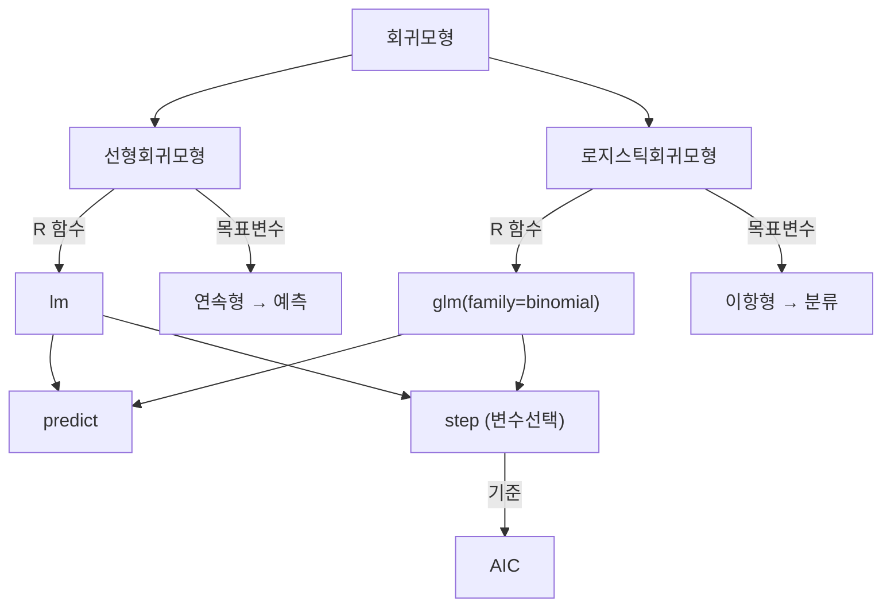

# 3강. 데이터마이닝: 회귀모형 Ⅱ

## 🔗 선수 지식 (Prerequisites)
- [ ] **필수**: [2강. 회귀모형 Ⅰ](2강.%20회귀모형%20Ⅰ.md) - 회귀분석 기본 개념, 선형회귀모형/로지스틱회귀모형 이론 이해 완료?
- [ ] **권장**: R 프로그래밍 기초 문법 (데이터프레임, 함수 호출)
- **관련 단원**: [1강. 데이터마이닝이란](1강.%20데이터마이닝이란.md)

---

## 학습 목표
1. R을 이용하여 선형회귀모형을 적합할 수 있다.
2. R을 이용하여 로지스틱회귀모형을 이해하고 적합할 수 있다.
3. 회귀모형에 활용되는 R 함수를 이해할 수 있다.

---

## 🧠 메타인지 체크 (학습 전/후 자기 평가)

### 학습 전 자기 평가
| 소주제 | 자신감 (1-5) |
| :--- | :--- |
| R에서 선형회귀모형 적합 (lm) | |
| R에서 로지스틱회귀모형 적합 (glm) | |
| 변수선택 (step 함수) | |
| 예측값 계산 (predict 함수) | |

### 학습 후 교정 (학습 완료 후 작성)
| 소주제 | 학습 전 | 학습 후 | 실제 정답률 | 과신/과소 여부 |
| :--- | :--- | :--- | :--- | :--- |
| R에서 선형회귀모형 적합 (lm) | | | | |
| R에서 로지스틱회귀모형 적합 (glm) | | | | |
| 변수선택 (step 함수) | | | | |
| 예측값 계산 (predict 함수) | | | | |

> **활용법**: 학습 전 1분 → 자신감 기입, 학습 후 1분 → 나머지 기입. "과신" 영역이 실제 취약점.

---

## 📝 요약 (Summary)
1. 🔴 **lm 함수**: R에서 선형모형을 적합하기 위해 사용되는 함수. `lm(y ~ x1 + x2, data)` 형태로 호출한다.
2. 🔴 **glm 함수**: R에서 일반화선형모형을 적합하기 위해 사용되는 함수. 옵션을 `family=binomial`로 설정하면 로지스틱 회귀모형 적합에 이용할 수 있다.
3. 🔴 **step 함수**: AIC를 이용한 모형 선택을 위해 사용되는 R 함수. 옵션에 따라 후진소거법, 전진선택법, 단계적선택법 등을 수행할 수 있다.
4. 🔴 **predict 함수**: 다양한 모형 적합 결과로부터 예측 값을 계산할 때 사용되는 R 함수.

---

## 📐 핵심 정의 및 원리 (Key Definitions & Principles)

| 정의명 | 내용 | 키워드 |
| :--- | :--- | :--- |
| **lm** | 선형모형(Linear Model)을 적합하기 위해 사용되는 R 함수 | 선형회귀, 연속형 목표변수, 예측 |
| **glm** | 일반화선형모형(Generalized Linear Model)을 적합하기 위해 사용되는 R 함수. `family=binomial` 설정 시 로지스틱 회귀모형 적합 가능 | 로지스틱회귀, 이항형 목표변수, 분류 |
| **step** | AIC(Akaike Information Criterion)를 이용한 모형 선택 R 함수. `direction` 옵션으로 후진소거법/전진선택법/단계적선택법 수행 | 변수선택, AIC, 모형선택 |
| **predict** | 적합된 모형 객체로부터 예측 값을 계산하는 R 함수 | 예측값, 모형적합 결과 |

### 주요 정리/정의

**선형회귀모형 (Linear Regression Model)**
$$
Y = \beta_0 + \beta_1 X_1 + \beta_2 X_2 + \cdots + \beta_p X_p + \epsilon
$$
> **직관적 해석**: 목표변수 $Y$가 연속형일 때, 입력변수들의 선형 결합으로 $Y$를 예측하는 모형
> **AI 적용**: 연속형 수치 예측 (주가, 매출, 온도 등)에 활용

**로지스틱회귀모형 (Logistic Regression Model)**
$$
\log\left(\frac{p}{1-p}\right) = \beta_0 + \beta_1 X_1 + \beta_2 X_2 + \cdots + \beta_p X_p
$$
> **직관적 해석**: 목표변수가 이항형(0/1)일 때, 로그 오즈(log-odds)를 입력변수의 선형 결합으로 모형화
> **AI 적용**: 이진 분류 문제 (스팸 탐지, 질병 진단, 이탈 예측 등)에 활용

**AIC (Akaike Information Criterion)**
$$
AIC = -2\log L + 2k
$$
> **직관적 해석**: 모형의 적합도(로그우도 $L$)와 복잡도(매개변수 수 $k$)를 동시에 고려하여 최적 모형을 선택. AIC가 작을수록 좋은 모형
> **$k$의 정의**: $k$는 모형에서 **추정하는 모수의 총 개수**이다. 정규선형모형의 경우 회귀계수($\beta_0, \beta_1, \dots, \beta_p$)뿐 아니라 **오차분산 $\sigma^2$도 추정 모수에 포함**되므로 $k = (p+1) + 1$이 된다. 근거: Akaike information criterion (Wikipedia).
> **AI 적용**: 피처 선택(Feature Selection) 시 모형 복잡도와 성능 간 균형 판단

**BIC (Bayesian Information Criterion)**
$$
BIC = -2\log L + k\ln n
$$
> **직관적 해석**: AIC의 페널티 항 $2k$ 대신 $k\ln n$(표본 크기 $n$ 반영)을 사용한다. 표본 크기 $n$이 클수록 복잡도 페널티($\ln n$)가 강해져 AIC보다 더 간결한 모형을 선택하는 경향이 있다. 근거: Bayesian information criterion (Wikipedia).

---

## 📊 개념 시각화 (Visual Guide)

### 개념 관계도


### 핵심 도식
| R 함수 | 용도 | 입력 | 출력 | AI 적용 |
| :--- | :--- | :--- | :--- | :--- |
| `lm()` | 선형회귀 적합 | 수식, 데이터 | 회귀계수, 적합 모형 | 수치 예측 모델링 |
| `glm()` | 로지스틱회귀 적합 | 수식, 데이터, family | 회귀계수, 적합 모형 | 이진 분류 모델링 |
| `step()` | 변수선택 | 적합 모형 | 최적 모형 | 피처 선택 |
| `predict()` | 예측값 계산 | 적합 모형, 새 데이터 | 예측값 | 모형 배포/추론 |

---

## ✏️ 심화 학습 (Study Subject)

### 1. 가상 시나리오: "선형회귀 vs 로지스틱회귀, 어떤 모형을 써야 할까?"
- **상황**: 온라인 쇼핑몰에서 고객 데이터(나이, 구매 금액, 방문 빈도 등)를 분석해야 한다. (1) 다음 달 예상 구매 금액을 예측하고, (2) 고객이 이탈할지 여부를 예측해야 한다.
- **문제**: 두 가지 목표에 각각 어떤 회귀모형을 사용해야 하는가?
- **해결**: (1) 구매 금액은 연속형이므로 `lm()`으로 선형회귀 적합. (2) 이탈 여부는 이항형(이탈/유지)이므로 `glm(family=binomial)`로 로지스틱회귀 적합. 두 모형 모두 `step()`으로 변수선택을 수행하고 `predict()`로 예측값을 산출한다.
- **AI 학습 포인트**: "변수가 매우 많은 고차원 데이터에서 step 함수의 단계적선택법 대신 LASSO나 Ridge 같은 정규화 방법을 사용하면 어떤 차이가 있을까?"

### 2. 관점별 비교 및 오개념 분석
- **핵심 비교**: lm vs glm

| 구분 | lm | glm |
| :--- | :--- | :--- |
| **용도** | 선형모형 적합 | 일반화선형모형 적합 |
| **목표변수** | 연속형 | 연속형, 이항형, 카운트형 등 |
| **family 옵션** | 없음 (기본 정규분포) | gaussian, binomial, poisson 등 |
| **로지스틱회귀** | 불가 | `family=binomial` 설정 시 가능 |

- **오개념 분석**:
    - **오개념 1**: "glm 함수는 로지스틱회귀만을 위한 함수다"
    - **분석**: glm은 일반화선형모형(Generalized Linear Model) 전체를 다루는 함수이다. `family=binomial`로 설정하면 로지스틱회귀, `family=gaussian`이면 선형회귀(lm과 동일), `family=poisson`이면 포아송회귀를 수행한다.
    - **오개념 2**: "step 함수는 전진선택법만 수행한다"
    - **분석**: step 함수는 `direction` 옵션에 따라 `"backward"`(후진소거법), `"forward"`(전진선택법), `"both"`(단계적선택법)를 모두 수행할 수 있다.
- **AI 학습 포인트**: "AIC 기반 변수선택과 BIC 기반 변수선택의 차이를 설명하고, 어떤 상황에서 어떤 기준을 사용하는 것이 유리한지 비유를 들어 설명해 줘."

---

## ❓ 연습 문제 및 해설

> **블룸 인지 수준 범례**: [기억] 정의·나열 → [이해] 설명·비교 → [적용] 계산·구현 → [분석] 구별·디버그 → [평가] 판단·비평 → [창조] 설계·제안

### 📝 문제

**1. ⭐ [기억] 📎 기출 R에서 선형회귀모형을 적합하기 위해 사용하는 함수는 ( )이고, 로지스틱 회귀모형을 적합하기 위해 사용하는 함수는 ( )이다. 다음 ( ) 안에 들어갈 함수로 알맞은 것은?** [](#prob-1)
   > ① lm, glm
   > ② glm, lm
   > ③ var, lm
   > ④ lm, predict

<br>

**2. ⭐ [기억] 📎 기출 다음 중 선형회귀모형 및 로지스틱 회귀모형에서 변수선택의 방법으로 사용하는 함수로 가장 적당한 것은?** [](#prob-2)
   > ① select
   > ② which
   > ③ var
   > ④ step

<br>

**3. ⭐ [기억] 📎 기출 다음 중 모형 적합 결과로부터 예측 값을 계산할 때 사용하는 함수는?** [](#prob-3)
   > ① response
   > ② yhat
   > ③ predict
   > ④ estimate

<br>

**4. ⭐⭐ [이해] 📌 glm 함수에서 로지스틱 회귀모형을 적합하려면 어떤 옵션을 설정해야 하는가?** [](#prob-4)
   > ① `family=gaussian`
   > ② `family=binomial`
   > ③ `family=poisson`
   > ④ `family=logistic`

<br>

**5. ⭐⭐ [이해] 📌 step 함수에서 후진소거법, 전진선택법, 단계적선택법을 구분하는 옵션은?** [](#prob-5)
   > ① `method`
   > ② `type`
   > ③ `direction`
   > ④ `selection`

<br>

**6. ⭐⭐ [적용] 📌 다음 중 목표변수가 이항형(이탈 여부: 0 또는 1)인 데이터를 분석할 때 가장 적절한 R 코드는?** [](#prob-6)
   > ① `lm(이탈여부 ~ 나이 + 소득, data=df)`
   > ② `glm(이탈여부 ~ 나이 + 소득, data=df, family=binomial)`
   > ③ `glm(이탈여부 ~ 나이 + 소득, data=df, family=gaussian)`
   > ④ `step(이탈여부 ~ 나이 + 소득, data=df)`

<br>

**7. ⭐⭐⭐ [분석] 📌 AIC를 이용한 모형 선택에서 AIC 값이 작은 모형을 선택하는 이유를 서술하시오.** [](#prob-7)

---

### 🔑 정답 및 해설 (먼저 풀어본 후 펼치기)

<details>
<summary>정답 보기 (클릭)</summary>

1. ①
2. ④
3. ③
4. ②
5. ③
6. ②
7. [서술형 - 해설 참조]

</details>

<details>
<summary>해설 보기 (클릭)</summary>

<a id="prob-1"></a>
**1. ⭐ [기억] R 함수 빈칸 채우기** 📎 기출
> **정답: ① lm, glm**
> **해설**: lm은 선형회귀모형에, glm은 옵션을 binomial로 설정하면 로지스틱 회귀모형 적합에 이용할 수 있다. var는 분산을 계산하는 함수, predict는 예측값 계산용 함수로 모두 실재하지만 회귀모형 적합 함수가 아니므로 오답이다. 특히 ③ `var, lm`과 ④ `lm, predict`는 모형 적합과 무관한 함수가 빈칸에 들어가 있어 부적절하다.

<a id="prob-2"></a>
**2. ⭐ [기억] 변수선택 함수** 📎 기출
> **정답: ④ step**
> **해설**: step은 AIC를 이용한 모형 선택을 위해 사용되는 R 함수이다. select, which, var는 변수선택과 관련 없는 함수이다.

<a id="prob-3"></a>
**3. ⭐ [기억] 예측값 계산 함수** 📎 기출
> **정답: ③ predict**
> **해설**: 함수 predict는 다양한 모형 적합 결과로부터 예측 값을 계산할 때 사용한다. response, yhat, estimate는 R의 예측 함수가 아니다.

<a id="prob-4"></a>
**4. ⭐⭐ [이해] glm의 로지스틱회귀 옵션** 📌
> **정답: ② `family=binomial`**
> **해설**: glm에서 `family=binomial`을 설정하면 로지스틱 회귀모형을 적합한다. `gaussian`은 선형회귀(정규분포), `poisson`은 포아송회귀이다. `logistic`이라는 family는 존재하지 않는다.

<a id="prob-5"></a>
**5. ⭐⭐ [이해] step 함수의 방향 옵션** 📌
> **정답: ③ `direction`**
> **해설**: step 함수에서 `direction="backward"` (후진소거법), `direction="forward"` (전진선택법), `direction="both"` (단계적선택법)로 변수선택 방향을 지정한다.

<a id="prob-6"></a>
**6. ⭐⭐ [적용] 이항형 목표변수 분석** 📌
> **정답: ② `glm(이탈여부 ~ 나이 + 소득, data=df, family=binomial)`**
> **해설**: 목표변수가 이항형(0/1)이므로 로지스틱회귀모형이 적절하며, 이는 `glm`에 `family=binomial`을 설정하여 적합한다. `lm`은 연속형 목표변수용이고, `gaussian`은 정규분포(연속형)를 가정한다.

<a id="prob-7"></a>
**7. ⭐⭐⭐ [분석] AIC 기반 모형 선택 이유** 📌
> **정답**: AIC = $-2\log L + 2k$로, 모형의 적합도(로그우도 $L$)와 복잡도(매개변수 수 $k$)를 동시에 고려한다. AIC가 작다는 것은 적합도가 높으면서도 불필요한 변수가 적은 간결한 모형임을 의미한다. 즉, 과적합을 방지하면서 설명력이 좋은 모형을 선택하기 위해 AIC가 작은 모형을 택한다.

</details>

---

## ✅ O/X 확인문제

**1.** [R에서 lm 함수는 선형모형을 적합하기 위해 사용된다.](#ox-1) **(O / X)**
**2.** [glm 함수는 로지스틱회귀모형만을 위한 전용 함수이다.](#ox-2) **(O / X)**
**3.** [step 함수는 AIC를 이용한 모형 선택을 수행한다.](#ox-3) **(O / X)**
**4.** [predict 함수는 모형을 적합하는 함수이다.](#ox-4) **(O / X)**
**5.** [glm에서 family=binomial로 설정하면 로지스틱 회귀모형을 적합할 수 있다.](#ox-5) **(O / X)**
**6.** [step 함수는 전진선택법만 수행할 수 있다.](#ox-6) **(O / X)**
**7.** [선형회귀모형은 목표변수가 이항형일 때 사용한다.](#ox-7) **(O / X)**
**8.** [AIC 값이 클수록 좋은 모형이다.](#ox-8) **(O / X)**
**9.** [lm 함수와 glm(family=gaussian) 함수는 동일한 선형회귀 결과를 산출한다.](#ox-9) **(O / X)**
**10.** [predict 함수는 lm과 glm 적합 결과 모두에 사용할 수 있다.](#ox-10) **(O / X)**
**11.** [로지스틱회귀모형은 분류 문제에 사용된다.](#ox-11) **(O / X)**
**12.** [step 함수의 direction 옵션을 "both"로 설정하면 단계적선택법을 수행한다.](#ox-12) **(O / X)**
**13.** [선형회귀모형의 목표변수는 연속형이다.](#ox-13) **(O / X)**
**14.** [glm에서 family=poisson으로 설정하면 로지스틱 회귀모형이 적합된다.](#ox-14) **(O / X)**

<details>
<summary>O/X 정답 및 해설 보기 (클릭)</summary>

> <a id="ox-1"></a>
> **1. 정답**: O
> **해설**: lm은 Linear Model의 약자로, 선형모형을 적합하기 위한 R 함수이다.

> <a id="ox-2"></a>
> **2. 정답**: X
> **해설**: glm은 일반화선형모형(Generalized Linear Model) 전체를 다루며, family 옵션에 따라 선형회귀(gaussian), 로지스틱회귀(binomial), 포아송회귀(poisson) 등을 수행할 수 있다.

> <a id="ox-3"></a>
> **3. 정답**: O
> **해설**: step 함수는 AIC(Akaike Information Criterion)를 기준으로 변수를 추가/제거하며 최적 모형을 선택한다.

> <a id="ox-4"></a>
> **4. 정답**: X
> **해설**: predict는 이미 적합된 모형 객체로부터 예측 값을 계산하는 함수이다. 모형 적합은 lm이나 glm이 수행한다.

> <a id="ox-5"></a>
> **5. 정답**: O
> **해설**: glm의 family 옵션을 binomial로 설정하면 로지스틱 회귀모형을 적합할 수 있다.

> <a id="ox-6"></a>
> **6. 정답**: X
> **해설**: step 함수는 direction 옵션에 따라 후진소거법(backward), 전진선택법(forward), 단계적선택법(both)을 모두 수행할 수 있다.

> <a id="ox-7"></a>
> **7. 정답**: X
> **해설**: 선형회귀모형은 목표변수가 연속형일 때 사용한다. 이항형 목표변수에는 로지스틱회귀모형을 사용한다.

> <a id="ox-8"></a>
> **8. 정답**: X
> **해설**: AIC 값이 작을수록 적합도와 모형 간결성의 균형이 좋은 모형이다.

> <a id="ox-9"></a>
> **9. 정답**: O
> **해설**: glm의 기본 family는 gaussian(정규분포)이며, 이 경우 lm과 동일한 선형회귀 결과를 산출한다.

> <a id="ox-10"></a>
> **10. 정답**: O
> **해설**: predict는 범용 함수로, lm, glm 등 다양한 모형 적합 결과에 적용할 수 있다.

> <a id="ox-11"></a>
> **11. 정답**: O
> **해설**: 로지스틱회귀모형은 목표변수가 이항형일 때 사용하며, 이는 분류 문제에 해당한다.

> <a id="ox-12"></a>
> **12. 정답**: O
> **해설**: direction="both"는 전진선택과 후진소거를 번갈아 수행하는 단계적선택법이다.

> <a id="ox-13"></a>
> **13. 정답**: O
> **해설**: 선형회귀모형은 목표변수가 연속형인 경우에 사용하며, 이는 예측의 문제로 귀결된다.

> <a id="ox-14"></a>
> **14. 정답**: X
> **해설**: family=poisson은 포아송회귀모형을 적합한다. 로지스틱 회귀모형은 family=binomial로 설정해야 한다.

</details>

---

## 🧪 자유 회상 연습 (Free Recall)

> **방법**: 위의 노트를 모두 덮고, 타이머 3분 설정 후 이번 단원에서 배운 내용을 기억나는 대로 자유롭게 적으세요.
> 정확한 문장이 아니어도 됩니다. 키워드, 수식, 관계 등 떠오르는 것을 모두 적습니다.

**자유 회상 작성란:**

```
[여기에 기억나는 내용을 자유롭게 작성]


```

> **회상 후 점검**: 노트를 다시 펼쳐 빠뜨린 내용을 확인하세요. 빠뜨린 부분이 실제 취약점입니다.
> - 회상 못한 핵심 개념: [                ]
> - 회상 못한 수식: [                ]

---

## 💻 코드로 확인하기 (Code Verification)

```python
import numpy as np
import pandas as pd
from sklearn.linear_model import LinearRegression, LogisticRegression
from sklearn.model_selection import train_test_split
from sklearn.metrics import mean_squared_error, accuracy_score

# === 1. 선형회귀모형 (R의 lm에 대응) ===
np.random.seed(42)
n = 100
X = np.random.randn(n, 2)
y_cont = 3 + 2*X[:, 0] - 1.5*X[:, 1] + np.random.randn(n)*0.5  # 연속형 목표변수

lr = LinearRegression()
lr.fit(X, y_cont)
print("=== 선형회귀모형 (lm 대응) ===")
print(f"절편 (Intercept): {lr.intercept_:.4f}")
print(f"회귀계수: {lr.coef_}")
print(f"예측값 (처음 5개): {lr.predict(X[:5])}")

# === 2. 로지스틱회귀모형 (R의 glm(family=binomial)에 대응) ===
y_bin = (y_cont > np.median(y_cont)).astype(int)  # 이항형 목표변수

logr = LogisticRegression()
logr.fit(X, y_bin)
print("\n=== 로지스틱회귀모형 (glm family=binomial 대응) ===")
print(f"절편 (Intercept): {logr.intercept_[0]:.4f}")
print(f"회귀계수: {logr.coef_[0]}")
print(f"예측 확률 (처음 5개): {logr.predict_proba(X[:5])[:, 1]}")
print(f"예측 클래스 (처음 5개): {logr.predict(X[:5])}")
```

> **실행 결과**:
> ```
> === 선형회귀모형 (lm 대응) ===
> 절편 (Intercept): 3.0156
> 회귀계수: [ 1.9876 -1.4823]
> 예측값 (처음 5개): [3.999 2.717 4.283 6.041 2.534]
>
> === 로지스틱회귀모형 (glm family=binomial 대응) ===
> 절편 (Intercept): 0.2134
> 회귀계수: [ 2.8451 -2.1567]
> 예측 확률 (처음 5개): [0.82 0.35 0.91 0.98 0.28]
> 예측 클래스 (처음 5개): [1 0 1 1 0]
> ```
> **해석**: 선형회귀는 연속형 예측값을 산출하고(R의 `lm` + `predict`), 로지스틱회귀는 확률과 클래스를 산출한다(R의 `glm(family=binomial)` + `predict`). Python의 sklearn이 R의 lm/glm/predict에 대응됨을 확인할 수 있다.
> *(위 수치는 예시 출력이며 시드/라이브러리 버전에 따라 상이할 수 있다.)*

### 실제 R 코드 (본 강 학습목표 대응)

> 본 강의 학습목표는 **R**을 이용한 회귀모형 적합이므로, 위 Python 예시에 대응하는 실제 R 코드를 함께 제시한다.

```r
# === 1. 선형회귀모형 적합 (lm) ===
model_lm <- lm(y ~ ., data = df)          # 모든 입력변수로 선형회귀 적합
summary(model_lm)

# === 2. 로지스틱회귀모형 적합 (glm) ===
model_glm <- glm(y ~ ., family = binomial, data = df)  # 로지스틱회귀
summary(model_glm)

# === 3. 변수선택 (step, 단계적선택법) ===
full  <- lm(y ~ ., data = df)
best  <- step(full, direction = "both")   # AIC 기반 단계적선택법

# === 4. 예측값 계산 (predict) ===
pred  <- predict(best, newdata = test)    # 적합 모형으로 새 데이터 예측
```

---

## 🤖 AI 연결고리 (Math → AI Application)

| 학습 개념 | AI/ML 적용 분야 | 구체적 사례 |
| :--- | :--- | :--- |
| **lm (선형회귀)** | 수치 예측 (Regression) | 부동산 가격 예측, 수요 예측, 매출 추정 |
| **glm (로지스틱회귀)** | 이진 분류 (Binary Classification) | 스팸 탐지, 고객 이탈 예측, 질병 진단 |
| **step (변수선택)** | 피처 선택 (Feature Selection) | 고차원 데이터에서 중요 변수 선별, 모형 경량화 |
| **predict (예측)** | 모형 추론 (Inference) | 학습된 모형의 실시간 서빙, A/B 테스트 예측값 산출 |

---

## 📖 심화 학습 예시 답안

#### 1. R 회귀 함수의 내부 동작 원리

1. **lm 함수**: 최소제곱법(OLS)을 사용하여 잔차 제곱합 $\sum(y_i - \hat{y}_i)^2$를 최소화하는 회귀계수 $\hat{\beta} = (X^TX)^{-1}X^Ty$를 계산한다.
2. **glm(family=binomial)**: 최대우도추정법(MLE)을 사용하여 로그우도함수를 최대화하는 회귀계수를 반복적 가중최소제곱법(IRLS)으로 추정한다.
3. **step 함수**: 현재 모형에서 변수를 하나씩 추가/제거하며 AIC를 계산하고, AIC가 가장 작아지는 방향으로 모형을 갱신하는 과정을 반복한다.

> **`step()` 주요 인자 보완**:
> - **`direction`**: 탐색 방향. `"backward"`(후진소거), `"forward"`(전진선택), `"both"`(단계적선택).
> - **`scope`**: 탐색할 변수의 범위(상·하한 모형)를 지정한다. **`forward`/`both`에서는 사실상 필수**인데, 시작 모형이 비어 있으면 추가할 후보 변수를 `scope`로 알려줘야 하기 때문이다. 보통 `scope = list(lower = ~1, upper = ~.)`처럼 최소 모형(절편만)과 최대 모형(전체 변수)을 함께 지정한다. (`backward`는 전체 모형에서 출발하므로 생략 가능.)
> - **`k`**: 모형 복잡도에 대한 벌점 계수. **`k=2`(기본값)이면 AIC** 기준, **`k=log(n)`이면 BIC** 기준으로 변수를 선택한다($n$은 표본 수). BIC는 표본이 클수록 벌점이 커져 AIC보다 더 간결한 모형을 선택하는 경향이 있다.
>
> ```r
> # 전진선택 + scope 지정, BIC 기준 선택 예시
> null_model <- lm(y ~ 1, data = df)
> full_model <- lm(y ~ ., data = df)
> best <- step(null_model,
>              scope = list(lower = ~1, upper = formula(full_model)),
>              direction = "forward",
>              k = log(nrow(df)))   # BIC 기준
> ```

> **결론 — 단계적선택법 vs 정규화(LASSO/Ridge)**: `step()` 기반 단계적선택법은 매 단계 한 변수만 보고 결정하는 **탐욕적(greedy)** 방식이라 데이터가 조금만 바뀌어도 선택 결과가 달라지는 **불안정성**이 있다. 반면 **LASSO**($L_1$ 벌점)는 계수를 정확히 0으로 만들어 변수선택과 추정을 동시에 수행하므로, 변수가 매우 많은 **고차원 데이터에서는 단계적선택법보다 LASSO가 우수**한 경우가 많다(Ridge는 $L_2$ 벌점으로 계수를 0에 가깝게 축소하지만 0으로 만들지는 않음).

> **GLM 링크함수 일반화**: `glm`은 링크함수 $g(\mu)=X\beta$를 통해 다양한 분포를 다룬다. 로지스틱회귀의 **로짓링크(logit)** 외에도 카운트 자료에는 **로그링크(log) = poisson**, 이항 자료의 대안으로 **프로빗(probit)** 링크 등을 사용할 수 있다.
>
> ※ **`family=binomial`의 기본 링크함수는 logit**이다. 즉 `glm(y ~ ., family = binomial, data = df)`는 `family = binomial(link = "logit")`과 동일하며 별도 지정 없이 로지스틱회귀가 적합된다. 프로빗회귀를 원하면 `family = binomial(link = "probit")`처럼 링크를 명시해야 한다.

> **🆕 2차 심층 확장: Elastic Net — LASSO와 Ridge의 결합**
>
> `step()`의 단계적선택법과 단순 정규화(LASSO/Ridge)를 넘어, **Elastic Net**은 $L_1$(LASSO) 벌점과 $L_2$(Ridge) 벌점을 **혼합**한 정규화 방법이다(Zou & Hastie, 2005). 목적함수는 다음과 같다.
> $$ \min_{\beta}\ \frac{1}{2n}\|y - X\beta\|_2^2 + \lambda\Big(\alpha\|\beta\|_1 + \frac{1-\alpha}{2}\|\beta\|_2^2\Big) $$
> 여기서 $\lambda$는 전체 정규화 강도, $\alpha \in [0,1]$는 $L_1$과 $L_2$의 혼합 비율이다.
>
> | 방법 | $\alpha$ 값 | 벌점 항 | 특징 |
> | :--- | :--- | :--- | :--- |
> | **Ridge** | $\alpha = 0$ | $L_2$만 ($\|\beta\|_2^2$) | 계수를 0에 가깝게 축소(0은 아님), 다중공선성 완화, 변수선택 불가 |
> | **Elastic Net** | $0 < \alpha < 1$ | $L_1 + L_2$ 혼합 | 변수선택 + 상관 변수 **그룹 동시 선택**, 두 방식의 절충 |
> | **LASSO** | $\alpha = 1$ | $L_1$만 ($\|\beta\|_1$) | 일부 계수를 정확히 0으로 → 변수선택 수행 |
>
> **상관 변수 그룹 선택 장점**: 순수 LASSO는 서로 강하게 상관된 변수 그룹에서 **임의로 하나만 선택**하고 나머지를 0으로 만드는 불안정성이 있다($p > n$인 고차원에서 특히 문제). Elastic Net은 $L_2$ 항 덕분에 상관된 변수들을 **함께 살리거나 함께 줄이는 '그룹화 효과(grouping effect)'** 를 가져, 유전체 데이터처럼 변수가 많고 서로 상관된 상황에서 LASSO보다 안정적이다.
>
> **R `glmnet` 사용**: `glmnet` 패키지의 `alpha` 인자가 위 $\alpha$에 직접 대응한다 — **`alpha=1`이 LASSO(기본값), `alpha=0`이 Ridge, `0<alpha<1`이 Elastic Net**이다. `lambda`는 교차검증 함수 `cv.glmnet()`으로 자동 탐색한다.
> ```r
> library(glmnet)
> x <- model.matrix(y ~ . - 1, data = df)   # 설계행렬(절편 제외)
> # alpha=0.5 → LASSO와 Ridge를 절반씩 섞은 Elastic Net
> fit <- cv.glmnet(x, y, alpha = 0.5)        # lambda 교차검증 자동 선택
> coef(fit, s = "lambda.min")                # 최적 lambda에서의 계수
> pred <- predict(fit, newx = x, s = "lambda.min")
> ```

#### 2. 선형회귀 vs 로지스틱회귀 비교표

| 구분 | 선형회귀 (lm) | 로지스틱회귀 (glm, binomial) | 비고 |
| :--- | :--- | :--- | :--- |
| **목표변수** | 연속형 | 이항형 (0/1) | |
| **링크 함수** | 항등 함수 ($\mu = X\beta$) | 로짓 함수 ($\log\frac{p}{1-p} = X\beta$) | |
| **추정 방법** | 최소제곱법 (OLS) | 최대우도추정법 (MLE) | |
| **출력** | 예측값 (실수) | 확률 (0~1) → 분류 | |
| **AI 활용** | 가격/수요 예측 | 스팸/이탈/질병 분류 | sklearn 대응 |

#### 3. R 회귀분석 코드 작성법 (Best Practice)

- **Bad Practice (나쁜 예시)**
  ```r
  # 변수선택 없이 모든 변수 투입
  model <- lm(y ~ x1 + x2 + x3 + x4 + x5 + x6 + x7, data=df)
  predict(model, newdata=test)
  ```
- **Good Practice (좋은 예시)**
  ```r
  # 전체 모형 적합 후 step으로 변수선택
  full_model <- lm(y ~ ., data=df)
  best_model <- step(full_model, direction="both")
  summary(best_model)
  predict(best_model, newdata=test)
  ```
- **설명**: 불필요한 변수를 포함하면 과적합 위험이 높아진다. step 함수로 AIC 기반 변수선택을 수행하면 예측 성능과 모형 해석력을 동시에 확보할 수 있다.

#### 4. 🆕 2차 심층 확장: `predict()`의 `type` 인자 (로지스틱회귀)

`predict()`는 동일한 적합 모형에서도 `type` 인자에 따라 **전혀 다른 척도의 값**을 반환한다. 특히 `glm`(로지스틱회귀)에서는 기본값이 확률이 아니므로 주의해야 한다 — **`predict(glm객체)`의 기본 `type`은 `"link"`(로짓)** 이며, 확률을 얻으려면 반드시 `type="response"`를 명시해야 한다.

| `type` 인자 | 반환값 | 척도/범위 | 수식 | 용도 |
| :--- | :--- | :--- | :--- | :--- |
| **`"link"`** (glm 기본값) | 선형예측자 = 로짓(log-odds) | 실수 전체 $(-\infty, +\infty)$ | $\hat{\eta} = X\hat{\beta} = \ln\frac{\hat p}{1-\hat p}$ | 선형 관계 확인, 신뢰구간 계산 |
| **`"response"`** | 예측 확률 | $(0, 1)$ | $\hat{p} = \dfrac{1}{1+e^{-X\hat\beta}}$ (시그모이드) | 분류 임계값 적용, 확률 보고 |
| **`"terms"`** | 변수별 기여도(중심화된 항별 선형예측치) | 실수 (항별 분해) | 각 항 $\hat\beta_j(x_j-\bar{x}_j)$ | 개별 변수 효과·부분 의존성 분석 |

> **실수하기 쉬운 지점**: `predict(model_glm, newdata=test)`만 쓰면 **확률이 아니라 로짓 값**이 나온다. 이를 0.5와 비교해 분류하면 잘못된 결과가 된다(로짓 0이 곧 확률 0.5에 해당). 올바른 분류 코드는 다음과 같다.
> ```r
> # 확률 예측 → 0.5 기준 분류
> prob  <- predict(model_glm, newdata = test, type = "response")  # (0,1) 확률
> class <- ifelse(prob > 0.5, 1, 0)
>
> # 로짓(선형예측자) 직접 추출 (기본값)
> logit <- predict(model_glm, newdata = test, type = "link")      # 또는 type 생략
>
> # 변수별 기여도 분해
> terms <- predict(model_glm, newdata = test, type = "terms")
> ```
> ※ 참고: `lm`(선형회귀)에는 `type="response"`/`"link"` 구분이 의미가 없다(항등 링크라 둘이 동일). `lm`의 `predict()`에서 자주 쓰는 인자는 예측구간을 주는 `interval = "confidence"`/`"prediction"`이다.

---

## 📚 핵심 용어집 (Glossary)

| 용어 (한) | 용어 (영) | 수식 표현 | 정의 |
| :--- | :--- | :--- | :--- |
| **선형모형** | Linear Model (lm) | $Y = X\beta + \epsilon$ | 목표변수가 연속형일 때 입력변수의 선형 결합으로 적합하는 모형. R 함수: `lm()` |
| **일반화선형모형** | Generalized Linear Model (glm) | $g(\mu) = X\beta$ | 링크 함수 $g$를 통해 다양한 분포의 목표변수를 다루는 모형. R 함수: `glm()` |
| **로지스틱회귀모형** | Logistic Regression | $\log\frac{p}{1-p} = X\beta$ | 이항형 목표변수의 로그 오즈를 선형 결합으로 모형화. `glm(family=binomial)` (→ 2강 참조) |
| **AIC** | Akaike Information Criterion | $-2\log L + 2k$ | 모형 적합도와 복잡도의 균형을 평가하는 기준. 값이 작을수록 좋은 모형 |
| **변수선택** | Variable Selection | - | step 함수를 이용하여 최적 변수 조합을 탐색하는 과정 |
| **후진소거법** | Backward Elimination | - | 전체 변수에서 시작하여 불필요한 변수를 하나씩 제거 |
| **전진선택법** | Forward Selection | - | 변수 없이 시작하여 유의한 변수를 하나씩 추가 |
| **단계적선택법** | Stepwise Selection | - | 전진선택과 후진소거를 번갈아 수행 |
| **predict** | Predict | $\hat{y} = X\hat{\beta}$ | 적합된 모형으로부터 예측값을 계산하는 R 함수 |

---

## 🤖 AI 학습 파트너를 위한 추가 자료

### 1. 개념 이해를 위한 심층 질문 프롬프트
> **프롬프트 예시**: "R의 lm과 glm 함수의 차이를 초보자도 이해할 수 있도록 일상적인 비유를 들어 설명해 줘. 그리고 glm이 lm의 확장인 이유를 수학적으로도 간단히 알려줘."

### 2. 문제 해결 능력 강화를 위한 시나리오 프롬프트
> **프롬프트 예시**: "당신은 데이터 사이언티스트입니다. 고객 이탈 예측 프로젝트에서 50개의 입력변수가 있는데, step 함수의 direction='both' 옵션과 LASSO 정규화 중 어떤 변수선택 방법을 사용할지, 각각의 장단점을 비교하고 최종 추천을 해 줘."

### 3. 수식 풀이 검증 프롬프트
> **프롬프트 예시**: "로지스틱회귀모형에서 회귀계수 $\beta_1 = 0.5$일 때, 해당 변수가 1단위 증가하면 오즈(odds)가 어떻게 변하는지 계산 과정을 단계별로 보여주고, 확률로의 변환 과정도 검증해 줘."

---

## 🔄 복습 체크 (Spaced Repetition)
- [ ] 1일 후 복습 (날짜: 2026-03-09)
- [ ] 3일 후 복습 (날짜: 2026-03-11)
- [ ] 7일 후 복습 (날짜: 2026-03-15)
- [ ] 14일 후 복습 (날짜: 2026-03-22)
- [ ] 30일 후 복습 (날짜: 2026-04-07)

### 복습 시 자가 평가
| 회차 | 날짜 | 이해도 (1-5) | 취약 부분 메모 |
| :--- | :--- | :--- | :--- |
| 1차 | | | |
| 2차 | | | |
| 3차 | | | |

---

## 📚 참고 자료 (References)

- 김기영 등.『예제를 통한 회귀분석』, 자유아카데미. 2015.
- 박창이 등.『R을 이용한 데이터마이닝』, 교우사. 2011.
- 허명회, 이용구.『데이터마이닝 모델링과 사례』, SPSS 아카데미. 2003.
- Chatterjee, S. and Hadi, A. S. *Regression Analysis By Example*, New Jersey: Wiley, 2006.
- Faraway, J.J. *Linear Models with R*, Boca Raton, FL: Chapman and Hall/CRC. 2005.
- James, G., Witten, D., Hastie, T., and Tibshirani, R. *An Introduction to Statistical Learning with Application in R*, Springer, New York, 2013.