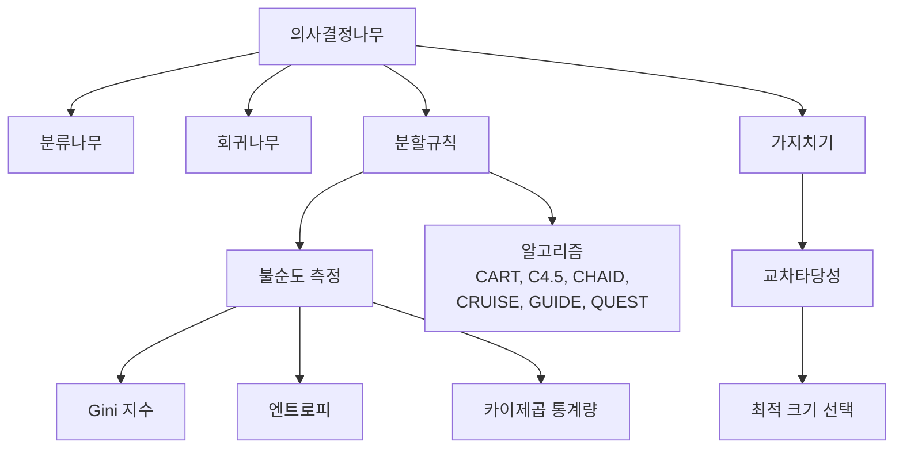
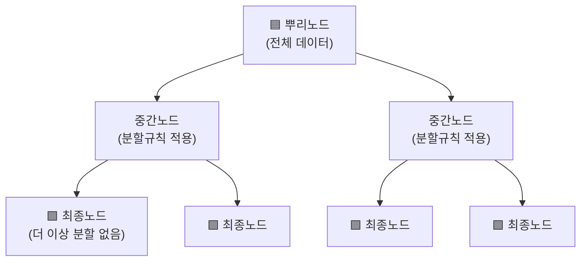

# 04. 데이터마이닝: 의사결정나무 Ⅰ

## 🔗 선수 지식 (Prerequisites)
- [ ] **필수**: [3강 데이터마이닝 기본 개념](3강.%20데이터마이닝%20기본%20개념.md) - 분류분석·회귀분석 이해 완료?
- [ ] **권장**: 확률/통계 기초 (조건부 확률, 엔트로피 개념)
- **관련 단원**: →←5강 의사결정나무 Ⅱ

---

## 학습 목표
1. 의사결정나무의 원리를 이해할 수 있다.
2. 의사결정나무의 분할 법칙을 설명할 수 있다.
3. 의사결정나무의 가지치기 원리를 이해하여 적절한 크기의 의사결정나무를 선택할 수 있다.

---

## 🧠 메타인지 체크 (학습 전/후 자기 평가)

### 학습 전 자기 평가
| 소주제 | 자신감 (1-5) |
| :--- | :--- |
| 의사결정나무 구조 (노드, 뿌리, 최종노드) | |
| 불순도와 분할 법칙 (Gini, 엔트로피) | |
| 가지치기와 교차타당성 | |
| 분류나무 vs 회귀나무 | |

### 학습 후 교정 (학습 완료 후 작성)
| 소주제 | 학습 전 | 학습 후 | 실제 정답률 | 과신/과소 여부 |
| :--- | :--- | :--- | :--- | :--- |
| 의사결정나무 구조 | | | | |
| 불순도와 분할 법칙 | | | | |
| 가지치기와 교차타당성 | | | | |
| 분류나무 vs 회귀나무 | | | | |

> **활용법**: 학습 전 1분 → 자신감 기입, 학습 후 1분 → 나머지 기입. "과신" 영역이 실제 취약점.

---

## 📝 요약 (Summary)
1. 🔴 **의사결정나무 개념**: 나무구조를 이용하여 데이터 분석과정을 도형화하고 분류분석 혹은 회귀분석을 수행하는 데이터마이닝의 대표적 분석기법이다. 분석의 목적과 목표변수의 형태에 따라 분류나무 혹은 회귀나무로 구분한다.
2. 🔴 **분할규칙과 불순도**: 의사결정나무는 데이터를 분할하는 분할규칙과 불필요한 가지를 제거하는 가지치기(pruning)로 구성된다. 분할 시 불순도(이질적인 자료가 포함된 정도)를 최소화하는 방향으로 진행한다.
3. 🔴 **분할 알고리즘**: 분할 방법에 따라 CART, C4.5, CHAID, CRUISE, GUIDE, QUEST 등의 방법들이 사용 가능하다.
4. 🟡 **가지치기**: 교차타당성(cross-validation) 방법을 통해 최적 크기의 의사결정나무를 선택하는 기법이다. 나무를 최대로 만든 후 분류성능 향상에 도움이 되지 못하는 가지를 잘라낸다.
5. 🟡 **장점**: 분석결과를 이해하기 쉽고, 대용량 데이터에 대한 분류 및 예측이 용이하며, 입력변수의 형태에 관계없이 적용할 수 있다.
6. 🟡 **단점**: 분류/예측 성과가 다른 모형보다 떨어질 수 있으며, 데이터의 변형에 따라 나무 구조가 쉽게 변경될 수 있다. 또한 과대적합된 모형이 작성되기 쉬워 예측력이 낮을 가능성이 높다.

---

## 📐 핵심 정의 및 원리 (Key Definitions)

| 정의명 | 내용 | 키워드 |
| :--- | :--- | :--- |
| **분류나무** | 목표변수가 이산형변수인 경우에 사용하는 의사결정나무 | 이산형, 분류 |
| **회귀나무** | 목표변수가 연속형변수인 경우에 사용하는 의사결정나무. 분류나무 알고리즘을 응용하여 구현 가능 | 연속형, 회귀 |
| **분할(Split)** | 나무구조의 매 단계마다 가급적 같은 성질의 관찰치들이 모이도록 집단을 나누어가는 것 | 동질성, 규칙 |
| **불순도(Impurity)** | 이질적인 자료가 포함되어 있는 정도. Gini 지수, 엔트로피 등으로 측정 | Gini, 엔트로피 |
| **가지치기(Pruning)** | 나무를 최대로 만든 후, 분류성능 향상에 도움이 되지 못하는 가지를 잘라내는 것 | 과대적합 방지, 교차타당성 |

### 주요 수식

**Gini 지수 (Gini Index)**
$$
Gini(t) = 1 - \sum_{k=1}^{K} p_k^2
$$
> **직관적 해석**: 노드 $t$에서 각 클래스 $k$의 비율 $p_k$를 제곱하여 합한 값을 1에서 뺀 것. 값이 0에 가까울수록 순수(동질적)하고, 값이 클수록 불순하다.
> **AI 적용**: sklearn의 `DecisionTreeClassifier`에서 기본 분할 기준(`criterion='gini'`)으로 사용된다.

**계산 예시**: 노드에 A가 6개, B가 1개인 경우
$$
Gini = 1 - \left(\frac{6}{7}\right)^2 - \left(\frac{1}{7}\right)^2 = 1 - \frac{36}{49} - \frac{1}{49} = \frac{12}{49} \approx 0.2449
$$

> **Gini 지수의 최대값**: K개의 클래스가 균등하게 분포($p_k = 1/K$)할 때 불순도가 최대가 되며, 이때 $Gini_{max} = 1 - 1/K$이다. (이진 분류 $K=2$일 때 최대 0.5)

**엔트로피 (Entropy)와 정보이득 (Information Gain)**
$$
Entropy(t) = -\sum_{k=1}^{K} p_k \log_2 p_k
$$
$$
IG = Entropy(parent) - \sum_{j} \frac{n_j}{n} Entropy(child_j)
$$
> **직관적 해석**: 엔트로피는 노드 $t$의 불확실성(혼란도)을 측정하며, 한 클래스만 존재하면 0, 균등 분포일 때 최대($\log_2 K$)가 된다. 정보이득 $IG$는 분할 전 부모 노드의 엔트로피에서 분할 후 자식 노드들의 가중 평균 엔트로피를 뺀 값으로, 이 값이 클수록 분할 효과가 크다. C4.5는 정보이득(또는 정보이득비)을 분할 기준으로 사용한다.

**정보이득비 (Gain Ratio)**
$$
GainRatio = \frac{IG}{SplitInfo}, \qquad SplitInfo = -\sum_{j} \frac{n_j}{n} \log_2 \frac{n_j}{n}
$$
> **직관적 해석**: 정보이득($IG$)은 분할 가지 수가 많은(범주 수준이 많은) 변수를 무조건 선호하는 **다수범주 편향**이 있다. 예컨대 고객ID처럼 거의 모든 관측치가 서로 다른 값을 갖는 변수로 분할하면 자식 노드가 모두 순수해져 $IG$가 과도하게 커지지만, 이는 일반화에 무의미하다. $SplitInfo$는 분할 자체가 만들어내는 가지의 엔트로피(분할의 "분산도")로, 가지가 많을수록 커진다. 정보이득을 $SplitInfo$로 나누어 정규화한 **정보이득비**는 이 편향을 보정하며, **C4.5가 분할 기준으로 사용**한다.

**회귀나무의 분할 기준 (SSE 최소화)**
$$
SSE = \sum_{i} (y_i - \bar{y})^2
$$
> **직관적 해석**: 회귀나무는 불순도 대신 각 노드 내 잔차제곱합(SSE)을 최소화하는 방향으로 분할한다. $\bar{y}$는 해당 노드에 속한 관찰치들의 목표변수 평균이며, 분할 후 자식 노드들의 SSE 합이 최소가 되는 분할점을 선택한다.

**비용복잡도 가지치기 (Cost-Complexity Pruning)**
$$
R_\alpha(T) = R(T) + \alpha |T|
$$
> **직관적 해석**: $R(T)$는 나무 $T$의 오분류율(또는 오차), $|T|$는 최종노드의 개수, $\alpha \geq 0$는 복잡도 매개변수이다. $\alpha$가 클수록 복잡한 나무에 더 큰 벌점을 부과하여 더 작은 나무를 선호하게 된다. 이 비용복잡도를 최소화하는 부분나무를 선택하는 것이 가지치기의 원리이며, CART와 sklearn(`ccp_alpha`)에서 사용된다.

**카이제곱 통계량 (CHAID의 분리기준)**
$$
\chi^2 = \sum_{i}\sum_{j} \frac{(O_{ij} - E_{ij})^2}{E_{ij}}
$$
> **직관적 해석**: CHAID는 후보 분할(범주 병합 후 만들어진 분할표)에 대해 **카이제곱 검정**을 수행하여, 목표변수와의 연관성이 가장 강한(p-value가 가장 작은) 변수로 분할한다. $O_{ij}$는 관측도수, $E_{ij}$는 독립 가정하의 기대도수이다. 통계적으로 유의한 분할이 없으면(예: $p > 0.05$) 분할을 멈추는 **사전 가지치기**가 함께 작동한다. 다중 비교에 따른 거짓 유의성을 막기 위해 보통 Bonferroni 보정을 적용한다.

**F검정·분산감소 (회귀나무의 분리기준)**
$$
\Delta = SSE_{parent} - \left(SSE_{left} + SSE_{right}\right)
$$
> **직관적 해석**: 회귀나무는 분류의 불순도 대신, 분할 전후의 **잔차제곱합 감소량(분산감소)** $\Delta$가 최대가 되는 분할을 선택한다(앞의 SSE 최소화와 동일한 기준). GUIDE 등 일부 회귀나무 알고리즘은 분할 변수 선택 시 **F검정**(집단 간 평균 차이의 유의성)을 사용하여, 분산감소가 큰 변수를 통계적 검정으로 선별한다.

---

## 📊 개념 시각화 (Visual Guide)

### 개념 관계도


### 의사결정나무 구조


### 핵심 비교표
| 구분 | 분류나무 | 회귀나무 |
| :--- | :--- | :--- |
| **목표변수** | 이산형 (범주형) | 연속형 |
| **불순도 측정** | Gini 지수, 엔트로피 | 분산 감소 |
| **출력** | 클래스 레이블 | 연속 수치 |
| **AI 활용** | 스팸 분류, 질병 진단 | 주가 예측, 수요 예측 |

---

## ✏️ 심화 학습 (Study Subject)

### 1. 가상 시나리오: "어떤 개념을, 언제 사용해야 할까?"
- **상황**: 온라인 쇼핑몰에서 고객의 구매 여부를 예측하기 위해 나이, 방문 횟수, 장바구니 금액 등의 변수를 분석해야 하는 상황
- **문제**: 어떤 변수를 기준으로 먼저 분할해야 가장 효과적으로 구매/비구매 고객을 구분할 수 있을까?
- **해결**: 각 변수별로 Gini 지수를 계산하여 불순도 감소가 가장 큰 변수를 첫 분할 기준으로 선택한다. 예를 들어 장바구니 금액 > 50,000원으로 분할했을 때 Gini 감소가 가장 크다면 이를 뿌리노드의 분할규칙으로 사용한다.
- **AI 학습 포인트**: "의사결정나무가 변수 간 교호작용(interaction)을 자연스럽게 포착하는 원리를 설명해 줘. 로지스틱 회귀와 비교하면 어떤 장단점이 있을까?"

### 2. 관점별 비교 및 오개념 분석
- **핵심 비교**: 의사결정나무 알고리즘별 차이

| 알고리즘 | 분할 방식 | 분할 수 | 불순도 측정 |
| :--- | :--- | :--- | :--- |
| **CART** | 이진 분할 | 2개 | Gini 지수 |
| **C4.5** | 범주형=다지(multiway) 분할, 연속형=이진(임계값) 분할 | 범주형은 2개 이상, 연속형은 2개 | 정보 이득(엔트로피) |
| **CHAID** | 연속형을 구간화(binning)하여 범주형으로 변환 후 다지 분할(내부적으로 범주형만 처리) | 2개 이상 | 카이제곱 통계량 |

- **심층 비교표**: CART / C4.5 / CHAID 통합 비교

| 항목 | CART | C4.5 | CHAID |
| :--- | :--- | :--- | :--- |
| **분할 유형** | 항상 이진(binary) 분할 | 범주형=다지, 연속형=이진 | 다지(범주형 전용, 연속형은 구간화 후) |
| **분할 기준** | Gini 지수(분류), SSE/분산 감소(회귀) | 정보이득비(Gain Ratio, 엔트로피 기반) | 카이제곱 검정의 유의확률(p-value) |
| **가지치기** | 비용복잡도 가지치기(사후, $R_\alpha(T)$) | 오류기반 가지치기(error-based pruning) | 사전 가지치기(분할 전 유의성 검정으로 정지) |
| **결측치 처리** | 대리분할(surrogate split)로 결측 관측치 분류 | 결측값을 가중치로 분배 후 분할 | 결측을 별도 범주로 처리 가능 |
| **다수범주 편향** | 이진 분할이라 상대적으로 완화 | 정보이득은 범주 수 많은 변수 선호 → 정보이득비로 보정 | 카이제곱이 범주 수에 영향받음(Bonferroni 보정 사용) |

> **대리분할(surrogate split)**: CART는 분할 기준 변수에 결측치가 있는 관측치를, 그 변수와 가장 유사하게 분할하는 다른 변수(대리변수)를 이용해 자식 노드로 보낸다. 이로써 결측치가 있어도 관측치를 버리지 않고 활용한다.

> **지니 vs 엔트로피 실무 차이**: 두 지표는 대부분의 경우 거의 동일한 나무를 만들지만, 엔트로피($\log$ 계산 포함)는 순수도가 낮은(균형에 가까운) 분할에 약간 더 민감하여 더 균형 잡힌 분할을 선호하는 경향이 있고, 지니지수는 $\log$ 계산이 없어 약간 더 빠르다(sklearn 기본값이 지니인 이유 중 하나).

- **🔬 2차 심층 확장: 불순도 측정 지표 곡선 비교 (이진분류)**

이진분류에서 한 클래스의 비율을 $p$(다른 클래스는 $1-p$)라 할 때, 세 가지 불순도/오류 측정 지표는 다음과 같이 표현된다.

| 측정 지표 | 수식 ($p$의 함수) | $p=0$ | $p=0.5$ (최대 혼합) | $p=1$ |
| :--- | :--- | :--- | :--- | :--- |
| **Gini 지수** | $2p(1-p)$ | 0 | **0.5** | 0 |
| **엔트로피** | $-p\log_2 p-(1-p)\log_2(1-p)$ | 0 | **1.0** | 0 |
| **오분류율** | $1-\max(p,\,1-p)$ | 0 | **0.5** | 0 |

> **곡선 비교 해석**:
> - **공통점**: 세 지표 모두 $p=0$ 또는 $p=1$(완전 순수)일 때 0, $p=0.5$(완전 혼합)일 때 **최댓값**을 갖는 위로 볼록(concave)한 곡선이다. 최댓값의 위치가 모두 $p=0.5$로 동일하다.
> - **가파른 정도**: 동일하게 $p=0.5$에서 1이 되도록 정규화(엔트로피는 $\times\tfrac12$, Gini는 $\times2$)하여 비교하면, **엔트로피가 가장 가파르고**(특히 순수 영역 $p\to0,1$ 근처에서 기울기가 가장 큼), 그다음이 Gini, 오분류율이 가장 완만하다. 엔트로피가 가파른 이유는 $\log$ 항이 순수도가 높아질 때 급격히 변하기 때문이며, 그만큼 순수도 개선을 민감하게 보상한다.
> - **오분류율이 분할기준으로 부적합한 이유**: 오분류율 $1-\max(p,1-p)$는 $p=0.5$에서 **꼭짓점(미분 불연속)**을 갖는 두 직선의 결합이라 거의 선형적이고, **자식 노드 두 개의 가중 오분류율 합이 부모와 같아져 분할해도 값이 줄지 않는(불순도 감소가 0이 되는) 경우**가 빈번하다. 즉 어느 변수로 분할해도 우열을 가리기 어려워 분할 기준으로 부적합하다. 반면 Gini·엔트로피는 강하게 볼록(strictly concave)하여 어떤 비순수 분할이든 항상 양(+)의 불순도 감소를 만들어내므로 분할 변수 선택에 적합하다. (단, 오분류율은 가지치기 단계의 성능 평가 지표로는 사용된다.)

```python
# 이진분류 불순도 곡선 (p에 따른 Gini/엔트로피/오분류율)
import numpy as np
p = np.array([0.0, 0.1, 0.3, 0.5, 0.7, 0.9, 1.0])
gini  = 2 * p * (1 - p)
ent   = np.where((p == 0) | (p == 1), 0.0,
                 -p*np.log2(p) - (1-p)*np.log2(1-p))
mis   = 1 - np.maximum(p, 1 - p)
for pi, g, e, m in zip(p, gini, ent, mis):
    print(f"p={pi:.1f}  Gini={g:.3f}  Entropy={e:.3f}  오분류율={m:.3f}")
# p=0.5에서 Gini=0.500, Entropy=1.000, 오분류율=0.500으로 모두 최대
```


- **오개념 분석**:
    - **오개념 1**: "의사결정나무는 이산형 자료만 처리할 수 있다"
    - **분석**: 분류나무모형은 목표변수가 이산형인 경우에 사용되지만, 입력변수는 이산형/연속형 모두 처리 가능하다. 또한 회귀나무를 통해 연속형 목표변수도 예측할 수 있다. 📎 기출(Q2)에서도 이 오개념이 출제됨
    - **오개념 2**: "의사결정나무는 안정적이며 예측정확도가 높은 모형이다"
    - **분석**: 의사결정나무는 데이터 변형에 따라 구조가 쉽게 변경되며, 과대적합된 모형이 작성되기 쉬워 예측력이 낮을 가능성이 높다. 이를 보완하기 위해 가지치기나 앙상블 기법(랜덤 포레스트, 부스팅)을 사용한다. 📎 기출(Q1)에서 출제됨
- **AI 학습 포인트**: "의사결정나무의 불안정성을 해결하기 위한 앙상블 기법(배깅, 부스팅)의 원리를 비교해서 설명해 줘."

---

## ❓ 연습 문제 및 해설

> **블룸 인지 수준 범례**: [기억] 정의·나열 → [이해] 설명·비교 → [적용] 계산·구현 → [분석] 구별·디버그 → [평가] 판단·비평 → [창조] 설계·제안

### 📝 문제

**1. ⭐ [기억/이해] 📎 다음 중 의사결정나무에 대한 설명 중 가장 옳은 것은?** [→해설](#prob-1)
   > ① 이해하기 어려운 모형이다.
   > ② 이산형 자료의 처리가 불가능하다.
   > ③ 안정적이며 예측정확도가 높은 모형이다.
   > ④ 계산속도가 빠르다.

<br>

**2. ⭐ [기억/이해] 📎 다음 의사결정나무에 관한 설명 중 가장 옳지 않은 것은?** [→해설](#prob-2)
   > ① 회귀나무모형은 분류를 위한 나무모형 알고리즘을 응용하여 구현할 수 있다.
   > ② 이산형 자료의 처리가 불가능하다.
   > ③ 비교적 이해하기 쉬운 모형이다.
   > ④ 변수 간 교호작용 관계를 잘 나타낼 수 있다.

<br>

**3. ⭐⭐ [적용] 📎 분류의사결정나무에서 어떤 노드의 구성이 속성 A가 6개, B가 1개일 때, Gini 지수를 이용하여 불순도를 계산하면?** [→해설](#prob-3)
   > ① 0.2449
   > ② 0.7551
   > ③ 0.1224
   > ④ 0.8776

<br>

**4. ⭐⭐ [이해/분석] 📌 의사결정나무에서 가지치기(pruning)를 수행하는 주된 이유는?** [→해설](#prob-4)
   > ① 계산 속도를 높이기 위해
   > ② 과대적합을 방지하고 일반화 성능을 높이기 위해
   > ③ 입력변수의 수를 줄이기 위해
   > ④ 불순도를 최대화하기 위해

<br>

**5. ⭐⭐ [이해/비교] 📌 다음 중 의사결정나무의 장점으로 올바르지 않은 것은?** [→해설](#prob-5)
   > ① 분석결과를 이해하기 쉽다.
   > ② 입력변수의 형태에 관계없이 적용 가능하다.
   > ③ 데이터 변형에 대해 나무 구조가 안정적이다.
   > ④ 대용량 데이터에 대한 분류 및 예측이 용이하다.

<br>

**6. ⭐⭐⭐ [적용/분석] 📌 어떤 노드에 클래스 A가 5개, 클래스 B가 5개 있을 때의 Gini 지수와, 클래스 A가 9개, 클래스 B가 1개 있을 때의 Gini 지수를 각각 구하고, 어느 노드가 더 순수한지 판단하시오.** [→해설](#prob-6)

---

### 🔑 정답 및 해설 (먼저 풀어본 후 펼치기)

<details>
<summary>정답 보기 (클릭)</summary>

1. ④
2. ②
3. ①
4. ②
5. ③
6. A:5, B:5 → Gini = 0.5 / A:9, B:1 → Gini = 0.18 → 후자가 더 순수

</details>

<details>
<summary>해설 보기 (클릭)</summary>

<a id="prob-1"></a>
**1. ⭐ [기억/이해] 의사결정나무 설명 (옳은 것)**
> **정답: ④ 계산속도가 빠르다.**
> **해설**: 소거법으로 접근한다. ①은 의사결정나무가 이해하기 쉬운 모형이므로 명백히 틀렸고, ②는 이산형(범주형) 자료를 처리할 수 있으므로 틀렸으며, ③은 데이터 변형에 민감하여 불안정하고 과대적합되기 쉬워 예측정확도가 높다고 단정할 수 없으므로 틀렸다. 따라서 ①②③이 명백히 틀려 소거법으로 ④가 정답이 된다. (다만 "계산속도가 빠르다"는 비교 대상에 따라 달라질 수 있는 상대적 표현임에 유의한다.)

<a id="prob-2"></a>
**2. ⭐ [기억/이해] 의사결정나무 설명 (옳지 않은 것)**
> **정답: ② 이산형 자료의 처리가 불가능하다.**
> **해설**: 분류나무모형은 목표변수가 이산형변수인 경우에 사용된다. 따라서 이산형 자료의 처리가 불가능하다는 것은 틀린 설명이다. 나머지 ①, ③, ④는 모두 의사결정나무의 올바른 특성이다.

<a id="prob-3"></a>
**3. ⭐⭐ [적용] Gini 지수 계산**
> **정답: ① 0.2449**
> **해설**: $Gini = 1 - (6/7)^2 - (1/7)^2 = 1 - 36/49 - 1/49 = 12/49 \approx 0.2449$
> (다른 풀이: $6/7 \times 1/7 + 1/7 \times 6/7 = 12/49 \approx 0.2449$)
> ②는 $1 - Gini$인 0.7551, ③은 Gini/2인 0.1224, ④는 $1 - Gini/2$ 형태의 교란값($43/49 \approx 0.8776$)으로 모두 오답.

<a id="prob-4"></a>
**4. ⭐⭐ [이해/분석] 📌 가지치기의 목적**
> **정답: ② 과대적합을 방지하고 일반화 성능을 높이기 위해**
> **해설**: 가지치기는 나무를 최대로 성장시킨 후, 분류성능 향상에 큰 도움이 되지 못하는 가지를 잘라내어 과대적합을 방지한다. 교차타당성 방법을 통해 최적 크기의 나무를 선택한다.

<a id="prob-5"></a>
**5. ⭐⭐ [이해/비교] 📌 의사결정나무의 장점이 아닌 것**
> **정답: ③ 데이터 변형에 대해 나무 구조가 안정적이다.**
> **해설**: 의사결정나무의 단점 중 하나가 데이터의 변형에 따라 나무 구조가 쉽게 변경될 수 있다는 것이다. 나머지는 모두 올바른 장점이다.

<a id="prob-6"></a>
**6. ⭐⭐⭐ [적용/분석] 📌 Gini 지수 비교**
> **정답**:
> - A:5, B:5 → $Gini = 1 - (5/10)^2 - (5/10)^2 = 1 - 0.25 - 0.25 = 0.5$
> - A:9, B:1 → $Gini = 1 - (9/10)^2 - (1/10)^2 = 1 - 0.81 - 0.01 = 0.18$
> - Gini 지수가 낮을수록 순수하므로, A:9/B:1 노드(Gini=0.18)가 더 순수하다.
> - Gini=0.5는 이진 분류에서 최대 불순도(완전 혼합 상태)를 의미한다.

</details>

---

## ✅ O/X 확인문제

**1.** [의사결정나무는 분류분석만 수행할 수 있고, 회귀분석은 수행할 수 없다.](#ox-1) **(O / X)**
**2.** [의사결정나무의 분할은 불순도를 최소화하는 방향으로 진행된다.](#ox-2) **(O / X)**
**3.** [Gini 지수가 0이면 해당 노드는 완전히 순수(한 클래스만 존재)하다.](#ox-3) **(O / X)**
**4.** [가지치기는 나무를 처음부터 작게 만드는 방법이다.](#ox-4) **(O / X)**
**5.** [의사결정나무는 입력변수가 연속형이든 이산형이든 관계없이 적용할 수 있다.](#ox-5) **(O / X)**
**6.** [CART 알고리즘은 다중 분할을 사용한다.](#ox-6) **(O / X)**
**7.** [의사결정나무는 데이터의 변형에 대해 구조가 안정적이다.](#ox-7) **(O / X)**
**8.** [뿌리노드는 전체 데이터가 포함되어 있는 시작점이다.](#ox-8) **(O / X)**
**9.** [교차타당성(cross-validation)은 가지치기에서 최적 크기의 나무를 선택하는 데 사용된다.](#ox-9) **(O / X)**
**10.** [의사결정나무에서 이산형 변수의 수준이 많으면 항상 정확한 결과를 얻을 수 있다.](#ox-10) **(O / X)**
**11.** [분류나무모형은 목표변수가 이산형변수인 경우에 사용된다.](#ox-11) **(O / X)**
**12.** [의사결정나무는 변수 간 교호작용 관계를 잘 나타낼 수 없다.](#ox-12) **(O / X)**

<details>
<summary>O/X 정답 및 해설 보기 (클릭)</summary>

> <a id="ox-1"></a>
> **1. 정답**: X
> **해설**: 의사결정나무는 분류나무(분류분석)뿐 아니라 회귀나무(회귀분석)도 수행할 수 있다.

> <a id="ox-2"></a>
> **2. 정답**: O
> **해설**: 분할은 같은 성질의 관찰치들이 모이도록, 즉 불순도를 최소화하는 방향으로 진행된다.

> <a id="ox-3"></a>
> **3. 정답**: O
> **해설**: $Gini = 1 - \sum p_k^2$에서 한 클래스만 존재하면 $p_k = 1$이므로 $Gini = 1 - 1 = 0$이다.

> <a id="ox-4"></a>
> **4. 정답**: X
> **해설**: 가지치기는 나무를 최대로 성장시킨 후, 불필요한 가지를 잘라내는 방법이다. 처음부터 작게 만드는 것이 아니다.

> <a id="ox-5"></a>
> **5. 정답**: O
> **해설**: 의사결정나무는 입력변수의 형태에 관계없이 적용할 수 있다는 것이 장점이다.

> <a id="ox-6"></a>
> **6. 정답**: X
> **해설**: CART는 이진 분할(2개로 나눔)을 사용한다. 다중 분할은 C4.5, CHAID 등에서 사용된다.

> <a id="ox-7"></a>
> **7. 정답**: X
> **해설**: 의사결정나무의 단점으로, 데이터 변형에 따라 나무 구조가 쉽게 변경될 수 있다.

> <a id="ox-8"></a>
> **8. 정답**: O
> **해설**: 뿌리노드는 데이터의 분할이 시작되는 시작점으로 전체 데이터가 포함된다.

> <a id="ox-9"></a>
> **9. 정답**: O
> **해설**: 가지치기는 교차타당성 방법을 통해 최적 크기의 의사결정나무를 선택하는 기법이다.

> <a id="ox-10"></a>
> **10. 정답**: X
> **해설**: 이산형 변수의 수준이 많은 경우 결과가 정확하지 않을 수 있다.

> <a id="ox-11"></a>
> **11. 정답**: O
> **해설**: 분류나무모형은 목표변수가 이산형변수인 경우에 사용되며, 연속형인 경우에는 회귀나무를 사용한다.

> <a id="ox-12"></a>
> **12. 정답**: X
> **해설**: 의사결정나무는 변수 간 교호작용 관계를 잘 나타낼 수 있다는 것이 장점이다.

</details>

---

## 🧪 자유 회상 연습 (Free Recall)

> **방법**: 위의 노트를 모두 덮고, 타이머 3분 설정 후 이번 단원에서 배운 내용을 기억나는 대로 자유롭게 적으세요.
> 정확한 문장이 아니어도 됩니다. 키워드, 수식, 관계 등 떠오르는 것을 모두 적습니다.

**자유 회상 작성란:**

```
[여기에 기억나는 내용을 자유롭게 작성]


```

> **회상 후 점검**: 노트를 다시 펼쳐 빠뜨린 내용을 확인하세요. 빠뜨린 부분이 실제 취약점입니다.
> - 회상 못한 핵심 개념: [                ]
> - 회상 못한 수식: [                ]

---

## 💻 코드로 확인하기 (Code Verification)

```python
from sklearn.tree import DecisionTreeClassifier, export_text
import numpy as np

# === 1. Gini 지수 직접 계산 ===
def gini_index(counts):
    """노드의 클래스별 개수로 Gini 지수 계산"""
    total = sum(counts)
    proportions = [c / total for c in counts]
    return 1 - sum(p**2 for p in proportions)

# 기출 Q3: A=6, B=1
gini_q3 = gini_index([6, 1])
print(f"A=6, B=1 → Gini = {gini_q3:.4f}")  # 0.2449

# 완전 혼합: A=5, B=5
gini_mix = gini_index([5, 5])
print(f"A=5, B=5 → Gini = {gini_mix:.4f}")  # 0.5000

# 거의 순수: A=9, B=1
gini_pure = gini_index([9, 1])
print(f"A=9, B=1 → Gini = {gini_pure:.4f}")  # 0.1800

# === 2. sklearn 의사결정나무 분류 예시 ===
np.random.seed(42)
X = np.random.randn(100, 2)
y = (X[:, 0] + X[:, 1] > 0).astype(int)

clf = DecisionTreeClassifier(criterion='gini', max_depth=3, random_state=42)
clf.fit(X, y)

print("\n=== 의사결정나무 구조 ===")
print(export_text(clf, feature_names=["x1", "x2"]))
print(f"정확도: {clf.score(X, y):.4f}")
```

> **실행 결과**:
> ```
> A=6, B=1 → Gini = 0.2449
> A=5, B=5 → Gini = 0.5000
> A=9, B=1 → Gini = 0.1800
>
> === 의사결정나무 구조 ===
> |--- x2 <= 0.25
> |   |--- x1 <= 0.42
> |   |   |--- x1 <= 0.25
> |   |   |   |--- class: 0
> |   |   |--- x1 >  0.25
> |   |   |   |--- class: 0
> |   |--- x1 >  0.42
> |   |   |--- x2 <= -0.84
> |   |   |   |--- class: 0
> |   |   |--- x2 >  -0.84
> |   |   |   |--- class: 1
> |--- x2 >  0.25
> |   |--- x1 <= -0.50
> |   |   |--- x2 <= 1.19
> |   |   |   |--- class: 0
> |   |   |--- x2 >  1.19
> |   |   |   |--- class: 1
> |   |--- x1 >  -0.50
> |   |   |--- class: 1
> 정확도: 0.9800
> ```
> **해석**: Gini 지수가 0에 가까울수록 노드가 순수하며, sklearn의 `export_text`로 나무 구조를 텍스트로 확인할 수 있다. 나무의 각 노드에서 어떤 변수와 기준값으로 분할이 이루어졌는지 확인 가능하다. 첫 분할이 `x2 <= 0.25`, 둘째 분할이 `x1 <= 0.42`로 이루어진 것은 해당 분할점에서 Gini 불순도 감소가 최대였기 때문이다.
> **※ 면책**: 위 트리 구조의 구체적 분할 임계값(0.25, 0.42 등)은 sklearn/numpy 버전 및 난수 구현에 따라 달라질 수 있다. (위 출력은 sklearn 1.x 기준이며, 정확도 0.98은 안정적으로 재현된다.)

---

## 🤖 AI 연결고리 (Math → AI Application)

| 학습 개념 | AI/ML 적용 분야 | 구체적 사례 |
| :--- | :--- | :--- |
| 의사결정나무 | 앙상블 학습의 기본 모형 | Random Forest, XGBoost, LightGBM의 기본 학습기(base learner) |
| Gini 지수 | 특성 중요도(Feature Importance) 계산 | 각 특성이 불순도 감소에 기여한 정도로 변수 중요도 산출 |
| 가지치기 | 모형 정규화(Regularization) | `max_depth`, `min_samples_split` 등 하이퍼파라미터로 과적합 제어 |
| 분할규칙 | 설명 가능한 AI (XAI) | LIME, SHAP 등에서 의사결정나무 기반 모형 해석에 활용 |

---

## 📖 심화 학습 예시 답안

#### 1. 의사결정나무의 분할 동작 원리

1. **뿌리노드 생성**: 전체 데이터셋을 뿌리노드에 배치한다.
2. **최적 분할 탐색**: 모든 입력변수와 가능한 분할점에 대해 불순도 감소량을 계산한다.
3. **분할 실행**: 불순도 감소가 가장 큰 변수와 분할점으로 데이터를 두 개(또는 그 이상)의 자식 노드로 분할한다.
4. **재귀적 반복**: 각 자식 노드에 대해 2-3 과정을 반복한다.
5. **정지 조건**: 최종노드의 불순도가 0이거나, 미리 설정한 정지 조건에 도달하면 분할을 멈춘다.
6. **가지치기**: 최대로 성장한 나무에서 교차타당성을 통해 불필요한 가지를 제거한다.

#### 2. 분류나무 vs 회귀나무 비교표

| 구분 | 분류나무 | 회귀나무 | 비고 |
| :--- | :--- | :--- | :--- |
| **정의** | 이산형 목표변수에 대한 분류 수행 | 연속형 목표변수에 대한 예측 수행 | |
| **불순도 측정** | Gini 지수, 엔트로피, 카이제곱 | 분산 감소(Variance Reduction) | |
| **최종노드 출력** | 최빈 클래스 레이블 | 평균값 | |
| **AI 활용** | 감성 분석, 이미지 분류 | 주가 예측, 부동산 가격 예측 | 앙상블 시 성능 향상 |

#### 3. 의사결정나무 활용 코드 작성법 (Best Practice)

- **Bad Practice (나쁜 예시)**
  ```python
  # 가지치기 없이 최대 성장 → 과대적합 위험
  clf = DecisionTreeClassifier()
  clf.fit(X_train, y_train)
  ```
- **Good Practice (좋은 예시)**
  ```python
  # 가지치기 파라미터 설정 + 교차검증으로 최적화
  from sklearn.model_selection import GridSearchCV

  param_grid = {'max_depth': [3, 5, 7, 10], 'min_samples_split': [2, 5, 10]}
  clf = GridSearchCV(DecisionTreeClassifier(random_state=42), param_grid, cv=5)
  clf.fit(X_train, y_train)
  ```
- **설명**: 가지치기 없는 의사결정나무는 훈련 데이터에 과대적합되어 새로운 데이터에 대한 예측력이 떨어진다. `max_depth`, `min_samples_split` 등으로 나무 크기를 제한하고, 교차검증으로 최적 파라미터를 찾는 것이 바람직하다.

- **사후 가지치기 (비용복잡도 가지치기, sklearn 0.22+)**
  ```python
  # cost_complexity_pruning_path로 후보 ccp_alpha 값들을 얻고
  # 비용복잡도 R_alpha(T) = R(T) + alpha*|T| 기반으로 사후 가지치기 수행
  from sklearn.tree import DecisionTreeClassifier

  base = DecisionTreeClassifier(random_state=42)
  path = base.cost_complexity_pruning_path(X_train, y_train)
  ccp_alphas = path.ccp_alphas  # alpha가 커질수록 더 많이 가지치기됨

  # 각 alpha에 대해 나무를 학습시켜 검증 성능이 가장 좋은 alpha 선택
  best_alpha, best_score = 0.0, 0.0
  for alpha in ccp_alphas:
      clf = DecisionTreeClassifier(random_state=42, ccp_alpha=alpha)
      score = cross_val_score(clf, X_train, y_train, cv=5).mean()
      if score > best_score:
          best_alpha, best_score = alpha, score

  # 선택된 alpha로 최종 모형 학습 (R의 prune()에 대응하는 진짜 사후 가지치기)
  pruned = DecisionTreeClassifier(random_state=42, ccp_alpha=best_alpha)
  pruned.fit(X_train, y_train)
  ```
- **설명(보충)**: `ccp_alpha`는 비용복잡도 가지치기의 $\alpha$에 직접 대응하며, R의 `prune()`과 같은 **사후 가지치기(post-pruning)**이다. `max_depth` 등은 분할을 미리 막는 **사전 가지치기(pre-pruning)**로 메커니즘이 다르다.

#### 4. 🔬 2차 심층 확장: 변수중요도(Feature Importance)의 한계와 대안

의사결정나무·랜덤포레스트에서 흔히 보는 sklearn의 `feature_importances_`는 **MDI(Mean Decrease in Impurity, 불순도 감소 평균)** 방식이다. 각 변수가 분할에 사용될 때 발생시킨 불순도(Gini/엔트로피) 감소량을 트리 전체(앙상블이면 모든 트리)에 걸쳐 합산·정규화한 값이다.

- **MDI의 구조적 한계 — 고카디널리티(high-cardinality) 편향**:
    - MDI는 **수준(범주) 수가 많거나 연속형이라 분할점 후보가 많은 변수**를 체계적으로 과대평가한다. 분할점 후보가 많을수록 우연히 불순도를 더 줄이는 분할을 찾을 기회가 많아지기 때문이다.
    - 극단적 예: 거의 모든 관측치가 고유값을 갖는 **고객ID·연속형 잡음 변수**는 실제 예측력이 없어도(목표변수와 무관해도) MDI 중요도가 높게 나올 수 있다. 이는 4강의 정보이득 **다수범주 편향**과 같은 뿌리에서 나온 문제다.
    - 또한 MDI는 **훈련 데이터**에서 계산되므로 과대적합된 분할의 기여까지 반영해 일반화 성능과 괴리될 수 있고, 상관관계가 높은 변수들 사이에서는 중요도가 임의로 한쪽에 쏠리는 경향이 있다.

- **대안 — 순열 중요도(Permutation Importance)**:
    - **원리**: 모형을 학습시킨 뒤, **검증/테스트 데이터**에서 한 변수의 값만 무작위로 섞어(permute) 그 변수와 목표변수의 관계를 끊은 다음, 성능(정확도·$R^2$ 등)이 얼마나 떨어지는지로 중요도를 측정한다. 성능 하락이 클수록 그 변수가 예측에 중요하다는 의미다.
    - **장점**: 분할점 후보 수에 영향받지 않아 **고카디널리티 편향이 없고**, 모형 종류와 무관하게(model-agnostic) 적용 가능하며, 검증 데이터 기준이라 일반화 성능과 직접 연결된다.
    - **유의점**: 상관관계가 강한 변수쌍이 있으면 한 변수를 섞어도 상관 변수가 정보를 대신 제공해 둘 다 중요도가 과소평가될 수 있다(이때는 변수를 묶어 함께 섞거나 군집화 후 평가).

```python
# MDI(불순도 기반) vs Permutation Importance 비교
from sklearn.ensemble import RandomForestClassifier
from sklearn.inspection import permutation_importance
from sklearn.model_selection import train_test_split
import numpy as np

rng = np.random.RandomState(42)
n = 1000
X_real = rng.randn(n, 1)                       # 진짜 예측력 있는 변수
X_id   = rng.randint(0, n, size=(n, 1)).astype(float)  # 고카디널리티 잡음(고객ID 모사)
X = np.hstack([X_real, X_id])
y = (X_real[:, 0] > 0).astype(int)             # 목표는 X_real에만 의존

X_tr, X_te, y_tr, y_te = train_test_split(X, y, test_size=0.3, random_state=42)
rf = RandomForestClassifier(n_estimators=200, random_state=42).fit(X_tr, y_tr)

print("MDI 중요도        :", np.round(rf.feature_importances_, 3))
perm = permutation_importance(rf, X_te, y_te, n_repeats=20, random_state=42)
print("Permutation 중요도:", np.round(perm.importances_mean, 3))
# MDI는 잡음 ID 변수에도 무시못할 값을 주지만,
# Permutation 중요도는 ID 변수를 거의 0으로 정확히 식별한다.
```
> **해석**: MDI는 예측력 없는 고카디널리티 ID 변수에도 상당한 중요도를 부여하는 반면, 순열 중요도는 해당 변수의 중요도를 0에 가깝게 평가하여 진짜 중요한 변수를 더 신뢰성 있게 가려낸다. 실무에서는 두 방법을 함께 보고, 변수 선택·해석에는 검증 데이터 기반 순열 중요도(또는 SHAP)를 우선하는 것이 안전하다.

---

## 📚 핵심 용어집 (Glossary)

| 용어 (한) | 용어 (영) | 수식 표현 | 정의 |
| :--- | :--- | :--- | :--- |
| **의사결정나무** | Decision Tree | - | 나무구조를 이용하여 데이터를 분류 또는 예측하는 기법 |
| **뿌리노드** | Root Node | - | 분할이 시작되는 시작점, 전체 데이터 포함 |
| **최종노드** | Terminal/Leaf Node | - | 더 이상 분할이 이루어지지 않는 지점 |
| **노드** | Node | - | 규칙을 제공하거나 분할 결과가 저장되는 곳 |
| **분할** | Split | - | 같은 성질의 관찰치들이 모이도록 집단을 나누는 것 |
| **불순도** | Impurity | $Gini(t) = 1 - \sum p_k^2$ | 이질적인 자료가 포함되어 있는 정도 |
| **가지치기** | Pruning | - | 불필요한 가지를 잘라내어 최적 크기의 나무를 만드는 과정 |
| **분류나무** | Classification Tree | - | 목표변수가 이산형인 의사결정나무 |
| **회귀나무** | Regression Tree | - | 목표변수가 연속형인 의사결정나무 |
| **교차타당성** | Cross-Validation | - | 데이터를 여러 부분으로 나누어 모형의 일반화 성능을 평가하는 방법 →←5강 |

---

## 🤖 AI 학습 파트너를 위한 추가 자료

### 1. 개념 이해를 위한 심층 질문 프롬프트
> **프롬프트 예시**: "의사결정나무의 분할 과정을 '스무고개 게임'에 비유해서 설명해 줘. 각 질문(분할규칙)이 어떻게 정보를 얻어가는지, 불순도가 줄어드는 과정을 직관적으로 설명해 줘."

### 2. 문제 해결 능력 강화를 위한 시나리오 프롬프트
> **프롬프트 예시**: "당신은 데이터 사이언티스트입니다. 고객 이탈 예측 프로젝트에서 의사결정나무와 로지스틱 회귀 중 어떤 것을 사용할지 결정해야 합니다. 데이터의 특성(범주형 변수 다수, 변수 간 교호작용 존재)을 고려하여 각 모형의 장단점을 비교하고 최종 선택 이유를 설명해 줘."

### 3. 수식 풀이 검증 프롬프트
> **프롬프트 예시**: "다음 Gini 지수 계산 과정을 검증해 줘.
> 노드에 클래스 A=15, B=5, C=10이 있을 때:
> $$Gini = 1 - (15/30)^2 - (5/30)^2 - (10/30)^2$$
> 1. 계산이 맞는지 확인하고, 이 Gini 값이 의미하는 불순도 수준을 해석해 줘.
> 2. 이 노드를 어떤 변수로 분할하면 Gini 감소가 최대가 될지 예시를 들어 설명해 줘."

---

## 🔄 복습 체크 (Spaced Repetition)
- [ ] 1일 후 복습 (날짜: 2026-03-09)
- [ ] 3일 후 복습 (날짜: 2026-03-11)
- [ ] 7일 후 복습 (날짜: 2026-03-15)
- [ ] 14일 후 복습 (날짜: 2026-03-22)
- [ ] 30일 후 복습 (날짜: 2026-04-07)

### 복습 시 자가 평가
| 회차 | 날짜 | 이해도 (1-5) | 취약 부분 메모 |
| :--- | :--- | :--- | :--- |
| 1차 | | | |
| 2차 | | | |
| 3차 | | | |

---

## 📚 참고 자료 (References)

- Breiman, L., Friedman, J., Olshen, R. and Stone, C. (1984). *Classification and Regression Trees*, Wadsworth, Belmont, CA.
- Kass, G. V. (1980). "An exploratory technique for investigating large quantities of categorical data", *Applied Statistics*, 29, 119-127.
- Kim, H., and Loh, W.-Y. (2001), "Classification Trees with Unbiased Multiway Splits," *JASA*, 96, 598–604.
- Quinlan, J. R. (1993). *C4.5: Programs for Machine Learning*, Morgan Kaufmann, San Mateo, CA.
- Loh, W.-Y. and Shih, Y.S. (1997), "Split selection methods for classification trees", *Statistica Sinica*, 7, 815-840.
- Therneau, T. and Atkinson, E. (2015), *rpart: Recursive Partitioning and Regression Trees*, R package.
