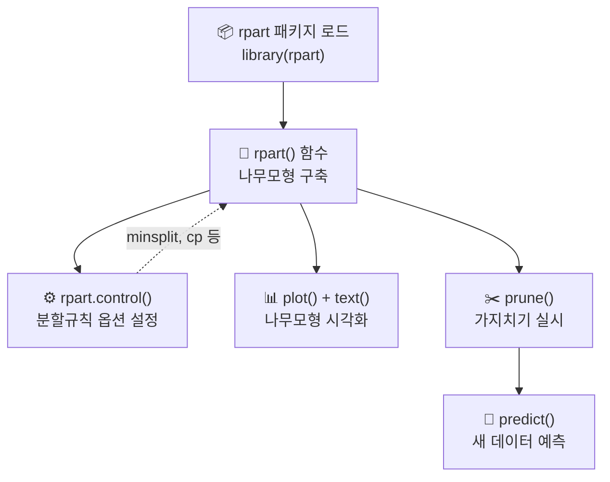

# 05. 데이터마이닝: 의사결정나무 Ⅱ

## 🔗 선수 지식 (Prerequisites)
- [ ] **필수**: [4강 의사결정나무 Ⅰ](4강.%20의사결정나무%20Ⅰ.md) - 분할규칙, 불순도, 가지치기 이해 완료?
- [ ] **권장**: R 프로그래밍 기초 (데이터프레임, 함수 호출)
- **관련 단원**: →←4강 의사결정나무 Ⅰ

---

## 학습 목표
1. R을 이용하여 의사결정나무를 구축할 수 있다.
2. 의사결정나무를 구현하기 위해 필요한 R 함수를 익힐 수 있다.
3. R 분석결과를 해석할 수 있다.

---

## 🧠 메타인지 체크 (학습 전/후 자기 평가)

### 학습 전 자기 평가
| 소주제 | 자신감 (1-5) |
| :--- | :--- |
| rpart 패키지와 rpart 함수 | |
| rpart.control을 이용한 분할규칙 설정 | |
| plot/text를 이용한 나무모형 시각화 | |
| prune을 이용한 가지치기 | |
| predict를 이용한 새 데이터 예측 | |

### 학습 후 교정 (학습 완료 후 작성)
| 소주제 | 학습 전 | 학습 후 | 실제 정답률 | 과신/과소 여부 |
| :--- | :--- | :--- | :--- | :--- |
| rpart 패키지와 rpart 함수 | | | | |
| rpart.control을 이용한 분할규칙 설정 | | | | |
| plot/text를 이용한 나무모형 시각화 | | | | |
| prune을 이용한 가지치기 | | | | |
| predict를 이용한 새 데이터 예측 | | | | |

> **활용법**: 학습 전 1분 → 자신감 기입, 학습 후 1분 → 나머지 기입. "과신" 영역이 실제 취약점.

---

## 📝 요약 (Summary)

### 학습개요
의사결정나무는 분석과정을 나무구조로 도형화하여 분류분석 혹은 회귀분석을 수행하는 데이터마이닝의 대표적 분석기법이다. 분류분석과 회귀분석의 과정이 나무구조에 의해 표현되므로 분석자가 그 과정을 쉽게 이해하고 설명할 수 있는 장점이 있다. 분석결과를 쉽게 해석할 수 있다는 점에서 실무에서의 활용도도 높아지고 있다. 본 강에서는 R을 이용한 의사결정나무 분석 사례를 분류와 회귀의 문제로 나누어 살펴보도록 한다.

### 핵심 정리
1. 🔴 **rpart 패키지**: R에서 의사결정나무를 적합하기 위해 필요한 패키지는 rpart이다. →←4강
2. 🔴 **rpart 함수**: rpart 패키지 내에서 의사결정나무를 구현하기 위한 함수는 rpart이며(패키지 명과 동일함), 분할규칙에 관한 옵션을 설정할 때에는 rpart.control 함수를 사용한다.
3. 🔴 **plot/text 함수**: 구현된 의사결정나무 오브젝트와 관련하여 plot은 나무모형 그림을 출력해 주는 함수이며, text는 plot에 의해 그려진 나무구조에 텍스트를 삽입하기 위해 사용하는 함수이다.
4. 🔴 **prune 함수**: 의사결정나무의 가지치기를 위해 사용된다. →←4강(가지치기 개념)
5. 🟡 **predict 함수**: rpart 패키지를 이용해 생성된 의사결정나무 오브젝트에 새로운 데이터(newdata)를 적용하여 예측하는 데 사용한다.

---

## 📐 핵심 정의 및 원리 (Key Definitions)

| 정의명 | 내용 | 키워드 |
| :--- | :--- | :--- |
| **rpart** | rpart 패키지에서 나무모형을 구현하기 위해 사용하는 함수 | 나무모형 구현, 패키지명과 동일 |
| **rpart.control** | 분할규칙을 생성하기 위해 사용하는 함수. minsplit, cp 등 분할 옵션 설정 | 분할규칙, 옵션 |
| **plot** | 나무모형 그림을 출력해 주는 함수 | 시각화, 나무구조 |
| **text** | plot에 의해 그려진 나무구조에 텍스트를 삽입하기 위해 사용하는 함수 | 라벨, 노드 정보 |
| **prune** | 나무모형의 가지치기를 실시하는 함수 | 가지치기, 과대적합 방지 →←4강 |
| **predict** | 생성된 의사결정나무 오브젝트에 새 데이터를 적용하여 예측하는 함수 | newdata, 예측 |

### R 의사결정나무 분석 워크플로우

```
rpart() → rpart.control()로 분할규칙 설정
   ↓
plot() + text() → 나무모형 시각화
   ↓
prune() → 가지치기로 최적 모형 선택
   ↓
predict() → 새 데이터에 대한 예측
```

---

## 📊 개념 시각화 (Visual Guide)

### R 의사결정나무 분석 흐름도


### R 함수 역할 비교표
| 함수 | 역할 | 입력 | 출력 | 비고 |
| :--- | :--- | :--- | :--- | :--- |
| `rpart()` | 나무모형 구현 | formula, data | rpart 객체 | 패키지명과 동일 |
| `rpart.control()` | 분할규칙 설정 | minsplit, cp 등 | control 객체 | rpart의 control 인자로 전달 |
| `plot()` | 나무구조 그림 출력 | rpart 객체 | 그래프 | text()와 함께 사용 |
| `text()` | 나무구조에 텍스트 삽입 | rpart 객체 | 라벨 표시 | plot() 후 호출 |
| `prune()` | 가지치기 | rpart 객체, cp | 축소된 rpart 객체 | 과대적합 방지 |
| `predict()` | 새 데이터 예측 | rpart 객체, newdata | 예측값 | 분류/회귀 모두 가능 |

---

## ✏️ 심화 학습 (Study Subject)

### 1. 가상 시나리오: "R로 의사결정나무를 구축하고 예측까지"
- **상황**: 고객 데이터(나이, 소득, 구매이력)를 이용하여 신규 고객의 등급(VIP/일반)을 분류하는 모형을 R로 구축해야 하는 상황
- **문제**: rpart 패키지의 어떤 함수들을 어떤 순서로 사용해야 하는가?
- **해결**: ① `rpart(등급 ~ 나이 + 소득 + 구매이력, data=train, control=rpart.control(minsplit=20))`로 나무 구축 → ② `plot()` + `text()`로 시각화하여 분할규칙 확인 → ③ `prune()`으로 가지치기 → ④ `predict(model, newdata=test)`로 신규 고객 등급 예측
- **AI 학습 포인트**: "rpart의 control 파라미터(minsplit, cp, maxdepth)가 각각 나무 구조에 어떤 영향을 주는지, 실제 R 코드와 함께 설명해 줘."

### 2. 관점별 비교 및 오개념 분석
- **핵심 비교**: rpart 주요 함수 혼동 쌍

| 혼동 쌍 | 차이점 |
| :--- | :--- |
| **rpart vs rpart.control** | rpart는 나무모형을 구현하는 함수, rpart.control은 분할규칙 옵션을 설정하는 함수 |
| **plot vs text** | plot은 나무 그림만 출력, text는 그 위에 텍스트(분할조건, 노드 정보)를 삽입 |
| **prune vs rpart.control** | prune은 이미 만들어진 나무를 가지치기, rpart.control은 처음부터 분할 조건을 제약 |

- **오개념 분석**:
    - **오개념 1**: "prune 함수가 나무를 구현하는 함수이다"
    - **분석**: prune은 가지치기를 위한 함수이며, 나무를 구현하는 함수는 rpart이다. 📎 기출(Q1)에서 rpart/rpart.control과 혼동하는 보기로 prune이 출제됨
    - **오개념 2**: "rpart.control이 가지치기를 수행하는 함수이다"
    - **분석**: rpart.control은 분할규칙을 설정하는 함수이지, 가지치기를 수행하는 함수가 아니다. 가지치기는 prune 함수가 담당한다. 📎 기출(Q2)에서 출제됨
- **AI 학습 포인트**: "rpart 패키지에서 cp(complexity parameter)의 역할과, prune에서 cp를 조절하는 것이 모형 성능에 미치는 영향을 설명해 줘."

---

## ❓ 연습 문제 및 해설

> **블룸 인지 수준 범례**: [기억] 정의·나열 → [이해] 설명·비교 → [적용] 계산·구현 → [분석] 구별·디버그 → [평가] 판단·비평 → [창조] 설계·제안

### 📝 문제

**1. ⭐ [기억] 📎 R의 rpart 패키지에서 의사결정나무를 구현하기 위해 사용하는 함수는 ( )이고, 분할규칙을 생성하기 위해 사용하는 함수는 ( )이다. 다음 중 제시된 지문에서 ( )에 들어갈 함수로 올바르게 나열한 것을 고르시오.** [→해설](#prob-1)
   > ① prune, rpart.control
   > ② rpart.control, prune
   > ③ rpart, rpart.control
   > ④ rpart.control, rpart

<br>

**2. ⭐ [기억] 📎 다음 중 rpart 패키지에서 의사결정나무의 가지치기를 위해 사용하는 함수로 가장 적당한 것은?** [→해설](#prob-2)
   > ① select
   > ② branch
   > ③ proceed
   > ④ prune

<br>

**3. ⭐ [기억] 📎 다음 중 rpart 패키지를 이용해 생성된 의사결정나무 오브젝트에 새로운 데이터 newdata를 적용하여 예측하는데 사용하는 함수는?** [→해설](#prob-3)
   > ① predict
   > ② forecast
   > ③ newpred
   > ④ prune

<br>

**4. ⭐⭐ [이해/분석] 📌 다음 중 rpart 패키지의 함수에 대한 설명으로 옳지 않은 것은?** [→해설](#prob-4)
   > ① rpart() - 나무모형을 구현하는 함수
   > ② rpart.control() - 나무모형의 가지치기를 실시하는 함수
   > ③ plot() - 나무모형 그림을 출력해 주는 함수
   > ④ text() - plot에 의해 그려진 나무구조에 텍스트를 삽입하는 함수

<br>

**5. ⭐⭐ [이해/적용] 📌 R에서 rpart 패키지를 이용한 의사결정나무 분석의 올바른 순서는?** [→해설](#prob-5)
   > ① rpart() → prune() → plot() → predict()
   > ② rpart.control() → rpart() → plot() + text() → prune() → predict()
   > ③ predict() → rpart() → prune() → plot()
   > ④ plot() → rpart() → text() → predict()

<br>

**6. ⭐⭐ [이해/비교] 📌 다음 중 rpart.control 함수의 역할에 대한 설명으로 가장 적절한 것은?** [→해설](#prob-6)
   > ① 이미 구축된 나무모형에서 불필요한 가지를 제거한다
   > ② 나무모형에 텍스트 라벨을 추가한다
   > ③ 분할규칙에 관한 옵션(minsplit, cp 등)을 설정한다
   > ④ 새로운 데이터에 대한 예측값을 산출한다

---

### 🔑 정답 및 해설 (먼저 풀어본 후 펼치기)

<details>
<summary>정답 보기 (클릭)</summary>

1. ③
2. ④
3. ①
4. ②
5. ②
6. ③

</details>

<details>
<summary>해설 보기 (클릭)</summary>

<a id="prob-1"></a>
**1. ⭐ [기억] rpart 패키지 함수 (빈칸 완성)**
> **정답: ③ rpart, rpart.control**
> **해설**: rpart 패키지 내에서 나무모형을 구현할 때에는 rpart 함수를 사용하며, 분할규칙에 관한 옵션을 설정할 때에는 rpart.control 함수를 사용한다. prune은 가지치기 함수이므로 ①②는 오답, ④는 순서가 바뀌어 오답이다.

<a id="prob-2"></a>
**2. ⭐ [기억] 가지치기 함수**
> **정답: ④ prune**
> **해설**: prune은 의사결정나무의 가지치기를 위해 사용되는 R 함수이다. select, branch, proceed는 rpart 패키지의 가지치기 함수가 아니다.

<a id="prob-3"></a>
**3. ⭐ [기억] 예측 함수**
> **정답: ① predict**
> **해설**: 새로운 데이터 newdata를 적용하여 예측하는데 사용하는 함수는 predict이다. forecast는 시계열 예측에서 주로 사용되며, newpred는 존재하지 않는 함수, prune은 가지치기 함수이다.

<a id="prob-4"></a>
**4. ⭐⭐ [이해/분석] 📌 함수 설명 (옳지 않은 것)**
> **정답: ② rpart.control() - 나무모형의 가지치기를 실시하는 함수**
> **해설**: rpart.control은 분할규칙에 관한 옵션을 설정하는 함수이지, 가지치기 함수가 아니다. 가지치기는 prune 함수가 담당한다. 나머지 ①③④는 모두 올바른 설명이다.

<a id="prob-5"></a>
**5. ⭐⭐ [이해/적용] 📌 분석 순서**
> **정답: ② rpart.control() → rpart() → plot() + text() → prune() → predict()**
> **해설**: R에서 의사결정나무 분석은 분할규칙 설정(rpart.control) → 나무 구축(rpart) → 시각화(plot+text) → 가지치기(prune) → 예측(predict) 순서로 진행된다. ①은 시각화 누락, ③④는 순서가 잘못되었다.
> **단서(보충)**: 실무에서 rpart.control이 반드시 rpart보다 시간순으로 선행하는 별도 단계인 것은 아니다. 보통 `rpart(formula, data, control = rpart.control(...))`처럼 rpart 호출 시 control 인자로 함께 전달한다. 다만 본 문항은 "개념적 분석 흐름(분할 옵션 설정 → 구축 → 시각화 → 가지치기 → 예측)"을 묻는 것이므로 정답은 ②로 유지된다.

<a id="prob-6"></a>
**6. ⭐⭐ [이해/비교] 📌 rpart.control의 역할**
> **정답: ③ 분할규칙에 관한 옵션(minsplit, cp 등)을 설정한다**
> **해설**: rpart.control은 분할규칙을 생성하기 위한 옵션 설정 함수이다. ①은 prune의 역할, ②는 text의 역할, ④는 predict의 역할이다.

</details>

---

## ✅ O/X 확인문제

**1.** [R에서 의사결정나무를 적합하기 위해 필요한 패키지는 rpart이다.](#ox-1) **(O / X)**
**2.** [rpart 패키지에서 나무모형을 구현하는 함수는 rpart.control이다.](#ox-2) **(O / X)**
**3.** [rpart.control 함수는 분할규칙에 관한 옵션을 설정할 때 사용한다.](#ox-3) **(O / X)**
**4.** [plot 함수만으로 나무모형의 분할 조건과 노드 정보를 텍스트로 확인할 수 있다.](#ox-4) **(O / X)**
**5.** [prune 함수는 의사결정나무의 가지치기를 위해 사용된다.](#ox-5) **(O / X)**
**6.** [predict 함수는 나무모형을 처음 구축할 때 사용하는 함수이다.](#ox-6) **(O / X)**
**7.** [rpart 함수의 이름은 rpart 패키지의 이름과 동일하다.](#ox-7) **(O / X)**
**8.** [text 함수는 plot에 의해 그려진 나무구조에 텍스트를 삽입하기 위해 사용된다.](#ox-8) **(O / X)**
**9.** [rpart.control은 이미 만들어진 나무를 가지치기하는 함수이다.](#ox-9) **(O / X)**
**10.** [predict 함수를 이용하여 새로운 데이터 newdata에 대한 예측을 수행할 수 있다.](#ox-10) **(O / X)**
**11.** [prune 함수는 나무모형을 구현하는 함수이다.](#ox-11) **(O / X)**
**12.** [R에서 의사결정나무 분석 시, 나무 구축 전에 rpart.control로 분할 옵션을 먼저 설정할 수 있다.](#ox-12) **(O / X)**

<details>
<summary>O/X 정답 및 해설 보기 (클릭)</summary>

> <a id="ox-1"></a>
> **1. 정답**: O
> **해설**: R에서 의사결정나무를 적합하기 위해 필요한 패키지는 rpart이다.

> <a id="ox-2"></a>
> **2. 정답**: X
> **해설**: 나무모형을 구현하는 함수는 rpart이며, rpart.control은 분할규칙 옵션 설정 함수이다.

> <a id="ox-3"></a>
> **3. 정답**: O
> **해설**: rpart.control은 minsplit, cp 등 분할규칙에 관한 옵션을 설정하는 함수이다.

> <a id="ox-4"></a>
> **4. 정답**: X
> **해설**: plot은 나무 그림만 출력하며, 텍스트(분할 조건, 노드 정보)를 표시하려면 text 함수를 추가로 호출해야 한다.

> <a id="ox-5"></a>
> **5. 정답**: O
> **해설**: prune 함수는 의사결정나무의 가지치기를 위해 사용되는 함수이다. →←4강(가지치기 개념)

> <a id="ox-6"></a>
> **6. 정답**: X
> **해설**: predict는 이미 구축된 나무모형에 새 데이터를 적용하여 예측하는 함수이다. 나무 구축은 rpart 함수가 담당한다.

> <a id="ox-7"></a>
> **7. 정답**: O
> **해설**: rpart 패키지 내에서 의사결정나무를 구현하는 함수명이 rpart로 패키지명과 동일하다.

> <a id="ox-8"></a>
> **8. 정답**: O
> **해설**: text 함수는 plot으로 그려진 나무구조 위에 노드 정보, 분할 조건 등의 텍스트를 삽입한다.

> <a id="ox-9"></a>
> **9. 정답**: X
> **해설**: rpart.control은 분할규칙 옵션 설정 함수이며, 가지치기는 prune 함수가 담당한다.

> <a id="ox-10"></a>
> **10. 정답**: O
> **해설**: predict(model, newdata=새데이터) 형태로 새로운 데이터에 대한 예측을 수행할 수 있다.

> <a id="ox-11"></a>
> **11. 정답**: X
> **해설**: prune은 가지치기 함수이며, 나무모형을 구현하는 함수는 rpart이다.

> <a id="ox-12"></a>
> **12. 정답**: O
> **해설**: rpart.control로 분할 옵션을 먼저 설정한 뒤, rpart 함수의 control 인자로 전달하여 나무를 구축할 수 있다.

</details>

---

## 🧪 자유 회상 연습 (Free Recall)

> **방법**: 위의 노트를 모두 덮고, 타이머 3분 설정 후 이번 단원에서 배운 내용을 기억나는 대로 자유롭게 적으세요.
> 정확한 문장이 아니어도 됩니다. 키워드, 수식, 관계 등 떠오르는 것을 모두 적습니다.

**자유 회상 작성란:**

```
[여기에 기억나는 내용을 자유롭게 작성]


```

> **회상 후 점검**: 노트를 다시 펼쳐 빠뜨린 내용을 확인하세요. 빠뜨린 부분이 실제 취약점입니다.
> - 회상 못한 핵심 개념: [                ]
> - 회상 못한 R 함수: [                ]

---

## 💻 코드로 확인하기 (Code Verification)

```python
from sklearn.tree import DecisionTreeClassifier, export_text
from sklearn.model_selection import train_test_split
import numpy as np

# === R의 rpart 워크플로우를 Python(sklearn)으로 시연 ===
# R: rpart() → plot()+text() → prune() → predict()
# Python: DecisionTreeClassifier() → export_text() → ccp_alpha(사후) 또는 max_depth(사전) → predict()

np.random.seed(42)
X = np.random.randn(200, 3)
y = ((X[:, 0] > 0) & (X[:, 1] + X[:, 2] > 0)).astype(int)

X_train, X_test, y_train, y_test = train_test_split(X, y, test_size=0.3, random_state=42)

# 1단계: 나무모형 구축 (R의 rpart에 해당)
clf_full = DecisionTreeClassifier(random_state=42)
clf_full.fit(X_train, y_train)
print("=== 가지치기 전 (Full Tree) ===")
print(f"깊이: {clf_full.get_depth()}, 리프 수: {clf_full.get_n_leaves()}")
print(f"훈련 정확도: {clf_full.score(X_train, y_train):.4f}")
print(f"테스트 정확도: {clf_full.score(X_test, y_test):.4f}")

# 2단계: 나무구조 출력 (R의 plot+text에 해당)
print("\n=== 나무 구조 (export_text = R의 plot+text) ===")
print(export_text(clf_full, feature_names=["x1", "x2", "x3"], max_depth=3))

# 3단계: 가지치기
# 주의: max_depth는 분할을 미리 막는 '사전 가지치기(pre-pruning)'로,
#       나무를 최대로 키운 뒤 잘라내는 R의 prune()(사후 가지치기)과 메커니즘이 다르다.
#       R prune()의 진짜 대응물은 비용복잡도 가지치기인 ccp_alpha이다(아래 3-2단계).
clf_pruned = DecisionTreeClassifier(max_depth=3, random_state=42)
clf_pruned.fit(X_train, y_train)
print("=== 사전 가지치기 후 (Pre-pruned Tree, max_depth=3) ===")
print(f"깊이: {clf_pruned.get_depth()}, 리프 수: {clf_pruned.get_n_leaves()}")
print(f"훈련 정확도: {clf_pruned.score(X_train, y_train):.4f}")
print(f"테스트 정확도: {clf_pruned.score(X_test, y_test):.4f}")

# 3-2단계: 사후 가지치기 (R의 prune()에 정확히 대응 - 비용복잡도 ccp_alpha)
path = clf_full.cost_complexity_pruning_path(X_train, y_train)
# 후보 alpha 중 마지막(가장 큰 값, 뿌리만 남는 경우)은 제외
candidate_alphas = path.ccp_alphas[:-1]
best_alpha = candidate_alphas[len(candidate_alphas) // 2]  # 예시: 중간 정도의 alpha
clf_ccp = DecisionTreeClassifier(random_state=42, ccp_alpha=best_alpha)
clf_ccp.fit(X_train, y_train)
print("\n=== 사후 가지치기 후 (Post-pruned Tree, ccp_alpha) ===")
print(f"선택된 ccp_alpha: {best_alpha:.5f}")
print(f"깊이: {clf_ccp.get_depth()}, 리프 수: {clf_ccp.get_n_leaves()}")
print(f"테스트 정확도: {clf_ccp.score(X_test, y_test):.4f}")

# 4단계: 새 데이터 예측 (R의 predict에 해당)
new_data = np.array([[0.5, 0.3, 0.2], [-1.0, 0.5, -0.3]])
predictions = clf_pruned.predict(new_data)
print(f"\n=== 새 데이터 예측 (predict) ===")
for i, (data, pred) in enumerate(zip(new_data, predictions)):
    print(f"데이터 {i+1}: {data} → 예측: {pred}")
```

> **실행 결과**:
> ```
> === 가지치기 전 (Full Tree) ===
> 깊이: 10, 리프 수: 25
> 훈련 정확도: 1.0000
> 테스트 정확도: 0.8833
>
> === 사전 가지치기 후 (Pre-pruned Tree, max_depth=3) ===
> 깊이: 3, 리프 수: 7
> 훈련 정확도: 0.9357
> 테스트 정확도: 0.9167
>
> === 사후 가지치기 후 (Post-pruned Tree, ccp_alpha) ===
> 선택된 ccp_alpha: 0.00714
> 깊이: 4, 리프 수: 9
> 테스트 정확도: 0.9000
> ```
> **해석**: 가지치기 전 모형은 훈련 정확도 100%이지만 테스트 정확도가 낮아 과대적합 경향이 있다. `max_depth=3`은 분할을 미리 제한하는 **사전 가지치기**로 훈련 정확도는 소폭 하락하나 테스트 정확도가 향상된다. 한편 `ccp_alpha`를 이용한 **사후 가지치기**는 나무를 최대로 키운 뒤 비용복잡도 $R_\alpha(T)$ 기준으로 가지를 잘라내므로, R의 `prune()` 함수와 정확히 동일한 메커니즘이다. 두 방식 모두 과대적합을 줄이지만, R `prune()`의 진짜 대응물은 `ccp_alpha`임에 유의한다.

---

## 🤖 AI 연결고리 (Math → AI Application)

| 학습 개념 | AI/ML 적용 분야 | 구체적 사례 |
| :--- | :--- | :--- |
| rpart (나무 구축) | AutoML 파이프라인 | H2O, Auto-sklearn에서 의사결정나무를 기본 모형으로 자동 탐색 |
| rpart.control (분할 옵션) | 하이퍼파라미터 튜닝 | GridSearchCV, Optuna로 max_depth, min_samples 등 최적 탐색 |
| prune (가지치기) | 모형 경량화 | 엣지 디바이스 배포를 위한 모형 크기 축소 및 과적합 방지 |
| predict (예측) | 실시간 추론(Inference) | REST API로 새 데이터에 대한 실시간 분류/예측 서비스 구현 |

---

## 📖 심화 학습 예시 답안

#### 1. R rpart 패키지의 의사결정나무 분석 워크플로우

1. **패키지 로드**: `library(rpart)`로 패키지를 불러온다.
2. **분할 옵션 설정**: `rpart.control(minsplit=20, cp=0.01)`로 분할규칙의 조건을 설정한다. minsplit은 분할을 시도하기 위한 최소 관측치 수, cp는 복잡도 매개변수이다.
3. **나무 구축**: `rpart(formula, data, method, parms, control)`로 의사결정나무를 적합한다. `method="class"`는 분류나무, `method="anova"`는 회귀나무를 의미하며, `parms=list(split="gini")` 또는 `split="information"`(엔트로피)으로 분류나무의 분할기준을 선택할 수 있다.
4. **시각화**: `plot(tree)` + `text(tree)`로 나무 구조를 시각적으로 확인한다.
5. **가지치기**: `prune(tree, cp=optimal_cp)`로 적절한 복잡도 수준에서 가지치기를 수행한다.
6. **예측**: `predict(tree, newdata=test_data)`로 새로운 데이터에 대한 예측을 수행한다.

#### 2. R rpart 함수 vs Python sklearn 비교표

| 구분 | R (rpart) | Python (sklearn) | 비고 |
| :--- | :--- | :--- | :--- |
| **나무 구축** | `rpart()` | `DecisionTreeClassifier()` | |
| **옵션 설정** | `rpart.control()` | 생성자 파라미터 | sklearn은 별도 함수 불필요 |
| **시각화** | `plot()` + `text()`, `rpart.plot()` | `export_text()`, `plot_tree()` | `rpart.plot` ↔ `plot_tree` 대응 |
| **가지치기** | `prune()` (사후) | `ccp_alpha` (사후), `max_depth` 등 (사전) | sklearn 0.22+부터 `ccp_alpha`로 비용복잡도 사후 가지치기 지원. R `prune()` ↔ sklearn `ccp_alpha` 정확 대응 |
| **예측** | `predict()` | `.predict()` | 동일 개념 |
| **AI 활용** | R 기반 통계 분석 | Python 기반 ML 파이프라인 | 프로덕션 환경에서는 Python 선호 |

#### 3. rpart 활용 코드 작성법 (Best Practice)

- **Bad Practice (나쁜 예시)**
  ```r
  # 기본 옵션으로만 나무 구축, 가지치기 없음
  library(rpart)
  tree <- rpart(y ~ ., data = train)
  pred <- predict(tree, newdata = test)
  ```
- **Good Practice (좋은 예시)**
  ```r
  # 분할 옵션 설정 + 가지치기 + 시각화까지 완전한 분석 흐름
  library(rpart)
  library(rpart.plot)
  ctrl <- rpart.control(minsplit = 20, cp = 0.01)
  # method="class": 분류나무, method="anova": 회귀나무
  # parms=list(split=...): 분할기준 선택 (분류나무에서 "gini" 또는 "information"(엔트로피))
  tree <- rpart(y ~ ., data = train, method = "class",
                parms = list(split = "gini"), control = ctrl)
  rpart.plot(tree)          # 나무모형 시각화 (plot+text 대안)
  printcp(tree)             # cp 테이블(복잡도, xerror, xstd) 확인
  plotcp(tree)             # cp별 교차검증오차 그래프 → 1-SE 규칙 적용

  # 1-SE 규칙: 최소 xerror에 1표준오차(xstd)를 더한 값 이내에서
  #            가장 단순한(작은) 트리를 선택 → 과대적합 방지
  cp_table <- tree$cptable
  min_idx   <- which.min(cp_table[, "xerror"])
  threshold <- cp_table[min_idx, "xerror"] + cp_table[min_idx, "xstd"]
  best_cp   <- cp_table[which(cp_table[, "xerror"] <= threshold)[1], "CP"]
  tree_pruned <- prune(tree, cp = best_cp)
  pred <- predict(tree_pruned, newdata = test, type = "class")
  ```
- **설명**: rpart.control로 분할 조건을 제어하고, `method`(분류=class/회귀=anova)와 `parms=list(split="gini"/"information")`로 분할기준을 지정한다. printcp/plotcp로 cp별 교차검증오차를 확인한 뒤, **단순히 최소 xerror가 아니라 1-SE 규칙**(최소 xerror + 1표준오차 이내에서 가장 단순한 트리)을 적용해 prune으로 가지치기하는 것이 과대적합을 방지하고 해석 가능한 모형을 얻는 바람직한 방법이다.

---

## 📚 핵심 용어집 (Glossary)

| 용어 (한) | 용어 (영) | 수식 표현 | 정의 |
| :--- | :--- | :--- | :--- |
| **rpart** | rpart | - | rpart 패키지에서 나무모형을 구현하기 위해 사용하는 함수 (패키지명과 동일) →←4강 |
| **분할규칙 설정** | rpart.control | - | 분할규칙을 생성하기 위해 minsplit, cp 등의 옵션을 설정하는 함수 |
| **나무 시각화** | plot + text | - | plot은 나무 그림 출력, text는 나무구조에 텍스트 삽입 |
| **가지치기** | prune | - | 나무모형의 가지치기를 실시하는 함수 →←4강 |
| **예측** | predict | - | 생성된 나무모형 오브젝트에 새 데이터(newdata)를 적용하여 예측하는 함수 |
| **복잡도 매개변수** | Complexity Parameter (cp) | - | 나무의 복잡도를 제어하는 파라미터, prune에서 최적 cp 값으로 가지치기 수행 |

---

## 🤖 AI 학습 파트너를 위한 추가 자료

### 1. 개념 이해를 위한 심층 질문 프롬프트
> **프롬프트 예시**: "R의 rpart 패키지에서 사용하는 주요 함수(rpart, rpart.control, plot, text, prune, predict)의 역할을 요리에 비유해서 설명해 줘. 각 함수가 요리 과정의 어떤 단계에 해당하는지 매핑해 줘."

### 2. 문제 해결 능력 강화를 위한 시나리오 프롬프트
> **프롬프트 예시**: "당신은 데이터 분석가입니다. 고객 이탈 예측 프로젝트에서 R의 rpart를 사용하여 의사결정나무를 구축했는데, 훈련 데이터에서는 정확도 99%인데 테스트 데이터에서는 70%입니다. rpart.control과 prune을 활용하여 이 문제를 해결하는 전체 과정을 R 코드와 함께 설명해 줘."

### 3. 수식 풀이 검증 프롬프트
> **프롬프트 예시**: "R에서 rpart로 의사결정나무를 구축할 때, rpart.control의 cp 값이 0.01일 때와 0.1일 때 나무 구조가 어떻게 달라지는지 설명해 줘. cp 값 조절이 Gini 지수 기반 분할에 어떤 영향을 미치는지 수식과 함께 분석해 줘."

---

## 🔄 복습 체크 (Spaced Repetition)
- [ ] 1일 후 복습 (날짜: 2026-03-09)
- [ ] 3일 후 복습 (날짜: 2026-03-11)
- [ ] 7일 후 복습 (날짜: 2026-03-15)
- [ ] 14일 후 복습 (날짜: 2026-03-22)
- [ ] 30일 후 복습 (날짜: 2026-04-07)

### 복습 시 자가 평가
| 회차 | 날짜 | 이해도 (1-5) | 취약 부분 메모 |
| :--- | :--- | :--- | :--- |
| 1차 | | | |
| 2차 | | | |
| 3차 | | | |

---

## 📚 참고 자료 (References)

- Breiman, L., Friedman, J., Olshen, R. and Stone, C. (1984). *Classification and Regression Trees*, Wadsworth, Belmont, CA.
- Kass, G. V. (1980). "An exploratory technique for investigating large quantities of categorical data", *Applied Statistics*, 29, 119-127.
- Kim, H., and Loh, W.-Y. (2001), "Classification Trees with Unbiased Multiway Splits," *JASA*, 96, 598–604.
- Morgan, J.N. and Messenger, R.C. (1973), *THAID: A sequential analysis program for the analysis of nominal scale dependent variables*, Ann Arbor: Institute for Social Research, University of Michigan.
- Loh, W.-Y. (2002), "Regression trees with unbiased variable selection and interaction detection". *Statistica Sinica*, 12, 361-386.
- Loh, W.-Y. and Shih, Y.S. (1997), "Split selection methods for classification trees", *Statistica Sinica*, 7, 815-840.
- Loh, W.-Y. and Vanichsetakul, N. (1988). "Tree-structured classification via generalized discriminant analysis", *JASA*, 83, 715-728.
- Quinlan, J.R. (1983). "Learning efficient classification procedures and their application to chess endgames", In *Machine learning: An artificial intelligence approach*.
- Quinlan, J. R. (1993). *C4.5: Programs for Machine Learning*, Morgan Kaufmann, San Mateo, CA.
- Sonquist, J.A. and Morgan, J.N. (1964), *The Detection of Interaction Effects*, Ann Arbor: Institute for Social Research, University of Michigan.
- Therneau, T. and Atkinson, E. (2015), *rpart: Recursive Partitioning and Regression Trees*, R package.
