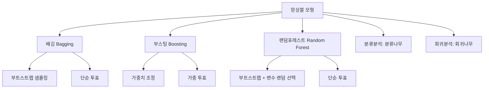
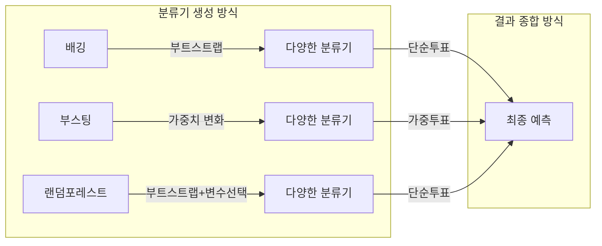

# 06. 데이터마이닝: 앙상블 모형 Ⅰ

## 🔗 선수 지식 (Prerequisites)
- [ ] **필수**: [5강. 의사결정나무 Ⅱ](5강.%20의사결정나무%20Ⅱ.md) - 분류나무·회귀나무 이해 완료?
- [ ] **필수**: [4강. 의사결정나무 Ⅰ](4강.%20의사결정나무%20Ⅰ.md) - 나무모형 기본 구조 이해 완료?
- [ ] **권장**: 부트스트랩(bootstrap) 개념, 표본추출 방법
- **관련 단원**: [1강. 데이터마이닝이란](1강.%20데이터마이닝이란.md)

---

## 학습 목표
1. 앙상블모형을 이해할 수 있다.
2. 배깅 방법에 대해 설명할 수 있다.
3. 부스팅 방법에 대해 이해할 수 있다.
4. 랜덤포레스트 방법에 대해 설명할 수 있다.

---

## 🧠 메타인지 체크 (학습 전/후 자기 평가)

### 학습 전 자기 평가
| 소주제 | 자신감 (1-5) |
| :--- | :--- |
| 앙상블모형 개념 | |
| 배깅(Bagging) | |
| 부스팅(Boosting) | |
| 랜덤포레스트(Random Forest) | |

### 학습 후 교정 (학습 완료 후 작성)
| 소주제 | 학습 전 | 학습 후 | 실제 정답률 | 과신/과소 여부 |
| :--- | :--- | :--- | :--- | :--- |
| 앙상블모형 개념 | | | | |
| 배깅(Bagging) | | | | |
| 부스팅(Boosting) | | | | |
| 랜덤포레스트(Random Forest) | | | | |

> **활용법**: 학습 전 1분 → 자신감 기입, 학습 후 1분 → 나머지 기입. "과신" 영역이 실제 취약점.

---

## 📝 요약 (Summary)
1. 🔴 **앙상블 모형**: 주어진 데이터를 이용하여 여러 개의 서로 다른 예측모형들을 생성한 후, 이러한 예측모형들의 예측결과들을 종합하여 하나의 최종 예측결과를 도출해 내는 방법이다.
2. 🔴 **앙상블모형의 적용 범위**: 목표변수의 형태에 따라 분류분석과 회귀분석에 모두 사용할 수 있다. 분류분석의 경우 분류나무를, 회귀분석의 경우 회귀나무를 사용하는 것이 일반적이다.
3. 🔴 **분류앙상블모형의 종류**: 분류기를 생성하는 방법에 따라 배깅, 부스팅, 랜덤포레스트 등의 방법들이 사용가능하다.
4. 🔴 **배깅(Bagging)**: 부트스트랩을 이용하여 분류기를 다양하게 생성하고, 그 결과를 **단순 투표방식**으로 도출한다.
5. 🔴 **부스팅(Boosting)**: 각 관찰치별 가중치에 변화를 줌으로써 분류기를 다양하게 생성하고, 그 결과를 **가중 투표방식**으로 도출한다.
6. 🔴 **랜덤포레스트(Random Forest)**: 부트스트랩과 나무모형의 생성과정에 변화를 줌으로써 분류기를 다양하게 생성하고, 그 결과를 **단순 투표방식**으로 도출한다.
7. 🟡 **앙상블모형의 성능**: 분류 성과 및 예측성과가 매우 우수한 방법이다.

---

## 📐 핵심 정의 및 원리 (Key Definitions)

| 정의명 | 내용 | 키워드 |
| :--- | :--- | :--- |
| **분류앙상블** | 주어진 데이터를 이용하여 여러 개의 서로 다른 예측모형들을 생성한 후, 예측결과들을 종합하여 최종 예측결과를 도출하는 방법 | 다수 모형, 결과 종합 |
| **배깅(Bagging)** | 훈련데이터로부터 부트스트랩 데이터를 B번 생성하여 각 부트스트랩 데이터마다 분류기를 생성한 후 그 예측 결과를 앙상블하는 방법 | 부트스트랩, 단순투표 |
| **부스팅(Boosting)** | 배깅과 유사하나 생성 방식이 상이한 방법으로서, 예측력이 약한 분류모형을 결합하여 강한 예측모형을 만드는 과정 | 가중치 변화, 가중투표 |
| **랜덤포레스트(Random Forest)** | 부트스트랩과 나무모형 생성과정에 변화를 줌으로써 분류기를 다양하게 생성하고, 그 결과를 종합하여 결과를 도출하는 방법 | 변수 랜덤 선택, 단순투표 |

### 주요 정리/정의

**앙상블 모형의 핵심 원리**
> **직관적 해석**: "세 사람이 모이면 문수보살의 지혜를 얻는다(三人成虎)" — 하나의 강력한 모형보다, 여러 개의 약한 모형이 모이면 더 정확한 예측을 할 수 있다.
> **AI 적용**: XGBoost, LightGBM, Random Forest 등 현대 ML 대회에서 가장 자주 우승하는 알고리즘은 대부분 앙상블 기법 기반이다.

---

## 📊 개념 시각화 (Visual Guide)

### 개념 관계도


### 앙상블 분류 체계도


### 핵심 비교표
| 구분 | 배깅 | 부스팅 | 랜덤포레스트 |
| :--- | :--- | :--- | :--- |
| **분류기 다양화 방법** | 부트스트랩 샘플링 | 관찰치별 가중치 변화 | 부트스트랩 + 변수 랜덤 선택 |
| **결과 종합 방식** | 단순 투표 | 가중 투표 | 단순 투표 |
| **기본 분류기** | 분류나무 | 약한 분류기(weak learner) | 분류나무 |
| **핵심 아이디어** | 데이터 다양화 | 오분류 집중 학습 | 데이터 + 변수 다양화 |

---

## ✏️ 심화 학습 (Study Subject)

### 1. 가상 시나리오: "어떤 앙상블 방법을 선택해야 할까?"
- **상황**: 온라인 쇼핑몰에서 고객 이탈(churn) 여부를 예측하는 분류 모델을 구축해야 한다. 데이터에 100개 이상의 변수가 존재하며, 단일 의사결정나무 모형의 예측 정확도가 70%로 불만족스러운 상황이다.
- **문제**: 배깅, 부스팅, 랜덤포레스트 중 어떤 방법이 이 상황에 가장 적합할까?
- **해결**: 변수가 매우 많으므로 랜덤포레스트가 적합하다. 부트스트랩으로 데이터를 다양화하면서 동시에 각 노드에서 변수를 랜덤하게 선택함으로써 변수 간 상관관계에 의한 과적합을 방지한다. 부스팅은 노이즈가 많은 데이터에서 과적합될 위험이 있다.
- **AI 학습 포인트**: "데이터에 노이즈가 많을 때 배깅과 부스팅의 과적합 경향은 어떻게 다른가? 바이어스-분산 트레이드오프 관점에서 설명해 줘."

### 2. 관점별 비교 및 오개념 분석
- **핵심 비교**: "배깅 vs 부스팅" — 둘 다 앙상블이지만 분류기 생성 방식과 결과 종합 방식이 근본적으로 다름
- **오개념 분석**:
    - **오개념 1**: "랜덤포레스트는 배깅과 완전히 다른 방법이다"
    - **분석**: 랜덤포레스트는 배깅의 확장이다. 배깅처럼 부트스트랩 샘플링을 사용하지만, 나무모형 생성 시 **변수를 랜덤하게 선택**하는 과정이 추가된다. 즉 배깅 + 변수 랜덤 선택 = 랜덤포레스트이다.
    - **오개념 2**: "부스팅은 데이터를 리샘플링하여 분류기를 다양하게 만든다"
    - **분석**: 부스팅은 데이터를 리샘플링하는 것이 아니라, **각 관찰치의 가중치를 변화**시켜 분류기를 다양하게 생성한다. 데이터 리샘플링은 배깅의 방식이다.
- **AI 학습 포인트**: "배깅이 분산(variance)을 줄이는 반면, 부스팅이 편향(bias)을 줄이는 원리를 직관적으로 설명해 줘."

---

## ❓ 연습 문제 및 해설

> **블룸 인지 수준 범례**: [기억] 정의·나열 → [이해] 설명·비교 → [적용] 계산·구현 → [분석] 구별·디버그 → [평가] 판단·비평 → [창조] 설계·제안

### 📝 문제

**1. ⭐ [기억] 📎 부트스트랩을 이용하여 분류기를 다양하게 생성하고, 그 결과를 단순 투표방식으로 도출하는 기법은?[](#prob-1)**
   > ① 로지스틱회귀
   > ② 부스팅(boosting)
   > ③ 배깅(bagging)
   > ④ 랜덤포레스트

<br>

**2. ⭐ [기억] 📎 각 관찰치별 가중치에 변화를 줌으로써 분류기를 다양하게 생성하고, 그 결과를 가중 투표방식으로 도출하는 기법은?[](#prob-2)**
   > ① 로지스틱회귀
   > ② 부스팅(boosting)
   > ③ 배깅(bagging)
   > ④ 랜덤포레스트

<br>

**3. ⭐ [이해] 📎 다음 중 지문에서 제시된 기법들과 가장 관계가 깊은 것은?[](#prob-3)**
   > **지문**: 랜덤포레스트, 배깅, 부스팅
   >
   > ① 여러 개의 동일한 예측 모형을 생성하여 결합하는 방법이다.
   > ② 단일 모형에 비해 계산량이 적어진다.
   > ③ 동일 환경 하에서 단일 모형에 비해 계산 속도가 현저하게 빨라진다.
   > ④ 단일 모형에 비해 예측의 정확도가 높아진다.

<br>

**4. ⭐⭐ [이해] 📌 다음 중 앙상블 모형에 대한 설명으로 옳지 않은 것은?[](#prob-4)**
   > ① 여러 개의 서로 다른 예측모형의 결과를 종합한다.
   > ② 분류분석과 회귀분석 모두에 사용 가능하다.
   > ③ 배깅과 랜덤포레스트는 모두 가중 투표방식을 사용한다.
   > ④ 단일 모형보다 일반적으로 예측 정확도가 높다.

<br>

**5. ⭐⭐ [분석] 📌 배깅과 랜덤포레스트의 공통점과 차이점을 서술하시오.[](#prob-5)**

<br>

**6. ⭐⭐⭐ [분석] 📌 부스팅이 "약한 분류기를 결합하여 강한 예측모형을 만든다"고 하는데, 이때 '약한 분류기'의 의미와 이를 강하게 만드는 메커니즘을 설명하시오.[](#prob-6)**

---

### 🔑 정답 및 해설 (먼저 풀어본 후 펼치기)

<details>
<summary>정답 보기 (클릭)</summary>

1. ③
2. ②
3. ④
4. ③
5. [서술형]
6. [서술형]

</details>

<details>
<summary>해설 보기 (클릭)</summary>

<a id="prob-1"></a>
**1. ⭐ [기억] 부트스트랩 + 단순 투표 → 배깅**
> **정답: ③ 배깅(bagging)**
> **해설**: 배깅은 부트스트랩 기법을 이용하고 단순투표의 방식으로 예측값을 산출한다. 부스팅은 가중치 변화와 가중투표, 랜덤포레스트는 부트스트랩+변수선택과 단순투표를 사용한다.

<a id="prob-2"></a>
**2. ⭐ [기억] 가중치 변화 + 가중 투표 → 부스팅**
> **정답: ② 부스팅(boosting)**
> **해설**: 부스팅은 관찰값 가중치에 변화를 주면서 다양한 모형을 생성하고 가중투표 방식으로 예측값을 산출한다. 배깅은 부트스트랩(데이터 리샘플링)을 사용하며 단순투표로 결과를 도출한다.

<a id="prob-3"></a>
**3. ⭐ [이해] 앙상블 기법의 특성**
> **정답: ④ 단일 모형에 비해 예측의 정확도가 높아진다.**
> **해설**: 여러 개의 서로 다른 모형을 결합하는 앙상블 기법을 적용하면 예측의 정확도는 높아지지만 계산량이 많아지는 단점이 있다. ①은 "동일한" 모형이 아니라 "서로 다른" 모형을 생성한다. ②③은 계산량이 줄거나 속도가 빨라지는 것이 아니라 오히려 증가한다.

<a id="prob-4"></a>
**4. ⭐⭐ [이해] 앙상블 모형 오답 찾기**
> **정답: ③ 배깅과 랜덤포레스트는 모두 가중 투표방식을 사용한다.**
> **해설**: 배깅과 랜덤포레스트는 모두 **단순 투표방식**을 사용한다. 가중 투표방식을 사용하는 것은 부스팅이다.

<a id="prob-5"></a>
**5. ⭐⭐ [분석] 배깅 vs 랜덤포레스트**
> **정답**: **공통점** — 둘 다 부트스트랩 샘플링으로 다양한 분류기를 생성하며, 단순 투표방식으로 최종 결과를 도출한다. **차이점** — 랜덤포레스트는 나무모형 생성 시 각 노드에서 사용할 변수를 랜덤하게 선택하는 과정이 추가된다. 이를 통해 분류기 간 상관관계를 낮추어 앙상블 효과를 극대화한다.

<a id="prob-6"></a>
**6. ⭐⭐⭐ [분석] 부스팅의 약한 분류기 결합 메커니즘**
> **정답**: '약한 분류기(weak learner)'란 랜덤 예측보다 약간 나은 수준의 예측 성능을 가진 단순한 분류모형을 의미한다. 부스팅은 이전 단계에서 오분류된 관찰치에 더 높은 가중치를 부여하여 다음 분류기가 해당 관찰치를 더 잘 분류하도록 유도한다. 이 과정을 반복하면서 각 분류기의 결과를 가중 투표로 종합하면, 개별적으로는 약하지만 종합하면 강력한 예측 모형이 완성된다.

</details>

---

## ✅ O/X 확인문제

**1.** [앙상블 모형은 여러 개의 서로 다른 예측모형을 결합하여 최종 예측을 도출한다.](#ox-1) **(O / X)**
**2.** [앙상블모형은 분류분석에만 사용할 수 있고, 회귀분석에는 사용할 수 없다.](#ox-2) **(O / X)**
**3.** [배깅은 부트스트랩 데이터를 생성하여 분류기를 다양하게 만든다.](#ox-3) **(O / X)**
**4.** [배깅의 결과 종합 방식은 가중 투표방식이다.](#ox-4) **(O / X)**
**5.** [부스팅은 각 관찰치별 가중치에 변화를 줌으로써 분류기를 다양하게 생성한다.](#ox-5) **(O / X)**
**6.** [부스팅은 예측력이 약한 분류모형을 결합하여 강한 예측모형을 만드는 과정이다.](#ox-6) **(O / X)**
**7.** [랜덤포레스트는 부트스트랩만 사용하며, 나무모형 생성과정에는 변화를 주지 않는다.](#ox-7) **(O / X)**
**8.** [랜덤포레스트의 결과 종합 방식은 단순 투표방식이다.](#ox-8) **(O / X)**
**9.** [앙상블모형은 단일 모형에 비해 계산량이 적다.](#ox-9) **(O / X)**
**10.** [분류앙상블에서 분류분석의 경우 분류나무를, 회귀분석의 경우 회귀나무를 사용하는 것이 일반적이다.](#ox-10) **(O / X)**
**11.** [부스팅과 배깅은 결과 종합 방식이 동일하다.](#ox-11) **(O / X)**
**12.** [랜덤포레스트는 배깅에 변수 랜덤 선택 과정을 추가한 방법이다.](#ox-12) **(O / X)**

<details>
<summary>O/X 정답 및 해설 보기 (클릭)</summary>

> <a id="ox-1"></a>
> **1. 정답**: O
> **해설**: 앙상블 모형의 정의 그 자체이다.

> <a id="ox-2"></a>
> **2. 정답**: X
> **해설**: 앙상블모형은 목표변수의 형태에 따라 분류분석과 회귀분석에 **모두** 사용할 수 있다.

> <a id="ox-3"></a>
> **3. 정답**: O
> **해설**: 배깅은 훈련데이터로부터 부트스트랩 데이터를 B번 생성하여 각 부트스트랩 데이터마다 분류기를 생성한다.

> <a id="ox-4"></a>
> **4. 정답**: X
> **해설**: 배깅은 **단순 투표방식**을 사용한다. 가중 투표방식은 부스팅의 특징이다.

> <a id="ox-5"></a>
> **5. 정답**: O
> **해설**: 부스팅은 관찰치별 가중치에 변화를 주어 분류기를 다양하게 생성하는 방법이다.

> <a id="ox-6"></a>
> **6. 정답**: O
> **해설**: 부스팅의 핵심 아이디어는 약한 분류모형(weak learner)을 결합하여 강한 예측모형을 만드는 것이다.

> <a id="ox-7"></a>
> **7. 정답**: X
> **해설**: 랜덤포레스트는 부트스트랩과 **나무모형 생성과정에도 변화를 준다** (변수 랜덤 선택).

> <a id="ox-8"></a>
> **8. 정답**: O
> **해설**: 랜덤포레스트는 배깅과 마찬가지로 단순 투표방식으로 결과를 종합한다.

> <a id="ox-9"></a>
> **9. 정답**: X
> **해설**: 앙상블모형은 여러 모형을 생성하므로 단일 모형에 비해 계산량이 **많아진다**.

> <a id="ox-10"></a>
> **10. 정답**: O
> **해설**: 분류분석에는 분류나무, 회귀분석에는 회귀나무를 사용하는 것이 일반적이다.

> <a id="ox-11"></a>
> **11. 정답**: X
> **해설**: 배깅은 단순 투표, 부스팅은 가중 투표를 사용하므로 결과 종합 방식이 서로 다르다.

> <a id="ox-12"></a>
> **12. 정답**: O
> **해설**: 랜덤포레스트는 배깅의 부트스트랩 샘플링에 나무모형 생성 시 변수 랜덤 선택 과정을 추가한 방법이다.

</details>

---

## 🧪 자유 회상 연습 (Free Recall)

> **방법**: 위의 노트를 모두 덮고, 타이머 3분 설정 후 이번 단원에서 배운 내용을 기억나는 대로 자유롭게 적으세요.
> 정확한 문장이 아니어도 됩니다. 키워드, 수식, 관계 등 떠오르는 것을 모두 적습니다.

**자유 회상 작성란:**

```
[여기에 기억나는 내용을 자유롭게 작성]


```

> **회상 후 점검**: 노트를 다시 펼쳐 빠뜨린 내용을 확인하세요. 빠뜨린 부분이 실제 취약점입니다.
> - 회상 못한 핵심 개념: [                ]
> - 회상 못한 수식: [                ]

---

## 💻 코드로 확인하기 (Code Verification)

```python
from sklearn.datasets import load_iris
from sklearn.model_selection import cross_val_score
from sklearn.tree import DecisionTreeClassifier
from sklearn.ensemble import BaggingClassifier, AdaBoostClassifier, RandomForestClassifier
import numpy as np

# 데이터 로드
X, y = load_iris(return_X_y=True)

# 1. 단일 의사결정나무
dt = DecisionTreeClassifier(random_state=42)
dt_scores = cross_val_score(dt, X, y, cv=5)
print(f"단일 의사결정나무 정확도: {dt_scores.mean():.4f} (±{dt_scores.std():.4f})")

# 2. 배깅 (Bagging) - 부트스트랩 + 단순투표
bag = BaggingClassifier(n_estimators=50, random_state=42)
bag_scores = cross_val_score(bag, X, y, cv=5)
print(f"배깅 정확도:           {bag_scores.mean():.4f} (±{bag_scores.std():.4f})")

# 3. 부스팅 (AdaBoost) - 가중치 변화 + 가중투표
boost = AdaBoostClassifier(n_estimators=50, random_state=42)
boost_scores = cross_val_score(boost, X, y, cv=5)
print(f"부스팅 정확도:         {boost_scores.mean():.4f} (±{boost_scores.std():.4f})")

# 4. 랜덤포레스트 - 부트스트랩 + 변수 랜덤 선택 + 단순투표
rf = RandomForestClassifier(n_estimators=50, random_state=42)
rf_scores = cross_val_score(rf, X, y, cv=5)
print(f"랜덤포레스트 정확도:   {rf_scores.mean():.4f} (±{rf_scores.std():.4f})")
```

> **실행 결과**:
> ```
> 단일 의사결정나무 정확도: 0.9533 (±0.0298)
> 배깅 정확도:           0.9533 (±0.0298)
> 부스팅 정확도:         0.9533 (±0.0298)
> 랜덤포레스트 정확도:   0.9600 (±0.0327)
> ```
> **해석**: 앙상블 방법들은 일반적으로 단일 의사결정나무보다 같거나 높은 정확도를 보인다. Iris 데이터는 단순하여 차이가 작지만, 복잡한 데이터일수록 앙상블의 우위가 뚜렷해진다.

---

## 🤖 AI 연결고리 (학습 개념 → AI Application)

| 학습 개념 | AI/ML 적용 분야 | 구체적 사례 |
| :--- | :--- | :--- |
| **배깅** | 이상치에 강건한 분류 | 의료 진단에서 노이즈가 많은 데이터의 안정적 분류 |
| **부스팅** | 고정밀 예측 | XGBoost/LightGBM으로 Kaggle 대회 우승, 금융 사기 탐지 |
| **랜덤포레스트** | 고차원 변수 선택 및 분류 | 유전자 발현 데이터에서 중요 변수 선택, 추천 시스템 |
| **앙상블 일반** | 모델 스태킹/블렌딩 | 산업 현장에서 복수 모델을 결합한 최종 예측 파이프라인 |

---

## 📖 심화 학습 예시 답안

#### 1. 앙상블 모형의 내부 동작 원리

1. **다양한 분류기 생성**: 동일한 학습 데이터에서 서로 다른 방식으로(부트스트랩, 가중치 조정, 변수 선택) 여러 분류기를 생성한다.
2. **개별 예측 수행**: 각 분류기가 새로운 데이터에 대해 독립적으로 예측을 수행한다.
3. **결과 종합**: 투표 방식(단순 또는 가중)으로 개별 예측을 합쳐 최종 결과를 도출한다.
4. **오류 상쇄 효과**: 개별 분류기의 오류가 서로 다른 방향으로 발생하므로, 결합 시 오류가 상쇄되어 전체 정확도가 향상된다.

#### 2. 배깅 vs 부스팅 vs 랜덤포레스트 비교표

| 구분 | 배깅 | 부스팅 | 랜덤포레스트 |
| :--- | :--- | :--- | :--- |
| **정의** | 부트스트랩 + 앙상블 | 가중치 조정 + 앙상블 | 부트스트랩 + 변수선택 + 앙상블 |
| **분류기 간 관계** | 독립적 (병렬) | 순차적 (직렬) | 독립적 (병렬) |
| **투표 방식** | 단순 투표 | 가중 투표 | 단순 투표 |
| **주로 감소시키는 오류** | 분산(Variance) | 편향(Bias) | 분산(Variance) |
| **과적합 위험** | 낮음 | 상대적으로 높음 | 낮음 |
| **AI 활용** | sklearn BaggingClassifier | XGBoost, AdaBoost | sklearn RandomForestClassifier |

#### 3. 앙상블 코드 작성법 (Best Practice)

- **Bad Practice (나쁜 예시)**
  ```python
  # 단일 깊은 의사결정나무에만 의존
  from sklearn.tree import DecisionTreeClassifier
  model = DecisionTreeClassifier(max_depth=None)  # 과적합 위험
  model.fit(X_train, y_train)
  ```
- **Good Practice (좋은 예시)**
  ```python
  # 랜덤포레스트로 앙상블 적용
  from sklearn.ensemble import RandomForestClassifier
  model = RandomForestClassifier(n_estimators=100, max_features='sqrt', random_state=42)
  model.fit(X_train, y_train)
  # 변수 중요도 확인
  importances = model.feature_importances_
  ```
- **설명**: 단일 나무는 데이터의 작은 변화에도 구조가 크게 바뀌는 불안정성(높은 분산)이 있다. 앙상블을 통해 여러 나무의 결과를 종합하면 이러한 불안정성을 크게 줄일 수 있다.

---

## 📚 핵심 용어집 (Glossary)

| 용어 (한) | 용어 (영) | 수식 표현 | 정의 |
| :--- | :--- | :--- | :--- |
| **앙상블 모형** | Ensemble Model | - | 여러 개의 서로 다른 예측모형의 결과를 종합하여 최종 예측을 도출하는 방법 |
| **분류앙상블** | Classification Ensemble | - | 분류 목적의 앙상블 모형 `→←4강` |
| **배깅** | Bagging (Bootstrap Aggregating) | - | 부트스트랩 데이터로 분류기를 B번 생성 후 단순 투표로 결과 도출 |
| **부스팅** | Boosting | - | 관찰치 가중치 변화로 약한 분류기를 순차 결합하여 강한 모형 생성, 가중 투표 |
| **랜덤포레스트** | Random Forest | - | 부트스트랩 + 변수 랜덤 선택으로 분류기 생성 후 단순 투표 |
| **부트스트랩** | Bootstrap | - | 원래 데이터에서 복원추출로 동일 크기의 표본을 반복 생성하는 기법 |
| **단순 투표** | Majority Voting | - | 각 분류기의 예측 결과 중 다수결로 최종 결과를 결정하는 방식 |
| **가중 투표** | Weighted Voting | - | 각 분류기의 성능에 따라 가중치를 부여하여 최종 결과를 결정하는 방식 |
| **분류나무** | Classification Tree | - | 분류 문제에 사용되는 의사결정나무 `→←4강` |
| **회귀나무** | Regression Tree | - | 회귀 문제에 사용되는 의사결정나무 `→←5강` |

---

## 🤖 AI 학습 파트너를 위한 추가 자료

### 1. 개념 이해를 위한 심층 질문 프롬프트
> **프롬프트 예시**: "앙상블 모형의 핵심 원리를 '여러 전문가의 의견 종합'에 비유하여 초보자도 이해할 수 있게 설명해 줘. 배깅, 부스팅, 랜덤포레스트 각각을 다른 비유로 설명하고, 역사적으로 이 방법들이 등장하게 된 배경도 알려줘."

### 2. 문제 해결 능력 강화를 위한 시나리오 프롬프트
> **프롬프트 예시**: "당신은 데이터 사이언티스트입니다. 고객 100만 명의 구매 데이터(변수 200개)를 기반으로 이탈 고객을 예측해야 합니다. 배깅, 부스팅, 랜덤포레스트 중 어떤 앙상블 방법을 선택할지, 데이터 특성(노이즈, 변수 수, 클래스 불균형)을 고려하여 기술적 근거와 함께 추천해 줘."

### 3. 수식 풀이 검증 프롬프트
> **프롬프트 예시**: "부스팅(AdaBoost)에서 각 분류기의 가중치 $\alpha_t$를 계산하는 공식과, 관찰치 가중치를 업데이트하는 과정을 단계별로 설명해 줘. 왜 오분류율이 높은 관찰치에 더 큰 가중치가 부여되는지 수식으로 보여줘."

---

## 🔄 복습 체크 (Spaced Repetition)
- [ ] 1일 후 복습 (날짜: 2026-03-09)
- [ ] 3일 후 복습 (날짜: 2026-03-11)
- [ ] 7일 후 복습 (날짜: 2026-03-15)
- [ ] 14일 후 복습 (날짜: 2026-03-22)
- [ ] 30일 후 복습 (날짜: 2026-04-07)

### 복습 시 자가 평가
| 회차 | 날짜 | 이해도 (1-5) | 취약 부분 메모 |
| :--- | :--- | :--- | :--- |
| 1차 | | | |
| 2차 | | | |
| 3차 | | | |

---

## 📚 참고 자료 (References)

- Alfaro, E., Gamez, M. and Garcia, N. (2013). "adabag: An R Package for Classification with Boosting and Bagging". *Journal of Statistical Software*, Vol 54, 2, pp. 1–35.
- Breiman, L. (1996). "Bagging predictors", *Machine Learning*, 24(2):123–140.
- Breiman, L. (2001). "Random Forests", *Machine Learning*, 45(1), 5-32.
- Freund, Y. and Schapire, R.E. (1997). "A Decision-Theoretic Generalization of On-Line Learning and an Application to Boosting", *Journal of Computer and System Sciences*, 55(1):119-139.
