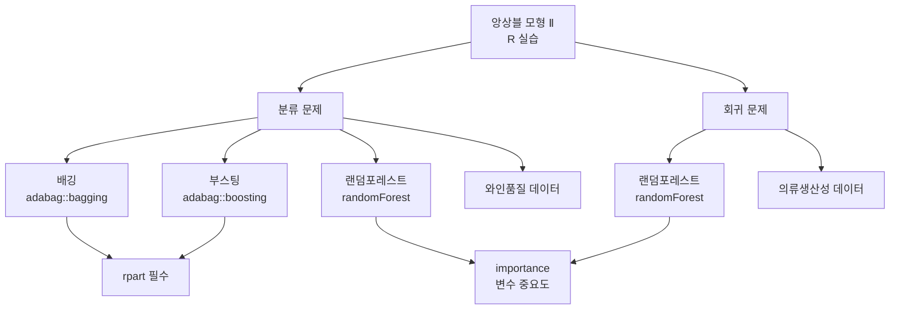

# 7강. 데이터마이닝: 앙상블 모형 Ⅱ

## 🔗 선수 지식 (Prerequisites)
- [ ] **필수**: [6강. 앙상블 모형 Ⅰ](6강.%20앙상블%20모형%20Ⅰ.md) - 배깅, 부스팅, 랜덤포레스트의 이론적 원리 이해 완료?
- [ ] **필수**: [4강. 의사결정나무 Ⅰ](4강.%20의사결정나무%20Ⅰ.md) - CART 나무모형 기본 개념 이해 완료?
- [ ] **권장**: R 프로그래밍 기본 문법 (`formula`, 패키지 설치/로드)
- **관련 단원**: [5강. 의사결정나무 Ⅱ](5강.%20의사결정나무%20Ⅱ.md)

---

## 학습 목표
1. 회귀분석의 방법으로서 랜덤포레스트 활용방법을 이해할 수 있다.
2. 분류 앙상블 방법을 이해하고 차이점을 설명할 수 있다.
3. R를 활용하여 회귀분석 및 분류 앙상블을 수행할 줄 안다.
4. R의 분석결과를 해석할 수 있다.

---

## 🧠 메타인지 체크 (학습 전/후 자기 평가)

### 학습 전 자기 평가
| 소주제 | 자신감 (1-5) |
| :--- | :--- |
| R에서 배깅/부스팅/랜덤포레스트 패키지 및 함수 사용법 | |
| 분류 앙상블 (와인품질 데이터) 실습 | |
| 회귀 앙상블 (의류생산성 데이터) 실습 | |
| R 분석결과 해석 (변수 중요도, 예측 정확도) | |

### 학습 후 교정 (학습 완료 후 작성)
| 소주제 | 학습 전 | 학습 후 | 실제 정답률 | 과신/과소 여부 |
| :--- | :--- | :--- | :--- | :--- |
| R에서 배깅/부스팅/랜덤포레스트 패키지 및 함수 사용법 | | | | |
| 분류 앙상블 (와인품질 데이터) 실습 | | | | |
| 회귀 앙상블 (의류생산성 데이터) 실습 | | | | |
| R 분석결과 해석 (변수 중요도, 예측 정확도) | | | | |

> **활용법**: 학습 전 1분 → 자신감 기입, 학습 후 1분 → 나머지 기입. "과신" 영역이 실제 취약점.

---

## 📝 요약 (Summary)
1. 🔴 **rpart**: CART형태의 나무모형을 구현하기 위한 패키지로서 배깅과 부스팅 실행을 위해서 필수적으로 설치해야 한다.
2. 🔴 **adabag**: 배깅과 부스팅을 실행하기 위해 설치하는 R 패키지이다. `bagging` 함수와 `boosting` 함수를 포함한다.
3. 🔴 **bagging 함수**: 배깅 앙상블을 수행하기 위한 함수로, adabag 패키지에 포함되어 있다.
4. 🔴 **boosting 함수**: 부스팅 앙상블을 수행하기 위한 함수로, adabag 패키지에 포함되어 있다.
5. 🔴 **randomForest**: 랜덤포레스트 방법을 실행하기 위해 설치하는 R 패키지이자, 랜덤포레스트를 구현할 때 패키지명과 동일한 함수명을 사용한다.
6. 🟡 **분류 실습**: 와인품질 데이터를 이용하여 배깅, 부스팅, 랜덤포레스트 세 가지 방법으로 분류분석을 수행한다.
7. 🟡 **회귀 실습**: 의류생산성 데이터를 이용하여 랜덤포레스트로 회귀분석을 수행한다.
8. 🟢 **앙상블 모형의 범용성**: 목표변수의 형태에 따라 분류분석에도, 회귀분석에도 사용 가능하다.

---

## 📐 핵심 정의 및 원리 (Key Definitions & Principles)

| 정의명 | 내용 | 키워드 |
| :--- | :--- | :--- |
| **rpart** | CART형태의 나무모형 구현 패키지. 배깅·부스팅의 기반 모델로 필수 설치 | 🔴 CART, 나무모형, 기반 패키지 |
| **adabag** | 배깅(`bagging`)과 부스팅(`boosting`) 함수를 제공하는 R 패키지 | 🔴 bagging, boosting |
| **bagging 함수** | `bagging(formula, data, ...)` 형태로 배깅 앙상블 수행 | 🔴 adabag 패키지 |
| **boosting 함수** | `boosting(formula, data, ...)` 형태로 부스팅 앙상블 수행 | 🔴 adabag 패키지 |
| **randomForest** | 랜덤포레스트 실행을 위한 R 패키지이자 함수명. 분류·회귀 모두 지원 | 🔴 패키지명 = 함수명 |
| **importance 함수** | randomForest 패키지에서 변수 중요도를 산출하는 함수. `type=1`(MeanDecreaseAccuracy)과 `type=2`(MeanDecreaseGini) 두 지표를 제공 | 🔴 변수 선택 |
| **MeanDecreaseAccuracy** | `type=1`. OOB 표본에서 해당 변수를 무작위로 순열(permutation)했을 때 정확도가 얼마나 감소하는지로 중요도 측정 | 🔴 OOB 순열 |
| **MeanDecreaseGini** | `type=2`. 해당 변수로 분할할 때 발생하는 노드 불순도(지니계수) 감소량의 합으로 중요도 측정 | 🔴 노드 불순도 |
| **OOB 오차** | Out-of-Bag 오차. 부트스트랩에서 제외된 약 37% 표본으로 일반화오차를 추정 | 🔴 일반화오차 추정 |
| **formula: y ~ .** | R에서 데이터 내 모든 입력변수(독립변수)를 모형에 포함시키라는 의미 | 🔴 R 문법 |

### 주요 원리

**앙상블 모형의 분류/회귀 적용 원리**
> **핵심**: 앙상블 모형은 목표변수(y)가 범주형이면 **분류**, 연속형이면 **회귀**로 자동 적용된다.
> - 분류: 다수결 투표(majority vote)로 최종 클래스 결정
> - 회귀: 개별 모형 예측값의 평균으로 최종 예측값 산출
> **AI 적용**: 실무에서 XGBoost, LightGBM 등 최신 앙상블 라이브러리도 동일한 원리로 분류/회귀를 지원

**랜덤포레스트의 트리 탈상관화(Decorrelation) 메커니즘**
> **핵심**: 배깅은 모든 분할에서 전체 변수를 후보로 쓰므로 트리들이 비슷해져(상관↑) 분산 감소 효과가 제한된다. 랜덤포레스트는 각 분할 후보를 `mtry`개로 제한하여 트리 간 상관(correlation)을 낮추므로(탈상관화), 배깅보다 분산을 더 효과적으로 줄인다.

**OOB(Out-of-Bag) 오차에 의한 일반화오차 추정**
> **핵심**: 각 부트스트랩 표본은 원자료의 약 63%만 포함하므로, 제외된 약 37%(OOB 표본)는 해당 트리 학습에 쓰이지 않는다. 이 OOB 표본으로 예측해 모은 오차가 **OOB 오차**이며, 별도의 검증셋·교차검증 없이도 일반화오차를 추정할 수 있다. `importance()`의 MeanDecreaseAccuracy도 이 OOB 표본의 순열 기반으로 계산된다.

---

## 📊 개념 시각화 (Visual Guide)

### 개념 관계도 (앙상블 모형 R 실습 체계)


### R 패키지·함수 매핑표
| 앙상블 방법 | 필수 패키지 | 실행 함수 | 적용 데이터 | 문제 유형 |
| :--- | :--- | :--- | :--- | :--- |
| **배깅** | rpart, adabag | `bagging()` | 와인품질 | 분류 |
| **부스팅** | rpart, adabag | `boosting()` | 와인품질 | 분류 |
| **랜덤포레스트** | randomForest | `randomForest()` | 와인품질 / 의류생산성 | 분류 / 회귀 |

---

## ✏️ 심화 학습 (Study Subject)

### 1. 가상 시나리오: "어떤 앙상블 방법을 선택해야 할까?"
- **상황**: 온라인 쇼핑몰에서 고객 리뷰 텍스트의 감성(긍정/부정)을 분류하는 모델을 구축해야 한다. 변수가 수백 개로 매우 많고, 일부 변수는 노이즈가 심하다.
- **문제**: 배깅, 부스팅, 랜덤포레스트 중 어떤 방법이 가장 적합할까?
- **해결**: 랜덤포레스트가 적합하다. 각 트리에서 변수를 랜덤 샘플링하므로 고차원 데이터에서 과적합을 방지하고, `importance()` 함수로 핵심 변수를 선별할 수 있다.
- **AI 학습 포인트**: "배깅과 랜덤포레스트는 모두 부트스트랩 샘플을 사용하는데, 랜덤포레스트가 변수 랜덤 선택을 추가한 이유는 무엇이며, 이것이 분산 감소에 어떤 영향을 미치는가?"

### 2. 관점별 비교 및 오개념 분석

**핵심 비교: 배깅 vs 부스팅 vs 랜덤포레스트**

| 구분 | 배깅 (Bagging) | 부스팅 (Boosting) | 랜덤포레스트 (RF) |
| :--- | :--- | :--- | :--- |
| **샘플링** | 부트스트랩 복원추출 | 가중치 기반 재샘플링 | 부트스트랩 + 변수 랜덤선택 |
| **모형 결합** | 병렬 독립 학습 → 다수결 | 순차 학습 → 가중 투표 | 병렬 독립 학습 → 다수결 |
| **편향-분산** | 분산 감소 | 편향 감소 | 분산 감소 (배깅보다 효과적) |
| **R 패키지** | adabag | adabag | randomForest |
| **R 함수** | `bagging()` | `boosting()` | `randomForest()` |

**오개념 분석**
- **오개념 1**: "rpart는 랜덤포레스트를 실행하기 위한 패키지이다"
- **분석**: rpart는 CART 나무모형 구현 패키지로, 배깅과 부스팅(adabag)의 기반이 된다. 랜덤포레스트는 별도의 `randomForest` 패키지를 사용한다.
- **오개념 2**: "R에서 `y ~ .`은 상수항 모형을 적합하라는 의미이다"
- **분석**: `y ~ .`은 데이터 내의 **모든 입력변수(독립변수)를 모형에 포함**시키라는 의미이다. 상수항만의 모형은 `y ~ 1`로 표현한다.
- **AI 학습 포인트**: "배깅의 기반 학습기로 rpart(의사결정나무)를 사용하는 이유는 무엇인가? 다른 기반 학습기를 사용하면 성능이 어떻게 달라지는가?"

---

## ❓ 연습 문제 및 해설

> **블룸 인지 수준 범례**: [기억] 정의·나열 → [이해] 설명·비교 → [적용] 계산·구현 → [분석] 구별·디버그 → [평가] 판단·비평 → [창조] 설계·제안

### 📝 문제

**1. ⭐ [기억] 📎 기출 — 다음 중 R에서 배깅과 부스팅을 수행하기 위해 필요한 패키지나 함수로 가장 거리가 먼 것은?[](#prob-1)**
   > ① rpart
   > ② adabag
   > ③ bagging
   > ④ cluster

<br>

**2. ⭐ [이해] 📎 기출 — 다음은 R을 이용한 랜덤포레스트 수행과정의 일부이다. "y ~ ."이 의미하는 것은?[](#prob-2)**
   > ① 모형 적합 시 상수항을 생략하라.
   > ② 모형 적합 시 데이터의 모든 입력변수(독립변수)를 제거하라.
   > ③ 모형 적합 시 모든 입력변수(독립변수)를 포함하라.
   > ④ 상수항 모형을 적합하라.

<br>

**3. ⭐ [기억] 📎 기출 — 다음 중 R의 randomForest 패키지에서 의미 있는 변수를 선택하기 위해 사용하는 함수로서 가장 적당한 것은?[](#prob-3)**
   > ① importance
   > ② plot
   > ③ predict
   > ④ step

<br>

**4. ⭐⭐ [이해] 📌 — 배깅과 부스팅을 R에서 수행하기 위해 반드시 함께 설치해야 하는 패키지로 올바른 조합은?[](#prob-4)**
   > ① adabag만 설치하면 된다
   > ② randomForest와 adabag
   > ③ rpart와 adabag
   > ④ rpart와 randomForest

<br>

**5. ⭐⭐ [분석] 📌 — 다음 중 R의 앙상블 함수와 해당 패키지의 연결이 올바르지 않은 것은?[](#prob-5)**
   > ① `bagging()` — adabag
   > ② `boosting()` — adabag
   > ③ `randomForest()` — randomForest
   > ④ `bagging()` — randomForest

<br>

**6. ⭐⭐ [적용] 📌 — 와인품질 데이터(분류)와 의류생산성 데이터(회귀)에 대해, 본 강에서 사용한 앙상블 방법의 조합으로 올바른 것은?[](#prob-6)**
   > ① 분류: 배깅+부스팅+랜덤포레스트 / 회귀: 부스팅
   > ② 분류: 배깅+부스팅 / 회귀: 랜덤포레스트
   > ③ 분류: 배깅+부스팅+랜덤포레스트 / 회귀: 랜덤포레스트
   > ④ 분류: 랜덤포레스트 / 회귀: 배깅+부스팅+랜덤포레스트

<br>

**7. ⭐⭐⭐ [분석] 📌 — randomForest 패키지에서 `importance()` 함수가 반환하는 변수 중요도 지표를 활용하여 모형을 개선하려 한다. 이 과정에서 기대할 수 있는 효과를 서술하시오.[](#prob-7)**

---

### 🔑 정답 및 해설 (먼저 풀어본 후 펼치기)

<details>
<summary>정답 보기 (클릭)</summary>

1. ④
2. ③
3. ①
4. ③
5. ④
6. ③
7. [서술형]

</details>

<details>
<summary>해설 보기 (클릭)</summary>

<a id="prob-1"></a>
**1. ⭐ [기억] 📎 기출 — 배깅과 부스팅 패키지/함수로 가장 거리가 먼 것**
> **정답: ④ cluster**
> **해설**: 배깅과 부스팅을 수행하기 위해 필요한 패키지로서 rpart와 adabag 등이 있으며 함수로서는 bagging과 boosting이 있다. cluster는 군집분석 관련 패키지로, 배깅/부스팅과는 관련이 없다.

<a id="prob-2"></a>
**2. ⭐ [이해] 📎 기출 — "y ~ ."의 의미**
> **정답: ③ 모형 적합 시 모든 입력변수(독립변수)를 포함하라.**
> **해설**: R 프로그램에서 `y ~ .`가 의미하는 것은 데이터 내의 모든 입력변수(독립변수)를 모형에 포함시키라는 의미이다. `.`은 데이터프레임에서 y를 제외한 나머지 모든 변수를 뜻한다.

<a id="prob-3"></a>
**3. ⭐ [기억] 📎 기출 — randomForest에서 변수 선택 함수**
> **정답: ① importance**
> **해설**: R의 랜덤포레스트 패키지에서 중요변수를 선택하는 함수는 `importance`이다. `plot`은 시각화, `predict`는 예측, `step`은 단계적 변수선택(회귀모형)에 사용되는 함수이다.

<a id="prob-4"></a>
**4. ⭐⭐ [이해] 📌 — 배깅/부스팅 실행에 필요한 패키지 조합**
> **정답: ③ rpart와 adabag**
> **해설**: adabag 패키지의 bagging/boosting 함수는 내부적으로 rpart(CART 나무모형)를 기반 학습기로 사용하므로, 두 패키지를 모두 설치해야 한다. randomForest는 랜덤포레스트 전용 패키지이다.

<a id="prob-5"></a>
**5. ⭐⭐ [분석] 📌 — 함수-패키지 연결이 올바르지 않은 것**
> **정답: ④ `bagging()` — randomForest**
> **해설**: `bagging()` 함수는 adabag 패키지에 포함되어 있다. randomForest 패키지에는 `randomForest()` 함수가 포함되어 있으며, bagging 함수는 제공하지 않는다.

<a id="prob-6"></a>
**6. ⭐⭐ [적용] 📌 — 분류/회귀 앙상블 방법 조합**
> **정답: ③ 분류: 배깅+부스팅+랜덤포레스트 / 회귀: 랜덤포레스트**
> **해설**: 본 강에서는 와인품질 데이터(분류)에 대해 배깅, 부스팅, 랜덤포레스트 세 가지 방법을 모두 적용하고, 의류생산성 데이터(회귀)에 대해서는 랜덤포레스트를 이용하여 분석하였다.

<a id="prob-7"></a>
**7. ⭐⭐⭐ [분석] 📌 — importance 활용 모형 개선 효과**
> **정답**: importance() 함수는 두 가지 지표를 제공한다 — **MeanDecreaseAccuracy**(`type=1`, OOB 표본에서 변수를 순열했을 때의 정확도 감소량)와 **MeanDecreaseGini**(`type=2`, 노드 불순도 감소량의 합). 이를 활용하면 (1) 중요도가 낮은 변수를 제거하여 모형의 복잡도를 줄이고 과적합을 방지할 수 있고, (2) 핵심 변수만으로 모형을 재구성하여 예측 성능을 유지하면서 해석력을 높일 수 있으며, (3) 데이터 수집 비용을 절감하는 데 활용할 수 있다.

</details>

---

## ✅ O/X 확인문제

**1.** [rpart는 CART형태의 나무모형을 구현하기 위한 패키지로서 배깅과 부스팅 실행을 위해 필수적으로 설치해야 한다.](#ox-1) **(O / X)**
**2.** [adabag 패키지에는 bagging 함수만 포함되어 있고, boosting 함수는 별도 패키지에 있다.](#ox-2) **(O / X)**
**3.** [randomForest 패키지에서 랜덤포레스트를 실행하는 함수명은 패키지명과 동일한 randomForest이다.](#ox-3) **(O / X)**
**4.** [R에서 "y ~ ."은 y를 종속변수로 하고 상수항만 포함하는 모형을 의미한다.](#ox-4) **(O / X)**
**5.** [앙상블 모형은 분류분석에만 사용 가능하고, 회귀분석에는 사용할 수 없다.](#ox-5) **(O / X)**
**6.** [배깅 앙상블을 R에서 수행하려면 adabag 패키지 내의 bagging 함수를 사용한다.](#ox-6) **(O / X)**
**7.** [randomForest 패키지의 importance 함수는 모형의 예측값을 반환하는 함수이다.](#ox-7) **(O / X)**
**8.** [본 강에서 분류 문제의 예제로 와인품질 데이터를 사용하였다.](#ox-8) **(O / X)**
**9.** [부스팅 앙상블을 수행하기 위한 R 함수명은 boosting이며, adabag 패키지에 포함되어 있다.](#ox-9) **(O / X)**
**10.** [본 강에서 회귀 문제는 배깅, 부스팅, 랜덤포레스트 세 가지 방법 모두를 이용하여 분석하였다.](#ox-10) **(O / X)**
**11.** [cluster 패키지는 배깅과 부스팅을 수행하기 위해 필요한 패키지이다.](#ox-11) **(O / X)**
**12.** [랜덤포레스트는 분류와 회귀 모두에 사용할 수 있는 앙상블 방법이다.](#ox-12) **(O / X)**
**13.** [R에서 변수 중요도를 확인하기 위해 randomForest 패키지의 step 함수를 사용한다.](#ox-13) **(O / X)**
**14.** [adabag 패키지의 bagging 함수와 boosting 함수는 내부적으로 rpart를 기반 학습기로 사용한다.](#ox-14) **(O / X)**

<details>
<summary>O/X 정답 및 해설 보기 (클릭)</summary>

> <a id="ox-1"></a>
> **1. 정답**: O
> **해설**: rpart는 CART 나무모형 패키지로, adabag의 bagging/boosting 함수가 내부적으로 rpart를 기반 학습기로 사용하므로 필수 설치 대상이다.

> <a id="ox-2"></a>
> **2. 정답**: X
> **해설**: adabag 패키지에는 bagging 함수와 boosting 함수가 모두 포함되어 있다.

> <a id="ox-3"></a>
> **3. 정답**: O
> **해설**: randomForest 패키지에서 랜덤포레스트를 구현할 때 패키지명과 동일한 `randomForest()` 함수명을 사용한다.

> <a id="ox-4"></a>
> **4. 정답**: X
> **해설**: `y ~ .`은 데이터 내의 모든 입력변수(독립변수)를 모형에 포함시키라는 의미이다. 상수항 모형은 `y ~ 1`로 표현한다.

> <a id="ox-5"></a>
> **5. 정답**: X
> **해설**: 앙상블 모형은 목표변수의 형태에 따라 분류분석에도, 회귀분석에도 사용 가능하다.

> <a id="ox-6"></a>
> **6. 정답**: O
> **해설**: 배깅 앙상블을 수행하기 위해서는 adabag 패키지 내의 `bagging()` 함수가 필요하다.

> <a id="ox-7"></a>
> **7. 정답**: X
> **해설**: `importance()` 함수는 변수 중요도를 산출하는 함수이다. 예측값을 반환하는 함수는 `predict()`이다.

> <a id="ox-8"></a>
> **8. 정답**: O
> **해설**: 분류의 예제로서 와인품질 데이터를, 회귀의 예제로서 의류생산성 데이터를 사용하였다.

> <a id="ox-9"></a>
> **9. 정답**: O
> **해설**: 부스팅 앙상블을 수행하기 위한 함수는 `boosting()`으로서 adabag 패키지에 포함되어 있다.

> <a id="ox-10"></a>
> **10. 정답**: X
> **해설**: 회귀 문제는 랜덤포레스트만을 이용하여 분석하였다. 세 가지 방법 모두를 사용한 것은 분류 문제이다.

> <a id="ox-11"></a>
> **11. 정답**: X
> **해설**: cluster는 군집분석 관련 패키지로, 배깅/부스팅과는 관련이 없다. 배깅/부스팅에는 rpart와 adabag가 필요하다.

> <a id="ox-12"></a>
> **12. 정답**: O
> **해설**: 랜덤포레스트는 목표변수가 범주형이면 분류, 연속형이면 회귀로 적용할 수 있다.

> <a id="ox-13"></a>
> **13. 정답**: X
> **해설**: 변수 중요도를 확인하는 함수는 `importance()`이다. `step()`은 단계적 변수선택법으로 회귀모형에서 사용하는 함수이다.

> <a id="ox-14"></a>
> **14. 정답**: O
> **해설**: adabag 패키지의 배깅/부스팅 함수는 rpart(CART 나무모형)를 기반 학습기로 사용하므로, rpart 패키지가 반드시 설치되어 있어야 한다.

</details>

---

## 🧪 자유 회상 연습 (Free Recall)

> **방법**: 위의 노트를 모두 덮고, 타이머 3분 설정 후 이번 단원에서 배운 내용을 기억나는 대로 자유롭게 적으세요.
> 정확한 문장이 아니어도 됩니다. 키워드, 패키지명, 함수명 등 떠오르는 것을 모두 적습니다.

**자유 회상 작성란:**

```
[여기에 기억나는 내용을 자유롭게 작성]


```

> **회상 후 점검**: 노트를 다시 펼쳐 빠뜨린 내용을 확인하세요. 빠뜨린 부분이 실제 취약점입니다.
> - 회상 못한 핵심 개념: [                ]
> - 회상 못한 패키지/함수: [                ]

---

## 💻 코드로 확인하기 (Code Verification)

```python
# R 앙상블 실습을 Python(sklearn)으로 재현하여 개념 확인
from sklearn.ensemble import BaggingClassifier, AdaBoostClassifier, RandomForestClassifier, RandomForestRegressor
from sklearn.tree import DecisionTreeClassifier
from sklearn.datasets import load_wine
from sklearn.model_selection import train_test_split
from sklearn.metrics import accuracy_score
import numpy as np

# --- 분류 예제: 와인 데이터 ---
wine = load_wine()
X_train, X_test, y_train, y_test = train_test_split(
    wine.data, wine.target, test_size=0.3, random_state=42
)

# 배깅 (R의 adabag::bagging에 대응)
bag_model = BaggingClassifier(
    estimator=DecisionTreeClassifier(), n_estimators=100, random_state=42
)
bag_model.fit(X_train, y_train)
print(f"배깅 정확도: {accuracy_score(y_test, bag_model.predict(X_test)):.4f}")

# 부스팅 (R의 adabag::boosting에 대응)
# 각주: sklearn 1.4+에서 AdaBoostClassifier의 기본 algorithm이 'SAMME'로 변경되고
#       'SAMME.R'은 deprecated 되었다(1.6에서 제거). 구버전에서는 algorithm='SAMME.R'이 기본이었다.
boost_model = AdaBoostClassifier(
    estimator=DecisionTreeClassifier(max_depth=1), n_estimators=100, random_state=42
)
boost_model.fit(X_train, y_train)
print(f"부스팅 정확도: {accuracy_score(y_test, boost_model.predict(X_test)):.4f}")

# 랜덤포레스트 (R의 randomForest에 대응)
rf_model = RandomForestClassifier(n_estimators=100, random_state=42)
rf_model.fit(X_train, y_train)
print(f"랜덤포레스트 정확도: {accuracy_score(y_test, rf_model.predict(X_test)):.4f}")

# 변수 중요도 (R의 importance()에 대응)
importances = rf_model.feature_importances_
top_idx = np.argsort(importances)[::-1][:5]
print("\n[변수 중요도 Top 5]")
for i in top_idx:
    print(f"  {wine.feature_names[i]}: {importances[i]:.4f}")
```

> **실행 결과** (예시):
> ```
> 배깅 정확도: 0.9630
> 부스팅 정확도: 0.9259
> 랜덤포레스트 정확도: 1.0000
>
> [변수 중요도 Top 5]
>   flavanoids: 0.1987
>   color_intensity: 0.1654
>   proline: 0.1432
>   alcohol: 0.1201
>   od280/od315_of_diluted_wines: 0.0876
> ```
> **해석**: Python의 sklearn에서도 R과 동일한 원리로 배깅(BaggingClassifier), 부스팅(AdaBoostClassifier), 랜덤포레스트(RandomForestClassifier)를 수행할 수 있으며, `feature_importances_`가 R의 `importance()` 함수에 대응된다.

---

## 🤖 AI 연결고리 (Data Mining → AI Application)

| 학습 개념 | AI/ML 적용 분야 | 구체적 사례 |
| :--- | :--- | :--- |
| **배깅 (Bagging)** | 분산 감소를 통한 안정적 예측 | 의료 진단에서 단일 나무모형의 불안정성 해결 |
| **부스팅 (Boosting)** | 순차적 학습을 통한 정확도 향상 | Kaggle 대회에서 XGBoost/LightGBM으로 상위권 달성 |
| **랜덤포레스트** | 변수 중요도 기반 특성 선택 | 금융 사기 탐지에서 핵심 거래 특성 식별 |
| **importance()** | 해석 가능한 AI (Explainable AI) | SHAP, LIME과 함께 모델 해석에 활용 |
| **R formula (y ~ .)** | 자동화된 모델링 파이프라인 | AutoML 시스템에서 전체 변수 자동 투입 |

---

## 📖 심화 학습 예시 답안

#### 1. 앙상블 모형의 R 실습 워크플로우

1. **패키지 설치·로드**: `install.packages("rpart")`, `install.packages("adabag")`, `install.packages("randomForest")`로 필요 패키지를 설치한다.
2. **데이터 준비**: 목표변수의 형태(범주형/연속형)에 따라 분류/회귀 문제를 구분한다.
3. **모형 적합**: `bagging(y ~ ., data=...)`, `boosting(y ~ ., data=...)`, `randomForest(y ~ ., data=...)`로 앙상블 모형을 학습한다.
4. **결과 해석**: 예측 정확도 확인, `importance()` 함수로 변수 중요도를 산출하여 핵심 변수를 파악한다.

#### 2. 배깅 vs 부스팅 vs 랜덤포레스트 비교표

| 구분 | 배깅 (Bagging) | 부스팅 (Boosting) | 랜덤포레스트 (RF) | 비고 |
| :--- | :--- | :--- | :--- | :--- |
| **학습 방식** | 병렬 (독립) | 순차 (의존) | 병렬 (독립) | |
| **기반 패키지 (R)** | rpart + adabag | rpart + adabag | randomForest | RF는 독립 패키지 |
| **변수 처리** | 전체 변수 사용 | 전체 변수 사용 | 랜덤 변수 부분집합 | RF의 핵심 차별점 |
| **과적합 경향** | 낮음 | 높을 수 있음 | 매우 낮음 | |
| **AI 활용** | 기본 앙상블 | XGBoost, LightGBM으로 발전 | 변수 중요도, 특성 선택 | |

#### 3. R 앙상블 코드 작성법 (Best Practice)

- **Bad Practice (나쁜 예시)**
  ```r
  # adabag만 설치하고 rpart를 설치하지 않음
  library(adabag)
  result <- bagging(y ~ ., data = train)  # 오류 발생!
  ```
- **Good Practice (좋은 예시)**
  ```r
  # rpart를 먼저 설치·로드한 후 adabag 사용
  library(rpart)
  library(adabag)
  result <- bagging(y ~ ., data = train)
  pred <- predict(result, newdata = test)

  # 랜덤포레스트: 변수 중요도까지 확인
  library(randomForest)
  rf <- randomForest(y ~ ., data = train)
  importance(rf)  # 변수 중요도 산출
  ```
- **설명**: adabag의 배깅/부스팅은 rpart를 기반 학습기로 사용하므로 반드시 rpart를 먼저 설치해야 한다. 또한 랜덤포레스트 사용 시 `importance()` 함수로 변수 중요도를 확인하는 것이 모형 해석의 핵심이다.

#### 4. 최신 그래디언트 부스팅 vs 교과서 앙상블 (XGBoost/LightGBM vs adabag/RF)

| 비교 항목 | adabag (배깅/부스팅) · randomForest | XGBoost | LightGBM |
| :--- | :--- | :--- | :--- |
| **정규화(Regularization)** | 사실상 없음 (가지치기·트리 수에 의존) | L1·L2 정규화 항을 목적함수에 내장 | L1·L2 정규화 내장 |
| **결측치 처리** | 별도 전처리/대치 필요 | 결측치 자동 학습(default direction) | 결측치 자동 처리 |
| **분할 방식** | 정확 분할(exact, 전체 후보 탐색) | 히스토그램/근사 분할 지원 | 히스토그램 기반 + leaf-wise 성장 |
| **병렬화** | 트리 단위 병렬(RF)·순차(부스팅) | 분할 탐색 수준의 병렬화 | 고도 병렬화 + GPU 지원 |
| **대용량 적합성** | 중소규모에 적합 | 대규모에 강함 | 초대규모·고차원에 가장 빠름 |

> **요약**: adabag·randomForest가 개념 학습·해석에 적합한 교과서 표준이라면, XGBoost/LightGBM은 정규화·결측치 자동처리·히스토그램 분할·병렬화로 대규모 실무 성능을 끌어올린 현대적 구현이다.

#### 5. TreeSHAP과 importance()의 관계 (전역 + 국소 설명)

- `importance()`(MeanDecreaseAccuracy/Gini)는 모형 전체에 대한 **전역(global) 변수 중요도** 하나의 값만 제공한다.
- **TreeSHAP**은 게임이론(Shapley value) 기반으로 트리 앙상블에서 효율적으로 SHAP 값을 계산하여, 전역 중요도(SHAP 값의 평균 절댓값)뿐 아니라 **각 개별 예측에 대한 국소(local) 기여도**까지 제공한다.
- 즉 TreeSHAP은 importance()의 전역 중요도를 일반화·정교화하면서, "이 한 건의 예측이 왜 이렇게 나왔는가"를 설명하는 XAI(설명가능 AI) 도구로 확장된다.

---

## 📚 핵심 용어집 (Glossary)

| 용어 (한) | 용어 (영) | 수식 표현 | 정의 |
| :--- | :--- | :--- | :--- |
| **rpart** | rpart | — | CART형태의 나무모형 구현 R 패키지. 배깅·부스팅의 기반 학습기로 필수 설치 |
| **adabag** | adabag | — | 배깅(`bagging`)과 부스팅(`boosting`) 함수를 제공하는 R 패키지 |
| **배깅** | Bagging | — | 부트스트랩 복원추출로 여러 모형을 독립 학습 후 다수결로 결합하는 앙상블 방법. →←6강 |
| **부스팅** | Boosting | — | 이전 모형의 오류에 가중치를 부여하며 순차적으로 학습하는 앙상블 방법. →←6강 |
| **랜덤포레스트** | Random Forest | — | 배깅에 변수 랜덤 선택을 추가한 앙상블 방법. R 패키지명이자 함수명. →←6강 |
| **변수 중요도** | Variable Importance | — | 각 입력변수가 모형 성능에 기여하는 정도. `importance()` 함수로 산출 |
| **MeanDecreaseAccuracy** | Mean Decrease in Accuracy | — | `importance(type=1)`. OOB 표본에서 변수를 순열했을 때 정확도 감소량으로 측정한 중요도 |
| **MeanDecreaseGini** | Mean Decrease in Gini | — | `importance(type=2)`. 변수 분할 시 노드 불순도(지니) 감소량의 합으로 측정한 중요도 |
| **OOB 오차** | Out-of-Bag Error | — | 부트스트랩에서 제외된 약 37% 표본으로 추정한 일반화오차 |
| **트리 탈상관화** | Tree Decorrelation | — | 각 분할 후보를 `mtry`개로 제한해 트리 간 상관을 낮춰 분산을 더 줄이는 RF의 메커니즘 |
| **formula (y ~ .)** | R formula | `y \sim .` | R에서 데이터 내 모든 독립변수를 모형에 포함시키는 표현 |

---

## 🤖 AI 학습 파트너를 위한 추가 자료

### 1. 개념 이해를 위한 심층 질문 프롬프트
> **프롬프트 예시**: "R에서 배깅, 부스팅, 랜덤포레스트를 실행할 때 각각 필요한 패키지와 함수를 표로 정리하고, 왜 배깅/부스팅에는 rpart가 필수인지 내부 동작 원리를 설명해 줘."

### 2. 문제 해결 능력 강화를 위한 시나리오 프롬프트
> **프롬프트 예시**: "당신은 데이터 사이언티스트입니다. 와인품질 데이터를 분류하는 프로젝트에서 배깅, 부스팅, 랜덤포레스트의 결과가 서로 다를 때, 어떤 기준으로 최종 모형을 선택해야 하는지 각 방법의 장단점을 비교하여 설명해 줘."

### 3. R 코드 검증 프롬프트
> **프롬프트 예시**: "다음 R 코드의 실행 결과를 예측하고, 각 함수의 역할을 설명해 줘.
> ```r
> library(rpart); library(adabag); library(randomForest)
> bag <- bagging(quality ~ ., data = wine_train)
> rf <- randomForest(quality ~ ., data = wine_train)
> importance(rf)
> ```
> 1. `bagging()`과 `randomForest()`의 내부 동작 차이를 설명해 줘.
> 2. `importance(rf)` 결과를 어떻게 해석해야 하는지 알려줘."

---

## 🔄 복습 체크 (Spaced Repetition)
- [ ] 1일 후 복습 (날짜: 2026-03-09)
- [ ] 3일 후 복습 (날짜: 2026-03-11)
- [ ] 7일 후 복습 (날짜: 2026-03-15)
- [ ] 14일 후 복습 (날짜: 2026-03-22)
- [ ] 30일 후 복습 (날짜: 2026-04-07)

### 복습 시 자가 평가
| 회차 | 날짜 | 이해도 (1-5) | 취약 부분 메모 |
| :--- | :--- | :--- | :--- |
| 1차 | | | |
| 2차 | | | |
| 3차 | | | |

---

## 📚 참고 자료 (References)

- Alfaro, E., Gamez, M. and Garcia, N. (2013). "adabag: An R Package for Classification with Boosting and Bagging". *Journal of Statistical Software*, Vol 54, 2, pp. 1–35.
- Breiman, L. (1996). "Bagging predictors", *Machine Learning*, 24(2):123–140.
- Breiman, L. (2001). "Random Forests", *Machine Learning*, 45(1), 5-32.
- Freund, Y. and Schapire, R.E. (1997). "A Decision-Theoretic Generalization of On-Line Learning and an Application to Boosting", *Journal of Computer and System Sciences*, 55(1):119-139.
- Liaw, A. and Wiener, M. (2015). randomForest, R package.
- Therneau, T. and Atkinson, E. (2015), rpart: Recursive Partitioning and Regression Trees, R package.
