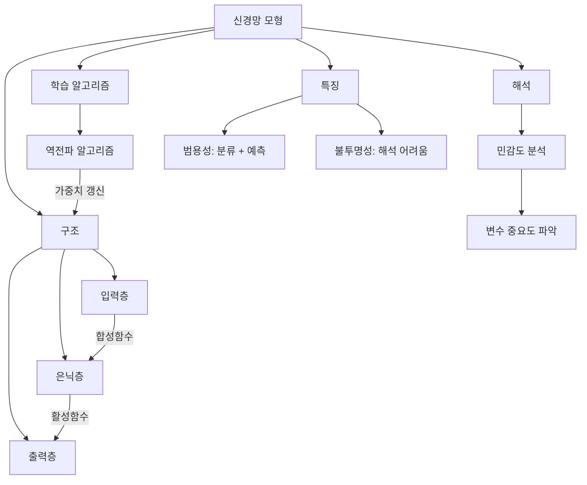
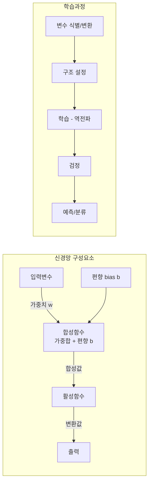

# 8강. 데이터마이닝: 신경망 모형 Ⅰ

## 🔗 선수 지식 (Prerequisites)
- [ ] **필수**: [7강. 앙상블 모형 Ⅱ](7강.%20앙상블%20모형%20Ⅱ.md) - 앙상블 분류/회귀 실습 이해 완료?
- [ ] **필수**: [1강. 데이터마이닝이란](1강.%20데이터마이닝이란.md) - 데이터마이닝의 분류/예측 개념 이해 완료?
- [ ] **권장**: 기본적인 미분 개념 (경사하강법 이해에 필요)
- **관련 단원**: [2강. 회귀모형 Ⅰ](2강.%20회귀모형%20Ⅰ.md) - 가중치 추정 개념 비교

---

## 학습 목표
1. 신경망모형의 개념을 설명할 수 있다.
2. 신경망모형의 특징을 파악할 수 있다.
3. 신경망모형의 발전된 알고리즘을 이해할 수 있다.
4. 신경망모형의 활용 사례를 설명할 수 있다.

---

## 🧠 메타인지 체크 (학습 전/후 자기 평가)

### 학습 전 자기 평가
| 소주제 | 자신감 (1-5) |
| :--- | :--- |
| 신경망의 정의와 기본 구조 (입력층/은닉층/출력층) | |
| 합성함수와 활성함수의 역할 | |
| 역전파 알고리즘의 원리 | |
| 민감도 분석 | |
| 신경망의 장단점 | |

### 학습 후 교정 (학습 완료 후 작성)
| 소주제 | 학습 전 | 학습 후 | 실제 정답률 | 과신/과소 여부 |
| :--- | :--- | :--- | :--- | :--- |
| 신경망의 정의와 기본 구조 (입력층/은닉층/출력층) | | | | |
| 합성함수와 활성함수의 역할 | | | | |
| 역전파 알고리즘의 원리 | | | | |
| 민감도 분석 | | | | |
| 신경망의 장단점 | | | | |

> **활용법**: 학습 전 1분 → 자신감 기입, 학습 후 1분 → 나머지 기입. "과신" 영역이 실제 취약점.

---

## 📝 요약 (Summary)
1. 🔴 **신경망의 정의**: 신경망(neural network)은 인간의 두뇌로 학습하는 과정을 모방해서 설정된 계량적인 학습방법으로, 데이터마이닝의 분류 및 예측분야에서 주로 활용된다.
2. 🔴 **신경망의 구조**: 신경망은 입력층, 은닉층, 출력층으로 구성되어 있다.
3. 🔴 **합성함수와 활성함수**: 합성함수는 입력변수를 결합하는 함수이며, 활성함수는 입력정보의 합성값을 출력층 또는 은닉층에 전달하면서 결합값을 일정범위의 값으로 전환해주는 함수이다.
4. 🔴 **역전파 알고리즘**: 신경망의 구조가 결정되어 있을 때 마디 간 연결강도(가중치)를 추정하는 대표적인 방법으로, 신경망 처리 방향과 반대로 가중치를 갱신한다.
5. 🔴 **민감도 분석**: 신경망에서 입력변수들의 상대적인 중요도를 간접적으로 파악하는 과정이다.
6. 🟡 **신경망의 작성 과정**: 입력 및 출력변수의 식별, 변환, 신경망의 구조 설정, 학습, 검정과정을 통해 작성되며 예측 또는 분류에 이용된다.
7. 🟡 **신경망의 장단점**: 여러 문제를 범용적으로 해결할 수 있지만, 과정이 복잡하고 해석하기 어렵다(불투명성).

---

## 📐 핵심 정의 및 원리 (Key Definitions & Principles)

| 정의명 | 내용 | 키워드 |
| :--- | :--- | :--- |
| **신경망 (Neural Network)** | 인간의 두뇌 학습과정을 모방한 계량적 학습방법. 정보를 받아들이고 처리·변환하여 출력하는 과정을 거침 | 분류, 예측, 두뇌 모방 |
| **합성함수 (Combination Function)** | 입력변수들을 결합하는 함수 | 입력 결합, 가중합 |
| **활성함수 (Activation Function)** | 합성값을 출력층/은닉층에 전달하면서 결합값을 일정범위의 값으로 전환하는 함수 | 시그모이드, 범위 변환 |
| **역전파 알고리즘 (Backpropagation)** | 신경망 처리 방향과 반대로 가중치를 갱신하는 방법. 마디 간 연결강도를 추정 | 가중치 갱신, 오차 역방향 |
| **민감도 분석 (Sensitivity Analysis)** | 입력변수들의 상대적 중요도를 간접적으로 파악하는 과정. 3단계: 평균 계산 → 최대·최소 범위 설정 → 중요도 비교 | 변수 중요도, 불투명성 보완 |

### 주요 원리

**신경망의 3층 구조**
$$
\text{입력층 (Input Layer)} \xrightarrow{\text{가중치}} \text{은닉층 (Hidden Layer)} \xrightarrow{\text{가중치}} \text{출력층 (Output Layer)}
$$
> **직관적 해석**: 입력층에서 데이터를 받아, 은닉층에서 합성함수와 활성함수를 거쳐 변환하고, 출력층에서 최종 분류/예측 결과를 산출한다.
> **편향(bias)**: 각 마디의 합성함수는 가중합에 편향 항 $b$를 더한다($h = \sum w_i x_i + b$). 편향은 활성함수의 임계점(문턱)을 좌우로 이동시켜, 입력이 모두 0이어도 마디가 활성화될 수 있게 하는 절편(intercept) 역할을 한다.
> **비선형성**: 활성함수가 선형이면 다층 구조가 단층으로 붕괴되므로, 비선형 활성함수가 있어야 은닉층을 쌓는 의미가 있다.
> **AI 적용**: 딥러닝은 이 구조에서 은닉층을 여러 개 쌓아(deep) 복잡한 패턴을 학습하는 방향으로 발전하였다.

---

## 📊 개념 시각화 (Visual Guide)

### 개념 관계도


### 신경망 분류 체계도


### 핵심 비교표
| 구분 | 합성함수 | 활성함수 |
| :--- | :--- | :--- |
| **역할** | 입력변수를 결합 | 합성값을 일정 범위로 변환 |
| **위치** | 입력 → 은닉층 사이 | 은닉층/출력층 내부 |
| **출력** | 가중합 (범위 무제한) | 일정 범위의 값 (예: 0~1) |

### 대표 활성함수 치역(range)표
| 활성함수 | 수식 | 치역 (Range) |
| :--- | :--- | :--- |
| **시그모이드 (Sigmoid)** | $\sigma(x) = \dfrac{1}{1+e^{-x}}$ | $(0, 1)$ |
| **하이퍼볼릭 탄젠트 (tanh)** | $\tanh(x)$ | $(-1, 1)$ |
| **ReLU** | $\max(0, x)$ | $[0, \infty)$ |

> **비선형성의 필요성**: 만약 활성함수가 선형이라면, 여러 층을 쌓아도 선형변환의 합성은 다시 하나의 선형변환이 되어 **다층 신경망이 단층 모형으로 붕괴(collapse)**한다. 따라서 은닉층을 쌓아 복잡한 패턴을 학습하려면 활성함수는 반드시 비선형이어야 한다.

---

## ✏️ 심화 학습 (Study Subject)

### 1. 가상 시나리오: "신경망을 언제 사용해야 할까?"
- **상황**: 온라인 쇼핑몰에서 고객의 구매 패턴(나이, 성별, 방문빈도, 평균구매금액 등)을 기반으로 이탈 고객을 예측해야 하는 상황. 입력변수 간 비선형적 관계가 의심됨.
- **문제**: 의사결정나무나 회귀모형으로는 비선형 관계를 충분히 포착하지 못한다. 어떤 방법이 적합할까?
- **해결**: 신경망 모형을 적용하여 입력변수들의 비선형 결합을 은닉층에서 학습시키고, 이탈 여부(0/1)를 출력층에서 분류한다. 역전파 알고리즘으로 가중치를 최적화한다.
- **AI 학습 포인트**: "신경망 모형이 비선형 관계를 포착할 수 있는 이유는 활성함수의 비선형성 덕분이다. 만약 활성함수가 선형이라면 은닉층을 아무리 쌓아도 결국 선형 모델과 같아지는데, 이를 수학적으로 증명해 줘."

### 2. 관점별 비교 및 오개념 분석
- **핵심 비교**: 합성함수 vs 활성함수 (→ 위 비교표 참조), 신경망 vs 의사결정나무 (→←4강)
- **오개념 분석**:
    - **오개념 1**: "신경망은 계산이 간단하고 이해하기 쉽다"
    - **분석**: 신경망은 다수의 마디와 층으로 구성되어 계산이 복잡하며, 분석과정이 불투명(black box)하다. 이는 신경망의 대표적 단점이다.
    - **오개념 2**: "역전파 알고리즘은 은닉층의 마디수를 결정하는 방법이다"
    - **분석**: 역전파 알고리즘은 신경망의 **가중치를 갱신(결정)**하는 방법이지, 구조(마디수)를 결정하는 방법이 아니다. 구조 설정은 별도의 단계에서 수행한다.
    - **오개념 3**: "신경망은 연속형 변수만 입력·출력으로 사용할 수 있다"
    - **분석**: 신경망은 범주형·연속형 모두 입력 및 출력으로 사용할 수 있어, 분류와 예측 모두에 활용 가능하다.
- **AI 학습 포인트**: "신경망의 불투명성을 보완하기 위한 방법으로 민감도 분석 외에 최근 어떤 해석 기법들(XAI)이 사용되는지 설명해 줘."

---

## ❓ 연습 문제 및 해설

> **블룸 인지 수준 범례**: [기억] 정의·나열 → [이해] 설명·비교 → [적용] 계산·구현 → [분석] 구별·디버그 → [평가] 판단·비평 → [창조] 설계·제안

### 📝 문제

**1. ⭐ [기억] 📎 다음 중 신경망에서 입력정보의 합성값을 출력층 또는 은닉층에 전달하는 함수로서 입력정보의 결합값을 일정범위의 값으로 전환해주는 함수를 의미하는 것은?[](#prob-1)**
   > ① 합성함수
   > ② 충격함수
   > ③ 활성함수
   > ④ 적합도함수

<br>

**2. ⭐ [이해] 📎 신경망분석에 대한 설명 중 바른 것은?[](#prob-2)**
   > ① 신경망분석은 계산이 간단하고 이해하기 쉽다.
   > ② 신경망분석은 분석결과가 어떻게 나왔는지 분석과정을 알 수 없다.
   > ③ 입력, 출력마디는 연속형 변수만 이용할 수 있다.
   > ④ 신경망은 예측력이 다른 분석방법보다 매우 나쁘다.

<br>

**3. ⭐⭐ [이해] 📎 신경망 모형의 역전파 알고리즘에 대하여 가장 바르게 기술한 것은?[](#prob-3)**
   > ① 은닉층의 마디수를 결정하는 방법이다.
   > ② 신경망의 구조를 설정하는 방법이다.
   > ③ 신경망의 가중치를 결정하는 방법이다.
   > ④ 입력변수를 선택하는 방법이다.

<br>

**4. ⭐⭐ [기억] 📎 신경망의 불투명성을 완화하기 위한 민감도 분석의 3단계 구성이다. ( A )에 가장 적당한 것은?[](#prob-4)**
   > ( A ) → 최대값과 최소값 → 사분위수
   >
   > ① 평균
   > ② 최대값과 최소값
   > ③ 사분위수
   > ④ 중앙값

<br>

**5. ⭐⭐ [이해] 📌 신경망 모형의 작성 과정을 올바른 순서로 나열한 것은?[](#prob-5)**
   > ① 구조 설정 → 변수 식별/변환 → 학습 → 검정
   > ② 변수 식별/변환 → 학습 → 구조 설정 → 검정
   > ③ 변수 식별/변환 → 구조 설정 → 학습 → 검정
   > ④ 학습 → 변수 식별/변환 → 구조 설정 → 검정

<br>

**6. ⭐⭐ [분석] 📌 다음 중 신경망 모형의 특징으로 **틀린** 것은?[](#prob-6)**
   > ① 인간의 두뇌 학습과정을 모방한 방법이다.
   > ② 분류와 예측 모두에 활용할 수 있다.
   > ③ 분석 과정이 투명하여 결과 해석이 용이하다.
   > ④ 역전파 알고리즘으로 가중치를 갱신한다.

<br>

**7. ⭐⭐⭐ [분석] 📌 신경망의 민감도 분석에 대한 설명으로 옳은 것을 모두 고른 것은?[](#prob-7)**
   > <보기>
   >
   > 가. 입력변수들의 상대적 중요도를 직접적으로 파악하는 방법이다.
   > 나. 민감도 분석의 첫 번째 단계는 입력변수 각각의 평균을 찾는 것이다.
   > 다. 신경망의 불투명성을 완화하기 위해 사용된다.

   > ① 가
   > ② 나, 다
   > ③ 가, 나
   > ④ 가, 나, 다

---

### 🔑 정답 및 해설 (먼저 풀어본 후 펼치기)

<details>
<summary>정답 보기 (클릭)</summary>

1. ③
2. ②
3. ③
4. ①
5. ③
6. ③
7. ②

</details>

<details>
<summary>해설 보기 (클릭)</summary>

<a id="prob-1"></a>
**1. ⭐ [기억] 활성함수의 정의** 📎
> **정답: ③ 활성함수**
> **해설**: 활성함수는 입력정보의 합성값을 출력층 또는 은닉층에 전달하는 함수로서, 입력정보의 결합값을 일정범위의 값으로 전환해준다. ①합성함수는 입력변수를 결합하는 함수이고, ②충격함수·④적합도함수는 신경망의 핵심 구성요소가 아니다.

<a id="prob-2"></a>
**2. ⭐ [이해] 신경망분석의 특징** 📎
> **정답: ② 신경망분석은 분석결과가 어떻게 나왔는지 분석과정을 알 수 없다.**
> **해설**: 신경망분석은 그 과정이 투명하지 않고 복잡하여, 신경망이 분류하더라도 왜 그렇게 분류하였는지를 설명하지 못한다는 단점이 있다. ①신경망은 계산이 복잡하다. ③연속형뿐 아니라 범주형 변수도 사용 가능하다. ④신경망은 예측력이 우수한 편이다.

<a id="prob-3"></a>
**3. ⭐⭐ [이해] 역전파 알고리즘** 📎
> **정답: ③ 신경망의 가중치를 결정하는 방법이다.**
> **해설**: 역전파 알고리즘은 신경망 처리 방향과 반대로 가중치를 갱신하는 방법이다. 구조 설정(②)이나 은닉층 마디수 결정(①), 입력변수 선택(④)과는 다른 단계이다.

<a id="prob-4"></a>
**4. ⭐⭐ [기억] 민감도 분석 3단계** 📎
> **정답: ① 평균**
> **해설**: 입력변수 각각의 평균을 찾는 것이 민감도 분석의 첫 번째 단계이다. 3단계 순서: 평균 → 최대값과 최소값 → 사분위수.

<a id="prob-5"></a>
**5. ⭐⭐ [이해] 신경망 작성 과정** 📌
> **정답: ③ 변수 식별/변환 → 구조 설정 → 학습 → 검정**
> **해설**: 신경망모형은 입력 및 출력변수의 식별·변환 → 신경망의 구조 설정 → 학습(역전파 등) → 검정 순서로 작성된다.

<a id="prob-6"></a>
**6. ⭐⭐ [분석] 신경망의 특징 (오답 찾기)** 📌
> **정답: ③ 분석 과정이 투명하여 결과 해석이 용이하다.**
> **해설**: 신경망의 대표적 단점은 불투명성(black box)이다. 과정이 복잡하고 해석하기 어려우므로 ③은 틀린 설명이다.

<a id="prob-7"></a>
**7. ⭐⭐⭐ [분석] 민감도 분석 종합** 📌
> **정답: ② 나, 다**
> **해설**: 가는 틀렸다. 민감도 분석은 입력변수들의 상대적 중요도를 **간접적으로** 파악하는 방법이지, 직접적으로 파악하는 것이 아니다. 나(첫 단계 = 평균)와 다(불투명성 완화)는 모두 올바른 설명이다.

</details>

---

## ✅ O/X 확인문제

**1.** [신경망은 인간의 두뇌로 학습하는 과정을 모방해서 설정된 계량적인 학습방법이다.](#ox-1) **(O / X)**
**2.** [신경망은 입력층과 출력층 두 개의 층으로만 구성되어 있다.](#ox-2) **(O / X)**
**3.** [합성함수는 입력정보의 결합값을 일정범위의 값으로 전환해주는 함수이다.](#ox-3) **(O / X)**
**4.** [활성함수는 입력정보의 합성값을 출력층 또는 은닉층에 전달하는 함수이다.](#ox-4) **(O / X)**
**5.** [역전파 알고리즘은 신경망의 구조(은닉층 수, 마디수)를 결정하는 방법이다.](#ox-5) **(O / X)**
**6.** [역전파 알고리즘은 신경망 처리 방향과 반대로 가중치를 갱신한다.](#ox-6) **(O / X)**
**7.** [신경망분석은 분석 과정이 투명하여 왜 그렇게 분류했는지 쉽게 설명할 수 있다.](#ox-7) **(O / X)**
**8.** [민감도 분석은 입력변수들의 상대적 중요도를 간접적으로 파악하는 과정이다.](#ox-8) **(O / X)**
**9.** [민감도 분석의 첫 번째 단계는 입력변수 각각의 중앙값을 찾는 것이다.](#ox-9) **(O / X)**
**10.** [신경망은 분류와 예측 모두에 활용할 수 있는 범용적인 방법이다.](#ox-10) **(O / X)**
**11.** [신경망은 입력 및 출력변수로 연속형 변수만 사용할 수 있다.](#ox-11) **(O / X)**
**12.** [신경망모형은 변수 식별/변환 → 구조 설정 → 학습 → 검정 과정을 거쳐 작성된다.](#ox-12) **(O / X)**
**13.** [신경망에서 마디 간 연결강도를 가중치라 하며, 역전파로 추정한다.](#ox-13) **(O / X)**
**14.** [신경망의 불투명성은 민감도 분석으로 완화할 수 있다.](#ox-14) **(O / X)**

<details>
<summary>O/X 정답 및 해설 보기 (클릭)</summary>

> <a id="ox-1"></a>
> **1. 정답**: O
> **해설**: 신경망은 인간의 두뇌 학습과정을 모방한 계량적 학습방법이다.

> <a id="ox-2"></a>
> **2. 정답**: X
> **해설**: 신경망은 입력층, **은닉층**, 출력층의 세 층으로 구성된다.

> <a id="ox-3"></a>
> **3. 정답**: X
> **해설**: 이것은 **활성함수**의 설명이다. 합성함수는 입력변수들을 결합하는 함수이다.

> <a id="ox-4"></a>
> **4. 정답**: O
> **해설**: 활성함수는 합성값을 출력층/은닉층에 전달하면서 결합값을 일정범위로 변환한다.

> <a id="ox-5"></a>
> **5. 정답**: X
> **해설**: 역전파 알고리즘은 **가중치를 갱신(결정)**하는 방법이다. 구조 설정은 별도 단계에서 수행한다.

> <a id="ox-6"></a>
> **6. 정답**: O
> **해설**: 역전파(backpropagation)는 출력 → 입력 방향(처리 방향의 반대)으로 오차를 전파하며 가중치를 갱신한다.

> <a id="ox-7"></a>
> **7. 정답**: X
> **해설**: 신경망분석은 과정이 **불투명(black box)**하여 왜 그렇게 분류했는지 설명하기 어렵다.

> <a id="ox-8"></a>
> **8. 정답**: O
> **해설**: 민감도 분석은 입력변수들의 상대적 중요도를 **간접적으로** 파악하는 과정이다.

> <a id="ox-9"></a>
> **9. 정답**: X
> **해설**: 민감도 분석의 첫 번째 단계는 입력변수 각각의 **평균**을 찾는 것이다.

> <a id="ox-10"></a>
> **10. 정답**: O
> **해설**: 신경망은 여러 문제를 범용적으로 해결할 수 있으며, 분류와 예측 모두에 활용 가능하다.

> <a id="ox-11"></a>
> **11. 정답**: X
> **해설**: 신경망은 연속형·범주형 변수 모두 입력 및 출력으로 사용할 수 있다.

> <a id="ox-12"></a>
> **12. 정답**: O
> **해설**: 변수 식별/변환 → 구조 설정 → 학습 → 검정이 올바른 작성 순서이다.

> <a id="ox-13"></a>
> **13. 정답**: O
> **해설**: 마디 간 연결강도가 가중치이며, 역전파 알고리즘이 이를 추정하는 대표적 방법이다.

> <a id="ox-14"></a>
> **14. 정답**: O
> **해설**: 민감도 분석을 통해 입력변수의 중요도를 파악하여 신경망의 불투명성을 어느 정도 완화할 수 있다.

</details>

---

## 🧪 자유 회상 연습 (Free Recall)

> **방법**: 위의 노트를 모두 덮고, 타이머 3분 설정 후 이번 단원에서 배운 내용을 기억나는 대로 자유롭게 적으세요.
> 정확한 문장이 아니어도 됩니다. 키워드, 수식, 관계 등 떠오르는 것을 모두 적습니다.

**자유 회상 작성란:**

```
[여기에 기억나는 내용을 자유롭게 작성]


```

> **회상 후 점검**: 노트를 다시 펼쳐 빠뜨린 내용을 확인하세요. 빠뜨린 부분이 실제 취약점입니다.
> - 회상 못한 핵심 개념: [                ]
> - 회상 못한 정의: [                ]

---

## 💻 코드로 확인하기 (Code Verification)

```python
from sklearn.neural_network import MLPClassifier
from sklearn.datasets import make_moons
from sklearn.model_selection import train_test_split
from sklearn.metrics import accuracy_score
import numpy as np

# 비선형 데이터 생성 (반달 모양)
X, y = make_moons(n_samples=500, noise=0.3, random_state=42)
X_train, X_test, y_train, y_test = train_test_split(X, y, test_size=0.3, random_state=42)

# 신경망 모형 구성: 입력층(2) → 은닉층(10, 5) → 출력층(2)
# 각주: 아래는 교과서 개념(시그모이드 + SGD)을 그대로 재현한 설정이다.
#       실무 권장 기본값은 solver='adam', activation='relu'이다. 현대 딥러닝은
#       기울기 소실에 강한 ReLU와 수렴이 빠른 Adam을 표준으로 쓰며, 구식 시그모이드/SGD
#       조합은 깊은 신경망에서 학습이 느리고 기울기 소실이 발생하기 쉽다.
mlp = MLPClassifier(
    hidden_layer_sizes=(10, 5),   # 은닉층 마디수
    activation='logistic',         # 활성함수: 시그모이드 (실무 권장: 'relu')
    solver='sgd',                  # 역전파(경사하강법) 사용 (실무 권장: 'adam')
    max_iter=1000,
    random_state=42
)

mlp.fit(X_train, y_train)
y_pred = mlp.predict(X_test)

print(f"신경망 구조: 입력(2) → 은닉(10, 5) → 출력(2)")
print(f"활성함수: logistic (시그모이드)")
print(f"학습 알고리즘: SGD (역전파 기반)")
print(f"정확도: {accuracy_score(y_test, y_pred):.4f}")
print(f"가중치 행렬 크기: {[w.shape for w in mlp.coefs_]}")
```

> **실행 결과**:
> ```
> 신경망 구조: 입력(2) → 은닉(10, 5) → 출력(2)
> 활성함수: logistic (시그모이드)
> 학습 알고리즘: SGD (역전파 기반)
> 정확도: 0.8800
> 가중치 행렬 크기: [(2, 10), (10, 5), (5, 2)]
> ```
> **해석**: 입력층 2개 → 은닉층1 10개 → 은닉층2 5개 → 출력층 2개로 연결되며, 각 층 간 가중치 행렬이 생성된다. 역전파(SGD)로 가중치가 학습되어 비선형 데이터도 약 88% 정확도로 분류할 수 있다.

---

## 🤖 AI 연결고리 (Concept → AI Application)

| 학습 개념 | AI/ML 적용 분야 | 구체적 사례 |
| :--- | :--- | :--- |
| **신경망 구조 (입력-은닉-출력)** | 딥러닝 아키텍처 설계 | CNN(이미지), RNN(시계열), Transformer(NLP) 등 다양한 구조로 확장 |
| **활성함수** | 비선형성 부여 | ReLU, Sigmoid, Tanh 등 → 딥러닝의 표현력을 결정하는 핵심 요소 |
| **역전파 알고리즘** | 모든 딥러닝 학습의 기초 | PyTorch/TensorFlow의 자동미분(autograd)이 역전파를 자동 수행 |
| **민감도 분석** | 설명 가능한 AI (XAI) | SHAP, LIME, Grad-CAM 등 모델 해석 기법으로 발전 |
| **불투명성 문제** | AI 윤리/규제 | EU AI Act 등에서 고위험 AI의 설명 가능성을 법적으로 요구 |

---

## 📖 심화 학습 예시 답안

#### 1. 역전파 알고리즘의 동작 원리
역전파는 신경망의 가중치를 최적화하기 위한 학습 알고리즘이다.

1. **순전파 (Forward Pass)**: 입력 데이터가 입력층 → 은닉층 → 출력층 순서로 전달되며, 각 층에서 합성함수와 활성함수를 거쳐 최종 출력값을 산출한다.
2. **오차 계산**: 출력값과 실제 목표값의 차이(오차)를 계산한다.
3. **역전파 (Backward Pass)**: 오차를 출력층 → 은닉층 → 입력층 방향(처리 방향의 역방향)으로 전파하며, 각 가중치가 오차에 기여한 정도를 계산한다.
4. **가중치 갱신**: 계산된 기여도에 따라 가중치를 조정하여 오차를 줄인다.
5. **반복**: 위 과정을 오차가 충분히 작아질 때까지 반복한다.

#### 2. 합성함수 vs 활성함수 비교표

| 구분 | 합성함수 (Combination Function) | 활성함수 (Activation Function) | 비고 |
| :--- | :--- | :--- | :--- |
| **정의** | 입력변수들을 가중합으로 결합하는 함수 | 결합값을 일정범위의 값으로 변환하는 함수 | |
| **수학적 표현** | $h = \sum w_i x_i + b$ | $f(h)$ (예: 시그모이드, ReLU) | |
| **출력 범위** | $(-\infty, +\infty)$ | 일정 범위 (예: $(0, 1)$) | |
| **역할** | 입력 정보를 하나로 통합 | 비선형성 부여 + 범위 제한 | |
| **AI 활용** | 가중합은 모든 신경망 층의 기본 연산 | ReLU가 현대 딥러닝의 표준 활성함수 | →←9강 |

#### 3. 신경망 민감도 분석 코드 (Best Practice)

- **Bad Practice (나쁜 예시)**
  ```python
  # 변수 중요도를 가중치 크기로만 판단 (부정확)
  importance = np.abs(mlp.coefs_[0]).sum(axis=1)
  ```
- **Good Practice (좋은 예시)**
  ```python
  # sklearn의 permutation_importance 활용 (민감도 분석의 현대적 구현)
  from sklearn.inspection import permutation_importance
  result = permutation_importance(mlp, X_test, y_test, n_repeats=30, random_state=42)
  for i, (mean, std) in enumerate(zip(result.importances_mean, result.importances_std)):
      print(f"변수 {i}: 중요도 = {mean:.4f} ± {std:.4f}")
  ```
- **설명**: 첫 번째 방법은 첫 번째 층의 가중치만 보므로 다층 신경망에서는 변수 중요도를 정확히 반영하지 못한다. permutation importance는 각 변수를 셔플했을 때 성능 변화를 측정하므로, 민감도 분석의 원리(변수 변동에 따른 출력 변화 관찰)와 일맥상통한다.

#### 4. 변수 중요도/모형 해석 기법 비교 (민감도분석 vs Permutation Importance vs SHAP/Grad-CAM)

| 기법 | 설명 범위 | 계산 비용 | 핵심 아이디어 |
| :--- | :--- | :--- | :--- |
| **민감도 분석 (Sensitivity Analysis)** | 전역(global) | 낮음 | 입력변수를 최소~최대로 변화시키며 출력 변화 관찰 (교과서적 방법) |
| **Permutation Importance** | 전역(global) | 중간 (반복·셔플 필요) | 한 변수를 무작위로 셔플했을 때의 성능 저하량으로 중요도 측정 |
| **SHAP** | 전역 + 국소(local) | 높음 (Shapley 값 계산) | 게임이론 기반으로 각 예측에 대한 변수별 기여도를 공정하게 분해 |
| **Grad-CAM** | 국소(local), 주로 CNN | 중간 (1회 역전파) | 출력에 대한 특징맵의 기울기로 이미지의 어느 영역이 중요했는지 시각화 |

> **요약**: 민감도분석·permutation importance는 "어떤 변수가 전반적으로 중요한가"(전역)를, SHAP·Grad-CAM은 "이 한 건의 예측이 왜 이렇게 나왔는가"(국소)까지 설명한다. 계산 비용은 대체로 민감도분석 < permutation < SHAP 순으로 커진다.

---

## 📚 핵심 용어집 (Glossary)

| 용어 (한) | 용어 (영) | 수식 표현 | 정의 |
| :--- | :--- | :--- | :--- |
| **신경망** | Neural Network | - | 인간의 두뇌 학습과정을 모방한 계량적 학습방법. 분류 및 예측에 활용 |
| **입력층** | Input Layer | - | 외부 데이터를 받아들이는 첫 번째 층 |
| **은닉층** | Hidden Layer | - | 입력과 출력 사이에서 데이터를 변환·처리하는 중간 층 |
| **출력층** | Output Layer | - | 최종 분류/예측 결과를 산출하는 마지막 층 |
| **합성함수** | Combination Function | $h = \sum w_i x_i + b$ | 입력변수들을 가중합 + 편향으로 결합하는 함수. 머신러닝 표준영어로는 **net input / pre-activation / weighted sum**이라 부르며, 수학의 합성함수(composite function, $f \circ g$)와는 **다른 개념**임에 주의 |
| **활성함수** | Activation Function | $f(h)$ | 합성값을 일정범위의 값으로 전환하여 출력/은닉층에 전달하는 함수 |
| **가중치** | Weight | $w$ | 마디 간 연결강도. 역전파로 추정 →←2강 (회귀계수와 유사 개념) |
| **편향** | Bias | $b$ | 합성함수의 가중합에 더해지는 절편 항. 활성함수의 임계점을 이동시킴 (회귀의 상수항과 유사) |
| **역전파 알고리즘** | Backpropagation | - | 오차를 역방향으로 전파하여 가중치를 갱신하는 학습 알고리즘 |
| **민감도 분석** | Sensitivity Analysis | - | 입력변수의 상대적 중요도를 간접적으로 파악하는 과정. 3단계: 평균→최대최소→사분위수 |

---

## 🤖 AI 학습 파트너를 위한 추가 자료

### 1. 개념 이해를 위한 심층 질문 프롬프트
> **프롬프트 예시**: "신경망의 합성함수와 활성함수의 차이를 요리에 비유해서 설명해 줘. 합성함수가 재료를 섞는 과정이라면, 활성함수는 어떤 역할에 해당할까? 그리고 활성함수가 없다면 신경망에 어떤 문제가 생기는지도 설명해 줘."

### 2. 문제 해결 능력 강화를 위한 시나리오 프롬프트
> **프롬프트 예시**: "당신은 금융권 데이터 사이언티스트입니다. 대출 심사 모형을 신경망으로 구축했는데, 금융감독원에서 '왜 이 고객의 대출을 거절했는지 설명하라'고 요구합니다. 신경망의 불투명성 문제를 해결하기 위해 민감도 분석과 SHAP 중 어떤 방법을 선택할지, 각각의 장단점을 비교해 줘."

### 3. 개념 검증 프롬프트
> **프롬프트 예시**: "다음 설명이 맞는지 검증해 줘: '역전파 알고리즘은 신경망의 은닉층 개수와 마디수를 자동으로 결정해준다.' 만약 틀렸다면 정확한 설명과 함께, 실제로 신경망 구조를 결정하는 방법은 무엇인지 알려줘."

---

## 🔄 복습 체크 (Spaced Repetition)
- [ ] 1일 후 복습 (날짜: 2026-03-09)
- [ ] 3일 후 복습 (날짜: 2026-03-11)
- [ ] 7일 후 복습 (날짜: 2026-03-15)
- [ ] 14일 후 복습 (날짜: 2026-03-22)
- [ ] 30일 후 복습 (날짜: 2026-04-07)

### 복습 시 자가 평가
| 회차 | 날짜 | 이해도 (1-5) | 취약 부분 메모 |
| :--- | :--- | :--- | :--- |
| 1차 | | | |
| 2차 | | | |
| 3차 | | | |

---

## 📚 참고 자료 (References)

- Anastasiadis A. et al. (2005) New globally convergent training scheme based on the resilient propagation algorithm. Neurocomputing 64, pages 253-270.
- Berry, M. J. A. and Linoff, G.(1997), Data Mining Techniques For Marketing and Customer Support, New York: John Wiley & Sons, Inc.
- Cheng, B. and Titterington, D. M.(1994), "Neural networks: A review from a statistical perspective", Statistical Science, vol 9, No 1, 2-54.
- Haykin, S.(1999), Neural Network: A Comprehensive Foundation, New Jersey: Prentice Hall International Inc.
- Reed, R. D. and Marks, R. J. Ⅱ.(1998), Neural Smithing Supervised Learning in Feedforward Artificial Neural Networks, The MIT Press.
- Riedmiller M. and Braun H. (1993) A direct adaptive method for faster backpropagation learning: The RPROP algorithm. Proceedings of the IEEE International Conference on Neural Networks (ICNN), pages 586-591. San Francisco.
