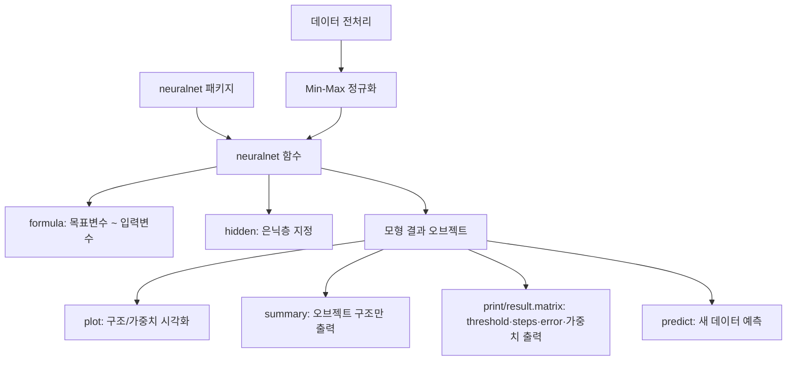

# 9강. 데이터마이닝: 신경망 모형 Ⅱ

## 🔗 선수 지식 (Prerequisites)
- [ ] **필수**: [8강. 신경망 모형 Ⅰ](8강.%20신경망%20모형%20Ⅰ.md) - 신경망의 기본 구조, 활성화 함수, 역전파 알고리즘 이해 완료?
- [ ] **권장**: R 프로그래밍 기초 (패키지 설치, 함수 호출, 데이터프레임 조작)
- **관련 단원**: [2강. 회귀모형 Ⅰ](2강.%20회귀모형%20Ⅰ.md) (formula 구조), [4강. 의사결정나무 Ⅰ](4강.%20의사결정나무%20Ⅰ.md) (분류/예측 비교)

---

## 학습 목표
1. 신경망모형의 기본 구조를 이해할 수 있다.
2. 신경망모형을 작성하기 위한 패키지 neuralnet을 설치할 수 있다.
3. 신경망모형을 구현하기 위한 neuralnet 함수 활용방법을 이해할 수 있다.
4. 신경망모형 작성 결과를 출력할 수 있다.
5. 새로운 데이터가 주어졌을 때, 기 작성된 신경망모형으로 예측값을 산출할 수 있다.

---

## 🧠 메타인지 체크 (학습 전/후 자기 평가)

### 학습 전 자기 평가
| 소주제 | 자신감 (1-5) |
| :--- | :--- |
| neuralnet 패키지 설치 및 함수 사용법 | |
| neuralnet 함수의 formula 및 hidden 옵션 | |
| plot/summary/print 함수로 결과 해석 | |
| predict 함수로 새 데이터 예측 | |
| 입력변수 표준화 (Min-Max 정규화) | |

### 학습 후 교정 (학습 완료 후 작성)
| 소주제 | 학습 전 | 학습 후 | 실제 정답률 | 과신/과소 여부 |
| :--- | :--- | :--- | :--- | :--- |
| neuralnet 패키지 설치 및 함수 사용법 | | | | |
| neuralnet 함수의 formula 및 hidden 옵션 | | | | |
| plot/summary/print 함수로 결과 해석 | | | | |
| predict 함수로 새 데이터 예측 | | | | |
| 입력변수 표준화 (Min-Max 정규화) | | | | |

> **활용법**: 학습 전 1분 → 자신감 기입, 학습 후 1분 → 나머지 기입. "과신" 영역이 실제 취약점.

---

## 📝 요약 (Summary)
1. 🔴 **neuralnet 패키지**: R에서 신경망 모형을 작성할 수 있는 패키지로, 동일한 이름의 `neuralnet` 함수를 통해 은닉층이 `hidden` 옵션으로 지정된 신경망모형을 작성한다.
2. 🔴 **neuralnet 함수의 formula**: 선형모형이나 나무모형과 동일하게 `목표변수 ~ 입력변수1 + 입력변수2 + ... + 입력변수p` 형태로 입력변수와 목표변수의 관계를 지정한다.
3. 🟡 **plot 함수**: neuralnet 패키지의 주요 특징으로, 작성된 신경망모형의 구조 및 가중치를 그림으로 출력하는 기능을 수행한다.
4. 🟡 **print / summary 함수**: neuralnet 패키지에는 별도의 `summary.nn` 메서드가 없어, `summary(nn)`은 제네릭 `summary.default`가 호출되어 오브젝트의 구성요소(Length/Class/Mode) 구조만 요약한다. threshold·steps·error와 가중치 행렬 등 모형 요약은 **`print(nn)`(print.nn) 또는 `nn$result.matrix`**에서 확인하며, 후자는 오차·수렴 step 수·가중치 추정값 등 계산과정 상세를 담는다.
5. 🔴 **predict 함수**: 이미 작성된 신경망모형을 이용하여 새로운 데이터에 적용하고 예측값을 산출하는 함수이다. 구버전의 `compute()`는 deprecated되어 `predict`(predict.nn)로 대체되었으며, `compute()`의 반환 리스트에서는 예측값을 `$net.result`로 접근한다.
6. 🔴 **입력변수 표준화 (Min-Max)**: 연속형 자료를 0과 1 사이로 표준화할 때, $\text{조정된 변수값} = \frac{\text{실제값} - \text{최솟값}}{\text{최댓값} - \text{최솟값}}$ 을 사용한다.

---

## 📐 핵심 정의 및 원리 (Key Definitions & Principles)

| 정의명 | 내용 | 키워드 |
| :--- | :--- | :--- |
| **neuralnet 함수** | 은닉층이 `hidden` 옵션으로 지정된 신경망모형을 작성하는 함수 | `neuralnet()`, `hidden`, `formula` |
| **formula 구조** | `목표변수 ~ 입력변수1 + 입력변수2 + ... + 입력변수p` | `~`, `+` |
| **plot 함수** | 작성된 신경망모형의 구조 및 가중치(검은선)·bias(파란선)를 그림으로 출력 | 시각화, 가중치 |
| **print 함수** | `print(nn)`(print.nn)이 threshold·steps·error와 가중치 행렬 등 모형 요약 정보를 출력 | 모형 요약 |
| **summary 함수** | neuralnet에는 `summary.nn`이 없어 제네릭 `summary.default`가 호출됨 → 오브젝트 구성요소(Length/Class/Mode) 구조만 요약 | 오브젝트 구조 |
| **result.matrix** | `nn$result.matrix`로 접근. 오차·수렴 step 수·가중치 추정값 등 계산과정 상세를 담음 | 계산과정 상세 |
| **predict 함수** | 기 작성된 신경망모형으로 새로운 예에 예측값 산출 (`compute`는 deprecated) | 예측, 새 데이터 |
| **Min-Max 정규화** | $\frac{x - x_{\min}}{x_{\max} - x_{\min}}$ → 0~1 범위로 변환 | 표준화, 전처리 |

### 주요 정리/정의

**Min-Max 정규화 (0-1 표준화)**
$$
x' = \frac{x - x_{\min}}{x_{\max} - x_{\min}}
$$
> **직관적 해석**: 실제값에서 최솟값을 빼고, 이 값을 최댓값과 최솟값의 차이로 나누어 0과 1 사이로 변환한다.
> **AI 적용**: 신경망의 활성화 함수(시그모이드 등)가 0~1 범위에서 작동하므로, 입력 데이터를 동일 스케일로 맞춰 학습 효율을 높인다.

**역전파 알고리즘 (Backpropagation) 수렴 조건**
> 단계를 반복하여 가중치 값이 거의 변하지 않거나 일정해지면 반복을 멈추고 그 값으로 가중치의 값을 정한다.
> **neuralnet의 정지조건**: 구체적으로는 오차함수의 **편미분(gradient) 절댓값이 `threshold`(기본값 0.01) 미만**이 되면 수렴으로 판단해 학습을 멈춘다. 다만 `stepmax`(최대 반복 횟수)를 초과하도록 이 기준에 도달하지 못하면 **비수렴**으로 종료된다.

**예측 후 역정규화(inverse Min-Max) — 필수 단계**
> Min-Max 정규화된 데이터로 학습한 모형의 예측값은 0~1 스케일이므로, 반드시 $x = x'(x_{\max} - x_{\min}) + x_{\min}$로 **역정규화**하여 원래 단위로 되돌려야 한다. 이 단계를 빠뜨리면 예측값을 잘못 해석하게 된다.
> **Min-Max vs Z-score 선택**: 출력을 0~1로 내보내는 시그모이드 활성함수에는 입력 범위를 0~1로 맞추는 **Min-Max가 자연스럽지만, 이상치(outlier)에 민감**하다. 이상치가 많으면 평균·표준편차 기반의 Z-score가 더 안정적일 수 있다.

---

## 📊 개념 시각화 (Visual Guide)

### 개념 관계도


### 핵심 비교표: neuralnet 출력 함수
| 함수 | 입력 | 출력 내용 | 용도 |
| :--- | :--- | :--- | :--- |
| `plot()` | 신경망 오브젝트 | 네트워크 구조도 + 가중치(검은선)/bias(파란선) | 모형 구조 시각적 확인 |
| `print()` | 신경망 오브젝트 | threshold·steps·error + 가중치 행렬 등 요약 (print.nn) | 모형 요약 파악 |
| `summary()` | 신경망 오브젝트 | 오브젝트 구성요소(Length/Class/Mode) 구조만 요약 (summary.default) | 오브젝트 구조 확인 |
| `nn$result.matrix` | 신경망 오브젝트 속성 | 오차·수렴 step 수·가중치 추정값 (계산과정 상세) | 학습 과정/수렴 확인 |
| `predict()` | 오브젝트 + 새 데이터 | 예측값 (`compute`는 deprecated) | 새 데이터에 대한 예측 수행 |

---

## ✏️ 심화 학습 (Study Subject)

### 1. 가상 시나리오: "R에서 신경망으로 고객 이탈 예측하기"
- **상황**: 통신사에서 고객 데이터(나이, 사용량, 요금제 등)를 바탕으로 이탈 여부를 예측하는 신경망 모형을 R로 구현해야 한다.
- **문제**: 입력변수의 스케일이 제각각이고(나이: 20~70, 월사용량: 0~10000), neuralnet 함수에 어떤 옵션을 설정해야 적절한 모형이 만들어질까?
- **해결**: Min-Max 정규화로 모든 입력변수를 0~1로 변환 → `neuralnet(이탈여부 ~ 나이 + 사용량 + 요금, data=train, hidden=c(3,2))` → plot으로 구조 확인 → predict로 테스트 데이터 예측
- **AI 학습 포인트**: "hidden 옵션에 벡터를 넣으면(예: c(3,2)) 다층 은닉층이 생성되는데, 은닉층 수와 노드 수를 결정하는 일반적인 가이드라인은 무엇인가?"

### 2. 관점별 비교 및 오개념 분석

- **핵심 비교**: `predict` vs `compute` (→←8강)

| 구분 | predict (predict.nn) | compute (deprecated) |
| :--- | :--- | :--- |
| **패키지** | neuralnet (최신·권장) | neuralnet (구버전, deprecated) |
| **용도** | 새 데이터에 대한 예측값 산출 | 동일 |
| **반환값** | 예측값 벡터/행렬 직접 반환 | 리스트 반환 → 예측값은 `$net.result`로 접근 |

- **오개념 분석**:
    - **오개념 1**: "역전파 알고리즘에서 가중치 값이 일정수준 이상으로 커지면 반복을 멈추고, 이때 목표함수의 값이 최대가 된다."
    - **분석**: 역전파는 가중치가 **거의 변하지 않거나 일정해지면** 반복을 멈춘다. 가중치가 "커지면" 멈추는 것이 아니며, 목표함수(오차함수)는 **최소화**하는 것이 목적이다. 목표함수의 값이 최대가 된다는 설명은 오류이다.
    - **오개념 2**: "신경망 모형의 입력변수 표준화 공식은 $\frac{실제값 - 평균}{표준편차}$이다."
    - **분석**: 이는 Z-score 표준화이며 0~1 범위를 보장하지 않는다. 신경망에서 0~1 사이로 변환하려면 Min-Max 정규화 $\frac{x - x_{\min}}{x_{\max} - x_{\min}}$를 사용해야 한다.
- **AI 학습 포인트**: "Z-score 표준화와 Min-Max 정규화의 차이를 신경망 학습 맥락에서 비교하고, 각각 어떤 상황에서 더 적합한지 설명해 줘."

---

## ❓ 연습 문제 및 해설

> **블룸 인지 수준 범례**: [기억] 정의·나열 → [이해] 설명·비교 → [적용] 계산·구현 → [분석] 구별·디버그 → [평가] 판단·비평 → [창조] 설계·제안

### 📝 문제

**1. ⭐ [기억] 📎 예제에서 작성된 신경망 모형을 바탕으로 새로운 예측값을 작성하기 위해 사용하는 함수로서 가장 적당한 것은? [](#prob-1)**
   > ① predict
   > ② estimate
   > ③ forecast
   > ④ lag

<br>

**2. ⭐⭐ [이해/분석] 📎 신경망 모형의 연결강도, 즉 가중치를 구하기 위한 방법으로 역전파알고리즘이 있다. 다음 중 역전파 알고리즘의 설명으로 옳지 **않은** 것은? [](#prob-2)**
   > ① 첫 단계에서는 초기 가중치와 목표함수를 최적화하는 기준을 정하고 초기 가중치를 바탕으로 출력값을 계산한다.
   > ② 두 번째 단계에서는 실제값과 예측값 사이의 오차를 계산한다.
   > ③ 마지막 단계에서는 2단계에서 구한 오차를 은닉층과 입력층에 거꾸로 적용시켜 연결가중치를 새로 조절한다.
   > ④ 위의 3단계를 반복 적용하여 가중치 값이 일정수준 이상으로 커지면 반복을 멈추고 그 값으로 가중치 값을 정하며, 이 경우 대체로 목표함수의 값이 최대가 된다.

<br>

**3. ⭐⭐ [적용] 📎 연속형 자료를 입력변수값이 0과 1사이에 있도록 표준화하고자 한다. 적절한 방법은? [](#prob-3)**
   > ① $\text{조정된 변수값} = \frac{\text{실제값} - \text{평균}}{\text{표준편차}}$
   > ② $\text{조정된 변수값} = \frac{\text{실제값} + \text{평균}}{\text{표준편차}}$
   > ③ $\text{조정된 변수값} = \frac{\text{최댓값} - \text{실제값}}{\text{최댓값} - \text{최솟값}}$
   > ④ $\text{조정된 변수값} = \frac{\text{실제값} - \text{최솟값}}{\text{최댓값} - \text{최솟값}}$

<br>

**4. ⭐ [기억] 📌 neuralnet 함수에서 은닉층의 노드 수를 지정하는 옵션은? [](#prob-4)**
   > ① formula
   > ② data
   > ③ hidden
   > ④ threshold

<br>

**5. ⭐ [이해] 📌 neuralnet 패키지에서 작성된 신경망모형의 구조 및 가중치를 그림으로 출력하는 함수는? [](#prob-5)**
   > ① summary
   > ② print
   > ③ plot
   > ④ predict

<br>

**6. ⭐⭐ [이해] 📌 다음 중 neuralnet 함수의 formula 표현이 올바른 것은? [](#prob-6)**
   > ① `y ~ x1 * x2 * x3`
   > ② `y ~ x1 + x2 + x3`
   > ③ `x1 + x2 + x3 ~ y`
   > ④ `y = x1 + x2 + x3`

---

### 🔑 정답 및 해설 (먼저 풀어본 후 펼치기)

<details>
<summary>정답 보기 (클릭)</summary>

1. ①
2. ④
3. ④
4. ③
5. ③
6. ②

</details>

<details>
<summary>해설 보기 (클릭)</summary>

<a id="prob-1"></a>
**1. ⭐ [기억] 신경망 모형 예측 함수**
> **정답: ① predict**
> **해설**: neuralnet 패키지에서 작성된 신경망모형을 이용하여 새로운 예에 적용하여 결과를 도출하는 함수는 `predict`이다. estimate, forecast, lag는 neuralnet 패키지의 예측 함수가 아니다.

<a id="prob-2"></a>
**2. ⭐⭐ [이해/분석] 역전파 알고리즘 설명 오류 찾기**
> **정답: ④**
> **해설**: 단계를 반복하여 가중치 값이 **거의 변하지 않거나 일정해지면** 반복을 멈추고 그 값으로 가중치의 값을 정한다. "일정수준 이상으로 커지면"이 아니며, 목표함수(오차함수)의 값이 최대가 되는 것이 아니라 **최소화**되는 방향으로 학습한다. ①②③은 역전파 알고리즘의 올바른 설명이다.

<a id="prob-3"></a>
**3. ⭐⭐ [적용] Min-Max 정규화**
> **정답: ④**
> **해설**: 실제값에서 최솟값을 빼고 이 값을 최댓값과 최솟값의 차이로 나누어 표준화하게 된다. ①은 Z-score 표준화로 0~1 범위를 보장하지 않는다. ②는 수학적으로 의미 없는 수식이다. ③은 최댓값에서 실제값을 빼므로 값의 순서가 뒤집힌다.

<a id="prob-4"></a>
**4. ⭐ [기억] neuralnet hidden 옵션**
> **정답: ③ hidden**
> **해설**: `hidden` 옵션은 은닉층의 노드 수를 지정하는 옵션이다. 벡터를 입력하면 다층 은닉층을 구성할 수 있다 (예: `hidden=c(3,2)`이면 첫 번째 은닉층 3개, 두 번째 은닉층 2개 노드).

<a id="prob-5"></a>
**5. ⭐ [이해] 신경망 시각화 함수**
> **정답: ③ plot**
> **해설**: neuralnet 패키지의 `plot` 함수는 작성된 신경망모형의 구조 및 가중치를 그림으로 출력하며, 이는 neuralnet 패키지의 주요 특징이다. summary는 오브젝트 구조만 요약(summary.default), print(print.nn)는 threshold·steps·error·가중치 등 모형 요약, predict는 예측값 산출 함수이다.

<a id="prob-6"></a>
**6. ⭐⭐ [이해] formula 표현**
> **정답: ② `y ~ x1 + x2 + x3`**
> **해설**: neuralnet 함수의 formula는 `목표변수 ~ 입력변수1 + 입력변수2 + ... + 입력변수p` 형태로 지정한다. `~` 왼쪽이 목표변수, 오른쪽이 입력변수이며 `+`로 연결한다. `*`는 교호작용을 포함하는 다른 의미이고, `=`는 R formula 문법이 아니다.

</details>

---

## ✅ O/X 확인문제

**1.** [neuralnet 패키지 내의 neuralnet 함수는 은닉층을 hidden 옵션으로 지정하여 신경망모형을 작성한다.](#ox-1) **(O / X)**
**2.** [neuralnet 함수의 formula에서 `~` 오른쪽에 목표변수를 지정한다.](#ox-2) **(O / X)**
**3.** [plot 함수는 신경망모형의 계산과정을 텍스트로 출력한다.](#ox-3) **(O / X)**
**4.** [summary 함수는 작성된 신경망모형의 오브젝트 구조를 정리하여 출력한다.](#ox-4) **(O / X)**
**5.** [predict 함수를 사용하면 이미 작성된 신경망모형으로 새로운 데이터의 예측값을 산출할 수 있다.](#ox-5) **(O / X)**
**6.** [연속형 자료의 Min-Max 정규화는 (실제값 - 평균) / 표준편차로 계산한다.](#ox-6) **(O / X)**
**7.** [역전파 알고리즘에서 가중치 값이 일정수준 이상 커지면 반복을 멈추고 그 값으로 가중치를 정한다.](#ox-7) **(O / X)**
**8.** [역전파 알고리즘의 두 번째 단계에서는 실제값과 예측값 사이의 오차를 계산한다.](#ox-8) **(O / X)**
**9.** [neuralnet 함수에서 hidden=c(5,3)은 5개 노드의 은닉층과 3개 노드의 은닉층, 총 2개의 은닉층을 의미한다.](#ox-9) **(O / X)**
**10.** [R에서 신경망 모형의 예측값을 산출할 때 forecast 함수를 사용한다.](#ox-10) **(O / X)**
**11.** [역전파 알고리즘의 마지막 단계에서는 오차를 은닉층과 입력층에 거꾸로 적용시켜 연결가중치를 조절한다.](#ox-11) **(O / X)**
**12.** [Min-Max 정규화를 적용하면 변환된 값의 범위는 0과 1 사이가 된다.](#ox-12) **(O / X)**

<details>
<summary>O/X 정답 및 해설 보기 (클릭)</summary>

> <a id="ox-1"></a>
> **1. 정답**: O
> **해설**: neuralnet 함수는 hidden 옵션으로 은닉층 노드 수를 지정하여 신경망모형을 작성한다.

> <a id="ox-2"></a>
> **2. 정답**: X
> **해설**: `~` 왼쪽에 목표변수, 오른쪽에 입력변수를 지정한다. `목표변수 ~ 입력변수1 + 입력변수2 + ...` 형태이다.

> <a id="ox-3"></a>
> **3. 정답**: X
> **해설**: plot 함수는 신경망모형의 구조 및 가중치(검은선)·bias(파란선)를 **그림으로** 출력한다. 오차·수렴 step 수·가중치 추정값 등 계산과정 상세는 `nn$result.matrix`로 확인하고, threshold·steps·error와 가중치 행렬 등 요약 정보는 `print(nn)`(print.nn)이 텍스트로 출력한다. (참고: neuralnet에는 `summary.nn`이 없어 `summary(nn)`은 오브젝트 구조만 요약한다.)

> <a id="ox-4"></a>
> **4. 정답**: O
> **해설**: neuralnet에는 별도의 `summary.nn`이 없어 `summary(nn)`은 제네릭 `summary.default`가 호출된다. 따라서 신경망모형 오브젝트의 구성요소(Length/Class/Mode) 구조를 정리하여 출력한다. (threshold·steps·error·가중치 행렬 등 모형 요약은 `print(nn)` 또는 `nn$result.matrix`에서 확인한다.)

> <a id="ox-5"></a>
> **5. 정답**: O
> **해설**: predict 함수는 기 작성된 신경망모형에 새로운 데이터를 넣어 예측값을 산출한다.

> <a id="ox-6"></a>
> **6. 정답**: X
> **해설**: 이는 Z-score 표준화 공식이다. Min-Max 정규화는 $(실제값 - 최솟값) / (최댓값 - 최솟값)$이다.

> <a id="ox-7"></a>
> **7. 정답**: X
> **해설**: 가중치 값이 **거의 변하지 않거나 일정해지면** 반복을 멈춘다. "커지면"이 아니다.

> <a id="ox-8"></a>
> **8. 정답**: O
> **해설**: 역전파 알고리즘의 두 번째 단계에서는 실제값과 예측값 사이의 오차를 계산한다.

> <a id="ox-9"></a>
> **9. 정답**: O
> **해설**: hidden에 벡터를 전달하면 각 원소가 각 은닉층의 노드 수를 의미하며, c(5,3)은 2개 은닉층(5개, 3개 노드)을 구성한다.

> <a id="ox-10"></a>
> **10. 정답**: X
> **해설**: neuralnet 패키지에서 예측값 산출에 사용하는 함수는 predict이다. forecast는 시계열 분석 패키지의 함수이다.

> <a id="ox-11"></a>
> **11. 정답**: O
> **해설**: 역전파의 마지막 단계에서 오차를 은닉층과 입력층에 거꾸로(역방향) 적용시켜 연결가중치를 새로 조절한다.

> <a id="ox-12"></a>
> **12. 정답**: O
> **해설**: Min-Max 정규화는 $(x - x_{\min}) / (x_{\max} - x_{\min})$으로, 최솟값이 0, 최댓값이 1로 변환되어 0~1 범위를 보장한다.

</details>

---

## 🧪 자유 회상 연습 (Free Recall)

> **방법**: 위의 노트를 모두 덮고, 타이머 3분 설정 후 이번 단원에서 배운 내용을 기억나는 대로 자유롭게 적으세요.
> 정확한 문장이 아니어도 됩니다. 키워드, 수식, 관계 등 떠오르는 것을 모두 적습니다.

**자유 회상 작성란:**

```
[여기에 기억나는 내용을 자유롭게 작성]


```

> **회상 후 점검**: 노트를 다시 펼쳐 빠뜨린 내용을 확인하세요. 빠뜨린 부분이 실제 취약점입니다.
> - 회상 못한 핵심 개념: [                ]
> - 회상 못한 수식: [                ]

---

## 💻 코드로 확인하기 (Code Verification)

```r
# neuralnet 패키지 설치 및 로드
install.packages("neuralnet")
library(neuralnet)

# 예시 데이터 생성
set.seed(42)
data <- data.frame(
  x1 = runif(100, 0, 10),
  x2 = runif(100, 0, 10)
)
data$y <- 0.3 * data$x1 + 0.7 * data$x2 + rnorm(100, 0, 0.5)

# Min-Max 정규화 함수
min_max_norm <- function(x) {
  (x - min(x)) / (max(x) - min(x))
}

# 입력변수 정규화
data_norm <- as.data.frame(lapply(data, min_max_norm))

# 정규화에 사용한 min/max를 따로 저장해 두어야 새 데이터·예측값에 동일하게 적용 가능
y_min <- min(data$y); y_max <- max(data$y)

# 신경망 모형 작성 (은닉층 노드 3개) — data_norm(0~1 정규화)으로 학습
# 기본 활성함수 = logistic(시그모이드), 기본 linear.output=TRUE(회귀용).
# 분류 문제라면 linear.output=FALSE로 둔다. stepmax 기본값은 1e5이며,
# 이 횟수 안에 threshold에 도달하지 못하면 비수렴 경고가 발생한다.
nn <- neuralnet(y ~ x1 + x2, data = data_norm, hidden = 3)

# 모형 구조 및 가중치 시각화 (가중치=검은선, bias=파란선)
plot(nn)

# print(nn): threshold·steps·error 및 가중치 행렬 등 모형 요약 정보 출력 (print.nn)
# 주의: neuralnet에는 summary.nn이 없어 summary(nn)은 오브젝트 구조만 요약한다.
print(nn)

# nn$result.matrix: 오차(error)·수렴 step 수·각 가중치 추정값 등 학습 계산과정 상세
print(nn$result.matrix)

# --- 새로운 데이터 예측 (재현성: 학습과 동일한 스케일로 정규화 필수) ---
# 주의: 모형은 0~1로 정규화된 데이터로 학습되었으므로,
#       새 데이터(원스케일)도 "학습 때 사용한 동일한 min/max"로 정규화해야 한다.
new_data_raw <- data.frame(x1 = c(3, 5), x2 = c(7, 2))   # 원스케일(0~10) 새 데이터

# 학습 때의 min/max로 새 데이터 정규화
x1_min <- min(data$x1); x1_max <- max(data$x1)
x2_min <- min(data$x2); x2_max <- max(data$x2)
new_data_norm <- data.frame(
  x1 = (new_data_raw$x1 - x1_min) / (x1_max - x1_min),
  x2 = (new_data_raw$x2 - x2_min) / (x2_max - x2_min)
)

# 예측 (compute는 deprecated → predict(predict.nn) 사용)
pred_norm <- predict(nn, new_data_norm)   # 결과는 0~1 스케일

# 역정규화(inverse Min-Max): x = x'(x_max - x_min) + x_min → 원스케일 복원
pred_raw <- pred_norm * (y_max - y_min) + y_min
print(pred_raw)

# 참고: 구버전 compute()를 쓰는 경우 예측값은 리스트의 $net.result로 접근
# pred_norm <- compute(nn, new_data_norm)$net.result  # deprecated
```

> **실행 결과**: `plot(nn)` → 입력층(x1, x2) → 은닉층(3노드) → 출력층(y) 구조와 각 연결의 가중치(검은선)·bias(파란선)가 시각화됨. `predict(nn, new_data_norm)` → 0~1 스케일 예측값 출력 → 역정규화하여 원스케일 예측값(`pred_raw`) 산출.
> **해석**: 핵심은 **학습과 예측의 스케일 일치**다. 모형은 0~1로 정규화된 데이터로 학습했으므로 (1) 새 데이터도 학습 때와 동일한 min/max로 정규화한 뒤 `predict`에 넣고, (2) 예측값은 0~1 스케일이므로 역정규화($x = x'(x_{max}-x_{min})+x_{min}$)하여 원래 단위로 되돌려야 올바른 결과를 얻는다. 새 데이터를 직접 0~1 가정값으로 넣거나 역정규화를 빠뜨리면 결과가 왜곡된다.

---

## 🤖 AI 연결고리 (Math → AI Application)

| 학습 개념 | AI/ML 적용 분야 | 구체적 사례 |
| :--- | :--- | :--- |
| neuralnet 함수 (R 신경망) | 분류/예측 모형 구축 | 고객 이탈 예측, 제품 불량 분류 |
| Min-Max 정규화 | 데이터 전처리 | 딥러닝 입력 데이터 스케일링 (이미지 픽셀값 0~1 변환) |
| 역전파 알고리즘 | 신경망 학습 | PyTorch/TensorFlow의 `.backward()` 메서드가 동일 원리 |
| hidden 옵션 (은닉층 설계) | 모형 복잡도 조절 | 과적합 방지를 위한 은닉층/노드 수 튜닝 |
| predict 함수 | 모형 배포 및 추론 | 학습된 모형을 프로덕션 환경에서 실시간 예측에 활용 |

---

## 📖 심화 학습 예시 답안

#### 1. neuralnet을 이용한 신경망 모형 작성 워크플로우

1. **데이터 준비**: 입력변수와 목표변수가 포함된 데이터프레임 구성
2. **전처리**: Min-Max 정규화로 연속형 변수를 0~1 범위로 변환
3. **모형 작성**: `neuralnet(formula, data, hidden)` 함수로 신경망 구축
4. **결과 확인**: `plot()` → 구조 시각화, `print()`(print.nn) → threshold·steps·error·가중치 행렬 등 모형 요약, `nn$result.matrix` → 계산과정 상세 (`summary()`는 `summary.nn`이 없어 오브젝트 구조만 요약)
5. **예측**: `predict(model, newdata)` → 새 데이터에 대한 예측값 산출

#### 2. plot vs summary vs print 비교표

| 구분 | plot | print (print.nn) | summary |
| :--- | :--- | :--- | :--- |
| **출력 형태** | 그래프 (시각화) | 텍스트 (모형 요약) | 텍스트 (오브젝트 구조) |
| **주요 정보** | 네트워크 구조, 가중치 | threshold·steps·error + 가중치 행렬 | 구성요소 Length/Class/Mode (summary.default) |
| **활용 시점** | 모형 구조 직관적 파악 | 모형 요약·학습 결과 확인 | 오브젝트 내부 구조 확인 |

> ※ neuralnet에는 `summary.nn` 메서드가 없어 `summary(nn)`은 모형 요약이 아니라 오브젝트 구조만 출력한다. 계산과정 상세는 `nn$result.matrix`로 확인한다.
| **AI 활용** | 모형 설명 보고서 작성 | 자동화 파이프라인 점검 | 수렴 여부 판단 |

#### 3. Min-Max 정규화 구현 (Best Practice)

- **Bad Practice (나쁜 예시)**
  ```r
  # 수동으로 하드코딩된 값 사용
  data$x1_norm <- (data$x1 - 5) / 10  # 임의의 값
  ```
- **Good Practice (좋은 예시)**
  ```r
  # 재사용 가능한 함수로 구현
  min_max_norm <- function(x) {
    (x - min(x)) / (max(x) - min(x))
  }
  data_norm <- as.data.frame(lapply(data[, input_cols], min_max_norm))
  ```
- **설명**: 함수로 구현하면 데이터가 변경되어도 자동으로 최솟값/최댓값을 반영하며, `lapply`로 여러 변수에 일괄 적용할 수 있어 오류 가능성이 줄어든다.
- **주의**: 학습에 사용한 min/max를 저장해 두어야 새 데이터 정규화와 예측값 역정규화에 동일하게 적용할 수 있다.

#### 4. neuralnet 시각화·해석 확장 함수

| 함수/옵션 | 기능 |
| :--- | :--- |
| `plot(nn)` | 네트워크 구조 + **가중치(검은선)·bias(파란선)** 표시 |
| `gwplot(nn, selected.covariate=...)` | **일반화 가중치(generalized weights)** 플롯. 특정 입력변수의 영향을 시각화 |
| `confidence.interval(nn)` | 가중치에 대한 **신뢰구간** 산출 |

> **gwplot ↔ 8강 민감도분석 연결**: `gwplot`이 그리는 **일반화 가중치(generalized weight)**는 선형회귀의 회귀계수에 대응되는 신경망의 해석 도구로, *"입력변수 $x_i$가 1단위 변할 때 출력(로그오즈)이 얼마나 변하는가"*를 각 관측치마다 나타낸 값이다($\partial \log(\hat{y}/(1-\hat{y}))/\partial x_i$에 해당). 이는 8강에서 배운 **민감도 분석(sensitivity analysis)**과 정확히 같은 관점이다 — 둘 다 "입력을 흔들었을 때 출력이 얼마나 민감하게 반응하는가"로 변수 영향도를 읽는다.
>
> - **민감도분석(8강)**: 한 입력변수를 평균→최소~최대로 변화시키며 출력 변화를 관찰 → **전역(global)** 변수 중요도를 *간접적으로* 파악.
> - **gwplot(9강)**: 일반화 가중치를 입력값에 대해 산점도로 그려, 그 변수의 영향이 **양/음인지, 입력 구간에 따라 어떻게 달라지는지(비선형성)**를 관측치별로 시각화.
>
> 즉 gwplot은 8강 민감도분석의 "입력 변화 → 출력 변화 관찰"이라는 아이디어를 neuralnet에서 변수별·관측치별로 구체화한 도구로, 일반화 가중치가 0 부근에 모이면 그 변수의 영향이 작다고(중요도 낮음) 해석한다. 신경망의 불투명성을 완화하는 같은 목적의 두 기법으로 연결해 이해하면 좋다.

#### 5. 분류용 neuralnet 설정

```r
# 분류 문제: 선형 출력 끄고, 교차엔트로피 오차 + 로지스틱 활성함수 사용
nn_clf <- neuralnet(
  y ~ x1 + x2, data = train_norm, hidden = c(3, 2),
  linear.output = FALSE,   # 출력층에 활성함수 적용(분류)
  err.fct = "ce",          # cross-entropy 오차함수
  act.fct = "logistic"     # 로지스틱(시그모이드) 활성함수
)
```
> 회귀에서는 `linear.output=TRUE`(기본)로 출력층에 활성함수를 적용하지 않지만, 분류에서는 `linear.output=FALSE`로 두고 `err.fct="ce"`, `act.fct="logistic"`을 함께 쓰는 것이 일반적이다.

#### 6. rep 인자로 여러 번 학습 후 best 모형 선택 (실무 팁)

신경망은 학습 시작 시점의 **무작위 초기 가중치**에 따라 서로 다른 국소최소(local minimum)로 수렴할 수 있다. 즉 같은 데이터·구조라도 초기값이 다르면 결과(오차)가 달라진다. `neuralnet`의 `rep` 인자는 이를 다루는 핵심 도구다.

```r
set.seed(42)   # 재현성: rep의 무작위 초기 가중치를 고정
nn <- neuralnet(
  y ~ x1 + x2, data = data_norm, hidden = 3,
  rep = 5        # 서로 다른 무작위 초기 가중치로 5번 반복 학습
)

# 5개 반복 중 오차(error)가 가장 작은 best 반복 인덱스 찾기
# result.matrix의 "error" 행이 각 rep의 최종 오차
best <- which.min(nn$result.matrix["error", ])
plot(nn, rep = best)                 # best 반복의 구조/가중치 시각화
pred <- predict(nn, new_data_norm, rep = best)   # best 반복으로 예측
```

- **`rep = k`**: 서로 다른 무작위 초기 가중치로 **k번 독립적으로 학습**한다. 각 반복(rep)은 별도의 가중치 집합과 최종 오차를 갖는다.
- **best 선택**: `nn$result.matrix`의 `"error"` 행에서 **최소 오차(minimum error)**를 갖는 반복을 골라(`which.min`), `plot(..., rep=best)`·`predict(..., rep=best)`처럼 `rep` 인자로 그 반복만 사용한다. 초기값 운에 좌우되지 않고 가장 잘 수렴한 모형을 채택하는 안전장치다.
- **`set.seed()` 재현성**: `rep`은 매번 다른 난수로 초기 가중치를 뽑으므로, 학습 직전 `set.seed()`로 시드를 고정해야 동일한 결과를 재현할 수 있다. 시드를 고정하지 않으면 실행할 때마다 best 반복과 가중치·예측값이 달라진다.

> **요약**: `rep`은 "여러 번 다른 출발점에서 학습 → 최소 오차 반복 선택"으로 국소최소 문제를 완화하는 실무 팁이며, `set.seed()`로 그 무작위성을 고정해 재현성을 확보한다.

#### 7. neuralnet에서 keras/torch로의 다리 (현대 딥러닝 비교)

| 구분 | neuralnet (R) | keras / torch (현대 딥러닝) |
| :--- | :--- | :--- |
| **학습 단위** | 전체 배치(full-batch) 위주 | **미니배치(mini-batch)** 경사하강 |
| **정규화/일반화** | 별도 드롭아웃 없음 | **드롭아웃(Dropout)**, 배치정규화 등 내장 |
| **최적화기** | RPROP 계열 | **Adam** 등 적응적 최적화기 |
| **규모** | 소규모·학습용 | 대규모·고차원(GPU) |

> neuralnet은 신경망의 원리를 직관적으로 익히기에 적합하고, 실무 규모로 확장할 때는 미니배치·드롭아웃·Adam을 지원하는 keras/torch로 넘어가는 것이 자연스럽다.

---

## 📚 핵심 용어집 (Glossary)

| 용어 (한) | 용어 (영) | 수식 표현 | 정의 |
| :--- | :--- | :--- | :--- |
| **neuralnet** | neuralnet | - | 은닉층이 hidden 옵션으로 지정된 신경망모형을 작성하는 R 함수명 |
| **plot** | plot | - | 신경망모형의 구조 및 가중치(검은선)·bias(파란선)를 그림으로 출력하는 함수명 |
| **print (print.nn)** | print | - | threshold·steps·error와 가중치 행렬 등 모형 요약을 텍스트로 출력하는 함수명 |
| **summary** | summary | - | neuralnet에는 `summary.nn`이 없어 `summary.default`가 호출됨 → 오브젝트 구성요소(Length/Class/Mode) 구조만 요약 |
| **result.matrix** | result.matrix | - | `nn$result.matrix`. 오차·수렴 step 수·가중치 추정값 등 계산과정 상세를 담는 속성 |
| **predict** | predict (predict.nn) | - | 작성된 신경망모형으로 새 데이터의 예측값을 산출하는 함수명. 구버전 `compute`(deprecated)는 `$net.result`로 접근 |
| **역정규화** | Inverse Min-Max | $x = x'(x_{max}-x_{min})+x_{min}$ | 0~1 예측값을 원래 단위로 되돌리는 필수 후처리 |
| **Min-Max 정규화** | Min-Max Normalization | $\frac{x - x_{\min}}{x_{\max} - x_{\min}}$ | 데이터를 0~1 범위로 변환하는 표준화 방법 |
| **역전파 알고리즘** | Backpropagation | - | 출력 오차를 역방향으로 전파하여 가중치를 조절하는 학습 알고리즘 `→←8강` |
| **은닉층** | Hidden Layer | - | 입력층과 출력층 사이의 중간 처리 계층 `→←8강` |
| **formula** | formula | `y ~ x1 + x2` | R에서 목표변수와 입력변수의 관계를 지정하는 표현식 `→←2강` |

---

## 🤖 AI 학습 파트너를 위한 추가 자료

### 1. 개념 이해를 위한 심층 질문 프롬프트
> **프롬프트 예시**: "R의 neuralnet 패키지에서 plot, summary, print 함수 각각이 출력하는 정보의 차이를 구체적인 예시와 함께 설명해 줘. 각 함수를 실무에서 어떤 상황에서 사용하는 것이 효과적인지도 알려줘."

### 2. 문제 해결 능력 강화를 위한 시나리오 프롬프트
> **프롬프트 예시**: "당신은 데이터 분석가입니다. 고객 데이터(연속형 변수 5개)로 구매 여부를 예측하는 신경망 모형을 R의 neuralnet으로 구축해야 합니다. 데이터 전처리부터 모형 작성, 결과 해석, 새 고객 예측까지의 전체 과정을 R 코드와 함께 단계별로 안내해 줘."

### 3. 수식 풀이 검증 프롬프트
> **프롬프트 예시**: "Min-Max 정규화 공식 $x' = \frac{x - x_{\min}}{x_{\max} - x_{\min}}$에서, 원본 데이터가 [10, 20, 30, 40, 50]일 때 각 값의 정규화 결과를 계산하고, 이 결과가 Z-score 표준화와 어떻게 다른지 비교해 줘."

---

## 🔄 복습 체크 (Spaced Repetition)
- [ ] 1일 후 복습 (날짜: 2026-03-09)
- [ ] 3일 후 복습 (날짜: 2026-03-11)
- [ ] 7일 후 복습 (날짜: 2026-03-15)
- [ ] 14일 후 복습 (날짜: 2026-03-22)
- [ ] 30일 후 복습 (날짜: 2026-04-07)

### 복습 시 자가 평가
| 회차 | 날짜 | 이해도 (1-5) | 취약 부분 메모 |
| :--- | :--- | :--- | :--- |
| 1차 | | | |
| 2차 | | | |
| 3차 | | | |

---

## 📚 참고 자료 (References)

- Anastasiadis A. et. al. (2005) New globally convergent training scheme based on the resilient propagation algorithm. Neurocomputing 64, pages 253-270.
- Berry, M. J. A. and Linoff, G.(1997), Data Mining Techniques For Marketing and Customer Support, New York: John Wiley & Sons, Inc.
- Cheng, B. and Titterington, D. M.(1994), "Neural networks: A review from a statistical perspective", Statistical Science, vol 9, No 1, 2-54.
- Haykin, S.(1999), Neural Network: A Comprehensive Foundation. New Jersey: Prentice Hall International Inc.
- Reed, R. D. and Marks, R. J. Ⅱ.(1998), Neural Smithing: Supervised Learning in Feedforward Artificial Neural Networks, The MIT Press.
- Riedmiller M. and Braun H. (1993) A direct adaptive method for faster backpropagation learning: The RPROP algorithm. Proceedings of the IEEE International Conference on Neural Networks (ICNN), pages 586-591. San Francisco.
