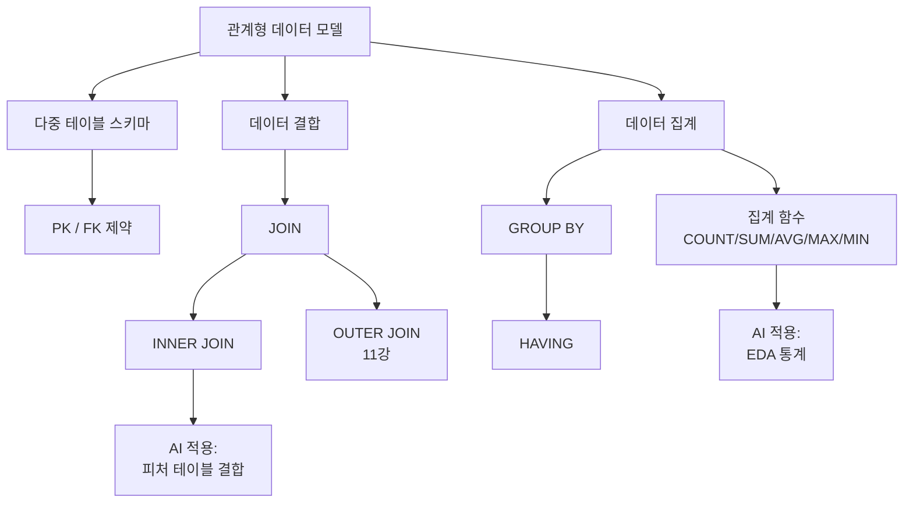
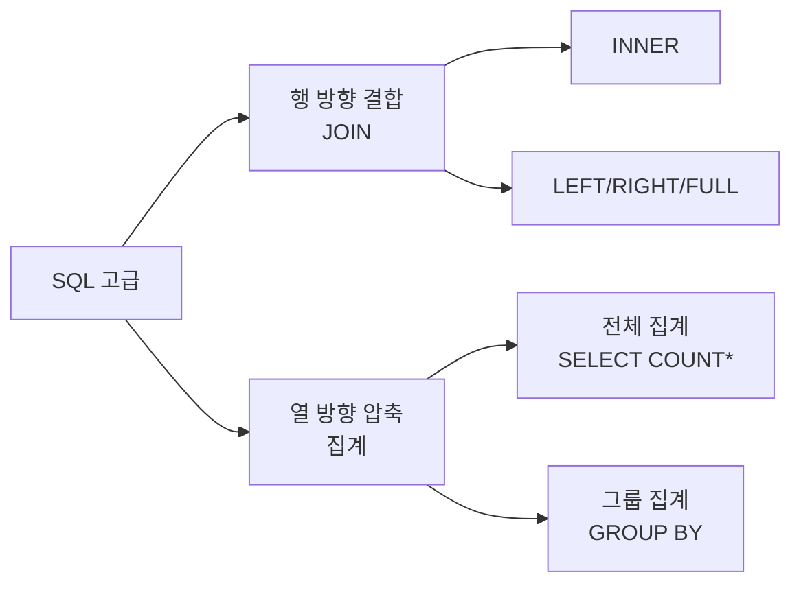

# 10강. 데이터처리와활용: SQL 고급 – 조인과 집계(1)

## 🔗 선수 지식 (Prerequisites)
- [ ] **필수**: SQL 기본 문법(`CREATE TABLE`, `INSERT`, `SELECT`, `WHERE`) - 이해 완료?
- [ ] **필수**: 기본키(Primary Key)와 관계형 데이터 모델 개념 - 이해 완료?
- [ ] **권장**: 정규화(Normalization)의 기본 개념, ERD 표기법
- **관련 단원**: [9강. SQL 기본 – 단일 테이블 조회](9강.md), [11강. SQL 고급 – 조인과 집계(2)](11강.md)

---

## 학습 목표
1. 외래키(Foreign Key)의 개념을 포함하여 연관성이 있는 다수의 테이블(Customer, Product, Purchase)을 직접 생성하고 데이터를 입력할 수 있다.
2. 조인(JOIN)의 필요성과 동작 원리를 이해하고, INNER JOIN을 사용하여 두 테이블의 데이터를 결합해 조회할 수 있다.
3. COUNT, SUM, AVG, MAX, MIN 등 주요 집계 함수의 기능을 이해하고 적절한 상황에 활용할 수 있다.
4. GROUP BY 절을 사용하여 데이터를 범주별로 그룹화하고, 각 그룹에 대한 통계 정보를 산출할 수 있다.

---

## 🧠 메타인지 체크 (학습 전/후 자기 평가)

### 학습 전 자기 평가
| 소주제 | 자신감 (1-5) |
| :--- | :--- |
| 외래키(FK)와 관계형 스키마 설계 | |
| INNER JOIN의 동작 원리 | |
| 집계 함수(COUNT/SUM/AVG/MAX/MIN) | |
| GROUP BY를 이용한 데이터 그룹화 | |

### 학습 후 교정 (학습 완료 후 작성)
| 소주제 | 학습 전 | 학습 후 | 실제 정답률 | 과신/과소 여부 |
| :--- | :--- | :--- | :--- | :--- |
| 외래키(FK)와 관계형 스키마 설계 | | | | |
| INNER JOIN의 동작 원리 | | | | |
| 집계 함수(COUNT/SUM/AVG/MAX/MIN) | | | | |
| GROUP BY를 이용한 데이터 그룹화 | | | | |

> **활용법**: 학습 전 1분 → 자신감 기입, 학습 후 1분 → 나머지 기입. "과신" 영역이 실제 취약점.

---

## 📝 요약 (Summary)
1.  🔴 **관계형 테이블 구축**: '고객', '상품', '구매'와 같이 서로 관계를 맺는 여러 테이블을 정의하고, 기본키(PK)와 외래키(FK) 개념을 적용한 스키마 설계 및 데이터 입력.
2.  🔴 **조인(JOIN)의 이해**: 흩어져 있는 데이터를 연결하여 정보를 통합하는 조인의 개념과, 공통된 값을 기준으로 데이터를 매칭하는 원리 학습.
3.  🔴 **내부 조인(INNER JOIN) 활용**: `JOIN ~ ON` 구문을 사용하여 두 테이블의 교집합 데이터를 조회하는 가장 기본적인 조인 쿼리 작성법.
4.  🔴 **집계 함수(Aggregate Function)**: 데이터의 개수(COUNT), 합계(SUM), 평균(AVG), 최대(MAX)/최소(MIN)값을 구하는 함수의 종류와 활용.
5.  🟡 **데이터 그룹화(GROUP BY)**: 전체 데이터가 아닌 특정 카테고리나 그룹 단위로 데이터를 묶어 통계적 수치를 산출하는 방법.
6.  🟡 **SQL 논리적 실행 순서**: SQL은 작성 순서와 실행 순서가 다르다. 논리적 처리 순서는 다음과 같다.
    - `FROM` → `WHERE` → `GROUP BY` → `HAVING` → `SELECT` → `ORDER BY` → `LIMIT/OFFSET`
    - 이 순서를 알면 `WHERE`에 집계 함수를 쓸 수 없는 이유, `ORDER BY`에서 `SELECT` 별칭을 쓸 수 있는 이유가 모두 설명된다.

---

## 📐 핵심 문법 및 패턴 (Key Syntax & Patterns)

> 본 강의는 **실습 중심** 과목이므로, 수식 대신 SQL 구문 패턴을 정리한다.

| 패턴명 | 코드 | 용도 |
| :--- | :--- | :--- |
| **외래키 정의** | `FOREIGN KEY(col) REFERENCES T(pk)` | 테이블 간 참조 무결성 보장 |
| **INNER JOIN** | `A INNER JOIN B ON A.k = B.k` | 두 테이블의 매칭 행만 결합 |
| **다중 조인** | `A JOIN B ON ... JOIN C ON ...` | 3개 이상 테이블 연결 |
| **집계 함수** | `COUNT(*) / SUM(c) / AVG(c) / MAX(c) / MIN(c)` | 행 집합에서 단일 통계값 산출 |
| **그룹화** | `SELECT g, AGG(c) FROM T GROUP BY g` | 카테고리별 통계 산출 |
| **그룹별 조건** | `... GROUP BY g HAVING AGG(c) > v` | 집계 결과에 대한 필터링 |
| **별칭(Alias)** | `SELECT c.cname AS 고객명 FROM Customer c` | 가독성 향상, 컬럼 충돌 해결 |

### 주요 정의

**외래키(Foreign Key) 제약 조건**
```sql
CREATE TABLE Purchase (
    pid     INT PRIMARY KEY,
    cid     INT,
    prod_id INT,
    qty     INT,
    FOREIGN KEY (cid)     REFERENCES Customer(cid),
    FOREIGN KEY (prod_id) REFERENCES Product(prod_id)
);
```
> **직관적 해석**: 외래키는 "이 컬럼의 값은 반드시 다른 테이블의 기본키에 존재하는 값이어야 한다"는 약속이다. 존재하지 않는 고객 번호로 구매 기록이 생기는 것을 막아 **참조 무결성(Referential Integrity)** 을 지킨다.
> **AI 적용**: 데이터 웨어하우스(DW)에서 사실 테이블(Fact)과 차원 테이블(Dimension)을 연결하는 스타 스키마(Star Schema)의 기초이며, ML 학습용 데이터셋의 라벨-피처 결합에 직접 활용된다.

**INNER JOIN의 집합 표현**
$$
A \bowtie_{A.k=B.k} B = \{ (a, b) \mid a \in A, b \in B, a.k = b.k \}
$$
> **직관적 해석**: 두 테이블의 행을 모두 조합한 카티시안 곱 중, 조인 조건을 만족하는 행만 남긴 결과이다. 한쪽에 매칭되는 행이 없으면 결과에서 제외된다.
> **AI 적용**: pandas의 `df1.merge(df2, on='k', how='inner')`와 동일한 연산. ML 파이프라인에서 사용자 행동 로그와 사용자 프로필을 결합할 때 사용된다.

---

## 📊 개념 시각화 (Visual Guide)

### 개념 관계도


### 분류 체계도: 조인 vs 집계


### 핵심 도식
| 입력 | 연산 | 출력 | AI 적용 |
| :--- | :--- | :--- | :--- |
| 두 테이블 A, B | `INNER JOIN ON` | 매칭 행 결합 결과 | 라벨-피처 병합 |
| 전체 행 | `COUNT/SUM/AVG/...` | 단일 스칼라 통계 | 데이터셋 기초 EDA |
| 그룹화된 행 | `GROUP BY + AGG` | 그룹별 통계 테이블 | 클래스별 분포 분석 |

---

## ✏️ 심화 학습 (Study Subject)

### 1. 가상 시나리오: "어떤 개념을, 언제 사용해야 할까?"
- **상황**: 온라인 쇼핑몰의 데이터 분석가가 "VIP 고객(총 구매액 50만 원 이상)을 식별하고, 이들이 가장 많이 구매한 상품 카테고리를 찾아야" 하는 상황.
- **문제**: 고객 정보(Customer), 상품 정보(Product), 구매 이력(Purchase)이 세 테이블에 분산되어 있다. 어떻게 결합하고 집계해야 효율적으로 답을 얻을 수 있을까?
- **해결**:
  1. 세 테이블을 `INNER JOIN`으로 결합 — 구매 사실이 있는 고객-상품 쌍만 추출.
  2. `cid`로 `GROUP BY` 후 `SUM(qty * price)`로 고객별 총 구매액 계산.
  3. `HAVING SUM(...) >= 500000` 으로 VIP 추출.
  4. 추출된 VIP만으로 다시 카테고리별 `GROUP BY` + `COUNT` 수행.
  ```sql
  SELECT p.category, COUNT(*) AS cnt
  FROM Customer c
       JOIN Purchase pu ON c.cid = pu.cid
       JOIN Product p   ON pu.prod_id = p.prod_id
  WHERE c.cid IN (
      SELECT cid FROM Purchase pu2 JOIN Product p2 ON pu2.prod_id = p2.prod_id
      GROUP BY cid HAVING SUM(pu2.qty * p2.price) >= 500000
  )
  GROUP BY p.category
  ORDER BY cnt DESC;
  ```
- **AI 학습 포인트**: "위 쿼리를 pandas로 옮길 때 `merge → groupby → agg` 체이닝으로 어떻게 표현되는가? SQL 옵티마이저와 pandas의 실행 순서 차이는?"

### 2. 관점별 비교 및 오개념 분석
- **핵심 비교**: `WHERE` vs `HAVING`, `COUNT(*)` vs `COUNT(컬럼)`, `JOIN` vs `Subquery`.
- **오개념 분석**:
    - **오개념 1**: "`GROUP BY`를 사용하면 `SELECT` 절에 어떤 컬럼이든 자유롭게 쓸 수 있다."
    - **분석**: `SELECT` 절의 비집계 컬럼은 반드시 `GROUP BY` 절에 포함되어야 한다 (표준 SQL). 그렇지 않으면 한 그룹 안에 여러 값이 존재할 때 어떤 값을 보여줄지 모호해진다. MySQL은 옛 버전에서 이를 허용했지만 임의의 값이 반환되어 결과를 신뢰할 수 없다.
    - **오개념 2**: "`COUNT(*)`와 `COUNT(컬럼명)`은 항상 같은 값을 반환한다."
    - **분석**: `COUNT(*)`는 NULL 포함 모든 행을 세지만, `COUNT(컬럼명)`은 해당 컬럼이 NULL이 아닌 행만 센다. 예) 10개 행 중 2개의 `email`이 NULL이면 `COUNT(*) = 10`, `COUNT(email) = 8`.
    - **오개념 3**: "`INNER JOIN`은 두 테이블의 모든 행을 보여준다."
    - **분석**: `INNER JOIN`은 조인 조건을 만족하는 **교집합** 행만 반환한다. 매칭되지 않는 행까지 보려면 `LEFT/RIGHT/FULL OUTER JOIN`을 사용해야 한다 (11강에서 학습).
    - **보충 개념 — NATURAL JOIN과 CROSS JOIN**:
        - **NATURAL JOIN**: 같은 이름의 컬럼을 자동으로 매칭하여 조인한다. 두 테이블에 동명 컬럼이 여러 개 있을 경우 의도치 않게 매칭될 수 있어, 명시적 `JOIN ~ ON` 구문이 권장된다.
        - **CROSS JOIN**: 두 테이블의 모든 행 조합(카티시안 곱)을 반환한다. 조인 조건 없이 테이블을 결합하면 카티시안 곱이 발생하며, 의도적으로 사용할 때만 `CROSS JOIN`을 명시한다.
- **AI 학습 포인트**: "`HAVING` 절을 `WHERE` 절로 바꿀 수 있는 경우와 없는 경우를 구체적인 쿼리 예시로 설명해줘. 집계 함수가 들어가는지가 핵심 판단 기준인가?"

---

## ❓ 연습 문제 및 해설

> **블룸 인지 수준 범례**: [기억] 정의·나열 → [이해] 설명·비교 → [적용] 계산·구현 → [분석] 구별·디버그 → [평가] 판단·비평 → [창조] 설계·제안

### 📝 문제

**1. 📌 ⭐ [기억] 외래키(Foreign Key)에 대한 설명으로 가장 옳은 것은?[](#prob-1)**
   > ① 같은 테이블 내에서 행을 유일하게 식별하는 컬럼이다.
   > ② 다른 테이블의 기본키(PK)를 참조하여 참조 무결성을 보장하는 컬럼이다.
   > ③ 모든 컬럼에 자동으로 부여되는 시스템 컬럼이다.
   > ④ NULL을 절대 허용하지 않는 컬럼이다.

<br>

**2. 📌 ⭐ [기억] 집계 함수가 아닌 것은?[](#prob-2)**
   > ① SUM
   > ② AVG
   > ③ ROUND
   > ④ COUNT

<br>

**3. 📌 ⭐⭐ [이해] `COUNT(*)`와 `COUNT(email)`의 차이를 가장 정확히 설명한 것은?[](#prob-3)**
   > ① 둘 다 항상 같은 값을 반환한다.
   > ② `COUNT(*)`는 NULL을 포함한 전체 행 수, `COUNT(email)`은 email이 NULL이 아닌 행 수를 반환한다.
   > ③ `COUNT(*)`는 더 느리고 `COUNT(email)`은 더 빠르다.
   > ④ `COUNT(email)`은 중복을 제거한 개수를 반환한다.

<br>

**4. 📌 ⭐⭐ [이해] `INNER JOIN`의 결과에 대한 설명으로 옳은 것은?[](#prob-4)**
   > <보기>
   >
   > 가. 두 테이블에서 조인 조건을 만족하는 행만 결과에 포함된다.
   > 나. 한쪽 테이블에만 존재하고 매칭되지 않는 행도 모두 결과에 포함된다.
   > 다. 결과의 행 수는 항상 두 테이블의 행 수의 합과 같다.

   > ① 가
   > ② 나
   > ③ 가, 다
   > ④ 나, 다

<br>

**5. 📌 ⭐⭐ [적용] 다음 두 테이블이 있을 때, 고객 이름과 그 고객이 구매한 상품명을 함께 조회하는 SQL로 옳은 것은?[](#prob-5)**
   > Customer(cid, cname), Purchase(pid, cid, prod_name)

   > ① `SELECT cname, prod_name FROM Customer, Purchase;`
   > ② `SELECT c.cname, p.prod_name FROM Customer c INNER JOIN Purchase p ON c.cid = p.cid;`
   > ③ `SELECT cname, prod_name FROM Customer JOIN Purchase;`
   > ④ `SELECT cname, prod_name FROM Customer WHERE cid IN Purchase;`

<br>

**6. 📌 ⭐⭐ [적용] 상품 카테고리(category)별 평균 가격을 구하는 SQL로 옳은 것은?[](#prob-6)**
   > ① `SELECT category, AVG(price) FROM Product;`
   > ② `SELECT category, AVG(price) FROM Product GROUP BY price;`
   > ③ `SELECT category, AVG(price) FROM Product GROUP BY category;`
   > ④ `SELECT AVG(price) FROM Product WHERE category;`

<br>

**7. 📌 ⭐⭐ [분석] `WHERE`와 `HAVING`의 차이로 옳은 것은?[](#prob-7)**
   > <보기>
   >
   > 가. `WHERE`는 그룹화 이전의 개별 행을 필터링한다.
   > 나. `HAVING`은 `GROUP BY`로 만들어진 그룹에 대한 조건을 지정한다.
   > 다. `WHERE` 절에는 집계 함수를 자유롭게 사용할 수 있다.

   > ① 가, 나
   > ② 가, 다
   > ③ 나, 다
   > ④ 가, 나, 다

<br>

**8. 📌 ⭐⭐⭐ [적용/분석] 다음 쿼리의 실행 결과로 나타나는 것은?[](#prob-8)**
   ```sql
   SELECT c.cname, SUM(pu.qty * p.price) AS total
   FROM Customer c
        JOIN Purchase pu ON c.cid = pu.cid
        JOIN Product p   ON pu.prod_id = p.prod_id
   GROUP BY c.cname
   HAVING SUM(pu.qty * p.price) >= 100000;
   ```
   > ① 모든 고객의 총 구매액
   > ② 총 구매액이 100,000원 이상인 고객의 이름과 총 구매액
   > ③ 총 구매액이 100,000원 미만인 고객 목록
   > ④ 상품별 총 매출액

<br>

**9. 📌 ⭐⭐⭐ [분석] 다음 SQL의 오류를 찾고 수정하시오.[](#prob-9)**
   ```sql
   SELECT category, prod_name, AVG(price)
   FROM Product
   GROUP BY category;
   ```

<br>

**10. 📌 ⭐⭐⭐ [창조] 다음 요구사항을 만족하는 SQL 쿼리를 작성하시오.[](#prob-10)**
   > 요구사항: "고객별로 총 구매 건수(COUNT)와 총 구매 수량(SUM)을 구하되, 구매 건수가 2건 이상인 고객만 조회한다. 구매 건수 내림차순으로 정렬하라."
   > 사용 테이블: Customer(cid, cname), Purchase(pid, cid, prod_id, qty)

---

### 🔑 정답 및 해설 (먼저 풀어본 후 펼치기)

<details>
<summary>정답 보기 (클릭)</summary>

1. ②
2. ③
3. ②
4. ①
5. ②
6. ③
7. ①
8. ②
9. `prod_name`은 GROUP BY에 없거나 집계되지 않아 오류 — 아래 해설 참조
10. 아래 해설의 SQL 참조

</details>

<details>
<summary>해설 보기 (클릭)</summary>

<a id="prob-1"></a>
**1. 📌 ⭐ [기억] 외래키의 정의**
> **정답: ② 다른 테이블의 기본키(PK)를 참조하여 참조 무결성을 보장하는 컬럼이다.**
> **해설**: 외래키(FK)는 다른 테이블의 PK를 참조하는 컬럼으로, 존재하지 않는 값이 입력되는 것을 막아 참조 무결성을 유지한다. ①은 PK, ③은 잘못된 설명, ④는 FK는 NULL 허용 가능(선택적 관계)이므로 틀렸다.

<a id="prob-2"></a>
**2. 📌 ⭐ [기억] 집계 함수의 종류**
> **정답: ③ ROUND**
> **해설**: `SUM, AVG, COUNT, MAX, MIN`은 여러 행을 하나의 값으로 압축하는 집계 함수이다. `ROUND`는 단일 값을 반올림하는 **스칼라 함수**로, 각 행에 개별 적용된다.

<a id="prob-3"></a>
**3. 📌 ⭐⭐ [이해] COUNT(*) vs COUNT(컬럼)**
> **정답: ② `COUNT(*)`는 NULL을 포함한 전체 행 수, `COUNT(email)`은 email이 NULL이 아닌 행 수를 반환한다.**
> **해설**: 집계 함수는 컬럼명을 지정할 경우 NULL을 제외한다. 따라서 NULL 값이 있는 컬럼에 `COUNT(컬럼)`을 적용하면 `COUNT(*)`보다 작은 값이 나올 수 있다. 중복 제거는 `COUNT(DISTINCT 컬럼)`의 역할이다.

<a id="prob-4"></a>
**4. 📌 ⭐⭐ [이해] INNER JOIN의 의미**
> **정답: ① 가**
> **해설**: INNER JOIN은 조인 조건을 만족하는 **교집합**만 반환한다. 나는 OUTER JOIN의 설명이며, 다는 카티시안 곱과도 다른 잘못된 진술이다.

<a id="prob-5"></a>
**5. 📌 ⭐⭐ [적용] INNER JOIN 쿼리 작성**
> **정답: ② `SELECT c.cname, p.prod_name FROM Customer c INNER JOIN Purchase p ON c.cid = p.cid;`**
> **해설**: ①은 ON 조건이 없는 카티시안 곱이므로 잘못된 결과를 만든다. ③은 ON 절 누락으로 문법 오류, ④는 `IN` 뒤에 서브쿼리가 아닌 테이블명을 직접 쓸 수 없다. ②는 별칭과 ON 조건을 정확히 사용했다.

<a id="prob-6"></a>
**6. 📌 ⭐⭐ [적용] GROUP BY 기본**
> **정답: ③ `SELECT category, AVG(price) FROM Product GROUP BY category;`**
> **해설**: 카테고리별 통계를 구하려면 `category`로 그룹화해야 한다. ①은 GROUP BY 없이 비집계 컬럼을 SELECT에 둬서 오류, ②는 그룹화 기준이 잘못되었고, ④는 문법 오류다.

<a id="prob-7"></a>
**7. 📌 ⭐⭐ [분석] WHERE vs HAVING**
> **정답: ① 가, 나**
> **해설**: WHERE는 GROUP BY 이전의 개별 행 필터, HAVING은 GROUP BY 결과의 그룹 필터다. 다는 틀렸다 — WHERE에는 집계 함수를 사용할 수 없으며, 집계 결과 조건은 HAVING에서 처리한다. 실행 순서: `FROM → WHERE → GROUP BY → HAVING → SELECT → ORDER BY`.

<a id="prob-8"></a>
**8. 📌 ⭐⭐⭐ [적용/분석] 다중 조인 + 집계 + HAVING**
> **정답: ② 총 구매액이 100,000원 이상인 고객의 이름과 총 구매액**
> **해설**: 세 테이블을 JOIN하여 고객별로 `qty * price`의 합을 구하고, HAVING 절로 100,000 이상인 그룹만 필터링한다. SELECT의 `total` 컬럼은 합산된 구매액이다.

<a id="prob-9"></a>
**9. 📌 ⭐⭐⭐ [분석] GROUP BY 규칙 위반 오류**
> **정답**:
> **오류 원인**: `SELECT`에 `prod_name`이 있지만, `GROUP BY` 절에는 `category`만 있다. 비집계 컬럼은 모두 GROUP BY에 포함되어야 한다.
> **수정안 1 (카테고리별 평균만 필요한 경우)**:
> ```sql
> SELECT category, AVG(price) AS avg_price
> FROM Product
> GROUP BY category;
> ```
> **수정안 2 (상품별 평균이 필요한 경우 — 사실상 GROUP BY가 의미 없음)**:
> ```sql
> SELECT category, prod_name, AVG(price) AS avg_price
> FROM Product
> GROUP BY category, prod_name;
> ```
> **해설**: SELECT 절의 비집계 컬럼은 GROUP BY 절에 반드시 포함되어야 한다는 표준 SQL 규칙을 위반한 사례. 그룹 안에 여러 `prod_name` 값이 있을 때 어느 것을 반환할지 정의되지 않기 때문이다.

<a id="prob-10"></a>
**10. 📌 ⭐⭐⭐ [창조] 종합 쿼리 작성**
> **정답**:
> ```sql
> SELECT c.cname,
>        COUNT(pu.pid)  AS purchase_count,
>        SUM(pu.qty)    AS total_qty
> FROM   Customer c
>        INNER JOIN Purchase pu ON c.cid = pu.cid
> GROUP BY c.cid, c.cname
> HAVING COUNT(pu.pid) >= 2
> ORDER BY purchase_count DESC;
> ```
> **해설**:
> 1. `Customer`와 `Purchase`를 `cid` 기준으로 INNER JOIN.
> 2. 고객별로 그룹화하기 위해 `GROUP BY c.cid, c.cname` (cid가 PK이므로 cname은 함수적으로 결정됨).
> 3. 집계 함수로 구매 건수(`COUNT(pid)`)와 총 수량(`SUM(qty)`) 산출.
> 4. `HAVING`으로 구매 건수 2건 이상 필터링 (WHERE는 집계 함수 사용 불가).
> 5. `ORDER BY purchase_count DESC`로 정렬.

</details>

---

## ✅ O/X 확인문제 (총 20문항)

**1.** 외래키는 다른 테이블의 기본키 또는 후보키를 참조한다.[](#ox-1) **(O / X)**
**2.** 외래키 컬럼은 NULL 값을 가질 수 없다.[](#ox-2) **(O / X)**
**3.** `INNER JOIN`은 두 테이블 중 어느 한쪽에만 존재하는 행도 결과에 포함한다.[](#ox-3) **(O / X)**
**4.** `JOIN ~ ON A.k = B.k`에서 ON 절은 조인 조건을 지정한다.[](#ox-4) **(O / X)**
**5.** `COUNT(*)`는 NULL을 포함하여 모든 행의 수를 반환한다.[](#ox-5) **(O / X)**
**6.** `AVG(컬럼)`은 NULL 값을 포함하여 평균을 계산한다.[](#ox-6) **(O / X)**
**7.** `MAX`와 `MIN`은 숫자 타입에만 적용할 수 있다.[](#ox-7) **(O / X)**
**8.** `GROUP BY` 절을 사용한 쿼리의 SELECT 절에는 그룹화 컬럼과 집계 함수만 사용해야 한다.[](#ox-8) **(O / X)**
**9.** `HAVING` 절은 `GROUP BY` 없이도 사용할 수 있다.[](#ox-9) **(O / X)**
**10.** `WHERE` 절에서는 집계 함수를 직접 사용할 수 있다.[](#ox-10) **(O / X)**
**11.** SQL 실행 순서는 `SELECT → FROM → WHERE → GROUP BY → HAVING → ORDER BY` 이다.[](#ox-11) **(O / X)**
**12.** `INNER JOIN`은 `,` (콤마)와 `WHERE` 조건으로도 동일하게 표현할 수 있다.[](#ox-12) **(O / X)**
**13.** 3개 이상의 테이블을 조인할 때는 `JOIN ~ ON`을 반복해서 사용한다.[](#ox-13) **(O / X)**
**14.** `GROUP BY` 절에 두 개 이상의 컬럼을 지정할 수 있다.[](#ox-14) **(O / X)**
**15.** `COUNT(DISTINCT 컬럼)`은 해당 컬럼의 중복을 제거한 개수를 반환한다.[](#ox-15) **(O / X)**
**16.** 테이블 별칭(`Customer c`)을 정의하면 같은 쿼리 안에서 원래 테이블명도 자유롭게 혼용할 수 있다.[](#ox-16) **(O / X)**
**17.** 같은 테이블을 자기 자신과 조인하는 셀프 조인(self-join)은 불가능하다.[](#ox-17) **(O / X)**
**18.** `SUM(qty * price)`처럼 컬럼 간 연산 결과에도 집계 함수를 적용할 수 있다.[](#ox-18) **(O / X)**
**19.** 그룹화된 결과를 정렬할 때는 `ORDER BY` 절을 `HAVING` 뒤에 작성한다.[](#ox-19) **(O / X)**
**20.** `INNER JOIN`의 결과 행 수는 항상 두 테이블 중 작은 테이블의 행 수와 같다.[](#ox-20) **(O / X)**

<details>
<summary>O/X 정답 및 해설 보기 (클릭)</summary>

> <a id="ox-1"></a>
> **1. 정답**: O
> **해설**: 외래키는 다른 테이블의 PK 또는 UNIQUE 제약이 있는 후보키(candidate key)를 참조할 수 있다.

> <a id="ox-2"></a>
> **2. 정답**: X
> **해설**: 외래키는 선택적 관계(optional relationship)를 표현하기 위해 NULL을 허용한다. NOT NULL 제약을 추가하면 필수 관계가 된다.

> <a id="ox-3"></a>
> **3. 정답**: X
> **해설**: INNER JOIN은 양쪽에서 모두 매칭되는 교집합만 반환한다. 한쪽에만 있는 행을 포함하려면 OUTER JOIN을 사용한다.

> <a id="ox-4"></a>
> **4. 정답**: O
> **해설**: ON 절에는 두 테이블을 연결하는 조건(주로 FK=PK)을 명시한다.

> <a id="ox-5"></a>
> **5. 정답**: O
> **해설**: `COUNT(*)`는 NULL 여부와 무관하게 모든 행을 센다. 반면 `COUNT(컬럼)`은 해당 컬럼의 NULL을 제외한다.

> <a id="ox-6"></a>
> **6. 정답**: X
> **해설**: `AVG`를 비롯한 집계 함수(`COUNT(*)` 제외)는 NULL을 무시한다. 따라서 분모에도 NULL 행은 포함되지 않는다.

> <a id="ox-7"></a>
> **7. 정답**: X
> **해설**: MAX/MIN은 문자열, 날짜 타입에도 적용 가능하다. 문자열은 사전순, 날짜는 시간순으로 비교한다.

> <a id="ox-8"></a>
> **8. 정답**: O
> **해설**: 표준 SQL 규칙. 비집계 컬럼은 모두 GROUP BY에 포함되어야 한다.

> <a id="ox-9"></a>
> **9. 정답**: O
> **해설**: GROUP BY 없이 HAVING을 사용하면 전체 결과를 하나의 그룹으로 보고 조건을 적용한다(예: `SELECT SUM(x) FROM T HAVING SUM(x) > 100`).

> <a id="ox-10"></a>
> **10. 정답**: X
> **해설**: WHERE는 그룹화 이전 단계에서 평가되므로 집계 함수를 사용할 수 없다. 집계 조건은 HAVING에서 처리한다.

> <a id="ox-11"></a>
> **11. 정답**: X
> **해설**: 올바른 실행 순서는 `FROM → WHERE → GROUP BY → HAVING → SELECT → ORDER BY` 이다. SELECT가 가장 마지막에 가깝게 평가된다는 점이 핵심.

> <a id="ox-12"></a>
> **12. 정답**: O
> **해설**: `FROM A, B WHERE A.k = B.k`는 ANSI 이전의 구식 표기. 결과는 INNER JOIN과 동일하지만 가독성이 떨어져 권장되지 않는다.

> <a id="ox-13"></a>
> **13. 정답**: O
> **해설**: `A JOIN B ON ... JOIN C ON ...` 형태로 좌측부터 순차적으로 결합한다.

> <a id="ox-14"></a>
> **14. 정답**: O
> **해설**: `GROUP BY a, b`는 (a, b) 조합별로 그룹을 형성한다. 다차원 집계에 활용된다.

> <a id="ox-15"></a>
> **15. 정답**: O
> **해설**: 예) `COUNT(DISTINCT cid)` → 구매한 고객의 종류 수.

> <a id="ox-16"></a>
> **16. 정답**: X
> **해설**: 별칭을 정의하면 해당 쿼리 안에서는 원래 테이블명을 사용하면 오류가 발생한다. 일관되게 별칭으로 참조해야 한다.

> <a id="ox-17"></a>
> **17. 정답**: X
> **해설**: 자기 자신과의 조인은 가능하며, 계층 구조(상사-부하)나 동일 테이블 내 비교에 사용된다(`FROM Emp e1 JOIN Emp e2 ON e1.mgr = e2.eid`).

> <a id="ox-18"></a>
> **18. 정답**: O
> **해설**: 집계 함수의 인자로 표현식(컬럼 간 연산, 함수 호출)을 자유롭게 사용할 수 있다.

> <a id="ox-19"></a>
> **19. 정답**: O
> **해설**: 정확한 작성 순서는 `SELECT ... FROM ... WHERE ... GROUP BY ... HAVING ... ORDER BY ...` 이다.

> <a id="ox-20"></a>
> **20. 정답**: X
> **해설**: 1:N 관계의 INNER JOIN에서는 한 테이블의 한 행이 다른 테이블의 여러 행과 매칭되어 결과 행 수가 더 늘어날 수 있다(예: 한 고객이 5건 구매 → 5행).

</details>

---

## 🧪 자유 회상 연습 (Free Recall)

> **방법**: 위의 노트를 모두 덮고, 타이머 3분 설정 후 이번 단원에서 배운 내용을 기억나는 대로 자유롭게 적으세요.
> 정확한 문장이 아니어도 됩니다. 키워드, SQL 구문, 관계 등 떠오르는 것을 모두 적습니다.

**자유 회상 작성란:**

```
[여기에 기억나는 내용을 자유롭게 작성]


```

> **회상 후 점검**: 노트를 다시 펼쳐 빠뜨린 내용을 확인하세요. 빠뜨린 부분이 실제 취약점입니다.
> - 회상 못한 핵심 개념: [                ]
> - 회상 못한 SQL 구문: [                ]

---

## 💻 코드로 확인하기 (Code Verification)

> 본 강의는 SQL 학습이지만, Python의 `sqlite3`를 사용하면 별도 DBMS 설치 없이 실행 결과를 확인할 수 있다.

```python
import sqlite3

# 1) 메모리 DB 생성 및 스키마 정의
conn = sqlite3.connect(":memory:")
conn.execute("PRAGMA foreign_keys = ON")  # SQLite는 기본 OFF, 명시 활성화 필요
cur = conn.cursor()

cur.executescript("""
CREATE TABLE Customer (
    cid    INTEGER PRIMARY KEY,
    cname  TEXT NOT NULL,
    city   TEXT
);

CREATE TABLE Product (
    prod_id  INTEGER PRIMARY KEY,
    pname    TEXT NOT NULL,
    category TEXT,
    price    INTEGER NOT NULL
);

CREATE TABLE Purchase (
    pid      INTEGER PRIMARY KEY,
    cid      INTEGER,
    prod_id  INTEGER,
    qty      INTEGER NOT NULL,
    FOREIGN KEY (cid)     REFERENCES Customer(cid),
    FOREIGN KEY (prod_id) REFERENCES Product(prod_id)
);
""")

# 2) 데이터 입력
cur.executemany("INSERT INTO Customer VALUES (?,?,?)", [
    (1, "김철수", "서울"),
    (2, "이영희", "부산"),
    (3, "박민수", "서울"),
])
cur.executemany("INSERT INTO Product VALUES (?,?,?,?)", [
    (101, "노트북",   "전자", 1500000),
    (102, "마우스",   "전자", 30000),
    (103, "책상",     "가구", 200000),
    (104, "의자",     "가구", 150000),
])
cur.executemany("INSERT INTO Purchase VALUES (?,?,?,?)", [
    (1001, 1, 101, 1),
    (1002, 1, 102, 2),
    (1003, 2, 103, 1),
    (1004, 2, 102, 3),
    (1005, 3, 104, 2),
    (1006, 3, 102, 1),
])
conn.commit()

# 3) INNER JOIN: 고객-상품 결합 조회
print("=== [1] 고객별 구매 내역 (INNER JOIN) ===")
for row in cur.execute("""
    SELECT c.cname, p.pname, pu.qty, p.price * pu.qty AS total
    FROM   Customer c
           JOIN Purchase pu ON c.cid = pu.cid
           JOIN Product  p  ON pu.prod_id = p.prod_id
    ORDER BY c.cname, p.pname;
"""):
    print(row)

# 4) GROUP BY + 집계 함수: 고객별 총 구매액
print("\n=== [2] 고객별 총 구매 건수와 총액 (GROUP BY) ===")
for row in cur.execute("""
    SELECT c.cname,
           COUNT(pu.pid)            AS cnt,
           SUM(pu.qty * p.price)    AS total_amount
    FROM   Customer c
           JOIN Purchase pu ON c.cid = pu.cid
           JOIN Product  p  ON pu.prod_id = p.prod_id
    GROUP BY c.cid, c.cname
    ORDER BY total_amount DESC;
"""):
    print(row)

# 5) HAVING: 총 구매액 100만 원 이상 고객만
print("\n=== [3] VIP 고객 (총 구매액 100만 원 이상, HAVING) ===")
for row in cur.execute("""
    SELECT c.cname, SUM(pu.qty * p.price) AS total
    FROM   Customer c
           JOIN Purchase pu ON c.cid = pu.cid
           JOIN Product  p  ON pu.prod_id = p.prod_id
    GROUP BY c.cid, c.cname
    HAVING SUM(pu.qty * p.price) >= 1000000;
"""):
    print(row)

# 6) 카테고리별 통계
print("\n=== [4] 카테고리별 평균/최대 가격 ===")
for row in cur.execute("""
    SELECT category,
           COUNT(*)   AS n,
           AVG(price) AS avg_price,
           MAX(price) AS max_price,
           MIN(price) AS min_price
    FROM   Product
    GROUP BY category;
"""):
    print(row)

conn.close()
```

> **실행 결과 (예시)**:
> ```
> === [1] 고객별 구매 내역 (INNER JOIN) ===
> ('김철수', '노트북', 1, 1500000)
> ('김철수', '마우스', 2, 60000)
> ('박민수', '마우스', 1, 30000)
> ('박민수', '의자', 2, 300000)
> ('이영희', '마우스', 3, 90000)
> ('이영희', '책상', 1, 200000)
>
> === [2] 고객별 총 구매 건수와 총액 (GROUP BY) ===
> ('김철수', 2, 1560000)
> ('박민수', 2, 330000)
> ('이영희', 2, 290000)
>
> === [3] VIP 고객 (총 구매액 100만 원 이상, HAVING) ===
> ('김철수', 1560000)
>
> === [4] 카테고리별 평균/최대 가격 ===
> ('가구', 2, 175000.0, 200000, 150000)
> ('전자', 2, 765000.0, 1500000, 30000)
> ```
> **SQL적 해석**: (1) INNER JOIN으로 세 테이블의 매칭 행만 결합되어 구매 내역이 풍부해진다. (2) GROUP BY로 고객 단위 통계가 산출되며, (3) HAVING 절이 그룹화 결과에 대한 필터로 작동해 VIP만 추출된다. (4) GROUP BY 컬럼이 바뀌면(고객→카테고리) 같은 데이터에서 다른 관점의 통계를 얻을 수 있다.

---

## 🤖 AI 연결고리 (SQL → AI Application)

| SQL 개념 | AI/ML 적용 분야 | 구체적 사례 |
| :--- | :--- | :--- |
| 다중 테이블 + FK | 피처 엔지니어링 | 사용자 프로필 + 행동 로그 + 구매 이력을 결합해 추천 모델의 학습셋 구성 |
| INNER JOIN | 라벨-피처 병합 | 클릭로그(피처)와 전환(라벨)을 user_id로 INNER JOIN → 지도학습 데이터셋 |
| COUNT/SUM/AVG | 기초 EDA & 피처 생성 | 사용자별 평균 세션 길이, 총 결제 횟수를 피처로 사용 (RFM 분석) |
| GROUP BY | 코호트 분석, 윈도우 집계 | 가입월별 리텐션, 카테고리별 매출 추이 분석 |
| HAVING | 세그먼트 정의 | 월간 구매 3회 이상 그룹 vs 미만 그룹으로 분리해 A/B 테스트 |

---

## 📖 심화 학습 예시 답안

#### 1. INNER JOIN의 내부 동작 원리
정의를 넘어, JOIN이 실제로 어떻게 실행되는지 단계별로 살펴본다. DBMS 옵티마이저는 다음 세 가지 알고리즘 중 비용이 가장 낮은 것을 선택한다.

1.  **Nested Loop Join**: 외부 테이블의 각 행에 대해 내부 테이블을 전체 스캔하며 조건을 검사한다. 외부 테이블이 매우 작거나 내부에 인덱스가 있을 때 효율적이다. 복잡도 $O(|A| \times |B|)$ (인덱스 사용 시 $O(|A| \times \log|B|)$).
2.  **Hash Join**: 한쪽 테이블(주로 작은 쪽)로 해시 테이블을 구축하고, 다른 테이블 행을 스캔하며 해시 룩업으로 매칭한다. 등호 조건(equi-join)에서 가장 빠르다. 복잡도 $O(|A| + |B|)$.
3.  **Sort-Merge Join**: 두 테이블을 조인 키로 정렬한 뒤 병합 정렬처럼 순차 매칭한다. 이미 정렬되어 있거나 결과를 정렬해야 할 때 유리하다. 복잡도 $O(|A|\log|A| + |B|\log|B|)$.

→ **인덱스가 FK 컬럼에 걸려 있으면 Nested Loop가 빨라지고, 큰 테이블끼리는 Hash Join이 선택되는 경향이 있다.** 쿼리 옵티마이저는 통계 정보를 기반으로 자동 결정한다.

#### 2. WHERE vs HAVING 비교표

| 구분 | WHERE | HAVING | 비고 |
| :--- | :--- | :--- | :--- |
| **평가 시점** | GROUP BY **이전** (개별 행) | GROUP BY **이후** (그룹) | 실행 순서가 핵심 |
| **집계 함수 사용** | 불가 (`WHERE SUM(x) > 100` X) | 가능 (`HAVING SUM(x) > 100` O) | 가장 큰 차이 |
| **인덱스 활용** | 인덱스로 빠른 필터링 가능 | 불가 (집계 결과는 인덱스 없음) | 성능에서 WHERE 우선 |
| **AI 활용** | 학습 데이터 행 단위 필터 (예: `is_valid=1`) | 코호트/세그먼트 단위 필터 (예: 구매 3회 이상 사용자) | 데이터셋 구성 전략에 영향 |

> **Best Practice**: 동일한 조건을 WHERE로도, HAVING으로도 표현할 수 있다면 **반드시 WHERE를 우선** 사용해야 한다. 그룹화 전에 행을 줄여야 후속 집계 비용이 감소하기 때문이다.

#### 3. JOIN과 집계를 활용한 코드 작성법 (Best Practice)

- **Bad Practice (나쁜 예시)**
  ```sql
  -- 명시적 JOIN 없이 콤마와 WHERE로 조인 + GROUP BY 누락
  SELECT cname, pname, qty * price
  FROM Customer, Purchase, Product
  WHERE Customer.cid = Purchase.cid
    AND Purchase.prod_id = Product.prod_id
    AND qty * price > 100000;
  -- 문제: 가독성 ↓, 카티시안 곱 위험, GROUP BY 없이 합계 의도가 모호
  ```
- **Good Practice (좋은 예시)**
  ```sql
  -- ANSI JOIN 구문 + 별칭 + 명확한 집계 의도
  SELECT c.cname,
         SUM(pu.qty * p.price) AS total_amount
  FROM   Customer c
         INNER JOIN Purchase pu ON c.cid     = pu.cid
         INNER JOIN Product  p  ON pu.prod_id = p.prod_id
  WHERE  pu.qty > 0                       -- 행 단위 필터: WHERE에서 처리
  GROUP BY c.cid, c.cname
  HAVING SUM(pu.qty * p.price) > 100000   -- 집계 조건: HAVING에서 처리
  ORDER BY total_amount DESC;
  ```
- **설명**: (a) ANSI JOIN으로 조인 조건과 필터 조건이 분리되어 가독성이 높고, (b) 별칭으로 컬럼 출처가 명확하며, (c) WHERE/HAVING이 의도에 맞게 분리되어 옵티마이저가 효율적으로 처리할 수 있다. (d) `GROUP BY c.cid, c.cname`에 PK를 포함시켜 동명이인 문제까지 방지한다.

---

## 📚 핵심 용어집 (Glossary)

| 용어 (한) | 용어 (영) | 구문 표현 | 정의 |
| :--- | :--- | :--- | :--- |
| **기본키** | Primary Key (PK) | `PRIMARY KEY` | 테이블에서 행을 유일하게 식별하는 컬럼(또는 컬럼 조합). NULL 불가. `→←9강` |
| **외래키** | Foreign Key (FK) | `FOREIGN KEY ... REFERENCES` | 다른 테이블의 PK를 참조하여 참조 무결성을 보장하는 컬럼. |
| **참조 무결성** | Referential Integrity | (FK 제약으로 강제) | FK 값은 항상 참조 테이블의 PK에 존재하거나 NULL이어야 한다. |
| **조인** | Join | `JOIN ~ ON` | 두 개 이상의 테이블을 공통 컬럼을 기준으로 결합하는 연산. |
| **내부 조인** | Inner Join | `INNER JOIN ~ ON` | 두 테이블에서 조인 조건을 만족하는 행만 반환. (교집합) |
| **집계 함수** | Aggregate Function | `COUNT/SUM/AVG/MAX/MIN` | 여러 행의 값을 하나의 통계값으로 압축하는 함수. |
| **그룹화** | Grouping | `GROUP BY` | 동일한 값을 갖는 행끼리 묶어 그룹별 집계를 가능하게 함. |
| **HAVING 절** | HAVING Clause | `HAVING <집계 조건>` | GROUP BY 결과에 조건을 적용하는 필터. |
| **별칭** | Alias | `AS alias` | 테이블/컬럼에 임시 이름을 부여하여 가독성과 명확성을 높임. |
| **카티시안 곱** | Cartesian Product | `FROM A, B` (조건 X) | 두 테이블의 모든 행 조합. 조인 조건 누락 시 발생하는 위험한 결과. |

---

## 🤖 AI 학습 파트너를 위한 추가 자료

### 1. 개념 이해를 위한 심층 질문 프롬프트
> **프롬프트 예시**: "INNER JOIN의 동작 원리를 SQL을 모르는 초등학생이 이해할 수 있도록 '학교 명부와 학원 명부 합치기' 같은 비유로 설명해줘. 그리고 JOIN이라는 개념이 없던 시절(파일 기반 시스템)에는 같은 작업을 어떻게 처리했고, 어떤 문제가 있었는지 역사적 배경도 함께 알려줘."

### 2. 문제 해결 능력 강화를 위한 시나리오 프롬프트
> **프롬프트 예시**: "당신은 이커머스 회사의 데이터 엔지니어입니다. '월간 활성 사용자(MAU)별 평균 구매 횟수를 계산하라'는 요구를 받았을 때, GROUP BY를 한 번 쓰는 단일 쿼리로 풀 수 있는지, 아니면 서브쿼리/CTE가 필요한지 판단하고, 두 접근법의 장단점(가독성, 성능)을 비교해줘."

### 3. SQL 풀이 검증 프롬프트
> **프롬프트 예시**: "다음 SQL이 의도한 결과를 정확히 반환하는지 검증해줘.
> ```sql
> SELECT category, AVG(price)
> FROM Product
> WHERE AVG(price) > 100000
> GROUP BY category;
> ```
> 1. 문법적/논리적 오류가 있다면 지적해줘.
> 2. 의도(카테고리별 평균 가격이 10만 원 이상인 카테고리 조회)에 맞게 수정해줘.
> 3. WHERE와 HAVING의 역할을 기준으로 왜 그렇게 수정해야 하는지 설명해줘."

---

## 🔄 복습 체크 (Spaced Repetition)
- [ ] 1일 후 복습 (날짜: 2026-05-30)
- [ ] 3일 후 복습 (날짜: 2026-06-01)
- [ ] 7일 후 복습 (날짜: 2026-06-05)
- [ ] 14일 후 복습 (날짜: 2026-06-12)
- [ ] 30일 후 복습 (날짜: 2026-06-28)

### 복습 시 자가 평가
| 회차 | 날짜 | 이해도 (1-5) | 취약 부분 메모 |
| :--- | :--- | :--- | :--- |
| 1차 | | | |
| 2차 | | | |
| 3차 | | | |

---

## 📚 참고 자료 (References)

- 교재 - 데이터처리와활용 10강 (SQL 고급 – 조인과 집계 1)
- SQLite 공식 문서: [SELECT - JOIN clause](https://www.sqlite.org/lang_select.html)
- W3Schools SQL Tutorial: SQL JOIN, GROUP BY, HAVING
- [9강. SQL 기본 – 단일 테이블 조회](9강.md), [11강. SQL 고급 – 조인과 집계(2)](11강.md)
