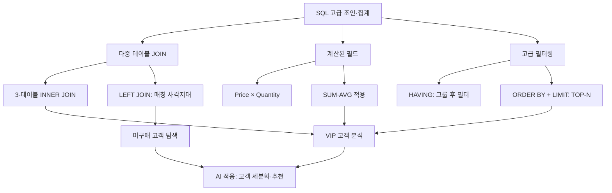

# 11. 데이터처리와활용: SQL 고급 – 조인과 집계 (2)

## 🔗 선수 지식 (Prerequisites)
- [ ] **필수**: [10강. SQL 고급 – 조인과 집계 (1)](10강.md) — INNER JOIN 기본 문법, GROUP BY/집계 함수 이해 완료?
- [ ] **필수**: [9강. SQL 기초 – SELECT/WHERE/ORDER BY](9강.md) — 단일 테이블 조회 및 정렬
- [ ] **권장**: [8강. 관계형 데이터 모델 — 기본키/외래키](8강.md)
- **관련 단원**: [12강. 데이터베이스 설계와 정규화](12강.md), [13강. 뷰와 인덱스](13강.md)

---

## 학습 목표
1. 3개 이상의 테이블(고객-구매-상품)을 INNER JOIN으로 정확하게 연결하여 통합된 정보를 조회할 수 있다.
2. 테이블의 컬럼 값을 산술 연산한 후 집계 함수(SUM, AVG 등)를 적용하여 '총 매출액'과 같은 계산된 필드를 생성할 수 있다.
3. GROUP BY와 ORDER BY, LIMIT 등을 복합적으로 사용하여 VIP 고객 선정이나 카테고리별 실적과 같은 유의미한 분석 결과를 도출할 수 있다.
4. HAVING 절을 사용하여 집계된 결과에 조건을 걸거나, LEFT JOIN을 사용하여 매칭되지 않는 데이터(예: 미구매 고객)를 탐색하는 방법을 설명할 수 있다.

---

## 🧠 메타인지 체크 (학습 전/후 자기 평가)

### 학습 전 자기 평가
| 소주제 | 자신감 (1-5) |
| :--- | :--- |
| 3-테이블 다중 INNER JOIN | |
| 계산된 필드 + 집계 (SUM(Price*Qty)) | |
| HAVING vs WHERE 구분 | |
| LEFT JOIN으로 NULL 탐색 | |

### 학습 후 교정 (학습 완료 후 작성)
| 소주제 | 학습 전 | 학습 후 | 실제 정답률 | 과신/과소 여부 |
| :--- | :--- | :--- | :--- | :--- |
| 3-테이블 다중 INNER JOIN | | | | |
| 계산된 필드 + 집계 | | | | |
| HAVING vs WHERE 구분 | | | | |
| LEFT JOIN으로 NULL 탐색 | | | | |

> **활용법**: 학습 전 1분 → 자신감 기입, 학습 후 1분 → 나머지 기입. "과신" 영역이 실제 취약점.

---

## 📝 요약 (Summary)

1. 🔴 **다중 테이블 조인 활용**: Customer, Purchase, Product 3개 테이블을 JOIN으로 연결하여 고객명, 상품명, 구매일 등 흩어진 정보를 통합 조회. (FK 매칭 조건을 모두 ON에 명시해야 카티전 곱이 발생하지 않음)
2. 🔴 **계산된 필드와 집계**: `SUM(Price * Quantity)`와 같이 컬럼 간 연산 결과를 집계하여 '총매출액'과 같은 파생 데이터를 생성하고 분석. (SELECT 절의 별칭은 ORDER BY에서만 재사용 가능, WHERE/GROUP BY에서는 불가)
3. 🟡 **데이터 기반 의사결정 실습**: 카테고리별 성과 분석 및 고객별 총 구매액(`ORDER BY ... DESC`) 산출을 통해 인기 상품군과 VIP 고객 식별. (`LIMIT N` 또는 `TOP N`으로 상위만 추출)
4. 🟡 **고급 필터링 및 조인 기법**: `HAVING` 절을 이용한 그룹핑 후 조건 필터링과 `LEFT JOIN`을 활용한 미구매 고객(NULL) 탐색 방법의 기초 이해. (`WHERE`는 행 필터, `HAVING`은 그룹 필터)

---

## 📐 핵심 문법 및 패턴 (Key Syntax & Patterns)

> 실습 중심 강의이므로 수식 대신 **SQL 패턴 카탈로그**로 정리한다. `→←10강` 표시는 10강에서 다룬 기본 패턴의 확장형임을 의미한다.

| 패턴명 | 코드 | 용도 |
| :--- | :--- | :--- |
| **3-테이블 INNER JOIN** | `FROM A JOIN B ON A.k=B.k JOIN C ON B.k2=C.k2` | 고객-구매-상품처럼 3개 엔터티 연결 (`→←10강`) |
| **계산된 필드** | `SELECT Price * Quantity AS Amount` | 매출액 등 파생 컬럼 생성 |
| **집계 + 계산식** | `SUM(Price * Quantity) AS TotalSales` | 행 단위 계산 후 그룹 합계 |
| **그룹 + 정렬 + TOP-N** | `GROUP BY x ORDER BY agg DESC LIMIT N` | VIP/베스트셀러 추출 |
| **HAVING 그룹 필터** | `GROUP BY x HAVING SUM(...) >= 100000` | 집계 후 조건 필터 |
| **LEFT JOIN + IS NULL** | `A LEFT JOIN B ON ... WHERE B.k IS NULL` | 매칭 안 되는 행(미구매 고객 등) 탐색 |
| **별칭(Alias) 활용** | `FROM Customer c JOIN Purchase p ON c.CID=p.CID` | 가독성 향상, 셀프조인 시 필수 |

### 주요 정의 — SQL 실행 순서 (논리적 처리 순서)

> SQL은 작성 순서(SELECT → FROM → ...)와 **논리적 실행 순서**가 다르다.

$$
\text{FROM/JOIN} \to \text{WHERE} \to \text{GROUP BY} \to \text{HAVING} \to \text{SELECT} \to \text{ORDER BY} \to \text{LIMIT}
$$

> **직관적 해석**: 테이블을 먼저 연결한 뒤, 행을 거르고(WHERE), 그룹으로 묶고(GROUP BY), 그룹을 거르고(HAVING), 보여줄 컬럼을 고르고(SELECT), 정렬하고(ORDER BY), 끊는다(LIMIT). 이 순서를 알면 `WHERE`에 집계함수를 못 쓰는 이유, `ORDER BY`에 SELECT 별칭은 쓸 수 있는 이유가 모두 설명된다.
> **AI 적용**: 데이터 전처리 파이프라인 설계 시 "필터링→집계→재필터링"의 2단계 필터링 패턴은 pandas의 `df.query() → groupby().agg() → filter()` 흐름과 정확히 대응한다.

---

## 📊 개념 시각화 (Visual Guide)

### 개념 관계도


### 핵심 도식 — 조인 유형 비교

| 입력 | 연산 | 출력 | AI 적용 |
| :--- | :--- | :--- | :--- |
| Customer ⨝ Purchase | INNER JOIN ON CID | 구매 이력이 있는 고객만 | 활성 고객 RFM 분석 |
| Customer ⟕ Purchase | LEFT JOIN ON CID | 미구매 고객도 NULL로 포함 | 이탈/휴면 고객 타겟팅 |
| 3-Table INNER JOIN | C ⨝ P ⨝ Prod | 고객-상품-수량 통합 뷰 | 협업 필터링 입력 행렬 |
| GROUP+SUM(P×Q) | 그룹별 매출 집계 | 카테고리/고객별 총매출 | 매출 예측 피처 엔지니어링 |

### HAVING vs WHERE 흐름


---

## ✏️ 심화 학습 (Study Subject)

### 1. 가상 시나리오: "어떤 패턴을, 언제 사용해야 할까?"
- **상황**: 온라인 쇼핑몰에서 마케팅팀이 "최근 1년간 총 구매액 100만원 이상인 VIP 고객의 이름·이메일·선호 카테고리·총 매출액"을 요청했다. 추가로 "한 번도 구매하지 않은 신규 가입 고객 리스트"도 필요하다.
- **문제**: 단일 SELECT 쿼리로 두 가지 요청 모두를 풀 수 있을까? Customer / Purchase / Product 3개 테이블을 어떻게 묶고, 어떤 조건은 `WHERE`에 어떤 조건은 `HAVING`에 두어야 하는가?
- **해결**:
  1. **VIP 쿼리** — 3-테이블 INNER JOIN으로 고객·구매·상품을 연결한다. `WHERE p.PurchaseDate >= '2025-05-29'`로 기간 필터(행 필터)를 먼저 걸고, `GROUP BY c.CID, c.Name, c.Email`로 묶은 뒤, 카테고리는 `MAX(...)` 같은 집계 또는 윈도우로 대표 카테고리를 뽑는다. `HAVING SUM(pr.Price * p.Quantity) >= 1000000`으로 그룹 단위 조건을 건다.
  2. **미구매 고객 쿼리** — `Customer LEFT JOIN Purchase ON ...` 후 `WHERE Purchase.CID IS NULL`. INNER JOIN으로는 표현 불가능한 패턴이다.
- **AI 학습 포인트**: "VIP 정의를 '최근 90일' 등 동적 윈도우로 바꾸려면 SQL 윈도우 함수(SUM() OVER)와 일반 GROUP BY 중 무엇이 더 적합한가? 코호트 분석 관점에서 차이를 설명해줘."

### 2. 관점별 비교 및 오개념 분석

- **핵심 비교**:

  | 구분 | `WHERE` | `HAVING` |
  | :--- | :--- | :--- |
  | 동작 시점 | GROUP BY **이전** (행 단위) | GROUP BY **이후** (그룹 단위) |
  | 집계 함수 사용 | ❌ 불가 (`WHERE SUM(...)`는 에러) | ✅ 가능 |
  | 인덱스 활용 | 활용 가능 | 일반적으로 활용 불가 |
  | 용도 | 원본 행 필터 | 집계 결과 필터 |

  | 구분 | `INNER JOIN` | `LEFT JOIN` |
  | :--- | :--- | :--- |
  | 결과 행 수 | 양쪽 매칭만 | 왼쪽 전체 + 오른쪽 매칭 |
  | 미매칭 처리 | 결과에서 제외 | NULL로 채움 |
  | 용도 | 양쪽 모두 존재하는 데이터 | "없음"을 찾는 분석 |

- **오개념 분석**:
    - **오개념 1**: "`SELECT SUM(Price*Quantity) AS TotalSales ... WHERE TotalSales >= 1000000`처럼 별칭을 WHERE에서 쓸 수 있다."
    - **분석**: SQL 실행 순서상 `WHERE`는 `SELECT`보다 먼저 처리되므로 별칭이 아직 존재하지 않는다. 그래서 별칭은 `ORDER BY`에서만 안전하게 쓸 수 있고, 필터링하려면 `HAVING SUM(Price*Quantity) >= 1000000`처럼 집계식을 다시 써야 한다.
    - **오개념 2**: "3-테이블 조인에서 ON 조건을 하나 빠뜨려도 결과는 같다."
    - **분석**: ON 조건을 빠뜨리면 카티전 곱(Cartesian Product)이 발생하여 결과 행이 폭증하고, 그 위에서 SUM을 돌리면 매출액이 **N배로 부풀려진다**. 작은 데이터에서는 못 알아차리지만 운영 데이터에서는 치명적인 분석 오류.
    - **오개념 3**: "`LEFT JOIN ... WHERE B.col = 'X'`로 미매칭도 포함된다."
    - **분석**: `WHERE B.col = 'X'`는 NULL을 제외하므로 결과적으로 INNER JOIN과 동일해진다. 미매칭을 살리려면 조건을 `ON` 절로 옮기거나 `WHERE B.col = 'X' OR B.col IS NULL`로 작성해야 한다.
- **AI 학습 포인트**: "내가 작성한 LEFT JOIN 쿼리에서 의도와 달리 미매칭 행이 사라졌다. 가능한 원인 3가지(WHERE에 우측 컬럼 조건, JOIN 순서, NULL 비교)를 코드 예시와 함께 설명해줘."

---

## ❓ 연습 문제 및 해설

> **블룸 인지 수준 범례**: [기억] 정의·나열 → [이해] 설명·비교 → [적용] 계산·구현 → [분석] 구별·디버그 → [평가] 판단·비평 → [창조] 설계·제안

> 📌 본 강의에는 원본 연습문제가 없어 AI 추가 생성 문항으로 구성하였다. 모든 예시는 아래 스키마를 가정한다.
>
> ```text
> Customer  (CID PK, Name, Email, City, JoinDate)
> Product   (PID PK, PName, Category, Price)
> Purchase  (PurID PK, CID FK→Customer, PID FK→Product, Quantity, PurchaseDate)
> ```

### 📝 문제

**1. 📌 ⭐ [기억] SQL 논리적 실행 순서로 옳은 것은?(#prob-1)**
   > ① SELECT → FROM → WHERE → GROUP BY → HAVING → ORDER BY
   > ② FROM → WHERE → GROUP BY → HAVING → SELECT → ORDER BY
   > ③ FROM → SELECT → WHERE → GROUP BY → HAVING → ORDER BY
   > ④ WHERE → FROM → GROUP BY → SELECT → HAVING → ORDER BY

<br>

**2. 📌 ⭐ [이해] `WHERE`와 `HAVING`의 차이를 설명한 것 중 옳지 않은 것은?(#prob-2)**
   > ① WHERE는 행 단위, HAVING은 그룹 단위 필터이다.
   > ② HAVING 절에는 집계 함수(SUM, AVG 등)를 사용할 수 있다.
   > ③ WHERE는 GROUP BY 이후에 실행된다.
   > ④ HAVING은 GROUP BY 결과에 조건을 거는 절이다.

<br>

**3. 📌 ⭐⭐ [적용] 다음 중 `Customer`, `Purchase`, `Product` 3개 테이블을 INNER JOIN으로 올바르게 연결한 쿼리는?(#prob-3)**
   > ① `FROM Customer c JOIN Purchase p JOIN Product pr ON c.CID = p.CID AND p.PID = pr.PID`
   > ② `FROM Customer c JOIN Purchase p ON c.CID = p.CID JOIN Product pr ON p.PID = pr.PID`
   > ③ `FROM Customer c, Purchase p, Product pr WHERE c.CID = pr.PID`
   > ④ `FROM Customer c LEFT JOIN Purchase p ON c.CID = p.CID, Product pr`

<br>

**4. 📌 ⭐⭐ [적용] <보기> 중 "총매출액 = Price × Quantity의 합계"를 올바르게 산출하는 SQL 식을 모두 고르면?(#prob-4)**
   > <보기>
   > 가. `SUM(Price * Quantity)`
   > 나. `SUM(Price) * SUM(Quantity)`
   > 다. `SUM(pr.Price * p.Quantity) AS TotalSales`
   > 라. `AVG(Price * Quantity) * COUNT(*)`

   > ① 가, 나
   > ② 가, 다
   > ③ 가, 다, 라
   > ④ 가, 나, 다, 라

<br>

**5. 📌 ⭐⭐ [분석] 다음 쿼리의 오류를 찾으시오.(#prob-5)**
   ```sql
   SELECT c.Name, SUM(pr.Price * p.Quantity) AS TotalSales
   FROM Customer c
       JOIN Purchase p ON c.CID = p.CID
       JOIN Product  pr ON p.PID = pr.PID
   WHERE TotalSales >= 1000000
   GROUP BY c.Name;
   ```
   > ① `JOIN`을 두 번 쓸 수 없다.
   > ② `WHERE` 절에서 SELECT 별칭(`TotalSales`)을 사용하여 오류가 발생한다.
   > ③ `GROUP BY` 절에 `c.CID`가 빠져 있어 무조건 오류이다.
   > ④ `SUM` 안에서 두 컬럼의 곱을 쓸 수 없다.

<br>

**6. 📌 ⭐⭐ [적용] 카테고리별 총 매출액을 구하고, 매출이 큰 순서대로 정렬하는 쿼리로 옳은 것은?(#prob-6)**
   > ① `SELECT Category, SUM(Price*Quantity) FROM Product GROUP BY Category ORDER BY Category;`
   > ② `SELECT pr.Category, SUM(pr.Price*p.Quantity) AS Sales FROM Product pr JOIN Purchase p ON pr.PID=p.PID GROUP BY pr.Category ORDER BY Sales DESC;`
   > ③ `SELECT pr.Category, SUM(pr.Price*p.Quantity) FROM Product pr, Purchase p ORDER BY 2 DESC;`
   > ④ `SELECT Category, COUNT(*) FROM Product GROUP BY Category HAVING SUM(Price)>0;`

<br>

**7. 📌 ⭐⭐⭐ [분석] 다음 쿼리의 의도는 "구매 이력이 없는 고객 명단"이다. 의도와 다른 결과가 나오는 이유는?(#prob-7)**
   ```sql
   SELECT c.CID, c.Name
   FROM Customer c
       LEFT JOIN Purchase p ON c.CID = p.CID
   WHERE p.PurchaseDate >= '2025-01-01';
   ```
   > ① LEFT JOIN을 INNER JOIN으로 바꿔야 한다.
   > ② WHERE 절의 `p.PurchaseDate` 조건이 NULL을 제외하므로 결과적으로 INNER JOIN과 같아진다.
   > ③ GROUP BY가 없어서 오류가 난다.
   > ④ JOIN 순서를 `Purchase LEFT JOIN Customer`로 바꿔야 한다.

<br>

**8. 📌 ⭐⭐⭐ [적용] 고객별 총 구매액 상위 5명(VIP)을 산출하는 쿼리를 완성하시오. 빈칸에 들어갈 절은?(#prob-8)**
   ```sql
   SELECT c.CID, c.Name, SUM(pr.Price * p.Quantity) AS TotalSales
   FROM Customer c
       JOIN Purchase p ON c.CID = p.CID
       JOIN Product  pr ON p.PID = pr.PID
   GROUP BY c.CID, c.Name
   ㉠ TotalSales DESC
   ㉡ 5;
   ```
   > ① ㉠ WHERE  ㉡ TOP
   > ② ㉠ HAVING  ㉡ LIMIT
   > ③ ㉠ ORDER BY  ㉡ LIMIT
   > ④ ㉠ GROUP BY  ㉡ HAVING

<br>

**9. 📌 ⭐⭐⭐ [평가] 다음 두 쿼리의 결과 차이를 가장 정확히 설명한 것은?(#prob-9)**
   ```sql
   -- (가)
   SELECT c.Name, COUNT(p.PurID) AS Cnt
   FROM Customer c LEFT JOIN Purchase p ON c.CID = p.CID
   GROUP BY c.Name;

   -- (나)
   SELECT c.Name, COUNT(*) AS Cnt
   FROM Customer c LEFT JOIN Purchase p ON c.CID = p.CID
   GROUP BY c.Name;
   ```
   > ① 두 쿼리는 결과가 항상 동일하다.
   > ② (가)는 미구매 고객의 Cnt가 0, (나)는 1로 나온다.
   > ③ (가)는 NULL을 세지 않아 미구매 고객 Cnt=0, (나)는 행을 세므로 Cnt=1이 된다.
   > ④ (나)에서 오류가 발생한다.

<br>

**10. 📌 ⭐⭐⭐ [창조] 마케팅팀이 "2025년 매출액이 50만 원 이상인 **카테고리**의 이름과 평균 단가, 총 매출액"을 요청했다. 이 요구사항을 만족하는 쿼리를 작성하시오 (Product, Purchase 사용, 2025년 = `PurchaseDate BETWEEN '2025-01-01' AND '2025-12-31'`).(#prob-10)**

---

### 🔑 정답 및 해설 (먼저 풀어본 후 펼치기)

<details>
<summary>정답 보기 (클릭)</summary>

1. ②
2. ③
3. ②
4. ②
5. ②
6. ②
7. ②
8. ③
9. ③
10. 풀이형 정답 (아래 해설 참조)

</details>

<details>
<summary>해설 보기 (클릭)</summary>

<a id="prob-1"></a>
**1. ⭐ [기억] SQL 논리적 실행 순서**
> **정답: ②**
> **해설**: 작성 순서(SELECT가 먼저)와 달리, 실행은 `FROM/JOIN → WHERE → GROUP BY → HAVING → SELECT → ORDER BY → LIMIT` 순이다. 이 순서가 곧 별칭 사용 가능 위치와 HAVING/WHERE 구분의 근거가 된다.

<a id="prob-2"></a>
**2. ⭐ [이해] WHERE vs HAVING**
> **정답: ③**
> **해설**: WHERE는 GROUP BY **이전**에 실행되므로 ③은 틀렸다. ①②④는 모두 옳다. WHERE에는 집계함수를 쓸 수 없는 이유도 이 실행 순서 때문이다.

<a id="prob-3"></a>
**3. ⭐⭐ [적용] 3-테이블 INNER JOIN**
> **정답: ②**
> **해설**: 각 JOIN마다 ON 절이 따라붙어야 한다. ①은 ON이 한 번만 등장해 문법 오류. ③은 조인 조건이 잘못되어 카티전 곱 발생. ④는 쉼표 구분과 LEFT JOIN을 혼용해 의미가 흐려진다. 표준 ANSI 문법은 `JOIN ... ON ... JOIN ... ON ...`이다.

<a id="prob-4"></a>
**4. ⭐⭐ [적용] 총매출 계산식**
> **정답: ② (가, 다)**
> **해설**:
> - 가/다: 행 단위로 `Price × Quantity`를 계산한 뒤 합산 — 올바름.
> - 나: `SUM(Price) × SUM(Quantity)`는 분배법칙이 성립하지 않아 잘못된 값(과대 추정)이 된다. 예: (10×2)+(20×3)=80 vs (10+20)×(2+3)=150.
> - 라: `AVG(x) × COUNT(*) = SUM(x)`라서 수학적으로 가와 같다고 착각할 수 있지만, NULL 행이 있으면 COUNT(*)와 AVG의 분모가 달라 결과가 어긋날 수 있다. 일반화된 정답이 될 수 없다.

<a id="prob-5"></a>
**5. ⭐⭐ [분석] 쿼리 오류 진단**
> **정답: ②**
> **해설**: `WHERE TotalSales >= 1000000`은 실행 순서상 SELECT 별칭이 아직 만들어지기 전이므로 인식되지 않는다. `WHERE`를 `HAVING SUM(pr.Price*p.Quantity) >= 1000000`으로 바꾸면 된다. ③은 일부 DBMS(MySQL의 ONLY_FULL_GROUP_BY 모드)에서만 문제이고 표준상 항상 오류는 아니므로 가장 핵심 오류는 ②.

<a id="prob-6"></a>
**6. ⭐⭐ [적용] 카테고리별 매출 정렬**
> **정답: ②**
> **해설**: ①은 Purchase와 조인하지 않아 Quantity가 없고 결과가 의미 없다. ③은 조인 조건이 없어 카티전 곱. ④는 매출이 아닌 개수를 센다. ②만 INNER JOIN + GROUP BY + ORDER BY가 정확히 결합되어 있다.

<a id="prob-7"></a>
**7. ⭐⭐⭐ [분석] LEFT JOIN 함정**
> **정답: ②**
> **해설**: LEFT JOIN 후 매칭이 없는 행은 `Purchase` 컬럼이 모두 NULL이 된다. `WHERE p.PurchaseDate >= '...'`는 NULL을 false로 처리해 제거하므로, 결과적으로 INNER JOIN과 동일해진다. 해결책은 조건을 `ON` 절로 옮기거나(`ON c.CID=p.CID AND p.PurchaseDate >= '...'`) 미구매 고객을 찾으려면 `WHERE p.CID IS NULL`로 바꾸는 것.

<a id="prob-8"></a>
**8. ⭐⭐⭐ [적용] TOP-N VIP**
> **정답: ③ (ORDER BY, LIMIT)**
> **해설**: 그룹별 집계 결과를 매출액 내림차순으로 정렬 후 상위 5개만 자른다. MySQL/PostgreSQL/SQLite는 `LIMIT N`, SQL Server는 `SELECT TOP N`, Oracle 12c+는 `FETCH FIRST N ROWS ONLY`를 사용한다.

<a id="prob-9"></a>
**9. ⭐⭐⭐ [평가] COUNT(col) vs COUNT(*) with LEFT JOIN**
> **정답: ③**
> **해설**: `COUNT(expr)`은 expr이 **NULL이 아닌** 행만 센다. 미구매 고객은 `p.PurID`가 NULL이라 (가)는 0이 나오지만, `COUNT(*)`는 행 자체를 세므로 LEFT JOIN으로 남은 1행을 세어 (나)는 1이 된다. 실무에서 "구매 건수"를 정확히 표현하려면 (가)의 `COUNT(외래키)` 패턴이 안전하다.

<a id="prob-10"></a>
**10. ⭐⭐⭐ [창조] 풀이형**
> **정답 예시**:
> ```sql
> SELECT pr.Category,
>        AVG(pr.Price)                       AS AvgPrice,
>        SUM(pr.Price * p.Quantity)          AS TotalSales
> FROM   Product  pr
>        INNER JOIN Purchase p ON pr.PID = p.PID
> WHERE  p.PurchaseDate BETWEEN '2025-01-01' AND '2025-12-31'
> GROUP  BY pr.Category
> HAVING SUM(pr.Price * p.Quantity) >= 500000
> ORDER  BY TotalSales DESC;
> ```
> **해설**:
> - `WHERE`로 2025년 기간 행 필터를 먼저 적용 (인덱스 활용).
> - `GROUP BY pr.Category`로 카테고리별 묶고, 평균 단가(AVG)와 매출액(SUM)을 계산.
> - 50만 원 이상 조건은 집계 결과에 대한 조건이므로 `HAVING`. `WHERE`에 두면 오류.
> - `ORDER BY TotalSales DESC`는 SELECT 별칭을 사용할 수 있는 유일한 절이라 안전.

</details>

---

## ✅ O/X 확인문제 (총 20문항)

**1.** `WHERE` 절에서는 `SUM`, `COUNT` 같은 집계 함수를 사용할 수 없다.(#ox-1) **(O / X)**
**2.** `HAVING` 절은 `GROUP BY` 없이 단독으로 사용할 수 있다.(#ox-2) **(O / X)**
**3.** 3개 테이블을 INNER JOIN할 때 ON 조건을 하나만 적어도 결과는 같다.(#ox-3) **(O / X)**
**4.** `SUM(Price * Quantity)`와 `SUM(Price) * SUM(Quantity)`는 항상 같은 값을 반환한다.(#ox-4) **(O / X)**
**5.** SQL 논리적 실행 순서상 SELECT는 ORDER BY보다 먼저 처리된다.(#ox-5) **(O / X)**
**6.** SELECT 절의 컬럼 별칭은 같은 쿼리의 `WHERE` 절에서도 사용 가능하다.(#ox-6) **(O / X)**
**7.** `LEFT JOIN A ON B`로 매칭되지 않는 A의 행은 결과에서 사라진다.(#ox-7) **(O / X)**
**8.** 미구매 고객을 찾는 표준 패턴은 `LEFT JOIN ... WHERE 우측테이블.키 IS NULL`이다.(#ox-8) **(O / X)**
**9.** `LEFT JOIN` 후 `WHERE`에 오른쪽 테이블의 일반 컬럼 조건을 두면 INNER JOIN과 같은 효과가 난다.(#ox-9) **(O / X)**
**10.** TOP-N 패턴에서 MySQL은 `LIMIT N`, SQL Server는 `SELECT TOP N`을 사용한다.(#ox-10) **(O / X)**
**11.** GROUP BY 절에 포함되지 않은 컬럼은 집계 함수 없이도 SELECT에 자유롭게 쓸 수 있다.(#ox-11) **(O / X)**
**12.** `COUNT(*)`와 `COUNT(컬럼명)`은 NULL이 있을 때 다른 값을 반환할 수 있다.(#ox-12) **(O / X)**
**13.** `JOIN`의 별칭(`Customer c`)을 사용하면 셀프조인이 수월해진다.(#ox-13) **(O / X)**
**14.** `ORDER BY 2`는 두 번째 SELECT 컬럼을 기준으로 정렬한다는 의미이다.(#ox-14) **(O / X)**
**15.** `HAVING SUM(x) > 100`은 집계 후 조건이므로 인덱스로 가속하기 어렵다.(#ox-15) **(O / X)**
**16.** 카티전 곱(Cartesian Product)은 ON 조건이 누락된 JOIN에서 발생한다.(#ox-16) **(O / X)**
**17.** `INNER JOIN`은 두 테이블 중 한쪽에만 존재하는 행도 결과에 포함한다.(#ox-17) **(O / X)**
**18.** SQL에서 `NULL = NULL`은 TRUE를 반환한다.(#ox-18) **(O / X)**
**19.** VIP 상위 N명을 뽑을 때 `ORDER BY TotalSales DESC LIMIT N` 조합이 일반적이다.(#ox-19) **(O / X)**
**20.** 같은 결과를 내는 쿼리라도 `WHERE`로 거를 수 있는 조건을 `HAVING`으로 미루면 성능이 떨어질 수 있다.(#ox-20) **(O / X)**

<details>
<summary>O/X 정답 및 해설 보기 (클릭)</summary>

> <a id="ox-1"></a>**1. O** — WHERE는 GROUP BY 이전 단계라 집계값이 아직 없다.
> <a id="ox-2"></a>**2. O** — 표준상 가능. GROUP BY 없는 HAVING은 전체를 하나의 그룹으로 간주.
> <a id="ox-3"></a>**3. X** — ON이 빠지면 카티전 곱이 발생해 결과가 부풀려진다.
> <a id="ox-4"></a>**4. X** — 분배법칙이 성립하지 않는다. 행 단위 곱을 합산해야 정확하다.
> <a id="ox-5"></a>**5. O** — SELECT가 ORDER BY보다 앞서 실행되어 별칭이 ORDER BY에서 사용 가능.
> <a id="ox-6"></a>**6. X** — WHERE는 SELECT보다 먼저 처리되므로 별칭을 인식하지 못한다.
> <a id="ox-7"></a>**7. X** — LEFT JOIN은 왼쪽 테이블의 모든 행을 보존한다. 매칭 없으면 NULL.
> <a id="ox-8"></a>**8. O** — `WHERE 우측키 IS NULL`이 "조인 실패" 행을 식별하는 표준 패턴.
> <a id="ox-9"></a>**9. O** — NULL이 비교에서 제거되므로 결과적으로 INNER JOIN과 동일해진다.
> <a id="ox-10"></a>**10. O** — DBMS별 표기 차이. Oracle 12c+는 `FETCH FIRST N ROWS ONLY`.
> <a id="ox-11"></a>**11. X** — 집계함수가 없으면 표준 SQL상 오류(MySQL의 ONLY_FULL_GROUP_BY 등).
> <a id="ox-12"></a>**12. O** — COUNT(컬럼)은 NULL을 세지 않는다.
> <a id="ox-13"></a>**13. O** — 별칭이 없으면 같은 테이블을 두 번 참조할 수 없다.
> <a id="ox-14"></a>**14. O** — SELECT 컬럼 위치 번호로 정렬 가능 (가독성은 별칭 권장).
> <a id="ox-15"></a>**15. O** — HAVING은 집계 이후 단계라 인덱스 활용이 제한적이다.
> <a id="ox-16"></a>**16. O** — 조인 조건이 없으면 모든 행 쌍이 결합된다.
> <a id="ox-17"></a>**17. X** — INNER JOIN은 양쪽 매칭만. 일방 보존은 OUTER JOIN.
> <a id="ox-18"></a>**18. X** — 3-치 논리(3VL)로 UNKNOWN. `IS NULL`로 비교해야 한다.
> <a id="ox-19"></a>**19. O** — TOP-N의 표준 패턴이다.
> <a id="ox-20"></a>**20. O** — 행 단계 필터(WHERE)가 그룹 필터(HAVING)보다 처리 비용이 작다.

</details>

---

## 🧪 자유 회상 연습 (Free Recall)

> **방법**: 위의 노트를 모두 덮고, 타이머 3분 설정 후 이번 단원에서 배운 내용을 기억나는 대로 자유롭게 적으세요.
> 키워드, SQL 패턴, 실행 순서 등 떠오르는 것을 모두 적습니다.

**자유 회상 작성란:**

```
[여기에 기억나는 내용을 자유롭게 작성]


```

> **회상 후 점검**: 노트를 다시 펼쳐 빠뜨린 내용을 확인하세요.
> - 회상 못한 핵심 개념: [                ]
> - 회상 못한 SQL 패턴: [                ]

---

## 💻 코드로 확인하기 (Code Verification)

> SQLite + pandas 조합으로 11강의 모든 패턴을 한 파일에서 실행 검증할 수 있다.

```python
import sqlite3
import pandas as pd

# 1) 메모리 DB에 스키마와 샘플 데이터 적재
con = sqlite3.connect(":memory:")
cur = con.cursor()
cur.executescript("""
CREATE TABLE Customer (CID INT PRIMARY KEY, Name TEXT, Email TEXT, City TEXT);
CREATE TABLE Product  (PID INT PRIMARY KEY, PName TEXT, Category TEXT, Price INT);
CREATE TABLE Purchase (
    PurID INT PRIMARY KEY, CID INT, PID INT, Quantity INT, PurchaseDate TEXT,
    FOREIGN KEY(CID) REFERENCES Customer(CID),
    FOREIGN KEY(PID) REFERENCES Product(PID)
);
INSERT INTO Customer VALUES
 (1,'김민지','min@a.com','서울'),
 (2,'박서준','seo@a.com','부산'),
 (3,'이하늘','sky@a.com','서울'),
 (4,'정유나','yuna@a.com','대전');   -- 미구매 고객
INSERT INTO Product VALUES
 (10,'노트북','전자',1500000),
 (20,'헤드폰','전자',  250000),
 (30,'책상',  '가구',  180000),
 (40,'의자',  '가구',  120000);
INSERT INTO Purchase VALUES
 (100,1,10,1,'2025-03-10'),
 (101,1,20,2,'2025-04-02'),
 (102,2,30,1,'2025-05-15'),
 (103,3,10,2,'2025-06-20'),
 (104,3,40,4,'2025-07-01');
""")
con.commit()

def q(sql):
    return pd.read_sql_query(sql, con)

# 2) 3-테이블 INNER JOIN
print("[A] 3-테이블 통합 조회")
print(q("""
SELECT c.Name, pr.PName, pr.Category, p.Quantity, pr.Price,
       pr.Price * p.Quantity AS Amount, p.PurchaseDate
FROM Customer c
  JOIN Purchase p ON c.CID = p.CID
  JOIN Product  pr ON p.PID = pr.PID
ORDER BY c.Name, p.PurchaseDate;
"""))

# 3) VIP TOP-3 (계산된 필드 + 집계 + 정렬 + LIMIT)
print("\n[B] VIP TOP-3")
print(q("""
SELECT c.CID, c.Name, SUM(pr.Price * p.Quantity) AS TotalSales
FROM Customer c
  JOIN Purchase p ON c.CID = p.CID
  JOIN Product  pr ON p.PID = pr.PID
GROUP BY c.CID, c.Name
ORDER BY TotalSales DESC
LIMIT 3;
"""))

# 4) 카테고리별 매출 + HAVING
print("\n[C] 카테고리별 매출 50만원 이상")
print(q("""
SELECT pr.Category,
       AVG(pr.Price)              AS AvgPrice,
       SUM(pr.Price*p.Quantity)   AS TotalSales
FROM Product pr JOIN Purchase p ON pr.PID = p.PID
GROUP BY pr.Category
HAVING SUM(pr.Price*p.Quantity) >= 500000
ORDER BY TotalSales DESC;
"""))

# 5) LEFT JOIN + IS NULL — 미구매 고객 탐색
print("\n[D] 미구매 고객")
print(q("""
SELECT c.CID, c.Name, c.City
FROM Customer c LEFT JOIN Purchase p ON c.CID = p.CID
WHERE p.PurID IS NULL;
"""))

# 6) COUNT(*) vs COUNT(col) 차이 확인
print("\n[E] COUNT(*) vs COUNT(외래키)")
print(q("""
SELECT c.Name,
       COUNT(*)      AS CntStar,
       COUNT(p.PurID) AS CntKey
FROM Customer c LEFT JOIN Purchase p ON c.CID = p.CID
GROUP BY c.Name
ORDER BY c.Name;
"""))
```

> **실행 결과 (요약)**:
> - **[A]** 김민지·박서준·이하늘의 구매 5건, 정유나는 미포함.
> - **[B]** 이하늘 3,480,000 → 김민지 2,000,000 → 박서준 180,000.
> - **[C]** 전자(5,000,000)와 가구(660,000) 두 카테고리 모두 HAVING >= 500,000 조건을 충족하여 결과에 포함된다.
> - **[D]** 정유나 1명 — INNER JOIN에서는 절대 나오지 않는 행.
> - **[E]** 정유나의 `CntStar=1`, `CntKey=0`. COUNT 차이를 눈으로 확인.
>
> **분석적 해석**: LEFT JOIN은 "왼쪽 보존"의 의미를 가지며, 집계의 정확성은 행 단위 곱(Price × Quantity)을 먼저 만든 뒤 SUM을 적용해야 보장된다. HAVING은 그룹의 집계값을 조건으로 필터링하므로 인덱스 활용이 제한적이고, 가능하면 WHERE에서 미리 행을 줄이는 것이 성능상 유리하다.
> **[C] AVG(pr.Price) 해석 주의**: JOIN 후 `AVG(pr.Price)`는 구매 건(행)별 평균 단가이므로, 많이 팔린 상품 가격 쪽으로 치우진다. 상품별 고유 평균 단가를 구하려면 Purchase를 조인하지 않고 Product만으로 `GROUP BY Category`해야 한다.

---

## 🤖 AI 연결고리 (SQL → AI/ML Application)

| SQL 패턴 | AI/ML 적용 분야 | 구체적 사례 |
| :--- | :--- | :--- |
| 3-테이블 INNER JOIN | 추천 시스템 입력 행렬 구성 | 사용자-아이템-상호작용 통합 후 협업 필터링 |
| `SUM(Price*Qty)` + `GROUP BY 고객` | RFM 세분화 / 고객 가치 추정 | LTV(Customer Lifetime Value) 피처 생성 |
| `ORDER BY agg DESC LIMIT N` | TOP-K 검색·랭킹 | 베스트셀러 추천, 키워드 트렌드 추출 |
| `LEFT JOIN ... WHERE IS NULL` | 이탈/휴면 고객 탐지 | 윈백(Win-back) 캠페인 타겟 리스트 |
| HAVING 그룹 필터 | 코호트 분석 임계값 적용 | "월 매출 100만↑ 가맹점만" 등의 코호트 정의 |
| 계산된 필드 + 집계 | 피처 엔지니어링 | 평균 객단가, 구매 빈도 등 시계열 피처 |

---

## 📖 심화 학습 예시 답안

#### 1. 3-테이블 INNER JOIN의 내부 동작 원리
1. **테이블 결합 단계**: 옵티마이저가 가장 작은 테이블부터 조인 순서를 결정한다(보통 통계 기반). `Customer ⨝ Purchase`를 먼저 해시 또는 nested loop으로 결합한 뒤, 그 결과를 `Product`와 다시 결합한다.
2. **ON 조건 적용**: 각 단계마다 `ON` 조건(`c.CID=p.CID`, `p.PID=pr.PID`)으로 매칭되는 행만 통과. 조건이 빠지면 카티전 곱이 되어 결과 카디널리티가 폭증.
3. **결과 행 카디널리티**: 한 고객이 N건을 구매했고, 각 구매가 상품 1건과 매칭되면 그 고객의 행이 N번 등장. 그래서 `Customer` 단위 집계 시 `SUM`이 의도대로 작동한다(고객별 구매 합계).

#### 2. `WHERE` vs `HAVING` 비교표 (AI 활용 행 포함)

| 구분 | `WHERE` | `HAVING` | 비고 |
| :--- | :--- | :--- | :--- |
| **정의** | `WHERE 조건식` — 행 단위 필터 | `HAVING 집계조건식` — 그룹 단위 필터 | 실행 순서 차이 |
| **적용 조건** | GROUP BY 이전, 비집계 컬럼 | GROUP BY 이후, 집계 가능 | 집계 함수 가용성 |
| **성능** | 인덱스 활용 가능 | 인덱스 활용 제한적 | 가능하면 WHERE 우선 |
| **AI 활용** | 학습 데이터 행 필터링 (`WHERE date < cutoff`) | 코호트 임계값 (`HAVING SUM(purchase) >= K`) | 데이터 누수(Leakage) 방지에는 WHERE가 더 중요 |

#### 3. 다중 조인 + 집계 코드 (Best Practice)

- **Bad Practice (나쁜 예시)**
  ```sql
  -- ON 조건 누락 → 카티전 곱, SUM이 부풀려짐
  SELECT c.Name, SUM(pr.Price * p.Quantity) AS Sales
  FROM Customer c, Purchase p, Product pr
  WHERE c.CID = p.CID         -- p.PID = pr.PID 조건 누락!
  GROUP BY c.Name;
  ```
- **Good Practice (좋은 예시)**
  ```sql
  -- ANSI JOIN 문법 + 모든 ON 조건 명시 + 별칭 + 기간 사전 필터
  SELECT c.CID,
         c.Name,
         SUM(pr.Price * p.Quantity) AS TotalSales
  FROM   Customer c
         INNER JOIN Purchase p  ON c.CID = p.CID
         INNER JOIN Product  pr ON p.PID = pr.PID
  WHERE  p.PurchaseDate BETWEEN '2025-01-01' AND '2025-12-31'  -- 행 단계에서 미리 필터
  GROUP  BY c.CID, c.Name
  HAVING SUM(pr.Price * p.Quantity) >= 1000000                  -- 그룹 단계 필터
  ORDER  BY TotalSales DESC
  LIMIT  10;
  ```
- **설명**: (1) ANSI `JOIN ... ON` 문법은 조인 조건과 필터 조건을 명확히 분리해 가독성이 높고 카티전 곱 위험을 줄인다. (2) `WHERE`로 미리 행을 줄이면 GROUP BY 비용이 감소한다. (3) `HAVING`은 집계 결과에만 사용. (4) 별칭은 가독성과 셀프조인 호환성을 모두 잡는다.

#### 4. JOIN 유형 비교표 (SQLite 지원 여부 포함)

| JOIN 유형 | 결과 | SQLite 지원 |
|---|---|---|
| INNER JOIN | 양쪽 매칭 행만 | O |
| LEFT JOIN | 왼쪽 모든 행 + 오른쪽 매칭(없으면 NULL) | O |
| RIGHT JOIN | 오른쪽 모든 행 + 왼쪽 매칭(없으면 NULL) | X (테이블 순서 바꿔 LEFT JOIN으로 대체) |
| FULL OUTER JOIN | 양쪽 모든 행(매칭 없으면 NULL) | X (UNION으로 시뮬레이션) |

> **실무 메모**: SQLite에서 `RIGHT JOIN`이 필요한 경우 테이블 순서를 뒤집어 `LEFT JOIN`으로 표현한다. `FULL OUTER JOIN`은 `LEFT JOIN UNION ALL RIGHT JOIN (IS NULL)`을 조합해 시뮬레이션한다.

---

## 📚 핵심 용어집 (Glossary)

| 용어 (한) | 용어 (영) | 수식/구문 표현 | 정의 |
| :--- | :--- | :--- | :--- |
| **다중 조인** | Multi-Table Join | `A JOIN B ON ... JOIN C ON ...` | 3개 이상의 테이블을 연쇄적으로 결합하는 조인 (`→←10강`) |
| **계산된 필드** | Calculated Field | `SELECT col1 * col2 AS x` | 기존 컬럼의 산술 연산 결과로 만든 파생 컬럼 |
| **집계 함수** | Aggregate Function | `SUM, AVG, COUNT, MIN, MAX` | 다수 행을 단일 값으로 요약하는 함수 (`→←10강`) |
| **HAVING 절** | HAVING Clause | `GROUP BY x HAVING agg(...) > K` | 집계 결과에 대한 조건 필터 |
| **LEFT JOIN** | Left Outer Join | `A LEFT JOIN B ON ...` | 왼쪽 테이블 전체 + 오른쪽 매칭만, 미매칭은 NULL |
| **카티전 곱** | Cartesian Product | $|A| \times |B|$ | 조인 조건이 없을 때 발생하는 모든 행 쌍의 곱집합 |
| **TOP-N 패턴** | Top-N Query | `ORDER BY ... DESC LIMIT N` | 상위 N개만 추출하는 패턴 (VIP, 베스트셀러 등) |
| **별칭** | Alias | `Customer c`, `... AS Sales` | 테이블/컬럼에 부여한 짧은 이름 |
| **NULL 안전 비교** | NULL-safe Comparison | `IS NULL`, `IS NOT NULL` | NULL을 직접 비교(`=`)할 수 없어 사용하는 연산자 |

---

## 🤖 AI 학습 파트너를 위한 추가 자료

### 1. 개념 이해를 위한 심층 질문 프롬프트
> **프롬프트 예시**: "SQL의 `HAVING` 절이 존재해야 하는 이유를 SELECT의 논리적 실행 순서와 함께 설명하고, 만약 `HAVING`이 없다면 같은 결과를 얻기 위해 어떤 우회 방법(서브쿼리, CTE 등)이 필요할지 비교해줘."

### 2. 문제 해결 능력 강화를 위한 시나리오 프롬프트
> **프롬프트 예시**: "당신은 이커머스 데이터 분석가입니다. Customer/Product/Purchase 스키마에서 (1) 최근 90일간 매출 상위 10명 VIP, (2) 동기간 미구매 휴면 고객, (3) 카테고리별 객단가 상위 3개를 한 번에 추출하는 SQL을 작성하고, 각 쿼리가 사용한 패턴(다중 조인 / HAVING / TOP-N / LEFT JOIN)을 명시해줘."

### 3. 쿼리 풀이 검증 프롬프트
> **프롬프트 예시**: "다음 쿼리가 의도한 결과를 내는지 검증해줘. 의도는 '2025년 매출 100만원 이상인 카테고리별 평균 단가와 총 매출'이야.
> ```sql
> SELECT pr.Category, AVG(pr.Price), SUM(pr.Price*p.Quantity) AS Sales
> FROM Product pr LEFT JOIN Purchase p ON pr.PID=p.PID
> WHERE p.PurchaseDate >= '2025-01-01'
> GROUP BY pr.Category
> HAVING Sales >= 1000000;
> ```
> 1. LEFT JOIN과 WHERE 조합으로 의도가 깨지지 않는지 확인.
> 2. HAVING의 별칭 사용이 표준 SQL 호환인지 확인.
> 3. 더 안전하고 효율적인 풀이를 제안해줘."

---

## 🔄 복습 체크 (Spaced Repetition)
- [ ] 1일 후 복습 (날짜: 2026-05-30)
- [ ] 3일 후 복습 (날짜: 2026-06-01)
- [ ] 7일 후 복습 (날짜: 2026-06-05)
- [ ] 14일 후 복습 (날짜: 2026-06-12)
- [ ] 30일 후 복습 (날짜: 2026-06-28)

### 복습 시 자가 평가
| 회차 | 날짜 | 이해도 (1-5) | 취약 부분 메모 |
| :--- | :--- | :--- | :--- |
| 1차 | | | |
| 2차 | | | |
| 3차 | | | |

---

## 📚 참고 자료 (References)

- 교재: 데이터처리와활용 11강 — SQL 고급(조인과 집계 2)
- [10강. SQL 고급 – 조인과 집계 (1)](10강.md) — 기본 INNER JOIN, GROUP BY 패턴
- [12강. 데이터베이스 설계와 정규화](12강.md) — 다중 조인의 기반이 되는 정규화 이론
- SQLite 공식 문서: https://www.sqlite.org/lang_select.html — `LIMIT`, `JOIN` 문법 표준
- Mode Analytics SQL Tutorial — Advanced Joins & Window Functions (실무 패턴 학습)
