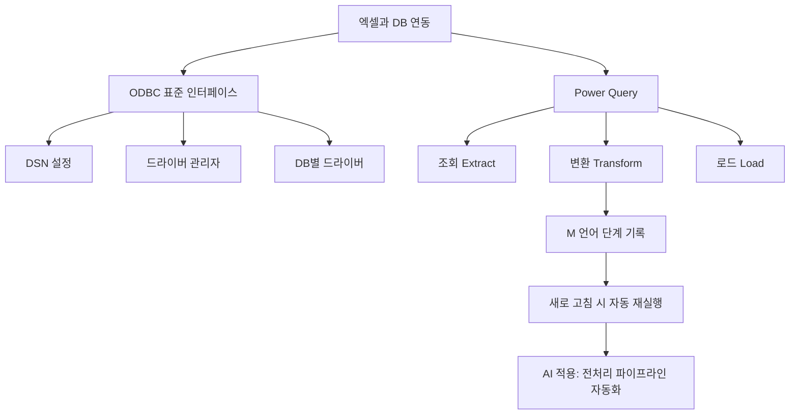

# 12강. 데이터처리와활용: 엑셀과 데이터베이스 연동

## 🔗 선수 지식 (Prerequisites)
- [ ] **필수**: SQL 기초 (SELECT/JOIN/WHERE) - 이해 완료?
- [ ] **필수**: 엑셀 기본 사용 (피벗·필터·정렬)
- [ ] **권장**: 관계형 데이터베이스 모델, DSN/드라이버 개념
- **관련 단원**: [11강. 데이터베이스 SQL 활용](11강.md), [13강. 데이터 시각화](13강.md)

---

## 학습 목표
1. ODBC의 개념과 역할을 설명할 수 있다.
2. 엑셀에서 데이터베이스를 연결할 수 있다.
3. Power Query를 활용한 데이터 조회 및 변환 과정을 설명할 수 있다.

---

## 🧠 메타인지 체크 (학습 전/후 자기 평가)

### 학습 전 자기 평가
| 소주제 | 자신감 (1-5) |
| :--- | :--- |
| ODBC 표준 인터페이스의 개념 | |
| 엑셀-DB 연결 절차 (DSN 설정 → 연결 → 가져오기) | |
| Power Query 단계 (조회 → 변환 → 로드) | |

### 학습 후 교정 (학습 완료 후 작성)
| 소주제 | 학습 전 | 학습 후 | 실제 정답률 | 과신/과소 여부 |
| :--- | :--- | :--- | :--- | :--- |
| ODBC 표준 인터페이스의 개념 | | | | |
| 엑셀-DB 연결 절차 | | | | |
| Power Query 단계 | | | | |

> **활용법**: 학습 전 1분 → 자신감 기입, 학습 후 1분 → 나머지 기입. "과신" 영역이 실제 취약점.

---

## 📝 요약 (Summary)

### ODBC를 이용한 DB 연결 🔴
1.  **ODBC (Open Database Connectivity)** 🔴: 다양한 데이터베이스와 응용 프로그램을 연결하기 위한 **표준 인터페이스**이다. DB 종류(MySQL, Oracle, SQL Server 등)와 무관하게 동일한 방식으로 접근할 수 있도록 추상화한 미들웨어 계층이다.
2.  **엑셀-DB 연동의 효용** 🟡: 엑셀을 통해 데이터베이스 데이터를 조회하고 분석·시각화에 활용할 수 있다. 원본 DB는 그대로 두고 분석용 사본을 가져오므로 운영 시스템 부담이 적다.

### Power Query 🔴
3.  **Power Query** 🔴: **SQL 없이도** 시각적(GUI) 으로 데이터 조회와 변환(ETL)을 수행할 수 있는 엑셀 내장 도구이다. 조회 단계가 M 언어로 기록되어 **재실행(새로 고침)이 가능**하다.

---

## 📐 핵심 문법 및 패턴 (Key Patterns) `← 실습 중심 과목 변형`

| 패턴명 | 단계/명령 | 용도 |
| :--- | :--- | :--- |
| **ODBC DSN 등록** | 제어판 → 관리도구 → ODBC 데이터 원본 → 시스템/사용자 DSN 추가 | DB 접속 정보(드라이버·서버·계정)를 OS에 등록하여 재사용 |
| **엑셀에서 DB 가져오기** | 데이터 탭 → 데이터 가져오기 → 데이터베이스에서 / ODBC에서 → DSN 선택 → 테이블/쿼리 선택 → 로드 | 외부 DB 데이터를 워크시트에 적재 |
| **Power Query 편집기 실행** | 데이터 탭 → 쿼리 및 연결 → 쿼리 우클릭 → "편집" | 가져온 데이터에 변환 단계 적용 (열 분할·제거·형식 변경·필터) |
| **새로 고침** | 데이터 탭 → 모두 새로 고침 (Ctrl+Alt+F5) | DB 원본이 갱신되었을 때 동일 쿼리 재실행 |
| **연결 전용 로드** | 가져오기 시 "연결만 만들기" 선택 | 시트에 적재하지 않고 다른 쿼리와 병합·참조용으로만 보관 |

### 주요 정의 블록

**ODBC 아키텍처 4계층**
$$
\text{응용 프로그램(Excel)} \;\to\; \text{ODBC 드라이버 관리자} \;\to\; \text{ODBC 드라이버(DB별)} \;\to\; \text{데이터베이스}
$$
> **직관적 해석**: 엑셀은 DB 종류를 직접 알 필요 없이 "ODBC에 요청"만 하면 된다. 드라이버 관리자가 적절한 DB별 드라이버를 골라 호출해 주므로, **DB가 바뀌어도 응용 프로그램 코드는 그대로**다.
> **데이터 분석 적용**: 분석가는 동일 엑셀 보고서로 MySQL/Oracle/PostgreSQL을 번갈아 가며 사용할 수 있어, 환경 이전 시 학습 비용이 작다.

**Power Query 처리 흐름 (ETL)**
$$
\text{Extract(조회)} \;\to\; \text{Transform(변환: 정제·결합·집계)} \;\to\; \text{Load(엑셀/데이터 모델 적재)}
$$
> **직관적 해석**: "어디서 가져와서 → 어떻게 다듬어서 → 어디에 둘 것인가"라는 데이터 파이프라인을 마우스 클릭만으로 기록한다.
> **AI 적용**: ML 모델 학습 전 **전처리 파이프라인**(결측치 제거·타입 변환·조인)을 비코딩 사용자도 재현 가능한 형태로 표준화할 수 있다.

---

## 📊 개념 시각화 (Visual Guide)

### 개념 관계도


### 핵심 도식
| 입력 | 연산 | 출력 | 데이터 분석 적용 |
| :--- | :--- | :--- | :--- |
| 원본 DB 테이블 | ODBC 조회(SELECT) | 엑셀 워크시트 표 | 운영 DB를 건드리지 않고 분석용 스냅샷 확보 |
| 가져온 표 + 변환 단계 | Power Query (필터·조인·피벗 해제) | 정제된 분석용 테이블 | 모델 학습용 피처 테이블 생성 |
| M 언어 쿼리 | 새로 고침 | 최신 데이터로 갱신된 표 | 정기 보고서 자동화 |

---

## ✏️ 심화 학습 (Study Subject)

### 1. 가상 시나리오: "어떤 개념을, 언제 사용해야 할까?"
- **상황**: 영업팀이 매주 월요일 아침, MySQL에 적재된 지난 주 주문 데이터를 받아 엑셀로 KPI 보고서를 만들어야 한다. 매번 SQL을 새로 작성·복사하는 데 시간이 소요되고 오류도 잦다.
- **문제**: (1) DB 접속 정보를 매번 수기로 입력하지 않으려면? (2) 매주 동일한 정제 작업(컬럼 제거·결측 보정·고객 테이블 조인)을 반복하지 않으려면?
- **해결**:
  1. **ODBC DSN**으로 MySQL 접속 정보를 OS에 등록 → 엑셀에서 DSN 이름만 선택하면 즉시 연결.
  2. **Power Query**로 "조회 → 변환 → 로드" 단계를 한 번만 기록 → 다음 주에는 **"모두 새로 고침"** 버튼 한 번이면 동일 변환이 자동 재실행.
- **AI 학습 포인트**: "Power Query의 M 언어로 작성된 ETL 단계를 Python pandas 코드로 변환한다면, 각 단계는 어떤 메서드(`merge`/`dropna`/`pivot_table` 등)에 대응될까?"

### 2. 관점별 비교 및 오개념 분석
- **핵심 비교**: **ODBC vs OLE DB vs JDBC** / **Power Query vs SQL 직접 작성** / **워크시트 로드 vs 데이터 모델 로드**
- **오개념 분석**
    - **오개념 1**: "ODBC는 데이터베이스의 일종이다."
    - **분석**: ODBC는 **DB가 아니라 표준 API/미들웨어**다. 엑셀 같은 응용 프로그램이 다양한 DB와 동일한 방식으로 통신할 수 있도록 추상화한 인터페이스일 뿐, 데이터를 저장하지 않는다.
    - **오개념 2**: "Power Query를 쓰려면 반드시 SQL을 알아야 한다."
    - **분석**: Power Query의 핵심 가치는 **SQL을 몰라도** 시각적 GUI로 조회·변환을 수행할 수 있다는 점이다. 단, SQL 기반 DB에 연결할 때 효율을 위해 원본 쿼리를 직접 지정할 수도 있다.
    - **오개념 3**: "엑셀로 가져온 후에는 DB 변경이 자동으로 반영된다."
    - **분석**: 가져오기 시점의 **스냅샷**이며, 최신화하려면 **"새로 고침"** 을 명시적으로 실행해야 한다.
- **AI 학습 포인트**: "ODBC와 OLE DB의 기술적 차이(텍스트 vs COM 기반)와 Power Query의 폴딩(Query Folding) 개념이 성능에 미치는 영향을 비교 설명해 줘."

---

## ❓ 연습 문제 및 해설 📌 (AI 추가 생성 10문항)

> **블룸 인지 수준 범례**: [기억] 정의·나열 → [이해] 설명·비교 → [적용] 계산·구현 → [분석] 구별·디버그 → [평가] 판단·비평 → [창조] 설계·제안

### 📝 문제

**1. ⭐ [기억] 📌 ODBC의 정의로 가장 적절한 것은? [(해설)](#prob-1)**
   > ① 마이크로소프트가 만든 관계형 데이터베이스 제품
   > ② 다양한 DB와 응용 프로그램을 연결하기 위한 표준 인터페이스
   > ③ 엑셀의 시각화 기능을 강화한 추가 기능
   > ④ SQL을 대체하는 새로운 질의 언어

<br>

**2. ⭐ [기억] 📌 Power Query의 핵심 특징으로 옳은 것은? [(해설)](#prob-2)**
   > ① SQL 작성 능력이 반드시 필요하다
   > ② 시각적 인터페이스로 데이터 조회·변환을 수행한다
   > ③ DB에 직접 데이터를 저장하는 기능이다
   > ④ 엑셀 수식만으로 동작한다

<br>

**3. ⭐ [이해] 📌 다음 중 ODBC 아키텍처의 구성 요소가 **아닌** 것은? [(해설)](#prob-3)**
   > ① 응용 프로그램
   > ② ODBC 드라이버 관리자
   > ③ DB별 ODBC 드라이버
   > ④ 운영체제의 파일 탐색기

<br>

**4. ⭐⭐ [이해] 📌 엑셀에서 ODBC를 통해 DB에 연결하기 위해 가장 먼저 수행해야 할 작업은? [(해설)](#prob-4)**
   > ① 워크시트에 가상 데이터를 입력한다
   > ② DSN(Data Source Name)을 등록한다
   > ③ 피벗 테이블을 생성한다
   > ④ VBA 매크로를 실행한다

<br>

**5. ⭐⭐ [적용] 📌 다음 <보기> 중 Power Query에서 수행할 수 있는 작업으로 옳은 것을 모두 고른 것은? [(해설)](#prob-5)**
   > <보기>
   >
   > 가. 여러 데이터 원본 결합(병합/추가)
   > 나. 열 분할 및 데이터 형식 변환
   > 다. 결측치 제거 및 필터링
   > 라. DB 테이블 구조(스키마) 영구 변경

   > ① 가, 나
   > ② 가, 나, 다
   > ③ 나, 다, 라
   > ④ 가, 나, 다, 라

<br>

**6. ⭐⭐ [분석] 📌 엑셀에서 ODBC로 가져온 데이터가 최신 DB 상태와 다를 때 가장 적절한 조치는? [(해설)](#prob-6)**
   > ① 엑셀 파일을 다시 만든다
   > ② "모두 새로 고침"을 실행한다
   > ③ 워크시트의 행을 직접 수정한다
   > ④ DSN을 삭제 후 재생성한다

<br>

**7. ⭐⭐ [이해] 📌 Power Query의 ETL 처리 흐름을 올바른 순서로 나열한 것은? [(해설)](#prob-7)**
   > ① 변환 → 조회 → 로드
   > ② 조회(Extract) → 변환(Transform) → 로드(Load)
   > ③ 로드 → 변환 → 조회
   > ④ 조회 → 로드 → 변환

<br>

**8. ⭐⭐⭐ [평가] 📌 ODBC를 사용하는 가장 큰 **장점**으로 보기 어려운 것은? [(해설)](#prob-8)**
   > ① DB 종류가 바뀌어도 응용 프로그램 코드 변경을 최소화할 수 있다
   > ② 동일한 방식으로 여러 DB에 접근 가능하다
   > ③ 표준화된 인터페이스로 학습 비용이 낮다
   > ④ 데이터베이스의 저장 성능 자체를 향상시킨다

<br>

**9. ⭐⭐⭐ [분석] 📌 다음 <보기> 중 ODBC와 Power Query에 대한 설명으로 옳은 것을 모두 고른 것은? [(해설)](#prob-9)**
   > <보기>
   >
   > 가. ODBC는 데이터를 저장하는 데이터베이스의 일종이다.
   > 나. Power Query에서 기록된 변환 단계는 M 언어로 저장되어 재실행 가능하다.
   > 다. ODBC 드라이버는 DB 종류별로 별도 설치가 필요하다.
   > 라. Power Query는 SQL 작성 능력이 없으면 사용할 수 없다.

   > ① 가, 나
   > ② 나, 다
   > ③ 가, 다, 라
   > ④ 나, 다, 라

<br>

**10. ⭐⭐⭐ [창조] 📌 매주 동일한 형식으로 MySQL의 주문 데이터를 엑셀 보고서로 만드는 업무를 자동화하려고 한다. 가장 효율적인 절차로 옳은 것은? [(해설)](#prob-10)**
   > ① 매주 SQL을 새로 작성하여 결과를 엑셀에 복사·붙여넣기
   > ② DSN 등록 → Power Query로 변환 단계 1회 기록 → 매주 "새로 고침" 실행
   > ③ 매주 DB를 백업하여 다른 컴퓨터에서 분석
   > ④ DB 스키마를 매주 변경하여 보고서에 맞춤

---

### 🔑 정답 및 해설 (먼저 풀어본 후 펼치기)

<details>
<summary>정답 보기 (클릭)</summary>

1. ②
2. ②
3. ④
4. ②
5. ②
6. ②
7. ②
8. ④
9. ②
10. ②

</details>

<details>
<summary>해설 보기 (클릭)</summary>

<a id="prob-1"></a>
**1. ⭐ [기억] ODBC의 정의**
> **정답: ② 다양한 DB와 응용 프로그램을 연결하기 위한 표준 인터페이스**
> **해설**: ODBC(Open Database Connectivity)는 DB가 아니라 DB와 응용 프로그램 사이의 **표준 API**다. ①은 DB 제품, ③은 추가 기능, ④는 질의 언어로 모두 오답.

<a id="prob-2"></a>
**2. ⭐ [기억] Power Query의 핵심 특징**
> **정답: ② 시각적 인터페이스로 데이터 조회·변환을 수행한다**
> **해설**: Power Query는 **SQL 없이도** GUI로 ETL을 수행할 수 있는 도구다. ①은 정반대, ③은 저장 기능이 아닌 조회·변환 도구, ④는 수식 기반이 아닌 단계 기반.

<a id="prob-3"></a>
**3. ⭐ [이해] ODBC 아키텍처 구성 요소**
> **정답: ④ 운영체제의 파일 탐색기**
> **해설**: ODBC는 "응용 프로그램 → 드라이버 관리자 → DB별 드라이버 → DB"의 4계층 구조다. 파일 탐색기는 무관한 OS 기능이다.

<a id="prob-4"></a>
**4. ⭐⭐ [이해] DB 연결 사전 작업**
> **정답: ② DSN(Data Source Name)을 등록한다**
> **해설**: DSN은 DB 접속 정보(드라이버·서버·계정)를 OS에 등록한 식별자다. 등록 후 엑셀에서 이름만 선택해 즉시 연결할 수 있다.

<a id="prob-5"></a>
**5. ⭐⭐ [적용] Power Query 가능 작업**
> **정답: ② 가, 나, 다**
> **해설**: 병합/추가, 열 분할/형식 변환, 결측치 제거/필터링은 모두 Power Query의 표준 기능이다. **라(DB 스키마 영구 변경)** 는 Power Query 권한 밖이며, 원본 DB는 그대로 두고 가져온 사본에만 변환을 적용한다.

<a id="prob-6"></a>
**6. ⭐⭐ [분석] 데이터 동기화**
> **정답: ② "모두 새로 고침"을 실행한다**
> **해설**: 엑셀의 외부 데이터는 가져온 시점의 **스냅샷**이므로 DB 변경이 자동 반영되지 않는다. "모두 새로 고침(Ctrl+Alt+F5)" 으로 동일 쿼리를 재실행해야 최신화된다.

<a id="prob-7"></a>
**7. ⭐⭐ [이해] ETL 흐름**
> **정답: ② 조회(Extract) → 변환(Transform) → 로드(Load)**
> **해설**: ETL은 모든 데이터 파이프라인의 표준 흐름으로, Power Query도 이 순서를 따른다.

<a id="prob-8"></a>
**8. ⭐⭐⭐ [평가] ODBC의 장점이 아닌 것**
> **정답: ④ 데이터베이스의 저장 성능 자체를 향상시킨다**
> **해설**: ODBC는 **연결 계층의 표준화**가 핵심 가치이며, DB 엔진의 저장·인덱싱 성능과는 무관하다. ①②③은 모두 표준 인터페이스의 본질적 장점이다.

<a id="prob-9"></a>
**9. ⭐⭐⭐ [분석] ODBC·Power Query 옳은 설명**
> **정답: ② 나, 다**
> **해설**: 가는 오개념(ODBC는 DB가 아닌 인터페이스), 라도 오개념(Power Query는 SQL 없이 사용 가능). 나(M 언어로 단계 기록)와 다(DB별 드라이버 필요)는 옳다.

<a id="prob-10"></a>
**10. ⭐⭐⭐ [창조] 보고서 자동화 절차**
> **정답: ② DSN 등록 → Power Query로 변환 단계 1회 기록 → 매주 "새로 고침" 실행**
> **해설**: DSN으로 접속 정보를 고정하고 Power Query로 변환 단계를 기록해 두면, 매주는 "새로 고침" 한 번으로 동일한 보고서를 자동 생성할 수 있다. ①은 비효율적, ③④는 부적절·위험.

</details>

---

## ✅ O/X 확인문제 (20문항)

**1.** ODBC는 데이터를 저장하는 데이터베이스 제품이다. [(해설)](#ox-1) **(O / X)**
**2.** ODBC는 응용 프로그램과 DB 사이의 표준 인터페이스 역할을 한다. [(해설)](#ox-2) **(O / X)**
**3.** ODBC를 통해 엑셀은 다양한 종류의 DB에 동일한 방식으로 접근할 수 있다. [(해설)](#ox-3) **(O / X)**
**4.** Power Query는 SQL 작성 능력을 반드시 요구한다. [(해설)](#ox-4) **(O / X)**
**5.** Power Query는 시각적(GUI) 도구로 데이터 조회·변환을 수행한다. [(해설)](#ox-5) **(O / X)**
**6.** Power Query에서 기록된 변환 단계는 M 언어로 저장된다. [(해설)](#ox-6) **(O / X)**
**7.** "새로 고침"을 실행하면 Power Query의 기록된 단계가 자동 재실행된다. [(해설)](#ox-7) **(O / X)**
**8.** DSN(Data Source Name)은 DB 접속 정보를 OS에 등록한 식별자이다. [(해설)](#ox-8) **(O / X)**
**9.** ODBC를 사용하면 DB 종류가 바뀌어도 응용 프로그램 코드를 거의 수정하지 않아도 된다. [(해설)](#ox-9) **(O / X)**
**10.** ODBC 드라이버는 DB 종류와 무관하게 하나만 설치하면 된다. [(해설)](#ox-10) **(O / X)**
**11.** 엑셀로 가져온 데이터는 원본 DB가 변경되면 실시간 자동으로 반영된다. [(해설)](#ox-11) **(O / X)**
**12.** Power Query에서 수행한 변환은 원본 DB의 스키마를 영구적으로 변경한다. [(해설)](#ox-12) **(O / X)**
**13.** ETL은 Extract → Transform → Load의 순서를 의미한다. [(해설)](#ox-13) **(O / X)**
**14.** Power Query에서 "연결만 만들기"는 시트에 데이터를 로드하지 않고 쿼리만 보관하는 옵션이다. [(해설)](#ox-14) **(O / X)**
**15.** 엑셀과 DB를 연동하면 분석을 위해 운영 DB에 항상 직접 쓰기 작업을 해야 한다. [(해설)](#ox-15) **(O / X)**
**16.** ODBC는 마이크로소프트가 표준화에 기여한 데이터 접근 인터페이스이다. [(해설)](#ox-16) **(O / X)**
**17.** Power Query는 여러 데이터 원본을 병합·추가하여 하나의 테이블로 결합할 수 있다. [(해설)](#ox-17) **(O / X)**
**18.** Power Query는 결측치(빈 값)를 제거하거나 대체하는 기능을 제공한다. [(해설)](#ox-18) **(O / X)**
**19.** ODBC 아키텍처에서 드라이버 관리자는 응용 프로그램의 요청을 적절한 DB별 드라이버로 전달한다. [(해설)](#ox-19) **(O / X)**
**20.** Power Query로 작성한 ETL 단계는 매주 정기 보고서 자동화에 활용하기 적합하다. [(해설)](#ox-20) **(O / X)**

<details>
<summary>O/X 정답 및 해설 보기 (클릭)</summary>

> <a id="ox-1"></a>
> **1. 정답**: X
> **해설**: ODBC는 DB 제품이 아니라 응용 프로그램과 DB를 연결하는 **표준 인터페이스(미들웨어)**다.

> <a id="ox-2"></a>
> **2. 정답**: O
> **해설**: ODBC의 정의 그대로다.

> <a id="ox-3"></a>
> **3. 정답**: O
> **해설**: 표준 인터페이스 덕분에 MySQL·Oracle·SQL Server 등을 동일한 방식으로 다룰 수 있다.

> <a id="ox-4"></a>
> **4. 정답**: X
> **해설**: Power Query의 핵심 가치는 **SQL 없이도** 데이터 조회·변환이 가능하다는 점이다.

> <a id="ox-5"></a>
> **5. 정답**: O
> **해설**: 클릭 기반 GUI로 ETL 작업을 수행한다.

> <a id="ox-6"></a>
> **6. 정답**: O
> **해설**: 각 변환 단계는 내부적으로 M 언어로 기록되어 재실행 가능하다.

> <a id="ox-7"></a>
> **7. 정답**: O
> **해설**: "모두 새로 고침"으로 기록된 단계가 동일하게 재실행된다.

> <a id="ox-8"></a>
> **8. 정답**: O
> **해설**: DSN은 드라이버·서버·계정 등 접속 정보를 묶어 OS에 등록한 이름이다.

> <a id="ox-9"></a>
> **9. 정답**: O
> **해설**: 응용 프로그램은 ODBC API만 호출하면 되므로 DB 교체 영향이 최소화된다.

> <a id="ox-10"></a>
> **10. 정답**: X
> **해설**: DB 종류별로 해당 DB의 ODBC 드라이버를 **각각 설치**해야 한다.

> <a id="ox-11"></a>
> **11. 정답**: X
> **해설**: 가져온 데이터는 스냅샷이며, 최신화하려면 "새로 고침"을 명시적으로 실행해야 한다.

> <a id="ox-12"></a>
> **12. 정답**: X
> **해설**: Power Query 변환은 가져온 사본에만 적용되며 **원본 DB 스키마는 변경하지 않는다**.

> <a id="ox-13"></a>
> **13. 정답**: O
> **해설**: ETL의 표준 순서다.

> <a id="ox-14"></a>
> **14. 정답**: O
> **해설**: "연결만 만들기"는 시트 로드를 생략하고 다른 쿼리의 참조용으로 보관한다.

> <a id="ox-15"></a>
> **15. 정답**: X
> **해설**: 분석은 원본 DB를 그대로 두고 **읽기 전용으로 조회**하는 것이 일반적이며, 운영 부담을 줄이는 것이 핵심 효용이다.

> <a id="ox-16"></a>
> **16. 정답**: O
> **해설**: ODBC는 SQL Access Group에서 출발해 마이크로소프트가 표준화·보급에 기여하였다.

> <a id="ox-17"></a>
> **17. 정답**: O
> **해설**: "쿼리 병합"·"쿼리 추가" 기능을 통해 여러 원본을 결합할 수 있다.

> <a id="ox-18"></a>
> **18. 정답**: O
> **해설**: "값 채우기"·"행 제거"·"null 대체" 등의 기능을 제공한다.

> <a id="ox-19"></a>
> **19. 정답**: O
> **해설**: 드라이버 관리자는 응용 프로그램의 요청을 받아 등록된 DB별 드라이버로 라우팅한다.

> <a id="ox-20"></a>
> **20. 정답**: O
> **해설**: 변환 단계가 재사용 가능한 형태로 저장되므로 정기 보고서 자동화에 적합하다.

</details>

---

## 🧪 자유 회상 연습 (Free Recall)

> **방법**: 위의 노트를 모두 덮고, 타이머 3분 설정 후 이번 단원에서 배운 내용을 기억나는 대로 자유롭게 적으세요.
> 정확한 문장이 아니어도 됩니다. 키워드, 수식, 관계 등 떠오르는 것을 모두 적습니다.

**자유 회상 작성란:**

```
[ODBC 정의, ODBC 4계층, DSN, Power Query 3단계(E-T-L), M 언어, 새로 고침, 오개념 …]


```

> **회상 후 점검**: 노트를 다시 펼쳐 빠뜨린 내용을 확인하세요. 빠뜨린 부분이 실제 취약점입니다.
> - 회상 못한 핵심 개념: [                ]
> - 회상 못한 단계/패턴: [                ]

---

## 💻 코드로 확인하기 (Code Verification)

> 엑셀 GUI 작업을 Python으로 재현하여 "ODBC 조회 → 변환(ETL) → 적재"가 어떤 동작인지 직접 확인한다.

```python
# 사전 설치: pip install pyodbc pandas sqlalchemy openpyxl
# (실습용으로는 sqlite로 ODBC를 흉내내거나, 실제 ODBC DSN 'MySalesDSN'이 등록되어 있다고 가정)

import sqlite3
import pandas as pd

# 1) [Extract] 가상의 DB(주문) 준비 - 실제로는 ODBC로 외부 DB에 연결한다고 보면 됨
conn = sqlite3.connect(":memory:")
orders = pd.DataFrame({
    "order_id":   [1, 2, 3, 4, 5],
    "customer":   ["A", "B", "A", None, "C"],
    "amount":     [120, 90, 300, 50, 220],
    "order_date": ["2026-05-20", "2026-05-21", "2026-05-22", "2026-05-22", "2026-05-23"],
})
orders.to_sql("orders", conn, index=False)

# (실제 ODBC 예시 - 주석)
# import pyodbc
# cn = pyodbc.connect("DSN=MySalesDSN;UID=user;PWD=pw")
# df = pd.read_sql("SELECT * FROM orders WHERE amount >= 100", cn)

# 2) [Extract] 엑셀의 "데이터 가져오기"에 대응
df = pd.read_sql("SELECT * FROM orders", conn)
print("[Extract] 원본:\n", df, "\n")

# 3) [Transform] Power Query 변환 단계에 대응
#    - 결측 고객 제거 / 금액 100 이상 / 날짜 형식 변환 / 고객별 합계
df_clean = (
    df.dropna(subset=["customer"])
      .query("amount >= 100")
      .assign(order_date=lambda d: pd.to_datetime(d["order_date"]))
)
df_summary = df_clean.groupby("customer", as_index=False)["amount"].sum()
print("[Transform] 정제:\n", df_clean, "\n")
print("[Transform] 고객별 합계:\n", df_summary, "\n")

# 4) [Load] 엑셀 워크시트에 적재 - "워크시트 로드"에 대응
df_summary.to_excel("sales_report.xlsx", sheet_name="요약", index=False)
print("[Load] sales_report.xlsx 저장 완료")
```

> **실행 결과 (요약 부분)**:
> ```
> [Transform] 고객별 합계:
>   customer  amount
> 0        A     420
> 1        C     220
> ```
> **해석**: `read_sql`은 엑셀의 "ODBC 데이터 가져오기"에, 체이닝된 `dropna → query → assign → groupby`는 Power Query의 단계별 변환에, `to_excel`은 "로드"에 각각 대응한다. **Power Query는 이 과정을 비코딩 사용자도 동일하게 수행하도록 만든 시각적 도구**라는 점이 핵심이다.

---

## 🤖 데이터 분석/AI 연결고리 (Concept → Application)

| 학습 개념 | 데이터/AI 적용 분야 | 구체적 사례 |
| :--- | :--- | :--- |
| ODBC 표준 인터페이스 | 데이터 통합/마이그레이션 | BI 도구(Power BI, Tableau)가 동일 DSN으로 다양한 DB 접근 |
| Power Query ETL | 데이터 전처리 파이프라인 | ML 학습 전 결측치 처리·조인을 비코딩 사용자도 재현 가능하게 표준화 |
| M 언어 단계 기록 | 재현 가능한 분석 | 매주 동일 보고서를 "새로 고침" 한 번으로 갱신, 분석 감사(audit) 추적 |
| DSN 기반 접속 추상화 | DevOps/환경 분리 | 개발/스테이징/운영 DB를 동일 보고서로 전환 (DSN만 교체) |

---

## 📖 심화 학습 예시 답안

#### 1. ODBC의 내부 동작 원리
응용 프로그램(엑셀)이 "데이터 조회"를 요청했을 때, 실제로 DB까지 도달하는 단계는 다음과 같다.

1.  **응용 프로그램 호출**: 엑셀이 ODBC 표준 API(`SQLConnect`, `SQLExecDirect` 등)를 호출한다. 이때 엑셀은 **MySQL인지 Oracle인지 알 필요가 없다**.
2.  **드라이버 관리자 라우팅**: OS에 설치된 ODBC 드라이버 관리자가 DSN에 지정된 드라이버 이름을 보고 해당 DB의 드라이버를 찾는다.
3.  **DB별 드라이버 번역**: 표준 ODBC 호출을 해당 DB가 이해하는 네트워크 프로토콜·SQL 방언으로 번역해 실제 DB 서버에 전달한다.
4.  **결과 반환**: DB의 응답을 표준 결과 집합으로 다시 번역하여 엑셀에 돌려준다. 엑셀은 DB가 무엇이었는지 모른 채 일관된 형식의 표를 받는다.

#### 2. ODBC vs Power Query 비교표

| 구분 | ODBC | Power Query |
| :--- | :--- | :--- |
| **정의** | DB 접근 표준 인터페이스(API/미들웨어) | 엑셀 내장 시각적 ETL 도구 |
| **계층** | 연결(Connection) 계층 | 처리(Transformation) 계층 |
| **사용 형태** | DSN 등록 후 응용 프로그램이 호출 | 엑셀 GUI에서 단계별 조작 |
| **적용 조건** | 다양한 DB 종류에 표준 접근 필요할 때 | 가져온 데이터에 반복적 정제·결합 필요할 때 |
| **데이터/AI 활용** | 다양한 데이터 원본을 통합하는 분석 환경 구축 | 모델 학습용 전처리 파이프라인의 비코딩 자동화 |

#### 3. Power Query 사용 Best Practice

- **Bad Practice (나쁜 예시)**: SQL을 매주 새로 작성해 결과를 복사·붙여넣기
  ```text
  1) SQL Workbench에서 SELECT문 작성·실행
  2) 결과를 엑셀에 복사·붙여넣기
  3) 매주 동일 작업 반복 (오타·오류 빈번)
  ```
- **Good Practice (좋은 예시)**: ODBC DSN + Power Query로 1회 구축 → 매주 새로 고침
  ```text
  1) ODBC DSN 등록 (1회)
  2) 엑셀 → 데이터 가져오기 → ODBC에서 → DSN 선택 (1회)
  3) Power Query 편집기에서 변환 단계 기록 (열 제거·필터·조인) (1회)
  4) 매주 월요일: 데이터 → 모두 새로 고침 (1초)
  ```
- **설명**: Good Practice는 **재현성·자동화·오류 감소**의 세 가지 이점을 동시에 얻는다. 변환 단계는 M 언어로 보존되어 인계·감사가 쉬워지고, 인적 실수가 개입할 여지가 사라진다.

---

## 📚 핵심 용어집 (Glossary)

| 용어 (한) | 용어 (영) | 표현/약어 | 정의 |
| :--- | :--- | :--- | :--- |
| **개방형 데이터베이스 연결** | Open Database Connectivity | ODBC | 응용 프로그램이 다양한 DB에 일관된 방식으로 접근하도록 하는 표준 API. `→←11강` |
| **데이터 원본 이름** | Data Source Name | DSN | DB 접속 정보(드라이버·서버·계정)를 OS에 등록한 식별자 |
| **드라이버 관리자** | Driver Manager | - | 응용 프로그램의 ODBC 호출을 적절한 DB별 드라이버로 전달하는 OS 구성 요소 |
| **파워 쿼리** | Power Query | - | 엑셀 내장의 시각적 ETL 도구. SQL 없이 조회·변환·로드 수행 |
| **M 언어** | M Language (Power Query Formula Language) | M | Power Query의 단계가 내부적으로 저장되는 함수형 스크립트 언어 |
| **ETL** | Extract-Transform-Load | ETL | 조회 → 변환 → 적재로 이어지는 데이터 파이프라인의 표준 흐름 |
| **새로 고침** | Refresh | - | 기록된 쿼리·변환 단계를 동일 원본에 재실행하여 데이터를 최신화하는 작업 |

---

## 🤖 AI 학습 파트너를 위한 추가 자료

### 1. 개념 이해를 위한 심층 질문 프롬프트
> **프롬프트 예시**: "ODBC를 비유로 설명해 줘. 예를 들어 '여행자가 다양한 국가의 콘센트에 동일한 어댑터로 접근하는 것'처럼, 응용 프로그램이 다양한 DB에 동일하게 접근하는 원리를 비유와 함께 알려줘. 또한 ODBC가 없던 시절에는 어떤 문제가 있었는지 역사적 배경도 함께 설명해 줘."

### 2. 문제 해결 능력 강화를 위한 시나리오 프롬프트
> **프롬프트 예시**: "당신은 데이터 분석가입니다. 회사에서 MySQL → PostgreSQL로 DB를 교체해야 하는 상황에서, 기존에 작성된 50개의 엑셀 보고서를 어떻게 최소 비용으로 마이그레이션할 수 있는지 ODBC와 Power Query의 관점에서 단계별로 설명해 줘. 각 단계의 위험 요소와 검증 방법도 함께 제시해 줘."

### 3. 풀이 검증 프롬프트
> **프롬프트 예시**: "다음 Power Query 단계를 검증해 줘.
> 1) DSN=Sales 접속 → 2) Orders 테이블 조회 → 3) amount IS NULL 행 제거 → 4) order_date를 날짜형으로 변환 → 5) customer 기준 amount 합계 집계 → 6) 워크시트에 로드
> (a) 각 단계가 ETL 흐름상 올바른 위치에 있는지 확인하고, 틀린 부분이 있다면 지적해 줘.
> (b) Query Folding(쿼리 폴딩) 관점에서 어느 단계가 DB로 푸시다운 가능한지 분석해 줘.
> (c) 더 효율적인 단계 순서가 있다면 제시해 줘."

---

## 🔄 복습 체크 (Spaced Repetition)
- [ ] 1일 후 복습 (날짜: 2026-05-30)
- [ ] 3일 후 복습 (날짜: 2026-06-01)
- [ ] 7일 후 복습 (날짜: 2026-06-05)
- [ ] 14일 후 복습 (날짜: 2026-06-12)
- [ ] 30일 후 복습 (날짜: 2026-06-28)

### 복습 시 자가 평가
| 회차 | 날짜 | 이해도 (1-5) | 취약 부분 메모 |
| :--- | :--- | :--- | :--- |
| 1차 | | | |
| 2차 | | | |
| 3차 | | | |

---

## 📚 참고 자료 (References)

- 한국방송통신대학교 - 데이터처리와활용 12강 강의자료 (엑셀과 데이터베이스 연동)
- Microsoft Docs - [About ODBC](https://learn.microsoft.com/sql/odbc/reference/about-odbc)
- Microsoft Docs - [Power Query 개요](https://learn.microsoft.com/power-query/power-query-what-is-power-query)
- Microsoft Docs - [엑셀에서 외부 데이터 가져오기 (ODBC)](https://support.microsoft.com/office)
