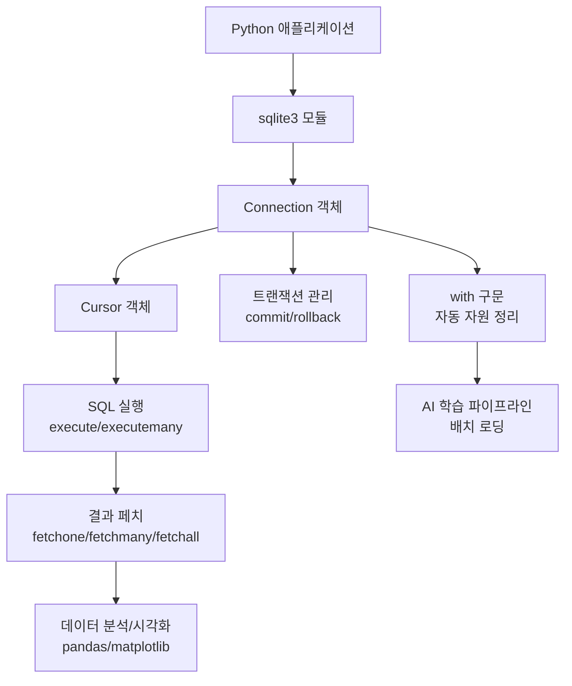
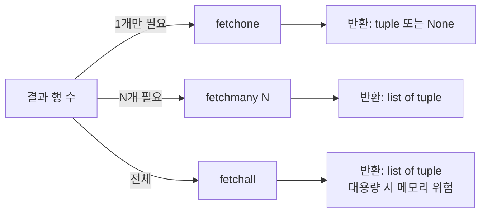

# 13. 데이터처리와활용: 파이썬과 데이터베이스(1)

## 🔗 선수 지식 (Prerequisites)
- [ ] **필수**: SQL 기본 문법 (SELECT, INSERT, UPDATE, DELETE) - 이해 완료?
- [ ] **필수**: 파이썬 기본 문법 (함수, 컨텍스트 매니저 `with`) - 이해 완료?
- [ ] **권장**: 관계형 데이터베이스 개념 (테이블, 트랜잭션)
- **관련 단원**: [12강. SQL 활용](./12강.md), [14강. 파이썬과 데이터베이스(2)](./14강.md)

---

## 학습 목표
1. 데이터베이스 프로그래밍의 필요성을 설명할 수 있다.
2. sqlite3 모듈의 기본 구조와 동작 원리를 설명할 수 있다.
3. SQL 실행 결과를 파이썬에서 처리하는 흐름을 설명할 수 있다.

---

## 🧠 메타인지 체크 (학습 전/후 자기 평가)

### 학습 전 자기 평가
| 소주제 | 자신감 (1-5) |
| :--- | :--- |
| 데이터베이스 프로그래밍의 필요성 | |
| sqlite3 Connection/Cursor 구조 | |
| fetchone/fetchmany/fetchall 차이 | |
| with 구문을 활용한 자원 관리 | |

### 학습 후 교정 (학습 완료 후 작성)
| 소주제 | 학습 전 | 학습 후 | 실제 정답률 | 과신/과소 여부 |
| :--- | :--- | :--- | :--- | :--- |
| 데이터베이스 프로그래밍의 필요성 | | | | |
| sqlite3 Connection/Cursor 구조 | | | | |
| fetchone/fetchmany/fetchall 차이 | | | | |
| with 구문을 활용한 자원 관리 | | | | |

> **활용법**: 학습 전 1분 → 자신감 기입, 학습 후 1분 → 나머지 기입. "과신" 영역이 실제 취약점.

---

## 📝 요약 (Summary)

1.  **데이터베이스 프로그래밍** 🔴: 데이터 분석 작업은 반복적으로 수행되는 경우가 많으며, 단순 SQL 실행만으로는 효율적인 처리에 한계가 있다. 파이썬을 활용하면 반복 작업을 자동화하고, 다양한 데이터 소스를 통합 처리할 수 있다.
2.  **sqlite3를 이용한 DB 연동** 🔴: sqlite3 모듈을 통해 데이터베이스에 연결하고, `Connection`과 `Cursor` 객체를 이용해 SQL을 실행한다. `fetchone`, `fetchmany`, `fetchall`로 결과를 상황에 맞게 가져온다.
3.  **데이터 활용과 관리** 🟡: 데이터 처리 후에는 반드시 연결을 종료해야 하며, `with` 구문을 사용하면 자동으로 자원을 정리할 수 있다. 이를 통해 메모리 누수나 트랜잭션 문제를 방지할 수 있다.
4.  **파라미터 바인딩** 🟡: `?` 플레이스홀더와 튜플을 사용해 SQL 인젝션을 방지하고 안전하게 값을 전달한다.
5.  **트랜잭션과 commit** 🟢: INSERT/UPDATE/DELETE 후에는 `commit()`을 호출해야 변경사항이 디스크에 반영된다.

---

## 📐 핵심 문법 및 패턴 (Key Patterns)

| 패턴명 | 코드 | 용도 |
| :--- | :--- | :--- |
| **DB 연결** | `conn = sqlite3.connect('db.sqlite')` | 데이터베이스 파일에 연결, 없으면 생성 |
| **커서 생성** | `cur = conn.cursor()` | SQL 실행 및 결과 조회를 위한 커서 객체 생성 |
| **SQL 실행** | `cur.execute("SELECT * FROM t")` | 단일 SQL 문 실행 |
| **다중 실행** | `cur.executemany("INSERT ...", rows)` | 여러 행을 한 번에 삽입 (성능↑) |
| **한 행 조회** | `row = cur.fetchone()` | 결과의 첫 행 1개만 반환, 없으면 `None` |
| **N행 조회** | `rows = cur.fetchmany(N)` | 지정한 N개 행 반환 |
| **전체 조회** | `rows = cur.fetchall()` | 모든 결과를 리스트로 반환 (메모리 주의) |
| **커밋** | `conn.commit()` | 변경사항을 디스크에 반영 |
| **연결 종료** | `conn.close()` | 자원 해제 |
| **컨텍스트 매니저** | `with sqlite3.connect(...) as conn:` | 블록 종료 시 자동 commit/rollback |
| **파라미터 바인딩** | `cur.execute("... WHERE id=?", (1,))` | SQL 인젝션 방지 및 타입 안전성 |

### cursor.description 및 row_factory

**cursor.description**: 가장 최근 SELECT 쿼리 실행 후 각 열의 메타데이터(이름·타입 등)를 담은 읽기 전용 속성. fetchall() 결과를 컬럼명 dict로 변환할 때 사용한다.
```python
columns = [desc[0] for desc in cur.description]  # 컬럼명 추출
rows = [dict(zip(columns, row)) for row in cur.fetchall()]
```

**row_factory(sqlite3.Row)**: 쿼리 결과를 튜플 대신 컬럼명으로 접근 가능한 Row 객체로 반환. dict-like 접근이 가능하여 코드 가독성이 향상된다.
```python
conn.row_factory = sqlite3.Row
cur = conn.cursor()
cur.execute("SELECT 이름, 나이 FROM 학생")
for row in cur.fetchall():
    print(row["이름"], row["나이"])  # 인덱스 대신 컬럼명으로 접근
```

### 주요 원리

**Connection-Cursor 모델**
```
Application ──► Connection ──► Cursor ──► SQL Engine ──► Database File
                    ▲              ▲
                 트랜잭션 단위    SQL 실행/결과 페치 단위
```
> **직관적 해석**: Connection은 "DB와의 통신 채널", Cursor는 "그 채널 위에서 명령을 보내고 결과를 받는 손" 역할이다.
> **AI 적용**: ML 학습 데이터를 DB에서 배치로 읽어올 때, `fetchmany(batch_size)` 패턴이 GPU 메모리 효율적 로딩에 사용된다.

---

## 📊 개념 시각화 (Visual Guide)

### 개념 관계도


### 분류 체계도: fetch 메서드 선택 기준


### 핵심 도식
| 입력 | 연산 | 출력 | AI 적용 |
| :--- | :--- | :--- | :--- |
| SQL 쿼리 문자열 | `cur.execute()` | Cursor 상태 변경 | 학습 데이터 추출 쿼리 자동 생성 |
| Cursor (실행 후) | `fetchone()` | 단일 행 tuple | 단일 샘플 추론 시 메타데이터 조회 |
| Cursor (실행 후) | `fetchmany(N)` | N행 list | 미니배치 학습 데이터 로딩 |
| Cursor (실행 후) | `fetchall()` | 전체 행 list | 전처리 단계 작은 코드북 일괄 로딩 |

---

## ✏️ 심화 학습 (Study Subject)

### 1. 가상 시나리오: "어떤 fetch를 언제 사용해야 할까?"
- **상황**: 1억 건 규모의 로그 테이블에서 사용자별 통계를 집계해 ML 모델 입력으로 사용해야 한다.
- **문제**: `fetchall()`로 1억 건을 한 번에 불러오면 메모리가 폭발한다. 어떤 패턴을 사용해야 할까?
- **해결**:
  ```python
  with sqlite3.connect('logs.db') as conn:
      cur = conn.cursor()
      cur.execute("SELECT user_id, action FROM logs")
      while True:
          rows = cur.fetchmany(1000)  # 1000개씩 배치 처리
          if not rows:
              break
          process_batch(rows)
  ```
- **AI 학습 포인트**: "사이즈가 가변적인 대용량 쿼리 결과를 PyTorch DataLoader처럼 스트리밍 처리하려면 어떤 디자인 패턴이 좋을까?"

### 2. 관점별 비교 및 오개념 분석
- **핵심 비교**: "fetchone vs fetchmany vs fetchall", "execute vs executemany", "수동 close vs with 구문"
- **오개념 분석**:
    - **오개념 1**: "SELECT 후에도 `commit()`을 호출해야 한다"
    - **분석**: `commit()`은 **데이터를 변경하는 작업**(INSERT/UPDATE/DELETE)에 대해 트랜잭션을 확정하는 명령이다. SELECT는 읽기 작업이므로 commit이 필요 없다. 단, INSERT 후 commit 없이 close하면 변경사항이 사라진다.
    - **오개념 2**: "`cur.execute("SELECT * FROM users WHERE name='" + name + "'")`처럼 문자열 결합으로 쿼리를 만들어도 된다"
    - **분석**: SQL 인젝션 취약점이 발생한다. 반드시 `cur.execute("SELECT * FROM users WHERE name=?", (name,))` 형태의 파라미터 바인딩을 사용해야 한다.
    - **오개념 3**: "`with sqlite3.connect(...) as conn:` 블록이 끝나면 connection도 close된다"
    - **분석**: 실제로는 **commit/rollback만 자동 수행**되며, connection 자체는 close되지 않는다. 명시적으로 `conn.close()`를 호출하거나 `contextlib.closing()`을 함께 써야 한다.
- **AI 학습 포인트**: "sqlite3의 `with` 구문이 PEP 249 DB-API에서 정확히 무엇을 보장하는지, 그리고 SQLAlchemy의 세션 컨텍스트와 어떻게 다른지 비교해줘."

---

## ❓ 연습 문제 및 해설

> **블룸 인지 수준 범례**: [기억] 정의·나열 → [이해] 설명·비교 → [적용] 계산·구현 → [분석] 구별·디버그 → [평가] 판단·비평 → [창조] 설계·제안

### 📝 문제

**1. ⭐ [기억] 📌 [sqlite3 모듈에서 SQL을 실행하기 위해 직접 사용하는 객체](#prob-1)**
   > ① Connection
   > ② Cursor
   > ③ Engine
   > ④ Session

<br>

**2. ⭐ [기억] 📌 [결과의 첫 번째 행 하나만 가져오는 메서드](#prob-2)**
   > ① fetchall()
   > ② fetchmany()
   > ③ fetchone()
   > ④ fetchnext()

<br>

**3. ⭐⭐ [이해] 📌 [데이터베이스 프로그래밍이 단순 SQL 실행보다 유리한 이유로 옳은 것](#prob-3)**
   > <보기>
   >
   > 가. 반복 작업을 자동화할 수 있다.
   > 나. 다양한 데이터 소스를 통합 처리할 수 있다.
   > 다. SQL 문법 학습이 불필요하다.
   > 라. 분석 결과를 파이썬 라이브러리와 연계할 수 있다.

   > ① 가, 나
   > ② 가, 나, 다
   > ③ 가, 나, 라
   > ④ 가, 나, 다, 라

<br>

**4. ⭐⭐ [이해] 📌 [`with sqlite3.connect('db.sqlite') as conn:` 구문이 블록 종료 시 자동 수행하는 작업](#prob-4)**
   > ① conn.close()만 호출한다
   > ② conn.commit() 또는 conn.rollback()을 호출한다
   > ③ conn.close()와 conn.commit()을 모두 호출한다
   > ④ 아무 동작도 하지 않는다

<br>

**5. ⭐⭐ [적용] 📌 [다음 코드의 빈칸에 들어갈 올바른 메서드](#prob-5)**
   > ```python
   > cur.execute("SELECT id, name FROM users")
   > rows = cur._____(5)   # 5개 행씩 꺼내기
   > ```
   > ① fetchone
   > ② fetchmany
   > ③ fetchall
   > ④ fetchsize

<br>

**6. ⭐⭐ [적용] 📌 [SQL 인젝션을 방지하기 위한 올바른 파라미터 바인딩](#prob-6)**
   > ① `cur.execute("SELECT * FROM u WHERE id=" + str(uid))`
   > ② `cur.execute(f"SELECT * FROM u WHERE id={uid}")`
   > ③ `cur.execute("SELECT * FROM u WHERE id=?", (uid,))`
   > ④ `cur.execute("SELECT * FROM u WHERE id=%s" % uid)`

<br>

**7. ⭐⭐ [분석] 📌 [다음 코드를 실행한 후 users.db에 데이터가 저장되지 않는 이유](#prob-7)**
   > ```python
   > conn = sqlite3.connect('users.db')
   > cur = conn.cursor()
   > cur.execute("INSERT INTO users(name) VALUES (?)", ("Kim",))
   > conn.close()
   > ```
   > ① execute 메서드가 잘못되었다
   > ② 파라미터 바인딩이 잘못되었다
   > ③ `conn.commit()` 호출이 누락되었다
   > ④ Cursor를 close 하지 않았다

<br>

**8. ⭐⭐⭐ [분석] 📌 [다음 두 코드의 차이로 옳은 것](#prob-8)**
   > <보기>
   >
   > 가. A는 SQL을 한 번만 파싱(prepare)하고 바인딩만 반복하므로 Python-C 경계 호출이 적어 빠르다.
   > 나. B는 각 INSERT마다 별도의 execute 호출이 발생한다.
   > 다. A와 B의 실행 결과(저장 데이터)는 동일하다.
   > 라. A는 executemany, B는 for 루프 + execute를 사용한다.
   >
   > ```python
   > # A
   > cur.executemany("INSERT INTO t VALUES(?,?)", rows)
   > # B
   > for r in rows:
   >     cur.execute("INSERT INTO t VALUES(?,?)", r)
   > ```

   > ① 가, 나
   > ② 가, 나, 다
   > ③ 나, 다, 라
   > ④ 가, 나, 다, 라

<br>

**9. ⭐⭐⭐ [평가] 📌 [대용량(1억 건) 쿼리 결과를 처리하는 가장 적절한 패턴](#prob-9)**
   > ① fetchall()로 한 번에 모두 가져온 뒤 for 루프로 처리
   > ② fetchone()을 1억 번 반복 호출
   > ③ fetchmany(N)을 while 루프 안에서 호출하며 배치 처리
   > ④ 1억 개의 별도 SELECT 쿼리를 실행

<br>

**10. ⭐⭐⭐ [창조] 📌 [아래 요구사항을 만족하는 함수를 작성하시오 (서술형)](#prob-10)**

   > 요구사항:
   > - `db_path`, `min_age` 두 인자를 받는다.
   > - `users(id, name, age)` 테이블에서 `age >= min_age`인 행만 조회한다.
   > - SQL 인젝션이 발생하지 않아야 한다.
   > - `with` 구문으로 자원을 안전하게 관리한다.
   > - 결과를 `[(id, name, age), ...]` 형태로 반환한다.

---

### 🔑 정답 및 해설 (먼저 풀어본 후 펼치기)

<details>
<summary>정답 보기 (클릭)</summary>

1. ②
2. ③
3. ③
4. ②
5. ②
6. ③
7. ③
8. ④
9. ③
10. (풀이형 — 아래 해설 참조)

</details>

<details>
<summary>해설 보기 (클릭)</summary>

<a id="prob-1"></a>
**1. ⭐ [기억] SQL 실행 객체**
> **정답: ② Cursor**
> **해설**: Connection은 DB와의 연결 채널을 담당하고, 실제 SQL 실행과 결과 조회는 Cursor 객체가 수행한다. Engine/Session은 SQLAlchemy ORM의 개념이다.

<a id="prob-2"></a>
**2. ⭐ [기억] fetch 메서드**
> **정답: ③ fetchone()**
> **해설**: `fetchone()`은 결과의 첫 행을 tuple로 반환하며, 더 이상 행이 없으면 `None`을 반환한다. `fetchnext()`는 sqlite3에 존재하지 않는다.

<a id="prob-3"></a>
**3. ⭐⭐ [이해] DB 프로그래밍의 장점**
> **정답: ③ 가, 나, 라**
> **해설**: 파이썬 DB 프로그래밍은 자동화·통합·분석 라이브러리 연계가 강점이다. 다(SQL 학습이 불필요)는 잘못된 설명으로, 오히려 SQL을 정확히 알아야 효과적으로 활용할 수 있다.

<a id="prob-4"></a>
**4. ⭐⭐ [이해] with 구문 동작**
> **정답: ② conn.commit() 또는 conn.rollback()을 호출한다**
> **해설**: sqlite3의 connection은 컨텍스트 매니저로 사용 시, 블록 정상 종료 → `commit()`, 예외 발생 → `rollback()`을 자동 수행한다. 단, **connection 자체는 close되지 않는다**는 점이 오개념 포인트다.

<a id="prob-5"></a>
**5. ⭐⭐ [적용] fetchmany 사용**
> **정답: ② fetchmany**
> **해설**: `fetchmany(N)`은 N개 행을 list of tuple로 반환한다. 대용량 처리 시 메모리 효율적이다.

<a id="prob-6"></a>
**6. ⭐⭐ [적용] 파라미터 바인딩**
> **정답: ③ `cur.execute("SELECT * FROM u WHERE id=?", (uid,))`**
> **해설**: `?` 플레이스홀더와 튜플 인자를 사용해야 SQL 인젝션을 방지하고 타입 변환도 안전하게 처리된다. 나머지 ①②④는 모두 문자열 결합/포맷팅 방식으로 인젝션에 취약하다.

<a id="prob-7"></a>
**7. ⭐⭐ [분석] commit 누락**
> **정답: ③ `conn.commit()` 호출이 누락되었다**
> **해설**: INSERT/UPDATE/DELETE는 트랜잭션을 시작하지만, `commit()`을 호출해야 디스크에 확정 반영된다. commit 없이 close하면 변경사항이 롤백되어 사라진다.

<a id="prob-8"></a>
**8. ⭐⭐⭐ [분석] executemany vs 반복 execute**
> **정답: ④ 가, 나, 다, 라**
> **해설**:
> - 가: `executemany`는 내부적으로 SQL 파싱을 한 번만 하고 바인딩만 반복하므로 빠르다.
> - 나: B는 매 반복마다 execute 호출이 발생한다.
> - 다: 결과적으로 저장되는 데이터는 동일하다.
> - 라: 사용 메서드의 차이도 명확하다.
> 따라서 보기 전부 옳다.

<a id="prob-9"></a>
**9. ⭐⭐⭐ [평가] 대용량 처리 패턴**
> **정답: ③ fetchmany(N)을 while 루프 안에서 호출하며 배치 처리**
> **해설**:
> - ① fetchall: 메모리 OOM 위험
> - ② fetchone 1억 번: 함수 호출 오버헤드 큼
> - ④ 1억 개 SELECT: 쿼리 비용 폭발
> - ③ fetchmany 배치: 메모리/성능 균형이 가장 좋다 (ML DataLoader와 유사한 패턴).

<a id="prob-10"></a>
**10. ⭐⭐⭐ [창조] 안전한 조회 함수**
> **정답 예시**:
> ```python
> import sqlite3
> from contextlib import closing
>
> def fetch_users_by_age(db_path: str, min_age: int) -> list[tuple]:
>     with closing(sqlite3.connect(db_path)) as conn, conn:
>         cur = conn.cursor()
>         cur.execute(
>             "SELECT id, name, age FROM users WHERE age >= ?",
>             (min_age,)
>         )
>         return cur.fetchall()
> ```
> **해설 포인트**:
> 1. `?` 파라미터 바인딩으로 SQL 인젝션 방지 ✅
> 2. `closing()`으로 connection 자동 close ✅
> 3. 내부의 `conn:` 컨텍스트로 자동 commit/rollback ✅
> 4. 반환 타입은 `cur.fetchall()`의 `list[tuple]`과 일치 ✅
>
> 만약 `with sqlite3.connect(db_path) as conn:`만 사용했다면 close가 자동으로 되지 않는다는 점에 주의.

</details>

---

## ✅ O/X 확인문제 (연습문항 개수의 2배 권장)

**1.** sqlite3 모듈은 별도 설치 없이 파이썬 표준 라이브러리로 제공된다. [→](#ox-1) **(O / X)**
**2.** SELECT 쿼리 실행 후에도 `conn.commit()`을 호출해야 결과를 조회할 수 있다. [→](#ox-2) **(O / X)**
**3.** `cur.fetchall()`은 결과가 없으면 `None`을 반환한다. [→](#ox-3) **(O / X)**
**4.** `with sqlite3.connect(...) as conn:` 블록이 끝나면 connection이 자동으로 close된다. [→](#ox-4) **(O / X)**
**5.** `executemany`는 여러 행 삽입 시 반복 `execute`보다 일반적으로 빠르다. [→](#ox-5) **(O / X)**
**6.** Cursor 객체는 SQL 실행과 결과 페치를 담당한다. [→](#ox-6) **(O / X)**
**7.** `fetchone()`이 더 이상 가져올 행이 없을 때 `None`을 반환한다. [→](#ox-7) **(O / X)**
**8.** SQL 인젝션을 방지하려면 f-string으로 값을 안전하게 끼워 넣으면 된다. [→](#ox-8) **(O / X)**
**9.** `conn.rollback()`은 마지막 `commit()` 이후의 변경사항을 취소한다. [→](#ox-9) **(O / X)**
**10.** sqlite3의 DB 파일은 `connect()` 호출 시 파일이 없으면 자동으로 생성된다. [→](#ox-10) **(O / X)**
**11.** `fetchmany()`는 인자를 생략하면 기본값(보통 1)만큼 가져온다. [→](#ox-11) **(O / X)**
**12.** Connection 객체에서 직접 `execute()`를 호출하는 것은 불가능하다. [→](#ox-12) **(O / X)**

<details>
<summary>O/X 정답 및 해설 보기 (클릭)</summary>

> <a id="ox-1"></a>
> **1. 정답**: O
> **해설**: sqlite3는 파이썬 표준 라이브러리에 포함되어 있어 별도 설치가 불필요하다.

> <a id="ox-2"></a>
> **2. 정답**: X
> **해설**: `commit()`은 변경(INSERT/UPDATE/DELETE) 트랜잭션을 확정하는 명령이다. SELECT는 읽기 작업이므로 commit이 필요 없다.

> <a id="ox-3"></a>
> **3. 정답**: X
> **해설**: `fetchall()`은 결과가 없으면 **빈 리스트 `[]`**를 반환한다. `None`을 반환하는 것은 `fetchone()`이다.

> <a id="ox-4"></a>
> **4. 정답**: X
> **해설**: sqlite3 connection의 컨텍스트 매니저는 commit/rollback만 자동 수행하며, **close는 자동 수행되지 않는다**. 명시적으로 `close()`를 호출하거나 `contextlib.closing()`을 함께 사용해야 한다.

> <a id="ox-5"></a>
> **5. 정답**: O
> **해설**: `executemany`는 SQL을 한 번 파싱한 후 바인딩만 반복하므로 일반적으로 더 빠르다.

> <a id="ox-6"></a>
> **6. 정답**: O
> **해설**: Cursor는 SQL 실행(`execute`)과 결과 페치(`fetchone/many/all`)를 모두 담당한다.

> <a id="ox-7"></a>
> **7. 정답**: O
> **해설**: `fetchone()`은 더 이상 행이 없으면 `None`을 반환하며, 이를 이용해 while 루프 종료 조건으로 사용할 수 있다.

> <a id="ox-8"></a>
> **8. 정답**: X
> **해설**: f-string은 단순 문자열 결합과 동일하게 동작하여 SQL 인젝션에 취약하다. 반드시 `?` 파라미터 바인딩을 사용해야 한다.

> <a id="ox-9"></a>
> **9. 정답**: O
> **해설**: `rollback()`은 마지막 commit 이후의 모든 변경사항을 취소하여 트랜잭션을 무효화한다.

> <a id="ox-10"></a>
> **10. 정답**: O
> **해설**: `sqlite3.connect('new.db')`는 파일이 없으면 새로 생성한다. 메모리 DB는 `':memory:'`로 지정한다.

> <a id="ox-11"></a>
> **11. 정답**: O
> **해설**: `fetchmany()`의 기본 size는 `cursor.arraysize` 속성이며, 기본값은 1이다.

> <a id="ox-12"></a>
> **12. 정답**: X
> **해설**: sqlite3에서는 편의를 위해 Connection 객체에서도 `execute()`, `executemany()`를 직접 호출할 수 있다. 내부적으로 임시 Cursor를 생성해 반환한다.

</details>

---

## 🧪 자유 회상 연습 (Free Recall)

> **방법**: 위의 노트를 모두 덮고, 타이머 3분 설정 후 이번 단원에서 배운 내용을 기억나는 대로 자유롭게 적으세요.
> 정확한 문장이 아니어도 됩니다. 키워드, 수식, 관계 등 떠오르는 것을 모두 적습니다.

**자유 회상 작성란:**

```
[여기에 기억나는 내용을 자유롭게 작성]


```

> **회상 후 점검**: 노트를 다시 펼쳐 빠뜨린 내용을 확인하세요. 빠뜨린 부분이 실제 취약점입니다.
> - 회상 못한 핵심 개념: [                ]
> - 회상 못한 패턴/코드: [                ]

---

## 💻 코드로 확인하기 (Code Verification)

```python
import sqlite3
from contextlib import closing

# 1) DB 연결 + 테이블 생성 + 데이터 삽입
with closing(sqlite3.connect(':memory:')) as conn, conn:
    cur = conn.cursor()
    cur.execute("""
        CREATE TABLE users(
            id   INTEGER PRIMARY KEY,
            name TEXT NOT NULL,
            age  INTEGER
        )
    """)

    # executemany로 일괄 삽입
    rows = [(1, 'Kim', 25), (2, 'Lee', 30), (3, 'Park', 22), (4, 'Choi', 35)]
    cur.executemany("INSERT INTO users VALUES(?, ?, ?)", rows)

    # 2) fetchone — 첫 행 1개
    cur.execute("SELECT * FROM users WHERE age >= ? ORDER BY age", (25,))
    print("[fetchone]", cur.fetchone())

    # 3) fetchmany — 2행씩
    cur.execute("SELECT * FROM users ORDER BY id")
    print("[fetchmany(2)-1차]", cur.fetchmany(2))
    print("[fetchmany(2)-2차]", cur.fetchmany(2))
    print("[fetchmany(2)-3차]", cur.fetchmany(2))   # 빈 리스트

    # 4) fetchall — 전체
    cur.execute("SELECT name, age FROM users WHERE age >= ?", (25,))
    print("[fetchall]", cur.fetchall())
```

> **실행 결과**:
> ```
> [fetchone] (1, 'Kim', 25)
> [fetchmany(2)-1차] [(1, 'Kim', 25), (2, 'Lee', 30)]
> [fetchmany(2)-2차] [(3, 'Park', 22), (4, 'Choi', 35)]
> [fetchmany(2)-3차] []
> [fetchall] [('Kim', 25), ('Lee', 30), ('Choi', 35)]
> ```
> **해석**:
> - `fetchone`은 정렬된 결과의 첫 행 1개만 반환한다.
> - `fetchmany(2)`는 2개씩 반환하며, 더 이상 행이 없으면 빈 리스트 `[]`를 반환한다 (`None` 아님).
> - `fetchall`은 조건에 맞는 전체 행을 list of tuple로 반환한다.
> - `with closing(...) as conn, conn:` 패턴으로 **close + commit/rollback** 모두 자동화했다.

---

## 🤖 AI 연결고리 (Concept → AI Application)

| 핵심 개념 | AI/ML 적용 분야 | 구체적 사례 |
| :--- | :--- | :--- |
| Connection/Cursor 모델 | ML 학습 파이프라인 | 학습 메타데이터 DB에서 모델 ID, 하이퍼파라미터 조회 |
| `fetchmany(N)` 배치 | 미니배치 학습 | PyTorch DataLoader가 내부적으로 사용하는 배치 페치 패턴과 동일 구조 |
| `executemany` | 추론 결과 일괄 저장 | 대량 예측 결과를 DB에 일괄 삽입 (성능 5~10배 향상) |
| 파라미터 바인딩 | LLM 도구 호출 | LLM이 생성한 입력으로 DB 쿼리할 때 인젝션 방지 필수 |
| `with` 컨텍스트 | MLOps 자원 관리 | 학습 종료 시 GPU/DB 자원 자동 해제 패턴의 원형 |

---

## 📖 심화 학습 예시 답안

#### 1. sqlite3의 내부 동작 원리
sqlite3 모듈이 SQL을 실행하고 결과를 반환하기까지의 단계는 다음과 같다.

1. **연결 단계**: `connect()` 호출 시 SQLite 엔진이 DB 파일을 메모리에 매핑하고 Connection 객체를 반환한다. 파일이 없으면 빈 DB로 생성된다.
2. **커서 단계**: `conn.cursor()`는 SQL 컴파일 결과(prepared statement)와 결과 셋 위치를 추적하는 가벼운 객체를 만든다.
3. **실행 단계**: `cur.execute(sql, params)`는 SQL을 파싱·컴파일하고 파라미터를 바인딩한 뒤 가상머신(VDBE)에서 실행한다.
4. **페치 단계**: `fetchone/many/all`은 VDBE 결과 행을 1개/N개/전체 단위로 파이썬 tuple로 변환해 반환한다.
5. **트랜잭션 단계**: 변경 쿼리는 BEGIN 트랜잭션 안에 묶이고, `commit()` 호출 시에만 디스크에 확정 기록(WAL/롤백 저널)된다.

#### 2. fetchone vs fetchmany vs fetchall 비교표

| 구분 | fetchone | fetchmany(N) | fetchall |
| :--- | :--- | :--- | :--- |
| **반환 타입** | tuple 또는 None | list[tuple] (최대 N개) | list[tuple] (전체) |
| **메모리** | 매우 작음 (1행) | 제어 가능 (N행) | 결과 전체 (위험) |
| **호출 패턴** | while 루프와 함께 | while + 배치 처리 | 단발성 사용 |
| **빈 결과** | `None` | `[]` | `[]` |
| **적용 조건** | 단일 행 조회 (PK 검색 등) | 대용량 스트리밍 | 결과가 작다고 확신할 때 |
| **AI 활용** | 추론 시 메타데이터 조회 | 학습 미니배치 로딩 | 전처리용 코드북 일괄 로딩 |

#### 3. Best Practice 코드

- **Bad Practice (나쁜 예시)**
  ```python
  # ❌ SQL 인젝션 + 자원 누수 + commit 누락
  conn = sqlite3.connect('app.db')
  cur = conn.cursor()
  name = input("name? ")
  cur.execute(f"SELECT * FROM users WHERE name = '{name}'")  # 인젝션
  rows = cur.fetchall()
  # conn.close() 누락 → 자원 누수
  ```

- **Good Practice (좋은 예시)**
  ```python
  # ✅ 파라미터 바인딩 + 자동 자원 정리 + 명시적 트랜잭션
  import sqlite3
  from contextlib import closing

  def search_users(db_path: str, name: str) -> list[tuple]:
      with closing(sqlite3.connect(db_path)) as conn, conn:
          cur = conn.cursor()
          cur.execute(
              "SELECT id, name, age FROM users WHERE name = ?",
              (name,)
          )
          return cur.fetchall()
  ```

- **설명**:
  - `?` 바인딩으로 인젝션 차단 + 타입 안전성 확보
  - `closing()`이 `close()` 자동 호출, 안쪽 `conn:`이 commit/rollback 자동 처리
  - 함수형 인터페이스로 호출 부에서 자원 관리 신경 쓸 필요 없음

---

## 📚 핵심 용어집 (Glossary)

| 용어 (한) | 용어 (영) | 코드 표현 | 정의 |
| :--- | :--- | :--- | :--- |
| **연결** | Connection | `sqlite3.connect(path)` | DB와의 통신 채널을 나타내는 객체. 트랜잭션 단위. |
| **커서** | Cursor | `conn.cursor()` | SQL 실행과 결과 페치를 담당하는 객체. |
| **실행** | Execute | `cur.execute(sql, params)` | 단일 SQL 문 실행. 파라미터 바인딩 지원. |
| **다중 실행** | Execute Many | `cur.executemany(sql, seq)` | 동일 SQL을 여러 파라미터로 일괄 실행. |
| **단일 페치** | Fetch One | `cur.fetchone()` | 결과의 첫 행 1개 반환. 없으면 None. |
| **다중 페치** | Fetch Many | `cur.fetchmany(N)` | 결과의 N행 반환. 없으면 빈 리스트. |
| **전체 페치** | Fetch All | `cur.fetchall()` | 결과 전체를 리스트로 반환. 대용량 주의. |
| **커밋** | Commit | `conn.commit()` | 트랜잭션 확정. 변경사항을 디스크에 반영. |
| **롤백** | Rollback | `conn.rollback()` | 마지막 commit 이후 변경사항 취소. |
| **컨텍스트 매니저** | Context Manager | `with sqlite3.connect(...) as conn:` | 블록 종료 시 commit/rollback 자동 수행. (close는 아님!) |
| **파라미터 바인딩** | Parameter Binding | `execute(sql, (val,))` | `?` 자리에 값을 안전하게 끼워 넣어 인젝션 방지. |
| **SQL 인젝션** | SQL Injection | (취약점) | 사용자 입력으로 임의 SQL이 실행되는 보안 취약점. |

---

## 🤖 AI 학습 파트너를 위한 추가 자료

### 1. 개념 이해를 위한 심층 질문 프롬프트
> **프롬프트 예시**: "sqlite3의 Connection/Cursor 모델을 자동차에 비유해서 초등학생도 이해할 수 있게 설명해 줘. 그리고 PEP 249 DB-API 2.0 표준이 등장한 역사적 배경(여러 DB 드라이버 통일)도 함께 알려줘."

### 2. 문제 해결 능력 강화를 위한 시나리오 프롬프트
> **프롬프트 예시**: "당신은 데이터 엔지니어입니다. 1000만 건의 사용자 로그를 SQLite에서 읽어 ML 모델 학습용 NumPy 배열로 변환해야 합니다. `fetchall()` vs `fetchmany(10000)` vs 제너레이터 기반 스트리밍 중 어느 것이 가장 적합한지, 메모리/속도 관점에서 비교하고 최종 선택의 기술적 이유를 설명해 줘."

### 3. 수식/코드 풀이 검증 프롬프트
> **프롬프트 예시**: "다음 코드의 동작을 검증해 줘.
> ```python
> with sqlite3.connect('a.db') as conn:
>     conn.execute("INSERT INTO t VALUES(?)", (1,))
> # 여기서 connection은 close되었는가? 데이터는 저장되었는가?
> ```
> 1. 각 단계가 정확히 어떤 동작을 하는지 PEP 249 + sqlite3 공식 문서 기준으로 설명해 줘.
> 2. 자원 누수가 발생한다면 `contextlib.closing()`을 활용한 개선안을 제시해 줘."

---

## 🔄 복습 체크 (Spaced Repetition)
- [ ] 1일 후 복습 (날짜: 2026-05-30)
- [ ] 3일 후 복습 (날짜: 2026-06-01)
- [ ] 7일 후 복습 (날짜: 2026-06-05)
- [ ] 14일 후 복습 (날짜: 2026-06-12)
- [ ] 30일 후 복습 (날짜: 2026-06-28)

### 복습 시 자가 평가
| 회차 | 날짜 | 이해도 (1-5) | 취약 부분 메모 |
| :--- | :--- | :--- | :--- |
| 1차 | | | |
| 2차 | | | |
| 3차 | | | |

---

## 📚 참고 자료 (References)

- 한국방송통신대학교 - 데이터처리와활용 13강 강의 영상 및 강의안
- Python 공식 문서 - [sqlite3 — DB-API 2.0 interface](https://docs.python.org/3/library/sqlite3.html)
- PEP 249 - Python Database API Specification v2.0
- SQLite 공식 문서 - [The SQLite Query Language](https://www.sqlite.org/lang.html)
