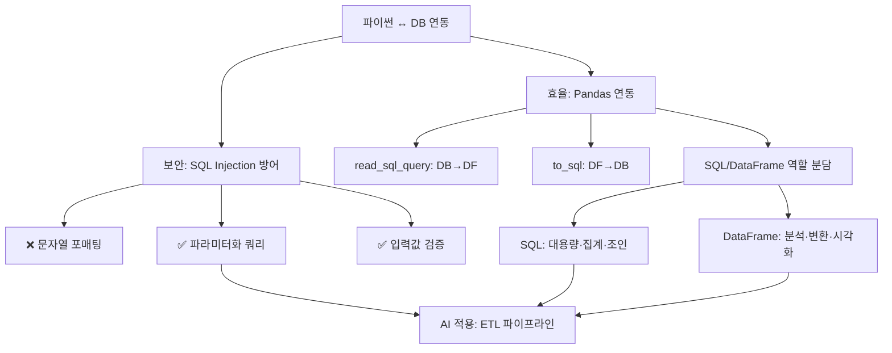

# 14. 데이터처리와활용: 파이썬과 데이터베이스(2)

## 🔗 선수 지식 (Prerequisites)
- [ ] **필수**: [13강. 파이썬과 데이터베이스(1)](13강.md) - sqlite3 기본 CRUD, 커서/커밋 이해 완료?
- [ ] **필수**: SQL 기본 문법 (SELECT, INSERT, WHERE, JOIN)
- [ ] **권장**: Pandas DataFrame 기본 (인덱싱, 필터링, groupby)
- [ ] **권장**: 문자열 포매팅(f-string)과 파라미터 바인딩의 차이
- **관련 단원**: [13강. 파이썬과 데이터베이스(1)](13강.md), [12강. 데이터 시각화](12강.md)

---

## 학습 목표
1. SQL Injection의 개념과 위험성을 설명할 수 있다.
2. Pandas를 이용한 데이터 처리 방법을 설명할 수 있다.
3. SQL과 DataFrame의 역할을 비교하고 설명할 수 있다.

---

## 🧠 메타인지 체크 (학습 전/후 자기 평가)

### 학습 전 자기 평가
| 소주제 | 자신감 (1-5) |
| :--- | :--- |
| SQL Injection 원리 및 방어 | |
| Pandas ↔ DB 직접 연동 (`read_sql_query`, `to_sql`) | |
| SQL과 DataFrame의 역할 분담 전략 | |

### 학습 후 교정 (학습 완료 후 작성)
| 소주제 | 학습 전 | 학습 후 | 실제 정답률 | 과신/과소 여부 |
| :--- | :--- | :--- | :--- | :--- |
| SQL Injection 원리 및 방어 | | | | |
| Pandas ↔ DB 직접 연동 | | | | |
| SQL과 DataFrame의 역할 분담 | | | | |

> **활용법**: 학습 전 1분 → 자신감 기입, 학습 후 1분 → 나머지 기입. "과신" 영역이 실제 취약점.

---

## 📝 요약 (Summary)

1.  🔴 **SQL Injection 방어**: 사용자 입력을 기반으로 SQL을 생성할 경우 보안 취약점이 발생할 수 있다. 이를 방지하기 위해 **파라미터화된 쿼리(Parameterized Query)**를 사용하고 입력값 검증을 수행해야 한다.
2.  🔴 **Pandas와 DB의 직접 연동**: Pandas의 `read_sql_query`를 사용하면 SQL 결과를 DataFrame으로 바로 변환할 수 있다. 이후 다양한 분석 및 데이터 변환 작업을 효율적으로 수행할 수 있다.
3.  🟡 **Pandas와 SQL 함께 쓰기**: SQL은 **대용량 데이터 처리**에 강점이 있으며, DataFrame은 **유연한 데이터 조작과 분석**에 강점이 있다. 두 기술을 함께 사용하면 성능과 유연성을 동시에 확보할 수 있다.

---

## 📐 핵심 문법 및 패턴 (Key Patterns)

> 실습 중심 단원이므로 **핵심 문법·패턴 테이블**로 구성.

| 패턴명 | 코드 | 용도 |
| :--- | :--- | :--- |
| **🔴 파라미터화 쿼리 (sqlite3)** | `cur.execute("SELECT * FROM users WHERE id=?", (uid,))` | SQL Injection 방어. `?` 자리표시자에 값이 **데이터로** 바인딩됨 |
| **❌ 문자열 포매팅 (취약)** | `cur.execute(f"SELECT * FROM users WHERE id='{uid}'")` | **금지 패턴**. 사용자 입력이 SQL 코드로 해석됨 |
| **🔴 DB → DataFrame** | `df = pd.read_sql_query(sql, conn)` | SQL 쿼리 결과를 즉시 DataFrame으로 |
| **🔴 DataFrame → DB** | `df.to_sql("table", conn, if_exists="replace", index=False)` | DataFrame을 테이블로 저장 (`append`/`replace`/`fail`) |
| **🟡 파라미터화 + Pandas** | `pd.read_sql_query("SELECT * FROM t WHERE col=?", conn, params=(v,))` | Pandas에서도 안전한 동적 쿼리 가능 |
| **🟡 bulk 입력** | `cur.executemany("INSERT INTO t VALUES(?,?)", rows)` | 다건 입력 시 성능·안전성 확보 |
| **🟢 SQL 사전 집계 → Pandas 분석** | `pd.read_sql_query("SELECT cat, AVG(p) FROM s GROUP BY cat", conn)` | DB에서 무거운 집계 후, 결과만 메모리로 |

### 주요 정의/원리

**SQL Injection (SQLi)**
> 사용자 입력이 SQL **문법의 일부**로 해석되어, 공격자가 의도한 임의 쿼리가 실행되는 취약점.
> 예: 입력 `' OR '1'='1` → `WHERE id='' OR '1'='1'` → 인증 우회.
>
> **방어 원리**: 자리표시자(`?`, `%s`, `:name`)를 쓰면 DB 드라이버가 값을 **데이터로만** 취급(컴파일된 쿼리 + 바인딩 단계 분리)하여, 문자열 결합이 일어나지 않는다.
>
> **AI 적용**: 머신러닝 파이프라인의 메타스토어(피처 스토어, 실험 기록 DB) 접근 시에도 동일 원칙. 학습 데이터 수집 단계에서 사용자 입력을 받는 경우(예: 챗봇 학습 로그 조회) 반드시 파라미터화가 필요하다.

---

## 📊 개념 시각화 (Visual Guide)

### 개념 관계도


### 핵심 도식 (역할 분담표)
| 입력 | 연산 | 출력 | AI 적용 |
| :--- | :--- | :--- | :--- |
| 사용자 입력 문자열 | `?` 파라미터 바인딩 | 안전한 SQL 실행 | 학습 데이터 로깅 API의 인증/조회 |
| SQL 쿼리 + Connection | `pd.read_sql_query` | DataFrame | 피처 엔지니어링 전처리 단계 |
| DataFrame | `df.to_sql` | DB 테이블 | 모델 예측 결과/메트릭 영속화 |
| 원시 테이블 (대용량) | DB에서 사전 집계 (GROUP BY) | 축소된 DataFrame | EDA, 학습용 마트(mart) 구축 |

---

## ✏️ 심화 학습 (Study Subject)

### 1. 가상 시나리오: "어떤 도구를, 언제 사용해야 할까?"
- **상황**: 사용자가 키워드를 입력하면 1억 건의 상품 로그에서 해당 카테고리의 일별 평균 가격 추세를 분석해 모델 학습 피처로 쓰는 파이프라인을 만들어야 한다.
- **문제**:
  1. 사용자 입력을 SQL에 그대로 붙이면 SQL Injection 위험이 있다.
  2. 1억 건을 모두 `pd.read_sql_query("SELECT * FROM logs")`로 읽으면 메모리가 폭발한다.
- **해결**:
  ```python
  sql = """
      SELECT DATE(ts) AS d, AVG(price) AS avg_p
      FROM logs
      WHERE category = ?
      GROUP BY DATE(ts)
  """
  df = pd.read_sql_query(sql, conn, params=(user_category,))
  # 이후 df로 이동평균/스무딩 등 분석
  ```
  → **SQL에서 사전 집계**로 데이터를 줄이고, **파라미터화**로 입력을 안전하게 처리한다.
- **AI 학습 포인트**: "모델 학습 파이프라인에서 'DB에서 할 일'과 'Pandas에서 할 일'을 나누는 기준은 무엇이며, 데이터 크기·연산 종류·재사용성 측면에서 각각 어떤 트레이드오프가 있을까?"

### 2. 관점별 비교 및 오개념 분석

- **핵심 비교**: SQL vs Pandas (DataFrame)

| 구분 | SQL (DB) | Pandas (DataFrame) |
| :--- | :--- | :--- |
| 데이터 위치 | 디스크(서버) | 메모리(프로세스) |
| 강점 | 대용량 집계, 조인, 영속성, 동시성 | 유연한 변환, 시계열, 통계, 시각화 연계 |
| 약점 | 복잡한 행 단위 가공 어려움 | 메모리 한계, 트랜잭션 없음 |
| 인덱스 의미 | B-tree 등 검색 가속 | 행 라벨 |

- **오개념 분석**

  - **오개념 1**: "`f"... WHERE id='{user_id}'"`처럼 f-string으로 만들어도 내부 값만 잘 확인하면 안전하다."
    - **분석**: 입력 검증을 통과해도, **개발자가 예상하지 못한 인코딩/이스케이프 케이스**가 있으면 우회될 수 있다. 더 근본적으로, 자리표시자(`?`)는 DB 드라이버가 **prepared statement**로 처리하여 값이 SQL 코드가 될 가능성을 원천 차단한다. 안전의 책임 위치 자체가 다르다.

  - **오개념 2**: "Pandas의 `read_sql_query`는 내부적으로 안전하니 그냥 문자열로 합쳐도 된다."
    - **분석**: `read_sql_query`는 **전달된 SQL 문자열을 그대로 실행**한다. 안전성은 사용자가 `params=` 인자로 파라미터를 넘겼는지에 달려 있다. 단순히 Pandas를 거친다고 자동으로 안전해지지 않는다.

  - **오개념 3**: "`to_sql(..., if_exists='replace')`은 새 행을 추가한다."
    - **분석**: `replace`는 **테이블을 drop 후 재생성**한다. 기존 데이터가 모두 사라지므로, 행 추가는 `if_exists='append'`를 써야 한다. 운영 DB에서 `replace`를 잘못 쓰면 사고로 이어진다.

- **AI 학습 포인트**: "파라미터화 쿼리(prepared statement)가 SQL Injection을 막는 메커니즘을, '컴파일 단계와 바인딩 단계의 분리'라는 관점에서 단계별로 설명해 줘. 그리고 ORM(SQLAlchemy)을 쓰면 이 문제가 자동으로 해결되는지, 어떤 경우에 여전히 위험이 남는지 알려줘."

---

## ❓ 연습 문제 및 해설

> **블룸 인지 수준 범례**: [기억] 정의·나열 → [이해] 설명·비교 → [적용] 계산·구현 → [분석] 구별·디버그 → [평가] 판단·비평 → [창조] 설계·제안
>
> 원본 교재에 연습문제가 없어 📌 AI 추가 출제(10문항).

### 📝 문제

**1. 📌 ⭐ [기억] [SQL Injection의 정의로 가장 적절한 것은?](#prob-1)**
   > ① 데이터베이스 서버에 과도한 트래픽을 보내 서비스를 마비시키는 공격
   > ② 사용자 입력이 SQL 문법의 일부로 해석되어 의도하지 않은 쿼리가 실행되는 취약점
   > ③ 데이터베이스의 인덱스를 손상시켜 검색 속도를 느리게 만드는 공격
   > ④ SQL 쿼리의 결과를 가로채 다른 사용자에게 노출시키는 네트워크 공격

<br>

**2. 📌 ⭐ [이해] [다음 중 SQL Injection 방어에 가장 효과적인 방법은?](#prob-2)**
   > ① `f"SELECT * FROM users WHERE name='{name}'"`로 쿼리 생성
   > ② `"SELECT * FROM users WHERE name='" + name + "'"`로 쿼리 결합
   > ③ `cur.execute("SELECT * FROM users WHERE name=?", (name,))` 사용
   > ④ 사용자 입력에서 작은따옴표(`'`)만 제거 후 문자열 결합

<br>

**3. 📌 ⭐⭐ [적용] [Pandas로 SQLite의 `sales` 테이블 전체를 DataFrame으로 읽는 가장 올바른 코드는?](#prob-3)**
   > ① `df = pd.DataFrame(conn.execute("SELECT * FROM sales"))`
   > ② `df = pd.read_sql_query("SELECT * FROM sales", conn)`
   > ③ `df = pd.read_csv("sales", conn)`
   > ④ `df = conn.to_dataframe("sales")`

<br>

**4. 📌 ⭐⭐ [분석] [다음 코드의 문제점은?](#prob-4)**
   > ```python
   > user_id = input("ID: ")
   > sql = f"SELECT * FROM users WHERE id='{user_id}'"
   > cur.execute(sql)
   > ```
   > <보기>
   >
   > 가. SQL Injection 취약점이 존재한다.
   > 나. 입력값에 따라 의도치 않은 쿼리가 실행될 수 있다.
   > 다. `cur.execute`의 두 번째 인자로 튜플을 전달하지 않아 문법 오류가 발생한다.

   > ① 가만
   > ② 가, 나
   > ③ 가, 나, 다
   > ④ 다만

<br>

**5. 📌 ⭐⭐ [이해] [SQL과 Pandas DataFrame의 역할 비교로 옳지 않은 것은?](#prob-5)**
   > ① SQL은 대용량 데이터의 집계·조인에 강하다.
   > ② DataFrame은 유연한 변환과 시각화 연계에 강하다.
   > ③ DataFrame은 디스크 기반이므로 메모리 제약이 없다.
   > ④ 두 기술을 함께 쓰면 성능과 유연성을 동시에 확보할 수 있다.

<br>

**6. 📌 ⭐⭐ [적용] [`DataFrame`을 SQLite 테이블 `result`로 저장하되, 기존 테이블이 있으면 데이터를 추가(append)하려고 한다. 빈칸에 들어갈 인자는?](#prob-6)**
   > ```python
   > df.to_sql("result", conn, if_exists=____, index=False)
   > ```
   > ① `"replace"`
   > ② `"append"`
   > ③ `"insert"`
   > ④ `"merge"`

<br>

**7. 📌 ⭐⭐⭐ [분석] [Pandas에서 사용자 입력 `cat`을 안전하게 사용한 코드를 모두 고른 것은?](#prob-7)**
   > <보기>
   >
   > 가. `pd.read_sql_query(f"SELECT * FROM t WHERE c='{cat}'", conn)`
   > 나. `pd.read_sql_query("SELECT * FROM t WHERE c=?", conn, params=(cat,))`
   > 다. `pd.read_sql_query("SELECT * FROM t WHERE c=:c", conn, params={"c": cat})`

   > ① 가
   > ② 나
   > ③ 나, 다
   > ④ 가, 나, 다

<br>

**8. 📌 ⭐⭐ [평가] [다음 중 "SQL에서 사전 집계 후 Pandas로 가져오기" 전략이 가장 유리한 상황은?](#prob-8)**
   > ① 원시 데이터가 100건이고, 모든 행을 그대로 시각화해야 할 때
   > ② 1억 건의 로그에서 카테고리별 일평균을 구해 추세선만 분석할 때
   > ③ DataFrame을 만든 뒤 즉시 CSV 파일로 내보내야 할 때
   > ④ 데이터에 NULL이 전혀 없고 컬럼이 2개뿐일 때

<br>

**9. 📌 ⭐⭐⭐ [창조] [`sqlite3`에서 사용자에게 받은 `name`과 `age`를 `users` 테이블에 안전하게 1건 삽입하는 코드를 작성하시오. (파라미터화 쿼리 사용, 커밋 포함)](#prob-9)**

<br>

**10. 📌 ⭐⭐⭐ [평가] [`df.to_sql("t", conn, if_exists="replace")`를 운영 DB에 실행했더니 어제까지의 데이터가 모두 사라졌다. (1) 왜 이런 일이 발생했는지 설명하고, (2) 이런 사고를 막기 위한 올바른 패턴을 코드와 함께 제시하시오.](#prob-10)**

---

### 🔑 정답 및 해설 (먼저 풀어본 후 펼치기)

<details>
<summary>정답 보기 (클릭)</summary>

1. ②
2. ③
3. ②
4. ②
5. ③
6. ②
7. ③
8. ②
9. (풀이형) 아래 해설 참조
10. (풀이형) 아래 해설 참조

</details>

<details>
<summary>해설 보기 (클릭)</summary>

<a id="prob-1"></a>
**1. ⭐ [기억] SQL Injection의 정의**
> **정답: ②**
> **해설**: SQL Injection은 사용자 입력이 SQL **문법의 일부로 해석**되어, 공격자가 임의의 쿼리를 실행시키는 취약점이다. ①은 DoS, ③·④는 SQLi와 무관한 일반적 위협이다.

<a id="prob-2"></a>
**2. ⭐ [이해] 방어 방법**
> **정답: ③**
> **해설**: `?` 자리표시자를 통한 **파라미터화 쿼리**가 표준 방어책이다. ①·②는 전형적인 취약 패턴, ④는 단순 필터링으로 우회 가능성이 높다.

<a id="prob-3"></a>
**3. ⭐⭐ [적용] read_sql_query**
> **정답: ②**
> **해설**: Pandas는 `pd.read_sql_query(sql, conn)`으로 SQL 결과를 즉시 DataFrame으로 변환한다. ①은 동작하더라도 컬럼명이 없고 비권장, ③·④는 존재하지 않는 API.

<a id="prob-4"></a>
**4. ⭐⭐ [분석] 취약 코드 분석**
> **정답: ②**
> **해설**: f-string으로 입력을 SQL에 직접 삽입했으므로 (가) SQL Injection 취약점, (나) 의도치 않은 쿼리 실행이 모두 성립한다. 단, (다)는 틀린 진술이다. `cur.execute(sql)`은 문법적으로 정상 실행되며, 오류가 나지 않는 것이 오히려 보안상 문제이다.

<a id="prob-5"></a>
**5. ⭐⭐ [이해] 역할 비교**
> **정답: ③**
> **해설**: DataFrame은 **메모리 기반**이므로 메모리 제약이 가장 큰 단점이다. 나머지는 모두 옳은 설명.

<a id="prob-6"></a>
**6. ⭐⭐ [적용] to_sql 옵션**
> **정답: ②**
> **해설**: `if_exists`는 `"fail"`(기본, 존재 시 에러), `"replace"`(drop 후 재생성 — 데이터 손실 위험), `"append"`(데이터 추가) 세 가지를 지원한다. `"insert"`, `"merge"`는 존재하지 않는 값.

<a id="prob-7"></a>
**7. ⭐⭐⭐ [분석] Pandas 파라미터화**
> **정답: ③ 나, 다**
> **해설**: Pandas의 `read_sql_query`도 `params=` 인자로 `?` 위치 바인딩(나) 또는 `:name` 명명 바인딩(다)을 지원한다. (가)는 f-string으로 직접 삽입했으므로 여전히 SQL Injection 취약점이 있다.

<a id="prob-8"></a>
**8. ⭐⭐ [평가] 사전 집계 전략**
> **정답: ②**
> **해설**: 1억 건을 그대로 메모리로 끌어오면 메모리 폭발이 발생하므로, **DB에서 GROUP BY로 사전 집계**한 결과만 받아 Pandas로 분석하는 것이 정석. 나머지 상황은 데이터가 작거나 집계가 불필요하다.

<a id="prob-9"></a>
**9. ⭐⭐⭐ [창조] 안전한 INSERT**
> **정답 (예시 풀이)**:
> ```python
> import sqlite3
>
> name = input("이름: ")
> age_str = input("나이: ")
>
> # 입력값 검증
> if not name.strip():
>     raise ValueError("이름이 비어 있습니다.")
> try:
>     age = int(age_str)
> except ValueError:
>     raise ValueError("나이는 정수여야 합니다.")
>
> conn = sqlite3.connect("app.db")
> try:
>     cur = conn.cursor()
>     cur.execute(
>         "INSERT INTO users(name, age) VALUES (?, ?)",
>         (name, age),
>     )
>     conn.commit()
> finally:
>     conn.close()
> ```
> **해설**: ① `?` 자리표시자로 파라미터화하여 SQL Injection을 방어, ② 입력값 타입·범위 검증, ③ `conn.commit()`으로 영속화, ④ `try/finally`로 연결 해제 보장.

<a id="prob-10"></a>
**10. ⭐⭐⭐ [평가] to_sql replace 사고**
> **정답 (예시 풀이)**:
> (1) **원인**: `if_exists="replace"`는 기존 테이블을 **DROP한 뒤 새로 CREATE**하고 DataFrame 내용으로 채운다. 따라서 어제까지의 데이터가 모두 사라진 것은 옵션의 정의대로 동작한 결과이다.
>
> (2) **올바른 패턴**:
> ```python
> # ① 신규 데이터만 누적하려면 append
> df.to_sql("t", conn, if_exists="append", index=False)
>
> # ② 운영 환경에서는 트랜잭션 + 백업 테이블로 안전망
> with conn:  # 컨텍스트 종료 시 자동 commit/rollback
>     conn.execute("CREATE TABLE IF NOT EXISTS t_bak AS SELECT * FROM t")
>     df.to_sql("t_staging", conn, if_exists="replace", index=False)
>     conn.execute("INSERT INTO t SELECT * FROM t_staging")
>     conn.execute("DROP TABLE t_staging")
> ```
> **해설**: 핵심은 `replace`의 의미를 **정확히 이해**하는 것. 의도가 "행 추가"라면 `append`, "정기 스냅샷 갱신"이라면 백업/스테이징 테이블을 거치는 패턴이 안전하다.

</details>

---

## ✅ O/X 확인문제 (연습문항 개수의 2배 권장 → 20문항)

**1.** [SQL Injection은 파라미터화 쿼리를 사용하면 효과적으로 방어할 수 있다.](#ox-1) **(O / X)**
**2.** [f-string으로 사용자 입력을 SQL에 삽입해도 입력값을 검증하면 완전히 안전하다.](#ox-2) **(O / X)**
**3.** [`pd.read_sql_query`는 SQL 실행 결과를 DataFrame으로 변환한다.](#ox-3) **(O / X)**
**4.** [Pandas의 `read_sql_query`도 `params=` 인자를 통해 파라미터화 쿼리를 지원한다.](#ox-4) **(O / X)**
**5.** [`df.to_sql(..., if_exists="append")`는 테이블이 없으면 새로 만들고, 있으면 행을 추가한다.](#ox-5) **(O / X)**
**6.** [`df.to_sql(..., if_exists="replace")`는 기존 테이블을 유지하면서 데이터만 덮어쓴다.](#ox-6) **(O / X)**
**7.** [DataFrame은 디스크 기반 저장소이므로 메모리 제약을 받지 않는다.](#ox-7) **(O / X)**
**8.** [SQL은 대용량 집계·조인에, DataFrame은 유연한 분석·시각화에 강점이 있다.](#ox-8) **(O / X)**
**9.** [`cur.execute("... WHERE id=?", (uid,))`에서 `uid`는 SQL 문법의 일부가 아니라 데이터로만 취급된다.](#ox-9) **(O / X)**
**10.** [`cur.execute("... WHERE id=?", uid)`처럼 단일 값이라도 반드시 튜플 형태로 전달해야 한다.](#ox-10) **(O / X)**
**11.** [`pd.read_sql_query`로 1억 건 테이블을 한 번에 읽는 것은 일반적으로 권장된다.](#ox-11) **(O / X)**
**12.** [대용량 데이터는 DB에서 GROUP BY로 사전 집계한 뒤 Pandas로 받는 것이 효율적이다.](#ox-12) **(O / X)**
**13.** [`executemany`는 다건 입력 시 파라미터화 안전성과 성능을 동시에 확보할 수 있다.](#ox-13) **(O / X)**
**14.** [SQL Injection은 SELECT 문에서만 발생하고 INSERT/UPDATE/DELETE에서는 발생하지 않는다.](#ox-14) **(O / X)**
**15.** [입력값 검증과 파라미터화 쿼리는 상호 배타적인 방어 기법이므로 둘 중 하나만 쓰면 된다.](#ox-15) **(O / X)**
**16.** [`df.to_sql`은 `index=False`를 지정하지 않으면 DataFrame의 인덱스도 컬럼으로 저장된다.](#ox-16) **(O / X)**
**17.** [`pd.read_sql_query`에 파라미터를 전달할 때 위치 바인딩(`?`)과 명명 바인딩(`:name`) 모두 가능하다.](#ox-17) **(O / X)**
**18.** [SQL과 Pandas를 함께 쓰면 한 쪽의 단점을 다른 쪽으로 보완할 수 있다.](#ox-18) **(O / X)**
**19.** [ORM(SQLAlchemy 등)을 사용하면 raw SQL 문자열 결합을 하지 않는 한 SQL Injection 위험이 크게 줄어든다.](#ox-19) **(O / X)**
**20.** [DataFrame을 DB에 저장한 뒤에는 SQL로 다시 조회·집계가 가능하므로, 분석 결과를 영속화하는 수단으로 활용할 수 있다.](#ox-20) **(O / X)**

<details>
<summary>O/X 정답 및 해설 보기 (클릭)</summary>

> <a id="ox-1"></a>
> **1. 정답: O** — 파라미터화 쿼리는 SQLi의 표준 방어책이다.

> <a id="ox-2"></a>
> **2. 정답: X** — 입력 검증만으로는 우회 가능성이 남는다. 자리표시자를 함께 써야 한다.

> <a id="ox-3"></a>
> **3. 정답: O** — `read_sql_query`의 정의이다.

> <a id="ox-4"></a>
> **4. 정답: O** — `params=`로 `?` 또는 `:name` 바인딩을 지원한다.

> <a id="ox-5"></a>
> **5. 정답: O** — `append`는 테이블이 없으면 생성, 있으면 행 추가 동작.

> <a id="ox-6"></a>
> **6. 정답: X** — `replace`는 테이블을 DROP 후 CREATE한다. 기존 데이터는 모두 사라진다.

> <a id="ox-7"></a>
> **7. 정답: X** — DataFrame은 **메모리 기반**이다.

> <a id="ox-8"></a>
> **8. 정답: O** — 핵심 역할 분담 그대로.

> <a id="ox-9"></a>
> **9. 정답: O** — prepared statement에서 값은 데이터로만 취급된다.

> <a id="ox-10"></a>
> **10. 정답: O** — 단일 값도 `(uid,)`처럼 튜플로 전달해야 한다. `uid` 단독은 TypeError.

> <a id="ox-11"></a>
> **11. 정답: X** — 메모리 폭발 위험. 사전 집계나 chunksize 분할이 필요하다.

> <a id="ox-12"></a>
> **12. 정답: O** — DB의 강점(대용량 집계)과 Pandas의 강점(유연한 분석)의 결합 전략.

> <a id="ox-13"></a>
> **13. 정답: O** — `executemany`도 자리표시자를 사용한다.

> <a id="ox-14"></a>
> **14. 정답: X** — 모든 종류의 SQL 문에서 발생 가능하다.

> <a id="ox-15"></a>
> **15. 정답: X** — 두 기법은 **함께 사용해야** 가장 안전하다(심층 방어).

> <a id="ox-16"></a>
> **16. 정답: O** — 기본값 `index=True`는 인덱스를 컬럼으로 저장한다.

> <a id="ox-17"></a>
> **17. 정답: O** — DB 드라이버(여기서는 sqlite3)가 지원하면 둘 다 사용 가능.

> <a id="ox-18"></a>
> **18. 정답: O** — SQL의 성능과 DataFrame의 유연성을 상호 보완.

> <a id="ox-19"></a>
> **19. 정답: O** — ORM은 기본적으로 파라미터화를 수행한다. 단, `text()` 등으로 raw SQL을 직접 결합하면 여전히 위험.

> <a id="ox-20"></a>
> **20. 정답: O** — `to_sql`로 결과를 저장하고 SQL로 재조회·집계 가능.

</details>

---

## 🧪 자유 회상 연습 (Free Recall)

> **방법**: 위의 노트를 모두 덮고, 타이머 3분 설정 후 이번 단원에서 배운 내용을 기억나는 대로 자유롭게 적으세요.
> 정확한 문장이 아니어도 됩니다. 키워드, 수식, 관계 등 떠오르는 것을 모두 적습니다.

**자유 회상 작성란:**

```
[여기에 기억나는 내용을 자유롭게 작성]
힌트 키워드: SQL Injection, 파라미터화 쿼리, ?, read_sql_query, to_sql, if_exists, append/replace, 사전 집계, GROUP BY


```

> **회상 후 점검**: 노트를 다시 펼쳐 빠뜨린 내용을 확인하세요. 빠뜨린 부분이 실제 취약점입니다.
> - 회상 못한 핵심 개념: [                ]
> - 회상 못한 패턴/API: [                ]

---

## 💻 코드로 확인하기 (Code Verification)

```python
import sqlite3
import pandas as pd

# 0) 인메모리 DB 준비
conn = sqlite3.connect(":memory:")
cur = conn.cursor()
cur.execute("""
    CREATE TABLE sales(
        id INTEGER PRIMARY KEY,
        category TEXT,
        price REAL,
        ts TEXT
    )
""")
rows = [
    ("A", 100.0, "2026-05-01"),
    ("A", 150.0, "2026-05-01"),
    ("B",  80.0, "2026-05-02"),
    ("A", 120.0, "2026-05-02"),
    ("B",  90.0, "2026-05-03"),
]
# ✅ executemany + 파라미터화 (안전)
cur.executemany(
    "INSERT INTO sales(category, price, ts) VALUES(?, ?, ?)",
    rows,
)
conn.commit()

# 1) ❌ 취약 패턴 (절대 금지) — 시연용
malicious = "A' OR '1'='1"
bad_sql = f"SELECT * FROM sales WHERE category='{malicious}'"
print("[취약 쿼리]", bad_sql)
print("[취약 결과 건수]", len(cur.execute(bad_sql).fetchall()))
# → 의도와 달리 모든 행이 노출됨 (SQLi 성공)

# 2) ✅ 파라미터화 쿼리 (안전)
safe_rows = cur.execute(
    "SELECT * FROM sales WHERE category=?",
    (malicious,),
).fetchall()
print("[안전 결과 건수]", len(safe_rows))
# → category 컬럼에 정확히 malicious 문자열과 일치하는 행만 검색됨 (0건)

# 3) Pandas로 DB → DataFrame (파라미터화 포함)
df = pd.read_sql_query(
    """
    SELECT category, AVG(price) AS avg_price, COUNT(*) AS n
    FROM sales
    WHERE category = ?
    GROUP BY category
    """,
    conn,
    params=("A",),
)
print("[A 카테고리 집계]\n", df)

# 4) DataFrame → DB (append)
new_df = pd.DataFrame([
    {"category": "C", "price": 200.0, "ts": "2026-05-04"},
])
new_df.to_sql("sales_extra", conn, if_exists="append", index=False)
print("[저장된 extra 테이블]\n",
      pd.read_sql_query("SELECT * FROM sales_extra", conn))

conn.close()
```

> **실행 결과** (예시):
> ```
> [취약 쿼리] SELECT * FROM sales WHERE category='A' OR '1'='1'
> [취약 결과 건수] 5         ← 의도와 다르게 모든 행 노출
> [안전 결과 건수] 0         ← 동일 입력이 데이터로만 취급됨
> [A 카테고리 집계]
>   category  avg_price  n
> 0        A      123.333333  3
> [저장된 extra 테이블]
>   category  price          ts
> 0        C  200.0  2026-05-04
> ```
> **해석**:
> - (1) f-string으로 만든 쿼리는 입력 문자열이 SQL 코드로 해석되어 `WHERE TRUE` 형태가 되며, 5건이 모두 노출된다.
> - (2) 동일 입력을 `?` 자리표시자로 전달하면 **문자열 리터럴**로만 취급되어 0건이 반환된다. → SQLi 방어 성공.
> - (3) `read_sql_query` + `params=`로 Pandas에서도 파라미터화 쿼리를 활용할 수 있다.
> - (4) `to_sql`로 DataFrame을 테이블로 영속화. `if_exists`로 충돌 시 정책을 선택한다.

---

## 🤖 AI 연결고리 (개념 → AI 적용)

| 개념 | AI/ML 적용 분야 | 구체적 사례 |
| :--- | :--- | :--- |
| 파라미터화 쿼리 | ML 메타스토어·로그 API 보안 | 챗봇 대화 로그 조회 API에서 사용자 입력 필터 시 파라미터 바인딩 |
| `read_sql_query` | 피처 엔지니어링 (Feature Engineering) | DW의 거래 로그를 카테고리·시간대별 집계로 받아 학습 피처 생성 |
| `to_sql` | 모델 결과·메트릭 영속화 | 배치 추론 결과·실험 메트릭을 DB에 적재해 대시보드와 연동 |
| SQL 사전 집계 + Pandas 분석 | 대규모 EDA / 학습용 마트 구축 | 1억 건 로그를 DB에서 일별/유저별 집계 후 Pandas로 추세·이상치 탐지 |
| SQL ↔ DataFrame 역할 분담 | ETL 파이프라인 설계 | Airflow/Prefect 태스크에서 DB는 추출·집계, Python은 변환·검증 담당 |

---

## 📖 심화 학습 예시 답안

#### 1. 파라미터화 쿼리의 내부 동작 원리

raw SQL을 문자열로 만들어 보내면 DB 서버는 그 문자열을 그대로 파싱한다. 사용자 입력에 `'`, `;`, `--` 같은 SQL 메타문자가 섞이면 의도하지 않은 구조의 쿼리가 만들어진다. 파라미터화 쿼리는 이를 **두 단계로 분리**해 막는다.

1.  **Prepare 단계**: `SELECT * FROM users WHERE id=?` 같은 **쿼리 구조만** 먼저 DB에 보낸다. DB는 이 시점에 문법을 파싱하고 실행 계획을 컴파일한다. 이때 `?`는 "여기에 값이 들어올 자리"로만 인식된다.
2.  **Bind & Execute 단계**: 클라이언트가 `(user_input,)` 값을 별도 채널로 전달한다. DB는 이미 컴파일된 쿼리 구조에 값을 **데이터로** 끼워 넣는다. 값에 `' OR '1'='1`이 들어 있더라도 그저 문자열 리터럴일 뿐, 결코 SQL 코드로 다시 파싱되지 않는다.

핵심은 "값이 SQL 문법으로 다시 해석될 가능성을 구조적으로 차단"하는 것이며, 이는 입력 검증만으로는 얻을 수 없는 보장이다.

#### 2. SQL vs Pandas DataFrame 비교표

| 구분 | SQL (DB) | Pandas (DataFrame) | 비고 |
| :--- | :--- | :--- | :--- |
| **정의** | 디스크 기반 영속 저장소 + 선언적 질의 언어 | 메모리 기반 표 형식 자료구조 + 명령적 API | |
| **강점** | 대용량 집계·조인, 인덱스 활용, 트랜잭션·동시성 | 유연한 변환·결측 처리·시계열·시각화·ML 연계 | |
| **약점** | 복잡한 행 단위 가공·분석 함수 한정적 | 메모리 한계, 영속성·동시성 부재 | |
| **적용 조건** | 데이터가 크고 자주 갱신되며 다수가 접근 | 데이터가 메모리에 들어오고, 분석 흐름이 복잡 | |
| **AI 활용** | 피처 마트 구축, 실험 결과 영속화 | 전처리·EDA·모델 입력 텐서 변환 직전 단계 | 두 도구를 **계층화**해 사용 |

#### 3. 안전한 DB 접근의 Best Practice

- **Bad Practice (나쁜 예시)**
  ```python
  user_input = request.args["name"]
  sql = f"SELECT * FROM users WHERE name='{user_input}'"
  cur.execute(sql)
  ```
  → SQL Injection 취약, 입력 검증 누락, 연결 해제 미보장.

- **Good Practice (좋은 예시)**
  ```python
  import sqlite3
  from contextlib import closing

  def find_users_by_name(db_path: str, name: str) -> list[tuple]:
      # 1) 입력 검증 (도메인 규칙)
      if not isinstance(name, str) or not (1 <= len(name) <= 50):
          raise ValueError("name must be a string of length 1..50")

      # 2) 파라미터화 + 컨텍스트 매니저로 자원 관리
      with closing(sqlite3.connect(db_path)) as conn, conn:
          cur = conn.cursor()
          cur.execute(
              "SELECT id, name, age FROM users WHERE name = ?",
              (name,),
          )
          return cur.fetchall()
  ```
- **설명**:
  - `?` 자리표시자로 **SQL Injection 차단**,
  - 입력 길이·타입 검증으로 **방어 심층화**,
  - `with closing(...)`로 연결 누수 방지,
  - `with conn:`으로 트랜잭션 자동 commit/rollback 보장.

---

## 📚 핵심 용어집 (Glossary)

| 용어 (한) | 용어 (영) | 표현/예시 | 정의 |
| :--- | :--- | :--- | :--- |
| **SQL 주입** | SQL Injection | `' OR '1'='1` | 사용자 입력이 SQL 문법의 일부로 해석되어 임의 쿼리가 실행되는 보안 취약점 |
| **파라미터화 쿼리** | Parameterized Query / Prepared Statement | `WHERE id=?` + `(uid,)` | 쿼리 구조와 값을 분리해 전달하여 입력이 SQL 코드로 해석되지 않도록 하는 기법 |
| **자리표시자** | Placeholder | `?`, `:name`, `%s` | 쿼리 컴파일 단계에서 값이 들어올 위치를 표시하는 토큰 |
| **입력값 검증** | Input Validation | 타입·길이·허용 문자 체크 | 비즈니스 규칙·도메인 규칙에 맞게 입력을 거르는 방어 계층 |
| **DataFrame** | DataFrame | `pd.DataFrame` | Pandas의 메모리 기반 2차원 표 형식 자료구조 |
| **`read_sql_query`** | read_sql_query | `pd.read_sql_query(sql, conn)` | SQL 결과를 DataFrame으로 변환하는 Pandas 함수 (→←13강 sqlite3 cursor) |
| **`to_sql`** | to_sql | `df.to_sql("t", conn, if_exists="append")` | DataFrame을 DB 테이블로 저장하는 Pandas 메서드 |
| **`if_exists`** | if_exists | `"fail" / "replace" / "append"` | 대상 테이블이 이미 존재할 때의 처리 정책 |
| **트랜잭션** | Transaction | `with conn:` | 일련의 DB 연산을 원자적으로 묶는 단위 (→←13강) |

---

## 🤖 AI 학습 파트너를 위한 추가 자료

### 1. 개념 이해를 위한 심층 질문 프롬프트
> **프롬프트 예시**: "SQL Injection이 발생하는 원리를 '쿼리 컴파일 단계와 값 바인딩 단계의 분리'라는 관점에서 초보 개발자도 이해할 수 있도록 단계별로 설명해 줘. 그리고 ORM, 저장 프로시저, 파라미터화 쿼리 세 가지 방어 수단의 차이와 한계를 비교해 줘."

### 2. 문제 해결 능력 강화를 위한 시나리오 프롬프트
> **프롬프트 예시**: "당신은 데이터 엔지니어입니다. 일 평균 5천만 건이 쌓이는 거래 로그 테이블에서, 사용자가 입력한 상품 카테고리별 시간대 판매 추세를 분석해 모델 학습용 피처를 만드는 파이프라인을 설계해야 합니다. (1) DB에서 처리할 일과 Pandas에서 처리할 일을 어떻게 나눌지, (2) 보안·성능·재현성 측면에서 고려할 점을, 코드 스켈레톤과 함께 제시해 줘."

### 3. 코드 검증 프롬프트
> **프롬프트 예시**: "다음 코드의 보안·성능·자원 관리 측면을 모두 점검해 줘.
> ```python
> conn = sqlite3.connect("app.db")
> cur = conn.cursor()
> name = input()
> cur.execute(f"SELECT * FROM users WHERE name='{name}'")
> rows = cur.fetchall()
> ```
> 1. 어떤 위험이 있는지 모두 지적하고,
> 2. 각 문제를 해결한 개선 코드를 단계별 주석과 함께 제시해 줘."

---

## 🔄 복습 체크 (Spaced Repetition)
- [ ] 1일 후 복습 (날짜: 2026-05-30)
- [ ] 3일 후 복습 (날짜: 2026-06-01)
- [ ] 7일 후 복습 (날짜: 2026-06-05)
- [ ] 14일 후 복습 (날짜: 2026-06-12)
- [ ] 30일 후 복습 (날짜: 2026-06-28)

### 복습 시 자가 평가
| 회차 | 날짜 | 이해도 (1-5) | 취약 부분 메모 |
| :--- | :--- | :--- | :--- |
| 1차 | | | |
| 2차 | | | |
| 3차 | | | |

---

## 📚 참고 자료 (References)

- 교재 - 데이터처리와활용 14강 「파이썬과 데이터베이스(2)」
- Python 공식 문서 - `sqlite3` (Parameter substitution / Placeholders)
- Pandas 공식 문서 - `pandas.read_sql_query`, `DataFrame.to_sql`
- OWASP - SQL Injection Prevention Cheat Sheet
- [13강. 파이썬과 데이터베이스(1)](13강.md) — 기본 CRUD 및 커서/트랜잭션
