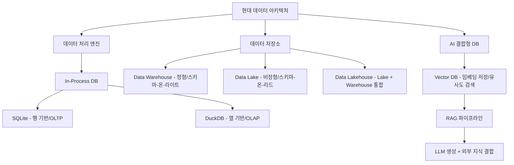
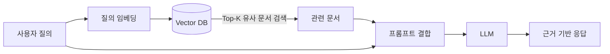

# 15. 데이터처리와활용: 최종 정리 (In-Process DB, Lakehouse, Vector DB & RAG)

## 🔗 선수 지식 (Prerequisites)
- [ ] **필수**: 관계형 DB의 기본 구조(테이블, 행/열, SQL) - 이해 완료?
- [ ] **필수**: OLTP/OLAP 개념과 트랜잭션 처리 방식 - 이해 완료?
- [ ] **권장**: Data Warehouse / Data Lake의 차이와 ETL/ELT 흐름
- [ ] **권장**: 임베딩(Embedding)과 코사인 유사도 등 벡터 연산의 기초
- **관련 단원**: [13강. 파이썬과 데이터베이스(1)](./13강.md), [14강. 파이썬과 데이터베이스(2)](./14강.md) `→←13·14강`

---

## 학습 목표
1. In-Process DB와 OLAP/OLTP의 차이를 설명할 수 있다.
2. Data Lakehouse 구조와 의미를 설명할 수 있다.
3. Vector DB와 RAG의 개념을 설명할 수 있다.

---

## 🧠 메타인지 체크 (학습 전/후 자기 평가)

### 학습 전 자기 평가
| 소주제 | 자신감 (1-5) |
| :--- | :--- |
| In-Process DB (SQLite vs DuckDB), 행 기반 vs 열 기반 | |
| OLTP vs OLAP 차이 및 사용 사례 | |
| Data Lakehouse 아키텍처 (vs Lake, vs Warehouse) | |
| Vector DB의 동작 원리 (임베딩, 유사도 검색) | |
| RAG 파이프라인 구성 요소와 흐름 | |

### 학습 후 교정 (학습 완료 후 작성)
| 소주제 | 학습 전 | 학습 후 | 실제 정답률 | 과신/과소 여부 |
| :--- | :--- | :--- | :--- | :--- |
| In-Process DB | | | | |
| OLTP vs OLAP | | | | |
| Lakehouse | | | | |
| Vector DB | | | | |
| RAG | | | | |

> **활용법**: 학습 전 1분 → 자신감 기입, 학습 후 1분 → 나머지 기입. "과신" 영역이 실제 취약점.

---

## 📝 요약 (Summary)

1. 🔴 **In-Process DB**: 데이터베이스를 단순 저장소가 아닌 **고성능 데이터 처리 도구**로 사용하는 방식이다. 별도 서버 없이 애플리케이션 프로세스 내부에 임베드되어 동작한다.
2. 🔴 **SQLite vs DuckDB**: SQLite와 DuckDB는 각각 **행(Row) 기반과 열(Column) 기반** 구조를 가지며 용도(OLTP vs OLAP)에 따라 선택된다.
3. 🔴 **Data Lakehouse**: Data Lake와 Data Warehouse의 장점을 결합한 구조로, **다양한 형식의 데이터를 유연하게 저장**하면서도 **트랜잭션·스키마 관리·SQL 분석**을 동시에 지원한다.
4. 🔴 **Vector DB**: 데이터를 **벡터(임베딩) 형태로 저장**하고 **유사도(거리) 기반 검색**을 수행하는 데이터베이스이다.
5. 🔴 **RAG (Retrieval-Augmented Generation)**: 검색(Retrieval)과 생성(Generation)을 결합한 구조로, AI가 **외부 지식(Vector DB)을 활용**하여 더 정확하고 최신성 있는 결과를 생성한다.
6. 🟡 **OLTP vs OLAP**: OLTP는 **개별 트랜잭션 처리**(짧은 쿼리, 다수의 INSERT/UPDATE)에, OLAP는 **대량 집계·분석**(긴 쿼리, 복잡한 SELECT)에 최적화되어 있다.
7. 🟢 **데이터 아키텍처의 진화**: DB → DW → Data Lake → Lakehouse → Vector DB / RAG로 이어지는 흐름은 **데이터의 형태와 활용 목적의 다양화**를 반영한다.

---

## 📐 핵심 정의 및 원리 (Key Definitions & Principles)

> 본 단원은 **이론 중심**이므로 수식 대신 **정의-내용-키워드** 테이블로 정리한다.

| 정의명 | 내용 | 키워드 |
| :--- | :--- | :--- |
| **In-Process DB** | 별도 DB 서버 없이 애플리케이션 프로세스 내에 임베드되어 동작하는 DB. 네트워크 오버헤드가 없어 매우 빠르다. | 임베디드, 단일파일, Zero-config |
| **SQLite** | **행 기반(Row-oriented)** In-Process DB. OLTP·모바일·임베디드 환경에 적합. | 행 기반, OLTP, 트랜잭션 |
| **DuckDB** | **열 기반(Columnar)** In-Process DB. 대용량 분석·집계 쿼리(OLAP)에 최적화. Pandas·Parquet과 직접 연동. | 열 기반, OLAP, 분석 |
| **OLTP** | **Online Transaction Processing**. 짧은 트랜잭션 다수 처리. 일관성·동시성 중요. | INSERT/UPDATE, ACID |
| **OLAP** | **Online Analytical Processing**. 대량 데이터의 집계·분석 쿼리. 읽기 위주. | 집계, 분석, 컬럼 스토어 |
| **Data Warehouse** | 정형 데이터를 스키마 기반으로 저장·분석하는 통합 저장소. | 스키마-온-라이트(Schema-on-Write), 정형 |
| **Data Lake** | 원시(raw) 형태의 정형·반정형·비정형 데이터를 저장하는 대용량 저장소. | Schema-on-Read, 비정형 |
| **Data Lakehouse** | Lake의 유연성 + Warehouse의 관리·성능을 결합. 트랜잭션·스키마·ACID 지원. | Delta Lake, Iceberg, Hudi |
| **Vector DB** | 데이터를 고차원 벡터로 저장하고 **유사도(cosine, L2 등)** 기반으로 근사 최근접 탐색(ANN)을 수행. | 임베딩, ANN, 유사도 검색 |
| **임베딩(Embedding)** | 텍스트·이미지 등을 의미를 보존하는 **고차원 실수 벡터**로 변환한 표현. | 의미 표현, 차원 축소 |
| **RAG** | LLM이 답을 생성하기 전에 **외부 지식 베이스(Vector DB 등)에서 관련 문서를 검색**하여 컨텍스트에 주입하는 구조. | Retrieval, Augmentation, Generation |
| **할루시네이션 완화** | RAG의 핵심 효과. 외부 근거로 답변을 뒷받침하여 LLM의 환각을 줄임. | 근거 기반 생성, Grounding |

### 주요 비교 정리

**행 기반(Row-oriented) vs 열 기반(Columnar)**
> **직관적 해석**:
> - 행 기반은 "한 사람의 정보를 한 줄에 모은 명함첩"에 비유된다. 한 행 전체를 빠르게 읽고 쓰기 좋다 → OLTP.
> - 열 기반은 "엑셀에서 한 열만 잘라 통계 내는 방식"에 비유된다. 같은 열의 데이터가 연속 저장되어 압축률·집계 속도가 뛰어나다 → OLAP.
>
> **AI 적용**: 학습용 피처 테이블 집계, 대용량 로그 분석 등 ML 파이프라인의 전처리 단계에서 DuckDB(열 기반)가 자주 활용된다.

---

## 📊 개념 시각화 (Visual Guide)

### 개념 분류 체계도


### RAG 파이프라인 흐름도


### 핵심 도식: 데이터 아키텍처 진화
| 단계 | 입력 | 처리 방식 | 출력 | AI 적용 |
| :--- | :--- | :--- | :--- | :--- |
| RDBMS | 정형 데이터 | SQL 트랜잭션 | 정형 결과 | 기초 피처 추출 |
| Data Warehouse | 정형 데이터 (ETL) | 스키마 기반 분석 | 집계 리포트 | BI 대시보드 |
| Data Lake | 모든 형태 데이터 | Schema-on-Read | 원시 데이터 | 비정형 ML 학습 데이터 |
| **Lakehouse** | Lake + Warehouse | ACID + SQL + ML | 통합 분석 | MLOps, Feature Store |
| **Vector DB + RAG** | 비정형 → 임베딩 | 유사도 검색 + LLM 생성 | 근거 기반 응답 | 챗봇, 의미 검색, QA |

---

## ✏️ 심화 학습 (Study Subject)

### 1. 가상 시나리오: "어떤 데이터 기술을, 언제 사용해야 할까?"
- **상황**: 한 핀테크 스타트업이 **(A) 실시간 결제 트랜잭션 처리**, **(B) 분석가의 대규모 거래 로그 집계**, **(C) 고객 상담용 사내 문서 기반 챗봇**의 세 요구를 동시에 해결해야 한다.
- **문제**: 각 요구에 가장 적합한 데이터베이스/구조는 무엇인가?
- **해결**:
  - (A) → **OLTP 특화** RDBMS 또는 SQLite(엣지/임베디드 환경). ACID, 짧은 트랜잭션, 행 기반 저장.
  - (B) → **DuckDB** 혹은 Lakehouse(Delta Lake). 열 기반 저장 + 집계 최적화.
  - (C) → **Vector DB + RAG**. 사내 문서를 임베딩으로 저장, LLM이 검색-증강하여 답변.
- **AI 학습 포인트**: "RAG에서 Top-K 검색의 K가 너무 크거나 너무 작을 때 각각 어떤 부작용이 생기고, 이를 어떻게 완화할 수 있는가?"

### 2. 관점별 비교 및 오개념 분석

- **핵심 비교**:
  - "Data Lake vs Data Lakehouse" → Lake는 ACID·스키마 관리가 약함. Lakehouse는 Lake 위에 메타데이터 계층(Delta/Iceberg/Hudi)을 얹어 트랜잭션·시간여행을 지원.
  - "Vector DB vs 전통 RDB" → RDB는 정확 일치(exact match) 기반, Vector DB는 **근사 최근접 탐색(ANN)** 기반 유사도 검색.
  - "RAG vs Fine-tuning" → RAG는 **외부 지식을 동적으로 주입**, Fine-tuning은 **모델 파라미터 자체를 수정**. 최신성·도메인 적응 비용·할루시네이션 측면에서 트레이드오프 존재.

- **오개념 분석**:
    - **오개념 1**: "Data Lakehouse는 Data Lake의 새 이름일 뿐이다."
    - **분석**: 틀렸다. Lakehouse는 Lake에 **ACID 트랜잭션, 스키마 강제, 시간여행(versioning)** 등 Warehouse 기능을 추가한 **확장 아키텍처**이다. 단순한 리브랜딩이 아니라 **Delta Lake/Iceberg/Hudi** 같은 테이블 포맷이 핵심.
    - **오개념 2**: "Vector DB가 있으면 LLM이 항상 정확한 답을 한다(=환각이 없다)."
    - **분석**: 틀렸다. RAG는 **할루시네이션을 줄이는** 기법이지 **완전히 제거하지 못한다**. 검색된 문서가 부정확하거나 Top-K가 부적절하면 여전히 환각이 발생할 수 있다.
    - **오개념 3**: "DuckDB는 SQLite보다 항상 빠르다."
    - **분석**: 틀렸다. **워크로드에 따라 다르다.** 다수의 짧은 트랜잭션(OLTP)에서는 SQLite가 더 유리하고, 대량 집계(OLAP)에서는 DuckDB가 더 유리하다.

- **AI 학습 포인트**: "RAG가 실패하는 대표적 4가지 케이스(검색 실패, 잘못된 문서, 컨텍스트 초과, 프롬프트 인젝션)와 각 완화 전략을 정리해 줘."

---

## ❓ 연습 문제 및 해설

> **블룸 인지 수준 범례**: [기억] 정의·나열 → [이해] 설명·비교 → [적용] 계산·구현 → [분석] 구별·디버그 → [평가] 판단·비평 → [창조] 설계·제안

### 📝 문제

**1. ⭐ [기억] In-Process DB의 특징으로 옳은 것은? 📌**[#prob-1](#prob-1)
   > ① 별도 DB 서버 프로세스가 반드시 필요하다.
   > ② 클라이언트-서버 네트워크 통신을 통해 동작한다.
   > ③ 애플리케이션 프로세스 내부에 임베드되어 동작한다.
   > ④ 분산 클러스터 환경에서만 사용된다.

<br>

**2. ⭐ [기억/이해] SQLite와 DuckDB의 저장 구조 매칭으로 옳은 것은? 📌**[#prob-2](#prob-2)
   > ① SQLite: 열 기반 / DuckDB: 행 기반
   > ② SQLite: 행 기반 / DuckDB: 열 기반
   > ③ 둘 다 행 기반
   > ④ 둘 다 열 기반

<br>

**3. ⭐⭐ [이해] OLTP와 OLAP의 차이에 대한 설명으로 옳지 않은 것은? 📌**[#prob-3](#prob-3)
   > ① OLTP는 짧고 빈번한 트랜잭션 처리에 최적화되어 있다.
   > ② OLAP는 대량 데이터의 집계·분석 쿼리에 최적화되어 있다.
   > ③ OLTP에는 일반적으로 열 기반 저장이 더 유리하다.
   > ④ OLAP에는 일반적으로 열 기반 저장이 더 유리하다.

<br>

**4. ⭐⭐ [이해] Data Lakehouse가 결합한 두 가지 아키텍처는 무엇인가? 📌**[#prob-4](#prob-4)
   > ① Data Mart + OLTP DB
   > ② Data Lake + Data Warehouse
   > ③ NoSQL + RDBMS
   > ④ In-Memory DB + Vector DB

<br>

**5. ⭐⭐ [적용/분석] <보기> 중 Data Lakehouse의 특징을 모두 고르시오. 📌**[#prob-5](#prob-5)
   > <보기>
   >
   > 가. ACID 트랜잭션을 지원한다.
   > 나. 스키마-온-라이트(Schema-on-Write)만 허용한다.
   > 다. 정형·반정형·비정형 데이터를 유연하게 저장할 수 있다.
   > 라. Delta Lake, Iceberg, Hudi 등의 테이블 포맷이 핵심이다.

   > ① 가, 나
   > ② 가, 다, 라
   > ③ 나, 다
   > ④ 가, 나, 다, 라

<br>

**6. ⭐⭐ [이해] Vector DB가 일반 RDB와 가장 크게 다른 점은? 📌**[#prob-6](#prob-6)
   > ① SQL을 사용한다는 점
   > ② 정확 일치(exact match) 검색만 가능하다는 점
   > ③ 고차원 벡터의 유사도(거리) 기반 근사 최근접 탐색(ANN)을 수행한다는 점
   > ④ 트랜잭션을 지원하지 않는다는 점

<br>

**7. ⭐⭐ [이해] RAG(Retrieval-Augmented Generation) 구조에 대한 설명으로 옳은 것은? 📌**[#prob-7](#prob-7)
   > ① LLM의 파라미터를 직접 재학습하여 외부 지식을 주입한다.
   > ② 사용자 질의를 임베딩한 뒤 Vector DB에서 관련 문서를 검색해 프롬프트에 결합한다.
   > ③ 검색 단계 없이 LLM이 단독으로 답변을 생성한다.
   > ④ RAG는 Fine-tuning과 동일한 개념이다.

<br>

**8. ⭐⭐⭐ [분석] RAG의 한계 또는 실패 원인으로 적절하지 않은 것은? 📌**[#prob-8](#prob-8)
   > ① 검색된 문서가 질의와 무관할 경우 잘못된 답이 생성될 수 있다.
   > ② 컨텍스트 길이를 초과하면 일부 정보가 잘릴 수 있다.
   > ③ 외부 문서를 사용하므로 LLM의 환각(hallucination)이 **완전히** 제거된다.
   > ④ 검색 문서에 악의적인 지시문이 포함되면 프롬프트 인젝션이 발생할 수 있다.

<br>

**9. ⭐⭐⭐ [평가] 다음 시나리오에서 가장 적합한 데이터 기술 조합은? 📌**[#prob-9](#prob-9)
   > "수만 개의 사내 PDF 매뉴얼을 기반으로 직원 질문에 자연어로 답변하는 챗봇을 구축하려 한다."

   > ① SQLite + OLTP 트리거
   > ② DuckDB + Pandas 집계
   > ③ Vector DB + 임베딩 모델 + LLM (RAG)
   > ④ Data Warehouse + BI 대시보드

<br>

**10. ⭐⭐⭐ [창조] 다음 빈칸에 들어갈 적절한 용어를 쓰시오. 📌**[#prob-10](#prob-10)
   > "Data Lakehouse는 Data Lake 위에 ( ㄱ ) 테이블 포맷(예: Delta Lake, Iceberg)을 얹어
   > Warehouse의 ( ㄴ ) 트랜잭션과 스키마 관리 기능을 결합한 아키텍처이다.
   > 또한 RAG에서는 사용자 질의를 ( ㄷ )(으)로 변환한 뒤
   > Vector DB에서 ( ㄹ ) 기반 검색을 수행하여 관련 문서를 LLM에 주입한다."

---

### 🔑 정답 및 해설 (먼저 풀어본 후 펼치기)

<details>
<summary>정답 보기 (클릭)</summary>

1. ③
2. ②
3. ③
4. ②
5. ②
6. ③
7. ②
8. ③
9. ③
10. ㄱ: 개방형(open table format) / ㄴ: ACID / ㄷ: 임베딩(벡터) / ㄹ: 유사도(거리)

</details>

<details>
<summary>해설 보기 (클릭)</summary>

<a id="prob-1"></a>
**1. ⭐ [기억] In-Process DB의 특징**
> **정답: ③ 애플리케이션 프로세스 내부에 임베드되어 동작한다.**
> **해설**: In-Process DB는 별도의 서버 프로세스 없이 애플리케이션 프로세스 내에서 라이브러리 형태로 동작한다. 네트워크 통신이 없어 매우 빠르고 zero-config로 사용할 수 있다. SQLite, DuckDB가 대표적이다.

<a id="prob-2"></a>
**2. ⭐ [기억/이해] SQLite vs DuckDB 저장 구조**
> **정답: ② SQLite: 행 기반 / DuckDB: 열 기반**
> **해설**: SQLite는 행 기반(Row-oriented)으로 OLTP·모바일·임베디드 환경에 적합하고, DuckDB는 열 기반(Columnar)으로 대용량 집계·분석(OLAP)에 최적화되어 있다.

<a id="prob-3"></a>
**3. ⭐⭐ [이해] OLTP vs OLAP**
> **정답: ③ (틀린 설명)**
> **해설**: OLTP는 짧은 트랜잭션을 다수 처리해야 하므로 **행 기반** 저장이 더 유리하다(한 행 전체 읽기/쓰기). 반대로 OLAP는 특정 컬럼만 집계하는 쿼리가 많아 **열 기반** 저장이 유리하다. 따라서 ③은 틀린 설명이다.

<a id="prob-4"></a>
**4. ⭐⭐ [이해] Lakehouse가 결합한 아키텍처**
> **정답: ② Data Lake + Data Warehouse**
> **해설**: Lakehouse는 Data Lake의 유연성(다양한 형식 저장, Schema-on-Read)과 Data Warehouse의 관리·성능(ACID, SQL 분석, 스키마)을 결합한 아키텍처이다.

<a id="prob-5"></a>
**5. ⭐⭐ [적용/분석] Lakehouse의 특징**
> **정답: ② 가, 다, 라**
> **해설**:
> - 가(O): Delta Lake/Iceberg/Hudi가 ACID 트랜잭션을 지원한다.
> - 나(X): Lakehouse는 Schema-on-Read와 Schema-on-Write를 **모두** 유연하게 활용할 수 있다. "Schema-on-Write만"이라는 표현이 틀렸다.
> - 다(O): Lake의 장점을 그대로 계승한다.
> - 라(O): 핵심 구성 요소이다.

<a id="prob-6"></a>
**6. ⭐⭐ [이해] Vector DB의 차별점**
> **정답: ③ 고차원 벡터의 유사도 기반 ANN 검색**
> **해설**: 일반 RDB는 정확 일치(exact match)나 범위 검색에 최적화되어 있지만, Vector DB는 임베딩으로 표현된 데이터를 **코사인/L2 거리** 등으로 비교하는 **근사 최근접 탐색(ANN)**을 수행한다. ① SQL 사용 여부는 결정적 차이가 아니며(많은 Vector DB가 SQL-like 인터페이스 제공), ④ 트랜잭션 지원 여부도 본질적 차이는 아니다.

<a id="prob-7"></a>
**7. ⭐⭐ [이해] RAG 구조**
> **정답: ② 질의 임베딩 → Vector DB 검색 → 프롬프트 결합 → LLM 생성**
> **해설**: RAG는 LLM의 파라미터를 수정하지 않고(① 오답), 외부 지식 베이스에서 동적으로 정보를 검색해 컨텍스트에 주입한다(③ 오답). Fine-tuning은 모델 파라미터 자체를 수정하는 방식이므로 RAG와 다르다(④ 오답).

<a id="prob-8"></a>
**8. ⭐⭐⭐ [분석] RAG의 한계**
> **정답: ③ (틀린 설명) 환각이 완전히 제거되지는 않는다.**
> **해설**: RAG는 환각을 **줄이는** 기법이지 **완전히 제거**하지 못한다. 검색된 문서가 잘못되었거나, 모델이 검색 문서를 무시하고 학습 지식만으로 답할 수도 있다. ①, ②, ④는 모두 RAG의 실제 한계로 알려져 있다.

<a id="prob-9"></a>
**9. ⭐⭐⭐ [평가] 시나리오에 맞는 기술 선택**
> **정답: ③ Vector DB + 임베딩 모델 + LLM (RAG)**
> **해설**: 비정형 PDF 문서를 자연어 질의로 검색·요약·응답해야 하므로, 문서를 임베딩해 Vector DB에 저장하고 RAG 파이프라인으로 LLM과 결합하는 것이 가장 적합하다. ①은 OLTP, ②는 OLAP, ④는 BI에 해당하여 자연어 QA에는 부적절하다.

<a id="prob-10"></a>
**10. ⭐⭐⭐ [창조] 빈칸 채우기**
> **정답**: ㄱ: 개방형(open table format) / ㄴ: ACID / ㄷ: 임베딩(벡터) / ㄹ: 유사도(거리)
> **해설**: Lakehouse는 Delta Lake·Iceberg·Hudi 같은 **개방형 테이블 포맷**을 도입해 Lake 위에 ACID 트랜잭션·스키마 진화·시간여행을 제공한다. RAG에서는 질의를 **임베딩(벡터)**으로 변환한 뒤 Vector DB에서 **유사도(거리) 기반** 근사 최근접 탐색을 수행한다.

</details>

---

## ✅ O/X 확인문제 (연습문항 개수의 2배 = 20문항)

**1.** In-Process DB는 별도의 DB 서버 프로세스 없이 애플리케이션 내부에서 동작한다.[#ox-1](#ox-1) **(O / X)**
**2.** SQLite는 열 기반 구조를 가진 In-Process DB이다.[#ox-2](#ox-2) **(O / X)**
**3.** DuckDB는 OLAP(대량 분석 쿼리)에 최적화된 열 기반 In-Process DB이다.[#ox-3](#ox-3) **(O / X)**
**4.** OLTP 워크로드에는 일반적으로 열 기반 저장이 행 기반 저장보다 더 유리하다.[#ox-4](#ox-4) **(O / X)**
**5.** OLAP는 짧은 트랜잭션을 다수 처리하는 데 최적화된 워크로드이다.[#ox-5](#ox-5) **(O / X)**
**6.** Data Warehouse는 주로 비정형 데이터를 원시 상태로 저장한다.[#ox-6](#ox-6) **(O / X)**
**7.** Data Lake는 Schema-on-Read 방식으로 다양한 형식의 데이터를 저장할 수 있다.[#ox-7](#ox-7) **(O / X)**
**8.** Data Lakehouse는 Data Lake와 Data Warehouse의 장점을 결합한 아키텍처이다.[#ox-8](#ox-8) **(O / X)**
**9.** Lakehouse는 ACID 트랜잭션과 스키마 관리를 지원할 수 있다.[#ox-9](#ox-9) **(O / X)**
**10.** Delta Lake, Apache Iceberg, Apache Hudi는 모두 Lakehouse를 구현하는 테이블 포맷이다.[#ox-10](#ox-10) **(O / X)**
**11.** Vector DB는 정확 일치(exact match) 검색만 수행한다.[#ox-11](#ox-11) **(O / X)**
**12.** 임베딩은 텍스트·이미지 등을 의미를 보존하는 고차원 실수 벡터로 변환한 표현이다.[#ox-12](#ox-12) **(O / X)**
**13.** Vector DB는 일반적으로 ANN(근사 최근접 탐색) 알고리즘을 사용한다.[#ox-13](#ox-13) **(O / X)**
**14.** RAG는 LLM의 가중치를 직접 학습(fine-tuning)하여 지식을 주입하는 방식이다.[#ox-14](#ox-14) **(O / X)**
**15.** RAG는 외부 지식을 검색해 컨텍스트에 주입함으로써 할루시네이션을 완전히 제거한다.[#ox-15](#ox-15) **(O / X)**
**16.** RAG 파이프라인에서 사용자 질의는 일반적으로 임베딩으로 변환되어 Vector DB에 질의된다.[#ox-16](#ox-16) **(O / X)**
**17.** Fine-tuning과 RAG는 동일한 방법론으로, 결과도 동일하다.[#ox-17](#ox-17) **(O / X)**
**18.** DuckDB는 Pandas DataFrame이나 Parquet 파일에 대해 직접 SQL을 실행할 수 있다.[#ox-18](#ox-18) **(O / X)**
**19.** Data Lake는 일반적으로 Data Warehouse보다 스키마 강제(schema enforcement)가 약하다.[#ox-19](#ox-19) **(O / X)**
**20.** RAG에서 Top-K 값이 너무 크면 컨텍스트 잡음이 늘어 답변 품질이 저하될 수 있다.[#ox-20](#ox-20) **(O / X)**

<details>
<summary>O/X 정답 및 해설 보기 (클릭)</summary>

> <a id="ox-1"></a>
> **1. 정답**: O
> **해설**: In-Process DB의 정의 자체.

> <a id="ox-2"></a>
> **2. 정답**: X
> **해설**: SQLite는 **행 기반**이다. 열 기반은 DuckDB.

> <a id="ox-3"></a>
> **3. 정답**: O
> **해설**: DuckDB는 OLAP·분석 워크로드에 특화된 열 기반 In-Process DB이다.

> <a id="ox-4"></a>
> **4. 정답**: X
> **해설**: OLTP에는 **행 기반**이 유리하다. 한 행 단위 읽기/쓰기가 잦기 때문.

> <a id="ox-5"></a>
> **5. 정답**: X
> **해설**: 짧은 트랜잭션 다수 처리는 OLTP의 특성이다. OLAP는 대량 집계·분석에 최적화.

> <a id="ox-6"></a>
> **6. 정답**: X
> **해설**: Data Warehouse는 **정형** 데이터를 스키마 기반으로 저장한다. 비정형 원시 저장은 Data Lake.

> <a id="ox-7"></a>
> **7. 정답**: O
> **해설**: Data Lake의 핵심 특성.

> <a id="ox-8"></a>
> **8. 정답**: O
> **해설**: Lakehouse의 정의.

> <a id="ox-9"></a>
> **9. 정답**: O
> **해설**: Delta Lake/Iceberg/Hudi 등이 ACID·스키마 진화를 지원한다.

> <a id="ox-10"></a>
> **10. 정답**: O
> **해설**: 모두 대표적 Lakehouse 테이블 포맷이다.

> <a id="ox-11"></a>
> **11. 정답**: X
> **해설**: Vector DB는 **유사도 기반 ANN** 검색을 수행한다.

> <a id="ox-12"></a>
> **12. 정답**: O
> **해설**: 임베딩의 정의.

> <a id="ox-13"></a>
> **13. 정답**: O
> **해설**: HNSW, IVF 등 대표적 ANN 인덱스를 사용한다.

> <a id="ox-14"></a>
> **14. 정답**: X
> **해설**: RAG는 파라미터를 수정하지 않고 **검색-증강** 방식으로 지식을 주입한다.

> <a id="ox-15"></a>
> **15. 정답**: X
> **해설**: RAG는 환각을 **완화**하지만 완전히 제거하지는 못한다.

> <a id="ox-16"></a>
> **16. 정답**: O
> **해설**: RAG의 표준 흐름.

> <a id="ox-17"></a>
> **17. 정답**: X
> **해설**: Fine-tuning은 모델 파라미터를 수정, RAG는 외부 지식 검색·주입으로 동작 방식과 결과가 다르다.

> <a id="ox-18"></a>
> **18. 정답**: O
> **해설**: DuckDB의 대표적 강점이며, 데이터 사이언스 워크플로에서 자주 활용된다.

> <a id="ox-19"></a>
> **19. 정답**: O
> **해설**: Lake는 Schema-on-Read여서 스키마 강제가 약하다.

> <a id="ox-20"></a>
> **20. 정답**: O
> **해설**: Top-K가 너무 크면 관련 없는 문서까지 포함되어 잡음이 늘고, 너무 작으면 정보 누락이 발생한다.

</details>

---

## 🧪 자유 회상 연습 (Free Recall)

> **방법**: 위의 노트를 모두 덮고, 타이머 3분 설정 후 이번 단원에서 배운 내용을 기억나는 대로 자유롭게 적으세요.

**자유 회상 작성란:**

```
[여기에 기억나는 내용을 자유롭게 작성]


```

> **회상 후 점검**: 노트를 다시 펼쳐 빠뜨린 내용을 확인하세요.
> - 회상 못한 핵심 개념: [                ]
> - 회상 못한 수식/구조: [                ]

---

## 💻 코드로 확인하기 (Code Verification)

### A. DuckDB로 OLAP 스타일 집계 (In-Process DB 체험)

> **사전 설치**: `pip install duckdb pandas` (코드 주석에만 있으므로 본문에 명시)

```python
# pip install duckdb pandas
import duckdb
import pandas as pd

df = pd.DataFrame({
    "user_id": [1, 2, 1, 3, 2, 1],
    "amount":  [100, 200, 150, 400, 50, 300],
    "country": ["KR", "US", "KR", "JP", "US", "KR"],
})

con = duckdb.connect()  # In-Process: 별도 서버 없음
result = con.execute("""
    SELECT country,
           COUNT(*)       AS n_tx,
           SUM(amount)    AS total_amount,
           AVG(amount)    AS avg_amount
    FROM df
    GROUP BY country
    ORDER BY total_amount DESC
""").fetchdf()
print(result)
```

> **실행 결과 (예시)**:
> ```
>   country  n_tx  total_amount  avg_amount
> 0      KR     3           550  183.333...
> 1      JP     1           400  400.000...
> 2      US     2           250  125.000...
> ```
> **해석**: DuckDB는 Pandas DataFrame에 직접 SQL을 던질 수 있어, **별도 ETL 없이** 분석이 가능하다. 열 기반 저장 덕분에 집계 쿼리가 빠르다.

### B. 간단한 RAG 흐름 시뮬레이션 (의사 코드)

```python
import numpy as np

# 1) 사내 문서 (예시)
docs = [
    "휴가 신청은 그룹웨어 메뉴 > 휴가에서 신청합니다.",
    "법인카드 사용내역은 매월 25일까지 영수증과 함께 제출합니다.",
    "출장 신청은 출장 시작 7일 전까지 결재 상신해야 합니다.",
]

# 2) (가짜) 임베딩 함수 — 실제로는 OpenAI/Sentence-Transformers 사용
# ⚠️ 데모용 임베딩 한계: 본 embed 함수는 텍스트 길이 기반 가짜 임베딩으로,
# 실제 의미 기반 유사도를 시뮬레이션하지 못한다.
# 실무에서는 sentence-transformers, OpenAI Ada, Anthropic 임베딩 API 등을 사용하여
# 텍스트 의미를 반영하는 고차원 벡터를 생성해야 한다.
rng = np.random.default_rng(42)
embed = lambda text: rng.normal(size=8) + len(text) / 100.0  # 데모용

doc_vecs = np.stack([embed(d) for d in docs])

# 3) 사용자 질의 임베딩
query = "휴가는 어디서 신청해?"
q_vec = embed(query)

# 4) 코사인 유사도 기반 Top-K 검색
def cosine(a, b):
    return (a @ b) / (np.linalg.norm(a) * np.linalg.norm(b) + 1e-9)

sims = np.array([cosine(q_vec, d) for d in doc_vecs])
top_k_idx = sims.argsort()[::-1][:2]
retrieved = [docs[i] for i in top_k_idx]

# 5) LLM 프롬프트 구성 (호출은 생략)
prompt = f"""다음 사내 문서를 참고해 답변해줘:
[문서]
{chr(10).join(f'- {d}' for d in retrieved)}

[질문]
{query}
"""
print(prompt)
```

> **해석**: RAG의 4단계(임베딩 → 검색 → 결합 → 생성)를 코드 흐름으로 확인할 수 있다. 실제 시스템에서는 `embed`를 진짜 임베딩 모델로, `doc_vecs` 저장소를 Vector DB(예: FAISS, Chroma, Pinecone)로 교체한다.

---

## 🤖 AI 연결고리 (Concept → AI Application)

| 학습 개념 | AI/ML 적용 분야 | 구체적 사례 |
| :--- | :--- | :--- |
| **In-Process DB (DuckDB)** | ML 전처리·피처 엔지니어링 | Pandas/Parquet 파일에 SQL을 직접 실행, 학습 데이터셋 집계 |
| **Lakehouse** | MLOps, Feature Store | Delta Lake 위에 학습/추론 피처 일관성 관리, 시간여행 기반 재현성 |
| **Vector DB** | 의미 검색, 추천, 이미지 검색 | FAISS·Chroma·Pinecone·Weaviate 등으로 유사도 검색 |
| **임베딩** | 표현 학습(Representation Learning) | Sentence-Transformers, OpenAI embedding API |
| **RAG** | 도메인 특화 챗봇·QA·문서 요약 | 사내 위키 챗봇, 법률·의료 QA, 코드 베이스 어시스턴트 |
| **OLTP/OLAP 구분** | 데이터 파이프라인 설계 | 실시간 서비스(OLTP)와 분석/학습(OLAP) 분리, CDC 파이프라인 |

---

## 📖 심화 학습 예시 답안

#### 1. RAG의 내부 동작 원리 (4단계)
1. **임베딩 (Indexing)**: 문서를 청크 단위로 쪼개 임베딩 모델로 벡터화하여 Vector DB에 저장. 메타데이터(출처, 페이지)도 함께 보관.
2. **검색 (Retrieval)**: 사용자 질의를 같은 임베딩 모델로 벡터화 → Vector DB에서 Top-K 유사 문서 검색 (코사인/L2 거리).
3. **증강 (Augmentation)**: 검색된 문서를 시스템 프롬프트/컨텍스트에 결합. 필요 시 재랭킹(reranker)으로 정밀도 향상.
4. **생성 (Generation)**: LLM이 결합된 컨텍스트를 바탕으로 응답 생성. 출처 인용(citation)을 함께 제시하여 신뢰성 확보.

#### 2. SQLite vs DuckDB 비교표

| 구분 | SQLite | DuckDB | 비고 |
| :--- | :--- | :--- | :--- |
| **저장 구조** | 행 기반 (Row-oriented) | 열 기반 (Columnar) | |
| **워크로드** | OLTP (짧은 트랜잭션 다수) | OLAP (대량 집계 분석) | |
| **트랜잭션** | ACID 강력 지원 | ACID 지원(분석 중심) | |
| **데이터 소스** | 자체 파일(.db) | .db, Pandas, Parquet, CSV 등 직접 쿼리 | |
| **대표 사용처** | 모바일/임베디드/엣지, 설정 저장 | 데이터 사이언스, 분석, ETL | |
| **AI 활용** | 엣지 디바이스의 추론 로그 저장 | 학습 데이터 전처리·EDA·피처 집계 | |

#### 3. RAG 파이프라인 Best Practice

- **Bad Practice (나쁜 예시)**
  ```python
  # 청크를 너무 크게 잡고(수천 토큰), 그대로 LLM에 통째로 던지기
  context = "\n".join(all_docs)   # 컨텍스트 폭주 → 비용↑, 누락↑
  llm.generate(prompt=f"{context}\n질문: {query}")
  ```
- **Good Practice (좋은 예시)**
  ```python
  # 1) 적절한 청크 크기(예: 300~800 tokens, overlap 50~100)
  # 2) 메타데이터(source, page) 포함하여 Vector DB에 저장
  # 3) Top-K 검색 후 reranker로 정밀도 향상
  # 4) 컨텍스트에 출처 명시 → LLM이 citation 포함 응답
  hits = vector_db.search(query_embedding, k=20)
  reranked = reranker.rerank(query, hits)[:5]
  context = "\n".join(f"[{h.source}] {h.text}" for h in reranked)
  llm.generate(prompt=SYSTEM + f"\n{context}\nQ: {query}\n출처를 포함해 답변.")
  ```
- **설명**: 청크 크기·Top-K·재랭킹 3요소를 균형 잡아야 검색 품질과 비용을 동시에 잡을 수 있다. 출처 인용은 할루시네이션 추적과 사용자 신뢰 확보에 핵심.

---

## 📚 핵심 용어집 (Glossary)

| 용어 (한) | 용어 (영) | 표현/대표 도구 | 정의 |
| :--- | :--- | :--- | :--- |
| **In-Process DB** | In-Process Database | SQLite, DuckDB | 별도 서버 없이 애플리케이션 프로세스 내에서 동작하는 DB. |
| **행 기반 저장** | Row-oriented Storage | SQLite | 한 행의 모든 컬럼을 연속 저장. OLTP 유리. |
| **열 기반 저장** | Columnar Storage | DuckDB, Parquet | 같은 컬럼의 값을 연속 저장. 압축·집계 유리. OLAP 유리. |
| **OLTP** | Online Transaction Processing | — | 짧고 빈번한 트랜잭션 처리 워크로드. |
| **OLAP** | Online Analytical Processing | — | 대량 데이터 집계·분석 워크로드. |
| **Data Warehouse** | Data Warehouse | Snowflake, Redshift | 정형 데이터 통합 분석 저장소(Schema-on-Write). `→←13강` |
| **Data Lake** | Data Lake | S3, HDFS | 원시 데이터 대용량 저장소(Schema-on-Read). `→←14강` |
| **Data Lakehouse** | Data Lakehouse | Delta Lake, Iceberg, Hudi | Lake + Warehouse 결합. ACID·스키마·시간여행 지원. |
| **Vector DB** | Vector Database | FAISS, Chroma, Pinecone, Weaviate | 임베딩을 저장하고 ANN 유사도 검색 수행. |
| **임베딩** | Embedding | OpenAI, SBERT | 의미를 보존하는 고차원 실수 벡터 표현. |
| **ANN** | Approximate Nearest Neighbor | HNSW, IVF | 고차원 공간에서의 근사 최근접 탐색 알고리즘. |
| **RAG** | Retrieval-Augmented Generation | — | 외부 지식 검색 + LLM 생성 결합 구조. |
| **할루시네이션** | Hallucination | — | LLM이 사실과 다른 내용을 그럴듯하게 생성하는 현상. |
| **재랭킹** | Reranking | Cross-Encoder | 1차 검색 결과를 정밀 모델로 재정렬해 품질 향상. |

---

## 🤖 AI 학습 파트너를 위한 추가 자료

### 1. 개념 이해를 위한 심층 질문 프롬프트
> **프롬프트 예시**: "In-Process DB(SQLite, DuckDB)와 Client-Server DB(PostgreSQL, MySQL)의 아키텍처 차이를 초보자도 이해할 수 있게 비유로 설명해 주고, 각각이 빛을 발하는 실제 사용 사례를 3가지씩 들어줘."

### 2. 문제 해결 능력 강화를 위한 시나리오 프롬프트
> **프롬프트 예시**: "당신은 데이터 플랫폼 엔지니어다. 회사가 (A) 실시간 결제, (B) 일간 분석 리포트, (C) 사내 문서 챗봇이라는 세 가지 요구를 가지고 있을 때, 각 요구에 어떤 데이터 기술(OLTP DB / Lakehouse / Vector DB + RAG)을 어떻게 조합해 구성할지 아키텍처 다이어그램과 함께 설명해줘."

### 3. 개념 검증 프롬프트
> **프롬프트 예시**: "다음 주장을 검증해줘.
> 1) 'RAG가 있으면 LLM이 거짓말을 하지 않는다.'
> 2) 'DuckDB는 SQLite의 상위 호환이다.'
> 3) 'Lakehouse는 Data Lake의 마케팅 용어일 뿐이다.'
> 각 주장에 대해 참/거짓을 판정하고, 그 이유와 반례를 함께 제시해줘."

---

## 🔄 복습 체크 (Spaced Repetition)
> 작업 기준일: **2026-05-29**

- [ ] 1일 후 복습 (날짜: **2026-05-30**)
- [ ] 3일 후 복습 (날짜: **2026-06-01**)
- [ ] 7일 후 복습 (날짜: **2026-06-05**)
- [ ] 14일 후 복습 (날짜: **2026-06-12**)
- [ ] 30일 후 복습 (날짜: **2026-06-28**)

### 복습 시 자가 평가
| 회차 | 날짜 | 이해도 (1-5) | 취약 부분 메모 |
| :--- | :--- | :--- | :--- |
| 1차 | | | |
| 2차 | | | |
| 3차 | | | |

---

## 📚 참고 자료 (References)

- 한국방송통신대학교 교재 - 데이터처리와활용 15강 (최종 정리)
- DuckDB 공식 문서 — In-Process Analytical DB
- Databricks - "What is a Data Lakehouse?" 백서 (Delta Lake)
- Apache Iceberg / Apache Hudi 공식 문서
- Lewis et al., *Retrieval-Augmented Generation for Knowledge-Intensive NLP Tasks*, NeurIPS 2020
- FAISS / Chroma / Pinecone 공식 문서
