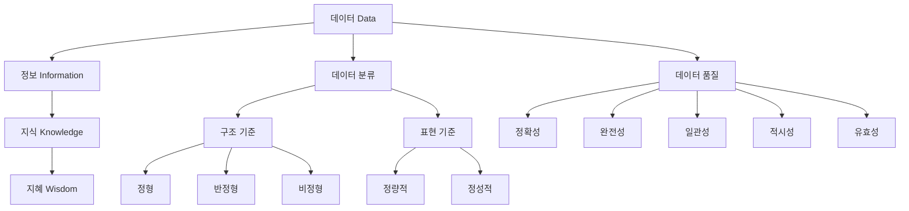
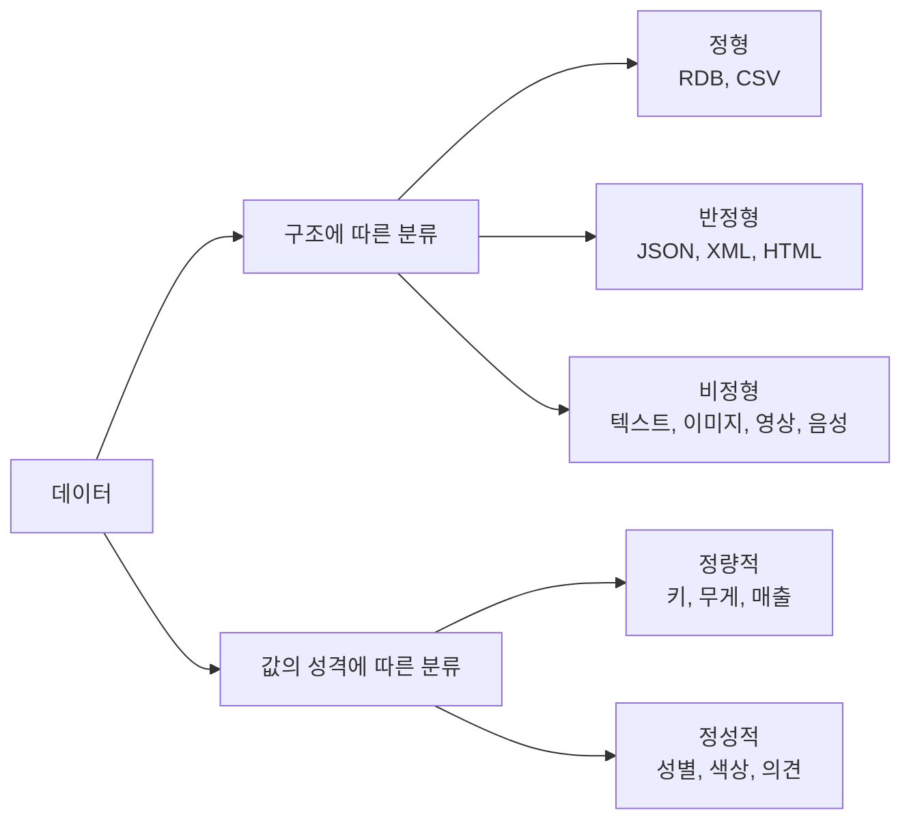

# 01. 데이터처리와활용: 데이터와 데이터베이스의 이해

## 🔗 선수 지식 (Prerequisites)
- [ ] **필수**: 컴퓨터 일반 - 파일/저장 개념 이해 완료?
- [ ] **권장**: 통계 입문 - 변수와 측정 척도 개념
- **관련 단원**: 2강 데이터베이스 시스템 개관 (예정)

---

## 학습 목표
1. 데이터의 개념과 특성을 설명할 수 있다.
2. DIKW 모델을 설명할 수 있다.
3. 데이터의 유형을 구분할 수 있다.
4. 데이터 품질 요소를 설명할 수 있다.

---

## 🧠 메타인지 체크 (학습 전/후 자기 평가)

### 학습 전 자기 평가
| 소주제 | 자신감 (1-5) |
| :--- | :--- |
| 데이터의 개념과 특성 | |
| DIKW 모델 | |
| 데이터의 분류 (정형/반정형/비정형) | |
| 데이터 품질 요소 | |

### 학습 후 교정 (학습 완료 후 작성)
| 소주제 | 학습 전 | 학습 후 | 실제 정답률 | 과신/과소 여부 |
| :--- | :--- | :--- | :--- | :--- |
| 데이터의 개념과 특성 | | | | |
| DIKW 모델 | | | | |
| 데이터의 분류 | | | | |
| 데이터 품질 요소 | | | | |

> **활용법**: 학습 전 1분 → 자신감 기입, 학습 후 1분 → 나머지 기입. "과신" 영역이 실제 취약점.

---

## 📝 요약 (Summary)

1. 🔴 **데이터의 개념과 특성**: 데이터는 현실 세계에서 관찰이나 측정을 통해 수집된 가공되지 않은 사실이며, 그 자체로는 의미가 충분하지 않고 해석과 맥락이 부여될 때 가치가 발생한다. 대량 수집과 컴퓨터 처리에 적합한 구조를 가진다.
2. 🔴 **DIKW 모델**: Data → Information → Knowledge → Wisdom의 4단계 계층 모델로, 분석 활동을 통해 단순 사실이 맥락·패턴·판단으로 점진적으로 발전하는 과정을 설명한다.
3. 🔴 **데이터의 분류**: 구조 기준으로 정형/반정형/비정형, 표현 기준으로 정량적/정성적으로 나뉘며, 유형에 따라 저장 방식과 분석 방법이 달라진다.
4. 🟡 **데이터 품질**: 정확성·완전성·일관성·적시성·유효성 등이 분석 결과의 신뢰도를 결정하는 핵심 요소이다.
5. 🟢 **데이터의 가치**: 데이터는 처리·분석을 통해 정보가 되며, 의사결정의 근거로 활용될 때 비로소 자산이 된다.

---

## 📐 핵심 정의 및 원리 (Key Definitions & Principles)

> **과목 유형**: 이론 중심 → 정의명 / 내용 / 키워드 테이블로 정리

| 정의명 | 내용 | 키워드 |
| :--- | :--- | :--- |
| **데이터(Data)** | 관찰·측정으로 수집된 가공되지 않은 사실(raw fact). 그 자체로 의미가 약함 | raw, fact, 측정 |
| **정보(Information)** | 데이터에 맥락(context)을 부여하여 의미를 가진 형태로 가공한 것 | context, 가공 |
| **지식(Knowledge)** | 정보들 사이의 패턴과 규칙을 학습·이해한 상태 | pattern, rule, 학습 |
| **지혜(Wisdom)** | 지식을 활용해 합리적인 판단·의사결정을 내리는 능력 | judgment, decision |
| **정형 데이터** | 행·열 기반의 고정 스키마를 가진 데이터 (RDB 테이블) | schema, RDB, table |
| **반정형 데이터** | 스키마는 있으나 유연한 구조 (JSON, XML, HTML) | tag, key-value |
| **비정형 데이터** | 정해진 구조가 없는 데이터 (텍스트, 이미지, 영상, 음성) | text, image, video |
| **정량적 데이터** | 수치로 측정·계산 가능한 데이터 (키, 매출, 온도) | numeric, quantitative |
| **정성적 데이터** | 속성·범주 중심의 비수치 데이터 (성별, 의견, 색상) | category, qualitative |
| **정확성(Accuracy)** | 데이터가 현실을 올바르게 반영하는 정도 | correctness |
| **완전성(Completeness)** | 필요한 데이터가 결측 없이 존재하는지 | missing, null |
| **일관성(Consistency)** | 동일 데이터가 서로 다른 위치에서 같은 값을 가지는지 | conflict-free |
| **적시성(Timeliness)** | 데이터가 시의적절하게 갱신·제공되는지 | freshness, latency |
| **유효성(Validity)** | 데이터가 정의된 규칙·형식·범위를 만족하는지 | format, rule |

### 주요 원리

**DIKW 피라미드의 가치 상승 원리**
$$
\text{Data} \xrightarrow{\text{context}} \text{Information} \xrightarrow{\text{pattern}} \text{Knowledge} \xrightarrow{\text{judgment}} \text{Wisdom}
$$
> **직관적 해석**: 측정된 숫자(Data) → "지난달 매출 1억"(Information) → "여름철에 매출이 항상 상승"(Knowledge) → "여름철 마케팅 예산을 늘려야 한다"(Wisdom).
> **AI 적용**: 머신러닝 파이프라인의 raw data → feature engineering → model(knowledge) → decision system(wisdom) 흐름과 동일.

---

## 📊 개념 시각화 (Visual Guide)

### 개념 관계도


### 데이터 유형 분류 체계도


### 핵심 비교 도식
| 단계 | 형태 | 예시 | 처리 방법 | AI 적용 |
| :--- | :--- | :--- | :--- | :--- |
| Data | 가공 전 사실 | 23, 25, 28 | 수집·저장 | raw dataset |
| Information | 맥락 부여 | "지난 3일 평균 기온 25°C" | 통계·요약 | feature |
| Knowledge | 패턴 이해 | "여름철 평균 기온은 매년 상승" | 분석·모델링 | trained model |
| Wisdom | 의사결정 | "에어컨 재고를 늘려야 한다" | 판단·실행 | decision system |

---

## ✏️ 심화 학습 (Study Subject)

### 1. 가상 시나리오: "어떤 데이터를 어떻게 다룰까?"
- **상황**: 한 쇼핑몰은 (1) 고객 주문 내역 (2) 고객 리뷰 텍스트 (3) 상품 이미지 (4) 외부 날씨 API의 JSON 데이터를 통합하여 "내일의 매출 예측 모델"을 만들려고 한다.
- **문제**: 네 가지 데이터는 각각 어떤 유형이며, 어떻게 저장·전처리해야 하는가? 또한 어떤 품질 이슈가 발생할 수 있는가?
- **해결**:
  - 주문 내역: **정형 데이터** → RDB 테이블 저장, SQL 집계.
  - 리뷰 텍스트: **비정형 정성적** → 토크나이징 후 임베딩.
  - 상품 이미지: **비정형 정량적(픽셀)** → CNN 입력.
  - 날씨 JSON: **반정형 정량적** → 파싱 후 정형 테이블로 변환.
  - 품질 이슈: 결측치(완전성), 중복 주문(일관성), 지연된 날씨 데이터(적시성), 잘못된 별점 범위(유효성).
- **AI 학습 포인트**: "비정형 데이터를 정형화하지 않고 직접 학습에 활용할 때(End-to-End)와 정형화 후 활용할 때의 장단점은?"

### 2. 관점별 비교 및 오개념 분석
- **핵심 비교**: '정보 vs 지식', '반정형 vs 비정형', '정량적 vs 정성적'.
- **오개념 분석**:
    - **오개념 1**: "JSON은 비정형 데이터다."
    - **분석**: JSON은 **반정형(semi-structured)** 데이터다. key-value 형태의 자기서술적 태그(self-describing tag)를 가지므로 완전한 비정형(텍스트·이미지)과 구분된다. 스키마가 고정되어 있지 않을 뿐, 구조가 전혀 없는 것은 아니다.
    - **오개념 2**: "데이터가 많을수록 무조건 좋은 분석이 가능하다."
    - **분석**: 정확성·완전성·일관성이 결여된 데이터는 양이 많아질수록 잘못된 결론을 강화한다(Garbage In, Garbage Out). 양보다 **품질**이 우선이다.
    - **오개념 3**: "지식(Knowledge)과 지혜(Wisdom)는 같은 의미다."
    - **분석**: 지식은 '무엇이 그런지를 안다(know-what, know-how)', 지혜는 '왜 그렇게 해야 하는지를 안다(know-why)'에 가깝다. 지혜는 의사결정과 가치 판단이 포함된다.
- **AI 학습 포인트**: "AI 모델이 학습한 결과는 DIKW 모델에서 Knowledge에 해당하는가, Wisdom에 해당하는가? 그 근거는?"

---

## ❓ 연습 문제 및 해설

> **블룸 인지 수준 범례**: [기억] 정의·나열 → [이해] 설명·비교 → [적용] 계산·구현 → [분석] 구별·디버그 → [평가] 판단·비평 → [창조] 설계·제안

### 📝 문제

**📌 1. ⭐ [기억] [데이터의 정의로 가장 적절한 것은?](#prob-1)**
   > ① 의사결정의 근거가 되는 최종 결과물
   > ② 관찰이나 측정을 통해 수집된 가공되지 않은 사실
   > ③ 패턴과 규칙을 학습한 상태
   > ④ 맥락이 부여된 의미 있는 정보

<br>

**📌 2. ⭐ [기억] [DIKW 모델의 순서로 옳은 것은?](#prob-2)**
   > ① Data → Knowledge → Information → Wisdom
   > ② Information → Data → Wisdom → Knowledge
   > ③ Data → Information → Knowledge → Wisdom
   > ④ Wisdom → Knowledge → Information → Data

<br>

**📌 3. ⭐⭐ [이해] [다음 중 반정형(semi-structured) 데이터에 해당하는 것을 모두 고르면?](#prob-3)**
   > <보기>
   >
   > 가. RDB의 회원 테이블
   > 나. JSON 형식의 API 응답
   > 다. 상품 사진(JPG 이미지)
   > 라. HTML 웹페이지

   > ① 가, 나
   > ② 나, 라
   > ③ 가, 다, 라
   > ④ 나, 다, 라

<br>

**📌 4. ⭐⭐ [이해] [데이터 품질 요소와 설명이 잘못 짝지어진 것은?](#prob-4)**
   > ① 정확성 - 데이터가 현실을 올바르게 반영하는 정도
   > ② 완전성 - 필요한 데이터가 결측 없이 존재하는지 여부
   > ③ 일관성 - 데이터가 정의된 규칙·범위를 만족하는지 여부
   > ④ 적시성 - 데이터가 시의적절하게 제공되는지 여부

<br>

**📌 5. ⭐⭐ [적용] ["서울 강남구의 6월 평균 기온은 25.3°C이다"라는 진술은 DIKW 모델에서 어느 단계에 해당하는가?](#prob-5)**
   > ① Data
   > ② Information
   > ③ Knowledge
   > ④ Wisdom

<br>

**📌 6. ⭐⭐ [분석] [다음 중 정성적(qualitative) 데이터에 해당하는 것은?](#prob-6)**
   > ① 학생의 키(cm)
   > ② 월간 매출액(원)
   > ③ 고객 만족도 등급(상/중/하)
   > ④ 일일 방문자 수(명)

<br>

**📌 7. ⭐⭐ [분석] [같은 고객의 주소가 A 테이블에는 "서울시 강남구", B 테이블에는 "서울 강남구"로 저장되어 있다. 이는 어떤 품질 요소의 결함인가?](#prob-7)**
   > ① 정확성(Accuracy)
   > ② 완전성(Completeness)
   > ③ 일관성(Consistency)
   > ④ 적시성(Timeliness)

<br>

**📌 8. ⭐⭐⭐ [평가] [데이터의 특성에 대한 설명으로 옳지 않은 것은?](#prob-8)**
   > ① 데이터는 그 자체로는 의미가 충분하지 않으며 해석이 필요하다.
   > ② 데이터는 대량 수집이 가능하고 컴퓨터가 처리하기에 적합한 구조를 가진다.
   > ③ 데이터는 항상 정량적 형태로만 표현된다.
   > ④ 데이터는 맥락이 부여될 때 정보로 변환된다.

<br>

**📌 9. ⭐⭐⭐ [평가] [다음 사례를 DIKW 단계에 옳게 매핑한 것은?](#prob-9)**
   > <보기>
   >
   > 가. "매출 데이터: 100, 120, 150"
   > 나. "매출은 3개월간 25% 증가했다"
   > 다. "여름 시즌에는 매출이 평균 30% 상승하는 패턴이 있다"
   > 라. "내년 여름 마케팅 예산을 30% 증액해야 한다"

   > ① 가-D, 나-I, 다-K, 라-W
   > ② 가-I, 나-D, 다-W, 라-K
   > ③ 가-D, 나-K, 다-I, 라-W
   > ④ 가-D, 나-I, 다-W, 라-K

<br>

**📌 10. ⭐⭐⭐ [창조] [한 병원이 환자의 EMR(전자의무기록), CT 영상, 의사 진단 메모를 통합하여 진단 보조 AI를 만들고자 한다. 각 데이터의 구조적 유형과, 발생 가능한 주요 품질 이슈 1가지씩을 짝지어 서술하시오.](#prob-10)**

---

### 🔑 정답 및 해설 (먼저 풀어본 후 펼치기)

<details>
<summary>정답 보기 (클릭)</summary>

1. ②
2. ③
3. ②
4. ③
5. ②
6. ③
7. ③
8. ③
9. ①
10. 서술형 - 해설 참고

</details>

<details>
<summary>해설 보기 (클릭)</summary>

<a id="prob-1"></a>
**1. ⭐ [기억] 데이터의 정의**
> **정답: ② 관찰이나 측정을 통해 수집된 가공되지 않은 사실**
> **해설**: 데이터(Data)는 raw fact이다. ①은 Wisdom, ③은 Knowledge, ④는 Information에 해당한다.

<a id="prob-2"></a>
**2. ⭐ [기억] DIKW 순서**
> **정답: ③ Data → Information → Knowledge → Wisdom**
> **해설**: DIKW 피라미드는 가공 수준이 낮은 단계에서 의사결정 단계로 점진적으로 상승한다.

<a id="prob-3"></a>
**3. ⭐⭐ [이해] 반정형 데이터**
> **정답: ② 나, 라**
> **해설**: JSON과 HTML은 태그·키 기반의 자기서술적 구조를 가지는 반정형 데이터. 가는 정형, 다는 비정형이다.

<a id="prob-4"></a>
**4. ⭐⭐ [이해] 품질 요소 정의**
> **정답: ③ 일관성 - 데이터가 정의된 규칙·범위를 만족하는지 여부**
> **해설**: ③은 **유효성(Validity)**에 해당한다. 일관성은 동일 데이터가 여러 위치에서 같은 값을 가지는지 여부다.

<a id="prob-5"></a>
**5. ⭐⭐ [적용] DIKW 매핑**
> **정답: ② Information**
> **해설**: 단순 측정값(25.3)이 "어디·언제·무엇"이라는 맥락(서울 강남구, 6월, 평균 기온)과 결합되어 의미가 부여되었으므로 Information이다. 패턴이나 의사결정은 아직 없다.

<a id="prob-6"></a>
**6. ⭐⭐ [분석] 정성적 데이터**
> **정답: ③ 고객 만족도 등급(상/중/하)**
> **해설**: 등급은 범주·속성 중심의 정성적 데이터다. ①②④는 모두 수치로 계산 가능한 정량적 데이터.

<a id="prob-7"></a>
**7. ⭐⭐ [분석] 일관성 결함**
> **정답: ③ 일관성(Consistency)**
> **해설**: 동일 객체에 대한 값이 위치에 따라 다르게 표기되어 있는 것은 일관성 결함의 전형적 사례다. 값 자체가 틀린 것이 아니므로 정확성 결함과는 구분된다.

<a id="prob-8"></a>
**8. ⭐⭐⭐ [평가] 데이터 특성 오류 식별**
> **정답: ③ 데이터는 항상 정량적 형태로만 표현된다.**
> **해설**: 데이터는 정량적·정성적 모두로 표현된다. 텍스트·이미지·범주형 등 정성적 형태도 데이터다.

<a id="prob-9"></a>
**9. ⭐⭐⭐ [평가] DIKW 사례 매핑**
> **정답: ① 가-D, 나-I, 다-K, 라-W**
> **해설**:
> - 가: 가공되지 않은 수치 → Data
> - 나: 맥락(3개월, 25% 증가)이 부여된 요약 → Information
> - 다: 반복적 패턴 이해 → Knowledge
> - 라: 지식을 근거로 한 의사결정 → Wisdom

<a id="prob-10"></a>
**10. ⭐⭐⭐ [창조] 의료 데이터 통합**
> **정답 예시**:
> - **EMR(전자의무기록)**: 정형 데이터(테이블 형태). 품질 이슈 - **완전성**(일부 항목 누락) 또는 **일관성**(병원·코드 체계 간 불일치).
> - **CT 영상**: 비정형 데이터(이미지/DICOM). 품질 이슈 - **정확성**(촬영 노이즈, 아티팩트) 또는 **유효성**(촬영 프로토콜 미준수).
> - **의사 진단 메모**: 비정형 정성적 데이터(자유 텍스트). 품질 이슈 - **일관성**(의사마다 다른 용어 사용) 또는 **유효성**(약어·오타로 표준 미준수).
> **해설**: 각 데이터가 서로 다른 유형·품질 이슈를 가지므로 **데이터 통합 전 표준화·정제 단계**가 반드시 필요함을 강조한다.

</details>

---

## ✅ O/X 확인문제 (연습문항 개수의 2배 권장)

**1.** 데이터는 그 자체로 완전한 의미를 가지며 해석이 필요 없다. [(O / X)](#ox-1)
**2.** DIKW 모델에서 Wisdom은 의사결정과 판단 단계를 의미한다. [(O / X)](#ox-2)
**3.** JSON은 비정형 데이터의 대표적 예이다. [(O / X)](#ox-3)
**4.** 정형 데이터는 행과 열로 구성된 고정 스키마를 가진다. [(O / X)](#ox-4)
**5.** 비정형 데이터에는 이미지, 영상, 텍스트 등이 포함된다. [(O / X)](#ox-5)
**6.** 정량적 데이터는 수치로 계산 가능한 데이터이다. [(O / X)](#ox-6)
**7.** 데이터 품질의 정확성은 데이터가 결측 없이 존재하는지를 의미한다. [(O / X)](#ox-7)
**8.** 데이터 품질의 일관성은 동일한 데이터가 서로 다른 위치에서도 같은 값을 갖는지 확인하는 것이다. [(O / X)](#ox-8)
**9.** 적시성(Timeliness)은 데이터가 시의적절하게 제공되는지를 평가한다. [(O / X)](#ox-9)
**10.** Data에서 Wisdom으로 갈수록 가공·해석 수준이 낮아진다. [(O / X)](#ox-10)
**11.** "패턴과 규칙을 이해한 상태"는 DIKW 모델의 Knowledge 단계에 해당한다. [(O / X)](#ox-11)
**12.** 데이터 양이 많을수록 품질과 무관하게 항상 좋은 분석이 가능하다. [(O / X)](#ox-12)
**13.** XML은 반정형 데이터에 속한다. [(O / X)](#ox-13)
**14.** 성별(남/여)은 정성적 데이터에 해당한다. [(O / X)](#ox-14)
**15.** 데이터 유형이 달라도 저장 방식과 분석 방법은 모두 동일하다. [(O / X)](#ox-15)
**16.** 유효성(Validity)은 데이터가 정의된 규칙이나 형식에 맞는지를 평가한다. [(O / X)](#ox-16)
**17.** Information은 데이터에 맥락이 부여되어 의미를 가진 형태이다. [(O / X)](#ox-17)
**18.** 컴퓨터가 처리하기에 적합한 구조를 가진다는 것은 데이터의 특성 중 하나이다. [(O / X)](#ox-18)
**19.** 한 시스템에서 같은 고객의 ID가 두 가지로 저장되어 있다면 이는 정확성 문제이다. [(O / X)](#ox-19)
**20.** 분석 활동은 DIKW의 단계를 점진적으로 상승시키는 과정이다. [(O / X)](#ox-20)

<details>
<summary>O/X 정답 및 해설 보기 (클릭)</summary>

> <a id="ox-1"></a>
> **1. 정답**: X
> **해설**: 데이터는 그 자체로는 의미가 충분하지 않으며 해석과 맥락이 부여될 때 가치가 발생한다.

> <a id="ox-2"></a>
> **2. 정답**: O
> **해설**: Wisdom은 지식을 활용해 합리적인 판단·의사결정을 내리는 단계다.

> <a id="ox-3"></a>
> **3. 정답**: X
> **해설**: JSON은 key-value의 자기서술적 구조를 가지는 반정형 데이터다.

> <a id="ox-4"></a>
> **4. 정답**: O
> **해설**: 정형 데이터의 핵심 특징이다.

> <a id="ox-5"></a>
> **5. 정답**: O
> **해설**: 구조가 정해져 있지 않은 데이터가 비정형 데이터다.

> <a id="ox-6"></a>
> **6. 정답**: O
> **해설**: 정량적 데이터는 수치 측정·계산이 가능하다.

> <a id="ox-7"></a>
> **7. 정답**: X
> **해설**: 결측 여부는 **완전성(Completeness)**이다. 정확성은 현실 반영 정도이다.

> <a id="ox-8"></a>
> **8. 정답**: O
> **해설**: 일관성의 정확한 정의이다.

> <a id="ox-9"></a>
> **9. 정답**: O
> **해설**: 적시성은 데이터의 시의적절함(freshness)을 평가한다.

> <a id="ox-10"></a>
> **10. 정답**: X
> **해설**: Data → Wisdom으로 갈수록 가공·해석 수준이 **높아진다**.

> <a id="ox-11"></a>
> **11. 정답**: O
> **해설**: Knowledge는 패턴과 규칙을 이해한 상태이다.

> <a id="ox-12"></a>
> **12. 정답**: X
> **해설**: 품질이 낮으면 양이 많을수록 잘못된 결론을 강화한다(GIGO).

> <a id="ox-13"></a>
> **13. 정답**: O
> **해설**: XML도 태그 기반 자기서술적 구조를 갖는 반정형 데이터다.

> <a id="ox-14"></a>
> **14. 정답**: O
> **해설**: 범주(category) 중심 데이터이므로 정성적이다.

> <a id="ox-15"></a>
> **15. 정답**: X
> **해설**: 정형은 RDB/SQL, 비정형은 NoSQL·딥러닝 등 유형에 따라 처리 방법이 다르다.

> <a id="ox-16"></a>
> **16. 정답**: O
> **해설**: 유효성은 형식·범위·규칙 만족 여부이다.

> <a id="ox-17"></a>
> **17. 정답**: O
> **해설**: Information은 맥락이 부여된 데이터다.

> <a id="ox-18"></a>
> **18. 정답**: O
> **해설**: 데이터의 핵심 특성 중 하나로 명시되어 있다.

> <a id="ox-19"></a>
> **19. 정답**: X
> **해설**: 동일 개체가 여러 위치에서 다르게 저장된 것은 **일관성(Consistency)** 결함이다.

> <a id="ox-20"></a>
> **20. 정답**: O
> **해설**: 분석은 DIKW의 가치 상승 과정 그 자체이다.

</details>

---

## 🧪 자유 회상 연습 (Free Recall)

> **방법**: 위의 노트를 모두 덮고, 타이머 3분 설정 후 이번 단원에서 배운 내용을 기억나는 대로 자유롭게 적으세요.
> 정확한 문장이 아니어도 됩니다. 키워드, 수식, 관계 등 떠오르는 것을 모두 적습니다.

**자유 회상 작성란:**

```
[여기에 기억나는 내용을 자유롭게 작성]


```

> **회상 후 점검**: 노트를 다시 펼쳐 빠뜨린 내용을 확인하세요. 빠뜨린 부분이 실제 취약점입니다.
> - 회상 못한 핵심 개념: [                ]
> - 회상 못한 분류/품질 요소: [                ]

---

## 💻 코드로 확인하기 (Code Verification)

```python
# 데이터 유형별 처리 방법 시연 (정형/반정형/비정형)
import pandas as pd
import json

# 1. 정형 데이터: DataFrame (행·열 고정 스키마)
structured = pd.DataFrame({
    "고객ID": [1, 2, 3, 4],
    "나이": [25, 32, 28, 41],
    "매출": [12000, 25000, 18000, 30000],
})
print("[정형 데이터]")
print(structured)
print(f"평균 매출: {structured['매출'].mean():.0f}원\n")

# 2. 반정형 데이터: JSON (자기서술적 키-값 구조)
semi = json.loads('''
{
  "user": "Alice",
  "orders": [
    {"product": "노트북", "price": 1500000},
    {"product": "마우스", "price": 30000}
  ]
}
''')
total = sum(o["price"] for o in semi["orders"])
print("[반정형 데이터 - JSON 파싱]")
print(f"{semi['user']}의 총 구매액: {total:,}원\n")

# 3. 비정형 데이터: 텍스트
text = "이 제품은 정말 만족스러워요. 배송도 빨랐습니다."
word_count = len(text.split())
print("[비정형 데이터 - 텍스트]")
print(f"리뷰 단어 수: {word_count}개")

# 4. 데이터 품질 진단 (완전성·유효성)
df = pd.DataFrame({"나이": [25, None, 28, -5, 41]})
print("\n[데이터 품질 진단]")
print(f"완전성 결함(결측치): {df['나이'].isna().sum()}건")
print(f"유효성 결함(음수 나이): {(df['나이'] < 0).sum()}건")
```

> **실행 결과** (예시):
> ```
> [정형 데이터]
>    고객ID  나이     매출
> 0     1  25  12000
> 1     2  32  25000
> 2     3  28  18000
> 3     4  41  30000
> 평균 매출: 21250원
>
> [반정형 데이터 - JSON 파싱]
> Alice의 총 구매액: 1,530,000원
>
> [비정형 데이터 - 텍스트]
> 리뷰 단어 수: 6개
>
> [데이터 품질 진단]
> 완전성 결함(결측치): 1건
> 유효성 결함(음수 나이): 1건
> ```
> **해석**: 정형은 즉시 통계 연산이 가능하고, 반정형은 파싱 후 활용, 비정형은 별도 전처리(토크나이징)가 필요하다. 품질 결함은 단순 `isna()`·범위 체크로 손쉽게 진단할 수 있다.

---

## 🤖 AI 연결고리 (Concept → AI Application)

| 개념 | AI/ML 적용 분야 | 구체적 사례 |
| :--- | :--- | :--- |
| **정형 데이터** | 전통적 ML (회귀/분류) | 고객 이탈 예측 (XGBoost) |
| **반정형 데이터** | API 기반 특성 추출 | 로그·이벤트 분석 (Spark JSON 파싱) |
| **비정형 데이터** | 딥러닝 (CNN/Transformer) | 이미지 분류(ResNet), GPT 텍스트 생성 |
| **DIKW 모델** | ML 파이프라인 단계 | Raw data → Feature → Model → Decision system |
| **데이터 품질** | 데이터 중심 AI (Data-centric AI) | Andrew Ng의 "Better data > Better model" |
| **결측치(완전성)** | 데이터 전처리 | sklearn `SimpleImputer`, `KNNImputer` |
| **일관성** | 엔티티 해상도 (ER) | 중복 고객 매칭, Record Linkage |

---

## 📖 심화 학습 예시 답안

#### 1. DIKW 모델의 내부 동작 원리
1. **Data**: 측정·관찰을 통해 raw fact를 수집한다. (예: `[23, 25, 28, 30]`)
2. **Information**: 데이터에 시간·장소·단위 등 맥락을 결합한다. (예: "최근 4일간 서울 기온(°C)")
3. **Knowledge**: 여러 Information에서 패턴·규칙을 학습한다. (예: "기온은 매일 평균 2°C씩 상승")
4. **Wisdom**: 지식을 근거로 미래 행동을 결정한다. (예: "내일은 시원한 옷차림을 권장")

> 각 단계는 가공·추상화 수준이 한 단계씩 올라가며, **분석 활동**이 그 사이의 화살표 역할을 한다.

#### 2. 정보(Information) vs 지식(Knowledge) 비교표
| 구분 | Information | Knowledge | 비고 |
| :--- | :--- | :--- | :--- |
| **정의** | 맥락이 부여된 데이터 | 패턴·규칙을 학습한 상태 | |
| **답하는 질문** | "무엇이?" (what) | "왜·어떻게?" (why/how) | |
| **예시** | "오늘 매출은 100만원" | "주말마다 매출이 30% 증가한다" | |
| **AI 활용** | feature, summary statistics | trained model parameters | |

#### 3. 데이터 품질 진단 코드 (Best Practice)

- **Bad Practice (나쁜 예시)**
  ```python
  # 결측치를 무시하고 통계 계산 → 평균이 왜곡됨
  ages = [25, None, 28, -5, 41]
  avg = sum(a for a in ages if a is not None) / len(ages)  # 분모 오류
  print(avg)  # 잘못된 결과
  ```

- **Good Practice (좋은 예시)**
  ```python
  import pandas as pd

  df = pd.DataFrame({"나이": [25, None, 28, -5, 41]})

  # 1) 완전성: 결측치 처리
  df = df.dropna(subset=["나이"])
  # 2) 유효성: 범위 검증
  df = df[df["나이"].between(0, 120)]
  # 3) 정확성 보장 후 통계
  print(f"정제 후 평균: {df['나이'].mean():.1f}")
  ```

- **설명**: 품질 검증을 거치지 않은 통계는 분석 결과 자체를 신뢰할 수 없게 만든다. **결측치 처리 → 범위 검증 → 통계 계산** 순서가 데이터 분석의 기본 흐름이다.

---

## 📚 핵심 용어집 (Glossary)

| 용어 (한) | 용어 (영) | 수식/표현 | 정의 |
| :--- | :--- | :--- | :--- |
| **데이터** | Data | raw fact | 관찰·측정으로 수집된 가공되지 않은 사실 |
| **정보** | Information | $D + \text{context}$ | 맥락이 부여되어 의미를 가진 데이터 |
| **지식** | Knowledge | $\{I_i\} \to \text{pattern}$ | 정보들 사이의 패턴·규칙을 학습한 상태 |
| **지혜** | Wisdom | $K \to \text{decision}$ | 지식을 활용한 합리적 판단·의사결정 |
| **DIKW 모델** | DIKW Pyramid | $D \to I \to K \to W$ | 데이터의 가치 상승 4단계 모델 |
| **정형 데이터** | Structured Data | schema-fixed | 행·열의 고정 스키마를 가진 데이터 (RDB) |
| **반정형 데이터** | Semi-structured | self-describing tag | 유연한 스키마, 태그·키 기반 구조 (JSON/XML) |
| **비정형 데이터** | Unstructured | no schema | 정해진 구조가 없는 데이터 (텍스트/이미지/영상) |
| **정량적 데이터** | Quantitative | numeric | 수치로 측정·계산 가능한 데이터 |
| **정성적 데이터** | Qualitative | category | 속성·범주 중심의 비수치 데이터 |
| **정확성** | Accuracy | - | 데이터가 현실을 올바르게 반영하는 정도 |
| **완전성** | Completeness | $1 - \frac{\text{null}}{N}$ | 필요한 데이터가 결측 없이 존재하는지 |
| **일관성** | Consistency | - | 동일 데이터가 여러 위치에서 같은 값을 갖는지 |
| **적시성** | Timeliness | $\Delta t$ | 데이터가 시의적절하게 제공되는지 |
| **유효성** | Validity | $x \in \text{valid range}$ | 데이터가 정의된 규칙·형식·범위를 만족하는지 |

---

## 🤖 AI 학습 파트너를 위한 추가 자료

### 1. 개념 이해를 위한 심층 질문 프롬프트
> **프롬프트 예시**: "DIKW 모델의 4단계를 초등학생도 이해할 수 있는 일상 비유(예: 요리, 날씨)로 설명해 줘. 또한 이 모델이 등장하기 전에는 데이터·정보·지식을 어떻게 구분했는지 역사적 배경도 함께 알려줘."

### 2. 문제 해결 능력 강화를 위한 시나리오 프롬프트
> **프롬프트 예시**: "당신은 데이터 엔지니어입니다. 한 회사가 100만 건의 고객 데이터를 수집했는데 분석 결과가 신뢰할 수 없다고 합니다. 정확성·완전성·일관성·적시성·유효성 중 어떤 품질 요소부터 점검해야 하는지 우선순위를 정하고, 각 점검 방법을 SQL 또는 Python 코드 예시와 함께 제시해 줘."

### 3. 분류 검증 프롬프트
> **프롬프트 예시**: "다음 데이터들을 정형/반정형/비정형 + 정량적/정성적 기준으로 분류해 줘.
> 1) 트위터 트윗, 2) 주식 시세 CSV, 3) MRI 영상, 4) GraphQL 응답, 5) 음성 통화 녹음.
> 분류가 모호한 경우 그 이유를 함께 설명해 줘."

---

## 🔄 복습 체크 (Spaced Repetition)
- [ ] 1일 후 복습 (날짜: 2026-05-30)
- [ ] 3일 후 복습 (날짜: 2026-06-01)
- [ ] 7일 후 복습 (날짜: 2026-06-05)
- [ ] 14일 후 복습 (날짜: 2026-06-12)
- [ ] 30일 후 복습 (날짜: 2026-06-28)

### 복습 시 자가 평가
| 회차 | 날짜 | 이해도 (1-5) | 취약 부분 메모 |
| :--- | :--- | :--- | :--- |
| 1차 | | | |
| 2차 | | | |
| 3차 | | | |

---

## 📚 참고 자료 (References)

- 교재 - 데이터처리와활용 1강. 데이터와 데이터베이스의 이해
- Rowley, J. (2007). "The wisdom hierarchy: representations of the DIKW hierarchy". *Journal of Information Science*.
- Andrew Ng - "Data-Centric AI" (https://www.deeplearning.ai/the-batch/)
- DAMA-DMBOK2 - Data Quality 챕터 (정확성·완전성·일관성·적시성·유효성)
