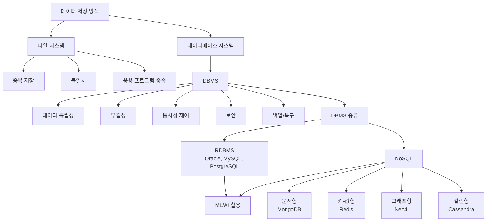

# 2강. 데이터처리와활용: 관계형 데이터 모델(1)

## 🔗 선수 지식 (Prerequisites)
- [ ] **필수**: 파일 시스템의 기본 구조(파일/레코드/필드 개념) - 이해 완료?
- [ ] **권장**: 운영체제의 파일 입출력, 응용 프로그램 구조에 대한 기초 이해
- **관련 단원**: [1강. 데이터와 데이터베이스의 이해](1강.md), [3강. 관계형 데이터 모델(2)](3강.md)

---

## 학습 목표
1. 파일 시스템의 문제점을 설명할 수 있다.
2. 데이터베이스의 개념을 설명할 수 있다.
3. DBMS의 핵심 기능을 나열할 수 있다.
4. RDBMS와 NoSQL DB를 구분할 수 있다.

---

## 🧠 메타인지 체크 (학습 전/후 자기 평가)

### 학습 전 자기 평가
| 소주제 | 자신감 (1-5) |
| :--- | :--- |
| 파일 시스템의 한계 | |
| 데이터베이스/DBMS 개념 | |
| RDBMS vs NoSQL 구분 | |

### 학습 후 교정 (학습 완료 후 작성)
| 소주제 | 학습 전 | 학습 후 | 실제 정답률 | 과신/과소 여부 |
| :--- | :--- | :--- | :--- | :--- |
| 파일 시스템의 한계 | | | | |
| 데이터베이스/DBMS 개념 | | | | |
| RDBMS vs NoSQL 구분 | | | | |

> **활용법**: 학습 전 1분 → 자신감 기입, 학습 후 1분 → 나머지 기입. "과신" 영역이 실제 취약점.

---

## 📝 요약 (Summary)

1. 🔴 **파일 시스템의 한계**: 파일 시스템은 응용 프로그램별로 개별 파일을 사용하여, 동일 데이터가 여러 파일에 중복 저장된다. 파일 시스템은 단순하나 중복과 불일치로 인한 일관성 유지의 어려움을 겪는다.
2. 🔴 **데이터베이스 개념**: 데이터베이스는 통합되고 공유되는 데이터의 집합으로서 여러 사용자가 동시에 접근 가능하도록 설계된다. 운영 데이터를 중앙에서 관리함으로써 효율성을 높인다.
3. 🔴 **DBMS의 기능**: DBMS는 데이터 독립성을 제공하여 물리적/논리적 구조 변경이 프로그램에 미치는 영향을 최소화한다. 무결성 제약조건, 동시성 제어, 보안, 백업/복구 기능을 제공한다.
4. 🟡 **DBMS 종류**: RDBMS는 테이블 기반 구조로 SQL을 사용하고, NoSQL은 문서형·키-값형·그래프형 등 다양한 구조를 지원한다. 데이터 특성과 규모에 따라 적절한 DBMS를 선택해야 한다.
5. 🟡 **3계층 스키마와 데이터 독립성**: DBMS는 외부 스키마(View/응용 뷰)·개념 스키마(논리 구조)·내부 스키마(물리 저장)의 3계층을 두어 데이터 독립성을 구현한다. 뷰(View)는 외부 스키마의 실제 구현체로, DBMS 보안 기능과 데이터 독립성의 핵심 수단이다.
6. 🟡 **트랜잭션과 ACID**: 트랜잭션은 분리될 수 없는 작업 단위이며, Atomicity(원자성)·Consistency(일관성)·Isolation(격리성)·Durability(지속성)의 ACID 속성으로 데이터 무결성을 보장한다. DBMS의 동시성 제어·백업·복구의 이론적 토대이다.

---

## 📐 핵심 정의 및 원리 (Key Definitions & Principles)

> 이 강의는 이론 중심 단원이므로 수식 대신 정의·원리 테이블로 정리한다.

| 정의명 | 내용 | 키워드 |
| :--- | :--- | :--- |
| **파일 시스템(File System)** | 응용 프로그램별로 개별 파일을 두어 데이터를 저장·관리하는 방식. 동일 데이터가 여러 파일에 중복 저장되기 쉽다. | 응용프로그램 종속, 중복, 불일치 |
| **데이터 중복(Data Redundancy)** | 같은 데이터가 여러 위치에 저장되어 저장 공간 낭비와 갱신 시 불일치를 유발하는 현상. | Redundancy, Inconsistency |
| **데이터베이스(Database)** | 통합(Integrated)되고 공유(Shared)되는 운영 데이터의 집합으로, 여러 사용자가 동시에 접근 가능하도록 설계된 데이터 저장소. | 통합·공유·운영·중앙관리 |
| **DBMS(Database Management System)** | 데이터베이스를 정의·조작·제어·관리하는 소프트웨어. 응용 프로그램과 물리적 데이터 사이에서 중간 계층 역할을 수행한다. | 정의·조작·제어, 중간 계층 |
| **데이터 독립성(Data Independence)** | 물리적·논리적 데이터 구조가 변경되어도 응용 프로그램은 영향을 받지 않도록 분리한 성질. | 물리적 독립성, 논리적 독립성 |
| **무결성 제약조건(Integrity Constraint)** | 데이터의 정확성·일관성을 유지하기 위해 DBMS가 강제하는 규칙(예: 도메인, 키, 참조 무결성). | Domain, Key, Referential |
| **동시성 제어(Concurrency Control)** | 다중 사용자가 동시에 접근할 때 발생하는 충돌을 방지하고 트랜잭션의 일관성을 보장하는 기능. | Lock, Transaction |
| **보안(Security)** | 인증(Authentication)과 권한 부여(Authorization)를 통해 접근을 통제하는 기능. | 인증·인가, GRANT/REVOKE |
| **백업과 복구(Backup & Recovery)** | 장애·오류 발생 시 데이터를 보호하고 일관된 상태로 회복시키는 기능. | Recovery, Log |
| **RDBMS** | 테이블(행·열) 기반 구조로 데이터를 저장하고 SQL로 조작하는 관계형 데이터베이스 관리 시스템. | Table, SQL, ACID |
| **NoSQL DB** | 문서형(Document), 키-값형(Key-Value), 칼럼형(Column), 그래프형(Graph) 등 비관계형 구조를 지원하는 DBMS. 대규모·비정형 데이터에 적합. | Schema-less, BASE, Scale-out |

### 핵심 원리 — 3계층 스키마와 데이터 독립성

DBMS는 응용 프로그램과 물리 저장 장치 사이에 **외부/개념/내부 스키마**를 두어 데이터 독립성을 구현한다.

$$
\text{응용 프로그램} \;\longleftrightarrow\; \underbrace{\text{외부 스키마}}_{\text{View}} \;\longleftrightarrow\; \underbrace{\text{개념 스키마}}_{\text{Logical}} \;\longleftrightarrow\; \underbrace{\text{내부 스키마}}_{\text{Physical}} \;\longleftrightarrow\; \text{저장 장치}
$$

> **직관적 해석**: 응용 프로그램은 "보고 싶은 모습(View)"만 보고, 실제 저장 방식이 바뀌어도 영향을 받지 않는다. 이것이 파일 시스템과 결정적으로 다른 점이다.
> **AI 적용**: ML 파이프라인에서도 Feature Store가 동일한 역할을 한다 — 모델은 피처 정의(논리)만 참조하고, 저장소(물리)가 Parquet에서 Delta Lake로 바뀌어도 코드는 그대로다.

---

## 📊 개념 시각화 (Visual Guide)

### 개념 분류 체계도 (이론 중심 — 필수)



### 핵심 비교표 — 파일 시스템 vs 데이터베이스 시스템

| 구분 | 파일 시스템 | 데이터베이스 시스템 | AI 적용 |
| :--- | :--- | :--- | :--- |
| **데이터 저장** | 응용 프로그램별 개별 파일 | 통합 저장소(중앙 관리) | 데이터 레이크/웨어하우스 |
| **중복** | 발생(필연적) | 통제됨 | 학습 데이터 일관성 보장 |
| **일관성** | 응용 프로그램이 직접 관리 | DBMS가 자동 보장 | 학습/추론 데이터 동기화 |
| **동시 접근** | 어려움 | 동시성 제어로 지원 | 다중 사용자 모델 서빙 |
| **데이터 독립성** | 없음(프로그램 종속) | 물리적·논리적 독립성 | 피처 스토어 추상화 |
| **공유** | 제한적 | 다수 사용자/응용 공유 | 협업 ML 파이프라인 |

---

## ✏️ 심화 학습 (Study Subject)

### 1. 가상 시나리오: "왜 파일 시스템을 버리고 DBMS로 가야 할까?"

- **상황**: 한 쇼핑몰이 초기에는 회원 정보(`members.csv`), 주문 정보(`orders.csv`), 재고 정보(`stock.csv`)를 응용 프로그램별 파일로 관리해 왔다. 회원 수가 100만 명을 넘으면서 회원 주소가 회원 파일과 주문 파일에 중복 저장되어, 주소를 바꾸면 한쪽만 갱신되는 일이 잦아졌다.
- **문제**: 주소 갱신이 회원 파일에는 반영되지만, 진행 중인 주문 파일에는 반영되지 않아 잘못된 배송지로 발송된다. 또한 두 직원이 동시에 같은 재고를 수정하면 마지막 저장이 다른 사람의 변경을 덮어쓴다.
- **해결**: ① 회원·주문·재고를 하나의 데이터베이스로 통합하고, 회원 주소는 회원 테이블에만 저장한 뒤 주문 테이블은 회원ID로 참조한다(중복 제거). ② DBMS의 무결성 제약조건(외래키)으로 존재하지 않는 회원ID의 주문을 막는다. ③ 트랜잭션과 잠금으로 동시성 충돌을 방지한다.
- **AI 학습 포인트**: "ML 학습 데이터셋에서도 동일한 '데이터 중복·불일치' 문제가 발생할 수 있다. Feature Store가 이를 어떻게 해결하는지, DBMS의 데이터 독립성 개념과 비교해 설명해줘."

### 2. 관점별 비교 및 오개념 분석

- **핵심 비교**: 자주 혼동되는 개념 쌍 정리
  - **데이터베이스 vs DBMS**: 데이터베이스는 "데이터의 집합"이고, DBMS는 그것을 "관리하는 소프트웨어"이다.
  - **RDBMS vs NoSQL**: 스키마 유무·일관성 모델(ACID vs BASE)·확장 방식(Scale-up vs Scale-out)에서 다르다.
  - **물리적 독립성 vs 논리적 독립성**: 저장 방식 변경(물리) vs 논리 구조(테이블 정의) 변경에 응용이 영향받지 않는 성질.

- **오개념 분석**:
    - **오개념 1**: "NoSQL은 SQL을 전혀 사용하지 않으므로 RDBMS보다 항상 빠르다."
    - **분석**: NoSQL의 'No'는 "Not Only SQL"의 의미로 업계에서 통용되지만, 원래 NoSQL이라는 용어는 1998년 Carlo Strozzi의 비관계형 DB에서 유래했으며 'Not Only SQL'은 2009년 이후 재해석된 약어이다. SQL 미사용이 곧 성능 우위를 보장하지 않는다. NoSQL은 수평 확장과 비정형 데이터 처리에 유리하지만, 강한 일관성·복잡한 조인이 필요한 작업은 RDBMS가 우수하다. 적합성 문제이지 우열의 문제가 아니다.
    - **오개념 2**: "DBMS만 도입하면 데이터 중복은 0이 된다."
    - **분석**: DBMS는 중복을 *통제* 가능하게 만들 뿐, 정규화 설계와 무결성 제약조건을 적용해야 실제로 중복이 제거된다. 잘못 설계된 DB는 파일 시스템보다 더 큰 중복을 가질 수도 있다.

- **AI 학습 포인트**: "RDBMS와 NoSQL을 각각 추천 시스템·로그 분석·실시간 그래프 추론에 적용한다면 어느 쪽이 적합한지, ACID/BASE 관점에서 비교해줘."

---

## ❓ 연습 문제 및 해설

> **블룸 인지 수준 범례**: [기억] 정의·나열 → [이해] 설명·비교 → [적용] 계산·구현 → [분석] 구별·디버그 → [평가] 판단·비평 → [창조] 설계·제안

### 📝 문제

**1. ⭐ 📌 [기억] 파일 시스템의 대표적 문제점이 아닌 것은?[🔗](#prob-1)**
   > ① 동일 데이터가 여러 파일에 중복 저장됨
   > ② 데이터 일관성 유지가 어려움
   > ③ 응용 프로그램이 데이터 구조에 종속됨
   > ④ 다중 사용자의 동시 접근을 자동으로 제어함

<br>

**2. ⭐ 📌 [기억] 데이터베이스의 정의로 가장 적절한 것은?[🔗](#prob-2)**
   > ① 한 사용자가 개별적으로 사용하는 파일의 모음
   > ② 통합되고 공유되는 운영 데이터의 집합
   > ③ 응용 프로그램별로 분리 저장된 데이터 파일
   > ④ 디스크에 저장된 모든 비트열의 총합

<br>

**3. ⭐ 📌 [이해] DBMS의 핵심 기능에 해당하지 않는 것은?[🔗](#prob-3)**
   > ① 무결성 제약조건 강제
   > ② 동시성 제어
   > ③ 운영체제의 프로세스 스케줄링
   > ④ 백업과 복구

<br>

**4. ⭐⭐ 📌 [이해] RDBMS와 NoSQL을 비교한 설명으로 옳은 것은?[🔗](#prob-4)**
   > ① RDBMS는 비정형 데이터에 가장 적합하다.
   > ② NoSQL은 모든 경우에 RDBMS보다 빠르다.
   > ③ RDBMS는 테이블 기반 구조에서 SQL을 사용한다.
   > ④ NoSQL은 SQL을 절대 사용할 수 없다.

<br>

**5. ⭐⭐ 📌 [이해] <보기>에서 데이터베이스 도입의 장점으로 옳은 것을 모두 고르시오.[🔗](#prob-5)**
   > <보기>
   >
   > 가. 데이터 중복을 통제할 수 있다.
   > 나. 다중 사용자의 동시 접근을 안전하게 처리할 수 있다.
   > 다. 응용 프로그램이 물리적 저장 방식에 종속되지 않는다.
   > 라. 어떠한 장애가 발생해도 데이터가 절대 손실되지 않는다.

   > ① 가, 나
   > ② 가, 나, 다
   > ③ 나, 다, 라
   > ④ 가, 나, 다, 라

<br>

**6. ⭐⭐ 📌 [적용] 다음 중 NoSQL의 분류와 대표 시스템 짝이 잘못된 것은?[🔗](#prob-6)**
   > ① 문서형 — MongoDB
   > ② 키-값형 — Redis
   > ③ 그래프형 — Neo4j
   > ④ 관계형 — Cassandra

<br>

**7. ⭐⭐ 📌 [분석] 데이터 독립성에 대한 설명으로 가장 옳은 것은?[🔗](#prob-7)**
   > ① 응용 프로그램과 운영체제를 분리하는 성질이다.
   > ② 물리적/논리적 데이터 구조 변경이 응용 프로그램에 미치는 영향을 최소화하는 성질이다.
   > ③ 데이터를 여러 파일로 분리 저장하는 성질이다.
   > ④ 한 사용자만 데이터에 접근하도록 보장하는 성질이다.

<br>

**8. ⭐⭐ 📌 [분석] 다음 사례에서 부족한 DBMS 기능은 무엇인가?[🔗](#prob-8)**
   > <사례>
   >
   > 두 직원이 같은 재고 수량을 동시에 수정하였더니, 한 사람이 입력한 변경이 다른 사람의 변경에 의해 덮어써져 결과가 사라졌다.

   > ① 무결성 제약조건
   > ② 동시성 제어
   > ③ 보안(인증)
   > ④ 백업

<br>

**9. ⭐⭐⭐ 📌 [평가] 다음 시나리오에서 가장 적절한 DBMS 선택과 이유를 서술하시오.[🔗](#prob-9)**
   > <시나리오>
   >
   > 글로벌 SNS 서비스가 "사용자-친구-게시물" 간의 다단계 연결 관계를 실시간으로 추천에 활용하려고 한다. 데이터는 수억 노드, 수십억 관계로 매우 크다.

<br>

**10. ⭐⭐⭐ 📌 [창조] 어느 회사가 응용 프로그램별 파일 시스템을 사용하다가 데이터 중복·불일치 문제로 어려움을 겪고 있다. DBMS 도입을 통해 이 문제를 해결하는 단계적 전략을 제안하시오.[🔗](#prob-10)**

---

### 🔑 정답 및 해설 (먼저 풀어본 후 펼치기)

<details>
<summary>정답 보기 (클릭)</summary>

1. ④
2. ②
3. ③
4. ③
5. ②
6. ④
7. ②
8. ②
9. [서술형] 그래프형 NoSQL DB(Neo4j 등)
10. [서술형] 통합 설계 → 정규화 → DBMS 도입 → 무결성/동시성/보안 적용 → 운영

</details>

<details>
<summary>해설 보기 (클릭)</summary>

<a id="prob-1"></a>
**1. ⭐ [기억] 파일 시스템의 문제점이 아닌 것**
> **정답: ④ 다중 사용자의 동시 접근을 자동으로 제어함**
> **해설**: 동시성 제어는 DBMS가 제공하는 기능이며, 파일 시스템에는 부재하다. ①②③은 파일 시스템의 전형적 한계.

<a id="prob-2"></a>
**2. ⭐ [기억] 데이터베이스 정의**
> **정답: ② 통합되고 공유되는 운영 데이터의 집합**
> **해설**: 데이터베이스는 "통합·공유·운영" 데이터의 집합이다. ①③은 파일 시스템의 특징, ④는 디스크 데이터 일반을 가리켜 정의로 부적절.

<a id="prob-3"></a>
**3. ⭐ [이해] DBMS 핵심 기능이 아닌 것**
> **정답: ③ 운영체제의 프로세스 스케줄링**
> **해설**: 프로세스 스케줄링은 OS의 기능이다. 무결성·동시성·보안·백업·복구는 모두 DBMS 핵심 기능.

<a id="prob-4"></a>
**4. ⭐⭐ [이해] RDBMS vs NoSQL**
> **정답: ③ RDBMS는 테이블 기반 구조에서 SQL을 사용한다.**
> **해설**: ① RDBMS는 정형 데이터에 강하다. ② "항상 빠르다"는 잘못된 일반화. ④ 다수 NoSQL이 SQL 유사 질의를 지원하므로 "절대 불가"는 오류.

<a id="prob-5"></a>
**5. ⭐⭐ [이해] DB 도입의 장점**
> **정답: ② 가, 나, 다**
> **해설**: 라는 과장된 진술이다. DBMS는 백업·복구로 *손실 가능성을 크게 줄이지만*, 모든 장애에서 무손실을 보장하지는 않는다.

<a id="prob-6"></a>
**6. ⭐⭐ [적용] NoSQL 분류와 대표 시스템**
> **정답: ④ 관계형 — Cassandra**
> **해설**: Cassandra는 칼럼형(Column-Family) NoSQL이며, 관계형이 아니다. 관계형의 대표는 MySQL/PostgreSQL/Oracle.

<a id="prob-7"></a>
**7. ⭐⭐ [분석] 데이터 독립성**
> **정답: ② 물리적/논리적 데이터 구조 변경이 응용 프로그램에 미치는 영향을 최소화**
> **해설**: 데이터 독립성은 *데이터 구조 ↔ 응용 프로그램* 사이의 결합도를 낮추는 성질이며, OS와 응용 분리(①)나 데이터 분산 저장(③), 단일 사용자 보장(④)과는 무관하다.

<a id="prob-8"></a>
**8. ⭐⭐ [분석] 동시성 충돌 사례**
> **정답: ② 동시성 제어**
> **해설**: 두 트랜잭션이 동시에 같은 데이터에 쓰기를 수행하여 갱신이 손실된 'Lost Update' 사례로, 잠금·트랜잭션 격리 수준 등의 동시성 제어가 해결책이다.

<a id="prob-9"></a>
**9. ⭐⭐⭐ [평가] SNS 다단계 관계 — 최적 DBMS**
> **정답: 그래프형 NoSQL DB(예: Neo4j)**
> **해설**: 사용자-친구-게시물의 다단계 관계 탐색은 RDBMS에서 다중 JOIN이 폭발적으로 비싸진다. 그래프 DB는 노드/엣지 모델과 인덱스-프리 인접(index-free adjacency) 구조로 다단계 탐색이 상수 시간에 가까워, 실시간 추천에 적합하다. 단, 정산·결제와 같이 강한 일관성이 필요한 트랜잭션 영역은 RDBMS와 병행하는 폴리글랏 영속성(Polyglot Persistence) 전략이 권장된다.

<a id="prob-10"></a>
**10. ⭐⭐⭐ [창조] DBMS 전환 전략**
> **정답(예시)**:
> ① **데이터 현황 분석**: 파일별 스키마, 중복 항목, 사용 빈도 파악.
> ② **통합 데이터 모델 설계**: ER 모델링으로 개체·관계 정의, 1NF~3NF 정규화로 중복 제거.
> ③ **DBMS 선정 및 도입**: 트랜잭션이 핵심이면 RDBMS, 비정형/대용량은 NoSQL 또는 하이브리드.
> ④ **마이그레이션**: 기존 파일을 ETL로 정제·적재, 외래키·체크 제약 등 무결성 제약조건 적용.
> ⑤ **운영 기능 활성화**: 트랜잭션·잠금으로 동시성 제어, 역할 기반 권한(RBAC)으로 보안, 정기 백업·WAL 로그로 복구 체계 구축.
> ⑥ **응용 재작성**: 데이터 독립성을 활용하여 응용 프로그램은 외부 스키마(뷰)만 참조하도록 변경.
> **해설**: 단순 "DBMS 도입"이 아니라 "통합 설계 → 정규화 → 무결성/동시성/보안 → 운영"의 단계적 접근이 핵심.

</details>

---

## ✅ O/X 확인문제 (총 20문항)

**1.** 파일 시스템은 응용 프로그램별로 개별 파일을 두기 때문에 데이터 중복이 발생하기 쉽다.[🔗](#ox-1) **(O / X)**
**2.** 데이터베이스는 한 사용자만 접근할 수 있도록 설계된 데이터 저장소이다.[🔗](#ox-2) **(O / X)**
**3.** DBMS는 데이터 독립성을 제공하여 물리적·논리적 구조 변경이 응용 프로그램에 미치는 영향을 최소화한다.[🔗](#ox-3) **(O / X)**
**4.** 무결성 제약조건은 데이터의 정확성을 유지하기 위한 DBMS의 핵심 기능이다.[🔗](#ox-4) **(O / X)**
**5.** 동시성 제어는 단일 사용자 환경에서만 필요한 기능이다.[🔗](#ox-5) **(O / X)**
**6.** RDBMS는 테이블 기반 구조로 SQL을 사용한다.[🔗](#ox-6) **(O / X)**
**7.** NoSQL DB는 문서형, 키-값형, 그래프형 등 다양한 데이터 모델을 지원한다.[🔗](#ox-7) **(O / X)**
**8.** DBMS만 도입하면 데이터 중복은 자동으로 0이 된다.[🔗](#ox-8) **(O / X)**
**9.** 데이터베이스는 통합되고 공유되는 운영 데이터의 집합이다.[🔗](#ox-9) **(O / X)**
**10.** 파일 시스템에서는 데이터 일관성 유지가 DBMS보다 용이하다.[🔗](#ox-10) **(O / X)**
**11.** NoSQL은 모든 상황에서 RDBMS보다 빠른 성능을 보장한다.[🔗](#ox-11) **(O / X)**
**12.** 인증과 권한 부여는 DBMS의 보안 기능에 해당한다.[🔗](#ox-12) **(O / X)**
**13.** 백업과 복구 기능은 장애 발생 시 데이터를 보호하는 역할을 한다.[🔗](#ox-13) **(O / X)**
**14.** RDBMS와 NoSQL을 함께 사용하는 폴리글랏 영속성(Polyglot Persistence) 전략은 가능하다.[🔗](#ox-14) **(O / X)**
**15.** Redis는 대표적인 그래프형 NoSQL DB이다.[🔗](#ox-15) **(O / X)**
**16.** 데이터베이스는 운영 데이터를 중앙에서 관리함으로써 효율성을 높인다.[🔗](#ox-16) **(O / X)**
**17.** 데이터 독립성은 응용 프로그램이 운영체제로부터 독립되는 것을 의미한다.[🔗](#ox-17) **(O / X)**
**18.** Lost Update 문제는 동시성 제어로 예방할 수 있다.[🔗](#ox-18) **(O / X)**
**19.** 일반적으로 RDBMS는 강한 일관성(ACID) 모델을, 다수 NoSQL은 BASE 모델을 채택한다.[🔗](#ox-19) **(O / X)**
**20.** 데이터 특성과 규모에 따라 적절한 DBMS를 선택하는 것이 중요하다.[🔗](#ox-20) **(O / X)**

<details>
<summary>O/X 정답 및 해설 보기 (클릭)</summary>

> <a id="ox-1"></a>
> **1. 정답**: O
> **해설**: 파일 시스템의 가장 잘 알려진 한계 — 응용 프로그램별 파일 분리로 인한 중복.

> <a id="ox-2"></a>
> **2. 정답**: X
> **해설**: 데이터베이스는 다수 사용자가 동시에 *공유*하도록 설계된 데이터 집합이다.

> <a id="ox-3"></a>
> **3. 정답**: O
> **해설**: 데이터 독립성의 정의 그대로.

> <a id="ox-4"></a>
> **4. 정답**: O
> **해설**: 도메인·키·참조 무결성 등이 정확성 유지의 핵심 도구이다.

> <a id="ox-5"></a>
> **5. 정답**: X
> **해설**: 동시성 제어는 다중 사용자 환경에서 충돌을 방지하기 위한 기능이다.

> <a id="ox-6"></a>
> **6. 정답**: O
> **해설**: RDBMS의 정의에 해당한다.

> <a id="ox-7"></a>
> **7. 정답**: O
> **해설**: NoSQL은 비관계형 데이터 모델의 총칭으로 다양한 형태를 포괄한다.

> <a id="ox-8"></a>
> **8. 정답**: X
> **해설**: DBMS는 중복을 *통제* 가능하게 할 뿐, 정규화와 적절한 설계가 동반되어야 실제 중복이 제거된다.

> <a id="ox-9"></a>
> **9. 정답**: O
> **해설**: 통합·공유·운영 — 데이터베이스의 3대 키워드.

> <a id="ox-10"></a>
> **10. 정답**: X
> **해설**: 일관성 유지는 파일 시스템이 더 어렵다. 응용이 직접 관리하기 때문.

> <a id="ox-11"></a>
> **11. 정답**: X
> **해설**: 작업 특성에 따라 다르다. 복잡한 JOIN/강한 일관성에는 RDBMS가 유리할 수 있다.

> <a id="ox-12"></a>
> **12. 정답**: O
> **해설**: Authentication + Authorization이 보안 기능의 두 축.

> <a id="ox-13"></a>
> **13. 정답**: O
> **해설**: 백업과 복구 기능의 본질적 목적.

> <a id="ox-14"></a>
> **14. 정답**: O
> **해설**: 폴리글랏 영속성은 워크로드별로 최적 DB를 혼용하는 현대적 전략.

> <a id="ox-15"></a>
> **15. 정답**: X
> **해설**: Redis는 키-값(Key-Value)형 NoSQL이다. 그래프형 대표는 Neo4j.

> <a id="ox-16"></a>
> **16. 정답**: O
> **해설**: 중앙 관리로 효율성·일관성 향상.

> <a id="ox-17"></a>
> **17. 정답**: X
> **해설**: 데이터 독립성은 응용 프로그램과 *데이터 구조* 간의 결합도를 낮추는 성질이다.

> <a id="ox-18"></a>
> **18. 정답**: O
> **해설**: 잠금·트랜잭션 격리 수준 등 동시성 제어 메커니즘이 Lost Update를 방지한다.

> <a id="ox-19"></a>
> **19. 정답**: O
> **해설**: ACID(RDBMS) vs BASE(다수 NoSQL)의 일반적 대비.

> <a id="ox-20"></a>
> **20. 정답**: O
> **해설**: 정형/비정형, 일관성/가용성 요구에 따라 선택이 달라진다.

</details>

---

## 🧪 자유 회상 연습 (Free Recall)

> **방법**: 위의 노트를 모두 덮고, 타이머 3분 설정 후 이번 단원에서 배운 내용을 기억나는 대로 자유롭게 적으세요.
> 정확한 문장이 아니어도 됩니다. 키워드, 수식, 관계 등 떠오르는 것을 모두 적습니다.

**자유 회상 작성란:**

```
[여기에 기억나는 내용을 자유롭게 작성]


```

> **회상 후 점검**: 노트를 다시 펼쳐 빠뜨린 내용을 확인하세요. 빠뜨린 부분이 실제 취약점입니다.
> - 회상 못한 핵심 개념: [                ]
> - 회상 못한 DBMS 기능: [                ]

---

## 💻 코드로 확인하기 (Code Verification)

이론 강의이지만, RDBMS의 핵심 개념(테이블·SQL·무결성)을 SQLite로 빠르게 시연한다.

```python
import sqlite3

# 1) 인메모리 SQLite DB 생성 (학습용 — 파일 시스템과 달리 통합 관리)
conn = sqlite3.connect(":memory:")
cur = conn.cursor()

# 2) 테이블 정의 — 도메인/키/참조 무결성 제약조건 설정
cur.executescript("""
CREATE TABLE members (
    member_id INTEGER PRIMARY KEY,
    name      TEXT NOT NULL,
    address   TEXT NOT NULL
);
CREATE TABLE orders (
    order_id  INTEGER PRIMARY KEY,
    member_id INTEGER NOT NULL,
    item      TEXT NOT NULL,
    FOREIGN KEY (member_id) REFERENCES members(member_id)
);
""")

# 3) 데이터 삽입 — 회원 주소는 members에만 저장 (중복 제거)
cur.executemany(
    "INSERT INTO members VALUES (?, ?, ?)",
    [(1, "Alice", "Seoul"), (2, "Bob", "Busan")],
)
cur.executemany(
    "INSERT INTO orders VALUES (?, ?, ?)",
    [(101, 1, "Book"), (102, 2, "Laptop")],
)
conn.commit()

# 4) 무결성 시연: 존재하지 않는 회원으로 주문 시도
conn.execute("PRAGMA foreign_keys = ON")
try:
    cur.execute("INSERT INTO orders VALUES (103, 999, 'Phone')")
    conn.commit()
except sqlite3.IntegrityError as e:
    print(f"[무결성 위반 차단] {e}")

# 5) JOIN으로 통합 조회 — 주소 갱신은 members 한 곳만 바꾸면 모든 주문에 반영
cur.execute("UPDATE members SET address = 'Incheon' WHERE member_id = 1")
conn.commit()
for row in cur.execute("""
    SELECT o.order_id, m.name, m.address, o.item
    FROM orders o JOIN members m ON o.member_id = m.member_id
"""):
    print(row)

conn.close()
```

> **실행 결과 (예상)**:
> ```
> [무결성 위반 차단] FOREIGN KEY constraint failed
> (101, 'Alice', 'Incheon', 'Book')
> (102, 'Bob', 'Busan', 'Laptop')
> ```
> **해석**: ① 외래키 제약이 존재하지 않는 회원 주문을 자동 차단(무결성), ② 주소를 members 한 곳에서만 갱신해도 JOIN을 통해 모든 주문에 즉시 반영됨(중복 제거 + 통합 관리). 이것이 파일 시스템 대비 DBMS의 핵심 가치.

---

## 🤖 AI 연결고리 (Concept → AI Application)

| 데이터 개념 | AI/ML 적용 분야 | 구체적 사례 |
| :--- | :--- | :--- |
| **통합·공유 저장** | 데이터 레이크/웨어하우스 | Databricks·BigQuery에서 ML 학습 데이터 중앙 관리 |
| **데이터 독립성** | Feature Store | Feast가 피처 정의와 저장소를 분리 — 모델 코드는 변경 불필요 |
| **무결성 제약조건** | 데이터 품질 관리 | Great Expectations로 학습 전 데이터 검증 |
| **동시성 제어** | 다중 사용자 모델 서빙 | Online Feature Store의 동시 읽기/쓰기 격리 |
| **RDBMS (SQL)** | 정형 데이터 분석 | 고객 세분화·매출 예측 등 BI/ML 전처리 |
| **NoSQL — 그래프형** | 추천 시스템·지식그래프 | Neo4j 기반 LinkedIn People-You-May-Know |
| **NoSQL — 문서형** | LLM RAG의 벡터+메타 저장 | MongoDB Atlas Vector Search |
| **NoSQL — 키-값형** | 실시간 피처 캐시 | Redis로 사용자 임베딩 ms 단위 서빙 |

---

## 📖 심화 학습 예시 답안

#### 1. 데이터 독립성의 내부 동작 원리

DBMS는 ANSI/SPARC 3계층 스키마 아키텍처로 응용 프로그램과 물리 저장 장치를 분리한다.

1. **외부 스키마 (View)**: 응용 프로그램이 보는 부분 데이터 모습. 응용 A는 회원의 이름·주소만 볼 수 있고, 응용 B는 주문 요약만 본다.
2. **개념 스키마 (Logical)**: 전체 데이터베이스의 논리적 구조 — 테이블·관계·제약조건. DBA가 관리한다.
3. **내부 스키마 (Physical)**: 디스크 저장 방식, 인덱스 구조, 블록 크기 등 물리적 표현.
4. **두 종류의 매핑**: 외부↔개념 매핑(논리적 독립성), 개념↔내부 매핑(물리적 독립성). 한 계층이 변해도 매핑만 갱신하면 다른 계층은 영향을 받지 않는다.

#### 2. RDBMS vs NoSQL 비교표

| 구분 | RDBMS | NoSQL | 비고 |
| :--- | :--- | :--- | :--- |
| **데이터 모델** | 정형 테이블(행·열) | 문서·키-값·칼럼·그래프 | 정형/비정형 적합성 차이 |
| **스키마** | 고정(Schema-on-Write) | 유연(Schema-on-Read) | 변경 빈도 |
| **질의 언어** | 표준 SQL | 시스템별 API/SQL-like | MongoDB도 SQL-like 지원 |
| **일관성 모델** | ACID(강한 일관성) | BASE(최종 일관성 多) | 트랜잭션 보장 차이 |
| **확장 방식** | 전통적 RDBMS는 Scale-up(수직) 중심; 단, Amazon Aurora·CockroachDB 등 최신 분산 RDBMS는 Scale-out도 지원 | Scale-out(수평) 중심 | 분산 친화성 |
| **JOIN** | 풍부한 지원 | 제한적/없음 | 비정규화로 회피 |
| **AI 활용** | 정형 피처·BI·예측 | 임베딩 저장(벡터 DB), 그래프 추론, 실시간 캐시 | 워크로드 분리 |

#### 3. 무결성 제약조건 작성법 (Best Practice)

- **Bad Practice (나쁜 예시)**
  ```sql
  -- 제약조건 없이 테이블 생성: 응용에서만 검증 → 누락 시 데이터 오염
  CREATE TABLE orders (
      order_id  INTEGER,
      member_id INTEGER,
      item      TEXT
  );
  ```
- **Good Practice (좋은 예시)**
  ```sql
  CREATE TABLE orders (
      order_id  INTEGER PRIMARY KEY,
      member_id INTEGER NOT NULL,
      item      TEXT    NOT NULL CHECK (length(item) > 0),
      qty       INTEGER NOT NULL CHECK (qty > 0),
      FOREIGN KEY (member_id) REFERENCES members(member_id)
          ON DELETE RESTRICT
  );
  ```
- **설명**: 응용 프로그램이 여럿이라도 DBMS가 제약을 강제하므로 *어느 경로로 들어와도* 무결성이 보장된다. `ON DELETE RESTRICT`는 주문이 남아 있는 회원의 삭제를 막아 참조 무결성을 지킨다.

---

## 📚 핵심 용어집 (Glossary)

| 용어 (한) | 용어 (영) | 표기/예 | 정의 |
| :--- | :--- | :--- | :--- |
| **데이터베이스** | Database | DB | 통합·공유되는 운영 데이터의 집합. |
| **DBMS** | Database Management System | Oracle, MySQL | 데이터베이스를 정의·조작·제어·관리하는 소프트웨어. |
| **데이터 중복** | Data Redundancy | — | 동일 데이터가 여러 위치에 저장되어 공간 낭비·불일치를 유발하는 현상. |
| **데이터 일관성** | Data Consistency | — | 데이터가 모든 위치·시점에서 모순되지 않는 상태. |
| **데이터 독립성** | Data Independence | 물리/논리 | 데이터 구조 변경이 응용에 영향을 미치지 않는 성질. |
| **무결성 제약조건** | Integrity Constraint | PK, FK, CHECK | 데이터 정확성을 강제하는 규칙. |
| **동시성 제어** | Concurrency Control | Lock, MVCC | 다중 사용자의 충돌을 방지하는 메커니즘. |
| **트랜잭션** | Transaction | ACID | 분리될 수 없는 작업 단위 (`→←3강`). |
| **백업과 복구** | Backup & Recovery | WAL, Snapshot | 장애 발생 시 데이터를 보호·회복하는 기능. |
| **RDBMS** | Relational DBMS | MySQL, PostgreSQL | 관계형(테이블) 모델 기반 DBMS. |
| **NoSQL** | Not Only SQL | MongoDB, Redis, Neo4j | 비관계형 데이터 모델을 지원하는 DBMS. |
| **SQL** | Structured Query Language | `SELECT * FROM t` | 관계형 DB를 조작하는 표준 질의 언어 (`→←3강`). |
| **스키마** | Schema | 외부/개념/내부 | DB의 구조에 대한 정의. |
| **폴리글랏 영속성** | Polyglot Persistence | RDBMS+Redis+Neo4j | 워크로드별 최적 DB를 혼용하는 전략. |

---

## 🤖 AI 학습 파트너를 위한 추가 자료

### 1. 개념 이해를 위한 심층 질문 프롬프트
> **프롬프트 예시**: "파일 시스템과 DBMS의 차이를 초보자도 이해할 수 있는 비유(예: 개인 메모장 vs 도서관 사서)로 설명해줘. 그리고 DBMS가 등장하기 전 산업계가 겪었던 실제 문제 사례 3가지를 역사적 맥락과 함께 알려줘."

### 2. 문제 해결 능력 강화를 위한 시나리오 프롬프트
> **프롬프트 예시**: "당신은 스타트업의 데이터 아키텍트입니다. 사용자 로그(초당 10만 건), 결제 트랜잭션, 추천용 소셜 그래프, 상품 카탈로그를 모두 다뤄야 합니다. RDBMS, 문서형·키-값형·그래프형 NoSQL 중 무엇을 어떤 워크로드에 매핑할지 폴리글랏 영속성 전략으로 제안하고, 각 선택의 ACID/BASE·확장성 근거를 비교해줘."

### 3. 개념 검증 프롬프트
> **프롬프트 예시**: "다음 설명이 옳은지 검증해줘. '데이터 독립성이 보장되면 응용 프로그램은 절대 수정될 필요가 없다.' 옳다면 근거를, 틀리다면 어떤 조건에서 응용 수정이 필요해지는지 외부/개념/내부 스키마 변화 시나리오와 함께 설명해줘."

---

## 🔄 복습 체크 (Spaced Repetition)

> 기준일: 2026-05-29 (작업일)

- [ ] 1일 후 복습 (날짜: 2026-05-30)
- [ ] 3일 후 복습 (날짜: 2026-06-01)
- [ ] 7일 후 복습 (날짜: 2026-06-05)
- [ ] 14일 후 복습 (날짜: 2026-06-12)
- [ ] 30일 후 복습 (날짜: 2026-06-28)

### 복습 시 자가 평가
| 회차 | 날짜 | 이해도 (1-5) | 취약 부분 메모 |
| :--- | :--- | :--- | :--- |
| 1차 | | | |
| 2차 | | | |
| 3차 | | | |

---

## 📚 참고 자료 (References)

- 교재: 데이터처리와활용 — 2강. 관계형 데이터 모델(1)
- C. J. Date, *An Introduction to Database Systems* (8th ed.) — Ch.1 데이터베이스 시스템 개관
- Pramod J. Sadalage & Martin Fowler, *NoSQL Distilled* — Polyglot Persistence
- ANSI/SPARC Architecture (3-Schema Architecture) 원전 자료
- 관련 강의: [1강. 데이터와 데이터베이스의 이해](1강.md), [3강. 관계형 데이터 모델(2)](3강.md)
