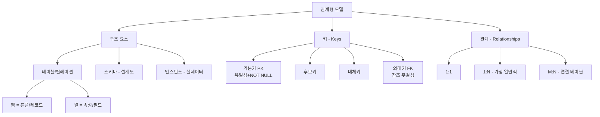
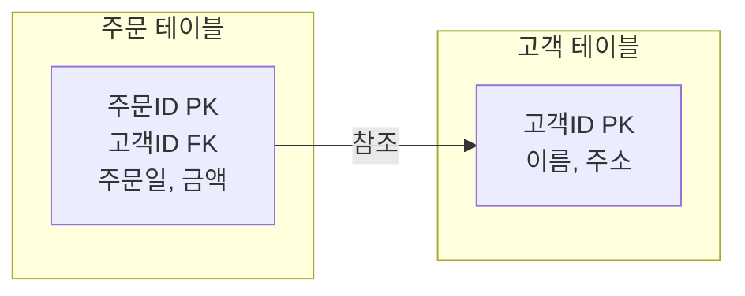
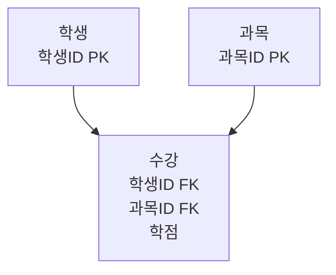

# 3강. 데이터처리와활용: 관계형 데이터 모델(2)

## 🔗 선수 지식 (Prerequisites)
- [ ] **필수**: [1강 데이터와 데이터베이스의 이해](1강.md) - 이해 완료?
- [ ] **필수**: [2강 데이터베이스 시스템과 모델](2강.md) - 이해 완료?
- [ ] **권장**: 집합론의 기초(합집합·교집합·곱집합), 함수 개념
- **관련 단원**: [4강 SQL 기초](4강.md)(예정), [5강 SQL 심화](5강.md)(예정)

---

## 학습 목표
1. 관계형 모델을 설명할 수 있다.
2. 테이블과 스키마를 구분할 수 있다.
3. 기본키와 외래키를 설명할 수 있다.
4. 테이블 간 관계를 설명할 수 있다.

---

## 🧠 메타인지 체크 (학습 전/후 자기 평가)

### 학습 전 자기 평가
| 소주제 | 자신감 (1-5) |
| :--- | :--- |
| 관계형 모델의 수학적 기초 | |
| 테이블 vs 스키마 vs 인스턴스 | |
| 기본키와 외래키 (참조 무결성) | |
| 1:1, 1:N, M:N 관계 | |

### 학습 후 교정 (학습 완료 후 작성)
| 소주제 | 학습 전 | 학습 후 | 실제 정답률 | 과신/과소 여부 |
| :--- | :--- | :--- | :--- | :--- |
| 관계형 모델의 수학적 기초 | | | | |
| 테이블 vs 스키마 vs 인스턴스 | | | | |
| 기본키와 외래키 | | | | |
| 1:1, 1:N, M:N 관계 | | | | |

> **활용법**: 학습 전 1분 → 자신감 기입, 학습 후 1분 → 나머지 기입. "과신" 영역이 실제 취약점.

---

## 📝 요약 (Summary)

### 관계형 모델 🔴
1. **관계형 모델의 기초**: 관계형 모델은 수학적 집합 이론에 기반하여, 데이터를 행과 열로 구성된 테이블로 표현한다. 🔴
2. **선언적 질의**: 관계형 모델에 대해 선언적 질의(SQL 등)를 통해 원하는 정보를 추출할 수 있다. 🔴

### 테이블과 스키마 🔴
3. **테이블 구조**: 관계형 모델에서 각각의 테이블은 행과 열로 구분된다. 🔴
4. **행(튜플)**: 행은 튜플 또는 레코드라고 부르며, 한 개체의 정보값 전체를 나타낸다. 🔴
5. **열(속성)**: 열은 속성 또는 필드라고 부르며, 정보값을 구성하는 개별적인 특성을 의미한다. 🔴
6. **스키마와 인스턴스**: 스키마는 데이터베이스의 구조를 정의한 설계도이며, 인스턴스는 특정 시점의 실제 데이터 집합이다. 🔴

### 키의 개념 🔴
7. **기본키(Primary Key)**: 기본키는 각 튜플을 고유하게 식별하며, 유일성(Uniqueness)과 NOT NULL 조건을 만족해야 한다. 🔴
8. **외래키(Foreign Key)**: 외래키는 다른 테이블의 기본키를 참조하여 두 테이블 간의 관계를 형성한다. 🔴
9. **참조 무결성(Referential Integrity)**: 외래키가 가리키는 값은 항상 참조되는 테이블에 존재해야 하며, 이를 통해 데이터 일관성을 유지한다. 🔴

### 관계의 종류 🔴
10. **1:1 관계**: 한 행이 다른 테이블의 단 하나의 행과만 연결된다. 🟡
11. **1:N 관계**: 가장 일반적인 형태로, 한 행이 다른 테이블의 여러 행과 연결된다. 🔴
12. **M:N 관계**: 다수 대 다수의 연결 관계로, **연결 테이블(Junction Table)**을 통해 구현한다. 🔴
13. **참여도와 카디널리티**: 참여도(전체/부분)와 카디널리티로 두 테이블 사이의 관계를 더 명확히 정의할 수 있다. 🟡

---

## 📐 핵심 정의 및 원리 (이론 중심)

| 정의명 | 내용 | 키워드 |
| :--- | :--- | :--- |
| **관계형 모델** | 집합론 기반으로 데이터를 2차원 테이블로 표현하는 모델 | 집합론, 테이블, 선언적 질의 |
| **테이블(Relation)** | 행과 열로 이루어진 2차원 구조의 데이터 집합 | 릴레이션, 2차원 |
| **튜플(Tuple/Row)** | 한 개체의 모든 속성값을 모은 한 줄(행) | 행, 레코드, 개체 |
| **속성(Attribute/Column)** | 개체를 구성하는 각각의 특성(열) | 열, 필드, 특성 |
| **도메인(Domain)** | 한 속성이 가질 수 있는 값의 집합·범위 | 값 범위, 자료형 |
| **차수(Degree)** | 테이블의 열(속성) 개수 | 속성 수 |
| **카디널리티(Cardinality)** | 테이블의 행(튜플) 개수 또는 관계에서 연결되는 개체 수 | 튜플 수, 관계 다중도 |
| **스키마(Schema)** | DB의 구조를 정의한 설계도(메타데이터). 시간에 따라 거의 변하지 않음 | 설계도, 구조, 정적 |
| **인스턴스(Instance)** | 특정 시점의 실제 데이터 집합. 시간에 따라 자주 변함 | 실데이터, 동적, 시점 |
| **기본키(Primary Key)** | 튜플을 고유 식별하는 속성(집합). 유일성·NOT NULL 필수 | 유일성, NOT NULL, 식별자 |
| **후보키(Candidate Key)** | 기본키가 될 자격을 갖춘 키 후보들 | 최소성, 유일성 |
| **대체키(Alternate Key)** | 후보키 중 기본키로 선택되지 않은 키 | 보조 식별 |
| **외래키(Foreign Key)** | 다른 테이블의 기본키를 참조하는 속성. 관계 형성 매개체 | 참조, 관계, FK |
| **참조 무결성** | 외래키 값이 항상 참조 대상 PK에 존재해야 한다는 제약 | 무결성, 일관성, 제약 |
| **1:1 관계** | 한 쪽 개체가 상대 개체와 최대 하나로만 대응 | 일대일 |
| **1:N 관계** | 한 쪽 개체가 상대 개체의 여러 행과 대응(가장 일반적) | 일대다, FK 단방향 |
| **M:N 관계** | 양쪽 모두 다수와 대응. 연결 테이블 필요 | 다대다, 연결 테이블 |
| **참여도** | 관계 참여가 필수(전체)인지 선택(부분)인지의 정도 | 전체/부분 참여 |

### 주요 원리: 관계형 모델의 정의

> **직관적 해석**: 테이블은 수학의 *집합*이며, 각 튜플은 집합의 *원소*다. 속성은 각 원소를 기술하는 *차원*이고, 키는 집합 내 원소를 식별하는 *주소표*다. 외래키는 두 집합을 연결하는 *링크*다.
> **AI 적용**: 정형 데이터 기반 ML(테이블러 모델, XGBoost/LightGBM)은 관계형 스키마 위에서 동작한다. JOIN으로 결합된 와이드 테이블이 모델 입력 피처가 된다.

---

## 📊 개념 시각화 (Visual Guide)

### 관계형 모델 구성 요소 분류 체계도


### 기본키 - 외래키 참조 관계


### M:N 관계의 연결 테이블 구현


### 핵심 비교표: 스키마 vs 인스턴스

| 구분 | 스키마 (Schema) | 인스턴스 (Instance) |
| :--- | :--- | :--- |
| **정의** | DB 구조의 설계도 | 특정 시점의 실제 데이터 |
| **변화 주기** | 거의 변하지 않음 (정적) | 매 순간 변함 (동적) |
| **표현** | 테이블 정의, 컬럼명, 자료형, 제약 | 행(튜플)들의 집합 |
| **예시** | `학생(학번 INT PK, 이름 VARCHAR)` | (153257, '홍길동'), (153258, '김철수') |
| **대응 비유** | 건물 설계도 | 어느 날짜의 입주자 현황 |

### 핵심 비교표: 기본키 vs 외래키

| 구분 | 기본키 (Primary Key) | 외래키 (Foreign Key) |
| :--- | :--- | :--- |
| **역할** | 튜플의 고유 식별 | 다른 테이블의 PK 참조, 관계 형성 |
| **유일성** | 반드시 유일 | 중복 가능 |
| **NULL 허용** | 불가 (NOT NULL) | 일반적으로 가능 (관계에 따라 다름) |
| **개수** | 테이블당 1개 | 테이블당 여러 개 가능 |
| **제약** | 유일성 + NOT NULL | 참조 무결성 (참조 대상이 반드시 존재) |

### 핵심 비교표: 관계의 종류

| 관계 | 의미 | 구현 방법 | 예시 |
| :--- | :--- | :--- | :--- |
| **1:1** | 한 행 ↔ 한 행 | 어느 한쪽에 FK + UNIQUE | 사람-주민등록번호, 직원-사물함 |
| **1:N** | 한 행 ↔ 여러 행 | N쪽 테이블에 FK | 고객-주문, 부서-사원 |
| **M:N** | 여러 행 ↔ 여러 행 | 연결 테이블 + 양쪽 FK | 학생-과목(수강), 작가-책(저작) |

---

## ✏️ 심화 학습 (Study Subject)

### 1. 가상 시나리오: "어떤 개념을, 언제 사용해야 할까?"
- **상황**: 한 온라인 서점이 도서 판매 DB를 설계하려고 한다. 회원, 도서, 주문, 저자 정보를 관리해야 한다. 한 도서에는 여러 저자가 참여할 수 있고, 한 저자도 여러 도서를 쓸 수 있다.
- **문제**: (1) 어떤 테이블과 키 구조로 설계할 것인가? (2) 회원-주문, 도서-저자 관계는 각각 어떻게 표현할 것인가? (3) 회원이 탈퇴해도 과거 주문 이력은 유지되어야 한다면 어떻게 할 것인가?
- **해결**:
  1. **테이블 분리**: `회원`, `도서`, `주문`, `저자`, `도서_저자(연결 테이블)`로 분리
  2. **관계 설계**:
     - 회원-주문: **1:N** → `주문` 테이블에 `회원ID FK`
     - 도서-저자: **M:N** → `도서_저자` 연결 테이블에 `도서ID FK + 저자ID FK`
  3. **참조 무결성 정책**: 회원 삭제 시 `ON DELETE SET NULL` 또는 `ON DELETE RESTRICT`로 주문 이력 보존. 도서-저자 연결은 `ON DELETE CASCADE`로 정리.
- **AI 학습 포인트**: "위의 도서 판매 DB에서 도서별 평점 예측 모델을 학습시키려면 어떤 테이블을 어떤 키로 JOIN해야 와이드 테이블(피처 매트릭스)이 만들어질까? 그리고 M:N 관계의 저자 정보는 피처 엔지니어링 시 어떻게 집계(aggregation)할 수 있을까?"

### 2. 관점별 비교 및 오개념 분석

- **핵심 비교**: 스키마 vs 인스턴스, 기본키 vs 외래키, 1:N vs M:N

| 혼동 쌍 | 차이점의 핵심 |
| :--- | :--- |
| **스키마 vs 인스턴스** | 스키마는 "구조(설계도)" — 거의 변하지 않음. 인스턴스는 "데이터(내용물)" — 매 순간 변함. 같은 스키마에 무수한 인스턴스가 대응 |
| **기본키 vs 후보키** | 후보키는 PK가 될 *자격*이 있는 키. 기본키는 그중 *선택된* 하나. 나머지는 대체키 |
| **기본키 vs 외래키** | PK는 자기 테이블의 식별자(유일·NOT NULL). FK는 *남의 PK*를 가리키는 포인터(중복 가능) |
| **1:N vs M:N** | 1:N은 한쪽 FK 하나로 구현 가능. M:N은 반드시 연결 테이블(중간 테이블) 필요 |
| **카디널리티(테이블) vs 카디널리티(관계)** | 테이블의 카디널리티는 *튜플 개수*. 관계의 카디널리티는 *연결되는 개체 수의 다중도*(1, N, M) |

- **오개념 분석**:
    - **오개념 1**: "기본키는 항상 하나의 컬럼이어야 한다."
    - **분석**: 기본키는 여러 컬럼의 조합(**복합키, Composite Key**)일 수 있다. 예) `수강(학생ID, 과목ID)`에서 두 속성의 조합이 PK가 된다. 핵심은 *조합 전체가 유일하게 식별*되는 것.
    - **오개념 2**: "외래키의 값은 NULL이 될 수 없다."
    - **분석**: 외래키는 일반적으로 NULL을 허용한다. 예) 부서 미배정 사원의 `부서ID FK`는 NULL. 단, 관계의 참여도가 *전체 참여*라면 NOT NULL 제약을 추가한다.
    - **오개념 3**: "M:N 관계는 한 테이블 안에서 두 FK만 두면 끝난다."
    - **분석**: M:N은 *별도의 연결 테이블*이 필요하다. 두 FK만 두면 한쪽에 다중값을 저장해야 하는데, 이는 관계형 모델의 1차 정규형(원자값 원칙)을 위반한다. 연결 테이블이 추가 속성(예: 수강 학기, 학점)도 가질 수 있다.
    - **오개념 4**: "스키마와 테이블은 같은 말이다."
    - **분석**: 스키마는 *전체 DB의 구조 정의*이며, 테이블은 그 안의 *하나의 관계*다. 또한 SQL에서 `schema`는 *네임스페이스*(테이블의 묶음)를 의미하기도 한다.
- **AI 학습 포인트**: "테이블러 데이터 ML에서 외래키 컬럼을 그대로 입력 피처로 쓰면 안 되는 이유는? (카디널리티 폭증, 의미 없는 정수 ID) → Target Encoding, Embedding Lookup 등 어떤 기법으로 변환해야 하는지 설명해 줘."

---

## ❓ 연습 문제 및 해설

> **블룸 인지 수준 범례**: [기억] 정의·나열 → [이해] 설명·비교 → [적용] 계산·구현 → [분석] 구별·디버그 → [평가] 판단·비평 → [창조] 설계·제안

### 📝 문제

**1. 📌 ⭐ [기억] 관계형 모델에 대한 설명으로 옳지 않은 것은?(#prob-1)**
   > ① 수학적 집합 이론에 기반한다.
   > ② 데이터를 행과 열로 구성된 테이블로 표현한다.
   > ③ 선언적 질의를 통해 원하는 정보를 추출할 수 있다.
   > ④ 데이터를 트리 구조의 노드와 간선으로 표현한다.

<br>

**2. 📌 ⭐ [기억] 관계형 테이블 구성 요소의 명칭으로 옳지 않은 것은?(#prob-2)**
   > ① 행(Row) = 튜플(Tuple) = 레코드(Record)
   > ② 열(Column) = 속성(Attribute) = 필드(Field)
   > ③ 테이블 = 릴레이션(Relation)
   > ④ 도메인(Domain) = 테이블의 행 개수

<br>

**3. 📌 ⭐⭐ [이해] 스키마와 인스턴스에 대한 설명으로 옳은 것을 모두 고른 것은?(#prob-3)**
   > <보기>
   >
   > 가. 스키마는 데이터베이스의 구조를 정의한 설계도이다.
   > 나. 인스턴스는 특정 시점의 실제 데이터 집합이다.
   > 다. 스키마는 시간에 따라 자주 변하고, 인스턴스는 거의 변하지 않는다.
   > 라. 하나의 스키마에 대해 시점마다 다양한 인스턴스가 존재할 수 있다.

   > ① 가, 나
   > ② 가, 나, 라
   > ③ 가, 나, 다
   > ④ 가, 나, 다, 라

<br>

**4. 📌 ⭐⭐ [이해] 기본키(Primary Key)의 조건으로 옳은 것을 모두 고른 것은?(#prob-4)**
   > <보기>
   >
   > 가. 유일성(Uniqueness)을 만족해야 한다.
   > 나. NULL 값을 가질 수 없다(NOT NULL).
   > 다. 한 테이블에 여러 개 정의할 수 있다.
   > 라. 반드시 단일 컬럼이어야 한다.

   > ① 가, 나
   > ② 가, 나, 다
   > ③ 가, 다
   > ④ 가, 나, 다, 라

<br>

**5. 📌 ⭐⭐ [이해] 외래키(Foreign Key)에 대한 설명으로 옳지 않은 것은?(#prob-5)**
   > ① 다른 테이블의 기본키를 참조한다.
   > ② 두 테이블 간의 관계를 형성하는 매개체이다.
   > ③ 참조 무결성을 통해 데이터 일관성을 유지한다.
   > ④ 외래키 값은 반드시 유일해야 한다.

<br>

**6. 📌 ⭐⭐ [분석] 다음 중 관계의 종류와 예시가 잘못 짝지어진 것은?(#prob-6)**
   > ① 1:1 - 사람과 주민등록번호
   > ② 1:N - 고객과 주문
   > ③ M:N - 학생과 수강 과목
   > ④ 1:N - 학생과 학번

<br>

**7. 📌 ⭐⭐ [적용] 학생 테이블과 과목 테이블이 M:N 관계일 때, 이를 관계형 DB에서 올바르게 구현하는 방법은?(#prob-7)**
   > ① 학생 테이블에 과목ID 컬럼을 여러 개 둔다.
   > ② 과목 테이블에 학생ID 컬럼을 여러 개 둔다.
   > ③ 별도의 연결 테이블(수강)을 만들고 학생ID, 과목ID를 외래키로 둔다.
   > ④ 학생과 과목 테이블을 합쳐 하나의 테이블로 만든다.

<br>

**8. 📌 ⭐⭐⭐ [분석] 다음 시나리오에서 발생한 데이터 무결성 위반의 종류는?(#prob-8)**
   > 주문 테이블의 한 행이 `고객ID = 999`를 참조하고 있으나, 고객 테이블에는 `고객ID = 999`가 존재하지 않는다.

   > ① 개체 무결성(Entity Integrity) 위반
   > ② 참조 무결성(Referential Integrity) 위반
   > ③ 도메인 무결성(Domain Integrity) 위반
   > ④ 사용자 정의 무결성 위반

<br>

**9. 📌 ⭐⭐⭐ [평가] 관계형 모델의 키 개념에 대한 설명으로 옳은 것을 모두 고른 것은?(#prob-9)**
   > <보기>
   >
   > 가. 후보키는 기본키가 될 자격을 갖춘 키 후보이다.
   > 나. 대체키는 후보키 중 기본키로 선택되지 않은 키이다.
   > 다. 복합키는 두 개 이상의 속성으로 구성된 기본키이다.
   > 라. 외래키는 자기 테이블에서 유일해야 한다.

   > ① 가, 나
   > ② 가, 나, 다
   > ③ 가, 나, 다, 라
   > ④ 나, 다, 라

<br>

**10. 📌 ⭐⭐⭐ [창조] 한 병원이 의사, 환자, 진료 기록을 관리하는 DB를 설계한다. 한 의사는 여러 환자를 진료할 수 있고, 한 환자도 여러 의사에게 진료받을 수 있다. 가장 적절한 설계는?(#prob-10)**
   > ① 의사 테이블에 환자ID 컬럼을 여러 개 추가한다.
   > ② 환자 테이블에 담당의ID 컬럼을 하나 추가한다(1:N으로 단순화).
   > ③ `진료기록(진료ID PK, 의사ID FK, 환자ID FK, 진료일, 진단내용)` 연결 테이블을 만든다.
   > ④ 의사, 환자, 진료 정보를 하나의 비정형 JSON으로 저장한다.

---

### 🔑 정답 및 해설 (먼저 풀어본 후 펼치기)

<details>
<summary>정답 보기 (클릭)</summary>

1. ④
2. ④
3. ②
4. ①
5. ④
6. ④
7. ③
8. ②
9. ②
10. ③

</details>

<details>
<summary>해설 보기 (클릭)</summary>

<a id="prob-1"></a>
**1. ⭐ [기억] 관계형 모델 정의**
> **정답: ④ 데이터를 트리 구조의 노드와 간선으로 표현한다.**
> **해설**: ④는 *계층형 모델*이나 *그래프 모델*에 대한 설명이다. 관계형 모델은 행·열로 구성된 *2차원 테이블*로 데이터를 표현한다. ①②③은 모두 옳다.

<a id="prob-2"></a>
**2. ⭐ [기억] 테이블 구성요소 명칭**
> **정답: ④ 도메인(Domain) = 테이블의 행 개수**
> **해설**: *도메인*은 한 속성이 가질 수 있는 *값의 집합·범위*다. 테이블의 행 개수는 **카디널리티(Cardinality)**이며, 열의 개수는 **차수(Degree)**이다.

<a id="prob-3"></a>
**3. ⭐⭐ [이해] 스키마와 인스턴스**
> **정답: ② 가, 나, 라**
> **해설**: 다는 반대다 — 스키마는 *거의 변하지 않고*(정적), 인스턴스는 *매 순간 변한다*(동적). 라는 옳다 — 같은 설계도(스키마)에 시점별로 서로 다른 데이터(인스턴스)가 대응된다.

<a id="prob-4"></a>
**4. ⭐⭐ [이해] 기본키의 조건**
> **정답: ① 가, 나**
> **해설**: 기본키는 *유일성 + NOT NULL* 두 조건이 필수다. 다는 틀림 — 한 테이블에 PK는 **단 하나만** 정의된다(여러 후보키 중 선택). 라도 틀림 — PK는 여러 속성을 묶은 **복합키(Composite Key)**도 가능하다.

<a id="prob-5"></a>
**5. ⭐⭐ [이해] 외래키 설명**
> **정답: ④ 외래키 값은 반드시 유일해야 한다.**
> **해설**: 외래키는 *중복이 허용된다*. 1:N 관계에서 N쪽의 FK 값은 같은 값을 여러 행이 가질 수 있다(예: 한 고객의 여러 주문). 유일성이 필요한 것은 1:1 관계의 FK에 한정된다.

<a id="prob-6"></a>
**6. ⭐⭐ [분석] 관계 예시 매칭**
> **정답: ④ 1:N - 학생과 학번**
> **해설**: 학생과 학번은 *1:1 관계*다(한 학생은 한 학번만, 한 학번은 한 학생만 가짐). ①②③은 모두 옳은 예시.

<a id="prob-7"></a>
**7. ⭐⭐ [적용] M:N 관계 구현**
> **정답: ③ 별도의 연결 테이블(수강)을 만들고 학생ID, 과목ID를 외래키로 둔다.**
> **해설**: M:N은 관계형 DB에서 직접 표현 불가능하므로, 두 테이블의 PK를 FK로 갖는 **연결 테이블(Junction/Bridge Table)**로 분해한다. ①②는 1차 정규형(원자값) 위반, ④는 데이터 중복·이상 현상을 야기.

<a id="prob-8"></a>
**8. ⭐⭐⭐ [분석] 무결성 위반 종류**
> **정답: ② 참조 무결성(Referential Integrity) 위반**
> **해설**: 외래키가 참조하는 PK 값이 존재하지 않는 상황은 **참조 무결성** 위반이다. 개체 무결성은 *PK의 NULL/중복* 위반, 도메인 무결성은 *허용 값 범위 위반*(예: 음수 나이).

<a id="prob-9"></a>
**9. ⭐⭐⭐ [평가] 키 개념 종합**
> **정답: ② 가, 나, 다**
> **해설**: 가·나·다는 정의상 옳다. 라는 틀림 — 외래키는 *자기 테이블에서 유일할 필요가 없다*. 외래키는 참조 대상 테이블의 PK이며, 그 값이 자기 테이블에서 중복되는 것은 정상(1:N 관계의 본질).

<a id="prob-10"></a>
**10. ⭐⭐⭐ [창조] 병원 DB 설계**
> **정답: ③ `진료기록(진료ID PK, 의사ID FK, 환자ID FK, 진료일, 진단내용)` 연결 테이블을 만든다.**
> **해설**: 의사-환자는 *M:N 관계*이므로 연결 테이블이 필요하다. ③은 추가로 진료일·진단내용 같은 *관계의 속성*까지 함께 저장한다(관계 자체가 정보를 가짐). ①은 1차 정규형 위반, ②는 다대다를 일대다로 왜곡, ④는 관계형 모델의 장점을 포기.

</details>

---

## ✅ O/X 확인문제 (총 20문항)

**1.** 관계형 모델은 수학적 집합 이론에 기반한다.(#ox-1) **(O / X)**
**2.** 테이블의 행은 튜플 또는 레코드라고 부른다.(#ox-2) **(O / X)**
**3.** 테이블의 열은 도메인이라고 부른다.(#ox-3) **(O / X)**
**4.** 스키마는 특정 시점의 실제 데이터 집합이다.(#ox-4) **(O / X)**
**5.** 인스턴스는 시간에 따라 자주 변한다.(#ox-5) **(O / X)**
**6.** 기본키는 유일성과 NOT NULL 조건을 만족해야 한다.(#ox-6) **(O / X)**
**7.** 한 테이블에 기본키는 여러 개 정의할 수 있다.(#ox-7) **(O / X)**
**8.** 기본키는 반드시 하나의 컬럼이어야 한다.(#ox-8) **(O / X)**
**9.** 외래키는 다른 테이블의 기본키를 참조한다.(#ox-9) **(O / X)**
**10.** 외래키의 값은 자기 테이블에서 유일해야 한다.(#ox-10) **(O / X)**
**11.** 참조 무결성은 외래키 값이 참조 대상 PK에 반드시 존재해야 한다는 제약이다.(#ox-11) **(O / X)**
**12.** 1:N 관계는 관계형 DB에서 가장 일반적인 형태이다.(#ox-12) **(O / X)**
**13.** M:N 관계는 한쪽 테이블에 FK 컬럼 하나만 추가하면 구현된다.(#ox-13) **(O / X)**
**14.** M:N 관계 구현에 사용되는 연결 테이블은 자체 속성(예: 수강 학기)을 가질 수 있다.(#ox-14) **(O / X)**
**15.** 테이블의 차수(Degree)는 행의 개수를 의미한다.(#ox-15) **(O / X)**
**16.** 후보키 중 기본키로 선택되지 않은 키를 대체키라고 한다.(#ox-16) **(O / X)**
**17.** 도메인은 한 속성이 가질 수 있는 값의 집합·범위이다.(#ox-17) **(O / X)**
**18.** 참여도는 관계 참여가 필수(전체)인지 선택(부분)인지를 나타낸다.(#ox-18) **(O / X)**
**19.** 같은 스키마에 대해 시점마다 다른 인스턴스가 존재할 수 있다.(#ox-19) **(O / X)**
**20.** 관계형 모델에서는 선언적 질의(예: SQL)로 원하는 데이터를 추출한다.(#ox-20) **(O / X)**

<details>
<summary>O/X 정답 및 해설 보기 (클릭)</summary>

> <a id="ox-1"></a>
> **1. 정답**: O
> **해설**: 관계형 모델은 코드(E. F. Codd)가 집합론·관계대수를 기반으로 제안했다.

> <a id="ox-2"></a>
> **2. 정답**: O
> **해설**: 행 = 튜플 = 레코드는 같은 의미다.

> <a id="ox-3"></a>
> **3. 정답**: X
> **해설**: 열은 *속성(Attribute)* 또는 *필드(Field)*다. 도메인은 속성이 가질 수 있는 *값의 범위*다.

> <a id="ox-4"></a>
> **4. 정답**: X
> **해설**: 스키마는 *구조 설계도*다. 특정 시점의 실데이터 집합은 *인스턴스*다.

> <a id="ox-5"></a>
> **5. 정답**: O
> **해설**: 인스턴스는 데이터 삽입·수정·삭제로 매 순간 변한다.

> <a id="ox-6"></a>
> **6. 정답**: O
> **해설**: 기본키의 두 가지 핵심 제약 조건이다.

> <a id="ox-7"></a>
> **7. 정답**: X
> **해설**: 한 테이블의 기본키는 **단 하나**다. 후보키는 여러 개일 수 있고, 그중 하나가 기본키로 *선택*된다.

> <a id="ox-8"></a>
> **8. 정답**: X
> **해설**: 여러 속성의 조합으로 구성되는 **복합키(Composite Key)**도 가능하다.

> <a id="ox-9"></a>
> **9. 정답**: O
> **해설**: 외래키의 정의다.

> <a id="ox-10"></a>
> **10. 정답**: X
> **해설**: 외래키는 *중복이 허용된다*. 1:N 관계에서 N쪽 FK는 같은 PK 값을 여러 행이 가질 수 있다.

> <a id="ox-11"></a>
> **11. 정답**: O
> **해설**: 참조 무결성의 정의다.

> <a id="ox-12"></a>
> **12. 정답**: O
> **해설**: 실세계 대부분의 관계(고객-주문, 부서-사원, 게시판-댓글)는 1:N이다.

> <a id="ox-13"></a>
> **13. 정답**: X
> **해설**: M:N은 반드시 *연결 테이블*이 필요하다. 한쪽 FK만으로는 다중값 저장이 필요해 1차 정규형을 위반한다.

> <a id="ox-14"></a>
> **14. 정답**: O
> **해설**: 연결 테이블은 관계 자체의 속성(예: 수강 학기, 학점, 주문 수량)을 가질 수 있다.

> <a id="ox-15"></a>
> **15. 정답**: X
> **해설**: *차수(Degree)*는 **열(속성)의 개수**다. 행의 개수는 *카디널리티(Cardinality)*다.

> <a id="ox-16"></a>
> **16. 정답**: O
> **해설**: 대체키(Alternate Key)의 정의다.

> <a id="ox-17"></a>
> **17. 정답**: O
> **해설**: 도메인의 정의다. 예) 나이 도메인은 0~150의 정수.

> <a id="ox-18"></a>
> **18. 정답**: O
> **해설**: 참여도(전체/부분)로 관계의 필수/선택성을 표현한다.

> <a id="ox-19"></a>
> **19. 정답**: O
> **해설**: 스키마는 고정, 인스턴스는 시점별로 변한다.

> <a id="ox-20"></a>
> **20. 정답**: O
> **해설**: SQL과 같은 선언적 질의 언어로 *무엇을* 원하는지 기술하면 DBMS가 *어떻게* 처리할지 결정한다.

</details>

---

## 🧪 자유 회상 연습 (Free Recall)

> **방법**: 위의 노트를 모두 덮고, 타이머 3분 설정 후 이번 단원에서 배운 내용을 기억나는 대로 자유롭게 적으세요.
> 정확한 문장이 아니어도 됩니다. 키워드, 수식, 관계 등 떠오르는 것을 모두 적습니다.

**자유 회상 작성란:**

```
[여기에 기억나는 내용을 자유롭게 작성]


```

> **회상 후 점검**: 노트를 다시 펼쳐 빠뜨린 내용을 확인하세요. 빠뜨린 부분이 실제 취약점입니다.
> - 회상 못한 핵심 개념: [                ]
> - 회상 못한 관계 종류: [                ]

---

## 💻 코드로 확인하기 (Code Verification)

### 예시 1: SQLite로 관계형 모델 구현 (1:N, M:N)
```python
import sqlite3

conn = sqlite3.connect(":memory:")
cur = conn.cursor()

# 1) 학생 테이블 (PK: 학번)
cur.execute("""
CREATE TABLE 학생 (
    학번 INTEGER PRIMARY KEY,
    이름 TEXT NOT NULL,
    학과 TEXT
)
""")

# 2) 과목 테이블 (PK: 과목코드)
cur.execute("""
CREATE TABLE 과목 (
    과목코드 TEXT PRIMARY KEY,
    과목명 TEXT NOT NULL,
    학점 INTEGER
)
""")

# 3) 수강 테이블 (M:N 연결 테이블, 복합키)
cur.execute("""
CREATE TABLE 수강 (
    학번 INTEGER,
    과목코드 TEXT,
    학기 TEXT,
    성적 TEXT,
    PRIMARY KEY (학번, 과목코드, 학기),
    FOREIGN KEY (학번) REFERENCES 학생(학번),
    FOREIGN KEY (과목코드) REFERENCES 과목(과목코드)
)
""")

# 데이터 입력
cur.executemany("INSERT INTO 학생 VALUES (?, ?, ?)", [
    (153257, "홍길동", "통계데이터과학과"),
    (153258, "김철수", "컴퓨터과학과"),
])
cur.executemany("INSERT INTO 과목 VALUES (?, ?, ?)", [
    ("CS101", "자료구조", 3),
    ("ST201", "통계학개론", 3),
])
cur.executemany("INSERT INTO 수강 VALUES (?, ?, ?, ?)", [
    (153257, "ST201", "2026-1", "A+"),
    (153257, "CS101", "2026-1", "A"),
    (153258, "CS101", "2026-1", "B+"),
])

# JOIN으로 M:N 관계 조회
cur.execute("""
SELECT s.이름, c.과목명, e.성적
FROM 학생 s
JOIN 수강 e ON s.학번 = e.학번
JOIN 과목 c ON e.과목코드 = c.과목코드
ORDER BY s.이름
""")
for row in cur.fetchall():
    print(row)
conn.close()
```

> **실행 결과 (예시)**:
> ```
> ('김철수', '자료구조', 'B+')
> ('홍길동', '자료구조', 'A')
> ('홍길동', '통계학개론', 'A+')
> ```
> **해석**: M:N 관계(학생-과목)가 연결 테이블 `수강`을 통해 구현되었고, 두 번의 JOIN으로 양쪽 정보가 결합된다. 복합키 `(학번, 과목코드, 학기)`는 *같은 학생이 다른 학기에 같은 과목을 재수강*하는 경우를 허용한다.

### 예시 2: 참조 무결성 위반 시뮬레이션
```python
import sqlite3

conn = sqlite3.connect(":memory:")
conn.execute("PRAGMA foreign_keys = ON")  # SQLite는 FK 강제 옵션 필요
cur = conn.cursor()

cur.execute("CREATE TABLE 고객 (고객ID INTEGER PRIMARY KEY, 이름 TEXT)")
cur.execute("""
CREATE TABLE 주문 (
    주문ID INTEGER PRIMARY KEY,
    고객ID INTEGER,
    금액 INTEGER,
    FOREIGN KEY (고객ID) REFERENCES 고객(고객ID)
)
""")

cur.execute("INSERT INTO 고객 VALUES (1, '홍길동')")
cur.execute("INSERT INTO 주문 VALUES (101, 1, 50000)")  # 정상

try:
    # 존재하지 않는 고객ID=999 참조 시도
    cur.execute("INSERT INTO 주문 VALUES (102, 999, 30000)")
except sqlite3.IntegrityError as e:
    print("참조 무결성 위반 발생:", e)

conn.close()
```

> **실행 결과 (예시)**:
> ```
> 참조 무결성 위반 발생: FOREIGN KEY constraint failed
> ```
> **해석**: DBMS가 외래키 제약을 통해 *존재하지 않는 고객을 참조하는 주문*을 자동으로 차단한다. 이것이 참조 무결성이 데이터 일관성을 보장하는 메커니즘이다.

---

## 🤖 AI 연결고리 (Concept → AI Application)

| 학습 개념 | AI/ML 적용 분야 | 구체적 사례 |
| :--- | :--- | :--- |
| 관계형 모델 / 정형 데이터 | 테이블러 ML | XGBoost, LightGBM 기반 신용평가·이탈 예측 |
| 스키마 설계 | Feature Store | Feast, Tecton — 피처 스키마와 인스턴스 관리 |
| 기본키 | Entity Identification | MLOps에서 학습 샘플의 고유 식별자, leakage 방지 |
| 외래키 / JOIN | Feature Engineering | 다중 테이블 JOIN → 와이드 피처 매트릭스 생성 |
| 참조 무결성 | Data Validation | Great Expectations, dbt 테스트로 ETL 단계에서 검증 |
| 1:N 관계 | Aggregation 피처 | 고객별 주문 횟수·평균 금액 등 집계 피처 |
| M:N 관계 / 연결 테이블 | 추천 시스템 | 사용자-아이템 상호작용 행렬, 협업 필터링 |
| 복합키 | Time-series ML | (entity_id, timestamp) 복합키로 시계열 관리 |

---

## 📖 심화 학습 예시 답안

#### 1. 관계형 모델의 동작 원리
관계형 모델은 *수학적 관계(Relation)*를 데이터 모델로 채택한 것이다.

1. **집합론적 정의**: 테이블은 *튜플의 집합*이며, 각 튜플은 도메인 $D_1 \times D_2 \times \cdots \times D_n$의 한 원소다.
2. **선언적 질의**: SQL과 같은 선언적 언어는 *무엇을 원하는지*만 기술하고 *어떻게 가져올지*는 DBMS의 최적화기가 결정한다. 이로써 데이터 독립성과 생산성이 향상된다.
3. **무결성 보장**: 개체 무결성(PK의 NOT NULL·유일성), 참조 무결성(FK의 참조 일관성), 도메인 무결성(값 범위)으로 데이터 신뢰성을 자동 보장한다.

> ML 관점: 테이블러 데이터 ML은 관계형 스키마에서 *피처 매트릭스 $X \in \mathbb{R}^{n \times d}$*를 만드는 작업이다. JOIN은 피처 통합, GROUP BY 집계는 피처 엔지니어링에 해당한다.

#### 2. 1:N vs M:N 관계 구현 비교표

| 구분 | 1:N 관계 | M:N 관계 | AI 활용 |
| :--- | :--- | :--- | :--- |
| **예시** | 고객(1) - 주문(N) | 학생(M) - 과목(N) | 사용자-아이템 상호작용 |
| **구현** | N쪽에 FK 1개 추가 | 연결 테이블 + 양쪽 FK | 협업 필터링 행렬 |
| **카디널리티** | (1, N) | (M, N) | 희소 행렬(sparse) |
| **JOIN 비용** | 단순 1회 JOIN | 2회 JOIN (연결 테이블 경유) | 대규모 시 Embedding으로 대체 |
| **집계 피처** | 고객별 주문 수·총액 | 학생별 평균 학점, 과목별 수강생 수 | Implicit Feedback 피처 |

#### 3. 스키마 설계 Best Practice

- **Bad Practice (나쁜 예시)**
  ```sql
  -- M:N을 다중값 컬럼으로 욱여넣기 (1차 정규형 위반)
  CREATE TABLE 학생 (
      학번 INTEGER PRIMARY KEY,
      이름 TEXT,
      수강과목들 TEXT  -- "CS101,ST201,MA301" 처럼 저장
  );
  -- → JOIN 불가, 무결성 보장 불가, 집계 불가
  ```
- **Good Practice (좋은 예시)**
  ```sql
  CREATE TABLE 학생 (
      학번 INTEGER PRIMARY KEY,
      이름 TEXT NOT NULL,
      학과 TEXT
  );
  CREATE TABLE 과목 (
      과목코드 TEXT PRIMARY KEY,
      과목명 TEXT NOT NULL
  );
  CREATE TABLE 수강 (
      학번 INTEGER,
      과목코드 TEXT,
      학기 TEXT,
      PRIMARY KEY (학번, 과목코드, 학기),
      FOREIGN KEY (학번) REFERENCES 학생(학번)
          ON DELETE CASCADE,
      FOREIGN KEY (과목코드) REFERENCES 과목(과목코드)
          ON DELETE RESTRICT
  );
  ```
- **설명**: M:N을 *연결 테이블*로 분해하면 (1) 1차 정규형 충족, (2) 참조 무결성 자동 보장, (3) JOIN/집계 자유, (4) 관계 자체의 속성(학기) 저장이 모두 가능해진다. `ON DELETE` 정책으로 삭제 시 동작도 명시한다.

---

## 📚 핵심 용어집 (Glossary)

| 용어 (한) | 용어 (영) | 수식/표현 | 정의 |
| :--- | :--- | :--- | :--- |
| **관계형 모델** | Relational Model | $R \subseteq D_1 \times D_2 \times \cdots \times D_n$ | 집합론 기반 2차원 테이블 데이터 모델 |
| **테이블/릴레이션** | Table / Relation | $R$ | 튜플들의 집합 |
| **튜플** | Tuple | $t = (a_1, a_2, ..., a_n)$ | 테이블의 한 행, 한 개체의 정보 전체 |
| **속성** | Attribute | $A_i$ | 테이블의 한 열, 개체의 한 특성 |
| **도메인** | Domain | $D_i = \text{dom}(A_i)$ | 속성이 가질 수 있는 값의 집합 |
| **차수** | Degree | $\|\{A_1, ..., A_n\}\| = n$ | 테이블의 속성(열) 개수 |
| **카디널리티** | Cardinality | $\|R\|$ | 테이블의 튜플(행) 개수, 또는 관계 다중도 |
| **스키마** | Schema | $R(A_1: D_1, ..., A_n: D_n)$ | DB 구조의 정의(설계도) `→←1강` |
| **인스턴스** | Instance | $r(R) \subseteq D_1 \times \cdots \times D_n$ | 특정 시점의 실제 데이터 집합 |
| **기본키** | Primary Key (PK) | $\text{PK} \subseteq \{A_1, ..., A_n\}$, 유일성+NOT NULL | 튜플을 고유 식별하는 속성(집합) |
| **후보키** | Candidate Key | — | PK가 될 자격(유일성+최소성)을 가진 키 |
| **대체키** | Alternate Key | — | 후보키 중 PK로 선택되지 않은 키 |
| **복합키** | Composite Key | $\text{PK} = (A_i, A_j)$ | 두 개 이상의 속성으로 구성된 PK |
| **외래키** | Foreign Key (FK) | $R_1.\text{FK} \to R_2.\text{PK}$ | 다른 테이블의 PK를 참조하는 속성 |
| **참조 무결성** | Referential Integrity | $\forall t \in R_1: t.\text{FK} \in \pi_{\text{PK}}(R_2) \cup \{\text{NULL}\}$ | FK 값이 참조 대상 PK에 반드시 존재 |
| **1:1 관계** | One-to-One | — | 한 개체가 상대와 정확히 하나씩 대응 |
| **1:N 관계** | One-to-Many | — | 한 개체가 상대의 여러 개체와 대응 |
| **M:N 관계** | Many-to-Many | — | 양쪽 모두 다수와 대응, 연결 테이블 필요 |
| **연결 테이블** | Junction / Bridge Table | — | M:N을 두 개의 1:N으로 분해한 중간 테이블 |
| **참여도** | Participation | 전체/부분 | 관계 참여가 필수인지 선택인지 |

---

## 🤖 AI 학습 파트너를 위한 추가 자료

### 1. 개념 이해를 위한 심층 질문 프롬프트
> **프롬프트 예시**: "관계형 모델이 코드(E. F. Codd)에 의해 1970년에 제안된 이후 NoSQL(문서·키-값·그래프 DB)이 등장한 배경을 설명해 줘. 관계형 모델의 어떤 한계가 NoSQL의 등장을 촉발했고, 각 NoSQL 모델은 그 한계를 어떻게 극복하는지 비교해 줘. 또한 현재 시점에서 *언제 관계형, 언제 NoSQL*을 선택해야 하는지 결정 트리 형태로 정리해 줘."

### 2. 문제 해결 능력 강화를 위한 시나리오 프롬프트
> **프롬프트 예시**: "당신은 데이터 엔지니어다. 한 SNS 플랫폼이 사용자, 게시물, 좋아요, 팔로우 데이터를 관리한다. 사용자-게시물(1:N), 사용자-좋아요-게시물(M:N), 사용자-팔로우-사용자(자기 참조 M:N) 관계가 혼재한다. 다음을 수행해 줘: (1) ER 다이어그램 텍스트 표현, (2) CREATE TABLE 문, (3) '내가 팔로우한 사람들의 최근 게시물에 내가 좋아요 안 누른 것' 쿼리. 각 단계에서 PK/FK 선택의 근거를 설명해 줘."

### 3. 개념 검증 프롬프트
> **프롬프트 예시**: "다음 진술이 옳은지 검증해 줘.
> (1) 한 테이블에는 기본키가 단 하나뿐이다.
> (2) 외래키는 NULL을 가질 수 없다.
> (3) M:N 관계는 한쪽 테이블에 FK만 추가하면 표현된다.
> (4) 스키마는 시간에 따라 자주 변한다.
> 각 진술의 참/거짓을 판단하고, 거짓이라면 정확한 진술로 고쳐 주고, 관계형 모델 이론의 어떤 원칙과 연결되는지 설명해 줘."

---

## 🔄 복습 체크 (Spaced Repetition)
- [ ] 1일 후 복습 (날짜: 2026-05-30)
- [ ] 3일 후 복습 (날짜: 2026-06-01)
- [ ] 7일 후 복습 (날짜: 2026-06-05)
- [ ] 14일 후 복습 (날짜: 2026-06-12)
- [ ] 30일 후 복습 (날짜: 2026-06-28)

### 복습 시 자가 평가
| 회차 | 날짜 | 이해도 (1-5) | 취약 부분 메모 |
| :--- | :--- | :--- | :--- |
| 1차 | | | |
| 2차 | | | |
| 3차 | | | |

---

## 📚 참고 자료 (References)

- 한국방송통신대학교 교재 - 『데이터처리와활용』 3강. 관계형 데이터 모델(2)
- Codd, E. F. (1970). "A Relational Model of Data for Large Shared Data Banks", *Communications of the ACM*
- Date, C. J. (2003). *An Introduction to Database Systems* (8th ed.) - 관계형 모델·키·무결성
- Elmasri, R. & Navathe, S. B. (2015). *Fundamentals of Database Systems* (7th ed.) - 관계의 종류·연결 테이블
- Garcia-Molina, H. et al. (2008). *Database Systems: The Complete Book* - 참조 무결성·제약 조건
