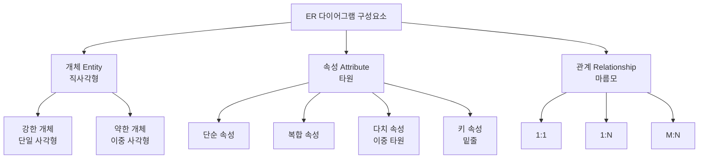
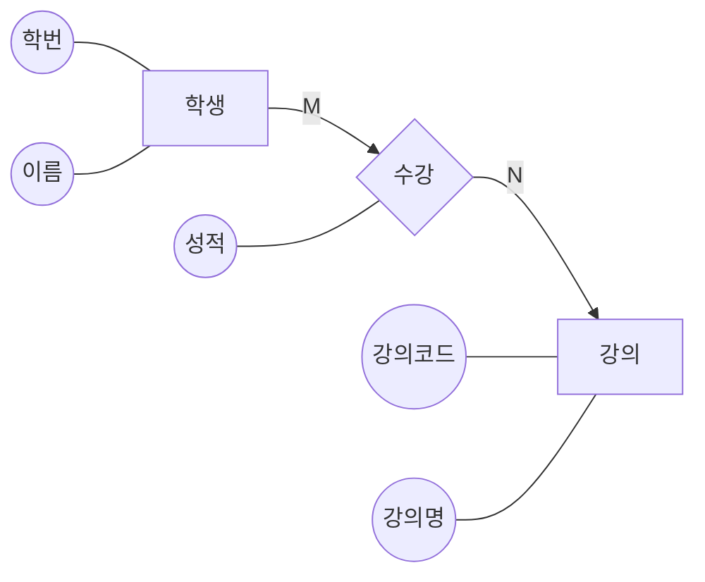
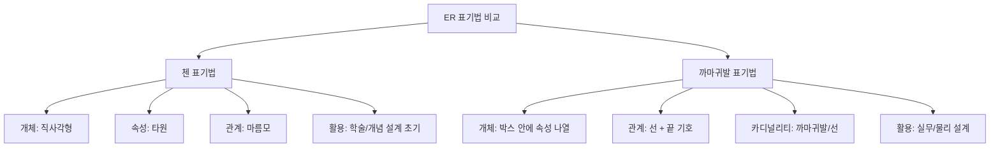

# 4강. 데이터처리와활용: ER 다이어그램과 스키마

## 🔗 선수 지식 (Prerequisites)
- [ ] **필수**: 1강 데이터와 데이터베이스의 이해 - [1강.md](1강.md)
- [ ] **필수**: 2강 데이터베이스 시스템과 모델 - [2강.md](2강.md)
- [ ] **권장**: 3강 관계 데이터 모델과 키 개념 - [3강.md](3강.md)
- **관련 단원**: 5강 정규화와 스키마 설계(예정)

---

## 학습 목표
1. ER 다이어그램을 설명할 수 있다.
2. 첸 표기법과 까마귀발 표기법을 구분할 수 있다.
3. ERD를 테이블로 변환할 수 있다.

---

## 🧠 메타인지 체크 (학습 전/후 자기 평가)

### 학습 전 자기 평가
| 소주제 | 자신감 (1-5) |
| :--- | :--- |
| ER 다이어그램의 개념과 구성요소 | |
| 첸 표기법 vs 까마귀발 표기법 | |
| 관계의 카디널리티 (1:1, 1:N, M:N) | |
| ERD → 관계형 스키마 변환 규칙 | |

### 학습 후 교정 (학습 완료 후 작성)
| 소주제 | 학습 전 | 학습 후 | 실제 정답률 | 과신/과소 여부 |
| :--- | :--- | :--- | :--- | :--- |
| ER 다이어그램의 개념과 구성요소 | | | | |
| 첸 표기법 vs 까마귀발 표기법 | | | | |
| 관계의 카디널리티 | | | | |
| ERD → 관계형 스키마 변환 규칙 | | | | |

> **활용법**: 학습 전 1분 → 자신감 기입, 학습 후 1분 → 나머지 기입. "과신" 영역이 실제 취약점.

---

## 📝 요약 (Summary)

### ER 다이어그램 개념 🔴
1. **ER 다이어그램의 정의**: ER 다이어그램은 개체(Entity)와 관계(Relationship)를 시각적으로 표현하는 표기법이다. 🔴
2. **활용 단계**: 개념적 설계 단계에서 주로 사용된다. 🔴
3. **목적**: 시스템 요구사항을 구조적으로 표현하는 데 유용하다. 🟡

### 표기법 🔴
4. **첸 표기법(Chen Notation)**: 개체를 직사각형, 속성을 타원, 관계를 마름모로 나타내는 표기법이다. 🔴
5. **첸 표기법의 활용**: 설계 초기 단계에 개념적 모델을 표현하는 데 유용하다. 🟡
6. **까마귀발 표기법(Crow's Foot Notation)**: 참여도와 카디널리티를 시각적으로 표현할 수 있는 표기법이다. 🔴
7. **까마귀발 표기법의 강점**: 개체 간의 관계를 보다 명확하게 표현할 수 있다. 🟡

### ERD → 스키마 변환 🔴
8. **개체 변환**: 개체는 테이블로 변환한다. 🔴
9. **속성 변환**: 속성은 열(Column)로 정의한다. 🔴
10. **1:N 관계 변환**: 1:N 관계는 외래키(Foreign Key)로 구현한다. 🔴
11. **M:N 관계 변환**: M:N 관계는 연결 테이블(Junction Table)을 사용한다. 🔴
12. **1:1 관계 변환**: 1:1 관계는 한 테이블로 통합하거나 외래키를 사용하되 UNIQUE 제약을 활용한다. 🟡

---

## 📐 핵심 정의 및 원리 (이론 중심)

| 정의명 | 내용 | 키워드 |
| :--- | :--- | :--- |
| **ER 다이어그램(ERD)** | 개체와 관계를 시각적으로 표현하는 개념적 설계 표기법 | 개체, 관계, 개념적 설계 |
| **개체(Entity)** | 현실 세계에서 독립적으로 존재하는 객체 또는 개념 (예: 학생, 강의) | 직사각형, 명사 |
| **속성(Attribute)** | 개체가 가지는 고유한 특성 (예: 학생의 이름, 학번) | 타원, 컬럼 |
| **관계(Relationship)** | 개체 간의 의미 있는 연관성 (예: 학생-수강-강의) | 마름모, 동사 |
| **카디널리티(Cardinality)** | 관계에 참여하는 인스턴스 수의 비율 (1:1, 1:N, M:N) | 매핑 비율 |
| **참여도(Participation)** | 개체가 관계에 반드시 참여하는지 여부 (전체/부분) | 필수/선택 |
| **첸 표기법** | 개체=직사각형, 속성=타원, 관계=마름모로 표기 | 학술적, 상세 |
| **까마귀발 표기법** | 선의 끝 모양으로 카디널리티 표현 (1, 多는 까마귀발) | IE 표기, 실무 |
| **외래키(Foreign Key)** | 다른 테이블의 기본키를 참조하는 컬럼 | FK, 참조 무결성 |
| **연결 테이블(Junction Table)** | M:N 관계를 해소하기 위해 만든 중간 테이블 | 교차 테이블, 1:N + N:1 |
| **약한 개체(Weak Entity)** | 자체 기본키만으로 식별되지 않고 강한 개체에 의존하는 개체. 첸 표기법에서 개체 자체는 **이중 직사각형**, 강한 개체와의 식별 관계(Identifying Relationship)는 **이중 마름모**로 표기한다. | 이중 직사각형(개체), 이중 마름모(식별 관계), 부분키 |

### 주요 원리: ERD → 관계형 스키마 변환 규칙

> **직관적 해석**: "개체→테이블, 속성→컬럼, 관계→키(FK 또는 연결 테이블)"로 외워두면 변환 시 헷갈리지 않는다. 카디널리티(1:1/1:N/M:N)에 따라 키를 어디에 두느냐가 달라진다.
> **AI 적용**: 머신러닝 데이터셋 설계 시에도 동일 원리가 적용된다 — 특징을 어떤 단위로 묶을지(테이블)와 조인 관계(키)를 미리 정해야 누수(leakage) 없는 학습 데이터를 만들 수 있다.

| 관계 유형 | 변환 방식 | 키 위치 |
| :--- | :--- | :--- |
| **1:1** | 한 테이블로 통합 OR 외래키 + UNIQUE | 어느 쪽이든 (선택형 참여 쪽에 FK) |
| **1:N** | N쪽 테이블에 외래키 추가 | N쪽 (Many쪽) |
| **M:N** | 연결 테이블 신설 (양쪽 기본키 FK) | 연결 테이블 |

---

## 📊 개념 시각화 (Visual Guide)

### ER 다이어그램 구성요소 (첸 표기법)


### 학생-수강-강의 ERD 예시 (첸 표기법)


### 첸 vs 까마귀발 표기법 비교


### 핵심 비교표: 첸 vs 까마귀발 표기법

| 구분 | 첸 표기법 (Chen) | 까마귀발 표기법 (Crow's Foot) |
| :--- | :--- | :--- |
| **개체 표현** | 직사각형 (속성은 외부에 타원으로) | 직사각형 (속성을 박스 내부에 나열) |
| **속성 표현** | 타원으로 별도 표기 | 박스 내부에 컬럼 형태 |
| **관계 표현** | 마름모(관계명 표기) | 두 박스를 잇는 선 |
| **카디널리티** | 1, N, M 등 숫자/문자로 표기 | 선 끝 기호 (작대기=1, 까마귀발=多) |
| **참여도** | 별도 표기 (이중선 등) | 선 끝 기호 (원=선택, 작대기=필수) |
| **장점** | 의미가 명시적, 학습/개념화에 유리 | 공간 효율, 카디널리티가 직관적 |
| **활용 단계** | 개념적 설계 초기 | 논리/물리 설계, 실무 도구 (ERwin, dbdiagram 등) |

### 까마귀발 표기법 카디널리티 기호

| 기호 | 의미 |
| :--- | :--- |
| `─┤` (작대기 1개) | 정확히 1 (One and only one) |
| `─<` (까마귀발) | 다(Many) |
| `─○` (원) | 0 또는 (선택) |
| `─○<` | 0 또는 多 |
| `─┤<` | 1 이상 (필수 多) |
| `─┤┤` | 정확히 1 (필수 1) |
| `─○┤` | 0 또는 1 (선택 1) |

---

## ✏️ 심화 학습 (Study Subject)

### 1. 가상 시나리오: "어떤 개념을, 언제 사용해야 할까?"
- **상황**: 한 대학교 학사 정보 시스템을 설계해야 한다. 요구사항은 다음과 같다.
  - 학생은 여러 강의를 수강할 수 있고, 각 강의는 여러 학생이 수강한다.
  - 학생은 한 학과에 소속되며, 한 학과에는 여러 학생이 속한다.
  - 강의는 한 명의 교수가 담당하고, 교수는 여러 강의를 담당할 수 있다.
  - 각 학생-강의 수강 관계에는 성적이 기록된다.
- **문제**: 이를 ERD로 표현하고 관계형 스키마(테이블)로 변환하라.
- **해결**:
  1. **개체 식별**: 학생, 강의, 학과, 교수 (4개 개체)
  2. **관계 식별**:
     - 학생 ↔ 강의 : M:N (수강) — 성적 속성을 가짐
     - 학생 ↔ 학과 : N:1 (소속)
     - 강의 ↔ 교수 : N:1 (담당)
  3. **스키마 변환**:
     - `학과(학과코드 PK, 학과명)`
     - `교수(교수번호 PK, 이름, 학과코드 FK)`
     - `학생(학번 PK, 이름, 학과코드 FK)` — N:1이므로 N쪽에 FK
     - `강의(강의코드 PK, 강의명, 교수번호 FK)` — N:1이므로 N쪽에 FK
     - `수강(학번 FK, 강의코드 FK, 성적, PK=(학번,강의코드))` — M:N이므로 연결 테이블
- **AI 학습 포인트**: "위 스키마에서 학생의 학기별 평균 평점을 계산하기 위한 SQL을 작성하고, 동일한 결과를 pandas DataFrame 조인으로 구현하면 어떤 차이가 있는지 비교해 줘."

### 2. 관점별 비교 및 오개념 분석

- **핵심 비교**: 첸 vs 까마귀발, 1:N vs M:N, 강한 개체 vs 약한 개체

| 혼동 쌍 | 차이점의 핵심 |
| :--- | :--- |
| **개체(Entity) vs 속성(Attribute)** | 개체는 독립적으로 존재하고 식별 가능. 속성은 개체에 종속되어 그 자체로는 의미가 약함 (예: "이름"만으로는 누구의 이름인지 모름) |
| **1:N vs M:N** | 1:N은 한쪽이 여러 개를 참조 가능 (외래키만으로 해결). M:N은 양쪽 모두 여러 개를 가짐 (연결 테이블 필수) |
| **첸 vs 까마귀발** | 첸은 *무엇*을 표현하는 데 강함(개념적). 까마귀발은 *어떻게 연결되는지*를 표현하는 데 강함(논리적/물리적) |
| **카디널리티 vs 참여도** | 카디널리티는 "몇 개"(1:N 등). 참여도는 "반드시 참여하는가"(전체/부분, 필수/선택) |
| **강한 개체 vs 약한 개체** | 강한 개체는 자체 PK로 식별 가능. 약한 개체는 다른 개체의 키와 함께해야 식별됨 (예: 주문 항목은 주문 없이는 존재 못함) |
| **역할명(Role Name)** | 동일 개체 타입이 하나의 관계에 두 번 이상 참여하는 재귀 관계(예: 직원-관리-직원)에서, 각 참여의 의미(예: "관리자"/"부하직원")를 구분하기 위해 ERD의 관계선 위에 표기하는 이름. 역할명이 없으면 동일 개체가 어느 역할로 참여하는지 모호해진다. |

- **오개념 분석**:
    - **오개념 1**: "M:N 관계는 외래키를 양쪽 테이블에 추가하면 된다."
    - **분석**: 학생 테이블에 강의코드 FK를, 강의 테이블에 학번 FK를 넣으면 *한 학생이 여러 강의를 수강*하는 사실을 한 행에 담을 수 없다. 반드시 **연결 테이블(수강)**을 신설해야 한다. 양쪽에 FK를 두는 것은 1:1 관계의 변형일 뿐 M:N을 해결하지 못한다.
    - **오개념 2**: "1:N 관계에서 외래키는 1쪽에 둔다."
    - **분석**: 정반대다. FK는 **N(Many)쪽**에 둔다. 학과(1):학생(N)에서 학생 테이블에 학과코드 FK를 둔다. 1쪽에 N개의 FK를 두려면 행을 N개로 늘려야 하므로 모순이 발생한다.
    - **오개념 3**: "첸 표기법과 까마귀발 표기법은 서로 호환되지 않는 별개 모델이다."
    - **분석**: 두 표기법은 *동일한 개념*(개체-관계 모델)을 표현하는 다른 *문법*일 뿐이다. 동일 ERD를 두 표기법 모두로 표현 가능하며, 일반적으로 개념 설계는 첸 → 논리/물리 설계는 까마귀발로 발전시킨다.
    - **오개념 4**: "1:1 관계는 무조건 한 테이블로 통합해야 한다."
    - **분석**: 통합은 *선택지의 하나*다. 한쪽 참여가 선택적(예: 모든 직원이 사무실을 갖지는 않음)인 경우 분리하고 FK + UNIQUE로 표현하는 것이 NULL을 줄이는 데 더 유리할 수 있다.
- **AI 학습 포인트**: "ER 모델을 NoSQL(예: MongoDB 문서 모델)로 변환할 때 1:N과 M:N은 임베딩과 참조 중 어떻게 선택해야 하는지, 트레이드오프(읽기 성능, 일관성, 갱신 비용)와 함께 설명해 줘."

---

## ❓ 연습 문제 및 해설

> **블룸 인지 수준 범례**: [기억] 정의·나열 → [이해] 설명·비교 → [적용] 계산·구현 → [분석] 구별·디버그 → [평가] 판단·비평 → [창조] 설계·제안

### 📝 문제

**1. 📌 ⭐ [기억] ER 다이어그램에 대한 설명으로 옳은 것은?(#prob-1)**
   > ① 물리적 저장 구조를 직접 표현하는 도구이다.
   > ② 개체와 관계를 시각적으로 표현하는 개념적 설계 표기법이다.
   > ③ SQL 쿼리 실행 계획을 분석하는 도구이다.
   > ④ 정규화 단계 점검을 위한 표기법이다.

<br>

**2. 📌 ⭐ [기억] 첸 표기법에서 개체, 속성, 관계의 도형이 옳게 짝지어진 것은?(#prob-2)**
   > ① 개체-타원, 속성-직사각형, 관계-마름모
   > ② 개체-직사각형, 속성-타원, 관계-마름모
   > ③ 개체-마름모, 속성-타원, 관계-직사각형
   > ④ 개체-직사각형, 속성-마름모, 관계-타원

<br>

**3. 📌 ⭐⭐ [이해] 까마귀발 표기법의 특징으로 가장 적절한 것은?(#prob-3)**
   > ① 관계를 마름모로 표현하여 의미를 명시한다.
   > ② 속성을 외부에 타원으로 분리하여 표기한다.
   > ③ 선 끝의 기호로 카디널리티와 참여도를 시각적으로 표현한다.
   > ④ 약한 개체를 별도로 표기할 수 없다.

<br>

**4. 📌 ⭐⭐ [이해] ERD를 관계형 스키마로 변환하는 규칙으로 옳지 않은 것은?(#prob-4)**
   > ① 개체는 테이블로 변환한다.
   > ② 속성은 컬럼으로 정의한다.
   > ③ 1:N 관계는 1쪽 테이블에 외래키를 추가한다.
   > ④ M:N 관계는 연결 테이블을 신설한다.

<br>

**5. 📌 ⭐⭐ [분석] 다음 설명에 해당하는 관계 변환 방법으로 옳은 것은?(#prob-5)**
   > 한 학생은 여러 강의를 수강할 수 있고, 한 강의는 여러 학생이 수강한다.

   > ① 학생 테이블에 강의코드 외래키 추가
   > ② 강의 테이블에 학번 외래키 추가
   > ③ 연결 테이블(수강) 신설, 학번과 강의코드를 외래키로 가짐
   > ④ 학생과 강의를 하나의 테이블로 통합

<br>

**6. 📌 ⭐⭐ [이해] 1:1 관계의 스키마 변환 전략으로 옳지 않은 것은?(#prob-6)**
   > ① 두 개체를 하나의 테이블로 통합한다.
   > ② 한쪽 테이블에 외래키를 두고 UNIQUE 제약을 부여한다.
   > ③ 연결 테이블을 신설하여 양쪽 기본키를 외래키로 보관한다.
   > ④ 참여도가 선택적인 쪽에 외래키를 두어 NULL을 줄인다.

<br>

**7. 📌 ⭐⭐ [분석] 다음 ERD 일부에서 외래키가 위치해야 할 테이블은?(#prob-7)**
   > <보기>
   > - 학과(학과코드 PK, 학과명)
   > - 학생(학번 PK, 이름)
   > - 한 학과는 여러 학생을 가지며, 한 학생은 하나의 학과에만 소속된다.

   > ① 학과 테이블에 학번 외래키 추가
   > ② 학생 테이블에 학과코드 외래키 추가
   > ③ 별도 연결 테이블 신설
   > ④ 두 테이블을 통합

<br>

**8. 📌 ⭐⭐⭐ [평가] 첸 표기법과 까마귀발 표기법에 대한 설명으로 옳은 것을 모두 고르시오.(#prob-8)**
   > <보기>
   >
   > 가. 첸 표기법은 관계를 마름모로 표현해 의미를 명시적으로 드러낸다.
   > 나. 까마귀발 표기법은 카디널리티와 참여도를 선 끝 기호로 표현할 수 있다.
   > 다. 첸 표기법은 실무 ER 도구(ERwin 등)의 기본 표기법이다.
   > 라. 두 표기법은 동일한 개념적 모델을 서로 다른 문법으로 표현한 것이다.

   > ① 가, 나
   > ② 가, 나, 라
   > ③ 가, 다, 라
   > ④ 가, 나, 다, 라

<br>

**9. 📌 ⭐⭐⭐ [창조] 다음 요구사항을 충족하는 관계형 스키마를 가장 적절하게 설계한 것은?(#prob-9)**
   > <보기>
   >
   > - 저자는 여러 권의 책을 집필할 수 있다.
   > - 한 권의 책은 여러 저자가 공저할 수 있다.
   > - 각 (저자, 책) 조합마다 집필 기여도(%)를 기록해야 한다.

   > ① 저자(저자ID PK, 이름, 책ID FK)
   > ② 책(책ID PK, 제목, 저자ID FK, 기여도)
   > ③ 저자(저자ID PK, 이름), 책(책ID PK, 제목), 집필(저자ID FK, 책ID FK, 기여도, PK=(저자ID, 책ID))
   > ④ 저자(저자ID PK, 이름, 책ID), 책(책ID PK, 제목, 저자ID), 두 테이블에 양쪽 FK 추가

<br>

**10. 📌 ⭐⭐⭐ [분석] 다음 ER 다이어그램에 대한 해석으로 옳지 않은 것은?(#prob-10)**
   > <보기>
   >
   > [고객] ──○<── 주문 ──>○── [상품]
   > (까마귀발 표기, 주문은 관계)

   > ① 한 고객은 0개 이상의 주문을 가질 수 있다.
   > ② 한 상품은 0개 이상의 주문에 포함될 수 있다.
   > ③ 고객-상품 사이는 M:N 관계이므로 연결 테이블(주문)이 필요하다.
   > ④ 주문 테이블은 만들 필요가 없으며 고객 테이블에 상품ID 외래키만 추가하면 된다.

---

### 🔑 정답 및 해설 (먼저 풀어본 후 펼치기)

<details>
<summary>정답 보기 (클릭)</summary>

1. ②
2. ②
3. ③
4. ③
5. ③
6. ③
7. ②
8. ②
9. ③
10. ④

</details>

<details>
<summary>해설 보기 (클릭)</summary>

<a id="prob-1"></a>
**1. ⭐ [기억] ER 다이어그램의 정의**
> **정답: ② 개체와 관계를 시각적으로 표현하는 개념적 설계 표기법이다.**
> **해설**: ERD는 개념적 설계 단계에서 시스템 요구사항을 구조적으로 표현하는 표기법이다. 물리 구조 표현(①), SQL 실행 계획(③), 정규화 점검(④)은 ERD의 본래 목적이 아니다.

<a id="prob-2"></a>
**2. ⭐ [기억] 첸 표기법의 도형**
> **정답: ② 개체-직사각형, 속성-타원, 관계-마름모**
> **해설**: 첸 표기법의 핵심 약속이다. 개체(Entity)는 □, 속성(Attribute)은 ⬭, 관계(Relationship)는 ◇.

<a id="prob-3"></a>
**3. ⭐⭐ [이해] 까마귀발 표기법의 특징**
> **정답: ③ 선 끝의 기호로 카디널리티와 참여도를 시각적으로 표현한다.**
> **해설**: 까마귀발(Crow's Foot)이라는 이름 자체가 多(many)를 표현하는 선 끝 기호에서 유래했다. 작대기는 1, 까마귀발은 多, 원은 0(선택)을 의미한다. ①②는 첸 표기법의 특징.

<a id="prob-4"></a>
**4. ⭐⭐ [이해] ERD → 스키마 변환 규칙**
> **정답: ③ 1:N 관계는 1쪽 테이블에 외래키를 추가한다.**
> **해설**: 1:N 관계는 **N(Many)쪽**에 외래키를 추가한다. 1쪽에 N개의 참조를 단일 컬럼으로 담을 수 없기 때문이다. 예: 학과(1) ↔ 학생(N) → 학생 테이블에 학과코드 FK.

<a id="prob-5"></a>
**5. ⭐⭐ [분석] M:N 관계 변환**
> **정답: ③ 연결 테이블(수강) 신설, 학번과 강의코드를 외래키로 가짐**
> **해설**: 양쪽 모두 多인 M:N 관계는 외래키만으로 표현할 수 없으므로 연결 테이블이 필수다. 일반적으로 (학번, 강의코드)를 복합 PK로 설정하고 성적 등 관계 속성을 추가한다.

<a id="prob-6"></a>
**6. ⭐⭐ [이해] 1:1 관계 변환**
> **정답: ③ 연결 테이블을 신설하여 양쪽 기본키를 외래키로 보관한다.**
> **해설**: 연결 테이블은 **M:N** 관계 해소 방법이다. 1:1 관계는 ① 통합, ② FK+UNIQUE, ④ NULL 최소화를 위해 선택적 참여 쪽에 FK 두기 등이 일반적 전략이다.

<a id="prob-7"></a>
**7. ⭐⭐ [분석] 1:N 관계의 FK 위치**
> **정답: ② 학생 테이블에 학과코드 외래키 추가**
> **해설**: 학과(1) ↔ 학생(N) 관계이므로 N쪽인 학생 테이블에 학과코드 FK를 둔다. 학과 테이블에 학번 FK(①)를 두면 한 학과가 한 학생만 가질 수 있게 되어 모순이다.

<a id="prob-8"></a>
**8. ⭐⭐⭐ [평가] 표기법 비교**
> **정답: ② 가, 나, 라**
> **해설**:
> - 가: 옳다. 첸 표기법은 관계를 마름모로 표현한다.
> - 나: 옳다. 까마귀발은 선 끝 기호로 카디널리티(1/多)와 참여도(필수/선택)를 표현한다.
> - 다: 틀림. 실무 도구(ERwin, dbdiagram.io 등)는 대부분 **까마귀발(IE) 표기법**을 기본으로 한다.
> - 라: 옳다. 두 표기법은 동일 개념의 다른 문법이며 상호 변환 가능하다.

<a id="prob-9"></a>
**9. ⭐⭐⭐ [창조] M:N + 관계 속성 설계**
> **정답: ③ 저자(저자ID PK, 이름), 책(책ID PK, 제목), 집필(저자ID FK, 책ID FK, 기여도, PK=(저자ID, 책ID))**
> **해설**: 저자-책은 M:N이므로 연결 테이블 `집필`이 필요하고, 관계 속성인 기여도는 **연결 테이블에 위치**한다. ①②는 1:N 가정이라 공저를 표현 불가. ④는 양쪽에 FK를 두는 흔한 오개념.

<a id="prob-10"></a>
**10. ⭐⭐⭐ [분석] ERD 해석과 오개념**
> **정답: ④ 주문 테이블은 만들 필요가 없으며 고객 테이블에 상품ID 외래키만 추가하면 된다.**
> **해설**: 그림은 고객-주문-상품의 M:N 관계를 나타내며 주문이 연결 테이블 역할을 한다. 고객 테이블에 상품ID FK만 두면 한 고객이 한 상품만 주문 가능해진다. ①②③은 모두 올바른 해석.

</details>

---

## ✅ O/X 확인문제 (총 20문항)

**1.** ER 다이어그램은 개체와 관계를 시각적으로 표현하는 개념적 설계 표기법이다.(#ox-1) **(O / X)**
**2.** 첸 표기법에서 개체는 타원으로 표시한다.(#ox-2) **(O / X)**
**3.** 첸 표기법에서 관계는 마름모로 표시한다.(#ox-3) **(O / X)**
**4.** 까마귀발 표기법은 카디널리티를 선 끝 기호로 표현한다.(#ox-4) **(O / X)**
**5.** ERD에서 개체는 관계형 스키마의 테이블로 변환된다.(#ox-5) **(O / X)**
**6.** ERD의 속성은 테이블의 행으로 변환된다.(#ox-6) **(O / X)**
**7.** 1:N 관계에서 외래키는 1쪽 테이블에 위치시킨다.(#ox-7) **(O / X)**
**8.** M:N 관계는 외래키만으로 해결할 수 없으며 연결 테이블이 필요하다.(#ox-8) **(O / X)**
**9.** 1:1 관계는 한 테이블로 통합하거나 외래키와 UNIQUE 제약으로 표현할 수 있다.(#ox-9) **(O / X)**
**10.** 까마귀발 표기법은 실무 ER 설계 도구에서 널리 사용된다.(#ox-10) **(O / X)**
**11.** 첸 표기법과 까마귀발 표기법은 동일한 ER 모델을 다른 문법으로 표현한 것이다.(#ox-11) **(O / X)**
**12.** 카디널리티와 참여도는 같은 개념이다.(#ox-12) **(O / X)**
**13.** 약한 개체는 자체 키만으로 식별 가능하다.(#ox-13) **(O / X)**
**14.** M:N 관계의 연결 테이블에는 관계 자체의 속성(예: 성적, 수강일자)을 둘 수 있다.(#ox-14) **(O / X)**
**15.** ERD는 물리적 저장 구조보다 개념적 모델링을 위한 도구이다.(#ox-15) **(O / X)**
**16.** 첸 표기법에서 다치 속성은 이중 타원으로 표기한다.(#ox-16) **(O / X)**
**17.** 1:N 관계에서 1쪽 테이블의 기본키가 N쪽 테이블의 외래키가 된다.(#ox-17) **(O / X)**
**18.** 까마귀발 표기법에서 작대기 하나는 多(many)를 의미한다.(#ox-18) **(O / X)**
**19.** ERD에서 키 속성은 첸 표기법에서 밑줄로 표시한다.(#ox-19) **(O / X)**
**20.** M:N 관계를 양쪽 테이블에 외래키를 추가하는 방식으로 표현할 수 있다.(#ox-20) **(O / X)**

<details>
<summary>O/X 정답 및 해설 보기 (클릭)</summary>

> <a id="ox-1"></a>
> **1. 정답**: O
> **해설**: ERD의 핵심 정의다.

> <a id="ox-2"></a>
> **2. 정답**: X
> **해설**: 첸 표기법에서 개체는 **직사각형**이다. 타원은 속성.

> <a id="ox-3"></a>
> **3. 정답**: O
> **해설**: 첸 표기법에서 관계는 마름모로 표현된다.

> <a id="ox-4"></a>
> **4. 정답**: O
> **해설**: 까마귀발은 선 끝 기호로 카디널리티·참여도를 시각화한다.

> <a id="ox-5"></a>
> **5. 정답**: O
> **해설**: 개체 → 테이블이 변환의 기본 원칙이다.

> <a id="ox-6"></a>
> **6. 정답**: X
> **해설**: 속성은 **열(컬럼)**로 변환된다. 행은 개체 인스턴스에 해당.

> <a id="ox-7"></a>
> **7. 정답**: X
> **해설**: 1:N 관계에서 외래키는 **N(Many)쪽**에 둔다.

> <a id="ox-8"></a>
> **8. 정답**: O
> **해설**: M:N은 연결 테이블(Junction Table)을 신설해 두 개의 1:N으로 분해한다.

> <a id="ox-9"></a>
> **9. 정답**: O
> **해설**: 1:1 관계의 대표적 변환 전략이다.

> <a id="ox-10"></a>
> **10. 정답**: O
> **해설**: ERwin, dbdiagram.io, MySQL Workbench 등 실무 도구는 까마귀발(IE) 표기법을 기본으로 사용한다.

> <a id="ox-11"></a>
> **11. 정답**: O
> **해설**: 두 표기법은 동일 개념의 다른 문법이며 상호 변환 가능하다.

> <a id="ox-12"></a>
> **12. 정답**: X
> **해설**: 카디널리티는 "몇 개"(1:1, 1:N, M:N), 참여도는 "반드시 참여하는가"(필수/선택)로 서로 다른 개념이다.

> <a id="ox-13"></a>
> **13. 정답**: X
> **해설**: 약한 개체는 자체 키만으로는 식별이 불가능하며 강한 개체의 키와 결합해야 식별된다.

> <a id="ox-14"></a>
> **14. 정답**: O
> **해설**: 관계 속성은 연결 테이블에 두는 것이 표준이다(예: 수강 테이블의 성적).

> <a id="ox-15"></a>
> **15. 정답**: O
> **해설**: ERD는 개념적 설계 단계의 도구다.

> <a id="ox-16"></a>
> **16. 정답**: O
> **해설**: 첸 표기법에서 다치 속성(multi-valued attribute)은 이중 타원, 다치 속성 예: 한 사람의 여러 전화번호.

> <a id="ox-17"></a>
> **17. 정답**: O
> **해설**: 참조 무결성의 기본 형태다. 1쪽 PK → N쪽 FK.

> <a id="ox-18"></a>
> **18. 정답**: X
> **해설**: 작대기 하나(`─┤`)는 **1(one)**, 까마귀발(`─<`)이 多(many)다.

> <a id="ox-19"></a>
> **19. 정답**: O
> **해설**: 키 속성은 밑줄로 표시한다(예: 학번 → __학번__).

> <a id="ox-20"></a>
> **20. 정답**: X
> **해설**: M:N은 양쪽 FK로 표현 불가능하며 반드시 연결 테이블이 필요하다. 양쪽 FK는 1:1의 한 변형일 뿐이다.

</details>

---

## 🧪 자유 회상 연습 (Free Recall)

> **방법**: 위의 노트를 모두 덮고, 타이머 3분 설정 후 이번 단원에서 배운 내용을 기억나는 대로 자유롭게 적으세요.
> 정확한 문장이 아니어도 됩니다. 키워드, 수식, 관계 등 떠오르는 것을 모두 적습니다.

**자유 회상 작성란:**

```
[여기에 기억나는 내용을 자유롭게 작성]


```

> **회상 후 점검**: 노트를 다시 펼쳐 빠뜨린 내용을 확인하세요. 빠뜨린 부분이 실제 취약점입니다.
> - 회상 못한 핵심 개념: [                ]
> - 회상 못한 변환 규칙: [                ]

---

## 💻 코드로 확인하기 (Code Verification)

### 예시 1: 학사 ERD → SQL 스키마 변환
```python
import sqlite3

conn = sqlite3.connect(":memory:")
cur = conn.cursor()

# 학과 테이블 (강한 개체)
cur.execute("""
CREATE TABLE 학과 (
    학과코드 TEXT PRIMARY KEY,
    학과명   TEXT NOT NULL
)
""")

# 교수 테이블 (학과와 N:1 → 교수에 학과코드 FK)
cur.execute("""
CREATE TABLE 교수 (
    교수번호  TEXT PRIMARY KEY,
    이름      TEXT NOT NULL,
    학과코드  TEXT,
    FOREIGN KEY (학과코드) REFERENCES 학과(학과코드)
)
""")

# 학생 테이블 (학과와 N:1 → 학생에 학과코드 FK)
cur.execute("""
CREATE TABLE 학생 (
    학번      TEXT PRIMARY KEY,
    이름      TEXT NOT NULL,
    학과코드  TEXT,
    FOREIGN KEY (학과코드) REFERENCES 학과(학과코드)
)
""")

# 강의 테이블 (교수와 N:1 → 강의에 교수번호 FK)
cur.execute("""
CREATE TABLE 강의 (
    강의코드  TEXT PRIMARY KEY,
    강의명    TEXT NOT NULL,
    교수번호  TEXT,
    FOREIGN KEY (교수번호) REFERENCES 교수(교수번호)
)
""")

# 수강 테이블 (학생-강의 M:N → 연결 테이블)
cur.execute("""
CREATE TABLE 수강 (
    학번      TEXT,
    강의코드  TEXT,
    성적      TEXT,
    PRIMARY KEY (학번, 강의코드),
    FOREIGN KEY (학번)     REFERENCES 학생(학번),
    FOREIGN KEY (강의코드) REFERENCES 강의(강의코드)
)
""")

# 샘플 데이터
cur.executemany("INSERT INTO 학과 VALUES (?, ?)", [
    ("CS", "컴퓨터과학과"), ("STAT", "통계데이터과학과")
])
cur.executemany("INSERT INTO 교수 VALUES (?, ?, ?)", [
    ("P01", "김교수", "CS"), ("P02", "이교수", "STAT")
])
cur.executemany("INSERT INTO 학생 VALUES (?, ?, ?)", [
    ("S01", "홍길동", "CS"), ("S02", "이몽룡", "STAT")
])
cur.executemany("INSERT INTO 강의 VALUES (?, ?, ?)", [
    ("C01", "데이터베이스", "P01"), ("C02", "통계학", "P02")
])
cur.executemany("INSERT INTO 수강 VALUES (?, ?, ?)", [
    ("S01", "C01", "A"), ("S01", "C02", "B+"),
    ("S02", "C01", "A-")
])
conn.commit()

# 조인 쿼리: 학생별 수강 강의와 교수
rows = cur.execute("""
SELECT s.이름 AS 학생, c.강의명, p.이름 AS 교수, e.성적
FROM 수강 e
JOIN 학생 s ON e.학번 = s.학번
JOIN 강의 c ON e.강의코드 = c.강의코드
JOIN 교수 p ON c.교수번호 = p.교수번호
ORDER BY s.이름
""").fetchall()

for r in rows:
    print(r)
```

> **실행 결과 (예시)**:
> ```
> ('이몽룡', '데이터베이스', '김교수', 'A-')
> ('홍길동', '데이터베이스', '김교수', 'A')
> ('홍길동', '통계학', '이교수', 'B+')
> ```
> **해석**: M:N 관계인 학생-강의를 연결 테이블 `수강`을 통해 정상적으로 다대다 관계로 표현했음을 확인. 1:N 관계(학과-학생, 학과-교수, 교수-강의)는 N쪽의 FK로 깔끔히 해결된다.

### 예시 2: ERD 변환 규칙 자동 검증 (오개념 차단)
```python
# 오개념 시뮬레이션: M:N을 양쪽 FK로 시도하면 어떤 문제가 생기나?

# 잘못된 설계: 학생 테이블에 강의코드 FK를 단일 컬럼으로
wrong = [
    {"학번": "S01", "이름": "홍길동", "강의코드": "C01"},
    # 홍길동이 C02도 듣고 싶으면? → 행을 추가해야 함 → 학생 정보 중복
    {"학번": "S01", "이름": "홍길동", "강의코드": "C02"},
]
print("[잘못된 설계] 학생 정보가 중복됨")
for r in wrong:
    print(r)

# 올바른 설계: 연결 테이블로 분리
학생 = [{"학번": "S01", "이름": "홍길동"}]
수강 = [
    {"학번": "S01", "강의코드": "C01"},
    {"학번": "S01", "강의코드": "C02"},
]
print("\n[올바른 설계] 학생 정보는 한 번만, 수강은 별도")
print("학생:", 학생)
print("수강:", 수강)
```

> **실행 결과**:
> ```
> [잘못된 설계] 학생 정보가 중복됨
> {'학번': 'S01', '이름': '홍길동', '강의코드': 'C01'}
> {'학번': 'S01', '이름': '홍길동', '강의코드': 'C02'}
>
> [올바른 설계] 학생 정보는 한 번만, 수강은 별도
> 학생: [{'학번': 'S01', '이름': '홍길동'}]
> 수강: [{'학번': 'S01', '강의코드': 'C01'}, {'학번': 'S01', '강의코드': 'C02'}]
> ```
> **해석**: M:N을 단일 테이블에 욱여넣으면 데이터 중복(갱신 이상)이 발생한다. 연결 테이블 분리는 정규화의 기초이기도 하다 (5강 예고).

---

## 🤖 AI 연결고리 (Concept → AI Application)

| 학습 개념 | AI/ML 적용 분야 | 구체적 사례 |
| :--- | :--- | :--- |
| ER 다이어그램 | 데이터 모델링 자동화 | LLM 기반 자연어 요구사항 → ERD 자동 생성 (예: ChatGPT + Mermaid) |
| 개체-관계 추출 | NLP (정보 추출) | NER + Relation Extraction으로 텍스트에서 ERD 후보 추출 |
| 1:N / M:N 관계 | 그래프 신경망 (GNN) | 노드(개체)-엣지(관계) 그래프 학습, 추천 시스템에서 user-item M:N |
| 외래키·참조 무결성 | 특징 공학 | 멀티테이블 조인을 통한 풍부한 학습 피처 생성 (Featuretools, DFS) |
| 연결 테이블 (M:N) | 이분 그래프(Bipartite Graph) | 사용자-상품 추천(MF), 학생-강의 수강 패턴 분석 |
| 약한 개체 | 계층적 데이터 모델 | 시계열 이벤트(주문-주문항목), Document-Section 임베딩 |
| 카디널리티 분석 | 데이터 누수 방지 | 학습/검증 셋 분리 시 1:N의 1쪽으로 나누어야 누수 차단 |

---

## 📖 심화 학습 예시 답안

#### 1. ERD → 관계형 스키마 변환의 내부 동작 원리
ERD 변환은 *집합론적으로 함수의 정의역·치역을 명시하는 작업*이다.

1. **개체(Entity) → 테이블**: 개체 집합 $E$를 가진 인스턴스 모음 $\{e_1, e_2, ...\}$를 행(tuple)으로 매핑.
2. **속성(Attribute) → 컬럼**: 개체에서 정의된 함수 $f: E \to V$의 정의역이 테이블, 치역이 컬럼 값이 된다.
3. **관계(Relationship) → 키**:
   - 1:N: 함수 $g: N \to 1$이므로 N쪽 행마다 1쪽의 키(FK)를 단일 값으로 가질 수 있다.
   - M:N: 함수가 아니라 *이항 관계* $R \subseteq M \times N$이므로 별도의 관계 집합(연결 테이블)이 필요.
   - 1:1: 양쪽 모두 단사 함수, 어느 쪽에 FK를 두어도 무방하지만 NULL 최소화를 위해 *전체 참여* 쪽에 둔다.

> **머신러닝 관점**: 1:N 관계의 1쪽은 *그룹 단위*다. K-Fold 교차검증을 행 단위로 나누면 같은 그룹의 데이터가 학습/검증에 동시 등장하여 누수가 발생한다. GroupKFold로 1쪽 단위로 나누어야 한다.

#### 2. 첸 vs 까마귀발 비교표

| 구분 | 첸 표기법 | 까마귀발 표기법 | 비고 |
| :--- | :--- | :--- | :--- |
| **개체 표현** | 직사각형 (속성 외부) | 직사각형 (속성 내부 나열) | 까마귀발이 공간 효율적 |
| **속성 표현** | 타원 | 박스 내부 컬럼 | 첸이 다치/복합 속성 표현 풍부 |
| **관계 표현** | 마름모(이름 표기) | 선 + 끝 기호 | 첸이 의미 명시적 |
| **카디널리티** | 1, N, M 문자 | 작대기/까마귀발 기호 | 까마귀발이 시각적 |
| **참여도** | 이중선 등 | 원(0)/작대기(1) | 까마귀발이 직관적 |
| **표현력** | 매우 높음 (개념 풍부) | 실무 최적화 (간결) | 학술 vs 실무 |
| **사용 도구** | dia, draw.io 학술 모드 | ERwin, dbdiagram, MySQL Workbench | |
| **AI 활용** | LLM 프롬프트로 개념 추출 | LLM에 DDL 출력 요청 시 표준 | |

#### 3. ERD 변환 Best Practice

- **Bad Practice (나쁜 예시)**
  ```sql
  -- M:N 관계인 학생-강의를 양쪽 FK로 표현 시도
  CREATE TABLE 학생 (
      학번 TEXT PRIMARY KEY,
      이름 TEXT,
      강의코드 TEXT  -- 한 컬럼에 한 강의만 → 다중 수강 불가
  );
  CREATE TABLE 강의 (
      강의코드 TEXT PRIMARY KEY,
      강의명 TEXT,
      학번 TEXT      -- 한 컬럼에 한 학생만 → 다중 수강자 불가
  );
  -- 결과: 다중 수강 표현 불가, 데이터 중복 발생
  ```
- **Good Practice (좋은 예시)**
  ```sql
  CREATE TABLE 학생 (
      학번 TEXT PRIMARY KEY,
      이름 TEXT NOT NULL
  );
  CREATE TABLE 강의 (
      강의코드 TEXT PRIMARY KEY,
      강의명   TEXT NOT NULL
  );
  -- 연결 테이블로 M:N 분해, 관계 속성(성적, 수강일자)도 보관
  CREATE TABLE 수강 (
      학번      TEXT,
      강의코드  TEXT,
      성적      TEXT,
      수강일자  DATE,
      PRIMARY KEY (학번, 강의코드),
      FOREIGN KEY (학번)     REFERENCES 학생(학번),
      FOREIGN KEY (강의코드) REFERENCES 강의(강의코드)
  );
  ```
- **설명**: M:N의 관계 속성(성적, 수강일자)은 연결 테이블에 자연스럽게 위치한다. 복합 PK `(학번, 강의코드)`로 한 학생이 같은 강의를 중복 수강하는 것을 막는다. AI 활용 측면에서는 이 구조가 user-item 추천 시스템의 interaction 테이블과 정확히 일치한다.

---

## 📚 핵심 용어집 (Glossary)

| 용어 (한) | 용어 (영) | 수식/표현 | 정의 |
| :--- | :--- | :--- | :--- |
| **ER 다이어그램** | Entity-Relationship Diagram (ERD) | — | 개체와 관계를 시각화한 개념적 설계 표기 |
| **개체** | Entity | $E = \{e_1, ..., e_n\}$ | 독립적으로 식별 가능한 객체/개념 |
| **속성** | Attribute | $f_A: E \to V$ | 개체의 특성 (이름, 나이 등) |
| **관계** | Relationship | $R \subseteq E_1 \times E_2$ | 개체 간 의미 있는 연관 |
| **카디널리티** | Cardinality | $1{:}1, 1{:}N, M{:}N$ | 관계 참여 인스턴스 수의 비율 |
| **참여도** | Participation | total / partial | 개체가 관계에 반드시 참여하는가 (필수/선택) |
| **첸 표기법** | Chen Notation | 직사각형/타원/마름모 | 학술적·개념적 ERD 표기 |
| **까마귀발 표기법** | Crow's Foot Notation | 선 끝 기호 | 실무 ERD 표기 (IE Notation) |
| **외래키** | Foreign Key (FK) | $FK \to PK_{ref}$ | 타 테이블의 PK 참조 컬럼 →←3강 |
| **기본키** | Primary Key (PK) | $\text{unique}(PK)$ | 행을 유일하게 식별하는 키 →←3강 |
| **연결 테이블** | Junction Table / Associative Table | $R(K_1, K_2, \text{attrs})$ | M:N 관계 해소를 위한 중간 테이블 |
| **약한 개체** | Weak Entity | — | 자체 키만으로 식별 불가, 강한 개체에 종속 |
| **다치 속성** | Multi-valued Attribute | — | 한 인스턴스가 여러 값을 갖는 속성 (이중 타원) |
| **복합 속성** | Composite Attribute | $A = (A_1, A_2, ...)$ | 여러 하위 속성으로 구성된 속성 (예: 주소) |

---

## 🤖 AI 학습 파트너를 위한 추가 자료

### 1. 개념 이해를 위한 심층 질문 프롬프트
> **프롬프트 예시**: "ER 다이어그램의 첸 표기법과 까마귀발 표기법을 동일한 시나리오(예: 도서관의 회원-대출-도서)로 각각 그려서 비교해 주고, 어떤 단계(개념/논리/물리)에 어떤 표기법이 적합한지 근거와 함께 설명해 줘. 또한 NoSQL(MongoDB) 모델로 변환하면 어떻게 달라지는지도 비교해 줘."

### 2. 문제 해결 능력 강화를 위한 시나리오 프롬프트
> **프롬프트 예시**: "당신은 데이터베이스 설계자입니다. 한 병원의 전자의무기록(EMR) 시스템을 설계해야 합니다. 환자, 의사, 진료, 처방, 약품, 검사 결과 등의 요구사항이 있을 때:
> 1. 각 개체와 관계를 식별하고 카디널리티를 명시
> 2. 첸 표기법으로 ERD를 Mermaid 코드로 작성
> 3. 까마귀발 표기법으로 동일 ERD 작성
> 4. 관계형 스키마(SQL DDL) 변환
> 5. 약한 개체가 있다면 식별하고 처리 방법 제시"

### 3. 개념 검증 프롬프트
> **프롬프트 예시**: "다음 변환이 올바른지 검증해 줘.
> - 학과(1) ↔ 학생(N): 학생 테이블에 학과코드 FK
> - 학생(M) ↔ 강의(N): 양쪽 테이블에 서로의 키를 FK로 추가
> - 직원(1) ↔ 사물함(1): 직원 테이블과 사물함 테이블 통합
>
> 각 항목에 대해 (1) 변환이 옳은지, (2) 옳다면 그 이유, 옳지 않다면 올바른 변환 방법, (3) 실제 데이터 예시로 발생할 수 있는 문제점을 설명해 줘."

---

## 🔄 복습 체크 (Spaced Repetition)
- [ ] 1일 후 복습 (날짜: 2026-05-30)
- [ ] 3일 후 복습 (날짜: 2026-06-01)
- [ ] 7일 후 복습 (날짜: 2026-06-05)
- [ ] 14일 후 복습 (날짜: 2026-06-12)
- [ ] 30일 후 복습 (날짜: 2026-06-28)

### 복습 시 자가 평가
| 회차 | 날짜 | 이해도 (1-5) | 취약 부분 메모 |
| :--- | :--- | :--- | :--- |
| 1차 | | | |
| 2차 | | | |
| 3차 | | | |

---

## 📚 참고 자료 (References)

- 한국방송통신대학교 교재 - 『데이터처리와활용』 4강. ER 다이어그램과 스키마
- Chen, P. P. (1976). "The Entity-Relationship Model—Toward a Unified View of Data". ACM TODS.
- Elmasri, R., & Navathe, S. B. (2016). 『Fundamentals of Database Systems』 7th ed.
- Date, C. J. (2003). 『An Introduction to Database Systems』 8th ed.
- IE Notation (Crow's Foot): Barker, R. (1990). 『CASE*Method: Entity Relationship Modelling』
