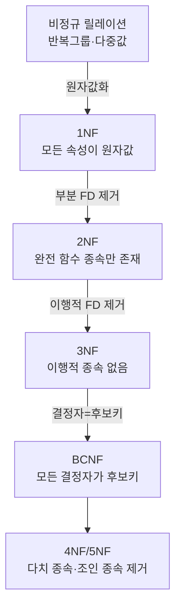
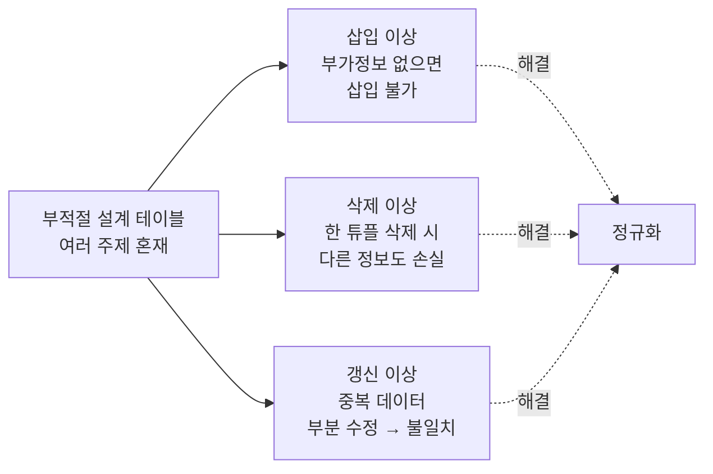
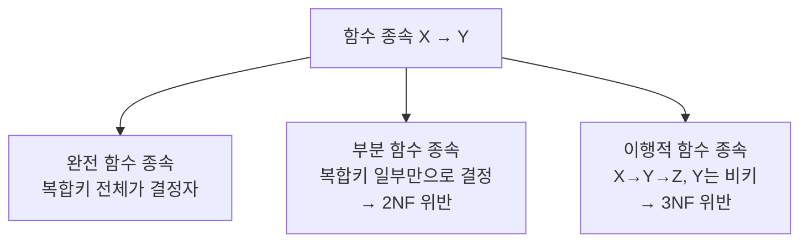

# 5강. 데이터처리와활용: 관계형 데이터 모델의 정규화

## 🔗 선수 지식 (Prerequisites)
- [ ] **필수**: 관계형 데이터 모델(릴레이션, 속성, 튜플, 키 개념) - 이해 완료?
- [ ] **필수**: 기본키·후보키·외래키 개념 - 이해 완료?
- [ ] **권장**: 함수 종속(Functional Dependency)의 기본 정의
- **관련 단원**: [2강 데이터베이스 시스템과 모델](2강.md), [3강 관계형 데이터 모델](3강.md), [4강 SQL](4강.md)

---

## 학습 목표
1. 데이터 이상(anomaly)의 개념과 종류를 설명할 수 있다.
2. 데이터 정규화의 목적과 필요성을 설명할 수 있다.
3. 제1정규형(1NF), 제2정규형(2NF), 제3정규형(3NF)의 특징을 설명할 수 있다.

---

## 🧠 메타인지 체크 (학습 전/후 자기 평가)

### 학습 전 자기 평가
| 소주제 | 자신감 (1-5) |
| :--- | :--- |
| 데이터 이상의 종류(삽입/삭제/갱신) | |
| 함수 종속(완전·부분·이행) 구분 | |
| 1NF / 2NF / 3NF의 차이 | |
| 정규화의 목적과 트레이드오프 | |

### 학습 후 교정 (학습 완료 후 작성)
| 소주제 | 학습 전 | 학습 후 | 실제 정답률 | 과신/과소 여부 |
| :--- | :--- | :--- | :--- | :--- |
| 데이터 이상의 종류 | | | | |
| 함수 종속 구분 | | | | |
| 1NF / 2NF / 3NF | | | | |
| 정규화의 목적 | | | | |

> **활용법**: 학습 전 1분 → 자신감 기입, 학습 후 1분 → 나머지 기입. "과신" 영역이 실제 취약점.

---

## 📝 요약 (Summary)

### 데이터 이상(Anomaly) 🔴
1. **데이터 이상의 정의**: 잘못 설계된 테이블 구조에서 데이터의 삽입·삭제·수정 과정에 발생하는 부작용이다. 🔴
2. **삽입 이상(Insertion Anomaly)**: 원치 않는 부가 정보 없이는 데이터를 삽입할 수 없는 문제이다. 🔴
3. **삭제 이상(Deletion Anomaly)**: 특정 튜플을 삭제할 때 함께 보존되어야 할 정보까지 사라지는 문제이다. 🔴
4. **갱신 이상(Update Anomaly)**: 중복 저장된 데이터 중 일부만 수정되어 데이터 불일치가 발생하는 문제이다. 🔴
5. **이상의 원인**: 한 테이블에 서로 다른 의미의 정보가 혼재되어(부적절한 함수 종속) 발생한다. 🟡

### 데이터 정규화 🔴
6. **정규화의 정의**: 데이터 이상을 제거하기 위해 함수 종속을 기준으로 테이블을 체계적으로 분해(decomposition)하는 설계 기법이다. 🔴
7. **목적**: 중복 최소화, 데이터 무결성과 일관성 보장, 이상 현상 제거. 🔴
8. **트레이드오프**: 정규화가 진행될수록 조인 비용이 증가하므로, 성능 요구에 따라 의도적 반정규화(denormalization)를 적용하기도 한다. 🟡
9. **무손실 분해**: 분해된 테이블을 다시 조인해도 원래 정보를 복원할 수 있어야 한다. 🟢

### 함수 종속(Functional Dependency) 🔴
10. **함수 종속의 정의**: 속성 X의 값이 결정되면 속성 Y의 값이 유일하게 결정될 때 $X \to Y$로 표기한다. 🔴
11. **완전 함수 종속**: 복합키의 *전체*가 결정자일 때 비키 속성이 결정되는 종속이다. 🟡
12. **부분 함수 종속**: 복합키의 *일부*만으로 비키 속성이 결정되는 종속이다(2NF 위반 원인). 🔴
13. **이행적 함수 종속**: $X \to Y$, $Y \to Z$이면서 $Y$가 키가 아닐 때 $X \to Z$가 성립하는 종속(3NF 위반 원인). 🔴

### 제1정규형 (1NF) 🔴
14. **1NF의 조건**: 모든 속성이 **원자값(atomic value)**을 가져야 한다(반복 그룹·다중값·중첩 구조 금지). 🔴
15. **위반 예시**: 한 셀에 "수학, 과학, 영어"처럼 여러 값이 콤마로 들어 있는 경우. 🟡

### 제2정규형 (2NF) 🔴
16. **2NF의 조건**: 1NF를 만족하고, **부분 함수 종속을 제거**해야 한다. 🔴
17. **적용 대상**: 기본키가 복합키일 때 의미가 있으며, 단일 속성 기본키 테이블은 자동으로 2NF이다. 🟡

### 제3정규형 (3NF) 🔴
18. **3NF의 조건**: 2NF를 만족하고, **이행적 함수 종속을 제거**해야 한다. 🔴
19. **목표 효과**: 데이터의 일관성과 무결성을 보장하고 갱신 이상을 제거한다. 🔴
20. **상위 정규형 참고**: BCNF, 4NF, 5NF로 확장되며 일반적으로 실무에서는 3NF/BCNF까지 적용한다. 🟢

---

## 📐 핵심 정의 및 원리 (이론 중심)

| 정의명 | 내용 | 키워드 |
| :--- | :--- | :--- |
| **데이터 이상** | 잘못된 테이블 설계로 인해 삽입·삭제·갱신 시 발생하는 부작용 | Anomaly, 중복, 불일치 |
| **삽입 이상** | 불필요한 추가 정보 없이는 새로운 데이터를 삽입할 수 없는 현상 | Insertion Anomaly, NULL |
| **삭제 이상** | 한 튜플 삭제 시 보존해야 할 다른 정보까지 함께 사라지는 현상 | Deletion Anomaly, 연쇄 손실 |
| **갱신 이상** | 중복 데이터 중 일부만 수정되어 데이터가 불일치하는 현상 | Update Anomaly, 불일치 |
| **정규화** | 함수 종속을 기준으로 테이블을 분해하여 이상을 제거하는 과정 | Normalization, Decomposition |
| **함수 종속** | $X \to Y$: X 값이 결정되면 Y 값이 유일하게 결정되는 관계 | FD, 결정자, 종속자 |
| **완전 함수 종속** | 복합키 전체가 결정자일 때 성립하는 종속 | Full FD |
| **부분 함수 종속** | 복합키의 일부분만으로 종속자가 결정되는 종속 | Partial FD, 2NF 위반 |
| **이행적 함수 종속** | $X \to Y$, $Y \to Z$이며 $Y$가 키가 아닐 때 $X \to Z$ | Transitive FD, 3NF 위반 |
| **원자값** | 더 이상 분해할 수 없는 단일 값(반복 그룹 불가) | Atomic, 1NF |
| **제1정규형(1NF)** | 모든 속성이 원자값을 갖는 릴레이션 | 1NF, 원자성 |
| **제2정규형(2NF)** | 1NF + 부분 함수 종속 제거 | 2NF, Full FD |
| **제3정규형(3NF)** | 2NF + 이행적 함수 종속 제거 | 3NF, 무결성 |
| **무손실 분해** | 분해된 테이블을 조인하면 원래 릴레이션을 복원 가능 | Lossless Join |
| **반정규화** | 성능 향상을 위해 의도적으로 정규화를 완화하는 설계 | Denormalization |

### 주요 원리: 정규화의 진행 메커니즘

> **직관적 해석**: 정규화는 "한 테이블에는 한 가지 주제만 담는다"는 원칙을 형식화한 것이다. 1NF는 셀의 모양을, 2NF·3NF는 속성 간 종속의 모양을 정리한다.
> **AI 적용**: 머신러닝의 피처 스토어(Feature Store)에서도 엔티티 단위로 테이블을 분리·정규화하여 피처 누수(Feature Leakage)와 갱신 비일관성을 방지한다. 학습/추론 시 조인으로 결합하는 패턴이 3NF 설계와 본질적으로 동일하다.

### 정규화 단계의 형식적 조건 (요약)

| 단계 | 조건 (직전 단계 만족 + ⋯) | 제거 대상 |
| :--- | :--- | :--- |
| **1NF** | 모든 속성이 원자값 | 반복 그룹, 다중값 |
| **2NF** | 부분 함수 종속 없음 | 부분 FD |
| **3NF** | 이행적 함수 종속 없음 | 이행적 FD |
| **BCNF** | 모든 결정자가 후보키 | 비후보키 결정자 |

---

## 📊 개념 시각화 (Visual Guide)

### 정규화 단계 분류 체계도


### 데이터 이상의 발생 구조


### 함수 종속 유형 분류


### 핵심 비교표: 정규형 단계별 특성

| 구분 | 1NF | 2NF | 3NF |
| :--- | :--- | :--- | :--- |
| **핵심 조건** | 원자값 | 부분 FD 제거 | 이행적 FD 제거 |
| **제거 대상** | 반복 그룹/다중값 | 부분 함수 종속 | 이행적 함수 종속 |
| **대상 키** | 모든 테이블 | 복합키 테이블 | 모든 테이블 |
| **위반 예시** | 셀에 "A,B,C" | 복합키 (학번, 과목)에서 학번만으로 학생명 결정 | 학번→학과→학과장 |
| **해결 후 효과** | 셀 단위 처리 가능 | 학생 정보 중복 제거 | 학과 정보 중복 제거 |

---

## ✏️ 심화 학습 (Study Subject)

### 1. 가상 시나리오: "어떤 정규형까지 적용해야 할까?"
- **상황**: 한 대학이 수강 정보를 다음과 같은 단일 테이블로 관리한다.

  | 학번 | 학생명 | 학과 | 학과장 | 과목코드 | 과목명 | 성적 |
  | :--- | :--- | :--- | :--- | :--- | :--- | :--- |
  | 1001 | 김철수 | 컴퓨터과학 | 이교수 | CS101 | 자료구조 | A |
  | 1001 | 김철수 | 컴퓨터과학 | 이교수 | CS102 | 알고리즘 | B+ |
  | 1002 | 이영희 | 통계학 | 박교수 | ST101 | 통계학개론 | A |

- **문제**:
  - 삽입 이상: 신입생이 아직 수강신청 전이면 학생 정보를 등록할 수 없다.
  - 삭제 이상: 김철수가 수강한 모든 과목을 취소하면 학생·학과 정보까지 사라진다.
  - 갱신 이상: 학과장이 바뀌면 해당 학과의 모든 행을 일일이 갱신해야 하며, 누락 시 불일치 발생.
- **해결 (정규화 적용)**:
  1. **1NF 확인**: 모든 셀이 원자값 → 충족.
  2. **2NF**: 기본키 (학번, 과목코드). 그러나 "학생명, 학과, 학과장"은 학번만으로 결정 → 부분 FD 존재. **학생 테이블**과 **수강 테이블**로 분해.
     - `학생(학번, 학생명, 학과, 학과장)`, `수강(학번, 과목코드, 성적)`, `과목(과목코드, 과목명)`
  3. **3NF**: 학생 테이블에서 학번 → 학과 → 학과장(이행적 FD) → **학과 테이블** 분리.
     - `학생(학번, 학생명, 학과)`, `학과(학과, 학과장)`
- **AI 학습 포인트**: "정규화 결과 테이블을 머신러닝 모델 학습용으로 다시 결합할 때, 어느 시점에 조인을 수행해야 데이터 누수(target leakage)를 방지할 수 있을지 피처 스토어 관점에서 설명해 줘."

### 2. 관점별 비교 및 오개념 분석

- **핵심 비교**: 부분 FD vs 이행적 FD, 1NF vs 정규화 전, 정규화 vs 반정규화

| 혼동 쌍 | 차이점의 핵심 |
| :--- | :--- |
| **부분 FD vs 이행적 FD** | 부분 FD는 *복합키의 일부*만으로 비키가 결정됨(2NF 위반). 이행적 FD는 *비키→비키*로 종속이 연쇄됨(3NF 위반) |
| **1NF vs 비정규** | 1NF는 셀이 원자값인지의 문제(구조 차원). 정규화 전은 함수 종속 정리 이전 상태(설계 차원) |
| **정규화 vs 반정규화** | 정규화는 중복 제거·일관성 확보 목적. 반정규화는 조인 비용 절감을 위해 의도적 중복 허용(읽기 성능 ↑, 쓰기 일관성 ↓) |
| **2NF vs 3NF** | 2NF는 키→비키의 부분 종속을 제거. 3NF는 비키→비키의 이행적 종속을 제거. 대상 종속의 종류가 다름 |

- **오개념 분석**:
    - **오개념 1**: "단일 속성 기본키 테이블도 2NF 위반이 발생할 수 있다."
    - **분석**: 부분 함수 종속은 *복합키의 일부*가 결정자가 될 때 정의된다. 기본키가 단일 속성이면 "일부"가 존재할 수 없으므로 자동으로 2NF를 만족한다.
    - **오개념 2**: "정규화를 많이 할수록 데이터베이스 성능이 항상 좋아진다."
    - **분석**: 정규화는 *쓰기 일관성*과 *중복 제거*에 유리하지만, *읽기*에서는 다수 테이블의 조인이 필요해져 성능이 저하될 수 있다. OLAP·집계 워크로드에서는 의도적 반정규화가 일반적이다.
    - **오개념 3**: "1NF만 만족하면 데이터 이상이 없다."
    - **분석**: 1NF는 셀의 원자성만 보장한다. 부분·이행적 함수 종속이 남아 있으면 여전히 삽입·삭제·갱신 이상이 발생한다.
    - **오개념 4**: "이행적 함수 종속에서 중간 속성 Y가 키여도 3NF 위반이다."
    - **분석**: 3NF의 이행적 종속 정의는 *Y가 후보키가 아닐 때*를 전제한다. Y가 후보키이면 위반이 아니다.
- **AI 학습 포인트**: "어떤 도메인(예: 실시간 추천, OLTP 결제, OLAP 리포팅)에서 정규화 수준이 어떻게 달라져야 하는지 트레이드오프 표로 정리해 줘."

---

## ❓ 연습 문제 및 해설

> **블룸 인지 수준 범례**: [기억] 정의·나열 → [이해] 설명·비교 → [적용] 계산·구현 → [분석] 구별·디버그 → [평가] 판단·비평 → [창조] 설계·제안

### 📝 문제

**1. 📌 ⭐ [기억] 데이터 이상(Anomaly)의 세 가지 종류로 옳은 것은?(#prob-1)**
   > ① 정렬 이상, 조인 이상, 인덱스 이상
   > ② 삽입 이상, 삭제 이상, 갱신 이상
   > ③ 정확성 이상, 완전성 이상, 일관성 이상
   > ④ 트랜잭션 이상, 동시성 이상, 회복 이상

<br>

**2. 📌 ⭐ [기억] 데이터 정규화의 주된 목적으로 가장 거리가 먼 것은?(#prob-2)**
   > ① 데이터의 중복을 최소화한다.
   > ② 데이터 이상 현상을 제거한다.
   > ③ 데이터 무결성과 일관성을 보장한다.
   > ④ 조인 연산의 횟수를 줄여 조회 성능을 항상 향상시킨다.

<br>

**3. 📌 ⭐⭐ [이해] 제1정규형(1NF)의 조건으로 옳은 것은?(#prob-3)**
   > ① 부분 함수 종속이 존재하지 않아야 한다.
   > ② 이행적 함수 종속이 존재하지 않아야 한다.
   > ③ 모든 속성이 원자값(atomic value)을 가져야 한다.
   > ④ 모든 결정자가 후보키여야 한다.

<br>

**4. 📌 ⭐⭐ [이해] 제2정규형(2NF)에서 제거되어야 하는 것은?(#prob-4)**
   > ① 다중값 속성
   > ② 부분 함수 종속
   > ③ 이행적 함수 종속
   > ④ 비후보키 결정자

<br>

**5. 📌 ⭐⭐ [이해] 제3정규형(3NF)에서 제거되어야 하는 것은?(#prob-5)**
   > ① 원자값이 아닌 속성
   > ② 부분 함수 종속
   > ③ 이행적 함수 종속
   > ④ 다치 종속

<br>

**6. 📌 ⭐⭐ [분석] 다음 함수 종속 중 부분 함수 종속에 해당하는 것은? (기본키: {학번, 과목코드})(#prob-6)**
   > ① {학번, 과목코드} → 성적
   > ② 학번 → 학생명
   > ③ 과목코드 → 강의실
   > ④ ②와 ③ 모두

<br>

**7. 📌 ⭐⭐ [분석] 다음 사례에서 발생한 데이터 이상의 종류는?(#prob-7)**
   > 한 회사의 직원 테이블에 부서 정보가 함께 저장되어 있다. 어떤 부서에 마지막 남은 직원이 퇴사하여 해당 행을 삭제하자, 그 부서의 정보(부서명, 부서장 등)까지 모두 사라졌다.

   > ① 삽입 이상
   > ② 삭제 이상
   > ③ 갱신 이상
   > ④ 무결성 이상

<br>

**8. 📌 ⭐⭐⭐ [분석] 다음 테이블에서 발생하는 가장 큰 문제와 적절한 정규화 단계는?(#prob-8)**
   > `수강(학번, 과목코드, 학생명, 학과, 성적)` — 기본키: (학번, 과목코드)
   > (단, 학번 → 학생명, 학번 → 학과)

   > ① 1NF 위반 — 원자값 분해 필요
   > ② 2NF 위반 — 부분 함수 종속 제거 필요
   > ③ 3NF 위반 — 이행적 함수 종속 제거 필요
   > ④ BCNF 위반 — 결정자 분리 필요

<br>

**9. 📌 ⭐⭐⭐ [평가] 다음 중 옳지 않은 설명을 모두 고른 것은?(#prob-9)**
   > <보기>
   >
   > 가. 단일 속성 기본키 테이블은 1NF만 만족하면 자동으로 2NF를 만족한다.
   > 나. 3NF는 2NF를 만족하지 않아도 별도로 달성할 수 있다.
   > 다. 정규화 수준이 높을수록 조인 비용이 늘어날 수 있다.
   > 라. 1NF만 만족하면 삽입·삭제·갱신 이상이 모두 사라진다.

   > ① 가, 나
   > ② 나, 라
   > ③ 가, 다
   > ④ 나, 다

<br>

**10. 📌 ⭐⭐⭐ [창조] 다음 테이블을 3NF까지 분해할 때 가장 적절한 결과는?(#prob-10)**
   > `학생수강(학번, 학생명, 학과, 학과장, 과목코드, 과목명, 성적)`
   > FD: {학번, 과목코드}→성적, 학번→학생명, 학번→학과, 학과→학과장, 과목코드→과목명

   > ① `학생수강(학번, 학생명, 학과, 학과장, 과목코드, 과목명, 성적)` 그대로 유지
   > ② `학생(학번, 학생명, 학과, 학과장)`, `수강(학번, 과목코드, 과목명, 성적)`
   > ③ `학생(학번, 학생명, 학과)`, `학과(학과, 학과장)`, `과목(과목코드, 과목명)`, `수강(학번, 과목코드, 성적)`
   > ④ `학생(학번, 학생명)`, `학과(학과, 학과장)`, `수강(학번, 과목코드, 성적, 과목명, 학과)`

---

### 🔑 정답 및 해설 (먼저 풀어본 후 펼치기)

<details>
<summary>정답 보기 (클릭)</summary>

1. ②
2. ④
3. ③
4. ②
5. ③
6. ④
7. ②
8. ②
9. ②
10. ③

</details>

<details>
<summary>해설 보기 (클릭)</summary>

<a id="prob-1"></a>
**1. ⭐ [기억] 데이터 이상의 종류**
> **정답: ② 삽입 이상, 삭제 이상, 갱신 이상**
> **해설**: 잘못된 테이블 설계로 발생하는 대표 이상은 삽입·삭제·갱신 세 가지다. 나머지 보기는 정규화와 무관한 다른 범주의 문제다.

<a id="prob-2"></a>
**2. ⭐ [기억] 정규화의 목적**
> **정답: ④ 조인 연산의 횟수를 줄여 조회 성능을 항상 향상시킨다.**
> **해설**: 정규화는 오히려 테이블 분해로 조인이 늘어나 조회 성능이 저하될 수 있다. 그래서 반정규화가 함께 논의된다. ①②③은 정규화의 핵심 목적이다.

<a id="prob-3"></a>
**3. ⭐⭐ [이해] 1NF 조건**
> **정답: ③ 모든 속성이 원자값을 가져야 한다.**
> **해설**: 1NF의 정의 자체다. ①은 2NF, ②는 3NF, ④는 BCNF의 조건이다.

<a id="prob-4"></a>
**4. ⭐⭐ [이해] 2NF에서 제거 대상**
> **정답: ② 부분 함수 종속**
> **해설**: 2NF는 1NF를 만족하면서 기본키의 일부만으로 비키 속성이 결정되는 부분 함수 종속을 제거한 단계다.

<a id="prob-5"></a>
**5. ⭐⭐ [이해] 3NF에서 제거 대상**
> **정답: ③ 이행적 함수 종속**
> **해설**: 3NF는 2NF + 이행적 함수 종속 제거다. 비키 속성이 다른 비키 속성에 종속되는 구조를 분해한다.

<a id="prob-6"></a>
**6. ⭐⭐ [분석] 부분 함수 종속 식별**
> **정답: ④ ②와 ③ 모두**
> **해설**: 기본키가 {학번, 과목코드}인데 학번만으로 학생명이, 과목코드만으로 강의실이 결정되면 둘 다 *복합키 일부만으로* 결정자가 되는 부분 함수 종속이다. ①은 키 전체가 결정자인 완전 함수 종속.

<a id="prob-7"></a>
**7. ⭐⭐ [분석] 이상 종류 진단**
> **정답: ② 삭제 이상**
> **해설**: 한 튜플을 삭제했을 때 함께 보존되어야 할 다른 정보(부서 정보)까지 사라지는 것이 전형적인 삭제 이상이다.

<a id="prob-8"></a>
**8. ⭐⭐⭐ [분석] 정규화 단계 진단**
> **정답: ② 2NF 위반 — 부분 함수 종속 제거 필요**
> **해설**: 기본키 (학번, 과목코드)에서 학번만으로 학생명·학과가 결정되므로 부분 함수 종속이 존재한다. 1NF는 만족(원자값)하지만 2NF를 위반한다.

<a id="prob-9"></a>
**9. ⭐⭐⭐ [평가] 옳지 않은 설명 식별**
> **정답: ② 나, 라**
> **해설**:
> - 가(O): 단일 속성 기본키에는 "부분"이 존재할 수 없으므로 자동 2NF.
> - 나(X): 정규형은 누적적이다. 3NF는 반드시 2NF를 만족해야 한다.
> - 다(O): 분해로 조인 비용이 증가할 수 있다.
> - 라(X): 1NF만으로는 부분·이행적 종속이 남아 이상이 발생할 수 있다.

<a id="prob-10"></a>
**10. ⭐⭐⭐ [창조] 3NF 분해 결과**
> **정답: ③ `학생(학번, 학생명, 학과)`, `학과(학과, 학과장)`, `과목(과목코드, 과목명)`, `수강(학번, 과목코드, 성적)`**
> **해설**:
> - 부분 FD 제거(학번→학생명·학과, 과목코드→과목명) → 학생/과목 테이블 분리(2NF).
> - 이행적 FD(학번→학과→학과장)에서 학과 테이블 분리(3NF).
> - ②는 학과→학과장의 이행적 종속이 남아 3NF 위반.
> - ④는 수강 테이블에 과목명·학과가 남아 부분 FD가 다시 발생.

</details>

---

## ✅ O/X 확인문제 (총 20문항)

**1.** 데이터 이상은 잘 설계된 테이블에서도 빈번하게 발생한다.(#ox-1) **(O / X)**
**2.** 삽입 이상은 부가 정보 없이는 새로운 데이터를 삽입할 수 없는 문제이다.(#ox-2) **(O / X)**
**3.** 삭제 이상은 한 튜플 삭제 시 보존해야 할 정보까지 함께 사라지는 현상이다.(#ox-3) **(O / X)**
**4.** 갱신 이상은 중복 저장된 데이터 중 일부만 수정되어 불일치가 발생하는 문제이다.(#ox-4) **(O / X)**
**5.** 데이터 정규화의 목적 중 하나는 데이터 중복을 최소화하는 것이다.(#ox-5) **(O / X)**
**6.** 정규화는 함수 종속을 기준으로 테이블을 분해하는 과정이다.(#ox-6) **(O / X)**
**7.** 1NF는 모든 속성이 원자값을 가져야 한다.(#ox-7) **(O / X)**
**8.** 2NF는 1NF를 만족하면서 부분 함수 종속을 제거한 상태이다.(#ox-8) **(O / X)**
**9.** 3NF는 2NF를 만족하면서 이행적 함수 종속을 제거한 상태이다.(#ox-9) **(O / X)**
**10.** 단일 속성 기본키 테이블은 1NF만 만족하면 자동으로 2NF이다.(#ox-10) **(O / X)**
**11.** 정규화가 진행되면 일반적으로 조인 비용이 줄어들어 조회 성능이 향상된다.(#ox-11) **(O / X)**
**12.** 부분 함수 종속은 복합키의 일부만으로 비키 속성이 결정되는 경우를 말한다.(#ox-12) **(O / X)**
**13.** 이행적 함수 종속은 X→Y, Y→Z이고 Y가 후보키일 때에도 3NF 위반이 된다.(#ox-13) **(O / X)**
**14.** 정규화는 데이터의 무결성과 일관성을 보장하는 데 기여한다.(#ox-14) **(O / X)**
**15.** 반정규화는 정규화의 단점인 조인 비용을 줄이기 위해 의도적으로 중복을 허용하는 설계이다.(#ox-15) **(O / X)**
**16.** "한 셀에 콤마로 여러 값을 저장"하는 것은 1NF 위반이다.(#ox-16) **(O / X)**
**17.** 정규형 단계는 누적적이며, 3NF는 반드시 2NF를 만족해야 한다.(#ox-17) **(O / X)**
**18.** 함수 종속 X → Y는 X 값이 같으면 Y 값도 같아야 함을 의미한다.(#ox-18) **(O / X)**
**19.** 무손실 분해는 분해 후 조인하여 원본 릴레이션을 복원할 수 있어야 한다.(#ox-19) **(O / X)**
**20.** 정규화는 OLAP·집계 워크로드에서 항상 최우선되어야 한다.(#ox-20) **(O / X)**

<details>
<summary>O/X 정답 및 해설 보기 (클릭)</summary>

> <a id="ox-1"></a>
> **1. 정답**: X
> **해설**: 데이터 이상은 *잘못 설계된* 테이블에서 발생한다.

> <a id="ox-2"></a>
> **2. 정답**: O
> **해설**: 삽입 이상의 정의다.

> <a id="ox-3"></a>
> **3. 정답**: O
> **해설**: 삭제 이상의 정의다.

> <a id="ox-4"></a>
> **4. 정답**: O
> **해설**: 갱신 이상의 정의다.

> <a id="ox-5"></a>
> **5. 정답**: O
> **해설**: 중복 최소화는 정규화의 핵심 목적이다.

> <a id="ox-6"></a>
> **6. 정답**: O
> **해설**: 정규화는 함수 종속 분석에 기반한 분해 기법이다.

> <a id="ox-7"></a>
> **7. 정답**: O
> **해설**: 1NF의 정의(원자값).

> <a id="ox-8"></a>
> **8. 정답**: O
> **해설**: 2NF의 정의(부분 FD 제거).

> <a id="ox-9"></a>
> **9. 정답**: O
> **해설**: 3NF의 정의(이행적 FD 제거).

> <a id="ox-10"></a>
> **10. 정답**: O
> **해설**: 단일 속성 키는 "일부"가 존재하지 않으므로 부분 FD가 정의되지 않는다.

> <a id="ox-11"></a>
> **11. 정답**: X
> **해설**: 정규화는 테이블을 분해하므로 조인이 늘어나 조회 성능이 떨어질 수 있다.

> <a id="ox-12"></a>
> **12. 정답**: O
> **해설**: 부분 함수 종속의 정의다.

> <a id="ox-13"></a>
> **13. 정답**: X
> **해설**: 중간 속성 Y가 후보키이면 3NF 위반이 아니다.

> <a id="ox-14"></a>
> **14. 정답**: O
> **해설**: 일관성·무결성 확보가 정규화의 효과다.

> <a id="ox-15"></a>
> **15. 정답**: O
> **해설**: 반정규화의 정의다.

> <a id="ox-16"></a>
> **16. 정답**: O
> **해설**: 다중값 속성은 원자성을 위반한다.

> <a id="ox-17"></a>
> **17. 정답**: O
> **해설**: 정규형 단계는 누적적이다.

> <a id="ox-18"></a>
> **18. 정답**: O
> **해설**: 함수 종속의 정의다.

> <a id="ox-19"></a>
> **19. 정답**: O
> **해설**: 무손실 분해의 정의다.

> <a id="ox-20"></a>
> **20. 정답**: X
> **해설**: OLAP·집계 워크로드에서는 오히려 반정규화가 일반적이다.

</details>

---

## 🧪 자유 회상 연습 (Free Recall)

> **방법**: 위의 노트를 모두 덮고, 타이머 3분 설정 후 이번 단원에서 배운 내용을 기억나는 대로 자유롭게 적으세요.
> 정확한 문장이 아니어도 됩니다. 키워드, 수식, 관계 등 떠오르는 것을 모두 적습니다.

**자유 회상 작성란:**

```
[여기에 기억나는 내용을 자유롭게 작성]


```

> **회상 후 점검**: 노트를 다시 펼쳐 빠뜨린 내용을 확인하세요. 빠뜨린 부분이 실제 취약점입니다.
> - 회상 못한 이상 종류: [                ]
> - 회상 못한 정규형 단계 조건: [                ]

---

## 💻 코드로 확인하기 (Code Verification)

### 예시 1: 비정규 테이블에서 데이터 이상 시연
```python
import pandas as pd

# 비정규 설계: 학생·학과·수강이 한 테이블에 혼재
df = pd.DataFrame({
    "학번":     [1001, 1001, 1002, 1003],
    "학생명":   ["김철수", "김철수", "이영희", "박민수"],
    "학과":     ["컴퓨터과학", "컴퓨터과학", "통계학", "컴퓨터과학"],
    "학과장":   ["이교수", "이교수", "박교수", "이교수"],
    "과목코드": ["CS101", "CS102", "ST101", "CS101"],
    "과목명":   ["자료구조", "알고리즘", "통계학개론", "자료구조"],
    "성적":     ["A", "B+", "A", "B"],
})

# 갱신 이상 시연: 컴퓨터과학 학과장이 '최교수'로 바뀜
df.loc[df["학번"] == 1001, "학과장"] = "최교수"  # 일부 행만 갱신
print("[갱신 이상] 동일 학과인데 학과장 값이 불일치")
print(df[["학번", "학과", "학과장"]])
```

> **실행 결과 (예시)**:
> ```
> [갱신 이상] 동일 학과인데 학과장 값이 불일치
>    학번      학과 학과장
> 0  1001  컴퓨터과학  최교수
> 1  1001  컴퓨터과학  최교수
> 2  1002    통계학  박교수
> 3  1003  컴퓨터과학  이교수   ← 같은 학과인데 학과장이 다름!
> ```
> **해석**: 중복 저장된 학과장 정보 중 일부만 갱신되어 일관성이 깨졌다. 정규화로 학과 정보를 별도 테이블에 두면 단일 갱신으로 해결된다.

### 예시 2: 3NF 분해 후 조인으로 복원
```python
import pandas as pd

# 3NF 분해 결과
students = pd.DataFrame({
    "학번":   [1001, 1002, 1003],
    "학생명": ["김철수", "이영희", "박민수"],
    "학과":   ["컴퓨터과학", "통계학", "컴퓨터과학"],
})

departments = pd.DataFrame({
    "학과":   ["컴퓨터과학", "통계학"],
    "학과장": ["최교수", "박교수"],   # 한 곳에서만 관리
})

subjects = pd.DataFrame({
    "과목코드": ["CS101", "CS102", "ST101"],
    "과목명":   ["자료구조", "알고리즘", "통계학개론"],
})

enrollments = pd.DataFrame({
    "학번":     [1001, 1001, 1002, 1003],
    "과목코드": ["CS101", "CS102", "ST101", "CS101"],
    "성적":     ["A", "B+", "A", "B"],
})

# 무손실 조인으로 원본 정보 복원
restored = (enrollments
            .merge(students, on="학번")
            .merge(departments, on="학과")
            .merge(subjects, on="과목코드"))
print(restored)
```

> **실행 결과 (예시)**:
> ```
>    학번 과목코드 성적 학생명      학과 학과장   과목명
> 0  1001  CS101  A  김철수  컴퓨터과학  최교수   자료구조
> 1  1001  CS102  B+ 김철수  컴퓨터과학  최교수   알고리즘
> 2  1002  ST101  A  이영희    통계학  박교수  통계학개론
> 3  1003  CS101  B  박민수  컴퓨터과학  최교수   자료구조
> ```
> **해석**: 정규화로 분해된 4개 테이블을 조인하면 원본 정보를 손실 없이 복원할 수 있다(무손실 분해). 학과장 갱신도 `departments` 한 행만 수정하면 끝난다.

---

## 🤖 AI 연결고리 (Concept → AI Application)

| 학습 개념 | AI/ML 적용 분야 | 구체적 사례 |
| :--- | :--- | :--- |
| 데이터 이상(중복·불일치) | Data-centric AI 품질 관리 | 학습 데이터셋의 중복·라벨 불일치 탐지 (Snorkel, Cleanlab) |
| 함수 종속 분석 | 피처 엔지니어링 | 파생 피처가 원본 피처에 함수 종속이면 다중공선성 유발 → 제거 |
| 1NF (원자값) | 피처 벡터화 | 멀티라벨 컬럼을 원-핫/멀티핫으로 분해 |
| 2NF (부분 FD 제거) | 피처 스토어 엔티티 분리 | 사용자 피처/상품 피처/이벤트 피처를 엔티티 단위로 분리 저장 |
| 3NF (이행적 FD 제거) | 라벨 누수(Target Leakage) 방지 | 타깃 변수에 이행적으로 의존하는 피처 제거 |
| 정규화 vs 반정규화 | OLTP vs OLAP, 추론 vs 학습 | 학습은 정규화된 피처 스토어, 추론은 반정규화된 캐시 사용 |
| 무손실 분해 | 데이터셋 분할의 일관성 | train/val/test 분할 후에도 키 기반 조인으로 메타데이터 결합 가능 |

---

## 📖 심화 학습 예시 답안

#### 1. 정규화의 내부 동작 원리
정규화는 **함수 종속의 종류별로 그것을 깨뜨리는 분해**를 순차 적용하는 과정이다.

1. **1NF**: 셀의 원자성을 보장 → 반복 그룹을 별도 행/테이블로 분리.
2. **2NF**: 복합키의 일부에만 종속되는 속성을 *그 일부를 키로 하는* 새 테이블로 분리.
3. **3NF**: 비키 속성에 종속되는 속성을 *그 비키를 키로 하는* 새 테이블로 분리.

> 머신러닝 관점: 1NF=원자 피처화(임베딩 가능 단위), 2NF=엔티티 분리(사용자/상품), 3NF=이행적 누수 제거(타깃 인접 피처 제거)와 대응된다.

#### 2. 정규화 vs 반정규화 비교표

| 구분 | 정규화 | 반정규화 | AI 활용 |
| :--- | :--- | :--- | :--- |
| **목적** | 중복 제거, 일관성 | 조회 성능 향상 | 학습/추론 환경에 맞춰 선택 |
| **저장 공간** | 작음 | 큼 | 피처 스토어=정규화, 캐시/추론=반정규화 |
| **쓰기 비용** | 작음(단일 갱신) | 큼(중복 갱신) | 온라인 학습은 정규화 유리 |
| **읽기 비용** | 큼(조인 다수) | 작음 | 실시간 추론은 반정규화 유리 |
| **이상 발생 가능성** | 낮음 | 높음(중복으로 불일치 위험) | MLOps 데이터 검증 필수 |
| **대표 워크로드** | OLTP, 트랜잭션 | OLAP, 리포팅, 캐시 | 학습 파이프라인 vs 서빙 |

#### 3. 정규화 실습 Best Practice

- **Bad Practice (나쁜 예시)**
  ```python
  # 한 테이블에 학생·학과·수강·과목 정보를 모두 저장
  df = pd.DataFrame({
      "학번": [...], "학생명": [...], "학과": [...], "학과장": [...],
      "과목코드": [...], "과목명": [...], "성적": [...],
  })
  # → 갱신 이상, 삭제 이상이 빈번하게 발생
  ```
- **Good Practice (좋은 예시)**
  ```python
  # 3NF에 따른 분해
  students    = pd.DataFrame(columns=["학번", "학생명", "학과"])
  departments = pd.DataFrame(columns=["학과", "학과장"])
  subjects    = pd.DataFrame(columns=["과목코드", "과목명"])
  enrollments = pd.DataFrame(columns=["학번", "과목코드", "성적"])

  # 외래키 검증
  assert enrollments["학번"].isin(students["학번"]).all()
  assert enrollments["과목코드"].isin(subjects["과목코드"]).all()
  assert students["학과"].isin(departments["학과"]).all()
  ```
- **설명**: 각 테이블이 하나의 주제만 담아 갱신·삽입·삭제가 단일 위치에서 일어난다. 외래키 검증으로 참조 무결성을 보장하고, 분석 시 조인으로 결합한다. MLOps에서는 Great Expectations 등으로 외래키 무결성을 자동 검증한다.

---

## 📚 핵심 용어집 (Glossary)

| 용어 (한) | 용어 (영) | 수식/표현 | 정의 |
| :--- | :--- | :--- | :--- |
| **데이터 이상** | Anomaly | — | 잘못된 설계로 인한 삽입/삭제/갱신 시 부작용 |
| **삽입 이상** | Insertion Anomaly | — | 부가정보 없이는 새 데이터를 삽입할 수 없는 현상 |
| **삭제 이상** | Deletion Anomaly | — | 한 튜플 삭제 시 다른 정보도 함께 사라지는 현상 |
| **갱신 이상** | Update Anomaly | — | 중복 데이터 중 일부만 수정되어 불일치 발생 |
| **정규화** | Normalization | — | 함수 종속 기반의 테이블 분해 설계 기법 |
| **반정규화** | Denormalization | — | 성능을 위해 의도적으로 중복을 허용하는 설계 |
| **함수 종속** | Functional Dependency | $X \to Y$ | X가 결정되면 Y가 유일하게 결정되는 관계 |
| **완전 함수 종속** | Full FD | 복합키 전체 $\to Y$ | 복합키 전체가 결정자인 종속 |
| **부분 함수 종속** | Partial FD | 복합키 일부 $\to Y$ | 복합키 일부만으로 결정되는 종속(2NF 위반) |
| **이행적 함수 종속** | Transitive FD | $X \to Y \to Z$ (Y는 비키) | 비키를 거쳐 연쇄되는 종속(3NF 위반) |
| **원자값** | Atomic Value | — | 더 분해할 수 없는 단일 값 |
| **제1정규형** | 1NF | — | 모든 속성이 원자값 |
| **제2정규형** | 2NF | 1NF + ¬(Partial FD) | 부분 함수 종속 제거 |
| **제3정규형** | 3NF | 2NF + ¬(Transitive FD) | 이행적 함수 종속 제거 |
| **BCNF** | Boyce-Codd NF | 모든 결정자=후보키 | 3NF + 비후보키 결정자 제거 |
| **무손실 분해** | Lossless Join Decomposition | $R = R_1 \bowtie R_2$ | 분해 후 조인으로 원본 복원 가능 |
| **참조 무결성** | Referential Integrity | FK $\subseteq$ PK | 외래키 값은 참조 테이블의 기본키에 존재 |

---

## 🤖 AI 학습 파트너를 위한 추가 자료

### 1. 개념 이해를 위한 심층 질문 프롬프트
> **프롬프트 예시**: "데이터 정규화의 1NF, 2NF, 3NF를 함수 종속 관점에서 형식적으로 정의하고, 각 단계에서 제거되는 종속 유형을 예시 테이블과 함께 단계별로 보여줘. 또한 BCNF와 3NF가 다르게 동작하는 대표 사례 1가지를 제시하고, 왜 3NF만으로는 충분하지 않은지 설명해 줘."

### 2. 문제 해결 능력 강화를 위한 시나리오 프롬프트
> **프롬프트 예시**: "당신은 데이터베이스 설계자입니다. 한 병원이 환자 진료 기록을 단일 테이블(`진료(환자번호, 환자명, 주치의ID, 주치의명, 소속과, 진료일, 진단명, 처방약)`)로 관리하고 있습니다. 발생 가능한 데이터 이상을 3가지 시나리오로 제시하고, 이 테이블을 3NF까지 정규화한 결과 스키마와 외래키 관계를 다이어그램으로 설계해 줘."

### 3. 개념 검증 프롬프트
> **프롬프트 예시**: "다음 분해가 3NF를 만족하는지 검증해 줘.
> - `R(A, B, C, D)`, FD: A→B, B→C, A→D
> - 분해: `R1(A, B, D)`, `R2(B, C)`
> 각 테이블에 대해 (1) 후보키, (2) 부분 FD 존재 여부, (3) 이행적 FD 존재 여부, (4) 무손실 조인 가능 여부를 따져 결론을 내려줘."

---

## 🔄 복습 체크 (Spaced Repetition)
- [ ] 1일 후 복습 (날짜: 2026-05-30)
- [ ] 3일 후 복습 (날짜: 2026-06-01)
- [ ] 7일 후 복습 (날짜: 2026-06-05)
- [ ] 14일 후 복습 (날짜: 2026-06-12)
- [ ] 30일 후 복습 (날짜: 2026-06-28)

### 복습 시 자가 평가
| 회차 | 날짜 | 이해도 (1-5) | 취약 부분 메모 |
| :--- | :--- | :--- | :--- |
| 1차 | | | |
| 2차 | | | |
| 3차 | | | |

---

## 📚 참고 자료 (References)

- 한국방송통신대학교 교재 - 『데이터처리와활용』 5강. 관계형 데이터 모델의 정규화
- Codd, E. F. (1970). "A Relational Model of Data for Large Shared Data Banks"
- Codd, E. F. (1972). "Further Normalization of the Data Base Relational Model"
- Date, C. J. (2003). 『An Introduction to Database Systems』 - 정규화 이론
- Elmasri, R. & Navathe, S. B. (2016). 『Fundamentals of Database Systems』 - 함수 종속과 정규형
