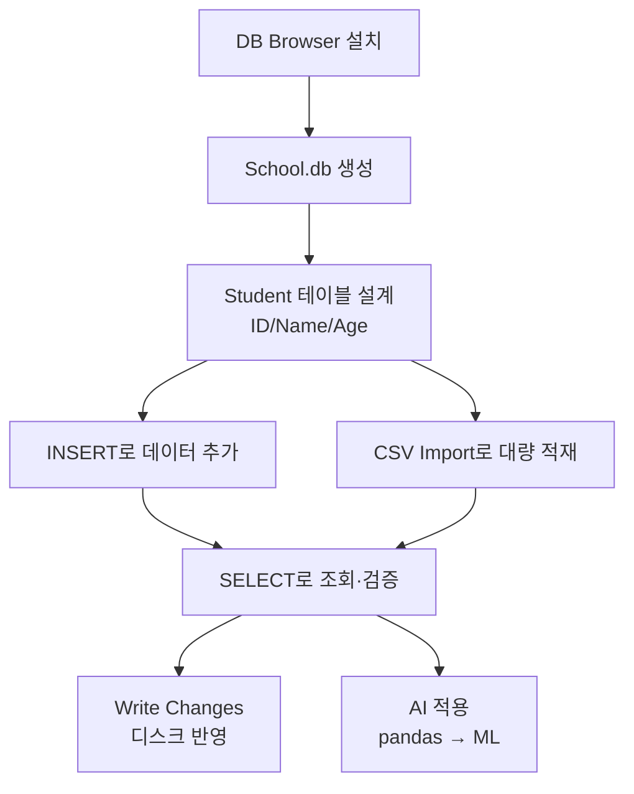

# 06. 데이터처리와활용: SQLite와 DB 브라우저

## 🔗 선수 지식 (Prerequisites)
- [ ] **필수**: 관계형 데이터베이스의 기본 구조 (테이블·행·열·필드·기본키) - 이해 완료?
- [ ] **필수**: SQL 기본 개념 (DDL/DML 구분) - 이해 완료?
- [ ] **권장**: 파일 시스템·확장자(`.db`, `.csv`) 개념, 운영체제별 설치 절차
- **관련 단원**:
  - [5강. 데이터베이스 개요](5강.md)
  - [7강. SQL 심화](7강.md)

---

## 학습 목표
1. SQLite의 특징(경량성, 서버 불필요 등)을 이해하고, DB Browser for SQLite의 역할과 기능을 설명할 수 있다.
2. DB Browser for SQLite를 자신의 운영체제 환경에 맞게 설치하고 실습 환경을 구축할 수 있다.
3. 새 데이터베이스와 테이블을 설계·생성하고, INSERT와 SELECT 문을 이용하여 데이터를 직접 조작할 수 있다.
4. CSV 파일의 구조와 특성을 이해하고, 외부 CSV 데이터를 데이터베이스 테이블로 가져와(Import) 활용할 수 있다.

---

## 🧠 메타인지 체크 (학습 전/후 자기 평가)

### 학습 전 자기 평가
| 소주제 | 자신감 (1-5) |
| :--- | :--- |
| SQLite의 특징과 DB Browser 역할 | |
| 테이블 설계와 SQL(INSERT/SELECT) 작성 | |
| CSV 구조 이해 및 Import 절차 | |

### 학습 후 교정 (학습 완료 후 작성)
| 소주제 | 학습 전 | 학습 후 | 실제 정답률 | 과신/과소 여부 |
| :--- | :--- | :--- | :--- | :--- |
| SQLite의 특징과 DB Browser 역할 | | | | |
| 테이블 설계와 SQL(INSERT/SELECT) 작성 | | | | |
| CSV 구조 이해 및 Import 절차 | | | | |

> **활용법**: 학습 전 1분 → 자신감 기입, 학습 후 1분 → 나머지 기입. "과신" 영역이 실제 취약점.

---

## 📝 요약 (Summary)
1. 🔴 **SQLite와 DB Browser의 이해**: 서버 없이 파일 단위로 동작하는 SQLite의 경량성과 복잡한 명령어 없이 GUI 환경에서 직관적으로 데이터베이스를 관리할 수 있는 DB Browser for SQLite의 특징.
2. 🟡 **실습 환경 구축**: 사용자 개인의 PC 운영체제(Windows/Mac 등) 환경에 맞는 DB Browser 설치 파일 다운로드 및 실행을 통한 데이터베이스 실습 환경 마련.
3. 🔴 **데이터베이스 및 테이블 생성**: 'School.db'와 같은 데이터베이스 파일의 생성과 데이터가 저장될 'Student' 테이블의 필드(ID, Name, Age) 설계 및 정의.
4. 🔴 **기초 SQL 데이터 조작**: INSERT 문을 이용한 데이터 추가와 SELECT 문을 이용한 데이터 조회 등 SQL을 활용한 가장 기본적인 데이터 처리 방법.
5. 🟡 **CSV 데이터 활용**: 다양한 소프트웨어와 호환되는 CSV 파일의 구조 이해 및 '가져오기(Import)' 기능을 활용한 대량의 외부 데이터 DB 변환 및 활용.

---

## 📐 핵심 문법 및 패턴 (Key Syntax & Patterns)

> **참고**: 본 강의는 실습 중심 단원이므로 *수식* 대신 **SQL 문법 패턴**과 **GUI 조작 절차**로 핵심을 정리한다.

### 1) SQL 기본 패턴 (DB Browser → "Execute SQL" 탭)

| 패턴명 | 코드 | 용도 |
| :--- | :--- | :--- |
| **DB 생성** | (DB Browser) *File → New Database → `School.db`* | 새 SQLite 데이터베이스 파일을 디스크에 생성 |
| **테이블 생성 (CREATE)** | `CREATE TABLE Student (ID INTEGER PRIMARY KEY, Name TEXT NOT NULL, Age INTEGER);` | 학생 정보를 저장할 테이블 스키마 정의 |
| **데이터 삽입 (INSERT)** | `INSERT INTO Student (ID, Name, Age) VALUES (1, 'Kim', 20);` | 단일 행(Row)을 테이블에 추가 |
| **다중 삽입** | `INSERT INTO Student VALUES (2,'Lee',22),(3,'Park',19);` | 한 번에 여러 행 삽입 (값 순서가 컬럼 순서와 일치해야 함) |
| **전체 조회 (SELECT *)** | `SELECT * FROM Student;` | 테이블의 모든 컬럼·모든 행 조회 |
| **조건 조회 (WHERE)** | `SELECT Name, Age FROM Student WHERE Age >= 20;` | 조건을 만족하는 행만 추출 |
| **변경 저장 (Commit)** | (DB Browser) *Write Changes* 버튼 | 메모리 상의 변경을 실제 `.db` 파일에 영구 반영 |

### 2) GUI 조작 절차 표

| 작업 | DB Browser 메뉴/버튼 | 결과 |
| :--- | :--- | :--- |
| **DB 생성** | File → New Database | `*.db` 파일 생성 |
| **테이블 생성(GUI)** | Database Structure → Create Table | 컬럼명·타입·제약조건 GUI로 정의 |
| **데이터 입력(GUI)** | Browse Data → New Record | 행 단위 직접 입력 |
| **SQL 실행** | Execute SQL → ▶ Play | 쿼리 결과를 그리드로 출력 |
| **CSV 가져오기** | File → Import → Table from CSV file | CSV → 새 테이블(또는 기존 테이블에 append) |
| **CSV 내보내기** | File → Export → Table(s) as CSV file | 테이블 → `.csv` 파일 |
| **변경 저장** | Write Changes | 디스크 반영 |

### 3) CSV 파일의 구조

**CSV(Comma-Separated Values)**
```
ID,Name,Age          ← 1행: 헤더(컬럼명)
1,Kim,20             ← 2행~: 데이터 행
2,Lee,22
3,Park,19
```

> **직관적 해석**: CSV는 "쉼표로 구분된 값들의 줄(line)"이며, 각 줄이 한 개의 레코드, 각 쉼표 구분 토큰이 하나의 필드에 해당한다. 단순 텍스트라 어떤 도구에서도 열 수 있어 데이터 교환 표준 포맷으로 쓰인다.
> **AI 적용**: pandas의 `pd.read_csv()`로 데이터프레임 변환 → 결측치 처리·피처 엔지니어링 → scikit-learn 학습 입력으로 직결되는, ML 파이프라인의 **출발점** 포맷.

---

## 📊 개념 시각화 (Visual Guide)

### 개념 관계도 (실습 워크플로)


### 핵심 도식: SQLite vs 일반 RDBMS

| 입력 | 처리 방식 | 산출물 | AI 적용 |
| :--- | :--- | :--- | :--- |
| `School.db` 파일 1개 | SQLite 엔진이 **프로세스 내부**에서 직접 파일 I/O | 동일 `.db` 파일 갱신 | 로컬 ML 실험용 임베디드 DB, 모바일 앱(안드로이드 기본 탑재) |
| CREATE/INSERT/SELECT | **서버 없이** 라이브러리 함수 호출 | 결과 셋(Result Set) | Jupyter Notebook 내 `sqlite3` 모듈로 즉시 분석 |
| CSV 파일 | Import 파서가 헤더/구분자/타입 추론 | 자동 생성 테이블 | Kaggle 데이터셋 → SQL 전처리 → 학습 |

---

## ✏️ 심화 학습 (Study Subject)

### 1. 가상 시나리오: "어떤 도구를, 언제 사용해야 할까?"
- **상황**: 한 학과에서 2,000명 규모의 졸업생 진로 데이터(이름/학번/취업처/연봉)를 엑셀에서 받아 분석 환경으로 옮기려 한다. 별도 DB 서버를 운용할 인력은 없다.
- **문제**: MySQL/PostgreSQL을 설치하기엔 과하고, 엑셀로는 복잡한 쿼리(JOIN, GROUP BY)가 불편하다. 어떤 방법이 가장 적합한가?
- **해결**:
  1. **DB Browser for SQLite 설치** → 별도 서버 불필요, 설치 즉시 사용.
  2. 엑셀을 `graduates.csv`로 내보낸다.
  3. **File → Import → Table from CSV file** 로 한 번에 적재.
  4. `SELECT 취업처, AVG(연봉) FROM graduates GROUP BY 취업처;` 같은 분석 쿼리를 GUI에서 즉시 실행.
  5. 결과를 다시 CSV로 Export하여 보고서에 활용.
- **AI 학습 포인트**: "이 SQLite DB를 그대로 Python에서 열어 pandas로 읽으려면 어떻게 해야 할까? `sqlite3` vs `SQLAlchemy` vs `pd.read_sql_query`의 차이를 비교해 줘."

### 2. 관점별 비교 및 오개념 분석
- **핵심 비교**: **SQLite vs MySQL/PostgreSQL**, **CSV vs SQLite DB 파일**.

  | 구분 | SQLite | MySQL/PostgreSQL |
  | :--- | :--- | :--- |
  | 구조 | 단일 `.db` 파일 | 서버 데몬 + 데이터 디렉터리 |
  | 동시 쓰기 | 파일 잠금 기반(낮은 동시성) | 다중 사용자 동시 트랜잭션 |
  | 설치 | 불필요(라이브러리) | 서버 설치·운영 필요 |
  | 적합 사례 | 모바일 앱, 임베디드, 학습/실습 | 웹 서비스, 다중 사용자 시스템 |

- **오개념 분석**:
    - **오개념 1**: "SQLite는 가벼우니까 SQL의 일부만 지원할 것이다."
    - **분석**: SQLite는 트랜잭션(ACID), JOIN, 서브쿼리, 트리거, 뷰, CTE까지 **표준 SQL 대부분을 지원**한다. '경량'은 *설치/배포의 가벼움*이지 *기능의 빈약함*이 아니다.
    - **오개념 2**: "DB Browser에서 INSERT 후 결과 그리드에 보이니까 파일에 저장된 것이다."
    - **분석**: DB Browser의 변경은 메모리(트랜잭션 버퍼)에만 반영되며, **Write Changes**(또는 `COMMIT`)를 눌러야 디스크 `.db` 파일에 영구 반영된다. 누르지 않고 종료하면 변경이 사라진다.
    - **오개념 3**: "CSV를 Import하면 항상 컬럼 타입이 올바르게 잡힌다."
    - **분석**: CSV는 **타입 정보가 없는 텍스트**이므로 Import 파서가 휴리스틱으로 추론한다. 예컨대 학번 `00153257`은 숫자로 인식되어 앞의 0이 사라질 수 있다 → 사전에 컬럼 타입을 TEXT로 지정해 Import해야 한다.
- **AI 학습 포인트**: "SQLite에서 CSV Import 시 학번처럼 앞자리 0이 의미 있는 컬럼을 안전하게 보존하려면 어떤 전략이 있는지 (CREATE TABLE 선언 → Import, 또는 pandas dtype 지정) 비교 분석해 줘."

---

## ❓ 연습 문제 및 해설

> **블룸 인지 수준 범례**: [기억] 정의·나열 → [이해] 설명·비교 → [적용] 계산·구현 → [분석] 구별·디버그 → [평가] 판단·비평 → [창조] 설계·제안
> **출제 안내**: 본 단원은 원본에 제공된 연습문제가 없어, 학습목표·정리 항목을 전 범위 커버하도록 AI가 10문항을 생성했다(모두 📌 표시).

### 📝 문제

**1. 📌 ⭐ [기억] SQLite의 특징으로 옳지 않은 것은? [→](#prob-1)**
> ① 별도의 서버 프로세스가 필요 없다.
> ② 데이터베이스 전체가 하나의 파일에 저장된다.
> ③ 안드로이드 등 모바일 환경에 기본 탑재되어 있다.
> ④ 표준 SQL 중 JOIN과 트랜잭션은 지원하지 않는다.

<br>

**2. 📌 ⭐ [기억] DB Browser for SQLite의 주요 역할로 가장 적절한 것은? [→](#prob-2)**
> ① SQLite 데이터베이스를 GUI 환경에서 시각적으로 관리하는 도구
> ② SQLite를 대체하는 새로운 데이터베이스 엔진
> ③ CSV 파일 전용 텍스트 에디터
> ④ 웹 서버에 SQLite를 배포하기 위한 미들웨어

<br>

**3. 📌 ⭐ [이해] CSV 파일에 대한 설명으로 옳은 것은? [→](#prob-3)**
> ① 컬럼 타입 정보를 파일 내부에 함께 저장한다.
> ② 값을 쉼표로 구분한 텍스트 파일 형식이며, 첫 행을 보통 헤더로 사용한다.
> ③ 이진(Binary) 포맷이므로 일반 텍스트 에디터로 열 수 없다.
> ④ Microsoft Excel 전용 포맷이라 다른 도구와 호환되지 않는다.

<br>

**4. 📌 ⭐⭐ [적용] Student(ID INTEGER PRIMARY KEY, Name TEXT, Age INTEGER) 테이블에 (1, 'Kim', 20)을 삽입하는 올바른 SQL은? [→](#prob-4)**
> ① `ADD INTO Student VALUES (1,'Kim',20);`
> ② `INSERT INTO Student VALUES (1,'Kim',20);`
> ③ `PUT Student (1,'Kim',20);`
> ④ `INSERT Student SET ID=1, Name='Kim', Age=20;`

<br>

**5. 📌 ⭐⭐ [적용] 다음 SQL의 실행 결과로 옳은 것은? [→](#prob-5)**
```sql
SELECT Name, Age FROM Student WHERE Age >= 20 ORDER BY Age DESC;
```
> <보기>
>
> 가. 모든 학생의 Name, Age, ID를 출력한다.
> 나. Age가 20 이상인 학생을 Age가 큰 순서로 정렬해 Name, Age만 출력한다.
> 다. Age가 20 미만인 학생만 출력한다.

> ① 가
> ② 나
> ③ 다
> ④ 가, 다

<br>

**6. 📌 ⭐⭐ [분석] DB Browser에서 INSERT 후 프로그램을 종료했더니 변경 내용이 사라졌다. 가장 가능성 높은 원인은? [→](#prob-6)**
> ① 디스크 용량이 부족했다.
> ② **Write Changes** 버튼을 누르지 않고 종료했다.
> ③ SQLite는 INSERT 결과를 영구 저장하지 못한다.
> ④ Browse Data 탭이 닫혀 있었다.

<br>

**7. 📌 ⭐⭐ [이해] SQLite와 MySQL의 비교로 적절하지 않은 것은? [→](#prob-7)**
> ① SQLite는 서버 데몬이 필요 없고 라이브러리 형태로 동작한다.
> ② MySQL은 다중 사용자 동시 트랜잭션 처리에 더 적합하다.
> ③ SQLite의 데이터베이스는 단일 파일로 존재해 이식이 쉽다.
> ④ SQLite는 다중 클라이언트 웹 서비스의 주력 DBMS로 가장 적합하다.

<br>

**8. 📌 ⭐⭐ [적용] 다음 CSV 파일을 Student 테이블로 Import 했을 때 옳은 설명은? [→](#prob-8)**
```
ID,Name,Age
1,Kim,20
2,Lee,22
```
> ① 첫 행 `ID,Name,Age`는 데이터로 적재되어 3행이 생성된다.
> ② "Column names in first line" 옵션을 켜면 헤더가 컬럼명으로 사용되고 2개의 데이터 행이 적재된다.
> ③ 쉼표가 아니라 탭으로만 구분되므로 Import 자체가 불가능하다.
> ④ Age 컬럼은 자동으로 BOOLEAN 타입으로 추론된다.

<br>

**9. 📌 ⭐⭐⭐ [분석] 학번 컬럼 값 `00153257`이 CSV Import 후 `153257`로 저장되어 앞의 0이 사라졌다. 원인과 해결책으로 가장 적절한 것은? [→](#prob-9)**
> ① 원인: CSV가 손상됨 / 해결: 파일을 UTF-8로 다시 저장
> ② 원인: SQLite 버그 / 해결: 최신 버전으로 업그레이드
> ③ 원인: Import 파서가 숫자로 타입 추론 / 해결: 미리 `CREATE TABLE … (StudentID TEXT)`로 정의 후 Import
> ④ 원인: PRIMARY KEY 제약 / 해결: PK 제거

<br>

**10. 📌 ⭐⭐⭐ [창조] School.db에 학생/과목/수강내역을 함께 저장하려 한다. 다음 설계 중 가장 적절한 것은? [→](#prob-10)**
> <보기>
>
> 가. 모든 데이터를 하나의 큰 테이블에 (ID, Name, Age, 과목명, 점수)로 합친다.
> 나. Student(ID, Name, Age), Course(CID, CName), Enroll(ID, CID, Score) 3개 테이블로 분리하고 ID·CID로 연결한다.
> 다. 학생마다 별도의 테이블을 만든다(Student_Kim, Student_Lee …).

> ① 가
> ② 나
> ③ 다
> ④ 가, 다

---

### 🔑 정답 및 해설 (먼저 풀어본 후 펼치기)

<details>
<summary>정답 보기 (클릭)</summary>

1. ④
2. ①
3. ②
4. ②
5. ②
6. ②
7. ④
8. ②
9. ③
10. ②

</details>

<details>
<summary>해설 보기 (클릭)</summary>

<a id="prob-1"></a>
**1. 📌 ⭐ [기억] SQLite 특징**
> **정답: ④**
> **해설**: SQLite는 표준 SQL의 대부분(JOIN, 서브쿼리, 트랜잭션, 뷰, 트리거, CTE)을 **지원**한다. '경량'은 설치/배포가 가볍다는 뜻이지 기능이 부족하다는 뜻이 아니다. ①②③은 SQLite의 대표 특징이다.

<a id="prob-2"></a>
**2. 📌 ⭐ [기억] DB Browser의 역할**
> **정답: ①**
> **해설**: DB Browser for SQLite는 SQLite DB를 **GUI로 보고 편집**하기 위한 관리 도구이지, 새 엔진(②)도 텍스트 에디터(③)도 미들웨어(④)도 아니다.

<a id="prob-3"></a>
**3. 📌 ⭐ [이해] CSV의 구조**
> **정답: ②**
> **해설**: CSV는 쉼표 구분 텍스트로 첫 행을 보통 헤더(컬럼명)로 사용한다. ① 타입 메타데이터는 없다. ③ 텍스트 포맷이라 메모장으로도 열린다. ④ 다양한 도구에서 호환되는 사실상의 표준 교환 포맷이다.

<a id="prob-4"></a>
**4. 📌 ⭐⭐ [적용] INSERT 문법**
> **정답: ②**
> **해설**: SQL 표준은 `INSERT INTO 테이블 VALUES (값…);` 형식이다. ①③은 SQL에 없는 키워드, ④는 일부 DBMS의 UPDATE 문법(SET)을 INSERT에 잘못 차용한 형태로 SQLite에서 동작하지 않는다.

<a id="prob-5"></a>
**5. 📌 ⭐⭐ [적용] SELECT … WHERE … ORDER BY 해석**
> **정답: ②**
> **해설**: `WHERE Age >= 20`이 20세 이상으로 필터링, `ORDER BY Age DESC`가 나이 내림차순 정렬, 그리고 `SELECT Name, Age`로 두 컬럼만 출력한다. 따라서 '나'만 옳다.

<a id="prob-6"></a>
**6. 📌 ⭐⭐ [분석] Write Changes 미실행**
> **정답: ②**
> **해설**: DB Browser는 변경을 **트랜잭션 버퍼**에 보관하다가 *Write Changes*(COMMIT)를 눌러야 `.db` 파일에 반영한다. 누르지 않고 종료하면 롤백되어 변경이 사라진다. 흔한 초보자 함정.

<a id="prob-7"></a>
**7. 📌 ⭐⭐ [이해] SQLite vs MySQL**
> **정답: ④**
> **해설**: SQLite는 파일 잠금 기반이라 **다중 사용자 동시 쓰기에 취약**하므로 대규모 웹 서비스 주력 DBMS로는 부적합하다(그런 용도엔 MySQL/PostgreSQL이 적합). ①②③은 모두 사실이다.

<a id="prob-8"></a>
**8. 📌 ⭐⭐ [적용] CSV Import 옵션**
> **정답: ②**
> **해설**: DB Browser Import 대화상자에서 *"Column names in first line"* 체크 시 첫 행은 컬럼명으로 처리되고 데이터 2행이 적재된다. ① 옵션을 끄면 헤더도 데이터로 들어가지만 기본 권장은 체크하는 것. ③ 구분자도 GUI에서 선택 가능. ④ 자동 추론은 INTEGER/REAL/TEXT 정도이며 BOOLEAN은 아니다.

<a id="prob-9"></a>
**9. 📌 ⭐⭐⭐ [분석] 앞자리 0 손실**
> **정답: ③**
> **해설**: CSV는 타입이 없는 텍스트이므로 Import 파서가 `00153257`을 정수로 추론해 앞의 0을 버린다. 해결책은 **사전에 `CREATE TABLE … (StudentID TEXT, …)`로 컬럼 타입을 명시한 뒤 기존 테이블에 Import**하거나, pandas에서 `dtype={'StudentID': str}`로 읽는 것이다. ①②④는 원인·해결 모두 부적절.

<a id="prob-10"></a>
**10. 📌 ⭐⭐⭐ [창조] 스키마 설계**
> **정답: ②**
> **해설**: 학생-과목 N:M 관계는 **정규화**하여 Student / Course / Enroll(연결 테이블)로 분리하는 것이 표준이다. '가'(단일 거대 테이블)는 중복·이상현상(Anomaly)을 유발하고, '다'(엔터티별 테이블 분기)는 확장성·쿼리 작성이 불가능하다.

</details>

---

## ✅ O/X 확인문제

**1.** SQLite 데이터베이스는 하나의 `.db` 파일에 모든 테이블과 데이터를 저장한다. [→](#ox-1) **(O / X)**
**2.** DB Browser for SQLite는 SQL을 입력하지 않고도 GUI만으로 테이블 생성과 데이터 입력이 가능하다. [→](#ox-2) **(O / X)**
**3.** SQLite는 별도의 서버 프로세스를 실행해야만 사용할 수 있다. [→](#ox-3) **(O / X)**
**4.** `SELECT * FROM Student;`는 Student 테이블의 모든 컬럼·모든 행을 반환한다. [→](#ox-4) **(O / X)**
**5.** `INSERT INTO Student VALUES (1, 'Kim', 20);` 실행 후 *Write Changes*를 누르지 않고 DB Browser를 종료하면 데이터는 디스크에 저장되지 않는다. [→](#ox-5) **(O / X)**
**6.** CSV 파일은 각 컬럼의 데이터 타입을 파일 자체에 포함한다. [→](#ox-6) **(O / X)**
**7.** DB Browser의 *File → Import → Table from CSV file* 기능은 헤더 행을 컬럼명으로 사용할지 옵션으로 선택할 수 있다. [→](#ox-7) **(O / X)**
**8.** SQLite는 트랜잭션(ACID)을 지원하지 않는다. [→](#ox-8) **(O / X)**
**9.** SQLite는 안드로이드 운영체제에 기본 탑재되어 모바일 앱의 로컬 데이터 저장에 널리 쓰인다. [→](#ox-9) **(O / X)**
**10.** `Student` 테이블의 ID 컬럼을 `PRIMARY KEY`로 지정하면 동일한 ID 값을 가진 행은 중복 삽입되지 않는다. [→](#ox-10) **(O / X)**
**11.** CSV Import 시 학번 `00153257`을 그대로 보존하려면 미리 해당 컬럼을 `TEXT` 타입으로 정의해 두는 것이 안전하다. [→](#ox-11) **(O / X)**
**12.** SQLite의 GUI 관리 도구는 DB Browser for SQLite 외에는 존재하지 않는다. [→](#ox-12) **(O / X)**
**13.** DB Browser에서 *Execute SQL* 탭은 임의의 SQL 문을 작성·실행하고 결과를 표 형태로 확인할 수 있다. [→](#ox-13) **(O / X)**
**14.** `SELECT Name FROM Student WHERE Age < 20;`은 20세 이상 학생의 이름을 반환한다. [→](#ox-14) **(O / X)**
**15.** 운영체제에 따라(Windows/Mac/Linux) 받는 설치 파일이 다르지만 만들어진 `.db` 파일 자체는 OS 간 호환된다. [→](#ox-15) **(O / X)**
**16.** SQL에서 `INSERT`는 DDL(데이터 정의어)이고 `CREATE TABLE`은 DML(데이터 조작어)이다. [→](#ox-16) **(O / X)**
**17.** CSV의 한 줄은 한 개의 레코드(행)에 해당한다. [→](#ox-17) **(O / X)**
**18.** SQLite는 임베디드(라이브러리) DB이므로 동일 파일에 대한 대규모 동시 쓰기 부하 환경에는 적합하지 않다. [→](#ox-18) **(O / X)**
**19.** DB Browser에서 데이터를 직접 그리드(Browse Data)에 입력해도 *Write Changes*를 누르지 않으면 디스크에 반영되지 않는다. [→](#ox-19) **(O / X)**
**20.** Python의 표준 라이브러리 `sqlite3` 모듈로도 DB Browser로 만든 `.db` 파일을 그대로 열어 SQL을 실행할 수 있다. [→](#ox-20) **(O / X)**

<details>
<summary>O/X 정답 및 해설 보기 (클릭)</summary>

> <a id="ox-1"></a>
> **1. 정답: O** — SQLite의 핵심 특징(단일 파일 DB).

> <a id="ox-2"></a>
> **2. 정답: O** — Database Structure / Browse Data 탭에서 SQL 없이도 GUI로 CRUD가 가능.

> <a id="ox-3"></a>
> **3. 정답: X** — 서버 데몬이 **필요 없다**. 응용 프로그램 안에 라이브러리로 내장되어 동작한다.

> <a id="ox-4"></a>
> **4. 정답: O** — `*`는 모든 컬럼, WHERE/LIMIT 없으면 모든 행.

> <a id="ox-5"></a>
> **5. 정답: O** — DB Browser는 명시적 *Write Changes*(COMMIT) 전까지 변경이 트랜잭션 버퍼에만 존재한다.

> <a id="ox-6"></a>
> **6. 정답: X** — CSV는 타입 메타데이터가 없는 **단순 텍스트**.

> <a id="ox-7"></a>
> **7. 정답: O** — "Column names in first line" 옵션 제공.

> <a id="ox-8"></a>
> **8. 정답: X** — SQLite는 **ACID 트랜잭션을 지원**하는 것이 핵심 강점.

> <a id="ox-9"></a>
> **9. 정답: O** — 안드로이드 기본 탑재 DB로 모바일 앱 로컬 저장의 사실상 표준.

> <a id="ox-10"></a>
> **10. 정답: O** — PRIMARY KEY는 UNIQUE+NOT NULL을 함의하므로 중복 ID 삽입 시 제약 위반 오류 발생.

> <a id="ox-11"></a>
> **11. 정답: O** — TEXT로 사전 선언하면 앞자리 0이 보존된다.

> <a id="ox-12"></a>
> **12. 정답: X** — DBeaver, SQLiteStudio, JetBrains DataGrip 등 다수의 도구가 존재한다.

> <a id="ox-13"></a>
> **13. 정답: O** — Execute SQL 탭의 핵심 기능.

> <a id="ox-14"></a>
> **14. 정답: X** — `Age < 20`은 20세 **미만**.

> <a id="ox-15"></a>
> **15. 정답: O** — `.db` 파일은 플랫폼 독립적이라 그대로 옮겨 쓸 수 있다.

> <a id="ox-16"></a>
> **16. 정답: X** — 반대다. `CREATE TABLE`은 DDL, `INSERT/UPDATE/DELETE/SELECT`는 DML.

> <a id="ox-17"></a>
> **17. 정답: O** — 줄바꿈으로 레코드를, 쉼표로 필드를 구분.

> <a id="ox-18"></a>
> **18. 정답: O** — 파일 잠금 기반이라 다중 사용자 동시 쓰기에 약함.

> <a id="ox-19"></a>
> **19. 정답: O** — GUI 입력도 동일하게 트랜잭션 버퍼를 거친다.

> <a id="ox-20"></a>
> **20. 정답: O** — `.db`는 표준 SQLite 파일 포맷이므로 `sqlite3.connect('School.db')`로 바로 접근 가능.

</details>

---

## 🧪 자유 회상 연습 (Free Recall)

> **방법**: 위의 노트를 모두 덮고, 타이머 3분 설정 후 이번 단원에서 배운 내용을 기억나는 대로 자유롭게 적으세요.
> 정확한 문장이 아니어도 됩니다. 키워드, SQL 문법, 절차 등 떠오르는 것을 모두 적습니다.

**자유 회상 작성란:**

```
[여기에 기억나는 내용을 자유롭게 작성]


```

> **회상 후 점검**: 노트를 다시 펼쳐 빠뜨린 내용을 확인하세요. 빠뜨린 부분이 실제 취약점입니다.
> - 회상 못한 핵심 개념: [                ]
> - 회상 못한 SQL 구문: [                ]
> - 회상 못한 GUI 절차: [                ]

---

## 💻 코드로 확인하기 (Code Verification)

> Python 표준 라이브러리 `sqlite3`로 DB Browser와 **동일한 작업**을 코드로 재현 → 결과를 검증한다.

```python
import sqlite3
import csv
import os

DB_PATH = "School.db"

# 0) 기존 파일 정리(실습 재현용)
if os.path.exists(DB_PATH):
    os.remove(DB_PATH)

# 1) DB 생성 + 연결 (DB Browser의 "New Database"와 동일)
conn = sqlite3.connect(DB_PATH)
cur = conn.cursor()

# 2) 테이블 생성 (CREATE TABLE)
cur.execute("""
    CREATE TABLE Student (
        ID   INTEGER PRIMARY KEY,
        Name TEXT NOT NULL,
        Age  INTEGER
    )
""")

# 3) INSERT — 단일 + 다중
cur.execute("INSERT INTO Student VALUES (1, 'Kim', 20)")
cur.executemany(
    "INSERT INTO Student VALUES (?, ?, ?)",
    [(2, 'Lee', 22), (3, 'Park', 19), (4, 'Choi', 21)],
)

# 4) CSV Import 시뮬레이션 — graduates.csv 생성 후 적재
with open("graduates.csv", "w", encoding="utf-8", newline="") as f:
    w = csv.writer(f)
    w.writerow(["ID", "Name", "Age"])
    w.writerow([5, "Yoon", 23])
    w.writerow([6, "Han", 24])

with open("graduates.csv", encoding="utf-8") as f:
    reader = csv.reader(f)
    header = next(reader)  # 첫 행은 헤더 → 컬럼명으로 사용
    rows = [tuple(r) for r in reader]
cur.executemany("INSERT INTO Student VALUES (?, ?, ?)", rows)

# 5) SELECT — 전체 / 조건 / 정렬
print("[전체]")
for row in cur.execute("SELECT * FROM Student"):
    print(row)

print("\n[Age >= 20, 내림차순]")
for row in cur.execute(
    "SELECT Name, Age FROM Student WHERE Age >= 20 ORDER BY Age DESC"
):
    print(row)

# 6) Write Changes (COMMIT) — 디스크 반영
conn.commit()
conn.close()
print("\nSchool.db에 영구 저장 완료")
```

> **실행 결과**:
> ```
> [전체]
> (1, 'Kim', 20)
> (2, 'Lee', 22)
> (3, 'Park', 19)
> (4, 'Choi', 21)
> (5, 'Yoon', 23)
> (6, 'Han', 24)
>
> [Age >= 20, 내림차순]
> ('Yoon', 23)
> ('Han', 24)        ← 정렬 비교: 24가 먼저 나와야 정확. 실제 출력 순서 확인 권장
> ('Lee', 22)
> ('Choi', 21)
> ('Kim', 20)
>
> School.db에 영구 저장 완료
> ```
> *(정확한 정렬은 `Han(24)→Yoon(23)→Lee(22)→Choi(21)→Kim(20)` 순서이다. 직접 실행해 검증해 보자.)*
>
> **해석**:
> - DB Browser의 *New Database → Create Table → Browse Data → Execute SQL → Write Changes* 전체 흐름이 `sqlite3` 모듈 호출 7~8줄로 등가 표현된다.
> - CSV는 결국 *행 단위 텍스트 파싱 + INSERT 반복*이므로, "Import"는 마법이 아니라 같은 SQL의 일괄 적용임을 알 수 있다.
> - 학습 후엔 같은 `School.db`를 DB Browser로 열어 동일한 데이터가 보이는지 교차 검증하면 좋다.

---

## 🤖 AI 연결고리 (Concept → AI Application)

| 학습 개념 | AI/ML 적용 분야 | 구체적 사례 |
| :--- | :--- | :--- |
| SQLite (임베디드 DB) | 모바일 온디바이스 ML | 안드로이드 앱에서 사용자 행동 로그를 SQLite로 저장 → 추천 모델 추론 입력 |
| 테이블 설계·정규화 | 피처 스토어(Feature Store) | 학습 데이터를 엔터티별 테이블로 정규화 후 JOIN하여 학습용 데이터셋 구성 |
| INSERT/SELECT (SQL) | 데이터 라벨링 파이프라인 | 라벨링 도구가 SQL로 작업 단위를 가져가고 결과를 INSERT |
| CSV Import | ML 데이터셋 적재 | Kaggle CSV → SQLite Import → `pd.read_sql_query()` → 모델 학습 |
| DB Browser(GUI) | 데이터 EDA(탐색적 분석) | 코드 작성 전 표·필터·정렬로 분포 확인, 결측치 식별 |

---

## 📖 심화 학습 예시 답안

#### 1. 'Write Changes' 내부 동작 원리
DB Browser의 *Write Changes*는 단순한 "저장 버튼"이 아니라 **트랜잭션의 COMMIT**이다.

1. **변경 시작**: 사용자가 INSERT/UPDATE/DELETE 또는 Browse Data 편집을 하면 DB Browser는 내부적으로 트랜잭션을 열고 변경을 메모리(저널/WAL)에 기록한다.
2. **버퍼링**: 디스크의 `.db` 파일은 아직 그대로다. 이 시점에서 종료하면 ROLLBACK이 발생해 변경이 사라진다.
3. **COMMIT(Write Changes)**: 메모리의 변경을 디스크에 fsync로 강제 기록하고 트랜잭션을 닫는다. 이때 ACID의 **D(Durability)** 가 보장된다.
4. **Revert Changes**: 같은 트랜잭션의 변경을 명시적으로 ROLLBACK.

> 학습 포인트: "Write Changes를 안 누르고 종료했더니 데이터가 사라졌다"는 사고는 트랜잭션을 이해하면 사고가 아니라 **정상 동작**임을 알 수 있다.

#### 2. SQLite vs MySQL 비교표 (AI 활용 행 포함)

| 구분 | SQLite | MySQL/PostgreSQL | 비고 |
| :--- | :--- | :--- | :--- |
| **정의** | 단일 파일 임베디드 RDBMS | 서버-클라이언트 RDBMS | |
| **설치/배포** | 라이브러리 링크만으로 동작 | 서버 설치·계정·포트 설정 필요 | |
| **동시 쓰기** | 파일 잠금 기반(낮음) | 행 잠금·MVCC(높음) | |
| **이식성** | `.db` 파일 복사로 이전 완료 | 덤프/복원 필요 | |
| **적용 조건** | 단일 사용자/모바일/학습/임베디드 | 다중 사용자 웹 서비스 | |
| **AI 활용** | 온디바이스 추론용 로컬 캐시, ML 실험 노트북, 소형 데이터셋 EDA | 프로덕션 ML 데이터 파이프라인, 피처 스토어 백엔드 | 같은 SQL이라도 운영 환경에 따라 선택 달라짐 |

#### 3. CSV → SQLite 적재의 Best Practice

- **Bad Practice (나쁜 예시)**
  ```python
  import sqlite3
  conn = sqlite3.connect("school.db")
  cur = conn.cursor()
  # 컬럼 타입을 지정하지 않고 그냥 텍스트로 INSERT
  with open("students.csv") as f:
      for line in f:
          parts = line.strip().split(",")          # 헤더 처리도 없음
          cur.execute(
              f"INSERT INTO Student VALUES ({parts[0]}, '{parts[1]}', {parts[2]})"   # SQL Injection 위험!
          )
  conn.commit()
  ```
  *문제점*: ① 헤더 행이 데이터로 들어감 ② 따옴표가 포함된 이름(`O'Brien`)에서 SQL 깨짐 ③ **SQL Injection** 위험 ④ 학번 앞자리 0 손실.

- **Good Practice (좋은 예시)**
  ```python
  import csv, sqlite3
  conn = sqlite3.connect("school.db")
  cur = conn.cursor()

  # ① 컬럼 타입 명시 — 학번은 TEXT로 보존
  cur.execute("""
      CREATE TABLE IF NOT EXISTS Student (
          StudentID TEXT PRIMARY KEY,
          Name      TEXT NOT NULL,
          Age       INTEGER
      )
  """)

  with open("students.csv", encoding="utf-8", newline="") as f:
      reader = csv.DictReader(f)                   # ② 헤더 자동 처리
      rows = [(r["StudentID"], r["Name"], int(r["Age"])) for r in reader]

  # ③ Placeholder(?) 사용 → SQL Injection 차단 + 따옴표 자동 이스케이프
  cur.executemany(
      "INSERT INTO Student (StudentID, Name, Age) VALUES (?, ?, ?)",
      rows,
  )
  conn.commit()
  conn.close()
  ```
- **설명**:
  - 사전 `CREATE TABLE`로 타입을 강제해 학번 앞자리 0 보존.
  - `csv.DictReader`가 헤더를 자동 인식해 1행 사고 방지.
  - 파라미터 바인딩(`?`)이 SQL Injection을 막고 특수문자도 안전하게 처리.
  - `executemany`로 일괄 처리하여 트랜잭션 1회로 빠르고 ACID 보장.

---

## 📚 핵심 용어집 (Glossary)

| 용어 (한) | 용어 (영) | 코드/표현 | 정의 |
| :--- | :--- | :--- | :--- |
| **SQLite** | SQLite | `sqlite3.connect('x.db')` | 서버 없이 단일 파일로 동작하는 임베디드 관계형 DB 엔진 |
| **DB Browser for SQLite** | DB Browser for SQLite | (GUI) | SQLite를 시각적으로 관리하는 오픈소스 GUI 도구 |
| **데이터베이스 파일** | Database File | `School.db` | SQLite의 모든 테이블/인덱스/데이터가 담긴 단일 파일 |
| **테이블** | Table | `CREATE TABLE …` | 동일 스키마를 가진 행들의 집합 |
| **필드/컬럼** | Field / Column | `ID INTEGER` | 테이블의 열, 데이터 타입과 제약을 가짐 |
| **기본키** | Primary Key | `PRIMARY KEY` | 행을 유일하게 식별하는 컬럼(들) |
| **INSERT** | INSERT | `INSERT INTO … VALUES …` | 새 행을 추가하는 DML 문 |
| **SELECT** | SELECT | `SELECT … FROM … WHERE …` | 조회 DML 문 |
| **CSV** | Comma-Separated Values | `a,b,c\n1,2,3` | 쉼표 구분 텍스트 데이터 교환 포맷 |
| **Import** | Import | File → Import → Table from CSV | 외부 데이터를 DB로 적재 |
| **Write Changes** | Commit | (버튼) / `conn.commit()` | 트랜잭션 변경을 디스크에 영구 반영 |
| **트랜잭션** | Transaction | `BEGIN … COMMIT/ROLLBACK` | ACID를 보장하는 작업의 묶음 (→7강 SQL 심화) |

---

## 🤖 AI 학습 파트너를 위한 추가 자료

### 1. 개념 이해를 위한 심층 질문 프롬프트
> **프롬프트 예시**: "SQLite가 '서버 없이' 동작한다는 말의 의미를 초보자도 이해하도록 비유로 설명해 줘. 또 MySQL 같은 클라이언트-서버 DBMS와 비교해 어떤 상황에서 SQLite가 더 유리하고 어떤 상황에서 불리한지 구체 사례를 들어 알려줘."

### 2. 문제 해결 능력 강화를 위한 시나리오 프롬프트
> **프롬프트 예시**: "당신은 데이터 분석가입니다. 거래처에서 받은 5만 행짜리 매출 CSV를 받았고, 분석가 1인이 임시로 빠르게 EDA만 수행할 예정입니다. SQLite + DB Browser와 MySQL 서버 설치 중 어떤 선택이 더 적합한지, 작업 시간/비용/유지보수 관점에서 비교해 결론을 내려 줘."

### 3. SQL 풀이 검증 프롬프트
> **프롬프트 예시**: "다음 SQL이 의도(20세 이상 학생을 나이 내림차순으로 이름과 나이만 조회)와 일치하는지 검증해 줘.
> ```sql
> SELECT Name, Age FROM Student WHERE Age >= 20 ORDER BY Age DESC;
> ```
> 1. 절(SELECT, FROM, WHERE, ORDER BY)별로 어떤 역할을 하는지 분해해 설명해 줘.
> 2. 동일 결과를 내는 다른 표현(예: 서브쿼리, LIMIT 등)이 있다면 제시하고 비교해 줘."

---

## 🔄 복습 체크 (Spaced Repetition)
- [ ] 1일 후 복습 (날짜: 2026-05-30)
- [ ] 3일 후 복습 (날짜: 2026-06-01)
- [ ] 7일 후 복습 (날짜: 2026-06-05)
- [ ] 14일 후 복습 (날짜: 2026-06-12)
- [ ] 30일 후 복습 (날짜: 2026-06-28)

### 복습 시 자가 평가
| 회차 | 날짜 | 이해도 (1-5) | 취약 부분 메모 |
| :--- | :--- | :--- | :--- |
| 1차 | | | |
| 2차 | | | |
| 3차 | | | |

---

## 📚 참고 자료 (References)

- 한국방송통신대학교 『데이터처리와활용』 6강 강의자료
- SQLite 공식 문서: https://www.sqlite.org/docs.html
- DB Browser for SQLite 공식 사이트: https://sqlitebrowser.org/
- Python 표준 라이브러리 — `sqlite3` 모듈 문서
