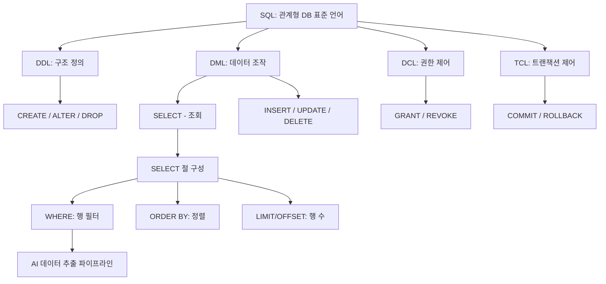
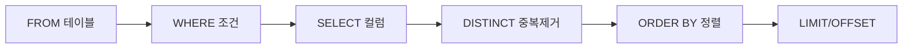

# 07. 데이터처리와활용: SQL 기초(1)

## 🔗 선수 지식 (Prerequisites)
- [ ] **필수**: 관계형 데이터베이스 기본 개념(테이블, 행, 열, 키) - 이해 완료?
- [ ] **필수**: 데이터 타입(정수, 문자열, 실수)의 차이 - 이해 완료?
- [ ] **권장**: SQLite 또는 DBMS 환경 구성 경험
- **관련 단원**: [6강. 관계형 데이터 모델](./6강.md), [8강. SQL 기초(2)](./8강.md)

---

## 학습 목표
1. SQL의 개념과 기능에 따른 분류(DDL, DML, DCL)를 설명하고 그 차이를 구분할 수 있다.
2. CREATE TABLE 문을 사용하여 적절한 데이터 타입과 제약 조건을 가진 테이블을 직접 생성할 수 있다.
3. SELECT 문과 WHERE 절, 그리고 다양한 연산자(비교, 논리, 패턴 매칭 등)를 활용하여 원하는 데이터를 정확히 조회할 수 있다.
4. ORDER BY와 LIMIT 절을 사용하여 조회된 데이터를 원하는 순서대로 정렬하고 필요한 개수만큼 추출할 수 있다.

---

## 🧠 메타인지 체크 (학습 전/후 자기 평가)

### 학습 전 자기 평가
| 소주제 | 자신감 (1-5) |
| :--- | :--- |
| SQL 분류 (DDL/DML/DCL) | |
| CREATE TABLE 및 데이터 타입/제약조건 | |
| SELECT-WHERE 필터링 (BETWEEN, IN, LIKE) | |
| ORDER BY, LIMIT/OFFSET | |

### 학습 후 교정 (학습 완료 후 작성)
| 소주제 | 학습 전 | 학습 후 | 실제 정답률 | 과신/과소 여부 |
| :--- | :--- | :--- | :--- | :--- |
| SQL 분류 (DDL/DML/DCL) | | | | |
| CREATE TABLE 및 데이터 타입/제약조건 | | | | |
| SELECT-WHERE 필터링 (BETWEEN, IN, LIKE) | | | | |
| ORDER BY, LIMIT/OFFSET | | | | |

> **활용법**: 학습 전 1분 → 자신감 기입, 학습 후 1분 → 나머지 기입. "과신" 영역이 실제 취약점.

---

## 📝 요약 (Summary)
1. 🔴 **SQL의 개요 및 분류**: 관계형 데이터베이스 표준 언어인 SQL의 특징과 용도에 따른 DDL(정의), DML(조작), DCL(제어)의 구분.
2. 🔴 **데이터 정의(DDL)**: CREATE TABLE 명령어를 이용한 테이블 구조 생성 및 데이터 타입(INTEGER, TEXT 등)과 제약 조건 설정.
3. 🟡 **데이터 조회 기초**: SELECT 문을 이용한 기본 데이터 검색, DISTINCT를 이용한 중복 제거 및 AS를 활용한 별칭(Alias) 지정.
4. 🔴 **조건부 데이터 검색**: WHERE 절과 다양한 연산자(비교, 논리, BETWEEN, IN, LIKE)를 조합한 정밀한 데이터 필터링 방법.
5. 🟡 **결과 정렬 및 제한**: ORDER BY를 이용한 데이터의 오름차순/내림차순 정렬과 LIMIT/OFFSET을 활용한 출력 행 개수 제어.

---

## 📐 핵심 문법 및 패턴 (Key Syntax & Patterns)

### SQL 명령어 분류 (기능별)

| 분류 | 명령어 | 용도 | 비고 |
| :--- | :--- | :--- | :--- |
| **DDL** (Data Definition Language) | `CREATE`, `ALTER`, `DROP`, `TRUNCATE` | 테이블·스키마 구조 정의/변경/삭제 | 자동 커밋 |
| **DML** (Data Manipulation Language) | `SELECT`, `INSERT`, `UPDATE`, `DELETE` | 데이터 조회·삽입·수정·삭제 | 트랜잭션 대상 |
| **DCL** (Data Control Language) | `GRANT`, `REVOKE` | 권한 부여/회수 | 보안 관리 |
| **TCL** (Transaction Control) | `COMMIT`, `ROLLBACK`, `SAVEPOINT` | 트랜잭션 제어 | DML과 함께 사용 |

### 핵심 문법 패턴

| 패턴명 | 문법 | 용도 |
| :--- | :--- | :--- |
| **테이블 생성** | `CREATE TABLE 테이블명 (컬럼 타입 제약조건, ...);` | 구조 정의 |
| **기본 조회** | `SELECT 컬럼 FROM 테이블;` | 전체/특정 컬럼 조회 |
| **중복 제거** | `SELECT DISTINCT 컬럼 FROM 테이블;` | 유일값 추출 |
| **별칭 지정** | `SELECT 컬럼 AS 별칭 FROM 테이블;` | 결과 가독성 향상 |
| **조건 필터링** | `SELECT * FROM 테이블 WHERE 조건;` | 행 필터링 |
| **범위 조건** | `WHERE 컬럼 BETWEEN A AND B` | A 이상 B 이하 |
| **목록 조건** | `WHERE 컬럼 IN (값1, 값2, ...)` | 다중 값 비교 |
| **패턴 매칭** | `WHERE 컬럼 LIKE '패턴'` | `%`(0개 이상), `_`(1개) |
| **NULL 처리** | `WHERE 컬럼 IS NULL` / `IS NOT NULL` | NULL 비교 전용 |
| **정렬** | `ORDER BY 컬럼 [ASC\|DESC]` | 기본 ASC(오름차순) |
| **행 수 제한** | `LIMIT n OFFSET m` | m번째 다음부터 n개 |

### 주요 제약 조건 (Constraints)

```sql
CREATE TABLE student (
    id      INTEGER PRIMARY KEY,            -- 기본키(중복·NULL 불가)
    name    TEXT    NOT NULL,               -- NULL 금지
    email   TEXT    UNIQUE,                 -- 중복 금지
    age     INTEGER CHECK (age >= 0),       -- 값 범위 제약
    dept    TEXT    DEFAULT '미배정',        -- 기본값
    advisor INTEGER REFERENCES prof(id)     -- 외래키
);
```

> **직관적 해석**: DDL은 "그릇(테이블)을 빚는 도구", DML은 "그릇에 음식(데이터)을 담고 꺼내는 도구". `WHERE`는 행을 거르고, `SELECT 컬럼 목록`은 열을 추린다. `ORDER BY`는 결과 줄세우기, `LIMIT`은 줄에서 앞 N명만 부른다.
> **AI 적용**: ML 파이프라인의 *데이터 전처리 단계*는 대부분 SQL로 시작한다. 예를 들어 `WHERE label IS NOT NULL`로 라벨 결측치를 제거하고, `ORDER BY created_at DESC LIMIT 100000`으로 학습용 최신 샘플을 추출한다.

---

## 📊 개념 시각화 (Visual Guide)

### SQL 분류 체계도


### SELECT 문 실행 순서 (논리적)


### 핵심 비교표
| 구분 | 입력 | 처리 | 출력 | AI 적용 |
| :--- | :--- | :--- | :--- | :--- |
| **DDL** | 스키마 정의문 | 메타데이터 변경 | 테이블/스키마 | 피처 스토어 스키마 설계 |
| **DML(SELECT)** | 조건/정렬/제한 | 행·열 필터링 | 결과 집합 | 학습 데이터 추출 |
| **WHERE** | 행 + 조건식 | 행별 평가 | 조건 만족 행 | 결측·이상치 제거 |
| **ORDER BY + LIMIT** | 결과집합 | 정렬 + 절단 | 상위/하위 N행 | Top-K 샘플링 |

---

## ✏️ 심화 학습 (Study Subject)

### 1. 가상 시나리오: "어떤 문법을, 언제 사용해야 할까?"
- **상황**: 추천시스템 학습을 위해 최근 1년간 활성 사용자(`status='active'`) 중 평균 평점이 4.0 이상인 사용자 상위 1만 명의 데이터만 필요하다.
- **문제**: 모든 사용자(수억 행)를 메모리에 로딩하면 안 된다. SQL 한 줄로 필요한 데이터만 추출해야 한다.
- **해결**:
  ```sql
  SELECT user_id, avg_rating, last_login
  FROM users
  WHERE status = 'active'
    AND last_login BETWEEN '2025-05-29' AND '2026-05-29'
    AND avg_rating >= 4.0
  ORDER BY avg_rating DESC
  LIMIT 10000;
  ```
- **AI 학습 포인트**: "이 쿼리가 인덱스 없이 실행되면 어떤 성능 문제가 발생하는가? `WHERE` 절의 조건 순서가 성능에 영향을 주는가, 아니면 옵티마이저가 자동으로 재배치하는가?"

### 2. 관점별 비교 및 오개념 분석
- **핵심 비교**:

  | 구분 | `WHERE col = NULL` | `WHERE col IS NULL` |
  | :--- | :--- | :--- |
  | 결과 | 항상 거짓 (행 0개) | NULL 행을 정확히 반환 |
  | 이유 | NULL은 "알 수 없음" → 어떤 비교도 UNKNOWN | NULL 전용 비교 연산자 |

- **오개념 분석**:
    - **오개념 1**: "`DISTINCT`는 중복 행만 골라서 보여준다."
    - **분석**: 정반대다. `DISTINCT`는 **중복을 제거하고 유일한 행만 남긴다**. 중복 행을 식별하려면 `GROUP BY col HAVING COUNT(*) > 1` 패턴을 사용해야 한다.
    - **오개념 2**: "`LIKE '010-%'`는 정규표현식이다."
    - **분석**: SQL `LIKE`는 정규식이 아니라 **단순 와일드카드 매칭**이다. `%`는 0개 이상의 문자, `_`는 정확히 1개 문자. 정규식이 필요하면 `REGEXP`(MySQL/SQLite 확장)을 사용해야 한다.
    - **오개념 3**: "`ORDER BY`를 안 쓰면 `INSERT` 순서대로 나온다."
    - **분석**: SQL 표준은 **결과 순서를 보장하지 않는다**. 정렬이 필요하면 반드시 `ORDER BY`를 명시해야 한다.
- **AI 학습 포인트**: "`LIKE '%검색어%'`처럼 앞에 와일드카드를 두면 인덱스를 못 탄다고 들었다. 전체 텍스트 검색이 필요할 때 SQL에서 어떤 대안이 있는지(FTS 인덱스 등)와 ML 기반 임베딩 검색이 어떤 시점에 더 유리한지 비교해 줘."

---

## ❓ 연습 문제 및 해설

> **블룸 인지 수준 범례**: [기억] 정의·나열 → [이해] 설명·비교 → [적용] 계산·구현 → [분석] 구별·디버그 → [평가] 판단·비평 → [창조] 설계·제안

### 📝 문제

**1. 📌 ⭐ [기억] SQL 명령어 분류가 올바르게 짝지어진 것은?[(해설)](#prob-1)**
   > ① CREATE - DML
   > ② SELECT - DDL
   > ③ GRANT - DCL
   > ④ INSERT - DDL

<br>

**2. 📌 ⭐ [기억] 다음 중 DDL 명령어가 아닌 것은?[(해설)](#prob-2)**
   > ① CREATE
   > ② ALTER
   > ③ DROP
   > ④ UPDATE

<br>

**3. 📌 ⭐⭐ [이해] 다음 CREATE TABLE 문에 대한 설명으로 옳은 것을 모두 고르시오.[(해설)](#prob-3)**
   > ```sql
   > CREATE TABLE book (
   >     book_id  INTEGER PRIMARY KEY,
   >     title    TEXT    NOT NULL,
   >     price    INTEGER CHECK (price >= 0),
   >     pub      TEXT    DEFAULT '미정'
   > );
   > ```
   > <보기>
   >
   > 가. `book_id`는 중복과 NULL을 허용하지 않는다.
   > 나. `title` 컬럼에 NULL을 입력할 수 있다.
   > 다. `price`에 음수를 입력하면 오류가 발생한다.
   > 라. `pub` 값을 생략하면 자동으로 '미정'이 저장된다.

   > ① 가, 나
   > ② 가, 다, 라
   > ③ 나, 라
   > ④ 가, 나, 다, 라

<br>

**4. 📌 ⭐⭐ [적용] 학생 테이블 `student(id, name, dept, gpa)`에서 학과(dept)의 **중복 없는** 목록을 조회하는 올바른 쿼리는?[(해설)](#prob-4)**
   > ① `SELECT dept FROM student;`
   > ② `SELECT UNIQUE dept FROM student;`
   > ③ `SELECT DISTINCT dept FROM student;`
   > ④ `SELECT dept FROM student WHERE DISTINCT;`

<br>

**5. 📌 ⭐⭐ [적용] 다음 중 "나이가 20세 이상 30세 이하"인 행을 조회하는 쿼리로 **잘못된 것**은?[(해설)](#prob-5)**
   > ① `WHERE age >= 20 AND age <= 30`
   > ② `WHERE age BETWEEN 20 AND 30`
   > ③ `WHERE age IN (20, 21, 22, ..., 30)`
   > ④ `WHERE age BETWEEN 30 AND 20`

<br>

**6. 📌 ⭐⭐ [적용] `name` 컬럼에서 "김"으로 시작하고 끝에서 두 번째 글자가 "수"인 이름(예: 김민수아, 김수아 ✕)을 찾는 쿼리로 옳은 것은?[(해설)](#prob-6)**
   > ① `WHERE name LIKE '김%수_'`
   > ② `WHERE name LIKE '김_수%'`
   > ③ `WHERE name LIKE '김%수%'`
   > ④ `WHERE name LIKE '김%_수_'`

<br>

**7. 📌 ⭐⭐ [분석] 다음 두 쿼리의 결과 차이로 옳은 것은?[(해설)](#prob-7)**
   > ```sql
   > -- (A)
   > SELECT * FROM emp WHERE bonus = NULL;
   > -- (B)
   > SELECT * FROM emp WHERE bonus IS NULL;
   > ```
   > ① (A), (B) 모두 NULL인 행을 반환한다.
   > ② (A)는 항상 0개 행을, (B)는 NULL인 행을 반환한다.
   > ③ (A)는 NULL인 행을, (B)는 NULL이 아닌 행을 반환한다.
   > ④ (A)는 문법 오류이다.

<br>

**8. 📌 ⭐⭐ [적용] `product(name, price)` 테이블에서 가격 내림차순으로 정렬하여 **6위부터 10위**(5개)를 조회하는 쿼리로 옳은 것은?[(해설)](#prob-8)**
   > ① `SELECT * FROM product ORDER BY price DESC LIMIT 5;`
   > ② `SELECT * FROM product ORDER BY price DESC LIMIT 5 OFFSET 5;`
   > ③ `SELECT * FROM product ORDER BY price ASC LIMIT 5 OFFSET 6;`
   > ④ `SELECT * FROM product ORDER BY price DESC LIMIT 10 OFFSET 6;`

<br>

**9. 📌 ⭐⭐⭐ [분석] 다음 쿼리에서 **오류가 발생하는 줄과 그 이유**를 모두 고르시오.[(해설)](#prob-9)**
   > ```sql
   > 1: SELECT dept, AVG(salary) AS avg_sal
   > 2: FROM employee
   > 3: WHERE AVG(salary) >= 5000
   > 4: ORDER BY avg_sal DESC
   > 5: LIMIT 3;
   > ```
   > <보기>
   >
   > 가. 1행 - `AS`는 SELECT에서 쓸 수 없다.
   > 나. 3행 - `WHERE` 절에서는 집계 함수(`AVG`)를 사용할 수 없다.
   > 다. 4행 - `ORDER BY`는 별칭(`avg_sal`)을 참조할 수 없다.
   > 라. 5행 - `LIMIT` 뒤에는 반드시 `OFFSET`이 와야 한다.

   > ① 가
   > ② 나
   > ③ 가, 다
   > ④ 나, 라

<br>

**10. 📌 ⭐⭐⭐ [창조] 다음 요구사항을 모두 만족하는 단일 SQL 쿼리를 작성하시오.[(해설)](#prob-10)**
   > <요구사항>
   > 테이블: `course(course_id, title, credit, dept, grade)`
   > - 학점(`credit`)이 3 이상이고
   > - 학과(`dept`)가 'CS', 'STAT', 'AI' 중 하나이며
   > - 강의 제목(`title`)에 '딥러닝'이라는 단어가 포함된 강좌를
   > - 학점 내림차순, 같은 학점 내에서는 제목 오름차순으로
   > - 상위 5건만 조회하시오.
   > - 결과의 `credit` 컬럼은 `학점`이라는 별칭으로 표시할 것.

---

### 🔑 정답 및 해설 (먼저 풀어본 후 펼치기)

<details>
<summary>정답 보기 (클릭)</summary>

1. ③
2. ④
3. ② (가, 다, 라)
4. ③
5. ④
6. ①
7. ②
8. ②
9. ② (나)
10. (풀이형 정답 - 아래 해설 참조)

</details>

<details>
<summary>해설 보기 (클릭)</summary>

<a id="prob-1"></a>
**1. ⭐ [기억] SQL 명령어 분류**
> **정답: ③ GRANT - DCL**
> **해설**: CREATE/ALTER/DROP은 DDL, SELECT/INSERT/UPDATE/DELETE는 DML, GRANT/REVOKE는 DCL이다. ①, ②, ④는 모두 잘못된 짝지음이다.

<a id="prob-2"></a>
**2. ⭐ [기억] DDL이 아닌 명령어**
> **정답: ④ UPDATE**
> **해설**: UPDATE는 기존 데이터를 수정하는 DML이다. CREATE(생성), ALTER(변경), DROP(삭제)은 모두 테이블 **구조**를 다루는 DDL이다.

<a id="prob-3"></a>
**3. ⭐⭐ [이해] CREATE TABLE 제약 조건 해석**
> **정답: ② 가, 다, 라**
> **해설**:
> - 가 (○): `PRIMARY KEY`는 자동으로 UNIQUE + NOT NULL을 의미.
> - 나 (✕): `title`에 `NOT NULL`이 명시되어 NULL 입력이 거부된다.
> - 다 (○): `CHECK (price >= 0)`이 음수를 차단한다.
> - 라 (○): `DEFAULT '미정'`이 미입력 시 자동 적용된다.

<a id="prob-4"></a>
**4. ⭐⭐ [적용] DISTINCT 사용법**
> **정답: ③ `SELECT DISTINCT dept FROM student;`**
> **해설**: 중복 제거 키워드는 표준 SQL에서 `DISTINCT`이다. `UNIQUE`는 일부 DBMS의 비표준 표현이거나 제약 조건명일 뿐 SELECT 절에서는 표준이 아니다.

<a id="prob-5"></a>
**5. ⭐⭐ [적용] BETWEEN 사용 시 주의점**
> **정답: ④ `WHERE age BETWEEN 30 AND 20`**
> **해설**: `BETWEEN A AND B`는 **A ≤ 컬럼 ≤ B**를 의미하며, 표준 SQL에서 `A`가 `B`보다 크면 어떤 행도 매칭되지 않는다(빈 결과). ③은 가독성이 나쁘지만 결과는 동일하다.

<a id="prob-6"></a>
**6. ⭐⭐ [적용] LIKE 와일드카드**
> **정답: ① `WHERE name LIKE '김%수_'`**
> **해설**: `%`는 0개 이상, `_`는 정확히 1개 문자. "김으로 시작 + 끝에서 두 번째가 수 + 마지막 1글자"는 `김%수_` 패턴. ②는 두 번째 글자가 수, ④는 끝에서 세 번째 글자가 수.

<a id="prob-7"></a>
**7. ⭐⭐ [분석] NULL 비교**
> **정답: ② (A)는 항상 0개 행, (B)는 NULL인 행 반환**
> **해설**: NULL은 "알 수 없음"이므로 `= NULL`은 UNKNOWN을 반환하고 WHERE는 TRUE인 행만 통과시키므로 항상 빈 결과. NULL을 찾으려면 반드시 `IS NULL`을 써야 한다.

<a id="prob-8"></a>
**8. ⭐⭐ [적용] LIMIT/OFFSET 페이지네이션**
> **정답: ② `SELECT * FROM product ORDER BY price DESC LIMIT 5 OFFSET 5;`**
> **해설**: `OFFSET 5`는 앞 5개를 건너뛰고(즉 6위부터 시작), `LIMIT 5`는 그다음 5개(6~10위)를 반환한다.

<a id="prob-9"></a>
**9. ⭐⭐⭐ [분석] WHERE 절의 집계 함수 사용**
> **정답: ② 나**
> **해설**:
> - 나 (○): 집계 함수는 GROUP BY 결과에 적용되므로 `WHERE`(행 단위 필터)에서는 사용할 수 없다. 대신 `HAVING AVG(salary) >= 5000`을 써야 한다. 또한 이 쿼리는 `GROUP BY dept`도 누락되어 있다.
> - 가 (✕): `AS`는 SELECT 절의 표준 별칭 문법.
> - 다 (✕): 대부분의 DBMS에서 `ORDER BY`는 SELECT 절 별칭을 참조 가능.
> - 라 (✕): `OFFSET`은 선택 사항이다.

<a id="prob-10"></a>
**10. ⭐⭐⭐ [창조] 종합 쿼리 작성**
> **정답**:
> ```sql
> SELECT course_id, title, credit AS 학점, dept
> FROM course
> WHERE credit >= 3
>   AND dept IN ('CS', 'STAT', 'AI')
>   AND title LIKE '%딥러닝%'
> ORDER BY credit DESC, title ASC
> LIMIT 5;
> ```
> **해설**:
> 1. `credit >= 3`: 비교 연산자로 학점 필터.
> 2. `dept IN (...)`: 다중 값 매칭은 `IN`이 가독성·성능에서 유리.
> 3. `title LIKE '%딥러닝%'`: 부분 문자열 매칭은 양쪽에 `%` 와일드카드.
> 4. `ORDER BY credit DESC, title ASC`: 1차 키는 내림, 2차 키는 오름. `ASC`는 생략 가능.
> 5. `LIMIT 5`: 상위 5건.
> 6. `AS 학점`: 한글 별칭. 공백/특수문자가 있다면 큰따옴표(`"학 점"`)로 감싸야 한다.

</details>

---

## ✅ O/X 확인문제 (20문항)

**1.** SQL은 관계형 데이터베이스를 다루는 표준 언어이다.[(해설)](#ox-1) **(O / X)**
**2.** `CREATE TABLE`은 DML에 속한다.[(해설)](#ox-2) **(O / X)**
**3.** `PRIMARY KEY`로 지정된 컬럼은 자동으로 `UNIQUE`와 `NOT NULL` 제약을 가진다.[(해설)](#ox-3) **(O / X)**
**4.** `DELETE`는 DDL이며, 테이블 자체를 제거한다.[(해설)](#ox-4) **(O / X)**
**5.** `SELECT * FROM tbl`은 모든 컬럼과 모든 행을 반환한다.[(해설)](#ox-5) **(O / X)**
**6.** `DISTINCT`는 중복된 행만 골라서 보여준다.[(해설)](#ox-6) **(O / X)**
**7.** `WHERE col = NULL`은 NULL인 행을 정확히 반환한다.[(해설)](#ox-7) **(O / X)**
**8.** `BETWEEN A AND B`는 양쪽 경계값(A, B)을 포함한다.[(해설)](#ox-8) **(O / X)**
**9.** `LIKE '_김%'`은 두 번째 글자가 '김'인 문자열을 매칭한다.[(해설)](#ox-9) **(O / X)**
**10.** `IN (1, 2, 3)`은 `= 1 OR = 2 OR = 3`과 의미적으로 동일하다.[(해설)](#ox-10) **(O / X)**
**11.** `ORDER BY`를 생략해도 SQL 표준은 항상 INSERT 순서를 보장한다.[(해설)](#ox-11) **(O / X)**
**12.** `ORDER BY col`의 기본 정렬 방향은 오름차순(`ASC`)이다.[(해설)](#ox-12) **(O / X)**
**13.** `LIMIT 10 OFFSET 5`는 6번째 행부터 10개를 반환한다.[(해설)](#ox-13) **(O / X)**
**14.** `WHERE` 절에서는 `AVG`, `SUM` 같은 집계 함수를 직접 사용할 수 있다.[(해설)](#ox-14) **(O / X)**
**15.** `AS`는 컬럼이나 테이블에 별칭을 부여하는 키워드이다.[(해설)](#ox-15) **(O / X)**
**16.** `CHECK` 제약 조건은 컬럼 값의 허용 범위를 제한할 수 있다.[(해설)](#ox-16) **(O / X)**
**17.** `WHERE name LIKE '김%'`은 '김'으로 시작하는 모든 이름을 매칭한다.[(해설)](#ox-17) **(O / X)**
**18.** `DROP TABLE`은 테이블 구조만 남기고 데이터만 제거한다.[(해설)](#ox-18) **(O / X)**
**19.** `DEFAULT` 제약은 INSERT 시 해당 컬럼에 값을 지정하지 않으면 자동으로 적용된다.[(해설)](#ox-19) **(O / X)**
**20.** SQL 키워드는 대소문자를 구분한다(예: `SELECT`와 `select`는 서로 다른 명령어로 인식된다).[(해설)](#ox-20) **(O / X)**

<details>
<summary>O/X 정답 및 해설 보기 (클릭)</summary>

> <a id="ox-1"></a>
> **1. 정답**: O
> **해설**: SQL(Structured Query Language)은 ANSI/ISO 표준이다.

> <a id="ox-2"></a>
> **2. 정답**: X
> **해설**: `CREATE TABLE`은 테이블 **구조**를 만드는 DDL이다.

> <a id="ox-3"></a>
> **3. 정답**: O
> **해설**: 기본키는 정의상 유일하고 NULL일 수 없다.

> <a id="ox-4"></a>
> **4. 정답**: X
> **해설**: `DELETE`는 행을 삭제하는 DML이다. 테이블 자체를 제거하는 것은 `DROP TABLE`(DDL).

> <a id="ox-5"></a>
> **5. 정답**: O
> **해설**: `*`는 모든 컬럼, WHERE가 없으면 모든 행.

> <a id="ox-6"></a>
> **6. 정답**: X
> **해설**: `DISTINCT`는 중복을 **제거**하고 유일한 행만 남긴다.

> <a id="ox-7"></a>
> **7. 정답**: X
> **해설**: NULL 비교는 항상 UNKNOWN이라 빈 결과를 반환한다. `IS NULL`을 써야 한다.

> <a id="ox-8"></a>
> **8. 정답**: O
> **해설**: `BETWEEN`은 닫힌 구간 `[A, B]`이다.

> <a id="ox-9"></a>
> **9. 정답**: O
> **해설**: `_`는 정확히 1글자, `%`는 0개 이상. 따라서 두 번째 글자가 '김'.

> <a id="ox-10"></a>
> **10. 정답**: O
> **해설**: `IN`은 OR 비교의 단축 표현이며 옵티마이저도 보통 동일하게 처리.

> <a id="ox-11"></a>
> **11. 정답**: X
> **해설**: SQL 표준은 결과 순서를 보장하지 않는다. 정렬이 필요하면 반드시 `ORDER BY` 명시.

> <a id="ox-12"></a>
> **12. 정답**: O
> **해설**: 방향을 생략하면 ASC가 기본값.

> <a id="ox-13"></a>
> **13. 정답**: O
> **해설**: OFFSET 5는 앞 5개를 건너뛰므로 6번째부터 시작, LIMIT 10은 10개 반환.

> <a id="ox-14"></a>
> **14. 정답**: X
> **해설**: 집계 함수는 GROUP BY 이후에 적용되므로 `WHERE`에서는 사용 불가. `HAVING`을 써야 한다.

> <a id="ox-15"></a>
> **15. 정답**: O
> **해설**: `SELECT col AS 별칭`, `FROM tbl AS t` 모두 가능. `AS`는 생략 가능한 경우가 많다.

> <a id="ox-16"></a>
> **16. 정답**: O
> **해설**: 예: `CHECK (age BETWEEN 0 AND 150)`.

> <a id="ox-17"></a>
> **17. 정답**: O
> **해설**: `%`는 0개 이상 문자라서 '김' 자체나 '김민수' 등 모두 매칭.

> <a id="ox-18"></a>
> **18. 정답**: X
> **해설**: `DROP TABLE`은 테이블 자체를 삭제한다. 데이터만 비우려면 `TRUNCATE` 또는 `DELETE`.

> <a id="ox-19"></a>
> **19. 정답**: O
> **해설**: `DEFAULT`는 미입력 시 적용되는 기본값.

> <a id="ox-20"></a>
> **20. 정답**: X
> **해설**: SQL 키워드는 **대소문자 구분 없음**(case-insensitive). 단, 컬럼 값(데이터)은 보통 구분한다(DBMS 설정에 따라 다름).

</details>

---

## 🧪 자유 회상 연습 (Free Recall)

> **방법**: 위의 노트를 모두 덮고, 타이머 3분 설정 후 이번 단원에서 배운 내용을 기억나는 대로 자유롭게 적으세요.
> 정확한 문장이 아니어도 됩니다. 키워드, 문법, 관계 등 떠오르는 것을 모두 적습니다.

**자유 회상 작성란:**

```
[여기에 기억나는 내용을 자유롭게 작성]


```

> **회상 후 점검**: 노트를 다시 펼쳐 빠뜨린 내용을 확인하세요.
> - 회상 못한 핵심 개념: [                ]
> - 회상 못한 문법 패턴: [                ]

---

## 💻 코드로 확인하기 (Code Verification)

SQLite는 별도 설치 없이 파이썬 표준 라이브러리(`sqlite3`)로 즉시 실행 가능하므로 학습용으로 적합하다.

```python
import sqlite3

conn = sqlite3.connect(":memory:")  # 메모리 DB
cur = conn.cursor()

# 1. DDL - 테이블 생성
cur.execute("""
CREATE TABLE student (
    id    INTEGER PRIMARY KEY,
    name  TEXT    NOT NULL,
    dept  TEXT    DEFAULT '미배정',
    gpa   REAL    CHECK (gpa BETWEEN 0.0 AND 4.5)
);
""")

# 2. DML - 데이터 삽입
rows = [
    (1, '김민수',  'CS',   4.2),
    (2, '이서연',  'STAT', 3.8),
    (3, '박지호',  'CS',   4.4),
    (4, '최유나',  'AI',   3.5),
    (5, '정현우',  'AI',   4.0),
    (6, '김도윤',  'STAT', 3.9),
]
cur.executemany("INSERT INTO student VALUES (?, ?, ?, ?);", rows)

# 3. 기본 조회
print("[전체 조회]")
for r in cur.execute("SELECT * FROM student;"):
    print(r)

# 4. DISTINCT
print("\n[학과 목록 (중복 제거)]")
for r in cur.execute("SELECT DISTINCT dept FROM student;"):
    print(r)

# 5. WHERE + IN + BETWEEN
print("\n[CS/AI 학과 중 GPA 4.0 이상]")
q = """
SELECT name, dept, gpa AS 평점
FROM student
WHERE dept IN ('CS', 'AI')
  AND gpa BETWEEN 4.0 AND 4.5
ORDER BY gpa DESC
LIMIT 3;
"""
for r in cur.execute(q):
    print(r)

# 6. LIKE - 패턴 매칭
print("\n[이름이 '김'으로 시작]")
for r in cur.execute("SELECT name FROM student WHERE name LIKE '김%';"):
    print(r)

# 7. LIMIT + OFFSET 페이지네이션
print("\n[GPA 내림차순, 3등~4등]")
for r in cur.execute("SELECT name, gpa FROM student ORDER BY gpa DESC LIMIT 2 OFFSET 2;"):
    print(r)

conn.close()
```

> **실행 결과 (예시)**:
> ```
> [전체 조회]
> (1, '김민수', 'CS', 4.2)
> (2, '이서연', 'STAT', 3.8)
> (3, '박지호', 'CS', 4.4)
> (4, '최유나', 'AI', 3.5)
> (5, '정현우', 'AI', 4.0)
> (6, '김도윤', 'STAT', 3.9)
>
> [학과 목록 (중복 제거)]
> ('CS',) ('STAT',) ('AI',)
>
> [CS/AI 학과 중 GPA 4.0 이상]
> ('박지호', 'CS', 4.4)
> ('김민수', 'CS', 4.2)
> ('정현우', 'AI', 4.0)
>
> [이름이 '김'으로 시작]
> ('김민수',) ('김도윤',)
>
> [GPA 내림차순, 3등~4등]
> ('김민수', 4.2) ('정현우', 4.0)
> ```
> **해석**: WHERE 절은 행을 거르고(`IN`, `BETWEEN`), ORDER BY는 결과를 재배열, LIMIT/OFFSET은 페이지네이션 역할을 한다. 실무 ML 데이터 파이프라인에서 학습 샘플 추출의 95% 이상은 이 패턴으로 표현된다.

---

## 🤖 AI 연결고리 (SQL → AI Application)

| SQL 개념 | AI/ML 적용 분야 | 구체적 사례 |
| :--- | :--- | :--- |
| `CREATE TABLE` + 제약 조건 | 피처 스토어 스키마 설계 | Feast/Tecton에서 피처 테이블 정의 시 타입·제약으로 데이터 품질 보증 |
| `SELECT ... WHERE` | 학습 데이터 필터링 | `WHERE label IS NOT NULL AND quality_score > 0.8`로 고품질 라벨만 추출 |
| `BETWEEN` (시간 범위) | 시계열 train/val/test 분할 | `WHERE ts BETWEEN '2025-01-01' AND '2025-12-31'`로 train set 추출 |
| `IN` (다중 값) | 카테고리 코호트 추출 | `WHERE country IN ('KR', 'JP', 'US')`로 특정 시장 사용자만 학습 |
| `LIKE` | 텍스트 사전 필터링 | `WHERE log LIKE '%error%'`로 이상 로그만 모델 입력으로 |
| `DISTINCT` | 카디널리티 점검 | 카테고리 컬럼의 유일값 개수로 원-핫 인코딩 차원 사전 추정 |
| `ORDER BY ... LIMIT` | Top-K 샘플링 / 추천 후보 | 평점 기준 Top-1000 후보군 추출 |

---

## 📖 심화 학습 예시 답안

#### 1. SELECT 문의 내부 동작 원리
DBMS는 SELECT 쿼리를 다음과 같은 **논리적 순서**로 평가한다(실제 실행 순서는 옵티마이저가 재구성).

1. **FROM**: 대상 테이블의 행 집합을 식별.
2. **WHERE**: 각 행마다 조건식을 평가, TRUE인 행만 유지.
3. **(GROUP BY)**: 그룹화 (있는 경우).
4. **(HAVING)**: 그룹 단위 조건 평가.
5. **SELECT**: 컬럼 프로젝션 및 식/별칭 평가.
6. **DISTINCT**: 결과 집합에서 중복 행 제거.
7. **ORDER BY**: 결과 정렬.
8. **LIMIT / OFFSET**: 행 수 절단.

이 순서를 이해하면 "WHERE에서 집계함수가 안 되는 이유"(2단계에서는 그룹이 아직 없음), "ORDER BY에서 SELECT 별칭을 쓸 수 있는 이유"(7단계 이전에 5단계가 끝나 있음)가 자연스럽게 설명된다.

#### 2. `WHERE` vs `HAVING` 비교표

| 구분 | `WHERE` | `HAVING` |
| :--- | :--- | :--- |
| **적용 시점** | 그룹화 전(행 단위) | 그룹화 후(그룹 단위) |
| **집계 함수 사용** | 불가 | 가능 (`AVG`, `COUNT` 등) |
| **GROUP BY 필요** | 무관 | 보통 함께 사용 |
| **AI 활용** | 결측·이상치 행 제거 | "평균 평점 4.0 이상인 사용자 코호트" 등 그룹 단위 필터 |
| **예시** | `WHERE age >= 20` | `HAVING AVG(score) >= 80` |

#### 3. SQL 작성 Best Practice

- **Bad Practice (나쁜 예시)**
  ```sql
  -- 1. 와일드카드 SELECT + 정렬 미명시 + 비교 부정확
  SELECT * FROM user WHERE name LIKE '%' OR email = NULL;
  ```
- **Good Practice (좋은 예시)**
  ```sql
  -- 1. 명시적 컬럼 선택, NULL 비교 정확, 정렬·제한 명시
  SELECT user_id, name, email
  FROM user
  WHERE email IS NOT NULL
  ORDER BY created_at DESC
  LIMIT 100;
  ```
- **설명**:
  - `SELECT *`는 불필요한 I/O와 네트워크 비용을 발생시키며, 컬럼 추가/삭제 시 의존 코드가 깨진다.
  - NULL 비교는 반드시 `IS NULL`/`IS NOT NULL`.
  - `LIKE '%'`처럼 항상 참인 패턴은 의도가 모호하며 인덱스를 못 탄다.
  - 정렬 없는 LIMIT은 비결정적 결과를 낳는다.

---

## 📚 핵심 용어집 (Glossary)

| 용어 (한) | 용어 (영) | 문법 표현 | 정의 |
| :--- | :--- | :--- | :--- |
| **구조적 질의어** | SQL (Structured Query Language) | — | 관계형 DB의 표준 질의/조작 언어 |
| **데이터 정의어** | DDL | `CREATE`, `ALTER`, `DROP` | 스키마·테이블 구조 정의/변경/삭제 |
| **데이터 조작어** | DML | `SELECT`, `INSERT`, `UPDATE`, `DELETE` | 데이터 조회·삽입·수정·삭제 |
| **데이터 제어어** | DCL | `GRANT`, `REVOKE` | 권한 부여/회수 |
| **기본키** | Primary Key | `PRIMARY KEY` | 행을 유일하게 식별 (UNIQUE + NOT NULL) |
| **유일 제약** | Unique Constraint | `UNIQUE` | 컬럼 값의 중복 금지 |
| **NULL 금지** | Not Null | `NOT NULL` | NULL 입력 금지 |
| **검사 제약** | Check Constraint | `CHECK (expr)` | 값이 만족해야 할 조건식 |
| **기본값** | Default Value | `DEFAULT v` | 미입력 시 자동 설정값 |
| **중복 제거** | Distinct | `SELECT DISTINCT ...` | 결과 집합의 중복 행 제거 |
| **별칭** | Alias | `AS name` | 컬럼/테이블에 임시 이름 부여 |
| **조건 절** | Where Clause | `WHERE 조건` | 행 단위 필터링 |
| **범위 조건** | Between | `BETWEEN A AND B` | 닫힌 구간 `[A, B]` |
| **목록 조건** | In Predicate | `IN (v1, v2, ...)` | 다중 값과의 일치 |
| **패턴 매칭** | Like Predicate | `LIKE '패턴'` | `%`(0+), `_`(1) 와일드카드 |
| **NULL 확인** | Is Null | `IS NULL` / `IS NOT NULL` | NULL 비교 전용 연산자 |
| **정렬** | Order By | `ORDER BY col ASC\|DESC` | 결과 정렬 |
| **행 수 제한** | Limit / Offset | `LIMIT n OFFSET m` | 출력 행 개수 제어 |

---

## 🤖 AI 학습 파트너를 위한 추가 자료

### 1. 개념 이해를 위한 심층 질문 프롬프트
> **프롬프트 예시**: "SQL의 DDL/DML/DCL 분류 체계를 초등학생도 이해할 수 있도록 '도서관'에 비유해 설명해 줘. 그리고 이 분류 체계가 왜 필요한지(권한 분리, 트랜잭션 관리 측면) 역사적 배경과 함께 알려줘."

### 2. 문제 해결 능력 강화를 위한 시나리오 프롬프트
> **프롬프트 예시**: "당신은 ML 엔지니어다. 1억 행의 로그 테이블에서 학습 데이터를 추출해야 한다. `WHERE log LIKE '%error%'`와 `WHERE error_flag = 1` 중 어느 방식이 더 적합한지, 인덱스 활용·성능·데이터 모델링 관점에서 비교하고 최종 선택의 기술적 이유를 설명해 줘."

### 3. SQL 검증 프롬프트
> **프롬프트 예시**: "다음 SQL 쿼리를 검증해 줘.
> ```sql
> SELECT dept, AVG(salary)
> FROM emp
> WHERE AVG(salary) > 5000
> ORDER BY 2 DESC;
> ```
> 1. 각 절이 SQL 표준 문법상 올바른지 확인하고, 오류가 있다면 정확히 어느 줄·어떤 이유인지 지적해 줘.
> 2. 의도를 추정해 올바른 쿼리로 다시 작성해 줘.
> 3. ORDER BY에서 컬럼 번호(`2`)를 쓰는 방식의 장단점도 설명해 줘."

---

## 🔄 복습 체크 (Spaced Repetition)
- [ ] 1일 후 복습 (날짜: 2026-05-30)
- [ ] 3일 후 복습 (날짜: 2026-06-01)
- [ ] 7일 후 복습 (날짜: 2026-06-05)
- [ ] 14일 후 복습 (날짜: 2026-06-12)
- [ ] 30일 후 복습 (날짜: 2026-06-28)

### 복습 시 자가 평가
| 회차 | 날짜 | 이해도 (1-5) | 취약 부분 메모 |
| :--- | :--- | :--- | :--- |
| 1차 | | | |
| 2차 | | | |
| 3차 | | | |

---

## 📚 참고 자료 (References)

- 한국방송통신대학교 교재 - 데이터처리와활용 7강. SQL 기초(1)
- SQLite 공식 문서: https://www.sqlite.org/lang.html
- ANSI SQL 표준 (ISO/IEC 9075) - SELECT 문 명세
- W3Schools SQL Tutorial - SELECT, WHERE, ORDER BY, LIMIT 절
- 관련 단원: [8강. SQL 기초(2) - JOIN, GROUP BY, 집계 함수](./8강.md)
