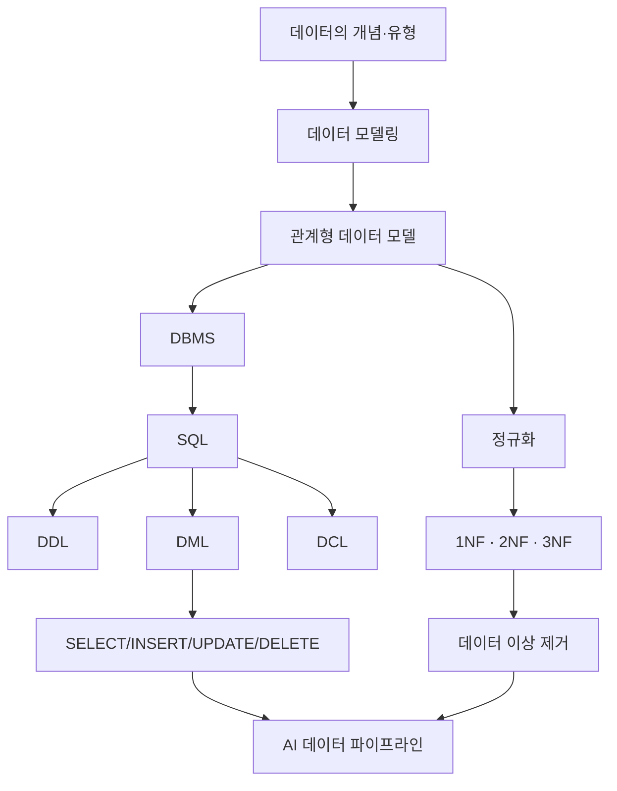

# 08. 데이터처리와활용: 중간 점검

## 🔗 선수 지식 (Prerequisites)
- [ ] **필수**: [1강. 데이터의 개념과 유형](1강.md) - 데이터 → 정보 → 지식 → 지혜의 흐름 이해
- [ ] **필수**: [2강. 관계형 데이터 모델](2강.md) - 릴레이션, 속성, 튜플, 키 개념
- [ ] **필수**: [3강. DBMS의 특징](3강.md) - 무결성, 일관성, 동시성 제어
- [ ] **필수**: [4강. 정규화 (1NF~3NF)](4강.md) - 함수 종속성, 이상 현상 제거
- [ ] **필수**: [5강. SQLite와 SQL 기초](5강.md) - DDL/DML/DCL 구분
- [ ] **권장**: [6강. SELECT와 조건절](6강.md), [7강. 조인과 집계](7강.md)
- **관련 단원**: [9강. SQL 심화](9강.md) (예정)

---

## 학습 목표
1. 데이터의 개념과 유형을 설명할 수 있다.
2. 관계형 데이터 모델과 DBMS의 특징을 설명할 수 있다.
3. 정규화와 데이터 이상의 관계를 이해할 수 있다.
4. SQL의 기본 구조와 주요 구문을 설명할 수 있다.

---

## 🧠 메타인지 체크 (학습 전/후 자기 평가)

### 학습 전 자기 평가
| 소주제 | 자신감 (1-5) |
| :--- | :--- |
| 데이터-정보-지식-지혜 (DIKW) 위계 | |
| 관계형 모델의 구성 요소 (릴레이션·튜플·속성·키) | |
| 함수 종속성과 1NF/2NF/3NF | |
| 데이터 이상 3종 (삽입·삭제·갱신) | |
| SQL DDL/DML/DCL 분류 | |

### 학습 후 교정 (학습 완료 후 작성)
| 소주제 | 학습 전 | 학습 후 | 실제 정답률 | 과신/과소 여부 |
| :--- | :--- | :--- | :--- | :--- |
| DIKW 위계 | | | | |
| 관계형 모델 구성 요소 | | | | |
| 정규화와 이상 현상 | | | | |
| SQL 기본 구문 | | | | |

> **활용법**: 학습 전 1분 → 자신감 기입, 학습 후 1분 → 나머지 기입. "과신" 영역이 실제 취약점.

---

## 📝 요약 (Summary)

1. 🔴 **데이터란 무엇인가**: 데이터는 가공을 통해 정보, 지식, 지혜로 발전하며 다양한 형태(정형/반정형/비정형, 정량/정성)로 존재함. ←→[1강](1강.md)
2. 🔴 **관계형 데이터 모델**: 관계형 데이터 모델은 데이터를 테이블(릴레이션) 구조로 관리하며 DBMS를 통해 효율성과 무결성을 확보함. ←→[2강](2강.md), [3강](3강.md)
3. 🔴 **관계형 모델의 정규화**: 정규화는 데이터 이상(삽입/삭제/갱신 이상)을 방지하기 위한 핵심 설계 방법이며 일반적으로 3NF까지 수행함. ←→[4강](4강.md)
4. 🔴 **SQLite와 SQL**: SQL은 관계형 데이터베이스를 다루기 위한 표준 언어로, DDL·DML·DCL로 구분되며 데이터 처리의 핵심 도구임. ←→[5강](5강.md)~[7강](7강.md)
5. 🟡 **개념 간 연결 흐름**: "데이터 → 모델링 → 정규화 → SQL"의 순서로 이론과 실무가 통합되며, 각 단계는 다음 단계의 전제 조건임. 📌
6. 🟢 **AI/ML과의 연결**: 정형 데이터 파이프라인(피처 스토어, 데이터 웨어하우스)은 모두 관계형 모델·SQL 위에서 동작함. 📌

---

## 📐 핵심 정의 및 원리 (Key Concepts) — *이론 중심 과목 변형*

| 정의명 | 내용 | 키워드 |
| :--- | :--- | :--- |
| **DIKW 피라미드** | Data(원시 사실) → Information(맥락 부여) → Knowledge(패턴화) → Wisdom(통찰·판단). 가공 단계마다 가치가 증가. | 가공, 위계, 맥락 |
| **데이터 유형 분류** | 구조에 따라 정형/반정형/비정형, 측정에 따라 정량/정성, 시간에 따라 시계열/스냅샷. | 구조, 측정, 시간 |
| **관계형 데이터 모델** | E.F. Codd(1970) 제안. 데이터를 2차원 테이블(릴레이션)로 표현, 수학적 집합론에 기반. | 릴레이션, 집합론, 무결성 |
| **DBMS의 특성 (ACID)** | Atomicity(원자성), Consistency(일관성), Isolation(고립성), Durability(지속성). 트랜잭션 보장. | ACID, 트랜잭션 |
| **키 (Key) 체계** | 후보키(고유 식별 가능) ⊃ 기본키(대표 후보키) / 외래키(다른 테이블 참조) / 슈퍼키. | 식별, 참조 무결성 |
| **함수 종속성 (FD)** | X → Y: 속성 X의 값이 정해지면 Y의 값이 유일하게 결정됨. 정규화의 출발점. | 종속, 결정자 |
| **데이터 이상 (Anomaly)** | 삽입 이상(불필요한 NULL 필요), 삭제 이상(다른 정보까지 손실), 갱신 이상(중복 데이터 불일치). | 중복, 무결성 훼손 |
| **정규형 (Normal Form)** | 1NF(원자값) → 2NF(부분 종속 제거) → 3NF(이행 종속 제거) → BCNF. 보통 3NF까지 수행. | 단계적 분해 |
| **SQL 분류** | DDL(CREATE/ALTER/DROP), DML(SELECT/INSERT/UPDATE/DELETE), DCL(GRANT/REVOKE), TCL(COMMIT/ROLLBACK). | 정의·조작·제어 |
| **SELECT 기본 구조** | `SELECT 컬럼 FROM 테이블 WHERE 조건 GROUP BY ... HAVING ... ORDER BY ...` 절의 실행 순서는 FROM → WHERE → GROUP BY → HAVING → SELECT → ORDER BY. | 실행 순서 |

### 주요 정리/원리

**정규화의 목적과 한계**

$$
\text{정규화} \;:\; R(\text{비정규}) \xrightarrow{\text{분해}} \{R_1, R_2, \dots, R_n\} \;\;\text{s.t.}\;\; \text{무손실 조인} \land \text{종속성 보존}
$$

> **직관적 해석**: 하나의 큰 테이블을 작은 테이블로 쪼개되, 다시 조인했을 때 정보 손실이 없고 원래의 함수 종속성이 유지되어야 한다.
> **AI 적용**: 머신러닝의 데이터 전처리 단계에서, 원천 OLTP DB(고도 정규화) → 분석용 OLAP/데이터마트(역정규화)로 가공하는 ETL 파이프라인의 출발점이다.

**SQL SELECT의 논리적 실행 순서**

$$
\text{FROM} \to \text{WHERE} \to \text{GROUP BY} \to \text{HAVING} \to \text{SELECT} \to \text{ORDER BY} \to \text{LIMIT}
$$

> **직관적 해석**: 작성 순서와 실제 평가 순서가 다르다. `WHERE`는 그룹화 전 행 필터, `HAVING`은 그룹화 후 그룹 필터.
> **AI 적용**: 피처 엔지니어링 쿼리(예: 사용자별 30일 평균 클릭률)는 GROUP BY + HAVING 패턴이 핵심이며, 실행 순서를 모르면 의도하지 않은 결과가 나옴.

---

## 📊 개념 시각화 (Visual Guide)

### 개념 관계도 — 중간 점검 통합 맵



### 핵심 비교표 — 각 단원 핵심 한 줄

| 단원 | 핵심 질문 | 핵심 답 | AI 적용 |
| :--- | :--- | :--- | :--- |
| 1강 | 데이터란? | 가공되어 가치를 갖는 사실 (DIKW) | 학습 데이터의 원천 |
| 2강 | 어떻게 표현? | 릴레이션(테이블) + 키 | 정형 피처 저장 |
| 3강 | 어떻게 관리? | DBMS의 ACID·무결성 | 학습 데이터 일관성 |
| 4강 | 어떻게 설계? | 정규화로 이상 제거 | 데이터 품질 보증 |
| 5~7강 | 어떻게 다루나? | SQL (DDL/DML) | 피처 추출·집계 쿼리 |

### 정규화 단계 도식

| 단계 | 조건 | 제거되는 이상 |
| :--- | :--- | :--- |
| **1NF** | 모든 속성이 원자값 | 다중값/반복 그룹 |
| **2NF** | 1NF + 부분 함수 종속 제거 | 복합키 일부에만 종속된 속성 |
| **3NF** | 2NF + 이행 함수 종속 제거 | 비키 속성 간 종속 |
| **BCNF** | 모든 결정자가 후보키 | 3NF가 놓치는 결정자 이상 |

---

## ✏️ 심화 학습 (Study Subject)

### 1. 가상 시나리오: "전자상거래 분석 DB 설계"
- **상황**: 한 쇼핑몰이 주문 로그를 단일 엑셀 시트(`주문번호, 고객명, 고객전화, 상품명, 상품가격, 상품카테고리, 주문일자`)에 쌓아 왔다. 데이터가 100만 행을 넘자, 고객 전화번호 갱신 시 수천 행을 동시에 수정해야 하고, 신규 상품 등록 시 주문이 없으면 등록 자체가 불가능한 문제가 발생했다.
- **문제**: 이 테이블이 가진 **삽입/갱신/삭제 이상**을 식별하고, 3NF까지 정규화하여 어떤 테이블들로 분해해야 하는가?
- **해결**:
  1. **갱신 이상**: 고객 전화 변경 → 동일 고객의 모든 주문 행 갱신 필요.
  2. **삽입 이상**: 주문 없이 상품만 등록할 수 없음 (PK가 주문번호이므로).
  3. **삭제 이상**: 어떤 상품의 마지막 주문 삭제 → 상품 정보까지 소실.
  4. **분해 결과 (3NF)**:
     - `고객(고객ID, 고객명, 고객전화)`
     - `상품(상품ID, 상품명, 상품가격, 카테고리ID)`
     - `카테고리(카테고리ID, 카테고리명)`
     - `주문(주문번호, 고객ID, 상품ID, 주문일자)`
- **AI 학습 포인트**: "이 정규화된 스키마에서 '카테고리별 월간 매출 TOP 3 상품'을 구하는 SQL을 작성하고, 동일 쿼리를 비정규화 단일 테이블에서 작성했을 때와 비교해 성능·유지보수성 측면의 장단점을 분석해줘."

### 2. 관점별 비교 및 오개념 분석
- **핵심 비교**: "정규화 vs 역정규화", "WHERE vs HAVING", "기본키 vs 후보키 vs 슈퍼키"
- **오개념 분석**:
    - **오개념 1**: "정규화 단계는 높을수록 무조건 좋다."
    - **분석**: 정규화 수준이 높을수록 중복은 줄지만 JOIN 비용이 증가한다. OLTP(거래)는 3NF 이상, OLAP(분석)는 의도적으로 역정규화(스타 스키마)하는 것이 일반적. **목적에 맞는 정규화 수준**이 정답.
    - **오개념 2**: "WHERE와 HAVING은 같은 조건절이라 바꿔 써도 된다."
    - **분석**: `WHERE`는 GROUP BY **전** 개별 행을 필터링하고, `HAVING`은 GROUP BY **후** 집계 결과를 필터링한다. `WHERE COUNT(*) > 5`는 문법 오류(집계 함수는 행 평가 시점에 존재하지 않음).
    - **오개념 3**: "기본키는 NULL이 될 수 있다."
    - **분석**: 기본키는 **개체 무결성 제약**에 의해 NULL이 절대 허용되지 않는다. 외래키는 NULL이 허용될 수 있음(선택적 참조).
- **AI 학습 포인트**: "위 세 오개념에 대해 각각 한 줄로 반증할 수 있는 SQL 예시 쿼리를 작성해줘."

---

## ❓ 연습 문제 및 해설

> **블룸 인지 수준 범례**: [기억] 정의·나열 → [이해] 설명·비교 → [적용] 계산·구현 → [분석] 구별·디버그 → [평가] 판단·비평 → [창조] 설계·제안

### 📝 문제

**1. ⭐ [기억] 📌 DIKW 위계를 올바른 순서로 나열한 것은?[➡️해설](#prob-1)**
   > ① 정보 → 데이터 → 지식 → 지혜
   > ② 데이터 → 지식 → 정보 → 지혜
   > ③ 데이터 → 정보 → 지식 → 지혜
   > ④ 지혜 → 지식 → 정보 → 데이터

<br>

**2. ⭐ [기억] 📌 관계형 데이터 모델을 처음 제안한 사람은?[➡️해설](#prob-2)**
   > ① James Gray
   > ② E. F. Codd
   > ③ Donald Chamberlin
   > ④ Peter Chen

<br>

**3. ⭐⭐ [이해] 📌 관계형 데이터베이스의 트랜잭션 특성인 ACID에 포함되지 않는 것은?[➡️해설](#prob-3)**
   > ① Atomicity (원자성)
   > ② Consistency (일관성)
   > ③ Indexing (색인성)
   > ④ Durability (지속성)

<br>

**4. ⭐⭐ [이해] 📌 데이터 이상(Anomaly)이 발생하는 근본 원인은?[➡️해설](#prob-4)**
   > ① 인덱스 부재
   > ② 데이터 중복
   > ③ 트랜잭션 격리 수준
   > ④ 백업 누락

<br>

**5. ⭐⭐ [적용] 📌 다음 함수 종속성이 있는 릴레이션 `R(학번, 과목코드, 성적, 학과, 학과사무실)`이 있다. `(학번, 과목코드) → 성적`, `학번 → 학과`, `학과 → 학과사무실`. 이 릴레이션의 정규화 수준은?[➡️해설](#prob-5)**
   > ① 1NF
   > ② 2NF
   > ③ 3NF
   > ④ BCNF

<br>

**6. ⭐⭐ [적용] 📌 다음 중 DDL에 속하는 SQL 구문만 묶은 것은?[➡️해설](#prob-6)**
   > <보기>
   >
   > 가. CREATE
   > 나. SELECT
   > 다. ALTER
   > 라. GRANT
   > 마. DROP

   > ① 가, 나, 다
   > ② 가, 다, 마
   > ③ 나, 다, 라
   > ④ 가, 라, 마

<br>

**7. ⭐⭐ [분석] 📌 다음 SQL 쿼리의 실행 순서(논리적 평가 순서)를 올바르게 나타낸 것은?[➡️해설](#prob-7)**
   > ```sql
   > SELECT 부서, AVG(연봉)
   > FROM 직원
   > WHERE 입사년도 >= 2020
   > GROUP BY 부서
   > HAVING AVG(연봉) > 5000
   > ORDER BY AVG(연봉) DESC;
   > ```
   > ① SELECT → FROM → WHERE → GROUP BY → HAVING → ORDER BY
   > ② FROM → WHERE → GROUP BY → HAVING → SELECT → ORDER BY
   > ③ FROM → SELECT → WHERE → GROUP BY → HAVING → ORDER BY
   > ④ FROM → GROUP BY → WHERE → HAVING → SELECT → ORDER BY

<br>

**8. ⭐⭐⭐ [분석] 📌 다음 중 옳지 않은 것은?[➡️해설](#prob-8)**
   > ① 기본키는 NULL 값을 가질 수 없다.
   > ② 외래키는 참조하는 테이블의 기본키 또는 후보키여야 한다.
   > ③ 슈퍼키는 후보키의 부분집합이다.
   > ④ BCNF는 3NF보다 강한 정규형이다.

<br>

**9. ⭐⭐⭐ [평가] 📌 OLTP(거래 처리) 시스템과 OLAP(분석) 시스템의 데이터 모델 설계 차이로 가장 적절한 것은?[➡️해설](#prob-9)**
   > ① OLTP는 역정규화, OLAP는 정규화를 선호한다.
   > ② OLTP는 정규화(주로 3NF), OLAP는 의도적 역정규화(스타 스키마)를 선호한다.
   > ③ 둘 다 동일하게 BCNF를 적용한다.
   > ④ OLTP는 NoSQL, OLAP는 관계형만 사용한다.

<br>

**10. ⭐⭐⭐ [창조] 📌 다음 비정규화 테이블 `주문(주문번호, 고객명, 고객전화, 상품명, 상품가격, 수량)`을 3NF로 분해하시오. 각 분해 테이블의 스키마와 기본키, 외래키를 명시할 것.[➡️해설](#prob-10)**

---

### 🔑 정답 및 해설 (먼저 풀어본 후 펼치기)

<details>
<summary>정답 보기 (클릭)</summary>

1. ③
2. ②
3. ③
4. ②
5. ①
6. ②
7. ②
8. ③
9. ②
10. (풀이형)

</details>

<details>
<summary>해설 보기 (클릭)</summary>

<a id="prob-1"></a>
**1. ⭐ [기억] DIKW 위계**
> **정답: ③ 데이터 → 정보 → 지식 → 지혜**
> **해설**: Data(원시 사실) → Information(맥락 부여) → Knowledge(패턴·인과) → Wisdom(통찰·판단). 가공 단계마다 가치가 증가한다.

<a id="prob-2"></a>
**2. ⭐ [기억] 관계형 모델 제안자**
> **정답: ② E. F. Codd**
> **해설**: E. F. Codd가 1970년 IBM 논문 "A Relational Model of Data for Large Shared Data Banks"에서 제안. Chamberlin은 SQL 공동 개발자, Chen은 ER 모델, Gray는 트랜잭션 이론(ACID 정립 기여).

<a id="prob-3"></a>
**3. ⭐⭐ [이해] ACID의 구성요소**
> **정답: ③ Indexing (색인성)**
> **해설**: ACID는 Atomicity, Consistency, **Isolation**(고립성), Durability이다. Indexing은 ACID와 무관한 성능 최적화 기법.

<a id="prob-4"></a>
**4. ⭐⭐ [이해] 데이터 이상의 원인**
> **정답: ② 데이터 중복**
> **해설**: 동일 정보가 여러 행에 중복 저장되면 일부만 갱신/삭제될 때 불일치(갱신·삭제 이상)가 발생하고, 종속된 정보 없이 다른 정보를 등록할 수 없는 삽입 이상이 생긴다. 정규화의 본질은 중복 제거.

<a id="prob-5"></a>
**5. ⭐⭐ [적용] 정규화 수준 판별**
> **정답: ① 1NF**
> **해설**:
> - 모든 속성이 원자값이므로 **1NF**는 충족.
> - 기본키는 `(학번, 과목코드)`인데, `학번 → 학과`는 기본키의 **일부(학번)** 에만 종속 → **부분 함수 종속 존재 → 2NF 위반**.
> - 따라서 현재 수준은 1NF.

<a id="prob-6"></a>
**6. ⭐⭐ [적용] DDL 식별**
> **정답: ② 가, 다, 마 (CREATE, ALTER, DROP)**
> **해설**: DDL(Data Definition Language)은 스키마 정의용으로 CREATE/ALTER/DROP/TRUNCATE. SELECT는 DML, GRANT는 DCL.

<a id="prob-7"></a>
**7. ⭐⭐ [분석] SELECT 논리적 실행 순서**
> **정답: ② FROM → WHERE → GROUP BY → HAVING → SELECT → ORDER BY**
> **해설**: 작성 순서와 평가 순서가 다르다. 데이터를 가져오고(FROM) → 행 필터(WHERE) → 그룹화(GROUP BY) → 그룹 필터(HAVING) → 컬럼 선택/계산(SELECT) → 정렬(ORDER BY). 그래서 `WHERE`에는 집계 함수를 쓸 수 없고 `HAVING`에서만 가능.

<a id="prob-8"></a>
**8. ⭐⭐⭐ [분석] 키 개념 검증**
> **정답: ③ 슈퍼키는 후보키의 부분집합이다.**
> **해설**: 거꾸로다. **후보키는 슈퍼키의 부분집합(최소 슈퍼키)**. 슈퍼키 ⊇ 후보키 ⊇ 기본키. ①②④는 모두 옳다(기본키 NOT NULL, 외래키는 참조 무결성, BCNF는 3NF의 더 강한 형태).

<a id="prob-9"></a>
**9. ⭐⭐⭐ [평가] OLTP vs OLAP 설계 철학**
> **정답: ② OLTP는 정규화(주로 3NF), OLAP는 의도적 역정규화(스타 스키마)를 선호한다.**
> **해설**: OLTP는 빈번한 갱신/삽입 → 중복 최소화(정규화)로 무결성과 쓰기 효율을 확보. OLAP는 대량 읽기·집계 → JOIN 비용을 줄이기 위해 팩트/디멘전 테이블로 역정규화(스타·스노우플레이크 스키마).

<a id="prob-10"></a>
**10. ⭐⭐⭐ [창조] 정규화 분해**
> **정답 (3NF 분해 예시)**:
>
> ```
> 고객(고객ID PK, 고객명, 고객전화)
> 상품(상품ID PK, 상품명, 상품가격)
> 주문(주문번호 PK, 고객ID FK→고객, 상품ID FK→상품, 수량)
> ```
>
> **해설**:
> 1. **1NF**: 모든 속성이 원자값 → OK.
> 2. **2NF 위반 제거**: 주문번호만으로 고객명/고객전화/상품명/상품가격이 결정되므로 부분 종속은 없으나, **고객명·고객전화는 고객 단위 정보**, **상품명·상품가격은 상품 단위 정보**라서 같은 고객/상품이 여러 주문에 중복.
> 3. **3NF 위반 제거**: 위 중복은 곧 이행/중복 정보 → 별도 테이블로 분리.
> 4. 결과적으로 고객·상품·주문 3개 테이블로 분해하면 삽입·삭제·갱신 이상이 모두 해소된다.

</details>

---

## ✅ O/X 확인문제 (20문항)

**1.** 데이터는 가공을 거치면 정보가 되고, 정보가 패턴화·체계화되면 지식이 된다.[➡️해설](#ox-1) **(O / X)**
**2.** 비정형 데이터(이미지·텍스트)는 관계형 데이터 모델에 직접 저장할 수 없다.[➡️해설](#ox-2) **(O / X)**
**3.** 관계형 데이터 모델은 수학의 집합론과 관계 대수에 기반한다.[➡️해설](#ox-3) **(O / X)**
**4.** DBMS의 ACID 중 Isolation은 동시에 실행되는 트랜잭션이 서로 영향을 주지 않도록 보장한다.[➡️해설](#ox-4) **(O / X)**
**5.** 기본키는 후보키 중 하나를 선택한 것이며, NULL을 허용하지 않는다.[➡️해설](#ox-5) **(O / X)**
**6.** 외래키는 반드시 NOT NULL이어야 한다.[➡️해설](#ox-6) **(O / X)**
**7.** 함수 종속성 X → Y에서 X를 결정자(Determinant)라 한다.[➡️해설](#ox-7) **(O / X)**
**8.** 1NF는 모든 속성이 원자값을 가져야 한다는 조건이다.[➡️해설](#ox-8) **(O / X)**
**9.** 2NF는 부분 함수 종속을 제거하는 단계이다.[➡️해설](#ox-9) **(O / X)**
**10.** 3NF는 이행 함수 종속을 제거하는 단계이다.[➡️해설](#ox-10) **(O / X)**
**11.** 정규화 수준이 높을수록 항상 성능이 향상된다.[➡️해설](#ox-11) **(O / X)**
**12.** 갱신 이상(Update Anomaly)은 중복된 데이터의 일부만 변경되어 불일치가 발생하는 현상이다.[➡️해설](#ox-12) **(O / X)**
**13.** SQL의 SELECT 문은 DDL에 속한다.[➡️해설](#ox-13) **(O / X)**
**14.** SELECT 절에서 GROUP BY 없이 집계 함수와 일반 컬럼을 함께 SELECT하면 표준 SQL에서는 오류이다.[➡️해설](#ox-14) **(O / X)**
**15.** WHERE 절에서는 집계 함수(예: COUNT(*) > 5)를 사용할 수 있다.[➡️해설](#ox-15) **(O / X)**
**16.** CREATE TABLE, ALTER TABLE, DROP TABLE은 모두 DDL이다.[➡️해설](#ox-16) **(O / X)**
**17.** SQLite는 파일 기반 임베디드 DBMS로, 서버 프로세스 없이 동작한다.[➡️해설](#ox-17) **(O / X)**
**18.** OLAP 분석용 데이터 마트는 일반적으로 OLTP보다 정규화 수준이 더 높다.[➡️해설](#ox-18) **(O / X)**
**19.** BCNF는 모든 결정자가 후보키일 것을 요구하며, 3NF보다 강한 정규형이다.[➡️해설](#ox-19) **(O / X)**
**20.** ML 학습용 데이터 파이프라인은 일반적으로 정규화된 OLTP DB에서 데이터를 읽어 피처 마트(역정규화)로 가공한다.[➡️해설](#ox-20) **(O / X)**

<details>
<summary>O/X 정답 및 해설 보기 (클릭)</summary>

> <a id="ox-1"></a>
> **1. 정답**: O
> **해설**: DIKW 위계의 정의 그대로.

> <a id="ox-2"></a>
> **2. 정답**: X
> **해설**: BLOB·JSON·TEXT 컬럼으로 저장 가능. 다만 효율적 질의·인덱싱이 어렵다.

> <a id="ox-3"></a>
> **3. 정답**: O
> **해설**: Codd의 원논문이 관계 대수·관계 해석을 수학적 토대로 제시.

> <a id="ox-4"></a>
> **4. 정답**: O
> **해설**: Isolation은 동시성 제어의 핵심.

> <a id="ox-5"></a>
> **5. 정답**: O
> **해설**: 개체 무결성 제약.

> <a id="ox-6"></a>
> **6. 정답**: X
> **해설**: 외래키는 선택적 참조를 표현하기 위해 NULL을 허용할 수 있다.

> <a id="ox-7"></a>
> **7. 정답**: O
> **해설**: X가 Y를 결정한다.

> <a id="ox-8"></a>
> **8. 정답**: O
> **해설**: 다중값·반복 그룹 금지.

> <a id="ox-9"></a>
> **9. 정답**: O
> **해설**: 복합키 일부에만 종속된 속성 제거.

> <a id="ox-10"></a>
> **10. 정답**: O
> **해설**: 비키 속성 간 종속(A → B → C) 제거.

> <a id="ox-11"></a>
> **11. 정답**: X
> **해설**: 정규화는 중복·이상 방지가 목적. 분석 쿼리에서는 JOIN 비용 때문에 역정규화가 더 빠를 수 있다.

> <a id="ox-12"></a>
> **12. 정답**: O
> **해설**: 갱신 이상의 정의.

> <a id="ox-13"></a>
> **13. 정답**: X
> **해설**: SELECT는 DML(Data Manipulation Language). 일부 분류는 DQL로 따로 분류하기도 함.

> <a id="ox-14"></a>
> **14. 정답**: O
> **해설**: 표준 SQL은 SELECT 절의 모든 비집계 컬럼이 GROUP BY에 포함되거나 함수적으로 결정되어야 한다. (MySQL only_full_group_by 모드 동일)

> <a id="ox-15"></a>
> **15. 정답**: X
> **해설**: 집계 함수는 GROUP BY 이후 평가되므로 WHERE에 사용 불가. HAVING에 사용해야 함.

> <a id="ox-16"></a>
> **16. 정답**: O
> **해설**: 스키마 정의 변경 → DDL.

> <a id="ox-17"></a>
> **17. 정답**: O
> **해설**: SQLite의 핵심 특징. 단일 파일에 DB 저장.

> <a id="ox-18"></a>
> **18. 정답**: X
> **해설**: 반대다. OLAP는 의도적 역정규화(스타 스키마)로 분석 효율을 높인다.

> <a id="ox-19"></a>
> **19. 정답**: O
> **해설**: BCNF ⊂ 3NF (강한 정규형).

> <a id="ox-20"></a>
> **20. 정답**: O
> **해설**: 일반적인 ML 데이터 파이프라인 패턴. 학습 시 JOIN 비용을 줄이기 위해 피처 마트는 역정규화.

</details>

---

## 🧪 자유 회상 연습 (Free Recall)

> **방법**: 위의 노트를 모두 덮고, 타이머 3분 설정 후 이번 단원에서 배운 내용을 기억나는 대로 자유롭게 적으세요.
> 정확한 문장이 아니어도 됩니다. 키워드, 수식, 관계 등 떠오르는 것을 모두 적습니다.

**자유 회상 작성란:**

```
[여기에 기억나는 내용을 자유롭게 작성]


```

> **회상 후 점검**: 노트를 다시 펼쳐 빠뜨린 내용을 확인하세요. 빠뜨린 부분이 실제 취약점입니다.
> - 회상 못한 핵심 개념: [                ]
> - 회상 못한 SQL 키워드: [                ]

---

## 💻 코드로 확인하기 (Code Verification) — SQLite 통합 실습

```python
import sqlite3

# 0) 메모리 DB 생성
con = sqlite3.connect(":memory:")
cur = con.cursor()

# 1) DDL — 3NF 스키마 생성
cur.executescript("""
CREATE TABLE 고객 (
    고객ID   INTEGER PRIMARY KEY,
    고객명   TEXT NOT NULL,
    고객전화 TEXT
);
CREATE TABLE 상품 (
    상품ID   INTEGER PRIMARY KEY,
    상품명   TEXT NOT NULL,
    상품가격 INTEGER NOT NULL CHECK (상품가격 >= 0)
);
CREATE TABLE 주문 (
    주문번호 INTEGER PRIMARY KEY,
    고객ID   INTEGER NOT NULL REFERENCES 고객(고객ID),
    상품ID   INTEGER NOT NULL REFERENCES 상품(상품ID),
    수량     INTEGER NOT NULL CHECK (수량 > 0)
);
""")

# 2) DML — INSERT
cur.executemany("INSERT INTO 고객 VALUES (?, ?, ?)", [
    (1, "김철수", "010-1111-2222"),
    (2, "이영희", "010-3333-4444"),
])
cur.executemany("INSERT INTO 상품 VALUES (?, ?, ?)", [
    (101, "노트북", 1500000),
    (102, "마우스", 30000),
    (103, "키보드", 80000),
])
cur.executemany("INSERT INTO 주문 VALUES (?, ?, ?, ?)", [
    (1001, 1, 101, 1),
    (1002, 1, 102, 2),
    (1003, 2, 103, 1),
    (1004, 2, 101, 1),
])
con.commit()

# 3) SELECT — JOIN + 집계 + HAVING (논리 실행 순서 체험)
sql = """
SELECT c.고객명,
       COUNT(o.주문번호) AS 주문건수,
       SUM(p.상품가격 * o.수량) AS 총구매액
FROM 주문 o
JOIN 고객 c ON o.고객ID = c.고객ID
JOIN 상품 p ON o.상품ID = p.상품ID
WHERE p.상품가격 >= 30000           -- 행 필터 (그룹화 전)
GROUP BY c.고객명
HAVING SUM(p.상품가격 * o.수량) > 100000  -- 그룹 필터 (그룹화 후)
ORDER BY 총구매액 DESC;
"""
for row in cur.execute(sql):
    print(row)

con.close()
```

> **실행 결과 (예시)**:
> ```
> ('김철수', 2, 1560000)
> ('이영희', 2, 1580000)
> ```
> **해석**:
> - 3NF 분해 덕분에 고객 전화 변경은 `고객` 테이블 1행만 수정하면 됨 (갱신 이상 제거).
> - `WHERE`는 행 단위, `HAVING`은 그룹 단위 필터 — 두 절을 바꾸면 결과가 달라지거나 오류 발생.
> - 외래키 제약(`REFERENCES`)으로 참조 무결성 보장.

---

## 🤖 AI 연결고리 (Concept → AI Application)

| 8강 핵심 개념 | AI/ML 적용 분야 | 구체적 사례 |
| :--- | :--- | :--- |
| 데이터 유형 (정형/비정형) | 멀티모달 학습 | 정형(메타데이터) + 비정형(이미지)을 결합한 추천 시스템 |
| 관계형 모델 + DBMS | 피처 스토어 | Feast, Tecton 등은 백엔드로 PostgreSQL/Snowflake 활용 |
| 정규화 / 역정규화 | 학습 데이터 마트 | OLTP(3NF) → ETL → 스타 스키마(역정규화) → ML 학습 테이블 |
| SQL 집계·윈도우 함수 | 피처 엔지니어링 | 사용자별 30일 평균 클릭률, 최근 N개 이벤트 lag 피처 |
| ACID 무결성 | 학습 데이터 일관성 | 학습/검증 분할 시 트랜잭션으로 split 시점 일관성 보장 |

---

## 📖 심화 학습 예시 답안

#### 1. 정규화의 내부 동작 원리 — 분해 알고리즘 단계별
1. **함수 종속성 집합 F 식별**: 도메인 지식과 후보키로부터 모든 FD를 나열.
2. **최소 기본 집합 (Minimal Cover) 계산**: 우변 단일화 → 좌변 외부속성 제거 → 중복 FD 제거.
3. **3NF 합성 알고리즘**:
   - 최소 기본 집합의 각 FD `X → Y`마다 릴레이션 `R_i(X ∪ Y)` 생성.
   - 어떤 `R_i`도 후보키를 포함하지 않으면 후보키만으로 구성된 릴레이션 추가.
   - 다른 릴레이션의 부분집합인 릴레이션 제거.
4. **결과**: 종속성 보존 + 무손실 조인 보장. (BCNF는 항상 종속성 보존을 보장하지 않음 — 그래서 보통 3NF에서 멈춤.)

#### 2. 정규화 vs 역정규화 비교표

| 구분 | 정규화 (3NF) | 역정규화 (스타 스키마) | 비고 |
| :--- | :--- | :--- | :--- |
| **목적** | 중복 제거, 이상 방지 | JOIN 최소화, 읽기 성능 | 트레이드오프 |
| **적용 시점** | OLTP, 트랜잭션 시스템 | OLAP, 분석/리포팅 | 워크로드별 선택 |
| **쓰기 비용** | 낮음 (1곳 갱신) | 높음 (다곳 동기화) | |
| **읽기 비용** | 높음 (다중 JOIN) | 낮음 (단일 테이블 스캔) | |
| **AI 활용** | 원천 시스템·피처 스토어 백엔드 | ML 학습 데이터 마트 (Wide Table) | 양쪽 모두 필요 |

#### 3. SELECT 절 Best Practice
- **Bad Practice**
  ```sql
  -- WHERE에 집계 함수 사용 (오류) + SELECT * 남발
  SELECT *
  FROM 주문
  WHERE COUNT(*) > 5   -- ❌ 그룹화 전이라 집계 불가
  GROUP BY 고객ID;
  ```
- **Good Practice**
  ```sql
  SELECT 고객ID, COUNT(*) AS 주문건수, SUM(금액) AS 총액
  FROM 주문
  WHERE 주문일자 >= '2026-01-01'   -- ✅ 행 필터는 WHERE
  GROUP BY 고객ID
  HAVING COUNT(*) > 5              -- ✅ 그룹 필터는 HAVING
  ORDER BY 총액 DESC
  LIMIT 100;
  ```
- **설명**: WHERE는 그룹화 전, HAVING은 그룹화 후. 필요한 컬럼만 명시(SELECT *)하면 옵티마이저가 인덱스만 읽는 커버링 인덱스 최적화를 적용할 수 있다.

---

## 📚 핵심 용어집 (Glossary)

| 용어 (한) | 용어 (영) | 수식/구문 표현 | 정의 |
| :--- | :--- | :--- | :--- |
| **데이터** | Data | — | 가공되지 않은 원시 사실. ←→[1강](1강.md) |
| **정보** | Information | — | 맥락이 부여되어 의미를 갖는 데이터. ←→[1강](1강.md) |
| **릴레이션** | Relation | $R(A_1, A_2, \dots, A_n)$ | 관계형 모델에서 테이블에 해당. ←→[2강](2강.md) |
| **튜플** | Tuple | $t = (a_1, \dots, a_n)$ | 릴레이션의 한 행. ←→[2강](2강.md) |
| **속성** | Attribute | $A_i$ | 릴레이션의 한 열. ←→[2강](2강.md) |
| **기본키** | Primary Key | `PRIMARY KEY` | 튜플을 고유 식별하는 후보키. NOT NULL. ←→[2강](2강.md) |
| **외래키** | Foreign Key | `FOREIGN KEY ... REFERENCES` | 다른 릴레이션의 기본키 참조. ←→[2강](2강.md) |
| **함수 종속성** | Functional Dependency | $X \to Y$ | X가 정해지면 Y가 유일하게 결정됨. ←→[4강](4강.md) |
| **정규화** | Normalization | 1NF→2NF→3NF | 데이터 이상을 제거하기 위한 분해 과정. ←→[4강](4강.md) |
| **데이터 이상** | Anomaly | — | 삽입/삭제/갱신 이상. 중복이 근본 원인. ←→[4강](4강.md) |
| **ACID** | ACID | — | Atomicity·Consistency·Isolation·Durability. ←→[3강](3강.md) |
| **SQL** | SQL | `SELECT ... FROM ... WHERE ...` | 관계형 DB 표준 질의 언어. ←→[5강](5강.md) |
| **DDL** | Data Definition Language | CREATE/ALTER/DROP | 스키마 정의 언어. ←→[5강](5강.md) |
| **DML** | Data Manipulation Language | SELECT/INSERT/UPDATE/DELETE | 데이터 조작 언어. ←→[5강](5강.md) |
| **DCL** | Data Control Language | GRANT/REVOKE | 권한 제어 언어. ←→[5강](5강.md) |

---

## 🤖 AI 학습 파트너를 위한 추가 자료

### 1. 개념 이해를 위한 심층 질문 프롬프트
> **프롬프트 예시**: "관계형 데이터 모델의 핵심 원리(릴레이션, 키, 무결성 제약)를 초등학생도 이해할 수 있는 비유로 설명하고, 만약 관계형 모델이 없었다면 1970년대 이전 데이터 처리에 어떤 문제가 있었는지 역사적 맥락과 함께 설명해줘."

### 2. 문제 해결 능력 강화를 위한 시나리오 프롬프트
> **프롬프트 예시**: "당신은 데이터 엔지니어다. 회사가 OLTP 주문 시스템(PostgreSQL, 3NF)과 분석용 데이터 웨어하우스(BigQuery)를 모두 운영한다. 새로운 추천 모델 학습을 위한 피처 마트를 설계할 때, OLTP에서 그대로 JOIN해서 쓰는 방식 vs DWH에 역정규화된 와이드 테이블을 두는 방식 중 어떤 것을 선택할지, 학습 속도·신선도·운영 비용 측면에서 비교하고 최종 권고안을 제시해줘."

### 3. SQL 풀이 검증 프롬프트
> **프롬프트 예시**: "다음 SQL의 논리적 실행 순서를 한 줄씩 추적하고, 잘못된 부분이 있다면 지적해줘.
> ```sql
> SELECT 부서, AVG(연봉)
> FROM 직원
> WHERE AVG(연봉) > 5000
> GROUP BY 부서
> ORDER BY AVG(연봉) DESC;
> ```
> 1. 각 절의 실행 시점과 평가 가능한 표현식을 명시할 것.
> 2. 의도(부서별 평균 연봉이 5000 초과인 부서를 내림차순 정렬)에 맞게 수정한 정답 쿼리를 제시할 것."

---

## 🔄 복습 체크 (Spaced Repetition)
- [ ] 1일 후 복습 (날짜: 2026-05-30)
- [ ] 3일 후 복습 (날짜: 2026-06-01)
- [ ] 7일 후 복습 (날짜: 2026-06-05)
- [ ] 14일 후 복습 (날짜: 2026-06-12)
- [ ] 30일 후 복습 (날짜: 2026-06-28)

### 복습 시 자가 평가
| 회차 | 날짜 | 이해도 (1-5) | 취약 부분 메모 |
| :--- | :--- | :--- | :--- |
| 1차 | | | |
| 2차 | | | |
| 3차 | | | |

---

## 📚 참고 자료 (References)

- 교재 — 데이터처리와활용 8강 (중간 점검)
- E. F. Codd, "A Relational Model of Data for Large Shared Data Banks" (CACM, 1970)
- SQLite 공식 문서: https://www.sqlite.org/docs.html
- 1~7강 학습 노트 — [1강](1강.md) · [2강](2강.md) · [3강](3강.md) · [4강](4강.md) · [5강](5강.md) · [6강](6강.md) · [7강](7강.md)
