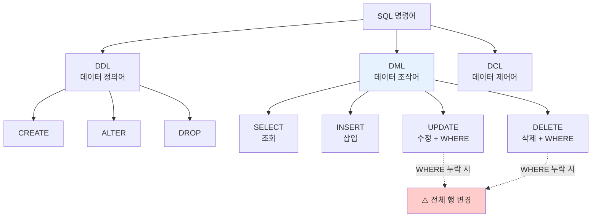
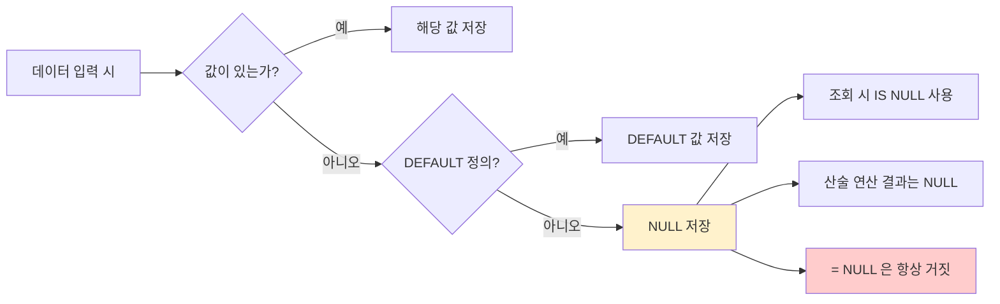

# 9강. 데이터처리와활용: SQL 기초(2) — DML(INSERT·UPDATE·DELETE), NULL, DEFAULT

## 🔗 선수 지식 (Prerequisites)
- [ ] **필수**: 7강 SQL 기초(1) — DDL(CREATE/ALTER/DROP), SELECT 기본 구문 - 이해 완료?
- [ ] **권장**: 관계형 데이터 모델(테이블·행·열·기본키), 데이터 타입(VARCHAR, NUMBER, DATE)
- **관련 단원**: [7강 SQL 기초(1)](7강.md), [10강 SQL 활용(1)](10강.md)

---

## 학습 목표
1. INSERT 문을 사용하여 테이블에 새로운 행(Row)을 정확하게 추가할 수 있다.
2. UPDATE 문을 활용하여 기존 데이터를 수정하되, WHERE 절을 통해 원하는 데이터만 선별적으로 갱신할 수 있다.
3. DELETE 문을 사용하여 불필요한 데이터를 삭제할 수 있으며, 조건 지정의 중요성을 설명할 수 있다.
4. NULL 값의 특성(연산 불가, IS NULL 사용 등)을 이해하고, DEFAULT 옵션을 통해 기본값을 설정할 수 있다.

---

## 🧠 메타인지 체크 (학습 전/후 자기 평가)

### 학습 전 자기 평가
| 소주제 | 자신감 (1-5) |
| :--- | :--- |
| INSERT 구문 (단일/다중 행) | |
| UPDATE 구문 (WHERE 절 활용) | |
| DELETE 구문 (조건 삭제) | |
| NULL의 특성과 IS NULL | |
| DEFAULT 제약조건 | |

### 학습 후 교정 (학습 완료 후 작성)
| 소주제 | 학습 전 | 학습 후 | 실제 정답률 | 과신/과소 여부 |
| :--- | :--- | :--- | :--- | :--- |
| INSERT 구문 | | | | |
| UPDATE 구문 | | | | |
| DELETE 구문 | | | | |
| NULL의 특성 | | | | |
| DEFAULT 제약조건 | | | | |

> **활용법**: 학습 전 1분 → 자신감 기입, 학습 후 1분 → 나머지 기입. "과신" 영역이 실제 취약점.

---

## 📝 요약 (Summary)

### 데이터 입력(INSERT) 🔴
1. **INSERT 기본 문법**: `INSERT INTO 테이블명 (열1, 열2, ...) VALUES (값1, 값2, ...)` 형식으로 테이블에 새로운 행을 추가한다. 🔴
2. **열 목록 생략**: 모든 열에 순서대로 값을 입력할 때는 열 이름 목록을 생략할 수 있으나, 테이블 구조 변경 시 오류 위험이 있으므로 명시하는 것이 안전하다. 🟡
3. **다중 행 입력**: `VALUES (...), (...), (...)` 구조로 한 번에 여러 행을 입력할 수 있다(DBMS에 따라 지원 여부 상이). 🟡

### 데이터 수정(UPDATE)과 안전성 🔴
4. **UPDATE 기본 문법**: `UPDATE 테이블명 SET 열=값 WHERE 조건` 형식으로 기존 데이터를 수정한다. 🔴
5. **WHERE 절의 중요성**: WHERE 절을 생략하면 테이블의 **모든 행**이 수정되므로 반드시 조건을 명시해야 한다. 🔴
6. **다중 열 수정**: `SET 열1=값1, 열2=값2` 형식으로 여러 열을 동시에 수정할 수 있다. 🟡

### 데이터 삭제(DELETE) 🔴
7. **DELETE 기본 문법**: `DELETE FROM 테이블명 WHERE 조건` 형식으로 특정 행을 삭제한다. 🔴
8. **WHERE 절의 중요성**: WHERE 절을 생략하면 테이블의 **모든 행**이 삭제되므로 신중히 사용해야 한다. 🔴
9. **DELETE vs DROP vs TRUNCATE**: DELETE는 행 삭제(테이블 구조 유지, 롤백 가능), DROP은 테이블 자체 제거, TRUNCATE는 전체 행 일괄 삭제(롤백 불가)이다. 🟡

### NULL의 개념과 처리 🔴
10. **NULL의 의미**: 값이 "존재하지 않음" 또는 "알 수 없음"을 나타내며, 0이나 공백 문자열과는 다르다. 🔴
11. **NULL과 산술 연산**: NULL이 포함된 산술 연산의 결과는 항상 NULL이다(예: `100 + NULL = NULL`). 🔴
12. **IS NULL 사용**: NULL 비교에는 `=` 연산자가 아닌 `IS NULL` 또는 `IS NOT NULL`을 사용한다. 🔴

### 기본값(DEFAULT) 설정 🟡
13. **DEFAULT 제약조건**: `CREATE TABLE` 시 열에 `DEFAULT 기본값`을 지정하면, INSERT 시 값을 누락하거나 `DEFAULT` 키워드를 사용할 때 자동으로 기본값이 저장된다. 🟡
14. **활용 시점**: 등록일자 자동 입력(`DEFAULT CURRENT_TIMESTAMP`, Oracle에서는 `DEFAULT SYSDATE`), 기본 상태 설정(`DEFAULT 'N'`) 등 누락 방지에 유용하다. SQLite에서 SYSDATE는 함수가 아닌 문자열 리터럴('SYSDATE')로 저장되므로, SQLite 환경에서는 반드시 `CURRENT_TIMESTAMP` 또는 `CURRENT_DATE`를 사용해야 한다. 🟢

---

## 📐 핵심 문법 및 패턴 (실습 중심)

| 패턴명 | 코드 | 용도 |
| :--- | :--- | :--- |
| **INSERT (열 명시)** | `INSERT INTO 학생(학번, 이름) VALUES ('20251234', '홍길동');` | 특정 열에만 값을 입력 (나머지는 NULL 또는 DEFAULT) |
| **INSERT (열 생략)** | `INSERT INTO 학생 VALUES ('20251234', '홍길동', '컴공');` | 모든 열에 정의 순서대로 값 입력 |
| **INSERT (다중 행)** | `INSERT INTO 학생 VALUES ('A', '김'), ('B', '이'), ('C', '박');` | 한 번에 여러 행 삽입 |
| **UPDATE (단일 행)** | `UPDATE 학생 SET 학과='통계' WHERE 학번='20251234';` | 조건에 맞는 행의 특정 열 갱신 |
| **UPDATE (다중 열)** | `UPDATE 학생 SET 학과='통계', 학년=2 WHERE 학번='20251234';` | 여러 열 동시 갱신 |
| **DELETE (조건)** | `DELETE FROM 학생 WHERE 학번='20251234';` | 특정 행 삭제 |
| **DELETE (전체)** | `DELETE FROM 학생;` | 모든 행 삭제 (위험! 보통 TRUNCATE 권장) |
| **NULL 검색** | `SELECT * FROM 학생 WHERE 학과 IS NULL;` | NULL 값을 가진 행 조회 |
| **NULL 제외** | `SELECT * FROM 학생 WHERE 학과 IS NOT NULL;` | NULL이 아닌 값만 조회 |
| **DEFAULT 정의** | `CREATE TABLE 학생(... 등록일 DATE DEFAULT CURRENT_DATE);` | 기본값을 가지는 열 정의 (Oracle: SYSDATE, SQLite: CURRENT_TIMESTAMP 또는 CURRENT_DATE) |
| **DEFAULT 활용** | `INSERT INTO 학생(학번, 등록일) VALUES ('A', DEFAULT);` | 명시적으로 기본값 사용 |

### 주요 원리: WHERE 절의 안전성 원칙

> **직관적 해석**: UPDATE/DELETE는 "조건 없이 실행하면 테이블 전체에 영향을 미친다"는 점에서 가장 위험한 DML이다. 항상 **SELECT로 먼저 조건을 검증**한 뒤 UPDATE/DELETE로 변환하는 습관이 사고를 막는다.
> **AI 적용**: 머신러닝 학습 데이터셋의 라벨 수정·이상치 제거 작업에서도 WHERE 조건 검증은 필수이며, 실수로 전체 라벨을 덮어쓰면 모델 성능이 붕괴된다.

---

## 📊 개념 시각화 (Visual Guide)

### DML 명령어 분류 체계도


### NULL 처리 흐름도


### 핵심 비교표
| 명령어 | WHERE 절 영향 | 대상 | 복구 가능성 | 주의점 |
| :--- | :--- | :--- | :--- | :--- |
| **INSERT** | 사용 안 함 | 새 행 추가 | DELETE로 제거 가능 | PK 중복 시 오류 |
| **UPDATE** | 생략 시 전체 행 수정 | 기존 행 변경 | 트랜잭션 롤백 시 가능 | WHERE 필수 검증 |
| **DELETE** | 생략 시 전체 행 삭제 | 기존 행 제거 | 트랜잭션 롤백 시 가능 | WHERE 필수 검증 |
| **TRUNCATE (DDL)** | 사용 불가 | 전체 행 일괄 삭제 | 롤백 **불가** | 빠르지만 위험 |
| **DROP (DDL)** | 사용 불가 | 테이블 자체 제거 | 롤백 **불가** | 구조까지 소멸 |

#### NULL 처리 함수
| 함수 | 동작 | 예시 |
|---|---|---|
| COALESCE(a, b, c) | 첫 번째 non-NULL 값 반환 | COALESCE(NULL, 0) → 0 |
| IFNULL(a, b) | SQLite/MySQL용, a가 NULL이면 b 반환 | IFNULL(NULL, '없음') → '없음' |
| NVL(a, b) | Oracle용, a가 NULL이면 b 반환 | NVL(NULL, 0) → 0 |

> **활용 예시**: `UPDATE 사원 SET 보너스 = COALESCE(보너스, 0) * 1.1;` — 보너스가 NULL인 사원도 0으로 대체하여 연산 가능. `SELECT IFNULL(학과, '미배정') FROM 학생;` — NULL 학과를 '미배정'으로 표시.

---

## ✏️ 심화 학습 (Study Subject)

### 1. 가상 시나리오: "WHERE 절 누락 사고와 복구"
- **상황**: 신입 DBA가 학생 테이블에서 휴학생 한 명의 학과만 변경하려고 했다.
- **문제**: 다음 명령을 실행했다. `UPDATE 학생 SET 학과='미정';` 그 결과 5,000명 전원의 학과가 '미정'으로 바뀌었다.
- **해결**:
  1. **사고 직후**: 트랜잭션이 커밋되기 전이라면 `ROLLBACK;`으로 즉시 복구 가능.
  2. **이미 커밋되었다면**: 백업 데이터에서 복원하거나, REDO/UNDO 로그 기반 시점 복구.
  3. **재발 방지**: 항상 `SELECT ... WHERE 조건`으로 영향 받는 행을 먼저 확인한 뒤, 동일한 WHERE 조건을 UPDATE/DELETE에 적용. 또한 운영 DB에서는 자동 커밋(autocommit) 비활성화.
- **AI 학습 포인트**: "트랜잭션의 ACID 원칙과 WHERE 절 누락 사고의 관계를 설명하고, 운영 환경에서 dry-run(시뮬레이션) 방식으로 안전하게 UPDATE/DELETE를 실행하는 모범 사례를 알려줘."

### 2. 관점별 비교 및 오개념 분석
- **핵심 비교**: "NULL = NULL" vs "NULL IS NULL", "DELETE vs TRUNCATE vs DROP"
- **오개념 분석**:
    - **오개념 1**: "NULL은 0과 같다 / 빈 문자열('')과 같다."
    - **분석**: NULL은 "값이 존재하지 않음"을 의미하며, 0이나 ''은 엄연히 존재하는 값이다. `WHERE 점수 = 0`은 0인 행만 조회하지만, `WHERE 점수 IS NULL`은 점수가 입력되지 않은 행을 조회한다. 또한 `100 + 0 = 100`이지만 `100 + NULL = NULL`이다.
    - **오개념 2**: "WHERE col = NULL 로 NULL 값을 찾을 수 있다."
    - **분석**: NULL과의 등호 비교(`=`)는 결과가 **UNKNOWN(NULL)**이며 WHERE 절에서 거짓으로 취급되어 아무 행도 반환하지 않는다. 반드시 `IS NULL`을 사용해야 한다.
    - **오개념 3**: "DELETE FROM 테이블; 은 테이블을 지우는 것이다."
    - **분석**: DELETE는 **행**만 삭제하고 테이블 구조(스키마, 인덱스, 제약조건)는 유지된다. 테이블 자체를 제거하려면 `DROP TABLE`을 사용해야 한다.
- **AI 학습 포인트**: "NULL을 활용한 3치 논리(True/False/Unknown)가 SQL의 WHERE/HAVING 절에서 어떻게 처리되는지, 그리고 COUNT(*) vs COUNT(컬럼)이 NULL을 처리하는 방식의 차이를 예시로 설명해 줘."

---

## ❓ 연습 문제 및 해설

> **블룸 인지 수준 범례**: [기억] 정의·나열 → [이해] 설명·비교 → [적용] 계산·구현 → [분석] 구별·디버그 → [평가] 판단·비평 → [창조] 설계·제안

### 📝 문제

**1. 📌 ⭐ [기억] 다음 중 DML(데이터 조작어)에 속하지 않는 것은?([#prob-1](#prob-1))**
   > ① INSERT
   > ② UPDATE
   > ③ CREATE
   > ④ DELETE

<br>

**2. 📌 ⭐ [기억] INSERT 문의 기본 문법으로 옳은 것은?([#prob-2](#prob-2))**
   > ① `INSERT 테이블명 SET 열=값;`
   > ② `INSERT INTO 테이블명 (열목록) VALUES (값목록);`
   > ③ `INSERT FROM 테이블명 WHERE 조건;`
   > ④ `INSERT TABLE 테이블명 = 값목록;`

<br>

**3. 📌 ⭐⭐ [이해] UPDATE 문에서 WHERE 절을 생략하면 어떤 일이 발생하는가?([#prob-3](#prob-3))**
   > ① 첫 번째 행만 수정된다.
   > ② 마지막 행만 수정된다.
   > ③ 테이블의 모든 행이 수정된다.
   > ④ 문법 오류가 발생하여 실행되지 않는다.

<br>

**4. 📌 ⭐⭐ [이해] NULL에 대한 설명으로 옳지 않은 것은?([#prob-4](#prob-4))**
   > ① NULL은 "값이 존재하지 않음"을 의미한다.
   > ② NULL과 숫자의 산술 연산 결과는 NULL이다.
   > ③ NULL 값을 검색할 때는 `= NULL`을 사용한다.
   > ④ NULL은 0이나 공백 문자열과 다르다.

<br>

**5. 📌 ⭐⭐ [적용] 다음 SQL의 실행 결과로 옳은 것은?([#prob-5](#prob-5))**
   ```sql
   CREATE TABLE 회원(
       아이디 VARCHAR(20),
       가입일 DATE DEFAULT SYSDATE,   -- Oracle SQL 기준
       등급 VARCHAR(10) DEFAULT '일반'
   );
   INSERT INTO 회원(아이디) VALUES ('user01');
   ```
   > ① 가입일과 등급이 모두 NULL로 저장된다.
   > ② 가입일은 NULL, 등급은 '일반'으로 저장된다.
   > ③ 가입일은 현재 날짜, 등급은 '일반'으로 저장된다.
   > ④ 가입일과 등급에 값이 없어 오류가 발생한다.

<br>

**6. 📌 ⭐⭐ [적용] 학생 테이블에서 학과가 '컴퓨터'인 학생들의 학년을 모두 4로 변경하는 SQL로 옳은 것은?([#prob-6](#prob-6))**
   > ① `UPDATE 학생 WHERE 학과='컴퓨터' SET 학년=4;`
   > ② `UPDATE 학생 SET 학년=4 WHERE 학과='컴퓨터';`
   > ③ `UPDATE FROM 학생 SET 학년=4 WHERE 학과='컴퓨터';`
   > ④ `MODIFY 학생 SET 학년=4 WHERE 학과='컴퓨터';`

<br>

**7. 📌 ⭐⭐ [분석] 다음 <보기> 중 옳은 설명을 모두 고른 것은?([#prob-7](#prob-7))**
   > <보기>
   >
   > 가. DELETE 문은 테이블의 행만 삭제하고 테이블 구조는 유지한다.
   > 나. TRUNCATE 문은 DDL이므로 일반적으로 ROLLBACK으로 복구할 수 없다.
   > 다. DROP TABLE은 테이블의 행은 삭제하지만 스키마는 유지한다.
   > 라. DELETE 문은 WHERE 절을 통해 특정 행만 삭제할 수 있다.

   > ① 가, 나
   > ② 가, 나, 라
   > ③ 가, 다, 라
   > ④ 가, 나, 다, 라

<br>

**8. 📌 ⭐⭐ [적용] 사원 테이블에서 보너스(`bonus`) 컬럼의 값이 입력되지 않은(NULL인) 모든 사원을 조회하는 SQL로 옳은 것은?([#prob-8](#prob-8))**
   > ① `SELECT * FROM 사원 WHERE bonus = NULL;`
   > ② `SELECT * FROM 사원 WHERE bonus = '';`
   > ③ `SELECT * FROM 사원 WHERE bonus IS NULL;`
   > ④ `SELECT * FROM 사원 WHERE bonus = 0;`

<br>

**9. 📌 ⭐⭐⭐ [분석] 다음 SQL을 실행한 후 학생 테이블의 상태로 옳은 것은?([#prob-9](#prob-9))**
   ```sql
   -- 초기 학생 테이블: 학번('A001','이름='김철수','학년'=3), ('A002','박영희',2), ('A003','최민수',4)
   UPDATE 학생 SET 학년 = 학년 + 1 WHERE 학년 >= 3;
   DELETE FROM 학생 WHERE 학년 > 4;
   ```
   > ① 학생 3명이 모두 남아있다.
   > ② '김철수'(학년 4), '박영희'(학년 2)가 남는다.
   > ③ '박영희'(학년 2)만 남는다.
   > ④ 모든 행이 삭제된다.

<br>

**10. 📌 ⭐⭐⭐ [평가/창조] 운영 중인 데이터베이스에서 대량의 행을 UPDATE/DELETE 할 때 사고를 방지하기 위한 모범 사례 3가지를 서술하시오.([#prob-10](#prob-10))**

---

### 🔑 정답 및 해설 (먼저 풀어본 후 펼치기)

<details>
<summary>정답 보기 (클릭)</summary>

1. ③
2. ②
3. ③
4. ③
5. ③
6. ②
7. ②
8. ③
9. ②
10. [서술형 정답 — 해설 참조]

</details>

<details>
<summary>해설 보기 (클릭)</summary>

<a id="prob-1"></a>
**1. ⭐ [기억] DML의 정의**
> **정답: ③ CREATE**
> **해설**: CREATE는 테이블·인덱스 등의 객체를 정의하는 DDL(데이터 정의어)이다. INSERT, UPDATE, DELETE, SELECT는 데이터를 조작하는 DML이다.

<a id="prob-2"></a>
**2. ⭐ [기억] INSERT 문법**
> **정답: ② `INSERT INTO 테이블명 (열목록) VALUES (값목록);`**
> **해설**: 표준 SQL의 INSERT 구문은 `INSERT INTO ~ VALUES ~` 형식이다. 나머지는 모두 잘못된 문법이다.

<a id="prob-3"></a>
**3. ⭐⭐ [이해] WHERE 절 누락의 위험성**
> **정답: ③ 테이블의 모든 행이 수정된다.**
> **해설**: UPDATE 문에서 WHERE 절을 생략하면 테이블의 모든 행이 SET 절의 값으로 일괄 변경된다. 문법 오류는 아니며 실행이 정상 진행되므로 가장 흔하고 위험한 사고 원인이다.

<a id="prob-4"></a>
**4. ⭐⭐ [이해] NULL의 특성**
> **정답: ③ NULL 값을 검색할 때는 `= NULL`을 사용한다.**
> **해설**: NULL은 "알 수 없음"을 의미하므로 등호 비교가 불가능하다. NULL 비교는 반드시 `IS NULL` 또는 `IS NOT NULL`을 사용해야 한다. 나머지 ①②④는 NULL의 올바른 특성이다.

<a id="prob-5"></a>
**5. ⭐⭐ [적용] DEFAULT 동작**
> **정답: ③ 가입일은 현재 날짜, 등급은 '일반'으로 저장된다.**
> **해설**: INSERT 시 명시되지 않은 컬럼에 DEFAULT 제약이 설정되어 있으면 그 기본값이 자동 입력된다. 가입일은 `SYSDATE`(현재 시각), 등급은 `'일반'`이 저장된다.
> **주의**: Oracle SQL 기준에서는 현재 날짜 저장이 맞으나, SQLite 환경에서는 CURRENT_TIMESTAMP를 사용해야 한다. SQLite에서 `DEFAULT SYSDATE`를 지정하면 SYSDATE가 함수가 아닌 문자열 리터럴('SYSDATE')로 저장되므로, 실습 환경에 따라 `DEFAULT CURRENT_TIMESTAMP`(일시) 또는 `DEFAULT CURRENT_DATE`(날짜)로 대체해야 한다.

<a id="prob-6"></a>
**6. ⭐⭐ [적용] UPDATE 문 작성**
> **정답: ② `UPDATE 학생 SET 학년=4 WHERE 학과='컴퓨터';`**
> **해설**: UPDATE 문은 `UPDATE 테이블 SET 열=값 WHERE 조건;` 순서를 지켜야 한다. ①③④는 어순/키워드가 잘못되어 문법 오류가 발생한다.

<a id="prob-7"></a>
**7. ⭐⭐ [분석] DELETE/TRUNCATE/DROP 비교**
> **정답: ② 가, 나, 라**
> **해설**:
> - 가(O): DELETE는 행만 제거하고 스키마는 유지한다.
> - 나(O): TRUNCATE는 일반적으로 DDL로 분류되어 자동 커밋되며 ROLLBACK으로 복구 불가하다.
> - 다(X): DROP TABLE은 테이블 자체(구조 + 행 모두)를 제거한다. "스키마는 유지"는 틀린 설명이다.
> - 라(O): DELETE는 WHERE 조건으로 선별 삭제가 가능하다.

<a id="prob-8"></a>
**8. ⭐⭐ [적용] IS NULL 활용**
> **정답: ③ `SELECT * FROM 사원 WHERE bonus IS NULL;`**
> **해설**: NULL 값 검색은 `IS NULL`로만 가능하다. `= NULL`은 결과가 UNKNOWN이 되어 항상 거짓으로 평가되며, `= ''`이나 `= 0`은 NULL이 아닌 빈 문자열/0인 행만 조회한다.

<a id="prob-9"></a>
**9. ⭐⭐⭐ [분석] UPDATE → DELETE 연쇄 실행**
> **정답: ② '김철수'(학년 4), '박영희'(학년 2)가 남는다.**
> **해설**:
> 1. UPDATE: 학년 ≥ 3인 행의 학년이 +1 증가 → 김철수(3→4), 최민수(4→5), 박영희(2)는 그대로.
> 2. DELETE: 학년 > 4인 행 삭제 → 최민수(5) 삭제.
> 3. 결과: 김철수(4), 박영희(2) 두 명이 남는다.

<a id="prob-10"></a>
**10. ⭐⭐⭐ [평가/창조] 대량 UPDATE/DELETE 모범 사례**
> **정답 (예시 답안)**:
> 1. **사전 SELECT 검증**: UPDATE/DELETE를 실행하기 전, **동일한 WHERE 조건으로 SELECT를 먼저 실행**하여 영향 받을 행의 개수와 내용을 확인한다. 예상치와 다르면 즉시 중단.
> 2. **트랜잭션 명시적 사용**: 자동 커밋(autocommit)을 비활성화하고 `BEGIN TRANSACTION` 후 실행, 결과 확인 후 `COMMIT` 또는 `ROLLBACK`. 사고 시 즉시 롤백 가능.
> 3. **백업 및 LIMIT 활용**: 대상 테이블의 백업(스냅샷) 확보, 가능하다면 LIMIT(또는 ROWNUM 제한)으로 소량씩 분할 실행하여 잠금 시간을 줄이고 사고 영향 범위를 축소.
>
> (추가 가능: 운영 DB 직접 접근 금지·승인 워크플로 도입, 변경 이력 감사 로그 남기기 등)

</details>

---

## ✅ O/X 확인문제 (20문항)

**1.** INSERT 문은 테이블에 새로운 행을 추가하는 DML이다.([#ox-1](#ox-1)) **(O / X)**
**2.** UPDATE 문에서 WHERE 절을 생략해도 문법 오류가 발생한다.([#ox-2](#ox-2)) **(O / X)**
**3.** DELETE 문으로 행을 모두 삭제해도 테이블의 구조(스키마)는 유지된다.([#ox-3](#ox-3)) **(O / X)**
**4.** NULL은 숫자 0과 동일한 의미이다.([#ox-4](#ox-4)) **(O / X)**
**5.** `WHERE col = NULL` 구문으로 NULL 값을 정확히 검색할 수 있다.([#ox-5](#ox-5)) **(O / X)**
**6.** `100 + NULL`의 결과는 100이다.([#ox-6](#ox-6)) **(O / X)**
**7.** DEFAULT 제약조건은 INSERT 시 값을 누락하면 지정된 기본값이 자동 입력되도록 한다.([#ox-7](#ox-7)) **(O / X)**
**8.** INSERT 문에서 열 목록을 생략하면 테이블 정의 순서대로 모든 열에 값을 입력해야 한다.([#ox-8](#ox-8)) **(O / X)**
**9.** UPDATE 문의 SET 절에는 한 번에 하나의 열만 지정할 수 있다.([#ox-9](#ox-9)) **(O / X)**
**10.** DROP TABLE 명령은 테이블의 데이터만 삭제하고 구조는 유지한다.([#ox-10](#ox-10)) **(O / X)**
**11.** TRUNCATE는 DELETE보다 일반적으로 빠르지만 ROLLBACK으로 복구할 수 없다.([#ox-11](#ox-11)) **(O / X)**
**12.** `IS NOT NULL`은 NULL이 아닌 값을 가진 행을 조회할 때 사용한다.([#ox-12](#ox-12)) **(O / X)**
**13.** DEFAULT는 컬럼에만 적용할 수 있는 제약조건이다.([#ox-13](#ox-13)) **(O / X)**
**14.** UPDATE 문에서 WHERE 절이 없으면 단 한 행도 수정되지 않는다.([#ox-14](#ox-14)) **(O / X)**
**15.** 다중 행 INSERT는 모든 DBMS에서 동일한 문법으로 지원된다.([#ox-15](#ox-15)) **(O / X)**
**16.** NULL을 포함한 컬럼에 대해 `COUNT(컬럼명)`은 NULL을 제외하고 집계한다.([#ox-16](#ox-16)) **(O / X)**
**17.** `INSERT INTO 테이블 VALUES (DEFAULT, '값');`처럼 DEFAULT 키워드를 명시적으로 사용할 수 있다.([#ox-17](#ox-17)) **(O / X)**
**18.** `DELETE FROM 테이블;`은 테이블의 모든 행을 삭제한다.([#ox-18](#ox-18)) **(O / X)**
**19.** UPDATE/DELETE는 트랜잭션이 커밋되기 전이라면 ROLLBACK으로 되돌릴 수 있다.([#ox-19](#ox-19)) **(O / X)**
**20.** NULL 값은 정렬(ORDER BY) 시 항상 가장 작은 값으로 취급된다.([#ox-20](#ox-20)) **(O / X)**

<details>
<summary>O/X 정답 및 해설 보기 (클릭)</summary>

> <a id="ox-1"></a>
> **1. 정답**: O
> **해설**: INSERT는 데이터 조작어(DML)로 새로운 행을 테이블에 삽입한다.

> <a id="ox-2"></a>
> **2. 정답**: X
> **해설**: 문법적으로는 유효하며 정상 실행되지만, 전체 행이 수정되므로 매우 위험하다.

> <a id="ox-3"></a>
> **3. 정답**: O
> **해설**: DELETE는 행만 제거하며 테이블 정의, 인덱스, 제약조건은 모두 유지된다.

> <a id="ox-4"></a>
> **4. 정답**: X
> **해설**: NULL은 "값이 존재하지 않음"을 의미하며, 0이나 빈 문자열과는 의미·연산 모두에서 다르다.

> <a id="ox-5"></a>
> **5. 정답**: X
> **해설**: NULL과의 등호 비교 결과는 UNKNOWN으로 평가되어 항상 거짓이 된다. 반드시 `IS NULL`을 사용해야 한다.

> <a id="ox-6"></a>
> **6. 정답**: X
> **해설**: NULL을 포함한 모든 산술 연산의 결과는 NULL이다. `100 + NULL = NULL`이다.

> <a id="ox-7"></a>
> **7. 정답**: O
> **해설**: DEFAULT 제약은 입력 누락 시 또는 `DEFAULT` 키워드 사용 시 기본값을 자동으로 채운다.

> <a id="ox-8"></a>
> **8. 정답**: O
> **해설**: 열 목록을 생략하면 CREATE TABLE에서 정의된 모든 열에 정의 순서대로 값을 모두 제공해야 한다.

> <a id="ox-9"></a>
> **9. 정답**: X
> **해설**: `SET 열1=값1, 열2=값2, ...` 형식으로 여러 열을 동시에 갱신할 수 있다.

> <a id="ox-10"></a>
> **10. 정답**: X
> **해설**: DROP TABLE은 테이블 자체(데이터 + 스키마 + 인덱스 + 제약)를 모두 제거한다. 행만 지우는 것은 DELETE/TRUNCATE이다.

> <a id="ox-11"></a>
> **11. 정답**: O
> **해설**: TRUNCATE는 DDL로 분류되어 자동 커밋되며, 대량 삭제 시 DELETE보다 훨씬 빠르지만 ROLLBACK 불가하다.

> <a id="ox-12"></a>
> **12. 정답**: O
> **해설**: `IS NOT NULL`은 NULL이 아닌 실제 값을 가진 행을 조회하는 올바른 구문이다.

> <a id="ox-13"></a>
> **13. 정답**: O
> **해설**: DEFAULT는 컬럼 단위 제약조건으로, 테이블이나 다중 컬럼에는 적용되지 않는다.

> <a id="ox-14"></a>
> **14. 정답**: X
> **해설**: WHERE 절이 없으면 **모든** 행이 수정된다. "한 행도 수정되지 않는다"는 반대 설명이다.

> <a id="ox-15"></a>
> **15. 정답**: X
> **해설**: `INSERT INTO ~ VALUES (...), (...), ...` 형식의 다중 행 INSERT는 MySQL/PostgreSQL은 지원하나, 일부 구버전 Oracle은 다른 방식(`INSERT ALL`)을 사용한다.

> <a id="ox-16"></a>
> **16. 정답**: O
> **해설**: `COUNT(컬럼명)`은 해당 컬럼이 NULL인 행을 제외하고 집계한다. 반면 `COUNT(*)`는 전체 행 수를 센다.

> <a id="ox-17"></a>
> **17. 정답**: O
> **해설**: `DEFAULT` 키워드를 VALUES 절에 직접 사용하면 정의된 기본값이 명시적으로 적용된다.

> <a id="ox-18"></a>
> **18. 정답**: O
> **해설**: WHERE 절이 없는 DELETE는 테이블의 모든 행을 삭제한다(구조는 유지).

> <a id="ox-19"></a>
> **19. 정답**: O
> **해설**: DML은 트랜잭션 단위로 처리되어, 커밋 전이라면 ROLLBACK으로 변경을 취소할 수 있다.

> <a id="ox-20"></a>
> **20. 정답**: X
> **해설**: NULL의 정렬 위치는 DBMS마다 다르다(Oracle은 ASC 시 마지막, MySQL은 ASC 시 처음). "항상 가장 작은 값"은 틀리다.

</details>

---

## 🧪 자유 회상 연습 (Free Recall)

> **방법**: 위의 노트를 모두 덮고, 타이머 3분 설정 후 이번 단원에서 배운 내용을 기억나는 대로 자유롭게 적으세요.
> 정확한 문장이 아니어도 됩니다. 키워드, 수식, 관계 등 떠오르는 것을 모두 적습니다.

**자유 회상 작성란:**

```
[여기에 기억나는 내용을 자유롭게 작성]


```

> **회상 후 점검**: 노트를 다시 펼쳐 빠뜨린 내용을 확인하세요. 빠뜨린 부분이 실제 취약점입니다.
> - 회상 못한 핵심 개념: [                ]
> - 회상 못한 SQL 문법: [                ]

---

## 💻 코드로 확인하기 (Code Verification — SQLite로 실행 가능)

```python
import sqlite3

# 1) 인메모리 DB 생성 및 테이블 정의 (DEFAULT 포함)
conn = sqlite3.connect(":memory:")
cur = conn.cursor()
cur.execute("""
    CREATE TABLE 학생(
        학번 TEXT PRIMARY KEY,
        이름 TEXT NOT NULL,
        학과 TEXT,
        학년 INTEGER DEFAULT 1
    )
""")

# 2) INSERT — 다중 행 + 일부 컬럼 누락(학년은 DEFAULT 1 적용)
cur.executemany(
    "INSERT INTO 학생(학번, 이름, 학과) VALUES (?, ?, ?)",
    [('A001', '김철수', '컴퓨터'),
     ('A002', '박영희', '통계'),
     ('A003', '최민수', None)]   # 학과는 NULL
)
conn.commit()

print("=== 초기 데이터 ===")
for row in cur.execute("SELECT * FROM 학생"):
    print(row)

# 3) NULL 검색 — IS NULL 사용
print("\n=== 학과가 NULL인 학생 ===")
for row in cur.execute("SELECT * FROM 학생 WHERE 학과 IS NULL"):
    print(row)

# 4) UPDATE — WHERE 조건으로 안전하게
cur.execute("UPDATE 학생 SET 학년 = 학년 + 1 WHERE 학과 = '컴퓨터'")
conn.commit()
print("\n=== '컴퓨터' 학과 학년 +1 후 ===")
for row in cur.execute("SELECT * FROM 학생"):
    print(row)

# 5) DELETE — 특정 행만 삭제
cur.execute("DELETE FROM 학생 WHERE 학번 = 'A003'")
conn.commit()
print("\n=== A003 삭제 후 ===")
for row in cur.execute("SELECT * FROM 학생"):
    print(row)

# 6) NULL과 산술 연산 — 결과는 NULL
print("\n=== NULL 산술 연산: 100 + NULL ===")
print(cur.execute("SELECT 100 + NULL").fetchone())  # → (None,)

conn.close()
```

> **실행 결과 (예시)**:
> ```
> === 초기 데이터 ===
> ('A001', '김철수', '컴퓨터', 1)
> ('A002', '박영희', '통계', 1)
> ('A003', '최민수', None, 1)
>
> === 학과가 NULL인 학생 ===
> ('A003', '최민수', None, 1)
>
> === '컴퓨터' 학과 학년 +1 후 ===
> ('A001', '김철수', '컴퓨터', 2)
> ('A002', '박영희', '통계', 1)
> ('A003', '최민수', None, 1)
>
> === A003 삭제 후 ===
> ('A001', '김철수', '컴퓨터', 2)
> ('A002', '박영희', '통계', 1)
>
> === NULL 산술 연산: 100 + NULL ===
> (None,)
> ```
> **해석**: DEFAULT 1이 학년 누락 행에 자동 적용되었고, `IS NULL`로 학과 NULL인 행이 정확히 검색되었다. WHERE 조건이 있는 UPDATE/DELETE는 의도한 행에만 영향을 미쳤다. 마지막으로 `100 + NULL`이 None(NULL)으로 반환되어 NULL의 전파 특성이 확인된다.

---

## 🤖 AI 연결고리 (SQL DML → AI/데이터 파이프라인 적용)

| SQL 개념 | AI/ML 적용 분야 | 구체적 사례 |
| :--- | :--- | :--- |
| INSERT | 데이터 수집·적재(ETL) | 크롤링한 뉴스 기사를 매일 batch로 학습 DB에 적재 |
| UPDATE + WHERE | 라벨 정제·이상치 보정 | 잘못 분류된 이미지 라벨을 특정 조건의 행만 수정 |
| DELETE + WHERE | 학습 데이터 제거(GDPR) | 사용자 탈퇴 시 본인 식별 가능한 행만 선택적 삭제 |
| NULL / IS NULL | 결측치 탐지·처리 | pandas의 `isna()`와 동일한 개념 — 누락 데이터 식별 후 imputation |
| DEFAULT | 메타데이터 자동 기록 | 모델 학습 로그의 `created_at` 컬럼에 학습 시각 자동 기록 |

---

## 📖 심화 학습 예시 답안

#### 1. 트랜잭션과 UPDATE/DELETE의 내부 동작 원리
DML은 트랜잭션 단위로 처리되며, 커밋되기 전까지 변경 사항은 UNDO 로그에 보관된다.

1.  **DML 실행**: UPDATE/DELETE 실행 시 변경 전 데이터가 UNDO 영역에 기록되고, 새 값(또는 삭제 표시)이 메모리 상 데이터 블록에 반영된다.
2.  **ROLLBACK 시점**: 사용자가 ROLLBACK을 호출하면 UNDO 로그에서 원본 값을 복원하여 변경 이전 상태로 되돌린다.
3.  **COMMIT 시점**: REDO 로그를 디스크에 영구 기록하고, 잠금이 해제되며, 변경이 다른 세션에도 가시화된다.

#### 2. DELETE vs TRUNCATE vs DROP 비교표

| 구분 | DELETE | TRUNCATE | DROP |
| :--- | :--- | :--- | :--- |
| **분류** | DML | DDL | DDL |
| **삭제 대상** | 조건에 맞는 행 (또는 전체 행) | 전체 행 | 테이블 자체 (구조 + 행 + 인덱스) |
| **WHERE 절** | 사용 가능 | 사용 불가 | 사용 불가 |
| **ROLLBACK** | 가능 (커밋 전) | 일반적으로 불가 | 불가 |
| **속도** | 느림 (행별 로깅) | 빠름 (페이지 단위) | 가장 빠름 |
| **테이블 구조** | 유지 | 유지 | 제거 |
| **AI 활용** | 잘못 라벨링된 샘플 제거 | 학습 캐시 테이블 초기화 | 실험 끝난 임시 테이블 정리 |

#### 3. UPDATE/DELETE 안전 실행 패턴 (Best Practice)
- **Bad Practice (나쁜 예시)**
  ```sql
  -- WHERE 조건을 확인하지 않고 즉시 UPDATE
  UPDATE 주문 SET 상태='취소';
  COMMIT;
  -- → 전체 주문이 취소됨, 복구 불가
  ```
- **Good Practice (좋은 예시)**
  ```sql
  -- 1) 영향 범위 사전 검증
  SELECT COUNT(*) FROM 주문 WHERE 주문일 < '2025-01-01' AND 상태='대기';
  -- → 예: 152행 확인

  -- 2) 트랜잭션 명시 + 동일 WHERE로 UPDATE
  BEGIN;
  UPDATE 주문 SET 상태='취소'
   WHERE 주문일 < '2025-01-01' AND 상태='대기';
  -- → 152행 갱신 확인

  -- 3) 결과 검증 후 커밋
  SELECT 상태, COUNT(*) FROM 주문 GROUP BY 상태;
  COMMIT;  -- 문제가 있으면 ROLLBACK;
  ```
- **설명**: 영향 행 수를 사전에 SELECT로 확인하고, 트랜잭션 안에서 실행 후 검증한 뒤 커밋하는 패턴은 실무 운영 DB에서 사실상 표준이다. 자동 커밋을 비활성화하면 실수 시 즉시 ROLLBACK 가능.

---

## 📚 핵심 용어집 (Glossary)

| 용어 (한) | 용어 (영) | 문법/구문 | 정의 |
| :--- | :--- | :--- | :--- |
| **데이터 조작어** | DML (Data Manipulation Language) | SELECT, INSERT, UPDATE, DELETE | 테이블의 데이터를 조작하는 SQL 명령어 집합 (`→← 8강`) |
| **삽입** | INSERT | `INSERT INTO ~ VALUES ~` | 테이블에 새로운 행을 추가하는 명령 |
| **수정** | UPDATE | `UPDATE ~ SET ~ WHERE ~` | 기존 행의 값을 변경하는 명령 |
| **삭제** | DELETE | `DELETE FROM ~ WHERE ~` | 조건에 맞는 행을 제거하는 명령 |
| **NULL** | NULL | `IS NULL`, `IS NOT NULL` | "값이 존재하지 않음"을 나타내는 상태 (0/공백과 다름) |
| **기본값 제약** | DEFAULT constraint | `컬럼명 타입 DEFAULT 값` | 값 누락 시 자동으로 채워질 기본값을 정의하는 제약조건 |
| **WHERE 절** | WHERE clause | `WHERE 조건식` | 행을 선택적으로 대상화하는 필터 (`→← 8강, 10강`) |
| **TRUNCATE** | TRUNCATE TABLE | `TRUNCATE TABLE 테이블명` | 테이블의 모든 행을 일괄 삭제하는 DDL (복구 불가) |
| **트랜잭션** | Transaction | `BEGIN; ... COMMIT;` / `ROLLBACK;` | 하나의 논리적 작업 단위, ACID 보장 (`→← 11강`) |
| **시스템 날짜 함수** | SYSDATE / CURRENT_TIMESTAMP | `DEFAULT CURRENT_TIMESTAMP` | 현재 날짜·시각을 반환하는 내장 함수. Oracle에서는 SYSDATE, SQLite/표준 SQL에서는 CURRENT_TIMESTAMP(일시) 또는 CURRENT_DATE(날짜) 사용 |

---

## 🤖 AI 학습 파트너를 위한 추가 자료

### 1. 개념 이해를 위한 심층 질문 프롬프트
> **프롬프트 예시**: "SQL의 NULL을 '값이 없음'이 아니라 '알 수 없음(Unknown)'으로 부르는 이유를 3치 논리(Three-Valued Logic) 관점에서 설명해 줘. 그리고 NULL의 도입이 관계 대수 이론에서 어떤 철학적 논쟁을 일으켰는지 역사적 배경도 알려줘."

### 2. 문제 해결 능력 강화를 위한 시나리오 프롬프트
> **프롬프트 예시**: "당신은 전자상거래 회사의 시니어 DBA입니다. 운영 중인 `주문` 테이블(500만 행)에서 '2024년 이전에 생성된 취소 주문 건'을 모두 삭제해야 합니다. 다음 사항을 포함하여 안전한 실행 계획을 작성해 줘:
> 1. 사전 검증 SQL,
> 2. 트랜잭션 처리 방법,
> 3. 대용량 삭제로 인한 잠금/로그 부하 완화 전략,
> 4. 실패 시 복구 절차."

### 3. 수식/풀이 검증 프롬프트
> **프롬프트 예시**: "다음 SQL이 의도대로 동작하는지 검증해 줘.
> ```sql
> UPDATE 사원 SET 보너스 = 보너스 * 1.1 WHERE 부서 = '영업';
> ```
> 1. 만약 `보너스`가 NULL인 사원이 있다면 결과가 어떻게 되는지 설명해 줘.
> 2. NULL인 보너스를 0으로 채운 후 1.1배 하려면 어떻게 수정해야 하는지(COALESCE/NVL 사용) 예시를 보여 줘.
> 3. 더 안전하게 만들 수 있는 추가 개선점(예: 트랜잭션, 사전 SELECT)도 제안해 줘."

---

## 🔄 복습 체크 (Spaced Repetition)
- [ ] 1일 후 복습 (날짜: 2026-05-30)
- [ ] 3일 후 복습 (날짜: 2026-06-01)
- [ ] 7일 후 복습 (날짜: 2026-06-05)
- [ ] 14일 후 복습 (날짜: 2026-06-12)
- [ ] 30일 후 복습 (날짜: 2026-06-28)

### 복습 시 자가 평가
| 회차 | 날짜 | 이해도 (1-5) | 취약 부분 메모 |
| :--- | :--- | :--- | :--- |
| 1차 | | | |
| 2차 | | | |
| 3차 | | | |

---

## 📚 참고 자료 (References)

- 교재: 데이터처리와활용 9강 — SQL 기초(2) DML
- W3Schools SQL Tutorial — INSERT / UPDATE / DELETE / NULL Values
- Oracle Database SQL Language Reference — DML Statements
- PostgreSQL Documentation — Data Manipulation
- 관련 단원: [8강 SQL 기초(1)](8강.md), [10강 SQL 활용(1)](10강.md), [11강 트랜잭션과 동시성 제어](11강.md)
