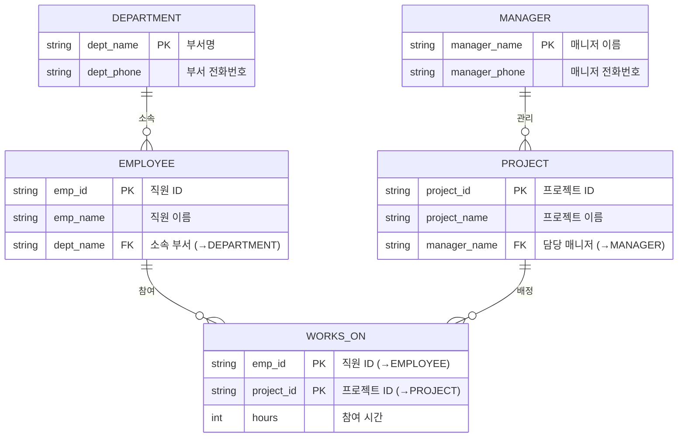

# 2026 학년도 1학기 중간과제물(온라인 제출용)

| | |
|---|---|
| **교 과 목 명** | 데이터처리와활용 |
| **학 번** | 202334-153257 |
| **성 명** | 양희석 |
| **연 락 처** | 010-4340-2326 |
| **과 제 유 형** **(공통형/지정형)** | 공통형 |

<style>
/* PDF 변환 시 HTML 테이블의 td/th 가 user-agent 기본 폰트로 확대되는 현상 방지 */
/* 모든 HTML 데이터 테이블의 셀 폰트를 작게(11px) 강제 적용 */
table[style*="border-collapse"] th,
table[style*="border-collapse"] td {
  font-size: 11px !important;
  line-height: 1.3 !important;
  padding: 2px 3px !important;
}
</style>

---
## 목차

1. **원본 테이블** (직원-프로젝트 근무시간 기록)
2. **문제1. 기본 키 찾기**
   1. 후보키 분석
   2. 기본키(Primary Key) 결정
   3. 결론
3. **문제2. 함수 종속 찾기**
   1. 전체 함수 종속 관계 도출
   2. 부분 함수 종속 (Partial Functional Dependency)
   3. 이행 함수 종속 (Transitive Functional Dependency)
   4. 종합 정리
4. **문제3. 정규화**
   1. 정규화 개요
   2. 1단계: 제1정규형 (1NF)
   3. 2단계: 제2정규형 (2NF)
   4. 3단계: 제3정규형 (3NF)
   5. 최종 3NF 스키마 요약
5. **문제4. ERD 그리기 (크로우풋 표기법)**
   1. 개체(Entity) 식별
   2. 관계(Relationship) 및 카디널리티 분석
   3. 크로우풋 표기 ERD
   4. 표기 규약 설명 (크로우풋 기호)
   5. ERD에서 확인되는 정규화 결과

---


## 원본 테이블 (직원-프로젝트 근무시간 기록)

> 한 회사에서 직원들이 여러 프로젝트에 참여하여 근무 시간을 기록하고 있다. 현재 회사는 아래와 같은 하나의 테이블로 데이터를 관리하고 있다.

<table style="width:100%; border-collapse:collapse; table-layout:auto;">
  <thead>
    <tr style="background-color:#C0504D; color:white; font-size:11px;">
      <th style="padding:2px 3px; font-size:11px; white-space:nowrap;">emp_id</th>
      <th style="padding:2px 3px; font-size:11px; white-space:nowrap;">emp_name</th>
      <th style="padding:2px 3px; font-size:11px; white-space:nowrap;">dept_name</th>
      <th style="padding:2px 3px; font-size:11px; white-space:nowrap;">dept_phone</th>
      <th style="padding:2px 3px; font-size:11px; white-space:nowrap;">project_id</th>
      <th style="padding:2px 3px; font-size:11px; white-space:nowrap;">project_name</th>
      <th style="padding:2px 3px; font-size:11px; white-space:nowrap;">manager_name</th>
      <th style="padding:2px 3px; font-size:11px; white-space:nowrap;">manager_phone</th>
      <th style="padding:2px 3px; font-size:11px; white-space:nowrap;">hours</th>
    </tr>
  </thead>
  <tbody style="font-size:11px;">
    <tr>
      <td style="padding:2px 3px; font-size:11px; white-space:nowrap;">E01</td><td style="padding:2px 3px; font-size:11px; white-space:nowrap;">김철수</td><td style="padding:2px 3px; font-size:11px; white-space:nowrap;">개발</td><td style="padding:2px 3px; font-size:11px; white-space:nowrap;">02-1111</td><td style="padding:2px 3px; font-size:11px; white-space:nowrap;">P10</td><td style="padding:2px 3px; font-size:11px; white-space:nowrap;">쇼핑몰</td><td style="padding:2px 3px; font-size:11px; white-space:nowrap;">이부장</td><td style="padding:2px 3px; font-size:11px; white-space:nowrap;">010-5555</td><td style="padding:2px 3px; font-size:11px; white-space:nowrap;">20</td>
    </tr>
    <tr>
      <td style="padding:2px 3px; font-size:11px; white-space:nowrap;">E01</td><td style="padding:2px 3px; font-size:11px; white-space:nowrap;">김철수</td><td style="padding:2px 3px; font-size:11px; white-space:nowrap;">개발</td><td style="padding:2px 3px; font-size:11px; white-space:nowrap;">02-1111</td><td style="padding:2px 3px; font-size:11px; white-space:nowrap;">P20</td><td style="padding:2px 3px; font-size:11px; white-space:nowrap;">추천시스템</td><td style="padding:2px 3px; font-size:11px; white-space:nowrap;">박부장</td><td style="padding:2px 3px; font-size:11px; white-space:nowrap;">010-6666</td><td style="padding:2px 3px; font-size:11px; white-space:nowrap;">15</td>
    </tr>
    <tr>
      <td style="padding:2px 3px; font-size:11px; white-space:nowrap;">E02</td><td style="padding:2px 3px; font-size:11px; white-space:nowrap;">이영희</td><td style="padding:2px 3px; font-size:11px; white-space:nowrap;">개발</td><td style="padding:2px 3px; font-size:11px; white-space:nowrap;">02-1111</td><td style="padding:2px 3px; font-size:11px; white-space:nowrap;">P10</td><td style="padding:2px 3px; font-size:11px; white-space:nowrap;">쇼핑몰</td><td style="padding:2px 3px; font-size:11px; white-space:nowrap;">이부장</td><td style="padding:2px 3px; font-size:11px; white-space:nowrap;">010-5555</td><td style="padding:2px 3px; font-size:11px; white-space:nowrap;">10</td>
    </tr>
    <tr>
      <td style="padding:2px 3px; font-size:11px; white-space:nowrap;">E03</td><td style="padding:2px 3px; font-size:11px; white-space:nowrap;">박민수</td><td style="padding:2px 3px; font-size:11px; white-space:nowrap;">마케팅</td><td style="padding:2px 3px; font-size:11px; white-space:nowrap;">02-2222</td><td style="padding:2px 3px; font-size:11px; white-space:nowrap;">P30</td><td style="padding:2px 3px; font-size:11px; white-space:nowrap;">광고분석</td><td style="padding:2px 3px; font-size:11px; white-space:nowrap;">정팀장</td><td style="padding:2px 3px; font-size:11px; white-space:nowrap;">010-7777</td><td style="padding:2px 3px; font-size:11px; white-space:nowrap;">25</td>
    </tr>
    <tr>
      <td style="padding:2px 3px; font-size:11px; white-space:nowrap;">E04</td><td style="padding:2px 3px; font-size:11px; white-space:nowrap;">정지훈</td><td style="padding:2px 3px; font-size:11px; white-space:nowrap;">마케팅</td><td style="padding:2px 3px; font-size:11px; white-space:nowrap;">02-2222</td><td style="padding:2px 3px; font-size:11px; white-space:nowrap;">P30</td><td style="padding:2px 3px; font-size:11px; white-space:nowrap;">광고분석</td><td style="padding:2px 3px; font-size:11px; white-space:nowrap;">정팀장</td><td style="padding:2px 3px; font-size:11px; white-space:nowrap;">010-7777</td><td style="padding:2px 3px; font-size:11px; white-space:nowrap;">18</td>
    </tr>
  </tbody>
</table>

---

## 문제1. 기본 키 찾기

### 1) 후보키 분석

기본키는 릴레이션의 각 튜플(행)을 **유일하게 식별**할 수 있어야 하며, **최소성(minimality)** 을 만족해야 한다. 주어진 테이블의 각 단일 속성과 조합을 검토하여 어떤 속성(또는 속성의 조합)이 모든 행을 유일하게 구분할 수 있는지 확인.

| 속성(조합) | 중복 여부 | 유일 식별 가능 여부 |
|---|---|---|
| `emp_id` | E01이 2회 출현 (P10, P20에 모두 참여) | ✗ |
| `emp_name` | 김철수가 2회 출현 | ✗ |
| `dept_name` | 개발/마케팅 다수 중복 | ✗ |
| `dept_phone` | 02-1111, 02-2222 다수 중복 | ✗ |
| `project_id` | P10, P30이 각각 2회 출현 | ✗ |
| `project_name` | 쇼핑몰, 광고분석 다수 중복 | ✗ |
| `manager_name` | 이부장, 정팀장 다수 중복 | ✗ |
| `manager_phone` | 010-5555, 010-7777 다수 중복 | ✗ |
| `hours` | 시간 값은 의미상 비식별 속성 | ✗ |
| **`{emp_id, project_id}`** | (E01,P10), (E01,P20), (E02,P10), (E03,P30), (E04,P30) — **모두 유일** | **✓** |

### 2) 기본키(Primary Key) 결정

$$
\textbf{PK} \;=\; \{\,\texttt{emp\_id},\ \texttt{project\_id}\,\}
$$

- **유일성(Uniqueness)**: 위 표에서 확인한 바와 같이 `(emp_id, project_id)` 조합은 5개 행 모두에서 서로 다른 값을 가지므로 각 행을 유일하게 식별한다.
- **최소성(Minimality)**: `emp_id` 단독, `project_id` 단독으로는 행을 유일하게 식별할 수 없으므로(각각 중복 발생), 두 속성을 모두 포함해야만 식별이 가능하다. 어느 한쪽을 제거하면 유일성이 깨지므로 최소 키이다.
- **의미적 타당성**: 본 테이블은 "한 직원이 여러 프로젝트에 참여하여 근무 시간을 기록"하는 **다대다(M:N) 관계**의 결과를 단일 테이블로 표현한 것이다. 따라서 한 직원(`emp_id`)이 어떤 프로젝트(`project_id`)에 참여했는지를 나타내는 **두 속성의 결합이 자연스러운 식별자**가 된다.

### 3) 결론

> 본 테이블의 **기본키(Primary Key)는 복합키(Composite Key)인 `{emp_id, project_id}`** 이다.

---

## 문제2. 함수 종속 찾기

> 데이터를 분석하여 다음을 찾으시오. ① 부분 함수 종속, ② 이행 함수 종속

### 1) 전체 함수 종속 관계 도출

먼저 테이블의 데이터를 관찰하여 도출 가능한 모든 함수 종속(Functional Dependency, FD)을 정리하면 다음과 같다.

| 번호 | 함수 종속 | 의미(근거) |
|---|---|---|
| FD1 | `emp_id → emp_name, dept_name, dept_phone` | 한 직원은 하나의 이름과 하나의 소속 부서를 가진다. (E01→김철수/개발/02-1111 일관) |
| FD2 | `dept_name → dept_phone` | 한 부서는 하나의 대표 전화번호를 가진다. (개발→02-1111, 마케팅→02-2222) |
| FD3 | `project_id → project_name, manager_name, manager_phone` | 한 프로젝트는 하나의 이름과 한 명의 담당 매니저를 가진다. (P10→쇼핑몰/이부장, P30→광고분석/정팀장) |
| FD4 | `manager_name → manager_phone` | 한 매니저는 하나의 전화번호를 가진다. (이부장→010-5555, 박부장→010-6666, 정팀장→010-7777) |
| FD5 | `{emp_id, project_id} → hours` | 특정 직원이 특정 프로젝트에 투입한 근무시간은 두 키의 조합에 의해서만 결정된다. |

기본키(PK) **`{emp_id, project_id}`** 를 기준으로 위 FD들을 분류한다.


### 2) 부분 함수 종속 (Partial Functional Dependency)

**정의**: 복합 기본키의 **일부 속성에만** 비주요 속성이 함수적으로 종속되는 경우. (즉, PK 전체가 아닌 PK의 진부분집합에 의해 결정됨.)

본 테이블의 PK = `{emp_id, project_id}` 이므로, **`emp_id` 단독** 또는 **`project_id` 단독**으로 결정되는 비주요 속성은 모두 부분 함수 종속에 해당한다.

| 부분 종속 | 결정자(부분키) | 종속 속성 |
|---|---|---|
| **PFD1** | `emp_id` | `emp_name`, `dept_name`, `dept_phone` |
| **PFD2** | `project_id` | `project_name`, `manager_name`, `manager_phone` |

$$
\begin{aligned}
\text{PFD1: } & \texttt{emp\_id} \rightarrow \texttt{emp\_name},\ \texttt{dept\_name},\ \texttt{dept\_phone} \\
\text{PFD2: } & \texttt{project\_id} \rightarrow \texttt{project\_name},\ \texttt{manager\_name},\ \texttt{manager\_phone}
\end{aligned}
$$

> **검증**: `hours` 속성만이 PK 전체 `{emp_id, project_id}` 에 완전 함수 종속(Full FD)되며, 나머지 6개의 비주요 속성은 모두 PK의 일부에만 종속되므로 부분 종속 관계에 해당한다. → **이는 제2정규형(2NF) 위반의 직접적 원인**이 된다.


### 3) 이행 함수 종속 (Transitive Functional Dependency)

**정의**: `A → B` 이고 `B → C` 일 때, `A`가 키이고 `B`가 키가 아니면, `A → C` 의 종속이 `B`를 거쳐 간접적으로 성립하는 관계. (단, `B`가 키의 일부가 아닐 것)

본 테이블에서 발견되는 이행 종속은 다음과 같다.

| 이행 종속 | 경로 | 설명 |
|---|---|---|
| **TFD1** | `emp_id → dept_name → dept_phone` | 직원이 부서를 결정하고, 부서가 부서 전화번호를 결정 |
| **TFD2** | `project_id → manager_name → manager_phone` | 프로젝트가 매니저를 결정하고, 매니저가 매니저 전화번호를 결정 |

$$
\begin{aligned}
\text{TFD1: } & \texttt{emp\_id} \rightarrow \texttt{dept\_name} \rightarrow \texttt{dept\_phone} \\
\text{TFD2: } & \texttt{project\_id} \rightarrow \texttt{manager\_name} \rightarrow \texttt{manager\_phone}
\end{aligned}
$$

- TFD1: `dept_name` 은 키가 아님에도 `dept_phone` 을 결정 → `emp_id → dept_phone` 이 `dept_name` 을 매개로 성립.
- TFD2: `manager_name` 은 키가 아님에도 `manager_phone` 을 결정 → `project_id → manager_phone` 이 `manager_name` 을 매개로 성립.

> **검증**: 두 이행 종속 모두 "키가 아닌 속성이 또 다른 키 아닌 속성을 결정"하는 형태이다. → **이는 제3정규형(3NF) 위반의 직접적 원인**이 된다.


### 4) 종합 정리

| 구분 | 종속 관계 | 정규화 시 영향 |
|---|---|---|
| 완전 함수 종속 | `{emp_id, project_id} → hours` | 2NF에서 유지 |
| **부분 함수 종속** | `emp_id → {emp_name, dept_name, dept_phone}` | **2NF 위반** → 직원 테이블 분리 |
| **부분 함수 종속** | `project_id → {project_name, manager_name, manager_phone}` | **2NF 위반** → 프로젝트 테이블 분리 |
| **이행 함수 종속** | `emp_id → dept_name → dept_phone` | **3NF 위반** → 부서 테이블 분리 |
| **이행 함수 종속** | `project_id → manager_name → manager_phone` | **3NF 위반** → 매니저 테이블 분리 |

---

## 문제3. 정규화
**위 테이블을 3단계까지 정규화하시오(중간 단계 테이블을 모두 포함해야 하며, PK/FK를 표시해야 함).**

### 정규화 개요

문제2에서 도출한 함수 종속을 바탕으로 단계별 정규화를 수행한다.

| 단계 | 조건 | 본 테이블의 위반 사항 | 해결 방법 |
|---|---|---|---|
| **1NF** | 모든 속성값이 원자값(Atomic) | 위반 없음 (모든 셀이 단일값) | — |
| **2NF** | 1NF + 부분 함수 종속 제거 | `emp_id → ...`, `project_id → ...` 의 부분 종속 존재 | PK의 부분키별로 테이블 분리 |
| **3NF** | 2NF + 이행 함수 종속 제거 | `dept_name → dept_phone`, `manager_name → manager_phone` 의 이행 종속 존재 | 비키 결정자별로 테이블 분리 |

> 표기 규약: <span style="background-color:#FFE699;">**PK (Primary Key, 밑줄)**</span>, <span style="background-color:#C5E0B4;">**FK (Foreign Key, 기울임)**</span>


### 1단계: 제1정규형 (1NF)

**조건**: 모든 속성값이 원자값이어야 한다.

원본 테이블은 이미 모든 컬럼이 단일 값(반복 그룹/다중값 없음)을 가지므로 **1NF를 만족**한다. 따라서 1NF 테이블은 원본과 동일하다.

**WORK_LOG_1NF**  *(PK: __emp_id, project_id__)*

<table style="width:100%; border-collapse:collapse; font-size:13px;">
  <thead>
    <tr style="background-color:#C0504D; color:white;">
      <th style="padding:2px 4px; white-space:nowrap; text-decoration:underline;">emp_id</th>
      <th style="padding:2px 4px; white-space:nowrap;">emp_name</th>
      <th style="padding:2px 4px; white-space:nowrap;">dept_name</th>
      <th style="padding:2px 4px; white-space:nowrap;">dept_phone</th>
      <th style="padding:2px 4px; white-space:nowrap; text-decoration:underline;">project_id</th>
      <th style="padding:2px 4px; white-space:nowrap;">project_name</th>
      <th style="padding:2px 4px; white-space:nowrap;">manager_name</th>
      <th style="padding:2px 4px; white-space:nowrap;">manager_phone</th>
      <th style="padding:2px 4px; white-space:nowrap;">hours</th>
    </tr>
  </thead>
  <tbody>
    <tr><td style="padding:2px 4px;">E01</td><td style="padding:2px 4px;">김철수</td><td style="padding:2px 4px;">개발</td><td style="padding:2px 4px;">02-1111</td><td style="padding:2px 4px;">P10</td><td style="padding:2px 4px;">쇼핑몰</td><td style="padding:2px 4px;">이부장</td><td style="padding:2px 4px;">010-5555</td><td style="padding:2px 4px;">20</td></tr>
    <tr><td style="padding:2px 4px;">E01</td><td style="padding:2px 4px;">김철수</td><td style="padding:2px 4px;">개발</td><td style="padding:2px 4px;">02-1111</td><td style="padding:2px 4px;">P20</td><td style="padding:2px 4px;">추천시스템</td><td style="padding:2px 4px;">박부장</td><td style="padding:2px 4px;">010-6666</td><td style="padding:2px 4px;">15</td></tr>
    <tr><td style="padding:2px 4px;">E02</td><td style="padding:2px 4px;">이영희</td><td style="padding:2px 4px;">개발</td><td style="padding:2px 4px;">02-1111</td><td style="padding:2px 4px;">P10</td><td style="padding:2px 4px;">쇼핑몰</td><td style="padding:2px 4px;">이부장</td><td style="padding:2px 4px;">010-5555</td><td style="padding:2px 4px;">10</td></tr>
    <tr><td style="padding:2px 4px;">E03</td><td style="padding:2px 4px;">박민수</td><td style="padding:2px 4px;">마케팅</td><td style="padding:2px 4px;">02-2222</td><td style="padding:2px 4px;">P30</td><td style="padding:2px 4px;">광고분석</td><td style="padding:2px 4px;">정팀장</td><td style="padding:2px 4px;">010-7777</td><td style="padding:2px 4px;">25</td></tr>
    <tr><td style="padding:2px 4px;">E04</td><td style="padding:2px 4px;">정지훈</td><td style="padding:2px 4px;">마케팅</td><td style="padding:2px 4px;">02-2222</td><td style="padding:2px 4px;">P30</td><td style="padding:2px 4px;">광고분석</td><td style="padding:2px 4px;">정팀장</td><td style="padding:2px 4px;">010-7777</td><td style="padding:2px 4px;">18</td></tr>
  </tbody>
</table>

**문제점**: PK = `{emp_id, project_id}` 인데, 비주요 속성들이 PK의 일부에만 의존(부분 함수 종속) → **2NF 위반**.


### 2단계: 제2정규형 (2NF)

**조건**: 1NF + 모든 비주요 속성이 PK에 **완전 함수 종속**이어야 한다.

부분 종속을 제거하기 위해 PK의 부분키 단위로 테이블을 분해한다.

- `emp_id → (emp_name, dept_name, dept_phone)` → **EMPLOYEE** 테이블로 분리
- `project_id → (project_name, manager_name, manager_phone)` → **PROJECT** 테이블로 분리
- `{emp_id, project_id} → hours` → **WORKS_ON** 테이블로 유지

#### ① EMPLOYEE_2NF  
`(PK: __emp_id__)`

<table style="width:100%; border-collapse:collapse; font-size:13px;">
  <thead>
    <tr style="background-color:#C0504D; color:white;">
      <th style="padding:2px 4px; text-decoration:underline;">emp_id</th>
      <th style="padding:2px 4px;">emp_name</th>
      <th style="padding:2px 4px;">dept_name</th>
      <th style="padding:2px 4px;">dept_phone</th>
    </tr>
  </thead>
  <tbody>
    <tr><td style="padding:2px 4px;">E01</td><td style="padding:2px 4px;">김철수</td><td style="padding:2px 4px;">개발</td><td style="padding:2px 4px;">02-1111</td></tr>
    <tr><td style="padding:2px 4px;">E02</td><td style="padding:2px 4px;">이영희</td><td style="padding:2px 4px;">개발</td><td style="padding:2px 4px;">02-1111</td></tr>
    <tr><td style="padding:2px 4px;">E03</td><td style="padding:2px 4px;">박민수</td><td style="padding:2px 4px;">마케팅</td><td style="padding:2px 4px;">02-2222</td></tr>
    <tr><td style="padding:2px 4px;">E04</td><td style="padding:2px 4px;">정지훈</td><td style="padding:2px 4px;">마케팅</td><td style="padding:2px 4px;">02-2222</td></tr>
  </tbody>
</table>

#### ② PROJECT_2NF  
`(PK: __project_id__)`

<table style="width:100%; border-collapse:collapse; font-size:13px;">
  <thead>
    <tr style="background-color:#C0504D; color:white;">
      <th style="padding:2px 4px; text-decoration:underline;">project_id</th>
      <th style="padding:2px 4px;">project_name</th>
      <th style="padding:2px 4px;">manager_name</th>
      <th style="padding:2px 4px;">manager_phone</th>
    </tr>
  </thead>
  <tbody>
    <tr><td style="padding:2px 4px;">P10</td><td style="padding:2px 4px;">쇼핑몰</td><td style="padding:2px 4px;">이부장</td><td style="padding:2px 4px;">010-5555</td></tr>
    <tr><td style="padding:2px 4px;">P20</td><td style="padding:2px 4px;">추천시스템</td><td style="padding:2px 4px;">박부장</td><td style="padding:2px 4px;">010-6666</td></tr>
    <tr><td style="padding:2px 4px;">P30</td><td style="padding:2px 4px;">광고분석</td><td style="padding:2px 4px;">정팀장</td><td style="padding:2px 4px;">010-7777</td></tr>
  </tbody>
</table>

#### ③ WORKS_ON_2NF  
`(PK: __emp_id, project_id__ / FK: emp_id → EMPLOYEE, project_id → PROJECT)`

<table style="width:100%; border-collapse:collapse; font-size:13px;">
  <thead>
    <tr style="background-color:#C0504D; color:white;">
      <th style="padding:2px 4px; text-decoration:underline;"><i>emp_id</i></th>
      <th style="padding:2px 4px; text-decoration:underline;"><i>project_id</i></th>
      <th style="padding:2px 4px;">hours</th>
    </tr>
  </thead>
  <tbody>
    <tr><td style="padding:2px 4px;">E01</td><td style="padding:2px 4px;">P10</td><td style="padding:2px 4px;">20</td></tr>
    <tr><td style="padding:2px 4px;">E01</td><td style="padding:2px 4px;">P20</td><td style="padding:2px 4px;">15</td></tr>
    <tr><td style="padding:2px 4px;">E02</td><td style="padding:2px 4px;">P10</td><td style="padding:2px 4px;">10</td></tr>
    <tr><td style="padding:2px 4px;">E03</td><td style="padding:2px 4px;">P30</td><td style="padding:2px 4px;">25</td></tr>
    <tr><td style="padding:2px 4px;">E04</td><td style="padding:2px 4px;">P30</td><td style="padding:2px 4px;">18</td></tr>
  </tbody>
</table>

**남은 문제점**:
- `EMPLOYEE_2NF`: `emp_id → dept_name → dept_phone` 의 **이행 종속** 존재
- `PROJECT_2NF`: `project_id → manager_name → manager_phone` 의 **이행 종속** 존재
- → **3NF 위반**


### 3단계: 제3정규형 (3NF)

**조건**: 2NF + 비주요 속성 간의 **이행 함수 종속을 제거**하여, 모든 비주요 속성이 PK에 직접 종속되도록 한다.

이행 종속의 매개 속성(`dept_name`, `manager_name`)을 PK로 하는 새로운 테이블로 분리한다.

#### ① EMPLOYEE_3NF  
`(PK: __emp_id__ / FK: dept_name → DEPARTMENT)`

<table style="width:100%; border-collapse:collapse; font-size:13px;">
  <thead>
    <tr style="background-color:#C0504D; color:white;">
      <th style="padding:2px 4px; text-decoration:underline;">emp_id</th>
      <th style="padding:2px 4px;">emp_name</th>
      <th style="padding:2px 4px;"><i>dept_name</i></th>
    </tr>
  </thead>
  <tbody>
    <tr><td style="padding:2px 4px;">E01</td><td style="padding:2px 4px;">김철수</td><td style="padding:2px 4px;">개발</td></tr>
    <tr><td style="padding:2px 4px;">E02</td><td style="padding:2px 4px;">이영희</td><td style="padding:2px 4px;">개발</td></tr>
    <tr><td style="padding:2px 4px;">E03</td><td style="padding:2px 4px;">박민수</td><td style="padding:2px 4px;">마케팅</td></tr>
    <tr><td style="padding:2px 4px;">E04</td><td style="padding:2px 4px;">정지훈</td><td style="padding:2px 4px;">마케팅</td></tr>
  </tbody>
</table>

#### ② DEPARTMENT_3NF
`(PK: __dept_name__)`

<table style="width:100%; border-collapse:collapse; font-size:13px;">
  <thead>
    <tr style="background-color:#C0504D; color:white;">
      <th style="padding:2px 4px; text-decoration:underline;">dept_name</th>
      <th style="padding:2px 4px;">dept_phone</th>
    </tr>
  </thead>
  <tbody>
    <tr><td style="padding:2px 4px;">개발</td><td style="padding:2px 4px;">02-1111</td></tr>
    <tr><td style="padding:2px 4px;">마케팅</td><td style="padding:2px 4px;">02-2222</td></tr>
  </tbody>
</table>

#### ③ PROJECT_3NF
`(PK: __project_id__ / FK: manager_name → MANAGER)`

<table style="width:100%; border-collapse:collapse; font-size:13px;">
  <thead>
    <tr style="background-color:#C0504D; color:white;">
      <th style="padding:2px 4px; text-decoration:underline;">project_id</th>
      <th style="padding:2px 4px;">project_name</th>
      <th style="padding:2px 4px;"><i>manager_name</i></th>
    </tr>
  </thead>
  <tbody>
    <tr><td style="padding:2px 4px;">P10</td><td style="padding:2px 4px;">쇼핑몰</td><td style="padding:2px 4px;">이부장</td></tr>
    <tr><td style="padding:2px 4px;">P20</td><td style="padding:2px 4px;">추천시스템</td><td style="padding:2px 4px;">박부장</td></tr>
    <tr><td style="padding:2px 4px;">P30</td><td style="padding:2px 4px;">광고분석</td><td style="padding:2px 4px;">정팀장</td></tr>
  </tbody>
</table>

#### ④ MANAGER_3NF
`(PK: __manager_name__)`

<table style="width:100%; border-collapse:collapse; font-size:13px;">
  <thead>
    <tr style="background-color:#C0504D; color:white;">
      <th style="padding:2px 4px; text-decoration:underline;">manager_name</th>
      <th style="padding:2px 4px;">manager_phone</th>
    </tr>
  </thead>
  <tbody>
    <tr><td style="padding:2px 4px;">이부장</td><td style="padding:2px 4px;">010-5555</td></tr>
    <tr><td style="padding:2px 4px;">박부장</td><td style="padding:2px 4px;">010-6666</td></tr>
    <tr><td style="padding:2px 4px;">정팀장</td><td style="padding:2px 4px;">010-7777</td></tr>
  </tbody>
</table>

#### ⑤ WORKS_ON_3NF
`(PK: __emp_id, project_id__ / FK: emp_id → EMPLOYEE, project_id → PROJECT)`

<table style="width:100%; border-collapse:collapse; font-size:13px;">
  <thead>
    <tr style="background-color:#C0504D; color:white;">
      <th style="padding:2px 4px; text-decoration:underline;"><i>emp_id</i></th>
      <th style="padding:2px 4px; text-decoration:underline;"><i>project_id</i></th>
      <th style="padding:2px 4px;">hours</th>
    </tr>
  </thead>
  <tbody>
    <tr><td style="padding:2px 4px;">E01</td><td style="padding:2px 4px;">P10</td><td style="padding:2px 4px;">20</td></tr>
    <tr><td style="padding:2px 4px;">E01</td><td style="padding:2px 4px;">P20</td><td style="padding:2px 4px;">15</td></tr>
    <tr><td style="padding:2px 4px;">E02</td><td style="padding:2px 4px;">P10</td><td style="padding:2px 4px;">10</td></tr>
    <tr><td style="padding:2px 4px;">E03</td><td style="padding:2px 4px;">P30</td><td style="padding:2px 4px;">25</td></tr>
    <tr><td style="padding:2px 4px;">E04</td><td style="padding:2px 4px;">P30</td><td style="padding:2px 4px;">18</td></tr>
  </tbody>
</table>


### 최종 3NF 스키마 요약

```text
EMPLOYEE   ( emp_id [PK], emp_name, dept_name [FK→DEPARTMENT.dept_name] )
DEPARTMENT ( dept_name [PK], dept_phone )
PROJECT    ( project_id [PK], project_name, manager_name [FK→MANAGER.manager_name] )
MANAGER    ( manager_name [PK], manager_phone )
WORKS_ON   ( emp_id [PK,FK→EMPLOYEE.emp_id],
             project_id [PK,FK→PROJECT.project_id],
             hours )
```

| 테이블 | PK | FK |
|---|---|---|
| EMPLOYEE | `emp_id` | `dept_name` → DEPARTMENT |
| DEPARTMENT | `dept_name` | — |
| PROJECT | `project_id` | `manager_name` → MANAGER |
| MANAGER | `manager_name` | — |
| WORKS_ON | `{emp_id, project_id}` | `emp_id` → EMPLOYEE, `project_id` → PROJECT |

> **결과 검증**: 모든 테이블에서 비주요 속성은 오직 PK에 대해서만 직접·완전 함수 종속을 가지며, 부분 종속과 이행 종속이 모두 제거되어 **제3정규형(3NF)을 만족**한다. 또한 원본 테이블의 모든 정보는 5개 테이블의 자연 조인(natural join)을 통해 손실 없이 복원 가능하다(무손실 분해).

---
## 문제4. ERD 그리기(크로우풋 표기법)

문제3에서 도출한 3NF 스키마(5개 테이블)를 기반으로 **개체-관계 다이어그램(Entity-Relationship Diagram)** 을 크로우풋(Crow's Foot) 표기법으로 작성한다.

### 1) 개체(Entity) 식별

| 개체(Entity) | 의미 | 식별자(PK) |
|---|---|---|
| **DEPARTMENT** | 부서 | `dept_name` |
| **EMPLOYEE** | 직원 | `emp_id` |
| **PROJECT** | 프로젝트 | `project_id` |
| **MANAGER** | 매니저 | `manager_name` |
| **WORKS_ON** | 직원의 프로젝트 참여 기록 (연관 개체) | `{emp_id, project_id}` |

### 2) 관계(Relationship) 및 카디널리티 분석

| 관계 | 양쪽 카디널리티 | 해석 |
|---|---|---|
| **DEPARTMENT — EMPLOYEE** ("소속") | 1 : N | 한 부서에는 0명 이상의 직원이 소속되며, 한 직원은 반드시 정확히 하나의 부서에 소속된다. |
| **MANAGER — PROJECT** ("관리") | 1 : N | 한 매니저는 0개 이상의 프로젝트를 관리하며, 한 프로젝트는 반드시 정확히 한 명의 매니저에 의해 관리된다. |
| **EMPLOYEE — WORKS_ON** ("참여") | 1 : N | 한 직원은 0개 이상의 참여 기록을 가질 수 있으며, 한 참여 기록은 반드시 정확히 한 명의 직원과 연결된다. |
| **PROJECT — WORKS_ON** ("배정") | 1 : N | 한 프로젝트는 0개 이상의 참여 기록을 가질 수 있으며, 한 참여 기록은 반드시 정확히 하나의 프로젝트와 연결된다. |
| **EMPLOYEE ↔ PROJECT** (논리적) | M : N | 위 두 관계의 결합으로, "직원은 여러 프로젝트에 참여하고 프로젝트에는 여러 직원이 참여"하는 다대다 관계를 `WORKS_ON` 연관 개체로 해소한다. |

### 3) 크로우풋 표기 ERD



### 4) 표기 규약 설명 (크로우풋 기호)

본 ERD에서 사용한 Mermaid 크로우풋 표기 기호의 의미는 다음과 같다.

| 기호 | 의미 | 본 ERD 사용 예 |
|---|---|---|
| `\|\|` | **정확히 1 (one and only one)** — 필수, 단일 | DEPARTMENT 쪽 끝 |
| `o{`  | **0 이상 다수 (zero or many)** — 선택적, 다수 | EMPLOYEE 쪽 끝 |
| `\|{` | **1 이상 다수 (one or many)** — 필수, 다수 | (본 ERD 미사용) |
| `o\|` | **0 또는 1 (zero or one)** — 선택적, 단일 | (본 ERD 미사용) |

따라서 `DEPARTMENT ||--o{ EMPLOYEE` 는 **"한 부서(필수, 1)는 0명 이상의 직원(선택적, 다수)을 가진다"** 로 읽는다.

### 5) ERD에서 확인되는 정규화 결과

- **모든 비주요 속성**이 자신이 속한 개체의 PK에 직접 종속되어 있음 (3NF 만족).
- **부분 종속**과 **이행 종속**이 발생할 수 있는 속성들(`dept_phone`, `manager_phone`)은 별도 개체(`DEPARTMENT`, `MANAGER`)로 분리되어 외래키로만 참조됨.
- 직원-프로젝트 간 **다대다(M:N)** 관계는 연관 개체 `WORKS_ON` 으로 해소되어, 두 개의 1:N 관계로 분해됨 → 관계형 모델에서 직접 표현 가능한 형태가 됨.

> **결론**: 본 ERD는 문제1~3에서 도출한 PK·FK·정규화 결과를 시각적으로 일관되게 반영하며, 3NF를 만족하는 5개 개체 간의 관계를 크로우풋 표기법으로 명확히 나타낸다.