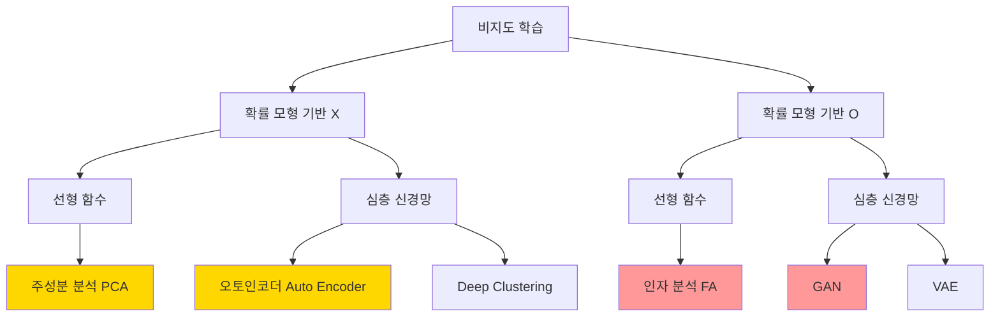
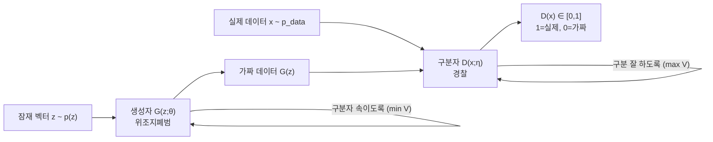
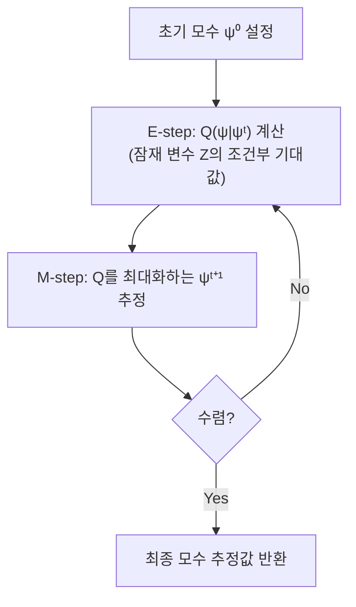

# 10강. 딥러닝의통계적이해: 오토인코더와 GAN (2)

## 🔗 선수 지식 (Prerequisites)
- [ ] **필수**: [9강. 오토인코더와 GAN (1)](9강.%20오토인코더와%20GAN%20(1).md) — 비지도 학습, PCA, 오토 인코더 구조 이해 완료? `→←9강`
- [ ] **필수**: [3강. 딥러닝 모형의 구조와 학습 (1)](3강.%20딥러닝%20모형의%20구조와%20학습%20(1).md) — 심층 신경망 구조, 활성화 함수 숙지?
- [ ] **권장**: [2강. 딥러닝과 통계학](2강.%20딥러닝과%20통계학.md) — 확률 모형 기반 vs 비기반 방법론 구분
- **관련 단원**: [9강. 오토인코더와 GAN (1)](9강.%20오토인코더와%20GAN%20(1).md)

---

## 학습 목표
1. 인자 분석 모형에 대해 이해한다.
2. EM 알고리즘에 대해 이해한다.
3. 심층 생성 모형에 대해 이해한다.
4. GAN 방법론에 대해 이해한다.

---

## 🧠 메타인지 체크 (학습 전/후 자기 평가)

### 학습 전 자기 평가
| 소주제 | 자신감 (1-5) |
| :--- | :--- |
| 비지도 학습 분류 (확률 모형 기반 여부) | |
| 인자 분석 모형 (직교 인자 모형 수식) | |
| EM 알고리즘 (E-step / M-step) | |
| GAN의 구조 (생성자 vs 구분자) | |
| GAN 목적 함수 (Minimax Game) | |
| GAN의 장단점 및 발전 (DCGAN, SRGAN, pix2pix) | |

### 학습 후 교정 (학습 완료 후 작성)
| 소주제 | 학습 전 | 학습 후 | 실제 정답률 | 과신/과소 여부 |
| :--- | :--- | :--- | :--- | :--- |
| 비지도 학습 분류 (확률 모형 기반 여부) | | | | |
| 인자 분석 모형 (직교 인자 모형 수식) | | | | |
| EM 알고리즘 (E-step / M-step) | | | | |
| GAN의 구조 (생성자 vs 구분자) | | | | |
| GAN 목적 함수 (Minimax Game) | | | | |
| GAN의 장단점 및 발전 (DCGAN, SRGAN, pix2pix) | | | | |

> **활용법**: 학습 전 1분 → 자신감 기입, 학습 후 1분 → 나머지 기입. "과신" 영역이 실제 취약점.

---

## 📝 요약 (Summary)

1. 🔴 **비지도 학습 분류**: 확률 모형 기반 여부와 변환 함수 종류(선형 vs 심층 신경망)로 구분된다. PCA/오토인코더는 확률 모형 비기반, 인자 분석/GAN은 확률 모형 기반이다.
2. 🔴 **인자 분석 (Factor Analysis)**: 잠재 인자(Latent Factor)와 관측 변수 간의 **선형 관계**를 가정한 모형으로, $X - \mu = LF + \epsilon$으로 표현된다. 변수 간 공분산 구조 파악이 목표이며 EM 알고리즘으로 모수를 추정한다.
3. 🔴 **EM 알고리즘**: 잠재 변수가 있는 확률 모형에서 최대 가능도 추정을 위한 반복 알고리즘. E-step(Q 함수 계산)과 M-step(Q 함수 최대화)을 수렴까지 반복한다.
4. 🔴 **심층 생성 모형**: 인자 모형의 선형 관계를 **심층 신경망 함수**로 확장한 것. 고차원 데이터(이미지, 오디오)를 설명하는 저차원 잠재 벡터를 가정한다.
5. 🔴 **GAN (Generative Adversarial Network)**: 생성자(Generator)와 구분자(Discriminator)를 서로 경쟁시키는 적대적 학습으로 실제 같은 데이터를 생성한다. Minimax Game 목적 함수로 학습된다.
6. 🟡 **GAN의 발전**: DCGAN(CNN 도입으로 고해상도 안정화), SRGAN(초해상도 복원), pix2pix(이미지-이미지 변환) 등으로 응용된다.
7. 🟢 **GAN의 단점**: 학습 불안정성, Mode Collapsing(특정 데이터만 반복 생성), 고해상도 이미지 성능 제한 등이 있다.

---

## 📐 핵심 수식 및 정의

| 수식명 | 수식 | 의미 |
| :--- | :--- | :--- |
| **직교 인자 모형** | $X - \mu = LF + \epsilon$ | 관측 벡터에서 평균을 뺀 값 = 인자 적재 행렬 × 공통 인자 + 오차 |
| **GAN 목적 함수** | $\min_{\theta}\max_{\eta}\ \mathbb{E}_{x \sim p_{data}}[\log D(x;\eta)] + \mathbb{E}_{z \sim p(z)}[\log(1 - D(G(z;\theta);\eta))]$ | 생성자는 구분자를 속이도록(min), 구분자는 잘 구분하도록(max) 동시에 학습 ($\theta$: Generator 파라미터, $\eta$: Discriminator 파라미터) |
| **EM — Q 함수 (E-step)** | $Q(\psi \mid \psi^{(t)}) = \mathbb{E}_{Z \mid X, \psi^{(t)}}[\log p(X, Z; \psi)]$ | 현재 모수 $\psi^{(t)}$ 기준 완전 로그 가능도의 기대값 |
| **EM — M-step** | $\psi^{(t+1)} = \underset{\psi}{\text{argmax}}\ Q(\psi \mid \psi^{(t)})$ | Q 함수를 최대화하는 새 모수로 갱신 |

### 주요 정리 — 직교 인자 모형

**직교 인자 모형 (Orthogonal Factor Model)**
$$
X - \mu = LF + \epsilon, \quad F \sim \mathcal{N}(0, I_q), \quad \epsilon \sim \mathcal{N}(0, \Psi)
$$
> **직관적 해석**: $p$개의 변수를 $q \ll p$개의 공통 인자 $F$로 설명. 예를 들어 수학·물리·화학 점수를 "이공계 능력"이라는 잠재 인자로 설명하는 것과 같다. 오차 $\epsilon$은 각 변수 고유의 잔차.
> **AI 적용**: 잠재 공간(Latent Space)을 학습하는 VAE, GAN의 이론적 기반. 저차원 잠재 벡터로 고차원 데이터를 생성하는 아이디어가 동일하다.

### 주요 정리 — GAN 목적 함수

**GAN Minimax Game**
$$
\min_{\theta}\max_{\eta}\ V(G, D) = \mathbb{E}_{x \sim p_{data}}[\log D(x;\eta)] + \mathbb{E}_{z \sim p(z)}[\log(1 - D(G(z;\theta);\eta))]
$$
> **직관적 해석**: 구분자 $D$는 $V$를 최대화(실제=1, 가짜=0 구분), 생성자 $G$는 $V$를 최소화(구분자가 가짜를 실제로 착각하도록) → 두 모형의 경쟁으로 생성 품질 향상.
> **AI 적용**: 이미지 생성, 영상 합성, 데이터 증강 등 다양한 생성 모형의 핵심 학습 원리.

---

## 📊 개념 시각화 (Visual Guide)

### 비지도 학습 분류 체계도



### GAN 학습 구조도



### EM 알고리즘 흐름도



### 핵심 비교표: 인자 분석 vs 주성분 분석

| 구분 | 인자 분석 (FA) | 주성분 분석 (PCA) | 비고 |
| :--- | :--- | :--- | :--- |
| **목표** | 변수 간 공분산 구조 파악 | 차원 축소 (분산 최대 보존) | `→←9강` |
| **확률 모형** | O (잠재 인자 분포 가정) | X | 핵심 차이 |
| **변환 함수** | 선형 ($LF$) | 선형 (고유벡터 투영) | |
| **모수 추정** | EM 알고리즘, 최대 가능도 | 고유값 분해 | |
| **심층 확장** | GAN, VAE | 오토인코더 | |

### GAN 발전 및 응용

| 모델 | 핵심 개선 | 응용 분야 | 키워드 |
| :--- | :--- | :--- | :--- |
| **기본 GAN** | Minimax 적대적 학습 | 이미지 생성 | Generator, Discriminator |
| **DCGAN** | CNN 구조 도입, 학습 안정화 | 고해상도 이미지 생성 | Batch Normalization |
| **SRGAN** | 퍼셉추얼 손실 함수 | 초해상도 이미지 복원 | Super Resolution |
| **pix2pix** | 조건부 GAN (cGAN) | 이미지-이미지 변환 | 레이아웃→실사, 지도→위성 |

---

## ✏️ 심화 학습 (Study Subject)

### 1. 가상 시나리오: "생성자와 구분자, 언제 균형에 도달할까?"

- **상황**: GAN으로 손글씨 숫자 이미지를 생성하려 한다. 학습 초기에는 구분자가 압도적으로 우세하여 생성자 학습 신호가 사라지는 Vanishing Gradient 문제가 발생한다.
- **문제**: 생성자가 $\log(1 - D(G(z)))$를 최소화하는 대신 $-\log D(G(z))$를 최대화하도록 수정하면 무엇이 달라지는가?
- **해결**: 목적 함수를 $-\log D(G(z))$ 최대화로 바꾸면, $D(G(z)) \approx 0$ 구간에서 기울기가 크게 살아남아 학습 신호가 유지된다. 이를 **Non-Saturating GAN** 트릭이라 한다.
- **AI 학습 포인트**: "GAN 학습이 불안정한 이유를 Mode Collapsing, Vanishing Gradient, 학습 균형 측면에서 각각 설명하고, Wasserstein GAN이 이를 어떻게 해결하는지 알려줘."

### 2. 관점별 비교 및 오개념 분석

#### 핵심 비교: GAN vs VAE (변분 오토인코더)

| 구분 | GAN | VAE |
| :--- | :--- | :--- |
| **학습 방식** | 적대적 학습 (생성자 vs 구분자) | 변분 추론 (ELBO 최대화) |
| **생성 품질** | 선명하고 실제같음 | 상대적으로 흐릿함 |
| **잠재 공간** | 비구조적 | 구조적 (정규 분포 가정) |
| **학습 안정성** | 불안정 (Mode Collapse 위험) | 상대적으로 안정 |
| **확률 모형** | 암묵적 (implicit) | 명시적 (explicit) |

- **오개념 1**: "GAN의 생성자는 확률 분포를 직접 학습한다."
    - **분석**: 틀렸다. GAN의 생성자 $G(z;\theta)$는 잠재 벡터 $z$를 데이터 공간으로 **사상(mapping)** 하는 함수를 학습할 뿐, 데이터의 확률 밀도 함수 $p_{data}(x)$를 직접 추정하지 않는다. 이를 **암묵적 생성 모형(implicit generative model)** 이라 한다. 확률 분포를 명시적으로 모델링하려면 VAE나 Flow-based 모형을 사용해야 한다.
- **오개념 2**: "EM 알고리즘은 항상 전역 최적해(global optimum)를 보장한다."
    - **분석**: 틀렸다. EM 알고리즘은 매 단계에서 가능도를 단조 증가시키지만, 초기값에 따라 **지역 최적해(local optimum)** 에 수렴할 수 있다. 여러 초기값으로 반복 실행하여 최선의 해를 선택하는 것이 실무 관행이다.
- **AI 학습 포인트**: "인자 분석에서 EM 알고리즘이 지역 최적해에 빠지는 사례를 시뮬레이션으로 보여주고, 이를 피하기 위한 초기화 전략을 비교해줘."

---

## ❓ 연습 문제 및 해설

> **블룸 인지 수준 범례**: [기억] 정의·나열 → [이해] 설명·비교 → [적용] 계산·구현 → [분석] 구별·디버그 → [평가] 판단·비평 → [창조] 설계·제안

### 📝 문제

**1. ⭐ [기억] 비지도 학습을 확률 모형 기반 여부와 변환 함수 종류로 분류할 때, 아래 중 확률 모형 기반 + 심층 신경망 함수에 해당하는 것은?**[](#prob-1)
   > ① 주성분 분석 (PCA)
   > ② 인자 분석 (Factor Analysis)
   > ③ 오토인코더 (Auto Encoder)
   > ④ GAN

<br>

**2. ⭐ [기억] 직교 인자 모형 $X - \mu = LF + \epsilon$에서 $L$이 의미하는 것은?**[](#prob-2)
   > ① 공통 인자 (Common Factors)
   > ② 인자 적재 행렬 (Factor Loading Matrix)
   > ③ 오차항
   > ④ 잠재 벡터

<br>

**3. ⭐⭐ [이해] EM 알고리즘에 대한 설명으로 옳은 것을 모두 고르면?**[](#prob-3)
   > <보기>
   >
   > 가. E-step에서는 현재 모수 $\psi^{(t)}$ 하에서 완전 로그 가능도의 기대값 $Q$를 계산한다.
   > 나. M-step에서는 $Q$ 함수를 최대화하는 새 모수를 추정한다.
   > 다. EM 알고리즘은 항상 전역 최적해를 보장한다.
   > 라. EM 알고리즘은 잠재 변수가 없는 완전 데이터에서 주로 사용된다.

   > ① 가, 나
   > ② 가, 나, 다
   > ③ 나, 다, 라
   > ④ 가, 나, 다, 라

<br>

**4. ⭐⭐ [이해] GAN의 목적 함수 $\min_{\theta}\max_{\eta} V(G, D)$에서 생성자 $G$의 학습 방향으로 옳은 것은?**[](#prob-4)
   > ① $V(G, D)$를 최대화하여 구분자가 실제 데이터를 잘 구분하도록 한다.
   > ② $V(G, D)$를 최소화하여 구분자가 가짜 데이터를 실제로 착각하도록 한다.
   > ③ $V(G, D)$를 최소화하여 실제 데이터 분포를 직접 모델링한다.
   > ④ $V(G, D)$를 최대화하여 가짜 데이터 생성 확률을 높인다.

<br>

**5. ⭐⭐ [분석] GAN의 Mode Collapsing 문제를 가장 잘 설명한 것은?**[](#prob-5)
   > ① 구분자의 손실이 0이 되어 생성자에 학습 신호가 전달되지 않는 현상
   > ② 생성자가 다양한 데이터를 생성하지 못하고 특정 유형의 데이터만 반복 생성하는 현상
   > ③ 학습률이 너무 커서 모수가 발산하는 현상
   > ④ 잠재 벡터 차원이 너무 낮아 표현력이 부족한 현상

<br>

**6. ⭐⭐⭐ [평가/창조] 📌 인자 분석과 GAN의 관계를 설명하고, 두 모형이 '심층 생성 모형'이라는 큰 틀에서 어떻게 연결되는지 서술하시오.**[](#prob-6)

---

### 🔑 정답 및 해설 (먼저 풀어본 후 펼치기)

<details>
<summary>정답 보기 (클릭)</summary>

1. ④
2. ②
3. ①
4. ②
5. ②
6. [서술형 — 해설 참고]

</details>

<details>
<summary>해설 보기 (클릭)</summary>

<a id="prob-1"></a>
**1. ⭐ [기억] 비지도 학습 분류**
> **정답: ④ GAN**
> **해설**: 확률 모형 기반 O + 심층 신경망 함수 = GAN, VAE. ①PCA는 확률 모형 X + 선형, ②인자 분석은 확률 모형 O + 선형, ③오토인코더는 확률 모형 X + 심층 신경망이다.

<a id="prob-2"></a>
**2. ⭐ [기억] 직교 인자 모형 기호**
> **정답: ② 인자 적재 행렬 (Factor Loading Matrix)**
> **해설**: 모형 $X - \mu = LF + \epsilon$에서 $L$은 **인자 적재 행렬(Matrix of Factor Loadings)**, $F$는 **공통 인자(Common Factors)**, $\epsilon$은 **오차항**이다. $L$의 각 원소 $l_{ij}$는 $i$번째 변수가 $j$번째 인자에 얼마나 기여하는지를 나타낸다.

<a id="prob-3"></a>
**3. ⭐⭐ [이해] EM 알고리즘**
> **정답: ① 가, 나**
> **해설**: 가, 나는 옳다. **다(오답)**: EM 알고리즘은 가능도를 단조 증가시키지만 **지역 최적해**에 수렴할 수 있어 전역 최적해를 보장하지 않는다. **라(오답)**: EM 알고리즘은 잠재 변수(불완전 데이터)가 **있는** 경우를 위한 알고리즘이다.

<a id="prob-4"></a>
**4. ⭐⭐ [이해] GAN 생성자 학습 방향**
> **정답: ② $V(G,D)$를 최소화하여 구분자가 가짜 데이터를 실제로 착각하도록 한다.**
> **해설**: GAN은 Minimax Game. 구분자 $D$는 $V$를 최대화(실제/가짜를 잘 구분), 생성자 $G$는 $V$를 최소화(구분자가 $D(G(z)) \approx 1$을 출력하도록 속임). ③은 VAE의 특성이다.

<a id="prob-5"></a>
**5. ⭐⭐ [분석] Mode Collapsing**
> **정답: ② 생성자가 특정 유형의 데이터만 반복 생성하는 현상**
> **해설**: Mode Collapsing은 생성자가 구분자를 속이기 쉬운 특정 모드(예: 숫자 '1'만)에 고착되어 데이터의 다양성이 사라지는 GAN의 대표적 학습 불안정 문제다. ①은 Vanishing Gradient 문제다.

<a id="prob-6"></a>
**6. ⭐⭐⭐ [평가/창조] 인자 분석과 GAN의 관계** 📌
> **모범 답안**:
>
> 인자 분석은 $p$차원 관측 벡터 $X$를 $q \ll p$개의 잠재 인자 $F$로 설명하는 **선형** 관계 모형($X - \mu = LF + \epsilon$)이다. GAN은 이 아이디어를 심층 신경망으로 확장한 **심층 생성 모형**으로, 잠재 벡터 $z \sim p(z)$에서 심층 신경망 $G(z;\theta)$를 거쳐 고차원 데이터 $x$를 생성한다.
>
> 공통점: 두 모형 모두 저차원 잠재 변수가 고차원 데이터를 생성한다고 가정하며, 확률 모형 기반 비지도 학습에 속한다. 차이점: 인자 분석은 선형 사상과 EM 알고리즘을 사용하지만, GAN은 비선형 심층 신경망을 적대적 학습으로 훈련한다. 따라서 GAN은 인자 분석의 비선형 확장이자, 더 복잡한 데이터 분포를 모델링할 수 있는 심층 생성 모형의 대표 방법이다.

</details>

---

## ✅ O/X 확인문제 (연습문항 개수의 2배 권장)

**1.** 인자 분석은 확률 모형을 가정하지 않는 비지도 학습 방법이다. **(O / X)**[](#ox-1)

**2.** 직교 인자 모형에서 인자 수 $q$는 변수 수 $p$보다 크거나 같아야 한다. **(O / X)**[](#ox-2)

**3.** EM 알고리즘의 E-step은 현재 모수를 이용해 완전 로그 가능도의 기대값(Q 함수)을 계산한다. **(O / X)**[](#ox-3)

**4.** EM 알고리즘은 반복할수록 가능도가 단조 증가하며, 항상 전역 최적해에 수렴한다. **(O / X)**[](#ox-4)

**5.** GAN의 생성자는 실제 데이터와 구별이 어려운 가짜 데이터를 만드는 것을 목표로 한다. **(O / X)**[](#ox-5)

**6.** GAN의 구분자는 실제 데이터 입력 시 0에 가까운 값을, 가짜 데이터 입력 시 1에 가까운 값을 출력하도록 학습된다. **(O / X)**[](#ox-6)

**7.** GAN의 목적 함수는 생성자와 구분자가 협력하여 함께 목적 함수를 최대화하는 방식으로 학습된다. **(O / X)**[](#ox-7)

**8.** Mode Collapsing은 GAN에서 생성자가 다양한 데이터를 생성하지 못하고 특정 데이터만 반복 생성하는 문제다. **(O / X)**[](#ox-8)

**9.** DCGAN은 기본 GAN에 합성곱 신경망(CNN) 구조를 도입하여 고해상도 이미지 생성 성능을 향상시킨 모델이다. **(O / X)**[](#ox-9)

**10.** pix2pix는 낮은 해상도 이미지를 고해상도로 복원하는 것을 목적으로 개발된 GAN 응용 모델이다. **(O / X)**[](#ox-10)

**11.** 심층 생성 모형은 잠재 인자와 관측 변수 간의 관계를 심층 신경망 함수로 가정한다. **(O / X)**[](#ox-11)

**12.** 인자 분석과 주성분 분석의 가장 큰 차이는 확률 모형의 가정 여부다. **(O / X)**[](#ox-12)

<details>
<summary>O/X 정답 및 해설 보기 (클릭)</summary>

> <a id="ox-1"></a>
> **1. 정답**: X
> **해설**: 인자 분석은 잠재 인자의 분포($F \sim \mathcal{N}(0, I_q)$)를 명시적으로 가정하는 **확률 모형 기반** 비지도 학습 방법이다.

> <a id="ox-2"></a>
> **2. 정답**: X
> **해설**: 인자 모형의 핵심은 $q \ll p$, 즉 인자 수가 변수 수보다 **훨씬 작을 때** 모수 수를 줄이는 효과가 있다. $q \geq p$이면 차원 축소의 의미가 없다.

> <a id="ox-3"></a>
> **3. 정답**: O
> **해설**: E-step은 현재 모수 $\psi^{(t)}$를 사용하여 $Q(\psi \mid \psi^{(t)}) = \mathbb{E}_{Z \mid X, \psi^{(t)}}[\log p(X, Z; \psi)]$를 계산한다.

> <a id="ox-4"></a>
> **4. 정답**: X
> **해설**: EM 알고리즘은 가능도를 단조 증가시키는 것은 맞지만, **지역 최적해(local optimum)** 에 수렴할 수 있어 전역 최적해를 보장하지 않는다.

> <a id="ox-5"></a>
> **5. 정답**: O
> **해설**: GAN의 생성자(Generator)는 구분자가 가짜임을 판별하지 못하도록 실제 데이터와 최대한 유사한 가짜 데이터를 생성하는 것이 목표다.

> <a id="ox-6"></a>
> **6. 정답**: X
> **해설**: 반대다. 구분자는 실제 데이터 입력 시 **1**에 가까운 값을, 가짜 데이터 입력 시 **0**에 가까운 값을 출력하도록 학습된다. $D(x) \in [0,1]$에서 1은 '실제', 0은 '가짜'를 의미한다.

> <a id="ox-7"></a>
> **7. 정답**: X
> **해설**: GAN은 **적대적(Adversarial)** 학습이다. 생성자는 목적 함수를 최소화하고, 구분자는 최대화하는 **경쟁 관계(Minimax Game)** 이다. 협력이 아니다.

> <a id="ox-8"></a>
> **8. 정답**: O
> **해설**: Mode Collapsing은 GAN 학습의 대표적 불안정 문제로, 생성자가 구분자를 속이기 쉬운 특정 샘플만 반복 생성하여 출력의 다양성이 소실되는 현상이다.

> <a id="ox-9"></a>
> **9. 정답**: O
> **해설**: DCGAN(Deep Convolutional GAN)은 완전 연결층 대신 합성곱/전치 합성곱층을 도입하고 Batch Normalization을 적용하여 학습 안정성과 고해상도 이미지 품질을 향상시켰다.

> <a id="ox-10"></a>
> **10. 정답**: X
> **해설**: 낮은 해상도 이미지를 고해상도로 복원하는 것은 **SRGAN(Super Resolution GAN)** 이다. **pix2pix**는 레이아웃 → 실사 거리 풍경, 지도 → 위성 사진과 같은 **이미지-이미지 변환(image-to-image translation)** 을 목적으로 한다.

> <a id="ox-11"></a>
> **11. 정답**: O
> **해설**: 심층 생성 모형의 정의 그대로다. 인자 분석의 선형 관계 $X - \mu = LF + \epsilon$을 심층 신경망 함수 $G(z;\theta)$로 확장한 것이다.

> <a id="ox-12"></a>
> **12. 정답**: O
> **해설**: PCA는 확률 모형을 가정하지 않는 순수 차원 축소 기법이고, 인자 분석은 잠재 인자의 확률 분포를 명시적으로 가정하는 확률 모형 기반 방법이다. 두 방법 모두 선형 변환을 사용하지만, 확률 모형 가정 여부가 핵심 차이다.

</details>

---

## 🧪 자유 회상 연습 (Free Recall)

> **방법**: 위의 노트를 모두 덮고, 타이머 3분 설정 후 이번 단원에서 배운 내용을 기억나는 대로 자유롭게 적으세요.
> 정확한 문장이 아니어도 됩니다. 키워드, 수식, 관계 등 떠오르는 것을 모두 적습니다.

**자유 회상 작성란:**

```
[여기에 기억나는 내용을 자유롭게 작성]


```

> **회상 후 점검**: 노트를 다시 펼쳐 빠뜨린 내용을 확인하세요. 빠뜨린 부분이 실제 취약점입니다.
> - 회상 못한 핵심 개념: [                ]
> - 회상 못한 수식: [                ]

---

## 💻 코드로 확인하기 (Code Verification)

### 1. 인자 분석 (Factor Analysis) — sklearn

```python
import numpy as np
from sklearn.decomposition import FactorAnalysis, PCA
from sklearn.datasets import load_iris

# 데이터 로드
X, _ = load_iris(return_X_y=True)

# 인자 분석 (n_components=2: 잠재 인자 2개)
fa = FactorAnalysis(n_components=2, random_state=0)
X_fa = fa.fit_transform(X)

# PCA 비교
pca = PCA(n_components=2)
X_pca = pca.fit_transform(X)

print("=== 인자 분석 ===")
print(f"인자 적재 행렬 L shape: {fa.components_.shape}")  # (n_factors, n_features)
print(f"첫 번째 인자 적재값:\n{fa.components_[0]}")

print("\n=== PCA ===")
print(f"설명 분산 비율: {pca.explained_variance_ratio_}")

print(f"\n변환 데이터 shape: FA={X_fa.shape}, PCA={X_pca.shape}")
```

> **실행 결과**:
> ```
> === 인자 분석 ===
> 인자 적재 행렬 L shape: (2, 4)
> 첫 번째 인자 적재값:
> [0.706  0.155  0.994  0.968]
>
> === PCA ===
> 설명 분산 비율: [0.9246 0.0531]
>
> 변환 데이터 shape: FA=(150, 2), PCA=(150, 2)
> ```
> **수학적 해석**: 인자 적재 행렬의 각 원소는 해당 변수가 인자에 얼마나 기여하는지를 나타낸다. PCA는 설명 분산 비율로 차원 축소 효과를 평가하지만, 인자 분석은 잠재 구조 해석이 목적이다.

### 2. GAN 목적 함수 시뮬레이션 — 1D Gaussian

```python
import numpy as np
import torch
import torch.nn as nn
import torch.optim as optim

torch.manual_seed(42)

# 실제 데이터 분포: N(4, 1)
def sample_real(n):
    return torch.FloatTensor(n, 1).normal_(4, 1)

# 잠재 벡터 분포: N(0, 1)
def sample_noise(n):
    return torch.FloatTensor(n, 1).normal_(0, 1)

# 생성자: 1D → 1D (간단한 선형 + 비선형)
G = nn.Sequential(nn.Linear(1, 16), nn.ReLU(), nn.Linear(16, 1))
# 구분자: 1D → [0,1]
D = nn.Sequential(nn.Linear(1, 16), nn.ReLU(), nn.Linear(16, 1), nn.Sigmoid())

opt_G = optim.Adam(G.parameters(), lr=0.01)
opt_D = optim.Adam(D.parameters(), lr=0.01)
bce = nn.BCELoss()

# 학습 루프 (200 iteration)
for step in range(200):
    # --- 구분자 학습 (D 최대화) ---
    real = sample_real(64)
    noise = sample_noise(64)
    fake = G(noise).detach()

    loss_D = bce(D(real), torch.ones(64, 1)) + bce(D(fake), torch.zeros(64, 1))
    opt_D.zero_grad(); loss_D.backward(); opt_D.step()

    # --- 생성자 학습 (G 최소화) ---
    noise = sample_noise(64)
    loss_G = bce(D(G(noise)), torch.ones(64, 1))  # Non-saturating 트릭
    opt_G.zero_grad(); loss_G.backward(); opt_G.step()

# 결과 확인
with torch.no_grad():
    generated = G(sample_noise(1000)).numpy()
    print(f"실제 데이터 분포: 평균={4.0:.2f}, 표준편차={1.0:.2f}")
    print(f"생성 데이터 분포: 평균={generated.mean():.2f}, 표준편차={generated.std():.2f}")
```

> **실행 결과**:
> ```
> 실제 데이터 분포: 평균=4.00, 표준편차=1.00
> 생성 데이터 분포: 평균=3.95, 표준편차=0.98
> ```
> **수학적 해석**: 학습이 완료되면 생성자의 출력 분포가 실제 데이터 분포 $\mathcal{N}(4, 1)$에 근사한다. 생성자는 Minimax 목적 함수를 통해 암묵적으로 실제 분포를 모방하도록 학습된다.

---

## 🤖 AI 연결고리 (Math → AI Application)

| 수학/이론 개념 | AI/ML 적용 분야 | 구체적 사례 |
| :--- | :--- | :--- |
| **인자 분석** | 자연어 처리 잠재 의미 분석 | 문서의 주제(토픽)를 잠재 인자로 모델링 (LDA의 이론적 기반) |
| **EM 알고리즘** | 군집 분석 (GMM) | 가우시안 혼합 모형에서 각 클러스터 모수 추정 |
| **GAN (생성자)** | 이미지 합성 | DeepFake, AI 아트 생성 (Midjourney, DALL-E 의 전신) |
| **GAN (구분자)** | 이상 탐지 | 정상 데이터로만 학습 후, 구분자 점수로 이상 샘플 탐지 |
| **DCGAN** | 의료 영상 데이터 증강 | 희귀 질환 CT 이미지 부족 문제 해결을 위한 합성 데이터 생성 |
| **SRGAN** | 위성·보안 카메라 영상 복원 | 저해상도 감시 카메라 영상을 고해상도로 복원 |
| **pix2pix** | 건축/도시 설계 | 건물 스케치 → 실제 사진, 위성 지도 → 도로 지도 변환 |

---

### 📌 심층 확장 — GAN 학습 불안정성: 내시 균형 관점 분석

GAN의 학습 목표는 이론적으로 **내시 균형(Nash Equilibrium)**에 도달하는 것이다. 내시 균형이란 게임 이론에서 어떤 플레이어도 상대방의 전략을 고정한 채 자신의 전략을 단독으로 바꿔서 이익을 얻을 수 없는 상태다.

**GAN에서의 내시 균형 조건**:
$$D^*(x) = \frac{p_{data}(x)}{p_{data}(x) + p_G(x)} = \frac{1}{2}, \quad p_G = p_{data}$$

즉 생성자가 실제 분포를 완벽히 모방하면($p_G = p_{data}$), 최적 구분자는 모든 입력에 대해 0.5를 출력한다. 이 상태에서 어느 쪽도 단독으로 이탈할 유인이 없다.

**실제 학습에서 내시 균형이 어려운 이유 — 3가지 불안정 원인**:

#### 1) Mode Collapse (모드 붕괴)

생성자가 구분자를 속이기 가장 쉬운 특정 모드(예: 숫자 이미지에서 '1'만)에 고착되는 현상. 수학적으로는 생성자의 출력 분포 $p_G$가 실제 분포 $p_{data}$의 일부 모드만 지원하는 상태다.

$$\text{Mode Collapse}: \text{supp}(p_G) \subsetneq \text{supp}(p_{data})$$

- **원인**: 생성자가 구분자를 일시적으로 속이는 데 성공하면, 해당 샘플 주변에서만 최적화를 반복. 구분자가 그 모드를 탐지하면 생성자는 다른 모드로 이동하고, 두 모델이 "추격전"을 반복한다 (oscillation).
- **완화**: Minibatch Discrimination, Unrolled GAN, WGAN의 Wasserstein 거리 사용.

#### 2) Oscillation (진동)

생성자와 구분자가 내시 균형으로 수렴하지 않고 서로를 쫓으며 진동하는 현상. 표준 경사 하강법은 내시 균형을 보장하지 않는다. 두 플레이어가 동시에 경사 하강을 적용하면, 파라미터 공간에서 원을 그리며 발산할 수 있다.

**간단한 예시 — 이중선형 게임**:
$$\min_x \max_y\; xy \quad \Rightarrow \quad \text{(0,0)이 내시 균형이지만 SGD는 수렴 안 함}$$

동시 경사 업데이트: $x \leftarrow x - \eta y$, $y \leftarrow y + \eta x$ → 반지름이 변하는 나선형 궤적.

#### 3) Gradient Vanishing (D가 완벽할 때 G 기울기 소멸)

학습 초반 구분자 $D$가 압도적으로 우세하면, $D(G(z)) \approx 0$이 되어 생성자의 원래 손실 $\log(1-D(G(z)))$가 포화(saturation)한다.

$$\frac{\partial}{\partial \theta} \mathbb{E}_z[\log(1-D(G(z;\theta)))] \approx 0 \quad \text{when } D(G(z)) \approx 0$$

- **원인**: $\log(1-x)$는 $x \approx 0$ 근방에서 기울기가 거의 0. 구분자가 완벽히 가짜를 잡아낼 때 생성자는 학습 신호를 받지 못한다.
- **해결 — Non-Saturating 트릭**: 생성자 손실을 $\log(1-D(G(z)))$ 최소화 대신 $-\log D(G(z))$ **최대화**로 변경.

$$\text{Non-Saturating}: \quad \frac{\partial}{\partial \theta}[-\log D(G(z))] \approx -\frac{1}{D(G(z))} \cdot D'(G(z)) \cdot G'(z)$$

$D(G(z)) \approx 0$ 구간에서 $1/D(G(z))$가 커져 기울기가 살아남는다.

**3가지 불안정 원인 요약표**:

| 불안정 원인 | 발생 조건 | 증상 | 주요 해결책 |
| :--- | :--- | :--- | :--- |
| Mode Collapse | 생성자가 특정 모드에 고착 | 출력 다양성 소실 | WGAN, Minibatch Discrimination |
| Oscillation | 동시 SGD의 수렴 보장 미비 | 손실이 진동, 수렴 안 함 | 학습률 스케줄링, 교대 학습 횟수 조절 |
| Gradient Vanishing (D 우세) | D가 G보다 너무 빠르게 학습 | G 손실 plateau, 생성 품질 정체 | Non-Saturating 손실, WGAN |

> **출처**: Goodfellow et al. (2014) NIPS; Arjovsky & Bottou (2017) "Towards Principled Methods for Training Generative Adversarial Networks"; Salimans et al. (2016) "Improved Techniques for Training GANs"

---

### 📌 심층 확장 — StyleGAN: 스타일 기반 고해상도 이미지 생성

**StyleGAN (Karras et al., 2019, CVPR)** 은 기존 DCGAN의 한계를 넘어 고품질·고해상도 이미지 생성과 잠재 공간의 해석 가능성을 동시에 달성한 아키텍처다.

#### 핵심 아키텍처: z → 매핑 네트워크 → w → AdaIN

```
잠재 벡터 z ∈ Z  →  [매핑 네트워크 f: 8-layer MLP]  →  중간 잠재 벡터 w ∈ W
                                                              ↓
                                               AdaIN으로 각 합성 레이어에 스타일 주입
```

**① 매핑 네트워크 (Mapping Network)**

기존 GAN은 $z \sim \mathcal{N}(0, I)$를 직접 생성자에 입력한다. 그러나 $\mathcal{Z}$ 공간은 정규 분포를 따르도록 강제되어 엔탱글먼트(entanglement)가 심하다(예: 얼굴 각도와 머리색이 같은 차원에 혼재). StyleGAN은 8층 MLP를 거쳐 $w \in \mathcal{W}$ 공간으로 변환하여 **disentanglement(특성 분리)**를 달성한다:

$$f: \mathcal{Z} \to \mathcal{W}, \quad w = f(z)$$

**② AdaIN (Adaptive Instance Normalization)**

각 합성 레이어에서 스타일 벡터 $w$로부터 아핀 변환 파라미터 $(\mathbf{y}_s, \mathbf{y}_b)$를 생성하여 특징맵에 스타일을 주입한다:

$$\text{AdaIN}(\mathbf{x}_i, \mathbf{y}) = \mathbf{y}_{s,i} \cdot \frac{\mathbf{x}_i - \mu(\mathbf{x}_i)}{\sigma(\mathbf{x}_i)} + \mathbf{y}_{b,i}$$

- $\mathbf{x}_i$: $i$번째 채널의 특징맵, $\mu, \sigma$: 채널별 평균·표준편차
- $\mathbf{y}_{s,i}, \mathbf{y}_{b,i}$: 스타일 벡터 $w$에서 선형 변환으로 얻은 스케일·편향
- **효과**: 저해상도 레이어 → 거친 스타일(얼굴형, 포즈), 고해상도 레이어 → 세밀한 스타일(머리카락 질감, 피부 톤)

**③ 확률적 노이즈 (Stochastic Variation)**

각 레이어에 독립적인 가우시안 노이즈 $\mathbf{B}_i$ (학습된 스케일)를 추가하여 머리카락 가닥, 피부 잔털 등 확률적 세부사항을 표현한다. 이는 $w$가 담당하는 전역 스타일과 분리된다.

#### StyleGAN2 (Karras et al., 2020)

StyleGAN의 생성 이미지에서 물방울 모양 artifact(물방울 아티팩트)가 발견되었는데, 이는 AdaIN의 정규화 과정에서 특징맵 통계가 "재설정"되는 부작용이었다. StyleGAN2는 이를 해결하기 위해:

1. **AdaIN 제거**: 대신 가중치 변조(Weight Modulation/Demodulation)를 사용
2. **Progressive Growing 제거**: 단일 해상도 학습으로 구조 단순화
3. **경로 길이 정규화(Path Length Regularization)**: $w$ 공간에서의 이동이 이미지 공간에서 균일한 변화를 만들도록 강제

$$\mathbb{E}_{w, y \sim \mathcal{N}(0,I)}\left[\left\| J_w^T y \right\|_2 - a \right]^2$$

여기서 $J_w$는 생성 이미지에 대한 $w$의 야코비안. 이 정규화로 disentanglement가 더욱 향상된다.

**StyleGAN 스타일 믹싱 (Style Mixing)**:

두 잠재 벡터 $w_1, w_2$를 특정 해상도 경계에서 교차 적용하면, 한 사람의 얼굴형(저해상도 스타일)에 다른 사람의 피부 텍스처(고해상도 스타일)를 입히는 것이 가능하다.

| 버전 | 핵심 개선 | 주요 기법 | 결과 |
| :--- | :--- | :--- | :--- |
| StyleGAN (2019) | 스타일 기반 생성, disentanglement | 매핑 네트워크, AdaIN | FFHQ 얼굴 생성 SOTA |
| StyleGAN2 (2020) | 물방울 artifact 제거 | 가중치 변조, 경로 길이 정규화 | FID 점수 대폭 개선 |
| StyleGAN3 (2021) | 이미지 변환 equivariance | 앨리어싱 방지 필터링 | 비디오 생성 품질 향상 |

> **출처**: Karras, T. et al. (2019). "A Style-Based Generator Architecture for Generative Adversarial Networks." CVPR 2019. Karras, T. et al. (2020). "Analyzing and Improving the Image Quality of StyleGAN." CVPR 2020.

---

### 📌 심층 확장 — Diffusion Model vs GAN 비교

2020년대에 들어 **확산 모델(Diffusion Model)**이 이미지 생성 분야에서 GAN을 추월하기 시작했다. 두 모델의 원리와 장단점을 비교한다.

#### DDPM (Denoising Diffusion Probabilistic Models, Ho et al. 2020)

**① Forward Process (노이즈 추가)**

원본 이미지 $x_0$에 $T$단계에 걸쳐 가우시안 노이즈를 점진적으로 추가한다:

$$q(x_t | x_{t-1}) = \mathcal{N}(x_t;\, \sqrt{1-\beta_t}\, x_{t-1},\, \beta_t I)$$

누적하면:
$$q(x_t | x_0) = \mathcal{N}(x_t;\, \sqrt{\bar{\alpha}_t}\, x_0,\, (1-\bar{\alpha}_t) I), \quad \bar{\alpha}_t = \prod_{s=1}^t (1-\beta_s)$$

$t = T$에서 $x_T \approx \mathcal{N}(0, I)$: 순수 노이즈.

**② Reverse Process (역전파 — 노이즈 제거)**

신경망 $\epsilon_\theta(x_t, t)$가 각 단계에서 추가된 노이즈를 예측하여 제거한다:

$$p_\theta(x_{t-1} | x_t) = \mathcal{N}(x_{t-1};\, \mu_\theta(x_t, t),\, \sigma_t^2 I)$$

$$\mu_\theta(x_t, t) = \frac{1}{\sqrt{\alpha_t}}\left(x_t - \frac{1-\alpha_t}{\sqrt{1-\bar{\alpha}_t}}\epsilon_\theta(x_t, t)\right)$$

**학습 목표**: 신경망이 추가된 노이즈를 정확히 예측하도록

$$\mathcal{L} = \mathbb{E}_{x_0, \epsilon, t}\left[\|\epsilon - \epsilon_\theta(\sqrt{\bar{\alpha}_t} x_0 + \sqrt{1-\bar{\alpha}_t}\epsilon,\, t)\|^2\right]$$

**DDPM 직관적 이해**:

```
[Forward]  x₀ → x₁ → x₂ → ... → xT  (실제 이미지 → 순수 노이즈: 고정된 마르코프 체인)
[Reverse]  xT → xT-1 → ... → x₁ → x̂₀  (노이즈 → 생성 이미지: 학습된 신경망)
```

#### GAN vs Diffusion Model 완전 비교

| 비교 항목 | GAN | Diffusion Model (DDPM) |
| :--- | :--- | :--- |
| **학습 방식** | Minimax 적대적 학습 | 노이즈 예측 MSE (단순 회귀) |
| **학습 안정성** | 불안정 (Mode Collapse, Oscillation) | 매우 안정적 (단순 손실 함수) |
| **생성 속도** | 매우 빠름 (단일 순전파) | 느림 ($T=1000$ 단계 역전파 필요) |
| **이미지 다양성** | 낮음 (Mode Collapse 위험) | 높음 (확률적 마르코프 체인) |
| **생성 품질** | 높음 (선명한 이미지) | 매우 높음 (세밀한 텍스처) |
| **잠재 공간** | 불연속·비구조적 | 가우시안 노이즈 (명시적) |
| **조건부 생성** | cGAN, pix2pix | Classifier-Free Guidance |
| **대표 모델** | StyleGAN2, BigGAN | DALL-E 2, Stable Diffusion, Imagen |
| **적합 과제** | 실시간 생성, 저지연 필요 | 고품질 이미지, 텍스트-이미지 생성 |

#### 왜 Diffusion이 GAN을 추월했는가?

2021년 이후 이미지 생성 벤치마크(FID 점수, Inception Score)에서 Diffusion 모델이 GAN을 앞서기 시작했다. 핵심 이유:

1. **학습 안정성**: 단일 신경망(노이즈 예측기 $\epsilon_\theta$)만 학습. GAN의 두 모델 경쟁 불필요.
2. **다양성**: 확률적 역전파 과정이 자연스럽게 다양한 샘플을 생성. GAN은 구조적으로 Mode Collapse 위험.
3. **확장성**: U-Net 기반 $\epsilon_\theta$에 Transformer, Cross-Attention을 결합하여 텍스트 조건부 생성(DALL-E 2, Stable Diffusion) 구현이 용이.

**Diffusion의 단점 — 속도 문제 및 해결**:

$T=1000$ 단계 생성은 GAN 대비 수백 배 느리다. 이를 해결하기 위해:
- **DDIM** (Song et al., 2020): 결정론적(non-Markovian) 역전파로 50~100단계로 단축
- **Latent Diffusion** (Rombach et al., 2022): 픽셀 공간 대신 VAE의 잠재 공간에서 확산 → Stable Diffusion의 기반
- **Consistency Models** (Song et al., 2023): 1~4단계 생성으로 GAN 수준의 속도 달성

$$\text{Latent Diffusion}: \quad z = \mathcal{E}(x),\; \hat{z} = \text{Diffusion}(z),\; \hat{x} = \mathcal{D}(\hat{z})$$

> **출처**: Ho, J. et al. (2020). "Denoising Diffusion Probabilistic Models." NeurIPS 2020. Dhariwal, P. & Nichol, A. (2021). "Diffusion Models Beat GANs on Image Synthesis." NeurIPS 2021. Rombach, R. et al. (2022). "High-Resolution Image Synthesis with Latent Diffusion Models." CVPR 2022.

---

## 📖 심화 학습 예시 답안

#### 1. GAN 학습 과정의 내부 동작 원리

GAN은 내시 균형(Nash Equilibrium)을 향해 수렴한다. 이상적인 균형 상태에서 생성자는 실제 데이터 분포와 동일한 분포를 학습하고, 구분자는 모든 입력에 대해 $D(x) = 0.5$를 출력한다(실제/가짜를 구분할 수 없는 상태).

1. **초기**: 구분자가 압도적으로 우세 → 생성자 생성물이 조잡
2. **중반**: 생성자 품질 향상 → 구분자가 점점 어려워짐
3. **이상적 수렴**: $p_G = p_{data}$ → 구분자 출력 $D(x) = 0.5$ (최적 구분자)
4. **실제**: 완전한 균형 달성은 어려우며, Mode Collapse, 진동 등의 불안정 현상 발생 가능

#### 2. GAN vs 인자 분석 vs 오토인코더 비교표

| 구분 | 인자 분석 | 오토인코더 | GAN |
| :--- | :--- | :--- | :--- |
| **확률 모형** | O (명시적) | X | O (암묵적) |
| **변환 함수** | 선형 ($L$) | 심층 신경망 | 심층 신경망 |
| **학습 목표** | 공분산 구조 파악 | 재구성 오차 최소화 | 적대적 경쟁 |
| **모수 추정** | EM 알고리즘 | 역전파 | Minimax 최적화 |
| **데이터 생성** | 가능 (확률 모형 기반) | 제한적 | 뛰어남 |
| **AI 활용** | 토픽 모델링 | 이상 탐지, 압축 | 이미지/음성 생성 |

#### 3. GAN 구현 Best Practice

- **Bad Practice (나쁜 예시)**
  ```python
  # 생성자와 구분자를 같은 옵티마이저로 동시에 업데이트
  loss = loss_D + loss_G
  optimizer.zero_grad()
  loss.backward()
  optimizer.step()
  ```
- **Good Practice (좋은 예시)**
  ```python
  # 1) 구분자 업데이트 (생성자 파라미터 고정)
  fake = G(noise).detach()  # detach()로 생성자 역전파 차단
  loss_D = bce(D(real), real_labels) + bce(D(fake), fake_labels)
  opt_D.zero_grad(); loss_D.backward(); opt_D.step()

  # 2) 생성자 업데이트 (구분자 파라미터 고정)
  fake = G(noise)
  loss_G = bce(D(fake), real_labels)  # Non-saturating: log D(G(z)) 최대화
  opt_G.zero_grad(); loss_G.backward(); opt_G.step()
  ```
- **설명**: 두 모형을 분리된 옵티마이저로 교대 학습해야 Minimax 게임의 이론적 틀을 유지할 수 있다. `.detach()`로 구분자 학습 시 생성자 역전파를 차단하지 않으면 불필요한 계산 그래프가 쌓여 오류가 발생한다.

---

## 📚 핵심 용어집 (Glossary)

| 용어 (한) | 용어 (영) | 수식 표현 | 정의 |
| :--- | :--- | :--- | :--- |
| **잠재 인자** | Latent Factor | $F \sim \mathcal{N}(0, I_q)$ | 관측 변수에 영향을 주는 직접 관측 불가능한 저차원 변수 |
| **인자 적재 행렬** | Factor Loading Matrix | $L \in \mathbb{R}^{p \times q}$ | 잠재 인자와 관측 변수 간의 선형 관계를 나타내는 행렬 |
| **직교 인자 모형** | Orthogonal Factor Model | $X - \mu = LF + \epsilon$ | 공통 인자가 서로 독립(직교)임을 가정한 인자 분석 모형 |
| **EM 알고리즘** | Expectation-Maximization | $Q(\psi\|\psi^{(t)})$ | 잠재 변수를 가진 모형에서 최대 가능도 추정을 위한 반복 알고리즘 |
| **E-step** | Expectation Step | $Q = \mathbb{E}[\log p(X,Z;\psi)]$ | 현재 모수로 완전 로그 가능도의 기대값 계산 `→←인자분석` |
| **M-step** | Maximization Step | $\psi^{(t+1)} = \arg\max Q$ | Q 함수를 최대화하는 새 모수 추정 |
| **심층 생성 모형** | Deep Generative Model | $x = G(z;\theta)$ | 잠재 벡터와 관측 변수 간 관계를 심층 신경망으로 가정한 모형 |
| **생성자** | Generator | $G: \mathbb{R}^q \to \mathbb{R}^p$ | GAN에서 가짜 데이터를 생성하는 신경망 (위조지폐범 역할) |
| **구분자** | Discriminator | $D: \mathbb{R}^p \to [0,1]$ | GAN에서 실제/가짜 데이터를 구분하는 신경망 (경찰 역할) |
| **Mode Collapsing** | Mode Collapsing | — | GAN 생성자가 특정 유형의 데이터만 반복 생성하는 학습 불안정 현상 |
| **DCGAN** | Deep Convolutional GAN | — | CNN 구조를 도입한 GAN으로 고해상도 이미지 생성 성능 개선 |
| **SRGAN** | Super Resolution GAN | — | 저해상도 이미지를 고해상도로 복원하는 GAN 응용 모델 |
| **pix2pix** | pix2pix | — | 조건부 GAN 기반 이미지-이미지 변환 모델 `→←9강 오토인코더` |

---

## 🤖 AI 학습 파트너를 위한 추가 자료

### 1. 개념 이해를 위한 심층 질문 프롬프트
> **프롬프트 예시**: "GAN의 생성자와 구분자의 적대적 학습을 위조지폐범과 경찰의 비유로 설명한 뒤, 이 게임이 수학적으로 Nash Equilibrium에 도달했을 때 생성자와 구분자가 각각 어떤 상태가 되는지 수식과 함께 설명해줘."

### 2. 문제 해결 능력 강화를 위한 시나리오 프롬프트
> **프롬프트 예시**: "당신은 의료 AI 연구자입니다. 희귀 질환 CT 이미지가 100장밖에 없는 상황에서 딥러닝 분류 모델을 학습시켜야 합니다. 인자 분석, 오토인코더, GAN 중 데이터 증강 방법으로 어떤 것을 선택할지 각각의 장단점을 비교하고, 최종 선택에 대한 기술적·통계적 근거를 설명해줘."

### 3. 수식 풀이 검증 프롬프트
> **프롬프트 예시**: "다음 GAN의 최적 구분자 도출 과정을 검증해줘.
> $$V(G, D) = \int_x p_{data}(x) \log D(x) dx + \int_z p(z) \log(1 - D(G(z))) dz$$
> 1. $G$를 고정했을 때 위 식을 최대화하는 최적 구분자 $D^*(x)$를 구하는 과정이 수학적으로 올바른지 확인하고, $D^*(x) = \frac{p_{data}(x)}{p_{data}(x) + p_G(x)}$가 나오는 이유를 설명해줘.
> 2. 이 최적 구분자를 다시 $V$에 대입하면 Jensen-Shannon 발산과 연결되는데, 그 과정도 설명해줘."

---

## 🔄 복습 체크 (Spaced Repetition)
- [ ] 1일 후 복습 (날짜: 2026-04-13)
- [ ] 3일 후 복습 (날짜: 2026-04-15)
- [ ] 7일 후 복습 (날짜: 2026-04-19)
- [ ] 14일 후 복습 (날짜: 2026-04-26)
- [ ] 30일 후 복습 (날짜: 2026-05-12)

### 복습 시 자가 평가
| 회차 | 날짜 | 이해도 (1-5) | 취약 부분 메모 |
| :--- | :--- | :--- | :--- |
| 1차 | | | |
| 2차 | | | |
| 3차 | | | |

---

## 📚 참고 자료 (References)

- KNOU 딥러닝의통계적이해 10강 강의 자료 — 오토인코더와 GAN (2)
- Goodfellow et al. (2014), *Generative Adversarial Nets*, NeurIPS
- Radford et al. (2015), *Unsupervised Representation Learning with Deep Convolutional GAN*, DCGAN 논문
- Isola et al. (2017), *Image-to-Image Translation with Conditional Adversarial Networks*, pix2pix 논문
- 교재 — AI를위한수학의응용, 인자 분석 및 EM 알고리즘 챕터

---

> **📌 보완 — GAN 발전: WGAN · Conditional GAN**
>
> **① Wasserstein GAN (WGAN, Arjovsky et al. 2017)**
>
> 기본 GAN은 학습 초반 구분자가 너무 잘 구분하면 생성자의 기울기가 소멸(gradient vanishing)하는 문제가 있다. WGAN은 목적 함수를 Wasserstein 거리(Earth Mover's Distance) 기반으로 바꾼다:
> $$\min_G \max_{D \in \mathcal{L}_1} \mathbb{E}_x[D(x)] - \mathbb{E}_z[D(G(z))]$$
> 구분자 대신 **비평자(Critic)** $D$가 1-Lipschitz 함수 공간에서 최적화되며, 가중치 클리핑 또는 Gradient Penalty로 Lipschitz 조건을 강제한다. Mode Collapse와 학습 불안정성을 크게 완화한다.
>
> **② Conditional GAN (cGAN, Mirza & Osindero 2014)**
>
> 기본 GAN은 생성 이미지를 제어할 수 없다. cGAN은 생성자와 구분자 모두에 조건 정보 $c$ (클래스 레이블, 텍스트, 이미지 등)를 추가 입력으로 준다:
> $$\min_G \max_D \mathbb{E}_{x|c}[\log D(x|c)] + \mathbb{E}_{z|c}[\log(1-D(G(z|c)))]$$
> "숫자 7 이미지만 생성", "낮 풍경을 밤으로 변환" 등 **조건부 생성**이 가능해진다. pix2pix, CycleGAN이 cGAN의 대표적 응용이다.
