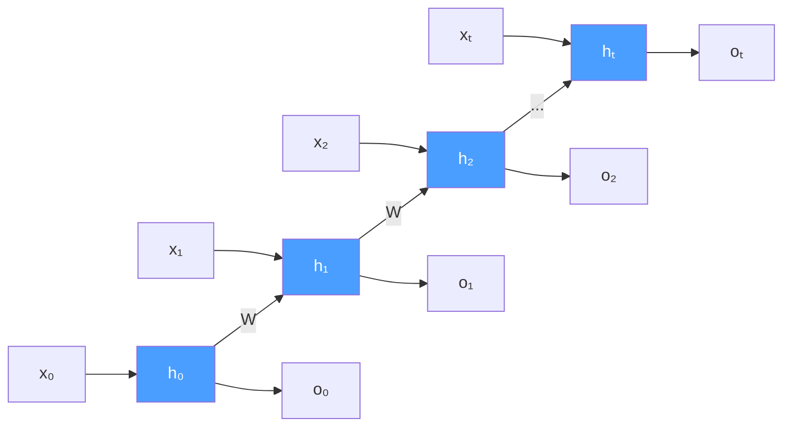
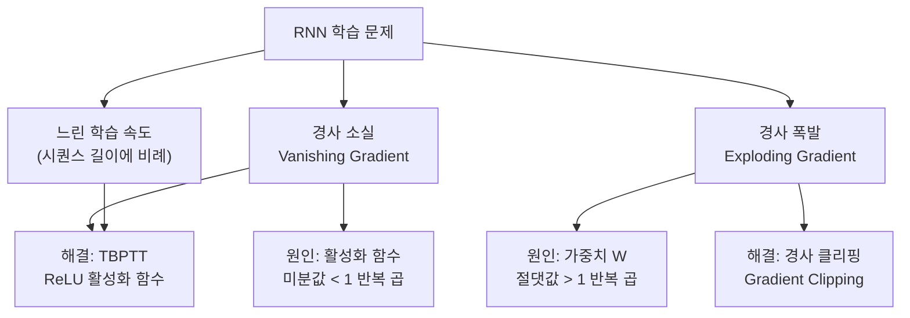

# 11강. 딥러닝의통계적이해: 순환신경망 (1)

## 🔗 선수 지식 (Prerequisites)

- [ ] **필수**: [3강. 딥러닝 모형의 구조와 학습 (1)](3강.%20딥러닝%20모형의%20구조와%20학습%20(1).md) — 순전파/역전파 기본 구조 이해 완료?
- [ ] **필수**: [4강. 딥러닝 모형의 구조와 학습 (2)](4강.%20딥러닝%20모형의%20구조와%20학습%20(2).md) — 연쇄법칙(Chain Rule), 경사 하강법 이해 완료?
- [ ] **권장**: [5강. 딥러닝의 제 문제와 발전](5강.%20딥러닝의%20제%20문제와%20발전.md) — 경사 소실 문제, 활성화 함수 이해 완료?
- **관련 단원**: [12강. 순환신경망 (2)] — LSTM, GRU (다음 강)

---

## 학습 목표

1. 순환신경망의 구조를 이해한다.
2. 순환신경망의 학습 과정을 이해한다.
3. 순환신경망 학습 과정의 문제점을 이해한다.

---

## 🧠 메타인지 체크 (학습 전/후 자기 평가)

### 학습 전 자기 평가

| 소주제 | 자신감 (1-5) |
| :--- | :--- |
| RNN 구조 (은닉 상태, 가중치) | |
| BPTT 학습 원리 | |
| 경사 소실/폭발 원인과 해결책 | |

### 학습 후 교정 (학습 완료 후 작성)

| 소주제 | 학습 전 | 학습 후 | 실제 정답률 | 과신/과소 여부 |
| :--- | :--- | :--- | :--- | :--- |
| RNN 구조 (은닉 상태, 가중치) | | | | |
| BPTT 학습 원리 | | | | |
| 경사 소실/폭발 원인과 해결책 | | | | |

> **활용법**: 학습 전 1분 → 자신감 기입, 학습 후 1분 → 나머지 기입. "과신" 영역이 실제 취약점.

---

## 📝 요약 (Summary)

1. 🔴 **RNN 정의**: RNN은 자연어를 포함한 시계열 데이터를 분석하기 위해 고안된 신경망 구조이다. 은닉층의 정보가 다음 시점으로 전달되는 '순환' 구조가 핵심이다.
2. 🔴 **RNN의 학습 문제**: RNN은 학습 과정에서 경사 소실(Vanishing Gradient) / 경사 폭발(Exploding Gradient) 등의 문제가 있다.
3. 🟡 **해결 방법**: 이를 해결하기 위한 방법들로 Truncated BPTT(TBPTT), 경사 클리핑(Gradient Clipping) 등의 방법들이 이용된다.

---

## 📐 핵심 수식 (Key Formulas)

| 수식명 | 수식 | 의미 |
| :--- | :--- | :--- |
| **은닉 상태** | $h_{t}=\phi_{h}(b_{h}+Wh_{t-1}+Ux_{t})$ | 현재 시점의 은닉 상태는 이전 은닉 상태($h_{t-1}$)와 현재 입력($x_t$)의 함수 |
| **출력값** | $o_{t}=\phi_{o}(b_{o}+Vh_{t})$ | 현재 시점의 출력은 현재 은닉 상태만의 함수 |
| **가중치 업데이트** | $W^{(t+1)}=W^{(t)}-\eta\cdot\dfrac{\partial L}{\partial W}\bigg\|_{W^{(t)}}$ | 손실 $L$의 기울기 방향으로 가중치 $W$를 학습률 $\eta$만큼 이동 |

### 주요 정리/정의

**은닉 상태 점화식 (RNN Cell)**

$$
h_{t}=\phi_{h}(b_{h}+Wh_{t-1}+Ux_{t})
$$

> **직관적 해석**: RNN의 은닉 상태 $h_t$는 일종의 "기억"이다. 현재 입력 $x_t$와 직전 기억 $h_{t-1}$을 합쳐서 새로운 기억을 만든다. 가중치 $W$(순환), $U$(입력), $V$(출력)는 모든 시점에서 **공유**된다.
> **AI 적용**: 자연어 처리(NLP)에서 문장의 각 단어를 순서대로 입력받을 때, $h_t$가 문장의 문맥(context)을 누적해서 기억하는 역할을 한다.

**BPTT 손실 기울기 (시점별 합산)**

$$
\frac{\partial L}{\partial W} = \sum_{t} \frac{\partial L_t}{\partial W}
$$

각 시점의 국소 기울기 $\frac{\partial L_t}{\partial W}$를 연쇄법칙으로 전개하면:

$$
\frac{\partial L_t}{\partial W} = \sum_{k=1}^{t} \frac{\partial L_t}{\partial h_t} \cdot \left(\prod_{j=k+1}^{t} \frac{\partial h_j}{\partial h_{j-1}}\right) \cdot \frac{\partial h_k}{\partial W}
$$

여기서 $\frac{\partial h_j}{\partial h_{j-1}} = \text{diag}[\phi_h'(\cdots)] \cdot W$이며, 이 행렬의 곱이 시점 수만큼 반복된다.

- $\|W\| < 1$ 반복: 기울기 → 0 (경사 소실)  
- $\|W\| > 1$ 반복: 기울기 → ∞ (경사 폭발)

> **직관적 해석**: 전체 손실에 대한 가중치 $W$의 기울기는 각 시점 $t$에서의 국소 기울기를 모두 더한 값이다. 시점이 많을수록 역전파 경로가 길어진다. 각 국소 기울기 내부에 시점 차이만큼의 야코비안 행렬 곱이 중첩되므로, 이것이 경사 소실·폭발의 수학적 원인이다.
> **AI 적용**: 긴 시퀀스일수록 역전파 경로가 깊어져 경사 소실/폭발이 심화된다. 이 문제를 해결하기 위해 LSTM·GRU가 등장했다. `→←12강`

---

## 📊 개념 시각화 (Visual Guide)

### RNN 펼침 구조 (Unrolled RNN)



> **핵심**: 동일한 가중치 $W, U, V$가 모든 시점에서 반복 적용된다. 이 가중치 공유(Parameter Sharing) 덕분에 임의 길이 시퀀스를 처리할 수 있다.

### 문제점 및 해결책 분류도



### 핵심 가중치 비교표

| 가중치 | 기호 | 역할 | 연결 방향 |
| :--- | :--- | :--- | :--- |
| **입력 가중치** | $U$ | 입력 $x_t$ → 은닉 $h_t$ | 외부 → 내부 |
| **순환 가중치** | $W$ | 은닉 $h_{t-1}$ → 은닉 $h_t$ | 내부 → 내부 (시간 축) |
| **출력 가중치** | $V$ | 은닉 $h_t$ → 출력 $o_t$ | 내부 → 외부 |

---

## ✏️ 심화 학습 (Study Subject)

### 1. 가상 시나리오: "RNN으로 주가를 예측할 수 있을까?"

- **상황**: KOSPI 주가 데이터(일별 종가)를 기반으로 다음 날 종가를 예측하는 모델을 만들어야 한다.
- **문제**: 주가 시퀀스의 길이가 250일(1년치)이면, BPTT를 완전히 펼쳤을 때 역전파 경로가 250단계가 된다. 이 경우 경사 소실이 발생하여 1개월 전 데이터의 영향이 소실된다.
- **해결**: Truncated BPTT를 적용하여 역전파 길이를 20일로 제한한다. 최근 20일의 패턴으로 다음날을 예측하도록 학습 범위를 잘라낸다.

$$
\frac{\partial L}{\partial W}\bigg|_{\text{TBPTT}} = \sum_{t=T-k}^{T} \frac{\partial L_t}{\partial W}, \quad k=20 \text{ (truncation 길이)}
$$

- **AI 학습 포인트**: "250일 주가 예측에서 TBPTT의 truncation 길이 $k$를 어떻게 설정하는 것이 최적일까? $k$가 너무 작으면 장기 의존성을 놓치고, 너무 크면 경사 소실이 재발한다. 이 trade-off를 어떻게 실험적으로 찾는지 설명해 줘."

### 2. 관점별 비교 및 오개념 분석

**핵심 비교: 경사 소실 vs 경사 폭발**

| 구분 | 경사 소실 (Vanishing) | 경사 폭발 (Exploding) |
| :--- | :--- | :--- |
| **현상** | 기울기 → 0 (초기 시점 학습 불가) | 기울기 → ∞ (학습 발산) |
| **원인** | $\|\phi'(\cdot)\| < 1$ 반복 곱, $\|W\| < 1$ | $\|W\| > 1$ 반복 곱 |
| **활성화 함수** | sigmoid, tanh (주 원인) | — |
| **해결책** | TBPTT, ReLU, LSTM/GRU | 경사 클리핑 |
| **감지 방법** | 초기 시점 가중치가 거의 안 변함 | loss가 NaN 또는 발산 |

**오개념 분석**

- **오개념 1**: "경사 소실은 네트워크가 깊을 때만 발생한다."
    - **분석**: RNN에서는 네트워크의 깊이가 아닌 **시간적 깊이**(시퀀스 길이)가 문제다. 시점이 100개면 동일한 $W$가 100번 곱해지므로, $\|W\| < 1$이면 $W^{100} \approx 0$이 된다. 즉 층수가 1개인 RNN도 긴 시퀀스에서 경사 소실이 발생한다.

- **오개념 2**: "RNN의 가중치 $W, U, V$는 각 시점마다 별도로 학습된다."
    - **분석**: RNN의 핵심은 **가중치 공유(Weight Sharing)**다. $W, U, V$는 모든 시점에서 동일하며, BPTT를 통해 모든 시점의 기울기를 합산하여 하나의 $W$를 업데이트한다. 이 덕분에 임의 길이의 시퀀스를 처리할 수 있다.

- **AI 학습 포인트**: "RNN에서 가중치를 각 시점마다 다르게 설정하면 어떤 문제가 생기는지, 그리고 가중치 공유가 시퀀스 모델링에서 왜 필수적인지 수식과 함께 설명해 줘."

---

### 📌 심층 확장 — Truncated BPTT(절단 BPTT): 메커니즘과 트레이드오프

#### 왜 Full BPTT는 실용적이지 않은가?

길이 $T=1000$인 시퀀스에서 Full BPTT를 수행하면:
- **메모리**: 역전파를 위해 $T$개의 은닉 상태 $h_0, h_1, \ldots, h_{T-1}$를 모두 GPU 메모리에 유지해야 함. $O(T \cdot d_h)$ 공간 복잡도.
- **계산**: 역전파 경로가 $T$단계 → $O(T)$ 시간 복잡도.
- **경사 소실**: $T$가 클수록 초기 시점의 기울기가 지수적으로 소멸.

#### TBPTT 동작 원리 (k₁, k₂ 파라미터)

TBPTT는 두 개의 하이퍼파라미터로 제어된다:

| 파라미터 | 역할 | 일반적 설정 |
| :--- | :--- | :--- |
| $k_1$ | 순전파 간격 (Forward step) | 시퀀스를 $k_1$ 단위 청크로 분할 |
| $k_2$ | 역전파 길이 (Backprop step) | 각 청크에서 최대 $k_2$단계 역전파 |

가장 흔한 설정: $k_1 = k_2 = k$ (동일 간격 절단).

$$\frac{\partial L}{\partial W}\bigg|_{\text{TBPTT}} = \sum_{t=T-k}^{T} \frac{\partial L_t}{\partial W}, \quad k \ll T$$

**핵심**: 은닉 상태 $h_t$는 청크 경계를 넘어 **순전파로 전달**되지만, 역전파는 현재 청크 내에서만 이루어진다. 따라서 $h$를 통해 암묵적 장기 의존성이 유지되면서도 역전파 계산량은 $O(k)$로 제한된다.

```python
import torch
import torch.nn as nn

def tbptt_train(model, optimizer, sequence, k=20, hidden_size=64):
    """Truncated BPTT 구현 예시"""
    T = sequence.shape[0]
    h = torch.zeros(1, 1, hidden_size)   # 초기 은닉 상태
    total_loss = 0.0

    for t in range(0, T - 1, k):
        # 은닉 상태를 계산 그래프에서 분리 (청크 경계에서 역전파 차단)
        h = h.detach()  # ← 핵심: 이전 청크로의 역전파 차단

        chunk_input  = sequence[t:t+k]        # 현재 청크 입력
        chunk_target = sequence[t+1:t+k+1]    # 현재 청크 정답

        output, h = model(chunk_input, h)
        loss = criterion(output, chunk_target)

        optimizer.zero_grad()
        loss.backward()                        # k 단계만 역전파
        torch.nn.utils.clip_grad_norm_(model.parameters(), max_norm=5.0)
        optimizer.step()

        total_loss += loss.item()

    return total_loss
```

#### 절단 길이 $k$ 선택 기준 (실무 가이드라인)

| $k$ 값 | 장점 | 단점 | 적합 상황 |
| :--- | :--- | :--- | :--- |
| **작은 $k$ (10~20)** | 빠른 업데이트, 낮은 메모리 | 장기 의존성 학습 불가 | 단기 패턴 중심 과제 |
| **중간 $k$ (50~100)** | 균형잡힌 trade-off | — | 대부분의 언어 모델링 |
| **큰 $k$ (200~500)** | 장기 의존성 포착 | 경사 소실 재발, 메모리 증가 | 긴 문서, 음악 생성 |

> **경험적 규칙**: 과제에서 의미 있는 장기 의존성이 $d$ 타임스텝이면, $k \geq 2d$로 설정. 주가 예측에서 계절성이 20일이면 $k=40$ 이상 권장.

> **출처**: Williams, R.J. & Zipser, D. (1995). "Gradient-based learning algorithms for recurrent networks and their computational complexity." Handbook of Backpropagation.

---

### 📌 심층 확장 — Teacher Forcing과 노출 편향(Exposure Bias)

#### Teacher Forcing 메커니즘

시퀀스 생성 모델(언어 모델, Seq2Seq 등)에서 시점 $t$의 출력 $\hat{y}_t$가 시점 $t+1$의 입력으로 사용된다. 학습 초기에는 $\hat{y}_t$가 틀릴 확률이 높고, 이 오류가 누적되어 학습이 불안정해진다.

**Teacher Forcing**: 학습 시 실제 정답 $y_{t-1}$을 다음 입력으로 사용.

$$\text{학습 시:}\quad P(\hat{y}_t | y_1, y_2, \ldots, y_{t-1}) \quad \text{(정답 조건부)}$$
$$\text{추론 시:}\quad P(\hat{y}_t | \hat{y}_1, \hat{y}_2, \ldots, \hat{y}_{t-1}) \quad \text{(예측 조건부)}$$

**장점**: 안정적 기울기, 빠른 수렴. **단점**: 학습/추론 간 조건부 분포 불일치.

#### 노출 편향(Exposure Bias) 문제

Ranzato et al. (2015)이 체계적으로 분석한 이 문제는, 모델이 학습 중 항상 "정답" 입력을 보다가 추론 시 자신의 예측값을 입력으로 받으면 분포가 달라져 오차가 누적되는 현상이다.

$$\text{오차 누적:} \quad \epsilon_T \approx \sum_{t=1}^T \epsilon_t \cdot \prod_{s=t+1}^T P(\hat{y}_s | \hat{y}_{1:s-1})$$

긴 시퀀스일수록 초기 오차가 눈덩이처럼 커진다.

#### Scheduled Sampling (Bengio et al., 2015)

학습 초반에는 Teacher Forcing 비율을 높게 유지하다가, 학습이 진행될수록 점차 모델 자신의 예측으로 대체하는 방법이다.

$$p_t = \begin{cases} 1 & \text{(epoch 초반)} \\ \epsilon_i & \text{(학습 진행에 따라 감소)} \end{cases}$$

각 타임스텝에서 확률 $p_t$로 정답을, $1-p_t$로 모델 예측을 입력으로 선택한다.

**스케줄 유형**:

| 스케줄 | 수식 | 특징 |
| :--- | :--- | :--- |
| **선형 감소** | $p_i = \max(\epsilon, k - ci)$ | 단순, 하이퍼파라미터 민감 |
| **지수 감소** | $p_i = k^i$ ($k < 1$) | 초반에 빠르게 감소 |
| **역 시그모이드** | $p_i = \frac{k}{k + \exp(i/k)}$ | 부드러운 전환 |

```python
import torch
import numpy as np

def scheduled_sampling_step(model, x_true, h, epoch, total_epochs,
                             schedule='linear'):
    """Scheduled Sampling 단일 스텝"""
    # Teacher Forcing 확률 계산
    if schedule == 'linear':
        tf_ratio = max(0.1, 1.0 - epoch / total_epochs)
    elif schedule == 'exponential':
        tf_ratio = 0.99 ** epoch
    elif schedule == 'inverse_sigmoid':
        k = 5.0
        tf_ratio = k / (k + np.exp(epoch / k))

    use_teacher = torch.rand(1).item() < tf_ratio
    output, h = model(x_true, h)  # 현재 스텝 예측

    # 다음 입력 선택
    if use_teacher:
        next_input = x_true   # Teacher Forcing
    else:
        next_input = output.detach()  # 모델 예측 사용

    return output, h, next_input
```

**완화 방법 비교**:

| 방법 | 핵심 아이디어 | 장점 | 단점 |
| :--- | :--- | :--- | :--- |
| **Teacher Forcing** | 항상 정답 입력 | 빠른 수렴 | Exposure Bias |
| **Scheduled Sampling** | 점진적 전환 | 추론 분포에 가까워짐 | 추가 하이퍼파라미터 |
| **Professor Forcing** | 학습/추론 분포 정렬 (GAN 활용) | 이론적 근거 | 구현 복잡 |
| **Transformer** | 자기회귀 + 마스킹, 병렬 학습 | Exposure Bias 구조적 완화 | 긴 의존성 O(n²) |

> **출처**: Bengio, S. et al. (2015). "Scheduled Sampling for Sequence Prediction with Recurrent Neural Networks." NeurIPS 2015.

---

### 📌 심층 확장 — 시계열 예측 응용: RNN의 실제 사용

#### 슬라이딩 윈도우 데이터 구성

RNN으로 시계열을 예측할 때 슬라이딩 윈도우로 입출력 쌍을 구성한다.

```python
import numpy as np
import torch
from torch.utils.data import Dataset, DataLoader

class TimeSeriesDataset(Dataset):
    """슬라이딩 윈도우 시계열 데이터셋"""
    def __init__(self, series, window_size=20, forecast_horizon=1):
        self.X, self.y = [], []
        for i in range(len(series) - window_size - forecast_horizon + 1):
            self.X.append(series[i:i+window_size])
            self.y.append(series[i+window_size:i+window_size+forecast_horizon])
        self.X = torch.FloatTensor(self.X).unsqueeze(-1)  # (N, T, 1)
        self.y = torch.FloatTensor(self.y)                 # (N, H)

    def __len__(self):  return len(self.X)
    def __getitem__(self, i):  return self.X[i], self.y[i]

# 사용 예시
np.random.seed(42)
t = np.linspace(0, 4*np.pi, 500)
series = np.sin(t) + 0.1 * np.random.randn(500)  # 노이즈 있는 사인파

dataset = TimeSeriesDataset(series, window_size=30, forecast_horizon=5)
loader  = DataLoader(dataset, batch_size=32, shuffle=True)
print(f"샘플 수: {len(dataset)}, 입력 shape: {dataset.X.shape}")
# 샘플 수: 466, 입력 shape: torch.Size([466, 30, 1])
```

#### ARIMA vs LSTM 비교

| 비교 항목 | ARIMA | LSTM |
| :--- | :--- | :--- |
| **모델 유형** | 통계적 시계열 모형 | 딥러닝 시퀀스 모형 |
| **가정** | 선형성, 정상성(stationarity) 필요 | 비선형 패턴 자동 포착 |
| **해석 가능성** | 높음 (p, d, q 파라미터 명확) | 낮음 (블랙박스) |
| **데이터 요구량** | 적어도 가능 | 충분한 데이터 필요 |
| **외생 변수** | ARIMAX로 확장 | 다변량 입력 자연스럽게 처리 |
| **장기 의존성** | AR 차수 제한으로 어려움 | 게이트 구조로 포착 가능 |
| **계절성** | SARIMA로 명시적 모델링 | 충분한 데이터로 자동 학습 |
| **적합 과제** | 단변량, 데이터 부족, 해석 필요 | 다변량, 데이터 풍부, 정확도 우선 |

#### 주요 시계열 예측 응용 분야

**① 주가 예측**: 일별 종가, 거래량, 기술 지표(RSI, MACD)를 다변량 입력으로 구성. LSTM이 단기 추세(20~60일)는 잘 포착하지만, 뉴스·공시 등 외생 충격은 별도 처리 필요.

**② 기상 예측**: 기온, 습도, 기압 등 다변량 센서 데이터. Seq2Seq 구조로 다음 24시간 예보 생성. ERA5 재분석 데이터(ECMWF)와 조합하여 단기 예보에 활용.

**③ ECG 이상 탐지**: 정상 심전도 데이터로만 LSTM 오토인코더를 학습하면, 이상(부정맥)이 발생했을 때 재구성 오차가 급등한다:

$$\text{이상 점수}(x) = \|x - \hat{x}\|^2, \quad \hat{x} = \text{LSTM-AE}(x)$$

임계값 $\theta$를 초과하면 이상으로 판정. 레이블이 없는 비지도 이상 탐지가 가능하여 의료 현장에서 실용적이다.

> **출처**: Box, G.E.P. & Jenkins, G.M. (1970). "Time Series Analysis: Forecasting and Control." Hochreiter, S. & Schmidhuber, J. (1997). "Long Short-Term Memory." Malhotra, P. et al. (2015). "Long Short-Term Memory Networks for Anomaly Detection in Time Series." ESANN 2015.

---

## ❓ 연습 문제 및 해설

> **블룸 인지 수준 범례**: [기억] 정의·나열 → [이해] 설명·비교 → [적용] 계산·구현 → [분석] 구별·디버그 → [평가] 판단·비평 → [창조] 설계·제안

### 📝 문제

**1. ⭐ [기억] RNN의 은닉 상태 $h_t$를 결정하는 요소로 올바른 것은?**([#prob-1](#prob-1))
   > ① 현재 입력 $x_t$만
   > ② 이전 은닉 상태 $h_{t-1}$만
   > ③ 현재 입력 $x_t$와 이전 은닉 상태 $h_{t-1}$
   > ④ 출력값 $o_t$와 현재 입력 $x_t$

<br>

**2. ⭐ [기억] RNN에서 사용하는 세 가지 가중치와 역할이 올바르게 연결된 것은?**([#prob-2](#prob-2))
   > ① $U$: 순환 가중치, $W$: 입력 가중치, $V$: 출력 가중치
   > ② $U$: 입력 가중치, $W$: 순환 가중치, $V$: 출력 가중치
   > ③ $U$: 출력 가중치, $W$: 순환 가중치, $V$: 입력 가중치
   > ④ $U$: 입력 가중치, $W$: 출력 가중치, $V$: 순환 가중치

<br>

**3. ⭐⭐ [이해] RNN 학습 시 경사 소실 문제에 대한 설명으로 옳지 않은 것은?**([#prob-3](#prob-3))
   > ① 시퀀스가 길수록 초기 시점의 정보가 소실되기 쉽다.
   > ② sigmoid나 tanh 활성화 함수의 미분값이 1보다 작아 발생한다.
   > ③ 경사 클리핑(Gradient Clipping)으로 직접 해결할 수 있다.
   > ④ LSTM, GRU 등의 구조로 완화할 수 있다.

<br>

**4. ⭐⭐ [이해/적용] Truncated BPTT(TBPTT)에 대한 설명으로 올바른 것을 <보기>에서 모두 고른 것은?**([#prob-4](#prob-4))
   > <보기>
   >
   > 가. 역전파 계산 길이를 일정 수준으로 제한한다.
   > 나. 경사 폭발(Exploding Gradient) 문제를 해결하기 위한 방법이다.
   > 다. 계산 효율을 높이는 효과가 있다.
   > 라. 시퀀스 전체에 대한 완전한 BPTT보다 학습 정확도가 항상 높다.

   > ① 가, 나
   > ② 가, 다
   > ③ 나, 라
   > ④ 가, 나, 다

<br>

**5. ⭐⭐⭐ [분석] 📌 RNN에서 시퀀스 길이가 $T$이고 순환 가중치 $W$의 고유값의 절댓값이 $|\lambda| > 1$일 때, 경사 폭발이 발생하는 이유를 BPTT 연쇄 법칙 관점에서 서술하시오.**([#prob-5](#prob-5))

---

### 🔑 정답 및 해설 (먼저 풀어본 후 펼치기)

<details>
<summary>정답 보기 (클릭)</summary>

1. ③
2. ②
3. ③
4. ②
5. [서술형 — 아래 해설 참조]

</details>

<details>
<summary>해설 보기 (클릭)</summary>

<a id="prob-1"></a>
**1. ⭐ [기억] RNN 은닉 상태 결정 요소**
> **정답: ③ 현재 입력 $x_t$와 이전 은닉 상태 $h_{t-1}$**
> **해설**: 은닉 상태 수식 $h_t = \phi_h(b_h + Wh_{t-1} + Ux_t)$에서 확인할 수 있다. $h_{t-1}$는 이전 시점의 기억을, $x_t$는 현재 입력을 반영한다. ① ② ④는 하나의 요소만 사용하거나 출력값을 포함하므로 오답.

<a id="prob-2"></a>
**2. ⭐ [기억] RNN 가중치 종류**
> **정답: ② $U$: 입력 가중치, $W$: 순환 가중치, $V$: 출력 가중치**
> **해설**: 수식 $h_t = \phi_h(b_h + Wh_{t-1} + Ux_t)$, $o_t = \phi_o(b_o + Vh_t)$에서 $U$는 입력 $x_t$에, $W$는 이전 은닉 $h_{t-1}$에, $V$는 출력 $o_t$ 계산에 사용된다.

<a id="prob-3"></a>
**3. ⭐⭐ [이해] 경사 소실 관련 오답 찾기**
> **정답: ③ 경사 클리핑(Gradient Clipping)으로 직접 해결할 수 있다.**
> **해설**: 경사 클리핑은 **경사 폭발(Exploding Gradient)**을 해결하는 방법이다. 경사 소실은 TBPTT, ReLU 활성화 함수 변경, 또는 LSTM/GRU 구조로 완화한다. ①②④는 모두 옳은 설명이다.

<a id="prob-4"></a>
**4. ⭐⭐ [이해/적용] TBPTT**
> **정답: ② 가, 다**
> **해설**:
> - **가 (O)**: TBPTT는 역전파 길이를 $k$ 스텝으로 잘라서 계산한다.
> - **나 (X)**: TBPTT는 주로 **경사 소실 완화** 및 **계산 효율**을 위한 방법이다. 경사 폭발의 직접 해결책은 경사 클리핑이다.
> - **다 (O)**: 전체 시퀀스 대신 $k$ 스텝만 역전파하므로 계산량이 감소한다.
> - **라 (X)**: TBPTT는 완전한 BPTT를 근사하는 방법으로, 장기 의존성 정보를 일부 잃으므로 항상 더 정확하지 않다.

<a id="prob-5"></a>
**5. ⭐⭐⭐ [분석] 경사 폭발 발생 이유**
> **정답**: BPTT에서 시점 $t$부터 초기 시점까지 역전파할 때, 연쇄 법칙에 의해 순환 가중치 $W$가 반복적으로 곱해진다:
> $$\frac{\partial h_t}{\partial h_k} = \prod_{i=k+1}^{t} \frac{\partial h_i}{\partial h_{i-1}} = \prod_{i=k+1}^{t} W^{\top} \cdot \text{diag}(\phi_h'(\cdot))$$
> $W$의 고유값 절댓값이 $|\lambda| > 1$이면, $T-k$ 번 거듭제곱 후 $|W^{T-k}| \sim |\lambda|^{T-k} \to \infty$가 된다. 따라서 기울기가 지수적으로 커져 학습이 발산한다.

</details>

---

## ✅ O/X 확인문제 (연습문항의 2배)

**1.** RNN은 시계열 데이터와 자연어 데이터 모두 처리할 수 있다. ([#ox-1](#ox-1)) **(O / X)**

**2.** RNN의 가중치 $W, U, V$는 각 시점마다 서로 다른 값을 갖는다. ([#ox-2](#ox-2)) **(O / X)**

**3.** BPTT(Backpropagation Through Time)는 시간 축으로 펼친 역전파 방법이다. ([#ox-3](#ox-3)) **(O / X)**

**4.** 경사 소실 문제는 주로 $W$의 크기가 클 때 발생한다. ([#ox-4](#ox-4)) **(O / X)**

**5.** 경사 클리핑(Gradient Clipping)은 기울기 값이 임계치를 넘으면 강제로 조정하는 방법이다. ([#ox-5](#ox-5)) **(O / X)**

**6.** Truncated BPTT는 역전파 길이를 제한하여 계산 효율을 높인다. ([#ox-6](#ox-6)) **(O / X)**

**7.** ReLU 활성화 함수는 경사 소실 문제를 완전히 해결한다. ([#ox-7](#ox-7)) **(O / X)**

**8.** RNN의 출력 $o_t$는 현재 시점의 은닉 상태 $h_t$만으로 계산된다. ([#ox-8](#ox-8)) **(O / X)**

**9.** 경사 폭발은 시퀀스가 길고 $|W| < 1$일 때 발생한다. ([#ox-9](#ox-9)) **(O / X)**

**10.** RNN은 피드포워드 신경망(MLP)과 달리 임의 길이의 시퀀스를 처리할 수 있다. ([#ox-10](#ox-10)) **(O / X)**

<details>
<summary>O/X 정답 및 해설 보기 (클릭)</summary>

> <a id="ox-1"></a>
> **1. 정답**: O
> **해설**: RNN은 데이터의 순서(순서열)가 중요한 모든 자료를 처리하도록 설계되었으며, 시계열(주가, 센서 등)과 자연어(문장) 모두 해당된다.

> <a id="ox-2"></a>
> **2. 정답**: X
> **해설**: RNN의 핵심인 **가중치 공유(Parameter Sharing)**로 $W, U, V$는 모든 시점에서 동일한 값을 사용한다. 이 덕분에 임의 길이 시퀀스 처리가 가능하다.

> <a id="ox-3"></a>
> **3. 정답**: O
> **해설**: BPTT(Backpropagation Through Time)는 RNN을 시간 축으로 펼친(unroll) 후 일반적인 역전파를 적용하는 학습 알고리즘이다.

> <a id="ox-4"></a>
> **4. 정답**: X
> **해설**: $W$의 크기가 클 때($|W|>1$)는 **경사 폭발**이 발생한다. **경사 소실**은 $|W|<1$ 또는 활성화 함수의 미분값이 1보다 작을 때 발생한다.

> <a id="ox-5"></a>
> **5. 정답**: O
> **해설**: 경사 클리핑은 $\|\nabla L\| > \theta$이면 $\nabla L \leftarrow \theta \cdot \frac{\nabla L}{\|\nabla L\|}$으로 기울기를 임계치 $\theta$ 이하로 조정하여 경사 폭발을 방지한다.

> <a id="ox-6"></a>
> **6. 정답**: O
> **해설**: Truncated BPTT(TBPTT)는 전체 시퀀스 대신 $k$ 스텝만 역전파하여 계산량을 $O(T)$에서 $O(k)$로 줄인다. 경사 소실 완화 효과도 있다.

> <a id="ox-7"></a>
> **7. 정답**: X
> **해설**: ReLU는 양수 구간에서 기울기가 1이므로 경사 소실을 **완화**하지만, RNN에서는 여전히 $W$의 크기에 따른 경사 소실/폭발이 발생할 수 있다. 완전한 해결은 LSTM/GRU 등의 구조 변경이 필요하다.

> <a id="ox-8"></a>
> **8. 정답**: O
> **해설**: $o_t = \phi_o(b_o + Vh_t)$에서 출력은 현재 은닉 상태 $h_t$만의 함수다. $h_t$ 내부에 이미 이전 정보가 누적되어 있다.

> <a id="ox-9"></a>
> **9. 정답**: X
> **해설**: 경사 폭발은 $|W|>1$일 때 발생한다. $|W|<1$이면 경사 소실이 발생한다.

> <a id="ox-10"></a>
> **10. 정답**: O
> **해설**: MLP는 고정 크기 입력만 처리하지만, RNN은 가중치 공유로 시퀀스 길이에 무관하게 처리 가능하다. 이것이 RNN이 시계열/자연어 처리에 적합한 핵심 이유다.

</details>

---

## 🧪 자유 회상 연습 (Free Recall)

> **방법**: 위의 노트를 모두 덮고, 타이머 3분 설정 후 이번 단원에서 배운 내용을 기억나는 대로 자유롭게 적으세요.
> 정확한 문장이 아니어도 됩니다. 키워드, 수식, 관계 등 떠오르는 것을 모두 적습니다.

**자유 회상 작성란:**

```
[여기에 기억나는 내용을 자유롭게 작성]


```

> **회상 후 점검**: 노트를 다시 펼쳐 빠뜨린 내용을 확인하세요. 빠뜨린 부분이 실제 취약점입니다.
> - 회상 못한 핵심 개념: [                ]
> - 회상 못한 수식: [                ]

---

## 💻 코드로 확인하기 (Code Verification)

```python
import numpy as np

# RNN 순전파 구현 (단일 레이어, tanh 활성화)
np.random.seed(42)

# 하이퍼파라미터
input_size  = 3   # 입력 차원
hidden_size = 4   # 은닉 상태 차원
output_size = 2   # 출력 차원
seq_len     = 5   # 시퀀스 길이

# 가중치 초기화 (Xavier 초기화 근사)
U = np.random.randn(hidden_size, input_size)  * 0.1  # 입력 가중치
W = np.random.randn(hidden_size, hidden_size) * 0.1  # 순환 가중치
V = np.random.randn(output_size, hidden_size) * 0.1  # 출력 가중치
b_h = np.zeros(hidden_size)
b_o = np.zeros(output_size)

# 임의 입력 시퀀스 생성
X = np.random.randn(seq_len, input_size)

# 순전파 (Forward Pass)
h = np.zeros(hidden_size)  # 초기 은닉 상태
print("=== RNN 순전파 ===")
for t in range(seq_len):
    x_t = X[t]
    h = np.tanh(b_h + W @ h + U @ x_t)   # 은닉 상태 업데이트
    o = b_o + V @ h                         # 출력 (활성화 함수 생략)
    print(f"t={t}: h_norm={np.linalg.norm(h):.4f}, o={o.round(4)}")

# 경사 폭발/소실 시뮬레이션
print("\n=== 경사 소실 vs 폭발 시뮬레이션 (tanh 미분 반복 곱) ===")
grad_vanish = 1.0
grad_explode = 1.0
for t in range(10):
    grad_vanish  *= 0.3   # |W|·|tanh'| < 1 → 소실
    grad_explode *= 1.5   # |W| > 1 → 폭발
    print(f"t={t+1:2d}: 경사소실={grad_vanish:.6f}, 경사폭발={grad_explode:.4f}")

# 경사 클리핑 예시
print("\n=== 경사 클리핑 ===")
threshold = 5.0
raw_grad = np.array([10.0, -8.0, 3.0])
grad_norm = np.linalg.norm(raw_grad)
if grad_norm > threshold:
    clipped_grad = threshold * raw_grad / grad_norm
else:
    clipped_grad = raw_grad
print(f"원본 기울기 노름: {grad_norm:.4f}")
print(f"클리핑 후 기울기: {clipped_grad.round(4)}")
print(f"클리핑 후 노름:   {np.linalg.norm(clipped_grad):.4f}")
```

> **실행 결과**:
> ```
> === RNN 순전파 ===
> t=0: h_norm=0.1243, o=[ 0.0023 -0.0118]
> t=1: h_norm=0.1485, o=[ 0.0065 -0.0107]
> t=2: h_norm=0.1218, o=[ 0.0023 -0.0158]
> t=3: h_norm=0.1227, o=[ 0.0006 -0.0162]
> t=4: h_norm=0.1109, o=[-0.0022 -0.0155]
>
> === 경사 소실 vs 폭발 시뮬레이션 (tanh 미분 반복 곱) ===
> t= 1: 경사소실=0.300000, 경사폭발=1.5000
> t= 2: 경사소실=0.090000, 경사폭발=2.2500
> t= 5: 경사소실=0.002430, 경사폭발=7.5938
> t=10: 경사소실=0.000006, 경사폭발=57.6650
>
> === 경사 클리핑 ===
> 원본 기울기 노름: 13.1529
> 클리핑 후 기울기: [ 3.8012 -3.0410  1.1404]
> 클리핑 후 노름:   5.0000
> ```
>
> **수학적 해석**:
> - 순전파: 각 시점마다 $h_t$가 업데이트되며, 초기화값이 작으므로 은닉 상태 노름이 안정적으로 유지된다.
> - 경사 소실/폭발: 계수 0.3을 10번 곱하면 $\approx 0.000006$ (소실), 1.5를 10번 곱하면 $\approx 57.7$ (폭발). 시퀀스 길이가 길수록 지수적으로 악화된다.
> - 경사 클리핑: 노름이 임계치(5.0)를 초과하면 방향은 유지하되 크기를 임계치로 조정한다.

---

## 🤖 AI 연결고리 (Math → AI Application)

| 학습 개념 | AI/ML 적용 분야 | 구체적 사례 |
| :--- | :--- | :--- |
| RNN 은닉 상태 $h_t$ | 자연어 처리 (NLP) | 기계 번역, 감성 분석에서 문장 문맥 인코딩 |
| BPTT | 시계열 예측 | 주가, 날씨, 센서 데이터 예측 모델 학습 |
| 경사 소실 → LSTM/GRU | 장기 의존성 모델링 | 장문 요약, 대화 시스템, 음성 인식 |
| 경사 클리핑 | 안정적 학습 | Transformer, GPT 등 대규모 언어 모델 학습 |
| 가중치 공유 | 효율적 파라미터 사용 | 임의 길이 문장 처리, 다국어 모델 |

---

## 📖 심화 학습 예시 답안

#### 1. BPTT (Backpropagation Through Time)의 내부 동작 원리

RNN을 시간 축으로 펼치면 각 시점이 하나의 층처럼 작동한다. BPTT는 이 펼쳐진 구조에서 역전파를 수행한다.

1. **순전파**: $t=0$부터 $t=T$까지 $h_t$를 순차 계산하고, 각 시점의 손실 $L_t$를 산출한다.
2. **역전파 시작**: 마지막 시점 $T$에서 $\frac{\partial L}{\partial h_T}$를 계산한다.
3. **시간 역방향 전파**: 연쇄 법칙으로 $\frac{\partial h_t}{\partial h_{t-1}} = W^\top \cdot \text{diag}(\phi_h'(\cdot))$를 이용해 $t=T-1, T-2, \ldots, 0$으로 역전파한다.
4. **가중치 기울기 합산**: $\frac{\partial L}{\partial W} = \sum_t \frac{\partial L_t}{\partial W}$로 모든 시점의 기울기를 합산해 $W$ 하나를 업데이트한다.

#### 2. 경사 소실 vs 경사 폭발 비교표

| 구분 | 경사 소실 | 경사 폭발 | 비고 |
| :--- | :--- | :--- | :--- |
| **수식적 원인** | $\prod\|W\phi'\| < 1^T \to 0$ | $\prod\|W\phi'\| > 1^T \to \infty$ | T: 시퀀스 길이 |
| **증상** | 초기 시점 기울기 ≈ 0, 장기 기억 소실 | loss NaN, 가중치 폭발 | |
| **해결책** | TBPTT, ReLU, LSTM/GRU | 경사 클리핑 | |
| **AI 활용** | LSTM 설계 동기 | 대규모 모델 학습 안정화 | |

#### 3. 경사 클리핑 Best Practice 코드

- **Bad Practice (나쁜 예시)**
  ```python
  # 단순 절단 — 방향이 왜곡됨
  for param in model.parameters():
      param.grad.data.clamp_(-threshold, threshold)  # 각 원소를 개별 클리핑
  ```

- **Good Practice (좋은 예시)**
  ```python
  import torch
  import torch.nn as nn

  # 전체 기울기 노름 기준 클리핑 — 방향 유지
  model = nn.RNN(input_size=3, hidden_size=4, batch_first=True)
  optimizer = torch.optim.Adam(model.parameters(), lr=1e-3)

  # 학습 루프 내
  optimizer.zero_grad()
  loss.backward()
  torch.nn.utils.clip_grad_norm_(model.parameters(), max_norm=5.0)  # 권장
  optimizer.step()
  ```

- **설명**: 원소별 클리핑(bad)은 기울기 벡터의 방향을 왜곡시킨다. 노름 기준 클리핑(good)은 방향을 보존하면서 크기만 조정하므로 수학적으로 올바르다. PyTorch의 `clip_grad_norm_`이 이 방식을 구현한다.

---

## 📚 핵심 용어집 (Glossary)

| 용어 (한) | 용어 (영) | 수식 표현 | 정의 |
| :--- | :--- | :--- | :--- |
| **순환신경망** | Recurrent Neural Network (RNN) | $h_t = \phi_h(b_h+Wh_{t-1}+Ux_t)$ | 은닉 상태를 다음 시점으로 전달하는 시퀀스 처리 신경망 |
| **은닉 상태** | Hidden State | $h_t$ | 현재 시점까지의 시퀀스 정보를 압축한 내부 표현 |
| **순환 가중치** | Recurrent Weight | $W$ | 이전 은닉 상태 → 현재 은닉 상태 변환 행렬. 모든 시점 공유 |
| **시간 역전파** | Backpropagation Through Time (BPTT) | $\frac{\partial L}{\partial W}=\sum_t\frac{\partial L_t}{\partial W}$ | RNN을 시간 축으로 펼쳐 역전파를 수행하는 학습 알고리즘 |
| **절단 BPTT** | Truncated BPTT (TBPTT) | $\sum_{t=T-k}^{T}$ | 역전파 길이를 $k$로 제한한 근사 BPTT. 계산 효율 향상 |
| **경사 소실** | Vanishing Gradient | $\|\nabla\| \to 0$ | 역전파 중 기울기가 지수적으로 감소하는 현상 `→←5강` |
| **경사 폭발** | Exploding Gradient | $\|\nabla\| \to \infty$ | 역전파 중 기울기가 지수적으로 증가하는 현상 `→←5강` |
| **경사 클리핑** | Gradient Clipping | $\nabla \leftarrow \theta \cdot \frac{\nabla}{\|\nabla\|}$ | 기울기 노름이 임계치 $\theta$를 초과하면 크기를 조정 |
| **가중치 공유** | Weight Sharing | $W, U, V$ (시점 무관) | 모든 시점에서 동일한 가중치를 사용하는 RNN의 핵심 특성 |
| **연쇄 법칙** | Chain Rule | $\frac{\partial L}{\partial W}=\frac{\partial L}{\partial h}\frac{\partial h}{\partial W}$ | 합성함수 미분 법칙. BPTT의 수학적 근거 `→←3강` |

---

## 🤖 AI 학습 파트너를 위한 추가 자료

### 1. 개념 이해를 위한 심층 질문 프롬프트

> **프롬프트 예시**: "RNN의 은닉 상태 $h_t$가 '기억'처럼 작동한다는 개념을 초등학생도 이해할 수 있도록 일상적인 비유로 설명해 줘. 그리고 이 구조가 피드포워드 신경망(MLP)과 근본적으로 다른 점이 무엇인지, 가중치 공유의 수학적 의미를 포함해서 설명해 줘."

### 2. 문제 해결 능력 강화를 위한 시나리오 프롬프트

> **프롬프트 예시**: "당신은 NLP 엔지니어입니다. 길이 500 토큰의 뉴스 기사를 분류하는 RNN 모델을 학습하는 상황에서, 경사 소실 문제가 발생했습니다. TBPTT의 truncation 길이 $k$를 50, 100, 200으로 설정했을 때 각각의 trade-off를 분석하고, 최종 선택에 대한 기술적 근거를 설명해 줘."

### 3. 수식 풀이 검증 프롬프트

> **프롬프트 예시**: "다음 RNN 역전파 풀이 과정을 검증해 줘.
> $$\frac{\partial L}{\partial W} = \sum_{t=1}^{T} \frac{\partial L_t}{\partial h_t} \cdot \frac{\partial h_t}{\partial W}$$
> 이때 $\frac{\partial h_t}{\partial W}$를 전개하면:
> $$\frac{\partial h_t}{\partial W} = \sum_{k=1}^{t} \left(\prod_{i=k+1}^{t} \frac{\partial h_i}{\partial h_{i-1}}\right) \frac{\partial h_k}{\partial W}\bigg|_{\text{직접}}$$
> 1. 각 단계가 수학적으로 올바른지 확인하고, 틀린 부분이 있다면 지적해 줘.
> 2. 이 식이 시퀀스 길이 $T$가 커질 때 왜 수치적으로 불안정한지 설명해 줘."

---

## 🔄 복습 체크 (Spaced Repetition)

- [ ] 1일 후 복습 (날짜: 2026-04-13)
- [ ] 3일 후 복습 (날짜: 2026-04-15)
- [ ] 7일 후 복습 (날짜: 2026-04-19)
- [ ] 14일 후 복습 (날짜: 2026-04-26)
- [ ] 30일 후 복습 (날짜: 2026-05-12)

### 복습 시 자가 평가

| 회차 | 날짜 | 이해도 (1-5) | 취약 부분 메모 |
| :--- | :--- | :--- | :--- |
| 1차 | | | |
| 2차 | | | |
| 3차 | | | |

---

## 📚 참고 자료 (References)

- 교재 - 딥러닝의 통계적 이해, 11강 순환신경망 (1)
- Goodfellow et al. - Deep Learning, Chapter 10: Sequence Modeling: Recurrent and Recursive Nets
- Pascanu et al. (2013) - On the difficulty of training recurrent neural networks (경사 소실/폭발 원논문)
- PyTorch 공식 문서 - `torch.nn.RNN`, `clip_grad_norm_`
